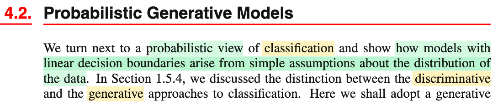
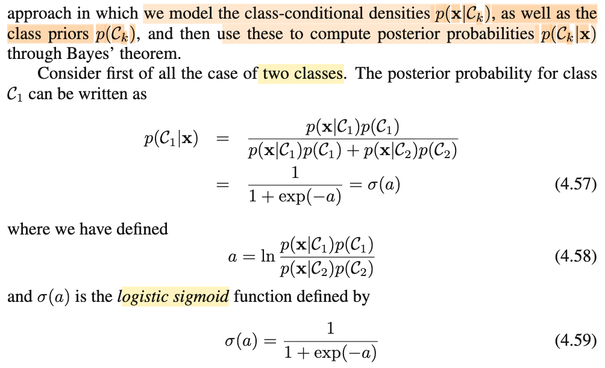
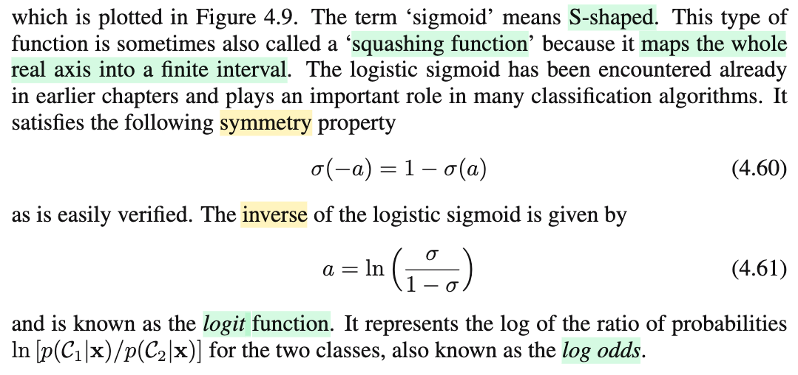
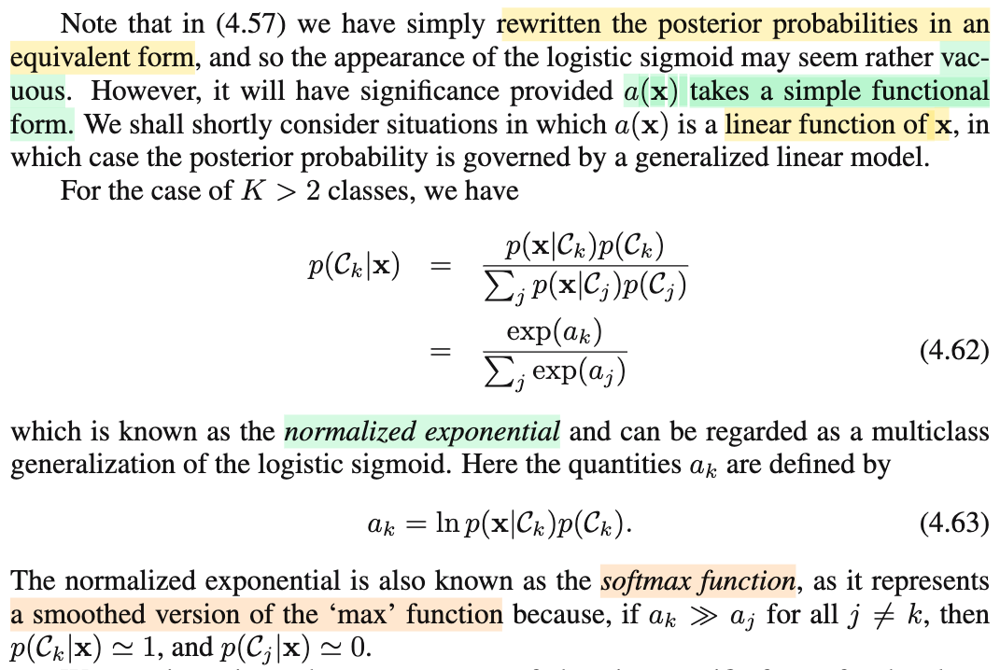

# 4.2 Probabilistic Generative Model

📊 **Progress:** `2` Notes | `4` Screenshots | `2` AI Reviews

---

 

## Section 4.2 Probabilistic Generative Models

<kbd></kbd>

<kbd></kbd>

> [!NOTE]
> Nay qua mô hình xác suất cho bài toán phân loại (bữa giờ là discriminant function, có dạng chỉ là hàm phân loại mà dự đoán của nó không thể được coi như phân phối xác suất)
>
>
>
> Thì ở 1.5.4 cũng đã nói sơ sự khác nhau của discriminative và generative. Đại ý đơn giản là đây đều là mô hình xác suất, nhưng khác ở chỗ với discriminative, ta sẽ train ra trực tiếp phân phối posterior f(𝒞k|𝐱) cho biết với input data 𝐱, xác suất nó thuộc class 𝒞k bằng bao nhiêu. Trong khi đó, với generative, ta sẽ chọn / học ra prior distribution f(𝒞k), sau đó f(𝐱|𝒞k) để có f(𝐱, 𝒞k) là joint distribution. Cuối cùng mới dùng Bayes rule để có f(𝒞k|𝐱) = f(𝐱, 𝒞k)/f(𝐱)
>
>
>
> Có nghĩa là, với generative, ta sẽ có được f(𝐱, 𝒞k), hoặc f(𝐱|𝒞k) trước. Và đây là generative model vì nó cho phép ta phán: Nếu class là 𝒞k, thì 𝐱 sẽ trông như thế nào (giống như bảo "nếu là chó, thì hình ảnh nó sẽ trông như thế nào" (ví dụ bài toán phân loại ảnh chó mèo). Rồi sau khi có distribution  f(𝐱, 𝒞k), ta mới dùng Bayes rule để có f(𝒞k|𝐱) để trả lời câu hỏi "với cái ảnh này, thì xác suất là ảnh chó là bao nhiêu". Còn với discriminative thì ta nhắm thẳng tới việc xây dựng f(𝒞k|𝐱) ngay từ đầu, nên không có generative model.
>
>
>
> ---
>
>
>
> Như vậy thì, nếu K = 2, ta sẽ có công thức như 4.57, không có gì khó hiểu.
>
>
>
> Chỉ có cái mẫu số, f(𝐱) = f(𝐱|𝒞1)f(𝒞1) + f(𝐱|𝒞2)f(𝒞2) , chính là từ LOTP (luật xác suất toàn phần), như sau:
>
>
>
> f(𝐱), là marginal pdf của 𝐗, sẽ là cái có được khi marginalizing joint pdf của 𝐗 và 𝒞: f(𝐱, 𝒞):
>
>
>
> f(𝐱) = Σi=1,2 f(𝐱, 𝒞i) và conditional probability theorem f(𝐱, 𝒞i) = f(𝐱|𝒞i) f(𝒞i)
>
>
>
> ⇒ f(𝐱) = Σi=1,2 f(𝐱|𝒞i) f(𝒞i)
>
>
>
> Nhưng cái này vẫn chưa phải là gốc rễ (LOTP), LOTP là như sau, ôn lại cho vui:
>
>
>
> Giả sử xét X, Y là hai discrete random variable có các possible value x1,x2,...xn và y1,y2,..ym.
>
>
>
> Xét Pmf của X tại x: P(X=x), theo định nghĩa của hàm xác suất, bản chất của nó chính là:
>
>
>
> P({s ∈ Ω: X(s) = x}) (tức event X=x, có bản chất là tập các possible outcome trong original sample space Ω sao cho được X, có bản chất là function map giữa s trong Ω và range 𝒳, map với x)
>
>
>
> = Σ\_{s ∈ Ω: X(s) = x} P({s})
>
>
>
> Xét tập {s ∈ Ω: X(s) = x}, đương nhiên là tập con của Ω, mà theo lí thuyết tập hợp, nếu A ⊆ B thì A ∩ B = A. Do đó {s ∈ Ω: X(s) = x} = {s ∈ Ω: X(s) = x} ∩ Ω
>
>
>
> Và Ω thì có thể thể hiện bởi union của các partition: ∪\_i=1,2,..m {s ∈ Ω: Y(s) = yi} (vì các tập hợp các possible outcome s được map bởi Y tới các possible value khác nhau của Y sẽ tạo nên một partition: disjoint và hợp thành toàn bộ Ω)
>
>
>
> Do đó ta có: {s ∈ Ω: X(s) = x} = {s ∈ Ω: X(s) = x} ∩ \[∪\_i=1,2,..m {s ∈ Ω: Y(s) = yi}\]
>
>
>
> Dùng tính distributive (phân phối): A ∩ (B ∪ C) = (A ∩ B) ∪ (A ∩ C):
>
>
>
> {s ∈ Ω: X(s) = x} = ∪\_i=1,2,..m \[{s ∈ Ω: X(s) = x} ∩ {s ∈ Ω: Y(s) = yi}\]
>
>
>
> và {s ∈ Ω: X(s) = x} ∩ {s ∈ Ω: Y(s) = yi} = {s ∈ Ω: X(s) = x, Y(s) = yi}
>
>
>
> .. ⇔ {s ∈ Ω: X(s) = x} = ∪\_i=1,2,..m \[{s ∈ Ω: X(s) = x, Y(s) = yi}\]
>
>
>
> Nên P({s ∈ Ω: X(s) = x}) = P(∪\_i=1,2,..m \[{s ∈ Ω: X(s) = x, Y(s) = yi}\])
>
>
>
> Vế phải, vì là xác suất của một union các disjoint event, nên theo Axiom 3 của xác suất, nó sẽ là tổng các event, ta có:
>
>
>
> P({s ∈ Ω: X(s) = x}) = Σi=1,2,..m P({s ∈ Ω: X(s) = x, Y(s) = yi})
>
>
>
> ⇔ P(X=x) = Σi=1,2,..m P(X=x, Y=yi), và dùng conditional probability theorem: P(X=x, Y=yi) = P(X=x|Y=yi)P(Y=yi) ta có:
>
>
>
> ..⇔ P(X=x) = Σi=1,2,..m P(X=x|Y=yi)P(Y=yi)
>
>
>
> Và đây chính là Law Of Total Probability LOTP, là gốc rễ của công thức "marginalizing joint pdf/pmf thì được marginal pdf/pmf" cũng là công thức mẫu số của 4.57: f(𝐱) = f(𝐱|𝒞1)f(𝒞1) + f(𝐱|𝒞2)f(𝒞2)
>
>
>
> ---
>
>
>
> Còn đặt a = ln \[p(𝐱|𝒞1)p(𝒞1)/p(𝐱|𝒞2)p(𝒞2)\]  thì p(𝒞1|𝐱) = σ(a) thì cũng dễ hiểu, biến đổi tí sẽ thấy.
>
>
>
> Ý chính là ta gặp lại hàm sigmoid (hay logistic sigmoid) một activation function quan trọng của ML.

> [!TIP]
> 🤖 **AI Check** — 🟢 Pass — ✅ **95/100** · ✓ Move on
>
> Ghi chú nắm rất chắc và sâu sắc về bản chất của mô hình generative so với discriminative, đồng thời chứng minh chi tiết định luật xác suất toàn phần (LOTP) từ không gian mẫu.
>
> **🟡 Minor issues**
>
> **1.** *"f(𝐱), là marginal pdf của 𝐗... Giả sử xét X, Y là hai discrete random variable"*
>
> Trong bài toán tổng quát của giáo trình, $\mathbf{x}$ thường là biến ngẫu nhiên liên tục (có mật độ xác suất pdf), trong khi nhãn lớp $\mathcal{C}_k$ là biến rời rạc. Phần chứng minh LOTP của bạn hoàn toàn chính xác cho trường hợp hai biến rời rạc, nhưng công thức ở mẫu số của 4.57 thực chất là dạng kết hợp giữa hàm mật độ liên tục và phân phối rời rạc.
>
>
> **✓ Strengths**
> - Phân biệt chính xác và trực quan giữa mô hình discriminative (mô hình hóa trực tiếp $p(\mathcal{C}_k|\mathbf{x})$) và generative (mô hình hóa $p(\mathbf{x}|\mathcal{C}_k)$ và $p(\mathcal{C}_k)$).
> - Chứng minh định luật xác suất toàn phần (LOTP) rất bài bản từ các tiên đề xác suất và lý thuyết tập hợp.
>
> **💡 Deeper notes**
> - Biến $a = \ln \frac{p(\mathbf{x}|\mathcal{C}_1)p(\mathcal{C}_1)}{p(\mathbf{x}|\mathcal{C}_2)p(\mathcal{C}_2)}$ chính là log-odds (logit) của xác suất hậu nghiệm $\ln \frac{p(\mathcal{C}_1|\mathbf{x})}{p(\mathcal{C}_2|\mathbf{x})}$, một khái niệm nền tảng giải thích vì sao hàm logistic sigmoid tự nhiên xuất hiện trong bài toán phân loại nhị phân.

**🔗 See also:** [Section 4.2.1 Continuous Inputs](./421_continuous_inputs.md#node-gsbsdud)

 

### Logistic Sigmoid and Logit Function

<kbd></kbd>

<kbd></kbd>

> [!NOTE]
> Tiếp theo đại ý chỉ là vài định nghĩa, như sigmoid có nghĩa là "có dạng hình chữ S", đây cũg là function được gọi là squashing function (squash, tức là ém) hiểu đại khái là vì hàm này nhận input có range từ -inf tới inf và output thì ém lại cho trong khoảng 0,1.
>
>
>
> Hàm này cũng có tính đối xứng: σ(-a) = 1 - σ(a), không khó để chứng minh.
>
>
>
> Và với σ(a) = 1/ (1 + exp(-a)) ⇔ 1 + exp(-a) = 1/σ ⇔ exp(-a) = 1/ σ - 1 ⇔ exp(-a) = (1-σ)/σ
>
> ⇔ -a = ln\[(1-σ)/σ\] ⇔ a = -ln\[(1-σ)/σ\] ⇔ a = ln \[(1-σ)/σ\]⁻¹ ⇔ a = ln \[σ/(1-σ)\], và đây gọi là ln odd
>
>
>
> (trong Casella hay Stat110 đã học với phân phối Bern(p), thì p/(1-p) gọi là odds, xem link)
>
>
>
> ---
>
>
>
> Khi khái quát lên cho K &gt; 2 classes thì
>
>
>
> f(𝒞k|𝐱) = f(𝐱|𝒞k)f(𝒞k)/Σj f(𝐱|𝒞j)f(𝒞j) = exp(ak) / Σj exp(aj), với ak = ln \[f(𝐱|𝒞k)f(𝒞k)\]
>
>
>
> Đây gọi là hàm softmax đã gặp nhiều trong CS231n, CS224n.
>
>
>
> Nó có tên vậy là vì nó là bản "mềm" của hàm max: Đại ý là với hàm max, giả sử trong đám a1, a2, a3 có a3 lớn hơn rất nhiều so với a1, a2 thì xác suất f(𝒞3|𝐱) sẽ ≈ 1 và f(𝒞1|𝐱), f(𝒞2|𝐱) sẽ ≈ 0
>
>
>
> Nói chung phần này chỉ là các định nghĩa, đọc vậy thì biết vậy thôi

> [!TIP]
> 🤖 **AI Check** — 🟢 Pass — ✅ **98/100** · ✓ Move on
>
> Ghi chú rất chính xác, tự biến đổi lại công thức hàm nghịch đảo của sigmoid (logit/log odds) rất rõ ràng và nắm vững bản chất của softmax như một phiên bản làm trơn của hàm max.
>
> **✓ Strengths**
> - Tự biến đổi đại số chính xác từng bước để tìm hàm nghịch đảo của sigmoid ra dạng log-odds.
> - Nắm vững trực giác về 'squashing function' và tính chất xấp xỉ hàm max của hàm softmax khi có một thành phần vượt trội.
> - Liên hệ tốt kiến thức xác suất nền tảng (odds trong phân phối Bernoulli) với khái niệm logit.
>
> **💡 Deeper notes**
> - Thuật ngữ chuẩn trong sách cho hàm nghịch đảo a = ln[σ/(1-σ)] là 'logit function', đại diện cho logit hay 'log odds'.
> - Trong biểu diễn softmax exp(a_k) / ∑ exp(a_j), việc cộng/trừ một hằng số c vào tất cả a_k không làm thay đổi giá trị xác suất đầu ra (tính bất biến tịnh tiến - translation invariance), đây là kỹ thuật quan trọng giúp tránh tràn số (numerical stability) trong thực tế tính toán.

**🔗 See also:** [Ước lượng Odds và Delta Method *(Statistical Inference - Casella)*](../statistical_inference_casella/55_convergence_concepts.md#node-q6etf0o)

 

