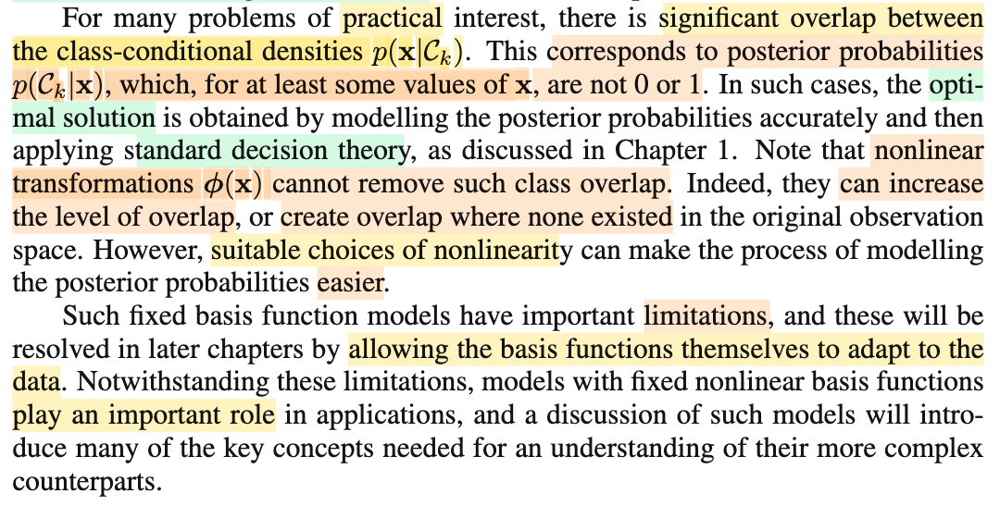
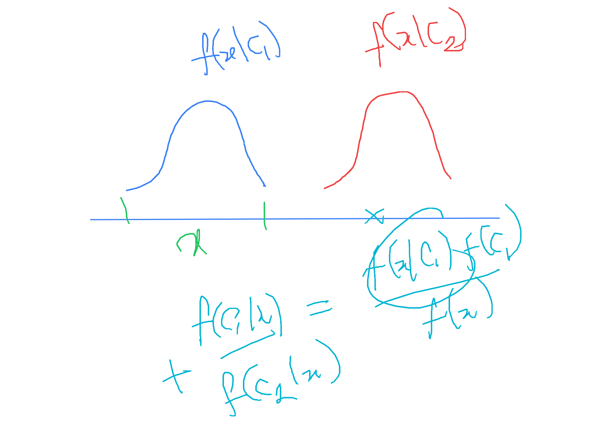

# 4.3.1 Fixed basis functions

📊 **Progress:** `2` Notes | `5` Screenshots | `2` AI Reviews

---

 

## 4.3.1 Fixed Basis Functions

<kbd></kbd>

<kbd></kbd>

<kbd></kbd>

> [!NOTE]
> Đoạn này đại ý là: Với bài toán classification đầu tới giờ, ta chỉ dùng kiểu như feature input gốc 𝐱. Tuy vậy, không ai cấm các mô hình phân loại làm việc với feature đã được transform bằng hàm basis Φ. Và dĩ nhiên là khi đã transform thì giống như ta đã rời bỏ không gian 𝐱 để qua không gian Φ(𝐱), thì khi đó các decision boundary của các mô hình mà ta đang bàn sẽ vẫn là linear (hyperplane) nhưng mà là hyperplane trong không gian Φ(𝐱) chứ không phải / chưa chắc trong không gian 𝐱. 
>
>
>
> Khái niệm basis function thì mình đã gặp ở chapter 3 - bài toán regression rồi. Mục đích chỉ là: biến hàm dự đóan y(𝐱, 𝐰) = 𝐰ᵀΦ(𝐱) thành hàm phi tuyến đối với 𝐱 mà vẫn là tuyến tính đối với 𝐰, giúp ta có thêm sự linh hoạt của function. Và hàm basis này còn nhớ, có mấy loại tiêu biểu, như Gaussian kernel, ...
>
>
>
> Thì ở đây, basis function có một vai trò ví dụ như: nó biến dataset vốn không linearly separable trong không gian feature 𝐱, nhưng trong không gian Φ(𝐱) thì lại có linearly separable. 
>
>
>
> Hình 4.12 minh họa điều này, khi data trong không gian gốc rõ ràng là không linearly separable. Nhưng sau khi tranform, trong không gian Φ, thì chúng lại có tính chất này.

📹 [Xem video trên YouTube](https://www.youtube.com/watch?v=5kKAasvIeGI)

> [!TIP]
> 🤖 **AI Check** — 🟢 Pass — ✅ **95/100** · ✓ Move on
>
> Ghi chú nắm rất chắc và diễn đạt mạch lạc tư tưởng cốt lõi của phần 4.3.1: ánh xạ phi tuyến qua các hàm cơ sở giúp biên quyết định tuyến tính trong không gian đặc trưng trở thành biên phi tuyến trong không gian gốc.
>
> **🟡 Minor issues**
>
> **1.** *"Gaussian kernel, ..."*
>
> Ở chương 3 và 4 tác giả dùng thuật ngữ 'Gaussian basis functions' (hàm cơ sở Gauss). Dù trong thực tế hai khái niệm có liên hệ mật thiết, thuật ngữ 'kernel' thường mang ý nghĩa kỹ thuật cụ thể hơn (hàm nhân tính tích vô hướng trong không gian đối ngẫu) sẽ được học riêng ở chương 6.
>
>
> **✓ Strengths**
> - Hiểu rõ bản chất việc ánh xạ qua phi: biên quyết định là siêu phẳng (tuyến tính) trong không gian phi(x), nhưng tương ứng với đường cong phi tuyến trong không gian x gốc.
> - Liên hệ chính xác với kiến thức hồi quy tuyến tính ở chương 3 về tính chất 'tuyến tính theo tham số w nhưng phi tuyến theo x'.
> - Đọc và giải thích đúng ý nghĩa trực quan của Hình 4.12 về khả năng phân tách tuyến tính (linearly separable) sau biến đổi.
>
> **💡 Deeper notes**
> - Văn bản gốc lưu ý việc đặt một hàm cơ sở là hằng số phi_0(x) = 1 để tham số tương ứng w_0 đóng vai trò là hệ số chệch (bias term).
> - Trong Hình 4.12, không gian đặc trưng phi(x) cũng có số chiều bằng 2 (dùng 2 tâm Gauss), cho thấy việc tạo ra tính phân tách tuyến tính không nhất thiết phải tăng số chiều của dữ liệu lên cao hơn.

 

### Limitations of Fixed Basis Functions

<kbd></kbd>

<kbd></kbd>

> [!NOTE]
> Đoạn này đại ý là nói về việc, có khi class conditinal density bị chồng lấn. Là sao?
>
> \
> Để hiểu, ta xét case nếu không chồng lấn, và K=2, thì là vầy nè: f(𝐱|𝒞1) và f(𝐱|𝒞2) giả sử là hai phân phối normal, và chúng làm thành hai quả chuông đứng cạnh nhau, mà không giẫm chân nhau. Khi đó đồng nghĩa, không có chỗ nào mà f(𝐱|𝒞1) và f(𝐱|𝒞2) cùng dương
>
> \
> Và khi đó, với 𝐱 cho trước, thì chắc chắn một trong hai f(𝐱|𝒞1), f(𝐱|𝒞2) phải bằng 0. Ví dụ, f(𝐱|𝒞1) = 0, f(𝐱|𝒞2) khác 0. Hình dung hai quả chuông Normal (coi như phân phối nào đó giống giống chứ ko phải Normal vì normal thì cái đuôi kéo dài về vô cực) nếu ta xét 𝐱 trong phạm vi quả chuông thứ nhất, thì f(𝐱|𝒞2) = 0, nhưng không phải là f(𝐱|𝒞1) = 1 nhé)
>
> \
> Khi đó, thông qua Bayes rule để có class posterior, f(𝒞1|𝐱) = f(𝐱|𝒞1)f(𝒞1)/f(𝐱) và f(𝒞2|𝐱) = f(𝐱|𝒞2)f(𝒞2)/f(𝐱) thì f(𝒞2|𝐱) sẽ = 0, và lúc này thì mới ok khi nói suy ra f(𝒞1|𝐱) = 1
>
> \
> (chú ý nhắc lại, f(𝐱|𝒞2) = 0 không thể suy ra f(𝐱|𝒞1) = 1, vì chả có lí do gì, ta chỉ có thể nói là vì chúng không chồng lấn thì khi 𝐱 khiến một cái dương thì cái kia phải = 0 thôi. Trong khi đó, ở case sau: f(𝒞1|𝐱) và f(𝒞2|𝐱) thì đúng là có tổng bằng 1 do axiom 2 của lý thuyết xác suất, nên  f(𝒞2|𝐱) = 0 thì cái kia = 1)
>
> \
> Thế thì quay lại đây, đại ý muốn nói là việc xài hàm basis không giúp biến "đang có sự chồng lấn giữa các class conditional density" thành hết chồng lấn (theo cách cái mà "có thể với 𝐱 thì không linear separable còn sau khi transform thì có"), mà thậm chí nó còn có thể tạo ra vùng chồng lấn lớn hơn nữa. Nói chung đây là nói về nhược điểm nhưng dù sao đi nữa, việc chọn hàm basis tốt có thể giúp ta dễ dàng hơn.
>
> \
> Cuối cùng là một ý, đại khái nói là ở đây ta vẫn dùng fixed basis function, vốn mang nhược điểm kiểu như là cứng nhắc quá, để rồi sau này, ta sẽ cho mô hình learn chính cái basis function luôn (nghe nói là thấy liên tưởng tới neural network và deep learning rồi, vì nhưng cái này sẽ cho mô hình tự học ra cách represent data)

> [!TIP]
> 🤖 **AI Check** — 🟢 Pass — ✅ **95/100** · ✓ Move on
>
> Ghi chú thể hiện sự hiểu biết rất sâu sắc và trực quan về khái niệm class overlap, phân biệt chuẩn xác giữa mật độ xác suất và xác suất hậu nghiệm (posterior), cũng như liên hệ đúng đắn giữa adaptive basis functions với deep learning.
>
> **🟡 Minor issues**
>
> **1.** *"f(𝒞1|𝐱) = f(𝐱|𝒞1)f(𝒞1)/f(𝐱)"*
>
> Ký hiệu f thường dùng cho hàm mật độ xác suất (pdf) của biến liên tục x, trong khi với biến nhãn lớp rời rạc 𝒞k thì đây là xác suất rời rạc p(𝒞k|x) hoặc P(𝒞k|x). Việc dùng chung ký hiệu f là cách viết tắt không chính thức nhưng không ảnh hưởng bản chất toán học.
>
>
> **✓ Strengths**
> - Phân biệt rất chuẩn xác giữa giá trị mật độ f(x|𝒞k) (không bị chặn trên ở 1 và tích phân mới bằng 1) với xác suất hậu nghiệm f(𝒞k|x) (bị chặn [0, 1] và tổng các lớp bằng 1).
> - Hiểu rõ bản chất vì sao biến đổi phi tuyến không thể xóa bỏ class overlap (vì overlap là tính bất định nội tại của dữ liệu khi cùng một x có thể sinh ra từ nhiều class khác nhau).
> - Nhận thức đúng đắn rằng dạng phân phối Normal có đuôi kéo dài vô cực nên về mặt lý thuyết thuần túy luôn có overlap, do đó đã liên hệ trực giác sang phân phối có giá mang (support) hữu hạn.
> - Liên hệ rất chính xác ý tưởng 'cho phép basis function tự thích ứng với dữ liệu' chính là cốt lõi của representation learning trong Neural Networks / Deep Learning.
>
> **💡 Deeper notes**
> - Về mặt toán học, lý do biến đổi phi tuyến deterministic ϕ(x) không thể xóa bỏ class overlap là vì ϕ là một hàm đơn trị: nếu hai mẫu dữ liệu từ hai lớp khác nhau cùng nằm tại đúng một vị trí x, thì sau biến đổi chúng vẫn luôn rơi vào cùng một điểm ϕ(x) duy nhất. Thậm chí nếu ϕ là ánh xạ nhiều-về-một (non-injective), nó còn gộp các điểm x tách biệt lại thành một điểm ϕ(x), làm tăng mức độ chồng lấn.

 

