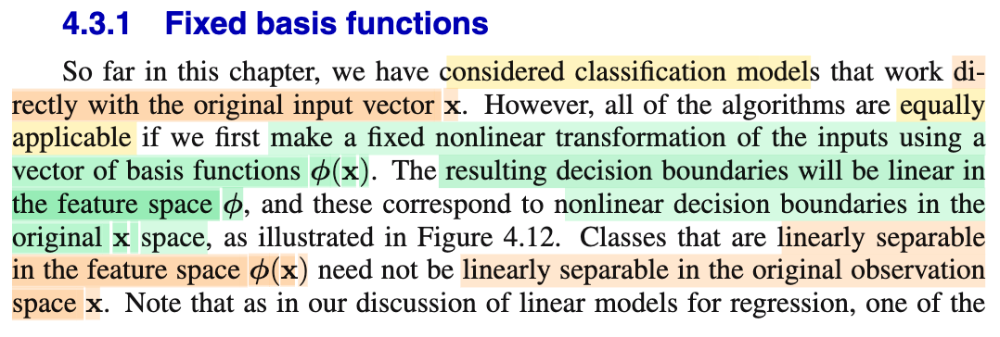
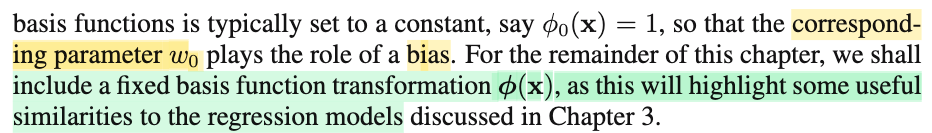
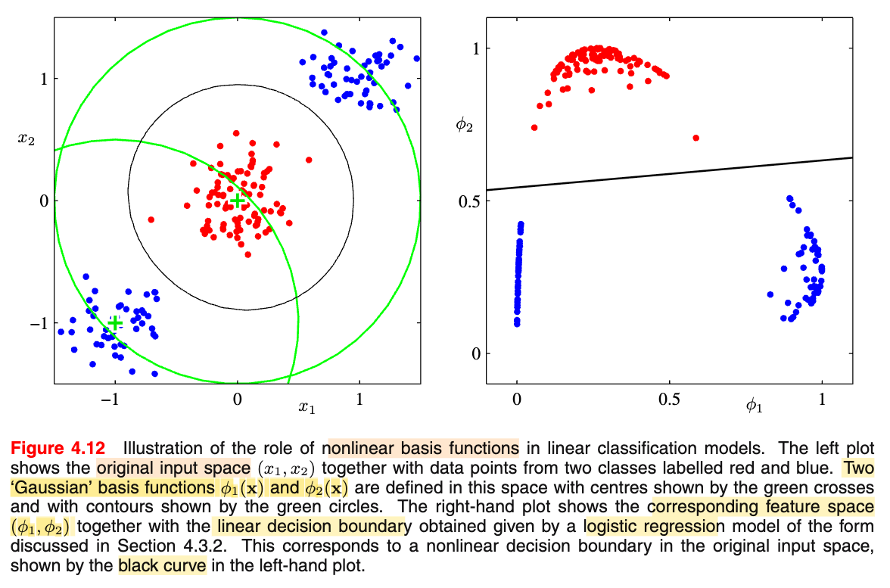

# 4.3.1 Fixed basis functions

📊 **Progress:** `1` Notes | `3` Screenshots | `1` AI Reviews

---

 

## 4.3.1 Fixed Basis Functions

<kbd></kbd>

<kbd></kbd>

<kbd></kbd>

> [!NOTE]
> Đoạn này đại ý là: Với bài toán classification đầu tới giờ, ta chỉ dùng kiểu như feature input gốc 𝐱. Tuy vậy, không ai cấm các mô hình phân loại làm việc với feature đã được transform bằng hàm basis Φ. Và dĩ nhiên là khi đã transform thì giống như ta đã rời bỏ không gian 𝐱 để qua không gian Φ(𝐱), thì khi đó các decision boundary của các mô hình mà ta đang bàn sẽ vẫn là linear (hyperplane) nhưng mà là hyperplane trong không gian Φ(𝐱) chứ không phải / chưa chắc trong không gian 𝐱. 
>
>
>
> Khái niệm basis function thì mình đã gặp ở chapter 3 - bài toán regression rồi. Mục đích chỉ là: biến hàm dự đóan y(𝐱, 𝐰) = 𝐰ᵀΦ(𝐱) thành hàm phi tuyến đối với 𝐱 mà vẫn là tuyến tính đối với 𝐰, giúp ta có thêm sự linh hoạt của function. Và hàm basis này còn nhớ, có mấy loại tiêu biểu, như Gaussian kernel, ...
>
>
>
> Thì ở đây, basis function có một vai trò ví dụ như: nó biến dataset vốn không linearly separable trong không gian feature 𝐱, nhưng trong không gian Φ(𝐱) thì lại có linearly separable. 
>
>
>
> Hình 4.12 minh họa điều này, khi data trong không gian gốc rõ ràng là không linearly separable. Nhưng sau khi tranform, trong không gian Φ, thì chúng lại có tính chất này.

> [!TIP]
> 🤖 **AI Check** — 🟢 Pass — ✅ **95/100** · ✓ Move on
>
> Ghi chú nắm rất chắc và diễn đạt mạch lạc tư tưởng cốt lõi của phần 4.3.1: ánh xạ phi tuyến qua các hàm cơ sở giúp biên quyết định tuyến tính trong không gian đặc trưng trở thành biên phi tuyến trong không gian gốc.
>
> **🟡 Minor issues**
>
> **1.** *"Gaussian kernel, ..."*
>
> Ở chương 3 và 4 tác giả dùng thuật ngữ 'Gaussian basis functions' (hàm cơ sở Gauss). Dù trong thực tế hai khái niệm có liên hệ mật thiết, thuật ngữ 'kernel' thường mang ý nghĩa kỹ thuật cụ thể hơn (hàm nhân tính tích vô hướng trong không gian đối ngẫu) sẽ được học riêng ở chương 6.
>
>
> **✓ Strengths**
> - Hiểu rõ bản chất việc ánh xạ qua phi: biên quyết định là siêu phẳng (tuyến tính) trong không gian phi(x), nhưng tương ứng với đường cong phi tuyến trong không gian x gốc.
> - Liên hệ chính xác với kiến thức hồi quy tuyến tính ở chương 3 về tính chất 'tuyến tính theo tham số w nhưng phi tuyến theo x'.
> - Đọc và giải thích đúng ý nghĩa trực quan của Hình 4.12 về khả năng phân tách tuyến tính (linearly separable) sau biến đổi.
>
> **💡 Deeper notes**
> - Văn bản gốc lưu ý việc đặt một hàm cơ sở là hằng số phi_0(x) = 1 để tham số tương ứng w_0 đóng vai trò là hệ số chệch (bias term).
> - Trong Hình 4.12, không gian đặc trưng phi(x) cũng có số chiều bằng 2 (dùng 2 tâm Gauss), cho thấy việc tạo ra tính phân tách tuyến tính không nhất thiết phải tăng số chiều của dữ liệu lên cao hơn.

 

