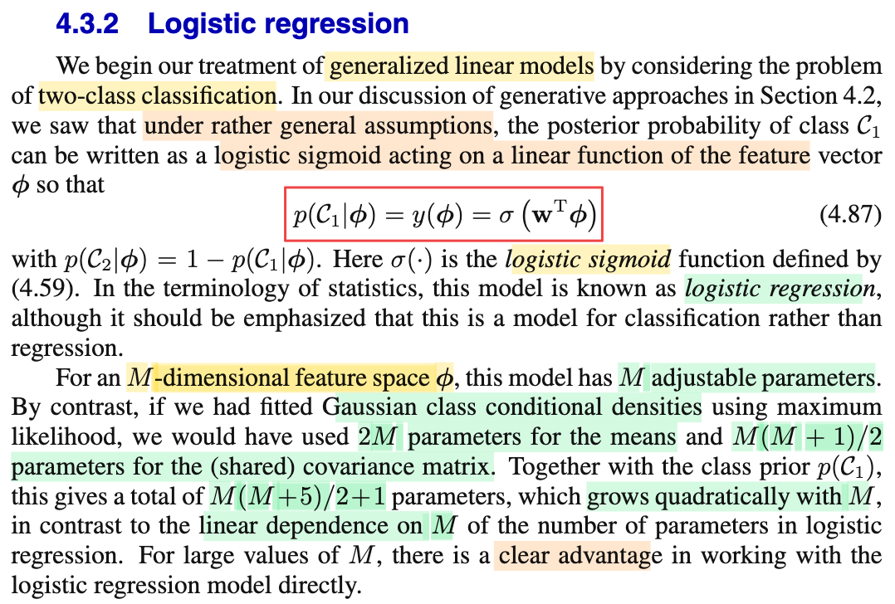

# 4.3.2 Logistic regression

📊 **Progress:** `1` Notes | `1` Screenshots | `1` AI Reviews

---

 

## 4.3.2 Logistic Regression

<kbd></kbd>

> [!NOTE]
> Rồi, đoạn này nói qua Logistic regression mà trong phần trước (xem link) ta đã hiểu sơ:
>
>
>
> Nói một cách cực kì ngắn gọn: thì thông qua việc trong những phần trước ta thấy rẳng nếu ta đặt ra giả định nào đó cho class conditional density f(𝐱|𝒞k) (ví dụ là normal, có chung 𝚺, khác 𝛍k, hay là exponential family có chung scale param s) thì kết quả sẽ cho thấy class posterior f(𝒞k|𝐱) sẽ có dạng của generalized linear model: σ(𝐰ᵀ𝐱 + w0) (nói cách khác, với các giả định trên thì a = ln f(𝐱|𝒞1)f(𝒞1)/f(𝐱|𝒞2)f(𝒞2) sẽ là hàm tuyến tính đối với 𝐱) (câu chuyện cũng tương tự với K &gt; 2)
>
>
>
> Vậy thì ở đây, để khỏi phải "có được generalized linear model" một cách gián tiếp theo kiểu này, ta sẽ phang luôn giả định rằng cái class posterior f(𝒞k|𝐱) là hàm generalized linear: σ(𝐰ᵀΦ) với Φ là transformation nào đó của 𝐱.
>
>
>
> Và mô hình này, gọi là **logistic regression**.
>
>
>
> ---
>
>
>
> Thế thì, trong phần trước, ta cũng đã nghe gs nói làm kiểu này sẽ ít params hơn, và ở đây tính thử cụ thể xem ít hơn thế nào:
>
>
>
> Đầu tiên, ông nói với M-dimensional feature space Φ thì ta có M adjustable parameters, là sao?
>
>
>
> Đơn giản thôi: input gốc là 𝐱, có thể là D chiều (vector 𝐱 có D phần tử x1,...xD). Thì 𝐰ᵀΦ, tức là 𝐰ᵀΦ(𝐱), = w0 Φ0(𝐱) + w1 Φ1(𝐱) + ...+ wM-1 ΦM-1(𝐱). Thì M là con số mà ta chọn: Ta chọn dùng M hàm basis Φ0(𝐱),...ΦM-1(𝐱). (cái này giống như set up của chapter 3 vậy, mà trong đó ta Φ0(𝐱) = 1 nhớ ko). Thì như vậy Φ(𝐱) là vector M chiều chứ gì nữa: \[Φ0(𝐱),...ΦM-1(𝐱)\]ᵀ, và dĩ nhiên tương ứng ta có M tham số w0,...wM-1, và dùng M hàm basis function. Và khi training mô hình chính là đi tìm giá trị của M thằng wi này nhờ data.
>
>
>
> Như vậy, kích thước mô hình chỉ là tăng tuyến tính theo M.
>
>
>
> Trong khi đó, nếu theo con đường gián tiếp nói ở trên để có generalized linear model, ta sẽ phải tìm (gọi là fit, hay learn) bao nhiêu tham số?
>
>
>
> Với 2 class, còn và giả định normal, có chung 𝚺 thì f(𝐱|𝒞1) = 𝒩(𝐱|𝛍1, 𝚺), f(𝐱|𝒞2) = 𝒩(𝐱|𝛍2, 𝚺), thì giả sử 𝐱 là vector M chiều luôn, thì 𝛍 cũng là vector M chiều, 𝚺 là matrix M × M nhưng vì đối xứng nên chỉ có M(M+1)/2 con số khác nhau. Vậy riêng phần hai cái class conditional density đã cần 2M (của hai cái vector 𝛍1, 𝛍2) + M(M+1)/2 (của 𝚺) = 2M + M(M+1)/2 parameter rồi. Chưa kể, ta còn phải inference tham số của class prior f(𝒞1): là Bern(π) nữa, tức là tốn 1 parameter nữa. Tổng cộng 2M + M(M+1)/2 + 1 = 4M/2 + M(M+1)/2 + 1 = M(4 + M + 1)/2 + 1 = M(M + 5)/2 + 1
>
>
>
> Và như vậy nó (số parameter) sẽ tăng quadratic theo M
>
>
>
> Do đó rõ ràng là dùng cách direct sẽ tốn ít parameter hơn, dĩ nhiên sẽ hiệu quả hơn vì mục đích cuối cùng là có generalized linear model.

> [!TIP]
> 🤖 **AI Check** — 🟢 Pass — ✅ **95/100** · ✓ Move on
>
> Ghi chú nắm rất chắc và chính xác bản chất của logistic regression dưới góc nhìn discriminative vs generative model, giải thích cặn kẽ số lượng tham số cần ước lượng giữa hai hướng tiếp cận.
>
> **🟡 Minor issues**
>
> **1.** *"thì giả sử 𝐱 là vector M chiều luôn, thì 𝛍 cũng là vector M chiều, 𝚺 là matrix M × M"*
>
> Trong đoạn so sánh tham số ở sách giáo khoa, tác giả ngầm hiểu việc fit Gaussian là trên không gian đặc trưng phi(x) có số chiều M (feature space phi), chứ không nhất thiết là trực tiếp trên không gian x gốc (dù về mặt tính toán đại số số lượng tham số theo chiều M là tương đương).
>
>
> **✓ Strengths**
> - Giải thích rất rõ ràng nguồn gốc: thay vì đi đường vòng giả định class-conditional rồi suy ra posterior thì trực tiếp mô hình hóa posterior bằng hàm sigmoid tác động lên tổ hợp tuyến tính.
> - Bóc tách cực kỳ chính xác số lượng tham số của mô hình Gaussian generative (2 vector kỳ vọng, ma trận hiệp phương sai đối xứng và prior Bernoulli), dẫn ra công thức M(M+5)/2 + 1 rất trực quan.
> - Hiểu đúng vai trò của vector đặc trưng M chiều bao gồm cả bias (phi_0 = 1) tương tự setup trong hồi quy tuyến tính.
>
> **💡 Deeper notes**
> - Dù mô hình discriminative (logistic regression) có ít tham số hơn nhiều và thường tối ưu hơn khi phân loại thuần túy, mô hình generative lại có ưu điểm là xử lý tốt missing data hoặc dễ dàng phát hiện mẫu ngoại lai (outlier detection) do nó mô hình hóa phân phối đầy đủ p(x).

**🔗 See also:** [Section 4.3 Probabilistic Discriminative Models](./43_probabilistic_discriminative_models.md#node-nop86oc)

 

