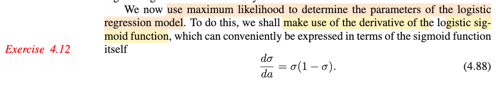
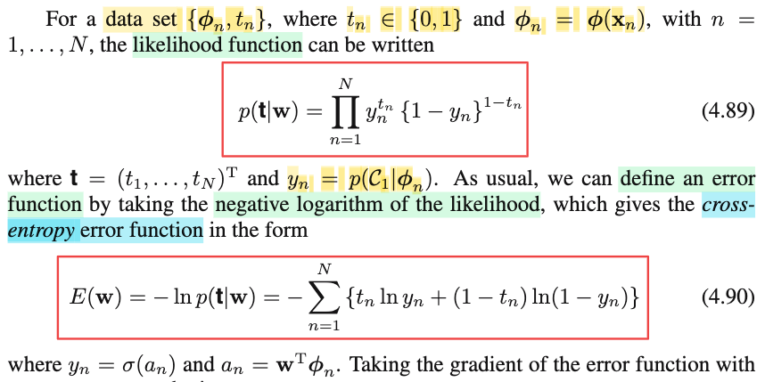
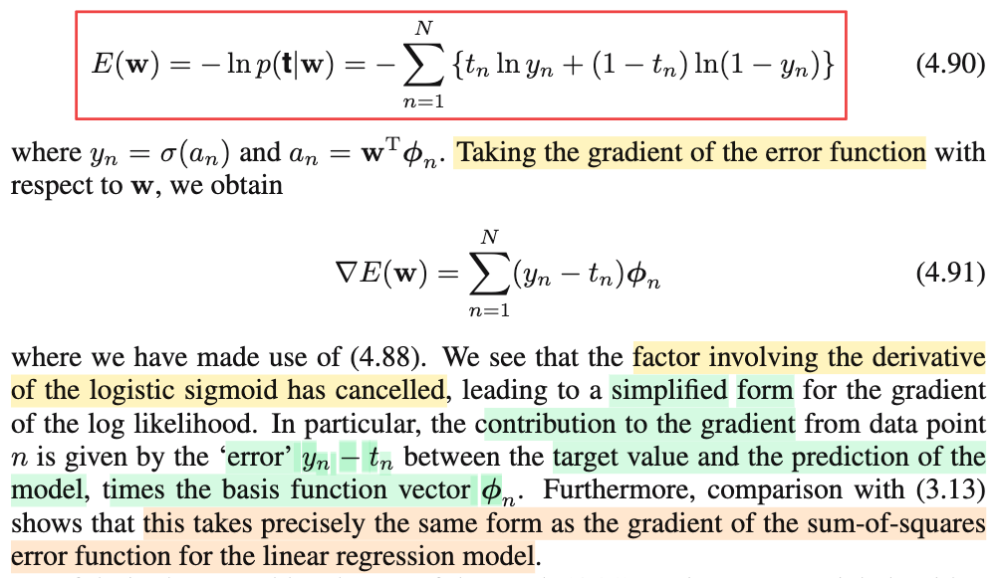

# 4.3.2 Logistic regression

📊 **Progress:** `4` Notes | `4` Screenshots | `4` AI Reviews

---

 

## 4.3.2 Logistic Regression

<kbd></kbd>

> [!NOTE]
> Rồi, đoạn này nói qua Logistic regression mà trong phần trước (xem link) ta đã hiểu sơ:
>
>
>
> Nói một cách cực kì ngắn gọn: thì thông qua việc trong những phần trước ta thấy rẳng nếu ta đặt ra giả định nào đó cho class conditional density f(𝐱|𝒞k) (ví dụ là normal, có chung 𝚺, khác 𝛍k, hay là exponential family có chung scale param s) thì kết quả sẽ cho thấy class posterior f(𝒞k|𝐱) sẽ có dạng của generalized linear model: σ(𝐰ᵀ𝐱 + w0) (nói cách khác, với các giả định trên thì a = ln f(𝐱|𝒞1)f(𝒞1)/f(𝐱|𝒞2)f(𝒞2) sẽ là hàm tuyến tính đối với 𝐱) (câu chuyện cũng tương tự với K &gt; 2)
>
>
>
> Vậy thì ở đây, để khỏi phải "có được generalized linear model" một cách gián tiếp theo kiểu này, ta sẽ phang luôn giả định rằng cái class posterior f(𝒞k|𝐱) là hàm generalized linear: σ(𝐰ᵀΦ) với Φ là transformation nào đó của 𝐱.
>
>
>
> Và mô hình này, gọi là **logistic regression**.
>
>
>
> ---
>
>
>
> Thế thì, trong phần trước, ta cũng đã nghe gs nói làm kiểu này sẽ ít params hơn, và ở đây tính thử cụ thể xem ít hơn thế nào:
>
>
>
> Đầu tiên, ông nói với M-dimensional feature space Φ thì ta có M adjustable parameters, là sao?
>
>
>
> Đơn giản thôi: input gốc là 𝐱, có thể là D chiều (vector 𝐱 có D phần tử x1,...xD). Thì 𝐰ᵀΦ, tức là 𝐰ᵀΦ(𝐱), = w0 Φ0(𝐱) + w1 Φ1(𝐱) + ...+ wM-1 ΦM-1(𝐱). Thì M là con số mà ta chọn: Ta chọn dùng M hàm basis Φ0(𝐱),...ΦM-1(𝐱). (cái này giống như set up của chapter 3 vậy, mà trong đó ta Φ0(𝐱) = 1 nhớ ko). Thì như vậy Φ(𝐱) là vector M chiều chứ gì nữa: \[Φ0(𝐱),...ΦM-1(𝐱)\]ᵀ, và dĩ nhiên tương ứng ta có M tham số w0,...wM-1, và dùng M hàm basis function. Và khi training mô hình chính là đi tìm giá trị của M thằng wi này nhờ data.
>
>
>
> Như vậy, kích thước mô hình chỉ là tăng tuyến tính theo M.
>
>
>
> Trong khi đó, nếu theo con đường gián tiếp nói ở trên để có generalized linear model, ta sẽ phải tìm (gọi là fit, hay learn) bao nhiêu tham số?
>
>
>
> Với 2 class, còn và giả định normal, có chung 𝚺 thì f(𝐱|𝒞1) = 𝒩(𝐱|𝛍1, 𝚺), f(𝐱|𝒞2) = 𝒩(𝐱|𝛍2, 𝚺), thì giả sử 𝐱 là vector M chiều luôn, thì 𝛍 cũng là vector M chiều, 𝚺 là matrix M × M nhưng vì đối xứng nên chỉ có M(M+1)/2 con số khác nhau. Vậy riêng phần hai cái class conditional density đã cần 2M (của hai cái vector 𝛍1, 𝛍2) + M(M+1)/2 (của 𝚺) = 2M + M(M+1)/2 parameter rồi. Chưa kể, ta còn phải inference tham số của class prior f(𝒞1): là Bern(π) nữa, tức là tốn 1 parameter nữa. Tổng cộng 2M + M(M+1)/2 + 1 = 4M/2 + M(M+1)/2 + 1 = M(4 + M + 1)/2 + 1 = M(M + 5)/2 + 1
>
>
>
> Và như vậy nó (số parameter) sẽ tăng quadratic theo M
>
>
>
> Do đó rõ ràng là dùng cách direct sẽ tốn ít parameter hơn, dĩ nhiên sẽ hiệu quả hơn vì mục đích cuối cùng là có generalized linear model.

📹 [Xem video trên YouTube](https://www.youtube.com/watch?v=YN8gyl1HEAA)

> [!TIP]
> 🤖 **AI Check** — 🟢 Pass — ✅ **95/100** · ✓ Move on
>
> Ghi chú nắm rất chắc và chính xác bản chất của logistic regression dưới góc nhìn discriminative vs generative model, giải thích cặn kẽ số lượng tham số cần ước lượng giữa hai hướng tiếp cận.
>
> **🟡 Minor issues**
>
> **1.** *"thì giả sử 𝐱 là vector M chiều luôn, thì 𝛍 cũng là vector M chiều, 𝚺 là matrix M × M"*
>
> Trong đoạn so sánh tham số ở sách giáo khoa, tác giả ngầm hiểu việc fit Gaussian là trên không gian đặc trưng phi(x) có số chiều M (feature space phi), chứ không nhất thiết là trực tiếp trên không gian x gốc (dù về mặt tính toán đại số số lượng tham số theo chiều M là tương đương).
>
>
> **✓ Strengths**
> - Giải thích rất rõ ràng nguồn gốc: thay vì đi đường vòng giả định class-conditional rồi suy ra posterior thì trực tiếp mô hình hóa posterior bằng hàm sigmoid tác động lên tổ hợp tuyến tính.
> - Bóc tách cực kỳ chính xác số lượng tham số của mô hình Gaussian generative (2 vector kỳ vọng, ma trận hiệp phương sai đối xứng và prior Bernoulli), dẫn ra công thức M(M+5)/2 + 1 rất trực quan.
> - Hiểu đúng vai trò của vector đặc trưng M chiều bao gồm cả bias (phi_0 = 1) tương tự setup trong hồi quy tuyến tính.
>
> **💡 Deeper notes**
> - Dù mô hình discriminative (logistic regression) có ít tham số hơn nhiều và thường tối ưu hơn khi phân loại thuần túy, mô hình generative lại có ưu điểm là xử lý tốt missing data hoặc dễ dàng phát hiện mẫu ngoại lai (outlier detection) do nó mô hình hóa phân phối đầy đủ p(x).

**🔗 See also:** [Section 4.3 Probabilistic Discriminative Models](./43_probabilistic_discriminative_models.md#node-nop86oc)

 

### Derivative of Logistic Sigmoid Function

<kbd></kbd>

> [!NOTE]
> Để chuẩn bị cho việc đi tìm MLE của các tham số của mô hình logistic regression này, ta sẽ chuẩn bị đạo hàm của hàm sigmoid trước, đây cũng là bài tập, nên ta sẽ làm luôn.
>
>
>
> Theo công thức σ(a) = 1/\[1+exp(-a)\] = \[1+exp(-a)\]⁻¹
>
>
>
> σ'(a) = d/da \[1+exp(-a)\]⁻¹
>
>
>
> = d/d\[1+exp(-a)\] \[1+exp(-a)\]⁻¹ . d/da \[1+exp(-a)\] (chain rule)
>
>
>
> = -\[1+exp(-a)\]⁻² . d/da \[1+exp(-a)\]
>
>
>
> = -\[1+exp(-a)\]⁻² . d/da exp(-a)
>
>
>
> = -\[1+exp(-a)\]⁻² . d/d(-a) exp(-a) . d/da (-a) (chain rule)
>
>
>
> = -\[1+exp(-a)\]⁻² . exp(-a) . (-1)
>
>
>
> = \[1+exp(-a)\]⁻² exp(-a)
>
>
>
> = exp(-a)/\[1+exp(-a)\]² (1)
>
>
>
> ---
>
>
>
> Biến đổi σ(a)(1-σ(a))
>
>
>
> = 1/\[1+exp(-a)\] \[1 - 1/\[1+exp(-a)\]\]
>
>
>
> = 1/\[1+exp(-a)\] {(1 + exp(-a) - 1)/\[1+exp(-a)\]}
>
>
>
> = 1/\[1+exp(-a)\] {exp(-a)/\[1+exp(-a)\]}
>
>
>
> = exp(-a)/\[1+exp(-a)\]² bằng (1) → chứng minh xong.

📹 [Xem video trên YouTube](https://www.youtube.com/watch?v=W4pQ_271eXE)

> [!TIP]
> 🤖 **AI Check** — 🟢 Pass — ✅ **100/100** · ✓ Move on
>
> Ghi chú rất xuất sắc, bạn đã tự thực hiện đầy đủ các bước đạo hàm bằng quy tắc chuỗi (chain rule) và chứng minh đẳng thức một cách rõ ràng, chính xác.
>
> **✓ Strengths**
> - Áp dụng quy tắc chuỗi (chain rule) rất chi tiết và chuẩn xác từng bước đạo hàm hàm hợp.
> - Chứng minh đẳng thức chặt chẽ bằng cách tính vế trái và rút gọn vế phải về cùng một dạng biểu thức.
>
> **💡 Deeper notes**
> - Từ biểu thức đạo hàm (1), bạn cũng có thể biến đổi trực tiếp thành σ(1 - σ) bằng cách tách tử số: exp(-a)/[1+exp(-a)]² = {1/[1+exp(-a)]} * {[1 + exp(-a) - 1]/[1+exp(-a)]} = σ(a)[1 - σ(a)] mà không cần tính riêng vế phải.

 

#### Cross-Entropy Error Function Gradient

<kbd></kbd>

> [!NOTE]
> Để hiểu chỗ này, cần nhắc lại chút bối cảnh:
>
>
>
> Đại khái là bữa trước, ta đã nói về một sự chuyển dịch: Ta sẽ có được **generalized linear model** f(𝒞1|𝐱) = σ(a1), với a1 = ln \[f(𝐱|𝒞1)f(𝒞1)/f(𝐱|𝒞2)f(𝒞2)\] là một linear function của 𝐱 nếu như ta giả định class conditional density f(𝐱|𝒞1), f(𝐱|𝒞2) đều là normal khác mean và có chung covariance matrix. Nếu không giả định normal mà dùng giả định exponential family có chung scale parameter thì cũng được. Thì đây có thể xem như cách làm gián tiếp để có được generalized linear model.
>
>
>
> Vậy thì thay vì phải dựa trên những giả định cần thiết mới có được class posterior distribution f(𝒞1|𝐱) có dạng dạng generalized linear model - sigmoid của một hàm tuyến tính theo 𝐱, ta sẽ phang thẳng giả định này vào f(𝒞1|𝐱) luôn. Có nghĩa là ta sẽ đặt luôn giả định rằng f(𝒞1|𝐱) có dạng σ(𝐰ᵀΦ(𝐱)). Điều này sẽ giúp số paramters giảm đi đáng kể so với cách làm kia, mang lại nhiều ưu điểm.
>
>
>
> Thế thì, bối cảnh bài toán ban đầu là ta có dataset (𝐱1, t1),...(𝐱N, tN). Transform input 𝐱 bởi Φ ta chuyển feature space từ D-dimensional 𝐱 = \[x1,...xD\]ᵀ, sang M-dimensional Φ = \[Φ1(𝐱),...ΦM(𝐱)\]ᵀ giúp mang lại vài lợi ích như có thể khiến data gốc đang không linearly separable trở nên linearly separable trong không gian feature mới Φ.
>
>
>
> Như vậy coi như giờ ta có dataset mới: (Φ(𝐱1), t1),....(Φ(𝐱N), tN), hay viết gọn hơn là: (Φ1, t1),....(ΦN, tN)
>
>
>
> (Φ(𝐱1) = \[Φ1(𝐱1),...ΦM(𝐱1)\])
>
>
>
> Thế thì, ta sẽ đi tìm 𝐰, tham số của mô hình, thông qua phương pháp MLE. Như thường lệ, sẽ có ích nếu ta nhắc lại cái khung của bài toán point estimation bằng MLE.
>
>
>
> Trong Casella, bàn toán point estimation là cho ta observed data của một random sample iid 𝐗 = X1,...Xn, \~ f(x|θ) (iid nghĩa là đám random variable Xi này đều độc lập (mutually independent) và có chung distribution f(x|θ) (identically distributed). Nhiệm vụ của point estimation là đi tìm một hàm số của sample W(𝐗), và dùng nó để estimate cho θ. Để với observed value 𝐱 của 𝐗 thì ta sẽ có W(𝐱), là giá trị ước lượng của θ. W(𝐗) được gọi là một point estimator của θ và theo định nghĩa, nó có thể là bất kì hàm số nào của sample 𝐗 (xem link qua định nghĩa của estimator sách Casella). Nhưng để có estimator tốt thì ta có vài phương pháp. Điển hình nhất là dùng hàm số sau: W(𝐱) = argmax\_θ L(θ|𝐱). Với L(θ|𝐱) được define là hàm số của θ, mang ý nghĩa là: với data quan sát được như vậy (𝐗 = 𝐱), thì với input θ, thì độ hợp lí của nó là bao nhiêu để giải thích cho việc thấy data như vậy, và giá trị của nó người ta đặt cho bằng f(𝐱|θ), tức joint pdf/pmf của random sample 𝐗 tại 𝐱.
>
>
>
> Nên nhiệm vụ để tìm W(𝐱), chính là đi giải bài toán tối ưu: maximize\_θ L(θ|𝐱) = f(𝐱|θ), và theo tính iid, = Πi=1:N f(xi|θ). Và toán tối ưu cho phép ta chuyển thành bài toán tương đương: ln L(θ|𝐱)
>
>
>
> Vậy ở đây cần xác định xem likelihood là gì?
>
>
>
> Theo cái khung thì θ ở đây chính là 𝐰, L(θ|𝐱) = L(θ|x1,...xn) chính là L(𝐰|data) với data ở đây là tất cả các cặp (Φ1, t1),...(ΦN, tN). Nên likelihood là L(𝐰|(Φ1, t1),...(ΦN, tN))
>
>
>
> Theo định nghĩa, L(θ|𝐱) = f(𝐱|θ) = Πi=1:n f(xi|θ), nên ở đây sẽ là:
>
>
>
> L(𝐰|(Φ1, t1),...(ΦN, tN)) = f((Φ1, t1),...(ΦN, tN)|𝐰)
>
>
>
> tới đây, ta sẽ đại khái là làm giống như trong bài toán regression đó là không coi Φ1,...ΦN như random variable, mà chỉ coi t1,...tN thôi. Để rồi ta chuyển joint distribution của cả Φ1,..ΦN, t1,...tn thành distribution của t1,...,tN conditioned on Φ1,..ΦN. Ta có: f(t1,...tN|𝐰, Φ1,...ΦN), và để cho gọn ta lờ cái Φ1,...ΦN đi luôn (giống như trong chapter 3 tác giả Bishop lờ cái 𝐗 đi vậy). Nên ta có likelihood:
>
>
>
> L(𝐰|t1,..tN) = f(t1,...tN|𝐰, Φ1,...ΦN)
>
>
>
> hay L(𝐰|𝐭) = f(𝐭|𝐰)
>
>
>
> và tương tự, dùng tính độc lập của các (ti, Φi) ta tách f(𝐭|𝐰), tức f(t1,..tN|𝐰), mà viết đầy đủ là f(t1,..tN|𝐰, Φ1,...ΦN) thành tích các conditional pmf = Πi=1:N f(ti|𝐰, Φi))
>
>
>
> (chú thích chút xíu, trong cái khung trên thì random sample X1,....Xn iid, tức độc lập và có cùng distribution. Nhưng ở đây T1|Φ1,...,TN, ΦN chỉ độc lập chứ có thể khác distribution, nhưng ta chỉ cần độc lập là đủ để tách rồi)
>
>
>
> t, hay viết theo quy ước thống kê khi nói về tên biến phải viết hoa: T, là biến rời rạc mang một trong hai possible value {0,1}, có P(T=1|Φ) = f(𝒞1|Φ(𝐱)). Nên T|Φ chính là một Bernouilly(f(𝒞1|Φ(𝐱))).
>
>
>
> Đặt yi = f(𝒞1|Φ(𝐱i)), cũng là f(𝒞1|Φi) thì ta có Ti|Φi \~ Bern(yi)
>
>
>
> Casella hay Stat110 đã học, với random variable X \~ Bern(p) hay bữa trước cũng đã gặp, PMF của nó: P(X=1) = p, P(X=0) = 1-p, và gom lại thể hiện bởi P(X=x) = (p^x) (1-p)^(1-x).
>
>
>
> Nên P(T=t|𝐱) = y^t × (1-y)^(1-t)
>
>
>
> = y^t × (1-y)^(1-t)
>
>
>
> Vậy L(𝐰|𝐭) = f(𝐭|𝐰) = Πi=1:N f(ti|𝐰)
>
>
>
> = Πi=1:N P(Ti=ti|Φi,𝐰)
>
>
>
> = Πi=1:N yi^ti × (1-yi)^(1-ti)
>
>
>
> Hay dùng biến chạy là n ta sẽ có giống trong sách:
>
>
>
> f(𝐭|𝐰) = Πn=1:N yn^tn × (1-yn)^(1-tn) → chính là 4.89
>
>
>
> ---
>
>
>
> Tiếp, ln likelihood:
>
>
>
> ln L(𝐰|𝐭) = ln {Πi=1:N yi^ti × (1-yi)^(1-ti)}
>
>
>
> = ln {Πi=1:N yi^ti} + ln {Πi=1:N (1-yi)^(1-ti)}
>
>
>
> = Σi=1:N ln yi^ti + Σi=1:N ln (1-yi)^(1-ti)
>
>
>
> = Σi=1:N ti ln yi + Σi=1:N (1-ti) ln (1-yi)
>
>
>
> = Σi=1:N ti ln yi + Σi=1:N (1-ti) ln (1-yi)
>
>
>
> ⇒ - ln L(𝐰|𝐭) = - Σi=1:N ti ln yi - Σi=1:N (1-ti) ln (1-yi)
>
>
>
> = - Σi=1:N {ti ln yi + (1-ti) ln (1-yi)} → Đây chính là 4.90 (thay biến chạy bằng n)
>
>
>
> Và đây chính là cái error function có tên nổi tiếng là cross-entropy loss. Mà ta nhờ học sách Bishop mà hiểu vì sao nó chỉ là hàm log (base e) likelihood. Để rồi bài toán machine learning training mô hình logistic regression bằng các giảm hàm cross entropy loss chẳng qua chỉ là bài toán point estimation tìm ML estimator của 𝐰 mà thôi.

📹 [Xem video trên YouTube](https://www.youtube.com/watch?v=IJMvYy5NB-k)

> [!TIP]
> 🤖 **AI Check** — 🟢 Pass — ✅ **98/100** · ✓ Move on
>
> Ghi chú xuất sắc! Bạn đã kết nối rất mượt mà giữa góc nhìn thống kê cổ điển (ước lượng điểm MLE theo Casella) và Machine Learning (Bishop), giải thích cặn kẽ từ bản chất mô hình Bernoulli có điều kiện cho tới việc suy ra hàm lỗi cross-entropy.
>
> **🟡 Minor issues**
>
> **1.** *"Nên T|Φ chính là một Bernouilly(f(𝒞1|Φ(𝐱)))."*
>
> Lỗi chính tả nhỏ về tên nhà toán học/phân phối: viết đúng là Bernoulli (không có chữ 'y').
>
>
> **✓ Strengths**
> - Nắm rất vững tư duy chuyển đổi từ Generative Model (giả định class-conditional rồi suy ra posterior gián tiếp) sang Discriminative Model (đặt thẳng mô hình sigmoid trực tiếp trên posterior).
> - Hiểu rõ bản chất vì sao các quan sát $T_n | oldsymbol{\phi}_n$ độc lập nhưng không đồng nhất phân phối (independent but not identically distributed), vì tham số $y_n$ phụ thuộc vào từng $\boldsymbol{\phi}_n$.
> - Các bước triển khai từ conditional likelihood của Bernoulli sang negative log-likelihood (Cross-Entropy) được trình bày logic, chặt chẽ và chuẩn xác.
>
> **💡 Deeper notes**
> - Về tên gọi 'Cross-entropy': Dưới góc nhìn lý thuyết thông tin, hàm mục tiêu này tương đương với khoảng cách Kullback-Leibler (KL divergence) hoặc cross-entropy giữa phân phối thực tế của nhãn $p(t_n) \in \{0, 1\}$ và phân phối dự đoán của mô hình $q(t_n) = y_n^{t_n}(1-y_n)^{1-t_n}$. Việc tối thiểu hóa cross-entropy chính là đưa phân phối dự đoán tiệm cận phân phối dữ liệu thực tế.

**🔗 See also:** [Section 4.3 Probabilistic Discriminative Models](./43_probabilistic_discriminative_models.md#node-nop86oc) · [Định nghĩa điểm ước lượng *(Statistical Inference - Casella)*](../statistical_inference_casella/71_introduction.md#node-c0xbdri)

 

##### Gradient of Logistic Error Function

<kbd></kbd>

> [!NOTE]
> E(𝐰) = - ln likelihod = - Σi=1:N {ti ln yi + (1-ti) ln (1-yi)}
>
>
>
> Dùng điều kiện cần tối ưu bậc nhất, trước tiên tính gradient.
>
>
>
> ∇E(𝐰) 
>
>
>
> = d/d𝐰 \[- Σi=1:N {ti ln yi + (1-ti) ln (1-yi)}\] 
>
>
>
> = - Σi=1:N d/d𝐰 (ti ln yi) - Σi=1:N d/d𝐰 \[(1-ti) ln (1-yi)\]
>
>
>
> = - Σi=1:N ti d/d𝐰 ln yi - Σi=1:N (1-ti) d/d𝐰 ln (1-yi) 
>
>
>
> ---
>
>
>
> Với yi = f(𝒞1|Φi) = σ(𝐰ᵀΦi)
>
>
>
> Xét d/d𝐰 ln yi = d/d𝐰 ln f(𝒞1|Φi) = d/d𝐰 ln σ(𝐰ᵀΦi)
>
>
>
> = (d/dσ ln σ) . d/d(𝐰) σ(𝐰ᵀΦi)
>
>
>
> = (d/dσ ln σ) . d/d(𝐰ᵀΦi) σ(𝐰ᵀΦi) . d/d𝐰 (𝐰ᵀΦi)
>
>
>
> = (1/σ) σ'(𝐰ᵀΦi) Φi
>
>
>
> = (1/σ) σ'(𝐰ᵀΦi) Φi
>
>
>
> = (1/σ(𝐰ᵀΦi)) σ(𝐰ᵀΦi)(1-σ(𝐰ᵀΦi)) Φi
>
>
>
> = (1-σ(𝐰ᵀΦi)) Φi
>
>
>
> ---
>
>
>
> d/d𝐰 ln (1-yi)
>
>
>
> = d/d(1-yi) ln (1-yi) . d/d𝐰 (1-yi)
>
>
>
> = \[1/(1-yi)\] d/d𝐰 (-yi)
>
>
>
> = - \[1/(1-yi)\] d/d(𝐰) σ(𝐰ᵀΦi)
>
>
>
> = - \[1/(1-yi)\] σ'(𝐰ᵀΦi) Φi
>
>
>
> = - \[1/(1-yi)\] σ(𝐰ᵀΦi)(1-σ(𝐰ᵀΦi)) Φi
>
>
>
> = - \[1/(1-σ(𝐰ᵀΦi))\] σ(𝐰ᵀΦi)(1-σ(𝐰ᵀΦi)) Φi
>
>
>
> = - σ(𝐰ᵀΦi)Φi
>
>
>
> Vậy ∇E(𝐰) = - Σi=1:N ti (1-σ(𝐰ᵀΦi)) Φi - Σi=1:N (1-ti) \[- σ(𝐰ᵀΦi)Φi\]
>
>
>
> = - Σi=1:N ti (1-σ(𝐰ᵀΦi)) Φi + Σi=1:N (1-ti)\[ σ(𝐰ᵀΦi)Φi\]
>
>
>
> = - Σi=1:N tiΦi + Σi=1:N tiσ(𝐰ᵀΦi)Φi + Σi=1:N σ(𝐰ᵀΦi)Φi - Σi=1:N tiσ(𝐰ᵀΦi)Φi
>
>
>
> = - Σi=1:N tiΦi + Σi=1:N σ(𝐰ᵀΦi)Φi
>
>
>
> = Σi=1:N \[σ(𝐰ᵀΦi) - ti\]Φi
>
>
>
> = Σi=1:N (yi - ti)Φi ⇒ chính là 4.91
>
>
>
> Như vậy, có thể nhận xét rằng gradient của cross entropy error là linear combination các feature Φi = Φ(𝐱i), với hệ số là prediction error "yi - ti"
>
>
>
> Và ông cho biết nếu ta so sánh với 3.13, (xem link) tức gradient của hàm sum squared error của bài toán regression thì sẽ thấy nó y chang

> [!TIP]
> 🤖 **AI Check** — 🟡 Minor issues — ✅ **95/100** · ✓ Move on
>
> Ghi chú rất xuất sắc, bạn đã tự khai triển đầy đủ và chính xác từng bước đạo hàm bằng quy tắc chuỗi để dẫn tới công thức (4.91), đồng thời rút ra được trực giác rất tốt.
>
> **🟡 Minor issues**
>
> **1.** *"d/d𝐰 [- Σi=1:N {ti ln yi + (1-ti) ln (1-yi)}]"*
>
> Khi lấy đạo hàm của một đại lượng vô hướng theo một vector w, nên dùng ký hiệu gradient ∇w hoặc đạo hàm riêng ∂/∂w thay vì vi phân thông thường d/dw.
>
>
> **✓ Strengths**
> - Khai triển chi tiết từng bước đạo hàm hàm hợp cho ln(yi) và ln(1 - yi) hoàn toàn chính xác.
> - Rút ra được trực giác hình học và đại số rất chuẩn xác: gradient là tổ hợp tuyến tính của các vector đặc trưng với hệ số là sai số dự báo (yi - ti).
>
> **💡 Deeper notes**
> - Việc gradient của logistic regression có cùng dạng (yi - ti)Φi với hồi quy tuyến tính (sum-of-squares) không phải ngẫu nhiên, mà bắt nguồn từ tính chất tổng quát của mô hình tuyến tính tổng quát (GLM) khi sử dụng hàm liên kết chính tắc (canonical link function).

**🔗 See also:** [Maximum Likelihood and Gradient](./311_maximum_likelihood_and_least_squares.md#node-ogc31vz)

 

