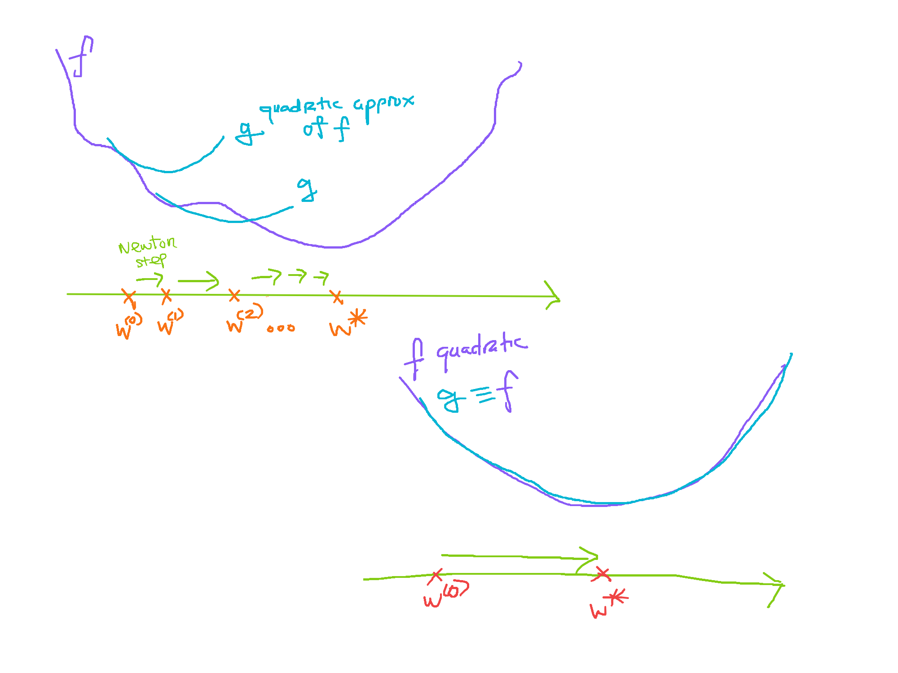
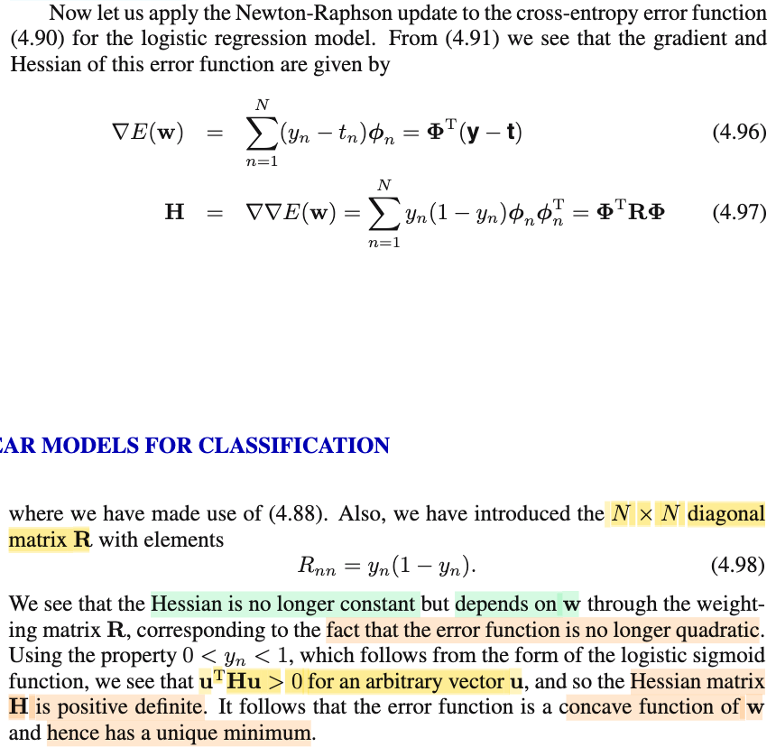
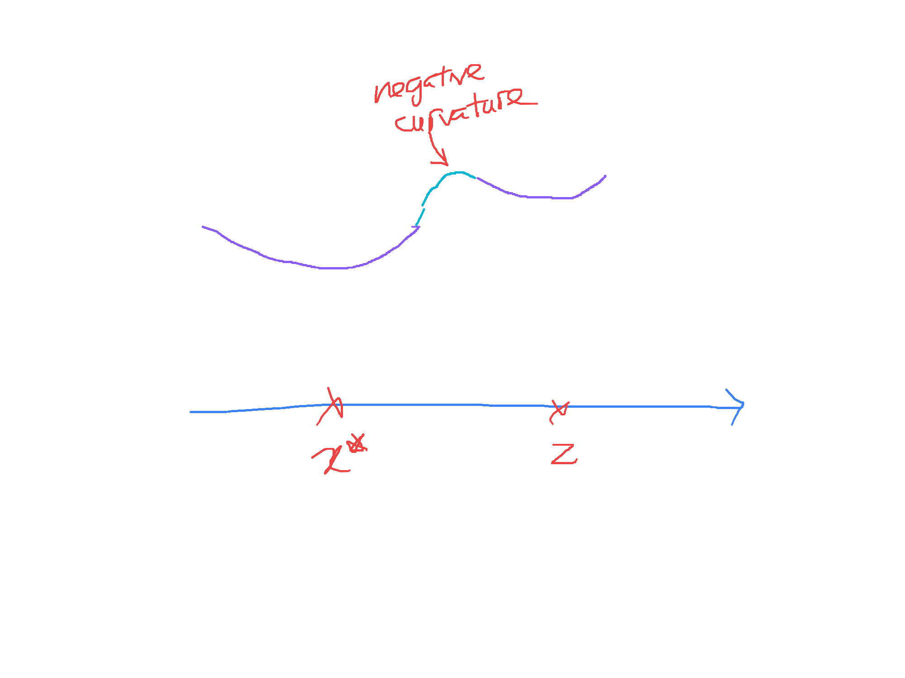
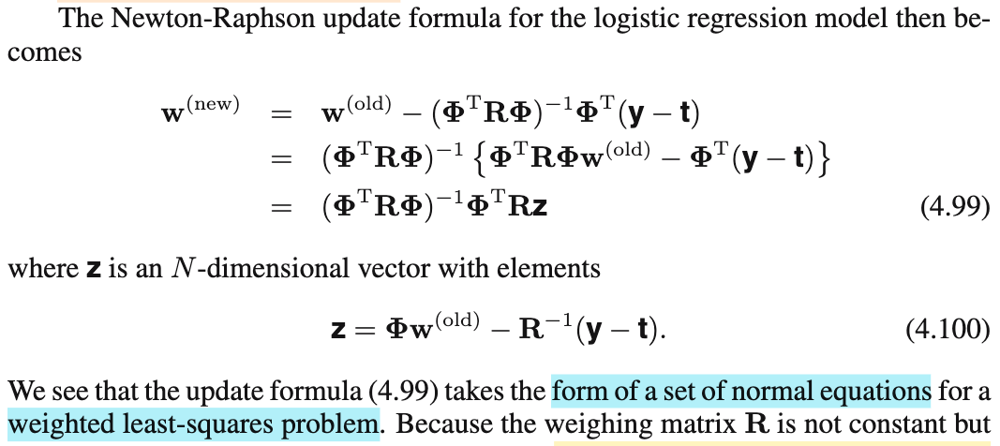
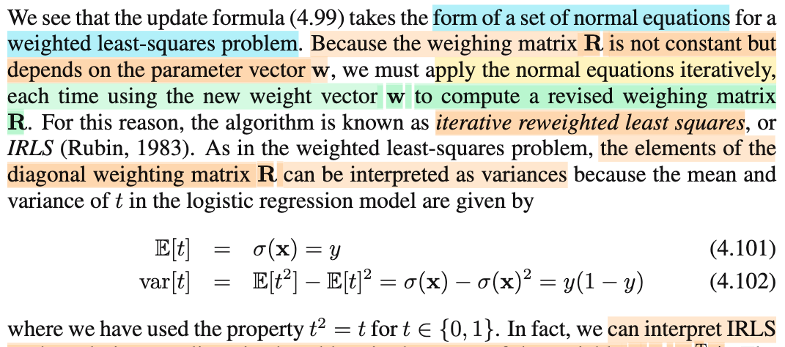
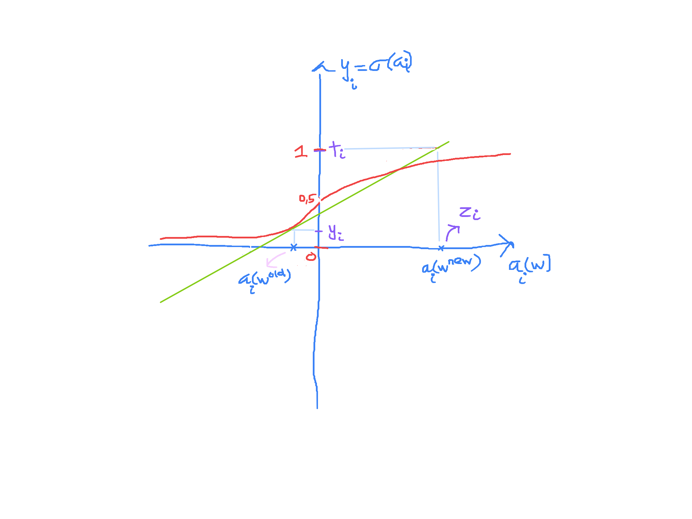
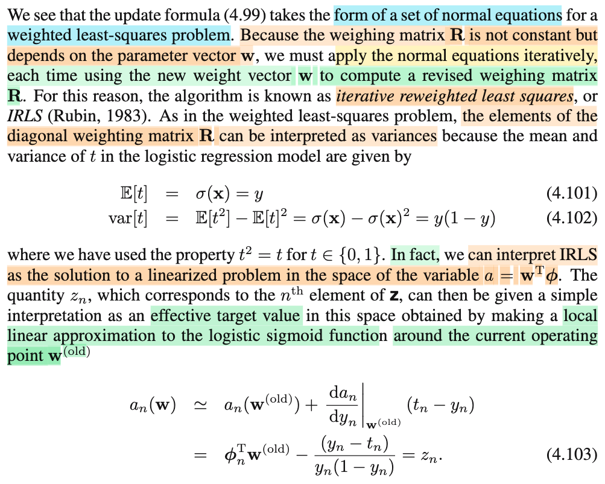

# 4.3.3 Iterative reweighted least squares

📊 **Progress:** `6` Notes | `9` Screenshots | `6` AI Reviews

---

 

## Iterative Reweighted Least Squares

<kbd></kbd>

> [!NOTE]
> Đại ý đoạn này nói rằng trong linear regression ở chapter 3, với giả định Gaussian noise thì bài toán tìm MLE trở nên có closed form solution, mà nguyên chủ yếu là do hàm log likelihood là hàm bậc hai của 𝐰, thành ra khi đạo hàm và cho bằng 0 (điều kiện cần bậc nhất) ta có phương trình tuyến tính theo 𝐰 để rồi có thể có công thức nghiệm (closed form solution)
>
>
>
> Review nhanh sẽ thấy ý này:
>
>
>
> Trong bài toán đó, ta giả định Ti|𝐱i \~ 𝒩(y(𝐱i, 𝐰), 1/β) (cũng là εi = Ti-y(𝐱i, 𝐰) \~ 𝒩(0,1/β)). Nên likelihood L(𝐰, β|t1,..tn, 𝐱1,...𝐱n) = L(𝐰, β|𝐭, 𝐗) = f(𝐭|𝐰,β,𝐗) = Πi f(ti|𝐰, β, 𝐱i) = Πi 𝒩(ti|𝐰ᵀΦ(𝐱i), 1/β) = Πi \[constant\] exp\[(-β/2)(ti-𝐰ᵀΦ(𝐱i))²\].
>
>
>
> Từ đó ln likelihood = ln Πi \[c1\] exp\[(-β/2)(ti-𝐰ᵀΦ(𝐱i))²\]
>
>
>
> = Σi ln {\[c1\] exp\[(-β/2)(ti-𝐰ᵀΦ(𝐱i))²\]}
>
>
>
> = Σi ln {\[c1\]} + Σi ln exp\[(-β/2)(ti-𝐰ᵀΦ(𝐱i))²\]}
>
>
>
> = c2 - (β/2) Σi (ti-𝐰ᵀΦ(𝐱i))², là hàm bậc hai theo 𝐰
>
>
>
> ---
>
>
>
> Thì ở logistic regression, tác giả Bishop nói ta không còn có thể có closed form solution nữa, mà nguyên nhân là do tính phi tuyến của hàm sigmoid.
>
>
>
> Tuy nhiên ta sẽ thấy đại khái là ở bài toàn này, vẫn có unique solution do hàm error negative ln likelihood là concave function (có lẽ sách in sai, vì là hàm convex mới đúng chứ nhỉ) mà ta sẽ sớm chứng minh.
>
>
>
> ---
>
>
>
> Tiếp theo, đại ý là, như note trước mình đã dự đoán, ta sẽ giải tìm solution thông qua thuật toán tối ưu, mang tên Newton-Raphson, vốn dựa trên việc ta xấp xỉ bậc hai hàm hàm ln likelihood, mà bước update có dạng như sau:
>
>
>
> 𝐰(new) = 𝐰(old) - 𝐇⁻¹ ∇E(𝐰) với 𝐇 là Hessian.
>
>
>
> Nhờ đã học Nocedal và Boyd, nên mình nhận ra đây (- 𝐇⁻¹ ∇E(𝐰)) chính là Newton step, và cái này chỉ là Newton method thôi có gì lạ đâu.
>
>
>
> Active recall chỗ này (đây là lúc mà thời gian cày Nocedal và Boyd trả lãi):
>
>
>
> Nguyên lý rất đơn giản: Ta có hàm objective f(𝐱) là hàm muốn minimize, và bài toán này không có ràng buộc. Vấn đề là f(𝐱) là hàm phi tuyến phức tạp, để rồi nếu dùng điều kiện cần bậc nhất, ta sẽ có ∇f(𝐱) = 0 là một hệ phương trình phi tuyến phức tạp không giải nổi. Thì thuật toán iterative này giải bài toán này với nguyên lý như sau:
>
>
>
> Bắt đầu tại 𝐱0 nào đó, ta sẽ "coi hàm f(𝐱) hành xử như hàm bậc hai", và theo đó, ta đi đến điểm giúp minimize hàm bậc hai này. Đây cũng chính là cách nói khác của: Ta không dùng hàm f(𝐱), mà dùng g(𝐱) là hàm xấp xỉ bậc hai của f(𝐱) tại 𝐱0:
>
>
>
> f(𝐱) ≈ g(𝐱) = f(𝐱0) + ∇f(𝐱0)ᵀ(𝐱-𝐱0) + (1/2)(𝐱-𝐱0)ᵀ∇²f(𝐱0)(𝐱-𝐱0)
>
>
>
> Đổi biến sang 𝐝 = 𝐱 - 𝐱0, ta có hàm g(𝐝) = f(𝐱0) + ∇f(𝐱0)ᵀ𝐝 + (1/2)𝐝ᵀ∇²f(𝐱0)𝐝
>
>
>
> (Với h(𝐱) = (1/2)𝐱ᵀ𝐏𝐱 + 𝐪ᵀ𝐱 + r
>
>
>
> Thì gradient ∇h(𝐱) = 𝐏ᵀ𝐱 + 𝐪, ∇²h(𝐱) = 𝐏)
>
>
>
> Và ta sẽ đi giải bài toán subproblem: minimize\_𝐝 g(𝐝)
>
>
>
> Và đây là hàm bậc hai theo 𝐝, nên chỉ việc theo điều kiện cần bậc nhất:
>
>
>
> ∇g(𝐝) = 0
>
>
>
> ⇔ \[∇²f(𝐱0)\]ᵀ𝐝 + ∇f(𝐱0) = 0
>
>
>
> ⇔ \[∇²f(𝐱0)\]ᵀ𝐝 = -∇f(𝐱0)
>
>
>
> ⇔ ∇²f(𝐱0)𝐝 = -∇f(𝐱0)
>
>
>
> ⇔ 𝐝 = -\[∇²f(𝐱0)\]⁻¹ ∇f(𝐱0)
>
>
>
> Đây chính là Newton step.
>
>
>
> Và như vậy từ 𝐱0, ta nhảy đển 𝐱1 = 𝐱0 -\[∇²f(𝐱0)\]⁻¹ ∇f(𝐱0). Và lặp lại các bước này.
>
>
>
> ---
>
>
>
> Áp vào đây, hàm objective f(𝐰) ở đây là - ln likelihood, hay cross entropy E(𝐰)
>
>
>
> Nên Newton step để update từ 𝐰0 sang 𝐰1 sẽ là -\[∇²E(𝐰)\]⁻¹ ∇E(𝐰0):
>
>
>
> 𝐰1 = 𝐰0 -\[∇²E(𝐰0)\]⁻¹ ∇E(𝐰0)
>
>
>
> Hay viết gọn là 𝐇(𝐰0), Hessian của hàm E(𝐰) tại 𝐰0, để có:
>
>
>
> 𝐰1 = 𝐰0 -\[𝐇(𝐰0)\]⁻¹ ∇E(𝐰0)
>
>
>
> Do đó 4.92 phải hiểu là Hessian và gradient ∇E tại 𝐰(old)

📹 [Xem video trên YouTube](https://www.youtube.com/watch?v=yOm1k_DQ3K0)

> [!TIP]
> 🤖 **AI Check** — 🟢 Pass — ✅ **98/100** · ✓ Move on
>
> Ghi chú xuất sắc, hiểu sâu sắc bản chất vấn đề từ hồi quy tuyến tính sang hồi quy logistic, tự suy diễn chuẩn xác phép xấp xỉ Taylor bậc hai cho thuật toán Newton-Raphson và phát hiện rất tinh tế lỗi in sai thuật ngữ (concave/convex) trong sách của Bishop.
>
> **✓ Strengths**
> - Tái hiện chính xác cơ chế vì sao log-likelihood của Linear Regression lại có nghiệm closed-form (do phụ thuộc bậc hai theo tham số w).
> - Phát hiện rất chuẩn xác lỗi in ấn trong sách gốc Bishop khi viết 'error function is concave' thay vì 'convex' để có unique minimum (lỗi này đã được Bishop đính chính trong errata chính thức).
> - Trình bày chi tiết, mạch lạc bản chất của phương pháp Newton-Raphson từ khai triển Taylor bậc 2 và bài toán tối ưu xấp xỉ cục bộ (quadratic model subproblem).
>
> **💡 Deeper notes**
> - Khi giải bước Newton d = -[∇²f(x0)]⁻¹ ∇f(x0), nghiệm này đảm bảo là điểm cực tiểu cục bộ duy nhất của hàm xấp xỉ g(d) với điều kiện ma trận Hessian ∇²f(x0) là xác định dương (positive definite). May mắn là với hàm cross-entropy trong logistic regression, Hessian luôn bán xác định dương/xác định dương (nếu ma trận dữ liệu full rank).

 

### Newton-Raphson for Linear Regression

<kbd></kbd>

<kbd></kbd>

> [!NOTE]
> Thử áp dụng với linear regression model:
>
>
>
> Viết lại công thức SSE 3.12: E_D(𝐰) = Σi {(ti-𝐰ᵀΦ(𝐱i))²/2} = (1/2) Σi {(ti-𝐰ᵀΦ(𝐱i))²}
>
>
>
> Chuyển về dạng compact, với vector 𝐭 = \[t1,...tN\]ᵀ. Gom các vector Φ(𝐱1),..Φ(𝐱N) đem làm thành các hàng của matrix 𝚽 (design matrix), thì \[𝐰ᵀΦ(𝐱1),...𝐰ᵀΦ(𝐱N)\]ᵀ chính là 𝚽𝐰. Khi đó:
>
>
>
> Khi (1/2) Σi {(ti-𝐰ᵀΦ(𝐱i))²} = (1/2) ||𝐭 - 𝚽𝐰||²
>
>
>
> Dùng ||𝐮||² = 𝐮ᵀ𝐮
>
>
>
> E_D(𝐰) = (1/2)(𝐭 - 𝚽𝐰)ᵀ(𝐭 - 𝚽𝐰)
>
>
>
> = (1/2)(𝐭ᵀ - 𝐰ᵀ𝚽ᵀ)(𝐭 - 𝚽𝐰)
>
>
>
> = (1/2)\[𝐭ᵀ𝐭 - 𝐰ᵀ𝚽ᵀ𝐭 - 𝐭ᵀ𝚽𝐰 + 𝐰ᵀ𝚽ᵀ𝚽𝐰\]
>
>
>
> = (1/2)\[𝐭ᵀ𝐭 - (𝐰ᵀ𝚽ᵀ𝐭)ᵀ - 𝐭ᵀ𝚽𝐰 + 𝐰ᵀ𝚽ᵀ𝚽𝐰\] (do 𝐰ᵀ𝚽ᵀ𝐭 là scalar)
>
>
>
> = (1/2)\[𝐭ᵀ𝐭 - 𝐭ᵀ(𝐰ᵀ𝚽ᵀ)ᵀ - 𝐭ᵀ𝚽𝐰 + 𝐰ᵀ𝚽ᵀ𝚽𝐰\]
>
>
>
> = (1/2)\[𝐭ᵀ𝐭 - 𝐭ᵀ𝚽𝐰 - 𝐭ᵀ𝚽𝐰 + 𝐰ᵀ𝚽ᵀ𝚽𝐰\]
>
>
>
> = (1/2)(𝐭ᵀ𝐭 - 2𝐭ᵀ𝚽𝐰 + 𝐰ᵀ𝚽ᵀ𝚽𝐰)
>
>
>
> = (1/2)𝐰ᵀ𝚽ᵀ𝚽𝐰 - 𝐭ᵀ𝚽𝐰 + (1/2)𝐭ᵀ𝐭
>
>
>
> = (1/2)𝐰ᵀ𝚽ᵀ𝚽𝐰 - (𝚽ᵀ𝐭)ᵀ𝐰 + (1/2)𝐭ᵀ𝐭
>
>
>
> Nên gradient ∇E_D(𝐰) = (𝚽ᵀ𝚽)ᵀ𝐰 - 𝚽ᵀ𝐭 = 𝚽ᵀ𝚽𝐰 - 𝚽ᵀ𝐭 (do 𝚽ᵀ𝚽 đối xứng)
>
>
>
> Và Hessian ∇²E_D(𝐰) = 𝚽ᵀ𝚽
>
>
>
> ---
>
>
>
> Vì sao? Áp dụng kiến thức đã học trong MIT 18s.096, ta có thể derive lại công thức gradient và Hessian của hàm số này:
>
>
>
> f(𝐱) = (1/2)𝐱ᵀ𝐏𝐱 + 𝐪ᵀ𝐱 + r
>
>
>
> Mục tiêu là đưa về dạng df = linear operator act on d𝐱
>
>
>
> df = f(𝐱 + d𝐱) - f(𝐱)
>
>
>
> = (1/2)(𝐱 + d𝐱)ᵀ𝐏(𝐱 + d𝐱) + 𝐪ᵀ(𝐱 + d𝐱) + r - (1/2)𝐱ᵀ𝐏𝐱 - 𝐪ᵀ𝐱 - r
>
>
>
> = (1/2)(𝐱ᵀ𝐏 + d𝐱ᵀ𝐏)(𝐱 + d𝐱) + 𝐪ᵀ𝐱 + 𝐪ᵀd𝐱 + r - (1/2)𝐱ᵀ𝐏𝐱 - 𝐪ᵀ𝐱 - r
>
>
>
> = (1/2)(𝐱ᵀ𝐏𝐱 + d𝐱ᵀ𝐏𝐱 + 𝐱ᵀ𝐏d𝐱 + d𝐱ᵀ𝐏d𝐱) + 𝐪ᵀ𝐱 + 𝐪ᵀd𝐱 + r - (1/2)𝐱ᵀ𝐏𝐱 - 𝐪ᵀ𝐱 - r
>
>
>
> Xét d𝐱ᵀ𝐏𝐱 = (d𝐱ᵀ𝐏𝐱)ᵀ = 𝐱ᵀ(d𝐱ᵀ𝐏)ᵀ | do (AB)ᵀ = BᵀAᵀ
>
>
>
> = 𝐱ᵀ𝐏ᵀd𝐱
>
>
>
> ...= (1/2)(𝐱ᵀ𝐏𝐱 + 𝐱ᵀ𝐏ᵀd𝐱 + 𝐱ᵀ𝐏d𝐱 + d𝐱ᵀ𝐏d𝐱) + 𝐪ᵀ𝐱 + 𝐪ᵀd𝐱 + r - (1/2)𝐱ᵀ𝐏𝐱 - 𝐪ᵀ𝐱 - r
>
>
>
> (cancel out các term và bỏ đi term bậc 2 do ta đang tìm một linear operator của d𝐱)
>
>
>
> = (1/2)𝐱ᵀ𝐏𝐱 + (1/2)𝐱ᵀ𝐏ᵀd𝐱 + (1/2)𝐱ᵀ𝐏d𝐱 + (1/2)d𝐱ᵀ𝐏d𝐱 + 𝐪ᵀ𝐱 + 𝐪ᵀd𝐱 + r - (1/2)𝐱ᵀ𝐏𝐱 - 𝐪ᵀ𝐱 - r
>
>
>
> = (1/2)𝐱ᵀ𝐏ᵀd𝐱 + (1/2)𝐱ᵀ𝐏d𝐱 + 𝐪ᵀd𝐱
>
>
>
> = (1/2)𝐱ᵀ(𝐏ᵀ + 𝐏)d𝐱 + 𝐪ᵀd𝐱
>
>
>
> Nếu 𝐏 đối xứng, thì 𝐏ᵀ = 𝐏
>
>
>
> ..= 𝐱ᵀ𝐏d𝐱 + 𝐪ᵀd𝐱
>
>
>
> = (𝐱ᵀ𝐏 + 𝐪ᵀ)d𝐱
>
>
>
> = (𝐏ᵀ𝐱 + 𝐪)ᵀd𝐱
>
>
>
> Nên ∇f(𝐱) = 𝐏ᵀ𝐱 + 𝐪 = 𝐏𝐱 + 𝐪
>
>
>
> ---
>
>
>
> g(𝐱) = ∇f(𝐱)
>
>
>
> dg = linear operator act on d𝐱 (Jacobian matrix d𝐱)
>
>
>
> dg = g(𝐱 + d𝐱) - g(𝐱)
>
>
>
> = ∇f(𝐱 + d𝐱) - ∇f(𝐱)
>
>
>
> = 𝐏(𝐱 + d𝐱) + 𝐪 - 𝐏𝐱 - 𝐪
>
>
>
> = 𝐏d𝐱
>
>
>
> ⇒ Jacobian matrix = 𝐏, cũng chính là Hessian của f, tức ∇²f(𝐱)
>
>
>
> ---
>
>
>
> Như vậy, bước update với Newton step là:
>
>
>
> 𝐰(new) = 𝐰(old) - (𝚽ᵀ𝚽)⁻¹\[(𝚽ᵀ𝚽)𝐰(old) - 𝚽ᵀ𝐭\]
>
>
>
> = 𝐰(old) - (𝚽ᵀ𝚽)⁻¹(𝚽ᵀ𝚽)𝐰(old) + (𝚽ᵀ𝚽)⁻¹𝚽ᵀ𝐭
>
>
>
> = 𝐰(old) - 𝐰(old) + (𝚽ᵀ𝚽)⁻¹𝚽ᵀ𝐭 ((𝚽ᵀ𝚽)⁻¹(𝚽ᵀ𝚽) = 𝐈)
>
>
>
> = (𝚽ᵀ𝚽)⁻¹𝚽ᵀ𝐭
>
>
>
> Như vậy 𝐰(new) = (𝚽ᵀ𝚽)⁻¹𝚽ᵀ𝐭, mà đây có thể thấy chính là gì? Nó chính là nghiệm của bài toán least square.
>
>
>
> Nhớ ko: Điều kiện cần bậc nhất, cho gradient ∇\_DE(𝐰) = 0 ⇔ 𝚽ᵀ𝚽𝐰 - 𝚽ᵀ𝐭 = 0 ⇔ 𝚽ᵀ𝚽𝐰 = 𝚽ᵀ𝐭 đây chính là normal equation. Với giả định 𝚽 full column rank, để 𝚽ᵀ𝚽 full rank (=invertible) ta sẽ có 𝐰 = (𝚽ᵀ𝚽)⁻¹𝚽ᵀ𝐭
>
>
>
> À như vậy, với bài toán least square, thuật toán Newton Raphson sẽ chạy đúng một vòng duy nhất, để giải ra nghiệm luôn. Và lí do là vì: Với bài toán này, hàm objective nó bản chất đã là hàm bậc 2 của 𝐰, nên dù đúng ở 𝐰(0) (initial value của 𝐰 là bao nhiêu), và theo bản chất của thuật toán Newton method là ta sẽ thay bài toán tối ưu hàm mục tiêu gốc bởi bài toán tối ưu hàm xấp xỉ bậc hai tại điểm đang đứng, thì vì hàm gốc đã là hàm bậc hai rồi, nên dĩ nhiên hàm xấp xỉ bậc hai **cũng chính xác là nó**, thành ra Newton step sẽ chính là bước nhảy đưa ta về ngay cái cái đáy của hàm objective.

📹 Video 1: [Newton-Raphson for Linear Regression — Pattern Recognition Machine Learning_C.Bishop](https://www.youtube.com/watch?v=kI2yukn25aQ)

📹 Video 2: [Vì sao Newton-Raphson giải Linear Regression chỉ trong đúng 1 bước?](https://www.youtube.com/watch?v=KQozp2d2dy8)

> [!TIP]
> 🤖 **AI Check** — 🟢 Pass — ✅ **100/100** · ✓ Move on
>
> Ghi chú xuất sắc! Bạn không chỉ nắm vững nội dung trong tài liệu mà còn tự chứng minh lại gradient, Hessian thông qua vi phân cấp 1, cấp 2 và giải thích rõ bản chất hình học tại sao Newton-Raphson hội tụ sau 1 bước.
>
> **✓ Strengths**
> - Tự triển khai chi tiết từng bước biến đổi đại số tuyến tính từ dạng tổng sang dạng ma trận compact một cách chính xác.
> - Tự chứng minh đạo hàm và Hessian của dạng toàn phương tổng quát thông qua vi phân tuyến tính (differential).
> - Nêu rõ điều kiện ma trận thiết kế Phi có full column rank để đảm bảo Phi^T Phi khả nghịch.
> - Giải thích chuẩn xác bản chất tại sao thuật toán hội tụ ngay sau 1 bước (hàm mục tiêu đã là bậc 2 nên xấp xỉ bậc 2 Taylor trùng khớp hoàn toàn với hàm gốc).
>
> **💡 Deeper notes**
> - Về mặt ký hiệu vi phân chặt chẽ, lượng f(x + dx) - f(x) là số gia Delta f; vi phân df thực chất là phần tuyến tính chính của số gia đó khi dx tiến về 0. Tuy nhiên, cách bạn tự lược bỏ số hạng bậc 2 ddx^T P dx để lấy toán tử tuyến tính đã thể hiện đúng bản chất toán học.

**🔗 See also:** [Likelihood and Error Functions](./311_maximum_likelihood_and_least_squares.md#node-urnjdcs)

 

#### Hessian for Logistic Regression

<kbd></kbd>

<kbd></kbd>

> [!NOTE]
> Áp dụng N-R cho logistic regression
>
>
>
> Bữa trước đã có gradient ∇E(𝐰) = Σi=1:N (yi - ti)Φi
>
>
>
> Nhưng thử vectorize hàm E(𝐰) (negative log likelihood, hay cross entropy):
>
>
>
>  - ln L(𝐰|𝐭) = - Σi=1:N {ti ln yi + (1-ti) ln (1-yi)}
>
>
>
> = - Σi=1:N ti ln yi - Σi=1:N (1-ti) ln (1-yi)
>
>
>
> = - Σi=1:N ti ln yi - Σi=1:N (1-ti) ln (1-yi)
>
>
>
> = - 𝐭ᵀln(𝐲) - (𝟏-𝐭)ᵀln(𝟏-𝐲)
>
>
>
> Với 𝐲 = (y1,...yN)ᵀ, với yi = σ(𝐰ᵀΦ(𝐱i))
>
>
>
> ---
>
>
>
> Vectorize hàm ∇E(𝐰):
>
>
>
> ∇E(𝐰) = Σi=1:N (yi - ti)Φi
>
>
>
> = 𝚽ᵀ(𝐲-𝐭) với 𝚽 là matrix có các hàng là Φ(𝐱1)ᵀ,...Φ(𝐱N)ᵀ
>
>
>
> = 𝚽ᵀ(𝐲(𝐰)-𝐭)
>
>
>
> ---
>
>
>
> Tìm Hessian 𝐇:
>
>
>
> d∇E(𝐰) = ∇E(𝐰 + d𝐰) - ∇E(𝐰)
>
>
>
> = 𝚽ᵀ(𝐲(𝐰+d𝐰) - 𝐭) - 𝚽ᵀ(𝐲(𝐰) - 𝐭)
>
>
>
> = 𝚽ᵀ𝐲(𝐰+d𝐰) - 𝚽ᵀ𝐭 - 𝚽ᵀ𝐲(𝐰) + 𝚽ᵀ𝐭
>
>
>
> = 𝚽ᵀ𝐲(𝐰+d𝐰) - 𝚽ᵀ𝐲(𝐰)
>
>
>
> = 𝚽ᵀ\[𝐲(𝐰+d𝐰) - 𝐲(𝐰)\]
>
>
>
> = 𝚽ᵀ\[𝐲(𝐰+d𝐰) - 𝐲(𝐰)\]
>
>
>
> = 𝚽ᵀd𝐲
>
>
>
> Xét d𝐲
>
>
>
> = \[dy1,...dyN\]ᵀ (1)
>
>
>
> Với yi(𝐰) = σ(𝐰ᵀΦi) = σ(ai(𝐰)) với ai(𝐰) = 𝐰ᵀΦi
>
>
>
> y1(𝐰) = σ(a1(𝐰)), hay y1 = σ(a1)
>
>
>
> y1 = σ(a1) ⇒ dy1/da1 = σ'(a1)
>
>
>
> ⇔ dy1 = σ'(a1)da1 = σ(a1)\[1 - σ(a1)\]da1
>
>
>
> Nên \[dy1,...dyN\]ᵀ = \[σ(a1)(1 - σ(a1))da1 ,...σ(aN)(1 - σ(aN))daN\]ᵀ
>
>
>
> ---
>
>
>
> Tiếp, vì ai = 𝐰ᵀΦi ⇒ d/d𝐰 ai = Φi ⇒ dai = Φiᵀd𝐰
>
>
>
> .. = \[σ(a1)(1 - σ(a1))Φ1ᵀd𝐰 ,...σ(aN)(1 - σ(aN))ΦNᵀd𝐰\]ᵀ
>
>
>
> = diag(σ(a1)(1 - σ(a1)),.....σ(aN)(1 - σ(aN))) \[Φ1ᵀd𝐰,...,ΦNᵀd𝐰\]ᵀ
>
>
>
> = diag(σ(a1)(1 - σ(a1)),.....σ(aN)(1 - σ(aN))) 𝚽d𝐰
>
>
>
> Đặt 𝐑 = diag(σ(a1)(1 - σ(a1)),.....σ(aN)(1 - σ(aN)))
>
>
>
> ... = 𝐑𝚽d𝐰
>
>
>
> Vậy d𝐲 = 𝐑𝚽d𝐰
>
>
>
> Nên d∇E(𝐰) = 𝚽ᵀd𝐲 = 𝚽ᵀ𝐑𝚽d𝐰 Jacobian 
>
>
>
> Suy ra Jacobian cuả hàm vector ∇E(𝐰), cũng là Hessian của E(𝐰) chính là 𝚽ᵀ𝐑𝚽:
>
>
>
> 𝐇(𝐰) = 𝚽ᵀ𝐑𝚽, chú ý, nó là hàm (vector → matrix, phụ thuộc 𝐰, vì 𝐑 là matrix chéo mà phần tử ii là σ(ai)(1 - σ(ai) = σ(𝐰ᵀΦi)(1 - σ(𝐰ᵀΦi)), nên 𝐑 là matrix phụ thuộc 𝐰 ⇒ Hessian là matrix phụ thuộc 𝐰. Điều này khác với Hessian của Sum Square Error, là 𝚽ᵀ𝚽, là constant matrix.
>
>
>
> ---
>
>
>
> Rồi, vì yi = σ(𝐰ᵀΦi) luôn trong \[0,1\], và 1 - σ(𝐰ᵀΦi) cũng vậy, nên σ(𝐰ᵀΦi)(1 - σ(𝐰ᵀΦi)) luôn không âm. Và với triangular matrix thì entries đường chéo chính là eigenvalues nên mọi eigenvalues không âm thì matrix bán xác định dương.
>
>
>
> Nhưng thực tế, σ(𝐰ᵀΦi) chỉ output ra 1 hoặc 0 nếu 𝐰ᵀΦi là ∞ hoặc -∞, nên thực tế σ(𝐰ᵀΦi) luôn chỉ trong (0,1). Do đó σ(𝐰ᵀΦi)(1 - σ(𝐰ᵀΦi)) luôn dương ⇒ mọi eigenvalues đều dương nên 𝐑 xác định dương
>
>
>
> (trong sách gs lập luận dùng quadratic form:
>
>
>
> 𝐮ᵀ𝐇𝐮 = 𝐮ᵀ𝚽ᵀ𝐑𝚽𝐮 = (𝚽𝐮)ᵀ𝐑𝚽𝐮. Đặt 𝐯 = 𝚽𝐮 thì ta có:
>
>
>
> .. = 𝐯ᵀ𝐑𝐯 = Σi 𝐑ii vi² = Σi 𝐑ii vi² và vì 𝐑ii luôn dương với mọi i, nên cái tổng này dương.
>
>
>
> Thế thì nếu như với 𝐮 khác 𝟎 bất kì, 𝐯 = 𝚽𝐮 cũng khác 𝟎 thì theo trên, quadratic form 𝐮ᵀ𝐇𝐮 sẽ đều dương, và theo MIT 1806 đã học, đây giúp kết luận đây là positive definite matrix.
>
>
>
> Dĩ nhiên để 𝐯 = 𝚽𝐮 cũng khác 𝟎 với mọi 𝐮 thì 𝚽 phải full column rank (nullspace chỉ có {𝟎})
>
>
>
> (có mấy cách: mọi pivot đều dương, hay mọi eigevalue đều dương, hay mọi leading principle, tức det của các matrix mở rộng dần từ trên xuống dưới, và cuối cùng là check quadratic form)
>
>
>
> Vậy, Hessian 𝐇 xác định dương tại mọi 𝐰 thì suy ra hàm số error E(𝐰) là hàm strictly convex, nên theo một định lý bên tối ưu lồi cho ta biết, hàm số sẽ có nghiệm toàn cục duy nhất.
>
>
>
> Trong Convex Optimization, giáo sư Boyd cho mình một cách chứng minh trực giác rất dễ nhớ: Đại khái ý tưởng là giả sử ngoài 𝐱\* là một local minimizer, thì còn 𝐳 là một local mimizer khác thì ta tập luận trực giác như sau: nếu đi từ 𝐱\* đến 𝐳, thì đầu tiên ta sẽ phải "đi lên" (vì 𝐱\* là local minimizer), nhưng sau đó, để đến 𝐳 thì ta sẽ phải "đi xuống" (do 𝐳 cũng là local minimizer) thành ra tại cái lúc đi xuống, hàm số phải có độ cong âm (negative curvature), và điều này mâu thuẫn với việc Hessian xác định dương tại mọi điểm (vì điều này cho biết độ cong phải luôn dương tại mọi điểm)

📹 [Xem video trên YouTube](https://www.youtube.com/watch?v=FZ8WIyEcWwk)

> [!TIP]
> 🤖 **AI Check** — 🟢 Pass — ✅ **98/100** · ✓ Move on
>
> Ghi chú xuất sắc, tự dẫn xuất Hessian qua vi phân ma trận thay vì chỉ chép lại công thức. Đã chỉ ra được điều kiện ma trận thiết kế full column rank để Hessian thực sự xác định dương.
>
> **✓ Strengths**
> - Dẫn xuất Hessian chặt chẽ bằng phương pháp vi phân (differential form) d∇E(w) = ΦᵀRΦ dw rất gọn gàng và mạch lạc.
> - Bắt đúng điều kiện quan trọng: Φ phải có full column rank thì uᵀHu mới dương với mọi u ≠ 0 (nếu không H chỉ bán xác định dương).
> - Hiểu bản chất và sửa đúng lỗi in ấn kinh điển trong sách của Bishop (sách in nhầm là 'concave' thay vì 'convex' đối với hàm lỗi E(w)).
>
> **💡 Deeper notes**
> - Nếu dữ liệu tách biệt tuyến tính (linearly separable), ||w|| sẽ tiến tới vô cùng, dẫn tới y_n tiến tới 0 hoặc 1 khiến R_nn → 0 và Hessian suy biến (singular). Khi đó cực tiểu không đạt được tại w hữu hạn trừ khi có điều chuẩn (regularization).

**🔗 See also:** [Cross-Entropy Error Function Gradient](./432_logistic_regression.md#node-gvw6cdv) · [linked note *(Mit 18.06)*](../mit1806_gstrang/lecture_27_positive_definite_matrices_and_minima.md#node-au3l6fa) · [Gradient of Logistic Error Function](./432_logistic_regression.md#node-to86xxj) · [Iterative Reweighted Least Squares](#node-2ut4slh)

 

##### Newton-Raphson for Logistic Regression

<kbd></kbd>

> [!NOTE]
> Tiếp, tới đây ta đã có Hessian và gradient của hàm cross entropy (cũng là negative log likelihood) của mô hình logistic regression:
>
>
>
> ∇E(𝐰) = 𝚽ᵀ(𝐲-𝐭); 𝐇(𝐰) = 𝚽ᵀ𝐑𝚽
>
>
>
> Ráp vô bước update của Newton Raphson:
>
>
>
> 𝐰(new) = 𝐰(old) - 𝐇(𝐰(old))⁻¹∇E(𝐰)
>
>
>
> = 𝐰(old) - (𝚽ᵀ𝐑𝚽)⁻¹𝚽ᵀ(𝐲-𝐭)
>
>
>
> = (𝚽ᵀ𝐑𝚽)⁻¹(𝚽ᵀ𝐑𝚽)𝐰(old) - (𝚽ᵀ𝐑𝚽)⁻¹𝚽ᵀ(𝐲-𝐭)
>
>
>
> = (𝚽ᵀ𝐑𝚽)⁻¹\[𝚽ᵀ𝐑𝚽𝐰(old) - 𝚽ᵀ(𝐲-𝐭)\]
>
>
>
> = (𝚽ᵀ𝐑𝚽)⁻¹\[𝚽ᵀ𝐑𝚽𝐰(old) - 𝚽ᵀ𝐑𝐑⁻¹(𝐲-𝐭)\]
>
>
>
> = (𝚽ᵀ𝐑𝚽)⁻¹\[𝚽ᵀ𝐑(𝚽𝐰(old) - 𝐑⁻¹(𝐲-𝐭))\]
>
>
>
> = (𝚽ᵀ𝐑𝚽)⁻¹𝚽ᵀ𝐑𝐳 với 𝐳 = 𝚽𝐰(old) - 𝐑⁻¹(𝐲-𝐭)
>
>
>
> Dừng lại đây chút, vì sao tác giả lại nói cái này (𝐰(new) = (𝚽ᵀ𝐑𝚽)⁻¹𝚽ᵀ𝐑𝐳) có dạng của một "bộ các **normal equations** của một **weighted least-squares problem**" nhỉ?
>
>
>
> Giải thích cũng nhanh:
>
>
>
> Ta biết error function của least square problem: Sum of square error: (1/2) Σi (ti - 𝐰ᵀΦi)², cũng là (1/2)||𝐭 - 𝚽𝐰||², hay (1/2)(𝐭 - 𝚽𝐰)ᵀ(𝐭 - 𝚽𝐰). Lấy đạo hàm ta được 𝚽ᵀ𝚽𝐰 - 𝚽ᵀ𝐭. Từ đó cho đạo hàm bằng 0 ta có normal equation: 𝚽ᵀ𝚽𝐰 = 𝚽ᵀ𝐭, và nếu 𝚽ᵀ𝚽 invertible, ta có nghiệm least square: 𝐰 = (𝚽ᵀ𝚽)⁻¹𝚽ᵀ𝐭
>
>
>
> Thế thì đại khái là, trong bài toán least square này, người ta còn gọi là ordinary least square, trong đó, về cơ bản là ta xem các error là có vai trò ưu tiên như nhau.
>
>
>
> Để rồi nếu ta gắn trọng số cho mỗi error i (ei = ti - 𝐰ᵀΦi), gọi là αi. Khi đó error function sẽ là (1/2) Σi αi (ti - 𝐰ᵀΦi)². Thể hiện theo vectorize sẽ là:
>
>
>
> (1/2)(𝐭 - 𝚽𝐰)ᵀdiag(α1, α2,...)(𝐭 - 𝚽𝐰)
>
>
>
> = (1/2)(𝐭 - 𝚽𝐰)ᵀ𝐑(𝐭 - 𝚽𝐰)
>
>
>
> = (1/2)(𝐭ᵀ𝐑𝐭 - 𝐰ᵀ𝚽ᵀ𝐑𝐭 - 𝐭ᵀ𝐑𝚽𝐰 + 𝐰ᵀ𝚽ᵀ𝐑𝚽𝐰)
>
>
>
> (Do 𝐑 là diagonal matrix nên đối xứng ⇒ hai hạng tử ở giữa bằng nhau)
>
>
>
> = (1/2)(𝐭ᵀ𝐑𝐭 - 2𝐭ᵀ𝐑𝚽𝐰 + 𝐰ᵀ𝚽ᵀ𝐑𝚽𝐰)
>
>
>
> = (1/2)𝐰ᵀ𝚽ᵀ𝐑𝚽𝐰) - 𝐭ᵀ𝐑𝚽𝐰 + (1/2)𝐭ᵀ𝐑𝐭
>
>
>
> = (1/2)𝐰ᵀ𝚽ᵀ𝐑𝚽𝐰) - (𝚽ᵀ𝐑ᵀ𝐭)ᵀ𝐰 + (1/2)𝐭ᵀ𝐑𝐭
>
>
>
> = (1/2)(𝐰ᵀ𝚽ᵀ𝐑𝚽𝐰) - (𝚽ᵀ𝐑𝐭)ᵀ𝐰 + (1/2)𝐭ᵀ𝐑𝐭
>
>
>
> Gradient sẽ là: (𝚽ᵀ𝐑𝚽)ᵀ𝐰 - 𝚽ᵀ𝐑𝐭 = (𝚽ᵀ𝐑𝚽)𝐰 - 𝚽ᵀ𝐑𝐭
>
>
>
> Normal equation: (𝚽ᵀ𝐑𝚽)𝐰 - 𝚽ᵀ𝐑𝐭 = 0
>
>
>
> ⇔ (𝚽ᵀ𝐑𝚽)𝐰 = 𝚽ᵀ𝐑𝐭
>
>
>
> ⇔ 𝐰 = (𝚽ᵀ𝐑𝚽)⁻¹𝚽ᵀ𝐑𝐭
>
>
>
> À như vậy là ta thấy đúng là 4.99 có dạng của công thức nghiệm của một bài toán **weighted least square**.
>
>
>
> (tác giả nói **set** of normal equation thì ý là system of normal equation đơn giản là normal equation, vốn dĩ là một hệ phương trình, chỉ vậy thôi, vì 𝐰 là vector, nên thực chất (𝚽ᵀ𝚽𝐰 = 𝚽ᵀ𝐭 hay (𝚽ᵀ𝐑𝚽)𝐰 = 𝚽ᵀ𝐑𝐭) đều là hệ phương trình tuyến tính)

📹 [Xem video trên YouTube](https://www.youtube.com/watch?v=OefUwDAl93Q)

> [!TIP]
> 🤖 **AI Check** — 🟢 Pass — ✅ **100/100** · ✓ Move on
>
> Ghi chú xuất sắc! Bạn đã biến đổi chi tiết từng bước đại số tuyến tính của phép cập nhật Newton-Raphson và giải thích chuẩn xác bản chất của bài toán Weighted Least Squares.
>
> **✓ Strengths**
> - Khai triển đại số chi tiết và mạch lạc từ công thức cập nhật Newton-Raphson sang dạng ma trận trọng số với vector z.
> - Chứng minh tường minh bài toán Weighted Least Squares (WLS) từ hàm mất mát bình phương trọng số đến hệ phương trình chuẩn (normal equations) để đối chiếu trực tiếp với công thức cập nhật của Logistic Regression.
>
> **💡 Deeper notes**
> - Điểm khác biệt cốt lõi giữa WLS thông thường và thuật toán này (IRLS - Iteratively Reweighted Least Squares) là trong WLS ma trận trọng số R là hằng số cố định, còn ở Logistic Regression R và z phụ thuộc vào w(old) nên phải giải lặp lại nhiều lần cho đến khi hội tụ.

 

###### Iterative Reweighted Least Squares

<kbd></kbd>

> [!NOTE]
> Rồi, như vậy mình đã hiểu vì sao công thức 4.99 𝐰(new) = (𝚽ᵀ𝐑𝚽)⁻¹𝚽ᵀ𝐑𝐳 với 𝐳 = 𝚽𝐰(old) - 𝐑⁻¹(𝐲-𝐭) có dạng của normal equation bài toán weighted least square.
>
>
>
> Và liên hệ kiến thức bên chapter 12 Casella, mình hiểu rằng bài toán weighted least square có bản chất chỉ là bài toán linear regression trong đó ta giả định nhiễu là normal mean 0 và variance khác nhau.
>
>
>
> Trong chap 3 của Bishop, còn nhớ thiết lập ban đầu là: Ta giả định Ti|𝐱i \~ 𝒩(y(𝐰,𝐱i), 1/β), và cũng chính là giả định error εi = Ti - y(𝐰,𝐱i) là \~ 𝒩(0, 1/β) (chính là mọi error, đều có chung variance) kết quả cho thấy việc đi tìm MLE của 𝐰 hóa ra chính là bài toán least square.
>
>
>
> Vậy thì nếu ta giả định error εi khác nhau ở variance (hay precision): εi = Ti - y(𝐰, 𝐱i)\~ 𝒩(0, 1/βi) (vài cái này cũng chính là giả định Ti|𝐱i \~ 𝒩(y(𝐰, 𝐱i), 1/βi) thì bài toán đi tìm MLE của 𝐰 sẽ dẫn tới bài toán weighted least square, như sau:
>
>
>
> likelihood: L(𝐰, β1, β2..|t1,t2,...𝐱1,𝐱2,...) = f(t1,t2,...|𝐰, β1, β2,...𝐱1,𝐱2,...).
>
>
>
> theo tính độc lập của các data point:
>
>
>
> = f(t1|𝐰, β1, 𝐱1)f(t2|𝐰, β2, 𝐱2)....
>
>
>
> = Πi f(ti|𝐰, βi, 𝐱i) = Πi 𝒩(ti|y(𝐰,𝐱i), 1/βi)
>
>
>
> (lắp công thức 𝒩(x|μ, σ²) = (1/√2πσ²) exp{-(x-μ)²/2σ²})
>
>
>
> = Πi \[1/√2π(1/βi)\] exp\[-(ti-y(𝐰, 𝐱i))²/2(1/βi)\]
>
>
>
> = Πi \[2π(1/βi)\]^(-1/2) exp\[-(βi/2)(ti-y(𝐰, 𝐱i))²\]
>
>
>
> ln likelihood:
>
>
>
> ln \[Πi \[2π(1/βi)\]^(-1/2) exp\[-(βi/2)(ti-y(𝐰, 𝐱i))²\]\]
>
>
>
> = ln \[Πi \[2π(1/βi)\]^(-1/2) exp\[-(βi/2)(ti-y(𝐰, 𝐱i))²\]\]
>
>
>
> = ln \[Πi \[2π(1/βi)\]^(-1/2) Πi exp\[-(βi/2)(ti-y(𝐰, 𝐱i))²\]
>
>
>
> = ln {Πi \[2π(1/βi)\]^(-1/2)\]} + ln Πi exp\[-(βi/2)(ti-y(𝐰, 𝐱i))²\]
>
>
>
> = Σi ln {\[2π(1/βi)\]^(-1/2)\]} + Σi ln exp\[-(βi/2)(ti-y(𝐰, 𝐱i))²\]
>
>
>
> = (-1/2) Σi \[ln (2π) - ln βi\] - (1/2) Σi \[βi (ti-y(𝐰, 𝐱i))²\]
>
>
>
> Maximize (over 𝐰) ln likelihood
>
>
>
> = C - (1/2) Σi \[βi (ti-y(𝐰, 𝐱i))²\]
>
>
>
> maximize\_𝐰 {-(1/2) Σi \[βi (ti-y(𝐰, 𝐱i))²}
>
>
>
> Tới đây ta thấy đúng là bài toán đi tìm maximum likelihood estimator của 𝐰 với việc ta giả định noise εi \~ 𝒩(0, 1/βi) (tức variance khác nhau) chính là dẫn tới bài toán weighted least square với weight của error thứ i (ti - yi) chính là precision βi, cũng là 1/σ²i, tức nghịch đảo của variance của Ti (Ti|𝐱i \~ 𝒩(y(𝐰,𝐱), 1/βi))

📹 [Xem video trên YouTube](https://www.youtube.com/watch?v=uW9swHIgaPw)

> [!TIP]
> 🤖 **AI Check** — 🟢 Pass — ✅ **95/100** · ✓ Move on
>
> Ghi chú rất xuất sắc, bạn đã tự thiết lập và chứng minh chi tiết từ bài toán MLE với nhiễu Gaussian phương sai khác nhau để dẫn ra bài toán bình phương tối thiểu có trọng số (WLS).
>
> **✓ Strengths**
> - Tiến hành dẫn xuất toán học chi tiết, rõ ràng và chính xác từ hàm likelihood đến log-likelihood để chứng minh MLE tương đương WLS.
> - Liên hệ và khái quát tốt kiến thức giữa bài toán hồi quy tuyến tính chuẩn (homoscedasticity) và hồi quy có trọng số (heteroscedasticity).
>
> **💡 Deeper notes**
> - Trong Bishop, ma trận trọng số R có các phần tử trên đường chéo là R_nn = y_n(1 - y_n) = var[t_n] (chính là phương sai của biến mục tiêu t_n, chứ không phải nghịch đảo phương sai). Sở dĩ R đóng vai trò ma trận trọng số (precision) trong bài toán WLS của z là vì biến mục tiêu hiệu chỉnh z_n có var[z_n] ≈ 1 / var[t_n] = 1 / R_nn. Do đó, precision của z_n chính là 1 / var[z_n] = R_nn.

**🔗 See also:** [Optimal Prediction with Gaussian Noise](./311_maximum_likelihood_and_least_squares.md#node-wsglxqn) · [Hessian for Logistic Regression](#node-7nipjyu)

 

###### Iterative Reweighted Least Squares (IRLS)

<kbd></kbd>

<kbd></kbd>

> [!NOTE]
> Ok đại khái là vầy:
>
>
>
> Hiểu một cách ngắn gọn là: Ta có thể coi bài toán logistic regression như một bài toán regression theo cách sau:
>
>
>
> Xét ai, = 𝐰ᵀΦi, là hàm theo 𝐰, nên viết ai(𝐰).
>
>
>
> Sau đó, ta biết yi (là cái mang ý nghĩa P(Ti=1|𝐱i)) = σ(𝐰ᵀΦi), như vậy, yi = σ(ai).
>
>
>
> Vì σ là hàm monotone increasing, nên yi = σ(ai) ⇔ ai = σ⁻¹(yi), với σ⁻¹(.) là hàm nghịch đảo của σ, cái này dễ thấy.
>
>
>
> Và đại ý là ý tưởng để mà chuyển bài toán tìm 𝐰 để giảm cross entropy loss bằng cách khiến cho mọi yi = σ(𝐰ᵀΦi) đều bằng với ti thành bài toán least square như sau:
>
>
>
> Giả sử với giá trị 𝐰 hiện tại, gọi là 𝐰(old) đi, ta thì ai(𝐰) đang ở giá trị ai(𝐰(old)).
>
>
>
> Thì ý tưởng là: Thay vì đi tìm 𝐰 để có ai(𝐰) sao cho yi = ti, ví dụ với data point này ti = 1, thì tìm 𝐰 để có ai(𝐰) sao cho yi = 1 thì cũng chính là tìm 𝐰 để σ⁻¹(yi) = σ⁻¹(1), cũng là tìm 𝐰 để ai = σ⁻¹(1).
>
>
>
> Vấn đề là, σ⁻¹(1) = +∞, nên không thể giải được.
>
>
>
> Ta mới làm cách này: thay vì dùng σ, và tìm 𝐰 để có ai(𝐰) = σ⁻¹(yi) = σ⁻¹(1). Ta sẽ dùng hàm linear approx của σ(ai) tại ai(𝐰(old)), gọi là σ̂(ai), chính là đường màu xanh lá cây.
>
>
>
> Khi đó, ta sẽ tìm 𝐰 để ai(𝐰) khiến σ̂(ai) = 1, và muốn được vậy ai(𝐰) phải bằng một giá trị mà ta đặt là zi.
>
>
>
> Như vậy, để σ̂(ai) = 1, thì ai phải bằng một target zi, thì ý nghĩa quan trọng là: ta đã chuyển bài toán về việc (tìm 𝐰 để) map yi tới target mang giá trị rời rạc {0,1} thành map ai với target liên tục zi.
>
>
>
> Và khi đó, bài toán sẽ trở thành bài toán least square: Minimize (1/2)Σi (ai(𝐰) - zi)², gắn thêm trọng số 𝐑ii nữa, để có weighted least square: Minimize (1/2)Σi 𝐑ii (ai(𝐰) - zi)²
>
>
>
> Vấn đề là, vì trong bước lập luận trên, ta đã linear approx hàm sigmoid, nên đương nhiên là nó sẽ không hoàn toàn chính xác. Do đó, sau khi giải tìm được 𝐰(new) khiến minimize cái objective trên, ta sẽ lặp lại việc này nhiều lần nữa. Đây chính là lí do ta gọi nó là **iterative reweighted least squared**.
>
>
>
> ---
>
>
>
> Khi đã hiểu ý tưởng thì xem thử zi là gì:
>
>
>
> Như đã nói, zi là cái đích của ai cần nhảy để σ̂(ai) = 1 (thay cho cái đích của a khiến tại đó σ(a) = 1, vốn dĩ sẽ phải là +∞), tóm lại zi là nghiệm của σ̂(ai) = 1. Giải cái này, đầu tiên cần có σ̂(ai):
>
>
>
> Như đã nói, là tuyến tính hóa của σ(ai) tại ai(𝐰(old)), ta có, xấp xỉ tuyến tính hàm σ:
>
>
>
> (Taylor theorem nói rằng) nếu ai ≈ ai(𝐰(old)), ta sẽ có thể coi hàm σ hành xử như hàm tuyến tính:
>
>
>
> f(x), x0: f(x) ≈ f(x0) + f'(x0)(x-x0)
>
>
>
> σ(ai) ≈ σ(ai(𝐰(old))) + σ'(ai(𝐰(old))) (ai - ai(𝐰(old))), vế phải chính là hàm σ̂(ai)
>
>
>
> Thay đạo hàm của σ: σ'(a) = σ(a)(1-σ(a))
>
>
>
> ⇒ σ̂(ai) = σ(ai(𝐰(old))) + σ(ai(𝐰(old)))(1-σ(ai(𝐰(old)))) (ai - ai(𝐰(old)))
>
>
>
> cho bằng 1 để giải tìm zi:
>
>
>
> σ(ai(𝐰(old))) + σ(ai(𝐰(old)))(1-σ(ai(𝐰(old)))) (ai - ai(𝐰(old))) = 1
>
>
>
> ⇔ Để cho bớt rối mắt, đặt ai(𝐰(old)) là c:
>
>
>
> σ(c) + σ(c)(1-σ(c)) (ai - c) = 1
>
>
>
> ⇔ σ(c)(1-σ(c)) (ai - c) = 1 - σ(c)
>
>
>
> ⇔ (ai - c) = \[1 - σ(c)\]/σ(c)(1-σ(c))
>
>
>
> ⇔ ai = c + \[1 - σ(c)\]/σ(c)(1-σ(c))
>
>
>
> Tới đây σ(c), tức σ(ai(𝐰(old))) dĩ nhiên chính là yi, nên ta có:
>
>
>
> ⇔ ai = c + (1 - yi)/yi(1-yi)
>
>
>
> Và c, là ai(𝐰(old)), mà ai(𝐰) = 𝐰ᵀΦi, nên đương nhiên c = ai(𝐰(old)) = 𝐰(old)ᵀΦi
>
>
>
> Vậy ta có ai, tức là zi cần tìm: = 𝐰(old)ᵀΦi + (1 - yi)/yi(1-yi)
>
>
>
> Đây chính là cái đích mà ai cần nhảy từ ai(𝐰(old)) tới đó, để khiến yi, đang bằng σ̂ (ai(𝐰(old))) (cũng chính là σ(ai(𝐰(old))) do hàm σ̂ là approx tại ai(𝐰(old)) nên tại đó σ và σ̂ như nhau) nhảy tới ti = 1.
>
>
>
> Và đây chỉ là ta đang giả sử ti=1, nên thay 1 bằng ti, ta có công thức như trong sách:
>
>
>
> zi, hay ai(𝐰(new)) ≈ 𝐰(old)ᵀΦi + (ti - yi)/yi(1-yi)
>
>
>
> = 𝐰(old)ᵀΦi - (yi - ti)/yi(1-yi)
>
>
>
> hay dùng biến chạy là n cho giống hơn nữa.
>
>
>
> zn ≈ 𝐰(old)ᵀΦn - (yn - tn)/yn(1-yn)
>
>
>
> ---
>
>
>
> Như vậy, nói thêm tí về ý tưởng, kiểu như là từ bài toán gốc: tìm 𝐰 để đám y1,...yN khớp được chính xác với t1,...tN. bài toán này vốn dĩ có cái mấu chốt là yi là hàm phi tuyến của 𝐰 do nó thông qua hàm sigmoid, nên rất khó
>
>
>
> Ta đã thay đổi tí xíu thông qua động tác thay hàm sigmoid bằng hàm xấp xỉ tuyến tính, từ đó, chuyển bài toán thành tìm 𝐰 để đám ŷ1=σ̂(a1),...,ŷN=σ̂(aN) khớp với t1,...tN và cái này cũng chính là để a2,...aN khớp với z1,..zn. Như vậy bài toán trở thành bài toán least square, và như đã nói, vì đã có yếu tố xấp xỉ, nên ta cần phải lặp lại nhiều lần.
>
>
>
> (đặt ŷi = σ̂(ai) để tương ứng với yi = σ(ai))
>
>
>
> Như vậy, trong bài toán weight least square này thử xem có giống với điều mình đã nhận ra từ note trước: weight gắn với error ith chính là 1/variance của Zi?
>
>
>
> Ta đã có công thức zi: zi = 𝐰(old)ᵀΦi - (yi - ti)/yi(1-yi)
>
>
>
> Đương nhiên, có thể thấy zi, nếu đứng trên khía cạnh là random variable, thì nó chính là random variable có được bởi hàm số 𝐰(old)ᵀΦi - (yi - ti)/yi(1-yi) áp lên random variable Ti, viết theo chuẩn xác suất thống kê:
>
>
>
> Zi = 𝐰(old)ᵀΦi - (yi - Ti)/\[yi(1-yi)\]
>
>
>
> Và các yếu tố khác như 𝐰(old)ᵀΦi hay yi đều chỉ là constant (xét trên quan điểm cái gì đang là random variable)
>
>
>
> Nên Var(Zi) = Var(𝐰(old)ᵀΦi - (yi - Ti)/\[yi(1-yi)\])
>
>
>
> = Var(-(yi - Ti)/\[yi(1-yi)\]) | dùng tính chất của variance Var(X + c) = Var(X)
>
>
>
> = \[Var(yi - Ti)\] / \[yi(1-yi)\]² | Var(cX) = c²Var(X)
>
>
>
> = Var(Ti) / \[yi(1-yi)\]² (tương tự, Var(X + c) = Var(X))
>
>
>
> Tới đây, Ti|𝐱i, ta biết nó \~ Bern(yi), và với phân phối Bernouilly thì công thức mean và variance rất dễ nhớ, derive lại:
>
>
>
> X \~ Bern(p), EX = 0 × P(X=0) + 1 × P(X=1) = P(X=1) = p
>
>
>
> Var(X) = E\[(X-EX)²\], theo LOTUS, = (0 - p)² P(X=0) + (1-p)²P(X=1)
>
>
>
> = p²(1-p) + (1-p)²p = p² - p³ + (1-2p + p²)p = p² - p³ + p - 2p² + p³
>
>
>
> = p - p² = p(1-p)
>
>
>
> Vậy Var(Ti) = yi(1-yi)
>
>
>
> ⇒ Var(Zi) = yi(1-yi)/\[yi(1-yi)\]² = 1/\[yi(1-yi)\]
>
>
>
> = 1/\[σ(ai)(1-σ(ai))\]
>
>
>
> Nên 1/Var(Zi) = σ(ai)(1-σ(ai))
>
>
>
> Tới đây ta thấy đúng là weight của error i chính là 1/Var(Zi), chính là các phần tử đường chéo của 𝐑
>
>
>
> ---
>
>
>
> Cuối cùng, thử xem 𝐳 = (z1,...zi)ᵀ có phải là công thức 𝐳 = 𝚽𝐰(old) - 𝐑⁻¹(𝐲-𝐭) không:
>
>
>
> zi = 𝐰(old)ᵀΦi - (yi - ti)/yi(1-yi)
>
>
>
> Gom 𝐰(old)ᵀΦi, i=1,2,...N thành vector, thì nó chính là 𝚽𝐰
>
>
>
> Gom (yi - ti)/yi(1-yi), i=1,2,...N thành vector thì nó là gì, nó chính là 𝐑⁻¹(𝐲-𝐭) (Vì bữa trước đã biết 𝐑ii là diagonal matrix các entries đường chéo là σ(ai)(1-σ(ai)), thì 𝐑⁻¹ là diagonal matrix các entries đường chéo là 1/\[σ(ai)(1-σ(ai))\]

📹 [Xem video trên YouTube](https://www.youtube.com/watch?v=qAxY0gbf8rM)

> [!TIP]
> 🤖 **AI Check** — 🟡 Minor issues — ✅ **95/100** · ✓ Move on
>
> Ghi chú xuất sắc, tự dẫn xuất được xấp xỉ tuyến tính và làm rõ bản chất của target hiệu dụng z_i cùng trọng số 1/Var(Z_i) trong IRLS. Điểm cần lưu ý duy nhất là z_i là mục tiêu hiệu dụng (target), còn a_i(w^(new)) trong thực tế chỉ tiệm cận z_i qua bài toán bình phương tối thiểu có trọng số do w được dùng chung cho toàn bộ tập dữ liệu.
>
> **🟡 Minor issues**
>
> **1.** *"zi, hay ai(𝐰(new)) ≈ 𝐰(old)ᵀΦi + (ti - yi)/yi(1-yi)"*
>
> Về mặt bản chất, z_i là 'effective target' (giá trị mục tiêu hiệu dụng) mà điểm dữ liệu thứ i muốn đạt tới trong không gian biến a. Do vector tham số w được tối ưu đồng thời trên toàn bộ N điểm dữ liệu bằng Weighted Least Squares, giá trị a_i(w^(new)) = w^(new)ᵀΦi thực tế sau bước cập nhật sẽ không nhất thiết bằng chính xác z_i mà chỉ là nghiệm tối ưu xấp xỉ (khớp) tốt nhất trên toàn tập.
>
>
> **✓ Strengths**
> - Minh họa hình học và diễn giải trực giác rất sáng tạo, chính xác về việc tuyến tính hóa hàm sigmoid quanh điểm hoạt động hiện tại.
> - Tự biến đổi đại số từ khai triển Taylor của hàm sigmoid để tìm ra biểu thức z_n khớp hoàn toàn với công thức (4.103) trong sách giáo trình Bishop.
> - Chứng minh chặt chẽ phương sai Var(Z_i) = 1/[y_i(1 - y_i)] bằng các tính chất phương sai và phân phối Bernoulli, giải thích trọn vẹn lý do trọng số R_ii trong WLS tỷ lệ nghịch với phương sai của target.
>
> **💡 Deeper notes**
> - Trong sách (4.103), Bishop khai triển Taylor trực tiếp cho hàm nghịch đảo a_n(y_n) = σ⁻¹(y_n) quanh y_n rồi tính tại t_n. Cách làm của bạn (khai triển hàm thuận y = σ(a) rồi giải ngược tìm a) là tương đương bậc 1 theo đạo hàm hàm ngược da/dy = 1/(dy/da).
> - IRLS thực chất là thuật toán Newton-Raphson áp dụng cho hàm cross-entropy loss: bước cập nhật w^(new) = (Φᵀ R Φ)⁻¹ Φᵀ R z hoàn toàn đồng nhất với công thức bước nhảy Newton w^(new) = w^(old) - H⁻¹ ∇E(w).

 

