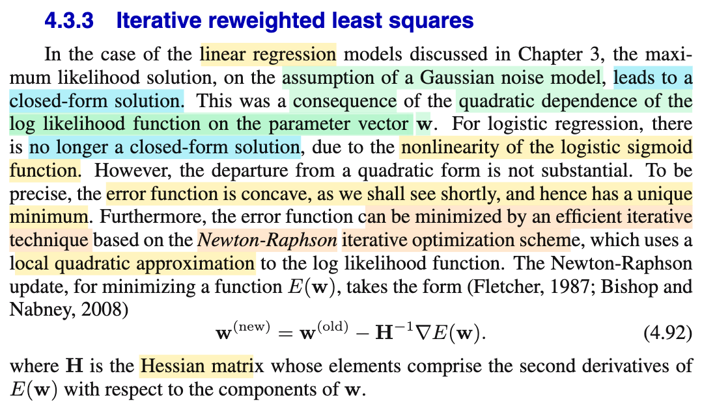
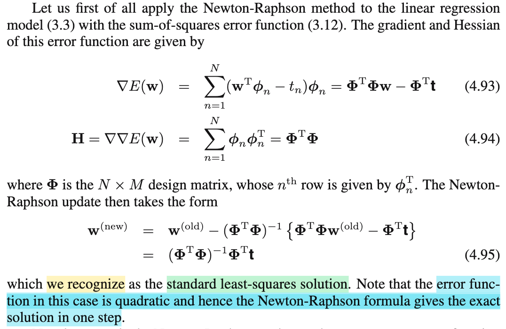

# 4.3.3 Iterative reweighted least squares

📊 **Progress:** `2` Notes | `2` Screenshots | `2` AI Reviews

---

 

## Iterative Reweighted Least Squares

<kbd></kbd>

> [!NOTE]
> Đại ý đoạn này nói rằng trong linear regression ở chapter 3, với giả định Gaussian noise thì bài toán tìm MLE trở nên có closed form solution, mà nguyên chủ yếu là do hàm log likelihood là hàm bậc hai của 𝐰, thành ra khi đạo hàm và cho bằng 0 (điều kiện cần bậc nhất) ta có phương trình tuyến tính theo 𝐰 để rồi có thể có công thức nghiệm (closed form solution)
>
>
>
> Review nhanh sẽ thấy ý này:
>
>
>
> Trong bài toán đó, ta giả định Ti|𝐱i \~ 𝒩(y(𝐱i, 𝐰), 1/β) (cũng là εi = Ti-y(𝐱i, 𝐰) \~ 𝒩(0,1/β)). Nên likelihood L(𝐰, β|t1,..tn, 𝐱1,...𝐱n) = L(𝐰, β|𝐭, 𝐗) = f(𝐭|𝐰,β,𝐗) = Πi f(ti|𝐰, β, 𝐱i) = Πi 𝒩(ti|𝐰ᵀΦ(𝐱i), 1/β) = Πi \[constant\] exp\[(-β/2)(ti-𝐰ᵀΦ(𝐱i))²\].
>
>
>
> Từ đó ln likelihood = ln Πi \[c1\] exp\[(-β/2)(ti-𝐰ᵀΦ(𝐱i))²\]
>
>
>
> = Σi ln {\[c1\] exp\[(-β/2)(ti-𝐰ᵀΦ(𝐱i))²\]}
>
>
>
> = Σi ln {\[c1\]} + Σi ln exp\[(-β/2)(ti-𝐰ᵀΦ(𝐱i))²\]}
>
>
>
> = c2 - (β/2) Σi (ti-𝐰ᵀΦ(𝐱i))², là hàm bậc hai theo 𝐰
>
>
>
> ---
>
>
>
> Thì ở logistic regression, tác giả Bishop nói ta không còn có thể có closed form solution nữa, mà nguyên nhân là do tính phi tuyến của hàm sigmoid.
>
>
>
> Tuy nhiên ta sẽ thấy đại khái là ở bài toàn này, vẫn có unique solution do hàm error negative ln likelihood là concave function (có lẽ sách in sai, vì là hàm convex mới đúng chứ nhỉ) mà ta sẽ sớm chứng minh.
>
>
>
> ---
>
>
>
> Tiếp theo, đại ý là, như note trước mình đã dự đoán, ta sẽ giải tìm solution thông qua thuật toán tối ưu, mang tên Newton-Raphson, vốn dựa trên việc ta xấp xỉ bậc hai hàm hàm ln likelihood, mà bước update có dạng như sau:
>
>
>
> 𝐰(new) = 𝐰(old) - 𝐇⁻¹ ∇E(𝐰) với 𝐇 là Hessian.
>
>
>
> Nhờ đã học Nocedal và Boyd, nên mình nhận ra đây (- 𝐇⁻¹ ∇E(𝐰)) chính là Newton step, và cái này chỉ là Newton method thôi có gì lạ đâu.
>
>
>
> Active recall chỗ này (đây là lúc mà thời gian cày Nocedal và Boyd trả lãi):
>
>
>
> Nguyên lý rất đơn giản: Ta có hàm objective f(𝐱) là hàm muốn minimize, và bài toán này không có ràng buộc. Vấn đề là f(𝐱) là hàm phi tuyến phức tạp, để rồi nếu dùng điều kiện cần bậc nhất, ta sẽ có ∇f(𝐱) = 0 là một hệ phương trình phi tuyến phức tạp không giải nổi. Thì thuật toán iterative này giải bài toán này với nguyên lý như sau:
>
>
>
> Bắt đầu tại 𝐱0 nào đó, ta sẽ "coi hàm f(𝐱) hành xử như hàm bậc hai", và theo đó, ta đi đến điểm giúp minimize hàm bậc hai này. Đây cũng chính là cách nói khác của: Ta không dùng hàm f(𝐱), mà dùng g(𝐱) là hàm xấp xỉ bậc hai của f(𝐱) tại 𝐱0:
>
>
>
> f(𝐱) ≈ g(𝐱) = f(𝐱0) + ∇f(𝐱0)ᵀ(𝐱-𝐱0) + (1/2)(𝐱-𝐱0)ᵀ∇²f(𝐱0)(𝐱-𝐱0)
>
>
>
> Đổi biến sang 𝐝 = 𝐱 - 𝐱0, ta có hàm g(𝐝) = f(𝐱0) + ∇f(𝐱0)ᵀ𝐝 + (1/2)𝐝ᵀ∇²f(𝐱0)𝐝
>
>
>
> (Với h(𝐱) = (1/2)𝐱ᵀ𝐏𝐱 + 𝐪ᵀ𝐱 + r
>
>
>
> Thì gradient ∇h(𝐱) = 𝐏ᵀ𝐱 + 𝐪, ∇²h(𝐱) = 𝐏)
>
>
>
> Và ta sẽ đi giải bài toán subproblem: minimize\_𝐝 g(𝐝)
>
>
>
> Và đây là hàm bậc hai theo 𝐝, nên chỉ việc theo điều kiện cần bậc nhất:
>
>
>
> ∇g(𝐝) = 0
>
>
>
> ⇔ \[∇²f(𝐱0)\]ᵀ𝐝 + ∇f(𝐱0) = 0
>
>
>
> ⇔ \[∇²f(𝐱0)\]ᵀ𝐝 = -∇f(𝐱0)
>
>
>
> ⇔ ∇²f(𝐱0)𝐝 = -∇f(𝐱0)
>
>
>
> ⇔ 𝐝 = -\[∇²f(𝐱0)\]⁻¹ ∇f(𝐱0)
>
>
>
> Đây chính là Newton step.
>
>
>
> Và như vậy từ 𝐱0, ta nhảy đển 𝐱1 = 𝐱0 -\[∇²f(𝐱0)\]⁻¹ ∇f(𝐱0). Và lặp lại các bước này.
>
>
>
> ---
>
>
>
> Áp vào đây, hàm objective f(𝐰) ở đây là - ln likelihood, hay cross entropy E(𝐰)
>
>
>
> Nên Newton step để update từ 𝐰0 sang 𝐰1 sẽ là -\[∇²E(𝐰)\]⁻¹ ∇E(𝐰0):
>
>
>
> 𝐰1 = 𝐰0 -\[∇²E(𝐰0)\]⁻¹ ∇E(𝐰0)
>
>
>
> Hay viết gọn là 𝐇(𝐰0), Hessian của hàm E(𝐰) tại 𝐰0, để có:
>
>
>
> 𝐰1 = 𝐰0 -\[𝐇(𝐰0)\]⁻¹ ∇E(𝐰0)
>
>
>
> Do đó 4.92 phải hiểu là Hessian và gradient ∇E tại 𝐰(old)

📹 [Xem video trên YouTube](https://www.youtube.com/watch?v=yOm1k_DQ3K0)

> [!TIP]
> 🤖 **AI Check** — 🟢 Pass — ✅ **98/100** · ✓ Move on
>
> Ghi chú xuất sắc, hiểu sâu sắc bản chất vấn đề từ hồi quy tuyến tính sang hồi quy logistic, tự suy diễn chuẩn xác phép xấp xỉ Taylor bậc hai cho thuật toán Newton-Raphson và phát hiện rất tinh tế lỗi in sai thuật ngữ (concave/convex) trong sách của Bishop.
>
> **✓ Strengths**
> - Tái hiện chính xác cơ chế vì sao log-likelihood của Linear Regression lại có nghiệm closed-form (do phụ thuộc bậc hai theo tham số w).
> - Phát hiện rất chuẩn xác lỗi in ấn trong sách gốc Bishop khi viết 'error function is concave' thay vì 'convex' để có unique minimum (lỗi này đã được Bishop đính chính trong errata chính thức).
> - Trình bày chi tiết, mạch lạc bản chất của phương pháp Newton-Raphson từ khai triển Taylor bậc 2 và bài toán tối ưu xấp xỉ cục bộ (quadratic model subproblem).
>
> **💡 Deeper notes**
> - Khi giải bước Newton d = -[∇²f(x0)]⁻¹ ∇f(x0), nghiệm này đảm bảo là điểm cực tiểu cục bộ duy nhất của hàm xấp xỉ g(d) với điều kiện ma trận Hessian ∇²f(x0) là xác định dương (positive definite). May mắn là với hàm cross-entropy trong logistic regression, Hessian luôn bán xác định dương/xác định dương (nếu ma trận dữ liệu full rank).

 

### Newton-Raphson for Linear Regression

<kbd></kbd>

> [!NOTE]
> Thử áp dụng với linear regression model:
>
>
>
> Viết lại công thức SSE 3.12: E_D(𝐰) = Σi {(ti-𝐰ᵀΦ(𝐱i))²/2} = (1/2) Σi {(ti-𝐰ᵀΦ(𝐱i))²}
>
>
>
> Chuyển về dạng compact, với vector 𝐭 = \[t1,...tN\]ᵀ. Gom các vector Φ(𝐱1),..Φ(𝐱N) đem làm thành các hàng của matrix 𝚽 (design matrix), thì \[𝐰ᵀΦ(𝐱1),...𝐰ᵀΦ(𝐱N)\]ᵀ chính là 𝚽𝐰. Khi đó:
>
>
>
> Khi (1/2) Σi {(ti-𝐰ᵀΦ(𝐱i))²} = (1/2) ||𝐭 - 𝚽𝐰||²
>
>
>
> Dùng ||𝐮||² = 𝐮ᵀ𝐮
>
>
>
> E_D(𝐰) = (1/2)(𝐭 - 𝚽𝐰)ᵀ(𝐭 - 𝚽𝐰)
>
>
>
> = (1/2)(𝐭ᵀ - 𝐰ᵀ𝚽ᵀ)(𝐭 - 𝚽𝐰)
>
>
>
> = (1/2)\[𝐭ᵀ𝐭 - 𝐰ᵀ𝚽ᵀ𝐭 - 𝐭ᵀ𝚽𝐰 + 𝐰ᵀ𝚽ᵀ𝚽𝐰\]
>
>
>
> = (1/2)\[𝐭ᵀ𝐭 - (𝐰ᵀ𝚽ᵀ𝐭)ᵀ - 𝐭ᵀ𝚽𝐰 + 𝐰ᵀ𝚽ᵀ𝚽𝐰\] (do 𝐰ᵀ𝚽ᵀ𝐭 là scalar)
>
>
>
> = (1/2)\[𝐭ᵀ𝐭 - 𝐭ᵀ(𝐰ᵀ𝚽ᵀ)ᵀ - 𝐭ᵀ𝚽𝐰 + 𝐰ᵀ𝚽ᵀ𝚽𝐰\]
>
>
>
> = (1/2)\[𝐭ᵀ𝐭 - 𝐭ᵀ𝚽𝐰 - 𝐭ᵀ𝚽𝐰 + 𝐰ᵀ𝚽ᵀ𝚽𝐰\]
>
>
>
> = (1/2)(𝐭ᵀ𝐭 - 2𝐭ᵀ𝚽𝐰 + 𝐰ᵀ𝚽ᵀ𝚽𝐰)
>
>
>
> = (1/2)𝐰ᵀ𝚽ᵀ𝚽𝐰 - 𝐭ᵀ𝚽𝐰 + (1/2)𝐭ᵀ𝐭
>
>
>
> = (1/2)𝐰ᵀ𝚽ᵀ𝚽𝐰 - (𝚽ᵀ𝐭)ᵀ𝐰 + (1/2)𝐭ᵀ𝐭
>
>
>
> Nên gradient ∇E_D(𝐰) = (𝚽ᵀ𝚽)ᵀ𝐰 - 𝚽ᵀ𝐭 = 𝚽ᵀ𝚽𝐰 - 𝚽ᵀ𝐭 (do 𝚽ᵀ𝚽 đối xứng)
>
>
>
> Và Hessian ∇²E_D(𝐰) = 𝚽ᵀ𝚽
>
>
>
> ---
>
>
>
> Vì sao? Áp dụng kiến thức đã học trong MIT 18s.096, ta có thể derive lại công thức gradient và Hessian của hàm số này:
>
>
>
> f(𝐱) = (1/2)𝐱ᵀ𝐏𝐱 + 𝐪ᵀ𝐱 + r
>
>
>
> Mục tiêu là đưa về dạng df = linear operator act on d𝐱
>
>
>
> df = f(𝐱 + d𝐱) - f(𝐱)
>
>
>
> = (1/2)(𝐱 + d𝐱)ᵀ𝐏(𝐱 + d𝐱) + 𝐪ᵀ(𝐱 + d𝐱) + r - (1/2)𝐱ᵀ𝐏𝐱 - 𝐪ᵀ𝐱 - r
>
>
>
> = (1/2)(𝐱ᵀ𝐏 + d𝐱ᵀ𝐏)(𝐱 + d𝐱) + 𝐪ᵀ𝐱 + 𝐪ᵀd𝐱 + r - (1/2)𝐱ᵀ𝐏𝐱 - 𝐪ᵀ𝐱 - r
>
>
>
> = (1/2)(𝐱ᵀ𝐏𝐱 + d𝐱ᵀ𝐏𝐱 + 𝐱ᵀ𝐏d𝐱 + d𝐱ᵀ𝐏d𝐱) + 𝐪ᵀ𝐱 + 𝐪ᵀd𝐱 + r - (1/2)𝐱ᵀ𝐏𝐱 - 𝐪ᵀ𝐱 - r
>
>
>
> Xét d𝐱ᵀ𝐏𝐱 = (d𝐱ᵀ𝐏𝐱)ᵀ = 𝐱ᵀ(d𝐱ᵀ𝐏)ᵀ | do (AB)ᵀ = BᵀAᵀ
>
>
>
> = 𝐱ᵀ𝐏ᵀd𝐱
>
>
>
> ...= (1/2)(𝐱ᵀ𝐏𝐱 + 𝐱ᵀ𝐏ᵀd𝐱 + 𝐱ᵀ𝐏d𝐱 + d𝐱ᵀ𝐏d𝐱) + 𝐪ᵀ𝐱 + 𝐪ᵀd𝐱 + r - (1/2)𝐱ᵀ𝐏𝐱 - 𝐪ᵀ𝐱 - r
>
>
>
> (cancel out các term và bỏ đi term bậc 2 do ta đang tìm một linear operator của d𝐱)
>
>
>
> = (1/2)𝐱ᵀ𝐏𝐱 + (1/2)𝐱ᵀ𝐏ᵀd𝐱 + (1/2)𝐱ᵀ𝐏d𝐱 + (1/2)d𝐱ᵀ𝐏d𝐱 + 𝐪ᵀ𝐱 + 𝐪ᵀd𝐱 + r - (1/2)𝐱ᵀ𝐏𝐱 - 𝐪ᵀ𝐱 - r
>
>
>
> = (1/2)𝐱ᵀ𝐏ᵀd𝐱 + (1/2)𝐱ᵀ𝐏d𝐱 + 𝐪ᵀd𝐱
>
>
>
> = (1/2)𝐱ᵀ(𝐏ᵀ + 𝐏)d𝐱 + 𝐪ᵀd𝐱
>
>
>
> Nếu 𝐏 đối xứng, thì 𝐏ᵀ = 𝐏
>
>
>
> ..= 𝐱ᵀ𝐏d𝐱 + 𝐪ᵀd𝐱
>
>
>
> = (𝐱ᵀ𝐏 + 𝐪ᵀ)d𝐱
>
>
>
> = (𝐏ᵀ𝐱 + 𝐪)ᵀd𝐱
>
>
>
> Nên ∇f(𝐱) = 𝐏ᵀ𝐱 + 𝐪 = 𝐏𝐱 + 𝐪
>
>
>
> ---
>
>
>
> g(𝐱) = ∇f(𝐱)
>
>
>
> dg = linear operator act on d𝐱 (Jacobian matrix d𝐱)
>
>
>
> dg = g(𝐱 + d𝐱) - g(𝐱)
>
>
>
> = ∇f(𝐱 + d𝐱) - ∇f(𝐱)
>
>
>
> = 𝐏(𝐱 + d𝐱) + 𝐪 - 𝐏𝐱 - 𝐪
>
>
>
> = 𝐏d𝐱
>
>
>
> ⇒ Jacobian matrix = 𝐏, cũng chính là Hessian của f, tức ∇²f(𝐱)
>
>
>
> ---
>
>
>
> Như vậy, bước update với Newton step là:
>
>
>
> 𝐰(new) = 𝐰(old) - (𝚽ᵀ𝚽)⁻¹\[(𝚽ᵀ𝚽)𝐰(old) - 𝚽ᵀ𝐭\]
>
>
>
> = 𝐰(old) - (𝚽ᵀ𝚽)⁻¹(𝚽ᵀ𝚽)𝐰(old) + (𝚽ᵀ𝚽)⁻¹𝚽ᵀ𝐭
>
>
>
> = 𝐰(old) - 𝐰(old) + (𝚽ᵀ𝚽)⁻¹𝚽ᵀ𝐭 ((𝚽ᵀ𝚽)⁻¹(𝚽ᵀ𝚽) = 𝐈)
>
>
>
> = (𝚽ᵀ𝚽)⁻¹𝚽ᵀ𝐭
>
>
>
> Như vậy 𝐰(new) = (𝚽ᵀ𝚽)⁻¹𝚽ᵀ𝐭, mà đây có thể thấy chính là gì? Nó chính là nghiệm của bài toán least square.
>
>
>
> Nhớ ko: Điều kiện cần bậc nhất, cho gradient ∇\_DE(𝐰) = 0 ⇔ 𝚽ᵀ𝚽𝐰 - 𝚽ᵀ𝐭 = 0 ⇔ 𝚽ᵀ𝚽𝐰 = 𝚽ᵀ𝐭 đây chính là normal equation. Với giả định 𝚽 full column rank, để 𝚽ᵀ𝚽 full rank (=invertible) ta sẽ có 𝐰 = (𝚽ᵀ𝚽)⁻¹𝚽ᵀ𝐭
>
>
>
> À như vậy, với bài toán least square, thuật toán Newton Raphson sẽ chạy đúng một vòng duy nhất, để giải ra nghiệm luôn. Và lí do là vì: Với bài toán này, hàm objective nó bản chất đã là hàm bậc 2 của 𝐰, nên dù đúng ở 𝐰(0) (initial value của 𝐰 là bao nhiêu), và theo bản chất của thuật toán Newton method là ta sẽ thay bài toán tối ưu hàm mục tiêu gốc bởi bài toán tối ưu hàm xấp xỉ bậc hai tại điểm đang đứng, thì vì hàm gốc đã là hàm bậc hai rồi, nên dĩ nhiên hàm xấp xỉ bậc hai **cũng chính xác là nó**, thành ra Newton step sẽ chính là bước nhảy đưa ta về ngay cái cái đáy của hàm objective.

📹 Video 1: [Newton-Raphson for Linear Regression — Pattern Recognition Machine Learning_C.Bishop](https://www.youtube.com/watch?v=kI2yukn25aQ)

📹 Video 2: [Vì sao Newton-Raphson giải Linear Regression chỉ trong đúng 1 bước?](https://www.youtube.com/watch?v=KQozp2d2dy8)

> [!TIP]
> 🤖 **AI Check** — 🟢 Pass — ✅ **100/100** · ✓ Move on
>
> Ghi chú xuất sắc! Bạn không chỉ nắm vững nội dung trong tài liệu mà còn tự chứng minh lại gradient, Hessian thông qua vi phân cấp 1, cấp 2 và giải thích rõ bản chất hình học tại sao Newton-Raphson hội tụ sau 1 bước.
>
> **✓ Strengths**
> - Tự triển khai chi tiết từng bước biến đổi đại số tuyến tính từ dạng tổng sang dạng ma trận compact một cách chính xác.
> - Tự chứng minh đạo hàm và Hessian của dạng toàn phương tổng quát thông qua vi phân tuyến tính (differential).
> - Nêu rõ điều kiện ma trận thiết kế Phi có full column rank để đảm bảo Phi^T Phi khả nghịch.
> - Giải thích chuẩn xác bản chất tại sao thuật toán hội tụ ngay sau 1 bước (hàm mục tiêu đã là bậc 2 nên xấp xỉ bậc 2 Taylor trùng khớp hoàn toàn với hàm gốc).
>
> **💡 Deeper notes**
> - Về mặt ký hiệu vi phân chặt chẽ, lượng f(x + dx) - f(x) là số gia Delta f; vi phân df thực chất là phần tuyến tính chính của số gia đó khi dx tiến về 0. Tuy nhiên, cách bạn tự lược bỏ số hạng bậc 2 ddx^T P dx để lấy toán tử tuyến tính đã thể hiện đúng bản chất toán học.

**🔗 See also:** [Likelihood and Error Functions](./311_maximum_likelihood_and_least_squares.md#node-urnjdcs)

 

