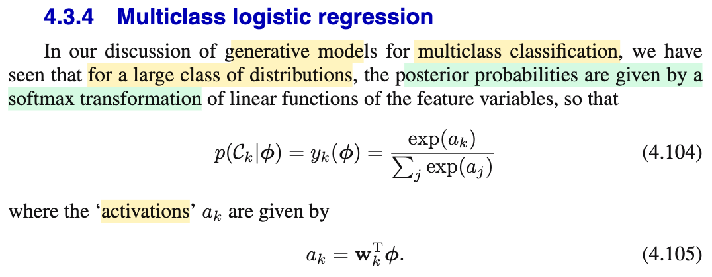
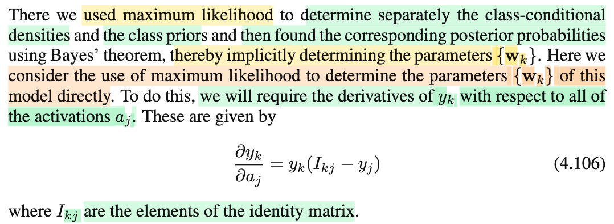

# 4.3.4 Multiclass logistic regression

📊 **Progress:** `2` Notes | `2` Screenshots | `2` AI Reviews

---

 

## Multiclass Logistic Regression

<kbd></kbd>

> [!NOTE]
> Đại ý mở đầu tác giả nhắc lại chút cái ta đã biết ở mấy phần trước, nói rằng "với rất nhiều loại distribution" thì class posterior f(𝒞k|Φ) có dạng một softmax transformation của một hàm tuyến tính của feature Φ. Là sao nhỉ?
>
>
>
> Active recall tí xíu:
>
>
>
> Ta có f(𝒞k|Φ) = f(Φ|𝒞k)f(𝒞k)/f(Φ) (Bayes rule)
>
>
>
> = f(Φ|𝒞k)f(𝒞k)/ Σj f(Φ|𝒞j)f(𝒞j)
>
>
>
> = \[exp ln \[f(Φ|𝒞k)f(𝒞k)\] / Σj exp ln f(Φ|𝒞j)f(𝒞j)
>
>
>
> = exp(ak) / Σj exp(aj), với aj = ln \[f(Φ|𝒞j)f(𝒞j)\]
>
>
>
> ---
>
>
>
> Thế thì, aj này vẫn là hàm phi tuyến đối với Φ. Nhưng nếu xét class conditional density f(Φ|𝒞j) là thành viên của exponential có chung scale param, mà một ví dụ cụ thể là chúng đều là 𝒩(𝛍j, 𝚺) (cùng chung covariance matrix), thì khi đó:
>
>
>
> \[exp ln \[f(Φ|𝒞k)f(𝒞k)\] / Σj exp ln f(Φ|𝒞j)f(𝒞j) sẽ trở thành:
>
>
>
> {exp \[ln f(Φ|𝒞k) + ln f(𝒞k)\]} / Σj exp {ln f(Φ|𝒞j) + ln f(𝒞j)}
>
>
>
> = {exp \[ln f(Φ|𝒞k)\] exp ln f(𝒞k)} / Σj \[exp ln f(Φ|𝒞j)\] exp ln f(𝒞j)
>
>
>
> = exp \[ln f(Φ|𝒞k)\] f(𝒞k) / Σj \[exp ln f(Φ|𝒞j)\] f(𝒞j) (1)
>
>
>
> ---
>
>
>
> Xét exp \[ln f(Φ|𝒞k)\] = exp \[ln \[c(𝚺) exp(-(1/2)(Φ-𝛍k)ᵀ𝚺⁻¹(Φ-𝛍k)\]\]
>
>
>
> = exp \[ln c(𝚺) + ln exp(-(1/2)(Φ-𝛍k)ᵀ𝚺⁻¹(Φ-𝛍k)\]
>
>
>
> = exp \[ln c(𝚺) - (1/2)(Φ-𝛍k)ᵀ𝚺⁻¹(Φ-𝛍k)\]
>
>
>
> = exp \[ln c(𝚺)\] exp\[-(1/2)(Φ-𝛍k)ᵀ𝚺⁻¹(Φ-𝛍k)\]
>
>
>
> = c(𝚺) exp\[-(1/2)(Φᵀ𝚺⁻¹-𝛍kᵀ𝚺⁻¹)(Φ-𝛍k)\]
>
>
>
> = c(𝚺) exp\[-(1/2)(Φᵀ𝚺⁻¹Φ-𝛍kᵀ𝚺⁻¹Φ-Φᵀ𝚺⁻¹𝛍k+𝛍kᵀ𝚺⁻¹𝛍k)\]
>
>
>
> = c(𝚺) exp\[-(1/2)(Φᵀ𝚺⁻¹Φ-2Φᵀ𝚺⁻¹𝛍k+𝛍kᵀ𝚺⁻¹𝛍k)\]
>
>
>
> = c(𝚺) exp\[-(1/2)Φᵀ𝚺⁻¹Φ\] exp\[-(1/2)(-2Φᵀ𝚺⁻¹𝛍k+𝛍kᵀ𝚺⁻¹𝛍k)\]
>
>
>
> = c(𝚺) exp\[-(1/2)Φᵀ𝚺⁻¹Φ\] exp\[Φᵀ𝚺⁻¹𝛍k-(1/2)𝛍kᵀ𝚺⁻¹𝛍k)\]
>
>
>
> Tương tự các cục exp ln f(Φ|𝒞j) ở mẫu cũng sẽ bằng:
>
>
>
> c(𝚺) exp\[-(1/2)Φᵀ𝚺⁻¹Φ\] exp\[Φᵀ𝚺⁻¹𝛍j-(1/2)𝛍jᵀ𝚺⁻¹𝛍j)\]
>
>
>
> Nên: Từ (1), rút gọn có ở cả tử lẫn mẫu số:
>
>
>
> exp\[Φᵀ𝚺⁻¹𝛍k-(1/2)𝛍kᵀ𝚺⁻¹𝛍k)\]f(𝒞k) / Σj exp\[Φᵀ𝚺⁻¹𝛍j-(1/2)𝛍jᵀ𝚺⁻¹𝛍j)\]f(𝒞j)
>
>
>
> =exp\[Φᵀ𝚺⁻¹𝛍k-(1/2)𝛍kᵀ𝚺⁻¹𝛍k)\] exp \[ln f(𝒞k)\] / Σj exp\[Φᵀ𝚺⁻¹𝛍j-(1/2)𝛍jᵀ𝚺⁻¹𝛍j)\] exp \[lnf(𝒞j)\]
>
>
>
> = exp\[Φᵀ𝚺⁻¹𝛍k-(1/2)𝛍kᵀ𝚺⁻¹𝛍k)+ln(f(𝒞k))\] / Σj exp\[Φᵀ𝚺⁻¹𝛍j-(1/2)𝛍jᵀ𝚺⁻¹𝛍j)+ln f(𝒞j)\]
>
>
>
> và đặt lại ak = Φᵀ𝚺⁻¹𝛍k-(1/2)𝛍kᵀ𝚺⁻¹𝛍k+ln(f(𝒞k))
>
>
>
> ta có exp(ak) / Σj exp(aj), với ak là hàm tuyến tính của Φ.

📹 [Xem video trên YouTube](https://www.youtube.com/watch?v=-9YldVmpmPU)

> [!TIP]
> 🤖 **AI Check** — 🟢 Pass — ✅ **95/100** · ✓ Move on
>
> Ghi chú rất xuất sắc, tự giác suy luận và chứng minh lại tại sao mô hình sinh (với phân phối Gauss cùng ma trận hiệp phương sai) lại dẫn đến hàm softmax dạng tuyến tính theo đúng tinh thần của sách.
>
> **✓ Strengths**
> - Tự giác thực hiện active recall giải thích cặn kẽ nhận định 'for a large class of distributions' của tác giả thay vì chỉ học vẹt công thức.
> - Khai triển đại số chính xác với giả định phân phối chuẩn đa biến cùng ma trận hiệp phương sai, triệt tiêu thành công số hạng bậc hai để thu được hàm tuyến tính đối với biến đặc trưng.
>
> **💡 Deeper notes**
> - Trong công thức (4.105), tác giả Bishop quy ước vector đặc trưng phi đã bao gồm phần tử bias (dummy feature phi_0 = 1) nên a_k được viết gọn là w_k^T phi; trong khai triển của bạn, hằng số -(1/2)mu_k^T Sigma^-1 mu_k + ln P(C_k) chính là trọng số định kiến (bias w_{k0}) đó.
> - Việc lấy exp(ln(...)) rồi lại tách ra có phần hơi thừa bước đại số (chỉ cần triệt tiêu trực tiếp phần tử chung từ f(Phi|C_k)), nhưng kết quả cuối cùng hoàn toàn chính xác.

**🔗 See also:** [PDF Gaussian Đa Biến](./124_the_gaussian_distribution.md#node-40ke7sj)

 

### Activation Derivative for Maximum Likelihood

<kbd></kbd>

> [!NOTE]
> Tiếp, đại ý là như ta đã hiểu, với cách tiếp cận đi xây class posterior f(𝒞k|Φ) theo lối gián tiếp:
>
>
>
> Ta áp giả định phù hợp cho các class conditional density f(Φ|𝒞1),..f(Φ|𝒞K) thì kết quả mới có được là class posterior f(𝒞k|Φ) mới có dạng softmax transform của các activation là hàm tuyến tính của feature (như note trước vừa thấy). Đó là cái thứ nhất.
>
>
>
> Và để có được hình dạng của class posterior, tức inference ra class posterior parameter thì ta phải đi đường vòng:
>
>
>
> Tức là đầu tiên đi inference class conditional density f(Φ|𝒞k), rồi prior f(𝒞k) (dùng MLE, để estimator cái cái tham số như 𝛍1,..𝛍K, 𝚺, và tham số của f(𝒞k) mà trong case K=2, ta gọi là π, là f(𝒞1) đó)
>
>
>
> Cuối cùng mới dùng Bayes rule để có f(𝒞k|Φ)
>
>
>
> ---
>
>
>
> Thế thì có thể hiểu cách làm gián tiếp này chính là một cách gián tiếp, ta đã estimate tham số 𝐰 của f(𝒞k|Φ) = exp(ak)/Σj exp(aj) với ak = 𝐰ᵀΦ
>
>
>
> Cho nên, nay ta sẽ chuyển qua inference trực tiếp 𝐰, mà ý nghĩa của nó là, ta khỏi cần áp giả định phù hợp lên các class conditional density để có được dạng ak là hàm tuyến tính của Φ nữa, mà ta phang luôn giả định này vào class posterior, và chỉ việc đi estimate 𝐰 luôn.
>
>
>
> ---
>
>
>
> Vậy thì trong mô hình f(𝒞k|Φ) = exp(ak)/Σj exp(aj) với ak = 𝐰ᵀΦ, nó đi qua hàm softmax nên sẽ cần chuẩn bị đạo hàm:
>
>
>
> Nên nhớ, với input Φ ta sẽ có output là một vector (y1,....yK)ᵀ, với yk = f(𝒞k|Φ) = exp(ak)/Σj exp(aj) và ak = 𝐰ᵀΦ. Do đó, yk là một hàm số vector → scalar yk(a1,...aK). Nên phải chuẩn bị gradient của hàm này, ∇yk.
>
>
>
> yk = f(𝒞k|Φ) = exp(ak)/Σj exp(aj)

> [!TIP]
> 🤖 **AI Check** — 🟡 Minor issues — ✅ **92/100** · ✓ Move on
>
> Ghi chú nắm rất chắc và diễn giải trực quan sự khác biệt giữa mô hình sinh (ước lượng tham số gián tiếp qua Bayes) và mô hình phân biệt (tối ưu trực tiếp tham số w). Điểm trừ nhỏ duy nhất là ký hiệu vector trọng số thiếu chỉ số lớp k.
>
> **🟡 Minor issues**
>
> **1.** *"ak = 𝐰ᵀΦ"*
>
> Trong phân loại đa lớp (K lớp), mỗi activation a_k tương ứng với một vector trọng số riêng của lớp đó, do đó ký hiệu chính xác phải là a_k = 𝐰_kᵀΦ thay vì 𝐰ᵀΦ chung chung.
>
>
> **✓ Strengths**
> - So sánh rất sâu sắc và trực quan giữa cách tiếp cận gián tiếp (generative: giả định phân phối f(Φ|𝒞k) và prior rồi dùng Bayes) với cách tiếp cận trực tiếp (discriminative: mô hình hóa thẳng posterior f(𝒞k|Φ)).
> - Hiểu chính xác mục tiêu của đoạn trích là chuẩn bị bước tính đạo hàm softmax để phục vụ cho tối ưu hóa Maximum Likelihood trực tiếp.
>
> **💡 Deeper notes**
> - Việc mô hình hóa trực tiếp posterior f(𝒞k|Φ) bỏ qua giả định phân phối của f(Φ|𝒞k) giúp mô hình linh hoạt hơn và ít bị chệch nếu các giả định về mật độ dữ liệu (như phân phối chuẩn cùng hiệp phương sai) không đúng trong thực tế.

 

