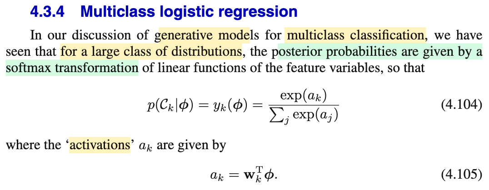
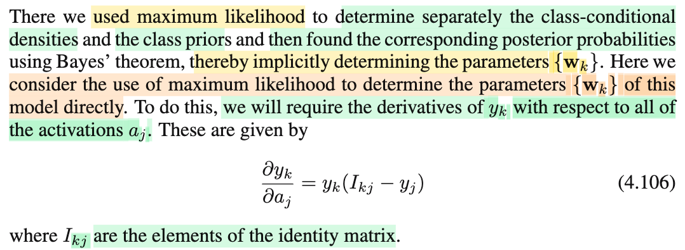
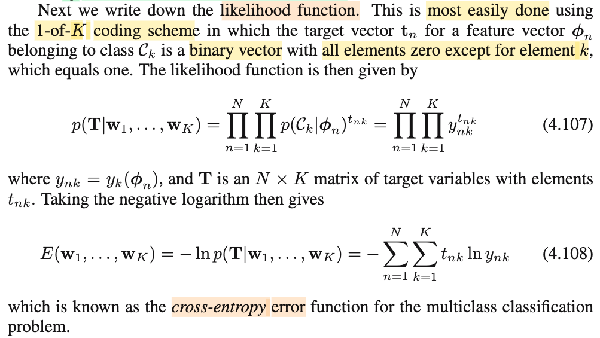
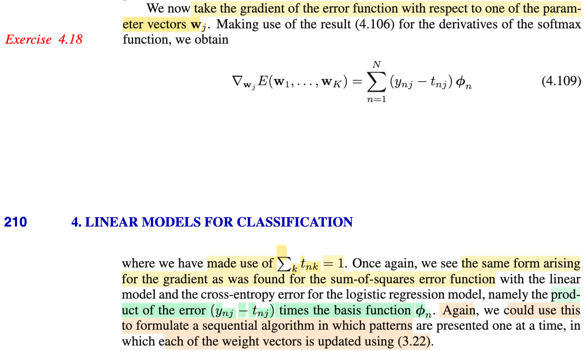
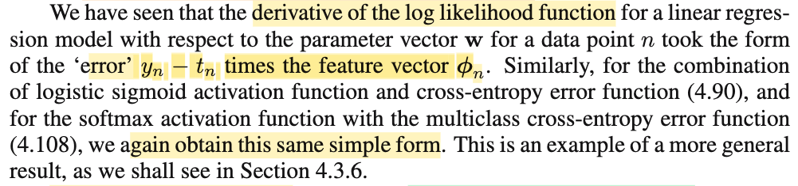
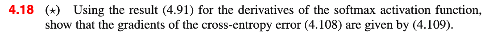
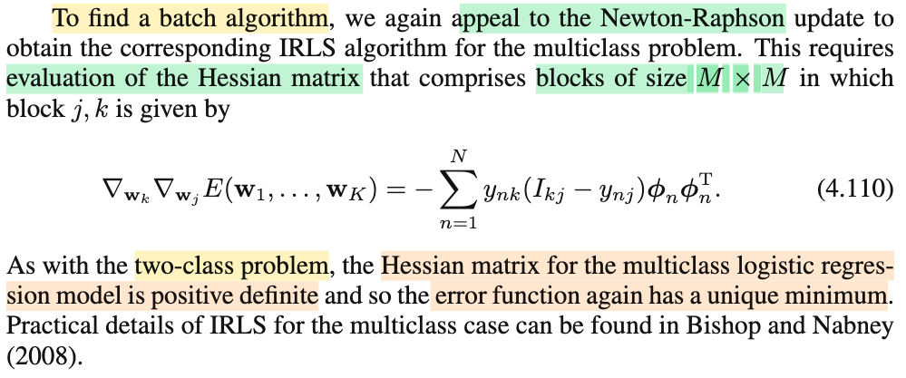
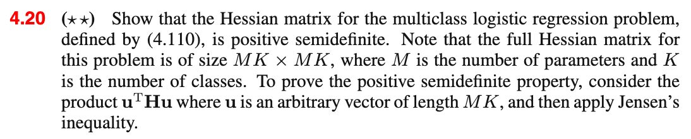

# 4.3.4 Multiclass logistic regression

📊 **Progress:** `5` Notes | `8` Screenshots | `5` AI Reviews

---

 

## Multiclass Logistic Regression

<kbd></kbd>

> [!NOTE]
> Đại ý mở đầu tác giả nhắc lại chút cái ta đã biết ở mấy phần trước, nói rằng "với rất nhiều loại distribution" thì class posterior f(𝒞k|Φ) có dạng một softmax transformation của một hàm tuyến tính của feature Φ. Là sao nhỉ?
>
>
>
> Active recall tí xíu:
>
>
>
> Ta có f(𝒞k|Φ) = f(Φ|𝒞k)f(𝒞k)/f(Φ) (Bayes rule)
>
>
>
> = f(Φ|𝒞k)f(𝒞k)/ Σj f(Φ|𝒞j)f(𝒞j)
>
>
>
> = \[exp ln \[f(Φ|𝒞k)f(𝒞k)\] / Σj exp ln f(Φ|𝒞j)f(𝒞j)
>
>
>
> = exp(ak) / Σj exp(aj), với aj = ln \[f(Φ|𝒞j)f(𝒞j)\]
>
>
>
> ---
>
>
>
> Thế thì, aj này vẫn là hàm phi tuyến đối với Φ. Nhưng nếu xét class conditional density f(Φ|𝒞j) là thành viên của exponential có chung scale param, mà một ví dụ cụ thể là chúng đều là 𝒩(𝛍j, 𝚺) (cùng chung covariance matrix), thì khi đó:
>
>
>
> \[exp ln \[f(Φ|𝒞k)f(𝒞k)\] / Σj exp ln f(Φ|𝒞j)f(𝒞j) sẽ trở thành:
>
>
>
> {exp \[ln f(Φ|𝒞k) + ln f(𝒞k)\]} / Σj exp {ln f(Φ|𝒞j) + ln f(𝒞j)}
>
>
>
> = {exp \[ln f(Φ|𝒞k)\] exp ln f(𝒞k)} / Σj \[exp ln f(Φ|𝒞j)\] exp ln f(𝒞j)
>
>
>
> = exp \[ln f(Φ|𝒞k)\] f(𝒞k) / Σj \[exp ln f(Φ|𝒞j)\] f(𝒞j) (1)
>
>
>
> ---
>
>
>
> Xét exp \[ln f(Φ|𝒞k)\] = exp \[ln \[c(𝚺) exp(-(1/2)(Φ-𝛍k)ᵀ𝚺⁻¹(Φ-𝛍k)\]\]
>
>
>
> = exp \[ln c(𝚺) + ln exp(-(1/2)(Φ-𝛍k)ᵀ𝚺⁻¹(Φ-𝛍k)\]
>
>
>
> = exp \[ln c(𝚺) - (1/2)(Φ-𝛍k)ᵀ𝚺⁻¹(Φ-𝛍k)\]
>
>
>
> = exp \[ln c(𝚺)\] exp\[-(1/2)(Φ-𝛍k)ᵀ𝚺⁻¹(Φ-𝛍k)\]
>
>
>
> = c(𝚺) exp\[-(1/2)(Φᵀ𝚺⁻¹-𝛍kᵀ𝚺⁻¹)(Φ-𝛍k)\]
>
>
>
> = c(𝚺) exp\[-(1/2)(Φᵀ𝚺⁻¹Φ-𝛍kᵀ𝚺⁻¹Φ-Φᵀ𝚺⁻¹𝛍k+𝛍kᵀ𝚺⁻¹𝛍k)\]
>
>
>
> = c(𝚺) exp\[-(1/2)(Φᵀ𝚺⁻¹Φ-2Φᵀ𝚺⁻¹𝛍k+𝛍kᵀ𝚺⁻¹𝛍k)\]
>
>
>
> = c(𝚺) exp\[-(1/2)Φᵀ𝚺⁻¹Φ\] exp\[-(1/2)(-2Φᵀ𝚺⁻¹𝛍k+𝛍kᵀ𝚺⁻¹𝛍k)\]
>
>
>
> = c(𝚺) exp\[-(1/2)Φᵀ𝚺⁻¹Φ\] exp\[Φᵀ𝚺⁻¹𝛍k-(1/2)𝛍kᵀ𝚺⁻¹𝛍k)\]
>
>
>
> Tương tự các cục exp ln f(Φ|𝒞j) ở mẫu cũng sẽ bằng:
>
>
>
> c(𝚺) exp\[-(1/2)Φᵀ𝚺⁻¹Φ\] exp\[Φᵀ𝚺⁻¹𝛍j-(1/2)𝛍jᵀ𝚺⁻¹𝛍j)\]
>
>
>
> Nên: Từ (1), rút gọn có ở cả tử lẫn mẫu số:
>
>
>
> exp\[Φᵀ𝚺⁻¹𝛍k-(1/2)𝛍kᵀ𝚺⁻¹𝛍k)\]f(𝒞k) / Σj exp\[Φᵀ𝚺⁻¹𝛍j-(1/2)𝛍jᵀ𝚺⁻¹𝛍j)\]f(𝒞j)
>
>
>
> =exp\[Φᵀ𝚺⁻¹𝛍k-(1/2)𝛍kᵀ𝚺⁻¹𝛍k)\] exp \[ln f(𝒞k)\] / Σj exp\[Φᵀ𝚺⁻¹𝛍j-(1/2)𝛍jᵀ𝚺⁻¹𝛍j)\] exp \[lnf(𝒞j)\]
>
>
>
> = exp\[Φᵀ𝚺⁻¹𝛍k-(1/2)𝛍kᵀ𝚺⁻¹𝛍k)+ln(f(𝒞k))\] / Σj exp\[Φᵀ𝚺⁻¹𝛍j-(1/2)𝛍jᵀ𝚺⁻¹𝛍j)+ln f(𝒞j)\]
>
>
>
> và đặt lại ak = Φᵀ𝚺⁻¹𝛍k-(1/2)𝛍kᵀ𝚺⁻¹𝛍k+ln(f(𝒞k))
>
>
>
> ta có exp(ak) / Σj exp(aj), với ak là hàm tuyến tính của Φ.

📹 [Xem video trên YouTube](https://www.youtube.com/watch?v=-9YldVmpmPU)

> [!TIP]
> 🤖 **AI Check** — 🟢 Pass — ✅ **95/100** · ✓ Move on
>
> Ghi chú rất xuất sắc, tự giác suy luận và chứng minh lại tại sao mô hình sinh (với phân phối Gauss cùng ma trận hiệp phương sai) lại dẫn đến hàm softmax dạng tuyến tính theo đúng tinh thần của sách.
>
> **✓ Strengths**
> - Tự giác thực hiện active recall giải thích cặn kẽ nhận định 'for a large class of distributions' của tác giả thay vì chỉ học vẹt công thức.
> - Khai triển đại số chính xác với giả định phân phối chuẩn đa biến cùng ma trận hiệp phương sai, triệt tiêu thành công số hạng bậc hai để thu được hàm tuyến tính đối với biến đặc trưng.
>
> **💡 Deeper notes**
> - Trong công thức (4.105), tác giả Bishop quy ước vector đặc trưng phi đã bao gồm phần tử bias (dummy feature phi_0 = 1) nên a_k được viết gọn là w_k^T phi; trong khai triển của bạn, hằng số -(1/2)mu_k^T Sigma^-1 mu_k + ln P(C_k) chính là trọng số định kiến (bias w_{k0}) đó.
> - Việc lấy exp(ln(...)) rồi lại tách ra có phần hơi thừa bước đại số (chỉ cần triệt tiêu trực tiếp phần tử chung từ f(Phi|C_k)), nhưng kết quả cuối cùng hoàn toàn chính xác.

**🔗 See also:** [PDF Gaussian Đa Biến](./124_the_gaussian_distribution.md#node-40ke7sj)

 

### Activation Derivative for Maximum Likelihood

<kbd></kbd>

> [!NOTE]
> Tiếp, đại ý là như ta đã hiểu, với cách tiếp cận đi xây class posterior f(𝒞k|Φ) theo lối gián tiếp:
>
>
>
> Ta áp giả định phù hợp cho các class conditional density f(Φ|𝒞1),..f(Φ|𝒞K) thì kết quả mới có được là class posterior f(𝒞k|Φ) mới có dạng softmax transform của các activation là hàm tuyến tính của feature (như note trước vừa thấy). Đó là cái thứ nhất.
>
>
>
> Và để có được hình dạng của class posterior, tức inference ra class posterior parameter thì ta phải đi đường vòng:
>
>
>
> Tức là đầu tiên đi inference class conditional density f(Φ|𝒞k), rồi prior f(𝒞k) (dùng MLE, để estimator cái cái tham số như 𝛍1,..𝛍K, 𝚺, và tham số của f(𝒞k) mà trong case K=2, ta gọi là π, là f(𝒞1) đó)
>
>
>
> Cuối cùng mới dùng Bayes rule để có f(𝒞k|Φ)
>
>
>
> ---
>
>
>
> Thế thì có thể hiểu cách làm gián tiếp này chính là một cách gián tiếp, ta đã estimate tham số 𝐰 của f(𝒞k|Φ) = exp(ak)/Σj exp(aj) với ak = 𝐰kᵀΦ
>
>
>
> Cho nên, nay ta sẽ chuyển qua inference trực tiếp 𝐰, mà ý nghĩa của nó là, ta khỏi cần áp giả định phù hợp lên các class conditional density để có được dạng ak là hàm tuyến tính của Φ nữa, mà ta phang luôn giả định này vào class posterior, và chỉ việc đi estimate 𝐰 luôn.
>
>
>
> ---
>
>
>
> Vậy thì trong mô hình f(𝒞k|Φ) = exp(ak)/Σj exp(aj) với ak = 𝐰ᵀkΦ, nó đi qua hàm softmax nên sẽ cần chuẩn bị đạo hàm:
>
>
>
> Nên nhớ, với input Φ ta sẽ có output là một vector (y1,....yK)ᵀ, với yk = f(𝒞k|Φ) = exp(ak)/Σj exp(aj) và ak = 𝐰kᵀΦ. Do đó, yk là một hàm số vector → scalar yk(a1,...aK). Nên phải chuẩn bị gradient của hàm này, ∇yk.
>
>
>
> yk = f(𝒞k|Φ) = exp(ak)/Σj exp(aj)
>
>
>
> Xét ∂/∂ak yk:
>
>
>
> = ∂/∂ak \[exp(ak)/Σj exp(aj)\]  
>
>
>
> Dùng quotient rule | (u/v)' = (u' v - u v')/v²
>
>
>
> = {\[∂/∂ak exp(ak)\] Σj exp(aj) - exp(ak) \[∂/∂ak Σj exp(aj)\]} / \[Σj exp(aj)\]²
>
>
>
> = {exp(ak) Σj exp(aj) - exp(ak) exp(ak)} / \[Σj exp(aj)\]²
>
>
>
> = {exp(ak) Σj exp(aj) - exp(ak) exp(ak)} / \[Σj exp(aj)\]²
>
>
>
> = {exp(ak) \[Σj exp(aj) - exp(ak)\]} / \[Σj exp(aj)\]²
>
>
>
> = \[exp(ak) / Σj exp(aj)\] \[Σj exp(aj) - exp(ak)\] / Σj exp(aj)
>
>
>
> = yk \[1 - exp(ak) / Σj exp(aj)\]
>
>
>
> = yk (1 - yk)
>
>
>
> ---
>
>
>
> Xét ∂/∂aj yk, với j ≠ k:
>
>
>
> ∂/∂aj \[exp(ak)/Σi exp(ai)\]
>
>
>
> = {\[∂/∂aj exp(ak)\] Σi exp(ai) - exp(ak) \[∂/∂aj Σi exp(ai)\]} / \[Σi exp(ai)\]²
>
>
>
> = \[0 × Σi exp(ai) - exp(ak) exp(aj)\] / \[Σi exp(ai)\]²
>
>
>
> = \[- exp(ak) exp(aj)\] / \[Σi exp(ai)\]²
>
>
>
> = \[-exp(ak)/ Σi exp(ai)\] × \[exp(aj)\] / Σi exp(ai)\]
>
>
>
> = -yk yj
>
>
>
> Vậy ∂/∂ak yk = yk (1 - yk) và ∂/∂aj yk = -yk yj, ta ghi = yk (0 - yj) với j ≠ k
>
>
>
> Để thể hiện kết ∂/∂aj yk một cách khái quát cho cả case j=k và j khác k ta viết thành:
>
>
>
> ∂/∂aj yk = yk (I\_{k=j} - yj), với I\_{k=j} = 1 khi k=j và 0 khi k khác j
>
>
>
> Và nếu dùng matrix 𝐈 (vốn dĩ là matrix có 𝐈kj = 1 khi k=j và bằng 0 khi k≠j thì ta có công thức trên trở thành ∂/∂aj yk = yk (𝐈kj - yj)

📹 [Xem video trên YouTube](https://www.youtube.com/watch?v=RfrcgvaQmgU)

> [!TIP]
> 🤖 **AI Check** — 🟢 Pass — ✅ **100/100** · ✓ Move on
>
> Ghi chú xuất sắc! Bạn đã đối chiếu rất rõ ràng giữa mô hình sinh (generative) và mô hình phân biệt (discriminative), đồng thời tự chứng minh chi tiết từng bước đạo hàm hàm softmax thay vì chỉ chép lại công thức.
>
> **✓ Strengths**
> - Hiểu sâu sắc sự khác biệt cốt lõi giữa tiếp cận gián tiếp (generative - ước lượng prior và class-conditional density rồi dùng Bayes) và trực tiếp (discriminative - giả định trực tiếp dạng hàm posterior rồi ước lượng tham số w bằng MLE).
> - Tự triển khai đạo hàm hàm softmax theo quy tắc đạo hàm phân thức (quotient rule) đầy đủ và chính xác cho cả hai trường hợp j = k và j ≠ k.
> - Tổng hợp khéo léo kết quả hai trường hợp về dạng chuẩn sử dụng phần tử của ma trận đơn vị Ikj (hoặc ký hiệu Kronecker delta).
>
> **💡 Deeper notes**
> - Ký hiệu phần tử ma trận đơn vị Ikj trong toán học và học máy thường được gọi là ký hiệu Kronecker delta (ký hiệu là δkj), mang ý nghĩa bằng 1 khi k = j và bằng 0 khi k ≠ j.
> - Do các yk có tổng bằng 1 (ràng buộc simplex), ma trận Jacobian ∂y/∂a thực chất bị suy biến (rank tối đa là K - 1), phản ánh tính chất redundant/over-parameterized của hàm softmax nếu không cố định một w làm mốc.

**🔗 See also:** [Gradient of Softmax Error Function](#node-8j52rv4) · [Hessian for Multiclass Logistic Regression](#node-y3mt2hk)

 

#### Multiclass Cross-Entropy Error Function

<kbd></kbd>

> [!NOTE]
> Tiếp theo là đi xây dựng likelihood function.
>
>
>
> Viết lại cái khung của bài toán point estimation tham số θ của sample X1,...Xn iid \~ f(x|θ). Ta sẽ đi tìm θ sao cho maximize hàm likelihood L(θ|𝐱), mang ý nghĩa là độ hợp lý của θ khi quan sát thấy giá trị của 𝐗 là bằng 𝐱, và giá trị hàm L(θ|𝐱) theo định nghĩa = f(𝐱|θ) = f(x1,x2..xn|θ), nhờ tính independent của X1,...Xn, = Πi f(xi|θ).
>
>
>
> Vậy ở đây một observation (tức một data point) sẽ là một cặp (Φ, class của nó), và class variable, ta sẽ dùng cách thể hiện 1-of-K coding scheme, tức thể hiện giá trị của target variable bởi một vector K chiều có số 1 tại vị trí tương ứng với class number của data point, còn lại là 0. Nên ta có data point thứ ith sẽ biểu thị bởi (Φi, 𝐭i) (và ta có i = 1,2...N)
>
>
>
> Nên joint distribution f(𝐱|θ) ở đây sẽ là f(Φ1,Φ2,...ΦN,𝐭1,𝐭2,..𝐭N|θ) (tạm dùng θ để chỉ tất cả tham số)
>
>
>
> Tiếp ta làm động tác tương tự như trong bài toán regression: sẽ chỉ coi 𝐭 là random variable, để chuyển joint distribution này thành f(𝐭1,𝐭2,..𝐭N|θ,Φ1,Φ2,...ΦN)
>
>
>
> Dùng tính chất độc lập của data, tách f(𝐭1,𝐭2,..𝐭N|θ,Φ1,Φ2,...ΦN) thành:
>
>
>
> f(𝐭1,𝐭2,..𝐭N|θ,Φ1,Φ2,...ΦN) = f(𝐭1|θ,Φ1)f(𝐭2|θ,Φ2)....f(𝐭N|θ,ΦN) (vẫn đang mượn θ,...để chỉ tham số của distribution) (1)
>
>
>
> Rồi, tới đây mới dùng việc ta đang giả định distribution của 𝐭, để xem f(𝐭1|θ,Φ1),f(𝐭2|θ,Φ2),.... hay f(𝐭|θ,Φ) là cái gì:
>
>
>
> ---
>
>
>
> Ta đã nói rằng ta sẽ phang thẳng giả định rằng: f(𝒞k|Φ) = P(C = 𝒞k|Φ) = yk = exp(ak) / Σj exp(aj) với ak = 𝐰kᵀΦ
>
>
>
> và cái này chính là giả định P(Tk=1|Φ) = yk = exp(ak) / Σj exp(aj) với ak = 𝐰kᵀΦ
>
>
>
> Và P(Tk=1|Φ) thì cũng chính là P(𝐓=\[one hot vector có số 1 tại vị trí k\]|Φ) = P(T1=0, T2=0,...,Tk=1,...,TK=0). Vì sao?
>
>
>
> Đơn giản là vì theo one-of-K coding scheme thì Tk = 1 ⇔ 𝐓=\[one hot vector có số 1 tại vị trí k\]
>
>
>
> Nên ta có P(𝐓=\[one hot vector có số 1 tại vị trí k\]|Φ) = yk
>
>
>
> Và để thể hiện một cách tổng quát, ta thể hiện như sau: P(𝐓=𝐭|Φ) = Πk=1:K (yk^tk)
>
>
>
> ghi rõ ra yk phụ thuộc Φ, 𝐰1,...𝐰K: P(𝐓=𝐭|Φ) = Πk=1:K (yk(Φ, 𝐰1,..𝐰K)^tk) để thấy rõ tham số của distribution này là 𝐰1,..𝐰K
>
>
>
> Và P(𝐓=𝐭|Φ) này chính là f(𝐭|θ,Φ) ở trên, nên lúc này ta sẽ ghi là f(𝐭|𝐰1,𝐰2,...𝐰K, Φ)
>
>
>
> ---
>
>
>
> Từ đó quay lại (1), ta có:
>
>
>
> f(𝐭1,𝐭2,..𝐭N|θ,Φ1,Φ2,...ΦN) = f(𝐭1|𝐰1,𝐰2,...𝐰K, Φ1) × f(𝐭2|𝐰1,𝐰2,...𝐰K, Φ2) × ... × f(𝐭N|𝐰1,𝐰2,...𝐰K, ΦN)
>
>
>
> = Πk=1:K (y1k^t1k) × Πk=1:K (y2k^t2k) × ....× × Πk=1:K (yNk^tNk)
>
>
>
> = Πn=1:N \[Πk=1:K (ynk^tnk)\] → chính là 4.107.
>
>
>
> Đương nhiên giờ ta có thể thay θ = 𝐰1,...𝐰K và gom 𝐭1,...𝐭N thành matrix 𝐓, để có:
>
>
>
> f(𝐓|𝐰1,𝐰2,...𝐰K,Φ1,Φ2,...ΦN) = Πn=1:N \[Πk=1:K (ynk^tnk)\]
>
>
>
> và làm động tác giản lược bớt bằng cách cố tình không ghi Φ1,Φ2,...ΦN ra, nhưng phải nhớ nó có phụ thuộc
>
>
>
> Và đây chính là cái f(𝐱|θ) trong cái khung ở trên, nên cũng chính là likelihood (khi coi nó là hàm của 𝐰1,...𝐰K):
>
>
>
> L(𝐰1,...𝐰K|𝐓) = Πn=1:N \[Πk=1:K (ynk^tnk)\]
>
>
>
> ---
>
>
>
> Tương tự như đã quen, ta sẽ lấy ln, (để chuyển thành bài toán tương đương maximize ln likelihood do ln là hàm monotone increasing)
>
>
>
> ln L = ln \[Πn=1:N \[Πk=1:K (ynk^tnk)\]\]
>
>
>
> = Σn=1:N ln \[Πk=1:K (ynk^tnk)\]
>
>
>
> = Σn=1:N Σk=1:K \[ln(ynk^tnk)\]
>
>
>
> = Σn=1:N Σk=1:K \[tnk ln(ynk)\] → 4.108
>
>
>
> Và lấy dấu âm, để chuyển thành bài toán minimize objective, cái ta có chính là cross entropy loss (error) function (bữa trước là binary cross entropy)
>
>
>
> E(𝐰) = - Σn=1:N Σk=1:K \[tnk ln(ynk)\]

📹 [Xem video trên YouTube](https://youtu.be/S4kORpAgTsQ)

> [!TIP]
> 🤖 **AI Check** — 🟢 Pass — ✅ **100/100** · ✓ Move on
>
> Ghi chú xuất sắc! Bạn đã giải thích và diễn giải tường minh từng bước từ mô hình xác suất có điều kiện (Multinoulli), tính độc lập giữa các mẫu, dạng tích lũy thừa của 1-of-K coding cho đến hàm Cross-Entropy nhiều lớp.
>
> **✓ Strengths**
> - Diễn giải cực kỳ rõ ràng vì sao phân phối xác suất của vector 1-of-K lại viết được dưới dạng tích lũy thừa P(T=t|Φ) = Π y_k^{t_k}.
> - Nêu bật được bản chất đây là conditional likelihood (mô hình discriminative coi t là biến ngẫu nhiên và điều kiện hóa trên Φ).
> - Các bước biến đổi đại số từ tích sang tổng logarit và đổi dấu để thành hàm mất mát (loss function) hoàn toàn chính xác.
>
> **💡 Deeper notes**
> - Hàm phân phối này thực chất là phân phối Categorical (hay Multinoulli / Generalized Bernoulli). Dạng tích lũy thừa Π y_k^{t_k} tương tự như Bernoulli (y^t (1-y)^{1-t}) nhưng mở rộng cho K classes với ràng buộc vector t có đúng một phần tử bằng 1 và tổng y_k bằng 1.

 

##### Gradient of Softmax Error Function

<kbd></kbd>

<kbd></kbd>

<kbd></kbd>

> [!NOTE]
> Đến đây ta đã có E(𝐰) = - Σn=1:N Σk=1:K \[tnk ln(ynk)\]
>
>
>
> Đương nhiên ta hiểu nó là E(𝐰1, 𝐰2,...𝐰K), hay gom 𝐰1, 𝐰2,...𝐰K lại thành 𝐖 ta có E(𝐖)
>
>
>
> Khi đã có error (loss) function, hoặc đã có log likelihood, việc tiếp theo là dùng điều kiện cần bậc nhất maximum likelihood estimator của 𝐖
>
>
>
> Thì giải bài toán tìm MLE của 𝐰1, 𝐰2,...𝐰K ta có thể giải lần lượt từng cái (ý là, tìm MLE của 𝐰1, thì coi E(𝐖) là hàm của 𝐰1, với 𝐰2,....fix. Sau đó dùng điều kiện cần bậc nhất: Cho đạo hàm của E đối với 𝐰1 bằng 0 để giải ra 𝐰1_ML.(Trên lí thuyết là vậy, nhưng thực tế với bài toán này, không thể giải theo cách này, mà phải dùng thuật toán iterative để tìm 𝐰 giúp gradient = 0)
>
>
>
> Do đó ta chuẩn bị các đạo hàm của E theo 𝐰j, j = 1,2...K
>
>
>
> E(𝐰1, 𝐰2,...𝐰K) = - Σn=1:N Σk=1:K \[tnk ln(ynk)\]
>
>
>
> ⇒ ∂/∂𝐰j E(𝐖) = ∂/∂𝐰j  \[- Σn=1:N Σk=1:K \[tnk ln(ynk)\]\]
>
>
>
> = - Σn=1:N ∂/∂𝐰j  \[Σk=1:K \[tnk ln(ynk)\]\]
>
>
>
> = - Σn=1:N Σk=1:K ∂/∂𝐰j  \[tnk ln(ynk)\] (1)
>
>
>
> ---
>
>
>
> Xét Σk=1:K ∂/∂𝐰j  \[tnk ln(ynk)\]
>
>
>
> Bỏ index n cho gọn, tí ta sẽ thêm lại (tức là thay vì xét vector 𝐭n, 𝐲n của data point n'th, thì xét vector 𝐭, 𝐲 nói chung:
>
>
>
> Σk=1:K ∂/∂𝐰j  \[tk ln(yk)\]
>
>
>
> = Σk=1:K tk \[∂/∂𝐰j  ln(yk)\]
>
>
>
> 𝐰j → aj(𝐰j) = 𝐰jᵀΦ
>
>
>
> yk = exp(ak)/ Σi exp(ai)| aj → yk
>
>
>
> yk → ln(yk)
>
>
>
> = Σk=1:K tk \[(d/dyk ln(yk)) . (∂/∂aj yk) . (∂/∂𝐰j  aj)\] (chain rule)
>
>
>
> Dùng kết quả ∂/∂aj yk = yk (𝐈kj - yj)
>
>
>
> Và aj = 𝐰jᵀΦ = Σi 𝐰ji × Φi ⇒ ∂/∂𝐰j  aj = \[∂/∂𝐰j1 aj, ∂/∂𝐰j2 aj,....\]ᵀ= Φ
>
>
>
> cũng như d/dx ln(x) = 1/x ⇒ d/dyk ln(yk)
>
>
>
> = Σk=1:K tk \[(1/yk) . (yk (𝐈kj - yj)) . (Φ)\]
>
>
>
> = Σk=1:K tk (1/yk) yk (𝐈kj - yj) Φ
>
>
>
> = \[Σk=1:K tk (𝐈kj - yj)\] Φ
>
>
>
> = \[Σk=1:K (tk 𝐈kj - tk yj)\] Φ
>
>
>
> = \[Σk=1:K (tk 𝐈kj) - yj Σk=1:K (tk)\] Φ
>
>
>
> = \[Σk=1:K (tk 𝐈kj) - yj Σk=1:K (tk)\] Φ
>
>
>
>
>
> Xét Σk=1:K tk 𝐈kj = t1 𝐈1j + t2 𝐈2j + ... tj 𝐈jj + = t1 × 0 + t2 × 0 + ...tj × 1 = tj
>
>
>
> còn Σk=1:K (tk) = 1 (do 𝐭 là one-hot vector)
>
>
>
> nên:
>
>
>
> .. = (tj - yj) Φ
>
>
>
> Vậy Σk=1:K ∂/∂𝐰j  \[tk ln(yk)\] = (tj - yj) Φ
>
>
>
> ⇒ Σk=1:K ∂/∂𝐰j  \[tnk ln(ynk)\] = (tnj - ynj) Φn (thêm lại index n, để chuyển từ vector 𝐭, 𝐲, Φ nói chung thành vector 𝐭n, 𝐲n, Φn của datapoint thứ n)
>
>
>
> ---
>
>
>
> Thế vào lại (1):
>
>
>
> ∂/∂𝐰j  E(𝐖) = - Σn=1:N Σk=1:K ∂/∂𝐰j  \[tnk ln(ynk)\]
>
>
>
> = - Σn=1:N (tnj - ynj) Φn
>
>
>
> = Σn=1:N (ynj - tnj) Φn → 4.109
>
>
>
> ---
>
>
>
> Như vậy có thể thấy nó có cái dạng giống như kết quả khi ta làm với SSE: linear combination các vector feature Φn với trọng số là sai số giữa ynj và tnj
>
>
>
> Do đó, ta có thể dùng sequential algorithm, tức là tính lại (cập nhật) gradient ∂/∂𝐰j  E(𝐖) khi có thêm data và dùng nó để update 𝐰j.

📹 [Xem video trên YouTube](https://www.youtube.com/watch?v=SNbte9J7NL8)

> [!TIP]
> 🤖 **AI Check** — 🟢 Pass — ✅ **100/100** · ✓ Move on
>
> Ghi chú xuất sắc, trình bày chi tiết và hoàn toàn chính xác từng bước biến đổi đạo hàm của hàm lỗi cross-entropy theo vector trọng số w_j đúng theo yêu cầu của bài tập 4.18.
>
> **✓ Strengths**
> - Thực hiện đầy đủ, mạch lạc từng bước của quy tắc chuỗi (chain rule) để tính đạo hàm riêng qua biến trung gian a_j.
> - Khai thác chính xác tính chất của hàm softmax và tính chất one-hot vector (tổng t_k = 1 và tổng t_k * I_kj = t_j) để rút gọn biểu thức.
> - Liên hệ sâu sắc kết quả tìm được với dạng tổng quát 'lỗi nhân với feature vector' và ứng dụng trong thuật toán học tuần tự (sequential/SGD).
>
> **💡 Deeper notes**
> - Ký hiệu I_kj trong Bishop đóng vai trò là delta Kronecker (thường ký hiệu là δ_kj), bằng 1 khi k = j và bằng 0 khi k ≠ j.
> - Trong bài toán phân loại nhiều lớp, hàm log-likelihood là hàm lồi (convex/concave) theo W nên không có cực trị địa phương (local minima), tuy nhiên nghiệm tối ưu không có dạng đóng (closed-form) nên cần dùng các thuật toán lặp như Newton-Raphson (IRLS) hoặc Gradient Descent.

**🔗 See also:** [Activation Derivative for Maximum Likelihood](#node-bhochq3)

 

###### Hessian for Multiclass Logistic Regression

<kbd></kbd>

<kbd></kbd>

> [!NOTE]
> Khúc này đại khái là nói về việc dùng thuật toán Newton Raphson để update tham số.
>
>
>
> Ở đây mình có thể hiểu theo kiểu gom hết các vector 𝐰j thành vector dài 𝐖 (thay vì matrix 𝐖) (để E(𝐖) vẫn là hàm vector → scalar, giúp đạo hàm cấp 1 vẫn là gradient vector và cấp 2 là Hessian matrix)
>
>
>
> Nhớ lại, thuật toán N-R ta sẽ update tham số của mô hình theo lối iterative 𝐖 bằng Newton step:
>
>
>
> 𝐖(new) = 𝐖(old) - ∇²E(𝐖(old))⁻¹ ∇E(𝐖(old))
>
>
>
> (ôn nhanh, idea là tại vị trí 𝐖(old), ta sẽ minimize hàm xấp xỉ bậc hai của E(𝐖): là
>
>
>
> f(𝐱) ≈ f(𝐱0) + ∇f(𝐱0)ᵀ(𝐱-𝐱0) + (1/2)(𝐱-𝐱0)ᵀ∇²f(𝐱0)(𝐱-𝐱0)
>
>
>
> g(𝐖) = E(𝐖(old)) + ∇E(𝐖(old))ᵀ(𝐖-𝐖(old)) + (1/2)(𝐖-𝐖(old))ᵀ ∇²E(𝐖(old)) (𝐖-𝐖(old))
>
>
>
> Đổi biến thành g(𝐃) = E(𝐖(old)) + ∇E(𝐖(old))ᵀ(𝐃) + (1/2)𝐃ᵀ ∇²E(𝐖(old)) 𝐃
>
>
>
> Và để minimize hàm g(𝐃), là một quadratic function của 𝐖, dùng điều kiện cần bậc nhất:
>
>
>
> ∇g(𝐃) = 0 ⇔ ∇²E(𝐖(old)) 𝐃 + ∇E(𝐖(old) = 0 ⇔ ∇²E(𝐖(old) 𝐃 = -∇E(𝐖(old)
>
>
>
> ⇔ 𝐃 = -∇²E(𝐖(old)⁻¹ ∇E(𝐖(old) đây chính là Newton step.
>
>
>
> Từ đó 𝐖 = 𝐖(old) + D = 𝐖(old) - ∇²E(𝐖(old))⁻¹ ∇E(𝐖(old))
>
>
>
> ---
>
>
>
> Nên ta cần chuẩn bị công thức của Hessian cũng như chứng minh nó là matrix xác định bán dương.
>
>
>
> Đây là bài toán (4.20) khá khó (2 sao).
>
>
>
> Đầu tiên thử giải thích xem vì sao tác giả nói Hessian lại comprise cáck block M x M..:
>
>
>
> ---
>
>
>
> Hiểu thế này: xét K=2,M=3 cho dễ hình dung, thì vector 𝐖 = là vector dài 2M là hai vector 𝐰1, và 𝐰2 nối đuôi nhau:
>
>
>
> = \[w11, w12, w13, w21, w22, w23\]ᵀ
>
>
>
> Đương nhiên gradient sẽ là vector các partial derivative:
>
>
>
> \[∂E/∂w11, ∂E/∂w12, ∂E/∂w13, ∂E/∂w21, ∂E/∂w22, ∂E/∂w23\]ᵀ
>
>
>
> (chính là ∇𝐰1 E(𝐖) nối đuôi ∇𝐰2 E(𝐖)
>
>
>
> Và Hessian, (cũng Jacobian của ∇E(𝐖) đối với vector 𝐖) là matrix mà:
>
>
>
> hàng 1 sẽ là vector các đạo hàm riêng của ∂E/∂w11 đối với w11, w12, w13, w21, w22, w23
>
>
>
> hàng 2 sẽ là vector các đạo hàm riêng của ∂E/∂w12 đối với w11, w12, w13, w21, w22, w23
>
>
>
> hàng 3 sẽ là vector các đạo hàm riêng của ∂E/∂w13 đối với w11, w12, w13, w21, w22, w23
>
>
>
> hàng 4 sẽ là vector các đạo hàm riêng của ∂E/∂w21 đối với w11, w12, w13, w21, w22, w23
>
>
>
> hàng 5 sẽ là vector các đạo hàm riêng của ∂E/∂w22 đối với w11, w12, w13, w21, w22, w23
>
>
>
> hàng 6 sẽ là vector các đạo hàm riêng của ∂E/∂w23 đối với w11, w12, w13, w21, w22, w23
>
>
>
>
>
> Ta sẽ nhìn thấy pattern sau: H sẽ là matrix 6 × 6 (tí nữa khái quát là MK × MK), có thể nhìn như matrix gồm 4 = K × K block matrix 3 × 3
>
>
>
> Tại vị trí 1,1 chính là matrix đạo hàm của hàm số ∂/∂𝐰1 E(𝐖) đối với 𝐰1
>
>
>
> Tại vị trí 2,2 chính là matrix đạo hàm của hàm số ∂/∂𝐰2 E(𝐖) đối với 𝐰2
>
>
>
> Tại vị trí 1,2 chính là matrix đạo hàm của hàm số ∂/∂𝐰1 E(𝐖) đối với 𝐰2
>
>
>
> Tại vị trí 2,1 chính là matrix đạo hàm của hàm số ∂/∂𝐰2 E(𝐖) đối với 𝐰1
>
>
>
> Khái quát lên, với K class, M chiều thì Hessian của E(𝐖) sẽ là block matrix MK × MK gồm K × K block matrix kích thước M × M
>
>
>
> và block j,k mà matrix đạo hàm của ∂/∂𝐰j E(𝐖) đối với vector 𝐰k: kí hiệu ∂/∂𝐰k \[∂/∂𝐰j E(𝐖)\]
>
>
>
> hay ∇\_𝐰k ∇\_𝐰j E(𝐖)
>
>
>
> ---
>
>
>
>
>
> Ta thử tính ∇\_𝐰k ∇\_𝐰j E(𝐖):
>
>
>
> Đã có ∇\_𝐰j E(𝐖) = Σn=1:N (ynj - tnj) Φn
>
>
>
> lấy đạo hàm đối với 𝐰k:
>
>
>
> ∂/∂𝐰k \[∂/∂𝐰j E(𝐖)\]
>
>
>
> = ∂/∂𝐰k \[Σn=1:N (ynj - tnj) Φn\]
>
>
>
> = Σn=1:N \[∂/∂𝐰k (ynj - tnj) Φn\]
>
>
>
> Xét \[∂/∂𝐰k (ynj - tnj) Φn\]
>
>
>
> Bỏ index n: ∂/∂𝐰k (yj - tj) Φ
>
>
>
> = ∂/∂𝐰k (yj Φ) - ∂/∂𝐰k (tj Φ)
>
>
>
> = ∂/∂𝐰k (yj Φ)
>
>
>
> yj Φ = \[yj Φ1, yj Φ2, ....yj ΦM\]ᵀ
>
>
>
> = \[∂/∂𝐰k (yj)\] Φ + yj \[∂/∂𝐰k Φ\] (product rule: (uv)' = u' v + u v')
>
>
>
> = Φ . ∂/∂𝐰k (yj)
>
>
>
> = Φ . \[∂/∂ak (yj) . ∂/∂𝐰k ak\] (chain rule)
>
>
>
> ∂/∂𝐰k ak = Φ và dùng kết quả bữa trước (xem link) ∂/∂aj yk = yk (𝐈kj - yj) ⇒ ∂/∂ak (yj) = yj(𝐈jk - yk)
>
>
>
> ...= Φ . yj(𝐈jk - yk) . Φ
>
>
>
> Và do hàm số ∂/∂𝐰j E(𝐖) đối với 𝐰k là **vector → vector function** nên ∂/∂𝐰k \[∂/∂𝐰j E(𝐖)\] là **Jacobian** **matrix**:
>
>
>
> Nên Φ . yj(𝐈jk - yk) . Φ = Φ × yj(𝐈jk - yk) × Φᵀ
>
>
>
> = yj(𝐈jk - yk) ΦΦᵀ
>
>
>
> Vậy ∂/∂𝐰k \[∂/∂𝐰j E(𝐖)\] = Σn=1:N ynj(𝐈jk - ynk) ΦnΦnᵀ
>
>
>
> = Σn=1:N (ynj 𝐈jk - ynj ynk) ΦnΦnᵀ
>
>
>
> Vì 𝐈jk chỉ = 1 khi j = k, nên khi j = k thì ynj = ynk và ynj 𝐈jk = ynk 𝐈jk
>
>
>
> còn khi j khác k thì ynj 𝐈jk = ynk 𝐈jk = 0
>
>
>
> nên công thức trên sẽ là
>
>
>
> = Σn=1:N ynk (𝐈kj - ynj) ΦnΦnᵀ chính là 4.110
>
>
>
> ---
>
>
>
> Câu khó là chứng minh matrix Hessian này xác định bán dương. (làm sau)

📹 [Xem video trên YouTube](https://www.youtube.com/watch?v=Sz2QRKW9wLA)

> [!TIP]
> 🤖 **AI Check** — 🟡 Minor issues — ✅ **92/100** · ✓ Move on
>
> Note trình bày rất tốt cấu trúc ma trận khối của Hessian và tự dẫn xuất thành công công thức (4.110) một cách mạch lạc.
>
> **🟡 Minor issues**
>
> **1.** *"Φ . yj(𝐈jk - yk) . Φ = Φ × yj(𝐈jk - yk) × Φᵀ = yj(𝐈jk - yk) ΦΦᵀ"*
>
> Ký hiệu phép nhân giữa các vector ở bước trung gian hơi tự do trước khi chuyển thành tích ngoài (outer product). Về mặt giải tích ma trận chuẩn tắc: ∂(yj Φ)/∂wk = Φ (∂yj/∂wk)ᵀ = Φ (yj(Ijk - yk) Φ)ᵀ = yj(Ijk - yk) Φ Φᵀ.
>
>
> **✓ Strengths**
> - Minh họa trực quan và chính xác cấu trúc ma trận khối MK x MK gồm K x K khối kích thước M x M thông qua ví dụ K=2, M=3.
> - Tự triển khai quy tắc chuỗi và sử dụng khéo léo tính đối xứng y_nj I_jk = y_nk I_kj để thu được dạng công thức như sách giáo khoa.
> - Ôn tập súc tích và đúng bản chất của bước lặp Newton-Raphson thông qua xấp xỉ Taylor bậc hai.
>
> **💡 Deeper notes**
> - Trong ảnh chụp sách PRML ở công thức (4.110) có dấu trừ ở vế phải — đây là lỗi in ấn nổi tiếng trong ấn bản đầu của Bishop (đã có trong Errata chính thức). Dẫn xuất dấu dương của bạn là chính xác vì Hessian của hàm lỗi âm log-likelihood phải là ma trận xác định bán dương.

**🔗 See also:** [Activation Derivative for Maximum Likelihood](#node-bhochq3) · [Iterative Reweighted Least Squares](./433_iterative_reweighted_least_squares.md#node-q3zyd3g)

 

