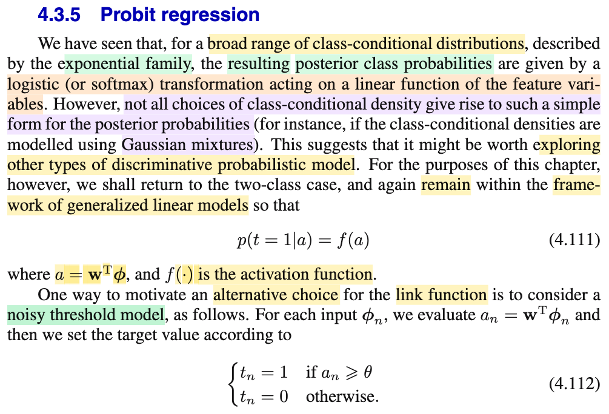
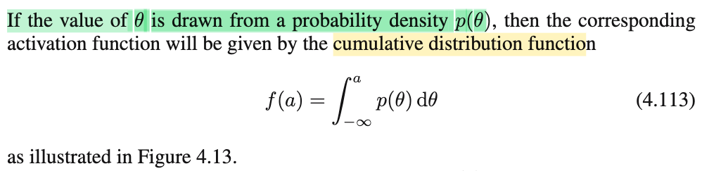
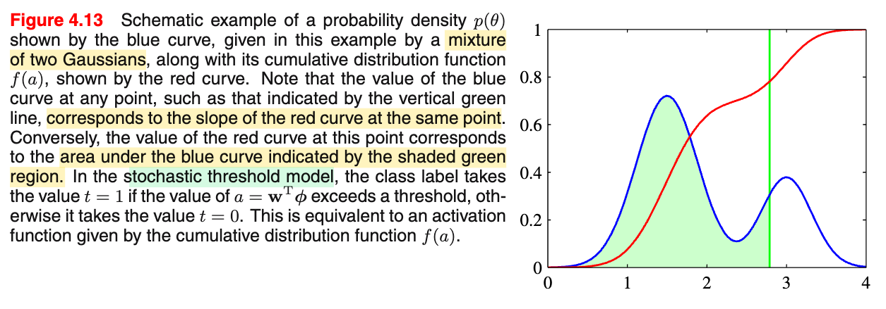
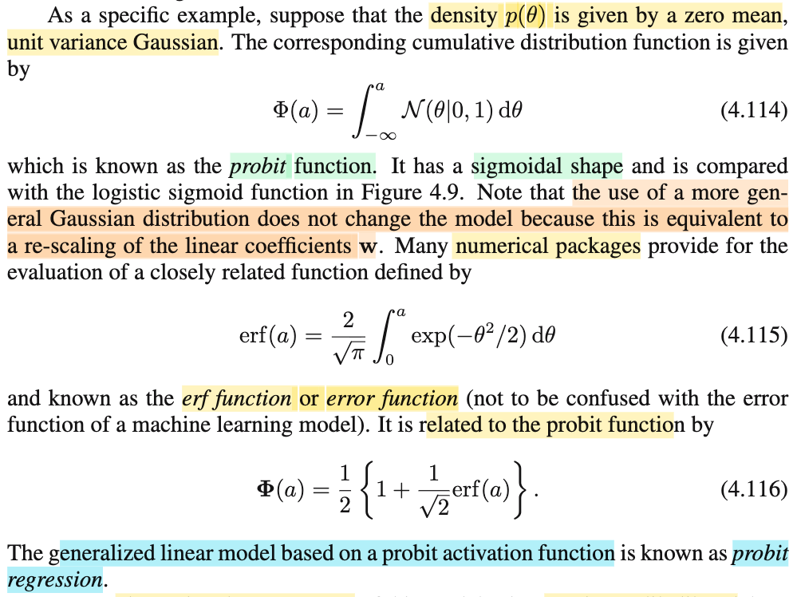
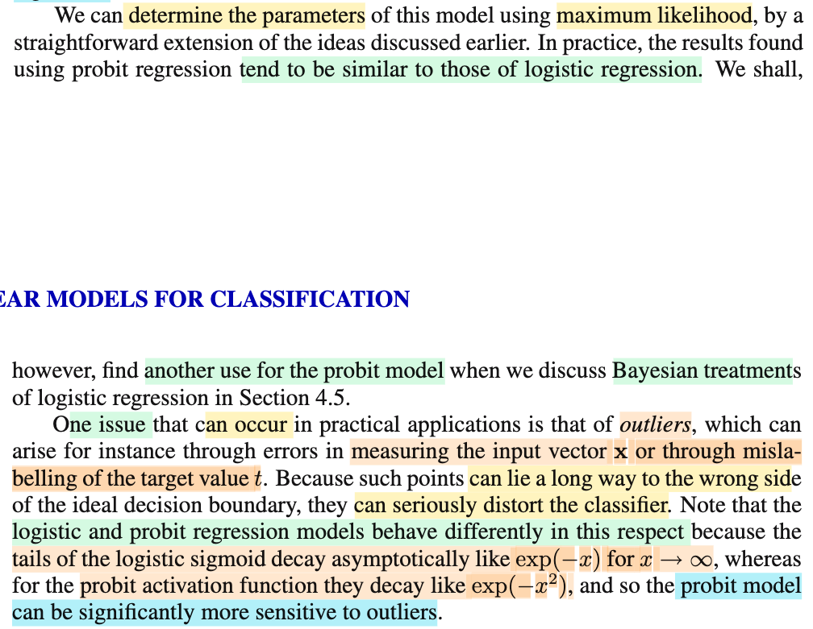
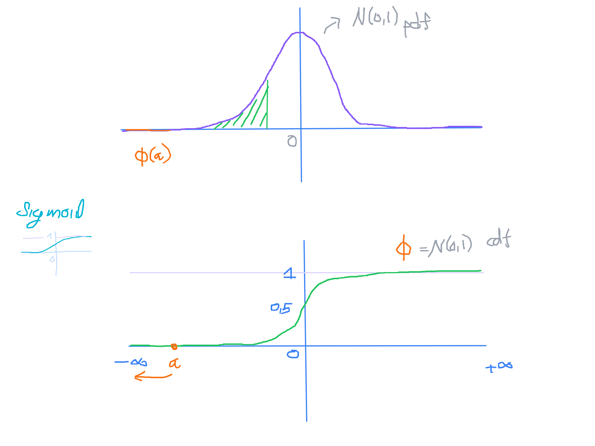
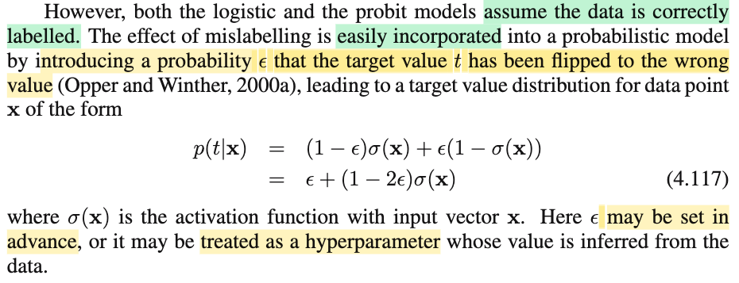

# 4.3.5 Probit Regression

📊 **Progress:** `4` Notes | `7` Screenshots | `4` AI Reviews

---

 

## 4.3.5 Probit Regression (bản sao)

<kbd></kbd>

<kbd></kbd>

<kbd></kbd>

> [!NOTE]
> Đầu tiên đại khái là nhắc lại câu chuyện bữa trước khi ta còn xét cái khung đi tạo class posterior distribution f(𝒞k|𝐱) hay f(𝒞k|Φ) từ generative distribution f(Φ|𝒞k)f(𝒞k)/f(Φ) thì ta đã biết cái vụ này: khi chọn giả định cho phân phối class conditional density f(𝐱|𝒞k) hay f(Φ|𝒞k), thì nếu ta chọn exponential family (trong đó điển hình là normal) có chung scale param (như normal có chung covariance matrix) thì kết quả sẽ thấy rằng class posterior f(𝒞k|𝐱) hay f(𝒞|Φ) có dạng **generalized linear model**, tức là một non-linear activation function (là sigmoid hoặc softmax) của một linear function của tham số và feature (hoặc transformed feature).
>
>
>
> Để rồi sau đó, ta mới chuyển sang cách làm trực tiếp, thay vì giả định phân phối của class conditional density, để có được generalize linear model, ta phang thẳng giả định rằng class posterior có dạng softmax hay sigmoid của hàm tuyến tính luôn.
>
>
>
> Và họ exponential family thì tuy rất rộng nhưng không phải bao trùm tất cả. Do đó, nếu ta chọn giả định khác cho class conditional density thì có thể kết quả không được như vậy. Nên ông mới nói có thể ta nên thử khám phá các cách tiếp cận khác, mong sao cũng cho ra dạng generalized linear model.
>
>
>
> Nên ở phần này, ta sẽ quay lại xét bài toán 2 class classification, với mô hình class posterior có dạng P(T=1|a) = f(a) với a = 𝐰ᵀΦ (cũng chính là f(𝒞1|Φ), mang ý nghĩa xác suất class 𝒞 = 𝒞1 given Φ)
>
>
>
> ---
>
>
>
> Thế thì, phần này bàn về một mô hình của class posterior P(T=1|a) = f(a)gọi là **noisy (stochastic) threshold model** có dạng:
>
>
>
> P(T=1|a) = g(a) và g define sao cho:
>
>
>
> Với T=1 khi a ≥ θ và T=0 khi a &lt; θ và θ \~ f(θ).
>
>
>
> Thế thì dĩ nhiên T=1 khi a ≥ θ nên P(T=1|a) = P(a ≥ θ) = P(θ ≤ a)
>
>
>
> ---
>
>
>
> Ôn lại tí kiến thức xác suất:
>
>
>
> định nghĩa của hàm cdf: F(x) = P(X ≤ x) = P(X ∈ (-∞, x\]) 
>
>
>
> còn định nghĩa của pdf: f(x) là hàm define bởi P(-inf ≤ X ≤ x) = ∫-inf:x f(t)dt.
>
>
>
> F(x) = ∫-inf:x f(t)dt
>
>
>
> Do đó P(X ≤ x) = P(-inf ≤ X ≤ x) = ∫-inf:x f(t)dt, và theo định nghĩa cdf ở trên, thì đây là F(x): F(x) = ∫-inf:x f(t)dt
>
>
>
> Mà theo FTC2: Nếu hàm G và f sao cho G(x) = ∫-inf:x f(t)dt thì G thì ta có G'(x) = f(x) và G gọi là nguyên hàm của f. Vậy vì kết quả trên nên ta có F là nguyên hàm của f: d/dx F(x) = f(x).
>
>
>
> ---
>
>
>
> Quay lại áp dụng vào đây, θ \~ pdf f(θ)
>
>
>
> Nên F(a) = P(θ ≤ a) = ∫-∞:a f(θ)dθ, ta có F(a) = ∫-∞:a f(θ)dθ, và theo định nghĩa của tích phân thì cái này chính là diện tích hàm pdf từ -inf tới a nên diện tích phần đồ thị hàm pdf bên trái mốc a chính là độ lớn hàm cdf tại a
>
>
>
> Và ta cũng hiểu d/dθ F(θ) = f(θ). Nên giá trị hàm pdf tại θ bất kì đều chính là độ dốc hàm F tại đó.
>
>
>
> Như vậy P(T=1|a) = g(a) = P(θ ≤ a) = ∫-∞:a f(θ)dθ = F(a), cho thấy với mô hình này hàm activation function f chính là hàm cdf của θ: f = F
>
>
>
> Vậy ý chính cần hiểu là trong noisy threshold model, P(T=1|a) = **f(a)** = P(θ ≤ a) = ∫-∞:a f(θ)dθ = **F(a)** thì ý chính cần thấy: trong mô hình này **cái hàm activation function chính là cdf của θ**.

📹 [Xem video trên YouTube](https://www.youtube.com/watch?v=bHTMl05EoAY)

> [!TIP]
> 🤖 **AI Check** — 🟡 Minor issues — ✅ **95/100** · ✓ Move on
>
> Ghi chú nắm rất chắc và chính xác bản chất của noisy threshold model cũng như nguồn gốc dẫn dắt từ mô hình sinh sang mô hình phân biệt trong GLM. Điểm cần lưu ý duy nhất là việc lạm dụng ký hiệu chữ f cho cả activation function lẫn pdf.
>
> **🟡 Minor issues**
>
> **1.** *"θ ~ f(θ)... cho thấy với mô hình này hàm activation function f chính là hàm cdf của θ: f = F"*
>
> Có sự trùng lặp ký hiệu chữ cái 'f': trong sách, f(a) là hàm kích hoạt (activation function), còn mật độ xác suất của ngưỡng là p(θ). Việc bạn vừa ký hiệu pdf là f(θ) vừa ký hiệu hàm kích hoạt là f(a) rồi kết luận f = F dễ gây nhầm lẫn về mặt ký hiệu giữa pdf và hàm kích hoạt.
>
>
> **✓ Strengths**
> - Hiểu rõ động lực chuyển từ generative model (exponential family) sang mô hình phân biệt tổng quát hơn.
> - Giải thích chuẩn xác logic xác suất của noisy threshold model: P(T=1|a) = P(θ ≤ a) chính là tích phân diện tích dưới đường pdf từ -∞ đến a.
> - Liên hệ chính xác mối quan hệ giữa độ dốc của CDF và giá trị của PDF theo định lý cơ bản của giải tích (FTC).
>
> **💡 Deeper notes**
> - Trong GLM, nghịch đảo của hàm kích hoạt f(a) được gọi là link function g(a), tức a = g(μ). Khi chọn f(a) là CDF của phân phối chuẩn tắc (standard normal), ta sẽ thu được mô hình Probit regression kinh điển ở các mục tiếp theo.

 

### Probit Function and Probit Regression

<kbd></kbd>

> [!NOTE]
> Thế thì một ví dụ cụ thể, khi ta chọn distribution của θ là 𝒩(0,1) thì như activation function sẽ là F(a) = ∫-inf:a 𝒩(θ|0,1)dθ, và với normal 0,1 thì cdf được gán với chữ 𝚽, và cái này có tên là probit function.
>
>
>
> Ông cho biết nó có dạng chữ s giống như sigmoid
>
>
>
> Một điểm nữa là, khi ta dùng dạng khái quát hơn, thay vì standard normal thì nó không đổi model, mà chỉ tương đương với tác dụng rescale linear coefficient 𝐰. Là sao?
>
>
>
> Thử xem nếu dùng 𝒩(μ, σ²):
>
>
>
> F(a) = ∫-inf:a 𝒩(θ|μ, σ²)dθ
>
>
>
> = ∫-inf:a (1/√2πσ²) exp\[-(θ-μ)²/2σ²\] dθ
>
>
>
> = (1/√2πσ²) ∫-inf:a exp\[-(θ-μ)²/2σ²\] dθ
>
>
>
> Đặt z = (θ-μ)/σ ⇒ θ = z σ + μ ⇒ dθ = σ dz. Và cận tích phân thay đổi thành:
>
>
>
> θ → -∞ ⇔ z → -∞ ; θ = a → z = (a-μ)/σ
>
>
>
> Tích phân trở thành: (1/√2πσ²) ∫-inf:(a-μ)/σ  exp(-z²/2) σdz
>
>
>
> = (1/√2πσ²) σ ∫-inf:(a-μ)/σ  exp(-z²/2) dz
>
>
>
> = (1/√2π) ∫-inf:(a-μ)/σ  exp(-z²/2) dz
>
>
>
> Đưa (1/√2π) vào lại
>
>
>
> =  ∫-inf:(a-μ)/σ (1/√2π) exp(-z²/2) dz
>
>
>
> Ta thấy (1/√2π) exp(-z²/2) chính là pdf của 𝒩(0,1) nên tích phân này chính là cdf của Z \~ 𝒩(0,1) tại (a-μ)/σ, tức 𝚽((a-μ)/σ)
>
>
>
> Và thay a = 𝐰ᵀΦ ta có (a-μ)/σ = (𝐰ᵀΦ-μ)/σ 
>
>
>
> = 𝐰ᵀΦ/σ - μ/σ
>
>
>
> = (𝐰/σ)ᵀΦ - μ/σ
>
>
>
> = (𝐰/σ)ᵀΦ - μ/σ 
>
>
>
> ⇒ đây chỉ là việc ta scale 𝐰 bởi 1/σ và shift bởi μ/σ... 
>
>
>
> ..chứ model **vẫn là một generalize linear model với activation function là hàm** 𝚽 (probit function, cdf của 𝒩(0,1))
>
>
>
> ---
>
>
>
> Một ý nữa là có thể dùng eft function, là hàm quan hệ với 𝚽 bởi 4.116.
>
>
>
> Nói chung là, mô hình generalized linear model mà dùng hàm 𝚽 làm activation function, được gọi là **probit regression**.

📹 [Xem video trên YouTube](https://www.youtube.com/watch?v=no5efrUg8rs)

> [!TIP]
> 🤖 **AI Check** — 🟡 Minor issues — ✅ **96/100** · ✓ Move on
>
> Ghi chú rất xuất sắc, bạn đã tự mình chứng minh toán học tường minh cho khẳng định 'dùng Gaussian tổng quát chỉ tương đương rescale trọng số' mà sách chỉ nêu vắn tắt. Chỉ có một lỗi chính tả nhỏ khi gõ tên hàm erf.
>
> **🟡 Minor issues**
>
> **1.** *"Một ý nữa là có thể dùng eft function"*
>
> Lỗi gõ phím nhỏ: tên hàm chuẩn là 'erf function' (viết tắt của error function), không phải 'eft'.
>
>
> **✓ Strengths**
> - Tự thực hiện biến đổi tích phân đổi biến chính xác để giải thích vì sao Gaussian tổng quát N(μ, σ²) quy về được N(0,1).
> - Chỉ ra rõ ràng việc thay đổi tham số Gaussian tương đương với việc scale w bởi 1/σ và dịch bias bởi -μ/σ.
> - Nắm vững định nghĩa probit function và probit regression.
>
> **💡 Deeper notes**
> - Lưu ý rằng thành phần shift -μ/σ sẽ được hấp thu (absorbed) vào hệ số chệch w_0 (bias term) nếu ta gộp vector đặc trưng mở rộng, do đó cấu trúc mô hình hoàn toàn không đổi.

 

#### Probit vs Logistic Regression Outliers

<kbd></kbd>

<kbd></kbd>

> [!NOTE]
> Đoạn cuối này đại ý là về cơ bản probit regression perform tương tự logistic, ta sẽ bàn về một tác dụng khác của nó khi ta qua Bayes approach ở phần sau.
>
>
>
> Một cái nữa, là nó nhạy cảm với outlier hơn logistic, nên với dataset có nhãn bị gán sai thì mô hình probit regression sẽ rất tệ.
>
>
>
> Có thể hiểu đại khái là như sau:
>
>
>
> Đại ý là, ta xét một datapoint bị gán nhãn sai, t=1 trong khi đó nó vốn dĩ là t=0
>
>
>
> Thế thì, cái (binary) cross entropy bữa trước đã hiểu là E(𝐰) = -Σn {tn ln(yn) + (1-tn)ln(1-yn)}
>
>
>
> Nên error đóng góp bởi datapoint này sẽ là: - \[t ln(y) + (1-t)ln(1-y)\] = -ln(y) = -ln(σ(a)) 
>
>
>
> a = 𝐰ᵀ𝐱
>
>
>
> Giả sử trước khi data point này xuất hiện mô hình đã train với bộ data ban đầu không có mislabeled data, và kết quả rất tốt (tìm được 𝐰 gíup phân chia hai lớp). Và rồi data point bị gán nhãn sai xuất hiện. Ta sẽ xem thử ảnh hưởng của nó.
>
>
>
> Vấn đề là, vì đây vốn dĩ là data point thuộc class t=0, nên a = 𝐰ᵀΦ sẽ âm. Và khi nó càng rõ là một data point rõ ràng là thuộc class 𝒞2 (t=0), thì giá trị a này sẽ càng âm: a ≪ 0 và σ(a) sẽ ≈ 0 và error sẽ = -ln(0) là con số rất lớn.
>
>
>
> Cái này cho thấy rằng, logistic regression sẽ rất sensitive với datapoint bị gán nhãn sai (vì một case như vậy đóng góp rất lớn vào error, khiến thuật toán khi muốn giảm error sẽ phải thay đổi 𝐰 để giảm bớt error tăng vọt này, và như vậy, chính là bị nhạy cảm với mislabeled data)
>
>
>
> Và probit regression cũng có hành vi tương tự: Hiểu thế này: hàm sigmoid σ có dạng chữ s dẫn tới ta hiểu hành vi (khi a ≪ 0 thì σ(a) ≈ 0). Thì với probit regression, như đã biết, activation function là 𝚽(.), tuy ta ko biết (chưa thấy) chính xác đồ thị của nó, chỉ biết nó cũng có dạng chữ s tương tự sigmoid, nhưng mình biết ý nghĩa của nó: 𝚽(a) là CDF của biến 𝒩(0,1) tại a, và chính là diện tích phần bên dưới đồ thị hàm pdf của 𝒩(0,1). Từ đó có thể hình dung sự biến thiên của 𝚽 như sau:
>
>
>
> Khi a đi từ -∞ tới 0:
>
>
>
> Trong khoảng đường mà a còn "ở xa" (tức ≪ 0) thì có thể không khó để hình dung, diện tích của cái đuôi hình chuông 𝒩(0,1) là cực kì nhỏ (≈ 0)
>
>
>
> Khi a đã vượt qua giai đoạn này, bắt đầu đi vào phần cái chuông, thì diện tích bắt đầu tăng nhanh (không khó để thấy vì sao tăng nhanh: vì phần diện tích đang lem dần tới đỉnh chuông) cho đến khi a chạm mốc 0 thì diện tích đạt 1/2 diện tích cái chuông, ta biết, tổng diện tích phải là 1 (vì tính valid của pdf), nên tại a=0, 𝚽(0) = 1/2.
>
>
>
> Khi a đi từ 0 tới +∞:
>
>
>
> Trong gian đoạn đầu khi a chưa lớn hơn 0 quá nhiều, ta vẫn còn trong phạm vi cái "mình" chuông, phần diện tích đang nói tiếp tục tăng lên nhưng tốc độ giảm bớt, cho đến khi nó ra khỏi phạm vi này, có thể hình dung diện tích đã đạt gần ≈1
>
>
>
> Và trong giai đoạn sau, khi 0 ≪ a, thì hầu như diện tích tăng thêm rất chậm
>
>
>
> Với phân tích đó, có thế thấy hình dạng hàm 𝚽(a) cũng hao hao hàm sigmoid.
>
>
>
> ---
>
>
>
> Thế thì, lại xét tiếp hàm 𝚽, và hành vi của nó khi a ≪ 0, và tiếp tục cho a nhỏ dần, để cho tiện, ta đặt a = -x, và cho x đi tới +∞.
>
>
>
> Như đã nói, 𝚽(a) là diện tích của cái đuôi siêu mỏng của đồ thị hàm pdf 𝒩(0,1), bằng cách phân tích xấp xỉ, ta có thể tạm hiểu là khi a ngày càng "rất âm" thì diện tích của phần này xấp xỉ hàm số exp(-x²). Hàm exp(u), còn nhớ, sẽ kéo về 0 khi u → -∞, nên khi nói nó xấp xỉ hàm exp(-x²) thì có nghĩa là khi x càng dương để a càng âm thì diện tích phần này teo lại rất nhanh.
>
>
>
> Vậy, khi cho x → +∞ cũng là cho a → -inf thì 𝚽(a) → 0 rất nhanh và cũng là y → 0 rất nhanh ⇒ - ln y tăng vọt lên rất nhanh khiến error bởi data point gán nhãn sai này sẽ rất lớn: ≈ -ln (exp (-x²)) ≈ x²: tăng theo bình phương x
>
>
>
> Hành vi này cũng xảy ra với hàm sigmoid nhưng ở mức độ đỡ hơn như sau:
>
>
>
> σ(a) = 1/\[1+exp(-a)\], khi x → inf để a → -inf thì thì exp(-a) = exp(x) rất lớn nên 1/\[1+exp(-a)\] ≈ 1/exp(-a) = exp(a) = exp(-x)
>
>
>
> Như vậy khi x→ ∞ thì σ(a) xấp xỉ exp(-x), và dĩ nhiên nó cũng teo nhỏ về 0. Nhưng so với hành vi của 𝚽 ≈ exp(-x²) thì nó nhỏ về 0 CHẬM HƠN: ≈ -ln (exp (-x)) ≈ x: tăng tuyến tính theo x
>
>
>
> Và như vậy ý nghĩa của phân tích mang tính trực giác này là: Sự khác nhau này của hành vi của hàm 𝚽 và σ sẽ khiến cho: Với một datapoint gán nhãn sai, error của nó đều rất lớn (khiến cả hai đều bị sensitive với outlier) nhưng với probit thì error lớn hơn, nên probit regression bị sensitive hơn logistic.

📹 [Xem video trên YouTube](https://www.youtube.com/watch?v=YrNpRZMgk-4)

> [!TIP]
> 🤖 **AI Check** — 🟢 Pass — ✅ **95/100** · ✓ Move on
>
> Ghi chú xuất sắc, giải thích rất cặn kẽ và trực quan lý do tại sao hàm probit nhạy cảm với outlier hơn logistic regression thông qua hàm mất mát log-likelihood.
>
> **🟡 Minor issues**
>
> **1.** *"t ln(y) + (1-t)ln(1-y) = -ln(y)"*
>
> Lỗi nhỏ về dấu: vế trái thiếu dấu trừ đằng trước toàn bộ biểu thức (-(t ln y + (1-t)ln(1-y))), dù ở dòng trên bạn đã viết đúng công thức tổng quát và kết quả rút gọn -ln(y) là chính xác.
>
>
> **✓ Strengths**
> - Biến đổi và liên hệ trực tiếp giữa tốc độ suy giảm ở đuôi (tail decay) và mức phạt lỗi (-ln y), chỉ ra rõ sai số tăng tuyến tính (x) ở logistic so với bậc hai (x^2) ở probit.
> - Hình vẽ và lập luận hình học về tích phân diện tích dưới đường cong pdf N(0,1) để hình dung dạng hàm CDF Phi(a) rất trực quan và chuẩn xác.
>
> **💡 Deeper notes**
> - Về mặt giải tích tiệm cận chặt chẽ (Mill's ratio), đuôi phân phối chuẩn tắc thỏa mãn Phi(-x) ~ exp(-x^2 / 2) / (x * sqrt(2*pi)) khi x -> +infty. Sách giáo trình và ghi chú lược bớt hệ số 1/2 và 1/x để tập trung vào bậc suy giảm chủ đạo exp(-O(x^2)).

**🔗 See also:** [Cross-Entropy Error Function Gradient](./432_logistic_regression.md#node-gvw6cdv)

 

##### Xác suất gán nhãn sai

<kbd></kbd>

> [!NOTE]
> Cuối cùng là cách người ta đưa (integrate) vụ gán nhãn sai này vào mô hình xác suất: Nói đơn giản là bằng cách đưa một tham số ε mang ý nghĩa là xác suất xảy ra việc gán nhãn sai.
>
>
>
> Ta có xác suất gán nhãn sai là ε
>
>
>
> Vậy khi xảy ra, ta dùng 1-σ(a)
>
>
>
> Còn khi không xảy ra, ta dùng σ(a)
>
>
>
> Khi đó, cơ bản là ta biến Y \~ Bern(ε), với hai possible value \[1-σ(a)\] và σ(a) với xác suất (pmf) là ε và 1-ε. Để rồi ta dùng E\[Y\] = \[1-σ(a)\] × ε + σ(a) × (1-ε)
>
>
>
> Và ta sẽ chọn ε hoặc coi như siêu tham số.

> [!TIP]
> 🤖 **AI Check** — 🟡 Minor issues — ✅ **90/100** · ✓ Move on
>
> Ghi chú nắm rất tốt bản chất mô hình gán nhãn sai và cách thức kết hợp tham số nhiễu ε. Có một chút nhầm lẫn nhỏ về quy ước thuật ngữ phân phối Bernoulli nhưng không làm sai lệch bản chất toán học.
>
> **🟡 Minor issues**
>
> **1.** *"ta biến Y ~ Bern(ε), với hai possible value [1-σ(a)] và σ(a) với xác suất (pmf) là ε và 1-ε"*
>
> Theo quy ước xác suất, phân phối Bernoulli chỉ nhận giá trị trong tập {0, 1}. Về mặt bản chất, đây là công thức xác suất toàn phần (law of total probability) theo biến cố có bị lật nhãn hay không, hoặc biến ngẫu nhiên nhận giá trị phân biệt đó là một phép biến đổi tuyến tính của biến Bernoulli.
>
>
> **✓ Strengths**
> - Hiểu chính xác vai trò của tham số ε như một xác suất lật nhãn để làm mượt dự đoán của mô hình.
> - Tự diễn giải công thức (4.117) thông qua kỳ vọng xác suất toàn phần rất trực quan và chính xác về mặt đại số.
> - Nắm đúng cách xử lý tham số ε (cố định trước hoặc xem như siêu tham số học từ dữ liệu).
>
> **💡 Deeper notes**
> - Ký hiệu p(t|x) trong phương trình (4.117) của Bishop ngầm định là xác suất nhãn dương p(t=1|x); với nhãn t tổng quát, công thức đầy đủ sẽ có dạng Bernoulli p(t|x) = y^t (1-y)^(1-t) với y = ε + (1-2ε)σ(x).

 

