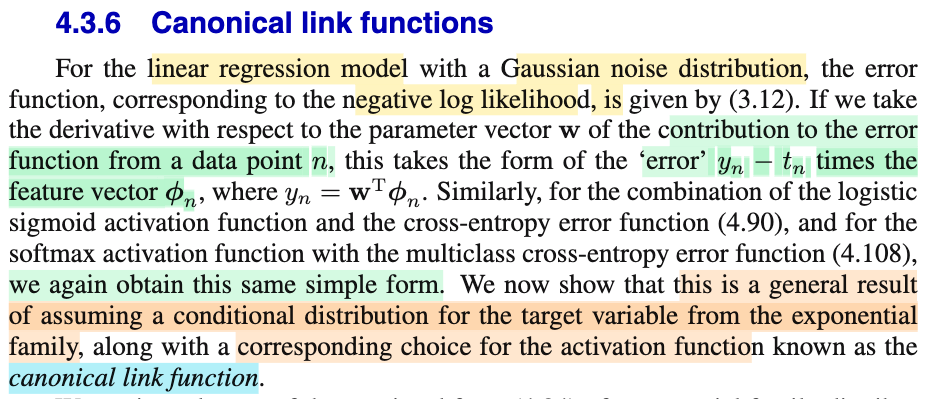
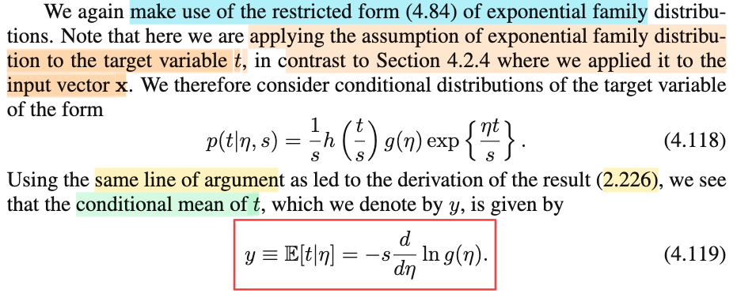
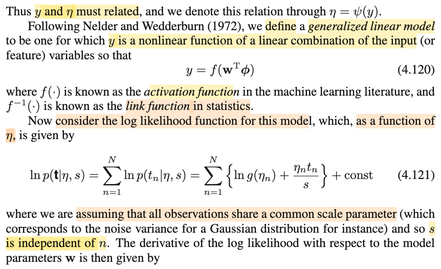
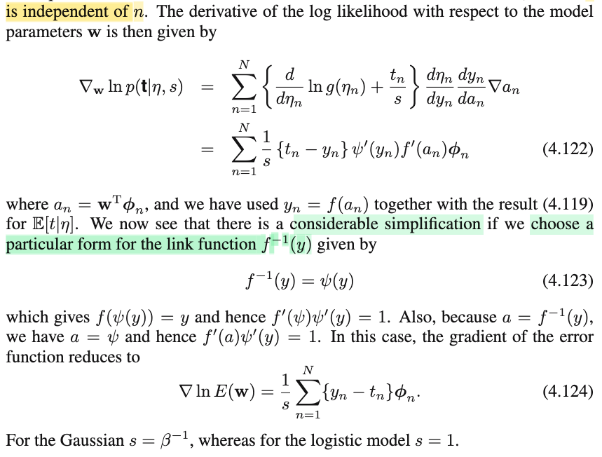

# 4.3.6 Canonical link function

📊 **Progress:** `4` Notes | `4` Screenshots | `4` AI Reviews

---

 

## Section 4.3.6 Canonical Link Functions

<kbd></kbd>

> [!NOTE]
> Mở đầu, đại ý là, phần này tác giả sẽ chỉ cho ta thấy rằng cái pattern mà ta thấy xuất hiện nhiều lần trước đây:
>
>
>
> đạo hàm của hàm log likelihood (đối với 𝐰), đều có dạng là tổ hợp tuyến tính của của các feature vector
>
>
>
> Và lí do là, đây là kết qủa của việc ta giả định conditional distribution của target variable (tức T|𝐱, hay T|Φ) theo exponential family với activation function là hàm canonical link function

> [!TIP]
> 🤖 **AI Check** — 🟢 Pass — ✅ **95/100** · ✓ Move on
>
> Ghi chú nắm rất chuẩn và súc tích thông điệp mở đầu của mục 4.3.6: giải thích nguồn gốc dạng gradient đặc trưng (sai số nhân vector đặc trưng) thông qua họ phân phối mũ và hàm liên kết chính tắc (canonical link function).
>
> **✓ Strengths**
> - Khái quát hóa chính xác cấu trúc gradient chung cho Linear Regression, Logistic Regression và Softmax khi dùng negative log-likelihood.
> - Nắm đúng hai điều kiện cốt lõi tạo nên tính chất này: phân phối điều kiện thuộc họ exponential family và hàm kích hoạt được chọn là canonical link function.
>
> **💡 Deeper notes**
> - Sách gốc sử dụng negative log-likelihood (hàm mất mát), do đó gradient đóng góp từ điểm dữ liệu $n$ có dạng $(y_n - t_n)oldsymbol{\phi}_n$. Nếu lấy đạo hàm trực tiếp của log-likelihood thì dấu sẽ ngược lại là $(t_n - y_n)oldsymbol{\phi}_n$.
> - Về mặt thuật ngữ thống kê tổng quát (GLM), hàm kích hoạt (activation function) thực chất là hàm liên kết nghịch đảo (inverse link function), ánh xạ từ tổ hợp tuyến tính $a = \mathbf{w}^T \boldsymbol{\phi}$ sang kỳ vọng của biến mục tiêu.

**🔗 See also:** [Maximum Likelihood and Gradient](./311_maximum_likelihood_and_least_squares.md#node-ogc31vz) · [Gradient of Softmax Error Function](./434_multiclass_logistic_regression.md#node-8j52rv4) · [Gradient of Logistic Error Function](./432_logistic_regression.md#node-to86xxj)

 

### Conditional Mean in Exponential Family

<kbd></kbd>

> [!NOTE]
> Nhắc lại chút về bối cảnh, ta thấy rằng, linear regression với Gaussian noise, và logistic regression cũng như softmax regression có kết quả sau:
>
>
>
> đạo hàm theo 𝐰 của hàm log likelihood đều cho ra dạng linear combination các feature vector với trọng số là sai số của datapoint đó,
>
>
>
> Thì gs Bishop đang muốn chỉ ra là do xuất phát từ việc ta đều đang giả định phân phối của T|𝐱 là exponential family có chung scale (ví dụ dễ thấy nhất là như trong linear regression Gaussian noise, ta đã giả định Ti|𝐱i \~ 𝒩(y(𝐰, 𝐱i), 1/β): tức là mọi Ti|𝐱i đều có chung scale param: 1/β)
>
>
>
> Nên ý tưởng chính ở phần này là ta sẽ làm một cách tổng quát: ta lôi công thức expo family pdf này ra và đi tìm đạo hàm đối với tham số để chứng minh rằng sẽ ra dạng trên.
>
>
>
> Thế thì nhắc đến exponential family, hồi 4.84 đã làm, cụ thể khi đó, là ta dùng nó giả định cho class conditional density, f(𝐱|𝒞k), và cũng giả định các class đều có chung scale, tức là f(𝐱|𝒞k) đều là exponential familty có chung scale, để rồi sau đó kết quả cho thấy class posterior f(𝒞k|𝐱) = f(𝐱|𝒞k)f(𝒞k)/f(𝐱) sẽ có dạng là sigmoid của một hàm tuyến tính theo cả 𝐰 và feature 𝐱 (hoặc transformed feature Φ), gọi là generalized linear model.
>
>
>
> Nay ta đang giả định cho phân phối của T, nên gs mới lưu ý "in contrast to Section 4.2.4 where we applied it to the input vector x"
>
>
>
> Vậy ta có T|𝐱 \~ f(t|𝐱) = (1/s) h(t/s) g(η) exp(ηt/s)
>
>
>
> Thử derive lại nhanh 4.119 để có E\[T|η\] = -s d/dη ln g(η):
>
>
>
> ---
>
>
>
> ∫ (1/s) h(t/s) g(η) exp(ηt/s) dt = 1 (tính valid của pdf)
>
>
>
> ⇔ g(η) ∫ (1/s) h(t/s) exp(ηt/s) dt = 1 (đưa g(η) không phụ thuộc t ra ngoài tích phân)
>
>
>
> ⇔ d/dη \[g(η) ∫ (1/s) h(t/s) exp(ηt/s) dt\] = 0 (lấy đạo hàm theo η)
>
>
>
> ⇔ d/dη \[g(η)\] ∫(1/s) h(t/s) exp(ηt/s) dt + g(η) d/dη \[∫(1/s) h(t/s) exp(ηt/s) dt\] = 0 (product rule: (uv)' = u' v + u v')
>
>
>
> ⇔ d/dη \[g(η)\] ∫(1/s) h(t/s) exp(ηt/s) dt + g(η) ∫ d/dη \[(1/s) h(t/s) exp(ηt/s)\] dt = 0
>
>
>
> ⇔ d/dη \[g(η)\] ∫(1/s) h(t/s) exp(ηt/s) dt + g(η) ∫ (1/s) h(t/s) d/dη \[exp(ηt/s)\] dt = 0
>
>
>
> ⇔ g'(η) ∫(1/s) h(t/s) exp(ηt/s) dt + g(η) ∫(1/s) h(t/s) (d/dη exp(ηt/s)) dt = 0
>
>
>
> ⇔ g'(η) ∫(1/s) h(t/s) exp(ηt/s) dt + g(η) ∫(1/s) h(t/s) (d/d(ηt/s) exp(ηt/s) . d/dη (ηt/s)) dt = 0 (chain rule)
>
>
>
> ⇔ g'(η) ∫(1/s) h(t/s) exp(ηt/s) dt + g(η) ∫(1/s) h(t/s) exp(ηt/s) (t/s) dt = 0
>
>
>
> ⇔ \[g'(η)/g(η)\] g(η)∫(1/s) h(t/s) exp(ηt/s) dt = - g(η) ∫(1/s) h(t/s) exp(ηt/s) (t/s) dt
>
>
>
> ⇔ \[g'(η)/g(η)\] ∫(1/s) h(t/s) g(η) exp(ηt/s) dt = - ∫(t/s) (1/s) h(t/s) g(η) exp(ηt/s) dt
>
>
>
> ---
>
>
>
> Xét - ∫(t/s) (1/s) h(t/s) g(η) exp(ηt/s) dt = - ∫(t/s) f(t|η) dt = -∫g(t) f(t|η) dt = - E\[g(T)\] = - E\[T/s\]
>
>
>
> Y = g(X), X \~ fX(x)
>
>
>
> EX = ∫xfX(x)dx
>
>
>
> Theo LOTUS: EY = ∫g(x)fX(x)dx
>
>
>
> ---
>
>
>
>
>
> ⇔ \[g'(η)/g(η)\] × 1 = - E\[T/s\] = (-1/s) E\[T\] (linearity E\[cX\] = cE\[X\])
>
>
>
> ⇔ d/dg(η) ln g(η) . d/dη g(η) = (-1/s) E\[T\]
>
>
>
> ⇔ d/dη ln g(η) = (-1/s) E\[T\]
>
>
>
> ⇔ - s d/dη ln g(η) = E\[T\]
>
>
>
> ⇔ E\[T\] = - s d/dη ln g(η)
>
>
>
> Dĩ nhiên T \~ f(t|η) nên ta ghi E\[T\] = E\_η\[T\] hoặc E\[T|η\] như trong sách để thể hiện đây là hàm phụ thuộc η

📹 [Xem video trên YouTube](https://www.youtube.com/watch?v=IGptJPe9ENw)

> [!TIP]
> 🤖 **AI Check** — 🟢 Pass — ✅ **98/100** · ✓ Move on
>
> Ghi chú xuất sắc! Bạn nắm rất vững bức tranh tổng thể kết nối giữa các mô hình tuyến tính tổng quát (GLM) và tự tay biến đổi, chứng minh trọn vẹn công thức kỳ vọng (4.119) từ tính chất chuẩn hóa của phân phối xác suất.
>
> **✓ Strengths**
> - Liên hệ bối cảnh rất chuẩn xác giữa dạng đạo hàm hàm log-likelihood ở linear/logistic regression với việc mô hình hóa phân phối của biến mục tiêu t thuộc họ exponential family.
> - Chỉ ra đúng sự tương phản giữa Mục 4.2.4 (giả định trên x|C_k để sinh ra phân phối hậu nghiệm) và Mục 4.3.6 (giả định trực tiếp trên conditional distribution của t).
> - Tự thực hiện phép biến đổi đạo hàm dưới dấu tích phân (Leibniz rule) một cách tỉ mỉ, logic và đi đến đúng kết quả (4.119).
>
> **💡 Deeper notes**
> - Phép đổi thứ tự giữa đạo hàm và tích phân d/dη ∫... dt = ∫ ∂/∂η... dt đòi hỏi các điều kiện chính quy (regularity conditions), vốn luôn được thỏa mãn trong phần trong (interior) của không gian tham số tự nhiên của họ exponential family.
> - Một cách nhìn gọn hơn thường gặp trong GLM là viết lại phân phối dưới dạng hàm lũy thừa tự nhiên exp{ηt/s - A(η)}, khi đó A(η) = -ln g(η) chính là log-partition function (cumulant function), và kỳ vọng E[t|η] = s * A'(η) = -s * d/dη ln g(η).

**🔗 See also:** [2.4.1 Maximum likelihood & sufficient statistic](./241_maximum_likelihood_sufficient_statistic.md#node-niekuox) · [Section 4.2.4 Exponential Family](./424_exponential_family.md#node-75dk469)

 

#### Generalized Linear Models Likelihood

<kbd></kbd>

> [!NOTE]
> T|𝐱 \~ f(t|η,s,𝐱) = (1/s) h(t/s) g(η) exp(ηt/s)
>
>
>
> Joint distribution của T1|𝐱1, ...TN|𝐱n: f(t1,...tn|𝐱1,..𝐱N, η1,..ηN, s),
>
>
>
> hay bỏ 𝐱1,...𝐱N cho gọn: f(t1,...tn|η1,..ηN, s) = f(𝐭|η1,..ηN, s) = f(𝐭|𝛈, s)
>
>
>
> Do tính độc lập của các Ti|𝐱i nên ta có:
>
>
>
> f(𝐭|η1,..ηN, s) = f(t1|η1, s)f(t2|η2, s)... = Πn=1:N f(tn|ηn, s)
>
>
>
> Theo định nghĩa hàm likelihood thì khi xem f(𝐭|𝛈, s) nó như hàm số của η, s thì chính là likelihood:
>
>
>
> L(𝛈,s|t1,..tN, 𝐱1,...𝐱N)
>
>
>
> (hay L(𝛈,s|𝐭) (bỏ 𝐱i cho gọn)
>
>
>
> ---
>
>
>
> Như thường lệ, để giải bài toán tối ưu maximize hàm likelihood, ta có thể giải bài toán tương đương maximize ln likelihood do tính monotone của hàm ln. Nên chuẩn bị ln likelihood:
>
>
>
> = ln \[Πn=1:N f(tn|ηn, s)\]
>
>
>
> = Σn=1:N \[ln f(tn|ηn, s)\]
>
>
>
>  Thay pdf của T|𝐱 vào: Tn|𝐱n \~ f(tn|𝐱n) = (1/s) h(tn/s) g(ηn) exp(ηn tn/s)
>
>
>
> = Σn=1:N \[ln ((1/s) h(tn/s) g(ηn) exp(ηn tn/s))\]
>
>
>
> = Σn=1:N \[ln (1/s)+ ln h(tn/s) + ln g(ηn) + ln exp(ηtn/s)\]
>
>
>
> = N ln (1/s)+ Σn=1:N ln h(tn/s) + Σn=1:N ln g(ηn) + Σn=1:N \[ln exp(ηn tn/s)\]
>
>
>
> = N ln (1/s)+ Σn=1:N ln h(tn/s) + Σn=1:N ln g(ηn) + (1/s)Σn=1:N (ηn tn)
>
>
>
> = const + Σn=1:N ln g(ηn) + (1/s)Σn=1:N (ηn tn)
>
>
>
> (mình coi N ln (1/s)+ Σn=1:N ln h(tn/s) là constant phải hiểu là constant đối với 𝛈, là cái đang muốn tìm MLE của 𝛈, chứ khi đi tìm MLE của s, thì dĩ nhiên nó không phải constant, khi đó lại xem cục nào không dính tới s là constant)
>
>
>
> = Σn=1:N \[ln g(ηn) + (ηn tn)/s\] + const

📹 [Xem video trên YouTube](https://www.youtube.com/watch?v=4_PShg7dBDo)

> [!TIP]
> 🤖 **AI Check** — 🟢 Pass — ✅ **100/100** · ✓ Move on
>
> Ghi chú rất xuất sắc, tự khai triển chi tiết từng bước đại số từ hàm mật độ của họ nghiệm mũ để đi đến công thức hàm log-likelihood (4.121) trong sách, kèm theo nhận xét chuẩn xác về hằng số quy ước.
>
> **✓ Strengths**
> - Khai triển đại số từ tích hàm mật độ sang tổng log một cách mạch lạc, chính xác và tường minh.
> - Hiểu rất rõ vì sao sách gộp cụm chứa h(t/s) và s vào hằng số 'const' (do đang xét hàm log-likelihood theo biến η).
>
> **💡 Deeper notes**
> - Khi chuyển sang bước lấy đạo hàm theo tham số mô hình w, cần nhớ rằng η_n phụ thuộc vào w thông qua hàm kích hoạt/hàm liên kết (η_n = ψ(y_n) với y_n = f(w^T φ_n)), nên đạo hàm sẽ cần áp dụng quy tắc chuỗi (chain rule).

 

##### Canonical Link Function Gradient

<kbd></kbd>

> [!NOTE]
> Viết lại ln likelihood:
>
>
>
> L(𝛈,s|𝐭) = Σn=1:N \[ln g(ηn) + (ηn tn)/s\] + const | lưu ý const là constant đối với 𝛈 thôi, chứ nó phụ thuộc s
>
>
>
> Tới đây cần hiểu thế này:
>
>
>
> Lẽ thường ta sẽ đi tính đạo hàm ln likelihood: theo 𝛈, và cho nó bằng 0 (điều kiện cân tối ưu bậc nhất) để giải ra maximum likelihood estimator của 𝛈, kí hiệu 𝛈\_ml.
>
>
>
> T|𝐱 \~ 𝒩(y(𝐰,𝐱), 1/β)
>
>
>
> Nhưng bên cạnh đó, ta đang muốn xây dựng hàm y(𝐰,𝐱) để dự đoán cho E\[T\], hay E\[T|𝐱\], hoặc E\_η\[T|𝐱\] để thể hiện nó là hàm phụ thuộc η. Đây cũng là cái ý, trong bài toán học máy, ta quan tâm đến prediction hơn là inference: Inference là ta đi estimate 𝛈, s. Còn prediction, ta đi estimate 𝐰 để có được hàm dự đoán cho E\[T\]
>
>
>
> Thành ra ta có y(𝐰,𝐱) = E\_η\[T|𝐱\] và kết quả bữa trước ta có = - s d/dη ln g(η)
>
>
>
> Như vậy y là hàm của số của η và ngược lại, và vì y là hàm của 𝐰 (thông qua một activation function lên a, và a là hàm tuyến tính của 𝐰): y = f(𝐰ᵀΦ)
>
>
>
> Do đó, về cơ bản, η cũng là hàm số của 𝐰.
>
>
>
> nên ta có thể coi likelihood cũng là hàm likelihood của 𝐰, và từ đó có thể coi như 𝐰, s (thay vì 𝛈, s) là tham số của population distriution để đi và đi tìm MLE của 𝐰
>
>
>
> Chính vì vậy mà ta sẽ lấy đạo hàm của ln likelihood theo 𝐰 thay vì theo 𝛈.
>
>
>
> ---
>
>
>
>  L(𝛈,s|𝐭) = Σn=1:N \[ln g(ηn) + (ηn tn)/s\] + const
>
>
>
> Lấy đạo hàm theo 𝐰:
>
>
>
> d/d𝐰 L(𝛈,s|𝐭), (hay ∇\_𝐰 L(𝛈,s|𝐭))
>
>
>
> = d/d𝐰 \[Σn=1:N \[ln g(ηn) + (ηn tn)/s\] + const\]
>
>
>
> = Σn=1:N {d/d𝐰 \[ln g(ηn) + (ηn tn)/s\] + const\]}
>
>
>
> = Σn=1:N {d/d𝐰 \[ln g(ηn)\] + d/d𝐰 \[(ηn tn)/s\]}
>
>
>
> = Σn=1:N {(d/dηn \[ln g(ηn)\]) . (d/d𝐰 ηn) + (tn/s) d/d𝐰 ηn}
>
>
>
> Dùng y(𝐰,𝐱) = E\_η\[T|𝐱\] = - s d/dη ln g(η) ⇔ d/dη ln g(η) = - y(𝐰,𝐱)/s
>
>
>
> = Σn=1:N {(-yn/s) (d/d𝐰 ηn) + (tn/s) (d/d𝐰 ηn)}
>
>
>
> = Σn=1:N {(-yn/s) + (tn/s)} (d/d𝐰 ηn)
>
>
>
> = Σn=1:N (1/s) {tn-yn)} (d/d𝐰 ηn)
>
>
>
> = Σn=1:N (1/s) {tn-yn)} (dηn/dyn) (dyn/dan) (dan/d𝐰)
>
>
>
> = Σn=1:N (1/s) {tn-yn)} (dηn/dyn) (dyn/dan) ∇an
>
>
>
> Vì ở trên khi ta có y = E\[T\] = - s d/dη ln g(η) là hàm của η, thì ngược lại η cũng là hàm của y, gọi η = ψ(y), nên dη/dy = ψ'(y)
>
>
>
> Và y = f(a) nên dy/da = f'(a)
>
>
>
> Và a = 𝐰ᵀΦ nên ∇a = Φ
>
>
>
> ... = Σn=1:N (1/s) {tn-yn)} ψ'(y) f'(an) Φ → 4.122
>
>
>
> ---
>
>
>
> Cuối cùng, đại khái là nếu ta chọn f, activation function sao cho f là hàm nghịch của ψ
>
>
>
> Khi đó f(ψ(y)) = ψ⁻¹(ψ(y)) = y.
>
>
>
> Và y = f(a) ⇒ a = f⁻¹(y)
>
>
>
> ⇒ f(ψ(y)) = f(a)
>
>
>
> ψ(y) = a

> [!TIP]
> 🤖 **AI Check** — 🟢 Pass — ✅ **100/100** · ✓ Move on
>
> Ghi chú giải thích rất chính xác và mạch lạc về bản chất chuỗi liên kết biến (chain rule) từ w sang η, làm rõ lý do tại sao mục tiêu tối ưu lại hướng trực tiếp vào trọng số w thay vì η.
>
> **✓ Strengths**
> - Nắm rất vững mối quan hệ giữa kỳ vọng E[t|η] và đạo hàm của hàm chuẩn hóa -s d/dη ln g(η).
> - Hiểu rõ chuỗi phụ thuộc w -> a -> y -> η, tạo tiền đề chuẩn xác cho quy tắc dây chuyền (chain rule) trong công thức (4.122).
> - Nhận thức đúng bản chất hằng số trong log-likelihood đối với η (vẫn phụ thuộc vào s).
>
> **💡 Deeper notes**
> - Trong GLM, việc tối ưu trực tiếp theo w thay vì tìm riêng lẻ từng η_n cho từng mẫu dữ liệu là mấu chốt để mô hình có khả năng tổng quát hóa (generalization) đối với các điểm dữ liệu mới x chưa từng thấy.

 

