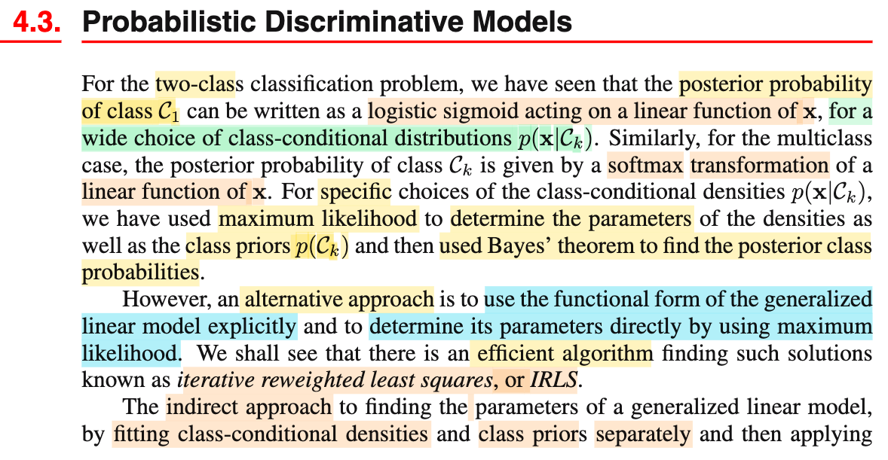
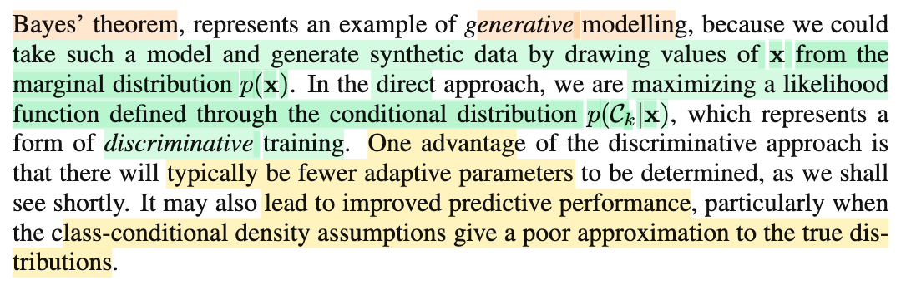

# 4.3. Probabilistic Discriminative Models

📊 **Progress:** `1` Notes | `2` Screenshots | `1` AI Reviews

---

 

## Section 4.3 Probabilistic Discriminative Models

<kbd></kbd>

<kbd></kbd>

> [!NOTE]
> Đầu tiên đại ý là gs nhắc lại 4.2 ta đã làm gì: Nói ngắn gọn, chính là ta đi xây dựng class posterior distribution f(𝒞k|𝐱).
>
>
>
> f(𝒞1|𝐱) = f(𝐱|𝒞1)f(𝒞1) / \[f(𝐱|𝒞1)f(𝒞1)+f(𝐱|𝒞2)f(𝒞2)\] = 1/{1 + \[f(𝐱|𝒞1)f(𝒞1)/f(𝐱|𝒞2)f(𝒞2)\]⁻¹}
>
>
>
> = 1/{1 + exp ln\[f(𝐱|𝒞1)f(𝒞1)/f(𝐱|𝒞2)f(𝒞2)\]⁻¹}
>
>
>
> = σ(ln \[f(𝐱|𝒞1)f(𝒞1)/f(𝐱|𝒞2)f(𝒞2)\]) (σ(a) = 1/(1+exp(-a))
>
>
>
> hoặc f(𝒞k|𝐱) = f(𝐱|𝒞k)f(𝒞k) / Σj f(𝐱|𝒞j)f(𝒞j) = exp ln\[f(𝐱|𝒞k)f(𝒞k)\] / Σj exp ln\[f(𝐱|𝒞j)f(𝒞j)\]
>
>
>
> Và rồi ông đã chỉ ra rằng tới đây, ta có f(𝒞1|𝐱) = σ(a1) sẽ chưa phải là generalized linear model nếu như hàm a1 = ln \[f(𝐱|𝒞1)f(𝒞1)/f(𝐱|𝒞2)f(𝒞2)\] không phải là hàm tuyến tính đối với 𝐱.
>
>
>
> Nhưng bằng cách cách ta làm là đi chọn (giả định) dạng của f(𝐱|𝒞) (ví dụ normal chung 𝚺, hoặc exponential family chung scale param s), thì ta đã thấy, a sẽ trở thành hàm tuyến tính đối với 𝐱, để cho ta generalized linear model. Đồng thời, ta mới đi giải bài toán point estimate joint distribution f(𝐱, 𝒞) = f(𝐱|𝒞)f(𝒞) và điển hình là dùng MLE.
>
>
>
> Nói ngắn gọn: việc ta có generalized linear model theo cách làm "generative" là do ta giả định f(𝐱|𝒞) là normal hoặc exponential family. Chứ nếu không, thì chưa chắc.
>
>
>
> ---
>
>
>
> Thì nay ở phần này, ta sẽ dùng một cách tiếp cận khác, trong đó ta dùng cái gọi là "dạng functional của generalized linear model explicitly" để xác định tham số một cách trực tiếp thông qua MLE, và ta sẽ học một thuật toán hiệu qủa cho việc này mang tên gọi **Iterative reweighted least squares**
>
>
>
> ---
>
>
>
> Cách bữa trước gọi là generative model là bởi: với f(𝐱, 𝒞) (hay f(𝐱|𝒞)f(𝒞), ta có thể đi generate data: Ví dụ, ta có thể sampling từ f(𝐱, 𝒞) hoặc sampling từ f(𝐱|𝒞) để có 𝐱. Ví dụ như ta có thể tạo ra hình con mèo từ distribution f(𝐱|𝒞="mèo")
>
>
>
> Và nói cái này là indirect - gián tiếp để có generalized linear model là bởi như đã nói ở trên, chỉ là vì ta đã giả định f(𝐱|𝒞) là normal hoặc exponential family thì mới dẫn đến a = ln \[f(𝐱|𝒞1)f(𝒞1)/f(𝐱|𝒞2)f(𝒞2)\] là linear function của 𝐱. Chứ nếu giả định khác, thì không chắc
>
>
>
> Thì qua tới đây, đại ý là ta sẽ giã định luôn là f(𝒞k|𝐱) là generalized linear model: σ(𝐰ᵀ𝐱 + w0) và dùng MLE để point estimate 𝐰 và w0 luôn, khỏi cần phải giả định class conditional density là normal hay gì hết ráo. Nói cách khác: TA GIẢ ĐỊNH MỘT PHÁT MỘT LUÔN LÀ CLASS POSTERIOR DISTRIBUTION f(𝒞1|𝐱) CÓ DẠNG σ(𝐰ᵀ𝐱 + w0). Và đi tìm MLE của tham số 𝐰, w0 này luôn.
>
>
>
> Ưu điểu của cách này là ít parameter hơn, và có thể dẫn đến có predictive performance tốt hơn, nhất là khi f(𝐱|𝒞) xấp xỉ không tốt distribution thật (mình hiểu ý này: là bởi như đã nói, để làm, ta phải giả định dạng của f(𝐱|𝒞), mà giả định không đúng thì nó sẽ ảnh hưởng hết đến cả joint distribution và class posterior) Còn cách trực tiếp sẽ không cần đặt ra giả định này, nên sẽ ít nhất là bớt nguy cơ giả định sai.

📹 [Xem video trên YouTube](https://www.youtube.com/watch?v=OMWS53GIrUI)

> [!TIP]
> 🤖 **AI Check** — 🟢 Pass — ✅ **98/100** · ✓ Move on
>
> Ghi chú nắm rất chắc và sâu sắc sự chuyển giao tư tưởng từ Generative (4.2) sang Discriminative (4.3). Toàn bộ các bước biến đổi xác suất và so sánh ưu nhược điểm cốt lõi đều chính xác.
>
> **✓ Strengths**
> - Tự suy luận và diễn giải rất chuẩn xác công thức đưa từ định lý Bayes về dạng hàm Sigmoid.
> - Hiểu đúng bản chất việc dạng tuyến tính a(x) trong mô hình sinh xuất phát từ giả định họ phân phối có cùng tham số phân tán/hiệp phương sai.
> - Nắm bắt chính xác ưu thế của mô hình phân biệt: ít tham số hơn và tránh rủi ro khi giả định mật độ điều kiện lớp bị sai lệch.
>
> **💡 Deeper notes**
> - Về số lượng tham số: Với phân phối Gaussian chung hiệp phương sai trong không gian D chiều, mô hình sinh cần ước lượng ma trận hiệp phương sai chung O(D²) và các kỳ vọng O(D), trong khi mô hình phân biệt (hồi quy logistic) chỉ cần đúng D + 1 tham số w.
> - Trong sách, Bishop nhấn mạnh việc sinh dữ liệu bằng cách lấy mẫu từ phân phối biên p(x) = ∑ p(x|Cₖ)p(Cₖ), tức lấy mẫu nhãn Cₖ từ tiên nghiệm trước rồi mới sinh mẫu x tương ứng.

**🔗 See also:** [4.3.2 Logistic Regression](./432_logistic_regression.md#node-oyj7m7j) · [Cross-Entropy Error Function Gradient](./432_logistic_regression.md#node-gvw6cdv)

 

