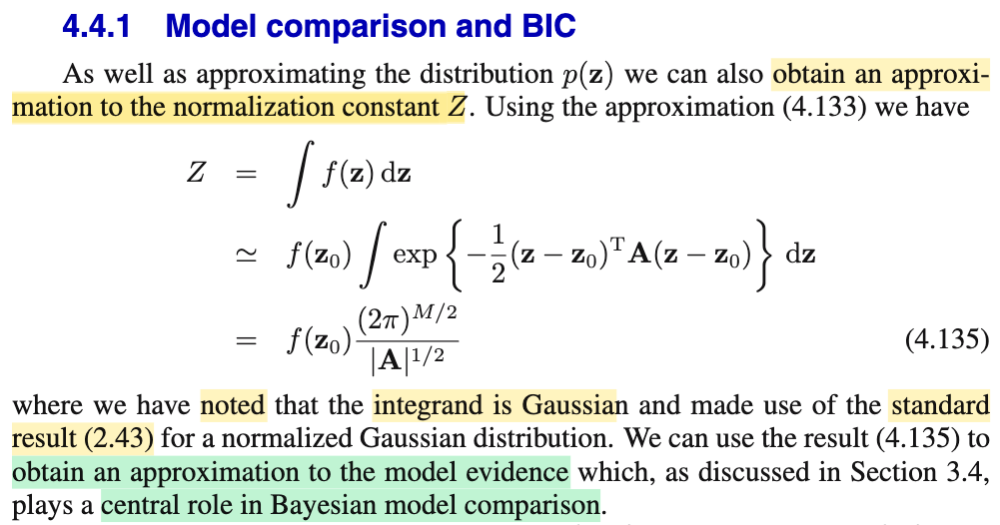

# 4.4.1 Model comparison and BIC

📊 **Progress:** `1` Notes | `1` Screenshots | `1` AI Reviews

---

 

## Section 4.4.1 Model Comparison and BIC

<kbd></kbd>

> [!NOTE]
> Đầu tiên, đoạn này đại ý là nói ta có thể tính xấp xỉ normalizing constant Z của p(𝐳) (là hằng số dùng để chuẩn hóa f(𝐳) thành một valid pdf: p(𝐳) = f(𝐳)/Z, Z = ∫f(𝐳)d𝐳.
>
>
>
> Xấp xỉ Z như sau: Z = ∫f(𝐳)d𝐳
>
>
>
> mà f(𝐳) ≈ f(𝐳0)exp{-(1/2)(𝐳-𝐳0)ᵀ(𝐀⁻¹)⁻¹(𝐳-𝐳0)}
>
>
>
> ⇔ f(𝐳) ≈ f(𝐳0) (1/c) c exp\[(-1/2)(𝐳-𝐳0)ᵀ(𝐀⁻¹)⁻¹(𝐳-𝐳0)\] với c = \[|𝐀|^(1/2) / (2π)^((M/2))\]
>
>
>
> ⇔ ∫f(𝐳)d𝐳 ≈ ∫f(𝐳0) (1/c) c exp\[(-1/2)(𝐳-𝐳0)ᵀ(𝐀⁻¹)⁻¹(𝐳-𝐳0)\]d𝐳
>
>
>
> ⇔ ∫f(𝐳)d𝐳 ≈ (f(𝐳0)/c) ∫c exp\[(-1/2)(𝐳-𝐳0)ᵀ(𝐀⁻¹)⁻¹(𝐳-𝐳0)\]d𝐳
>
>
>
> Do tính valid của pdf, ∫𝒩(𝐳|𝐳0, 𝐀⁻¹) d𝐳 = 1
>
>
>
> ⇔ ∫f(𝐳)d𝐳 ≈ f(𝐳0)/c  
>
>
>
> Vậy Z ≈ f(𝐳0)/c = f(𝐳0) (2π)^(M/2) / √|𝐀|
>
>
>
> Và ta sẽ dùng cái này để có thể có một approximation của model evidence.
>
>
>
> ---
>
>
>
> Active recall chút về model evidence:
>
>
>
> Nhưng trước tiên nói lại chút về bài tóan inference tham số của population f(x|θ):
>
>
>
> Bài toán là cho sample size n, 𝐗 = (X1,X2,...Xn), có giá trị quan sát được là 𝐱 = (x1,x2,...xn). Và giả định f(x|θ) là 𝒩(x|μ,σ²). Ta muốn đi estimate θ. Và một cách làm là, đặt ra likelihood L(θ|𝐱), là hàm của θ mang ý nghĩa độ hợp lí của θ khi giải thích cho giá trị quan sát được của 𝐗, để rồi ta đi giải bài toán tìm giá trị của θ có độ hợp lí cao nhất (và dùng nó để estiamte cho θ), thì đó là MLE của θ
>
>
>
> Quay lại đây model, ℳ, đại khái là phản ánh một giả định cụ thể, mà giống như ở trên, chính là ta đang giả định phân phối của Xi là normal. Nó hoàn toàn có thể là phân phối khác, chứ ko chỉ là normal.
>
>
>
> Cũng giống như, trong linear regression, ta giả định Ti|𝐱i \~ 𝒩(𝐰ᵀ𝐱i, 1/β), thì ta đang có một model cụ thể ℳ1 
>
>
>
> Vậy thì ta có thể có các mô hình khác nhau, và do đó coi như biến ngẫu nhiên ℳ (mà ℳ1 ở trên là một model cụ thể, một giá trị cụ thể của ℳ, bên cạnh các gía trị khác nữa như ℳ2, ℳ3...)
>
>
>
> Thế thì, lại nói về data, với tư cách là random variable 𝒟, thì nó sẽ được sinh ra từ một true model ℳ nào đó. 𝒟 \~ f(𝒹 |ℳ) (Tương tự như trong bối cảnh bài toán thống kê ở trên, ta ko xét giả định f là normal luôn, mà coi dạng của f cũng là một biến số: model ℳ bao trùm luôn giả định về dạng của distribution chứ không chỉ là giá trị tham số)
>
>
>
> Như vậy, tương tự như likelihood L(θ|𝐱) với (𝐱 là observed value của 𝐗) sẽ là hàm theo θ, ví dụ nhận vào θ1, và tính ra L(θ1|𝐱) (= f(𝐱|θ1)) phản ánh độ hợp lí của giá trị tham số θ=θ1 khi giải thích cho dữ liệu quan sát được của 𝐗, (=𝐱).
>
>
>
> Thì y như vậy, L(ℳ|giá trị quan sát được của data 𝒟=𝒹) là hàm số của model, nhận vào một model, ví dụ ℳ1, và tính ra độ hợp lí của model này khi muốn giải thích cho dữ liệu quan sát được. Và cái này hoàn toàn có thể gọi là gọi là model likelihood (tuy rằng trong sách không gọi vậy mà gọi là model evidence). 
>
>
>
> Và cũng tương tự như likelihood, L(θ|𝐱) được định nghĩa có giá trị bằng f(𝐱|θ), là joint probability của 𝐗 khi dùng giá trị tham số θ, evaluate tại 𝐱. Ví dụ tính likelihood của θ=θ1, ta lắp θ1 vào joint pdf của 𝐗, để có hàm f(𝐱|θ1) (𝐱 lúc này chỉ là tên biến của hàm số) và lắp giá trị quan sát của 𝐗, ví dụ 𝐱 = (1,2,3,4) vào f(𝐱|θ1) để tính ra kết quả cụ thể nào đó, đó chính là độ hợp lí của θ1.
>
>
>
> Thì tương tự như vậy:
>
>
>
> L(ℳ|data) sẽ có giá trị bằng f(data|ℳ), tức joint pdf của 𝒟, dựa trên model ℳ, evaluate tại observed value 𝒟 = data. Ví dụ tính "likelihood của model ℳ1, ta lắp ℳ1 vào f(data|ℳ), để có f(data|ℳ1) (lúc này data vẫn chỉ là tên biến của hàm số) và lắp giá trị quan sát được của data 𝒟 vào, tính ra con số cụ thể, ta sẽ có độ hợp lí của model ℳ1.
>
>
>
> Nên cũng như ta hiểu f(𝐗|θ) với tư cách là hàm theo θ sẽ chính là likelihood (của θ tại observed value của 𝐗) ...
>
>
>
> ...thì f(𝒟|ℳ), hay p(𝒟|ℳ) với tư cách là hàm của model ℳ thì nó là model evidence (của model ℳ tại observed value của 𝒟)
>
>
>
> Rồi, như vậy, giả sử ta xét model ℳ1 ở trên, thì "bằng chứng cuả nó" (model evidence), (hoặc như đã nói, cũng có thể hiểu theo cách: "độ hợp lý của nó" (model likelihood) sẽ là:
>
>
>
> f(𝒟|ℳ1), có giá trị bằng joint probability của biến data 𝒟 (khi dùng mô hình ℳ1) tại observed value của nó.
>
>
>
> Tiếp, một mô hình ℳ1, thì tham số θ của nó có nhiều giá trị khả dĩ khác nhau, quy định bởi một phân phối xác suất. 
>
>
>
> dùng LOTP f(𝒟|ℳ1) = ∫f(𝒟|ℳ1,θ)f(θ|ℳ1)dθ 
>
>
>
> Đây gọi là marginal likelihood. vì nó giống như là với model ℳ1, ta đã lấy trung bình hàm likelihood trên mọi giá trị của θ dựa trên phân phối của θ
>
>
>
> f(x) = ∫f(x, y)dy = ∫f(x|y)f(y)dy 
>
>
>
> f(𝒟|ℳ1) = ∫f(𝒟,θ|ℳ1)dθ = ∫f(𝒟|ℳ1,θ)f(θ|ℳ1)dθ 
>
>
>
> Nên bài toán tìm MLE của μ,σ² thì giống như ta tìm trong lớp 9A1 (ℳ1: giả định p.distribution là normal), xem đứa nào giỏi nhất (gía trị μ, σ² nào có likelihood cao nhất)
>
>
>
> Thì bài toán model comparison giống như ta so lớp 9A1 (ℳ1: giả định p.distribution là normal) với 9A2 (ℳ2: giả định p.distribution là gamma), với điểm số của 9A1 = trung bình của đám học sinh trong đó: ∫f(𝒟|ℳ1,θ)f(θ|ℳ1)dθ  và của 9A2 = ∫f(𝒟|ℳ2,θ)f(θ|ℳ2)dθ.
>
>
>
> Từ so sánh đó, sẽ có thể hiểu model evidence = độ hợp lí của model (lấy trung bình trên mọi giá trị tham số của model đó)

📹 [Xem video trên YouTube](https://www.youtube.com/watch?v=_IFymiaGRCQ)

> [!TIP]
> 🤖 **AI Check** — 🟢 Pass — ✅ **98/100** · ✓ Move on
>
> Ghi chú xuất sắc! Bạn đã tự diễn giải chi tiết từng bước tích phân để tính Z dựa trên chuẩn hóa của hàm Gauss, đồng thời có phần liên hệ và ẩn dụ rất trực quan, chính xác về model evidence.
>
> **✓ Strengths**
> - Khai triển tích phân Laplace approximation rất chi tiết bằng cách thêm bớt hệ số chuẩn hóa của phân phối Gauss nhiều chiều.
> - Bản chất của Model Evidence / Marginal Likelihood được giải thích sâu sắc qua góc nhìn tích phân lấy kỳ vọng của likelihood theo prior của tham số.
> - Hình tượng so sánh giữa việc tìm học sinh giỏi nhất trong một lớp (MLE) và so sánh điểm trung bình giữa hai lớp (Model Comparison) rất chuẩn xác và giàu trực giác.
>
> **💡 Deeper notes**
> - Để tích phân Gauss hội tụ và xấp xỉ có nghĩa, ma trận Hessian A tại điểm cực đại z0 phải là ma trận xác định dương (positive definite), đảm bảo z0 thực sự là điểm cực đại địa phương (local mode) chứ không phải điểm yên ngựa hay cực tiểu.

**🔗 See also:** [Multivariate Laplace Approximation](./44_laplace_approximation.md#node-x9ndslg) · [PDF Gaussian Đa Biến](./124_the_gaussian_distribution.md#node-40ke7sj)

 

