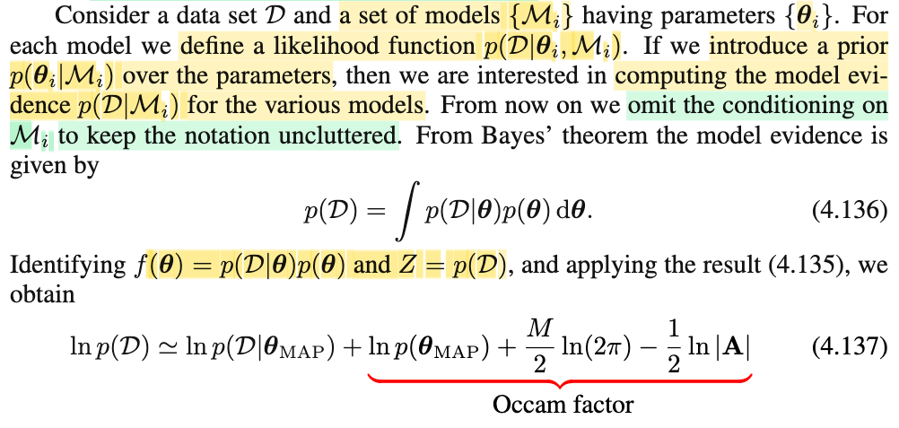
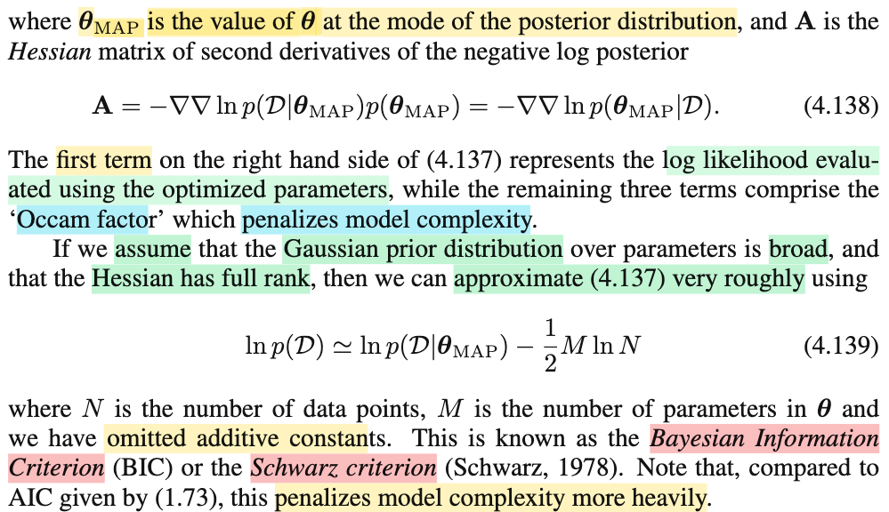

# 4.4.1 Model comparison and BIC

📊 **Progress:** `2` Notes | `3` Screenshots | `2` AI Reviews

---

 

## Section 4.4.1 Model Comparison and BIC

<kbd></kbd>

> [!NOTE]
> Đầu tiên, đoạn này đại ý là nói ta có thể tính xấp xỉ normalizing constant Z của p(𝐳) (là hằng số dùng để chuẩn hóa f(𝐳) thành một valid pdf: p(𝐳) = f(𝐳)/Z, Z = ∫f(𝐳)d𝐳.
>
>
>
> Xấp xỉ Z như sau: Z = ∫f(𝐳)d𝐳
>
>
>
> mà f(𝐳) ≈ f(𝐳0)exp{-(1/2)(𝐳-𝐳0)ᵀ(𝐀⁻¹)⁻¹(𝐳-𝐳0)}
>
>
>
> ⇔ f(𝐳) ≈ f(𝐳0) (1/c) c exp\[(-1/2)(𝐳-𝐳0)ᵀ(𝐀⁻¹)⁻¹(𝐳-𝐳0)\] với c = \[|𝐀|^(1/2) / (2π)^((M/2))\]
>
>
>
> ⇔ ∫f(𝐳)d𝐳 ≈ ∫f(𝐳0) (1/c) c exp\[(-1/2)(𝐳-𝐳0)ᵀ(𝐀⁻¹)⁻¹(𝐳-𝐳0)\]d𝐳
>
>
>
> ⇔ ∫f(𝐳)d𝐳 ≈ (f(𝐳0)/c) ∫c exp\[(-1/2)(𝐳-𝐳0)ᵀ(𝐀⁻¹)⁻¹(𝐳-𝐳0)\]d𝐳
>
>
>
> Do tính valid của pdf, ∫𝒩(𝐳|𝐳0, 𝐀⁻¹) d𝐳 = 1
>
>
>
> ⇔ ∫f(𝐳)d𝐳 ≈ f(𝐳0)/c  
>
>
>
> Vậy Z ≈ f(𝐳0)/c = f(𝐳0) (2π)^(M/2) / √|𝐀|
>
>
>
> Và ta sẽ dùng cái này để có thể có một approximation của model evidence.
>
>
>
> ---
>
>
>
> Active recall chút về model evidence:
>
>
>
> Nhưng trước tiên nói lại chút về bài tóan inference tham số của population f(x|θ):
>
>
>
> Bài toán là cho sample size n, 𝐗 = (X1,X2,...Xn), có giá trị quan sát được là 𝐱 = (x1,x2,...xn). Và giả định f(x|θ) là 𝒩(x|μ,σ²). Ta muốn đi estimate θ. Và một cách làm là, đặt ra likelihood L(θ|𝐱), là hàm của θ mang ý nghĩa độ hợp lí của θ khi giải thích cho giá trị quan sát được của 𝐗, để rồi ta đi giải bài toán tìm giá trị của θ có độ hợp lí cao nhất (và dùng nó để estiamte cho θ), thì đó là MLE của θ
>
>
>
> Quay lại đây model, ℳ, đại khái là phản ánh một giả định cụ thể, mà giống như ở trên, chính là ta đang giả định phân phối của Xi là normal. Nó hoàn toàn có thể là phân phối khác, chứ ko chỉ là normal.
>
>
>
> Cũng giống như, trong linear regression, ta giả định Ti|𝐱i \~ 𝒩(𝐰ᵀ𝐱i, 1/β), thì ta đang có một model cụ thể ℳ1 
>
>
>
> Vậy thì ta có thể có các mô hình khác nhau, và do đó coi như biến ngẫu nhiên ℳ (mà ℳ1 ở trên là một model cụ thể, một giá trị cụ thể của ℳ, bên cạnh các gía trị khác nữa như ℳ2, ℳ3...)
>
>
>
> Thế thì, lại nói về data, với tư cách là random variable 𝒟, thì nó sẽ được sinh ra từ một true model ℳ nào đó. 𝒟 \~ f(𝒹 |ℳ) (Tương tự như trong bối cảnh bài toán thống kê ở trên, ta ko xét giả định f là normal luôn, mà coi dạng của f cũng là một biến số: model ℳ bao trùm luôn giả định về dạng của distribution chứ không chỉ là giá trị tham số)
>
>
>
> Như vậy, tương tự như likelihood L(θ|𝐱) với (𝐱 là observed value của 𝐗) sẽ là hàm theo θ, ví dụ nhận vào θ1, và tính ra L(θ1|𝐱) (= f(𝐱|θ1)) phản ánh độ hợp lí của giá trị tham số θ=θ1 khi giải thích cho dữ liệu quan sát được của 𝐗, (=𝐱).
>
>
>
> Thì y như vậy, L(ℳ|giá trị quan sát được của data 𝒟=𝒹) là hàm số của model, nhận vào một model, ví dụ ℳ1, và tính ra độ hợp lí của model này khi muốn giải thích cho dữ liệu quan sát được. Và cái này hoàn toàn có thể gọi là gọi là model likelihood (tuy rằng trong sách không gọi vậy mà gọi là model evidence). 
>
>
>
> Và cũng tương tự như likelihood, L(θ|𝐱) được định nghĩa có giá trị bằng f(𝐱|θ), là joint probability của 𝐗 khi dùng giá trị tham số θ, evaluate tại 𝐱. Ví dụ tính likelihood của θ=θ1, ta lắp θ1 vào joint pdf của 𝐗, để có hàm f(𝐱|θ1) (𝐱 lúc này chỉ là tên biến của hàm số) và lắp giá trị quan sát của 𝐗, ví dụ 𝐱 = (1,2,3,4) vào f(𝐱|θ1) để tính ra kết quả cụ thể nào đó, đó chính là độ hợp lí của θ1.
>
>
>
> Thì tương tự như vậy:
>
>
>
> L(ℳ|data) sẽ có giá trị bằng f(data|ℳ), tức joint pdf của 𝒟, dựa trên model ℳ, evaluate tại observed value 𝒟 = data. Ví dụ tính "likelihood của model ℳ1, ta lắp ℳ1 vào f(data|ℳ), để có f(data|ℳ1) (lúc này data vẫn chỉ là tên biến của hàm số) và lắp giá trị quan sát được của data 𝒟 vào, tính ra con số cụ thể, ta sẽ có độ hợp lí của model ℳ1.
>
>
>
> Nên cũng như ta hiểu f(𝐗|θ) với tư cách là hàm theo θ sẽ chính là likelihood (của θ tại observed value của 𝐗) ...
>
>
>
> ...thì f(𝒟|ℳ), hay p(𝒟|ℳ) với tư cách là hàm của model ℳ thì nó là model evidence (của model ℳ tại observed value của 𝒟)
>
>
>
> Rồi, như vậy, giả sử ta xét model ℳ1 ở trên, thì "bằng chứng cuả nó" (model evidence), (hoặc như đã nói, cũng có thể hiểu theo cách: "độ hợp lý của nó" (model likelihood) sẽ là:
>
>
>
> f(𝒟|ℳ1), có giá trị bằng joint probability của biến data 𝒟 (khi dùng mô hình ℳ1) tại observed value của nó.
>
>
>
> Tiếp, một mô hình ℳ1, thì tham số θ của nó có nhiều giá trị khả dĩ khác nhau, quy định bởi một phân phối xác suất. 
>
>
>
> dùng LOTP f(𝒟|ℳ1) = ∫f(𝒟|ℳ1,θ)f(θ|ℳ1)dθ 
>
>
>
> Đây gọi là marginal likelihood. vì nó giống như là với model ℳ1, ta đã lấy trung bình hàm likelihood trên mọi giá trị của θ dựa trên phân phối của θ
>
>
>
> f(x) = ∫f(x, y)dy = ∫f(x|y)f(y)dy 
>
>
>
> f(𝒟|ℳ1) = ∫f(𝒟,θ|ℳ1)dθ = ∫f(𝒟|ℳ1,θ)f(θ|ℳ1)dθ 
>
>
>
> Nên bài toán tìm MLE của μ,σ² thì giống như ta tìm trong lớp 9A1 (ℳ1: giả định p.distribution là normal), xem đứa nào giỏi nhất (gía trị μ, σ² nào có likelihood cao nhất)
>
>
>
> Thì bài toán model comparison giống như ta so lớp 9A1 (ℳ1: giả định p.distribution là normal) với 9A2 (ℳ2: giả định p.distribution là gamma), với điểm số của 9A1 = trung bình của đám học sinh trong đó: ∫f(𝒟|ℳ1,θ)f(θ|ℳ1)dθ  và của 9A2 = ∫f(𝒟|ℳ2,θ)f(θ|ℳ2)dθ.
>
>
>
> Từ so sánh đó, sẽ có thể hiểu model evidence = độ hợp lí của model (lấy trung bình trên mọi giá trị tham số của model đó)

📹 [Xem video trên YouTube](https://www.youtube.com/watch?v=_IFymiaGRCQ)

> [!TIP]
> 🤖 **AI Check** — 🟢 Pass — ✅ **98/100** · ✓ Move on
>
> Ghi chú xuất sắc! Bạn đã tự diễn giải chi tiết từng bước tích phân để tính Z dựa trên chuẩn hóa của hàm Gauss, đồng thời có phần liên hệ và ẩn dụ rất trực quan, chính xác về model evidence.
>
> **✓ Strengths**
> - Khai triển tích phân Laplace approximation rất chi tiết bằng cách thêm bớt hệ số chuẩn hóa của phân phối Gauss nhiều chiều.
> - Bản chất của Model Evidence / Marginal Likelihood được giải thích sâu sắc qua góc nhìn tích phân lấy kỳ vọng của likelihood theo prior của tham số.
> - Hình tượng so sánh giữa việc tìm học sinh giỏi nhất trong một lớp (MLE) và so sánh điểm trung bình giữa hai lớp (Model Comparison) rất chuẩn xác và giàu trực giác.
>
> **💡 Deeper notes**
> - Để tích phân Gauss hội tụ và xấp xỉ có nghĩa, ma trận Hessian A tại điểm cực đại z0 phải là ma trận xác định dương (positive definite), đảm bảo z0 thực sự là điểm cực đại địa phương (local mode) chứ không phải điểm yên ngựa hay cực tiểu.

**🔗 See also:** [Multivariate Laplace Approximation](./44_laplace_approximation.md#node-x9ndslg) · [PDF Gaussian Đa Biến](./124_the_gaussian_distribution.md#node-40ke7sj)

 

### Model Evidence and Occam Factor

<kbd></kbd>

<kbd></kbd>

> [!NOTE]
> Với phần active recall vừa rồi, tiếp theo phần này, ta có có data set 𝒟, và tập các model ℳi, các tham số tương ứng là 𝛉i.
>
>
>
> Define likelihood function f(𝒟|𝛉i,ℳi)
>
>
>
> Vì sao lại gọi đây là likelihood:
>
>
>
> Tương tự vì định nghĩa L(θ|𝐱) = f(𝐱|θ) nên ta hiểu rằng khi dùng f(𝐱|θ) với tư cách là hàm theo 𝐱 thì nó là probability của 𝐗 tại 𝐱, còn khi dùng với tư cách là hàm theo θ thì nó là likelihood của θ giải thích cho giá trị quan sát của 𝐗 = 𝐱. Nên ở đây, khi nói likelihood function f(𝒟|𝛉i,ℳi) thì phải hiểu đang coi như là hàm của 𝛉i
>
>
>
> ---
>
>
>
> Có thể ghi là L(𝛉i|𝒟,ℳi) để chỉ: độ hợp lý của giá trị tham số 𝛉i khi dùng mô hình ℳi trong việc giải thích giá trị của dữ liệu quan sát được 𝒟
>
>
>
> (Nếu muốn chỉ "độ hợp lí của việc dùng mô hình ℳi và dùng tham số 𝛉i (để giải thích cho việc quan sát thấy dữ liệu có giá trị là 𝒟) thì ghi L(𝛉i, ℳi|𝒟))
>
>
>
> Nên likelihood function f(𝒟|𝛉i,ℳi), thật ra chính là L(𝛉i|𝒟,ℳi)
>
>
>
> ---
>
>
>
> Tiếp, cho rằng 𝛉i có prior distribution f(𝛉i|ℳi) thì
>
>
>
> f(𝒟|ℳi) = ∫f(𝒟|ℳi,𝛉)f(𝛉|ℳi)d𝛉
>
>
>
> f(𝒟) = ∫f(𝒟,𝛉)d𝛉 = ∫f(𝒟|𝛉)f(𝛉)d𝛉
>
>
>
> hay **bỏ đi việc dựa trên ℳi cho gọn**, ta có f(𝒟) = ∫f(𝒟|𝛉)f(𝛉)d𝛉
>
>
>
> (cái này chỉ y như: f(x) = ∫f(x,y)dy = ∫f(x|y)f(y)dy, thì f(𝒟) = ∫f(𝒟, 𝛉)d𝛉 = ∫f(𝒟|𝛉)f(𝛉)d𝛉
>
>
>
>
>
> ---
>
>
>
> Và đặt f(𝒟|𝛉)f(𝛉) = f(𝒟, 𝛉) là g(𝛉)
>
>
>
> ∫f(𝒟, 𝛉)d𝛉 = f(𝒟)
>
>
>
> (Do từ đầu đến giờ mình theo convention chuẩn sách thống kê cho quen, nên dùng f thay vì p, thành ra chỗ này ông Bishop đặt p(𝒟|𝛉)p(𝛉) là f(𝛉) thì mình dùng chữ g(𝛉))
>
>
>
> thì f(𝒟) = ∫g(𝛉)d𝛉, chính là một normalizing constant Z của g(𝛉)
>
>
>
> Vì sao? Vì N.C là hằng số giúp g(𝛉)/C trở thành valid pdf: tích phân toàn miền = 1, (g(𝛉) đã không âm sẵn do là f(𝒟, 𝛉) )
>
>
>
> f(x) = x²/C, ≥ 0, ∫f(x)dx = 1
>
>
>
> ∫\[g(𝛉)/C\]d𝛉 = 1 ⇔ (1/C)∫g(𝛉)d𝛉 = 1 ⇔ C = ∫g(𝛉)d𝛉 = f(𝒟)
>
>
>
> ---
>
>
>
> Nên áp dụng công thức xấp xỉ hồi nãy:
>
>
>
> Z = ∫f(𝐳)d𝐳 ≈ f(𝐳0) (2π)^(M/2) / √|𝐀|
>
>
>
> trong đó 𝐳0 là local mazimum của f(𝐳), 𝐀 là precision matrix, là (-) matrix Hessian của hàm ln f(𝐳) tại 𝐳0: -∇² ln f(𝐳0), hay viết vầy cho rõ hơn \[-∇² ln f(𝐳)\]|𝐳=𝐳0
>
>
>
> nên:
>
>
>
> ∫g(𝛉)d𝛉 ≈ g(𝛉0) (2π)^(M/2) / √|𝐀|
>
>
>
> trong đó 𝛉0 là local maximum của g(𝛉) (mà ta sẽ chỉ ra nó là 𝛉\_MAP ở dưới), còn 𝐀 , tương tự, là -∇² ln g(𝛉0), hay -\[∇² ln g(𝛉)\]|𝛉=𝛉0
>
>
>
> ---
>
>
>
> Và vì theo Bayes f(𝛉|𝒟) = f(𝒟|𝛉)f(𝛉)/f(𝒟) = g(𝛉)/f(𝒟)
>
>
>
> ⇒ f(𝛉|𝒟) = g(𝛉)/f(𝒟)
>
>
>
> nên tại 𝛉0, g(𝛉) đạt maximum, thì cũng f(𝛉|𝒟) cũng đạt max tại đó (bởi nó chỉ = g(𝛉) nhân 1 hằng số không âm)
>
>
>
> Vậy f(𝛉|𝒟) chính là posterior distribution của 𝛉, nên 𝛉0 này chính là 𝛉\_MAP
>
>
>
> ---
>
>
>
> Vì sao nhắc đến posterior distribution của 𝛉. Là vì ta đã chuyển sang Bayesian approach.
>
>
>
> Ôn lại chút bài toán point estimation theo hai trường phái: cho random sample 𝐗 = X1,X2,....Xn có observed value 𝐱 = x1,x2,...với Xi iid \~ f(xi|θ). Yêu cầu tìm cách estimate ra θ. Ví dụ giả định, hoặc cho trước f(x|θ) là 𝒩(x|μ,σ²), estimate θ = (μ, σ²)
>
>
>
> Point estimator là hàm của sample W(𝐗) (định nghĩa "is any function of sample", xem link), tìm hàm nào cho tốt, có vài cách.
>
>
>
> θ̂(𝐗) = argmax\_θ L(θ|𝐗)
>
>
>
> Frequentist: Coi θ chưa biết, cố định, không phải random variable. Phương pháp điển hình: MLE - Tìm θ có likelihood cao nhất, θ̂ MLE của θ. Định nghĩa hàm likelihood L(θ|𝐱) (tính bằng f(𝐱|θ), ý nghĩa: Khi thấy data như vậy (𝐱) thì với các θ khác nhau, sự hợp lý của mỗi cái (trong mong muốn giải thích cho dữ liệu quan sát thấy) là bao nhiêu. Dùng cái có sự / mức độ hợp lí cao nhất, để estimate cho true θ, ta gọi nó là MLE, maximum likelihood của θ
>
>
>
> Bayesian: Coi θ như biến ngẫu nhiên, π(θ) prior distribution. Dùng Bayes để có posteriori π(θ|𝐱) = f(𝐱|θ)π(θ)/f(𝐱). Xong, để có estimate cho θ, ta có thể lấy θ có posterior probability cao nhất để estimate cho θ, gọi là θ̂\_MAP - maximum a posteriori estimator của θ
>
>
>
> ---
>
>
>
> Xét 𝐀: là -∇² ln g(𝛉0) = -∇² ln f(𝒟|𝛉0)f(𝛉0)
>
>
>
> Lại dùng Bayes rule: f(𝛉0|𝒟) = f(𝒟|𝛉0)f(𝛉0)/f(𝒟)
>
>
>
> ⇒ f(𝒟|𝛉0)f(𝛉0) = f(𝛉0|𝒟)f(𝒟)
>
>
>
> Nên 𝐀 = -∇² ln f(𝒟|𝛉0)f(𝛉0) = -∇² ln f(𝛉0|𝒟)f(𝒟)
>
>
>
> = -∇² (ln f(𝛉0|𝒟) + ln f(𝒟))
>
>
>
> = -∇ \[∇ (ln f(𝛉0|𝒟) + ln f(𝒟))\]
>
>
>
> = -∇ \[∇(ln f(𝛉0|𝒟)\]
>
>
>
> = -∇²(ln f(𝛉0|𝒟))
>
>
>
> = -∇²(ln f(𝛉\_MAP|𝒟)) → 4.138
>
>
>
> ghi vầy cũng được \[-∇²(ln f(𝛉|𝒟))\]|𝛉=𝛉\_MAP
>
>
>
> Bằng lời : - Hessian của hàm ln posterior pdf của 𝛉, evaluate tại 𝛉\_MAP
>
>
>
> ---
>
>
>
> Vậy vậy quay lại đây ta có:
>
>
>
> f(𝒟) = ∫g(𝛉)d𝛉 và ∫g(𝛉)d𝛉 ≈ g(𝛉\_MAP) (2π)^(M/2) / √|𝐀|
>
>
>
> ⇒ f(𝒟) ≈ g(𝛉\_MAP) (2π)^(M/2) / √|𝐀|
>
>
>
> thay lại g(𝛉) = f(𝒟|𝛉)f(𝛉)
>
>
>
> ⇔ f(𝒟) ≈ f(𝒟|𝛉\_MAP) f(𝛉\_MAP) (2π)^(M/2) / √|𝐀|
>
>
>
> ⇔ ln f(𝒟) ≈ ln \[f(𝒟|𝛉\_MAP) f(𝛉\_MAP) (2π)^(M/2) / √|𝐀|\]
>
>
>
> ⇔ ln f(𝒟) ≈ ln f(𝒟|𝛉\_MAP) + ln f(𝛉\_MAP) + ln \[(2π)^(M/2)\] - ln √|𝐀|
>
>
>
> ⇔ ln f(𝒟) ≈ ln f(𝒟|𝛉\_MAP) + ln f(𝛉\_MAP) + (M/2) ln(2π) - (1/2) ln |𝐀| → 4.137
>
>
>
> ---
>
>
>
> Xét cục đầu tiên:
>
>
>
> ln f(𝒟|𝛉\_MAP) hay ghi vầy cho rõ \[ln f(𝒟|𝛉)\]|𝛉=𝛉\_MAP
>
>
>
> Như hồi đầu đã nói: f(𝒟|𝛉) hay ghi đầy đủ là f(𝒟|𝛉,ℳ), mà như lúc đầu đã nói, cũng có thể ghi là L(𝛉i|𝒟,ℳi) để chỉ: độ hợp lý của giá trị tham số 𝛉 khi dùng mô hình ℳ trong việc giải thích giá trị của dữ liệu quan sát được 𝒟.
>
>
>
> Vậy ở đây evaluate tại 𝛉\_MAP nên nó là độ hợp lí của việc dùng mô hình ℳ, dùng tham số mang giá trị 𝛉\_MAP để giải thích cho dữ liệu quan sát được 𝒟.
>
>
>
> đây là ý "log likelihood evaluated using the optimized parameters (ám chỉ 𝛉\_MAP)
>
>
>
> Cục này sẽ kéo model evidence lên.
>
>
>
> Ví dụ, so ℳ1, ℳ2.
>
>
>
> (trước hết nên nhớ, đây là "đối với một mô hình ℳi cụ thể)
>
>
>
> tức là với ℳ1: ln f(𝒟|ℳ1) ≈ ln f(𝒟|𝛉1_MAP,ℳ1) + ln f(𝛉1_MAP|ℳ1) + (M1/2) ln(2π) - (1/2) ln |𝐀1|
>
>
>
> tức là với ℳ2: ln f(𝒟|ℳ2) ≈ ln f(𝒟|𝛉2_MAP,ℳ2) + ln f(𝛉2_MAP|ℳ2) + (M2/2) ln(2π) - (1/2) ln |𝐀2|
>
>
>
> Giả sử ln f(𝒟|𝛉1_MAP) &gt; ln f(𝒟|𝛉2_MAP) sẽ có nghĩa là: với dữ liệu quan sát được là như vậy (𝒟) thì việc dùng ℳ1, và tham số 𝛉1_MAP có độ hợp lí cao hơn việc dùng ℳ2 với tham số 𝛉2_MAP, nên bằng chứng (nên dùng ℳ1) là cao hơn bằng chứng (nên dùng ℳ2) (ý là cục này của ℳ1 cao hơn sẽ kéo model evidence của ℳ1 lên so với ℳ2)
>
>
>
> ---
>
>
>
> Xét 3 cục sau là Occam factor: ln f(𝛉\_MAP) + (M/2) ln(2π) - (1/2) ln |𝐀|, sẽ phạt mô hình khi nó phức tạp.
>
>
>
> Hiểu như sau: 𝐀 là -∇² ln g(𝛉0) = -∇² ln f(𝒟|𝛉0)f(𝛉0) = -∇² ln f(𝒟|𝛉\_MAP)f(𝛉\_MAP)
>
>
>
> Xét công thức -∇² ln f(𝒟|𝛉\_MAP)f(𝛉\_MAP)
>
>
>
> Đây là các bước để có cái này
>
>
>
> Bước 1: Lấy hàm số ln f(𝒟|𝛉)f(𝛉), đạo hàm theo 𝛉 ta được hàm số ∇ ln f(𝒟|𝛉)f(𝛉),
>
>
>
> Bước 2: sau đó đạo hàm theo 𝛉 lần nữa, (rồi nhân -1) ta được -∇ {∇ ln f(𝒟|𝛉)f(𝛉)}
>
>
>
> và evaluate (tính) giá trị hàm số này tại 𝛉 = 𝛉\_MAP, ta sẽ được 𝐀.
>
>
>
> ---
>
>
>
> Giờ ta quay lại thay ln f(𝒟|𝛉)f(𝛉), = ln f(𝒟|𝛉) + ln f(𝛉)
>
>
>
> Giả sử 𝒟 là bộ data, với các data point là 𝒟1,𝒟2,...
>
>
>
> = ln f(𝒟1,𝒟2,..|𝛉) + ln f(𝛉)
>
>
>
> = ln Πi f(𝒟i|𝛉) + ln f(𝛉)
>
>
>
> = Σi ln f(𝒟i|𝛉) + ln f(𝛉)
>
>
>
> Vậy theo bước 1, ta lấy đạo hàm theo 𝛉, được Σi ∇ln f(𝒟i|𝛉) + ∇ ln f(𝛉)
>
>
>
> theo bước hai đạo hàm lần nữa theo 𝛉 là lấy dấu âm ta được -Σi=1:N ∇²ln f(𝒟i|𝛉) - ∇² ln f(𝛉)
>
>
>
> Mỗi hạng tử, -∇²ln f(𝒟i|𝛉) i=1,2..N, và -∇² ln f(𝛉) đều là matrix
>
>
>
> Nếu mình gọi 𝐁 là trung bình của -∇²ln f(𝒟1|𝛉),-∇²ln f(𝒟2|𝛉)...
>
>
>
> ta có 𝐀 = Σi 𝐁 - ∇² ln f(𝛉) = \[N × 𝐁 - ∇² ln f(𝛉)\]|𝛉=𝛉\_MAP
>
>
>
> Rồi, như vậy xét lại 3 term lúc nãy: ln f(𝛉\_MAP) + (M/2) ln(2π) - (1/2) ln |𝐀|
>
>
>
> ln |𝐀| = ln |N × 𝐁 - ∇² ln f(𝛉)|
>
>
>
> khi N lớn, N × 𝐁 sẽ ≫ ∇² ln f(𝛉) nên ta có thể coi như N × 𝐁 - ∇² ln f(𝛉) ≈ N × 𝐁
>
>
>
> để rồi ln |𝐀| ≈ ln |N × 𝐁| = ln (Nᴹ × |𝐁|) = ln (Nᴹ) + ln |𝐁| = M ln N + ln |𝐁|
>
>
>
> Vậy ln f(𝛉\_MAP) + (M/2) ln(2π) - (1/2) ln |𝐀|
>
>
>
> ≈ ln f(𝛉\_MAP) + (M/2) ln(2π) - (1/2) M ln N - (1/2) ln |𝐁|
>
>
>
> Và khi ta xét số datapoint N → ∞, những đóng góp của các term (M/2) ln(2π), - (1/2) ln |𝐁| đều trở nên không quan trọng.
>
>
>
> Còn ln f(𝛉\_MAP), gs nói ta giải định prior broad, tức xác suất tiên nghiệm dàn trải rất rộng, tức f(𝛉) ở đâu cũng rất nhỏ, ⇒ ln f là hằng số âm (hằng số đới với N). Và đang xét N lớn (vì muốn xem xét khả năng overfit mức độ khi data lớn) thì đóng góp của cái này cũng không đáng kể
>
>
>
> Occam factor trở thành ≈ - (1/2) M ln N
>
>
>
> Còn vì sao cần full rank: Là để det khác 0 (det matrix là tích eigenvalue, không full rank thì sẽ có eigenvalue = 0, khiến det = 0), mà khi đó ln 0 → - inf khiến công thức xấp xỉ này (ln model evidence ≈ ...) sẽ không còn ý nghĩa.
>
>
>
> Ý nghĩa của nó:
>
>
>
> Với N lớn, ln N sẽ lớn ⇒ -(1/2) ln N là con số âm lớn, khi đó mô hình càng phức tạp (M lớn) thì sẽ kéo term này càng âm nặng khiến Occam factor rất âm
>
>
>
> Như vậy khi xét model evidence, ln f(𝒟|ℳi) = ln f(𝒟|𝛉\_MAP,ℳi) + Occam factor (≈ - (1/2) Mi ln N )
>
>
>
> Nếu mô hình nào mà 𝛉\_MAP của nó có likelihood cao, thì sẽ kéo model evidence lên
>
>
>
> còn càng phức tạp, Occam factor sẽ kéo tụt nó xuống
>
>
>
> và cái này gọi là Bayesian Information Criterion

📹 Video 1: [Vì sao Occam Factor xấp xỉ thành -(1/2)M ln N trong BIC?](https://www.youtube.com/watch?v=zhoOSzo1jv4)

📹 Video 2: [Tại sao Occam Factor phạt mô hình bằng -(1/2)M ln N?](https://www.youtube.com/watch?v=k8p6u6uWNU8)

> [!TIP]
> 🤖 **AI Check** — 🟢 Pass — ✅ **98/100** · ✓ Move on
>
> Ghi chú xuất sắc! Bạn không chỉ tái hiện đầy đủ các bước biến đổi của xấp xỉ Laplace cho model evidence mà còn tự suy luận rõ ràng nguồn gốc của số hạng phạt BIC $-\frac{1}{2}M\ln N$ từ định thức Hessian.
>
> **🟡 Minor issues**
>
> **1.** *"ta có 𝐀 = Σi 𝐁 - ∇² ln f(𝛉) = [N × 𝐁 - ∇² ln f(𝛉)]|𝛉=𝛉_MAP"*
>
> Cách viết $\sum_i \mathbf{B}$ có chút nhầm lẫn nhỏ về ký hiệu (vì $\mathbf{B}$ đã là trung bình thì tổng của nó phải là $N\mathbf{B}$, không cần dấu $\sum$). Tuy nhiên bạn đã viết ngay thành $N \times \mathbf{B}$ ở vế sau nên không ảnh hưởng đến bản chất.
>
>
> **✓ Strengths**
> - Giải thích rất cặn kẽ và chính xác việc áp dụng xấp xỉ Laplace từ dạng tích phân chuẩn hóa $Z$ sang model evidence.
> - Chứng minh chặt chẽ tại sao $\mathbf{A}$ tương đương với $-\nabla^2 \ln f(\boldsymbol{\theta}_{\text{MAP}}|\mathcal{D})$ bằng cách khai triển quy tắc Bayes.
> - Tự diễn giải xuất sắc bước chuyển từ $\ln|\mathbf{A}|$ sang $M\ln N$ qua tính chất định thức $|N\mathbf{B}| = N^M |\mathbf{B}|$, giúp làm sáng tỏ nguồn gốc của tiêu chuẩn BIC.
>
> **💡 Deeper notes**
> - Để số hạng $\ln|\mathbf{B}|$ bị chặn và đóng vai trò như một hằng số $O(1)$ khi so với $M\ln N$, sách có đưa ra giả định rằng ma trận Hessian phải có hạng đầy đủ (full rank), tức $|\mathbf{B}| > 0$ và khả nghịch.

**🔗 See also:** [Model Evidence and Complexity](./34_bayesian_model_comparison.md#node-l55vqkg) · [Marginal Likelihood Approximation](./34_bayesian_model_comparison.md#node-3bm8r68) · [linked note *(Mit 18.06)*](../mit1806_gstrang/lecture_18_properties_of_determinants.md#node-0f0k4hm) · [Định nghĩa điểm ước lượng *(Statistical Inference - Casella)*](../statistical_inference_casella/71_introduction.md#node-c0xbdri)

 

