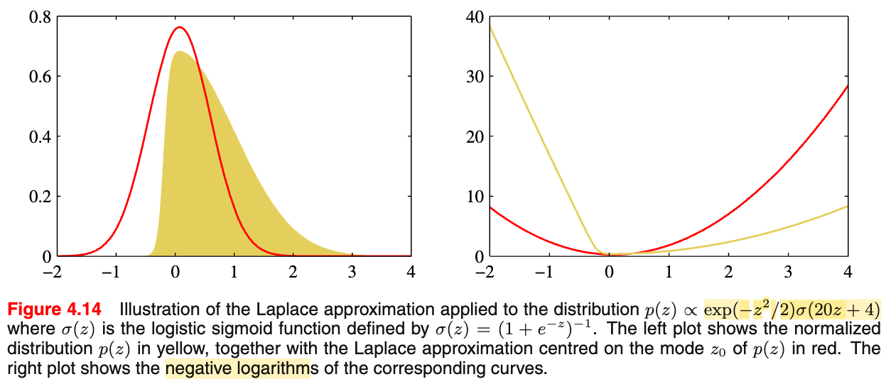
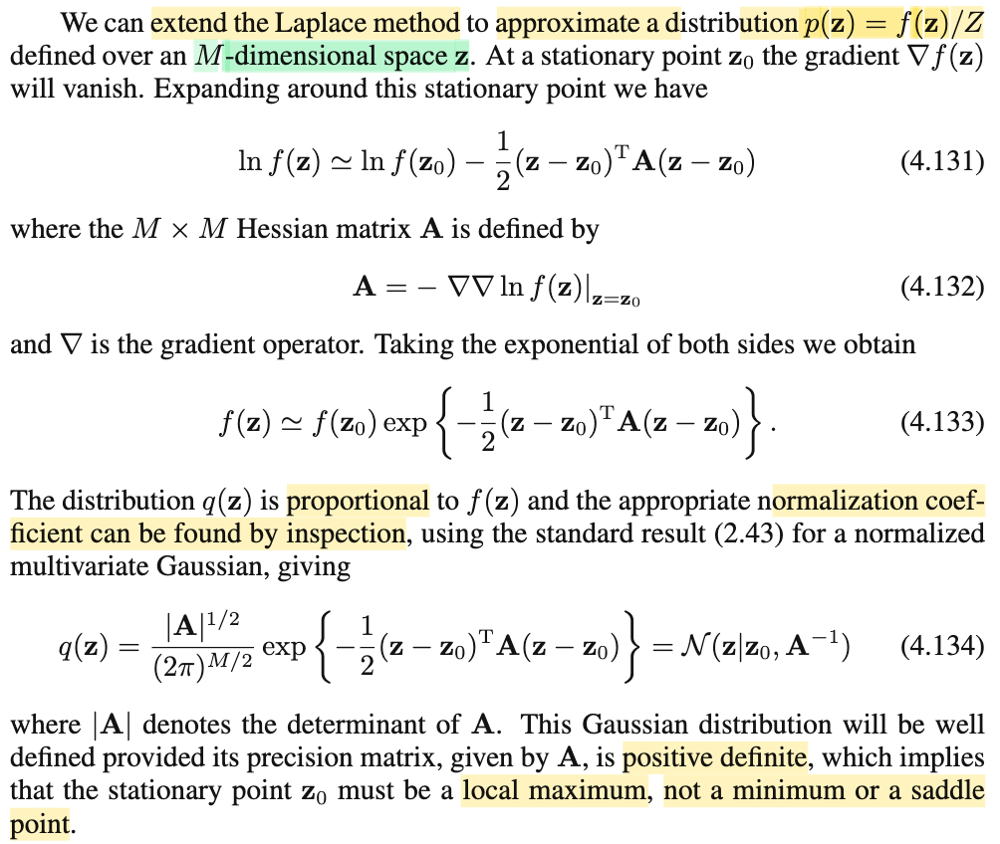
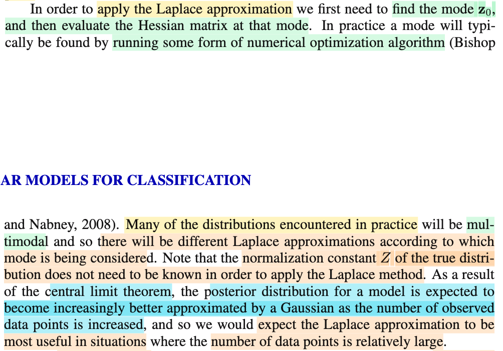
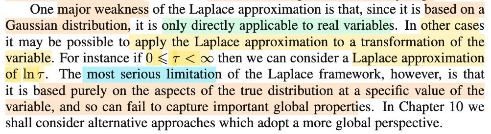

# 4.4 Laplace Approximation

📊 **Progress:** `5` Notes | `7` Screenshots | `5` AI Reviews

---

 

## The Laplace Approximation

<kbd></kbd>

> [!NOTE]
> Đại khái là, chuẩn bị cho phần 4.5 khi ta chuyển sang Bayesian approach đối với mô hình logistic regression. Tác giả cho biết rằng khác với linear regression, việc tiếp cận theo Bayesian approach ở đây sẽ phức tạp hơn nhiều khi ta sẽ không thể tích phân trên toàn bộ giá trị của 𝐰 (với Bayesian, 𝐰 trở thành random variable)
>
>
>
> Mà lí do là vì posterior distribution không phải là Normal nữa, có thể hiểu vầy:
>
>
>
> Với linear regression
>
>
>
> ta có f(𝐰|𝐭) = f(𝐭|𝐰)f(𝐰)/f(𝐭) 
>
>
>
> và ta giả định 𝐰 \~ 𝒩(𝟎, (1/α)𝐈) và với Ti|𝐱i \~ 𝒩(y(𝐰,𝐱i), 1/β) thì f(𝐰|𝐭)
>
>
>
> = \[Πi 𝒩(y(𝐰,𝐱i), 1/β)\] 𝒩(𝟎, (1/α)𝐈) / f(𝐭)
>
>
>
> X \~ 𝒩(μ, σ²), f(x) = (1/√2πσ²) exp{-(x-μ)²/2σ²}
>
>
>
> = \[const1 Πi exp\[(-β/2)(ti-y(𝐰,𝐱i))²\] × const2 exp\[-(α/2)(𝐰-𝟎)ᵀ(𝐰-𝟎))\] / f(𝐭)
>
>
>
> = \[const1 Πi exp\[(-β/2)(ti-y(𝐰,𝐱i))²\] × const2 exp\[-(α/2)𝐰ᵀ𝐰\] / f(𝐭)
>
>
>
> Nhập hết const1 const2 và f(𝐭) thành const
>
>
>
> = const × Πi exp\[(-β/2)(ti-y(𝐰,𝐱i))²\] exp\[-(α/2)𝐰ᵀ𝐰\]
>
>
>
> = const × exp\[Σi(-β/2)(ti-y(𝐰,𝐱i))² - (α/2)𝐰ᵀ𝐰\]
>
>
>
> = const × exp\[(-β/2) Σi(ti-y(𝐰,𝐱i))² - (α/2)𝐰ᵀ𝐰\]
>
>
>
> Và với y(𝐰,𝐱i) = 𝐰ᵀ𝐱i, gom mở ngoặc ra, gom lại ta sẽ thấy có dạng
>
>
>
> = const × exp\[quadratic function của 𝐰\]
>
>
>
> và từ đó có thể dùng cách thức completing the square để chỉ ra đây là pdf của một normal, giúp ta kết luận posterior distribution của 𝐰 là normal (với tham số tính từ 𝐗,𝐭,β,α)
>
>
>
> Và từ đó ta có thể dùng distribution này để tích phân f(t|𝐱,𝐰) tức predictive distribuion over không gian tham số 𝐰 (đại khái là tính trung bình f(t|𝐱,𝐰) qua mọi giá trị khả dĩ của 𝐰 với 𝐰 \~ posterior f(𝐰|𝐭) vậy.
>
>
>
> Nhưng với logistic regression, ta sẽ không có điều tương tự. mà nguyên nhân là do: Nhìn vào hàm f(𝐭|𝐰), ở trên vì nó là tích các f(ti|𝐰) đều là normal, nên về cơ bản, khi ta tính các exp() gom lại với nhau, để cuối cùng cũng trở thành exp(hàm bậc hai theo 𝐰), dẫn đến posterior của 𝐰 vẫn là normal (đây cũng chính là: prior của 𝐰 là normal, là prior conjugate của likelihood, nên posterior cũng ra normal)
>
>
>
> Nhưng khi qua logistic, likelihood, f(𝐭|𝐰) (là joint pdf của Ti|𝐱i, i=1,2,.. nhưng với tư cách nàm theo 𝐰 thì là likelihood của 𝐰), cũng tách thành Πi f(ti|𝐰) thì f(ti|𝐰) không phải là pdf của Normal, mà là pmf của Bern(yi) yi = σ(𝐰ᵀΦi). Do đó, có thể thấy dù không cần tính, rằng khi "mở ra, gom lại" ta sẽ không thể có dạng \[const\] exp (hàm bậc hai của 𝐰) được, nên chắc chắn posterior 𝐰 không phải là normal. Và thậm chí, có thể ta cũng không biết nó là phân phối gì luôn. Như vậy không thể tích phân như case normal được.
>
>
>
> Do đó, ta sẽ chỉ có thể làm "xấp xỉ", và các chương 10,11 ta sẽ học các kĩ thuật dựa trên analytical approximation và numerical sampling.

📹 [Xem video trên YouTube](https://www.youtube.com/watch?v=K9yDgHwWRc0)

> [!TIP]
> 🤖 **AI Check** — 🟢 Pass — ✅ **98/100** · ✓ Move on
>
> Ghi chú xuất sắc! Bạn đã giải thích rất sâu sắc và trực quan lý do toán học đằng sau phát biểu của tác giả: vì sao likelihood Gaussian dẫn đến posterior Gaussian trong Linear Regression, và vì sao likelihood Bernoulli trong Logistic Regression phá vỡ tính liên hợp dẫn đến không thể tính tích phân giải tích.
>
> **✓ Strengths**
> - Diễn giải toán học rất mạch lạc về việc hàm mũ của một biểu thức bậc hai bảo toàn dạng phân phối Gauss (tính liên hợp) trong hồi quy tuyến tính.
> - Chỉ ra chính xác bản chất vì sao posterior trong hồi quy logistic không còn là Gauss: do likelihood là tích các phân phối Bernoulli với hàm sigmoid, không thể gom thành dạng hàm bậc hai ở số mũ.
> - Nắm đúng mục tiêu cốt lõi của Bayesian: cần posterior để tính kỳ vọng (tích phân) cho predictive distribution và việc thiếu dạng đóng buộc ta phải xấp xỉ.
>
> **💡 Deeper notes**
> - Trong hồi quy logistic theo trường phái Bayes, việc tích phân bị kẹt ở hai chỗ: (1) Tính hằng số chuẩn hóa của posterior p(w|t) (marginal likelihood) không khả thi do thiếu tính liên hợp; (2) Ngay cả khi đã xấp xỉ posterior p(w|t) bằng một Gauss (như Laplace approximation), tích phân predictive distribution ∫ σ(wᵀϕ) 𝒩(w) dw bản thân nó vẫn là tích chập của sigmoid và Gauss nên vẫn không có nghiệm giải tích chính xác (phải xấp xỉ tiếp qua probit).

 

### Laplace Approximation Framework

<kbd></kbd>

<kbd></kbd>

<kbd></kbd>

> [!NOTE]
> Đại khái là, giả sử ta có được f(z), và đem normalzing nó (chia nó cho Z = ∫f(z)dz) để có p(z) là một valid pdf (ví dụ f(𝐰|𝐭), là phân phối hậu nghiệm tìm được, và ta không biết dạng của nó là gì) thì mục tiêu là tìm cách xấp xỉ p(z) bởi một normal distribution, hoặc nói dễ hiểu, là tìm một normal distribution 𝒩(z|μ, σ²) (μ, σ² nào đó) có thể nói gần đúng là giống với p(z) nhất, để thay vì dùng p(z) ta dùng cái này.
>
>
>
> Thế thì đại ý lập luận như sau:
>
>
>
> Ý tưởng là, ta sẽ đặt cái chuông tại vị trí ứng với đỉnh của f(z) (cũng là của p(z) và ln f(z)). Còn bề rộng chuông: Ta sẽ dùng xấp xỉ bậc hai của ln f(z) để có được đường cong của chuông. Vì sao lại ln f mà ko phải f, vì nếu làm với f ta sẽ có đường cong hàm bậc hai, sẽ là một parabol chứ ko phải là đường cong hàm pdf normal. Còn làm với ln f ta sẽ có đường con của hàm e^(hàm bậc 2), khi đó sẽ có dạng giống kernel của normal. Trong video khi nói vẽ minh họa mình đã vẽ sai khi gây hiểu lầm là ta xấp xỉ độ cong bậc hai của phân phối gốc f(z) - đồng nghĩa ta đang xấp xỉ bậc hai hàm f(z) thay vì ln f(z): Thì xin đính chính rằng ta dùng xấp xỉ bậc hai của ln f(z).
>
>
>
> Tìm cái đỉnh của f(z): Dùng điều kiện cần bậc nhất tìm stationary point: f'(z) = 0. Gọi nó là z0.
>
>
>
> Tiếp, ta khai triển Taylor bậc hai quanh z0 hàm ln f(z) (đặt là g(z), g'(z) = f'(z)/f(z)):
>
>
>
>
>
> g(z) ≈ g(z0) + g'(z0)(z-z0) + (1/2)(z-z0)²g''(z0)
>
>
>
> Vì z0 cực trị hàm f(z) nên f'(z0) = 0 ⇒ g'(z0) = f'(z0)/f(z0) = 0/f(z0) = 0: Nên ta có:
>
>
>
> g(z) ≈ g(z0) + (1/2)(z-z0)² g''(z0)
>
>
>
> Đặt g''(z0) = -A
>
>
>
> g(z) ≈ g(z0) + (-A/2)(z-z0)²
>
>
>
> Thay lại g(z) = ln f(z)
>
>
>
> ln f(z) ≈ ln f(z0) -(A/2)(z-z0)²
>
>
>
> ⇔ ln f(z) ≈ ln f(z0) + ln exp\[(-A/2)(z-z0)²\] | ln e^x = x
>
>
>
> ⇔ ln f(z) ≈ ln {f(z0) exp\[(-A/2)(z-z0)²\]} | lnA + lnB = ln AB
>
>
>
> ⇒ f(z) ≈ f(z0) exp\[(-A/2)(z-z0)²\] → 4.129
>
>
>
> Như vậy tới đây ta đã có hàm xấp xỉ của f(z) (tức cái bên phải) có dạng \[some constant\] × exp\[hàm bậc hai của z\], do đó nó chắc chắn là một pdf của một normal với tham số nào đó (sau khi normalizing), và bằng cách complete the square hay khớp mẫu ta sẽ có được pdf này:
>
>
>
> f(z0) exp\[(-A/2)(z-z0)²\]
>
>
>
> Khớp với dạng pdf 𝒩(z0, σ²) (ở trên ta biết chắc đây là mean z0)
>
>
>
> = \[1/√2πσ²\] exp{-(z-z0)²/2σ²}
>
>
>
> Khớp mẫu: (-A/2) = -1/2σ² ⇒ σ² = 1/A, A = 1/σ², hay precision
>
>
>
> Từ đó 1/√2πσ² = 1/√2π(1/A) = √(A/2π)
>
>
>
> Như vậy, p(z) (là f(z) đã normalizing để có dạng valid pdf) có thể được xấp xỉ bởi 𝒩(z|z0,1/A) = √(A/2π) exp\[(-A/2)(z-z0)²\]
>
>
>
> Đương nhiên precision hay 1/σ² phải dương, thành ra A phải &gt; 0 ⇔ g''(z0) &lt; 0. Mà ta còn nhớ kiến thức giải tích 1 - khi có được stationary point, dùng secondary test: tính đạo hàm cấp 2, nếu ra &lt; 0 thì kết luận là điểm cực đại, &gt; 0 thì là điểm cực tiểu) cho nên điều này đồng nghĩa z0 phải là local maximizer của g (= ln f(z))

📹 [Xem video trên YouTube](https://www.youtube.com/watch?v=0uDZAp4dJl4)

> [!TIP]
> 🤖 **AI Check** — 🟢 Pass — ✅ **98/100** · ✓ Move on
>
> Ghi chú xuất sắc, hiểu rất sâu và giải thích cực kỳ trực quan về bản chất của phép xấp xỉ Laplace và lý do khai triển trên ln f(z).
>
> **✓ Strengths**
> - Giải thích rất chính xác và trực quan lý do tại sao phải khai triển Taylor trên ln f(z) thay vì f(z) (để khi lấy exp sẽ tạo ra dạng Gaussian kernel).
> - Các bước biến đổi đại số từ khai triển Taylor bậc 2 đến việc khớp dạng phân phối chuẩn và tìm hằng số chuẩn hóa đều rất rõ ràng và chuẩn xác.
> - Nắm chắc điều kiện cần và đủ của cực trị địa phương (stationary point và đạo hàm bậc 2 âm) để đảm bảo precision A > 0.
>
> **💡 Deeper notes**
> - Cần lưu ý rằng xấp xỉ Laplace là một xấp xỉ cục bộ (local approximation) tại mode dựa trên độ cong ở đỉnh, nên nó không tối ưu hóa độ khớp toàn cục (như cách Variational Inference cực tiểu hóa KL divergence) và có thể xấp xỉ kém nếu phân phối gốc bị lệch (skewed) hoặc đa đỉnh (multimodal).

 

#### Multivariate Laplace Approximation

<kbd></kbd>

> [!NOTE]
> Rồi, qua đây, chỉ là làm tương tự cho case M-chiều (hồi nãy là 1 chiều, nơi f(z), p(z) là hàm đơn biến)
>
>
>
> Cũng hoàn toàn tương tự. Ta đặt tâm chuông Gaussian tại 𝐳0 là local maximum của f(𝐳), là 𝐳0 thỏa ∇f(𝐳0) = 𝟎.
>
>
>
> Xấp xỉ bậc hai hàm g(𝐳) = ln f(𝐳) tại 𝐳0:
>
>
>
> ∇g(𝐳) (=d/d𝐳 g(𝐳)) = d/d𝐳 ln f(𝐳) = (d/df ln f) . (d/d𝐳 f(𝐳)) = (1/f) ∇f(𝐳)
>
>
>
> ---
>
> Ôn lại công thức xấp xỉ bậc hai:
>
>
>
> f(z) = f(z0) + f'(z0)(z-z0) + (1/2)(z-z0)²f''(z0)
>
>
>
> f(𝐳) = f(𝐳0) + ∇f(𝐳0)ᵀ(𝐳-𝐳0) + (1/2)(𝐳-𝐳0)ᵀ∇²f(𝐳0)(𝐳-𝐳0)
>
>
>
> ---
>
>
>
> g(𝐳) ≈ g(𝐳0) + ∇g(𝐳0)ᵀ(𝐳-𝐳0) + (1/2)(𝐳-𝐳0)ᵀ∇²g(𝐳0)(𝐳-𝐳0)
>
>
>
> ⇔ ln f(𝐳) ≈ ln f(𝐳0) + (1/2)(𝐳-𝐳0)ᵀ∇²g(𝐳0)(𝐳-𝐳0)
>
>
>
> ⇔ ln f(𝐳) ≈ ln f(𝐳0) + ln exp\[(1/2)(𝐳-𝐳0)ᵀ∇²g(𝐳0)(𝐳-𝐳0)\]
>
>
>
> ⇔ ln f(𝐳) ≈ ln {f(𝐳0) exp\[(1/2)(𝐳-𝐳0)ᵀ∇²g(𝐳0)(𝐳-𝐳0)\]}
>
>
>
> f(𝐳) ≈ f(𝐳0) exp\[(1/2)(𝐳-𝐳0)ᵀ∇²g(𝐳0)(𝐳-𝐳0)\]
>
>
>
> f(𝐳) ≈ f(𝐳0) exp\[(-1/2)(𝐳-𝐳0)ᵀ(-∇²g(𝐳0))(𝐳-𝐳0)\]
>
>
>
> Đặt 𝐀 = -∇²g(𝐳0), hay -∇²ln f(𝐳0), (chú ý đương nhiên phải hiểu đây là hàm số Hessian của ln f(𝐳), evaluate tại 𝐳0: ∇² ln(f(𝐳))|𝐳=𝐳0
>
>
>
> ⇒ f(𝐳) ≈ f(𝐳0) exp\[(-1/2)(𝐳-𝐳0)ᵀ(𝐀⁻¹)⁻¹(𝐳-𝐳0)\], có dạng kernel của hàm Gaussian 𝒩(𝐳0, 𝐀⁻¹)
>
>
>
> (chú ý tại vì thei công thức pdf Normal đa biến là thì trong exp là (..)𝚺⁻¹(..), nên phải chuyển 𝐀 = (𝐀⁻¹)⁻¹ để từ đó suy ra covariance matrix của Normal này là 𝐀⁻¹)
>
>
>
> Từ đó ta có Gaussian pdf xấp xỉ Laplace của p(𝐳):
>
>
>
> q(𝐳) = \[1/(2π)^(M/2)\] \[1/√|𝐀⁻¹|\] exp\[(-1/2)(𝐳-𝐳0)ᵀ(𝐀⁻¹)⁻¹(𝐳-𝐳0)\]
>
>
>
> = \[1/(2π)^(M/2)\] \[|𝐀⁻¹|^(-1/2)\] exp\[(-1/2)(𝐳-𝐳0)ᵀ(𝐀⁻¹)⁻¹(𝐳-𝐳0)\]
>
>
>
> Dùng identity |𝐀| = 1/ |𝐀⁻¹|
>
>
>
> = \[1/(2π)^(M/2)\] \[1/|𝐀|^(-1/2)\] exp\[(-1/2)(𝐳-𝐳0)ᵀ(𝐀⁻¹)⁻¹(𝐳-𝐳0)\]
>
>
>
> = \[1/(2π)^(M/2)\] \[|𝐀|^(1/2)\] exp\[(-1/2)(𝐳-𝐳0)ᵀ(𝐀⁻¹)⁻¹(𝐳-𝐳0)\]
>
>
>
> = \[|𝐀|^(1/2) / (2π)^((M/2))\] exp\[(-1/2)(𝐳-𝐳0)ᵀ(𝐀⁻¹)⁻¹(𝐳-𝐳0)\]
>
>
>
> Tương tự, pdf của normal chỉ hợp lệ khi covariance matrix (và precision matrix) đều xác định dương: 𝐀 xác định dương ⇔ - ∇²g(𝐳0) xác định dương = ∇²g(𝐳0) xác định âm, đồng nghĩa 𝐳0 là local maximizer của f(𝐳)

📹 [Xem video trên YouTube](https://www.youtube.com/watch?v=7rFrudmIrBk)

> [!TIP]
> 🤖 **AI Check** — 🟢 Pass — ✅ **100/100** · ✓ Move on
>
> Ghi chú rất xuất sắc, tự triển khai đầy đủ các bước khai triển Taylor bậc hai nhiều chiều và biến đổi hệ số chuẩn hóa của phân phối Gaussian một cách chính xác.
>
> **✓ Strengths**
> - Tự suy diễn chi tiết chuỗi biến đổi từ khai triển Taylor của ln f(z) đến dạng hàm mũ kernel Gaussian thay vì chỉ chép lại công thức trong sách.
> - Biến đổi định thức ma trận hiệp biến và ma trận độ chính xác (precision matrix) rất tường minh và chuẩn xác.
> - Nắm vững điều kiện để phân phối Gaussian xác định (A xác định dương tương ứng với cực đại địa phương).
>
> **💡 Deeper notes**
> - Số hạng đạo hàm bậc nhất triệt tiêu vì theo quy tắc chuỗi ∇ ln f(z₀) = ∇f(z₀)/f(z₀) = 0 khi ∇f(z₀) = 0.

**🔗 See also:** [PDF Gaussian Đa Biến](./124_the_gaussian_distribution.md#node-40ke7sj) · [Section 4.4.1 Model Comparison and BIC](./441_model_comparison_and_bic.md#node-lln8f53)

 

##### Applying the Laplace Approximation

<kbd></kbd>

> [!NOTE]
> Đoạn này đại ý là nói về vì sao Laplace approximation tốt;
>
>
>
> Trước hết, có vài chú ý rằng thực tế phân phối mà ta gặp (ám chỉ f(z), p(z) = f(z)/Z) sẽ là multi-modal, tức là có nhiều đỉnh, khi đó, cái chuông Gaussian sẽ tùy vào các đỉnh 𝐳0 khác nhau.
>
>
>
> Gs cũng nhắc ta để ý rằng trong quá trình xấp xỉ Laplace hoàn toàn không cần phải tính Z: Mình nghĩ, quả thật, vì khi ta làm, thì sau bước xấp xỉ bậc hai hàm ln f(z), bằng cách khớp mẫu là mình đã biết tham số mean và covariance matrix rồi, việc còn lại để có pdf Gaussian hoàn chỉnh chỉ là áp theo công thức pdf đa biến mà thôi (ý là, chả cần phải biết Z để normalize f(z) thành p(z) làm gì cả)
>
>
>
> Cuối cùng, là nói về cơ sở nào bảo kê cho việc ta xấp xỉ posterior distribution bởi Gaussian:
>
>
>
> Đó chính là CLT Central Limit Theorem. Trong Casella đã học rằng, CLT nói rằng, cho X1,...Xn có EX = μ, VarX = σ² thì √n(X̄ -μ)/σ converge in distribution về 𝒩(0,1)
>
>
>
> Thì ở đây tác giả nói rằng, dựa vào CLT, posterior sẽ ngày càng trở nên giống normal khi n càng lớn (nên sự xấp xỉ bởi normal sẽ ngày càng chính xác) (đây có thể dựa trên một định lý nào đó, mà nó cũng dựa trên CLT)

> [!TIP]
> 🤖 **AI Check** — 🟢 Pass — ✅ **98/100** · ✓ Move on
>
> Ghi chú rất chính xác và nắm bắt trọn vẹn các ý chính của đoạn văn, từ việc xử lý đa cực trị, lý do không cần tính hằng số chuẩn hóa Z, đến trực giác đằng sau định lý giới hạn trung tâm (CLT).
>
> **✓ Strengths**
> - Hiểu chính xác rằng mỗi cực trị địa phương (mode) trong phân phối multimodal sẽ cho ra một xấp xỉ Gaussian cục bộ riêng biệt.
> - Lý giải rất chuẩn xác và trực quan lý do tại sao không cần biết hằng số chuẩn hóa Z: sau khi khai triển bậc hai cho ln f(z), mean và covariance matrix được suy ra trực tiếp từ đạo hàm bậc hai, phần chuẩn hóa của Gaussian được tính tự động theo công thức pdf.
> - Liên hệ và ghi nhớ chính xác phát biểu của Central Limit Theorem (CLT) và suy đoán đúng về sự tồn tại của định lý bảo kê cho tính chuẩn tiệm cận của posterior.
>
> **💡 Deeper notes**
> - Về 'định lý nào đó dựa trên CLT' mà bạn dự đoán: Trong thống kê Bayes, định lý chính thức khẳng định phân phối hậu nghiệm (posterior) hội tụ về phân phối chuẩn khi kích thước mẫu n tiến tới vô cùng chính là Định lý Bernstein–von Mises (đôi khi được gọi là Bayesian Central Limit Theorem).

 

###### Limitations of Laplace Approximation

<kbd></kbd>

> [!NOTE]
> Hạn chế lớn nhất của Laplace approx. là nó dựa trên thuần túy xấp xỉ hàm số tại 1 điểm, nên nó sẽ làm mất những thông tin global quan trọng.
>
>
>
> HIểu đại ý là, giống như khi nếu f là multi modal, thì việc xấp xỉ nó bởi 1 cái chuông normal tại một đỉnh nào đó, đã bỏ qua hết các thông tin về hình dạng toàn cục của f (cái này khó nói bằng lời nhưng rất dễ nhìn thấy, ta thay cái f đa đỉnh bởi 1 hàm đơn đỉnh thì sao mà đúng được chứ)
>
>
>
> Hạn chế nhỏ hơn của nó, là nó chỉ áp dụng cho các biến số số thực (ý là có thể mang giá trị -inf tới inf) (do nó xấp xỉ f bởi normal, là một phân phối liên tục), vậy lỡ ta có hàm f là hàm mà miền xác định của nó là không âm thì sao, thì khi đó xấp xỉ bởi normal sẽ không hợp lí. Thì một cách làm là làm với phân phối của ln τ (τ bị ràng buộc ko âm, nhưng ln τ thì có thể -inf to inf)

> [!TIP]
> 🤖 **AI Check** — 🟢 Pass — ✅ **95/100** · ✓ Move on
>
> Ghi chú nắm rất chắc và diễn giải trực quan, chính xác hai hạn chế cốt lõi của xấp xỉ Laplace từ tài liệu.
>
> **✓ Strengths**
> - Hiểu rất đúng và lấy ví dụ trực quan tốt về việc xấp xỉ đơn đỉnh (Gaussian) tại một điểm cục bộ sẽ bỏ qua tính chất toàn cục (như đa đỉnh - multimodal).
> - Nắm chuẩn giải pháp biến đổi biến số (ví dụ dùng hàm ln) khi miền giá trị bị chặn ở phía không âm để đưa về toàn bộ trục số thực.
>
> **💡 Deeper notes**
> - Về mặt thuật ngữ, 'real variables' trong bối cảnh phân phối Gauss nghĩa là biến thực liên tục có giá đỡ (support) trên toàn bộ trục thực $(-\infty, +\infty)$, nhằm phân biệt với biến rời rạc (discrete) và biến liên tục có miền giá trị bị chặn (như $0 \leqslant \tau < \infty$).

 

