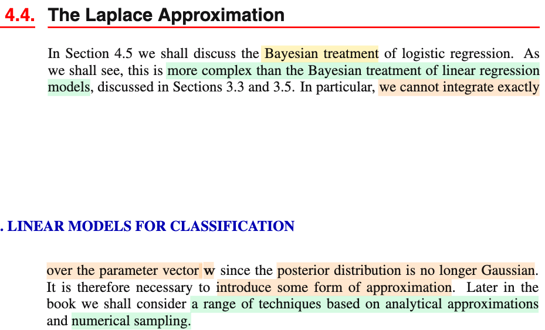
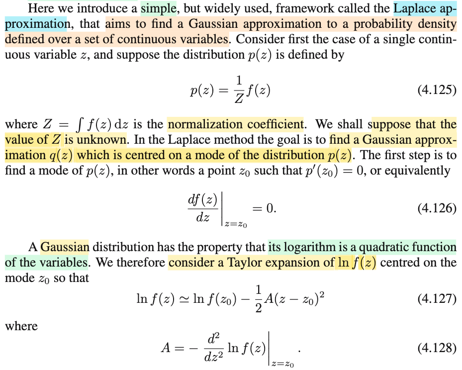
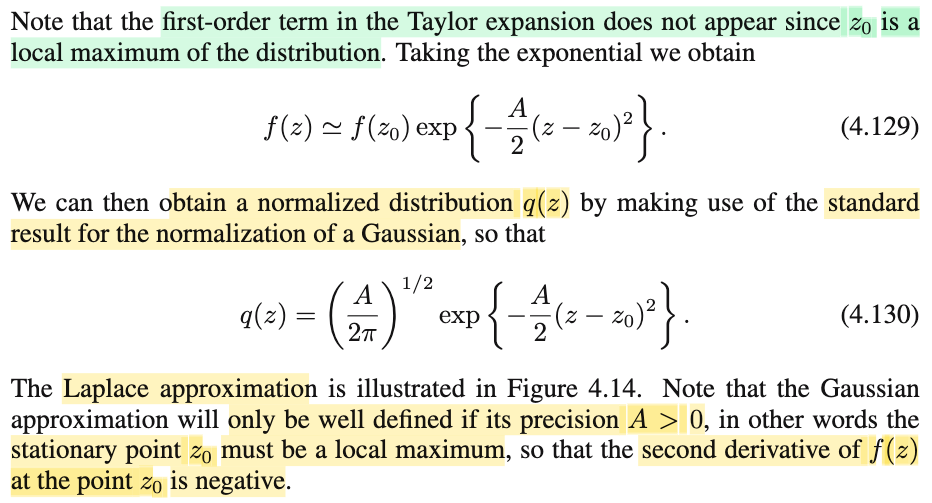

# 4.4 Laplace Approximation

📊 **Progress:** `2` Notes | `3` Screenshots | `2` AI Reviews

---

 

## The Laplace Approximation

<kbd></kbd>

> [!NOTE]
> Đại khái là, chuẩn bị cho phần 4.5 khi ta chuyển sang Bayesian approach đối với mô hình logistic regression. Tác giả cho biết rằng khác với linear regression, việc tiếp cận theo Bayesian approach ở đây sẽ phức tạp hơn nhiều khi ta sẽ không thể tích phân trên toàn bộ giá trị của 𝐰 (với Bayesian, 𝐰 trở thành random variable)
>
>
>
> Mà lí do là vì posterior distribution không phải là Normal nữa, có thể hiểu vầy:
>
>
>
> Với linear regression
>
>
>
> ta có f(𝐰|𝐭) = f(𝐭|𝐰)f(𝐰)/f(𝐭) 
>
>
>
> và ta giả định 𝐰 \~ 𝒩(𝟎, (1/α)𝐈) và với Ti|𝐱i \~ 𝒩(y(𝐰,𝐱i), 1/β) thì f(𝐰|𝐭)
>
>
>
> = \[Πi 𝒩(y(𝐰,𝐱i), 1/β)\] 𝒩(𝟎, (1/α)𝐈) / f(𝐭)
>
>
>
> X \~ 𝒩(μ, σ²), f(x) = (1/√2πσ²) exp{-(x-μ)²/2σ²}
>
>
>
> = \[const1 Πi exp\[(-β/2)(ti-y(𝐰,𝐱i))²\] × const2 exp\[-(α/2)(𝐰-𝟎)ᵀ(𝐰-𝟎))\] / f(𝐭)
>
>
>
> = \[const1 Πi exp\[(-β/2)(ti-y(𝐰,𝐱i))²\] × const2 exp\[-(α/2)𝐰ᵀ𝐰\] / f(𝐭)
>
>
>
> Nhập hết const1 const2 và f(𝐭) thành const
>
>
>
> = const × Πi exp\[(-β/2)(ti-y(𝐰,𝐱i))²\] exp\[-(α/2)𝐰ᵀ𝐰\]
>
>
>
> = const × exp\[Σi(-β/2)(ti-y(𝐰,𝐱i))² - (α/2)𝐰ᵀ𝐰\]
>
>
>
> = const × exp\[(-β/2) Σi(ti-y(𝐰,𝐱i))² - (α/2)𝐰ᵀ𝐰\]
>
>
>
> Và với y(𝐰,𝐱i) = 𝐰ᵀ𝐱i, gom mở ngoặc ra, gom lại ta sẽ thấy có dạng
>
>
>
> = const × exp\[quadratic function của 𝐰\]
>
>
>
> và từ đó có thể dùng cách thức completing the square để chỉ ra đây là pdf của một normal, giúp ta kết luận posterior distribution của 𝐰 là normal (với tham số tính từ 𝐗,𝐭,β,α)
>
>
>
> Và từ đó ta có thể dùng distribution này để tích phân f(t|𝐱,𝐰) tức predictive distribuion over không gian tham số 𝐰 (đại khái là tính trung bình f(t|𝐱,𝐰) qua mọi giá trị khả dĩ của 𝐰 với 𝐰 \~ posterior f(𝐰|𝐭) vậy.
>
>
>
> Nhưng với logistic regression, ta sẽ không có điều tương tự. mà nguyên nhân là do: Nhìn vào hàm f(𝐭|𝐰), ở trên vì nó là tích các f(ti|𝐰) đều là normal, nên về cơ bản, khi ta tính các exp() gom lại với nhau, để cuối cùng cũng trở thành exp(hàm bậc hai theo 𝐰), dẫn đến posterior của 𝐰 vẫn là normal (đây cũng chính là: prior của 𝐰 là normal, là prior conjugate của likelihood, nên posterior cũng ra normal)
>
>
>
> Nhưng khi qua logistic, likelihood, f(𝐭|𝐰) (là joint pdf của Ti|𝐱i, i=1,2,.. nhưng với tư cách nàm theo 𝐰 thì là likelihood của 𝐰), cũng tách thành Πi f(ti|𝐰) thì f(ti|𝐰) không phải là pdf của Normal, mà là pmf của Bern(yi) yi = σ(𝐰ᵀΦi). Do đó, có thể thấy dù không cần tính, rằng khi "mở ra, gom lại" ta sẽ không thể có dạng \[const\] exp (hàm bậc hai của 𝐰) được, nên chắc chắn posterior 𝐰 không phải là normal. Và thậm chí, có thể ta cũng không biết nó là phân phối gì luôn. Như vậy không thể tích phân như case normal được.
>
>
>
> Do đó, ta sẽ chỉ có thể làm "xấp xỉ", và các chương 10,11 ta sẽ học các kĩ thuật dựa trên analytical approximation và numerical sampling.

📹 [Xem video trên YouTube](https://www.youtube.com/watch?v=K9yDgHwWRc0)

> [!TIP]
> 🤖 **AI Check** — 🟢 Pass — ✅ **98/100** · ✓ Move on
>
> Ghi chú xuất sắc! Bạn đã giải thích rất sâu sắc và trực quan lý do toán học đằng sau phát biểu của tác giả: vì sao likelihood Gaussian dẫn đến posterior Gaussian trong Linear Regression, và vì sao likelihood Bernoulli trong Logistic Regression phá vỡ tính liên hợp dẫn đến không thể tính tích phân giải tích.
>
> **✓ Strengths**
> - Diễn giải toán học rất mạch lạc về việc hàm mũ của một biểu thức bậc hai bảo toàn dạng phân phối Gauss (tính liên hợp) trong hồi quy tuyến tính.
> - Chỉ ra chính xác bản chất vì sao posterior trong hồi quy logistic không còn là Gauss: do likelihood là tích các phân phối Bernoulli với hàm sigmoid, không thể gom thành dạng hàm bậc hai ở số mũ.
> - Nắm đúng mục tiêu cốt lõi của Bayesian: cần posterior để tính kỳ vọng (tích phân) cho predictive distribution và việc thiếu dạng đóng buộc ta phải xấp xỉ.
>
> **💡 Deeper notes**
> - Trong hồi quy logistic theo trường phái Bayes, việc tích phân bị kẹt ở hai chỗ: (1) Tính hằng số chuẩn hóa của posterior p(w|t) (marginal likelihood) không khả thi do thiếu tính liên hợp; (2) Ngay cả khi đã xấp xỉ posterior p(w|t) bằng một Gauss (như Laplace approximation), tích phân predictive distribution ∫ σ(wᵀϕ) 𝒩(w) dw bản thân nó vẫn là tích chập của sigmoid và Gauss nên vẫn không có nghiệm giải tích chính xác (phải xấp xỉ tiếp qua probit).

 

### Laplace Approximation Framework

<kbd></kbd>

<kbd></kbd>

> [!NOTE]
> Đại khái là, giả sử ta có được f(z), và đem normalzing nó (chia nó cho Z = ∫f(z)dz) để có p(z) là một valid pdf (ví dụ f(𝐰|𝐭), là phân phối hậu nghiệm tìm được, và ta không biết dạng của nó là gì) thì mục tiêu là tìm cách xấp xỉ p(z) bởi một normal distribution, hoặc nói dễ hiểu, là tìm một normal distribution 𝒩(z|μ, σ²) (μ, σ² nào đó) giống với p(z) nhất, để thay vì dùng p(z) ta dùng cái này.
>
>
>
> Thế thì đại ý lập luận như sau:
>
>
>
> Tìm cái đỉnh của f(z): Dùng điều kiện cần bậc nhất tìm stationary point: f'(z) = 0. Gọi nó là z0.
>
>
>
> Tiếp, ta khai triển Taylor bậc hai quanh z0 hàm ln f(z) (đặt là g(z), g'(z) = f'(z)/f(z)):
>
>
>
> g(z) ≈ g(z0) + g'(z0)(z-z0) + (1/2)(z-z0)²g''(z0)
>
>
>
> Vì z0 cực trị hàm f(z) nên f'(z0) = 0 ⇒ g'(z0) = f'(z0)/f(z0) = 0/f(z0) = 0: Nên ta có:
>
>
>
> g(z) ≈ g(z0) + (1/2)(z-z0)² g''(z0)
>
>
>
> Đặt g''(z0) = -A
>
>
>
> g(z) ≈ g(z0) + (-A/2)(z-z0)² 
>
>
>
> Thay lại g(z) = ln f(z)
>
>
>
> ln f(z) ≈ ln f(z0) -(A/2)(z-z0)²
>
>
>
> ⇔ ln f(z) ≈ ln f(z0) + ln exp\[(-A/2)(z-z0)²\]  | ln e^x = x
>
>
>
> ⇔ ln f(z) ≈ ln {f(z0) exp\[(-A/2)(z-z0)²\]} | lnA + lnB = ln AB
>
>
>
> ⇒ f(z) ≈ f(z0) exp\[(-A/2)(z-z0)²\] → 4.129
>
>
>
> Như vậy tới đây ta đã có hàm xấp xỉ của f(z) (tức cái bên phải) có dạng \[some constant\] × exp\[hàm bậc hai của z\], do đó nó chắc chắn là một pdf của một normal với tham số nào đó (sau khi normalizing), và bằng cách complete the square hay khớp mẫu ta sẽ có được pdf này:
>
>
>
> f(z0) exp\[(-A/2)(z-z0)²\]
>
>
>
> Khớp với dạng pdf 𝒩(z0, σ²) (ở trên ta biết chắc đây là mean z0)
>
>
>
> = \[1/√2πσ²\] exp{-(z-z0)²/2σ²}
>
>
>
> Khớp mẫu: (-A/2) = -1/2σ² ⇒ σ² = 1/A, A = 1/σ², hay precision
>
>
>
> Từ đó 1/√2πσ² = 1/√2π(1/A) = √(A/2π)
>
>
>
> Như vậy, p(z) (là f(z) đã normalizing để có dạng valid pdf) có thể được xấp xỉ bởi 𝒩(z|z0,1/A) = √(A/2π) exp\[(-A/2)(z-z0)²\]
>
>
>
> Đương nhiên precision hay 1/σ² phải dương, thành ra A phải &gt; 0 ⇔ g''(z0) &lt; 0. Mà ta còn nhớ kiến thức giải tích 1 - khi có được cực trị (stationary point), dùng secondary test: tính đạo hàm cấp 2, nếu ra &lt; 0 thì kết luận là điểm cực đại, &gt; 0 thì là điểm cực tiểu) cho nên điều này đồng nghĩa z0 phải là local maximizer của g (= ln f(z))

📹 [Xem video trên YouTube](https://www.youtube.com/watch?v=0uDZAp4dJl4)

> [!TIP]
> 🤖 **AI Check** — 🟢 Pass — ✅ **95/100** · ✓ Move on
>
> Ghi chú rất xuất sắc, tự diễn giải và biến đổi chi tiết từng bước toán học từ khai triển Taylor của hàm log cho đến khớp dạng phân phối chuẩn để tìm kỳ vọng và phương sai.
>
> **🟡 Minor issues**
>
> **1.** *"ví dụ f(𝐰|𝐭), là phân phối hậu nghiệm tìm được, và ta không biết dạng của nó là gì"*
>
> Cách ký hiệu f(𝐰|𝐭) hơi lỏng lẻo; thông thường trong suy diễn Bayes, phân phối hậu nghiệm p(𝐰|𝐭) ∝ p(𝐭|𝐰)p(𝐰) thì f(𝐰) = p(𝐭|𝐰)p(𝐰) chính là hàm unnormalized (chưa chuẩn hóa) mà mẫu số Z = p(𝐭) là tích phân khó tính.
>
>
> **✓ Strengths**
> - Tự biến đổi chi tiết bước trung gian đạo hàm log g'(z0) = f'(z0)/f(z0) = 0 để giải thích tại sao triệt tiêu số hạng bậc một.
> - Khớp mẫu (pattern matching) trực tiếp với dạng phân phối chuẩn để rút ra quan hệ phương sai và precision σ² = 1/A một cách trực quan, mạch lạc.
> - Hiểu chính xác điều kiện A > 0 tương ứng với kiểm định đạo hàm cấp hai (second derivative test) để z0 là điểm cực đại địa phương.
>
> **💡 Deeper notes**
> - Tại điểm dừng f'(z0) = 0, đạo hàm cấp hai của log là g''(z0) = f''(z0)/f(z0); do f(z0) > 0 nên điều kiện cực đại của g(z) cũng đồng nhất với cực đại của f(z).
> - Xấp xỉ Laplace có tính chất cục bộ (local approximation) tập trung quanh đỉnh mode z0, do đó có thể xấp xỉ kém nếu phân phối thực tế có nhiều đỉnh (multimodal), bị lệch (skewed), hoặc có đuôi dày (heavy-tailed).

 

