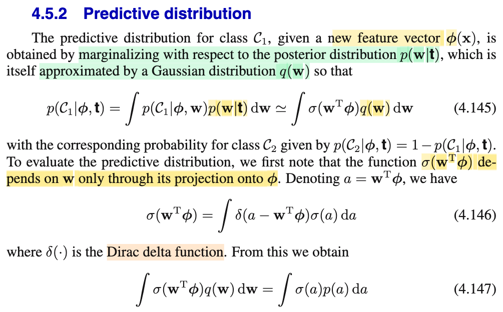
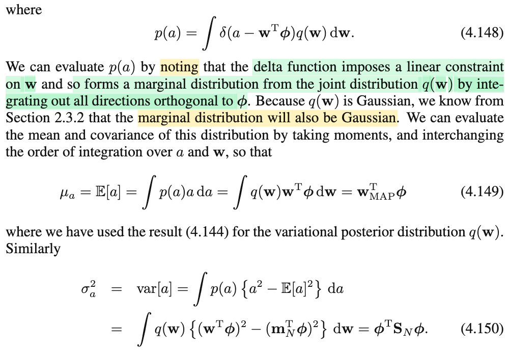
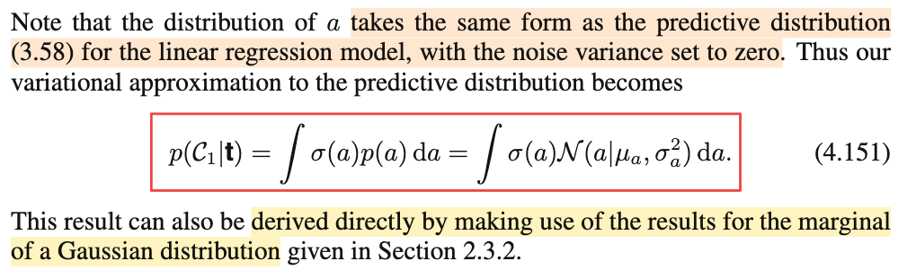

# 4.5.2 Predictive distribution

📊 **Progress:** `2` Notes | `3` Screenshots | `2` AI Reviews

---

 

## Section 4.5.2 Predictive Distribution

<kbd></kbd>

<kbd></kbd>

<kbd></kbd>

> [!NOTE]
> Phần này nói rằng, sau khi đã có Gaussian xấp xỉ của posteriori f(𝐰|𝐭), ta xây dựng predictive distribution: f(t|Φ,𝐭), tức P(T=t|Φ,𝐭)
>
>
>
> Ta có P(T=1|𝐰,Φ) (cũng là P(class = 𝒞1|𝐰,Φ)) = σ(𝐰ᵀΦ)
>
>
>
> Thế thì y như khi marginalize joint pdf của X,Y over y ta có f(x): f(x) = ∫f(x,y)dy = ∫f(x|y)f(y)dy
>
>
>
> Predictive distribution có được là do ta marginalizing P(T=1, 𝐰|Φ,𝐭) bởi f(𝐰|𝐭):
>
>
>
> P(T=1|Φ,𝐭) = ∫P(T=1, 𝐰|Φ,𝐭)d𝐰 = ∫P(T=1|𝐰,Φ)f(𝐰|𝐭)d𝐰
>
>
>
> Và với f(𝐰|𝐭) ≈ 𝒩(𝐰|𝐰MAP, 𝐒N)
>
>
>
> ⇒ P(T=1|Φ,𝐭) ≈ ∫P(T=1|𝐰Φ)𝒩(𝐰|𝐰MAP, 𝐒N)d𝐰
>
>
>
> = ∫σ(𝐰ᵀΦ)𝒩(𝐰|𝐰MAP, 𝐒N)d𝐰
>
>
>
> ---
>
>
>
> Vấn đề: Đây là tích phân theo 𝐰, một vector M chiều, nói cách khác, đây là tích M biến ∫(...)dw1dw2...dwM
>
>
>
> Thì ý tưởng để làm tiếp của ông Bishop: Ông nói hãy để ý rằng, trong cái tích phân này ∫σ(𝐰ᵀΦ)𝒩(𝐰|𝐰MAP, 𝐒N)d𝐰 thì cục σ(𝐰ᵀΦ) sẽ phụ thuộc 𝐰 thông qua a, với a = 𝐰ᵀΦ. Ý là gì? Ý là, nhắc ta để ý thế này: tuy 𝐰 là M chiều, nhưng a(𝐰) (a, với tư cách là hàm theo 𝐰) chỉ là 1 chiều.
>
>
>
> Bên cạnh đó, nhớ LOTUS không: Nó nói nếu Y = g(X) thì EY = ∫g(x)fX(x)dx.
>
>
>
> X, fX(x). EX = ∫xfX(x)dx
>
>
>
> Y, fY(y). EY = ∫g(x)fX(x)dx
>
>
>
> Và LOTUS đúng với cả case mà Y = g(𝐗), EY = ∫...∫g(𝐱)f(𝐱)d𝐱
>
>
>
> Vậy thì sao? Nó chính là nói: ∫yfY(y)dy = ∫...∫g(𝐱)f(𝐱)d𝐱
>
>
>
> Nếu ta lại có Z = h(Y), thì
>
>
>
> LOTUS cho phép tính EZ = ∫h(y)fY(y)dy
>
>
>
> Nhưng nếu coi nó như hàm của 𝐗 thì Z = h(g(𝐗)) thì sao?
>
>
>
> LOTUS lại cho phép EZ = ∫...∫h(g(𝐱))f(𝐱)d𝐱
>
>
>
> Nên EZ = ∫h(y)fY(y)dy = ∫...∫h(g(𝐱))f(𝐱)d𝐱 (1)
>
>
>
> ---
>
>
>
> Vậy ở đây, tương ứng 𝐗 chính là 𝐰, để rồi Y = g(𝐗) tương ứng a = 𝐰ᵀΦ, sau đó Z = h(Y) tương ứng S = σ(a). Vậy theo LOTUS:
>
>
>
> E\[S\] = ∫..∫h(g(𝐰))f(𝐰)d𝐰
>
>
>
> và ở đây pdf của 𝐰, f(𝐰) là 𝒩(𝐰|𝐰MAP, 𝐒N) (tức pdf 𝐰 là pdf của 𝒩(𝐰MAP, 𝐒N)
>
>
>
> cũng như thế g, h vào:
>
>
>
> E\[S\] = ∫..∫σ(𝐰ᵀΦ)𝒩(𝐰MAP, 𝐒N)d𝐰
>
>
>
> À như vậy ta thấy cái predictive distribution ta muốn tính **thực chất chính là kì vọng của một biến ngẫu nhiên S** tạo bởi S = h(a), và a là biến a = 𝐰ᵀΦ với 𝐰 theo phân phối posterior mà thôi.
>
>
>
> Tức là predictive probability thực chất là E\[σ(𝐰ᵀΦ)\] với 𝐰 \~ posterior distribution.
>
>
>
> Và cũng chính vì lẽ đó, giống như ở trên ta thấy LOTUS cho phép EZ = ∫h(y)fY(y)dy = ∫...∫h(g(𝐱))f(𝐱)d𝐱
>
>
>
> hay đổi thứ tự lại: EZ = ∫...∫h(g(𝐱))f(𝐱)d𝐱 = ∫h(y)fY(y)dy
>
>
>
> thì ở đây E\[S\] = ∫..∫σ(𝐰ᵀΦ)𝒩(𝐰MAP, 𝐒N)d𝐰 cũng có thể tính bằng:
>
>
>
> E\[S\] = ∫..∫σ(𝐰ᵀΦ)𝒩(𝐰MAP, 𝐒N)d𝐰 = ∫σ(a)f(a)da
>
>
>
> và như vậy, nếu tìm được f(a) (hay p(a) trong sách) thì ta có thể tính cái tích phân 1 chiều này thay vì tích phân M chiều kia.
>
>
>
> ---
>
>
>
> Và cái f(a) (hay p(a)) này có thể xác định như sau mà không cần dùng Dirac delta function như trong sách:
>
>
>
> Toán xác suất thống kê nói rằng: Nếu 𝐗 \~ 𝒩(𝛍, 𝚺) thì linear transformation của nó cũng sẽ cho một biến ngẫu nhiên mới cũng \~ normal, và từ đó mình chỉ việc tính luôn ra mean và variance của a (=g(𝐰)=𝐰ᵀΦ)) là sẽ có kết qủa 4.151 (nên có thể coi như đây là cách thứ 3, cách 1 là trong sách, cách 2 là bài tập 4.24 (khi ông nói dùng kết quả của Section 2.3.2 cũng ra)
>
>
>
> Vậy có thể chứng minh lại ý trên cho có cơ sở, cũng là ôn lại kiến thức xác suất, nhưng để cuối hẵng làm.
>
>
>
> Vậy cứ coi như đã chứng minh a \~ normal, tính mean và variance (chú ý, a chỉ là 1 scalar, không phải vector, nên phân phối của a chỉ là norma đơn biến):
>
>
>
> E\[a\] = E\[𝐰ᵀΦ\] = E\[𝐰\]ᵀΦ (cái này dễ thấy)
>
>
>
> (= E\[Σi wi Φi\] = Σi E\[wi Φi\] = Σi Φi E\[wi\] = E\[𝐰\]ᵀΦ
>
>
>
> mà 𝐰 \~ 𝒩(𝐰MAP, 𝐒N), nên E\[𝐰\] = 𝐰MAP
>
>
>
> ---
>
>
>
> Var\[a\] = Var\[𝐰ᵀΦ\] = Var\[Σi wi Φi\]
>
>
>
> Ôn lại tính chất variance: Var(X1+X2+...Xn) = Σi Var(Xi) + Σi≠j Cov(Xi, Xj)
>
>
>
> ⇒ Var\[Σi wi Φi\] = Σi Var(wi Φi) + Σi≠j Cov(wi Φi, wj Φj)
>
>
>
> Dùng tính chất Var(cX) = c² Var(X); Cov(aX, bY) = aCov(X,bY) = abCov(X,Y)
>
>
>
> = Σi Φi² Var(wi) + Σi≠j ΦiΦjCov(wi, wj)
>
>
>
> Nhắc lại vài công thức xác suất: Cov(X,X) = Var(X), Var(X) = E\[(X-EX)²\], Cov(X, Y) = E\[(X-EX)(Y-EY)\]
>
>
>
> = Σi Φi² Cov(wi,wi) + Σi≠j ΦiΦjCov(wi, wj)
>
>
>
> = Σi ΦiΦi Cov(wi,wi) + Σi,j,i≠j ΦiΦjCov(wi, wj)
>
>
>
> = Σi,j,i=j ΦiΦj Cov(wi,wj) + Σi,j,i≠j ΦiΦjCov(wi, wj)
>
>
>
> = Σi,j ΦiΦjCov(wi, wj)
>
>
>
> = ΣiΣj ΦiΦjCov(wi, wj)
>
>
>
> (cũng như a11 + a12 + a21 + a22 = Σi,j aij = (a11 + a12) + (a21 + a22) = Σi Σj aij)
>
>
>
> = Σi Φi \[Σj ΦjCov(wi, wj)\]
>
>
>
> ---
>
>
>
> Xét Σj ΦjCov(wi, wj): chính là vector mà phần tử i là tích vô hướng của hàng i của matrix Cov(𝐰), và Φ
>
>
>
> Σj ΦjCov(wi, wj) = Φ1Cov(wi, w1) + Φ2Cov(wi, w2) +
>
>
>
> Tích vô hướng của Φ = (Φ1,Φ2,..) với \[Cov(wi, w1), Cov(wi, w2),....\]
>
>
>
> i = 1, \[Cov(w1, w1), Cov(w1, w2),....\]
>
> i=2, \[Cov(w2, w1), Cov(w2, w2),....\]
>
> ..
>
>
>
> Như vậy đây chính là matrix Cov(𝐰)
>
>
>
> Nên Σj ΦjCov(wi, wj) chính là phần tử i của \[Cov(𝐰)Φ\]
>
>
>
> hay Σj ΦjCov(wi, wj) = \[Cov(𝐰)Φ\]\_i
>
>
>
> ---
>
>
>
> Do đó ... Σi Φi \[Σj ΦjCov(wi, wj)\]
>
>
>
> = Σi Φi \[Cov(𝐰)Φ\]i
>
>
>
> = Φᵀ \[Cov(𝐰)Φ\] = ΦᵀCov(𝐰)Φ
>
>
>
> ---
>
>
>
> Mà 𝐰 \~ posterior, 𝒩(𝐰MAP, 𝐒N) thì 𝐒N chính là gì? chính là covariance matrix, chính là Cov(𝐰) đó (cũng như 𝐰MAP chính là E\[𝐰\])
>
>
>
> Vậy Var\[a\] = Φᵀ𝐒NΦ → 4.150
>
>
>
> Như vậy a \~ 𝒩(𝐰MAPᵀΦ, Φᵀ𝐒NΦ)
>
>
>
> ---
>
>
>
> Từ đó ta có predictive probability:
>
>
>
> E\[σ(𝐰ᵀΦ)\] = ∫σ(a)f(a)da = ∫σ(a)𝒩(a|𝐰MAPᵀΦ, Φᵀ𝐒NΦ)da → 4.151
>
>
>
> ---

📹 Video 1: [Section 4.5.2 Predictive Distribution — Pattern Recognition Machine Learning_C.Bishop](https://www.youtube.com/watch?v=pYfey6Xqi14)

📹 Video 2: [Làm sao rút tích phân M chiều σ(wᵀΦ) về một biến a?](https://www.youtube.com/watch?v=Zo8OaL3lIDI)

> [!TIP]
> 🤖 **AI Check** — 🟢 Pass — ✅ **95/100** · ✓ Move on
>
> Ghi chú thể hiện sự hiểu bài rất sâu sắc và mạch lạc. Bạn đã tự diễn giải và chứng minh lại kết quả phân phối của biến $a$ bằng tính chất biến đổi tuyến tính của biến ngẫu nhiên Gaussian và định lý LOTUS thay vì phụ thuộc vào hàm Dirac delta.
>
> **🟡 Minor issues**
>
> **1.** *"P(T=1|Φ,𝐭)"*
>
> Ký hiệu $\Phi$ thường được dùng làm design matrix (ma trận thiết kế) trong PRML; còn ở đây là vector đặc trưng của điểm dữ liệu mới $\boldsymbol{\phi}(\mathbf{x})$ (vector $\boldsymbol{\phi}$). Dùng chữ in hoa $\Phi$ có thể dễ gây nhầm lẫn về mặt ký hiệu dù bản chất tính toán bạn vẫn hiểu đúng là vector.
>
>
> **✓ Strengths**
> - Nắm rất vững bản chất bài toán: chuyển tích phân $M$ chiều phức tạp thành tích phân 1 chiều thông qua biến vô hướng $a = \mathbf{w}^\top \boldsymbol{\phi}$.
> - Áp dụng trực giác xác suất rất tốt (dùng LOTUS và tính chất biến đổi tuyến tính của phân phối Gaussian) giúp đơn giản hóa và làm sáng tỏ nguồn gốc của công thức mà không bị lệ thuộc vào giải tích hàm Dirac delta.
> - Tự triển khai và chứng minh chi tiết từng bước công thức phương sai $\mathrm{Var}[a] = \boldsymbol{\phi}^\top \mathbf{S}_N \boldsymbol{\phi}$ rất chuẩn xác.
>
> **💡 Deeper notes**
> - Cách giải của Bishop dùng hàm Dirac delta thực chất chính là định nghĩa toán học chính thức của phép đổi biến / phân phối đẩy (pushforward measure) cho biến ngẫu nhiên liên tục khi chuyển từ không gian $\mathbf{w}$ sang không gian 1 chiều của $a$.

 

### Chứng minh khi linear transform một normal thì cũng được normal

> [!NOTE]
> Chứng minh nếu 𝐗 \~ 𝒩(𝛍,𝚺) thì 𝐘 = 𝐀𝐗 cũng \~ 𝒩(𝛕, 𝚲)
>
>
>
> Với X, mgf của X được định nghĩa như sau: MX(t) = E\[exp(tX)\]
>
>
>
> Với 𝐗 = (X1,X2,....), M𝐗(𝐭) = E\[exp\[Σi tiXi\]\] = E\[exp(𝐭ᵀ𝐗)\]
>
>
>
> (và cũng có nghĩa là nếu evaluate tại 𝐮, thì M𝐗(𝐭)|𝐭=𝐮 = E\[exp(𝐮ᵀ𝐗)\] (1))
>
>
>
> hay với 𝐘, M𝐘(t) = E\[exp\[Σi tiYi\]\] = E\[exp(𝐭ᵀ𝐘)\]
>
>
>
> Nhiệm vụ là: Vì 𝐗 \~ normal, nên mgf của nó có dạng mgf của Normal đa biến. Nếu chứng minh mgf của 𝐘 cũng có dạng đó là xong.
>
>
>
> M𝐘(𝐭) = E\[exp(𝐭ᵀ𝐘)\] = E\[exp(𝐭ᵀ𝐀𝐗)\] = E\[exp((𝐀ᵀ𝐭)ᵀ𝐗)\], theo (1), đây chính là M𝐗(𝐀ᵀ𝐭). Do đó, mgf của 𝐘 tại 𝐭 chỉ là mgf của 𝐗 evaluate tại 𝐀ᵀ𝐭:
>
>
>
> M𝐘(𝐭) = M𝐗(𝐀ᵀ𝐭) (2)
>
>
>
> ---
>
>
>
> Xét M𝐗(𝐭), để derive lại công thức mgf của 𝒩(𝛍, 𝚺), ta xây dựng cho 𝐙 \~ 𝒩(𝟎, 𝐈) trước:
>
>
>
> M𝐙(𝐭) = E\[exp(𝐭ᵀ𝐙)\] = E\[exp(Σi tiZi)\] = E\[Πi exp(tiZi)\]
>
>
>
> Vì Cov(𝐙) = 𝐈, nên Z1,Z2,...độc lập. ⇒ exp(t1Z1), exp(t2Z2),... cũng độc lập.
>
>
>
> Nên áp dụng tính chất: nếu X, Y độc lập thì E\[XY\] = E\[X\] E\[Y\]. Chứng minh cũng nhanh: E\[XY\] = ∫∫xyf(x,y)dxdy = ∫∫xyf(x)f(y)dxdy (do X, Y độc lập nên joint pdf tách thành tích các marginal pdf) = ∫yf(y)(∫xf(x)dx)dy = ∫yf(y)(EX)dy = EX EY
>
>
>
> Vậy .. = Πi E\[exp(tiZi)\]
>
>
>
> Tiếp, xét E\[exp(tiZi)\], = ∫exp(tizi) 𝒩(zi|0,1) dzi
>
>
>
> hay tạm bỏ i đi cho gọn E\[exp(tZ)\] (đây dĩ nhiên là mgf của Z \~ 𝒩(0,1))
>
>
>
> (again dùng LOTUS: EY = Eg(X) LOTUS cho phép = ∫g(x)fX(x)dx)
>
>
>
> = ∫exp(tz) 𝒩(z|0,1) dz = ∫exp(tz) 1/(√2π) exp(-z²/2) dz
>
>
>
> = ∫1/(√2π) exp(tz) exp(-z²/2) dz
>
>
>
> = ∫1/(√2π) exp(tz-z²/2) dz
>
>
>
> = ∫1/(√2π) exp\[-(z²-2tz)/2)\] dz
>
>
>
> = ∫1/(√2π) exp\[-(z²-2tz+t²-t²)/2)\] dz
>
>
>
> = ∫1/(√2π) exp\[-(z²-2tz+t²)/2+t²/2\] dz
>
>
>
> = ∫1/(√2π) exp\[-(z-t)²/2+t²/2\] dz
>
>
>
> = ∫1/(√2π) exp\[-(z-t)²/2\]exp(t²/2) dz
>
>
>
> = exp(t²/2) ∫1/(√2π) exp\[-(z-t)²/2\] dz
>
>
>
> Cục ∫1/(√2π) exp\[-(z-t)²/2\] dz, chính là gì, là tích phân của pdf của một 𝒩(t,1), nên bằng 1, do điều kiện valid của pdf.
>
>
>
> Vậy MZ(t) = exp(t²/2).
>
>
>
> ---
>
>
>
> Vậy Πi E\[exp(tiZi)\] = Πi exp(ti²/2) = exp\[Σi (ti²/2)\] = exp(𝐭ᵀ𝐭/2)
>
>
>
> Vậy M𝐙(𝐭) = exp(𝐭ᵀ𝐭/2)
>
>
>
> ---
>
>
>
> Tiếp, với Z \~ 𝒩(0,1) thì X = σZ + μ sẽ \~ 𝒩(μ, σ²)
>
>
>
> MX(t) = E\[exp(tX)\] = E\[exp(t(σZ + μ))\] = E\[exp(tσZ + tμ)\] = E\[exp(tσZ)exp(tμ)\]
>
>
>
> = exp(tμ) E\[exp(tσZ)\] (do linearity: E(cX) = cE(X))
>
>
>
> Mà MZ(t) = E\[exp(tZ)\] = exp(t²/2), nên E\[exp((tσ)Z)\] chính là MZ(tσ), nên = exp(t²/2)|t=tσ = exp(t²σ²/2)
>
>
>
> Vậy,.. = exp(tμ)exp(t²σ²/2) = exp(tμ+t²σ²/2).
>
>
>
> Như vậy ta đã cũng đã derive mgf của 𝒩(μ, σ²): MX(t) = exp(tμ+t²σ²/2).
>
>
>
> ---
>
>
>
> Vậy tương tự vậy, với 𝐙 \~ 𝒩(𝟎, 𝐈), thì 𝐗 = 𝐁𝐙 + 𝛍 với 𝚺 = 𝐁𝐁ᵀ, sẽ là \~ 𝒩(𝛍, 𝚺=𝐁𝐁ᵀ)
>
>
>
> mgf của 𝐗: M𝐗(𝐭) = E\[exp(𝐭ᵀ𝐗)\]
>
>
>
> = E\[exp(𝐭ᵀ(𝐁𝐙 + 𝛍))\]
>
>
>
> = E\[exp(𝐭ᵀ𝐁𝐙 + 𝐭ᵀ𝛍)\]
>
>
>
> = E\[exp(𝐭ᵀ𝐁𝐙)exp(𝐭ᵀ𝛍)\]
>
>
>
> = E\[exp(𝐭ᵀ𝐁𝐙)\] exp(𝐭ᵀ𝛍)
>
>
>
> = E\[exp(𝐁ᵀ𝐭)ᵀ𝐙)\] exp(𝐭ᵀ𝛍)
>
>
>
> Vì M𝐙(𝐭) = E\[exp(𝐭ᵀ𝐙\]) = exp(𝐭ᵀ𝐭/2),
>
>
>
> nên E\[exp(𝐁ᵀ𝐭)ᵀ𝐙)\] chính là M𝐙(𝐭)|𝐭=𝐁ᵀ𝐭, =
>
>
>
> = exp((𝐁ᵀ𝐭)ᵀ(𝐁ᵀ𝐭)/2)
>
>
>
> = exp((𝐭ᵀ𝐁𝐁ᵀ𝐭)/2)
>
>
>
> Vậy M𝐗(𝐭) = E\[exp(𝐁ᵀ𝐭)ᵀ𝐙)\] exp(𝐭ᵀ𝛍) = exp((𝐭ᵀ𝐁𝐁ᵀ𝐭)/2) exp(𝐭ᵀ𝛍)
>
>
>
> = exp((𝐭ᵀ𝐁𝐁ᵀ𝐭)/2) exp(𝐭ᵀ𝛍)
>
>
>
> = exp((𝐭ᵀ𝐁𝐁ᵀ𝐭)/2 + 𝐭ᵀ𝛍)
>
>
>
> = exp(𝐭ᵀ𝛍 + 𝐭ᵀ𝐁𝐁ᵀ𝐭/2)
>
>
>
> = exp(𝐭ᵀ𝛍 + 𝐭ᵀ𝚺𝐭/2) (𝐁𝐁ᵀ = 𝚺)
>
>
>
> Vậy mgf của 𝐗 \~ 𝒩(𝛍, 𝚺) là M𝐗(𝐭) = exp(𝐭ᵀ𝛍 + 𝐭ᵀ𝚺𝐭/2)
>
>
>
> ---
>
>
>
> Nãy giờ chỉ là thử derive lại mgf của 𝐗 \~ 𝒩(𝛍, 𝚺)
>
>
>
> Tiếp tục với ý ở trên: "mgf của 𝐘 chỉ là mgf của 𝐗 evaluate tại 𝐀ᵀ𝐭"
>
>
>
> Vậy M𝐘(𝐭) = exp(𝐭ᵀ𝛍 + 𝐭ᵀ𝚺𝐭/2)|𝐭=𝐀ᵀ𝐭
>
>
>
> = exp((𝐀ᵀ𝐭)ᵀ𝛍 + (𝐀ᵀ𝐭)ᵀ𝚺(𝐀ᵀ𝐭)/2)
>
>
>
> = exp(𝐭ᵀ𝐀𝛍 + 𝐭ᵀ𝐀𝚺𝐀ᵀ𝐭/2)
>
>
>
> = exp(𝐭ᵀ(𝐀𝛍) + 𝐭ᵀ(𝐀𝚺𝐀ᵀ)𝐭/2)
>
>
>
> So với dạng mgf của 𝐗: \~ 𝒩(𝛍, 𝚺) là M𝐗(𝐭) = exp(𝐭ᵀ𝛍 + 𝐭ᵀ𝚺𝐭/2)
>
>
>
> Ta sẽ thấy 𝐀𝛍 tương ứng với 𝛍, 𝐀𝚺𝐀ᵀ tương ứng với 𝚺
>
>
>
> Vậy dạng của mgf của 𝐘 hoàn toàn giống với dạng mgf của một 𝒩(𝐀𝛍, 𝐀𝚺𝐀ᵀ)
>
>
>
> Từ đó, do mgf, cũng như pdf, pmf, cdf đều có thể giúp xác định một distribution, do đó giúp kết luận: 𝐘 = 𝐀𝐗 chính là một random variable vector \~ 𝒩(𝐀𝛍, 𝐀𝚺𝐀ᵀ)
>
>
>
> Mà 𝐀𝐗, như MIT 1806 đã học, bất kì một phép biến đổi tuyến tính nào đều có thể được đại diện bởi một phép nhân matrix A với vector. Nên ta đã chứng minh xong, rằng khi linear transform một random variable thuộc phân phối normal thì kết quả cũng vẫn là một normal random variable.

📹 Video 1: [Untitled — Pattern Recognition Machine Learning_C.Bishop](https://www.youtube.com/watch?v=8da1j43ayzk)

📹 Video 2: [Vì sao X là normal thì Y = AX cũng vậy?](https://www.youtube.com/watch?v=8K6GOCshz9Q)

> [!TIP]
> 🤖 **AI Check** — 🟡 Minor issues — ✅ **95/100** · ✓ Move on
>
> Ghi chép suy dẫn rất chi tiết, logic và chính xác từ MGF chuẩn tắc một chiều đến chuẩn nhiều chiều và phép biến đổi tuyến tính.
>
> **🟡 Minor issues**
>
> **1.** *"Vì Cov(𝐙) = 𝐈, nên Z1,Z2,...độc lập."*
>
> Trong trường hợp tổng quát, không tương quan (hiệp phương sai bằng 0) không tương đương với độc lập; tính chất này chỉ đúng khi các biến thành phần cùng tuân theo phân phối chuẩn đồng thời (jointly Gaussian).
>
>
> **✓ Strengths**
> - Tự triển khai đầy đủ các bước biến đổi tích phân hoàn thiện bình phương để tìm MGF của chuẩn 1 chiều thay vì chỉ áp đặt công thức.
> - Nắm vững tính chất song ánh (tính duy nhất) của hàm sinh mô-men (MGF) để suy ra phân phối xác suất sau phép biến đổi tuyến tính.
>
> **💡 Deeper notes**
> - Sự tồn tại của ma trận 𝐁 thỏa mãn 𝐁𝐁ᵀ = 𝚺 đòi hỏi 𝚺 phải là ma trận đối xứng nửa xác định dương (thực hiện qua phân tích Cholesky hoặc phân tích kỳ dị phổ).
> - Nếu mở rộng sang phép biến đổi afin đầy đủ 𝐘 = 𝐀𝐗 + 𝐜, MGF sẽ thu được dạng của 𝒩(𝐀𝛍 + 𝐜, 𝐀𝚺𝐀ᵀ).

 

