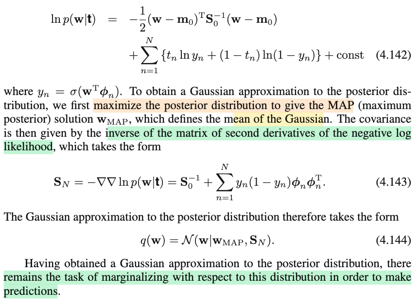

# 4.5 Bayesian Logistic Regression

📊 **Progress:** `3` Notes | `4` Screenshots | `3` AI Reviews

---

 

## Bayesian Logistic Regression

<kbd></kbd>

> [!NOTE]
> Đoạn này hiểu thế nào?
>
>
>
> Tác gỉa nói đại ý là khi tiếp cận logistic regression theo Bayesian, thì nếu làm chính xác sẽ không thể được (intractable), vì để tính posterior sẽ cần phải chuẩn hóa tích của prior distribution và likelihood function mà bản thân nó vốn chứa tích các hàm sigmoid.
>
>
>
> Tương tự, việc tính predictive distribution cũng không tính được luôn. Do đó ta sẽ ứng dụng phép xấp xỉ Laplace.
>
>
>
> Là sao nhỉ?
>
>
>
> ---
>
>
>
> Đầu tiên, Bayesian logistic regression là sao?
>
>
>
> Mình đã biết logistic regression model cho bài toán phân loại: P(T=1|Φ) = σ(𝐰ᵀΦ)
>
>
>
> Thì với Bayesian, ta sẽ coi 𝐰 như random variable. Sau đó chọn prior distribution f(𝐰), và dùng Bayes rule, tính ra posteriori f(𝐰|data) ∝ f(data|𝐰)f(𝐰) (data = (𝐱i, ti), i=1,2...N
>
>
>
> Từ đó, thay vì lắp một ước lượng điểm của 𝐰 vào P(T=1|Φ) = σ(𝐰ᵀΦ) (ví dụ 𝐰\_mle), ta tích phân theo phân phối này:
>
>
>
> P(T=1|Φ) = ∫σ(𝐰ᵀΦ) f(𝐰|data)d𝐰, đây là predictive distribution, trong đó tao không còn care 𝐰 nữa, vì đã lấy trung bình theo mọi giá trị 𝐰 dựa trên posterior của 𝐰.
>
>
>
> Giống như trong linear regression: f(t|𝐱) = ∫f(t|𝐰,β,𝐱)f(𝐰|𝐗,𝐭,α,β)d𝐰 (𝐗,𝐭 chính là data).
>
>
>
> Cụ thể, trong đó ta giả định prior f(𝐰) là 𝒩(0,(1/α)𝐈), từ đó có posterior:
>
>
>
> f(𝐰|data) ∝ f(data|𝐰)f(𝐰)
>
>
>
> = f(𝐭|𝐰,β𝐗)f(𝐰) = \[Πi f(ti|𝐰,β,𝐱i)\] f(𝐰) = \[Πi 𝒩(ti|𝐰ᵀΦ(𝐱i),1/β)\] f(𝐰)
>
>
>
> = \[Πi 𝒩(ti|𝐰ᵀΦ(𝐱i),1/β)\] 𝒩(𝐰|0,1/α)
>
>
>
> và vì normal prior là conjugate prior của likelihood (cũng là normal), nên posterior hóa ra cũng là normal.
>
>
>
> Ti|𝐱i \~ 𝒩(y(𝐰,𝐱i), 1/β)
>
>
>
> Và vì viết nó là normal nên ta chỉ cần biết (thông qua khớp mẫu) để xác định được tâm và covariance của posterior, đồng nghĩa là biết được hoàn toàn phân phối posterior của 𝐰
>
>
>
> Đây chính là cái là logistic không có, vì sao, vì nếu dùng giả định gì cho prior, thì vì likelihood của logistic đều là tích các hàm có dính đến hàm sigmoid:
>
>
>
> T|Φ \~ Bern(σ(𝐰ᵀΦ)) ⇒ P(T=t|𝐰) = \[σ(𝐰ᵀΦ)\]ᵗ × \[1-σ(𝐰ᵀΦ)\]¹⁻ᵗ
>
>
>
> f(𝐭|𝐰) = P(T1=t1,T2=t2,...|𝐰,Φ1,Φ2...) = Πi P(Ti=ti|Φi)
>
>
>
> = Πi σ(𝐰ᵀΦi)^ti × \[1-σ(𝐰ᵀΦi)\]^(1-ti)
>
>
>
> ...nên không thể cho ra kết quả posterior là phân phối gì đã biết (để từ đó suy luận ra được phân phối posterior hoàn chỉnh.
>
>
>
> Lưu ý, khi dùng Bayes để tính f(𝐰|data) = f(data|𝐰)f(𝐰)/f(data) thì ta hoàn toàn ko biết f(data), thành ra nếu như có thể khớp mẫu để xác định được f(data|𝐰)f(𝐰) là kernel của một phân phối đã biết nào đó, ta mới có thể mặc kệ f(data), coi nó như một phần của normalizing constant.
>
>
>
> ∫f(𝐰|data)d𝐰 = 1 ⇔ ∫f(data|𝐰)f(𝐰)/f(data) d𝐰 = 1
>
>
>
> ⇔ \[∫f(data|𝐰)f(𝐰)d𝐰\]/f(data) = 1
>
>
>
> ⇔ \[∫f(data|𝐰)f(𝐰)d𝐰\] = f(data)
>
>
>
> Còn ngược lại, để có hàm posterior, ta phải tính được hằng số chuẩn hóa, tức là, tính ∫f(data|𝐰)f(𝐰)d𝐰, nếu tính được, thì f(data|𝐰)f(𝐰)/Z sẽ valid pdf, và ta có hoàn chỉnh posterior của 𝐰. Ngặt nỗi, cái tích phân này cũng không tính được luôn (lại là do dính cái hàm sigmoid)
>
>
>
> Vậy, ta hiểu vì sao việc tính ra posterior của 𝐰 là intractable.
>
>
>
> Tiếp, nếu ko thể có posterior, thì làm sao có predictive distribution P(T=1|Φ) = ∫σ(𝐰ᵀΦ) f(𝐰|data)d𝐰. Mà giả sử có, thì tính cái tích phân này lại cũng không thể tính nổi, do nó lại dính hàm sigmoid σ(𝐰ᵀΦ)

📹 [Xem video trên YouTube](https://www.youtube.com/watch?v=qsnFuqhhQhI)

> [!TIP]
> 🤖 **AI Check** — 🟢 Pass — ✅ **95/100** · ✓ Move on
>
> Ghi chú giải thích rất xuất sắc và chính xác bản chất tại sao suy diễn Bayes cho hồi quy logistic lại không khả thi (intractable), so sánh đối chiếu chuẩn xác với hồi quy tuyến tính.
>
> **✓ Strengths**
> - Giải thích rất rõ ràng nguồn gốc tính intractable của posterior: không có phân phối tiên nghiệm liên hợp (conjugate prior) tương ứng với tích các hàm sigmoid, dẫn đến tích phân tính hằng số chuẩn hóa (normalizing constant / evidence) không thể giải dưới dạng đóng (closed-form).
> - Phân biệt chính xác giữa ước lượng điểm (như MLE/MAP) và suy diễn Bayes thuần túy thông qua tích phân tính phân phối dự đoán (predictive distribution).
> - So sánh đối chiếu rất trực quan với mô hình hồi quy tuyến tính Gauss-Gauss để làm nổi bật sự khác biệt về tính khả thi trong tính toán.
>
> **💡 Deeper notes**
> - Để giải quyết tích phân bất khả thi ở phân phối dự đoán sau khi đã xấp xỉ posterior bằng Laplace (dạng Gauss), người ta thường xấp xỉ hàm sigmoid bằng hàm probit scaling, biến tích phân chập giữa Gauss và sigmoid thành dạng xấp xỉ đóng.

**🔗 See also:** [3.3.2 Predictive distribution](./332_predictive_distribution.md#node-wdjepxb) · [Cross-Entropy Error Function Gradient](./432_logistic_regression.md#node-gvw6cdv)

 

### 4.5.1 Laplace Approximation

<kbd></kbd>

<kbd></kbd>

> [!NOTE]
> Nhớ lại chút xíu cách làm Laplace approx:
>
>
>
> Có hàm f(𝐳), chuẩn hóa để có p(𝐳) = f(𝐳)/Z. Ta muốn tìm một Gaussian xấp xỉ p(z):
>
>
>
> g(𝐳) = ln f(𝐳)
>
>
>
> g(𝐳) ≈ g(𝐳0) + ∇g(𝐳0)ᵀ(𝐳 - 𝐳0) + (1/2)(𝐳-𝐳0)ᵀ∇²g(𝐳0)(𝐳-𝐳0)
>
>
>
> ∇g(𝐳0)ᵀ(𝐳 - 𝐳0), vì đang xét 𝐳0 là đỉnh của f(𝐳), cũng là của g(𝐳) nên ∇g(𝐳0) = 𝟎
>
>
>
> ln f(𝐳) ≈ ln f(𝐳0) + (1/2) (𝐳-𝐳0)ᵀ\[∇²ln f(𝐳0)\](𝐳-𝐳0)
>
>
>
> ⇔ ln f(𝐳) ≈ ln f(𝐳0) - (1/2) (𝐳-𝐳0)ᵀ\[-∇²ln f(𝐳0)\](𝐳-𝐳0)
>
>
>
> ⇔ ln f(𝐳) ≈ ln f(𝐳0) + ln exp\[(-1/2) (𝐳-𝐳0)ᵀ\[-∇²ln f(𝐳0)\](𝐳-𝐳0)\]
>
>
>
> ⇔ ln f(𝐳) ≈ ln {f(𝐳0) exp\[(-1/2) (𝐳-𝐳0)ᵀ\[-∇²ln f(𝐳0)\](𝐳-𝐳0)\]}
>
>
>
> ⇔ f(𝐳) ≈ f(𝐳0) exp\[(-1/2) (𝐳-𝐳0)ᵀ\[-∇²ln f(𝐳0)\](𝐳-𝐳0)\]
>
>
>
> Đặt 𝐀 = -∇²ln f(𝐳0), ta có Gaussian xấp xỉ p(𝐳) là 𝒩(𝐳0, 𝐀⁻¹), 𝐀 phải xác định dương 
>
>
>
> ---
>
>
>
> Rồi, quay lại đây, ta giả định prior của 𝐰 là 𝒩(𝐦0, 𝐒0)
>
>
>
> Theo Bayes, posteriori của 𝐰: f(𝐰|data) ∝ f(data|𝐰)f(𝐰) với data ở đây là 𝐭 = t1,t2,.... (vì cũng như trong linear regression, ta mô hình phân phối của T|𝐱 (thay vì joint distribution T, 𝐗)
>
>
>
> Nên ta có f(𝐰|𝐭) = f(𝐭|𝐰)f(𝐰)/f(𝐭)
>
>
>
> ⇔ ln f(𝐰|𝐭) = ln f(𝐭|𝐰) + ln f(𝐰) - ln f(𝐭)
>
>
>
> ⇔ ln f(𝐰|𝐭) = ln Πi f(ti|𝐰) + ln 𝒩(𝐰|𝐦0, 𝐒0) + const
>
>
>
> ⇔ ln f(𝐰|𝐭) = Σi ln f(ti|𝐰) + ln 𝒩(𝐰|𝐦0, 𝐒0) + const
>
>
>
> ⇔ ln f(𝐰|𝐭) = Σi ln P(Ti=ti|𝐰) + ln 𝒩(𝐰|𝐦0, 𝐒0) + const
>
>
>
> ⇔ ln f(𝐰|𝐭) = Σi ln \[(yi^ti)((1-yi)^(1-ti)\] + ln 𝒩(𝐰|𝐦0, 𝐒0) + const
>
>
>
> ⇔ ln f(𝐰|𝐭) = Σi \[ln (yi^ti) + ln((1-yi)^(1-ti)\] + ln 𝒩(𝐰|𝐦0, 𝐒0) + const
>
>
>
> ⇔ ln f(𝐰|𝐭) = Σi \[ti ln (yi) + (1-ti) ln(1-yi)\] + ln 𝒩(𝐰|𝐦0, 𝐒0) + const
>
>
>
> ⇔ ln f(𝐰|𝐭) = Σi \[ti ln (yi) + (1-ti) ln(1-yi)\] + ln {const exp\[-(1/2)(𝐰-𝐦0)ᵀ𝐒0⁻¹(𝐰-𝐦0)\]} + const
>
>
>
> ⇔ ln f(𝐰|𝐭) = Σi \[ti ln (yi) + (1-ti) ln(1-yi)\] + ln const + ln exp\[-(1/2)(𝐰-𝐦0)ᵀ𝐒0⁻¹(𝐰-𝐦0)\] + const
>
>
>
> ⇔ ln f(𝐰|𝐭) = Σi \[ti ln (yi) + (1-ti) ln(1-yi)\] - (1/2)(𝐰-𝐦0)ᵀ𝐒0⁻¹(𝐰-𝐦0) + const
>
>
>
> ⇔ ln f(𝐰|𝐭) = - (1/2)(𝐰-𝐦0)ᵀ𝐒0⁻¹(𝐰-𝐦0) + Σi \[ti ln (yi) + (1-ti) ln(1-yi)\] + const → 4.142

📹 [Xem video trên YouTube](https://www.youtube.com/watch?v=BOlKZldjLic)

> [!TIP]
> 🤖 **AI Check** — 🟢 Pass — ✅ **100/100** · ✓ Move on
>
> Ghi chú xuất sắc! Bạn đã tự ôn lại và chứng minh rất chi tiết, chặt chẽ cả công thức xấp xỉ Laplace tổng quát lẫn từng bước suy dẫn ra phương trình (4.142) từ tiên nghiệm Gauss và likelihood Bernoulli.
>
> **✓ Strengths**
> - Tự diễn giải và biến đổi rất rõ ràng chuỗi Taylor bậc 2 của log-posterior quanh cực trị để ra dạng phân phối chuẩn xấp xỉ.
> - Chứng minh chi tiết, mạch lạc từng bước từ hàm likelihood Bernoulli kết hợp với prior Gauss để thu được chính xác công thức (4.142).
>
> **💡 Deeper notes**
> - Để biểu thức hoàn toàn khớp với sách, bạn có thể ghi chú thêm định nghĩa $y_n = \sigma(\mathbf{w}^\mathrm{T}\boldsymbol{\phi}_n)$ và điều kiện ngầm định là likelihood có điều kiện trên tập vector đặc trưng $\mathbf{X}$ (hay $\boldsymbol{\Phi}$).

 

#### Gaussian Approximation to Posterior Distribution

<kbd></kbd>

> [!NOTE]
> Tiếp tục, note trước mình đã hiểu vì sao có 4.142: ln f(𝐰|𝐭) = - (1/2)(𝐰-𝐦0)ᵀ𝐒0⁻¹(𝐰-𝐦0) + Σi \[ti ln (yi) + (1-ti) ln(1-yi)\] + const
>
>
>
> Và cũng còn nhớ mục đích cuả mấy cái này là gì: ta đang muốn dùng Laplace approximate để giúp xấp xỉ posterior distribution của 𝐰 (chính là f(𝐰|𝐭)) bởi một Gaussian (normal) distribution.
>
>
>
> Mà trong note trước khi ôn lại Laplace approx của hàm f(𝐳) (chuẩn hóa thành p(𝐳)): cho thấy ta cần làm 2 việc: Tâm của Gaussian chính là ứng với 𝐰MAP (𝐰 mà tại đó f(𝐰|𝐭) đạt max), còn matrix precision thì chính là - Hessian của ln f(𝐳) evaluate tại 𝐳0.
>
>
>
> Vậy ở đây ta đã có f(𝐰|𝐭) (và ln f(𝐰|𝐭)), nên hai việc cần làm:
>
>
>
> i) Tìm 𝐰 để maximize f(𝐰|𝐭) (cũng tương đương maximize ln f(𝐰|𝐭)), cho ra 𝐰MAP, là tâm của normal
>
>
>
> ii) tính precision matrix 𝐀 = \[-∇² ln f(𝐰|𝐭)\]|𝐰=𝐰MAP, khi đó normal xấp xỉ Laplace posterior sẽ là: 𝒩(𝐰MAP, 𝐀⁻¹)
>
>
>
> ---
>
>
>
> Thử tìm 𝐀: = \[-∇²ln f(𝐰|𝐭)\]|𝐰=𝐰MAP
>
>
>
> Với ln f(𝐰|𝐭) = 4.142
>
>
>
> ∇ln f(𝐰|𝐭) = ∇ {- (1/2)(𝐰-𝐦0)ᵀ𝐒0⁻¹(𝐰-𝐦0) + Σi \[ti ln (yi) + (1-ti) ln(1-yi)\] + const}}
>
>
>
> = ∇\[-(1/2)(𝐰-𝐦0)ᵀ𝐒0⁻¹(𝐰-𝐦0)\] + ∇{Σi \[ti ln (yi) + (1-ti) ln(1-yi)\]}
>
>
>
> ---
>
>
>
> Dùng kết quả bữa trước đã tính gradient của cross entripy loss:
>
>
>
> ∇E(𝐰) = Σi=1:N (yi - ti)Φi
>
>
>
> Nên ∇{Σi \[ti ln (yi) + (1-ti) ln(1-yi)\] = -Σi=1:N (yi - ti)Φi
>
>
>
> ---
>
>
>
> ∇ln f(𝐰|𝐭) = ∇\[-(1/2)(𝐰-𝐦0)ᵀ𝐒0⁻¹(𝐰-𝐦0)\] - \[Σi=1:N (yi - ti)Φi\]
>
>
>
> ⇒ ∇²ln f(𝐰|𝐭) = ∇²\[-(1/2)(𝐰-𝐦0)ᵀ𝐒0⁻¹(𝐰-𝐦0)\] - ∇\[Σi=1:N (yi - ti)Φi\]}
>
>
>
> = ∇²\[-(1/2)(𝐰ᵀ𝐒0⁻¹-𝐦0ᵀ𝐒0⁻¹)(𝐰-𝐦0)\] - Σi=1:N ∇\[(yi - ti)Φi\]
>
>
>
> = ∇∇\[-(1/2)(𝐰ᵀ𝐒0⁻¹𝐰-𝐦0ᵀ𝐒0⁻¹𝐰-𝐰ᵀ𝐒0⁻¹𝐦0+𝐦0ᵀ𝐒0⁻¹𝐦0)\] - Σi=1:N \[∇(yiΦi - tiΦi)\]
>
>
>
> (Vì 𝐦0ᵀ𝐒0⁻¹𝐰 là scalar, chuyển vị của nó bằng chính nó: 𝐦0ᵀ𝐒0⁻¹𝐰 = (𝐦0ᵀ𝐒0⁻¹𝐰)ᵀ = 𝐰ᵀ(𝐦0ᵀ𝐒0⁻¹)ᵀ = 𝐰ᵀ(𝐒0⁻¹)ᵀ𝐦0 = 𝐰ᵀ𝐒0⁻¹𝐦0)
>
>
>
> = ∇∇\[(1/2)𝐰ᵀ(-𝐒0⁻¹)𝐰 + 𝐦0ᵀ𝐒0⁻¹𝐰 -(1/2)𝐦0ᵀ𝐒0⁻¹𝐦0\] - Σi=1:N \[∇(yiΦi) - ∇(tiΦi)\]
>
>
>
>  ∇∇\[(1/2)𝐰ᵀ(-𝐒0⁻¹)𝐰 + 𝐦0ᵀ𝐒0⁻¹𝐰 -(1/2)𝐦0ᵀ𝐒0⁻¹𝐦0\] = -𝐒0⁻¹
>
>
>
> (do hàm số có dạng hàm bậc hai tiêu chuẩn f(𝐱) = (1/2)𝐱ᵀ𝐏𝐱 + 𝐪ᵀ𝐱 + r, Hessian sẽ là (1/2)(𝐏 + 𝐏ᵀ), mà nếu 𝐏 đối xứng thì sẽ là 𝐏)
>
>
>
> ---
>
> ---
>
>
>
> Có thể nói sơ cách làm như sau
>
>
>
> df = f(𝐱+d𝐱) - f(𝐱) = (1/2)(𝐱+d𝐱)ᵀ𝐏(𝐱+d𝐱) + 𝐪ᵀ(𝐱+d𝐱) + r - (1/2)𝐱ᵀ𝐏𝐱 - 𝐪ᵀ𝐱 - r
>
>
>
> = (1/2)(𝐱+d𝐱)ᵀ𝐏(𝐱+d𝐱) + 𝐪ᵀ(𝐱+d𝐱) - (1/2)𝐱ᵀ𝐏𝐱 - 𝐪ᵀ𝐱 
>
>
>
> = (1/2)(𝐱ᵀ𝐏𝐱+d𝐱ᵀ𝐏𝐱+𝐱ᵀ𝐏d𝐱+d𝐱ᵀ𝐏d𝐱) + 𝐪ᵀ𝐱 + 𝐪ᵀd𝐱 - (1/2)𝐱ᵀ𝐏𝐱 - 𝐪ᵀ𝐱 
>
>
>
> = (1/2)(𝐱ᵀ𝐏𝐱+2𝐱ᵀ𝐏d𝐱+d𝐱ᵀ𝐏d𝐱) + 𝐪ᵀ𝐱 + 𝐪ᵀd𝐱 - (1/2)𝐱ᵀ𝐏𝐱 - 𝐪ᵀ𝐱 
>
>
>
> = (1/2)(𝐱ᵀ𝐏𝐱) + 𝐱ᵀ𝐏d𝐱 + (1/2)d𝐱ᵀ𝐏d𝐱 + 𝐪ᵀ𝐱 + 𝐪ᵀd𝐱 - (1/2)𝐱ᵀ𝐏𝐱 - 𝐪ᵀ𝐱 
>
>
>
> Cancel out các term và bỏ luôn term bậc cao của d𝐱
>
>
>
> = 𝐱ᵀ𝐏d𝐱 + 𝐪ᵀd𝐱 
>
>
>
> = (𝐏ᵀ𝐱 + 𝐪)ᵀd𝐱 ⇒ ∇f = 𝐏ᵀ𝐱 + 𝐪 = 𝐏𝐱 + 𝐪 = ∇f(𝐱)
>
>
>
> ---
>
>
>
> d∇f = ∇f(𝐱+d𝐱) - ∇f(𝐱) = 𝐏(𝐱+d𝐱) + 𝐪 - 𝐏𝐱 - 𝐪 = 𝐏 d𝐱
>
>
>
> ⇒ ∇²f(𝐱) = 𝐏
>
>
>
> ---
>
> ---
>
>
>
> Quay lại đây 
>
>
>
> Còn Σi=1:N \[∇(yiΦi) - ∇(tiΦi)
>
>
>
> = Σi=1:N \[∇(yiΦi)\]
>
>
>
> = Σi=1:N \[∇(σ(𝐰ᵀΦi)Φi)\]
>
>
>
> ---
>
>
>
> Xét cục ∇(σ(𝐰ᵀΦi)Φi):
>
>
>
> Đầu tiên nên xét hàm f(𝐱) = g(𝐱) 𝐮 với g(𝐱) là scalar
>
>
>
> Jacobian sẽ là matrix mà hàng 1 là gradient của hàm f1(𝐱) = g(𝐱) × u1 đối với 𝐱: 
>
>
>
> \[∂/∂x1 (u1g(𝐱)), ∂/∂x2 (u1g(𝐱)),...\] 
>
>
>
> = \[u1 ∂/∂x1 g(𝐱), u1 ∂/∂x2 g(𝐱),...\] = u1 ∇g(𝐱)ᵀ.
>
>
>
> Tương tự, hàng 2 của sẽ là u2 ∇g(𝐱)ᵀ,...
>
>
>
> Nên Jacobian J chính là 𝐮 ∇g(𝐱)ᵀ
>
>
>
> (Có thể giải thích: Tích ngoài 𝐮 và 𝐯 là matrix mà các hàng là u1 𝐯ᵀ, u2 𝐯ᵀ,....)
>
>
>
> Áp dụng vào đây: ∇(σ(𝐰ᵀΦi)Φi)
>
>
>
> = d/d𝐰 σ(𝐰ᵀΦi)Φi chính là có dạng f(𝐰) = g(𝐰) Φi
>
>
>
> Nên ta có = Φi ∇g(𝐰)ᵀ
>
>
>
> ---
>
>
>
> Lại xét ∇g(𝐰)
>
>
>
> hay ghi vầy cũng được d/d𝐰 g(𝐰) = d/d𝐰 g(𝐚i(𝐰)) với g(𝐚i) = σ(𝐚i), và 𝐚i(𝐰) = 𝐰ᵀΦi
>
>
>
> Dùng chain rule: d/d𝐰 g(𝐚i(𝐰)) = d/d𝐚i g(𝐚i) . d/d𝐰 𝐚i(𝐰)
>
>
>
> = σ'(𝐚i) Φi
>
>
>
> = σ(𝐚i)(1-σ(𝐚i)) Φi
>
>
>
> Vậy là xong: ∇(σ(𝐰ᵀΦi)Φi) chính là Φi ∇g(𝐰)ᵀ = Φi \[σ(𝐚i)(1-σ(𝐚i)) Φi\]ᵀ
>
>
>
> = Φi \[σ(𝐚i)(1-σ(𝐚i))\]ᵀ Φiᵀ
>
>
>
> = \[σ(𝐚i)(1-σ(𝐚i))\] Φi Φiᵀ
>
>
>
> = yi(1-yi) ΦiΦiᵀ
>
>
>
> Vậy ∇²ln f(𝐰|𝐭) = -𝐒0⁻¹ - Σi yi(1-yi) ΦiΦiᵀ
>
>
>
> ⇒ -∇²ln f(𝐰|𝐭) = 𝐒0⁻¹ + Σi yi(1-yi) ΦiΦiᵀ
>
>
>
> evaluate tại 𝐰MAP ta có precision matrix 𝐀
>
>
>
> Và 𝐒N sẽ là inverse của 𝐀
>
>
>
> Nên hình như trong sách đang ghi sai, thiếu inverse, ở trên đó gs cũng nói rõ là "inverse of the matrix of second derivative của negative log likelihood":
>
>
>
> Nên phải ghi rõ vầy mới đúng:
>
>
>
> 𝐒N = \[𝐒0⁻¹ + Σi yi(1-yi) ΦiΦiᵀ\]⁻¹ |𝐰=𝐰MAP

📹 Video 1: [Gaussian Approximation to Posterior Distribution — Pattern Recognition Machine Learning_C.Bishop](https://www.youtube.com/watch?v=g7UVXPc31tw)

📹 Video 2: [Derive công thức Sn, covariance của Gaussian xấp xỉ Laplace cho phân phối posterior của w (p2)](https://www.youtube.com/watch?v=BulxSUVG87E)

> [!TIP]
> 🤖 **AI Check** — 🟢 Pass — ✅ **100/100** · ✓ Move on
>
> Ghi chú xuất sắc! Bạn đã tự dẫn xuất chi tiết và chính xác ma trận Hessian cho mô hình Laplace approximation, đồng thời phát hiện chuẩn xác lỗi in (erratum) nổi tiếng trong công thức (4.143) của sách Bishop.
>
> **✓ Strengths**
> - Dẫn xuất ma trận đạo hàm bậc hai (Hessian) cho cả thành phần prior Gaussian và log-likelihood logistic rất chi tiết, mạch lạc và chính xác.
> - Sử dụng vi phân ma trận và đạo hàm vector-matrix (Jacobian/outer product) một cách trực quan và đúng bản chất.
> - Tư duy phản biện xuất sắc khi phát hiện vế trái của công thức (4.143) trong sách bị in thiếu nghịch đảo (lỗi in chính thức của PRML là vế trái phải là S_N^{-1}).
>
> **💡 Deeper notes**
> - Đoạn văn trong sách viết 'inverse of the matrix of second derivatives of the negative log likelihood' thực chất là một cách viết thiếu chặt chẽ của tác giả (ở đây phải là negative log posterior vì có cả số hạng prior S_0^{-1}).
> - Ma trận S_N^{-1} được đảm bảo là xác định dương (positive definite) nếu prior precision S_0^{-1} xác định dương, do thành phần tổng sigma là tổng các ma trận rank-1 nửa xác định dương với trọng số y_n(1-y_n) > 0.

**🔗 See also:** [Gradient of Logistic Error Function](./432_logistic_regression.md#node-to86xxj) · [Derivative of Logistic Sigmoid Function](./432_logistic_regression.md#node-5dukhnc)

 

