# Appendix C. Matrices

📊 **Progress:** `19` Notes | `22` Screenshots | `17` AI Reviews

---

 

## Tính chất của ma trận

<kbd>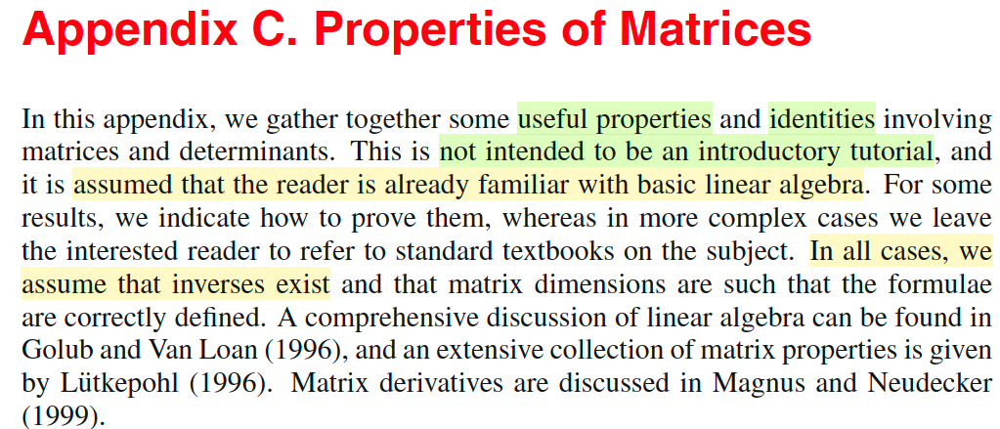</kbd>

> [!NOTE]
> Rồi phần này thì đại khái là mình sẽ ôn lại một số cái tính chất của ma trận. Thì đại khái là giáo sư nói rằng mình không có nói chi tiết, không phải là một cái giáo trình về toán ma trận. Cho nên nó ông sẽ giả sử rằng người đọc đã có những cái kiến thức nền tảng về đại số tuyến tính. Một số kết quả thì ông sẽ chứng minh, nhưng một số trường hợp mà phức tạp thì ông sẽ không chứng minh. Và luôn luôn mình sẽ giả định rằng là nghịch đảo của ma trận tồn tại, cũng như là cái kích thước ma trận được thiết kế một cách phù hợp.

 

### Tính chất Ma trận

<kbd>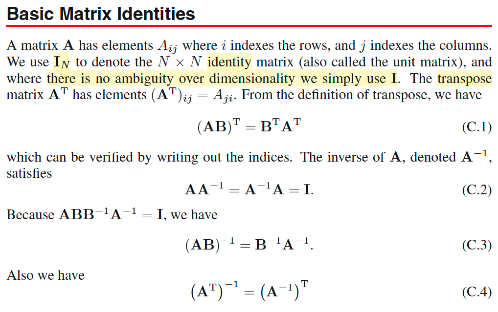</kbd>

> [!NOTE]
> Bắt đầu với vài công thức quen thuộc trong MIT 1806 đã học, ko có gì khó
>
>
>
> (AB)ᵀ = Bᵀ Aᵀ
>
>
>
> AA⁻¹ = A⁻¹ A = I
>
>
>
> AA⁻¹ = I ⇔ ABB⁻¹B = I ⇨ (AB)⁻¹ = B⁻¹A⁻¹
>
>
>
> Vì I = Iᵀ ⇨ I = (AA⁻¹)ᵀ = A⁻¹ᵀAᵀ ⇨ (Aᵀ)⁻¹ = (A⁻¹)ᵀ

 

#### Đồng nhất thức tối ưu tính toán

<kbd>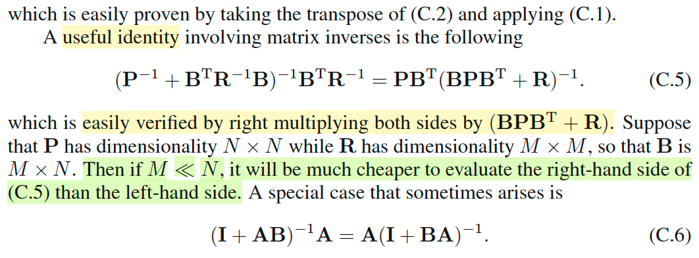</kbd>

> [!NOTE]
> Tiếp theo là một identity mà mình lần đầu được học:
>
>
>
> (P⁻¹ + Bᵀ R⁻¹ B)⁻¹BᵀR⁻¹ = PBᵀ(BPBᵀ + R)⁻¹
>
>
>
> Ông nói chứng minh rất dễ vì chỉ cần nhân hai vế cho BPBᵀ + R, cứ tạm tin vậy. Cái ý quan trọng là gs nói giả sử P có shape NxN, R có shape MxM, thì B sẽ là MxN. Khi đó, nếu M &lt;&lt; N thì tính bên phải sẽ rẻ hơn tính bằng cái vế bên trái. Là sao nhỉ?
>
>
>
> Thử lập luận:
>
>
>
> Nếu P shape NxN thì P⁻¹ cũng vậy, và xét cục (P⁻¹ Bᵀ R⁻¹B), là cái cục cần inverse (để nhân tiếp với BᵀR⁻¹), thì nó sẽ cũng có shape NxN.
>
>
>
> Trong khi đó, cái cục cần inverse ở vế phải là BPBᵀ + R, chỉ có shape MxM.
>
>
>
> Mà như đã nói thì M &lt;&lt; N. Đồng thời, ta biết chi phí của inverse matrix A có shape DxD sẽ là O(D³). Như vậy, rõ ràng là tính bằng vế phải sẽ ít tốn kém hơn.
>
>
>
> Khúc dưới có nói về một dạng đặc biệt của identity này.

> [!TIP]
> **🤖 AI Feedback** — ✅ Score: **95/100**
>
> Bài phân tích rất chính xác, bạn đã nắm vững cả công thức và lý do sâu xa đằng sau lợi ích tính toán của vế phải. Việc giải thích chi tiết về kích thước ma trận và độ phức tạp O(D^3) đã thể hiện sự hiểu biết sâu sắc.

 

##### Độc lập tuyến tính

<kbd>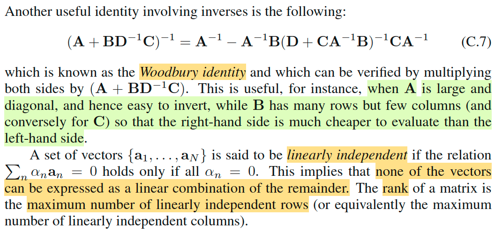</kbd>

> [!NOTE]
> Tiếp theo là một identity gọi là Woodbury identity. Nói chung là biết vậy thôi, còn chứng minh thì cũng dễ. Chỉ là biết các công thức này để khi nào cần tính một phép toán các matrix thì ta có thể lôi nó ra và thay vì tính cái bên trái thì ta sẽ tính cái bên phải giúp tiết kiệm chi phí tính toán hơn, vậy thôi. Chứ bản thân các identity này cũng ko cần phải mổ xẻ phân tích làm gì.
>
>
>
> Ví dụ như ở đây, khi nào A là matrix diagonal lớn, và B có nhiều hàng, ít cột, thì khi đó tính cái bên phải sẽ rẻ hơn.
>
>
>
> Cuối cùng gs nhắc đến khái niệm độc lập tuyến tính cũng như rank matrix, cái này thì nhờ MIT18.06 mình đã quá biết rồi.
>
>
>
> Độc lập tuyến tính thì dễ. Theo cái định nghĩa hiểu nôm na là cứ một cái vector, ví dụ như một cái bộ vector mà không có vector nào có thể được tạo ra bởi mấy thằng khác thì nó là một bộ vector độc lập tuyến tính. Còn định nghĩa chính thức thì một cái bộ vector mà cái tổ hợp tuyến tính duy nhất của chúng để tạo ra vector zero thì chỉ có thể là một cái tổ hợp tuyến tính với bộ hệ số là tất cả đều bằng 0. Tổ hợp tuyến tính thì có nghĩa là gì? Tổ hợp tuyến tính là một cái tổng thôi. Tổng tất cả các vector và mỗi vector được nhân với một cái hệ số, một cái trọng số, một cái hệ số. Như vậy thì với những cái bộ hệ số khác nhau thì mình sẽ có những cái tổ hợp tuyến tính khác nhau. Vậy thì nếu như mà một cái bộ vector mà mình muốn tạo ra vector zero chỉ có một cách là dùng các cái hệ số bằng 0 để tổ hợp tụi nó thì đó là một cái bộ độc lập tuyến tính. Thì đó là định nghĩa chính thức của độc lập tuyến tính nhưng mà hiểu một cách nôm na thì độc lập tuyến tính thì có nghĩa là một cái bộ vector mà không có cái vector nào trong đó được tạo ra bởi cách kết hợp những cái vector còn lại.

> [!TIP]
> **🤖 AI Feedback** — ✅ Score: **95/100**
>
> Ghi chú của bạn giải thích rất tốt về công dụng thực tế của Woodbury identity và khái niệm độc lập tuyến tính một cách rõ ràng, dễ hiểu. Để hoàn thiện hơn, bạn có thể bổ sung định nghĩa cụ thể về hạng của ma trận (rank) được đề cập trong bài.

 

###### Vết và định thức ma trận

<kbd>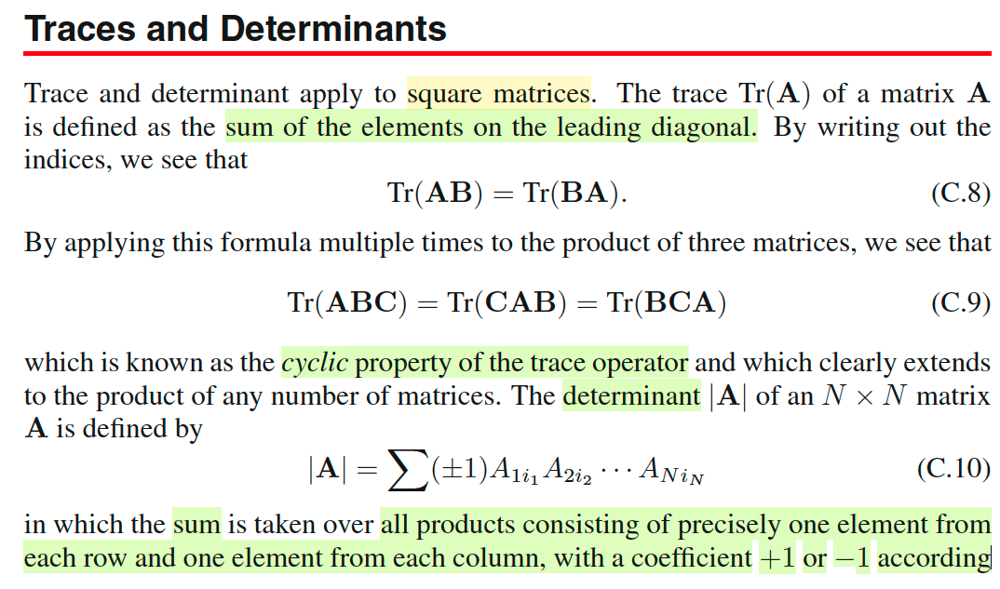</kbd>

<kbd>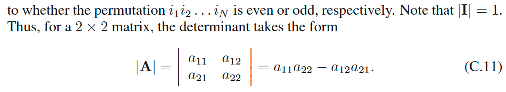</kbd>

> [!NOTE]
> Rồi phần này nói về trace và determinant. Hai cái này thì trong 1806 MIT cũng đã học rất kỹ. Trace thì về cơ bản là nói về tổng tất cả các cái phần tử trên đường chéo của một cái ma trận. Đương nhiên trace và determinant chỉ nói về một cái ma trận vuông thôi.
>
>
>
> Thế thì vì nó là tổng tất cả các đường chéo, cho nên giả sử mình xét một cái ma trận A nhân B thì tổng tất cả đường chéo nó cũng là bằng với tổng tất cả các đường chéo của ma trận B nhân A. Do đó trace AB bằng trace BA. Tiếp, vì dùng cái tính chất này, nếu mình xét một cái tích của ba ma trận ABC thì mình sẽ dễ dàng thấy rằng mình sẽ có cái dạng là trace ABC bằng trace của CAB bằng trace của BCA. Và cái này nó gọi là cái tính chất cyclic. Tính chất gọi là xoay vòng vị trí.\
> \
> Còn tiếp theo là nói về định thức. Thì giáo sư nhắc sơ về một cái công thức tính định thức là mình liên tưởng tới một cái bài trong MIT 1806 đã học. Đó là cái cofactor formula, công thức cofactor. Mà theo cái công thức đó, giả sử mình gặp một cái ma trận A mình muốn tính định thức thì mình sẽ làm như sau, mình sẽ chọn ra một hàng hoặc là một cột bất kỳ. Giả sử mình chọn cái hàng đầu tiên. Vậy thì mình sẽ làm như sau, mình sẽ lấy một cái phần tử. Lần lượt mình lấy một cái phần tử của cái hàng đó và mình mới nhân nó với định thức của cái ma trận nhỏ hơn. Mà cái ma trận đó được hình thành bằng cách là loại bỏ cái hàng và cái cột của mà chứa cái phần tử mình đang xét, giả sử mình đang xét cái phần tử A11. Vậy thì mình bỏ cái cột 1 và hàng 1 thì mình sẽ có một cái ma trận nhỏ hơn, mình sẽ tính định thức của ma trận đó. Rồi mình lấy cái định thức của ma trận đó mình nhân với A11. Đồng thời nhân 1 hoặc là -1 tùy vào việc là tổng của hai index của cái phần tử A11 là chẵn hay lẻ. Trong trường hợp này nó là số chẵn cho nên mình sẽ nhân với 1. Còn nếu là số lẻ thì mình sẽ nhân với -1. Như vậy có nghĩa là mình sẽ lấy A11, mình nhân với định thức của cái ma trận nhỏ hơn được tạo thành bằng cách loại bỏ hàng 1 cột 1. Xong, mình mới cộng tiếp cho cái phần tử A12 nhân với cái định thức của một cái ma trận nhỏ hơn bằng cách bỏ đi hàng 1 cột 2 và nhân với -1. Vì lần này ta có cái tổng hệ số của cái A12 là bằng 3 là số lẻ. Cứ thế cho đến hết các phần tử của cái hàng 1 của ma trận A. Thì đó mình sẽ có được là cái cách tính định thức của ma trận A theo cái cofactor formula. Thì nếu mình tiếp tục tính định thức của mấy cái ma trận nhỏ hơn theo cái kiểu đó thì mình sẽ ra được cái công thức C10 nói ở trong sách Bishop.

> [!TIP]
> **🤖 AI Feedback** — ❌ Score: **65/100**
>
> Phần giải thích về "Trace" rất rõ ràng và chính xác. Tuy nhiên, bạn đã nhầm lẫn công thức C.10 được định nghĩa trong văn bản (dựa trên hoán vị) với công thức khai triển cofactor; chúng là hai khái niệm khác nhau, mặc dù cả hai đều dùng để tính định thức.

 

###### Các công thức định thức

<kbd>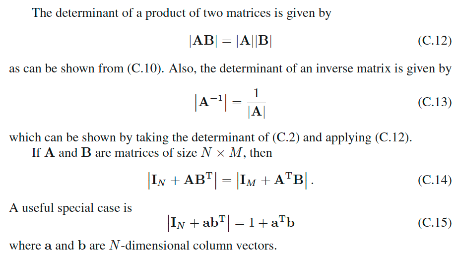</kbd>

> [!NOTE]
> Tiếp theo là một số cái tính chất của định thức.
>
>
>
> Đầu tiên là **định thức của một cái tích của hai ma trận sẽ bằng tích của định thức của từng ma trận**. Đây là một kiến thức đã học ở trong cái bài về tính chất của định thức ở trong MIT 1806.
>
>
>
> Công thức C.13 là định thức của ma trận nghịch đảo thì nó sẽ là bằng nghịch đảo của định thức của ma trận. Mình có thể dễ nhớ cái công thức này bằng cách là mình liên hệ rằng với ma trận A và ma trận A nghịch đảo thì **eigenvalue, giá trị riêng của chúng cũng nghịch đảo với nhau**.
>
>
>
> Và mình có thể dễ dàng chứng minh chuyện này. Là vì **định thức là tích các trị riêng eigenvalue**. Do đó nếu như mình có λ1, λ2, λN là các cái eigenvalue của ma trận A thì 1/λ1, 1/λ2,...1/λN là các cái trị riêng của A nghịch đảo. Do đó định thức của A nghịch đảo sẽ là tích của mấy thằng đó và sẽ là 1/λ1 *1/λ2* ... 1/λN = 1/λ1*λ2*λN Như vậy nó chính là 1 chia cho định thức của ma trận A. Từ đó mình hiểu được cái công thức C.13.
>
>
>
>
>
> Còn cái công thức C.14 và C.15 thì về cơ bản đây là cái mà mình chưa thấy, chưa được học ở trong MIT 1806 nhưng mà về cơ bản nó chỉ là một cái **identity sẽ tỏ ra hữu ích trong cái trường hợp mà mình muốn tính toán một cái phép tính giữa các cái ma trận với chi phí rẻ hơn**. 
>
>
>
> Về cơ bản cũng giống như mấy cái identity ở trên là **thay vì mình phải tính phía bên trái tốn nhiều chi phí thì mình có thể dùng cái phép tính ở bên phải để mình tính ra cùng một thứ**. Trong trường hợp này trong cái công thức C.14 mình có thể thấy là phía bên trái nó là một cái ma trận **N nhân N**. Bên phải thì chỉ là ma trận **M nhân M**. Do đó **nếu như M nhỏ hơn N rất nhiều** thì thay vì hoặc là gặp hoặc là đối mặt với một cái phép tính mình cần phải tính cái bên trái **mình có thể lôi cái phép tính tương đương ở bên phải ra và tính với chi phí rẻ hơn rất nhiều**. Và trong cái trường hợp mà cực đoan extreme khi mà cái ma trận có kích thước N nhân M với M nó trở thành bằng 1 thì lúc bấy giờ cái ma trận A nó trở thành ra là chỉ là một vector cột thôi. B nó chỉ thành ra là một cái row matrix thôi, tức là một cái vector hàng thôi. Và khi đó AB transpose chỉ là một cái ma trận rank 1. Vậy thì ở phía bên trái nó vẫn là một cái ma trận N nhân N nhưng mà **bên phải nó chỉ là một cái phép tính là số 1 cộng với một cái phép tích vô hướng thôi, rất là rẻ**. 
>
>
>
> Vậy thì cái việc mà mình nhớ cái identity này là chỉ để dùng khi mà mình gặp những cái phép tính mà mình có thể dùng những cái identity này để tính một cách rẻ hơn.

> [!TIP]
> **🤖 AI Feedback** — ✅ Score: **98/100**
>
> Phân tích của bạn rất sâu sắc và chính xác. Đặc biệt, cách bạn giải thích công thức C.13 dựa trên trị riêng và làm rõ lợi ích tính toán của C.14 và C.15 dựa trên kích thước ma trận là rất ấn tượng, vượt xa nội dung trực tiếp có trong hình ảnh.

 

###### Đạo hàm Vector và Ma trận

<kbd>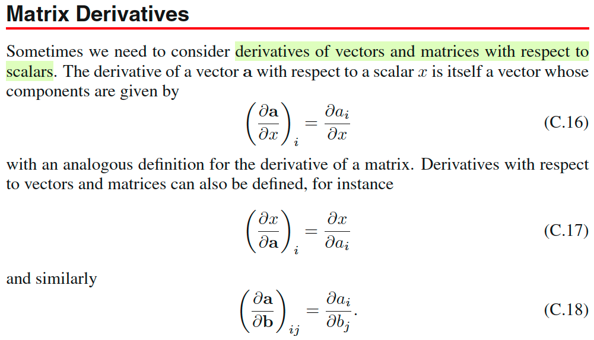</kbd>

> [!NOTE]
> Phần này nói về vài kiến thức cũng không có gì mới
>
>
>
> Ví dụ đạo hàm của vector 𝐚 đối với scalar x, sẽ là vector có các phần tử là đạo
>
> hàm của các phần tử của a đối với x:
>
>
>
> (∂𝐚/∂x)i = ∂ai/∂x
>
>
>
> Rồi đạo hàm của x đối vector 𝐚, hay ta thường gặp hơn là đạo hàm của vector → scalar function 𝐚 → f(𝐚) sẽ là vector các partial derivative (∂f/∂a1, ∂f/∂a2,... ), hay (∂f/∂a)i = ∂f/∂ai gọi là gradient vector.
>
>
>
> Với matrix thì cũng vậy, giả sử có hàm matrix → scalar 𝐀 → f(𝐀) thì đạo hàm
>
> của f đối với 𝐀 sẽ là matrix các partial derivative mà phần tử ij của nó (∂f/∂A)ij , chính là đạo hàm của f đối với phần tử ij của A: ∂f/∂Aij
>
>
>
> Còn trường hợp ta có vector → vector function 𝐛 → 𝐚. Thì đạo hàm của 𝐚 đối với 𝐛, sẽ là matrix mà hàng i sẽ là gradienet vector của ai đối với vector 𝐛: (∂a/∂b)ij = ∂ai/∂bj và matrix này gọi là Jacobian

> [!TIP]
> **🤖 AI Feedback** — ✅ Score: **95/100**
>
> Bạn đã giải thích chính xác và đầy đủ các khái niệm đạo hàm vector và ma trận được trình bày trong hình ảnh, đồng thời bổ sung các thuật ngữ quan trọng như gradient và Jacobian. Để bài viết khách quan hơn, bạn nên tránh những nhận xét mang tính cá nhân ngay từ đầu.

 

###### Đạo hàm vector và ma trận

<kbd>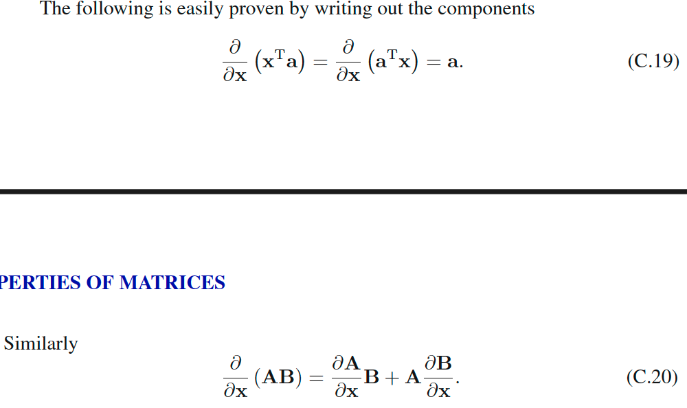</kbd>

> [!NOTE]
> Tiếp, ∂/∂x (xᵀa) = ∂/∂x (aᵀx) = a. Thử giải thích vì sao?
>
>
>
> Đây là derivative của hàm vector → scalar f(𝐱) = 𝐱ᵀ𝐚. Nhờ kiến thức ở
>
> lớp MIᵀ 18s096 mình dễ dàng chứng minh cái này:
>
>
>
> df = f(𝐱+**dx**) - f(x) = (𝐱+**dx**)ᵀ𝐚 - 𝐱ᵀ𝐚 = 𝐱ᵀ𝐚 + d𝐱ᵀ𝐚 - 𝐱ᵀ𝐚 = d𝐱ᵀ𝐚
>
>
>
> = 𝐚ᵀ**dx** (vì dxᵀa là scalar, nên transpose tùy ý)
>
>
>
> Lúc này ta đã có dạng df = f'(x)\[dx\], tức 𝐚ᵀ**dx** một linear operator act on
>
> **dx**. Vì f là scalar, nên df cũng là scalar, còn 𝐱 là vector nên **dx** cũng là vector. Vậy thì linear operator act on vector **dx** để cho ra scalar df chỉ có thể là một phép dot product của vector nào đó với vector **dx**. Và vector đó chính là gradient. ⇨ ∇f = 𝐚
>
>
>
> Còn công thức C.20: ∂/∂x (AB) = ∂A/∂x B + A ∂B/∂x → chỉ là product rule thôi.
>
> Chứng minh: xét hàm f(uv):
>
>
>
> df = f(u,v) - f(u+du,v+dv) = (u+du)(v+dv) -uv = uv + du v + u dv + dudv - uv
>
>
>
> = du v + u dv +dudv = du v + u dv (bỏ đi term bậc cao dudv) 
>
>
>
> → đây chính là product rule

> [!TIP]
> **🤖 AI Feedback** — ❌ Score: **65/100**
>
> Bạn đã giải thích rất chi tiết và chính xác công thức (C.19) bằng phương pháp vi phân, thể hiện sự hiểu biết sâu sắc về đạo hàm của hàm vô hướng theo vector và khái niệm gradient. Tuy nhiên, công thức (C.20) và cách chứng minh bằng quy tắc tích cho hàm vô hướng f(uv) chưa chính xác cho đạo hàm của tích ma trận theo vector; bạn cần xem xét kỹ hơn định nghĩa của đạo hàm tensor khi các ma trận phụ thuộc vào vector x.

 

###### Đạo hàm ma trận nghịch đảo

<kbd>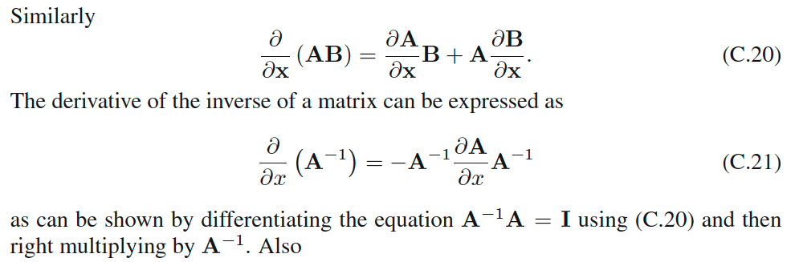</kbd>

> [!NOTE]
> Thử giải thích công thức C.21:
>
>
>
> Cái này hồi học MIT 18s096 đã làm rồi, để tìm derivative của f(x) = A⁻¹ đối với x, ta sẽ tìm cách đưa df trở thành dạng một linear operator act on dx: f'(x)\[dx\].
>
>
>
> Ở đây mình hiểu A⁻¹, là hàm của x, để rồi khi x thay đổi một khoảng dx, thì f(x) = A⁻¹ sẽ thay đổi một khoảng dA⁻¹.
>
>
>
> Nhưng để cho dễ, ta coi A⁻¹ là hàm của A trước: là function nhận vào matrix A, và trả ra inverse của nó. Và ta sẽ tìm dA⁻¹ = cái gì đó của dA, sau đó, dA = cái gì đó của dx, dùng chain rule, ta sẽ có dA⁻¹ = cái gì đó của dx.
>
>
>
> Thế thì AA⁻¹ = I, điều này có nghĩa là, function f(A) =AA⁻¹ là một constant function. nên dù cho A có perturb một khoảng dA, khiến A⁻¹ perturb một khoảng dA⁻¹, thì f vẫn bằng I. Do đó df = 0:
>
>
>
> df = d(AA⁻¹) = 0.
>
>
>
> Áp dụng product rule với d(AA⁻¹): d(AA⁻¹) = dA A⁻¹ + A d(A⁻¹)
>
>
>
> ⇨ dA A⁻¹ + A d(A⁻¹) = 0
>
>
>
> ⇔ - dA A⁻¹ = A d(A⁻¹)
>
>
>
> ⇔ - A⁻¹ dA A⁻¹ = d(A⁻¹)
>
>
>
> Đến đây ta đã có dA⁻¹ = some thing dA, tức là một lienar operator act on dA, nên đây cũng là cách viết vi phân của đạo hàm hàm f(A) = A⁻¹ đối với A.
>
>
>
>  Tiếp, thay dA = linear operator của dx: ∂A/∂x dx, ∂A/∂x là matrix các partial derivative: \[∂A/∂x\]ij = ∂Aij/∂x
>
>
>
> ⇨ d(A⁻¹) = - A⁻¹ \[(∂A/∂x) dx\] A⁻¹, thì ta sẽ có d(A⁻¹) = linear operator act on dx, từ đây giúp rút ra đạo hàm của A⁻¹ đối với x:
>
>
>
> Vì x là scalar, nên trong phép nhân \[matrix A⁻¹\] \[matrix ∂A/∂x\] \[scalar dx\] \[matrix A⁻¹\], ta có thể di chuyển dx tùy ý.:
>
>
>
> ⇨ d(A⁻¹) = -A⁻¹ (∂A/∂x) A⁻¹ dx
>
>
>
> Từ đó có thể kết luận, matrix partial derivative của A⁻¹ đối với x chính là -A⁻¹ (∂A/∂x) A⁻¹

> [!TIP]
> **🤖 AI Feedback** — ✅ Score: **100/100**
>
> Bài giải thích rất rõ ràng, logic và chính xác từng bước một trong việc suy ra công thức C.21. Cách tiếp cận bằng vi phân và chuỗi quy tắc được trình bày rất sâu sắc và dễ hiểu.

 

###### Đạo hàm log det A

<kbd>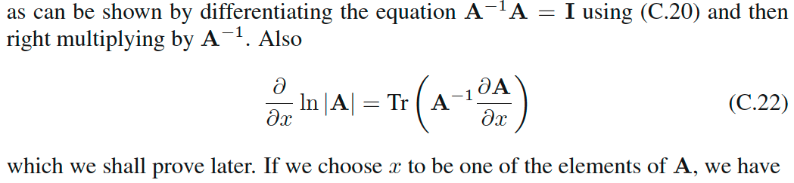</kbd>

> [!NOTE]
> Tiếp, thử làm lại công thức đạo hàm hàm log det A (hồi MIT 18s096 cũng đã xem qua):
>
>
>
> Để đơn giản bớt, ta xét đạo hàm của hàm f(A) = det(A) trước, rồi tí nữa dùng chain rule sẽ giúp
>
> tính đạo hàm hàm log det(A).
>
>
>
> Đầu tiên, mình nhớ, gs sẽ xét biểu thức det (λI + M):
>
>
>
> Còn nhớ trong MIT 1806, det matrix A = tích các eigenvalues. Vậy ở đây det (λI + M) = tích các
>
> eigenvalue của λI + M.
>
>
>
> Mà ta lại xét tính chất sau đây của eigenvalue: gọi α, u là eigenvalue và eigenvector của M, ta
>
> có: Mu = αu. Cộng hai vế cho λu:
>
>
>
> Mu + λu = αu + λu ⇔ (M + λI)u = (α + λ)u ⇨ Từ đó suy ra u cũng là eigenvector của M + λI với
>
> eigenvalue là α + λ.
>
>
>
> Như vậy eigenvalue của M + λI = \[eigenvalue của M\] + λ: eigen(M + λI) = eigen(M) + λ
>
>
>
> ⇨ det (λI + M) = tích các eigenvalue của λI + M = tích các \[eigen(M) + λ\]. Ta viết thế này:
>
>
>
> det (λI + M) = Πi=1:n (λi(M) + λ) với λi(M) là eigenvalue thứ i của M.
>
>
>
> Nếu nhân phân phối cái tích của n thừa số này ra, ta sẽ có:
>
>
>
> Để dễ hình dung, ví dụ (λ1 + λ)(λ2 + λ)(λ3 + λ)
>
>
>
> = λ1(λ2 + λ)(λ3 + λ) + λ(λ2 + λ)(λ3 + λ)
>
>
>
> = (λ1λ2 + λ1λ)(λ3 + λ) + (λλ2 + λ²)(λ3 + λ)
>
>
>
> = λ1λ2(λ3 + λ) + λ1λ(λ3 + λ) + λλ2(λ3 + λ) + λ²(λ3 + λ)
>
>
>
> = λ1λ2λ3 + λ1λ2λ + λ1λλ3 + λ1λ² + λλ2λ3 + λ²λ2λ + λ²λ3 +λ³
>
>
>
> = λ³ + λ²(λ1 + λ2 + λ3) + λ(λ1λ2 + λ1λ3 + λ2λ3 + λ1λ2λ3
>
>
>
> λⁿ
>
>
>
> \+ \[λ^(n-1)\](Σi λi(M))
>
>
>
> \+ \[λ^(n-2)\](Σ của các tích của các cặp λi(M)) ) → cái này là \[λ^(n-2)\] tr(M)
>
>
>
> \+ \[λ^(n-3)\](Σ của các tích của các bộ ba λi(M))
>
>
>
> ....
>
>
>
> \+ \[λ^1\](Σ của các tích của bộ n-1 cái λi(M))
>
>
>
> \+ \[λ^0\](một term có dạng tích của n cái λi(M)) → cái này chính là det M
>
>
>
> Thế thì, giả sử trị riêng của M rất nhỏ, thì ta có thể xấp xỉ bằng cách bỏ đi các hạng tử còn lại
>
> (những cái có dạng tổng của tích các trị riêng của M). Để chỉ còn: det (λI + M) = λⁿ + λ^(n-1)
>
> trace(M)
>
>
>
> Rồi. Thế thì, xét f(A) = det A
>
>
>
> ⇨ df = det (A + dA) - det A = det(A + AA⁻¹ dA) - det A
>
>
>
> = det\[A(I + A⁻¹ dA)\] - det A
>
>
>
> = det A det(I + A⁻¹ dA) - det A (dùng tính chất det AB = det A det B)
>
>
>
> Tới đây, áp dụng kết quả trên với λ = 1, M = A⁻¹ dA, với dA là matrix vi phân, A⁻¹ dA cũng có
>
> giá trị nhỏ → trị riêng nhỏ, từ đó ta sẽ dùng công thức xấp xỉ det(I + A⁻¹ dA) ≈ 1ⁿ + 1^(n-1)
>
> trace(A⁻¹ dA) = 1 + tr(A⁻¹ dA)
>
>
>
> ⇨ det A det(I + A⁻¹ dA) - det A = det A \[1 + tr(A⁻¹ dA)\] - det A
>
>
>
> = det A + det A tr(A⁻¹ dA) - det A
>
>
>
> = det A tr(A⁻¹ dA)
>
>
>
> Giờ nói đến trace, như đã biết, trace(A) = tổng phần tử đường chéo matrix A. Nếu xét inner
>
> product của A và B: A . B =Σij AijBij, thì nó cũng chính là Σi \[cột i của A dot product cột i của B\] =
>
> tổng các phần tử đường chéo của matrix AᵀB = tr(AᵀB). Vậy A.B = tr(AᵀB) (A.B là inner
>
> product)
>
>
>
> ⇨ tr(A⁻¹dA) = A⁻¹ᵀ . dA
>
>
>
> ⇨ df = det(A) (A⁻¹ᵀ . dA)
>
>
>
> Vì inner product là một linear operator, nên đến đây ta đã có dạng df = linear operator act on
>
> dA: linear oerator đó chính là: lấy dA, inner product với A⁻¹ᵀ, và nhân cho scalar det A (hoặc là
>
> scalar A⁻¹ bởi scalar det A, rồi lấy matrix đó, đem inner product với dA).
>
>
>
> Vậy, theo MIT 18s096, ta có thể kết luận đạo hàm của f(A) = det A đối với matrix A chính là
>
> det(A) A⁻¹ᵀ
>
>
>
> Thế thì, giờ ta xét hàm g(A) = log f(A) = log det A. Dùng chain rule:
>
>
>
> dg = g'(f) df = \[1/f(A)\] df
>
>
>
> (thay df ở trên vô)
>
>
>
> = \[1/det(A)\] det(A) (A⁻¹ᵀ . dA)
>
>
>
> = A⁻¹ᵀ . dA
>
>
>
> Vậy ta có dg(A) = d(log\[det(A)\]) = A⁻¹ᵀ . dA
>
>
>
> ⇨ đạo hàm của log det A đối với A là A⁻¹ᵀ (A inverse transpose)
>
>
>
> Tiếp, ta lại xét A là hàm theo x: A(x) ⇨ dA = ∂A/∂x dx
>
>
>
> ⇨ d(log\[det(A)\]) = A⁻¹ᵀ . ∂A/∂x dx
>
>
>
> Với kết quả này, nếu ta gọi f(x) = log\[det(A(x))\] (A là hàm matrix, nhận vào x, trả ra matrix A, rồi
>
> lấy det của A, và cuối cùng lấy log), thì cái ta đang có chính là df được thể hiện bởi linear
>
> operator act on dx, và linear operator đó chính là: Lấy inner product của matrix A⁻¹ᵀ và matrix
>
> ∂A/∂x, sẽ ra một scalar, rồi nhân với dx. Do đó, đạo hàm của f(x) đối x chính là bằng scalar này:
>
> A⁻¹ᵀ . ∂A/∂x,
>
>
>
> Và again, lại chuyển cách thể hiện nó về lại trace: tr(A⁻¹ (∂A/∂x)).
>
>
>
> thì như phát biểu lần cuối: đạo hàm của hàm log\[det(A(x))\] đối với x (kí hiệu là ∂/∂x \[log det A\],
>
> hay ∂/∂x ln |A|) chính là tr(A⁻¹ (∂A/∂x)). Đây chính là công thức C.22

> [!TIP]
> **🤖 AI Feedback** — ✅ Score: **95/100**
>
> Bản ghi chú cung cấp một phân tích rất chi tiết và sâu sắc để chứng minh công thức C.22, thể hiện sự hiểu biết vững chắc về giá trị riêng, định thức và vi phân ma trận. Cách tiếp cận từng bước, từ đạo hàm của det(A) đến log(det(A)), rất rõ ràng và logic, tuy nhiên có một vài lỗi nhỏ trong việc khai triển ví dụ và việc gán [λ^(n-2)] cho tr(M) là không chính xác.

 

###### Đạo hàm Trace Ma trận

<kbd>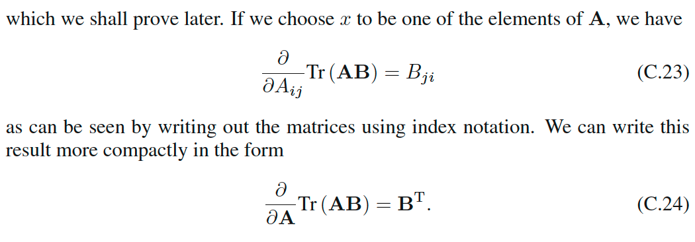</kbd>

> [!NOTE]
> Thử xem công thức C.23:
>
>
>
> Xét hàm f(A) = tr(AB)
>
>
>
> df = f(A + dA) - f(A) = tr((A+dA)B) - tr(AB)
>
>
>
> = tr(AB + (dA)B) - tr(AB)
>
>
>
> = tr(AB) + tr\[(dA)B\] - tr(AB) (trace có tính linearity)
>
>
>
> = tr\[(dA)B\]
>
>
>
> = tr(BdA) (tính chất cyclic của trace)
>
>
>
> Và như note trước đã làm, ta chuyển nó thành inner product của Bᵀ và dA: &lt;B . dA&gt;, hay ghi là Bᵀ . dA cũng được
>
>
>
> Như vậy tới đây ta đã có df(A) = linear operator act on dA: lấy dA inner product với matrix Bᵀ (B tranpose). Vậy đạo hàm của f(A) = tr(AB) đối với matrix A chính là Bᵀ, viết theo toán học:
>
>
>
>  ∂/∂A tr(AB) = Bᵀ (→ đây chính là công thức C.24)
>
>
>
> đương nhiên function f(A) = tr(AB) là matrix → scalar function, nên ∂f/∂A là matrix. Và Bᵀ cũng là matrix
>
>
>
> Nên ta có: \[∂/∂A tr(AB)\]ij = \[Bᵀ\]ij
>
>
>
> Mà phần tử ij của ∂/∂A tr(AB) như đã nói lúc đầu, chính là ∂/∂Aij \[tr(AB)\]. Nên ta có:
>
>
>
> ∂/∂Aij \[tr(AB)\] = \[Bᵀ\]ij
>
>
>
> Tới đây, ta mới bỏ tranpose của B đi: \[Bᵀ\]ij = Bji (đổi index ij thành ji)
>
>
>
> Và ta có công thức ∂/∂Aij \[tr(AB)\] = Bji → chính là công thức C.23

> [!TIP]
> **🤖 AI Feedback** — ✅ Score: **98/100**
>
> Phân tích của bạn rất kỹ lưỡng và chính xác, sử dụng phương pháp vi phân để dẫn xuất các công thức C.23 và C.24 một cách hoàn hảo. Các bước giải thích rõ ràng từ tính chất tuyến tính, tính chất cyclic của trace đến việc liên hệ đạo hàm ma trận với các phần tử của nó.

**🔗 See also:** [Least Squares Discriminant Function](./413_least_squares_for_classification.md#node-uez5xzu)

 

###### Đạo hàm hàm vết ma trận

<kbd>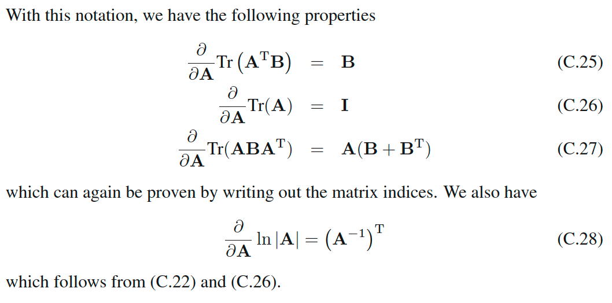</kbd>

> [!NOTE]
> Với cách chứng minh tương tự ta có thể chứng minh nhanh C.25:
>
>
>
> d\[tr(AᵀB)\] = tr(AᵀB + (dA)ᵀB) - tr(AᵀB) = tr\[(dA)ᵀB\] 
>
>
>
> = tr(BᵀdA) (vì tr(M) = tr(Mᵀ))
>
>
>
> = B . dA (chuyển sang inner product)
>
>
>
> ⇨ và tại đây có thể kết luận ∂/∂A \[tr(AᵀB)\] = B
>
>
>
> ---
>
>
>
> Còn C.26 thì đơn giản, coi B = I thôi.
>
>
>
> Cuối cùng, C.27: Hoàn toàn tương tự:
>
>
>
> d\[tr(ABAᵀ)\] = tr\[(A+dA)B(A+dA)ᵀ\] - tr(ABAᵀ)
>
>
>
> = tr\[(AB+dAB)(Aᵀ+(dA)ᵀ)\] - tr(ABAᵀ)
>
>
>
> = tr\[(ABAᵀ+(dA)BAᵀ+AB(dA)ᵀ+(dA)B(dA)ᵀ\] - tr(ABAᵀ)
>
>
>
> = tr\[(dA)BAᵀ+AB(dA)ᵀ+(dA)B(dA)ᵀ\] 
>
>
>
> = tr\[(dA)BAᵀ+AB(dA)ᵀ\]  (bỏ term bậc cao (dA)B(dA)ᵀ)
>
>
>
> = tr\[(dA)BAᵀ\] + tr\[AB(dA)ᵀ\]
>
>
>
> = tr\[(dA)BAᵀ\] + tr\[(dA)(AB)ᵀ\]
>
>
>
> = tr\[(dA)BAᵀ\] + tr\[(dA)(BᵀAᵀ)\]
>
>
>
> = (dA)ᵀ. (BAᵀ) + (dA)ᵀ.(BᵀAᵀ)
>
>
>
> = (dA)ᵀ . \[BAᵀ + BᵀAᵀ\]
>
>
>
> = (dA)ᵀ . (B + Bᵀ)Aᵀ
>
>
>
> inner product A.B cũng bằng Aᵀ . Bᵀ
>
>
>
> = dA . ((B + Bᵀ)Aᵀ)ᵀ 
>
>
>
> = dA . A\[(B+Bᵀ)ᵀ\]
>
>
>
> = dA . A(Bᵀ+B)
>
>
>
> ⇨ đạo hàm của tr(ABAᵀ) wrt A là A(Bᵀ+B)

> [!TIP]
> **🤖 AI Feedback** — ✅ Score: **90/100**
>
> Bạn đã chứng minh các đạo hàm ma trận C.25, C.26 và C.27 một cách chính xác và chi tiết, thể hiện sự hiểu biết sâu sắc về vi phân ma trận và các tính chất của vết ma trận. Tuy nhiên, việc sử dụng ký hiệu cho tích vô hướng giữa các ma trận (ví dụ: "B . dA" hoặc "(dA)T . (BAT)") chưa hoàn toàn chuẩn và có thể gây nhầm lẫn; bạn nên làm rõ định nghĩa tích vô hướng được sử dụng.

**🔗 See also:** [Least Squares Discriminant Function](./413_least_squares_for_classification.md#node-uez5xzu)

 

###### Trị riêng và vector riêng

<kbd>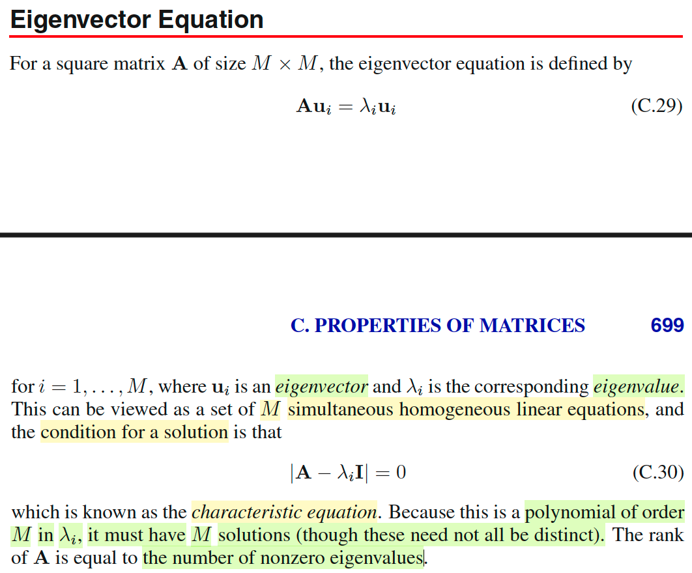</kbd>

> [!NOTE]
> Đây là cơ hội để ôn lại chút xíu những kiến thức trong MIT 18.06:
>
>
>
> Như đã biết, nếu λ và u thỏa Au = λu thì λ và u sẽ là trị riêng, vector riêng của A. Và ta nhớ việc tìm trị riêng của A sẽ bắt đầu bằng cách giải characteristic equation: det (A - λI) = 0.
>
>
>
> Và về bản chất, ta lập luận như sau: Nếu λ, và u là trị riêng vector riêng của A thì Au = λu ⇔ Au - λu = 0 ⇔ (A - λI)u = 0. Và dĩ nhiên ta chỉ xét u là vector khác 0. Như vậy, (A - λI)u = 0 thể hiện rằng u chính là nullspace vector của A - λI. Và điều này đồng nghĩa là matrix này không full-rank / singular và cũng chính là sẽ tồn tại eigenvalue = 0 ⇨ det (A - λI) = 0. Do đó đây là điều kiện để giải tìm λ.
>
>
>
> Còn vì sao lại gọi det (A - λI) là đa thức bậc M của λi?
>
>
>
> → À thì là vì det, như đã biết, là tích các eigenvalue, nên det(A - λI) = tích các eigenvalue của (A - λI).
>
>
>
> Mà trong các note lúc nãy, mình cũng đã chứng minh lại là:
>
>
>
> λi(A - λI) = λi(A) - λ
>
>
>
> (λi(.) là hàm lấy ra eigenvalue thứ i của matrix).
>
>
>
> Nên det (A - λI) = Πi=1:M \[λi(A) - λ\]
>
>
>
> và triển khai cái tích này ra, ta sẽ có một hàm đa thức bậc M của các eigenvalue của A.
>
>
>
> Cuối cùng, mình cũng đã biết rank matrix chính là số eigenvalue khác 0. Vì sao? Vì một eigenvalue bằng 0 sẽ ứng với một eigenvector (khác 0) bị biến thành 0 bởi matrix A: Au = 0, cũng chính là một nullspace vector. Nên nếu có k eigenvalue = 0, thì ta sẽ có k vector khác 0, tạo thành k basis của nullspace thì rank = n - k cũng chính là số eigenvector khác 0 còn lại.

> [!TIP]
> **🤖 AI Feedback** — ✅ Score: **92/100**
>
> Ghi chú đã thể hiện sự hiểu biết sâu sắc về các khái niệm, đặc biệt là khi giải thích nguồn gốc của phương trình đặc trưng và mối liên hệ giữa hạng của ma trận với trị riêng. Để hoàn thiện hơn, bạn có thể làm rõ hơn lập luận dẫn đến điều kiện det(A - λI) = 0 để tránh nhầm lẫn giữa trị riêng của A và trị riêng của (A - λI).

 

###### Tính chất ma trận đối xứng

<kbd>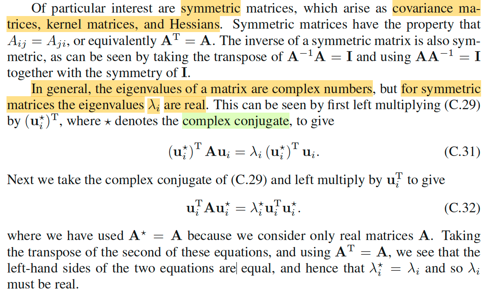</kbd>

> [!NOTE]
> Tiếp theo, tác giả nói về việc ta sẽ quan tâm chủ yếu tới matrix đối xứng vì rất nhiều matrix xuất hiện trong machine learning là matrix đối xứng.
>
>
>
>  Thế thì đầu tiên nếu A đối xứng thì A⁻¹ cũng đối xứng. Cái này dễ chứng minh:
>
>
>
> AA⁻¹ = I ⇔ (AA⁻¹)ᵀ = Iᵀ ⇔ A⁻¹ᵀAᵀ = I ⇔ A⁻¹ᵀ A = A⁻¹A (thì Iᵀ = I, Aᵀ=A, và A⁻¹A = I) → A⁻¹ᵀ = A⁻¹ ⇨ A⁻¹ đối xứng.
>
>
>
> Sau đó, gs chứng minh nhanh lại một tính chất đó là, với matrix đối xứng thì eigenvalue sẽ là số thực. Cũng không khó hiểu nhờ đã học qua MIT 18.06
>
>
>
> Gọi λ, u là eigenvalue và eigenvector của A: Au = λu
>
>
>
> Có lẽ nên recall lại chút kiến thức conjugate: Đại khái là một số phức sẽ có dạng a + ib với a là phần thực, b là phần ảo (imaginary). Thì khi đó số phức liên hợp của nó sẽ là a - ib. Để rồi nhân chúng với nhau ta sẽ có (a +ib)(a - ib) = a² -aib + aib - i² b² = a² + b², và kết quả là số thực, không còn là số phức nữa.
>
>
>
> Như vậy nếu u là vector phức, và gọi u\* là vector complex conjugate của nó, tức là mọi phần tử của u\* đều là complex conjugate của u. Khi tích vô hướng của chúng, ta sẽ có uᵀu\* = Σi ui\*u\*i và đây sẽ là một tổng các số thực, nên là số thực.
>
>
>
> Thế thì Au = λu, nhân bên trái hai vế với u\*ᵀ: u\*ᵀAu = u\*ᵀλu ⇔ u\*ᵀAu = λ u\*ᵀu (1)
>
>
>
> Tiếp, với Au = λu thì (Au)\* = (λu)\* (vì Au là vector, λu cũng là vector, mà hai thằng này bằng nhau thì complex conjugate của chúng đương nhiên bằng nhau.
>
>
>
> Tiếp, với complex number thì nó có tính chất: (x+y)\* = x\* + y\*, và (xy)\* = x\* y\*
>
>
>
> Nên (Au)\* = (λu)\* ⇔ A\*u\* = λ\*u\*.
>
>
>
> Nhân hai vế với uᵀ: A\*u\* = λ\*u\* ⇔ uᵀA\*u\* = uᵀ λ\*u\*
>
>
>
> ⇔ uᵀA\*u\* = λ\* uᵀ u\*
>
>
>
> ⇔ uᵀAu\* = λ\* uᵀ u\* (2) (Vì với matrix A, ta sẽ luôn dùng matrix số thực, nên A\* = A)
>
>
>
> Tới đây (1) ta có u\*ᵀAu = λ u\*ᵀu và (2) ta có uᵀAu\* = λ\* uᵀ u\*
>
>
>
> Vế trái u\*ᵀAu và uᵀAu\* là giống nhau, vì là scalar nên bằng tranpose của chính nó.
>
>
>
> Suy ra vế phải bằng nhau λ u\*ᵀu = λ\* uᵀ u\* ⇨ λ = λ\*. Và khi một số bằng số phức liên hợp của nó thì thì nó chính là số thực.
>
>
>
> ---
>
>
>
> Ngoài ra thì như mình còn nhớ trong MIT 1806 đã học với matrix đối xứng thì ta luôn có đủ n eigenvector độc lập, để có thể tách thành Q Λ Qᵀ, với Q là các orthogonal eigenvector, Λ là diagonal matrix các eigenvalue.

> [!TIP]
> **🤖 AI Feedback** — ⚠️ Score: **85/100**
>
> Bạn đã nắm bắt rất tốt các ý chính từ tài liệu tham khảo và cung cấp một phân tích chi tiết, thể hiện sự hiểu biết sâu sắc về các ma trận đối xứng và tính chất của chúng. Tuy nhiên, có một lỗi nhỏ trong phần nhắc lại về số phức liên hợp cần được điều chỉnh.

 

###### Eigenvector vuông góc ma trận đối xứng

<kbd>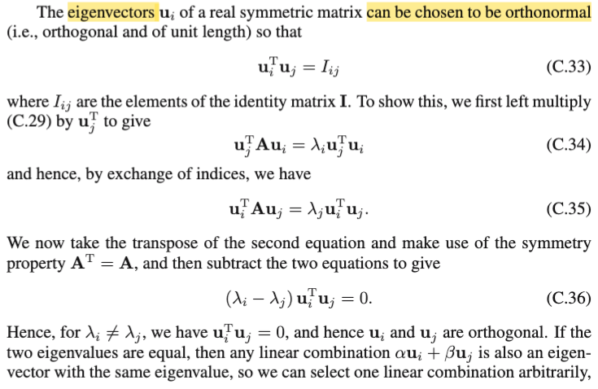</kbd>

> [!NOTE]
> Tiếp theo chính là gs nhắc lại cái điều mình vừa nói ở note trước: Luôn
>
> có thể chọn / tồn tại một bộ eigenvector orthogonal. Chứng minh nhanh:
>
>
>
> Gọi λi, λj (λi khác λj) và ui, uj là eigenvalue / eigenvector của A: A ui = λi
>
> ui, A uj = λj uj
>
>
>
> A ui = λi ui ⇔ ujᵀ A ui = ujᵀ λi ui (nhân hai vế cho ujᵀ (uj tranpose)
>
>
>
> ⇔ ujᵀ A ui = λi ujᵀ ui
>
>
>
> ⇔ (ujᵀ A ui)ᵀ = λi ujᵀ ui (do vế trái là scalar, với scalar a thì a = aᵀ)
>
>
>
> ⇔ uiᵀ Aᵀ uj = λi ujᵀ ui
>
>
>
> ⇔ uiᵀ A uj = λi ujᵀ ui (do A đối xứng nên A = Aᵀ)
>
>
>
> Tiếp từ A uj = λj uj ⇔ uiᵀ A uj = uiᵀ λj uj
>
>
>
> ⇔ uiᵀ A uj = λj uiᵀ uj
>
>
>
> Trừ vế theo vế (1) và (2): 0 = λi ujᵀ ui - λj uiᵀ uj ⇔ 0 = λi ujᵀ ui - λj ujᵀ ui
>
> (do uiᵀuj = ujᵀui, cũng là do chúng là scalar)
>
>
>
> ⇔ 0 = (λi - λj) uiᵀuj.
>
>
>
> Tới đây vì λi khác λj nên suy ra uiᵀuj = 0 ⇨ chúng orthogonal (vuông
>
> góc). Và vì ui uj tùy ý, nên mọi có thể kết luận là tồn tại bộ eigenvector
>
> vuông góc nhau.
>
>
>
> Cuối cùng, một tính chất cũng dễ hiểu là nếu ui uj là eigenvector tương
>
> ứng với cùng một eigenvalue thì mọi linear combination của chúng cũng
>
> là eigenvector: dễ thấy thôi:
>
>
>
> Scalar hai vế của A ui = λ ui, A uj = λ uj với α, và β bất kì rồi cộng vế
>
> theo vế ta có:
>
>
>
> A α ui + A β uj = α λ ui + β λ uj
>
>
>
> ⇔ A (α ui + β uj) = λ (α ui + β uj)
>
>
>
> kết quả này suy ra α ui + β uj cũng là eigenvector với cùng eigenvalue λ

> [!TIP]
> **🤖 AI Feedback** — ✅ Score: **98/100**
>
> Bài giải thích chi tiết và chính xác từng bước chứng minh tính trực giao của eigenvector. Bạn có thể làm rõ hơn cách "chọn" các eigenvector trực giao trong trường hợp giá trị riêng trùng lặp để hoàn thiện hơn.

 

###### Điều kiện ma trận trực giao

<kbd>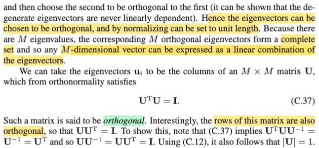</kbd>

> [!NOTE]
> Như đã biết từ Mục 18.06, khi có một tập hợp vector trực giao (tức là các vector vuông góc với nhau) và chúng được chuẩn hóa sao cho mỗi vector có chiều dài bằng 1, ta sẽ có một tập hợp vector trực chuẩn (orthonormal). Tuy nhiên, cần lưu ý một điểm quan trọng đã được nhắc đến trong lớp học. Giáo sư Gilbert Strang luôn nhấn mạnh rằng nếu các vector đó được sắp xếp thành các cột của một ma trận, ma trận đó không thể được gọi là ma trận trực giao (orthogonal matrix) trừ khi ta có đủ một bộ N vector trực giao. Điều này có nghĩa là ma trận đó phải là ma trận vuông. Nếu ma trận chỉ có một tập hợp các cột trực chuẩn hoặc trực giao nhưng không đủ số lượng để tạo thành ma trận vuông (tức là số cột ít hơn số hàng), thì nó vẫn chưa được gọi là một ma trận trực giao.
>
>
>
> Một tập hợp các vector vuông góc với nhau được gọi là tập hợp vector trực giao (orthogonal set of vector). Nếu được chuẩn hóa, nó được gọi là tập hợp vector trực chuẩn (orthonormal set of vector). Tuy nhiên, khi các vector này được đưa vào làm cột của một ma trận, để ma trận đó được gọi là ma trận trực giao, số cột phải đủ, nghĩa là ma trận phải có kích thước vuông. Một điểm khác là nếu có M giá trị riêng (eigenvalue) và các vector riêng tương ứng với chúng trực giao, trong bối cảnh xét một ma trận M x M, điều này ngụ ý rằng ta đã có đủ một cơ sở (basis) cho không gian R^M. Nghĩa là, tập hợp các vector đó tạo thành một bộ cơ sở. Do đó, tập hợp này sẽ trải rộng toàn bộ không gian R^M. Mọi vector trong không gian R^M, hay nói cách khác, mọi vector M chiều, đều có thể được biểu diễn dưới dạng tổ hợp tuyến tính của cơ sở này.
>
>
>
> Ngoài ra một ý nữa đó là, với matrix orthogonal matrix U thì các rows của chúng cũng orthogonal, chứng minh cũng dễ: 
>
>
>
> UᵀU = I ⇨ Uᵀ = U⁻¹. ⇨ UUᵀ = UU⁻¹ = I. Vậy U Uᵀ = I ⇨ các row orthogonal nhau.
>
>
>
> Cuối cùng, vì UᵀU = UUᵀ = I ⇨ det (Uᵀ U) = det(I) = 1 ⇔ det(Uᵀ) det(U) = 1 ⇔ \[det(U)\]² = 1 (vì det(U) = det(Uᵀ)) ⇨ det(U) = +/- 1.

> [!TIP]
> **🤖 AI Feedback** — ✅ Score: **98/100**
>
> Ghi chú này rất chính xác và sâu sắc, không chỉ nắm bắt được các ý chính từ văn bản mà còn mở rộng và làm rõ thêm các khái niệm quan trọng, như yêu cầu ma trận vuông cho định nghĩa "ma trận trực giao" và việc dẫn ra det(U) = ±1. Điều này cho thấy sự hiểu biết vững chắc về chủ đề.

 

###### Phân rã giá trị riêng và ma trận trực giao

<kbd>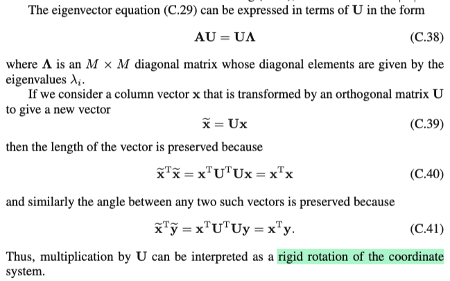</kbd>

> [!NOTE]
> Rồi, tiếp, C.38 là sao?
>
>
>
> Gọi u1,..un là các eigenvector của A ứng với eigenvalue λ1, λ2,...thì ta
>
> có: Aui = λi ui, i=1,2...n
>
>
>
> Thế thì bằng cách nhớ lại góc nhìn nhân matrix với matrix thứ 3 trong
>
> MIT 1806, ta nhớ AB sẽ có bản chất là: cột i của AB là linear
>
> combination các cột của A bởi bộ hệ số là cột i của B. Như vậy bằng
>
> cách đặt U là matrix có các cột u1,...un, thì và B là matrix có các cột là
>
> λ1u1,...λnun. Ta sẽ thấy AU = B chính là cách thể hiện compact của n
>
> equation trên. Và B thì có thể tách thành Λ U với Λ là diagonal matrix
>
> diag(λ1, λ2,...). Khi đó ta sẽ có AU = UΛ. Và vì U này là orthogonal
>
> matrix (dĩ nhiên là full rank) nên A = UΛ U⁻¹ = U Λ Uᵀ, hay trong MIT
>
> 1806 gs Strang dùng Q: A = Q Λ Qᵀ.
>
>
>
> \-----
>
>
>
> Ý tiếp theo là nói về vụ transform bởi orthogonal matrix thì giữ nguyên
>
> length và angle. nói cách khác nó là phép xoay.
>
>
>
> Chứng minh dễ ẹt: Ta xét bình phương của norm Ux, ||Ux||² = = (Ux)ᵀ(Ux) = xᵀUᵀUx = xᵀIx = xᵀx = ||x||². Vậy suy ra ||Ux|| = ||x||.
>
>
>
> Xét cosine góc của Ux và Uy kí hiệu cos(Ux, Uy).
>
>
>
> Ta biết công thức uᵀv = ||u|| ||v|| cos(u,v) ⇨ cos(u,v) = uᵀv / (||u|| ||v||)
>
>
>
> ⇨ cos(Ux, Uy) = (Ux)ᵀ(Uy) / ||Ux|| ||Uy|| 
>
>
>
> = xᵀUᵀUy / ||x|| ||y|| (dùng kết quả trên: ||Ux|| = ||x||, ||Uy|| = y)
>
>
>
> = xᵀy / ||x|| ||y|| = cos(x, y) 
>
>
>
> Vậy qua phép biến đổi U, giữ nguyên góc (x,y)

> [!TIP]
> **🤖 AI Feedback** — ✅ Score: **98/100**
>
> Phần giải thích về phương trình C.38 rất sâu sắc, thể hiện sự hiểu biết vững chắc về bản chất của ma trận chéo hóa và phân tích phổ. Các chứng minh về bảo toàn độ dài và góc khi biến đổi qua ma trận trực giao cũng rất rõ ràng và chính xác, vượt xa những gì tài liệu gốc cung cấp.

 

###### Chéo hóa và nghịch đảo ma trận

<kbd>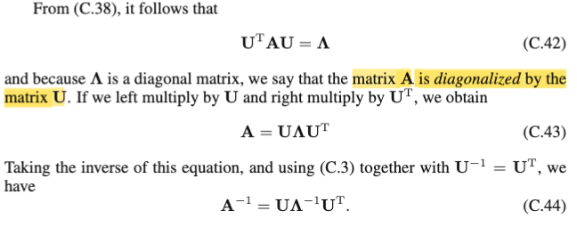</kbd>

<kbd>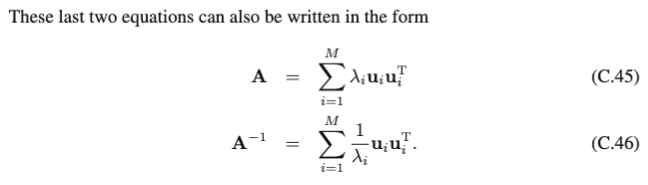</kbd>

<kbd>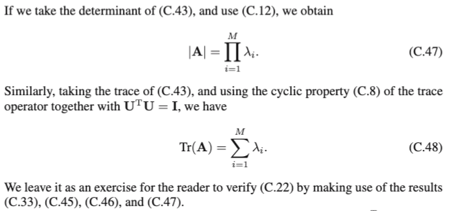</kbd>

> [!NOTE]
> Rồi, như note trước ta đã biết A = U Λ Uᵀ, và cũng là U Λ U⁻¹. Nhân hai vế cho Uᵀ và U: Uᵀ A U = Λ. thì cái biểu thức này được gọi là matrix A bị chéo hóa (diagonalized) bởi matrix U.
>
>
>
> Rồi từ A = U Λ Uᵀ, inverse hai vế ta có A⁻¹ = U Λ⁻¹ Uᵀ (cái này dùng các identity như (AB)⁻¹ = B⁻¹ A⁻¹ là ra, ko có gì khó)
>
>
>
> Còn cái C.45 / 46?
>
>
>
> Để hiểu thì chỉ cần góc nhìn nhân matrix với matrix trong MIT 1806 đã học:
>
>
>
> A = U Λ Uᵀ 
>
>
>
> U Λ là gì? Theo góc nhìn thứ hai nhân hai matrix, thì cột j của U Λ chính là linear combination các cột của U với hệ số là cột j của Λ. Vì Λ là diagonal, nên cột j chỉ có phần tử thứ j là khác 0, chính là λj. Nên cột j của U Λ = λj x cột j của U = λj uj
>
>
>
> Sau đó nhân U Λ với Uᵀ: Ta sẽ nhìn theo góc nhìn thứ 4: Tổng j=1:n các rank 1 matrix tạo bởi outer product của một cột j của (U Λ) (chính là λj uj) và hàng j của Uᵀ (chính là ujᵀ). Do đó U Λ Uᵀ = Σj=1:n λj ujujᵀ.
>
>
>
> Tương tự vậy với C.46. Chỉ chú ý là Λ⁻¹, sẽ có các component đường chéo  = nghịch đảo của component đường chéo của Λ. Vì sao?
>
>
>
> Là vì Λ Λ⁻¹ = Λ⁻¹ Λ = I. Gọi α1, α2,.. là diagonal entries của Λ⁻¹ thì
>
>
>
> Λ Λ⁻¹ = Λ⁻¹ Λ = I ⇔ λi αi = 1, i =1,2... ⇨ αi = 1 / λi

> [!TIP]
> **🤖 AI Feedback** — ✅ Score: **97/100**
>
> Phân tích của bạn rất chính xác và sâu sắc, đặc biệt là phần giải thích chi tiết cho công thức C.45 và C.46 bằng cách sử dụng các góc nhìn khác nhau về phép nhân ma trận. Để hoàn thiện hơn nữa, bạn có thể xem xét bổ sung giải thích cho các công thức về định thức (C.47) và vết (C.48).

 

###### Định nghĩa ma trận xác định

<kbd>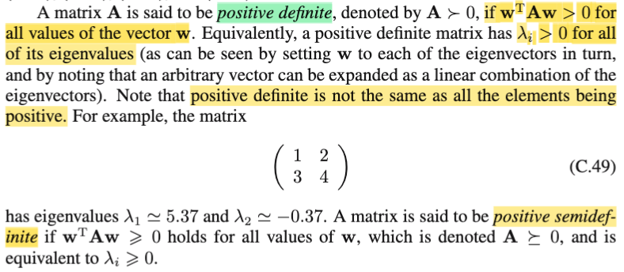</kbd>

> [!NOTE]
> Cuối cùng, một ma trận đối xứng được gọi là ma trận xác định dương (positive definite) nếu **dạng toàn phương của nó luôn dương với mọi vector khác không và chỉ bằng không khi vector W bằng không**. Trong lớp MIT 18.06, chúng ta đã biết rằng **một tính chất của ma trận xác định dương là tất cả các giá trị riêng của nó đều dương**. 
>
>
>
> Ngược lại, nếu dạng toàn phương chỉ lớn hơn hoặc bằng không với mọi vector W (nghĩa là vẫn tồn tại vector W khác không làm cho dạng toàn phương bằng không), thì ma trận đó được gọi là ma trận **xác định bán dương (positive semi-definite)**. Trong trường hợp này, các **giá trị riêng có thể bằng không.**

> [!TIP]
> **🤖 AI Feedback** — ✅ Score: **92/100**
>
> Bài phân tích của bạn rất chính xác và sâu sắc, mô tả đúng cả định nghĩa dạng toàn phương và tính chất giá trị riêng của ma trận xác định dương và bán dương. Bạn cũng đã làm rõ sự khác biệt giữa hai loại ma trận này. Tuy nhiên, bài viết sẽ hoàn thiện hơn nếu bạn bổ sung lưu ý rằng ma trận xác định dương không có nghĩa là tất cả các phần tử của nó đều dương, và có thể thêm ký hiệu A > 0, A ≥ 0.

 

