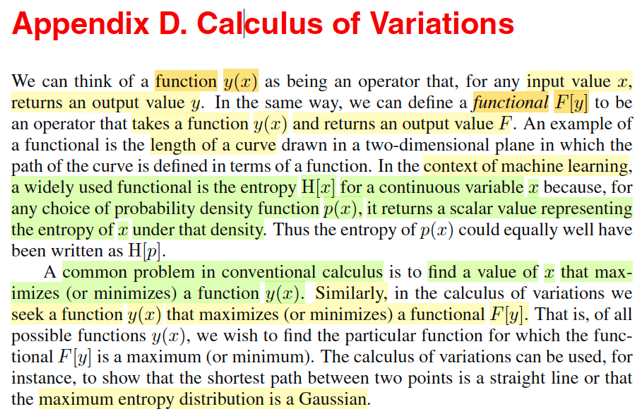
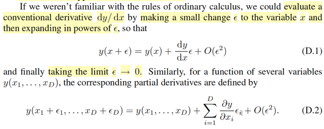
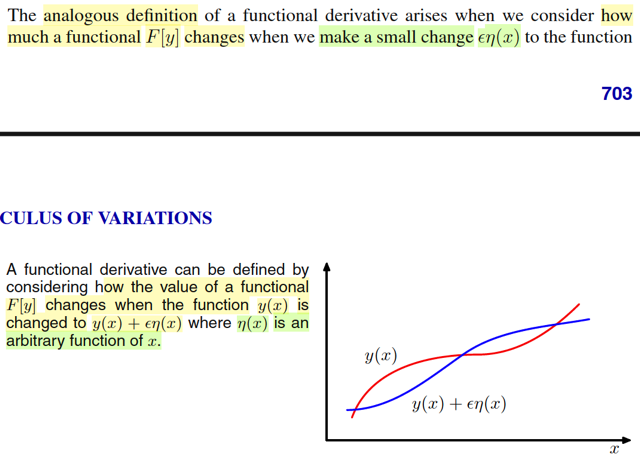
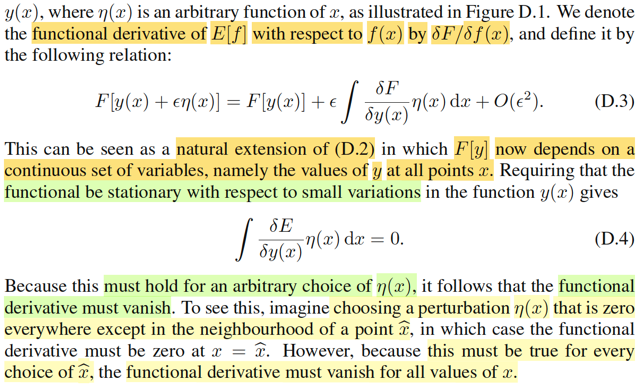
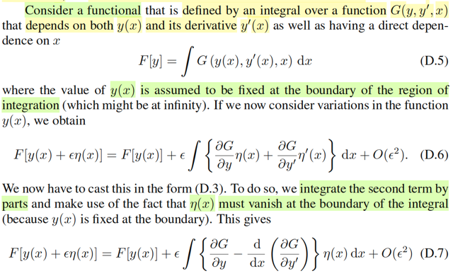
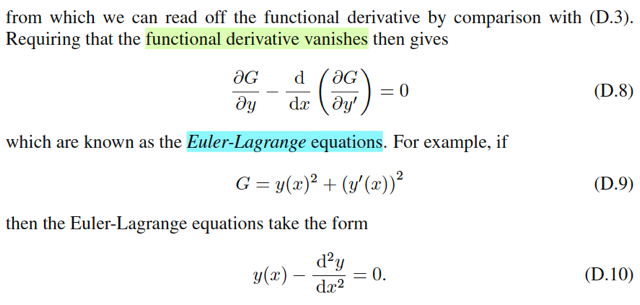
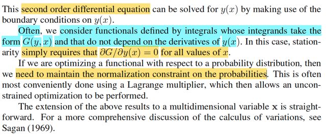

# Appendix D. Calculus of Variation

📊 **Progress:** `5` Notes | `7` Screenshots

---

 

## Functional và bài toán cực trị

<kbd></kbd>

> [!NOTE]
> Đầu tiên gs nói với hàm y(x) thông thường, nhận vào x, trả ra y, gọi là
> function Thì nay ta xét F[y] là một hàm nhận vào hàm y, trả ra giá trị F.Gọi là
> functional Ví dụ, F nhận vào các hàm y(x) và tính ra chiều dài đường cong.
> Hoặc trong bối cảnh machine learning, ta có khái niệm differential entropy,
> được định nghĩa là:
>
>
>
> Entropy của random variable liên tục X:
>
>
>
> H(X) = ∫f(x)ln(f(x))dx, là hàm nhận vào pdf của X, f(x) và trả ra một con số
> đại diện cho mức entropy của distribution f(x).
>
>
>
> Và ta cũng có thể coi nó là hàm của f(x): H(f), để từ đó, ta có cái gọi là
> functional.
>
>
>
> Và tương tự như khi trong bối cảnh hàm số (function) thông thường, ta hay
> đi tìm cực trị: tìm x khiến maximize/minimize y(x). Thì với functional thì
> ta cũng có bài toán: tìm hàm y, khiến maximize F[y]. Ví dụ, trong machine
> learning, ta sẽ dùng nó để chứng minh rằng trong các biến liên tục, thì
> Normal sẽ là cái có Entropy cao nhất, cũng chính là trong số các hàm pdf f(x)
> thì cái có H[f] cao nhất chính là Normal

 

### Định lí Taylor và Đạo hàm

<kbd></kbd>

> [!NOTE]
> Định lí Taylor nói rằng: 
>
>
>
> y(x + ε) = y(x) + y'(x + tε)ε for some t ∈ [0,1]
>
>
>
> Vì hàm số thường xét thỏa điều kiện Lipschizt continuous nên
>
>
>
> |y'(x + tε) - y'(x)| / |x + tε - x| ≤ L (hằng số Lipschizt)
>
>
>
> ⇔ |y'(x + tε) - y'(x)| ≤ Lt|ε| 
>
>
>
> Nhân hai vế cho |ε| 
>
>
>
> ⇔ |y'(x + tε)ε - y'(x)ε| ≤ Ltε^2 
>
>
>
> ⇨ Vì sai số giữa y'(x + tε)ε và y'(x)ε bị chặn trên bởi một term bậc hai
> theo ε nên dĩ nhiên bản thân nó sẽ nhỏ quadratically theo ε: Ta thay sai
> số này bằng kí hiệu O(ε^2) 
>
> ⇨ y'(x + tε)ε = y'(x)ε + O(ε^2) 
>
>
>
> ⇨ y(x + ε) = y(x) + y'(x)ε + O(ε^2) Đây chính là D.1
>
>
>
> Khi lấy limit ε → 0, thì term O(ε^2) sẽ → 0 rất nhanh, để cho ta:
>
>
>
> y(x + ε) = y(x) + y'(x) ε ⇨ y'(x) = lim ε → 0 [y(x + ε) - y(x)] / ε, đây chính 
> là định nghĩa đạo hàm của y(x) theo Newton.
>
>
>
> Và nếu xét ε rất nhỏ, ta có thể xấp xỉ y(x + ε) ≈ y(x) + y'(x) ε, gọi là linear
> approximation.
>
>
>
> Tương tự, với case đa biến.
>
>
>
> y(x + ε) (x, ε lúc này là vector D chiều)
>
>
>
> Ta cũng có theo Taylor theorem:
>
>
>
> y(x + ε) = y(x) + ∇y(x + tε)Tε for some t ∈ (0,1)
>
>
>
> Vì tính Lipschitz continuous:
>
>
>
> ||∇y(x + tε) - ∇y(x)|| / ||tε|| ≤ L
>
>
>
> ⇔ ||∇y(x + tε) - ∇y(x)|| ≤ Lt||ε||
>
>
>
> Xét ||∇y(x + tε) - ∇y(x)||:
>
>
>
> (vì |aTb| = ||a|| ||b|| |cos θ(a,b)| ≤ ||a|| ||b||)
>
>
>
> ⇨ |∇y(x + tε) - ∇y(x)]Tε| ≤ ||∇y(x + tε) - ∇y(x)||||ε|| 
>
>
>
> ⇔ |∇y(x + tε) - ∇y(x)]Tε| ≤ ||∇y(x + tε) - ∇y(x)||||ε|| ≤ Lt||ε|| ||ε|| = Lt||ε||^2
>
>
>
> Vậy ta có |∇y(x + tε) - ∇y(x)]Tε| ≤ ||∇y(x + tε) - ∇y(x)||||ε|| ≤ Lt||ε||^2
>
>
>
> ⇔ |∇y(x + tε)Tε - ∇y(x)Tε| ≤ Lt||ε||^2
>
>
>
> ⇨ ∇y(x + tε)Tε = ∇y(x)Tε + O(||ε||^2)
>
>
>
>  ⇨ y(x + ε) = y(x) + ∇y(x)Tε + O(||ε||^2)
>
>
>
> Đây chính là D.2 (phải viết O(||ε||^2) mới đúng, thay vì O(ε^2) vì ε giờ đang là vector)

 

#### Đạo hàm phiếm hàm và điểm dừng

<kbd></kbd>

<kbd></kbd>

> [!NOTE]
> Thế thì đại khái là ta cũng có thể áp dụng, và mở rộng cách hiểu này cho phiếm
> hàm (functional F[y(x)]) như sau.
>
>
>
> Như vừa rồi mình đã thấy rằng, với y(x) là vector → scalar function, ta có:
>
>
>
> y(x + ε) = y(x) + ∇y(x)Tε + O(||ε||^2)
>
>
>
> cũng là dy = y(x + ε) - y(x) = ∇y(x)Tε + O(||ε||^2) = Σi [∂y(x)/∂xi * εi]  + O(||ε||^2)
>
>
>
> để mang ý nghĩa là, khi các phần tử x1,x2,...xD lần lượt nhúc nhích (perturb) các
> khoảng ε1, ε2,...εD thì hàm y sẽ nhúc nhích một khoảng bằng Σi [∂y(x)/∂xi * εi]
> cộng một term O(||ε||^2)
>
>
>
> Bây giờ nếu ta nhìn functional F[y(x)] như sau:
>
>
>
> Xem y(x) là vector: y(x1), y(x2),...ứng với x1, x2,...là các vector x R^D.
>
>
>
> Nói rõ hơn, ta nhìn nhận y(x) như một dải các kết qủa có được khi cho x chạy
> trong range của nó. Khi đó y(x) là một vector có vô số phần tử, vô số chiều.
>
>
>
> Khi đó ta nhìn functional F[y(x)] như một vector vô số chiều y(x) → F
>
>
>
> Và nếu như với mỗi component của vector y(x) ta nhúc nhích nó chút bằng hàm
> η(x): Đại khái giống như ứng với vector x1 trong R^D, ta có phần tử y(x1) của
> vector vô số chiều y(x), và εη(x1) cho ta một khoảng nhúc nhích của phần tử
> y(x1): y(x1) + εη(x1). Tương tự với các phần tử khác.
>
>
>
> Thì y như việc các component x1,x2,...xD perturb các khoảng ε1, ε2,....εD khiến
> y perturb thể hiện bởi công thức trên
>
>
>
> thì nay các component y(x1), y(x2),...perturb các khoảng εη(x1), εη(x2),.... khiến
> F perturb như sau:
>
>
>
> F[y(x) + εη(x)] = F[y(x)] + Σi [∂F(x)/∂y(xi)] ε η(xi) + O(ε^2)
>
>
>
> Và đó là cách viết giúp ta thấy sự tương đồng, còn để chuẩn xác, ta sẽ thể hiện
> ở dạng tích phân cũng như không dùng kí hiệu partial derivative ∂ mà thay bằng
> δ, để có công thức D.3
>
>
>
> F[y(x) + εη(x)] = F[y(x)] + ∫ [δF(x)/δy(x)] η(x) dx + O(ε^2)
>
>
>
> Nhưng bản chất ta hiểu nó cũng y chang D2 thôi, mà D2.
>
>
>
> Rồi, thế thì, bây giờ quay lại D2, Δy = y(x + ε) - y(x) = ∇y(x)Tε + O(||ε||^2)
>
>
>
> nếu ta xét điều kiện này tại điểm stationary / critical point, có nghĩa là  tại điểm
> mà khi di chuyển ra khỏi đó chút xíu, thì hàm y không đổi, thì ta sẽ có y(x + ε) -
> y(x) = 0 ⇔ ∇y(x)Tε + O(||ε||^2) = 0 Xét tại limit ε → 0 thì cái này trở thành ∇y(x)Tε
> = 0 (1a)
>
>
>
> Và điều này đúng với mọi vector ε bất kì, nên suy ra ∇y(x) phải bằng 0, đây
> chính là first order necessary condition quen thuộc: gradient tại nơi stationary
> point phải vanish: ∂/∂xi y(x) = 0 ∀i (1b)
>
>
>
> Vậy thì tương tự, tại stationary point của functional F[y], tương đương với (1)
> chính là ∫ [δF(x)/δy(x)] η(x) dx = 0 (2a)
>
>
>
> và cũng y như ý trên, phải đúng với vector ε bất kì phải đúng với mọi hàm  η(x)
> bất kì, nên suy ra kết quả tương đương với (1b): δF(x)/δy(x) = 0 (2b)
>
>
>
> Nói rõ thêm ý này: ε trong (1a, 1b) là vector [ε1, ε2,...εD] đóng vai trò là vector có
> độ lớn vi phân, và chỉ theo hướng nào đó trong R^D. Và ∇y(x)Tε chính là
> directional derivative của y(x) wrt hướng vector ε: Độ dốc của hàm y(x) theo
> hướng ε tại x. Mà để cho x là stationary point, có nghĩa là đi ra khỏi x theo
> hướng ε bất kì một khoảng nhỏ đều phải không khiến hàm y(x) thay đổi. Nên
> đây cũng chính là nói độ dốc của hàm y(x) theo hướng ε tại x phải = 0 với mọi
> hướng ε: ∇y(x)Tε = 0 ∀ε.
>
>
>
> (nói chuẩn xác hơn thì ∇y(x)Tε = ||ε|| * directional derivative của y(x) wrt ε.
> còn ∇y(x)Tε thật ra dễ thấy chính là Σi [∂y(x)/xi] εi, chính là total differential) 
> Nhưng đôi khi người ta gọi luôn ∇y(x)Tε là directional derivative, như mình thường
> thấy trong sách Nocedal.)
>
>
>
> Còn tương ứng với nó trong (2a, 2b) là ε η(x). trong đó μ(x) đóng vai trò quy
> định ra cái hướng thay đổi của vector vô số chiều y(x). Ví dụ theo hướng y(x1)
> thì thay đổi η(x1)ε, theo hướng y(x2) thì thay đổi η(x2) ε, và [η(x1), η(x2),...] cùng
> nhau tạo thành vector chỉ hướng trong không gian vô số hướng của y(x), y như
> cách [ε1,.εD] cùng nhau tạo thành vector chỉ hướng trong không gian D hướng
> của x trong 1a,1b Nhưng và 2a,2b, ε đóng vai scalar rất nhỏ để ta có vector
> ε[η(x1), η(x2),...] có độ dài rất nhỏ, đặng y(x) + ε η(x) mang ý nghĩa là bước ra
> khỏi x theo hướng η(x) một khoảng rất nhỏ.

 

##### Phương trình Euler-Lagrange

<kbd></kbd>

<kbd></kbd>

> [!NOTE]
> ok, tiếp tục tìm hiểu đoạn này:
>
>
>
> Đại khái là bây giờ đặt vấn đề là functional F[y] lần này được define = ∫ G(y(x), y'(x) x) dx.
>
>
>
> Dừng lại, chút, nãy giờ là ta nhìn nhận F[y] như một functional chung chung, và hiểu về nó như định nghĩa khái quát
> thế nào là functional: là function nhận vào không phải là map giữa scalar/vector/matrix.. với output. mà là function map
> giữa một function với output. Ví dụ ta có functional F đánh giá diện tích bên dưới đường cong hàm y(x) với x ∈ [a, b]
> chẳng hạn. Để rồi với các  hàm số y(x) khác nhau, thì khi đưa vào functional F, ta sẽ tính ra các diện tích khác nhau.
>
>
>
> Vậy thì, ở đây, ta đang xét một dạng cụ thể của functional: nhận vào hàm số y(x), ta tính tích phân ∫ G(y(x), y'(x), x) dx.
> Thì cũng hiểu y vậy, là với các hàm số y(x) khác nhau, cái tích phân này sẽ ra các kết quả khác nhau. Nếu ta dùng hàm
> G là G(y(x), y'(x), x) = y(x), thì ta sẽ có cái functional map hàm y(x) với diện tích bên dưới đường cong đồ thị hàm y(x)
> khi x chạy từ a = -inf tới b = inf mà mình vừa nói trên. Còn trong trường hợp khác  ví dụ G(y(x), y' (x), x) = y(x) + y'(x)
> chẳng hạn, thì ta có cái functional map y(x) với con số khác.
>
>
>
> Tóm lại ∫ G(y(x), y'(x), x) dx là functional: F[y(x)]
>
>
>
> Khai triển Taylor đối với G: khi y(x) perturb ε η(x), y'(x) perturb ε η'(x):
>
>
>
> G(y + εη, y' + εη', x) = G(y, y', x) + ∂G/∂y (εη) + ∂G/∂y' (εη') + O(ε^2)
>
>
>
> Thế thì, lặp lại lập luận hồi nãy:
>
>
>
> Ta coi như y(x) như một vector vô số chiều, mỗi chiều ứng với một point x trong range của x.
>
>
>
> Ta chia range x liên tục thành vô số các điểm rời rạc cách nhau Δx, với mỗi x ứng với mỗi y(x):
>
>
>
> Để rồi khi mỗi component của vector vô số chiều này, perturb một khoảng define bởi ε η(x), thì cùng nhau chúng sẽ
> khiến functional F perturb:
>
>
>
> F[y(x) + ε η(x)] = F[y(x)] + ∫ δF/δy(x) . εη(x) dx + O(ε^2) (1)
>
>
>
> với ∫ δF/δy(x) . εη(x) dx mang ý nghĩa:
>
>
>
> "tổng vô hạn phần tử [đạo hàm riêng của F wrt phần tử của vector y(x)] nhân [mức perturb của phần tử đó: ε η(x)]
>
>
>
> Thì nay, với F(y(x)) = ∫G(y(x), y'(x), x)dx về bản chất nó là:
>
>
>
> x1 → y1 = y(x1), x2 → y2 = y(x2),....
>
>
>
> Nên range x → vector y = y(x) là coi như vector vô hạn phần tử [y1=y(x1),y2=y(x2),....]
>
>
>
> tiếp, với mỗi y(x), ứng với y'(x) và cùng nhau ứng với một G:
>
>
>
> x1 → y1 = y(x1), y'1 = y'(x1) → G1 = G(y(x1), y'(x1), x1) = G(y1, y'1, x1)
>
>
>
> Với y'(x1) = [y(x1) - y(x0)] / Δx = (y1 - y0) / Δx
>
>
>
> (nên perturb y0, sẽ tác động y'1 → tác động G1. Nên yi sẽ sẽ tác động Gi, Gi+1, tí nữa ta sẽ dùng nhận định này)
>
>
>
> và cộng hết các G khi x chạy trong range x ta có F: F = G(y1,y'1,x1) + G(y2,y'2,x2) + ....
>
>
>
> Trong câu chuyện này, F vẫn là functional, vì thay các function y(x) khác nhau (ví dụ ln(x), x^2,...e^x) thì ta sẽ có các
> scalar F khác nhau
>
>
>
> Giờ nói về chuyện perturb: mỗi ông xi ∈ range x perturb sao đó khiến y(xi) perturb η(xi), và toàn bộ các perturb này
> khiến F perturb
>
>
>
> = sum mọi xi ∈ range / cũng là sum over mọi phần tử của y(x) [đạo hàm riêng F wrt y(xi)] * [mức perturb của y(xi) = εη(xi)]
>
>
>
> = ∫[δF/δy(x)] εη(x)dx
>
>
>
> Nhưng mà F là tổng mọi G(y(x), y'(x),x) khi x chạy trong range x.
>
>
>
> có nghĩa là F = G1 + G2 + ...= G(y1,y'1,x1) + G(y2,y'2,x2) + ....
>
>
>
> Nên đạo hàm riêng F wrt y(xi) sẽ tính như sau, ví dụ đạo hàm riêng F wrt y(x1), = δF/δy1
>
>
>
> sẽ = ∂/∂y1 [G(y1,y'1,x1) + G(y2,y'2,x2) + G(y3,y'3,x3)...]
>
>
>
> Thế thì như nãy đã nói, yi sẽ tác động cả Gi và Gi+1
>
>
>
> ⇨ δF/δy1 = ∂/∂y1 G(y1,y'1,x1) + ∂∂y1 G(y2,y'2,x2)
>
>
>
> i) **Xét ∂/∂y1 G(y1,y'1,x1)**
>
>
>
> y1 perturb εη1 → y'1 = (y1 - y0)/Δx sẽ perturb (y1 + εη1 - y0)/Δx - (y1 - y0)/Δx = εη1 / Δx
>
>
>
> Vậy khi y1 perturb εη1, sẽ tạo thay đổi của G1:
>
>
>
> dG1 = ∂G1/∂y1 * εη1 + ∂G1/∂y'1 * (εη1 / Δx)
>
>
>
> ⇨  ∂G1/∂y1 (total) = **∂G1/∂y1 + ∂G1/∂y'1 * (1 / Δx)**
>
>
>
> ii) **Xét ∂∂y1 G(y2,y'2,x2)**
>
>
>
> y1 perturb εη1 → y'2 = (y2 - y1)/Δx sẽ perturb (y2 - y1 - εη1)/Δx - (y2 - y1)/Δx = - εη1 / Δx
>
>
>
> ⇨ dy'2 / dy1 = **-1 / Δx**
>
>
>
> ⇨  **∂∂y1 G(y2,y'2,x2)** =  ∂∂y'2 G(y2,y'2,x2) . dy'2/dy1 = **∂G2/∂y'2 (-1 / Δx)**
>
>
>
> Vậy δF/δy1 = ∂G1/∂y1 + ∂G1/∂y'1 * (1 / Δx) + ∂G2/∂y'2 (-1 / Δx)
>
>
>
> ⇔ δF/δy1 = ∂G1/∂y1 + (∂G1/∂y'1 - ∂G2/∂y'2) / Δx
>
>
>
> ⇔ δF/δy1 = ∂G1/∂y1 - (∂G2/∂y'2 - ∂G1/∂y'1) / Δx
>
>
>
> Xét phương trình tại lim Δx → 0:
>
>
>
> Vế trái trở thành δF/δy(x)
>
>
>
> Vế phải trở thành 
>
>
>
> ∂G/∂y(x) + lim Δx → 0 [(∂G2/∂y'2 - ∂G1/∂y'1) / Δx]
>
>
>
> Cái term thứ hai này chính là định nghĩa của đạo hàm đối với x của hàm số ∂G/∂y': d/dx [∂G/∂y']
>
>
>
> = ∂G/∂y(x) + d/dx [∂G/∂y']
>
>
>
> Vậy ta có: δF/δy(x) = ∂G/∂y(x) - d/dx (∂G/∂y')
>
>
>
> (trong sách dùng cách làm bằng tích phân từng phần, kết quả cũng ra)
>
>
>
> Và cho cái này bằng không (đạo hàm riêng vanish) ta có: ∂G/∂y(x) - d/dx (∂G/∂y') = 0
>
>
>
> Đây chính là Euler-Lagrange equation D.8 trong sách.

 

###### Euler-Lagrange dạng G(y,x)

<kbd></kbd>

> [!NOTE]
> Cuối cùng, tác giả cho biết thường thường thì ta hay xem xét các functional
> được define bởi tích phân mà có dạng G(y,x) và không phụ thuộc đạo hàm 
> y'(x). Khi đó, Euler - Lagrange chỉ còn là ∂G/∂y = 0. Nói cách khác,
> khi đó, xét functional F[y] có dạng ∫G(y(x),x)dx, thì tìm stationary point
> thông qua optimal first order condition ∂F/∂y(x) = 0 sẽ trở thành ∂G/∂y(x) = 0

 

