# Chap 1 - Introduction

📊 **Progress:** `149` Notes | `207` Screenshots

---

## Chap 1 - Introduction

 

## 1.0 Into

 

### Nhận dạng mẫu

<kbd></kbd>

> [!NOTE]
> Tác giả điểm qua vài cột mốc lịch sử cho thấy bài toán tìm kiếm pattern
> trong dữ liệu thật ra đã có lịch sử lâu đời. Và lĩnh vực pattern recognition
> là việc ta muốn tạo một quy trình tự động nhận diện các mô tuýp, pattern
> trong data để đưa ra các quyết định

 

#### Nhận diện chữ số viết tay

<kbd></kbd>

> [!NOTE]
> Gs lấy ví dụ bài toán nhận diện chữ số viết tay, vốn dĩ là bài toán không đơn
> giản vì sự đa dạng phong phú của các kiểu viết. Nếu dùng các cách tiếp cận
> ruled-based thì sẽ mãi chạy theo việc cập nhật thêm rules và ko hiệu qủa

 

##### Nhận dạng mẫu bằng Học máy

<kbd></kbd>

> [!NOTE]
> Cái này nói về cách tiếp cận bài toán pattern recognition trên bằng machine
> learning. Đại ý là ta có thể chuẩn bị một tập training set, bằng cách chuyển
> mỗi image (kí tự viết tay của chữ số) thành một vector (array) các con số thực:
> Với ảnh trắng đen, mỗi pixel sẽ được thể hiện bởi con số từ 0 - 255 (đã học
> trong CS50, 1 byte = 8 bit, mỗi bit là con số nhị  phân 1/0, thì với 8 bits ta có
> thể có con số từ 0 đến 1*2^0 + 1*2^1 + ...1*2^7  = 255). Giả sử có N hình, ta
> sẽ có N vector. Ứng với mỗi hình, ta sẽ có label là cách mã hóa để mang
> thông tin phân loại của chữ kí viết tay tương ứng. Mà trong bài toán này, đơn
> giản có thể chỉ là dùng con số nguyên từ 0→9 để mã hóa label. Dĩ nhiên ta
> cũng có N labels cho N tấm hình. đặt nó vào vector t. gọi là target vector. Gs
> cũng nói thêm ta sẽ bàn thêm nhiều cách mã hóa label khác sau. Thế thì đó
> chính là training set.
>
>
>
> Ta mới dùng nó để tune (tinh chỉnh) tham số cửa thuật toán học máy. Và  giai
> đoạn này gọi là training / learning phase.
>
>
>
> Kết quả sau khi training xong, ta sẽ có thể coi thuật toán như một function
> y(x), nhận vào x - là vector mã hóa bức ảnh chữ viết và trả ra con số mã hóa
> cái label mà mô hình dựa đoán.
>
>
>
> Và ta sẽ kiểm tra độ chính xác của thuật toán học máy trên một tập các bức
> hình không có trong training set, gọi là test set. Và khả năng làm tốt trên set
> này mới là cái quan trọng nhất: tính generalization.
>
>
>
> Gs có nói đến một vấn đề có thể ảnh hưởng đến tính generalization: training
> set không đủ lớn để cover được hết mọi possible values của input vector X

 

- **Tiền xử lý dữ liệu**

<kbd></kbd>

> [!NOTE]
> Đại khái là gs nói thường thường ta sẽ phải làm bước **preprocessing**
> data / cũng có khi gọi là **feature extraction**, để transform nó sang không
> gian of variables mới, nơi mà thuật toán học máy sẽ làm việc dễ dàng hơn.
>
>
>
> Ví dụ với bài toán digit recognition, ta sẽ scale và shift cái hình sao cho nó
> có fixed size và đều nằm giữa. Điều này sẽ giảm độ biến động (variability).
> Và lưu ý là test data cũng phải được transform như vậy (tức là cùng một
> cách / quy trình preprocessing phải được áp dụng cho cả training / test
> set)
>
>
>
> Với kiến thức Nocedal, mình hiểu đây **chính là quá trình**
> **preconditioning**: Đổi biến, để **chuyển bài toán về một hệ tọa độ** /
> không gian mới mà trong đó **có những thuận lợi hơn cho thuật toán tối
> ưu** hội tụ nhanh hơn.
>
>
>
> Ví dụ preconditioning **trong** **CG**: Mình chuyển bài toán về hệ tọa độ
> mà  ở đó matrix hệ số có **phân phối trị riêng tốt hơn**, ví dụ như chỉ có
> một giá trị  trị riêng hoặc chỉ có vài trị riêng khác nhau → khiến thuật toán
> hội tụ nhanh hơn rất nhiều. Hoặc ngay cả trong **line search**, việc đổi
> biến **đưa về hệ tọa độ mà contour plot / level set của hàm objective có
> dạng hình tròn**, thay vì ellipse dẹp lép, khiến gradient descent trong một
> nốt nhạc.

 

- **Trích chọn đặc trưng để tối ưu**

<kbd></kbd>

> [!NOTE]
> Tác giả nói thêm tác dụng thứ hai của feature extraction / preprocessing: 
> là bỏ đi các feature vô dụng, giúp thuật toán chỉ phải tính toán với các feature
> hữu ích thay vì toàn bộ, từ đó giúp tính toán nhanh hơn, tiết kiệm chi phí hơn.
>
>
>
> Gs lấy ví dụ trong bài toán yêu cầu việc nhận diện khuôn mặt nhanh và chính
> xác. thì người ta thấy rằng việc cho thuật toán học từ một feature gọi là giá
> trị trung bình của image intensity trên một vùng hình chữ nhật (cụ thể nó là gì
> không quan trọng, chỉ cần hiểu đây là một feature được tạo ra bằng cách 
> thông qua một công thức nào đó đối với bức hình gốc) thì thuật toán tỏ ra hiệu
> quả hơn. Và ý chính muốn nói, việc huấn luyện thuật toán từ một bộ feature
> có số lượng ít hơn, thay vì data gốc, chính là một hình thức của việc giảm chiều 
> dữ liệu.
>
>
>
> Tuy nhiên gs lưu ý phải cẩn thận vì có thể làm mất đi feature / information quan
> trọng khiến thuật toán giảm chất lượng

 

- **Các loại bài toán Machine Learning**

<kbd></kbd>

> [!NOTE]
> Vài thuật ngữ về các loại bài toán khác nhau trong machine learning,
> cái này đã biết nhờ mấy lớp ml trước rồi

 

- **Tổng quan Học tăng cường**

<kbd></kbd>

> [!NOTE]
> Cuối cùng gs nói sơ về RL, mấy cái này cũng đã biết nhờ ML Spec của Andrew
> Ng rồi, sau này ta sẽ quay lại học cuốn Shutton

 

- **Lý thuyết Xác suất, Thông tin, Quyết định**

<kbd></kbd>

> [!NOTE]
> Tiếp theo, gs sẽ thông qua một ví dụ để giúp ta làm quen với các khái niệm
> vừa nói. Nhắc đến 3 trụ cột của cuón sách này là lí thuyết xác suất, thông
> tin, và quyết định

 

## 1.1 Example: Polynomial Curve Fitting

 

### Hồi quy đường cong đa thức

<kbd></kbd>

> [!NOTE]
> Ví dụ về một bài toán regression đơn giản: Xây dựng một thuật toán
> học máy làm cái việc, nhận vào một con số thực x, dự đoán con số t
>
>
>
> Và đại ý là ta sẽ tạo một bộ  dataset nhân tạo, dùng cách sau: Cho xi
> là các giá trị cách đều nhau trong khoảng 0,1 (không phải là phải là
> uniform(0,1) nhé), và tính ti = sin(2πx) + zi với zi sampling từ một
> normal distribution (chưa thấy nói về tham số distribution của z).
>
>
>
> Và vì ta biết quy trình tạo ra observed data xi, ti nên kiểu như ta có thể
> so sánh mô hình mà ta xây dựng với mô hình thật (mô hình chỉ là nói
> đến hàm số, cái thuật toán mà mình muốn tạo, về bản chất cũng chỉ là
> xây dựng một hàm số t(x): nhận x → trả ra t. Vậy thì mô hình thật,
> chính là hàm f(x) = sin(2πx) và ta sẽ so sánh nó mô hình mà thuật toán
> học được.
>
>
>
> Gs nói thêm, về yếu tố noise zi thì trong đời thực, có thể đến từ yếu tố
> ngẫu nhiên nội tại của hiện tượng, ví dụ như quá trình phân rã phóng
> xạ, nhưng cũng có thể đến từ việc data ko chứa đủ các feature ẩn

 

#### Xác suất và quyết định học máy

<kbd></kbd>

> [!NOTE]
> đại ý nói là mục tiêu của chúng ta sẽ là khai thác training set để train
> một thuật toán machine learning giúp dự đoán t^ của một new input x^ nào
> đó. Và vấn đề này không đơn giản, vì việc ta phải làm là dựa vào một số
> lượng hữu hạn dữ liệu để nắm bắt được quy luật phổ quát tạo ra dữ liệu 
> này.
>
>
>
> Thế thì ta sẽ thấy vai trò của lí thuyết xác suất và decision theory giúp đem
> lại những công cụ giúp ta giải bài toán này

 

##### Khớp đường cong hàm đa thức

<kbd></kbd>

> [!NOTE]
> Đại khái là, trong ví dụ này, ta sẽ chưa bàn đến các công cụ mà lí thuyết
> xác suất và lí thuyết quyết định cung cấp. Thay vào đó chỉ làm đơn giản
> thôi, với cách tiếp cận dựa trên "curve fitting". Cụ thể là ta sẽ đặt ra bài
> toán là tìm cách xây dựng một hàm đa thức bậc M sao cho nó có thể khớp
> được bộ dữ liệu huấn luyện.
>
>
>
> Hàm đa thức bậc M (polynomial function of M order) có dạng:
>
>
>
> y(x, **w**) = Σj=0:M wj*x^j
>
>
>
> Và **w** là vector các hệ số của đa thức (polynomial coefficient) [w0, w1,...wM]
>
>
>
> Gs nói đến việc đây tuy là hàm bậc M theo biến x, nhưng là hàm tuyến tính
> theo wj. Cũng dễ hiểu, ta có thể thể hiện ở dạng y(x, **w**) = **w**T[1, x, x^2,...,x^M]
> Và ông đây là một function thuộc họ linear models, sẽ bàn kĩ ở chap 4

 

- **Giải pháp bình phương tối thiểu**

<kbd></kbd>

> [!NOTE]
> Rồi, không có gì khó hiểu, giá trị của wj sẽ quyết định dạng của
> polynomial function, giúp nó khớp được cỡ nào với data. Và ta có thể tìm
> bộ wj giúp khớp nhất với data bằng cách minimize error function với error
> function được chọn sao cho nó phản ánh độ không khớp (misfit) của hàm
> số với data.
>
>
>
> Và một cái được sử dụng phổ biến là : sum squared of error
>
>
>
> E(**w**) = (1/2) Σn=1:N (y(xn, **w**) - tn)^2
>
>
>
> Con số 1/2 như chỉ là số dương nhân vào, nếu muốn nói dài dòng theo
> kiểu ee364a thì nó giúp ta có một equivalent optimization problem, tức là
> không làm thay đổi bản chất bài toán, tức là **w*** minimize (1/2) sum
> squared error cũng sẽ minimize sum squared error, nhưng dễ thấy nó sẽ
> giúp tính toán thuận tiện hơn.
>
>
>
> Gs nói ta sẽ bàn về error function sau.
>
>
>
> Dừng lại để recall chút xíu, trong Casella mình đã gặp squared error loss
> rồi. Nói chung, theo gs Casella, đây là địa hạt của **decision theory**, khi
> mà ta tiếp cận vấn đề đánh giá (evaluate) một phương pháp suy luận, ví
> dụ như point estimator, hypothesis testing test hoặc một interval
> estimator bằng cách dùng hàm **loss function**, được chọn để phản ánh
> cách mà ta đánh giá sai sót của estimator. Ví dụ trong bài toán point
> estimator, ta có thể dùng squared error loss, hoặc absolute error loss:
>
>
>
> L(δ(**X**), θ) = [δ(**X**) - θ]^2,  L(δ(**X**), θ) = |δ(**X**) - θ|
>
>
>
> Một công cụ tiếp theo sẽ dùng, là risk function (của một estimator),  được
> định nghĩa là hàm theo θ:
>
>
>
> R(δ, θ) = E_θ[L(δ(**X**), θ)]
>
>
>
> Và risk function sẽ cho ta một hàm theo θ gắn với estimator δ(**X**), để
> rồi, ta muốn tạo ra estimator mà risk của nó tại θ bất kì đều nhỏ hơn risk
> của mọi estimator khác tại đó. 
>
>
>
> Rồi, khi theo Bayesian, θ là random variable, người ta lại average cái 
> này, tức là nhìn theo góc độ R lúc bấy giờ là random variable tạo bởi
> hàm theo θ, để đi average nó: E[R(θ, δ(**X**)) = ∫_Θ R(θ, δ(**X**) π(θ) dθ.
> Thì đây gọi là Bayes risk.
>
>
>
> Và thay R(θ, δ(**X**)) = E_θ[L(δ(**X**), θ] = ∫_/**X** /L(δ(**x**), θ) f(**x**|θ) d**x**  vào:
>
>
>
> Bayes risk: ∫_Θ R(θ, δ(**X**) π(θ) dθ = ∫_Θ  ∫_/**X**/ L(δ(**x**), θ) f(**x**|θ) d**x** π(θ) dθ
>
>
>
> = ∫_/**X**/ ∫_Θ L(δ(**x**), θ) f(**x**|θ) π(θ) dθ d**x** 
>
>
>
> = ∫_/**X**/ ∫_Θ L(δ(**x**), θ) [f(θ|**x**) f(**x**) / π(θ)] π(θ) dθ d**x**  
>
>
>
> = ∫_/**X**/ ∫_Θ L(δ(**x**), θ) f(θ|**x**) f(**x**) dθ d**x**  
>
>
>
> = ∫_**X** [ ∫_Θ L(δ(**x**), θ) f(θ|**x**) dθ] f(**x**) d**x**  
>
>
>
> Thì cái cụm [ ∫_Θ L(δ(**x**), θ) f(θ|**x**) dθ], chính là E_θ[L(δ(**x**), θ)|**X**=**x**] được 
> gọi là **posterior expected loss**
>
>
>
> -----
>
>
>
> Thế thì quay lại đây, nhìn cái E(**w**), mình có thể thấy đây chính là gì:
>
>
>
> Thứ nhất:
>
>
>
> Y như việc ta dùng squared error loss để đo độ sai của suy luận:
> L(δ(**X**), θ) = [δ(**X**) - θ]^2
>
>
>
> Thì ở đây, ta cũng dùng squared error loss để đo độ sai của dự đoán:
> [y(w, x) - t]^2
>
>
>
> Chỉ khác ở chỗ, cái trên, δ(**X**) là suy luận (statistical inference) cho giá
> trị tham số population θ.
>
>
>
> Còn ở dưới, y(w, X) là prediction.
>
>
>
> Nó giống hơn như việc ta áp squared error loss lên:
>
>
>
> [g(δ(X) - g(θ)]^2 với g mang ý nghĩa là một prediction function nào đó.
>
>
>
> Và điều thứ hai nhận ra ở đây:
>
>
>
> Với risk function, ta lấy kì vọng của loss, và như đã biết, L(δ(X), θ) với θ
> fix, thì có thể coi nó như một random variable. Và lấy kì vọng chính là lấy
> POPULATION MEAN của loss's distribution
>
>
>
> Với cái dưới, chính ta lấy SAMPLE MEAN
>
>
>
> Và còn nhớ đại khái LLN nói rằng: sample mean sẽ hội tụ in probability
> về  true mean
>
>
>
> Quay lại đây, dễ thấy vì objective là hàm không âm, nên nó sẽ nhỏ nhất
> khi nó bằng 0, và khi đó (với **w***) hàm đa thức y(**w***, x) sẽ có đồ thị đi
> qua một cách chính xác mọi điểm {xi, ti} trong training dataset
>
>
>
> ------
>
>
>
> Thật ra để chặt chẽ hơn ta phải giải bằng calculus (vì hàm không âm
> chưa chắc đã đạt min = 0):
>
>
>
> Viết lại hàm objective: E(w) = (1/2) Σi=1:N [y(xi, w) - tn]^2
>
>
>
> Đặt h(x) là hàm scalar → vector: f(x) = [1, x, x^2,...x^M]
>
>
>
> thì E(w) = (1/2) Σi=1:N [wThi - ti]^2
>
>
>
> Đặt H là matrix các hàng là hi và vector t là [t1, ..tM]T thì E(w)  trên chính
> là
>
>
>
> = (1/2)(Hw - t)T(Hw - t)
>
>
>
> = (1/2)(wTHT - tT)(Hw - t)
>
>
>
> = (1/2)(wTHTHw - tTHw - wTHTt + tTt)
>
>
>
> tTHw là scalar, nên = (tTHw)T = wTHTt
>
>
>
> = (1/2)(wTHTHw - 2tTHw + tTt)
>
>
>
> = (1/2)wTHTHw - tTHw + (1/2) tTt)
>
>
>
> Đây là dạng của hàm quadratic xTPx + qTx + r
>
>
>
> Dùng điều kiện cần tối ưu bậc nhất để giải stationary point
>
>
>
> ∇E(w) = 0
>
>
>
> ⇔ HTHw - (tTH)T = 0
>
>
>
> ⇔ HTHw - HTt = 0
>
>
>
> ⇔ HTHw = HTt
>
>
>
> ⇔ w = (HTH)inv HTt
>
>
>
> Dĩ nhiên matrix Hessian ∇^2E(w) chính là HTH
>
>
>
> Hessian tại w* = HTH, có xác positive semi definite không?
>
>
>
> Có, theo MIT 1806, ta chỉ cần check quadratic form:
>
>
>
> zTHTHz xem có không âm với mọi z không.
>
>
>
> = (Hz)T(Hz) = ||Hz||^2 ≥ 0 với mọi z ⇨ positive semi definite
>
>
>
> Thế vào, E(w*) = (1/2)(Hw - t)T(Hw - t) | w = (HTH)inv HTt
>
>
>
> = (1/2)||Hw - t||^2 | w = (HTH)inv HTt
>
>
>
> = (1/2)||H(HTH)inv HTt - t||^2
>
>
>
> Thế thì H(HTH)inv HTt chính là gì?
>
>
>
> Nhớ lại, derive lại matrix chiếu lên C(A):
>
>
>
> Chiếu b lên C(A): được p ∈ C(A), residual: e = b - p sẽ vuông góc C(A) →
> e ∈ N(AT) ⇨ ATe = 0 ⇨ AT(b - Ax^) = 0 ⇔ ATb = ATAx^ ⇔ x^ = (ATA)inv
> ATb ⇨ p = Ax^ = A(ATA)invATb
>
>
>
> ⇨ matrix P chiếu b lên C(A) chính là:
>
>
>
> P = A(ATA)invAT
>
>
>
> Vậy H(HTH)inv HTt chính là chiếu t lên C(H).
>
>
>
> Mà t là vector trong R^N (N-dimensional space)
>
>
>
> C(H) cũng là subset của R^N, và H có M + 1 cột.
>
>
>
> Dễ thấy các cột độc lập vì mọi cột đều là power của cột 2. Do đó chỉ cần
> M + 1 ≥ N, thì C(H) trùng R^N và t nhất định ∈ C(H) ⇨ H(HTH)inv HTt = t
>
>
>
> Và khi đó E(w) sẽ có min nhỏ nhất là 0.
>
>
>
> Và đây chính là giúp ta hiểu, nếu như ta dùng một đa thức bậc M với M >
> N - 1 thì chắc chắn là sum square error có thể đạt 0 → hàm đa thức đi
> qua hoàn hảo các điểm dữ liệu.

 

- **Tối ưu hóa và lựa chọn mô hình**

<kbd></kbd>

> [!NOTE]
> đoạn này nói về việc ta sẽ minimize E(w) và như đã thấy ở note vừa rồi, nó
> là hàm bậc hai theo w, lấy đạo hàm (để dùng điều kiện tối ưu cần bậc nhất)
> sẽ là hàm bậc 1, và đại ý là chắc chắn sẽ có một nghiệm duy nhất, giải
> được ở dạng closed-form (kết quả mình vừa tính ra w = (HTH)inv HTt chính
> là closed form solution.
>
>
>
> Gs đề cập đến một vấn đề mà ta phải giải quyết nữa: Chọn M bằng bao nhiêu.
> Ông cho một số giá trị và nhận thấy nếu nhỏ quá, (0,1) thì đa thức bậc 0,1
> không khớp tốt với data, và điều này đồng nghĩa, nó ko đủ mạnh (linh hoạt)
> để biểu diễn được hàm sin 2πx (là cái model thật sự đằng sau dữ liệu mà 
> ta muốn "tìm lại")
>
>
>
> Nhưng M cao quá, thì lại có hiện tượng quá khớp: tức là dù đi qua chính xác
> các điểm dữ liệu nhưng nó vẫn ko biểu diễn tốt hàm số gốc. Thay vào đó nó
> có mức giao động (oscillate) phức tạp hoàn toàn vượt quá mức cần thiết.
>
>
>
> Và việc chọn M, sẽ thuộc phạm trù quan trọng gọi là MODEL SELECTION

 

- **Khớp đa thức các bậc**

<kbd></kbd>

 

- **Lỗi mô hình và độ phức tạp**

<kbd></kbd>

<kbd></kbd>

> [!NOTE]
> Đại khái là, cũng dễ hiểu, như đã nói, mục đích cuối cùng là xây dựng
> được một hàm số mô phỏng (model) y(x, w) được hàm số gốc sin(2πx) - là
> cái quy luật thật sự (sau khi loại bỏ nhiễu) của dữ liệu quan sát được.
>
>
>
> Và ta chuyển mục tiêu đó thành một dạng khác: là những dự đoán của
> hàm mô phỏng đó, sẽ khớp với những kết quả quan sát thấy, mà một biểu
> hiện bởi đường cong của đồ thị hàm số mô phỏng sẽ đi qua các điểm dữ
> liệu, và E(w*) nhỏ.
>
>
>
> Tuy nhiên, đó chỉ là điều kiện cần, nói cách khác, khớp được training set
> chỉ là một biểu hiện, chứ chưa chắc giúp cho thấy hàm mô phỏng đã tái
> hiện được, biểu diễn được đúng cái hàm sin(2πx) mong muốn mà ví dụ
> vừa rồi với M lớn đã cho thấy điều đó.
>
>
>
> Do do, hay nói đúng hơn là ta sẽ dùng một bộ test set, được tạo ra cùng
> quy trình của training set. Và ta sẽ tính toán một đại lượng mang tên Root
> Mean Square error (RMS): √[2E(w*)/N] được thiết kế như vậy nhằm mục
> đích tí nữa ta sẽ nói. Nhưng đại ý là, ta sẽ cho M thay đổi. với mỗi giá trị
> của M, ta tính RMS trên training set và test set. Và plot kết quả ra.
>
>
>
> Kết quả cho thấy, (cũng chính là khớp với các nhận định lúc nãy):
>
>
>
> Khi M nhỏ, thì training error và test error đều lớn: Thể hiện rằng, hàm mô
> phỏng không đủ mạnh, KHÔNG ĐỦ NĂNG LỰC biểu diễn những pattern phức
> tạp), mà mình hay ví von như ta có một thanh gỗ quá cứng nhắc, không
> thể uốn nó để tạo ra hình dạng cong lên cong xuống mong muốn. Và do
> đó, nó đều có error cao ở cả hai set.
>
>
>
> Khi M lớn dần, training và test error giảm dần: Thể hiện rằng: với bậc đa
> thức tăng lên, hàm y(w,x) được ban cho thêm sức mạnh nội tại giúp nó có
> thể biểu diễn các mô tuýp phức tạp hơn, cây gỗ bây giờ là thanh nứa, dẻo
> hơn, dễ uốn cong hơn. Và một lúc nào đó, ở độ dẻo đủ để uốn nắn như
> mong muốn (giúp  đi sát được nhất với mọi cây đinh dữ liệu) thì lúc này
> cũng chính là lúc, nó nắm bắt được tốt nhất hàm gốc ẩn sin(2πx), và chính
> điều này khiến test error cũng thấp.
>
>
>
> Nhưng mình cũng có thể mạnh dạn nhận định: Test error sẽ ko bao giờ về
> 0 được: Lí do là do yếu tố nhiễu của cả training set và test set. Nên tại thời
> điểm đáy của chữ U màu đỏ mày (vì sao chữ U ta sẽ nói sau) thì hàm mô
> phỏng có thể đã trở thành y chang hàm ẩn gốc. Giúp nó kéo error cả hai
> set xuống thấp nhưng vì yếu tố nhiễu của data (nhớ ko, data được tạo bởi
> ti = sin(2πxi) + zi với zi ~ normal distribution) nên ta sẽ ko thể loại trừ được
> error do nhiễu (trừ khi error do nhiễu tự triệt nhau, nhưng điều này là hên
> xui). do đó mới nói test error sẽ hầu như không thể thành 0 (nhưng training
> error sẽ có thể, do overfit, sẽ nói tiếp ở dưới)
>
>
>
> Tiếp, khi M tăng lên nữa, hàm mô phỏng bây giờ trở nên DƯ NĂNG LỰC
> (năng lực biểu diễn / độ linh hoạt), và khi đó nếu tiếp tục training để đẩy
> training error  thấp xuống mức cực hạn (đó là nói theo kiểu thuật toán tối
> ưu, chứ còn ở bài toán này thì tính w* bởi closed form solution thì nó vốn
> dĩ đã ra luôn minimizer của hàm số rồi) thì hàm mô phỏng sẽ dùng năng
> lực biểu diễn của mình để HỌC NHỮNG QUY LUẬT TỒN TẠI TRONG
> NHIỄU, nói đúng hơn, nó bắt đầu học luôn cái pattern của data có nhiễu,
> và với M đủ lớn, nó học được luôn.
>
>
>
> Kết quả, training error = 0, hàm mô phỏng trở thành khớp tuyệt đối training
> set vì nó đã học được quy luật data + nhiễu.
>
>
>
> Tuy nhiên, test error sẽ tăng lên, vì đơn giản là: test data là data bởi hàm
> gốc
> + một loại nhiễu khác, có pattern khác (dĩ nhiên là pattern gì thì hoàn toàn
> là random) so với training set, nên cái quy luật data + nhiễu mà nó học
> trong trainig set là trật lất với test set ⇨ test error TĂNG VỌT.
>
>
>
> Lúc này ta có thể hình dung cây nứa đã trở thành: cuộn dây, có thể map
> hoàn  hảo các cây đinh dữ liệu nhưng, nó "thích map kiểu nào thì map", có
> VÔ VÀN CÁCH để đi qua hết cây đinh, và do đó, nó có XÁC SUẤT RẤT
> THẤP để đi theo đường cong mà ta muốn nó đi: đường sin(2πx).

 

- **Sai số và Overfitting**

<kbd></kbd>

 

- **Nghịch lý bậc đa thức**

<kbd></kbd>

> [!NOTE]
> đại ý gs nói kết quả này, (nếu bỏ qua việc ta hiểu như trong note vừa rồi) thì
> có thể sẽ thấy mâu thuẫn: vì ta biết hàm đa thức bậc càng lớn thì năng
> lực biểu diễn càng mạnh, và nó chính là câu nói đa thức bậc 9 sẽ có năng
> lực ít nhất là bằng đa thức bậc 3. Vậy tại sao lại có chuyện M tăng thì kết
> quả lại kém đi (mình đã hiểu lí do như trong note trước đã nói rồi)

 

- **M và Độ lớn Hệ số**

<kbd></kbd>

<kbd></kbd>

> [!NOTE]
> Đại ý là, gs nói ta có thể có cái nhiều sâu hơn giúp trả lời thắc mắc vừa rồi
> bằng cách nhìn vào giá trị của các hệ số của đa thức.
>
>
>
> Nhận ra ngay, trong các kết quả ứng với case M lớn thì độ lớn của trọng
> số tăng rất cao (ví dụ có thể thấy ở bậc 9, trọng số của những term bậc 
> cao từ 5 → 9 mang những giá trị lớn) và gs giải thích là: điều này khiến
> hàm mô phỏng có thể match chính xác các điểm dữ liệu nhưng cũng khiến
> mức dao động của hàm số giữa các điểm đó là rất lớn.
>
>
>
> Và về mặt trực giác, gs nói, có thể hiểu như trong note trước mình đã ghi:
> là M lớn thì sự linh hoạt lớn của hàm đa thức khiến nó học / tuned (tinh
> chỉnh) các trọng số để khớp được với cả yếu tố nhiễu của data

 

- **Overfitting và Phương pháp Bayesian**

<kbd></kbd>

> [!NOTE]
> Đoạn này đại ý là, ta cũng có thể kiểm tra hành vi của một model (hàm
> mô phỏng, mô hình mô phỏng) khi thay đổi độ lớn dataset. Nói chung
> cũng dễ hiểu rằng khi training set càng lớn, thì mô hình dù có độ flexible
> lớn cũng sẽ dần cảm thấy khó để mà match được hết các yếu tố nhiễu.
> Do đó, khi data còn nhỏ, nó sẽ overfit, nhưng data lớn dần thì nó sẽ bớt
> overfit.
>
>
>
> Và gs có nhắc đến một ý kiểu như kinh nghiệm: là điểm dữ liệu nên lớn ít
> nhất bằng 5, hay 10 lần số param sẽ giúp mô hình giảm overfit
>
>
>
> Nhưng chap 3 ta sẽ thấy ko phải cứ nhiều params là thước đo cho thấy
> độ phức tạp của mô hình
>
>
>
> -----
>
>
>
> Tuy vậy, sẽ rất khó chịu nếu như ta phải giới hạn số param của model
> dựa trên quy mô của dataset ta có. Do đó, trong những phần sau ta sẽ
> học được rằng cách tiếp cận least-square thực chất là một trường hợp cụ
> thể của  bài toán maximum-likelihood, và ta sẽ thấy over-fit là một thuộc
> tính của  phương pháp này. Từ đó, với công cụ Bayesian approach, ta sẽ
> khắc phục được điều này, để rồi có thể phát triển những mô hình mà số
> param thậm  chí còn lớn hơn số điểm dữ liệu nhưng hoàn toàn ko overfit.
>
>
>
> Để rồi thật sự rằng, trong một Bayesian model, thì số param hiệu quả (ý
> là những param phát huy tác dụng) sẽ tự động được adapt với kích thước
> dataset
>
>
>
> -----
>
>
>
> Tiện đây ôn lại chút xíu về hai khái niệm nhắc đến vừa rồi: maximum
> likelihood và Bayesian approach.
>
>
>
> Trong Casella, khi học về point estimator. ta đã học một vài phương pháp,
> như method of moment estimator, maximum likelihood estimator, Bayes
> estimator.
>
>
>
> Point estimator (của tham số θ), đầu tiên, theo định nghĩa, là any function
> of sample **X**): W(**X**). Thế thì với MLE, cái hàm W đó chính là hàm
> này:
>
>
>
> W(**x**) = argmax_θ L(θ|**x**), với L(θ|**x**) là likelihood function, là
> function theo θ, define bởi L(θ|**x**) = f(**x**|θ), là joint pdf/pmf của sample
> **X** tại observed value **x**. mang ý nghĩa là độ hợp lí của θ khi quan sát
> thấy **X** = **x.**  Và ta sẽ maximize L(θ|**x**) over θ ∈ Θ: tìm θ khiến độ
> hợp lí khi quan sát thấy  **X** = **x** là lớn nhất. Và đó chính là ML
> estimate of θ: δ^_mle(**x**)
>
>
>
> Thế còn Bayes estimator?
>
>
>
> Thì đầu tiên phải nói về Bayesian approach: Mà trước khi nói về nó, ta
> phải nói về Classic approach, hay Frequentist approach: Trong đó người
> ta coi population parameter θ là fixed nhưng chưa biết. Trong khi đó,
> Bayesian sẽ coi θ là quantity of random (coi như random variable). Và đã
> là random variable thì sẽ có distribution: kí hiệu là prior distribution π(θ).
> Thông qua Bayes rule, ta có thể có một distribution khác của θ: condition
> on **X** = **x**:
>
>
>
> Bayes rule: f(**x**|θ) π(θ) = π(θ|x) f(**x**) ⇨ π(θ|x) = f(**x**|θ) π(θ) / f(**x**)
>
>
>
> Và ý nghĩa của cái distribution này là: việc quan sát được **X** = **x sẽ
> giúp ta cập nhật lại distribution của θ, mà ban đầu dựa trên niềm tin của
> experimenter (prior), và người ta gọi nó là posterior distribution, kí hiệu
> π(θ|x)**
>
>
>
> Thế thì, khi đã có posterior distribution của θ, lẽ tự nhiên, ta sẽ dùng
> mean hoặc median (tùy vào dùng loss function nào) của θ để làm dự
> đoán cho θ. Và đó chính là Bayes estimator:
>
>
>
> δ^B(**X**) = Expectation của [θ] với θ ~ π(θ|**x**) và phải kí hiệu cho đúng
> là E[]θ|**X**=**x**], là kì vọng của θ  với θ ~ theo phân phối dựa trên **x**

 

- **Kỹ thuật Regularization và Shrinkage**

<kbd></kbd>

<kbd></kbd>

> [!NOTE]
> Đại ý là, tuy là "vài bữa" ta sẽ có các công cụ như vừa nói (Bayesian
> inference) để deal với vấn đề overfit, nhưng tạm thời ở đây, ta sẽ làm theo
> một kĩ thuật phổ biến để trị overfit mang tên REGULARIZATION.
>
>
>
> Ideas rất đơn giản, ta muốn quá trình tối ưu ko tạo ra kết quả các hệ số đa
> thức lớn, thì ta thêm vào error loss function, một term để đóng vai trò PHẢN
> ÁNH objective này:
>
>
>
> Cái này y như vừa học ở Casella về việc tiếp cận vấn đề đánh giá một
> interval estimator theo lối tiếp cận optimality function: Trong bài toán interval
> estimator, ta đã biết là mình quan tâm đến hai thứ: Muốn nó chứa θ, và size
> (length) nhỏ. Do đó, ta sẽ thiết kế hàm loss của một interval estimator:
> L(C(X), θ) = b * Length[C(**X**)] + I_C(θ)
>
>
>
> với b là trọng số giúp điều chỉnh mức độ quan trọng của hai tiêu chí này.
>
>
>
> Và từ đó ta mới xây dựng risk function, R(C, θ) = E_θ[L(C, θ)]
>
>
>
> Quay lại đây, hoàn toàn có thể thấy cách làm tương tự, combine tuyến tính
> hai objective, dùng trọng số λ/2 để điều chỉnh mức độ quan trọng tương đối
> của hai mục tiêu: [Học được cách biểu diễn quy luật, thông qua giảm sum
> squared error] và [không cho hệ số mang giá trị lớn, thể hiện bởi việc giảm
> sum squared các hệ số: ||w||^2 = wTw = Σi wi^2]
>
>
>
> Gs lưu ý là có khi người ta bỏ w0 ra, hoặc có nó nhưng phải có regularizer
> coefficient riêng (sẽ hiểu sau, có thể trong sách này hoặc sách Tibshirani)
>
>
>
> Cuối cùng, gs nói trong thống kê, kĩ thuật này gọi là SHRINKAGE, mà cụ thể
> khi ta dùng hàm bậc hai của các weight như này thì ta gọi nó là RIDGE
> REGRESSION. Trong neural network thì gọi là WEIGHT DECAY,

 

- **Ảnh hưởng của λ**

<kbd></kbd>

> [!NOTE]
> Kết quả cho thấy, khi λ phù hợp, thì regularizer phát huy tác dụng, giúp
> hàm số ko bị overfit (hình 1.7 a), nó biểu diễn khá tốt đường cong màu
> xanh của hàm gốc.
>
>
>
> Nhưng nếu λ quá lớn, thì lúc này, đại khái là regularizer term khiến cho
> việc tối ưu hàm loss tổng đặt nhiều trọng tâm vào việc giảm cái term thứ
> hai, khiến cho bóp nghẹt giá trị trọng số, điều này đã làm giảm độ
> complex / tính flexible / khả năng biểu diễn của mô hình. Dẫn đến là khả
> năng fit data của nó giảm, trở nên giống như một mô hình đa thức với bậc
> M thấp.
>
>
>
> (Nhìn vào cái bản dưới, có thể thấy λ lớn (ln(λ) = 0) thì các trọng số wi
> nhỏ tí ≈ 0 (cột bên phải), với λ phù hợp, thí chúng đều có độ lớn vừa phải
> (cột giữa), còn nếu λ quá nhỏ, coi như ko có regularizer, thì trọng số trở
> nên rất lớn (cột trái) → overfit)

 

- **Khớp đa thức chính quy hóa**

<kbd></kbd>

 

- **Tác động của λ**

<kbd></kbd>

<kbd></kbd>

> [!NOTE]
> Biểu đồ cho thấy tác động "chống" overfit: λ tăng dần, mô hình đi từ nơi 
> overfit (training error nhỏ, test error lớn) đến trạng thái tốt (cả hai error
> đều nhỏ).
>
>
>
> Nhưng tăng hơn nữa, thì nó tác dụng ngược khiến phế võ công của
> mô hình, dẫn đến mô hình bị underfit: cả hai error đều cao)

 

- **Tối ưu độ phức tạp mô hình**

<kbd></kbd>

> [!NOTE]
> Đại ý là, gs nói bài toán chọn độ phức tạp của mô hình là một bài toán
> quan trọng, và ta sẽ còn bàn đến nhiều trong những phần sau.
>
>
>
> Còn ở đây thì ít nhất cũng đã cho ta một cách tíếp cận trong vấn đề này:
> Là để dành một phần training set, tách riêng cho việc tối ưu độ phức tạp
> của mô hình, gọi là VALIDATION SET.
>
>
>
> (dễ hiểu thôi, giống như ta sẽ đánh giá performance của mô hình với các
> độ phức tạp khác nhau (ví dụ, M khác nhau) train bởi training set trên
> validation  set và chọn ra độ phức tạp phù hợp. Sau đó mới đánh giá lần
> cuối cùng với test set. Đây là thứ mà trong ML Spec, gs Andrew gọi là
> hyperparameter  tuning: độ phức tạp của mô hình được cho là một loại
> siêu tham số)
>
>
>
> Tuy nhiên, thực tế chứng minh có nhiều khi cách này hơi phí dữ liệu, nên
> ta sẽ bàn tới nhiều cách khác.
>
>
>
> Cuối cùng, gs nhắc lại, nãy giờ, ví dụ này kiểu như cho ta một cái nhìn trực
> giác về những một bài toán pattern recognition thôi, còn lại, ta sẽ đi sâu
> vào việc dùng các lí thuyết xác suất và decision theory để tiếp cận bài toán
> này một cách bài bản hơn

 

## 1.2.0 Probability theory

 

### Xác suất và tính không chắc

<kbd></kbd>

> [!NOTE]
> Mở đầu gs nói một ý mình nghĩ rằng rất quan trọng. Đó là, một yếu tố
> quan trọng của pattern recognition là tính uncertainty (tính không chắc).
> Và yếu tố này khởi nguồn có thể là từ nhiễu (noise) trong quá trình đo đạc
> (measurement) hoặc cũng có thể là từ việc ta chỉ có một mẫu với số
> lượng hữu hạn. Do đó, đại ý là ta cần lí thuyết xác suất, nó sẽ mang lại
> cho ta những công cụ để định lượng hóa cũng như là thao tác với các
> yếu tố uncertainty này. Để rồi kết hợp với lí thuyết ra quyết định sẽ giúp ta
> đưa ra những hành động, quyết định tối ưu trên cơ sở những thông tin
> mà ta có, kể cả khi nhưng thông tin này là không đầy đủ (incomplete) và
> mơ hồ (ambiguous)

 

#### Thí nghiệm xác suất hộp trái cây

<kbd></kbd>

<kbd></kbd>

> [!NOTE]
> Gs sẽ dùng ví dụ đơn giản này để nói về các khái niệm nền tảng của xác suất:
> Nói ngắn gọn, có 2 hộp xanh đỏ. Hộp đỏ có 2 táo 6 cam, hộp xanh có 3 táo
> 1 cam. Rồi, làm thí nghiệm thế này: Chọn đại một hộp (ngẫu nhiên), rồi bốc đại
> một trái trong đó (dĩ nhiên cũng ngẫu nhiên). xem là trái gì rồi bỏ vào lại. Và
> lặp lại như vậy nhiều lần.
>
>
>
> Đến đây ta sẽ giả sử rằng (suppose) sau nhiều lần làm thì 40% ta chọn hộp đỏ
> 60% chọn hộp xanh (có nghĩa là xác suất chọn hộp đỏ nhỏ hơn). Nhưng khi
> chọn trái trong hộp nào thì xác suất chọn trái nào cũng như nhau (equally likely)

 

##### Đại lượng ngẫu nhiên và Bernoulli

<kbd></kbd>

> [!NOTE]
> Đến đây là gặp lại một trong những khái niệm nền tảng nhất của xác suất:
> random variable. Cụ thể là nếu quan tâm danh tính của cái hộp được
> chọn, thì nó là một đại lượng mang tính ngẫu nhiên (vì dĩ nhiên là ta đâu
> biết là hộp nào sẽ được chọn trước khi diễn ra hành động thử nghiệm),
> nhưng ta biết nó sẽ mang một trong hai giá trị: xanh hay đỏ.
>
>
>
> Trong xác suất, ta mới đặt nó là biến B, với hai possible value là r, b. Nhờ
> stat110 và Casella đã nhắc đi nhắc lại bản chất của B là MỘT
> FUNCTION: Function này maping một possible outcome s trong original
> sample space Ω với các possible value trong range của B. Trong trường
> hợp này, original sample space là không gian mẫu chứa các kết quả mà
> hành động thực hiện thử nghiệm có thể tạo ra: "chọn hộp, chọn trái" và
> range B= {r,b}. Để rồi nếu s là "chọn hộp xanh, chọn trái ..." thì B(s) = b,
> nếu s là "chọn hộp đỏ, chọn trái .." thì B(s) = r
>
>
>
> Tương tự, danh tính của trái mà ta chọn cũng là biến ngẫu nhiên, đặt là F,
> nó cũng sẽ có hai possible value là {a, o}. Để rồi nếu s là "(chọn hộp ... ,
> chọn trái táo" thì F(s) = a, nếu s là "chon hộp ...m chọn trái cam" thì F(s) =
> o
>
>
>
> Sẵn nói luôn, còn nhớ, rv với hai possible values thì nó chính là Bernoulli
> random variable. Nếu gọi chọn hộp đỏ là một success event, thì B ~
> Bern(0.4) còn F thì cũng là Bern(p). p bằng bao nhiêu thì ta sẽ phải dùng
> LOTP để  tính:
>
>
>
> P(F=a) = P(F=a, B=r) + P(F=a, B=b) (marginalizing joint pmf over mọi p.v
> của B)
>
>
>
> = P(F=a|B=r)P(B=r) + P(F=a|B=b)P(B=b) (conditional probability theorem)

 

- **Định nghĩa và Tiên đề Xác suất**

<kbd>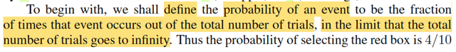</kbd>

<kbd></kbd>

> [!NOTE]
> Tiếp chỗ này gs Bishop thật ra đang định nghĩa xác suất theo trường phái cổ
> điển (Frequentist) khi ông nói ta sẽ define xác suất của một event là tỉ lệ xuất
> hiện của nó khi lặp lại vô hạn lần thử nghiệm. (nếu là trường phái Bayesian,
> xác suất của event sẽ phản ánh độ tin tưởng rằng event sẽ xảy ra)
>
>
>
> Và vì lúc nãy ta nói cho rằng thử nghiệm vô số lần thì 40% trong số đó sẽ
> chọn hộp đỏ, nên P(B=r) = 0.4, và P(B=b) = 0.6.
>
>
>
> Gs nói, theo định nghĩa, nó sẽ phải là con số trong [0,1]. Dễ hiểu là với cách
> định nghĩa này, thì nó là con số tỉ lệ, nên dĩ nhiên nó phải không âm và ≤ 1.
>
>
>
> mình nhớ, đây thực ra là từ Axiom 1,2 (2 trong 3 tiên đề của xác suất) : xác
> suất của một biến cố P(A) không âm với mọi A ∈ Ω và P(Ω) = 1.
>
>
>
> Câu cuối, gs nói nếu các event loại trừ lẫn nhau (mutually exclusive) và
> chứa mọi possible outcomes thì tổng xác suất sẽ = 1. Là sao?
>
>
>
> À thì đây chính là nói khi đó (B = r) và (B = p) sẽ làm thành một partition:
>
>
>
> (B = r) U (B = p) = Ω, (B = r) ∩ (B = b) = ∅ thì khi đó:
>
>
>
> P[(B = r) U (B = p)] = P(Ω) = 1 theo axiom 2.
>
>
>
> mà vế trái, là xác suất của một union của các disjoint event, nên theo axiom
> 3, nó sẽ là tổng xác suất đơn lẻ: 
>
>
>
> P[(B = r) U (B = p)] = P(B = r) + P(B = b)
>
>
>
> Do đó P(B = r) + P(B = b) = 1

 

- **Tiên đề xác suất**

<kbd></kbd>

> [!NOTE]
> Definition 1.2.4 sách Casella
> nêu 3 tiên đề xác suất

 

- **Quy tắc Sum Product Xác suất**

<kbd></kbd>

> [!NOTE]
> Đoạn này tác giả đặt câu hỏi, làm sao ta có thể tính được xác suất của việc
> bốc được một trái táo. Hoặc một câu hỏi khác là nếu đã chọn trái cam thì xác
> xuất ta đã chọn hộp xanh là bao nhiêu.
>
>
>
> Thì ông cho rằng, hai cái rule quan trọng của xác suất là sum rule và product
> rule sẽ giúp ta trả lời hai câu hỏi này

 

- **Quy tắc xác suất cơ bản**

<kbd></kbd>

<kbd>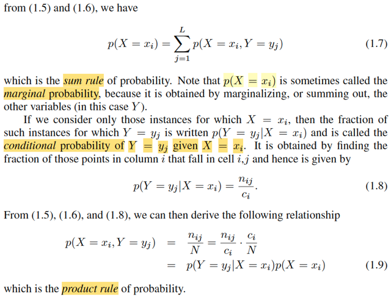</kbd>

<kbd>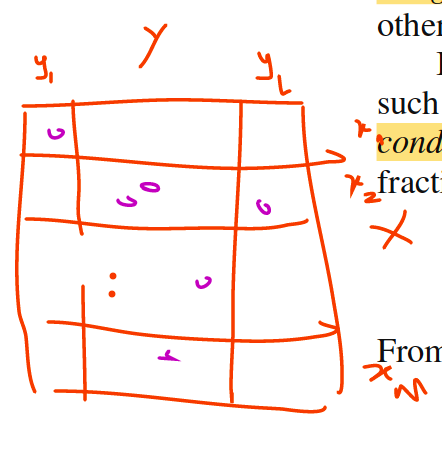</kbd>

> [!NOTE]
> Đại ý là ông dùng ví dụ này để ta hiểu về sum rule và product rule: Cho X, Y là hai rvs
> với possible values là x1,....xM, và y1,...yL. Thực hiện thử nghiệm nào đó để có hai gía
> trị cụ thể của X, Y, và làm vậy N lần. (Có thể hình dung ném N viên bi vào một cái bảng
> có L cột và M hàng. Bi rơi vào ô ij, thì tức là X = xi, Y = yj).
>
>
>
> Trong đó gọi ci là số bi rơi vào hàng i (X = xi) (ví dụ c2 là số lần X ra bằng x2),  rj là số bi
> rơi vào cột j (số lần Y = yj) Và nij là số viên bi rơi vào hàng i, cột j (X = xi, Y = yj)
>
>
>
> Thế thì câu hỏi như hồi nãy đặt ra là ta muốn tính xác suất mà khơi khơi bốc được trái
> táo (ko biết bốc hộp nào), cũng chính là muốn tính P(B = a)
>
>
>
> Thì ở đây, nó tương ứng với việc ta đặt câu hỏi tính xác suất X = xi.
>
>
>
> Thế thì trong sách, gs Bishop dùng lập luận theo kiểu này, nhưng trước tiên mình có thể
> lập luận theo lối đã học trong Casella
>
>
>
> Về mặt bản chất như đã học trong Casella + Stat110:
>
>
>
> P(X = xi) = P({s ∈ Ω: X(s) = xi}), ý nghĩa tổng xác suất các biến cố (possible outcome)
> trong không gian mẫu mà map với X ra xi.
>
>
>
> Giờ xét cái tập {s ∈ Ω: X(s) = xi},
>
>
>
> Dĩ nhiên nó là tập con của Ω: {s ∈ Ω: X(s) = xi} ⊂ Ω
>
>
>
> Theo lí thuyết tập hợp: nếu A ⊂ B ⇨ A ∩ B = A
>
>
>
> ⇨ {s ∈ Ω: X(s) = xi} = {s ∈ Ω: X(s) = xi} ∩ Ω
>
>
>
> Thể hiện Ω = U{mọi possible value yj} {s ∈ Ω: Y(s) = yj}
>
>
>
> ⇨ {s ∈ Ω: X(s) = xi} ∩ Ω = {s ∈ Ω: X(s) = xi} ∩ [U{mọi possible value yj} {s ∈ Ω: Y(s) = yj}]
>
>
>
> Dùng distributive law: A ∩ (B U C) = (A ∩ B) U (A ∩ C):
>
>
>
> .. = U{mọi possible value yj} [{s ∈ Ω: X(s) = xi} ∩ {s ∈ Ω: Y(s) = yj}]
>
>
>
> = U{mọi possible value yj} {s ∈ Ω: X(s) = xi, Y(s) = yj}
>
>
>
> Viết lại {s ∈ Ω: X(s) = xi} = U{mọi possible value yj} {s ∈ Ω: X(s) = xi, Y(s) = yj}
>
>
>
> ⇨ P[{s ∈ Ω: X(s) = xi}] = P{U{mọi possible value yj} {s ∈ Ω: X(s) = xi, Y(s) = yj}]
>
>
>
> Vế phải, là xác suất của union của các disjoint events, nên theo Axiom 3:
>
>
>
> = Σ_{mọi possible value yj} P({s ∈ Ω: X(s) = xi, Y(s) = yj})
>
>
>
> Viết lại P[{s ∈ Ω: X(s) = xi}] = Σ_{mọi possible value yj} P({s ∈ Ω: X(s) = xi, Y(s) = yj})
>
>
>
> Và cái này chính là:
>
>
>
> P(X = xi) = Σj=1:L P(X = xi, Y = yj), là sum rule, hoặc gọi là marginalize joint pmf trên mọi
> possible value của Y, cũng là lí do ta P(X = xi) gọi là marginal distribution của X
>
>
>
> ====
>
>
>
> Còn trong sách gs Bishop đại khái là giải thích theo một cái kiểu rất thực nghiệm:
>
>
>
> Là nếu gọi nij là số viên bi (trong N viên bi) rơi vào ô X=xi, Y=yj, thì P(X=xi,Y=yj) = nij / N
> với điều kiện ta **phải ngầm hiểu là N → inf**.
>
>
>
> Rồi, tương tự ci là số viên bi rơi vào ô X=xi, thì P(X=xi) = ci / N (cũng ngầm hiểu N →
> inf)
>
>
>
> thì ci = Σj nij ⇨ P(X=xi) = ci / N = Σj nij / N = Σj P(X=xi, Y=yj)
>
>
>
> ⇨ P(X=xi) = Σj P(X=xi, Y=yj)
>
>
>
> Và ông nói cái này chính là sum rule của xác suất. (còn mình thì nhìn nó theo góc nhìn
> của stat110, Casella, để nói nó chính là **marginalizing joint distribution của X, Y để có
> marginal distribution  của X**)
>
>
>
> Tương tự, với P(X = xi, Y = yj) thì nó sẽ là nij / N (N → inf), và = (nij / ci) (ci / N)
>
>
>
> Thì nij / ci là: số bi rơi vào hàng i cột j trong tổng số bi rơi vào hàng i. Và ông cho rằng
> nó chính là P(Y = yj | X = xi)
>
>
>
> ⇨ P(X = xi, Y = yj) = P(Y = yj|X = xi)P(X = xi) và gs nói đây là minh họa của product rule.
>
>
>
> Còn mình theo phong cách Casella, Stat110 thì thấy đây chỉ là **định lí rút ra từ định
> nghĩa của conditional probability**: Định nghĩa của conditional probability P(A|B) = P(A,B) / P(B) 
>
>
>
> ⇨ P(A,B) = P(A|B)P(B)
>
>
>
> Nói chung, sách diễn giải này đậm tính trực giác, và chỉ giúp dễ hiểu, chứ ko mang tính
> tổng quát như cách diễn giải theo phong cách Casella

 

- **Quy ước kí hiệu Bishop**

<kbd>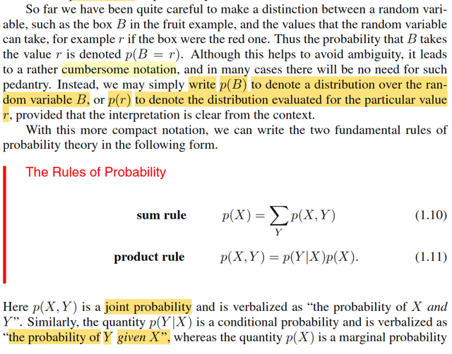</kbd>

<kbd></kbd>

> [!NOTE]
> Gs quy ước một chút về kí hiệu, p(B) sẽ chỉ distribution của B, p(r) sẽ chỉ  giá trị
> xác suất tại B = r.
>
>
>
> Và hai rule của xác suất sẽ thể hiện bởi:
>
>
>
> p(X) = ΣY p(X, Y)
>
>
>
> và p(X, Y) = p(Y|X)p(X)
>
>
>
> Đối chiếu với stat110, Casella:
>
>
>
> Thì đây là fX(x) = Σy fX,Y(x,y), cũng là marginalizing joint pdf/pmf, và cũng là,
> bản chất  chính là LOTP
>
>
>
> Và fX,Y(x,y) = fX|Y(x|y)fX(x)
>
>
>
> Chính là dựa định nghĩa của conditional probability: P(A|B) = P(A,B) / P(B) ⇨
> P(A,B) = P(A|B)P(B), cái này gs Joe Blizstein gọi nó là Conditional probability
> theorem.
>
>
>
> Tóm lại mình nên hiểu: **Chỗ này ông Bishop sẽ không theo lối kí hiệu chặt chẽ
> của toán thống kê.**
>
>
>
> Vì nếu theo đó, phải ghi rõ ra:
>
>
>
> Biến rời rạc:
>
>
>
> P(X=x) = Σy P(X=x, Y=y),
>
>
>
> P(X=x, Y=y) = P(X=x|Y=y)P(Y=y)
>
>
>
> Biến liên tục:
>
>
>
> fX(x) = ∫_range Y fX,Y(x,y)dy
>
>
>
> fX,Y(x,y) = fX|Y(x|y)fY(y)
>
>
>
> Còn ở đây, gs Bishop đặt lại quy định về kí hiệu:
>
>
>
> p(X) sẽ chỉ **HÀM DISTRIBUTION CỦA** X, (pmf hoặc pdf)
>
>
>
> p(x) sẽ là **GÍA TRỊ HÀM PMF/PDF CỦA X TẠI x
>
>
>
> Nếu ko nhớ convention này của gs Bishop thì rất dễ lú sau này**

 

- **Định lý Bayes và Chuẩn hóa**

<kbd>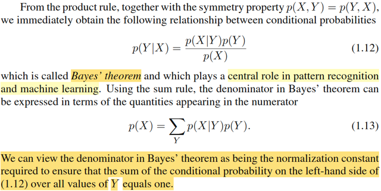</kbd>

> [!NOTE]
> Ở đây nói về Bayes' theorem, stat110 ta đã biết nó chỉ là hệ quả của  định
> nghĩa về conditional probability.
>
>
>
> P(A|B) = P(A,B)/P(B) (định nghĩa conditional probability)
>
>
>
> ⇨ P(A,B) = P(A|B)P(B). Mà P(A,B) = P(B,A) = P(B|A)P(A)
>
>
>
> ⇨ Bayes theorem.
>
>
>
> Nhưng cái ý cuối là quan trọng: nói rằng cái mẫu số có thể coi như normalizing
> constant để đảm bảo tổng xác suất điều kiện = 1.
>
>
>
> Cái này có một case mà mình sẽ thấy hữu ích. Ví dụ như khi xây dựng
> posterior distribution của θ: π(θ|**x**), ta sẽ dùng Bayes theorem:
>
>
>
> π(θ|**x**) = f(**x**|θ) π(θ) / f(**x**)
>
>
>
> Khi ta đã có priori, π(θ), và joint distribution của random sample f(**x**|θ), thì
> mình sẽ cần care f(**x**), mà chỉ cần đối xử với nó như constant nào đó đảm
> bảo rằng khi sum π(θ|**x**) trên range của θ thì nó sẽ ra 1, nói cách khác,
> f(**x**) sẽ là constant nào đó đảm bảo π(θ|x) là một valid pdf/pmf, gọi là
> normalizing constant.
>
>
>
> Dĩ nhiên, ta còn nhớ định nghĩa của likelihood function L(θ|**x**) được định
> nghĩa chính là = f(**x**|θ), tức joint distribution của **X** tại overseved value **x**.

 

- **Mô hình hóa phân phối dữ liệu**

<kbd>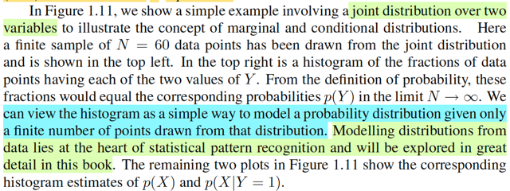</kbd>

<kbd></kbd>

> [!NOTE]
> Gs Bishop cho mình hình ảnh minh họa joint distribution của hai rv X, Y.
>
>
>
> Cũng ko có gì khó hiểu, chỉ lưu ý là: Cái này KHÔNG PHẢI LÀ hình ảnh của marginal distribution của X, Y.
>
>
>
> NÓ CHỈ LÀ GIÚP CHO TA MỘT Ý NIỆM NÀO ĐÓ VỀ DISTRIBUTION CỦA X, Y với N hữu hạn mà thôi, (gọi là **EMPIRICAL DISTRIBUTION**) vì để có distribution của X, Y, ta phải xét số lần thực hiện thử nghiệm N → infinity.
>
>
>
> (Và đây cũng là thứ mình không thấy nói trong Stat110, Casella)
>
>
>
> Để rồi sau đó, gs Bishop nói một ý quan trọng: việc **MÔ HÌNH HÓA DISTRIBUTION TỪ DỮ LIỆU (HỮU HẠN) ĐÓNG VAI TRÒ LÀ TRÁI TIM CỦA PATTERN RECOGNITION**: Câu nói này liên quan trực tiếp đến những gì đã học trong Casella: Ví dụ trong bài toán point estimator, cái ta làm chính là dựa trên giá trị quan sát được của sample **X**, để xây dựng một statistic δ(**X**) làm point estimator cho θ. Nó chính là ý gs Bishop nói ở đây.

 

- **Bài toán xác suất hộp trái cây**

<kbd></kbd>

<kbd></kbd>

<kbd></kbd>

> [!NOTE]
> Đoạn này chỉ là ông quay lại áp mấy cái khái niệm, rule đã giới thiệu vào lại
> hai câu hỏi của bài táon hộp xanh, đỏ, cam táo. Ko có gì khó. Chỉ cần phải
> nhớ là khi nói xác suất của một event ở đây, ta đang ngầm hiểu nhiều thứ:
> Số experiment N → infinity. (đó là lí do mà gs phải nói rõ đề bài là, thực hiện
> nhiều lần thì 40% kết quả ra chọn hộp đỏ, 60% ra chọn hộp xanh).
>
>
>
> Do đó ta mới có quyền nói p(B = r) = 0.4, p(B = b) = 0.6
>
>
>
> Rồi, trong hộp đỏ có 1 táo 3 cam, thì cũng phải ngầm hiểu là vì đã nói khi thò
> tay vào chọn một trái thì việc bốc trúng trái nào là hoàn toàn ngẫu nhiên.
> Nên khi thực hiện vô số lần bốc, sẽ có 25% trong số đó sẽ chọn được táo,
> và 75% còn lại chọn được cam. Chứ ko phải là chỉ vì trong hộp có 4 trái trong
> đó có 1 táo, thì sẽ đồng nghĩa là xác suất bốc được táo khi đã chọn hộp đỏ 
> là 1/4 liền.
>
>
>
> Rồi, khi đó ta sẽ dùng các rule để tính xác suất chọn được táo (marginal)
>
>
>
> cũng như dùng Bayes rule để tính xác suất chọn hộp đỏ khi biết đã bốc ra cam

 

- **Cập nhật niềm tin Bayes**

<kbd></kbd>

> [!NOTE]
> Đoạn này gs cho ta một cách hiểu quan trọng về Bayes theorem: Ta thấy
> p(B=r) = 4/10. Còn p(B=r|F=o) = 2/3.
>
>
>
> Nó phản ánh: Khi chưa có thông tin quan sát được là bốc được quả gì, thì
> niềm tin của việc ta chọn được hộp đỏ chỉ là 0.4, tức là, dựa trên dữ liệu đề
> bài cho nói rằng, khi thực hiện thử nghiệm vô số lần thì xác suất chọn được
> hộp đỏ chỉ là 40%.
>
>
>
> Nhưng một khi biết được ta đã chọn được quả cam, thì con số 2/3 nó phản
> ánh rất đúng một thực tế là: trong hai cái hộp thì hộp đỏ có nhiều cam hơn.
> Do đó, nếu ta biết điều này, và biết rằng đã bốc được cam, thì niềm tin của ta
> vào việc đã chọn được hộp đỏ sẽ tăng lên.
>
>
>
> Từ đó, ta có prior distribution của B chính là P(B) còn P(B|F) gọi là posterior
> distribution.
>
>
>
> Trong casella, như nãy đã nhắc lại, prior distribution của θ là π(θ) và
> posterior distribution của θ là π(θ|**x**)

 

- **Biến cố độc lập, Biến ngẫu nhiên**

<kbd></kbd>

> [!NOTE]
> Cuối cùng là gs nói qua khái niệm independent event và random 
> variable.

 

## 1.2.1&2 Probability densities & Expectations Covariances

 

### Định nghĩa PDF

<kbd></kbd>

> [!NOTE]
> Gs nói về pdf. (ông cũng nhấn mạnh ta sẽ thảo luận những cái này theo
> một cách tương đối không chính thức)
>
>
>
> Cách mà gs Bishop nói về pdf mình thấy giống cách nói của gs Blizstein
> trong Stat110:
>
>
>
> Nhớ lại vài ý trong cách dẫn dắt của Stat110 và Casella về cái này.
>
>
>
> Đại khái là, với biến liên tục, thì xác suất nó mang một giá trị cụ thể nào đó
> là bằng 0. (trong Casella mình đã chứng minh điều này)
>
>
>
> Nên ta sẽ không nói để pmf. Thay vào đó người ta define ra cái gọi là pdf.
> Và mình nhớ, trong Casella, pdf của biến liên tục X được định nghĩa như
> sau:
>
>
>
> là hàm f(x) sao cho: F(x) = ∫-inf:x f(t)dt
>
>
>
> Với định nghĩa này, dùng FTC2 ta sẽ có kết luận cdf F(x) là nguyên hàm
> của pdf f(x): Đó là nó nói rằng, nếu hàm G(x) được định nghĩa là ∫-inf:x f(t)dt
> thì G là nguyên hàm của f: d/dx G(x) = f(x).
>
>
>
> Do đó ở đây vì f được định nghĩa như vậy nên F là nguyên hàm của f. Mà
> khi đó theo FTC1, thì ta sẽ có: ∫a:b f(x)dx = F(b) - F(a) = P(X ≤ b) - P(X ≤ a)
> = P(a < X < b) = P(X ∈ (a,b))
>
>
>
> again, ở đây gs Bishop ko tuân theo convention của toán nên ghi x (viết
> thường là rv. p viết thường nốt, hic)

 

#### Tính chất PDF

<kbd></kbd>

> [!NOTE]
> Rồi, gs nói qua hai tính chất mà pdf phải tuân thủ: p(x) ≥ 0 và ∫-inf:inf p(x)dx = 1
>
>
>
> Mình còn nhớ trong sách Casella, đây là định lí 1.6.5 sách Casella

 

##### Định lý biến đổi hàm mật độ

<kbd></kbd>

> [!NOTE]
> Ở đây nói gs Bishop nói về Transformation Theorem
>
>
>
> Nhớ lại trong Stat110, Casella, nếu ta có X ~ fX(x) và Y = g(X) và
> mapping giữa x ∈ range X tới y ∈ range Y là 1-1. Tức là nếu y = g(x) thì
> tồn tại duy nhất x trong range X = ginv(y) trong range X (vẫn cho phép có
> thể có x' khác cũng map với y nhưng x' phải không thuộc range X)
>
>
>
> Khi đó fY(y) = fX(x) |dx/dy| = fX(ginv(y) |d/dy x| = fX(ginv(y)) |d/dy ginv(y)|
>
>
>
> Ở đây gs Bishop đặt hơi ngược lại, rằng x = g(y), nên kết quả ông cho 
> ra như vậy.

 

- **Cực đại PDF và biến đổi**

<kbd></kbd>

> [!NOTE]
> Gs nói, một hệ quả của tính chất này là maximum của pdf có phụ thuộc
> cách chọn biến.
>
>
>
> Ý tác giả là, giá trị x* khiến maximize pdf fX(x) thì y = g(x*) CHƯA CHẮC
> ĐÃ là maximizer của fY(y).
>
>
>
> Thử chứng minh xem:
>
>
>
> Nếu x* là maximizer của f(x): thì theo calculus: f'X(x*) = 0 và f''X(x*) < 0
>
>
>
> Ta có fY(y) = fX(x) |d/dy ginv(y)|
>
>
>
> Đặt ginv là h cho gọn: fY(y) =  fX(x) |h'(y)| = fX(h(y)) |h'(y)|
>
>
>
> Vậy cần chứng minh là fY'(g(x*)) khác 0.
>
>
>
> fY'(y) = d/dy fY(y) = d/dy fX(h(y)) |h'(y)|
>
>
>
> = [d/dy fX(h(y))] |h'(y)| + fX(h(y)) d/dy |h'(y)| (product rule)
>
>
>
> = [d/dh(y) fX(h(y)) . d/dy h(y)] |h'(y)| + fX(h(y)) d/dy |h'(y)|  (chain rule)
>
>
>
> = [fX'(h(y)) . d/dy h(y)] |h'(y)| + fX(h(y)) d/dy |h'(y)|
>
>
>
> = fX'(h(y)) . h'(y) |h'(y)| + fX(h(y)) d/dy |h'(y)|
>
>
>
> Thay g(x*) vào:
>
>
>
> fY'(g(x*)) = fX'(h(g(x*))) . h'(g(x*)) |h'(g(x*))| + fX(h(g(x*))) d/dy |h'(g(x*))|
>
>
>
> = fX'(x*)) . h'(g(x*)) |h'(g(x*))| + fX(x*)) d/dy |h'(g(x*))|
>
>
>
> = 0 + fX(x*) d/dy |h'(g(x*))| (Do f'X(x*) = 0)
>
>
>
> = fX(x*) d/dy |h'(g(x*))|
>
>
>
> Và fX(x*) thì là maximum value của fX(x),
>
>
>
> Còn d/dy |h'(g(x*))| là d/dy [d/dy ginv(y)] | y = g(x*).
>
>
>
> tức là đạo hàm cấp hai của ginv, evaluate tại y = g(x*)
>
>
>
> Nếu g là hàm phi tuyến thì ginv cũng vậy, nên đạo hàm cấp 1 của nó của
> nó ko phải hằng số (ví dụ hàm đa thức bậc 2 thì đạo hàm là bậc một),  và
> khi đó đạo hàm cấp 2 chắc chắn là khác 0
>
>
>
> (ví dụ nếu ginv(x) = x^2, thì d/dx ginv(x) = 2x, d/dx [d/dx ginv(x)] = 2
>
>
>
> d/dx [d/dx ginv(x)] chỉ bằng 0 khi d/dx ginv(x) = constant, và khi đó ginv(x)
> phải là hàm bậc 1, cũng là g phải là phép biến đổi tuýen tính)
>
>
>
> Như vậy chưa chắc fX(x*) d/dy |h'(g(x*))| đã bằng 0 ⇨ g(x*) chưa chắc đã
> là critical point ⇨ chưa chắc đã là maximizer của fY

 

- **Hàm phân phối tích lũy**

<kbd></kbd>

> [!NOTE]
> Gs lướt qua cdf, như đã biết trong stat110, Casella, cdf của X được kí hiệu FX(x)
> và là hàm định nghĩa bởi FX(x) = P(X ≤ x). Và vì định nghĩa của pdf nên dùng
> FTC ta có F là nguyên hàm của f như lúc nãy đã nói

 

- **Hàm mật độ đồng thời**

<kbd></kbd>

<kbd></kbd>

> [!NOTE]
> Gs tiếp tục lướt qua joint pdf của nhiều random variables X1,...Xn làm thành
> vector **X** = [X1,...Xn] (ở đây là x = [x1,...xn], again, phải hiểu là đang nói
> đến random variable vì mr Bishop đã thoát li khỏi convention kí hiệu của
> toán như trong Casella, Stat110, vốn viết hoa để chỉ rv, viết thường để 
> chỉ possible value của rv)
>
>
>
> Hai tính chất này tương tự của pdf cho single variable, đã chứng minh trong
> sách Casella rồi.
>
>
>
> Ông cũng lướt nhẹ qua pmf
>
>
>
> Mình nghĩ (nếu ko có nền tảng xác suất thông kê từ Stat110, Casella, đọc 
> phần này về cơ bản là chả hiểu gì, vì thực tế thì mr Bishop chỉ lướt qua 
> vài khái niệm)

 

- **Quy tắc tổng tích PDF**

<kbd></kbd>

> [!NOTE]
> Rồi, cuối cùng, gặp lại cái vụ marginalizing joint pdf để có marginal pdf
> cũng như là conditional pdf. Ko có gì mới, đã biết ở Casella, Stat110 rồi

 

- **Kì vọng hàm số**

<kbd></kbd>

> [!NOTE]
> Gs Bishop nói đại ý là một tronng nhưng phép tính quan trọng nhất liên quan
> đến xác suất chính là tính weighted average của một function.
>
>
>
> Với hàm f(x) có xác suất p(x), thì weighted average value của f(x) dưới phân
> phối p(x) được gọi là kì vọng của f(x), kí hiệu E[f]. Tính bởi E[f] = Σx p(x)d(x)
>
>
>
> Nhờ được soi sáng bởi stat110, Casella, mình nhận ra đây chính là LOTUS.
> Nhớ lại kiến thức trong stat110, gs Joe đầu tiên khi nói về kì vọng, ông nói nó
> chỉ là tính trung bình, ví dụ ta có random variable X, giả sử là một discrete rv,
> có các possible value x1,x2,.... Thì E[X], chỉ là weighted average của X: Σi
> αixi với αi là xác suất X mang giá trị possible xi: P(X = xi), cũng là pmf của X
> tại xi.
>
>
>
> E[X] = Σxi xiP(X=xi)
>
>
>
> Với biến liên tục, thì ta có công thức E[X] = ∫-inf:inf xfX(x)dx với fX(x) là pdf
> của X
>
>
>
> Rồi, ông mới nói qua việc, giả sử ta có random variable khác, Y, tạo thành
> bằng cách áp hàm g(.) vào X. Y = g(X), thì khi muốn tính E[Y], tức E[g(X)],
> theo lẽ  thường, ta sẽ phải đi tìm distribution của Y, tức P(Y = y) với discrete
> case, hay fY(y), pdf của Y với continuous case.
>
>
>
> Nhưng nhờ có LOTUS (Law Of Unconscious Statistician) ta có thể chỉ việc áp
> cái hàm g vào trong x của công thức EX, còn lại, cứ dùng pmf/pdf của X:
>
>
>
> EY = E[g(X)] = Σxi g(xi)P(X=xi) (discrete)
>
>
>
> EY = E[g(X)] = ∫-inf:inf g(x)fX(x)dx (continuous)
>
>
>
> Và thể hiện với notation của gs Bishop thì nó chính công thức trong sách
>
>
>
> E[f(x)] = Σx f(x)p(x) hay ∫f(x)pxdx
>
>
>
> Again, phải nhớ trong sách này gs Bishop đã kí hiệu khác.
>
>
>
> x, viết thường, thật ra là random variable, tương ứng với X ở trên
>
>
>
> p(x) chính là pmf (tương ứng với P(X=x) của X) hoặc pdf fX(x) của X ở trên.
>
>
>
> và f() ở đây tương ứng với hàm g() ở trên. Nên phải hiểu thứ tự nếu ghi
> tương  ứng (cho dễ thấy) phải là E[f] = ∫f(x)p(x)dx
>
>
>
> Một điểm nữa, gs Joe trong Stat110 cũng đã nhắc đi nhắc lại, khi áp một
> function lên một rv thì ta được một rv. Nên ở đây nói tính kì vọng của function
> f(x) thì mình tự hiểu nó là tính kì vọng của random variable có được khi áp
> function f lên random variable x

 

- **Xấp xỉ kì vọng**

<kbd></kbd>

<kbd></kbd>

<kbd></kbd>

<kbd></kbd>

> [!NOTE]
> Thế thì gs nói nếu ta có N điểm lấy (sampling, giá trị quan sát được x1,...xN) từ
> distribution,  thì kì vọng E[f] có thể **tính xấp xỉ** bởi:
>
>
>
> E[f] ≈ (1/N) Σn=1:N f(xn)
>
>
>
> Và khi N → inf thì xấp xỉ này trở nên đúng với E[f].
>
>
>
> Thử nghĩ xem vì sao có vụ này:
>
>
>
> Thì cái này chính là dựa trên thứ đã học trong Casella: LLN: Law of Large
> Number theorem, đại khái nói là, nếu ta có random sample X1,...Xn có
> population distribution với mean μ, (dĩ nhiên tức là E[Xi] = μ), thì với vài điều kiện
> cần thiết, sample mean Xbar sẽ converge in probability về μ (Weak LLN) hay
> converges almost surely về μ (Strong LLN)
>
>
>
> lim n→inf P(|Xbar_n - μ| < ε) = 1 ∀ ε > 0 (Weak LLN)
>
>
>
> P(lim n → inf |Xbar_n - μ| < ε) = 1 ∀ ε > 0 (Strong LLN)
>
>
>
> Xbar → μ. tức là, ta đã học Theorem nói rằng:
>
>
>
> Và ý nghĩa là, khi **số lượng sample càng lớn** đến vô hạn thì **Xbar sẽ converge
> về true population mean** của distribution.
>
>
>
> Thì khi n → inf,  Xbar →  θ
>
>
>
> -----
>
>
>
> Quay lại đây, mình có thể hiểu bối cảnh là
>
>
>
> Ta có random sample X1,...XN (và dù gs Bishop ko nói, nhưng mình đoán là ngầm
> hiểu chúng iid), áp hàm f vào ta có các rvs f(X1),...f(XN)
>
>
>
> Cũng làm thành một random sample F1,...Fn, cũng iid: đều mutually independent, và 
> identity distribution: đều ~ theo phân phối của f(Xi), có mean E[Fi] = E[f(Xi)]
>
>
>
> Áp dụng LLN, ta có thể nói
>
>
>
> Khi N → inf, Fbar converge về E[f(X)] , nên Fbar ≈ E[f(X)]
>
>
>
> Viết theo notation gs Bishop: (1/N) Σi=1:N f(xi) ≈ E[f]

 

- **Kì vọng theo một biến**

<kbd></kbd>

> [!NOTE]
> Khúc này gs nói sơ về tính kì vọng của function f(x,y) wrt distribution của x
>
>
>
> E_x[f(x, y)]
>
>
>
> Để cho tiện mình dùng z thay y.
>
>
>
> Thì thật ra cái này ko có gì lạ. Giả sử ta có random variables X và Z, áp cái hàm
> f(x, z) vào X, Z ta có một random variable mới f(X, Z).
>
>
>
> Thế thì, nếu xét trên mỗi giá trị possible value z của Z, thì f(X, z) sẽ cũng là một
> random variable, phụ thuộc X.
>
>
>
> Khi đó, muốn tính kì vọng của f(X, z) thì câu chuyện giống như ta có rv X. và muốn
> tính kì vọng của Y = g(X), LOTUS cho phép ta tính:
>
>
>
> EY = E[g(X)] = ∫g(x)fX(x)dx với fX(x) là pdf của X vậy.
>
>
>
> Thì ở đâu E[f(X,z)] = ∫f(x,z)fX(x)dx
>
>
>
> và khi đã tích phân trên toàn range của X rồi thì kết quả không còn phụ thuộc x
> nữa, chỉ còn phụ thuộc z, nên nó là hàm theo z.
>
>
>
> Và thật ra cái này mình đã gặp hoài trong chap 7 - Point estimator của  Casella:
> MSE của một point estimator của θ, δ(**X**), được định nghĩa là
>
>
>
> MSE(δ, θ) = E_θ[L(δ(**X**), θ)] với L(δ, θ) là squared error loss
>
>
>
> L(δ(**X**), θ) = [δ(**X**) - θ]^2
>
>
>
> ⇨ MSE(δ, θ) = E_θ[[δ(**X**) - θ]^2]
>
>
>
> Và ta phân tích cái này như sau:
>
>
>
> [δ(**X**) - θ]^2, dĩ nhiên là một hàm apply lên sample **X** (và θ), nên nó là  một
> random variable.
>
>
>
> Lấy kì vọng của random variable này, thì theo lotus, ta sẽ tính bởi
>
>
>
> ∫..∫[δ(**x**) - θ]^2 f(**x**|θ)d**x**  với f(**x**|θ) là distribution của sample
>
>
>
> Nên kết quả sẽ là hàm phụ thuộc θ.
>
>
>
> Ở đây mình hiểu kí hiệu E_θ[[δ(**X**) - θ]^2], ý là, nó sẽ là hàm phụ thuộc θ
>
>
>
> Còn trong E_x[f(x,y)] thì mang ý nghĩa là, tính kì vọng wrt distribution của x. Nói
> chung là ý nghĩa nó khác, cần phải tự hiểu.
>
>
>
> Có thể cần nói thêm, khi theo trường phái cổ điển (Frequentist), θ là fixed, nhưng
> unknown thì ta có thể cho là ví dụ trên ko xác đáng lắm, vì mình đang ví dụ hàm
> f(X,Z) với cả X, Z đều là rv.
>
>
>
> Nhưng sự thật thì ta nhớ nếu theo Bayesian, θ làm rv.
>
>
>
> Nên lúc này tính MSE(δ(**X**), θ)) với δ là Bayes estimator thì quả thật cả δ(X) và θ
> đều là rv thì khi đó MSE(δ(**X**), θ)) là ví dụ điển hình của cái mà gs Bishop đang
> nói tới.
>
>
>
> Và MSE có ý nghĩa là: Nếu với L(δ(**X**), θ) ta có loss của estimator trong dựa trên
> observed value **X** = **x**. Thì bằng cách tính trung bình loss trên mọi possible value
> của **X**, ta sẽ không còn phụ thuộc **X** nữa.

 

- **Kỳ vọng có điều kiện: Ước lượng Bayes**

<kbd></kbd>

> [!NOTE]
> Qua cái này.
>
>
>
> E_x[f|y] tức là kì vọng của f(x) wrt distribution của x.
>
>
>
> Liên hệ với Casella, thì mình đã gặp nó ở cái này đây: Bayes estimator.
>
>
>
> Còn nhớ, trong chap 7 Casella, cái estiamator thứ 3 được học chính là
> Bayes estimator. δB(**X**)
>
>
>
> Với lập luận như sau, với Bayesian approach, ta coi θ như quantity of
> randomness (tức là cũng là random variable luôn) và nó có distribution
> khi chưa biết gì hết (chưa quan sát được dữ liệu gì), chỉ dựa vào niềm
> tin ban đầu của experimemter Ta gọi là prior distribution, π(θ).
>
>
>
> Nhưng khi thấy **X** = **x**, dùng Bayes theorem, ta có thể xây dựng
> distribution của θ dựa trên biết **X** = **x**, π(θ|**x**) = f(**x**|θ) π(θ) /
> f(**x**), gọi là posterior distribution.
>
>
>
> Và với distribution này, ta có thể dùng mean hoặc median để đóng vai trò
> là point estimator cho θ.
>
>
>
> Ví dụ khi tính dùng loss là squared error loss, Bayes estimator sẽ là
> E[θ|**x**] với θ ~ π(θ|**x**)
>
>
>
> Khi đó, E[θ|**x**] = ∫θ π(θ|**x**) dθ thì nếu coi θ = f(θ) (identity function)
>
>
>
> thì nó chính là E[f|**x**] = ∫f(θ) π(θ|**x**) dθ = ∫π(θ|**x**) f(θ) dθ
>
>
>
> chính là có dạng của E[f|y] = ∫p(x|y)f(x) đó.

 

- **Định nghĩa Variance**

<kbd></kbd>

> [!NOTE]
> Gs lướt qua variance, ko có gì mới. Nhớ lại lời giảng của gs Joe Blizstein trong
> Stat110, câu chuyện là ban đầu ta muốn một đại lượng để đo tính phân tán
> (dispersion) của phân phối. Thì đầu tiên, ta có thể nghĩ đến việc tính sai khác
> của nó mean giá trị trung bình: X - EX. Và lấy trung bình của cái này, tức
> E[X - EX]. Tuy nhiên làm vậy, theo linearity, ta sẽ ra 0: E[X - EX] = EX - E[EX]
> = EX - EX = 0. Lí do là vì các gía trị đối xứng qua mean sẽ triệt nhau.
>
>
>
> Do đó, ta có thể lấy trị tuyệt đối nhưng có cách hay hơn là bình phương lên.
> Và đó chính là Variance: VarX = E[(X - EX)^2].
>
>
>
> Khai triển ra ta sẽ có công thức thứ hai:
>
>
>
> VarX = E[(X - EX)^2] = E[X^2 -2XEX + (EX)^2] 
>
>
>
> = EX^2 -E[2XEX] + E[(EX)^2]
>
>
>
> = EX^2 -2EXE[X] + (EX)^2 | EX là constant, dùng linearity E[cX] = cEX
>
>
>
> = EX^2 -2(EX)^2 + (EX)^2
>
>
>
> = EX^2 - (EX)^2
>
>
>
> Thì ở đây gs Bishop nói về Var[f(x)] thì cũng coi như ta đang tính variance
> của random variable F, F = f(X) thôi. Nói chung ko có gì

 

- **Covariance và biến độc lập**

<kbd></kbd>

> [!NOTE]
> Lướt qua khái niệm covariance, như còn nhớ, Cov(X,Y) = E[(X - EX)(Y - EY)]
>
>
>
> khai triển ra
>
>
>
> = E[XY - (EX)Y - XEY + EXEY]
>
>
>
> = E[XY] - E[(EX)Y] - E[XEY] + E[EXEY]
>
>
>
> = E[XY] - EXEY - EYE[X] + EXEY
>
>
>
> = E[XY] - EXEY
>
>
>
> Chính là công thức 1.41
>
>
>
> Khi X, Y độc lập thì E[XY] = EXEY, nên Cov(X,Y) = EXEY - EXEY = 0.
>
>
>
> (Chính là ý "covariance vanishes" theo gs Bishop)
>
>
>
> Thử chứng minh lại điều này:
>
>
>
> E[XY], là E[Z] với Z = g(X,Y) = XY
>
>
>
> Theo 2D LOTUS, E[Z] = ∫g(x,y)f(x,y)dxdy (f(x,y) là joint pdf của X,Y)
>
>
>
> Vì X, Y độc lập, nên joint pdf = tích marginal pdf: f(x,y) = fX(x) fY(y) (fX(x) và
> fY(y) là marginal pdf của X, Y)
>
>
>
> ⇨ E[Z] = ∫∫g(x,y)fX(x)fY(y)dxdy
>
>
>
> ∫∫xyfX(x)fY(y)dxdy
>
>
>
> Tính tích phân theo x trước, coi y, f(y) như constant, đưa ra ngoài tích phân
>
>
>
> = ∫yfY(y)[∫xfX(x)dx]dy
>
>
>
> Xét tích phân theo y, thì nguyên cái cục [∫xfX(x)dx] như constant, đưa ra ngoài
> tích phân
>
>
>
> = [∫xfX(x)dx] ∫yfY(y)dy
>
>
>
> = ∫xfX(x)dx ∫yfY(y)dy
>
>
>
> Và đây chính là EX*EY
>
>
>
> -----
>
>
>
> Nói một chút về kí hiệu của gs Bishop khi ghi là E_x,y[...] thì ý giáo sư là  tính
> kì vọng này theo joint pdf/pmf của X, Y (Nhưng thật ra theo kiến thức Stat110,
> mình đương nhiên phải hiểu là ta sẽ dùng joint distribution)

 

- **Ma trận Hiệp Phương Sai**

<kbd></kbd>

> [!NOTE]
> Rồi, gs nhắc đến việc khi **X**, **Y** là random variables vector (chữ thường là biến,
> chữ đậm là vector)(Nếu có ai đọc note này ngoài mình thì sorry các bạn, ở đây, mình cứ dùng
> notation theo chuẩn toán học (như sách Casella, Stat110-Joe Blizstein) (viết hoa với
> biến, viết thường với giá trị của biến, cho đỡ rối, và so nó với công thức trong  sách,
> nơi mr Bishop dùng kí hiệu khác chuẩn như viết x, y thường nhưng vẫn đang ám
> chỉ random variable (trong khi đáng lẽ phải viết hoa)
>
>
>
> Khi đó Cov[**X**, **Y**] = E[(**X** - E**X**)(**Y**T - E[**Y**T])] (T ý là cách ghi
> transpose của mình)
>
>
>
> Cái này thì quả thật trong Casella lẫn Stat110 thật sự chưa từng nói tới. Nhưng có
> thể nó cũng ko có gì khó, vì cơ bản là trong case này, Covariance giữa **X**, **Y**
> sẽ là phản ánh covariance giữa từng random variable Xi (phần tử của **X**) và Yj
> (phần tử của **Y**) thôi.
>
>
>
> Khi **X** là vector, = [X1,...Xn]T, thì E**X** cũng là vector**:** [EX1, EX2, ... EXn]T
>
>
>
> → **X** - E**X** sẽ là vector [X1 - EX1, X2 - EX2, ...Xn - EXn]
>
>
>
> Tương tự, **Y** - E**Y** là vector [Y1 - EY1, ...Yn - EYn]
>
>
>
> → (**X** - E**X**)(**Y**T - E(**Y**T) sẽ là gì?
>
>
>
> chính là [**X** - E**X**)(**Y** - E**Y**)T] và theo MIT 1806 đã biết, nhân vector u với
> vT chính chính là outer product (tích ngoài), kết quả sẽ là một rank 1 matrix.
>
>
>
> Mà mỗi phần tử sẽ là (Xi - EXi)(Yj - EYj)
>
>
>
> Xong, lấy kì vọng của cái này, ta sẽ có Covariance giữa Xi, Yj
>
>
>
> Và matrix đó gọi là Covariance Matrix - Ma trận hiệp phương sai.
>
>
>
> -----
>
>
>
> Cũng dễ thấy nếu tính Covariance của **X** với chính nó: Cov(**X**, **X**) thì phần
> tử trên đường chéo, sẽ chính là E[(Xi - EXi)(Ei - EXi)] = E[(Xi - EXi)^2] chính là
> Var(Xi)
>
>
>
> Và trong sách này, gs Bishop sẽ ghi là Cov(**X**) cho gọn, tự hiểu là Cov(**X**,
> **X**)
>
>
>
> -----
>
>
>
> Biến đổi tương tự, E{[**X** - E**X**)(**Y** - E**Y**)T]}
>
>
>
> = E{[**X** - E**X**)(**Y**T - E(**Y**T)]}
>
>
>
> = E{**XY**T - (E**X**)(**Y**T) - **X**E(**Y**T) + E**X**E(**Y**T)} (nhân phân phối vô)
>
>
>
> = E[**XY**T] - E[(E**X**)(**Y**T)] - E[**X**E(**Y**T)] + E[E**X**E(**Y**T)] (linearity)
>
>
>
> = E[**XY**T] - (E**X**) E[(**Y**T)] - E(**Y**T) E[**X**] + E**X**E(**Y**T) (linearity)
>
>
>
> = E[**XY**T] - (E**X**)E(**Y**T), chính là công thức 1.42

 

## 1.2.3 Bayesian probabilities

 

### Xác suất Bayesian

<kbd>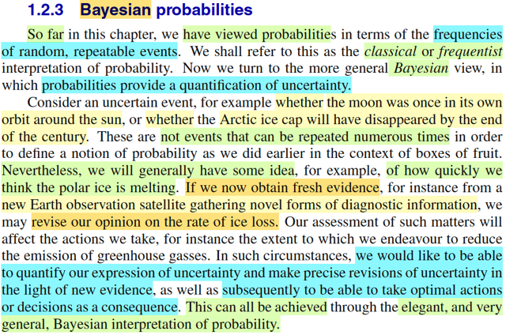</kbd>

> [!NOTE]
> Đại ý là như hồi đầu đến giờ, thông qua mấy cái ví dụ như lấy cam táo từ
> trong  hộp xanh đỏ, ta nhớ và cũng đã nhận định rằng gs đang nhìn xác
> suất theo trường phái cổ điển (frequentist / classical)
>
>
>
> Trường phái này nhìn nhận xác suất của một event theo kiểu TỈ LỆ XUẤT
> HIỆN của event, nếu như ta lặp lại thử nghiệm vô số lần.
>
>
>
> (Trong Casella, ta cũng biết, theo trường phái này, tham số population θ
> của distribution là unknown fixed vs trường phái Bayesian coi nó là random
> variable)
>
>
>
> Trong khi đó, với Bayesian, xác suất của event phản ánh niềm tin mà event
> đó sẽ xảy ra.
>
>
>
> Điều này khiến nó phù hợp với các event kiểu như "băng sẽ tan hết ở hai
> cực cuối thế kỉ này" - vốn dĩ là một event khó mà nghĩ theo kiểu tỉ lệ xảy ra
> khi thực hiện vô số lần của Frequentist (vốn chỉ phù hợp với các event kiểu
> như tung đồng xu ra mặt ngửa)
>
>
>
> Thế thì với Bayesian approach, nó cho ta cách tiếp cận rất hay, đó là, giả
> sử ban đầu ta có một ý niệm nào đó về khả năng event băng tan sẽ xảy ra.
> Ví dụ, ta nghĩ nó khó xảy ra.
>
>
>
> Nhưng sau đó, với quan sát thực nghiệm khoa học, ta phát hiện ra rằng, tốc
> độ băng tan nhanh hơn ta nghĩ. Đó sẽ giống như bằng chứng, giúp ta cập
> nhật lại niềm tin về khả năng xảy ra của event này.
>
>
>
> Và thông qua Bayes rule, ta sẽ làm điều vừa nói (cập nhật lại niềm tin) bằng
> cách tính xác suất của event dựa trên sự kiện quan sát được. Từ đó, có thể
> dựa vào đó để đưa ra những quyết định tối ưu

 

#### Cơ sở xác suất Bayes

<kbd>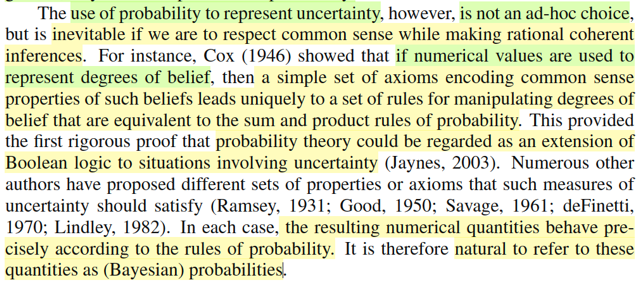</kbd>

> [!NOTE]
> Đoạn này đại ý gs nêu vài luận điểm để biện minh cho việc ta có thể dùng
> xác suất để định lượng tính không chắc chắn của hiện tượng

 

##### Xác suất Frequentist & Bayes

<kbd>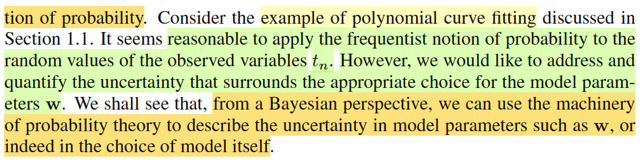</kbd>

<kbd></kbd>

> [!NOTE]
> Đại ý, gs nói trong lĩnh vực pattern recognition, cũng sẽ là có ích nếu ta có
> **góc nhìn khái quát hơn về xác suất** (ám chỉ cần có góc nhìn theo Bayes)
>
>
>
> Ông nói đại ý là, lấy ví dụ của bài toán fitting hàm đa thức bữa trước, 
> thì với các giá trị quan sát tn, thì tính ngẫu nhiên của chúng, ta hoàn toàn
> có lí khi xem xét xác suất của chúng theo góc nhìn Frequentist.
>
>
>
> Nhưng, với tham số của mô hình, hay rộng hơn nữa, là bản thân cái mô
> hình dùng để mô hình hóa bài toán, cũng có tính chất uncertainty, và
> để deal với nó, ta sẽ cần góc nhìn Bayesian.

 

- **Bayes và Ước lượng Tham số**

<kbd>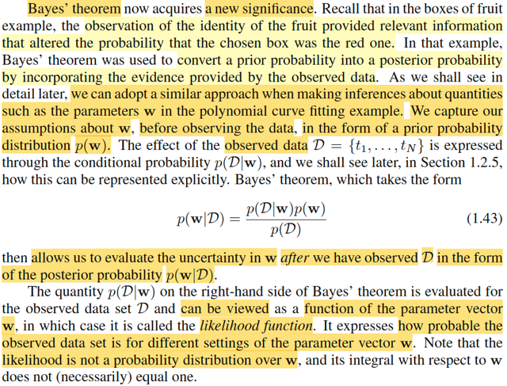</kbd>

> [!NOTE]
> Đoạn này đại ý là gs Bishop nói là, y như trong ví dụ chọn táo chọn cam. Khi
> ta đặt vấn đề, là xác suất ta đã chọn được hộp đỏ là bao nhiêu. Thì nếu 
> chỉ hỏi khơi khơi, ta sẽ trả lời là 40%, vì đề bài cho, khi thực hiện thí nghiệm
> vô số lần, thì 40% trong số đó, ta sẽ chọn được hộp đỏ. Tuy nhiên, nếu 
> như được cung cấp thêm dữ liệu là, cái quả mà ta đã bốc được trong thí
> nghiệm (nhớ ko, thí nghiệm gồm 2 bước: chọn hộp, và bốc quả) là cam, thì
> dựa vào thông tin đó, niềm tin rằng đã chọn được hộp đỏ sẽ tăng lên (cao
> hơn, lên tới 2/3).
>
>
>
> Thế thì, Bayes rule cho phép ta tính toán với hiện tượng này, nó giúp ta 
> định lượng được sự thay đổi niềm tin của event dựa trên quan sát được
> sự kiện.
>
>
>
> Cái này trong Casella mình đã học rồi, và cũng đã nói nó note nào đó trước
> đây.
>
>
>
> Cụ thể là trong chương 7, về point estimator. Bài toán đặt ra là ta quan sát
> được giá trị của sample X1,....Xn iid ~ f(x|θ), và ta muốn inference giá trị
> của θ.
>
>
>
> Đầu tiên, theo định nghĩa chính thức, estimator của θ là "any function of
> sample" W(X), nói cách khác, any statistic đều có thể làm một estimator.
> Nhưng dĩ nhiên là, với cách định nghĩa này, nó quá mơ hồ, từ đó cần đến
> một vài phương pháp tiếp cận để giúp ta tìm được một estimator tốt, và
> trong sách Casella giới thiệu 3 cái: MoM (Method of Moment, MLE Maximum
> Likelihood Estimator, và Bayes estimator)
>
>
>
> Thế thì, nói về cái thứ hai, maximum likelihood estimator:
>
>
>
> Đầu tiên, ta nhớ lại định nghĩa của hàm likelihood, là một hàm của θ, phản
> ánh độ hợp lí của θ, khi quan sát được dữ liệu **X** = **x**, kí hiệu bởiL(θ|**x**), và nó được define bởi: f(**x**|θ), tức là hàm joint pdf/pmf của **X**, evaluate
> tại x.
>
>
>
> Khi đó, maximum likelihood estimator của θsẽ được define như vầy:Ta sẽ giải bài toán: maximize_θ L(θ|**x**), thì minimizer của bài toán này, chính
> là MLE, dĩ nhiên khi maximize L(θ|**x**), ta sẽ được một hàm không còn phụ
> thuộc θ, chỉ còn phụ thuộc **x**.
>
>
>
> Nói cách khác, MLE, θ^_mle(**X**) = argmax_θ L(θ|**X**)
>
>
>
> và theo định nghĩa của likelihood function, L(θ|**x**) = f(**x**|θ)
>
>
>
> ⇨ θ^_mle(**X**) = argmax_θ f(**X**|θ), và vì tính iid của random sample **X**
>
>
>
> = argmax_θ Πi=1:n f(xi|θ) với f(xi|θ) là marginal distribution của sample Xi(và dĩ nhiên là giống như với mọi i, do tính iid)
>
>
>
> Nếu soi chiếu với định nghĩa của estimator - là any function of sample W(**X**),
> thì với MLE, cái function đó chính là W(**x**) = argmax_θ L(θ|**x**)
>
>
>
> -----
>
>
>
> Nói về cái thứ hai, Bayes estimator, thì như đã nói ở note nào đó gần đây
> Ta sẽ coi θ như random variable, có prior distribution π(θ). Dựa vào Bayes
> theorem, ta xây dựng distribution của θ dựa trên việc quan sát **X** = **x**:
>
>
>
> π(θ|**x**) = f(**x**|θ) π(θ) / f(**x**)
>
>
>
> Và mới posterior distribution này của θ, ta sẽ lấy mean hoặc median để
> làm point estimator, đó chính là định nghĩa của Bayes estiamtor:
>
>
>
> θ^_B(**X**) = E[θ|**X**] với θ ~ π(θ|**x**)soi chiếu theo định nghĩa của estimator, thì hàm W(**x**) chính là hàm E[θ|**x**]
> với θ ~ π(θ|**x**)
>
>
>
> Thế thì ở đây, f(**x**|θ), dĩ nhiên là joint distribution của **X**, tại **x** và như trên đã
> thấy nó lại chính là likelihood function L(θ|**x**).
>
>
>
> Nên posterior distribution của θ có thể ghi là π(θ|**x**) = L(θ|**x**) π(θ) / f(**x**)
>
>
>
> -----
>
>
>
> Với hành trang đó của Casella, quay lại đây để xem gs Bishop nói gì. Thì
> chính là ông coi tham số của mô hình polynomial như θ. Và observed value
> **X** = **x** chính là D = {t1,...tn}
>
>
>
> Để rồi, trước khi quan sát / có data D, ta có thể dùng kinh nghiệm để chọn
> distribution của **w**, tức **prior distribution của** **w**, kí hiệu là p(**w**) (tương ứng
> với việc ta dùng kinh nghiệm để chọn π(θ), mà phổ biến có thể là dùng
> Normal hay Unform) cho rằng.
>
>
>
> Sau đó, với giá trị quan sát thấy **X** = **x** (có D), ta sẽ cập nhật lại distribution
> của **w, để có posterior distribution của w**:
>
>
>
> p(**w**|D) = p(D|**w**) p(**w**) / p(D)  (y chang như π(θ|**x**) = f(**x**|θ) π(θ) / f(**x**) ở trên)
>
>
>
> Đây chính là công thức 1.43
>
>
>
> Và vì sự chuẩn bị trên, ta cũng dễ hiểu khi gs Bishop nói, với p(D|**w**), nếu coi
> nó là hàm theo **w**, thì nó chính là likelihood function L(**w**|D) (y như f(**x**|θ) chính
> là L(θ|**x**) vậy)
>
>
>
> Từ đó, có thể thấy dưới ánh sáng Casella, đoạn này của Bishop không có
> gì là khó hiểu.
>
>
>
> Nói thêm, trong Casella, ta cũng biết L(θ|**x**) không phải là / sẽ là sai nếu diễn
> dịch là xác suất của θ given **x**, mà phải là độ hợp lí của θ dựa trên **X** = **x**.
> Bởi vì, dù được định nghĩa = f(**x**|θ), như L(θ|**x**) là hàm theo θ, coi **x** như cố
> định, không mắc mớ gì mà cho phép tự nhiên nó là một pdf. Hàm pdf/pmf
> phải là π(θ|**x**).
>
>
>
> Hoặc như cách để check pdf, là dựa vào tính valid của pdf/pmf, thì chỉ cần
> summarize hàm L(θ|**x**) trên mọi possible value của θ, thì nó không ra 1
> nên nó ko phải là pdf

 

- **Hằng số Chuẩn hóa Định lý Bayes**

<kbd>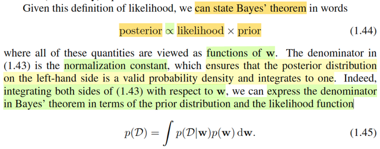</kbd>

> [!NOTE]
> Đoạn này là sao. 
>
>
>
> Quay lại "bối cảnh Casella"
>
>
>
> π(θ|**x**) = f(**x**|θ) π(θ) / f(**x**)
>
>
>
> ⇔ π(θ|**x**) = L(θ|**x**) π(θ) / f(**x**) 
>
>
>
> Thế thì, với **x**, là observed value, vai trò của nó trong các term của đẳng thức 
> trên là fixed. Mà f(**x**), là marginal pdf của **X**, evaluate tại **x**, dĩ nhiên, nó không
> âm (tính valid của pdf)
>
>
>
> nên có thể coi như vế trái = hàm theo θ (L(θ|**x**) π(θ)) chia cho hằng số f(**x**)
> không âm
>
>
>
> ⇨ vế trái sẽ tỉ lệ thuận với L(θ|**x**) π(θ), đó là kí hiệu tỉ lệ thuận xuát hiện ở đây
>
>
>
> Và vì vế trái là π(θ|**x**), là một pdf/pmf hợp lệ nên summarize trên range của θ, 
> ta phải được 1:
>
>
>
> ∫_{range_θ} π(θ|**x**) dθ = 1
>
>
>
> ⇔ ∫_{range_θ} f(**x**|θ) π(θ) / f(**x**) dθ  = 1
>
>
>
> ⇔[ ∫_{range_θ} f(**x**|θ) π(θ) dθ] / f(**x**)  = 1 | Đưa hằng số ra khỏi tích phân
>
>
>
> ⇨ f(**x**) =  ∫_{range_θ} f(**x**|θ) π(θ) dθ]
>
>
>
> Và áp dụng cái này vào "bối cảnh Bishop" chính là công thức 1.45:
>
>
>
> p(D) = ∫p(D|**w**)p(**w**)d**w**

 

- **Nguồn Gốc Bất Định: Frequentist Bayesian**

<kbd>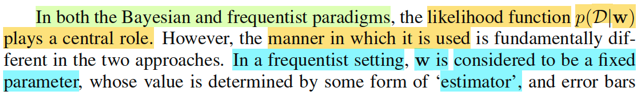</kbd>

<kbd>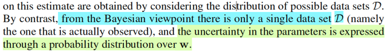</kbd>

> [!NOTE]
> đây có vẻ là một ý mới mà trong Casella mình chưa nghe. Trong Casella, khi
> nói đến Bayesian, mình chỉ nghe gs nói rằng, người ta coi θ như random
> variable, vs với Classic approach coi nó như fixed unknown.
>
>
>
> Còn ở đây, đại ý gs Bishop nói, sự khác biệt của hai trường phái, đó là:
> Trong Frequentist, ta sẽ coi w như fixed, và unknown, nên những sai sót sẽ
> đến từ data set D. Còn với Bayesian, thì lại coi data set là fixed, và w là
> random variables nên những tính uncertainty sẽ đến từ w.
>
>
>
> Để làm rõ ý này, hãy nhớ lại kiến thức đã học ở chap 9 Casella: confidence
> interval.
>
>
>
> Cụ thể là trong chap này, mình cũng đã thảo luận cách tiếp cận của cả hai
> trường phái:
>
>
>
> Với confidence interval (hay interval estimator), còn nhớ, theo định nghĩa, nó
> là bài toán mà ta muốn đưa ra một suy luận (inference) về θ theo kiểu θ ∈
> C(**X**), tức là ước lượng một tập, mà trong phần lớn trường hợp, là một
> interval, có dạng [L(**X**), U(**X**)] mà ta đoán sẽ bao phủ được θ.
>
>
>
> Thế thì, sau đó để đánh giá (evaluate) chất lượng của interval estimator, ta
> mới xây dựng khái niệm coverage probability của một interval estimator,
> được định nghĩa là một hàm theo θ, define bởi P_θ[θ ∈ C(**X**)]
>
>
>
> (Và lấy nhỏ nhất trên toàn param space Θ,  inf_θ ∈ θ P_θ[θ ∈ C(**X**)] ta sẽ
> có confidence coefficient)
>
>
>
> Thế thì, cái chính muốn nói là, trong góc nhìn này, VIỆC TA KHÔNG CHẮC
> C(**X**) sẽ chứa θ (để rồi mới đặt vấn đề thể hiện sự không chắc này bằng
> coverage probability) **ĐẾN TỪ BẢN THÂN TÍNH KHÔNG CHẮC CHẮN
> CỦA** C(**X**).
>
>
>
> Vì bản chất nó là một random set, mà nếu set này là interval, nó sẽ được
> cấu thành bởi hai random variable  / statistic L(**X**) và U(**X**). Và **X** thì
> ~ f(**x**|θ) có distribution phụ thuộc θ, nên L(**X**) và U(**X**) cũng vậy, và
> xác suất này sẽ được tính dựa trên distribution của L(**X**) và U(**X**) → sẽ
> là một hàm phụ thuộc θ
>
>
>
> Và theo góc nhìn xác suất của Frequentist / Classical, thì như đầu sách đến
> giờ gs Bishop đã nói nhiều lần, góc nhìn đó sẽ là: Cho thử nghiệm vô số  lần
> thì TỈ LỆ XẢY RA LÀ BAO NHIÊU. Với góc nhìn này, ta sẽ hiểu theo kiểu:
> LẤY MẪU (SAMPLING) **X** V**Ô SỐ LẦN** THÌ **TỈ LỆ MÀ TA CÓ ĐƯỢC
> KHOẢNG [L(X), U(X)] CHỨA θ TRONG ĐÓ LÀ BAO NHIÊU.
>
>
>
> Đây chính là ý đầu tiên gs Bishop nói trong đoạn này, là error bar, tính không
> chắc chắn sẽ đến từ distribution của data set D**
>
>
>
> Thế rồi, còn nhớ, sau đó, ta được học qua góc nhìn của Bayesian trong
> vấn đề này, như đã nói, coi θ như random variable.
>
>
>
> Thế thì lúc này, nếu quan sát được **X** = **x**, ta sẽ xâu dựng posterior
> distribution của θ: π(θ|**x**). Và với một set, C(**x**), hay interval [L(**x**),
> U(**x**)], thì khi xét xác suất nó chứa / cover θ sẽ mang ý nghĩa khác:
>
>
>
> P_θ[θ ∈ C(**x**)|**x**] lại chính là xác suất của một event gắn với random
> variable θ, dưới phân phối π(θ|**x**). Và dĩ nhiên, do đó, yếu tố ko chắc,
> hoàn tàon đến từ θ, chứ **x** coi như cố định rồi. Và người ta gọi C(**x**) là
> Credible set để phân biệt với Confidence set.
>
>
>
> Thì đây chính là tương ứng ý thứ hai trong đoạn này của gs Bishop

 

- **MLE và Hàm lỗi**

<kbd>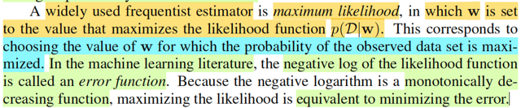</kbd>

> [!NOTE]
> Nhờ ánh sách Casella mà cái này quá dễ hiểu. Và mình cũng đã review lại
> cái này ở note trước. Nói lại ko thừa:
>
>
>
> Cơ bản là trong Casella, hai cái point estimator quan trọng được dạy là:
> Maximum Likelihood estimator, và Bayes estimator.
>
>
>
> Định nghĩa của MLE: θ^_mle(**X**) = argmax_θ L(θ|**X**). Và đây, là estimator
> của trường phái Classical / Frequentist, coi θ như fixed, thì tìm θ khiến
> maximize hàm likelihood L(θ|**x**) mà bản thân hàm này mang ý nghĩa là
> độ hợp lí của θ khi quan sát thấy **X** = **x**. Nói cách ngắn gọn, khi observed
> **X** = **x** thì ML estimate θ^_mle(**x**) là cái giá trị θ mà việc xuất hiện giá trị
> **x** này của **X** là hợp lí nhất.
>
>
>
> Thế thì ở đây, trước tiên phải nhắc lại, **w** là tham số của hàm y(w, **x**) mà 
> giúp sinh ra giá trị quan sát D.
>
>
>
> Do đó **w chính là tương ứng với θ**,
>
>
>
> Để rồi, tương tự như MLE của θ, = argmax_θ L(θ|**x**)
>
>
>
> thì MLE của w = argmax_w L(w|D).
>
>
>
> Và để giải tìm mle của w, ta sẽ giải bài toán tối ưu không ràng buộc:
>
>
>
> maximize L(w|D)
>
>
>
> Nhờ kiến thức đã học trong Boyd, Nocedal, mình biết về vụ equivalient
> problem:
>
>
>
> Ta chuyển bài toán maximize [something] thành minimize [- something]
>
>
>
> → để có bài toán: minimize  - L(w|D)
>
>
>
> Tiếp, kiến thức về equivalent problem còn nói: Nếu ta có hàm monotone
> increasing g(x)
>
>
>
> thì ta có thể chuyển bài toán minimize f(x) thành equivalient problem:
>
>
>
> minimize g(f(x))
>
>
>
> HIểu đơn giản, là vì g monotone increasing, nên nếu f(x1) ≤ f(x2) thì
> g(f(x1)) ≤ g(f(x2)). Nên tìm ra x* minimize g(f(x)) thì cũng chính là nó
> sẽ minimize f(x) 
>
>
>
> Và hàm log là một hàm monotone như vây
>
>
>
> Do đó ta sẽ chuyển sang giải bài toán minimize - log L(w|D), gọi là error
> function, kết quả vẫn sẽ là ML estimator của w.
>
>
>
> Còn vì sao xài hàm log, là vì, như trong CS231n, CS224n đã học, nó 
> sẽ giúp tăng ổn định khi đối mặt với các vấn đề như tràn số trong máy tính.

 

- **Bootstrap và Error Bars**

<kbd>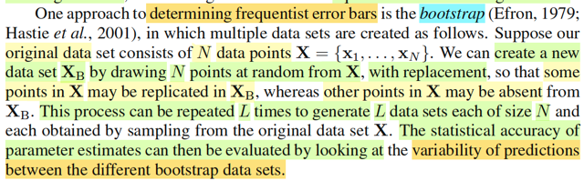</kbd>

> [!NOTE]
> Gs Bishop nói sơ đến khái niệm bootstrap, dùng để tính toán error bars theo
> trường phái frequentist (tính errors bars, tạm hiểu là tính toán chất lượng của
> mô hình)
>
>
>
> Cách làm đại khái là thực hiện sampling with replacement từ bộ data  gốc
> **X** = {x1,....xN} L lần, để có L bộ data **X**B. Và dùng nó để đánh giá  chất
> lượng của parameter estimate bằng cách xem xét sự biến động của
> prediction giữa các bootstrap data set (Sau này gs sẽ nói rõ hơn)

 

- **Ưu điểm Bayesian: Kiến thức tiên nghiệm**

<kbd></kbd>

> [!NOTE]
> Đoạn này là sao.
>
>
>
> À ông nói Bayesian có ưu điểm hơn Frequentist ở chỗ nó "đưa vào / tích
> hợp" nhưng prior knowledge (tạm dịch là những kinh nghiệm, kiến thức có
> sẵn) vào trong mô hình một cách rất tự nhiên (thì bởi đã nói cách tiếp cận
> của nó có  bản chất đã là cập nhật lại niềm tin về khả năng xảy ra của sự
> kiện dựa trên thông tin mới, nhưng ban đầu, đã có cái nền là prior
> distribution - phản ánh niềm tin sẵn có)
>
>
>
> Lấy ví dụ nếu ta tung đồng xu 3 lần mà ra cả 3 head, thì nếu xây dựng ML
> estimator cho θ, thì ta sẽ ra xác suất ra head tiếp là 1, đồng nghĩa dự
> đóan tiếp theo mà tung nữa sẽ luôn ra 1. Trong khi đó điều này rõ ràng là
> ko đúng Thay vào đó nếu xây dưng Bayes estimator thì nó sẽ phản ánh
> prior belief rằng tung đồng xu sẽ chỉ có 50% khả năng ra head thôi, thì kết
> quả nó sẽ khác.
>
>
>
> Thử làm:
>
>
>
> Bối cảnh này, là bài toán ta có **X** = X1, X2, X3 là iid ~ Bern(θ) và x1 =
> x2 = x3 = 1.
>
>
>
> Xây dựng MLE của θ: = argmax_θ L(θ|**x**)
>
>
>
> Theo định nghĩa likelihood function L(θ|**x**) = f(**x**|θ) với f là joint pdf
> của X1, X2, X3
>
>
>
> (pmf của Bern(θ) f(x|θ) = θ^x(1-θ)^(1-x))
>
>
>
> vì tính iid, nó bằng Πi=1:3 f(xi|θ) = Πi=1:3 θ^xi(1-θ)^(1-xi)
>
>
>
> = Πi=1:3 θ^xi Πi=1:3 (1-θ)^(1-xi)
>
>
>
> = θ^Σixi (1-θ)^Σi(1-xi)
>
>
>
> Giải bài toán maximize L(θ|**x**) = f(**x**|θ) = θ^Σixi (1-θ)^Σi(1-xi)
>
>
>
> Như thường lệ, ta sẽ dùng hàm log để chuyển thành equivalent problem:
>
>
>
> maximize log L(θ|**x**) = log [θ^Σixi (1-θ)^Σi(1-xi)]
>
>
>
> = log [θ^Σixi] + log [(1-θ)^Σi(1-xi)]
>
>
>
> = Σixi log θ + Σi(1-xi) log [1-θ], đặt hàm này là g(θ)
>
>
>
> Tới đây, để giải bài toán này, ta dùng calculus thôi, điều kiện cần tối ưu
> bậc nhất:
>
>
>
> g'(θ) = 0
>
>
>
> ⇔ d/dθ [Σixi log θ + Σi(1-xi) log [1-θ]] = 0
>
>
>
> ⇔ d/dθ Σixi log θ + d/dθ Σi(1-xi) log [1-θ]] = 0
>
>
>
> ⇔ Σixi d/dθ log θ + Σi(1-xi) d/dθ log [1-θ] = 0
>
>
>
> ⇔ Σixi (1/θ) + Σi(1-xi) [-1/(1-θ)] = 0
>
>
>
> ⇔ Σixi / θ - (n - Σixi) / (1-θ) = 0
>
>
>
> ⇔ (1-θ) Σixi / θ(1-θ) - θ(n - Σixi) / θ(1-θ) = 0
>
>
>
> ⇔ [(1-θ) Σixi - θ(n - Σixi)] / θ(1-θ) = 0
>
>
>
> ⇔ [Σixi - θΣixi - θn + θΣixi] / θ(1-θ) = 0
>
>
>
> ⇔ [Σixi - θn] / θ(1-θ) = 0
>
>
>
> ⇔ Σixi - θn = 0
>
>
>
> ⇔ Σixi = θn
>
>
>
> ⇔ (Σixi)/n = θ
>
>
>
> Như vậy MLE của θ chính là: sample mean: θ^_mle(**X**) = Xbar
>
>
>
> Và với observed value x1 = x2 = x3 = 1 ⇨ dự đoán (ml esimate) cho θ =
> (1+1+1)/3 = 1
>
>
>
> Như vậy đồng nghĩa, với việc, dựa trên 3 lần tung ra Head, thì MLE dự
> đoán tham số mô hình là 1, có nghĩa là nó dự đoán lần tung tiếp theo
> cũng sẽ ra 1.
>
>
>
> -----
>
>
>
> Giờ ta sẽ đi tính Bayes estimator: θ^B(**X**)
>
>
>
> Như đã ôn lại bữa trước, ta sẽ xây dựng posterior distribution của θ,
> π(θ|**x**) và dùng mean / median để đóng vai trò là point estimator.
>
>
>
> Thế thì lẽ tự nhiên ta phải chỉ định prior distribution π(θ), sau đó mới dùng
> Bayes rule, để tính posterior:
>
>
>
> π(θ|**x**) = f(**x**|θ) π(θ) / f(**x**)
>
>
>
> Giả sử chọn π(θ) = β(a=1,b=1) cũng chính là uniform(0,1). mang ý nghĩa,
> ban đầu ta ko biết xác suất tung đồng xu ra head là bao nhiêu, nên ta trải
> đều ra từ 0% → 100%.
>
>
>
> Khi đó:
>
>
>
> π(θ|**x**) = [Πi f(xi|θ) [1/B(a, b)] θ^(a-1)(1-θ)^b-1 ] / f(**x**)
>
>
>
> Xét tử số = [θ^Σixi (1-θ)^Σi(1-xi) [1/B(a, b)] θ^(a-1)(1-θ)^b-1
>
>
>
> = [1/B(a, b)] [θ^Σixi θ^(a-1) (1-θ)^Σi(1-xi) (1-θ)^b-1]
>
>
>
> = [1/B(a, b)] [θ^(Σixi+a-1) (1-θ)^[Σi(1-xi)+b-1]
>
>
>
> = [1/B(a, b)] θ^[(Σixi+a)-1] (1-θ)^[(n-Σixi+b)-1]
>
>
>
> ⇨ π(θ|**x**) = [1/f(**x**) B(a, b)] θ^[(Σixi+a)-1] (1-θ)^[(n-Σixi+b)-1]
>
>
>
> Và ta thấy nó có dạng [constant] θ^[(Σixi+a)-1] (1-θ)^[(n-Σixi+b)-1]
>
>
>
> với θ^[(Σixi+a)-1] (1-θ)^[(n-Σixi+b)-1]  chính là kernel của β(Σixi+a,
> n-Σixi+b).
>
>
>
> Nên  [1/f(x) B(a, b)] sẽ đóng vai trò normalizing constant.
>
>
>
> Từ đó kết luận posterior distribution của θ là β(Σixi+a, n-Σixi+b)
>
>
>
> Như vậy prior belief của ta về phân phối của θ, là theo phân phối β với
> tham số a, b thì việc quan sát thấy giá trị của **X**, giúp cập nhật lại tham
> số của β, trở thành Σixi+a và n-Σixi+b
>
>
>
> Thế thì như đã nói, với Bayesian approach, ta sẽ dùng mean hoặc
> median của distribution này để làm point estimator cho θ.
>
>
>
> Cụ thể là, nếu dùng mean. thì đó chính là Bayes estimator giúp minimize
> Bayes risk trong trường hợp loss function dùng squared error loss
>
>
>
> nếu dùng loss funciton là absolute error loss, thì Bayes estimator giúp
> minimize Bayes risk chính là median của posterior.
>
>
>
> Vậy thử lấy mean (Bayes estimator minimize Bayes risk với squared error
> loss):
>
>
>
> còn nhớ công thức mean của β(a,b) là a/a+b
>
>
>
> Kêt quả ta có: mean của β(Σixi+a, n-Σixi+b) = Σixi+a/ [Σixi+a + n-Σixi+b]
>
>
>
> = (3+1) / (3+1+3-3+1) = 0.8
>
>
>
> Như vậy, Bayes estimate cho θ chỉ là 0.8, chứ ko phải 1 như ML estimate.
> Cho thấy tác động của prior belief khiến cho estimate ko trở nên cực
> đoan.
>
>
>
> Đây chính là ý "less extreme conclusion mà gs Bishop nói ở  đoạn này".
>
>
>
> -----
>
>
>
> Nói thêm tí xíu, việc chọn prior là uniform(0,1), cũng là β(1,1) thể hiện
> rằng, ta ko biết gì về θ. Nhưng thật ra nếu phải lấy một con số để đoán
> giá trị của θ khi chưa biết gì này, thì chính là ta lấy mean của nó và nó
> chính là 0.5
>
>
>
> (mean của uniorm(0,1) = 0.5, mean của β(1,1) = 1/(1+1) cũng 0.5)
>
>
>
> Để rồi sau khi quan sát kết quả thí nghiệm, ta dần tin rằng đồng xu này có
> xu hướng ra head nhiều hơn, nên nó trở thành 0.8. Nhưng như đã nói ở
> trên, nó vẫn ko thành 1 một cách cực đoan là do prior ban đầu tin rằng nó
> là 0.5.
>
>
>
> Thế thì thằng Gemini nó chỉ cho mình một ý rất hay, mà sau này có thể sẽ
> gặp, đó là, ta có thể chọn β(a=100, b=100) tức là vẫn bằng nhau, nhưng
> lớn hơn thì khi đó đại khái là nó sẽ phản ánh niềm tin ban đầu rằng, θ = 0.
> 5 một cách mãnh liệt hơn.
>
>
>
> Cụ thể là khi ta tính mean của  β(Σixi+a, n-Σixi+b) với a = b = 100 thì nó
> sẽ là:
>
>
>
> (3+100) / (3+100+3-3+100) = 0.507
>
>
>
> con số này chả thay đổi mấy so với 0.5. Phản ảnh rằng, kết quả thử
> nghiệm ko đủ để lung lay niềm tin ban đầu.
>
>
>
> -----
>
>
>
> Một ý nữa, sở dĩ ta chọn β(1,1) làm prior là vì:
>
>
>
> θ mà ta muốn inference, là tham số của Bern distribution của mỗi Xi
> nhưng xét cả bài toán, thì nó chính là tham số của ΣXi ~ binomial(n, θ)
> với n = 3 đã biết.
>
>
>
> Và β là một distribution có tính là conjugate prior của binomial.
>
>
>
> Do đó nếu chọn β làm prior thì posterior của θ cũng sẽ là β với tham số
> cập nhật.

 

- **Tranh luận Frequentist Bayesian**

<kbd>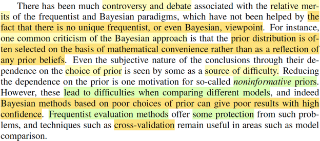</kbd>

> [!NOTE]
> Đoạn tiếp theo gs nói về vài tranh luận giữa hai trường phái xem cái nào
> tốt hơn.
>
>
>
> Frequentist thì chê là Bayesian mang tiếng là chọn prior để phản ánh
> những kinh nghiệm sẵn có thì thật ra lại thường chọn để dễ tính, khiến
> truyền cái thiên kiến sai lệch vào trong quá trình.
>
>
>
> Và việc chọn prior cũng gặp khó khăn, và nó lại rất ảnh hưởng.
>
>
>
> Trong khi đó Frequentest thì có những technique để tránh được tình trạng
> này, như cross-validation

 

- **Tiếp cận Bayesian hiện đại**

<kbd>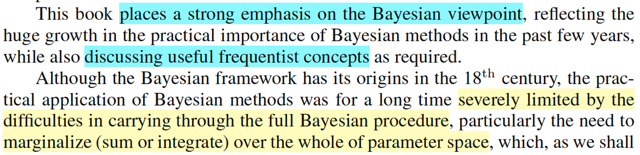</kbd>

<kbd>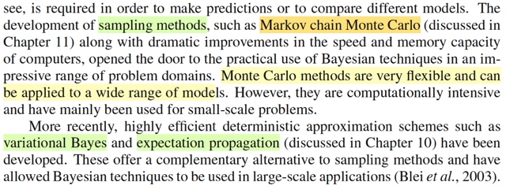</kbd>

> [!NOTE]
> Vài đề cập của tác giả, đến việc sách này sẽ phần lớn là đi theo trường
> phải Bayesian, nhưng vẫn dùng các khái niệm của Frequentist.
>
>
>
> Ông nhắc đến việc sức mạnh tính toán hiện nay cũng như kĩ thuật sampling
> như Monte-Carlo giúp các tiếp cận này được tháo gỡ những rào cản, giúp
> nó phát huy sức mạnh trong nhiều bài toán

 

## 1.2.4 The Gaussian distribution

 

### Phân phối Gaussian

<kbd></kbd>

> [!NOTE]
> Gs nói qua về Gaussian distribution, loại phân phối sẽ rất phổ biến trong sách
> này.
>
>
>
> Cái này thì biết rồi, nhưng đây là cơ hội để nhìn lại những gì đã học trong
> Stat110 và Casella về cái này.
>
>
>
> Trong Stat110, gs Joe Blizstein nói về Normal(0,1) từ standard normal trước,
> có pdf là f(z) = 1/√2π exp[-z^2/2]
>
>
>
> Rồi ông nói công thức này dễ nhớ hơn, để từ đó ta mới dùng location scale
> family để derive công thức pdf của normal(μ, σ). Location scale theorem nói
> rằng: nếu ta có X ~ f(x) là pdf thuộc location scale family, ứng với location μ,
> scale σ thì Z = (X - μ) / σ sẽ là random variable có pdf thuộc family ứng với
> location 0, scale = 1 gọi là standard member. Ngược lại nếu Z là rv ~ pdf
> standard member thì σZ + μ  sẽ là thành viên ứng với location μ, scale σ
>
>
>
> Và normal là loại của một location scale family, với location trùng với mean, và
> scale trùng với standard deviation.
>
>
>
> Nên ở đây ta có f(z) là standard member thì X = σZ + μ sẽ là thành viên có
> location μ, scale σ
>
>
>
> Dùng transformation theorem ta derive pdf của X = σZ + μ như sau:
>
>
>
> với x = g(z) = σz + u ⇨ z = ginv(x) = (x - μ) / σ
>
>
>
> fX(x) = fZ(z) |dz/dx|
>
>
>
> fZ(ginv(x)) |d/dx ginv(x)|
>
>
>
> = 1/√2π exp[-[(x-μ)/σ]^2/2] . (1/σ)
>
>
>
> = 1/√2π exp[-(x-μ)^2/2σ^2] . (1/σ)
>
>
>
> = 1/σ√2π exp[-(x-μ)^2/2σ^2]
>
>
>
> Và đây là pdf của X, là thành viên trong họ location scale, ứng với location μ,
> scale σ, Mà như đã nói, với Normal thì location cũng là mean, scale cũng là
> standard deviation. Do đó, đây chính là pdf của normal(μ, σ).
>
>
>
> Ở đây có thể có điểm mà có thể Casella đã nói nhưng ít để ý, 1/σ^2 gọi là
> precision.

 

#### Kì vọng Phân phối Chuẩn

<kbd></kbd>

> [!NOTE]
> Dĩ nhiên nó là một valid pdf nên nó phải thỏa hai tính chất, sum trên toàn miền
> phải  = 1 và không âm.
>
>
>
> Và mr Bishop để cập đến mean của distribution là μ.
>
>
>
> Còn ở đây, dĩ nhiên để tính mean, tức EX với X ~ normal(μ, σ) có pdf như vậy, thì
> ta sẽ theo định nghĩa của kì vọng mà tính: ∫x f(x)dx
>
>
>
> Để cho dễ ta có thể tính EZ (Z ~ normal(0,1)) trước:
>
>
>
> EZ = ∫-inf:inf zfZ(z)dz = ∫-inf:inf z (1/√2π) e^-z^2/2 dz
>
>
>
> = (1/√2π)∫-inf:inf z e^-z^2/2 dz
>
>
>
> = (1/√2π) [nguyên hàm của z e^-z^2/2] | -inf:inf
>
>
>
> nguyên hàm của z e^-z^2/2 chính là -e^-z^2/2, 
>
>
>
> vì d/dz (-e^-z^2/2) = - d(-z^2/2) e^-z^2/2 . d/dz -z^2/2 (chain rule)
>
>
>
> = - e^-z^2/2  (-z)
>
>
>
> = z e^-z^2/2
>
>
>
> = (1/√2π) [e^-z^2/2] | -inf:inf
>
>
>
> z → -inf → -z^2/2 → -inf → [e^-z^2/2] → 0
>
>
>
> z → inf → -z^2/2 → -inf → [e^-z^2/2] → 0
>
>
>
> → kết quả tích phân = 0.
>
>
>
> Cách nhanh hơn là nhận xét hàm k(z) = zfZ(z) là hàm lẻ, vì:
>
>
>
> k(-z) = (-z)fZ(-z) = -z (1/√2π) e^-(-z)^2/2 = -z (1/√2π) e^-z^2/2 = -k(z)
>
>
>
> Và như vậy thì tích phân từ -inf với inf cũng sẽ = 0.
>
>
>
> Vậy EX = E(σZ + μ), theo tính linearity của kì vọng, = σEZ + μ = 0 + μ = μ 
>
>
>
> Ở đây mình nhắc lại, Normal distribution là một họ distribution thuộc loại location
> scale family, nhưng nó có tính chất đặc biệt là location chính là mean. và scale
> chính là standard deviation. Nói vậy là vì trong Casella ta đã biết, có những
> location scale familly khác thì location chưa chắc đã là mean.

 

##### MGF, moment, phương sai Chuẩn

<kbd></kbd>

> [!NOTE]
> Tiếp, còn nhớ trong stat110 và Casella đã học khái niệm mgf (moment generating
> function) - hàm sinh moment. Với moment được định nghĩa là EX là first moment, EX^2
> là second moment.
>
>
>
> Hàm mgf, được định nghĩa là mX(t) = E[e^tX].
>
>
>
> Thế thì có thể tính second moment bằng cách dùng lotus: ∫x^2fX(x)dx
>
>
>
> Cũng có thể derive công thức mgf của X, để rồi Taylor expansion và lấy hệ số của term
> bậc hai, thì nó cũng chính là second moment.
>
>
>
> Tính theo cách 1: E[X^2] = ∫x^2fX(x)dx (fX(x) là pdf của normal(μ, σ) nếu muốn ghi rườm
> ra thì ghi là f(x|μ, σ) như trong sách này gs Bishop kí hiệu là chữ N hoa luôn)
>
>
>
> = ∫x^2 (1/σ√2π) exp[-(x-μ)^2/2σ^2] dx
>
>
>
> = (1/σ√2π) ∫x^2 exp[-(x-μ)^2/2σ^2] dx
>
>
>
> Để tính cái này cần dùng kĩ thuật integration by part
>
>
>
> Để nhớ lại coi, mình nhớ "story" của cái kĩ thuật này vốn chỉ là bắt nguồn từ product rule
> của gỉai tích:
>
>
>
> d(uv) = udv + vdu ⇨ udv = d(uv) - vdu
>
>
>
> ⇨ ∫udv = ∫d(uv) - ∫vdu
>
>
>
> Ta đã giải cái này trong stat110, Casella rồi, ko viết lại nữa.
>
>
>
> Còn làm theo cách kia, thì mgf của X là exp[μt + (1/2)σ^2t^2]
>
>
>
> Lấy đạo hàm bậc 1 (cũng chính là expand Taylor và lấy hệ số gắn với term bậc 1)
> evaluate tại t = 0 thì ta có fisrt moment (EX)
>
>
>
> d/dt [exp[μt + (1/2)σ^2t^2]]
>
>
>
> = d/d[μt + (1/2)σ^2t^2] exp[μt + (1/2)σ^2t^2] . d/dt [μt + (1/2)σ^2t^2]
>
>
>
> = exp[μt + (1/2)σ^2t^2] . (μ + σ^2t)
>
>
>
> ⇨ d/dt [exp[μt + (1/2)σ^2t^2]] | t = 0 =  exp[0] . (μ) = μ
>
>
>
> Lấy đạo hàm bậc 2, evaluate tại t = 0 ta sẽ có second moment, EX^2:
>
>
>
> d/dt [đạo hàm bậc nhất] = d/dt [exp[μt + (1/2)σ^2t^2] . (μ + σ^2t)]
>
>
>
> = { d/dt exp[μt + (1/2)σ^2t^2] } (μ + σ^2t)] + [exp[μt + (1/2)σ^2t^2]  d/dt  (μ + σ^2t)] |
> product rule
>
>
>
> = { đạo hàm bậc nhất } (μ + σ^2t)] + [exp[μt + (1/2)σ^2t^2]  σ^2]
>
>
>
> ⇨ [đạo hàm bậc 2] | t = 0 = { đạo hàm bậc nhất | t=0} (μ)] + [exp[0]  σ^2]
>
>
>
> = [μ (μ)] + [exp[0]  σ^2]
>
>
>
> = μ^2 + σ^2 → như trong sách
>
>
>
> Và dùng công thức thứ hai của Variance: VarX = EX^2 - (EX)^2 = μ^2 + σ^2 - μ^2 = σ^2.
>
>
>
> ====
>
>
>
> Cái ý mà gs Bishop nói rằng với Normal thì mode trùng với mean là một ý mới mà mình
> chưa nghe trong Casella

 

- **PDF Gaussian Đa Biến**

<kbd></kbd>

> [!NOTE]
> Sự thật thì mình nhớ cả Stat110 và Casella đều chưa từng nói về công thức này.
>
>
>
> Nhưng có thể xây dựng công thức của trường hợp iid standard normal trước, tức là joint pdf của iid Zi \~n(0,1) Khi đó **Z** sẽ có mean E**Z** = **0** và covariance matrix Cov(**Z**) = **I**.
>
>
>
> Từ đó, đổi biến **X** = A**Z** + **μ** để E**X** = μ và covariance matrix Cov(**X**) = Σ
>
>
>
> Đầu tiên xây dựng joint pdf của **Z**:
>
>
>
> f(z1,...zn) = Πi f(zi) (do tính iid) = Πi (1/√2π) exp\[-zi^2/2\]
>
>
>
> = \[(2π)^-n/2\] Πi exp\[-zi^2/2\]
>
>
>
> = \[(2π)^-n/2\] exp\[-Σizi^2/2\]
>
>
>
> Thể hiện dưới dạng vector: Σizi^2 = **z**T**z**
>
>
>
> .. = \[(2π)^-n/2\] exp\[-**z**T**z**/2\]
>
>
>
> Thế thì, tất nhiên E**Z** = \[EZ1, EZ2,...EZd\] = \[0, ...0\] = **0** Bữa trước đã nói covariance của hai random variable vector **X**, **Y** sẽ là một matrix: Cov(**X**, **Y**) = E\[(**X** - E**X**)(**Y** - E**Y**)T\], để rồi phần tử hàng i cột j: ij sẽ là E\[(Xi - EXi)(Yj - EYj)\] chính là Cov(Xi, Yj)
>
>
>
> ⇨ Cov(**Z**, **Z**), có thể viết tắt là Cov(**Z**), = E\[(**Z** - E**Z**)(**Z** - E**Z**)T\]
>
>
>
> = E\[**ZZ**T\] (kì vọng của **Z** outer product với **Z**)
>
>
>
> Và matrix này sẽ có phần tử thứ ij là Cov(Zi, Zj). Và phần tử trên đường chéo ii chính là Var(Zi) (Cov(Zi, Zi) chính là Var(Zi))
>
>
>
> Vấn đề là Zi, Zj độc lập, do ta đang xét iid Zi: Nhớ lại định nghĩa iid đã học trong Stat110 và Casella: Random sample of size n X1,....Xn \~ f(x|θ) được định nghĩa là: Ta thực hiện quan sát một đại lượng ngẫu nhiên nào đó, n lần Mỗi lần giá trị của nó sẽ được đại diện bằng random variables Xi. Và cách thực hiện đảm bảo sao cho các rvs Xi MUTUALLY INDEPENDENT, và chúng đều có chung population distribution f(x|θ), gọi là IDENTICALLY DISTRIBUTED.
>
>
>
> Và đã biết nếu X, Y độc lập thì E(XY) = EXEY ⇨ Cov(X, Y) = 0. Vậy Cov(Zi, Zj) = 0 ∀ i ≠ j.
>
>
>
> Còn Var(Zi) thì vì Zi \~ n(0,1), nên nó bằng 1.
>
>
>
> Do đó Cov(**Z**,**Z**) CHÍNH LÀ IDENTITY MATRIX.
>
>
>
> Rồi, ta sẽ
>
>
>
> Đổi biến **X** = g(**Z**) = **AZ** + **μ** với **Σ = AA**T là covariance matrix mong muốn, **μ** là vector \[μ1, ...,μn\]. Và ta sẽ xây dựng pdf của **X**, mà ta cho rằng nó sẽ chính là pdf của multivariate Normal(**μ**, **Σ**)
>
>
>
> Do đó cần làm rõ hai điểm:
>
>
>
> 1. Đổi biến như vậy, thì **X** có phải là normal không.
>
>
>
> 2. Mean và covariance có phải là **μ** và **Σ** không.
>
>
>
> Trả lời ý 1:
>
>
>
> Điều này đồng nghĩa với việc Xi có phải là normal distribution nữa không.
>
>
>
> Với **X** = **AZ** + **μ**, Xi = \[hàng i của A\]TZ + μi
>
>
>
> = Σj=1:d aij Zi + μi
>
>
>
> tức là một affine combination của Zi (ko phải là linear combination nhé)
>
>
>
> Thế thì hồi Stat110 đã học, nếu X, Y đều là normal rv thì X + Y cũng là normal
>
>
>
> Chứng minh thì cũng dễ thôi, dùng một theorem liên quan MGF: Đó là nếu X, Y độc lập thì với U = X + Y thì ΜU(t) = MX(t)**MY(t). Chứng minh rất dễ:
>
>
>
> Theo định nghĩa, moment generating function mgt của X, kí hiệu là MX(t) được định nghĩa là = E\[e^tX\].
>
>
>
> ⇨ Μ(t) = E\[e^tU\] = E\[e^t(X+Y)\] = E\[e^tX**  e^tY\]
>
>
>
> Và theo 2D LOTUS, ta tính cái này: ∫∫ e^tx e^ty fXY(x,y)dxdy (fXY(.) là joint pdf của X, Y)
>
>
>
> Mà X, Y độc lập thì joint pdf = tích marginal pdf:
>
>
>
> ∫∫ e^tx e^ty fXY(x,y)dxdy = ∫∫ e^tx e^ty fX(x)fY(y)dxdy
>
>
>
> = ∫e^tyfY(y) \[∫e^tx fX(x)dx\] dy | tính tích phân theo x trước coi term liên quan đến y như constant, đưa ra
>
>
>
> = ∫e^tx fX(x)dx ∫e^tyfY(y)dy | tính tích phân theo y thì coi ∫e^tx fX(x)dx như constant, đưa ra
>
>
>
> = Đây chính là E\[e^tX\] E\[e^tY\]
>
>
>
> cũng chính là MX(t)  **MY(t).
>
>
>
> Áp dụng theorem này, nếu X \~ normal(μ1, σ1^2) và Y \~ normal(μ2, σ2^2)
>
>
>
> và với normal μ, σ ta biết mgf có dạng: exp(μt + σ^2t^2/2)
>
>
>
> thì ΜU(t) = MX(t)**  MY(t) = exp(μ1t + σ1^2t^2/2) exp(μ2t + σ2^2t^2/2)
>
>
>
> = exp(μ1t+μ2t + σ1^2t^2/2 + σ2^2t^2/2)
>
>
>
> = exp\[(μ1+μ2)t + \[σ1^2/2 + σ2^2/2\]t^2)
>
>
>
> có dạng một mgf của normal(μ1 + μ2, σ1^2 + σ2^2)
>
>
>
> và như đã biết trong Stat110, hay Casella, MGF, cũng như CDF, PDF, PMF có thể định nghĩa một distribution. Có nghĩa là ta có thể kết luận U = X + U chính là một normal(μ1 + μ2, σ1^2 + σ2^2).
>
>
>
> Vậy thì quay lại đây:
>
>
>
> Đầu tiên phải nói a1i Zi, với việc Zi \~ normal(0,1), tức standard normal, mà như đã biết, normal là một location scale family, với điểm đặc biệt là location trùng với mean, scale cũng chính là standard deviation. Và theo lí thuyết location scale family, thì nếu ta có Z là standard member, tức là pdf có location 0, scale 1, thì σZ + μ sẽ là rv có pdf thuộc family nhưng ứng với location μ, scale σ.
>
>
>
> Vậy ở đây a1iZi chính là thành viên ứng với location 0, scale a1i. Cũng đồng nghĩa, nó là normal(0, a1i^2) với với i = 1,...,d.
>
>
>
> Vậy thì xét a11Z1 + a12Z2, đây là tổng của hai rvs: a11Z1\~ normal(0, a11^2) và a12Z2 \~ normal(0, a12^2)
>
>
>
> Nên theo điều vừa ôn lại, nó chính là rv \~ normal(0+0, a11^2 + a12^2)
>
>
>
> Và lặp lại lập luận này, ta sẽ có Σj a1jZj chính là một normal(0, Σj a1j^2), tức là variance của rv này là tổng các phần từ hàng 1 của A.
>
>
>
> Tiếp, ta, theo location scale cũng dễ thấy Σj a1jZj + μ1 cũng là một normal(μ1, Σj a1j^2)
>
>
>
> Vậy X1 là normal(μ1, Σj a1j^2), ..
>
>
>
> Xi \~ normal(μi, Σj aij^2)
>
>
>
> Như vậy ta sẽ trả lời ý 2 luôn:
>
>
>
> Với Xi \~ normal(μi, Σj aij) ⇨ E\[**X**\] = \[EX1,...EXd\] = \[μ1, ..μd\] = **μ**.
>
>
>
> Cov(**X**, **X**) = E\[(**X** - E**X**)(**X** - E**X**)T\]
>
>
>
> = E\[(**X** - E**X**)(**X**T - (E**X**)T)\]
>
>
>
> = E\[(A**Z** + **μ** - **μ**)((A**Z** + **μ**)T - **μ**T)\]
>
>
>
> = E\[(A**Z**)(**Z**T**A**T + μT - μT)\]
>
>
>
> = E\[**AZZ**T**A**T\]
>
>
>
> = **A**E\[**ZZ**T\]**A**T (Linearity)
>
>
>
> Xét E\[**ZZ**T\]: Để thấy nó là cái gì, ta xét Cov(**Z**,**Z**) = E\[(**Z**-E**Z**)(**Z**-E**Z**)T\] = E\[(**Z** - **0**)(**Z**T - **0**T\] (**0** là vector zero)
>
>
>
> = E\[**ZZ**T\]. À như vậy,E\[ZZT\] = Cov(**Z,Z**) và như ở trên mình đã biết, nó là Identity matrix: I
>
>
>
> Vậy.. = A I AT = AAT và như đã nói, ta chọn A sao cho Σ (covariance matrix mong muuốn) = AAT
>
>
>
> ⇨ Cov(**X**,**X**) = **Σ**
>
>
>
> =====
>
>
>
> Tới đây ta đã chứng minh xong **X** sẽ là normal(**μ**, **Σ**). Việc bây giờ là xây dựng pdf của X
>
>
>
> Tất nhiên là ko thể tích các marginal pdf của Xi được, vì Xi KHÔNG ĐỘC LẬP, COVARIANCE MATRIX KO PHẢI LÀ DIAGONAL MATRIX (các term ngoài đường chéo, là covariance các Xi, Xj)
>
>
>
> Ta sẽ dùng công cụ transformation:Thế thì, đã học trong Casella, nếu ta có random vector (vector of random variable) \[X,Y\] và thông qua một phép biến đổi để có \[U,V\] = \[g1(X,Y), g2(X,Y)\]
>
>
>
> Sao cho mapping giữa (X,Y) ∈ support set của \[X,Y\] và (U,V) là 1-1.
>
>
>
> (support set của X còn nhớ, đại khái là subset của range X sao cho tại đó / trên đó pdf/pmf của X dương, vậy thì support set của random vector \[X, Y\], là subset của R^2, sao cho trên đó joint pdf fX,Y(x,y) dương)
>
>
>
> Có nghĩa là, với U,V ∈ support set của \[U,V\] ta có thể tìm được (X, Y) = \[h1(U,V), h2(U,V)\] thuộc support set của random vector \[X,Y\])
>
>
>
> Thì khi đó ta có transformation theorem cho phép tính joint pdf của U,V từ joint pdf của X,Y:
>
>
>
> fU,V(u,v) = fX,Y(x,y) |J|
>
>
>
> = fX,Y(h1(u,v), h2(u,v)) |∂(x,y) /∂(u,v)|
>
>
>
> Như đã biết từ MIT 18.02, kí hiệu này ∂(x,y) /∂(u,v) nhằm chỉ Jacobian matrix, mà hàng 1 sẽ là ∂x/∂u, ∂x/∂v hàng 2 sẽ là ∂y/∂u, ∂y/∂v.
>
>
>
> Thế thì giả sử \[U,V\]T = A \[X,Y\]T + μ (tức là cũng là một affine transformation)
>
>
>
> Ôn lại kiến thức giải tích nếu ta có f(x) = Ax + b là R^n → R^m function ⇨ ∇f(x), cũng là Jacobian.
>
>
>
> Theo MIT 18s096, ta có thể tính ∇f(x) như sau: df = f(x + dx) - f(x) = Ax + Adx + b - Ax - b = Adx linear operation act on dx, Và bản chất của đạo hàm bậc nhất là một linear operation act on dx : f'(x)\[dx\] Từ đó suy ra matrix Jacobian chính là A.
>
>
>
> Nếu A invertible, ta có quan hệ ngược lại: x = Ainv(f - b) = Ainvf - Ainvb
>
>
>
> Và khi đó ∇x(f), là Jacobian của phép biến đởi f → x chính là Ainv.
>
>
>
> Vậy thì quay lại đây nếu gọi vector **f** = \[u,v\]T và **x** = (x,y) thì Jacobian ∂(x,y) / ∂(u,v) chính là Ainv.
>
>
>
> Và cái ta cần là determinant của nó: |det A|
>
>
>
> Và ta cũng đã biết trong MIT 1806: det Ainv = 1/ det A. Chứng minh rất dễ: AAinv = Ainv A = I ⇨ det(AAinv) = det I = 1 (tính chất đầu tiên của det thầy Strang dạy trong bài định thức chính là det I = 1)
>
>
>
> Rồi det(AB) = det A det B ⇨ det (AAinv) = det A det Ainv = 1 ⇨ det Ainv = 1 / det A
>
>
>
> Vậy cái cần |∂(x,y) /∂(u,v)|, chính là 1 / |det A|
>
>
>
> ====
>
>
>
> Tiếp tục: fU,V(u,v) = fX,Y(x,y) |J|
>
>
>
> Công thức này (bivariate case) cũng sẽ khát quát lên cho multivariate case.
>
>
>
> Nên áp dụng nó, với random vector X = A Z + μ
>
>
>
> fX(x) = fZ(z) |J|
>
>
>
> Và ta đã hiểu |J| cũng chính là 1/ |det A|
>
>
>
> Thay fZ(z) vô: = \[(2π)^-d/2\] exp\[-**z**T**z**/2\]
>
>
>
> Với **x** = A**z** + **μ** ⇨ z = Ainv**x** - Ainv**μ**
>
>
>
> ⇨ **z**T**z** = (Ainv**x** - Ainv**μ**)T(Ainv**x** - Ainv**μ**)
>
>
>
> = (**x**TAinv - **μ**TAinvT)(Ainv**x** - Ainv**μ**)
>
>
>
> = **x**TAinvTAinv**x** - **μ**TAinvTAinv**x** - **x**TAinvTAinv**μ** + **μ**TAinvTAinv**μ**
>
>
>
> Dùng hai identity:
>
>
>
> (AB)inv = BinvAinv (nếu A, B invertible). chứng minh dễ ẹt: (AB)(BinvAinv) = A I Ainv = AAinv = I ⇨ invert của AB chính là BinvAinv
>
>
>
> Và (Ainv)T = (AT)inv, cũng dễ chứng minh: AAinv = I ⇔ (AAinv)T = I ⇔ AinvT AT = I ⇨ inverse của AT chính là AinvT
>
>
>
> ⇨ AinvTAinv = (AT)invAinv = (AAT)inv = Σinv
>
>
>
> ⇨ **x**TAinvTAinv**x** - μTAinvTAinv**x** - **x**TAinvTAinv**μ** + **μ**TAinvTAinv**μ**
>
>
>
> = (**x**T - μT)Σinv**x** - (**x**T- **μ**T)Σinv**μ**
>
>
>
> = (**x**T - **μ**T)(Σinv**x** - Σinv**μ**)
>
>
>
> = (**x**T - **μ**T)Σinv(**x** - **μ**)
>
>
>
> = (**x** - **μ**)TΣinv(**x** - **μ**)
>
>
>
> Vậy f**X**(**x**) = \[(2π)^-d/2\] exp\[-(**x** - **μ**)TΣinv(**x** - **μ**)/2\] \[1 / |det A|\]
>
>
>
> = \[(2π)^-d/2\] \[1/|det A|\] exp\[-(**x** - **μ**)TΣinv(**x** - **μ**)/2\]
>
>
>
> Và Σ = AAT ⇨ det Σ = det A det AT
>
>
>
> Và det A = det AT: Vì sao?
>
>
>
> Theo MIT 1806, trong bài 18. phần cuối gs Strang có nói vần đề này. Đại khái là vầy:
>
>
>
> Khi khử Gaussian đưa A → U, ta có A = LU. ⇨ det A = det L det U.
>
>
>
> L và U đều là lower triangular matrix: det = tích đường chéo (tính chất chung của det của triangular matrix)
>
>
>
> Và L là matrix đường chéo = 1, vì sao? ⇨ det L = 1
>
>
>
> ⇨ det A = det U
>
>
>
> AT = (LU)T = LT UT ⇨ det (AT) = det LT det UT
>
>
>
> = 1 \* det UT = det U
>
>
>
> Vậy det A = det AT vì đều bằng det U
>
>
>
> VẬY det Σ = det A det AT = (det A)^2 ⇨ |det A| = (det Σ)^1/2
>
>
>
> Và kết quả cuối cùng là f**X**(**x**) = \[(2π)^-d/2\] \[1/(det Σ)^1/2\] exp\[(**x** - **μ**)TΣinv(**x** - **μ**)/2\]
>
>
>
> trong sách gs Bishop dùng R^D vector, và |Σ| chính là kí hiệu của det như đã biết
>
>
>
> nên ta có công thức trong sách.
>
>
>
> \[(2π)^-D/2\] \[1/|Σ|^1/2\] exp\[(**x** - **μ**)TΣinv(**x** - μ)/2\]
>
>
>
> =====
>
>
>
> Cuối cùng để chặt chẽ, ta cần nói về việc vì sao có thể tồn tại A
>
>
>
> Σ = AAT, lí do có thể phân tách Σ, hay nói cách khác, có thể tìm được A thỏa điều này là vì Σ là matrix xác định dương (positive definite)

 

- **Ký hiệu vector và mẫu ngẫu nhiên**

<kbd></kbd>

> [!NOTE]
> Dưới ánh sáng của Casella thì đoạn này không có gì khó hiểu:
>
>
>
> Như trong cái note vừa rồi mình derive công thức pdf của multivariate Gaussian cũng đã
> ôn lại khái niệm iid: random sample là một bộ các random variable X1,..Xn có cùng
> population distribution f(x|θ) (identically distributed) và chúng mutually independent
>
>
>
> Khi đó xét random vector **X** = [X1,...Xn] có pdf, cũng là joint pdf của X1,..Xn f(**x**).
> Do tính iid, = Πi=1:n f(xi|θ)
>
>
>
> Thì chỗ này gs Bishop có một ý có thể gây confuse đây:
>
>
>
> ông nói x = (x1,....xD)T để chỉ một observed value của random variable vector.
>
>
>
> Còn **x** = (x1,....xN) là chỉ một tập các observed value được drawn iid từ Normal (μ,
> σ^2)
>
>
>
> Hồi nãy, khi xây dựng công thức multivariate Gaussian (**μ**, **Σ**), mình đã bắt đầu với
> **Z** = (Z1,...ZD) là random variable vector, với Zi ~ normal(0,1). Để rồi đổi biến với X =
> A**Z** + **μ** ta có **X** là vector (X1,...XD)
>
>
>
> Thế thì theo đó (x1,...xD) đúng là một observed value của **X**, là một R-D dimensional
> random variable vector ~ Normal(**μ**, **Σ**).
>
>
>
> Thật ra nếu theo notation Casella, thì nếu đặt x = (x1,...xD) thì ta cũng sẽ viết x bold vì
> quy ước luôn là bold cho vector, thường cho scalar. Nên **x** = (x1,... xD)
>
>
>
> Còn ở đây, **X** = (X1,...,Xn) chính là một random sample, như định nghĩa vừa nhắc lại
> ở trên. Do đó vector thì lúc này **x** = (x1,...xn) lại là vector các observed values tức là
> X1 = x1, X2 = x2,...
>
>
>
> Nên X trong bối cảnh sau và bối cảnh trước nó hơi khác nhau.
>
>
>
> Nhưng nếu cứ theo toán mà làm, thì thật ra cũng đều là **X**, random variable vector và
> **x** là giá trị quan sát được của nó.
>
>
>
> Và sự thật thì distribution của **X** trong bối cảnh sau cũng là N-dimensional Normal chỉ
> có điều μ và Σ = diag(σ^2) = σ^2 I (vì các biến X1,...Xn độc lập, nên Covariance matrix
> sẽ là matrix chéo có đường chéo là variance của các Xi, đều là σ^2, còn ngoài đường
> chéo thì = 0 hết do Cov(Xi, Xj) = 0
>
>
>
> Do đó, đoạn này gs phân biệt như vậy, có thể gây khó hiểu.
>
>
>
> Tóm lại ngắn gọn thế này:
>
>
>
> Nếu ta có **X** là một D-dimensional Normal(**μ, Σ**), thì một observed value của nó, sẽ
> là vector:
>
>
>
> thì X là vector các random variable [X1,...XD] trong đó:
>
>
>
> Xi sẽ có distribution là Normal(μi, Σii),
>
>
>
> Xj có distribution là Normal(μj, Σjj)
>
>
>
> Cov(Xi, Xj) = Σij
>
>
>
> Và x = (x1,...xD)là vector các possible value / observed values của X1,...XD
>
>
>
> -----
>
>
>
> Rồi, nếu bây giờ, đổi distribution của X đi chút, để nó là **D-dimensional Normal**(μ
> **1**, σ^2 **I**)
>
>
>
> μ***1** có nghĩa là nhân scalar μ cho vector 1 = [1,...1] để có vector [μ,...μ]
>
>
>
> σ^2 * **I** có nghĩa là nhân scalar σ^2 cho Identity matrix để có matrix với diagonal là
> [σ^2, ...σ^2]
>
>
>
> Thì khi đó, Xi sẽ ~ Normal(μ, σ^2) ∀i, và Cov(Xi, Xj) = 0
>
>
>
> Và x = (x1, ...xD) cũng là vector các possible value của X1,...XD
>
>
>
> ------
>
>
>
> Nhưng nếu, ta có **1-dimensional distribution Normal**(μ, σ^2), và ta sampling từ nó N
> lần, để tạo random sample size N: X1,..Xn, independent identically distributed.
>
>
>
> Thì khi đó Xi cũng ~ Normal (μ, σ^2) với mọi i
>
>
>
> Và nếu gom tụi nó lại, để có vector **X**' = (X1,...XN) thì VỀ BẢN CHẤT, X' SẼ CÓ
> DISTRIBUTION LÀ Normal(μ * **1**, σ^2 * I) y như ở case trên
>
>
>
> Chẳng qua chỉ khác đây là **N-dimensional Normal**(μ * **1**, σ^2 * I).
>
>
>
> ====
>
>
>
> Rồi, thế thì như vậy giúp hoàn toàn rõ ràng rằng, ở đây ta có **X** (mà gs dùng chữ
> **x**, vốn là đã khiến ta mệt mỏi, vì ông làm vậy ông đã không còn theo quy tắc đặt tên
> của toán rồi nhưng may mà mình học Casella nên hiểu rõ để ko bị lú. Nên cứ viết theo
> notation của Stat110 hay Casella: Viết hoa cho biến, viết thường cho giá trị biến, chữ
> đậm cho vector, chữ ốm cho scalar) là random sample của các X1,...XN có population
> distribution là Normal (μ, σ^2) (và như đã nói, đồng nghĩa **X** = (X1,..Xn) sẽ ~
> N-dimensional Normal(μ * **1**, σ^2 * I) Để rồi sampling từ cái 1-dimensional Normal(μ,
> σ^2) n lần để có **x** = (x1,...xn) thì cũng Y CHANG sampling đúng một lần, từ
> N-dimensional Normal(μ * **1**, σ^2 * I) để có **x** = (x1,...xn)
>
>
>
> Và đó chính là data set, và tới đây CHÚ Ý CỤM TỪ NÀY CỦA mr BISHOP:
>
>
>
> **PROBABILITY OF THE DATA SET**
>
>
>
> Ý ông là sao?
>
>
>
> → Nó chính là ông đang nói: 
>
>
>
> GIÁ TRỊ JOINT PDF CỦA RANDOM SAMPLE **X** = (X1,.. XN) TẠI OBSERVED VALUE **X** = **x**
>
>
>
> Và vì hai cách hiểu trên hoàn toàn phản ánh cùng bản chất, nên ta có thể làm theo lối
> hay làm trong Casella:
>
>
>
> f**X**(x1,...xn|μ,σ^2), với X1,...Xn iid, tức independent, nên joint pdf  = tích marginal pdf:
>
>
>
> = f(x1|μ,σ^2)f(x2|μ,σ^2)...f(xN|μ,σ^2)
>
>
>
> = Πi=1:N f(xi|μ,σ^2) với f(x|μ, σ^2) là pdf của Normal(μ, σ^2)
>
>
>
> Còn nếu theo góc nhìn là giá trị của pdf của **X, ~ N-dimensional Normal**(μ * **1**, σ^2
> * I), tại **X** = **x**, thì ta có:
>
>
>
> f**X**(**x**) với f**X**(**x**) là pdf của **X** ~ N-dimensional Normal(μ * 1, σ^2 * I)
>
>
>
> và nó là công thức vector mà ta chứng minh hồi nãy chỉ thay μ = μ * 1 và Σ = σ^2 * I vô
> thôi
>
>
>
> Dĩ nhiên HAI GÓC NHÌN ĐỀU PHẢN ÁNH CÙNG MỘT BẢN CHẤT VÀ NÓ LÀ MỘT
>
>
>
> Nên nến dùng chữ /N/ (N kiểu)  làm pdf của Normal như trong sách, thì ta có:
>
>
>
> Πi=1:N /N/(xi| μ, σ^2) cũng chính là N(**x**| μ***1**, σ^2***I**)

 

- **Hàm hợp lý và phân phối Chuẩn**

<kbd></kbd>

<kbd></kbd>

> [!NOTE]
> Rồi, thế thì, đã nhắc lại vài lần trong các note trước, trong Casella, ta đã biết
> khái niệm likelihood function, nó làm hàm của θ, (mang ý nghĩa độ hợp lí của θ
> nếu như observed value là **x**), kí hiệu L(θ|**x**) và hàm này được định nghĩa
> là L(θ|**x**) = f(**x**|θ), tức joint pdf của random sample tại **x**.
>
>
>
> Do đó mới nói, cái mà ta có vưa rồi, **XÁC SUẤT CỦA DATA SET**,
>
>
>
> N(**x** | μ**1**, σ^2*I) = Πi=1:N N(xi | μ, σ^2)  **CHÍNH LÀ** **LIKELIHOOD
> FUNCTION CỦA** θ = (μ***1,** σ^2*I) **TẠI X = x**
>
>
>
> L(μ***1**, σ^2*I | **x**), hoặc coi là hàm theo scalar μ, σ^2 thôi cũng được
> L((μ, σ^2)| **x**)
>
>
>
> = N(**x** | μ**1**, σ^2*I) = Πi=1:N N(xi| μ, σ^2)
>
>
>
> -----
>
>
>
> Và người ta mới vẽ cái hình này là sao.
>
>
>
> Chú ý, đường màu đỏ: KHÔNG PHẢI LÀ ĐỒ THỊ HÀM LIKELIHOOD.
>
>
>
> Vì hàm likelihood là hàm của (μ, σ^2)
>
>
>
> Cái hình đó, người ta đang vẽ cái gì:
>
>
>
> Với các đỉem x1, ....xn
>
>
>
> giá trị marginal pdf của Normal(μ, σ^2) tại đó f(x1| μ, σ^2),...f(xn | μ, σ^2) là các
> đoạn xanh lá)
>
>
>
> THÌ **TÍCH CỦA CHÚNG**, MỚI LÀ GIÁ TRỊ CỦA LIKELIHOOD TẠI (μ, σ^2):
> L((μ, σ^2) | **x**)
>
>
>
> Vậy đường màu đỏ là gì, thực ra nó rất dễ confuse
>
>
>
> NÓ KO PHẢI LÀ ĐỒ THỊ CỦA LIKELIHOOD, RẤT NHẢM NHÍ NẾU NGHĨ VẬY.
>
>
>
> NÓ CŨNG KHÔNG PHẢI LÀ ĐỒ THỊ CỦA POPULATION NORMAL N(μ, σ^2)
> VÌ BẢN CHẤT TA KO BIẾT μ, σ^2 là bao nhiêu.
>
>
>
> SỰ THẬT, NÓ CHỈ LÀ MINH HỌA CHO ĐỒ THỊ CỦA NORMAL
> TẠI MỘT CẶP (μ, σ^2) **NÀO ĐÓ**.
>
>
>
> ĐỂ RỒI TA SẼ ĐI MAXIMIZE CÁI LIKELIHOOD, CHÍNH LÀ ĐI TÌM MỘT
> CẶP (μ, σ^2) SAO CHO TÍCH CỦA MẤY CÁCH ĐOẠN MÀU XANH LÁ NÀY
> LỚN NHẤT.
>
>
>
> Vì với mỗi 1 cặp μ, σ^2, ta sẽ có f(x1|μ, σ^2), f(x2|μ, σ^2) khác nhau, và nhân
> tụi nó lại để được L(μ, σ^2|**x**) khác nhau. Và sẽ có 1 cặp nào đó maximize
> giá trị này.
>
>
>
> Và đó chính là MAXIMUM LIKELIHOOD ESTIMATOR CỦA θ = (μ, σ^2)

 

- **Ước lượng Tham số Likelihood**

<kbd></kbd>

> [!NOTE]
> đoạn ông nói một tiêu chí (criterion) để tìm ra parameter của một distribution
> dựa trên  giá trị observed data đó là tìm param khiến maximize likelihood.
>
>
>
> Và có thể thấy lạ, vì đáng lí thì phải maximize distribution của param dựa
> trên observed data chứ sao lại maximize likelihood, nhưng thực ra thì nó có
> liên hệ nhau"
>
>
>
> Như đã biết, dựa vào Bayes rule, ta xây dựng posterior distribution của θ:
> π(θ|**x**) = f(**x**|θ) π(θ) / f**(**x) và với f(**x**|θ) = L(θ|**x**) nên  π(θ|**x**) = L(θ|**x**) π(θ) / f(**x**)
> và nếu π(θ) chọn là uniform, tức π(θ) = constant thì maximize L(θ|**x**) cũng
> chính là maximize π(θ|**x**)

 

- **MLE phân phối chuẩn**

<kbd></kbd>

<kbd></kbd>

> [!NOTE]
> Rồi, đại khái là, vừa rồi nói rằng ta sẽ đi tìm θ để sao cho maximize cái π(θ|**x**) và ta sẽ thấy rằng
> nó có liên hệ với việc maximize L(θ|**x**) sau.
>
>
>
> Còn giờ, ta thử đi tìm θ maximize likelihood L(θ|**x**) trước, cụ thể là với θ là params của normal
> distribution: θ = (μ, σ^2).
>
>
>
> Thì thật đây chính là cái ví dụ mình đã làm trong Casella: Đi tìm MLE của Normal, đây là cơ hội để
> làm lại ví dụ này.
>
>
>
> Đầu tiên ôn lại chút, bối cảnh chương 7 sách Casella là ta deal với bài toán: point estimator - Dựa
> trên giá trị quan sát được của random sample **X** ~ f(**x**|θ) ta muốn thực hiện một suy luận về
> giá trị của θ, và mục tiêu là xây dựng một point estimator, được định nghĩa là một hàm của sample,
> một statistic W(**X**)  bất kì (tức là bất kì hàm số nào của random sample thì đều có thể đóng vai
> một point estimator của θ)
>
>
>
> Dĩ nhiên, theo định nghĩa trên thì việc tìm point estimator tốt sẽ rất mơ hồ Do đó ta mới bàn đến vài
> cách tiếp cận - 3 phương pháp đề cập trong sách Casella: method of moment, maximum likelihood,
> Bayes:
>
>
>
> Thế thì, với MLE, định nghĩa của nó là: ta sẽ maximize hàm likelihood L(θ|**x**) là hàm của θ, define
> bởi L(θ|**x**) = f(**x**|θ), nên θ^_mle(**x**) = argmax_θ L(θ|**x**) = argmax_θ f(**x**|θ), và vì tính iid
> của random sample, f(x|θ) = Πi=1:n f(xi|θ) ⇨ θ^_mle(**x**) = argmax_θ Πi=1:n f(xi|θ)
>
>
>
> Và từ đó, maximum likelihood estimator của θ, như định nghĩa nói trên, là một function của random
> sample: W(**X**), thì ở đây nó chính là:
>
>
>
> argmax_θ f(**X**|θ) = argmax_θ Πi=1:n f(Xi|θ)
>
>
>
> Vậy thì ở đây, ta sẽ đi giải bài toán:
>
>
>
> maximize_(μ, σ^2) { L[(μ,σ^2)|**x**) }
>
>
>
> = maximize_(μ, σ^2) { f(**x**|μ, σ^2) }
>
>
>
> L[(μ,σ^2)|**x**) = f(**x**|μ, σ^2) (kí hiệu như sách là p(**x**|μ, σ^2) nhưng mình cứ dùng kí hiệu
> chuẩn toán học cho dễ)
>
>
>
> = Πi=1:n f(xi|μ, σ^2)
>
>
>
> = Πi=1:n (1/σ√2π) exp[-(xi-μ)^2/2σ^2]
>
>
>
> = (1/σ√2π)^n Πi=1:n exp[-(xi-μ)^2/2σ^2] (tích n cái cục (1/σ√2π))
>
>
>
> = (1/σ√2π)^n exp[Σi=1:n -(xi-μ)^2/2σ^2] (e^a * e^b = e^(a+b))
>
>
>
> = (1/σ√2π)^n exp[(1/2σ^2) Σi=1:n -(xi-μ)^2]
>
>
>
> Tiếp, như đã biết trong Casella, ta luôn nên dùng log để chuyển thành bài toán tối ưu tương đương
> (equivalent), lí do là hàm log monotone increasing, và việc này sẽ khiến tính toán dễ, cũng như
> trong thực tế học máy, sẽ giúp giảm các nguy cơ về lỗi tính toán máy tính
>
>
>
> Nên bài toán tối ưu tương đương cần giải sẽ có objective là:
>
>
>
> log L(**x**|μ, σ^2) = log { (1/σ√2π)^n exp[(1/2σ^2) Σi=1:n -(xi-μ)^2] }
>
>
>
> = log { (1/σ√2π)^n } + log { exp[(1/2σ^2) Σi=1:n -(xi-μ)^2] }
>
>
>
> = n log (1/σ√2π) + (1/2σ^2) Σi=1:n -(xi-μ)^2
>
>
>
> = n log (σ√2π)^-1 + (1/2σ^2) Σi=1:n -(xi-μ)^2
>
>
>
> = -n log (σ√2π) + (1/2σ^2) Σi=1:n -(xi-μ)^2
>
>
>
> Đây chỉ là bài toán tối ưu không ràng buộc, ta sẽ dùng Calculus, điều kiện cần tối ưu bậc nhất:
> Gradient hàm objective, đặt là F đi, = **0**:
>
>
>
> ∇F(μ, σ^2) = **0**
>
>
>
> ⇔ [∂F(μ, σ^2)/∂μ, ∂F(μ, σ^2)/∂σ^2] = 0
>
>
>
> Tính hai cái partial derivative trước:
>
>
>
> ∂F(μ, σ^2)/∂μ
>
>
>
> = ∂/∂μ [-n log (σ√2π) + (1/2σ^2) Σi=1:n -(xi-μ)^2]
>
>
>
> Tính đạo hàm theo μ thì coi σ^2 như constant:
>
>
>
> = (1/2σ^2) ∂/∂μ [Σi=1:n -(xi-μ)^2]
>
>
>
> = (1/2σ^2)  [Σi=1:n -∂/∂μ (xi-μ)^2]
>
>
>
> = (1/2σ^2)  [Σi=1:n -∂/∂(xi-μ) (xi-μ)^2 . ∂/∂μ (xi-μ)] | chain rule
>
>
>
> = (1/2σ^2)  [Σi=1:n -2(xi-μ) . (-1)]
>
>
>
> = (1/2σ^2)  [Σi=1:n 2(xi-μ)]
>
>
>
> = (1/σ^2)  [Σi=1:n (xi-μ)]
>
>
>
> = (1/σ^2)  (Σixi-nμ)
>
>
>
> ∂F(μ, σ^2)/∂σ^2:
>
>
>
> = ∂/∂σ^2 [-n log (σ√2π) + (1/2σ^2) Σi=1:n -(xi-μ)^2]
>
>
>
> = -n ∂/∂σ^2 [log (σ√2π)] + ∂/∂σ^2 [(1/2σ^2) Σi=1:n -(xi-μ)^2]
>
>
>
> = -n ∂/∂σ^2 [log (√2πσ^2)] + [Σi=1:n -(xi-μ)^2] ∂/∂σ^2 (1/2[σ^2])
>
>
>
> = -n [∂/∂(√2πσ^2) log (√2πσ^2) . ∂/∂σ^2 (√2πσ^2)] + (1/2) [Σi=1:n -(xi-μ)^2] ∂/∂σ^2 (1/(σ^2)) }
>
>
>
> = -n [1/(√2πσ^2) . √2π ∂/∂σ^2 (σ^2)^1/2] + (1/2) [Σi=1:n -(xi-μ)^2] (-1/(σ^2)^2)
>
>
>
> = -n [1/(√2πσ^2) . √2π (1/2) (σ^2)^-1/2] + (-1/2(σ^4)) [Σi=1:n -(xi-μ)^2]
>
>
>
> = -n [1/2σ . (σ^-1)]  - (1/2σ^4) [Σi=1:n -(xi-μ)^2]
>
>
>
> = -n/2σ^2  - (1/2σ^4) [Σi=1:n -(xi-μ)^2]
>
>
>
> Giải hai phương trình:
>
>
>
> ∂F(μ, σ^2)/∂μ = 0 ⇔ (1/σ^2)  (Σixi-nμ) = 0
>
>
>
> ⇔ (Σixi-nμ) = 0 ⇔ Σixi = nμ ⇔ μ =Σixi/n ⇨ μ = xbar
>
>
>
> ∂F(μ, σ^2)/∂σ^2 = 0 ⇔ -n/2σ^2  - (1/2σ^4) [Σi=1:n -(xi-μ)^2] = 0
>
>
>
> Thay μ = xbar
>
>
>
> ⇔ -(1/2σ^4) n σ^2 - (1/2σ^4) [Σi-(xi - xbar)^2] = 0
>
>
>
> ⇔ -(1/2σ^4) [n σ^2 + Σi-(xi - xbar)^2] = 0
>
>
>
> ⇨ n σ^2 + Σi-(xi - xbar)^2 = 0
>
>
>
> ⇔ n σ^2 = Σi(xi - xbar)^2
>
>
>
> ⇔ σ^2 = Σi(xi - xbar)^2 / n
>
>
>
> Và đây chính là công thức **biased sample variance**: [Σi (Xi - Xbar)^2] / n
>
>
>
> vs **unbiased sample variance** S^2 = [Σi (Xi - Xbar)^2] / (n - 1)
>
>
>
> ====
>
>
>
> Dĩ nhiên đây mới chỉ là critical point, nơi đạo hàm vanish
>
>
>
> Để chứng minh nó là maximizer, ta sẽ phải chứng minh Hessian tại (μ^_mle, (σ^2)^_mle) xác định
> âm (để tại đó hàm số cong xuống). Và để làm vậy thì việc tính toán rất dài.  Phải chứng minh det
> của Hessian âm. Nên trong sách Casella ở ví dụ 7.2.12 đề cập đến  điều này, trong đó ông cũng ko
> làm việc này, mà chỉ nói sự thật thì kết quả trên chính là normal MLE.
>
>
>
> =====
>
>
>
> Như vậy
>
>
>
> μ_ML(**X**) = Xbar, sample mean
>
>
>
> (Mình cũng có thể viết Xbar(**X**), viết vậy để nhớ trong Casella từng nói, Xbar chỉ là viết tắt của
> Xbar(**X**) vì nó là một hàm của sample **X**)
>
>
>
> Giờ mới viết theo notation của Bishop:
>
>
>
> μ_ML = (1/N) Σi=1:N (xi) / N
>
>
>
> (σ^2)_ml = [Σi (Xi - Xbar)^2] / n
>
>
>
> Viết như Bishop:
>
>
>
> (σ^2)_ml = [Σi=1:N (xi - μ_ML)^2] / N
>
>
>
> ------
>
>
>
> Khúc cuối gs Bishop đại ý là nói, như ta làm ở trên, chính là maximize likelihood cùng lúc over μ,
> σ^2 Nhưng trong EE364a, ta biết cái vụ nếu ta có hàm f(x, y), thì có thể maximize over x trước sau
> đó maximize over y: sup_x,y f(x,) = sup_x [sup_y f(x,y)] = sup_y [sup_x f(x,uy)]. Có thể là ông đang 
> nói đến việc ta có thể giải bài toán maximize over μ  trước rồi giải bài toán maximize over σ^2 sau.

 

- **Sai lệch phương sai MLE**

<kbd></kbd>

> [!NOTE]
> Đạon này ông nói về việc MLE có những hạn chế. Cụ thể là như mình vừa làm
> xong, μ_ML(**X**) = Xbar, theo Casella đã biết, gọi là unbiased estimator của
> μ, còn (σ^2)_ML(**X**) = (1/n) Σi (Xi - Xbar)^2 thì lại là biased estimator của σ^2.
>
>
>
> Còn nhớ, là vì, ta có đã học khái niệm Bias của một estimator, được định
> nghĩa trong sách Casella là 7.32 là:
>
>
>
> Bias_θ(W(**X**)) = E[W(**X**)] - θ,
>
>
>
> để rồi nếu kì vọng E[W(**X**)] mà  = θ thì gọi là unbiased estimator còn không thì là
> biased estimatoe
>
>
>
> Xem thử μ_ML và σ^2_ML có phải là biased estimator không:
>
>
>
> ====
>
>
>
> Nên Bias_μ[Xbar] = E_μ,σ^2[Xbar] - μ = E_μ[(ΣiXi)/n] - μ 
>
>
>
> = Σi E_μ,σ^2 (Xi)/n - μ (linearity)
>
>
>
> = (Σiμ) /n - μ = μ - μ = 0 Do đó **Xbar** là **unbiased** **estimator của μ** 
>
>
>
> ====
>
>
>
> Bias_σ^2[(σ^2)_ML] = E_μ,σ^2[(1/n) Σi (Xi - Xbar)^2] - σ^2
>
>
>
> Để tính kì vọng của (1/n) Σi (Xi - Xbar)^2, theo sách Casella, sẽ 
>
>
>
> khai triển Σi (xi - a)^2 như sau: 
>
>
>
> Σi (xi - a)^2 = Σi (xi - xbar + xbar - a)^2 
>
>
>
> = Σi [(xi - xbar)^2 + 2(xi - xbar)(xbar - a) + (xbar - a)^2]
>
>
>
> =  Σi (xi - xbar)^2 + 2Σi [(xi - xbar)(xbar - a)] + Σi (xbar - a)^2
>
>
>
> =  Σi (xi - xbar)^2 + 2(xbar - a) Σi [(xi - xbar)] + Σi (xbar - a)^2
>
>
>
> =  Σi (xi - xbar)^2 + 2(xbar - a) [(n xbar - n xbar)] + Σi (xbar - a)^2
>
>
>
> =  Σi (xi - xbar)^2 + 2(xbar - a) * 0 + Σi (xbar - a)^2
>
>
>
> =  Σi (xi - xbar)^2 + Σi (xbar - a)^2
>
>
>
> Viết lại: Σi (xi - a)^2 = Σi (xi - xbar)^2 + Σi (xbar - a)^2
>
>
>
> Từ đây, nếu muốn cái này nhỏ nhất thì a chính là xbar, đó là ý a) của Thereom
> 5.2.4 Casella
>
>
>
> Và áp dụng a = 0, thì ta sẽ có công thức: Σi (xi)^2 = Σi (xi - xbar)^2 + Σi (xbar)^2
>
>
>
> ⇔ Σi (xi - xbar)^2 = Σi (xi)^2 - Σi (xbar)^2, đây là ý b) của Theorem 5.2.4 Casella.
>
>
>
> Và ta sẽ dùng ý này để làm tiếp.
>
>
>
> Như vậy E[(1/n) Σi (Xi - Xbar)^2]
>
>
>
> = E[(1/n) [Σi (Xi)^2 - Σi (Xbar)^2]]
>
>
>
> = (1/n) E[Σi (Xi)^2 - Σi (Xbar)^2] | linearity E[cX] = cEX
>
>
>
> = (1/n) [Σi E(Xi)^2 - Σi E(Xbar)^2] | linearity E[X + Y] = EX + EY (1)
>
>
>
> Tới đây ta cần E(Xi)^2 và E(Xbar)^2
>
>
>
> Xét E(Xi)^2, ta đã biết công thức hai của VarX = EX^2 - (EX)^2 ⇨ EX^2 = Var(X) + (EX)^2
>
>
>
> ⇨ E(Xi)^2 = Var(Xi) + (EXi)^2 
>
>
>
>  = σ^2 + μ^2
>
>
>
> (Dĩ nhiên vì X1,...Xn là các rv ~ normal(μ, σ^2) nên EXi chính là μ, VarXi = σ^2)
>
>
>
> Tương tự E(Xbar)^2 = Var(Xbar) + [E(Xbar)]^2
>
>
>
> Với Xbar, Casella cho ta theorem 5.2.6:
>
>
>
> EXbar = μ, Var(Xbar) = σ^2/n, chứng minh dễ:
>
>
>
> EXbar = E[(Σi Xi) / n] = (Σi EXi) / n = n μ / n = μ 
>
>
>
> Var[Xbar] = E[Xbar - EXbar]^2 = E[Xbar - μ]^2 = E[(Σi Xi) / n - μ]^2
>
>
>
> = E[(Σi Xi - n μ) / n]^2
>
>
>
> = E[Σi (Xi - μ) / n]^2
>
>
>
> = (1/n^2) E[Σi (Xi - μ)]^2
>
>
>
> = (1/n^2) Σi Var(Xi)
>
>
>
> = (1/n^2) n σ^2 = σ^2 / n
>
>
>
> ⇨ E(Xbar)^2 = Var(Xbar) + [E(Xbar)]^2
>
>
>
> = σ^2 / n + μ^2
>
>
>
> Vậy, tiếp tục (1), ta có: 
>
>
>
> (1/n) [Σi E(Xi)^2 - Σi E(Xbar)^2]
>
>
>
> = (1/n) [Σi [σ^2 + μ^2] - Σi [σ^2 / n + μ^2]]
>
>
>
> = (1/n) [nσ^2 + nμ^2 - σ^2 - nμ^2]
>
>
>
> = (1/n) [(n - 1)σ^2 ]
>
>
>
> = [(n - 1)/n]σ^2 
>
>
>
> Vậy Bias_σ^2[(σ^2)_ML] = E_μ,σ^2[(1/n) Σi (Xi - Xbar)^2] - σ^2
>
>
>
> = [(n - 1)/n]σ^2 - σ^2, khác 0 nên (**σ^2)_ML là biased estimator của σ^2**
>
>
>
> Phiên bản unbiased như đã biết, chính là S^2, sample variance = (1/n-1) Σi (Xi - Xbar)^2
> (nếu tính kì vọng sẽ ra đúng bằng σ^2)
>
>
>
> ====
>
>
>
> Thành ra gs Bishop nói rằng, **trung bình** mà nói thì **maximum likelihood** sẽ cho ta **giá trị
> đúng của μ** nhưng cho **giá trị underestimate của true variance σ^2**.

 

- **Ước lượng không chệch phương sai**

<kbd></kbd>

<kbd></kbd>

<kbd></kbd>

> [!NOTE]
> Như vừa nói, sumof (1/(n-1))Σi (Xi - Xbar), tức sample variance (theo sách
> Casella) mới là **unbiased estimator cho σ^2**
>
>
>
> Gs Bishop cho rằng nếu ta giải bài toán theo Bayesian thì ta sẽ ra kết
> quả này thay vì kết quả biased vừa rồi.
>
>
>
> Cuối cùng, đại ý cũng dễ hiểu là khi N lớn (số data sample) thì biased này
> không nghiêm trọng mấy. Nhưng trong sách này ta sẽ phân tích những
> trường hợp mà biased này có thể tạo ra những sai sót nghiêm trọng
>
>
>
> Ông cũng nói thêm, ta sẽ thấy, biased này có bản chất là hiện tượng **overfit**
> mà ta đã gặp trong bài toán polynomial fitting.

 

## 1.2.5 Curve fitting re-visited.

 

### Curve Fitting Góc Nhìn Xác Suất

<kbd></kbd>

> [!NOTE]
> Đại khái là ta sẽ quay lại bài toán Curve fitting. Lúc trước, ta tiếp cận bài
> toán này ở góc độ là tìm cách (thay đổi tham số của hàm đa thức) để giảm
> thiểu  error.
>
>
>
> Còn trong lần này, ta sẽ tiếp cận nó dưới GÓC NHÌN XÁC SUẤT
> (probability perspective)
>
>
>
> Và từ đó ta sẽ bắt đầu hướng tới cách tiếp cận toàn diện theo trường phái
> Bayesian (như đã nói, sách này của mr Bishop sẽ chuyên về giải bài toán
> học máy theo góc nhìn Bayesian)

 

#### Mô hình xác suất khớp đường cong

<kbd></kbd>

> [!NOTE]
> Thế thì như đã biết, mục tiêu của bài toán curve fitting (khớp đường cong) là
> ta muốn tái hiện / xây dựng một hàm đa thức mô phỏng hàm số ẩn đằng sau
> quy luật của bộ dữ liệu - vốn được tạo ra theo hàm số t = sin(2πx) + z với z là
> giá trị nhiễu lấy từ phân phối normal(0,1). Và mục đích mô phỏng được hàm
> số này (sin(2πx)) sẽ giúp ta dự đoán được giá trị t từ giá trị x mới một cách
> chính xác.
>
>
>
> Dựa trên cơ sở là ta có một training data set gồm N input (x1,...xn)T và n
> target value (t1,...tN).
>
>
>
> Thế thì tiếp theo gs Bishop nói một ý rất quan trọng mang tính chất bước
> ngoặt để mình có thể tiếp cận bài toán theo góc nhìn xác suất:
>
>
>
> Đó là: Ta sẽ **THỂ HIỆN TÍNH KHÔNG CHẮC CHẮN / NGẪU NHIÊN CỦA
> TARGET VARIABLE BẰNG CÁCH COI NÓ LÀ RANDOM VARIABLE** và dĩ
> nhiên gắn với random variable thì sẽ có distribution.
>
>
>
> Và ta sẽ đặt ra giả định là biến T (như đã nói, mình cứ theo notation của toán
> thống kê, viết hoa cho tên biến, viết thường cho giá trị) sẽ có phân phối
> Normal với mean là y(x, **w**) và variance là 1/β.
>
>
>
> Để rồi pdf của T: f(t | y(x,**w**),1/β) sẽ là pdf của Normal(y(x, **w**),1/β),
>
>
>
> (gs Bishop dùng N kiểu để ý nói là normal pdf, mình hiểu là được)
>
>
>
> Và cũng có có thể ghi là f(t | x,w,β) để nhìn nó như hàm của t dựa trên các giá
> trị x, **w**, β (thông qua trung gian y(x, **w**) và 1/β)

 

##### Phân phối chuẩn điều kiện

<kbd></kbd>

<kbd></kbd>

> [!NOTE]
> Như vậy, với góc nhìn này, dựa trên x,
> **w**, β thì T ~ normal(y(**x**, w), 1/β)

 

- **Phân phối chung và Likelihood**

<kbd></kbd>

> [!NOTE]
> Đây là đoạn mấu chốt đây:
>
>
>
> Vừa rồi, ta COI gắn với x=x0 thì T  ~ Normal(y(x0, **w**), 1/β)
>
>
>
> để rồi pdf của nó là f_T(t| y(x0, **w**), 1/β)
>
>
>
> như vậy, với i = 1,2...N, để ta có x=x1,...xN thì ta cũng sẽ có N random variable
> T1, ...TN với:
>
>
>
> Ti ~ Normal(y(xi, **w**), 1/β), có (marginal) pdf f_Ti(ti | y(x0, **w**), 1/β)
>
>
>
> Và gs nói rằng, giả sử data được lấy mẫu theo lối independent và đều từ
> distribution 1.60 thì ...blah blah:
>
>
>
> Chỗ này cần hiểu vầy, rất quan trọng. Nên ôn lại chút về định nghĩa của random
> sample, trong Stat110 và Casella, đã được biết, random sample size n X1,...Xn
> là một bộ các random variable được thu thập sao cho chúng **mutually
> independent** và có chung một population distribution, gọi là **identically
> distributed**. Có nghĩa là marginal distribution của Xi ~ f(xi|θ) với mọi i (thằng
> nào cũng có chung pdf/pmf f(.|θ) hết.
>
>
>
> Vấn đề là, gs giả định đám Ti này độc lập thì ok đi. Nhưng có thể đặt câu hỏi là
> **chúng có cùng population distribution không**?
>
>
>
> Nguồn cơn thắc mắc là ở chỗ, mean của distribution của Ti lại là hàm phụ thuộc
> x: y(x, **w**). Nên rõ ràng là với x khác nhau, ETi = y(xi,w) sẽ khác nhau cho nên
> không thể nói T1 và T2 ứng với x1, x2 là cùng một distribution được.
>
>
>
> Do đó không thể hiểu như bối cảnh của Casella, rằng T1,...Tn đều có chung
> population distribution, chúng chỉ độc lập thôi. Nhưng thật ra, cái ý tiếp theo sau
> đây, **chỉ cần chúng độc lập** là đủ:
>
>
>
> Đó là, ta xét  **JOINT DISTRIBUTION**  của T1,...Tn
>
>
>
> fT1,...Tn(**t**|x1,..xn,**w**,β), hay f**T**(**t**|**x**,**w**,β)
>
>
>
> Vì T1,...Tn độc lập, nên joint distribution của chúng bằng tích marginal
> distribution:
>
>
>
> = fT1(t1|y(x1, **w**), 1/β) * fT2(t2|y(x2, **w**), 1/β) *...* fTn(tn|y(xn, **w**), 1/β)
>
>
>
> = Πi=1:n f(ti| y(xi, **w**), 1/β)
>
>
>
> viết theo notation của gs Bishop, chính là 1.61:
>
>
>
> p(**t** | **x**,**w**,β) = Πi=1:n N(ti| y(xi, **w**), 1/β).
>
>
>
> Và như đã nhắc lại về định nghĩa của hàm likelihood trong các note trước, Với
> sample **X** ~ f(**x**|θ)thì likelihood là hàm số của θ, kí hiệu: L(θ|**x**), có độ
> lớn  được đặt bởi độ lớn của hàm joint pdf của **X** tại **x**: f(**x**|θ), và mang ý
> nghĩa là độ hợp lí của θ khi ta quan sát thấy giá trị **X** = **x** (nói nôm na là:
> tao biết giá trị của **X bị quy định bởi θ**, vậy thì nếu tao thấy giá trị cụ thể x của
> nó, thì với các giá trị θ = θ1 thì có hợp lí không / độ hợp lí là bao nhiêu để giải
> thích hiện tượng này (quan  sát được giá trị này của X), thì cái độ hợp lí đó là
> L(θ1|x).
>
>
>
> Vậy ở đây, nói likelihood thì phải hiểu likelihood của cái gì?
>
>
>
> Theo định nghĩa trên, nó là likelihood của tham số θ, chi phối distribution của **X**.
> Vậy ở đây, dĩ nhiên là nói về likelihood của tham số chi phối distribution của **T**
> = (T1,...Tn). Và trong cái nùi Πi=1:n N(ti| y(xi, **w**), 1/β), dĩ nhiên tham số là **w**, và 
> β (còn x1,..xn đều là giá trị đã biết)
>
>
>
> Do đó, theo định nghĩa trên, ta sẽ có:
>
>
>
> L((**w**,β)|**t,x**) = f**T**(**t**|**x**,**w**,β) = Πi=1:n f(ti| y(xi, **w**), 1/β)

 

- **Ước lượng hợp lí cực đại**

<kbd></kbd>

> [!NOTE]
> Rồi, như vậy tiếp theo ta làm gì:
>
>
>
> Như hôm qua mình đã ôn lại về point estimator đã học trong Casella.
>
>
>
> Ôn nhanh: trong bài toán thống kê suy luận, point estimation là bài toán mà ta muốn xây dựng một estimator, được định nghĩa là một hàm của sample W(**X**) để mục đích là với observed data **X** = **x**, ta có estimate value W(**x**) cho θ sao cho chính xác. Và những phương pháp chính bao gồm method of moment, maximum likelihood estimator và Bayes estimator.
>
>
>
> Với ML estimator, được định nghĩa là θ^\_mle(**X**) = argmax\_θ L(θ|**X**), mang ý nghĩa là θ khiến tối đa hóa độ hợp lí khi quan sát được giá trị của **X**
>
>
>
> Còn Bayes estimator, được định nghĩa là, mean hoặc median của phân phối posterior π(θ|**x**).
>
>
>
> Vậy thì ở đây, θ chính là (**w**, β), ta sẽ làm theo cách thứ nhất, xây dựng ML estimator của (**w**, β). Để rồi lát nữa, ở phần sau ta sẽ làm theo Bayes estimator.
>
>
>
> Như vậy theo định nghĩa trên, ta cần giải bài toán tối ưu sau:
>
>
>
> maximize\_**w**, β L(**w**, β | **t**,**x**) = Πi f(ti| y(xi, w), 1/β)
>
>
>
> Thế thì, tương tự như đã nói ở phần trước, ta có thể chuyển bài toán tối ưu gốc này sang các dạng tương đương (equivalent), là các bài toán mà solution của nó cũng là solution của bài toán gốc, mục đích là để dễ làm hơn
>
>
>
> Và ta có vài cách để chuyển, điển hình là thay việc tối ưu hàm mục tiêu f(x) bằng bài toán tối ưu hàm g(f(x)) với g là một hàm monotone. Nên ở đây, vì log(.) là hàm monotone increasing, nên maximize log L cũng là maximize L
>
>
>
> log L(w, β | **t**, **x**) = log Πi f(ti| y(xi, **w**), 1/β)
>
>
>
> Lôi công thức pdf của normal ra ráp vô
>
>
>
> = log { Πi \[1/√\[2π(1/β)\]\] exp\[-\[ti-y(xi,**w**)\]^2/2(1/β)\] }
>
>
>
> = log { \[1/β^(-1/2)√2π\]^n exp\[Σi-\[ti-y(xi,**w**)\]^2/2(1/β)\] }
>
>
>
> = log { \[β^(1/2)/√2π\]^n } + log exp\[Σi-\[ti-y(xi,**w**)\]^2)/2(1/β)\]
>
>
>
> = n log \[β^(1/2)/√2π\] - (β/2) Σi \[ti-y(xi,**w**)\]^2
>
>
>
> = n log β^(1/2) - n log√2π - (β/2) Σi \[ti-y(xi,**w**)\]^2
>
>
>
> = (n/2) log β - (n/2) log (2π) - (β/2) Σi \[ti-y(xi,**w**)\]^2
>
>
>
> = - (β/2) Σi \[ti-y(xi,**w**)\]^2 + (n/2) log β - (n/2) log (2π), đây chính là 1.62
>
>
>
> ---
>
>
>
> Rồi, một kĩ thuật nữa để có equivalent (optimization) problem là, thay vì maximize hàm objective, ta có thể minimize \[- hàm objective\], cái này đơn giản. Cũng như khi maximize, hay minimize, ta bỏ đi các hằng số không dính đến biến, vì maximize f(x) thì cũng như maximize f(x) + c.
>
>
>
> Và một ý nữa như đã nói ở note trước (xem link), việc giải bài toán tối ưu hai biến, có thể làm theo từng biến lần lượt. Nên ở đây, ta có thể maximize over w trước, để tìm w**. Sau đó maximize over β, để có β**.
>
>
>
> Dĩ nhiên w**, β** chính là w_ML và β\_ML
>
>
>
> Thử làm:
>
>
>
> Như đã nói, ta sẽ chuyển thành bài toán tìm w\*:
>
>
>
> maximize_w - (β/2) Σi \[ti-y(xi,**w**)\]^2 + (n/2) log β - (n/2) log (2π)
>
>
>
> ⇔ maximize_w - (β/2) Σi \[ti-y(xi,**w**)\]^2 | bỏ constant
>
>
>
> ⇔ minimize_w (β/2) Σi \[ti-y(xi,**w**)\]^2 | maximize objective = minimize negative objective
>
>
>
> ⇔ minimize_w (1/2) Σi \[ti-y(xi,**w**)\]^2 | vì nhân objective cho cho constant 1/β
>
>
>
> Mục đích là để tới đây ta thấy cái hàm objective (của bài toán tương đương lúc này chính là SUM OF SQUARED ERROR (y như cách tiếp cận bài toán này bữa trước) để rồi giúp ta hiểu một điều quan trọng:
>
>
>
> **ĐI TÌM w BẰNG CÁCH MINIMIZE SUM OF SQUARED ERROR LOSS CŨNG CHÍNH LÀ VIỆC ĐI TÌM MAXIMUM LIKELIHOOD ESTIMATOR CỦA w VỚI GIẢ ĐỊNH GAUSSIAN NOISE**.
>
>
>
> Gaussian noise là sao?
>
>
>
> ta đã thấy gs giả định Ti \~ Normal(y(xi, **w**), 1/β)
>
>
>
> Thế thì, Ti - y(xi, **w**) chính là gì:
>
>
>
> Y như việc ta có X \~ Normal(μ, σ^2) thì theo location scale theorem X - μ chính là một Normal(0, σ^2).
>
>
>
> Vậy, Ti - y(xi, **w**) chính là random variable \~ Normal(0, 1/β)
>
>
>
> Như vậy rv có được bằng cách áp hàm error(Ti, y(xi, **w**)) = Ti - y(xi, **w**) sẽ chính là một random variable \~ Normal(0,1/β)
>
>
>
> Mà ta đã biết y(xi, w) là prediction của mô hình, thì e = error(ti, y(xi, **w**)) = ti-y(xi, **w**) là sai số của dự đoán.
>
>
>
> Như vậy với giả định Ti \~ Normal(y(xi, w), 1/β), **CŨNG CHÍNH LÀ TA ĐANG GIẢ ĐỊNH RẰNG SAI SỐ CỦA DỰ ĐOÁN SẼ CÓ PHÂN PHỐI NORMAL(0, 1/β)** Đó chính là ý "under the assumption of a Gaussian noise" của thầy Bishop.

 

- **Ước lượng ML w và β**

<kbd></kbd>

<kbd></kbd>

> [!NOTE]
> minimize_w (1/2) Σi [ti-y(xi,w)]^2
>
>
>
> Rồi, thử đi tìm w_ML
>
>
>
> y(xi, w) = **w**TΦ(xi) với Φ(xi) = [1, xi, xi^2,...]
>
>
>
> ⇨ (1/2) Σi [ti - y(xi,**w**)]^2 = (1/2) Σi [ti - **w**TΦ(xi)]^2
>
>
>
> = (1/2) (**t** - X**w**)T(**t** - X**w**) với row i của X = Φ(xi)T
>
>
>
> = (1/2) (**t**T - **w**TXT)(**t** - X**w**)
>
>
>
> = (1/2) (**t**T**t** - **w**TXT**t** - **t**TX**w** + **w**TXTX**w**)
>
>
>
> = (1/2) (**t**T**t** - 2**t**TX**w** + **w**TXTX**w**)
>
>
>
> = (1/2)**w**TXTX**w** - **t**TX**w** + (1/2) **t**T**t**
>
>
>
> Đây là quadratic function của **w**.
>
>
>
> Với quadratic function f(x) = (1/2)xTPx + qTx + r (x là vector)
>
>
>
> thì gradient là Px + q
>
>
>
> ∇f(**w**) = XTX**w** - XT**t**
>
>
>
> Điều kiện cần tối ưu bậc nhất: ∇f(**w**) = 0
>
>
>
> ⇔ XTX**w** - XT**t** = 0
>
>
>
> ⇔ **w** = (XTX)_invXT**t**
>
>
>
> Và dĩ nhiên đây chỉ là critical point, cần check secondary test: Hessian tại w*
> có positive semi definite thì mới đủ kết luận w* là local minimum
>
>
>
> Dễ thấy Hessian chính là XTX, và đương nhiên nhờ MIT 1806 ta biết,  nó gọi là
> Gram matrix, chắc chắn là positive semi definite vì: Check quadratic form:
> zT(XTX)z = (XTz)T(XTz) = ||Xz||^2 ≥ 0 ∀z.Và đây chính là **w**_ML, dĩ nhiên nó là hàm của **t**,**x** (vì **X** là hàm
> của **x**)(nói vậy để soi chiếu kiến thức trong Casella: point estimator của θ  ,
> θ^_ml(**X**) là hàm của sample **X**)
>
>
>
> Sau đó, ta tiếp tục giải bài toán minimize - log L(**w**_ML, β|t,x) để tìm β_ML.
>
>
>
> Nhưng tiện thể nói thêm tí về w_ML = (XTX)_invXT**t**
>
>
>
> Nó chính là cái gì nhỉ:
>
>
>
> Còn nhớ trong MIT 1806, nói về bài toán tìm projection matrix onto C(A). Lập
> luận như sau: giả sử có vector b, để tìm p là hình chiếu của b lên C(A) Ta làm
> như sau: p ∈ C(A) ⇨ p = Ax^ (p thuộc C(A) nên chắc chắn tồn tại linear
> combination các cột của A để tạo ra p). Phần dư e = b - p sẽ vuông góc với
> C(A), mà C(A) và left nullspace N(AT) orthogonal complement, nên e phải ∈
> N(AT), đồng nghĩa: ATe = 0. Vậy AT(b-p) = 0 ⇔ ATb = ATp ⇔ ATb = ATAx^. Đây
> chính là normal equation.
>
>
>
> Và nếu A full column rank, ATA sẽ full rank / invertible
>
>
>
> ⇨ x^ = (ATA)invATb ⇨ p^ = Ax^ = (ATA)invATb = Pb
>
>
>
> ⇨ P = A(ATA)invAT chính là projection onto C(A) matrix
>
>
>
> Vậy xem lại cái phương trình XTX**w** - XT**t** = 0 ở trên để thấy nó chính là
> normal equation, đi tìm **w**, là hệ số giúp linear combination các cột của XTX
> cho ra **t**.
>
>
>
> Và X**w** = chính là gì, chính là projection của **t** lên C(**X**)
>
>
>
> Mà X**w là gì nhìn lại coi:** Với X là matrix mà row i là Φ(xi)T thì X**w** chính là
> vector [Φ(x1)T**w**, Φ(x2)T**w**, ...]  = [y(x1,**w**),...y(xn,**w**)]
>
>
>
> Từ đó giúp mình hiểu bản chất của bài toán least square này cũng chỉ là t**ìm
> hình chiếu của vector** **t** **lên không gian** C(**X**), như trong MIT 1806 đã học
> với thầy Strang
>
> Tiếp, giải bài toán minimize - log L(**w**_ML, β|t,x) để tìm 1/β_ML.
>
>
>
> Xét hàm objective - (β/2) Σi [ti-y(xi,**w**_ML)]^2 + (n/2) log β - (n/2) log (2π), lúc này
>
>
>
> tương tự, ta sẽ chuyển về bài toán equivalent bằng cách bỏ các constant đi
>
>
>
> (chú ý (β/2) Σi [ti-y(xi,**w**_ML)]^2 + (n/2) log β - (n/2) log (2π) đã đang là log L rồi,
> giờ ta chỉ thêm dấu trừ để chuyển maximize thành minimize và bỏ các constant
> đi thôi)
>
>
>
> minimize_β - { - (β/2) Σi [ti-y(xi,**w**_ML)]^2 + (n/2) log β] }, đặt là f(β)
>
>
>
> df(β)/dβ = d/dβ {(β/2) Σi [ti-y(xi,**w**_ML)]^2 - (n/2) log β]}
>
>
>
> = d/dβ { (β/2) Σi [ti-y(xi,**w**_ML)]^2} - d/dβ [(n/2) log β]
>
>
>
> = Σi [ti-y(xi,**w**_ML)]^2 d/dβ (β/2) - (n/2) d/dβ (log β)
>
>
>
> = (1/2) Σi [ti-y(xi,**w**_ML)]^2 - (n/2) 1/β
>
>
>
> Again, dùng first order optimality condition:
>
>
>
> df(β)/dβ = 0 ⇔ (1/2) Σi [ti-y(xi,**w**_ML)]^2 - (n/2) 1/β = 0
>
>
>
> ⇔ Σi [ti-y(xi,**w**_ML)]^2 - n/β = 0
>
>
>
> ⇔ Σi [ti-y(xi,**w**_ML)]^2 = n/β 
>
>
>
> ⇔ (1/n) Σi [ti-y(xi,**w**_ML)]^2 = 1/β
>
>
>
> Vậy 1/β_ml = (1/n) Σi [ti-y(xi, **w**_ML)]^2 chính là công thức 1.63 trong sách.

 

- **Ước lượng ML, Phân phối tiên đoán**

<kbd></kbd>

> [!NOTE]
> Recall sơ lại một chút, so sánh với những gì mình học về ML estimator của
> Casella để soi sáng:
>
>
>
> Trong Casella, để thực hiện một inference point estimation cho θ, tham số chi phối
> phân phối xác suất của sample **X**: (X1,...,Xn) ~ f(**x**|θ). Thì ta có ba phương
> pháp quan trọng. MoM, MLE và Bayes.
>
>
>
> Với MLE: được định nghĩa là θ^_mle(**X**) = argmax_θ L(θ|**X**),
>
>
>
> Với Bayes: Thì ta sẽ theo trường phái Bayesian để coi θ như random variable có
> prior và posterior distribution π(θ) và π(θ|**x**), từ đó bằng cách lấy mean hoặc
> median của π(θ|**x**): Ví dụ E[θ|**X**], thì đó chính là Bayes estimator 
> minimize Bayes risk  với squared error loss 
>
>
>
> (Bayes risk = ∫R(θ, δ(**X**))π(θ)dθ) = R(θ, δ(**X**)) = E_θ[L(δ(**X**), θ)])
>
>
>
> Thế thì đó là kíên thức ở bối cảnh lí thuyết thống kê. Còn sang áp dụng cho bài
> toán curve fitting. Mình cần làm rõ vài điểm để kết nối với kiến thức  nền ở trên:
>
>
>
> Ta thấy điểm quan trọng trong lập luận sẽ là: Ta thể hiện tính chất uncertainty theo
> góc nhìn xác suất, bằng cách giả định Ti là biến ngẫu nhiên tuân theo phân phối
> Normal(y(xi, **w**), 1/β), điều này đồng nghĩa ta cũng đang giả định sai số giữa dự
> đoán của mô hình y(xi, **w**) và Ti: error(Tn) = Ti - y(xi, **w**) là biến số tuân theo
> phân phối N(0, 1/β).
>
>
>
> Từ đó, ta mới nói về joint distribution của T1,...Tn, vì tính độc lập, nên
>
>
>
> f**T**(**t**|**w**,β) = Πi f(ti|**w**, β) = Πi N(ti|y(xi, **w**),1/β)
>
>
>
> Và từ đó ta xây dựng hàm likelihood của **w**, β: L(**w**, β | **t**, **x**) = fT(t|**w**,β)
>
>
>
> = Πi N(ti|y(xi, **w**),1/β)
>
>
>
> Và đi maximize hàm này ta sẽ có (**w**, β)_ML(**X**,**T**) là ML estimator của
> (**w**, β)  Và (w, β)_ML(**x**, **t**) chính là ML estimate của (**w**, β), mang ý
> nghĩa là với giá trị quan sát được (**x**, **t**) thì (w, β)_ML(x, t) là giá trị của w, β
> có độ hơp lí cao nhất.
>
>
>
> Thế thì một điểm cần nhấn mạnh: Đây dĩ nhiên vẫn chỉ là làm theo trường phái cổ
> điển / Frequentist. Vì dù ra nói là coi Ti là biến, có distribution N(y(xi, w), 1/β) thì
> mean của distribution này, là y(xi, w) và variance 1/β **VẪN ĐANG ĐƯỢC COI
> NHƯ CÓ GIÁ TRỊ CỐ ĐỊNH NHƯNG CHƯA BIẾT (FIXED UNKNOWN**
>
>
>
> **Chỉ khi nào ta coi y(xi,w), 1/β như random variable, cũng là coi w, β là random
> variable, và xem xem posterior distribution của nó. Thì lúc đó mới là ta tiến sáng
> Bayesian approach.**
>
>
>
> Như vậy, giúp làm rõ chỗ dễ gây confuse này.
>
>
>
> Với việc dùng (w, β)_ML, ta sẽ có phân phối xác suất của Ti. Và cũng hiểu rằng,
> cũng như θ^_mle(x)  **chỉ là giá trị θ hợp lí nhất**  giải thích cho dữ liệu quan sát được
> X = x, chứ  **chưa chắc nó đã là giá trị chính xác của θ**.
>
>
>
> Nên phân phối N(y(xi, w_ML), 1/ β_ML) chỉ là phân phối tạm gọi là hợp lí nhất dựa
> trên quan sát được data (x,t) mà thôi
>
>
>
> Và nó được gọi là  **predictive distribution**  ta sẽ dùng nó để đưa ra dự đoán:
>
>
>
> Với một giá trị x mới, ta có predictive distribution của t: N(y(x, **w**_ML), 1/β_ML).
>
>
>
> Dĩ nhiên, mình có thể lấy mean của distribution này, vì đây là Normal nên nó là nơi
> có pdf cao nhất.
>
>
>
> ====
>
>
>
> Tới đây chợt nhớ đến language model: Trong các lớp NLP như NLP Spec,
> DLSpec, cs224n mình đã biết các mô hình ngôn ngữ, những mô hình xịn nhất hiện
> nay đều là dự đoạn token tiếp theo dựa trên context là những token xung quanh.
> Thế thì, cái mà ta cần dự đoán, trong bài toán đó, là một trong những từ trong
> dictionary (đã được tokenized), thì bây giờ nhìn lại, có thể thấy, nó chính là một
> multi-nomial random variable (phiên bản khái quát của binomial), vì  possible
> outcome của nó là một trong một dải các options - là các tokens trong dictionary,
> đúng hơn là id của chúng.
>
>
>
> Và cái distribution output ra, (bởi hàm softmax) chính là predictive distribution, để
> rồi từ đó người ta có thể chọn token có xác xuất cao nhất hoặc chọn random từ
> một set các token có xác suất cao nhất.
>
>
>
> Các mô hình ngôn ngữ lớn hiện nay (lõi transformer) vẫn là có cái lõi này.

 

- **Phân phối Bayesian của w**

<kbd></kbd>

> [!NOTE]
> Rồi, đây mới là lúc tiến sang lãnh địa Bayesian. Như đã ôn lại ở note trước,
> trong Casella, khi ta coi θ là random variable để rồi chọn cho nó một prior
> distribution nào đó phản ảnh hiểu biết sơ khai của ta về nó, sau đó, dùng
> Bayes rule để xây dựng distribution của θ dựa trên quan sát **X** = **x**, mang
> ý nghĩa là cập nhật lại hiểu biết của ta về θ nhờ quan sát thấy sự kiện **X** =
> **x** xảy ra. Và dùng cái distribution này để làm inference / estimator θ. Thì đó
> chính là Bayes estiamtor θ^_B(**X**).
>
>
>
> Vậy nên, ở đây, ta sẽ bắt đầu coi w, β như random variable. và chọn prior
> distribution cho nó.
>
>
>
> Cụ thể là với w, gs Bishop cho rằng nó có phân phối Normal(0, α^-1 * **I**). Cái
> này là sao?
>
>
>
> Ta biết **w**, là **vector** các hệ số của hàm đa thức: [1, w1, w2,...wM] vì hàm
> đa thức là 1 + w1x^1 + w2x^2 + ...wMx^M. Nên giờ coi nó là random variable,
> thì tức là **w lúc này là vector of random variables [1, w1, w2,...wM]**  Đáng lẽ
> tới đây mình nên chuyển thành **W** = [1, W1,...WM] để nhất quán với quy tắc
> kí hiệu của Casella: Chữ hoa cho tên biến, chữ thường cho giá trị biến.
>
>
>
> Thế thì, chọn phân phối Normal(0, α^-1 * **I**) cho **W** chỉ đơn giản nói là: Wi
> đều có phân phối Normal(0, (1/α))
>
>
>
> Mấy phần trước gs đã nói về pdf của multivariate Normal, mình cũng đã tự
> derive lại để hiểu bản chất. thì covariance matrix Σ = (1/α) * **I** cho thấy
> variance của W1,..WM đều bằng 1/α và covariance giữa chúng đều bằng 0.
>
>
>
> Ta còn nhớ trong Stat110 và Casella đã học: Covariance = 0 thì chưa chắc đã
> độc lập, nên ko thể gọi W1,..WM là iid được. Tuy nhiên, còn nhớ trong  Casella,
> bổ đề 5.3.3 giúp nói rằng, với Normal random variables, thì tính độc lập và
> covariance của chúng là là một, tức là, covariance bằng 0 sẽ đồng nghĩa rằng
> chúng độc lập. Do đó ở đây, W1,...WM có tính iid: độc lập và cùng distribution
> Normal(0, (1/α))
>
>
>
> Theo công thức 1.52 (xem link) pdf của N(**μ**, **Σ**)
>
>
>
> = [1/(2π)^D/2] (1/|**Σ**|^1/2) exp {-1/2(**x** - **μ**)T Σinv (**x** - **μ**)}
>
>
>
> **Σ** = (1/α) **I** ⇨det **Σ** = (1/α)^(M+1);
>
>
>
> pdf của W: f(**w**|α) = N(**w**|0, (1/α) **I**)
>
>
>
> = [1/(2π)^(M+1)/2] (1/1/α)^(M+1)) exp {-1/2(**w** - 0)T α (**w** - 0)}
>
>
>
> = [α/(2π)^(M+1)/2] exp {-(α/2)**w**T**w**} → đây là 1.65 trong sách
>
>
>
> -----
>
>
>
> α, là tham số chi phối tham số (variance) của distribution, nên người ta gọi nó
> là  siêu tham số (hyper-parameter).
>
>
>
> -----
>
>
>
> Tiếp, như đã biết đã có prior distribution π(θ), ta sẽ dùng Bayes rule để xây
> dựng posterior:
>
>
>
> π(θ|**x**) = f(**x**|θ) π(θ) / f(**x**) với f(x|θ) là joint distribution của sample **X**,
> f(**x**) có thể coi là prior distribution của **X** cũng được nhưng thường ta không
> care nó, mà chỉ coi nó như hằng số, và nó đóng vai trò là normalizing constant,
> giúp đảm bảo tính valid của pdf π(θ|**x**) (sum / integral over range θ ra được
> 1 và không âm)
>
>
>
> Do đó ta sẽ chuyển sang dùng kí hiệu tỉ lệ thuận:
>
>
>
> π(θ|**x**) ∝ f(**x**|θ) π(θ)
>
>
>
> Vậy thì ở đây cũng vậy:Gs Bishop nói rằng posterior distribution của **w**:
>
>
>
> π(**w**|**x**,**t**,α,β) ∝ f(**t**|**x**,**w**,β) π(**w**|α) (mình vẫn dùng kí hiệu π, và f,
> chả sao)
>
>
>
> Mình có thể đặt câu hỏi:
>
>
>
> i) θ là tham số, ở đây tương ứng phải là cả w, và β chứ nhỉ.
>
>
>
> Nên ở đây có thể hiểu là ta chỉ đang xét Bayes estimator của w, chưa xét của
> β. nên β ở đây coi như đã biết.
>
>
>
> ii) vì sao lại là π(**w**|α), prior trong casella là π(θ) thôi mà:
>
>
>
> → Là vì **w** ~ Normal(0, (1/α) * **I**), nên nó vẫn phụ thuộc α, nhưng đây vẫn
> là prior distribution vì posterior là distribution dựa trên quan sát **X** = **x** (tức
> là **T** = **t**) kìa.

 

- **Ước lượng Bayes và MAP**

<kbd></kbd>

> [!NOTE]
> Rồi, tới đây, với việc ta có π(**w**|**x**,**t**,α,β) ∝ f(**t**|**x**,**w**,β) π(**w**|α)
>
>
>
> thì làm gì nữa?
>
>
>
> Đối chiếu với việc tìm Bayes estimator trong Casella: Với công thức posteriori
> π(θ|**x**) = f(**x**|θ) π(θ) / f(**x**), mình sẽ áp công thức f(**x**|θ) và π(θ) vô, triển khai
> ra và xác định được nó là kernel của pdf của distribution nào đó, và từ đó với f(**x**)
> đóng vai normalizing constant thì ta sẽ kết luận distribution của θ given **X** = **x**.Xong, ta sẽ lấy kì vọng của cái này E[θ|**x**], và đó sẽ chính Bayes estimator giúp
> minimize sum squared error loss Bayes risk function.(nếu chọn loss là absolute error loss thì
> Bayes estimator minimize Bayes risk sẽ là median của π(θ|**x**)
>
>
>
> Còn trong bài toán machine learning này, ta làm gì?
>
>
>
> → Ta sẽ thay f(**x**|θ) = L(θ|**x**) (cơ bản chỉ là đổi tên gọi, hay đổi góc nhìn từ việc
> xem nó là hàm pdf của **X** tại **x** sang góc nhìn là hàm likelihood của θ)
>
>
>
> Khi đó ta có π(θ|**x**) = L(θ|**x**) π(θ) / f(**x**), xem nó như hàm g(θ|**x**) nào đó. Và
> ta sẽ đi maximize over θ cái này.
>
>
>
> Đây gọi là **MAXIMIZE POSTERIORI**
>
>
>
> Chỗ này suy ngẫm tí xíu: Trong sách Casella khi nói về Bayes estimator thì thường
> **chỉ nói rằng ta sẽ lấy mean của posterior distribution**. Còn ở đây, trong machine
> learning, ta **lại đi tìm θ khiến maximize** π(θ|**x**). Ngẫm lại, thì không phải
> distribution nào cái mean cũng là nơi có pdf cao nhất.
>
>
>
> Nhưng ví dụ với normal, thì mean cũng là nơi có pdf cao nhất.
>
>
>
> Và 1.2.6 gs Bishop sẽ nói về ý này.
>
>
>
> -----
>
>
>
> Rồi, quay lại bài toán này, làm như trên vừa nói, thay
>
>
>
> ta sẽ đi giải bài toán: maximize_**w** π(**w**|**x**,**t**,α,β)
>
>
>
> nó sẽ tương đương maximize_**w** f(**t**|**x**,**w**,β) π(**w**|α)
>
>
>
> equivalent: maximize_**w** log [L(**w**|**t**,**x**,β) π(**w**|α)] = log L(**w**|t,x,β) + log
> [π(**w**|α)]
>
>
>
> term đầu tiên chính là 1.62: [- (β/2) Σi [ti-y(xi,**w**)]^2 + (n/2) log β - (n/2) log (2π) ]
>
>
>
> term thứ hai: log { [α/(2π)^(M+1)/2] exp {-(α/2)**w**T**w**} }
>
>
>
> = log [α/(2π)^(M+1)/2] + log exp {-(α/2)**w**T**w**}
>
>
>
> = log [α/(2π)^(M+1)/2] - (α/2)**w**T**w**
>
>
>
> Bài toán trở thành: maximize objective function:
>
>
>
> - (β/2) Σi [ti-y(xi,**w**)]^2 + (n/2) log β - (n/2) log (2π) ] + log [α/(2π)^(M+1)/2 -
> (α/2)**w**T**w**
>
>
>
> và ta sẽ chuyển thành bài toán tương đương tiếp: bỏ các constant không dính tới w
> đi,  nhân cho constant dương 2/β, maximize_**w** { - Σi [ti-y(xi,**w**)]^2 - (α/β) **w**T**w** }
>
>
>
> và chuyển tương đương lần cuối: maximize thành minimize negative:
>
>
>
> minimize_**w** { Σi [ti-y(xi,**w**)]^2 + (α/β)**w**T**w** }
>
>
>
> Và lúc này, nó hiện hình ra đây  **CHÍNH LÀ BÀI TOÁN MINIMIZE SUM SQUARED
> ERROR FUNCTION CÓ REGULARIZER**  mà trong phần 1 (xem link) mình đã làm:
> thêm regularizer vào total error để giúp giảm overfit, với regularizer hyperparam là λ =
> α / β
>
>
>
> Từ đó giúp mình hiểu được rằng: Khi ta giải bài toán curve fitting bằng cách minimize
> error function dùng sum squared error có regularizer là quadratic function của param
> thì thật ra ta đang giải bài toán maximizing posterior distribution với prior được chọn là
> Normal

 

## 1.2.6 Bayesian curve fitting

 

### Xử lý Bayesian đầy đủ

<kbd></kbd>

> [!NOTE]
> Đây, đây chính là chỗ gs giúp làm rõ cái thắc mắc hồi nãy đây. Lúc nãy mình
> có thắc mắc một điểm: Rõ ràng là trong Casella, khi nói về Bayes estimator
> của θ, ta sẽ đi tìm posterior, rồi lấy mean của nó (hoặc median), và đó mới
> là Bayes estimator: θ^_B(**X**) = E[θ|**X**]; θ ~ π(θ|**X**). Còn khi nãy ta lại đi
> tìm θ khiến maximize π(θ|**X**) thôi, nên nó chưa phải là Bayes estimator.
>
>
>
> Thì ở đây ông nói đúng vậy, ta chưa thật sự làm theo full Bayesian treatment,
> mà tí nữa sẽ thấy, khi có posteriori thì ta sẽ INTEGRATE over mọi possible
> value của **w**. Và cái việc này làm ở trái tim của Bayesian method

 

#### Phân phối dự đoán Bayes

<kbd></kbd>

> [!NOTE]
> Thế thì, để hiểu phần này, mình sẽ cần ôn lại một kiến thức xác suất gọi là khi
> có joint pdf/pmf của hai random variable X, Y marginalizing over mọi possible
> values của Y, ta sẽ có marginal pmf của X.
>
>
>
> Lấy ví dụ, xét X, Y là hai discrete random variables có possible value {x1,x2. .}
> và {y1,y2....}. Khi đó:
>
>
>
> P(X = x) = Σi P(X = x, Y = yi)
>
>
>
> Dạng tương tự đối với continuous rvs: fX(x) = ∫_{range Y} f(x, y)dy
>
>
>
> Thế thì, tiếp tục dựa trên một theorem: conditional probability theorem:
>
>
>
> f(x, y) = f(x|y)f(y), ta có fX(x) = ∫_{range Y} f(x|y)f(y)dy
>
>
>
> Và ý nghĩa của nó đại khái là ta tổng hợp (marginalizing) mọi khả năng của (giá
> trị) y
>
>
>
> Vậy thì quay lại đây:
>
>
>
> Ta đã có posterior distribution của **w**: π(**w**|**x**,**t**) (tương ứng với
> π(θ|**x**) trong Casella)
>
>
>
> Nhưng, trong Casella, cái ta muốn (suy luận - inference - estimate) là θ, nên ta
> sẽ đi lấy mean để có point estimate cho θ, hoặc maximize posterior, cũng để có
> một point estimate của θ.
>
>
>
> Còn ở đây, trong bối cảnh bài toán curve fitting nói riêng và trong bài toán
> machine  learning nói chung, ta KHÔNG CẦN **w**. Cái ta cần là **predictive
> distribution**:
>
>
>
> f(t|x,**x**,**t**): tức là, ta chỉ cần tính xác suất của T dựa trên traing data **x**, **t
> thôi, không care w**
>
>
>
> Còn nhớ phân phối xác suất của Tn, ta đã assume là sẽ ~ normal(y(xi,**w**),
> 1/β), có pdf là f(t|x,**w**,β).
>
>
>
> Vì không cần **w**, nên ở đây, ta mới làm một động tác: marginalizing joint pdf
> của T và **W trên mọi possible value của W**. Để từ đó, ta có marginal pdf của T
> thôi:
>
>
>
> f(t) = ∫f(t,**w**)d**w** (cái này tương tự như fX(x) = ∫_range Y f(x,y)dy
>
>
>
> và thay f(t,**w**) = f(t|**w**) f(**w**) (tương tự f(x,y) = f(x|y)f(y))
>
>
>
> ta sẽ có: f(t) = ∫f(t|**w**)f(**w**)d**w**
>
>
>
> Cái khung, cái ý tưởng chính là như vậy, ta marginalizing joint pdf của T và **W
> trên  mọi possible value của W, để có marginal pdf của T.**
>
>
>
> Nhưng để có hình hài đầy đủ của 1.68, ta sẽ hiểu rằng các pdf trên đều
> condition trên cái gì đó:
>
>
>
> ví dụ f(t|**w**) phải là f(t|x,**w**,β) vì distribution của Ti ~ normal(y(xi,**w**), β) nên pdf
> của T cần thêm xi, β nữa. Nhưng vì β coi như đã biết, hoặc ở đây gs nói là ta bỏ
> đi bớt (omit) cho đỡ dài, nên ta chỉ ghi là f(t|x,**w**) thôi.
>
>
>
> Tương tự f(**w**) cũng sẽ trở thành f(**w**|**x**,**t**) (hay nên dùng chữ π, vốn
> được quy ước thông thường trong thống kê kí hiệu để chỉ prior và posterior
> distribution π(w|**x**,**t**)) ở trên (đúng ra sẽ là π(**w**|x,t,α) nữa, nhưng cũng
> bỏ bớt α cho đỡ dài.
>
>
>
> f(t|x,**x,t**) = ∫f(t|x,**w**)π(**w**|**x**,**t**)d**w**. Đây là công thức 1.68
>
>
>
> -----
>
>
>
> Một ý nhỏ: ở đây ông Bishop nói có thể tìm thấy π(**w**|**x**,**t**) (theo kí hiệu của ổng
> là p(**w**|**x**,**t**)) bằng cách marginalizing vế bên phải của 1.66 là sao?
>
>
>
> → Thì đơn giản là vì: công thức đầy đủ posterior distribution được xây dựng từ
> Bayes theorem: π(θ|**x**) = f(**x**|θ)π(θ) / f(**x**)
>
>
>
> Hay ở đây sẽ là π(**w**|x,t,α,β) = f(t|x,**w**,β) π(**w**|α) / f(t|x)
>
>
>
> Nhưng vì cái mẫu số, chỉ là đóng vai trò normalizing constant, nên người ta
> thường bỏ qua nó, để chuyển thành kí hiệu tỉ lệ thuận.
>
>
>
> Nên nếu muốn có công thức đầy đủ của posterior, thì đừng quên là còn
> cái mẫu số này, mà mẫu số này thì không biết được là bao nhiêu, vì ta ko
> có f(t|x). Tuy nhiên, ta biết nó phải là giá trị c khiến [ ∫f(t|x,**w**,β) π(**w**|α) / c] d**w** = 1
> ⇨ c = ∫f(t|x,**w**,β) π(**w**|α)] d**w**, đó chính là giá trị của f(t|x).

 

##### Phân phối hậu nghiệm Normal

<kbd></kbd>

> [!NOTE]
> Gs nói trong phần sau, ta sẽ thấy posterior (với Prior giả định là Normal thì) hóa ra cũng sẽ là Normal. Cái này thì
> trong ví dụ 7.2.16 sách Casella mình đã làm rồi, với random sample X ~ normal(θ, σ^2) và θ được giả định có prior
> distribution θ ~ normal(μ, τ^2) thì khi mình xây dựng posterior ta cũng sẽ thấy nó là pdf của normal
>
>
>
> Vậy thì ở đây có thể làm luôn:
>
>
>
> π(**w**|**x**,**t**), như phần trước đã biết, hay lúc nãy đã nhắc lại ∝ f(**t**|**x**,**w**)π(**w**|α)
>
>
>
> ∝ [Πi=1:n N(ti| y(xi, **w**), 1/β)] . [α/(2π)^(M+1)/2] exp {-(α/2)**w**T**w**}
>
>
>
> Xét N(t|y(x,**w**), 1/β).
>
>
>
> y(x, **w**) = w0x^0 + w1x^1 + ...wmx^M = w0 + w1x^1 + ...wmx^M
>
>
>
> Như phần trước mình cũng đã làm, để thể hiện cái này ở dạng compact ta sẽ:
>
>
>
> Đặt Φ(x) là scalar → vector function: nhận vào scalar x, trả ra vector [1, x, x^2,..,x^M]
>
>
>
> Khi đó với việc w đã biết là vector [w0,...wM] thì y(x, **w**) có thể thể hiện ở dạng vectorization: **w**TΦ(x).
>
>
>
> N(t|y(x,**w**), 1/β) = N(t|**w**TΦ(x), 1/β)
>
>
>
> = {1/√[2π(1/β)]} exp[-(t-**w**TΦ(x))^2/2(1/β)]
>
>
>
> = {1/√[2π(1/β)]} exp[-(t-**w**TΦ(x))^2/2(1/β)]
>
>
>
> Ráp vô:
>
>
>
> π(**w**|**x**,**t**) ∝ {Πi=1:n {1/√[2π(1/β)]} exp[-(ti-**w**TΦ(xi))^2/2(1/β)] } . { [α/(2π)^(M+1)/2] exp {-(α/2)**w**T**w**} }
>
>
>
> ∝ {1/√[2π(1/β)]}^n [α/(2π)^(M+1)/2]  exp[-Σi (ti-**w**TΦ(xi))^2/2(1/β)] . exp {-(α/2)**w**T**w**} }
>
>
>
> ∝ exp[-Σi (ti-**w**TΦ(xi))^2/2(1/β) - (α/2)**w**T**w**]
>
>
>
> ∝ exp[-(β/2) Σi (ti-**w**TΦ(xi))^2 - (α/2)**w**T**w**]
>
>
>
> Xét phần bên trong exp[..]:
>
>
>
> -(β/2) Σi [(ti-**w**TΦ(xi))^2] - (α/2)**w**T**w**
>
>
>
> Đặt **X** là matrix mà hàng i là Φ(xi)T
>
>
>
> .. = -(β/2) ||(**t**-**Xw**)||^2 - (α/2)**w**T**w**
>
>
>
> = -(β/2) (**t**-**Xw**)T(**t**-**Xw**) - (α/2)**w**T**w**
>
>
>
> = -(β/2) (**t**T-**w**T**X**T)(**t**-**Xw**) - (α/2)**w**T**w**
>
>
>
> = -(β/2) (**t**T**t**-**w**T**X**T**t**-**t**T**Xw**+**w**T**X**T**Xw**) - (α/2)**w**T**w**
>
>
>
> = -(β/2) (**t**T**t** - 2**t**T**Xw** + **w**T**X**T**Xw**) - (α/2)**w**T**w**
>
>
>
> = -(1/2) (β**t**T**t** - 2β**t**T**Xw** + β**w**T**X**T**Xw** + α**w**T**w**)
>
>
>
> = -(1/2) (**w**T(β**X**T**X** + **α**I)**w** - 2β**t**T**Xw** + β**t**T**t**)
>
>
>
> Như vậy bên trong exp(..) của posterior là hàm bậc hai theo **w**, điều này cho thấy posterior là Normal, để xác
> định được mean và covariance matrix, ta chỉ việc khớp nó với công thức multivariate Gaussian pdf nói bữa trước.
>
>
>
> Xét phần bên trong exp của multivariate Gaussian pdf: -(1/2)(**x** - **μ**)T Σinv (**x** - **μ**)
>
>
>
> = -(1/2)(**x**T Σinv - **μ**T Σinv) (**x** - **μ**)
>
>
>
> = -(1/2)(**x**T Σinv **x** - **μ**T Σinv **x** - **x**T Σinv **μ** + **μ**T Σinv **μ**)
>
>
>
> = -(1/2)(**x**T Σinv **x** - 2 **μ**T Σinv **x** + **μ**T Σinv **μ**)
>
>
>
> Tiến hành khớp pattern:
>
>
>
> β**X**T**X** + α**I** = **Σinv** → Covariance matrix là (β**X**T**X** + αI)inv
>
>
>
> β**t**T**X** = **μ**T Σinv = **μ**T (β**X**T**X** + α**I**)
>
>
>
> ⇔ β**t**T**X**(β**X**T**X** + αI)inv = **μ**T **Σinv** = **μ**T
>
>
>
> ⇔ [β**t**T**X**(β**X**T**X** + α**I**)inv]T = **μ** 
>
>
>
> ⇔ **μ** = [(β**X**T**X** + α**I**)inv]T(β**t**T**X**)T
>
>
>
> = (β**X**T**X** - α**I**)inv(β**X**T**t)**
>
>
>
> Posterior π(**w**|**x**,**t**) là Normal((β**X**T**X** + α**I**)invβ**X**T**t**,  (β**X**T**X** + α**I**)inv)

 

- **Đạo hàm phân phối dự đoán Bayesian**

<kbd></kbd>

> [!NOTE]
> Tương tự, theo gs Bishop, ta có thể g**iải cái tích phân 1.68** (analytically tạm hiểu là có thể giải ra kết
> quả ở dạng closed form)
>
>
>
> Nhưng thật ra ta **có thể làm cách khác,** dựa trên lập luận sau.
>
>
>
> Cái ta đang muốn tìm là distribution của Ti không phụ thuộc **W**. Bằng cách  marginalizing joint pdf
> của Ti, **W** (bản chất của cái tích phân 1.68 là vậy)
>
>
>
> Từ đầu đến giờ gs Bishop đang dùng một assumption: Ti ~ normal(y(xi,**w**), 1/β)
>
>
>
> và ta đã từng nhận ra, điều này đồng nghĩa Ti - y(xi, **w**), chính là sai số của dự đoán, chính là một
> rv ~ Normal(0, 1/β) (do location scale theorem)
>
>
>
> Rồi, đó, là vẫn trong bối cảnh ta dùng trường phái cổ điển (Frequentist), để rồi coi **w** như fixed và
> unknown.
>
>
>
> Sau đó, khi trong bối cảnh hiện tại, ta dùng trường phái Bayesian, thì **w lúc này được đối xử như
> random variable W** có distribution prior và posterior như đã thấy.
>
>
>
> Như vậy, lúc này ta có Zi = Ti - y(xi,**W**) ~ normal(0, 1/β).
>
>
>
> À như vậy ta có Ti = Zi + y(xi, **W**),
>
>
>
> Ti là tổng của một normal(0, 1/β) với y(xi, **W**), lúc này (theo trường phái Bayesian) đã cũng là một
> random variable khác (được tạo bởi hàm y áp lên random variables **W**) có dạng cụ thể là
> **W**TΦ(xi) (hay Φ(x)T**W** đều được vì nó là một scalar)
>
>
>
> Rồi, WTΦ(xi) dĩ nhiên có bản chất là linear combination của các phần tử của W bởi hệ số là các phần
> tử của Φ(xi):
>
>
>
> [1 * x^0 + W1 * x^1 + W2 * x^2 + ....WM * x^M]
>
>
>
> Mà W1,..WM là các random variable có distribution gì?
>
>
>
> Như vừa mới làm xong, W là random vector, có posterior distribution là multivariate
> Normal((β**X**T**X** + α**I**)invβ**X**T**t**,  (β**X**T**X** + α**I**)inv)
>
>
>
> Thì, đương nhiên các random variable W1,...WM cũng là những normal mà mean và variance của
> chúng sẽ là:
>
>
>
> EWi = [(β**X**T**X** + α**I**)invβ**X**T**t**]_i, tức là phần tử thứ i của vector
>
>
>
> VarWi = (β**X**T**X** + α**I**)inv)_ii, tức là entries thứ i trên đường chéo của covariance matrix
>
>
>
> --------------------
>
>
>
> Đến đây mới dùng một kiến thức trong Stat110 và Casella đã học: Tổng các normal sẽ là normal. Hay
> **linear combination các normal cũng là normal** (vì scale một normal rv với α dĩ nhiên cũng ra normal (do
> location scalar theorem)
>
>
>
> Như vậy [1 * x^0 + W1 * x^1 + W2 * x^2 + ....WM * x^M] sẽ là một normal:
>
>
>
> W1 * x^1 + W2 * x^2 + ....WM * x^M là normal, cộng với 1 *x^0 thì kết quả cũng là normal có location
> khác đi bởi 1.
>
>
>
> Vậy tóm lại, Φ(xi)T**W** là một normal random variable
>
>
>
> Thử xem mean và variance của nó:
>
>
>
> Mean: Dùng tính linearity của kì vọng thôi:
>
>
>
> E[Φ(xi)T**W**]  = E[1 * x^0 + W1 * x^1 + W2 * x^2 + ....WM * x^M]
>
>
>
> = 1 + x^1 EW1 + x^2 EW2 + ..x^M EWM
>
>
>
> mà cũng chả cần làm kiểu này, cứ để dạng compact:
>
>
>
> E[Φ(xi)T**W**] = Φ(xi)TE[**W**]
>
>
>
> Thay mean của posterior distribution của **W** vào
>
>
>
> = Φ(xi) (β**X**T**X** + αI)invβ**X**Tt
>
>
>
> Variance: Var[**W**TΦ(xi)]. Tí nữa quay lại cái này.
>
>
>
> Như vậy **W**TΦ(xi) ~ normal(Φ(xi) (β**X**T**X** + α**I**)invβ**X**T**t**, Var[**W**TΦ(xi)])
>
>
>
> --------------------
>
>
>
> Do đó, quay lại Ti = **W**TΦ(xi) + Zi, thì cũng lại thấy Ti là tổng của hai normal.
>
>
>
> Suy ra Ti cũng là normal.
>
>
>
> Và again, chỉ việc dùng linearity để tính mean và variance:
>
>
>
> ETi = E[**W**TΦ(xi) + Zi] = E[**W**TΦ(xi)] + EZi
>
>
>
> = E[Φ(xi)TW] + EZi
>
>
>
> = Φ(xi)T E**W** + 0
>
>
>
> =  Φ(xi)T [(β**X**T**X** + α**I**)invβ**X**T**t**] + 0
>
>
>
> = Φ(xi)T (β**X**T**X** + α**I**)inv β**X**T**t**
>
>
>
> = βΦ(xi)T (β**X**T**X** + α**I**)inv **X**T**t**
>
>
>
> Đây thật ra **chính là công thức của 1.70** m(x) **trong sách Bishop**.
>
>
>
> Trong sách, m(x) = βΦ(x)T **S** Σn Φ(xn) tn
>
>
>
> với **S**inv = α**I** + β Σi Φ(xn) Φ(xn)T (gs Bishop viết thiếu chữ n trong Φ(x) cuối cùng, phải là Φ(xn))
>
>
>
> Phân tích: Σi=1:N Φ(xn) Φ(xn)T là tổng các outer product tại bởi Φ(xn) với Φ(xn).
>
>
>
> Cái này chính là **X**T**X như công thức của mình**, vì sao? 
>
>
>
> → Vì theo công thức của mình, mình đã đặt **X** là matrix mà hàng thứ i là Φ(xi). 
>
>
>
> Nên **X**T**X,** theo góc nhìn nhân matrix vs matrix thứ 4 của thầy Strang: 
>
>
>
> Khi nhân A với B, nó là một tổng các rank 1 matrix tạo bởi outer product của một cột của A và một hàng
> của B. 
>
>
>
> Do đó **X**T**X** sẽ là Σi=1:N ([**X**T]_cột i) (**X**_hàng i)T, 
>
>
>
> và đây chính là Σi=1:N Φ(xi)Φ(xi)TVậy nên **S**inv thật ra chính là β**X**T**X** + αI, hay **S** chính là (β**X**T**X** + α**I**)inv.
>
>
>
> Vậy m(x) trong sách sẽ là βΦ(x)T (β**X**T**X** + α**I**)inv Σn Φ(xn) tn
>
>
>
> Còn cái đuôi Σn Φ(xn) tn, chính là **X**T**t** vì sao? Vì **X** là matrix có các hàng là Φ(xn) thì **X**T là
> matrix có các cột là Φ(xn) ⇨ **X**T**t** theo góc nhìn 18.06, là **linear combination** các cột Φ(xn) của
> **X**T, với bộ hệ số là các phần tử của vector **t**: Σn Φ(xn) tn
>
>
>
> Vậy cho thấy βΦ(xi)T (β**X**T**X** + α**I**)inv **X**T**t** **đích thị là dạng compact của công thức 1.70**
>
>
>
> --------------------
>
>
>
> Còn cái Variance? Quay lại cái còn để ngỏ. Var[**W**TΦ(x)]
>
>
>
> W có covariance matrix (β**X**T**X** + α**I**)inv thì Variance của **W**Tu:
>
>
>
> = Var(**X**Tc)= Var(c1X1 + c2X2 + ...cnXn)
>
>
>
> Công thức Var(X + Y) = VarX + VarY + 2Cov(X,Y)
>
>
>
> ⇨ Var(c1X1 + c2X2 + ...cnXn) 
>
>
>
> = Var(c1X1) + Var(c2X2) + ..Var(cnXn) + 2Cov(c1X1,c2X2) + 2Cov(c1X1,c3X3),,,
>
>
>
> = c1^2Var(X1) + c2^2Var(X2) + ..
>
>
>
> Và đây chính là cTCov(**X**, **X**)c
>
>
>
> ⇨ Var[**W**TΦ(x)] = Φ(x)T Cov(**W**,**W**) Φ(x)
>
>
>
> = Φ(x)T (β**X**T**X** + α**I**)inv Φ(x)
>
>
>
> Và Ti = **W**TΦ(xi) + Zi
>
>
>
> ⇨ Var(Ti) = Var[**W**TΦ(xi) + Zi] = Var[**W**TΦ(xi)] + Var[Zi] + 2Cov(**W**TΦ(xi), Zi)
>
>
>
> Cov(WTΦ(xi), Zi) = 0 do **W**TΦ(xi) và Zi **độc lập**. Vì sao?
>
>
>
> Vì ta phải tự hiểu **đây là một assumption hiển nhiên**: Noise Z độc lập với tham số **W**
>
>
>
> ⇨ Var(Ti) = Var[**W**TΦ(xi)] + Var[Zi]
>
>
>
> = Φ(x)T (β**X**T**X** + α**I**)inv Φ(x) + 1/β 
>
>
>
> Và với việc mình đã chỉ ra S "của gs Bishop" chính là (β**X**T**X** + α**I**)inv "của mình"
>
>
>
> thì đây **chính là công thức s^2(x) 1.71** trong sách.

 

- **Thành phần phương sai dự đoán**

<kbd></kbd>

> [!NOTE]
> Đại ý là, khi nhìn vào variance của Ti ~ predictive distribution là normal(mean
> = βΦ(xi)T (β**X**T**X** + α**I**)inv **X**T**t**, Variance = Φ(x)T (β**X**T**X** + α**I**)inv Φ(x) + 1/β
>
>
>
> Thì đại khái là, có 2 yếu tố / cấu phần: 1/β và Φ(x)T (β**X**T**X** + α**I**)inv Φ(x)
>
>
>
> Cấu phần thứ nhất 1/β, dĩ nhiên đến từ việc ta cho rằng sai số của dự đoán
> Ti - y(xi, **w**) là biến tuân theo Normal(0, 1/β)
>
>
>
> Thì cái này, đại ý là cũng tương tự như trong kết quả khi ta giải bài toán 
> maximum likelihood để tìm ML estimator của w và β: w_ML và β_ML 
>
>
>
> (1/β_ml = (1/n) Σi [ti-y(xi, w_ML)]^2)
>
>
>
> Cái chính muốn nói, là, cái cấu phần thứ hai là kết quả đến từ việc ta tiếp
> cận theo Bayesian, để rồi coi **w** như random variable **W**) nên kiểu như điều
> này khiến  **PHÁT SINH THÊM MỘT YẾU TỐ UNCERTAINTY NỮA**  (yếu tố
> uncertainty **do coi w là random variable**), và cái cấu phần thứ hai trong
> variance của Ti phản ánh điều này, quả thật, nó là một term liên quan đến
> covariance variance của posterior distribution của **W**

 

- **Phân phối dự đoán**

<kbd></kbd>

<kbd></kbd>

> [!NOTE]
> hình ảnh minh họa predictive distribution.
>
>
>
> Đường màu đỏ chính là mean.
>
>
>
> Dĩ nhiên với x khác nhau ta sẽ có các normal(mean = βΦ(xi)T (βXTX +
> αI)inv XTt, Variance = Φ(x)T (βXTX + αI)inv Φ(x) + 1/β) khác nhau
>
>
>
> thì tại một x = xn nào đó, ta sẽ có phân phối của Tn ~normal(mean = βΦ(xn)T (β**X**T**X** +
> αI)inv **X**T**t**, Variance = Φ(xn)T (β**X**T**X** + α**I**)inv Φ(xn) + 1/β)

 

## 1.3 Model Selection

 

### Lựa chọn mô hình

<kbd></kbd>

> [!NOTE]
> Đại khái là, trong ví dụ polynomial curve fitting, mình đã thấy rằng có thể
> chọn một giá trị tối ưu cho bậc đa thức để cho ra kết quả tốt nhất (trong
> tiêu chí generalization - dự đoán cho các data mới - test set)
> '
> Thì trong cách làm theo cách tiếp cận regularized least squares (tức là
> add thêm vào error function một term (λ/2) **w**T**w** giúp gỉam overfit, mà
> ta cũng đã thấy bản chất của nó chính là maximize posteriori của **w**)
> **thì λ, là siêu tham số giúp kiểm soát độ phức tạp (complexity) của
> mô hình.**
>
>
>
> Thế thì đại ý là, ta sẽ thấy, trong thực tế, ta sẽ phải quyết định / đi
> tìm giá trị của các siêu tham số này, giúp kiểm soát độ phức tạp
> của mô hình hoặc thậm chí ta phải cân nhắc để quyết định lọại mô
> hình nào phù hợp với bài toán đang giải nữa.
>
>
>
> Liên hệ với DlSpec, cs231n, mình biết tất cả các yếu tố như số layer,
> số neuron, loại activation function gì, dropout layer, nói chung là kiến trúc
> gì được dùng, đều là hyper-parameter giúp kiểm soát complexity của
> mô hình. (các loại tham số khác như learning rate, thì không nhé, chúng
> là siêu tham số sẽ kiểm soát quá trình tối ưu hóa - training, chứ ko ảnh 
> hưởng đến complexity của mô hình)

 

#### Bộ Dữ Liệu Chống Overfit

<kbd></kbd>

> [!NOTE]
> Như đã thấy trong cách tiếp cận maximum likelihood, việc mô hình làm việc
> tốt trên training set chưa chắc đã là chỉ báo tốt cho khả năng generalization.
> Vì mô hình bị overfit sẽ có performance trên trainning set rất tốt nhưng với
> test set sẽ rất tệ.
>
>
>
> Nên nếu data có dư dả (plentiful) thì để kiểm soát overfit, ta có thể thực hiện
> việc chọn các siêu tham số tốt nhất giúp giảm overfit. Bằng cách chia data
> thành 3 bộ: Training set để training, giúp đạt training perform tốt. Sau đó,
> dùng validation set để test và chọn siêu tham số. Cuối cùng là report kết
> quả cuối với test set (gs Andrew Ng đã nhắc đi nhắc lại nhiều lần vụ này:
> test set chỉ được dùng để final report, ko được dùng để chọn cái gì hết)
>
>
>
> Tuy nhiên, ở đây gs Bishop cũng nói đến một vấn đề mà gs Andrew cũng
> từng nhắc đến: Nếu quá trình phát triển mô hình cứ dùng đi dùng lại một
> validation set thì kiểu gì cũng có ngày nó overfit với chính cái validation set.

 

##### Cross-validation với dữ liệu ít

<kbd></kbd>

<kbd></kbd>

> [!NOTE]
> Đại ý là nói về bối cảnh mà giả sử ta có quá ít data. Nên nếu chia làm 3 bộ
> thì bộ validation sẽ quá ít, vô dụng.  Khi đó, một giải pháp là cross-validation.
> Ideas cũng dễ hiểuL: Chia data thành S phần. Bốc S-1 phần đem train, validate
> trên phần còn lại. Và làm vậy với S cặp [S-1 phần cho trainining, 1 phần còn lại]
> và cuói cùng lấy trung bình kết quả.
>
>
>
> Phải hiểu là mỗi một lần train - validate như vậy (làm S lần, mỗi lần train trên
> S-1 phần và test trên 1 phần còn lại) thì ta đang dùng một cấu hình siêu tham
> số nào đó, để có performance của mô hình với cấu hình siêu tham số đó đó.
>
>
>
> Và làm vậy với nhiều cấu hình siêu tham số để rồi lấy kết quả so với nhau để
> chọn ra cấu hình tốt nhất.
>
>
>
> Nói thêm, nếu data quá ít, thì cho S = N, để có cái gọi là leave-one-out. Cái này
> dễ hiểu thôi. Ví dụ N = 1000, và chọn S = 10, thì mỗi lần train sẽ dùng 900
> data points, validate trên 100 cái còn lại,
>
>
>
> Nhưng giả sử quá ít data, ví dụ có vỏn vẹn 100 cái, thì cho S = 100 luôn, để
> mỗi lần train trên 99 data point, và test trên có vỏn vẹn 1 data point còn lại. Do 
> đó mới gọi tên là "chừa ra 1" (leaving one out) technique

 

- **Tiêu chí đánh giá mô hình**

<kbd></kbd>

> [!NOTE]
> Đoạn này rất hay: Gs nói cái nhược điểm chính của cách làm này đó là:
>
>
>
> Nếu S mà lớn thì số lần training sẽ tăng theo S. Mà có nhiều khi quá trình
> training RẤT TỐT KÉM (về mặt tính toán), khi đó sẽ không ổn.
>
>
>
> Tệ hơn nữa, có những mô hình mà có nhiều siêu tham số kiểm soát độ
> phức tạp khi đó, để mà đi tìm cái combo những cái tốt nhất của chúng thì
> số lần train và validate còn tốn kém bạo nữa.
>
>
>
> Do đó, ta phải tìm cách khác, cụ thể là phải làm sao để quá trình train và
> validate siêu tham số SẼ :
>
>
>
> 1) CHỈ PHỤ THUỘC TRAING SET, nếu được vậy, có nhiêu data thì xài để
> train hết, khỏi phải để dành cho validate gì cả.
>
>
>
> 2) VIỆC ĐÁNH GIÁ CHỈ CẦN 1 LẦN TRAINING DUY NHẤT, dĩ nhiên vậy
> thì quá tốt, tiết kiệm chi phí tính toán, khỏi phải chạy đi chạy lại nhiều lần.
>
>
>
> Do đó, yêu cầu là ta PHẢI TÌM RA MỘT CHỈ SỐ / MỘT THƯỚC ĐO MỚI
> ĐỂ ĐÁNH GIÁ MÔ HÌNH SAO CHO TA CHỈ CẦN ĐÁNH GIÁ THƯỚC ĐO
> NÀY TRÊN TRAINING SET VÀ SAO CHO THƯỚC ĐO NÀY KHÔNG BỊ
> ẢNH HƯỞNG BỞI HIỆN TƯỢNG  OVERFIT

 

- **Tiêu chí thông tin và Bayes**

<kbd></kbd>

> [!NOTE]
> Gs điểm qua một số cách tiếp cận
> mà ta sẽ còn gặp lại sau.

 

## 1.4 The Curse
Of Dimensionality

 

### Lời nguyền của chiều không gian

<kbd></kbd>

<kbd></kbd>

> [!NOTE]
> Đại ý là phần này gs sẽ nói về một thách thức với bài toán pattern
> recognition thực tế: Dimension. Ông nói bài toán khớp hàm đa thức bữa
> trước chỉ deal với input đơn biến (xây dừng hàm y(x,w) dự đoán t từ x  thì
> x chỉ là scalar, một con số), nhưng thực tế ta sẽ phải làm việc với bài toán
> có x là vector đa chiều (high dimensional).
>
>
>
>
> Ông lấy ví dụ, đại ý là bài toán mà ta dùng các features - là các thông số
> đo đạc của xăng để dự đoán nó thuộc một trong ba loại gì: homogenous,
> annular và laminar (cụ thể nó là cái gì thì ko quan trọng lắm, chỉ cần biết
> đây là bài toán classification là được), Và các thông số đầu vào, sẽ có 12
> loại thông số, có nghĩa là, mỗi điểm dữ liệu (x, t) thì x sẽ là một vector 12
> chiều, và t sẽ là index / label đại diện một trong 3 class.
>
>
>
> Và người ta vẽ đại khái là 100 điểm dữ liệu thể hiện các class của nó bởi
> 3 màu, chú ý, dĩ nhiên ko thể vẽ đủ 12 chiều được, nên họ sẽ chỉ vẽ mỗi
> điểm với hai feature x6,x7 thôi.
>
>
>
> (Chú ý, đây ko phải là giảm chiều không gian, mà đây là họ dùng thông
> tin của x6, x7 để vẽ - còn gỉam chiều không gian dữ liệu như PCA thì nó
> khác, ví dụ sẽ chiếu data 16 chiều lên mặt phẳng 2 chiều)
>
>
>
> Và nói chung bài toán là muốn train một mô hình giúp dự đoán 1 data 
> point mới xem nó thuộc loại nào.
>
>
>
> Thế thì ông nhận định rằng, ví dụ như new data (x6,x7) cần dự đoán, thể
> hiện bằng dấu x trên đồ thị, thì ta thấy quây quanh nó là mấy cái loại mày
> đỏ hoặc xanh, nên ta có thể đoán nó thuộc loại đỏ hoặc xanh. Và ông nói
> nhận định kiểu này: dùng mấy thằng hàng xóm để dự đoán cũng có khá 
> hợp lí và ta sẽ còn thảo luận kĩ hơn

 

#### Lời nguyền chiều dữ liệu

<kbd></kbd>

<kbd></kbd>

<kbd></kbd>

<kbd></kbd>

> [!NOTE]
> Đại ý là, ta có thể dựa vào cái trực giác vừa nói để thiết kế nên một thuật toán
> phân loại, có thể làm theo kiểu ngây thơ nhất (naive): cứ chia cái plot thành
> các cùng bằng nhau (ví dụ như thành các ô vuông) rồi xem thử trong cái ô 
> chứa cái data mà ta muốn đoán class của nó, thì có những data point loại 
> nào chiếm đa số, thì kết luận cái data ta cần dự đoán cũng thuộc class đó.
>
>
>
> Và ông nói, có hàng tá vấn đề với cách làm ngây thơ kiểu đó, nhưng nghiêm
> trọng nhất là cái này: Số lượng các phân vùng sẽ tăng theo cấp mũ khi tăng
> số chiều dữ liệu lên: Đơn giản là vầy: giả sử ta có không gian 1 chiều (input
> x chỉ là scalar, thì giả sử ta chia một đoạn từ a đến b thành n vùng, thì ta 
> có n vùng. Rồi, giả sử giờ input x là 2 chiều, thì lúc bấy giờ, trong không gian
> dữ liệu ta có thể chia thành nxn là n^2 vùng (ô vuông), Tiến lên input 3 chiều,
> thì số vùng (khối lập phương) sẽ là n^3, cứ thể giả sử là bài toán 12 inputs,
> thì số phân vùng sẽ là n^12, là con số đã rất khổng lồ. Nếu chưa nói, có những
> bài toán thực tế mà input là hàng ngàn.
>
>
>
> Khi đó có nghĩa là sao? Là phần lớn các phân vùng sẽ đều trống, vì lúc này,
> số lượng của nó vượt xa số data point mà ta có. Mà như vậy, phương pháp
> ngây thơ vừa rồi sẽ fail miserable, vì một data point cần dự đoán có khả năng
> rất cao là chả có ma nào nằm chung phân vùng mới nó để mà lấy class gán
> cho nó hết. Do đó mới nói, muốn làm cách này thì số lượng data phải cực lớn

 

##### Khớp Đa Thức Kích Thước Cao

<kbd></kbd>

<kbd></kbd>

> [!NOTE]
> Lấy ví dụ bài toán khớp hàm đa thức, giả sử input là đa biến (D biến) thì
> dạng của hàm đa thức sẽ như vầy, ý chính muốn nói là: số lượng tham số
> của hàm đa thức sẽ tăng chóng mặt, khi muốn dùng bậc đa thức M cao lên
> thì số hệ số sẽ là D^M.

 

- **Trực giác hình học đa chiều**

<kbd></kbd>

<kbd></kbd>

> [!NOTE]
> Gs lấy một ví dụ nhằm minh họa rằng: Trong không gian cao chiều, thì 
> mọi thứ nó ko còn như ta hình dung (não trạng của ta đã quen với không
> gian 1,2,3 chiều): Ông lấy ví dụ, xét một cái quả banh bán kính r (ví dụ 
> trong 2D là hình tròn, 3D là hình cầu,...) thì luật toán học cho ta biết thể
> tích của quả banh đó sẽ tỉ lệ với bán kính mũ D (ví dụ diện tích hình
> tròn 2D là πr^2, thể tích của hình cầu là 4/3πr^3....
>
>
>
> Thế thì ta mới xét tỉ lệ giữa thể tích của lớp vỏ bề dày ε rất nhỏ và thể
> tích của phần bên trong.
>
>
>
> Chưa làm gì hết, mình sẽ dễ dàng hình dung là cái tỉ lệ này rất nhỏ
>
>
>
> Nhưng toán học chứng minh, khi D tăng lên → ví dụ 20, thì lúc này, 
> cái lớp vỏ mỏng của quả banh 20D này lại chiếm 99% thể tích của 
> quả banh: điều là thứ mà ta có thể thấy kinh ngạc vì nó hoàn toàn ngược
> với trực giác 2D, 3D của ta

 

- **Phân phối Gaussian không gian D**

<kbd></kbd>

<kbd></kbd>

> [!NOTE]
> một ví dụ khác, là hàm Normal trong không gian D chiều, hành vi của nó cũng
> thay đổi. Đó là y như vấn đề quả cầu vừa rồi khi trong không gian 20 chiều
> phần vỏ dày ε cực nhỏ cũng chiếm 99% thể tích, Thì hình chuông trong
> không gian 20 chiều cũng vậy: Phần thể tích của một lớp vỏ cách tâm một
> bán kính r, cũng sẽ có thể tích rất lớn, và dẫn đến mật độ xác suất của nó sẽ rát
> lớn. Dẫn đến hiện tượng, trong không gian 20 chiều, xác suất không tập trung
> ở mean, mà tập trung ở ngoài.

 

- **Ràng buộc không gian trong học máy**

<kbd></kbd>

<kbd></kbd>

<kbd></kbd>

> [!NOTE]
> Và cái này được ông Bellman gọi là "lời nguyền của không gian".
>
>
>
> Nên mr Bishop nhắc ta rằng dù phần lớn trong sách ta sẽ thấy hình minh
> hoạ trong 2D, 3D nhưng phải luôn nhớ rằng trong không gian cao chiều
> mọi thứ nó hành xử khác đi rất nhiều.
>
>
>
> Cuối cùng, tuy là vậy, nhưng không phải là nó ngăn ta tạo các thuật toán
> học máy hiệu quả trong không gian đa chiều.
>
>
>
> Lí do đại khái là, cái này cũng khó giải thích, nhưng mình hiểu đại ý là 
> vầy: Ví dụ ta làm mô hình phân loại hình ảnh đi. Thì ví dụ như ảnh chụp
> có kích thước 1000x1000 , tức là sau khi số hóa, nó là vector 3000.000
> chiều (ảnh màu RGB), nhưng bản chất nó là ảnh chụp từ thế giới mà mắt
> người nhìn thấy (để rồi, gán nhãn và dùng nó để training), thì khi đó nó
> thật ra có những pattern của thế giới 3 chiều mà ta đang sống.
>
>
>
> Hiểu đại ý thế này, giả sử với 3 triệu điểm ảnh, thì số lượng bức hình
> có thể tạo ra là con số rất khủng khiếp, vì một giá trị của cái vector đó có
> thể từ 0 - 255, thì ta sẽ có tới 256^(3 triệu) giá trị khả dĩ. Tuy nhiên, vì ta
> sẽ chỉ dùng (training, predict) với ảnh là chụp từ thế giới quanh ta, nên nó
> có những ràng buộc: ví dụ cái hình chụp cái xe ô tô thì luôn phải có 
> ràng buộc nào đó giữa các pixel trong 3 triệu cái pixel đó. Và những ràng
> buộc này, sẽ khiến số possible outcome của một vector mà thông tin của
> nó phản ánh 1 bức hình trong thế giới mà mắt người nhìn thấy, sẽ nhỏ
> hơn rất nhiều con số 256^(3 triệu)

 

## 1.5 Decision Theory

 

### Lý thuyết Quyết định và Bất định

<kbd>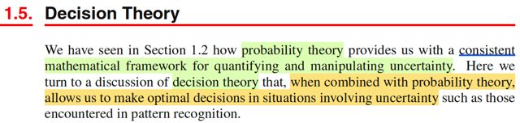</kbd>

> [!NOTE]
> Mở đầu gs cho biết ta đã thấy trong những phần trước lí thuyết xác suất đã
> cung cấp cho ta một framework để định lượng và thao tác với tính
> uncertainty. Thì nay, kết hợp với decision theory, sẽ cho ta một công cụ để
> giúp đưa ra  những quyết định hợp lí trong bối cảnh uncertainty

 

#### Suy diễn thống kê

<kbd></kbd>

> [!NOTE]
> Đại khái là, giả sử ta có input vector **x**, tương ứng là vector **t**, và mục
> đích là dự đoán t từ new value x. Thì với bài toán regression, t sẽ là biến
> liên tục. còn classification, t sẽ là class label.
>
>
>
> Khi đó joint probability của **X**,**T** (ở đây mình cứ theo quy tắc Casella,
> biến thì viết hoa, cũng như xài chữ f cho quen thuộc) f(**x**,**t**) sẽ phản
> ánh toàn diện mọi tính uncertainty gắn với các random variables này. Và
> bài toán đi xác định phân phối xác suất của **X**,**T** được gọi là
> **INFERENCE**.
>
>
>
> Có thể hiểu ý này, vì xuyên suốt cuốn Statistical Inference của Casella,
> mình chính là deal với bài toán này: cho random sample X = (X1,...Xn) ~
> f(**x**|θ) thì mục tiêu của ta là suy đoán giá trị của θ, tham số chi phối phân
> phối xác suất của **X**, và 3 bài toán lớn là
>
>
>
> i) point estimation - tìm cách đưa ra một function của sample W(**X**) sao
> cho với giá trị quan sát **X** = **x** thì ta có một estimate W(**x**) cho θ.
>
>
>
> ii) hypothesis testing - tìm cách đưa ra một nhận định rằng θ ∈ Θ0 hoặc θ ∈
> Θ0c, và cụ thể là đi xây dựng một rejection region R = {**x**: reject H0}
> cũng  chính là một hypothesis test, có bản chất là một decision rule: nhận
> vào **x**, tính toán giá trị của test statistic và dùng nó để quyết định xem
> nên tuyên bố θ ∈ Θ0 hay Θ0c.
>
>
>
> iii) interval estimator - tìm cách xây dựng một random interval hay khái quát
> hơn là random set C(**X**) để khi quan sát **X** = **x** ta sẽ đưa ra một
> nhận định là θ ∈ C(**X**)
>
>
>
> Quay lại đây, gs Bishop cho rằng đây vốn là bài toán rất khó, và sẽ là chủ
> đề xuyên suốt của cuốn sách này. Tuy nhiên, trong những bài toán thực tế,
> ta thường muốn dự đoán t dựa trên giá trị của x hoặc rộng hơn, mục đích
> của ta thường là đưa ra một hành động tốt nhất dựa trên giá trị mà t có khả
> năng cao nhất dựa trên input x

 

##### Lý thuyết quyết định y khoa

<kbd>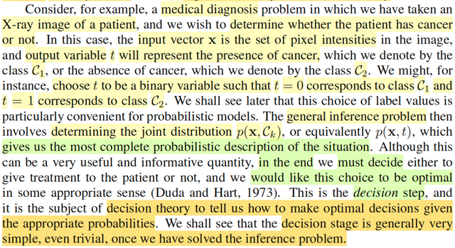</kbd>

> [!NOTE]
> Lấy ví dụ bài toán y khoa, ta muốn dựa trên input x là vector các giá trị điểm
> ảnh của ảnh chụp x quang, để dự đoán t mang một trong hai giá trị 0 hoặc 1
> để đại diện là C1 và C2 là tên hai class: có bị ung thư hay không bị. Thì ở
> đây nếu ta tìm được phân phối xác suất f(**x**, t) hay f(**x**, Ck)
>
>
>
> (chỗ này mình nghĩ ông gs Bishop làm cho rách việc ra thêm bằng cách
> dùng kí hiệu Ck, mình cho là cứ dùng t cũng được, chỉ cần biết nó là
> discrete mang hai  possible value 0 hoặc 1 thôi. Vốn dĩ việc ổng thoát li khỏi
> quy ước kí hiệu bên toán như xài chữ p thay cho f, viết thường cho tên biến
> thay vì viết hoa vốn đã gây dễ lú rồi. Nên ở đây mình sẽ cứ dùng t, f, và tuân
> theo quy ước viết hoa cho tên biến)
>
>
>
> thì đó chính là bài toán inference, tuy nhiên sau hết, mục đích vẫn là đưa ra
> quyết định là làm gì tiếp theo, thì đây chính là địa hạt của decision theory, nó
> sẽ giúp ta đưa ra quyết định tối ưu dựa trên xác suất tính toán được.
>
>
>
> Và gs cho biết thường thì bước make decision sẽ tương đối đơn giản một
> khi ta đã giải được bài toán inference.

 

- **Quyết định dựa trên Xác suất**

<kbd></kbd>

> [!NOTE]
> Trước đi đi vào phân tích chi tiết, ta sẽ xem xét một cách không chính thức
> làm cách nào để ta thấy rằng xác suất sẽ đóng vai trò giúp ta quyết định
> thông qua ví dụ dễ hiểu.
>
>
>
> Như nãy đã nói, trong bối cảnh bài toán ta muốn dựa trên tấm ảnh chụp 
> x quang để đưa ra dự đoán bệnh hay không bệnh. Thì ta sẽ muốn xem
> xét f(t|**x**) 
>
>
>
> Theo Bayes theorem: f(t|**x**) = f(**x**|t) f(t) / f(**x**)
>
>
>
> Y như trong Bayesian approach ta coi θ là random variable để gán cho nó
> prior distribution π(θ), và dựa vào Bayes theorem để cập nhật xác suất
> của θ dựa trên **X** = **x**, để có posterior distribution π(θ|**x**). Thì ở đây, f(t)
> (trong sách là p(Ck) cũng sẽ là prior distribution của T, và f(t|**x**) là posterior
> distribution, với ý nghĩa là:
>
>
>
> Khi chưa biết kết quả x-ray thì xác suất một người mắc bệnh (T mang giá
> trị gì) sẽ được quy định bởi prior distribution f(t).
>
>
>
> Nhưng sau khi có x-ray thì xác suất của T sẽ do f(t|**x**) quyết định.
>
>
>
> Như vậy, để giảm thiểu khả năng phán bệnh sai, lẽ thường ta sẽ dùng
> kết quả của posterior distribution, là trong hai giá trị khả dĩ của T, thì cái
> nào có posterior probability cao hơn.
>
>
>
> Vậy thì ở đây, tính được f(t, **x**) coi như là bài toán inference, khi đó, ta
> sẽ tính được f(t|**x**) và việc lấy giá trị nào có posterior cao hơn để gán / báo 
> cho bệnh nhân chính là bước dựa vào decision theory để take action

 

- **Giảm thiểu tỉ lệ phân loại nhầm**

<kbd>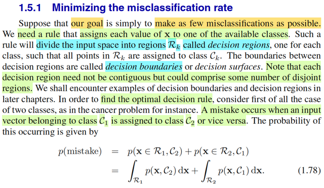</kbd>

> [!NOTE]
> Thế thì đại ý là nếu như mục tiêu của ta là giảm thiểu tỉ lệ phân loại nhầm
> (misclassification rate) thì ta sẽ cần một bộ quy tắc để gán giá trị cho của **x** cho
> một trong các class đang xét.
>
>
>
> Trước khi nói tiếp, mình tranh thủ recall lại kiến thức trong Casella: Hypo thesis
> testing:
>
>
>
> Như lúc nãy cũng đã review lại sơ sơ: Bài toán hypothesis testing là bài toán suy
> luận thống kê mà trong đó ta muốn xây dựng một cái hypothesis test - có bản
> chất chỉ là một decision rule: dựa vào gía trị quan sát của **X**, tính toán ra test
> stastisic λ(**X**) và theo một cái rule nào đó để đưa ra kết luận rằng H0: θ ∈ Θ0,
> gọi là accept null hypothesis, hay kết luận H1: θ ∈ Θ0c gọi là reject null
> hypothesis.
>
>
>
> Thế thì, như vậy việc định ra một cái test, cũng chính là định ra cái rule, để rồi áp
> dụng cái rule này với mọi **x** ∈ range **X**, nó sẽ chia range **X** thành hai
> phần, Rejection region R = {**x** ∈ range **X**: reject H0} và Rc = {**x** ∈ range
> **X**: accept H0}, gọi là Acceptance region.
>
>
>
> Để rồi, khi đó, khi bàn tới việc đánh giá một hypothesis test, ta sẽ muốn giảm
> thiểu hai loại sai sót: Type I error, là khi θ ∈ Θ0 nhưng lại reject H0 (**X** ∈ R), và
> Type II error, là khi θ ∈ Θ0c nhưng lại accept H0 (**X** ∈ Rc).
>
>
>
> Để rồi từ đó ta có các khái niệm như power function: β(θ) = P_θ(**X** ∈ R), với
> định nghĩa này, ta sẽ muốn một cái test có Type I error thấp thì có nghĩa là với θ ∈
> Θ0 β(θ) nên thấp, từ đó ta có định nghĩa level α test là test mà:
>
>
>
> sup_θ∈Θ0 P_θ(**X** ∈ R) ≤ α.
>
>
>
> Và định nghĩa size α test, là test có sup_θ∈Θ0 P_θ(**X** ∈ R) = α.
>
>
>
> Và khi đã xét một đám có xác suất Type I error thấp, ví dụ leve α test.
>
>
>
> Ta sẽ muốn tìm thằng có xác suất mắc Type II error thấp nhất trong đó, cũng là
> thằng mà khi θ ∈ Θ0c thì xác suất reject H0 là cao nhất mọi thằng khác, đó chính
> là most power level α test, với power function chính là định nghĩa bởi β(θ) =
> P_θ(**X** ∈ R): một test gọi là most power trong các test level α là khi với mọi θ ∈
> Θ0c, thì β(θ) của nó luôn ≥ β'(θ) của mọi test khác trong đám đó.
>
>
>
> Review chút xíu cho nhớ, giờ quay lại bài toán này.
>
>
>
> ------
>
>
>
> Để thực hiện bước phân loại, ta cũng sẽ muốn một cái decision rule, cũng  giống
> như hypothesis test, ta cũng sẽ cần một cái function, để nhận vào x, và trả ra kết
> quả là predict là class nào. Khi đó nó cũng sẽ chia range X thành các vùng, gọi là
> DECISION REGIONS
>
>
>
> (không nhất thiết phải là 2 vùng rejection region R và decision region R, mà tùy
> vào số possible class / cũng là số possible values của T, nhưng ở đây thì đúng là
> có 2 vùng, vì T có 2 possible values, gọi là R1, và R2)
>
>
>
> Và biên giới phân tách các decision regions gọi là DECISION BOUNDARY.
>
>
>
> Thế thì khi nói về event "mắc sai lầm / phân loại sai", nếu trong bối cảnh bài toán
> Hypothesis testing, thì nó sẽ là:
>
>
>
> (θ ∈ Θ0, reject H0) hoặc (θ ∈ Θ0c, accept H0)
>
>
>
> cũng là (θ ∈ Θ0, **X** ∈ R) hoặc (θ ∈ Θ0c, **X** ∈ Rc)
>
>
>
> Tương tự, ở đây, một event "phân loại sai" sẽ là:
>
>
>
> (T = C1, phân loại C2) hoặc (t = C2, phân loại C1)
>
>
>
> cũng là (T = C1, **X** ∈ R2) hoặc T = C2, **X** ∈ R1)
>
>
>
> Thế thì xét xác suất của event "mắc sai lầm" này, ta sẽ thấy.
>
>
>
> Với bài toán hypothesis testing, phải chú ý rằng, vì theo Frequentist approach, ta
> không coi θ như random variable, cho nên xác suất mắc Type 1 Error không phải
> là P_θ(θ ∈ Θ0, **X** ∈ R) mà phải define là P_θ(**X** ∈ R) khi θ ∈ Θ0, mang ý
> nghĩa: Khi giá trị của θ, vốn là fixed và unknown, thật sự là ∈ Θ0 thì P_θ(**X** ∈ R)
> chính là xác suất mắc Type I error. (vì sao có chữ θ ở dưới P: P_θ(...) thì là vì
> **X** ~ f(**x**|θ) nên dĩ nhiên xác suất này phụ thuộc θ)
>
>
>
> Tương tự, xác suất mắc Type II error sẽ được định nghĩa là:
>
>
>
> P_θ(**X** ∈ Rc) khi θ ∈ Θ0c.
>
>
>
> Nhưng với bài toán này, vì **X** và T đều là random variable / random vectors,
>
>
>
> (Chú ý, **X** là random vectors, nên trong sách gs Bishop dùng bold font, nhưng
> như đã nói ông ko theo convention nữa, nên viết chữ thường (vẫn in đậm, nhưng
> chữ thường **x**) còn mình thì theo convention của Casella, nên in đậm, chữ hoa
> **X**)
>
>
>
> nên xác suất của event mắc sai lầm sẽ là:
>
>
>
> P[(T = C1, **X** ∈ R2) or (T = C2, **X** ∈ R1)]
>
>
>
> = P[(T = C1, **X** ∈ R2) U (T = C2, **X** ∈ R1)]
>
>
>
> Đây là union của hai disjoint event, nên theo axiom 2 của lí thuyết xác suất, ta
> tách nó thành tổng của:
>
>
>
> = P(T = C1, **X** ∈ R2) + P(T = C2, **X** ∈ R1)
>
>
>
> Và đây là xác suất của joint event liên quan đến T, và **X**, nên ta sẽ dùng thể
> hiện nó / tính toán nó bởi joint distribution của T và **X**:
>
>
>
> f(t,**x**) | t=C1, **x**∈R2 + f(t,**x**) | t=C2, **x**∈R1
>
>
>
> Để thấy bước tiếp theo quen thuộc ta nhớ trong Casella hay Stat110, khi xét joint
> distribution của X,Y f(x,y), và xét xác suát của event X ∈ A, Y ∈ B, ta sẽ lấy tích
> phân ∫A∫B f(x,y)dxdy.
>
>
>
> Ở đây nó hơi lạ là đây là joint distribution của một biến discrete và một biến liên
> tục nhưng nguyên lí cũng  vậy thôi, có thể coi cái ta cần tính ở đây là xác suất của
> event T ∈ {C1}, **X** ∈ R2 **⇨** ∫{C1}∫R2 f(t, **x**)d**x** dt = ∫R2 f(C1, **x**)d**x**
>
>
>
> nên ta có:
>
>
>
> ∫R2 f(C1,**x**)d**x** + ∫R1 f(C2,**x**)d**x**

 

- **Tối ưu hóa vùng quyết định**

<kbd>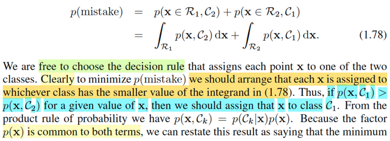</kbd>

<kbd>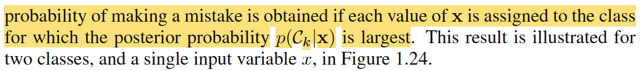</kbd>

> [!NOTE]
> Tiếp, cùng tìm hiểu sao ông Bishop nói dễ thấy là cái rule mà sẽ giúp ta giảm thiểu
> xác suất mistake này sẽ là cái rule sau đây: gán cho **x** cái class nào mà f(**x**,
> Ck) nhỏ hơn. Ví dụ nếu f(**x**, C1) < f(**x**, C2) thì kết luận C2, ngược lại thì kết luận C1.
>
>
>
> Mình sẽ nhìn bài toán này theo góc nhìn bài toán tối ưu hóa:
>
>
>
> nói bằng lời là:
>
>
>
> tìm cái decision rule sao cho dưới cái rule đó, xác suất sai lầm là nhỏ nhất.
>
>
>
> Vấn đề là,  với bài toán tối ưu, thì phải xác định biến tối ưu (optimization variable)  là
> gì. Thế thì ở đây, cái cần tìm là một decision rule, ko phải tìm x, y gì cả.
>
>
>
> Vậy thì cái biến tối ưu ở đây, là decision rule. Mà decision rule thì làm sao mà thể
> hiện theo toán học đây.
>
>
>
> À, như đã biết trong bài toán Hypothesis testing, nói về một cái test, hay test rule,
> thì bản chất cũng chính là nói về cái rejection region hay acceptance region. Vì một
> cái rule, sẽ gắn với cái rejection region có được khi áp cái rule đó để mà chia range
> **X** thành R và Rc.
>
>
>
> Nên ở đây cũng vậy, bản chất một cái decision rule, chính là thể hiện qua  các
> decision region R1, R2. Vì tương tự như trên, mỗi một cái decision rule khác nhau
> sẽ tạo ra một bộ decision region khác nhau.
>
>
>
> Do đó bài toán tối ưu sẽ được thể hiện như sau:
>
>
>
> minimize_R1,R2 {∫R2 f(C1,**x**)d**x** + ∫R1 f(C2,**x**)d**x**}
>
>
>
> (chỗ này vì X là vector nên ta phải hiểu đây là tích phân đa biến ∫...∫ nếu ghi
> chặt chẽ theo toán học, chỉ là ghi ∫ cho gọn, cũng như range **X** đây là subset của R^n
> chứ ko phải R)
>
>
>
> Tuy nhiên, R1,R2 sẽ có ràng buộc: R1 U R2 = range **X**, và R1, R2 disjoint:  R1 ∩
> R2 = ∅
>
>
>
> Nhưng tích phân trên miền R2, có thể được tách thành tích phân trên toàn miền trừ
> tích phân trên miền R1: ∫R2 f(C1,**x**)d**x** = ∫{Range **X**} f(C1,**x**)d**x** - ∫R1
> f(C1,**x**)d**x**
>
>
>
> Và xét cái này ∫{Range **X**} f(C1,**x**)d**x**, Ta biết là marginalizing joint pdf/pmf
> của **X**, T trên toàn miền xác định của **X** ta sẽ được marginal pdf/pmf của T.
>
>
>
> Do đó ∫{Range **X**} f(C1,**x**)d**x** chính là f(t)|t=C1, tức prior distribution của T,
> evaluate tại t = C1
>
>
>
> Vậy bài toán tối ưu lúc này là:
>
>
>
> minimize_R1 {f(C1) - ∫R1 f(C1,**x**)d**x** + ∫R1 f(C2,**x**)d**x**} = {f(C1) + ∫R1 [f(C2,
> **x**) - f(C1,**x**)]d**x** }
>
>
>
> Và f(C1) thì ko phụ thuộc R1, nên ta chuyển thành bài toán tương đương:
>
>
>
> minimize_R1 { ∫R1 [f(C2,**x**) - f(C1,**x**)]d**x** }
>
>
>
> Đến đây, nói bằng lời, ta muốn tìm R1, sao cho minimize cái tích phân này
>
>
>
> Nếu là bối cảnh bài toán tối ưu với biến **x** thông thường, có lẽ tới đây mình sẽ dùng
> first order necessary condition để tìm **x** khiến gradient = 0, để ra critical point rồi xét
> phép thử bậc hai các kiểu.
>
>
>
> Còn ở đây, biến tối ưu lại là một cái region, vậy phải làm sao?
>
>
>
> Ta sẽ dựa vào lập luận: mục đích là tìm vùng R1 sao cho minimize tích phân này.
> Mà bản chất tích phân này là tổng: tổng các giá trị [f(C2,**x**) - f(C1,**x**)] trên miền
> R1 ∈ range **X**
>
>
>
> Nên có thể diễn dịch yêu cầu là tìm trong miền **X**, để nhặt ra, gom lại những
> giá trị **x** nào đó sao cho tổng [f(C2,**x**) - f(C1,**x**)] trên tập đó là nhỏ nhất.
>
>
>
> Để làm được điều này, về trực giác, ta sẽ chọn các **x** khiến cái cụm này âm, thì
> khi đó, tổng của một đám mang giá trị âm mới khiến đẩy giá trị ngày càng nhỏ
> lại.
>
>
>
> Và ta cũng chỉ có thể lập luận như vậy, để kết luận R1 tối ưu nên là tập các **x** ∈ range **X**
> sao cho [f(C2,**x**) - f(C1,**x**)] < 0 ⇔ f(C2,**x**) < f(C1,**x**).
>
>
>
> Nhờ vậy giúp ta hiểu vì sao gs Bishop nói vậy trong đoạn này. (ông nói clearly
> nhưng mình thấy chả clearly chút nào nếu ko phân tích như trên).
>
>
>
> Vậy optimal decision rule (theo tiêu chí minimize misclassification rate) là:
>
>
>
> Assign class C1 nếu f(C2,**x**) < f(C1,**x**) và ngược lại.
>
>
>
> Và cũng dễ hiểu rằng vì f(t,**x**) = f(t|**x**)f(**x**) **⇨** f(C2,**x**) = f(C2|**x**)f(**x**)
>
>
>
> và f(C1,**x**) = f(C1|**x**)f(**x**)
>
>
>
> nên decision rule tối ưu cũng là: Assign class C1 nếu f(C2|**x**) (tức posterior pdf
> tại C2) < f(C1|**x**)

 

- **Giảm thiểu lỗi phân loại**

<kbd></kbd>

> [!NOTE]
> Minh họa bằng hình ảnh này. Vẽ đồ thị của hàm f(C1, **x**) và f(C2, **x**) theo **x**.
>
>
>
> Mình phải nói trước: hình ảnh chỉ nên hiểu mang tính minh họa, vì **x** vốn
> đang là vector, ko thể thể hiện nó trên 1 trục như vậy được, hay nói cách
> khác, ở đây coi như **x** chỉ là vector 1-D, do nên ta thấy gs Bishop dùng
> kí hiệu x thường (ko phải x bold: **x** như trong phần trước)
>
>
>
> Xác suất của event "phân loại" sai, như vừa phân tích được tính bởi
>
>
>
> P(Mistake) = ∫R1 f(C2,x) dx + ∫R2 f(C1,x)dx
>
>
>
> Và dĩ nhiên như đã học trong MIT 1801, ý nghĩa của tích phần ∫a:b f(t)dt là
> diện tích của phần đồ thị bên dưới hàm f(t) từ a đến b.
>
>
>
> Nên (Mistake) là tổng diện tích của phần đồ thị hàm f(C2,x) với x ∈ R1 và
> diện tích của phần đồ thị hàm f(C1,x) với x trong R2. chính là phần xanh
> đỏ và xanh  lá
>
>
>
> Và bài toán đặt ra là tìm R1, R2 giúp minimize cái tổng diện tích này, và
> điều này đồng nghĩa nhích cái decision boundary tại x^ qua lại.
>
>
>
> Thế thì đại ý rất dễ thấy đó là, khi dịch chuyển cái x^, thì tổng diện tích
> vùng  xanh lá, xanh dương ko đổi. Nó chỉ thay đổi diện tích vùng đỏ. Và tại
> x^ = x0 thì diện tích vùng đỏ là nhỏ nhất (= 0), đó chính là nơi mà từ tại đó,
> ta có optimal decision rule:
>
>
>
> Assign C1 nếu f(C2|x) < f(C1|x) và ngược lại.
>
>
>
> Có nghĩa là cái optimal rule sẽ là: Assign C1 nếu x < x0 và ngược lại.

 

- **Phân loại Bayes K lớp**

<kbd></kbd>

> [!NOTE]
> Nói qua khái quát bài toán lên K classes thay vì 2 classes, ông cho rằng sẽ
> dễ hơn nếu ta đặt objective cho việc tìm rule tối ưu là maximize xác suất
> phân loại đúng thay vì minimize xác suất phân loại sai.
>
>
>
> Là sao? À đơn giản là vì đây là hai event disjoint và bù nhau, nên P("mistake"
> ) = 1 - P(" correct"). Mà với bài toán tối ưu thì ta biết rồi, minimize hàm f(x) thì
> cũng là maximize hàm -f(x). Đo đó, minimize P("mistake") tương đương
> maximize
> - P("mistake"), và cũng tương đương maximize 1 - P("mistake") (cộng hằng
> số vào objective thì cũng được bài toán tương đương), và đây chính là
> maximize P("correct")
>
>
>
> Như vậy minimize P("mistake") cũng chính là maximize P("correct")
>
>
>
> Nhưng vì sao maximize P("correct") lại dễ hơn.
>
>
>
> Là vì, event "correct" dễ định nghĩa hơn event "mistake" trong trường hợp có
> nhiều classes.
>
>
>
> Ví dụ có K classes, dĩ nhiên event correct sẽ là:
>
>
>
> ([T = C1, decision rule phán là C1] hoặc [T = C2, decision rule phán là C2] ..
>
>
>
> hoặc [T = CK, decision rule phán là CK])
>
>
>
> viết theo toán học gọn hơn thì sẽ là:
>
>
>
> "Correct" = (T = C1, **X** ∈ R1) hoặc (T = C2, **X** ∈ R2) ,...(T = CK, **X** ∈
> Rk)
>
>
>
> ⇨ P("Correct") = P[(T = C1, **X** ∈ R1) U (T = C2, **X** ∈ R2) U...U( T = CK,
> **X** ∈ Rk)]
>
>
>
> tương tự, đây là union của các disjoint events nên theo axiom 2 (hay 3 nếu
> theo sách Casella)
>
>
>
> .. = P[(T = C1, **X** ∈ R1) + P(T = C2, **X** ∈ R2) +...+ P(T = CK, **X** ∈ Rk)]
>
>
>
> và tương tự như hồi nãy, nó chính là ∫R1 f(C1,**x**)d**x** + ...∫RK f(CK,
> **x**)d**x**
>
>
>
> = Σk=1:K ∫Rk f(Ck,**x**)d**x**
>
>
>
> Và tương tự như khi K = 2, cái decision rule khiến maximize P("correct") có
> thể đoán được cũng sẽ chính là cái rule này: Assign class Ck nếu joint  pdf
> f(Ck, **x**) và cũng là posterior pdf f(Ck|**x**) là cao nhất trong các k = 1,..K
>
>
>
> =====
>
>
>
> Vậy ở đây giúp ta hiểu sâu hơn như sau: Nếu tiêu chí của ta, mục tiêu của
> ta là giảm thiểu tỉ lệ sai xót tổng thể, thì cách phân loại tốt nhất chính là
> dựa trên posterior probability

 

- **Phân loại và ưu tiên lỗi**

<kbd></kbd>

> [!NOTE]
> Qua đây, đại ý là, trong nhiều trường hợp, mục tiêu không đơn giản chỉ là
> giảm tỉ lệ sai sót nói chung.
>
>
>
> Quay lại ví dụ việc xác định bệnh nhân có bệnh hay không, đôi khi hai
> loại lỗi nó có mức độ hậu qủa khác nhau. Ví dụ như không có ung thư mà
> phán là có, thì có thể cùng lắm là khiến bệnh nhân lo lắng và xét nghiệm
> thêm các kiểu tốn tìền. Nhưng nếu có ung thư mà chẩn đoán là không thì
> người ta có thể sẽ chết vì không được chữa trị.
>
>
>
> Lúc này, mục tiêu của ta có thể là ưu tiên loại error thứ hai, chấp nhận
> error thứ nhất (ý là nếu so sánh performance của các quy trình chẩn đoán
> thì có thể ưu tiện chọn cái có tỉ lệ error thứ hai nhỏ nhất, dù error thứ nhất
> nó ko phải là nhỏ nhất)
>
>
>
> Lại liên hệ nó với hypothesis testing cho vui. Mình đã review lại một ít
> trong các note trước, rằng trong bài toán này, ta cũng sẽ có hai loại error:
> Type I error, là khi θ thật sự thuộc Θ0, nhưng lại kết luận là reject H0, hay
> **X** ∈ R và Type II error là khi θ ∈ Θ0c mà lại kết luận là accept H0: **X**
> ∈ Rc.
>
>
>
> Thì còn nhớ, trong sách Casella, ta đã nghe là, trong thực tế, người ta sẽ
> dành Type I error để chỉ lại sai lầm mà ta muốn  tránh bằng mọi giá, ưu
> tiên tránh, vì mang lại hậu quả lớn. Ví dụ như trong nghiên cứu thuốc
> mới, nếu thuốc gây tác dụng phụ nguy hiểm mà kết quả test lại kết luận
> thuốc không có tác dụng phụ gì, thì hậu quả sẽ rất lớn. Do đó, ta sẽ đặt
> H0: θ ∈ Θ0 ứng với: Thuốc có tác dụng phụ. Để rồi Type I error sẽ là:
> thuốc có tác dụng phụ mà lại công bố là không.
>
>
>
> Khi đó, bằng cách định nghĩa như vầy, ta sẽ tập trung xây dựng level α
> test, ví dụ level 0.001 test, theo định nghĩa, là các test có xác suất mắc lỗi
> loại I cao nhất cũng không bao giờ vượt quá 0.001.
>
>
>
> Sau đó, ta mới đi tìm trong các level 0.001 test, cái nào có xác suất mắc
> Type II error thấp nhất.
>
>
>
> Đây là một cách tiếp cận của việc đánh giá (evaluating) hypothesis test
>
> Thế thì vừa rồi mình đã ôn lại cách tiếp cận vấn đề đánh giá một hypothesis testing trong
> Casella, dĩ nhiên còn vài vấn đề khác, ví dụ như khi không tồn tại Uniformly Most Powerful
> test, rồi p-values.
>
>
>
> Recall thêm chút nữa:
>
>
>
> Trong thống kê cổ điển như cuốn Casella, mình nhớ là với Point estimator, Hypothesis
> testing, Interval estimator đều nói đến cách tiếp cận của decision theory để đánh giá (7.3.
> 4, 8.3.5, 9.3.4)
>
>
>
> Ôn lại vài khái niệm liên quan đến decision theory đã học trong phần Point estimation và
> Interval estimation Casella: Đầu tiên, đối với point estimator thì khi dẫn dắt ta về cái này,
> gs Casella nói rằng, trong decision theory, action space là không gian những action, mà áp
> vào bối cảnh point estimation thì action đó là "(đưa ra) một estimation của θ", để rồi action
> space, là tập hợp mọi estimation của θ. Thế thì, theo decision theory, một action sẽ tạo ra
> một loss, và hàm loss sẽ là hàm được định nghĩa để phản ánh mức độ nghiêm trọng của
> action. Với bài toán estimation, thì loss có thể dùng **squared error loss** L(θ, δ(**x**)) =
> (δ(**x**)-θ)^2 hoặc **absolute error loss** L(θ,δ(**x**)) = |δ(**x**) - θ|
>
>
>
> Và như vậy thì, với loss function, ta sẽ có một hàm số phụ thuộc θ phản ánh chất lượng
> của estimator δ(**X**) ứng với θ cụ thể nào đó.
>
>
>
> Và để có một con số duy nhất, không phụ thuộc **X**, phản ánh chất lượng của estimator
> δ(**X**) nói chung, ta sẽ định nghĩa cái gọi là risk function:
>
>
>
> R(δ(**X**), θ) = E_θ[L(δ(**X**), θ)], với phân tích ý nghĩa như sau:
>
>
>
> L(δ(**X**), θ) sẽ là một random variable, vì nó là kết quả do áp một function lên δ(**X**)
> nên phụ thuộc δ(**X**), nên phụ thuộc **X**.
>
>
>
> Lấy kì vọng cái random variable này, thì tính cái này, thì ta sẽ dùng distribution của
> L(δ(**X**),θ), mang ý nghĩa là marginalizing mọi giá trị khả dĩ của L, nên kết quả sẽ là fix,
> không còn là random variable nữa, không phụ thuộc **X** nữa. nhưng nó vẫn là hàm theo
> θ.
>
>
>
> Và bằng cách tìm cái δ(**X**) có risk nhỏ nhất với mọi θ thì ta sẽ có cái estimator tốt nhất,
> tức là minimum risk estimator.
>
>
>
> Và có thể thấy, nếu loss là squared error loss thì:
>
>
>
> R(δ(**X**), θ) = E_θ[(δ(**X**) - θ)^2] thì đây chính là định nghĩa của hàm MSE:
>
>
>
> MSE củan estimator W(**X**), define bởi: MSE(W(**X**),θ) = E_θ[(W(**X**) - θ)^2].
>
>
>
> Từ đó, ta mới liên hệ với việc tìm estimator **minimize MSE cũng chính là tìm estimator
> minimize square error loss risk function**.
>
>
>
> Và triển khai thêm tí nữa:
>
>
>
> Dùng VarX = EX^2 - (EX)^2 ⇨ Var[W(**X**) - θ] = E[(W(**X**) - θ)^2] - E[W(**X**) - θ])^2
>
>
>
> Do đó MSE(W(**X**), θ) = R(W(**X**), θ)_squared error loss = E_θ[(W(**X**) - θ)^2]
>
>
>
> = Var[Var(**X**) - θ] + (E[W(**X**) - θ])^2
>
>
>
> = Var[Var(**X**)] + (E[W(X) - θ])^2
>
>
>
> Và E[W(**X**) - θ] lại chính là definition của Bias(W(X), θ)
>
>
>
> ⇨ MSE(W(**X**), θ) = Var[W(**X**)] + [Bias(W(**X**), θ)]^2
>
>
>
> Nếu là theo trường phái Bayesian với Bayes estimator, thì từ risk function R(δ(**X**), θ) 
> người ta sẽ lấy trung bình trên mọi possible value của θ:
>
>
>
> ∫R(δ(**X**), θ) π(θ) dθ, đây gọi là Bayes risk
>
>
>
> Thay R(δ(**X**), θ) = E_θ[L(δ(**X**), θ)] = ∫_/**X** /L(δ(**x**), θ) f(**x**|θ) d**x** vào:
>
>
>
> Bayes risk = ∫_Θ ∫_/**X**/ L(δ(**x**), θ) f(**x**|θ) d**x** π(θ) dθ 
>
>
>
> = ∫_Θ ∫_/**X**/ L(δ(**x**), θ) [f(θ|**x**) f(**x**)/π(θ)] / d**x** π(θ) dθ
>
>
>
> = ∫_Θ ∫_**X** L(δ(**x**), θ) f(θ|**x**) f(**x**) d**x** dθ
>
>
>
> = ∫_**X** [ ∫_Θ L(δ(**x**), θ) f(θ|**x**) dθ ] f(**x**) d**x** 
>
>
>
> Thì cái ∫_Θ L(δ(**x**), θ) f(θ|**x**) dθ = E[L(δ, θ)|**X**=**x**] được gọi là **posterior expected loss**
>
>
>
> -----
>
>
>
> Sang tới interval estimator, thì lúc này loss function cần phản ánh hai thứ: độ chính xác
> (C(**X**) chứa θ và kích thước C(**X**). Do đó, loss sẽ là kết hợp  của một indicator
> function I_{C(**X**) chứa θ} (= 0 khi C(**X**) chứa và bằng 1 khi  C(**X**) không chứa θ) và
> Size(C(**X**)) với một tham số b giúp điều chỉnh tương quan giữa hai sub-objective này:
>
>
>
> L(C(**X**), θ) = I_{θ ∈ C(**X**)} + b Size(C(**X**)), thể hiện: nếu C(**X**) chứa θ và có size
> nhỏ thì loss sẽ nhỏ.
>
>
>
> Và ta cũng sẽ đặt ra risk function của interval estimator là kì vọng của loss này. Để rồi tìm
> cách tìm estimator mà giảm thiểu risk:
>
>
>
> R(C(**X**), θ) = E_θ[L(C(**X**), θ)].
>
>
>
> -----
>
>
>
> Còn với bài toán Hypothesis testing, trong 8.3.5 Casella ta được biết rằng, với bài toán
> này, action sẽ chỉ là một trong hai: a0, a1 biểu diễn kết luận của test rule là accept H0 hay
> reject H0. Và ta cũng sẽ define loss function, gọi là 1-0 loss để phản ảnh hậu quả:
>
>
>
> L(θ, a0) = 0 nếu θ ∈ Θ0, = 1 nếu θ ∈ Θ0c
>
>
>
> L(θ, a1) = 0 nếu θ ∈ Θ0c, = 1 nếu θ ∈ Θ0,
>
>
>
> Và risk cũng sẽ là function lấy trung bình loss:
>
>
>
> Chỗ này cần nói rõ cho dễ hiểu: Định nghĩa của loss, luôn gắn với một action. Với point
> estimator, loss kí hiệu là L(δ(**X**), θ), để rồi nó là một random variable, mà khi nhận giá trị
> **X** = **x**, kéo theo δ(**X**) mang giá trị estimate cho θ: δ(**x**) (là một action), kéo theo
> phát sinh loss L(δ(**x**), **θ**) từ action này. Và vì L(δ(**X**), θ) là random variable, nên
> risk = lấy kì vọng, chính là dựa trên distribution của cái thằng L này, và truy nguyên nguòn
> gốc thì c**ũng chỉ là xuất phát từ distribution của X**: f(**x**|θ), do đó risk mới là hàm phụ
> thuộc θ.
>
>
>
> Tương tự, với interval estimator, thì action là một interval C(**x**), loss L(C(**X**), θ) cũng
> là random variable, mà yếu tố random của nó đến từ C(**X**). Khi quan sát **X** = **x**,
> C(**X**) mang giá trị C(**x**), thì nó mang ý nghĩa là một action được đưa ra: một interval
> được dự đoán sẽ chứa θ, và với action đó, phát sinh loss: L(C(**x**), θ). Nên lấy kì vọng
> cái này để có risk, thì ta sẽ dựa trên **distribution của C(X)**, tất nhiên, C(**X**), nếu là
> random interval, thì cũng sẽ được cấu thành bởi hai random variable L(**X**), U(**X**), nên
> tương tự, cũng chỉ là xuất phát từ distribution của **X**
>
>
>
> Còn trong hypothesis testing, action là một kết luận mang một trong hai giá trị a0 hoặc a1,
> nên ta có thể thể hiện nó bởi λ(**X**) nào đó, là một Bernoulli random variable, để rồi khi
> quan sát **X** = **x**, λ(**X**) ghi nhận giá trị cụ thể λ(**x**) (= a0 hoặc a1), loss ghi nhận
> giá trị cụ thể L(θ, λ(**x**)) (là L(θ, a0) hoặc L(θ, a1)).
>
>
>
> Nhờ vậy, ta hiểu trong hypothesis testing, loss L(θ, λ(**X**)) là một Bernoulli random
> variable
>
>
>
> nên khi lấy trung bình, dĩ nhiên ta sẽ dựa trên distribution của Bernoulli:
>
>
>
> R(θ, λ(**X**)) = E_θ[L(θ, λ(**X**)]
>
>
>
> = L(θ, a0) * P_θ[L(θ, λ(**X**)) = L(θ, a0)] + L_θ(θ, a1) * P[L(θ, λ(**X**) = L(θ, a1)]
>
>
>
> = L(θ, a0) * P_θ(λ(**X**) = a0) + L_θ(θ, a1) * P(λ(**X**) =  a1)
>
>
>
> = L(θ, a0) * P_θ(**X** ∈ Acceptance region Rc) + L(θ, a1) * P_θ(**X** ∈ Rejection region R)
>
>
>
> Và tùy vào θ ở đâu:
>
>
>
> θ ∈ Θ0 ⇨ R = 0 * P_θ(**X** ∈ Rc) + 1 * P_θ(**X** ∈ R) = β(θ)
>
>
>
> θ ∈ Θ0c = R = 1 * P_θ(**X** ∈ Rc) + 0 * P_θ(**X** ∈ R) = P_θ(**X** ∈ Rc) = 1 - β(θ)
>
>
>
> Cuối cùng, nếu muốn thay đổi tương quan giữa hậu quả của hai loại Type I và II error, ta
> có thể thay đổi định nghĩa của loss, gọi là generalized 1-0 loss
>
>
>
> L(θ, a0) = 0 nếu θ ∈ Θ0, = cII nếu θ ∈ Θ0c
>
>
>
> L(θ, a1) = 0 nếu θ ∈ Θ0c, = cI nếu θ ∈ Θ0,
>
>
>
> Khi đó R(θ, λ(**X**)):
>
>
>
> Khi θ ∈ Θ0: R = cI * P_θ(**X** ∈ R) + 0 * P_θ(X ∈ Rc) = cI * β(θ)
>
>
>
> Khi θ ∈ Θ0c: R = cII * P_θ(**X** ∈ R) + 0 * P_θ(X ∈ Rc) = cII * (1 - β(θ))

 

- **Hàm mất mát và rủi ro Bayes**

<kbd>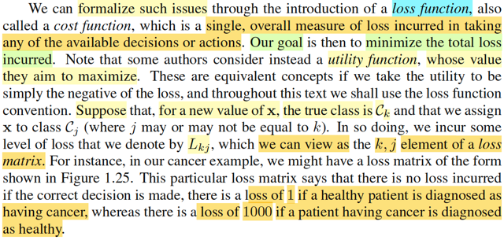</kbd>

<kbd></kbd>

> [!NOTE]
> Quay lại đây, trong bối cảnh machine learning, gs Bishop giới thiệu về cách tiếp
> cận decision theory: Ta sẽ dùng loss function (hay cost function) để phản ánh
> những hậu quả do các quyết định tạo ra. Thì có thể thấy nó y chang những gì đã
> học trong Casella. Chỉ khác là ta mở rộng lên K class, tức là decision rule không
> còn chỉ đưa ra một trong hai action a0 a1 nữa. Mà là a1,...aK, hay như trong
> sách, là C1,...Ck
>
>
>
> Và định nghĩa của loss, phải thể hiện bằng môt loss matrix:
>
>
>
> phần từ Lkj sẽ mang ý nghĩa là: [sự thật: T = k, decision rule gán cho class j],
> nên:
>
>
>
> khi k = j, tức là phần từ Lkk trên đường chéo, thì ta cho giá trị bằng 0: vì lúc này
> decision rule đoán đúng.
>
>
>
> còn k khác j, thì ta cho nó một giá trị dương ckj phản ảnh mức độ nghiêm trong
> của việc "đoán sai là class j trong khi thật sự là class k" này.
>
>
>
> Tất nhiên với K = 2, thì cái matrix loss này cũng chỉ cách thể hiện matrix cái hàm
> generalized loss mà ta vừa ôn trong Casella, đây nhé:
>
>
>
> Vừa nãy mới nói, ta define generalized loss:
>
>
>
> L(θ, a0) = 0 khi θ ∈ Θ0 và = cII khi θ ∈ Θ0c
>
>
>
> L(θ, a1) = 0 nếu θ ∈ Θ0c, = cI nếu θ ∈ Θ0,
>
>
>
> Thì loss matrix sẽ là:
>
>
>
> L11 = 0: phân loại đúng: θ ∈ Θ0, dự đoán a0: θ ∈ Θ0
>
>
>
> L12 = cI, thể hiện loss khi θ ∈ Θ0 và dự đoán lại là a1: θ ∈ Θ0c, đây là Type I
> error
>
>
>
> L22 = 0: phân loại đúng: θ ∈ Θ0c, dự đoán a1: θ ∈ Θ0c
>
>
>
> L21 = cII, thể hiện loss khi θ ∈ Θ0c mà dự đoán là a0: θ ∈ Θ0, đây là Type II error
>
>
>
> Nhưng lưu ý, θ **tuy đóng vai trò của** T **ở đây** nhưng **trong bối cảnh
> Casella, nó là fixed but unknown**. Do đó mới có vụ phải chia công thức của Risk
> function ra làm hai trường hợp ứng với θ nằm ở đâu.
>
>
>
> Còn **trong bối cảnh Bishop**, T **cũng là random variable**. Nên **ứng với mỗi ô
> trong loss matrix, là một joint event** của T và **X**.
>
>
>
> Ví dụ, ô Lkj sẽ là loss của event: T = k (class thật là j) và "mô hình phân lại là
> class j" , cũng là **X** ∈ Rj
>
>
>
> Vậy thì ở đây gs Bishop chính là đang tính Bayes risk: Trong Casella, khi ta 
> xét Bayes estimator, thì ngoài risk function R(δ(**X**), θ), người ta còn average nó,
> theo prior distribution của θ: Nghĩa là, hàm risk function, vốn dĩ đã chỉ còn phụ
> thuộc θ, vì theo trường phái Bayes, lúc này θ là random variable, nên risk function
> cũng thành random variable nốt, ta mới đi average nó, đặt là Bayes risk:
>
>
>
> Bayes risk của δ(**X**): E[R(θ, δ(**X**)] = ∫_Θ R(θ, δ(**X**)) π(θ) dθ 
>
>
>
> Lắp R(θ, δ(**X**)) = E_θ[L(δ(**X**), θ)] = ∫_/**X** /L(δ(**x**), θ) f(**x**|θ) d**x** vào.
>
>
>
> Bayes risk của δ(**X**): = ∫_Θ ∫_/**X**/ L(δ(**x**), θ) f(**x**|θ) d**x** π(θ) dθ 
>
>
>
> Tới đây biến đổi chút xíu (thay f(**x**|θ) = π(θ|**x**) f(**x**) / π(θ), ta sẽ thấy nó 
> trở thành ∫_/**X** /[/**∫**/_Θ L(δ(**x**), θ) π(θ|**x**) dθ] f(**x**) d**x**, trong đó ∫_Θ L(δ(**x**), θ) π(θ|**x**) dθ
> chính là E[L(δ(X),θ)|**X**=**x**], là kì vọng của loss dưới phân phối posterior: posterior
> expected loss. (hiểu nó thế này: với **X** = **x**, L(δ(**X**), θ) là random variable tạo bởi
> θ, và θ ~ posterior π(θ|**x**) ⇨ lấy kì vọng, theo lotus)
>
>
>
> Nhưng nếu làm tiếp từ ∫_Θ ∫_/**X**/ L(δ(**x**), θ) f(**x**|θ) d**x** π(θ) dθ, nhập f(**x**|θ) π(θ)
> lại = f(**x**, θ), ta sẽ có:
>
>
>
> ∫_Θ ∫_/**X**/ L(δ(**x**), θ) f(**x**, θ) d**x** dθ 
>
>
>
> Đây chính là gì? **CHÍNH LÀ** **LẤY TRUNG BÌNH CỦA LOSS DỰA TRÊN
> JOINT DISTRIBUTION CỦA** **X** và θ
>
>
>
> Để rồi ta sẽ thấy **CHÍNH XÁC LÀ** **NGÀI BISHOP ĐANG TÍNH BAYES RISK** (tính **kì
> vọng của loss (tổng loss) trên joint distribution của** T **và** **X**)

 

- **Cấu trúc hàm mất mát**

<kbd></kbd>

> [!NOTE]
> Từ đó giúp ta hiểu bản chất của cái công thức 1.80: chỉ là Bayes risk trong Casella mà thôi,
>
>
>
> Còn cụ thể **vì sao dạng công thức của 1.80 là như vậy?**
>
>
>
> Phải hiểu thế này: Ta đang tính kì vọng của Loss, hàm nghĩa Loss là một random variable.
>
>
>
> Mà giá trị khả dĩ (possible value) của nó, sẽ phụ thuộc T và decision rule, và ta dùng cái loss matrix để liệt kê các possible
> value này. Ví dụ,
>
>
>
> Loss = L12 khi "class thật là 1, phân loại của decision rule là 2", thể hiện toán học của event này: (T = 1, **X** ∈ R2).
>
>
>
> Tượng tự,
>
>
>
> Loss = Lkj khi (T = k, **X** ∈ Rj)
>
>
>
> Nên Loss, là một **DISCRETE** random variable mà được **tạo ra bởi việc áp một hàm số sau đây** lên T, và **X**:
>
>
>
> g(t,**x**) = Lkj (giá trị của matrix loss tại hàng k, cột j) khi T = t, **X** = **x**.
>
>
>
> Nói cách khác, ta hãy nhìn loss matrix chính là định nghĩa một hàm số g(t,**x**):
>
>
>
> i) nhận vào input là t, và **x**, nó sẽ hỏi xem:
>
>
>
> t bằng mấy (C1 hay ...CK), ví dụ là Ck đi)
>
>
>
> **x** thuộc R mấy (R1, R2 hay RK), ví dụ bằng Rj
>
>
>
> ii) output ra giá trị hàng Lkj
>
>
>
> Nên hiểu g(t,**x**) = Lkj là như vậy.
>
>
>
> Hay g(t,**x**) = Lkj với k là index từ 1,..K sao cho t = Ck, j là index từ 1,..K sao cho **x** ∈ Rj
>
>
>
> Thể hiện theo toán học dùng **indicator function:**
>
>
>
> I_(t = Ck), có giá trị = 1 khi t = Ck, = 0 kh t ≠ Ck
>
>
>
> I_(**x** ∈ Rj), có giá trị = 1 khi **x** ∈ Rj, = 0 khi x không thuộc Rj
>
>
>
> g(t, **x**) = Σk=1:K Σj=1:K Lkj I_(t = Ck) I_(**x** ∈ Rj)
>
>
>
> Từ đó giúp ta thấy rõ, việc tính cái kì vọng của cái biến ngẫu nhiên Loss này, đơn giản là dùng LOTUS:
>
>
>
> Nhớ lại LOTUS, nó nói rằng, khi ta có biến ngẫu nhiên Y được tạo thành bằng cách áp hàm g(x) lên biến ngẫu nhiên X, thì
> ta có thể tính EY bằng cách dùng pmf/pdf của X: EY = Σ{possible  x của X} g(x)P(X=x) hoặc ∫_{range X} g(x)f(x)dx
>
>
>
> Mà dù là tích phân hay sum thì đều có nghĩa là: marginalizing over mọi possible value của X đối với cụm g(x)f(x)
>
>
>
> Vậy thì đây, ta có LOSS, là **biến ngẫu nhiên có được bằng cách áp hàm** g(t,**x**) lên hai biến ngẫu nhiên T, **X**, thì việc
> tính E[LOSS] **cũng theo LOTUS**:
>
>
>
> E[LOSS] = marginalizing mọi possible value của T và **X** đối với g(t,**x**)f(t,**x**).
>
>
>
> Và để thực hiện cái việc marginalizing, vì ở đây T là biến rời rạc, nhận các giá trị possible value C1, C2,... CK. Còn **X** là
> biến liên tục. nên công thức sẽ là:
>
>
>
> Σ_{mọi possible value Cm của T} ∫_range_**X** g(t, **x**) f(t, **x**) d**x**
>
>
>
> = Σ_{mọi possible value Cm của T} ∫_range_**X** [Σk=1:K Σj=1:K Lkj I_(t = Ck) I_(**x** ∈ Rj)] f(t, **x**) d**x**
>
>
>
> = Σ_{mọi possible value Cm của T} ∫_range_**X** [Σk=1:K Σj=1:K Lkj I_(t = Ck) I_(**x** ∈ Rj)] | t=Cm f(Cm, **x**) d**x**
>
>
>
> Với t = Cm, [Σk=1:K Σj=1:K Lkj I_(t = Ck) I_(**x** ∈ Rj)] | t=Cm = [Σj=1:K Lkj I_(**x** ∈ Rj)]
>
>
>
> = Σ_{mọi possible value Cm của T} ∫_range_**X** [Σj=1:K Lmj I_(**x** ∈ Rj)] f(Cm, **x**) d**x**
>
>
>
> = Σ_m=1:K ∫_range_**X** [Σj=1:K Lmj I_(**x** ∈ Rj)] f(Cm, **x**) d**x**
>
>
>
> Tách cái tích phân trên toàn range **X** thành tổng tích phân các vùng R1,... RK
>
>
>
> = Σ_m=1:K Σn=1,..K ∫_Rn [ Σj=1:K Lmj I(**x** ∈ Rj) ] f(Cm,**x**) d**x**
>
>
>
> với việc đã xét n=1,...K ở miền ngoài tích phân thì cái tổng [ Σj=1:K Lmj I_(t = Ck) I(**x** ∈ Rj) ] bên trong vòng lặp này chỉ
> còn [ Σj=1:K Lmj I_(t = Ck) I(**x** ∈ Rj) ] | j=n ] chỉ còn là [ Lmn ]
>
>
>
> = Σ_m=1:K Σn=1,..K ∫_Rn [  Lmn ] f(Cm,**x**) d**x**
>
>
>
> Và và vì m, n chỉ là dummy name, đặt lại tên biến là k, j ta có
>
>
>
> Σ_k=1:K Σj=1,..K ∫_Rj Lkj f(Ck,**x**) d**x**
>
>
>
> Đây chính là 1.80
>
>
>
> Nhờ việc hiểu bản chất Loss là biến ngẫu nhiên define bởi hàm g, thì áp dụng kiến thức LOTUS, giúp ta hiểu vì sao công
> thức E[Loss] lại là như vậy.
>
>
>
> Còn nhờ học Casella, ta hiểu thấu bản chất đây chỉ là Bayes risk mà thôi.

 

- **Bayes risk và ước lượng Bayes**

<kbd>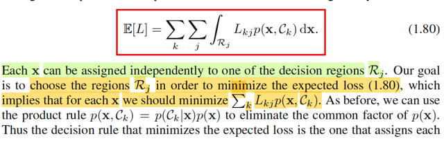</kbd>

> [!NOTE]
> Rồi, thế thì, tiếp theo, mục tiêu sẽ làm giảm cái E[L] này, mà vừa rồi ta đã hiểu bản chất của nó chính là Bayes risks, cũng như vì sao nó có công thức như
> vậy.
>
>
>
> Lại recall liên kết với Casella chút xíu:
>
>
>
> Trong Casella, mình được nghe về khái niệm Bayes risk khi nói về việc đánh giá (evaluate) Bayes estimator của θ: δ^B(**X**). Như đã ôn lại ở các note
> trước, risk function là function được định nghĩa bằng trung bình của loss function. R(δ(**X**), θ) = E_θ[L(δ(**X**), θ], nên với risk function, trước tiên ta cần
> biết đang dùng loss gì (ví dụ squared error hay absolute error). Thế thì, ta cũng nhớ, khi nói về Bayes estimator, điểm quan trọng là hiểu rằng ta đang theo
> trường phái Bayesian, nên coi θ như biến ngẫu nhiên và từ đó đi xây dựng posterior distribution của θ. Và với distribution này, khi cần một point estimator
> cho θ, ta có thể nghĩ đến mean của nó: E[θ|**X**] Tuy nhiên, chưa chắc nó luôn là mean của posterior. Mà sự thật là: E[θ|**X**] chỉ là Bayes estimator khiến
> minimize Bayes risk ∫_Θ E_θ[L(δ(**X**), θ)] π(θ) dθ  với L(δ(**X**), θ) đang dùng là squared error loss. Còn nếu loss là absolute error thì Bayes estimator khiến minimize
> Bayes risk sẽ là median của posterior.
>
>
>
> Vậy thì ở đây, việc ta đi minimize cái Bayes risk này, hoàn toàn tương ứng với việc ta đi tìm Bayes estimator giúp minimize risk function trong bối cảnh
> Casella. Nói vậy để thấy có sự liên kết giữa Casella và Bishop.
>
>
>
> Rồi, vậy thì như đã nói, khi đặt vấn đề minimize E[L] với công thức 1.80, biến số tối ưu ở đây là: **Cách chia range** **X** ra **thành một phân hoạch**
> (partition): R1,....RK.
>
>
>
> Có nghĩa là, không giống như trong bài toán tối ưu quen thuộc, trong đó ta đi tìm trong các giá trị cho phép của x để có được giá trị x* khiến hàm f(x*) là nhỏ
> nhất
>
>
>
> Thì ở đây ta lại đi tìm trong số các phân hoạch [R1,...RK] (định nghĩa phân hoạch: R1 U R2 U ...Rk = range X và intersection của chúng là tập rỗng) sao cho
> E[L] có giá trị nhỏ nhất
>
>
>
> Mà điều này cũng là vì bản chất là cũng vì, ta đang làm việc với bài toán classification, nơi mà mục tiêu của nó, là tìm được một quy tắc phân loại sao cho
> chính xác nhất, gỉam thiểu được sai lầm phân loại sai. Để rồi cũng y như trong bài toán Hypothesis testing, nơi mà thứ chúng ta tìm kiếm, cũng là một cái
> rule - giúp đưa ra quyết định rằng nên reject hay accept H0 tốt nhất, và cái rule này, cũng được thể hiện bởi việc nó sẽ phân chia range X thành rejection
> region R và acceptance region Rc.
>
>
>
> Nói vậy để thấy, việc ta đụng bài toán tối ưu mà trong đó thứ cần tìm (biến số tối ưu) là một phân hoạch không phải nay mới gặp.
>
>
>
> Quay lại đây ta có bài toán:
>
>
>
> minimize_{phân hoạch R1,...RK} Σk=1:K Σj=1,..K ∫_Rj Lkj f(Ck,**x**) d**x**
>
>
>
> Biến đổi objective chút xíu:
>
>
>
> Σk=1:K Σj=1,..K ∫_Rj Lkj f(Ck,**x**) d**x**
>
>
>
> Tích phân của tổng = tổng tích phân, bản chất tích phân chỉ là cái tổng, và  với các kí hiệu các tổng của tổng thì cứ thay đổi vị trí thoải mái:
>
>
>
> = Σj=1,..K ∫_Rj Σk=1:K Lkj f(Ck,**x**) d**x**
>
>
>
> = Σj=1,..K ∫_Rj  [Σk=1:K Lkj f(Ck,**x**)] d**x**
>
>
>
> Đặt hàm gj(**x**) = Σk=1:K Lkj f(Ck,**x**), ta sẽ xem xét ý nghĩa của cái cụm này sau.
>
>
>
> = Σj=1,..K ∫_Rj  gj(**x**) d**x**
>
>
>
> Dùng **indicator** **function** để chuyển tổng tích phân trên các vùng Rj thành tích phân trên toàn range **X**: Ij(**x**) = I_(**x** ∈ Rj), mang giá trị 1 hoặc 0
> tùy vào **x** ∈ Rj hay không
>
>
>
> ⇨..= Σj=1,..K ∫_range_**X**  Ij(**x**) gj(**x**) d**x** Đưa nốt tổng j vào tích phân:=  ∫_range_**X** Σj=1,..K Ij(x) gj(x) dx  Đến đây viết lại bài toán:Tìm kiếm bộ phân hoạch R1,..RK / cũng là cái decision rule để gán class cho các data point **x** ∈ range **X**  sao cho minimize ∫_range_**X** Σj=1,..K
> Ij(**x**) gj(**x**) d**x**
>
>
>
> Để dễ hiểu, ta sẽ xem xét ý nghĩa của từng thành phần trong cái objective này:
>
>
>
> i) gj(**x**) = Σk=1:K Lkj f(**x**, Ck) là cái gì, ý nghĩa là gì?
>
>
>
> Để thấy cái này là gì, hãy nhớ về định nghĩa của kì vọng, trong Stat110, gs Joe Blizstein dạy ta rằng, bản chất của kì vọng của random variable X, chỉ là GIÁ
> TRỊ TRUNG BÌNH của nó. Ví dụ như nó là một biến rời rạc, có các giá trị khả dĩ x1,x2,...xn với xác suất mà nó (X) mang các giá trị đó quy định bởi P(X=x1),
> P(X=x),...Thì EX chỉ là weighted average - trung bình của X có gắn trọng số bởi xác suất tương ứng: Σi xi P(X=xi)
>
>
>
> Vậy thì ở đây trong công thức trên Lkj là mức phạt quy định khi gán **x** có T = k vào class j
>
>
>
> Và f(**x**, Ck) về cơ bản cũng có thể tương đương với xác suất mà T = Ck xảy ra.
>
>
>
> Nên Σk=1:K Lkj f(**x**, Ck) = Σk=1:K [mức phạt khi gán một data point thuộc class Ck vào class j] * [Xác xuất data point thuộc class Ck]
>
>
>
> và nó mang ý nghĩa là **Trung bình mức phạt khi gán data point x vào class Cj**
>
>
>
> Vậy gj(**x**): mức phạt trung bình khi gán data point x vào class Cj
>
>
>
> -------
>
>
>
> ii) Σj=1:K Ij(**x**)gj(**x**) là cái gì:
>
>
>
> triển khai ra, = I1(**x**)g1(**x**) + I2(**x**)g2(**x**) + ..IK(**x**)gK(**x**)
>
>
>
> và nó sẽ có kết quả chỉ là một hạng tử trong đám này. Cái nào thì tùy vào **CÁCH PHÂN LOẠI ĐANG GÁN** **x** **CHO RỔ NÀO TRONG R1,..RK**, ví dụ
> gán x cho R2, thì I2(x) = 1, mấy cái khác = 0 ⇨ tổng này = 1*g2(**x**) = g2(**x**)
>
>
>
> Như vậy, nếu gj(**x**) là **mức phạt trung bình khi gán x vào class Cj**, mang ý nghĩa là: Mức phạt được **QUY ĐỊNH TRONG LUẬT**
>
>
>
> thì Σj=1:K Ij(**x**) gj(**x**) là **mức phạt THỰC TẾ, ghi nhận được khi mô hình THỰC HIỆN PHÂN LOẠI MỘT DATA POINT x.**
>
>
>
> iii) Vậy ∫_range_**X** Σj=1:K Ij(**x**)gj(**x**) là gì?
>
>
>
> Nó CHÍNH LÀ **TỔNG MỨC PHẠT THỰC TẾ**, ghi nhận được khi mô hình **THỰC HIỆN PHÂN LOẠI TOÀN BỘ x TRONG RANGE X**
>
>
>
> VẬY THÌ TỪ ĐÓ DỄ HIỂU RẰNG, **CÁI TỔNG MỨC PHẠT THỰC TẾ TRÊN TOÀN BỘ DỮ LIỆU SẼ NHỎ NHẤT** NẾU **MỨC PHẠT THỰC TẾ TRÊN
> TỪNG ÔNG x LÀ NHỎ NHẤT.**
>
>
>
> Ví dụ tổng mức phạt trên tập range X = {x1, x2, x3} sẽ dĩ nhiên là nhỏ nhất khi mức phạt trên từng ông là nhỏ nhất. Vì mấy ông này đâu có liên quan mẹ gì
> nhau. Nó sẽ chỉ không đúng nếu như: giảm mức phạt của ông x1 lại khiến tăng mức phạt của ông x2 chẳng hạn, thì khi đó, việc giảm mức phạt của từng
> ông mới khiến chưa chắc tổng mức phạt cả đám giảm. Nhưng ở đây thì chúng không liên quan gì nhau.
>
>
>
> Đó là lí do mà ta có thể chuyển bài toán tối ưu minimize ∫rangeX Σj=1:K Ij(**x**)gj(**x**) thành minimize Σj=1:K Ij(**x**)gj(**x**)
>
>
>
> Và như vậy, kiểu như ta sẽ có vô số bài toán tối ưu, mỗi cái ứng với với mỗi **x**:
>
>
>
> minimize Σj=1:K Ij(**x**)gj(**x**)
>
>
>
> ⇔ minimize Σj=1:K Ij(**x**)gj(**x**)
>
>
>
> = I1(**x**) g1(**x**) + ... + IK(**x**) gK(**x**)
>
>
>
> Và nên nhớ biến tối ưu là phân hoạch R1,...RK, hay cũng là bộ các hàm I1(**x**), I2(**x**),...Ik(**x**),
>
>
>
> Vì là một phân hoạch nên ràng buộc của chúng là: Chỉ một trong số các indicator function được  phép bằng 1. Ví dụ I1(**x**) = 1, thì I2(**x**) = ...IK(**x**) = 0,
> thể hiện rằng decision rule assign data point x cho class 1.
>
>
>
> Như vậy, đến đây **bài toán trở thành y như đặt vấn đề là**: 
>
>
>
> **TRONG SỐ CÁC HÀM INDICATOR** Ij(**x**) j = 1...K thì **CHO CÁI NÀO BẰNG 1 ĐỂ RA KẾT QUẢ NHỎ NHẤT**.
>
>
>
> Thì cũng chính là đồng nghĩa với: 
>
>
>
> **CHỌN CÁI NÀO ĐỂ CÓ KẾT QUẢ NHỎ NHẤT TRONG ĐÁM {g1(x),...gK(x)**
>
>
>
> cũng là
>
>
>
> **CHỌN RA CÁI NÀO NHỎ NHẤT TRONG ĐÁM:** **{Σk=1:K Lk1 f(x, Ck), Σk=1:K Lk2 f(x, Ck), ..Σk=1:K LkK f(x, Ck)}**
>
>
>
> **VÀ ĐÓ CHÍNH LÀ Ý CỦA GS BISHOP KHI NÓI WE SHOULD MINIMIZE Σk Lkj p(x, Ck)**
>
>
>
> **trong câu nói "...which implies that for each x we should minimize Σk Lkj p(x, Ck)"**

 

- **Luật quyết định Bayes tối ưu**

<kbd>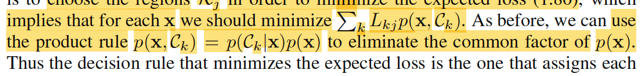</kbd>

<kbd>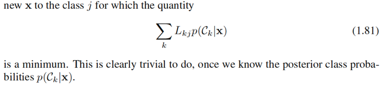</kbd>

> [!NOTE]
> Như vậy đến đây ta đã hiểu là cái optimal decision rule đó là:
>
>
>
> **CHỌN RA CÁI NÀO NHỎ NHẤT TRONG ĐÁM**: {Σk=1:K Lk1 f(x, Ck), Σk=1:K
> Lk2 f(x, Ck), ..Σk=1:K LkK f(x, Ck)} sau đó **LẤY INDEX** ĐỂ GÁN CLASS cho
> data point **x**.
>
>
>
> Gọi là j = argmin_{Σk=1:K Lkj f(**x**, Ck)}, mang ý nghĩa là **trong K cục** Σk=1:K
> Lkj f(x, Ck) j = 1,2..K thì **cục nhỏ nhất ứng với j bằng mấy**
>
>
>
> **Gán data point x cho Cj**, và **làm vậy với mọi x**.
>
>
>
> (ví dụ trong K cục trên, cái thứ 2 là nhỏ nhất, thì j = 2, decision rule tối ưu sẽ
> gán data point vào class 2)
>
>
>
> Thì đó **chính là một phân hoạch / decision rule tạo ra Bayes risk nhỏ nhất**.
>
>
>
> Và vì f(**x**, Ck) = f(Ck|**x**)f(**x**) nên f(x) là như nhau và không âm
>
>
>
> xem trong đám {Σk=1:K Lkj f(**x**, Ck)} j =1,...K cái nào nhỏ nhất
>
>
>
> thì cũng là xem trong đám {Σk=1:K Lkj f(Ck|**x**)} j =1,...K cái nào nhỏ nhất
>
>
>
> Tóm lại cái optimal (minimize Bayes risk) decision rule là:
>
>
>
> Với mỗi **x**, gán cho nó class Cj với j = argmin Σk=1:K Lkj f(Ck|**x**)

 

- **Tuỳ chọn từ chối**

<kbd>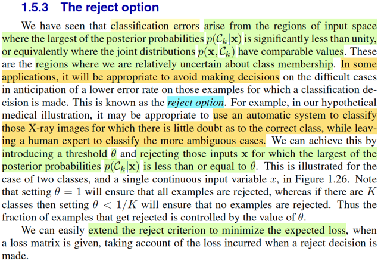</kbd>

<kbd>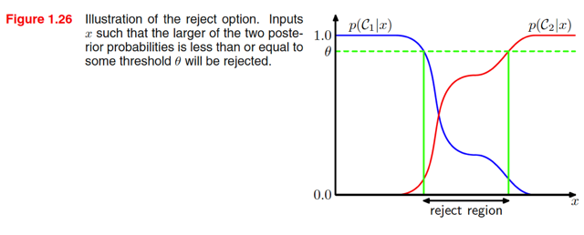</kbd>

> [!NOTE]
> Đại ý là, như ta đã thấy vừa rồi, cái decision rule / hay classifier tối ưu xét theo
> tiêu chí giảm thiểu Bayes risk là cái mà ta assign class Ck cho data point **x**
> với k = argmin_j [trung bình loss khi assign class j cho **x,** = Σk Lkj f(Ck|**x**)]
>
>
>
> Nếu các mức penalty cho các loại error đều cho bằng nhau = 1 Lkj = 1 với mọi k
> khác j và bằng 0 khi k = j thì decision rule nói trên trở thành:
>
>
>
> Khi đó, gj(x) = Σk=1:K Lkj f(Ck|**x**) = Σk≠j f(Ck|**x**) = 1 - f(Cj|**x**) (do Σk
> f(Ck|**x**) = 1)
>
>
>
> ⇨ rule trở thành:
>
>
>
> Assign Ck cho **x**, với k = argmin_j [1 - f(Cj|**x**)]
>
>
>
> cũng là k = argmax_j [f(Cj|**x**) - 1]
>
>
>
> = argmax_j f(Cj|**x**)
>
>
>
> có ngghĩa là trở thành cái rule mà giúp giảm misclassification error (không coi
> trọng loại error nào hơn cái nào): gán class nào thì dựa vào posterior f(t|x) nào
> lớn nhất
>
>
>
> Tuy vậy, không có gì chắc đây là rule tuyệt đối đúng.
>
>
>
> Có nghĩa là, cái Ck với k = argmax_j f(Cj|**x**) không có gì đảm bảo chính là
> class thật sự của **x**.
>
>
>
> Do đó, vẫn có thể có misclassification error.
>
>
>
> Và nó xảy ra khi: ví dụ với **x1,** posterior f(C2|**x**) là cao nhất, nhưng nó
> không vượt trội, để rồi, f(C1|**x**) cũng ko nhỏ. Và sự thật thì C1 mới là class
> đúng.
>
>
>
> Nên lúc này, khi f(C2|**x**) và f(C1|**x**) xem xem nhau, tuy f(C2|**x**) là lớn nhất. Và
> cũng đồng nghĩa là f(C2|**x**) cách khá xa mức tuyệt đối (=1, gs Bishop gọi là
> unity).
>
>
>
> Và đây là khi misclassification error có thể xảy ra.
>
>
>
> Nói chung là, ta chỉ có thể đảm bảo misclassification error không xảy ra khi
> f(C2|**x**) = 1, để rồi assign class C2 cho data point x thì sẽ đảm bảo chính xác.
> Tuy nhiên chỉ cần f(C2|**x**) < 1, thì đồng nghĩa vẫn có xác suất class đúng là class
> khác chứ ko phải C2.
>
>
>
> Thành ra, ta có thể đưa ra option thứ 3: (giả sử đang dự đoán giữa hai class C1
> vs C2) là: Không biết - Từ chối đoán - bằng cách sau khi tính posterior của các
> class thì không dựa vào việc cái nào có lớn nhất để đưa ra phân loại ngay lập
> tức, mà xem posterior có lớn hơn một cái threshold (α, hay trong sách là θ) hay
> không, ví dụ, chỉ kết luận nếu posterior lớn nhất lớn hơn 80%. Còn không thì
> đưa ra option: Từ chối phân loại, ko biết, mời bạn đoán.
>
>
>
> Tương tự, ta cũng có thể làm vậy bài toán có loss matrix (ý là có ưu tiên loại
> error này hơn error kia)

 

- **Lựa chọn từ chối phân loại**

<kbd>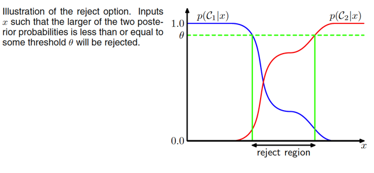</kbd>

> [!NOTE]
> HÌnh minh họa cho thấy vùng giữa hai đường xanh lá, nơi đó posterior tại  hai class
> (ý là f(t|x)|t=C1 và f(t|x)|t=C2)  có giá trị khác biệt không lớn. Và ta sẽ từ chối đưa ra
> quyết định phân loại

 

- **Inference và Decision**

<kbd>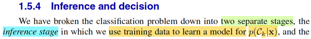</kbd>

<kbd>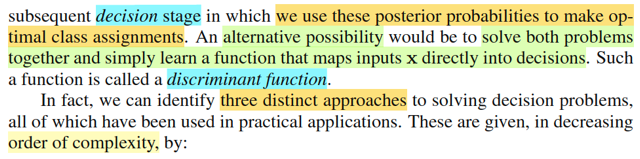</kbd>

> [!NOTE]
> Đại khái gs nói là bữa giờ ta đang tiếp cận bài toán classification theo hai
> bước: bước một là dựa trên data, đi xây dựng posterior distribution f(t|**x**)
> (trong sách là p(Ck|**x**)), đây chính là bước gọi là inference state
>
>
>
> (liên hệ với Statistical Inference - Casella,  bài toán inference là bài toán đi
> xây dựng một suy đoán về tham số của population distribution, có thể là một
> point estimator W(**X**) để estimate giá trị của θ, hypothesis test  để đưa ra
> suy đoán về θ nằm ở Θ0 hay Θ0c, hoặc một interval estimator C(**X**) để
> estimate một khoảng / một set mà có thể chứa θ, thì nói chung, ta hiểu
> inference là việc ta muốn suy đoán về sự thật của phân phối xác suất chi
> phối dữ liệu quan sát thấy)
>
>
>
> Sau đó, ta mới dựa trên posterior để thông qua decision theory giúp đưa ra
> prediction, đây gọi là decision stage.
>
>
>
> Thế thì, ông cho biết, có một cách làm khác, không cần chia ra hai bước,
> mà làm luôn trong một lần: vừa "học" ra / suy luận / inference posterior
> và vừa đưa ra dự đoán luôn, thông qua hình thức là học một function map
> giữa input và decision, gọi là DISCRIMINANT function**.**
>
>
>
> Dừng lại chút, mình vừa hiểu ra một việc: Lấy ví dụ một neural network,
> hay deep learning model, thì bằng cách training một mapping function
> giữa ảnh đầu vào và phân loại ảnh đầu ra, mình có thể hiểu bên trong nó
> đang làm hai việc cùng lúc: học ra posterior distribution và thực hiện
> decision. Nhưng có những loại khác, nó ko tìm cách học posterior, mà
> chỉ học luôn cái mapping function, gọi là discriminant function nói trên.
> Hay, ví dụ như mình đã từng học về VAE trong cs231n cũng vậy, encoder
> là cái khúc nó sẽ học ra posterior distribution, và decoder là một mô hình
> đóng vai trò sampling từ posterior distribution đó.

 

- **Mô hình Generative**

<kbd>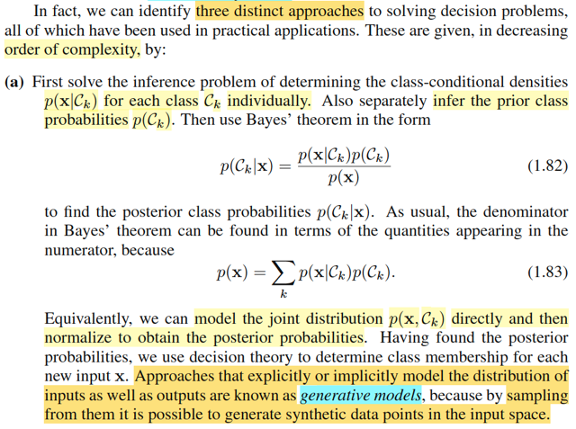</kbd>

> [!NOTE]
> Có ba cách tiếp cận cho bài toán decision (tạm hiểu là classification). 
>
>
>
> Loại thứ nhất: Đầu tiên, ta giải bài toán inference: 
>
>
>
> Học / xây dựng f(**x**|t) với từng possible value của t: C1,...CK. (tức là
> theo kí hiệu của gs Bishop: p(**x**|Ck).
>
>
>
> Học / xây dựng f(**t**).
>
>
>
> Dùng Bayes theorem, chuyển nó thành posterior của T:
>
>
>
> f(t|**x**) = f(**x**|t) f(t) / f(**x**).
>
>
>
> Với f(**x**) có thể dùng LOTP để tách thành:
>
>
>
> Σ{mọi possible value của t} f(**x**, t)
>
>
>
> = Σ{mọi possible value của t} f(**x**|t)f(t)
>
>
>
> Từ đó, ta có giá trị của f(t|x) với mỗi giá trị của {C1,...CK} của t
>
>
>
> Và cho phép ta dùng decision theory như đã biết để make decision.
>
>
>
> Mình có thể nhận ra đây chính là Naive Bayes
>
>
>
> Gs cho biết những cách tiếp cận mà trong đó ta thực hiện bước suy luận về
> **distribution của input và** output, tức là học ra f(t, **x**) thì gọi là **generative** model.
> Vì, nếu ta có distribution của input, ta có thể thực hiện sampling từ đó,
> để có thể có một dạng dữ liệu synthetic (ý là ví dụ như ảnh do ta tạo ra, 
> không phải ảnh chụp ở ngoài đời thật, ví dụ mấy mô hình tảo ảnh hiện nay
> như diffusion model)

 

- **Mô hình phân biệt**

<kbd>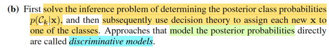</kbd>

> [!NOTE]
> Cách tiếp cận thứ hai, là inference ra trực tiếp posterior f(t|**x**) và sau đó thì
> dùng nó để make decision. 
>
>
>
> Nó khác cái trước ở chỗ, ta không cần học ra f(**x**|t) f(t). Mà chỉ học thẳng
> ra f(t|**x**) thôi.
>
>
>
> Cái này như bữa giờ đang làm, gọi là discriminative models

 

- **Hàm phân biệt**

<kbd>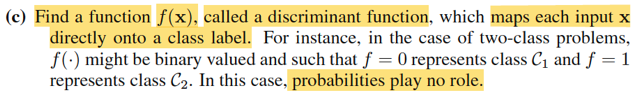</kbd>

> [!NOTE]
> Và cuốn cùng là discriminant function như nãy nói. Cái này nó ko cần học
> phân phối xác suất gì hết, nó chỉ là tìm ra cái mapping function giữa t và x.
> t = f(x). Xác suất ko có vai trò gì hết

 

- **Ưu điểm Cách 1: Phát hiện bất thường**

<kbd>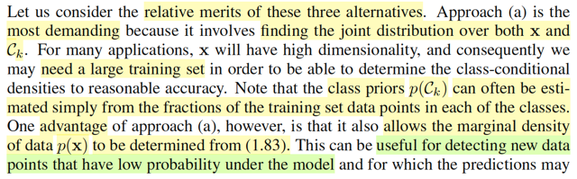</kbd>

<kbd>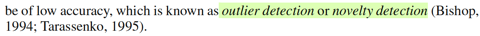</kbd>

> [!NOTE]
> Bàn một chút về ưu nhược diểm của 3 cách làm này.
>
>
>
> Cách đầu tiên, đại khái là vì ta dù implicitly hay explicitly (tường minh hoặc
> ngầm định) xây dựng joint distribution f(t,**x**) (vì infer f(**x**|t), f(t) thì cũng là
> xây f(**x**,t)) thì đều cần nhiều data.
>
>
>
> Ưu điểm là, ta có thể có f(**x**) (bằng cách marginalizing f(**x**, t) over range T
> và cái này, là prior distribution của x. Do đó có thể dùng nó để tính  xác suất
> của một input. Và áp dụng vào bài toán phát hiện bất thường.
>
>
>
> Nói rõ hơn tí, thì đại ý là: ví dụ trong bài toán phân loại ảnh, thì input x, là
> ảnh, t là phân loại (class), thì ý nghĩa của f(**x**) là hàm xác suất của ảnh,
> công dụng là, bỏ vào một **x** - vector đại diện của một ảnh, nó sẽ cho biết xác
> suất là cao hay thấp. Vậy ta có thể dùng nó như một hàm check để phát
> hiện khi nào thì ta có một x có xác suất thấp → thì đó chính là một tấm ảnh
> có sự bất thường gọi là outlier

 

- **Hiệu quả phương pháp phân loại**

<kbd>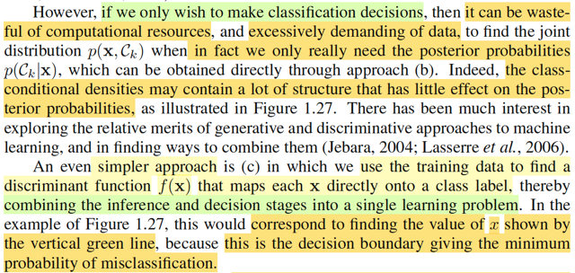</kbd>

<kbd>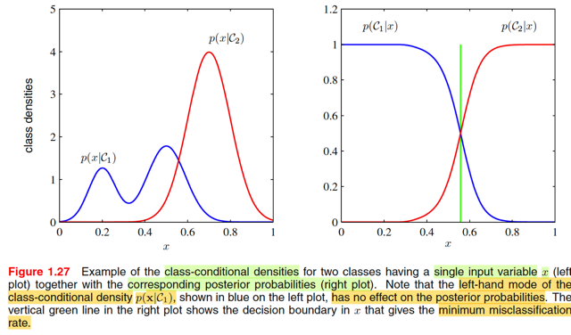</kbd>

> [!NOTE]
> Tuy nhiên, nếu như ta chỉ muốn làm bài toán classification thì việc học ra joint 
> distribution f(**x**, t) là quá lãng phí. Vì như đã biết, cũng như trong cách b, 
> để phân loại, ta chỉ cần dựa trên posterior f(t|**x**). 
>
>
>
> Nên sẽ ít tốn kém hơn nếu ta học trực tiếp hàm posterior thay vì đi tìm f(**x**, t)
> rồi mới dùng để có posterior.
>
>
>
> Ông nó nói cái ý, f(**x**|t) với t = C1,...CK có những cấu trúc ít ảnh hưởng đến 
> posterior, thì ý là do đó việc làm theo cách a) để tiếp cận bài toán classification
> là không mang lại lợi ích gì cả.
>
>
>
> Ví dụ như trong minh họa bài toán có 2 class C1, C2 và input 1D x này.
>
>
>
> Đồ thị của f(x|C1) và f(x|C2) ở bên trái cho thấy có các đỉnh.
>
>
>
> Nhưng đồ thị của posterior f(C1|x), f(C2|x) thì lại chẳng phản ánh gì tương
> ứng tại các đỉnh này. Đó là ý gs Bishop nói những structure của class
> conditional density chả có đóng góp gì cho posterior cả.
>
>
>
> Còn cái cách (c), thì chả cần posterior gì, chỉ là học cái mapping function
> nhận vào x, nhả ra C1 hay C2...
>
>
>
> MInh họa trong hình gs nói, nó sẽ tương ứng với việc ta tìm cách học ra
> function: f(x) sau đây: f(x) = C1 nếu x < c, và C2 nếu x > c với c là cái điểm
> ứng với đường màu xanh lá, chính là nơi mà nếu dùng nó để assign class,
> ta sẽ minimize misclassification rate

 

- **Lợi ích của Posterior**

<kbd>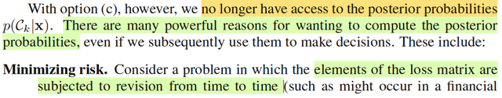</kbd>

<kbd>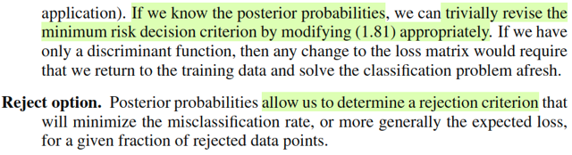</kbd>

> [!NOTE]
> Với c, tuy vậy, ta sẽ ko có posterior,  mà cái này thì rất hữu dụng.
>
>
>
> Ví dụ, ví dụ như bài toán mấy bữa nay làm, khi ta define ra cái loss matrix
> quy định mức phạt khác nhau cho các loại error khác nhau. Nếu ta làm
> theo cách làm bữa trước, thì khi muốn thay đổi loss matrix, thì chỉ việc thay
> đổi, cái posterior sẽ được cập nhật theo rất đơn giản (trivially). Còn nếu ta
> làm theo cách c, ta phải train lại từ đầu (afresh)
>
>
>
> Hơn nữa, posterior sẽ giúp ta có thể reject, ko đưa ra quyết định khi cảm
> thấy ko chắc

 

- **Điều chỉnh phân phối hậu nghiệm**

<kbd>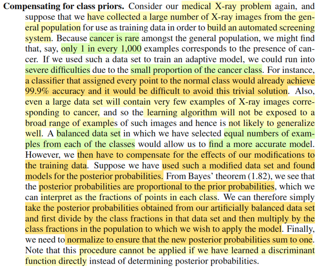</kbd>

> [!NOTE]
> Rồi đoạn này nói về một ý nữa mà việc dùng posterior sẽ mang lại lợi ích
> mà  cách làm (c) ko có:
>
>
>
> Ví dụ như trong bài toán phân loại cancer hay ko cancer từ ảnh chụp X
> quang mà ta đang làm bữa giờ. thì có có vấn đề này (là cái mà mr Andrew
> Ng đã nói trong MLSpec: **Skewed dataset**). Trong thực tế, số ca cancer là ít
> hơn nhiều so với không cancer (này nói ở đâu chứ ko phải Việt Nam). Nên
> dễ hiểu là giả sử tỉ lệ cancel trong dân số chỉ là 0.1%, thì một cái mô hình
> tào lao nhận vào input x và luôn trả ra là ko cancer, sẽ vẫn có thể có kết
> quả chính xác rất cao.
>
>
>
> Rồi, và vì số ca cancer ít, nên x-ray cancer cũng ít hơn x-ray ko cancer,
> nên nếu dùng chúng để training mô hình thì có thể sẽ không hiệu quả. Khi
> đó ta có thể tạo một dataset cân bằng hơn giữa có và không cancer.
>
>
>
> Nhưng vấn đề là, posterior, f(t|**x**) theo bayes rule = f(**x**|t)f(t)/f(**x**), nên dễ thấy
> nó sẽ tỉ lệ thuận với f(t) - tức priori.
>
>
>
> Thành ra, một khi mà ta đã "chỉnh sửa": bằng cách tạo dataset cân bằng
> hơn, ta đã thay đởi prior distribution.
>
>
>
> Do đó, cách làm là, sau khi dùng data cân bằng để học ra posterior, ta  sẽ
> lấy cái posterior scale lại với tỉ lệ của prior, và normalizing lại. Vầy nè:
>
>
>
> Giải sử có C1, C2, Trong đó f(C1) = 0.9 f(C2) = 0.1 (tức hàm ý, 10 người
> thì 9 ca ko cancer, 1 người có cancer)
>
>
>
> sau khi dùng một dataset cân bằng (50% là hình có cancer, 50% là hình
> không cancer) để train ra posterior f(t|**x**)
>
>
>
> Ta sẽ điều chỉnh lại:
>
>
>
> f^(C1|**x**) = f(C1|**x**) * 0.9/c
>
>
>
> và
>
>
>
> f^(C2|**x**) =  f(C2|**x**) * 0.1/c
>
>
>
> với c là normalizing constant giúp f^(C1|**x**) + f^(C2|**x**) = 1
>
>
>
> như vậy lúc này posterior sau điều chỉnh đã phản ánh lại được tỉ lệ mắc
> bệnh / không mắc bệnh của prior.
>
>
>
> Nên cái này gọi là Đền bù (compensate) lại class prior
>
>
>
> Mấu chốt là, nếu làm theo (c) ta sẽ ko làm vậy được

 

- **Naive Bayes và độc lập điều kiện**

<kbd>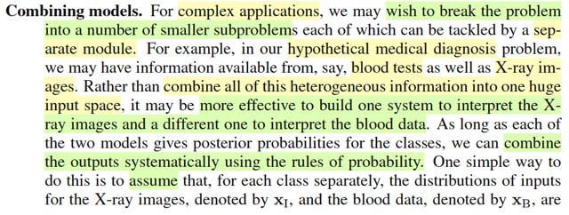</kbd>

<kbd>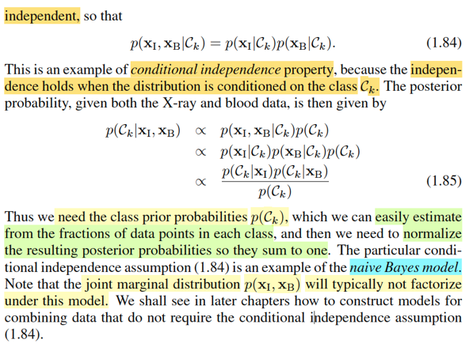</kbd>

> [!NOTE]
> Đại ý là, một công dụng nữa của cách tiếp cận posterior là ta giải quyết một bài
> toán phức tạp bằng cách tách nó ra thành các bài toán đơn  gỉan hơn.
>
>
>
> Ví dụ: Dự đoán bệnh cancer hay không dựa trên ảnh X-quang và kết  quả xét
> nghiệm máu. Khi đó ta muốn xây dựng posterior: f(t|**x**I, **x**B)  distribution
> của T dựa trên vector X-ray image **x**I, và kết quả xét nghiệm máu **x**B
>
>
>
> thì đại khái là, bằng cách đặt assumption rằng f(**x**I,**x**B|Ck) =
> f(**x**I|Ck)f(**x**B|Ck) ta sẽ dựa trên Bayes rule như thường lệ để xây dựng
> posterior:
>
>
>
> f(t|**xI**,**xB**) = f(**xI**,**xB**|Ck)f(Ck)/f(**xI**,**xB**)
>
>
>
> ∝ f(**xI**,**xB**|Ck)f(Ck)
>
>
>
> ∝ f(**xI**|Ck)f(**xB**|Ck)f(Ck)
>
>
>
> ∝ [f(Ck|**xI**)f**(xI**)/f(Ck)] [f(Ck|**xB**)f(**xB**)/f(Ck)] f(Ck) | dùng Bayes rule với f(xI|Ck),
> f(xB|Ck)
>
>
>
> ∝ f(Ck|**xI**) f(**xI**) f(Ck|**xB**) f(**xB**) / f(Ck)
>
>
>
> ∝ f(Ck|**xI**) f(Ck|**xB**) / f(Ck) | bỏ f(**xI**), f(**xB**) là constant
>
>
>
> f(Ck), prior của T thì có thể xấp xỉ bằng cách dùng tỉ lệ class Ck trong data.
>
>
>
> Như vậy là ta đã có thể có f(t|**xB**,**xI**). Đây chính là Naive Bayes. 
>
>
>
> Nói nó Naive
> (ngây thơ) là vì, ta đang giả định là dựa trên T = Ck thì **X**_image và **X**_blood
> độc lập. Nhưng sự thật đâu phải vậy, ví dụ, nếu đã biết là Ck rồi, thì việc biết
> ảnh **X_image** có thể đoán được chỉ số máu **X_blood**

 

- **Lý thuyết quyết định trong hồi quy**

<kbd>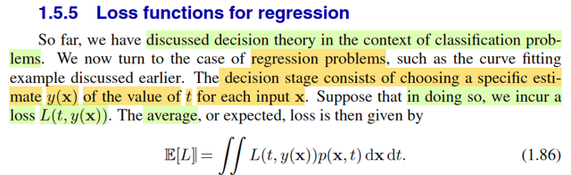</kbd>

> [!NOTE]
> Chuyển qua bài toán decision theory trong linear regression. Trong đó,  ta
> đưa ra dự đóan t = y(**x**) cho mỗi input **x**, mỗi một dự đoán như vậy, tạo
> ra loss L(t, y(**x**)). Và average loss E[L] theo công thức 1.86. Vì sao?
>
>
>
> Đơn giản, L(**t**,y(**x**)) là hàm, nên Loss = L(**T**, y(**X**)) là random
> variable   tạo ra bởi việc áp một hàm số lên hai random variable T, **X**. Và
> như đã học ở Stat110, Casella, 2D LOTUS cho phép ta tính EZ của Y = g(X,
> Y) dựa theo joint pdf/pmf f(x,y) của X, Y:
>
>
>
> EZ = Eg(X,Y) = ∫∫g(x,y)f(x,y)dxdy
>
>
>
> Vậy thì đây cũng vậy, LOTUS cho phép tính EL dựa theo joint distribution
> của T, **X**
>
>
>
> E[L] = ∫∫L(t, y(**x**)) f(t,**x**) d**x** dt

 

- **Tối ưu squared loss hồi quy**

<kbd>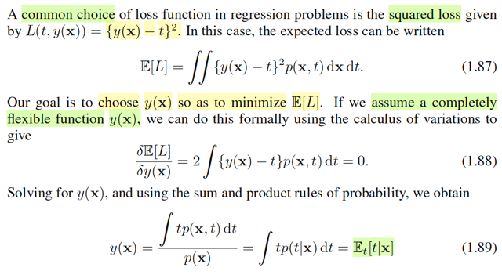</kbd>

<kbd>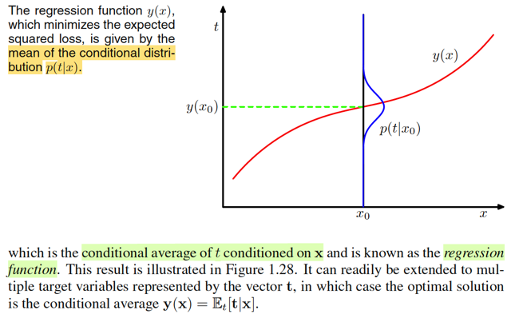</kbd>

> [!NOTE]
> Một lựa chọn phổ biến cho loss trong regression problem là squared loss, L(t, y(**x**)) = (y(**x**)
> - t)^2
>
>
>
> khi đó E[L] = ∫∫[y(**x**) - t]^2 f(**x**, t) d**x** dt
>
>
>
> Đến đây, mình hiểu là ta sẽ coi E[L], như một hàm g(y, t) để thử derive y khiến minimize g(y, t).
>
>
>
> Dùng đạo hàm, điều kiện cần tối ưu bậc nhất: đạo hàm đối y của g = 0 để tìm critical point:
>
>
>
> ∂/∂y g(t,y) = 0
>
>
>
> ⇔ ∂/∂y ∫∫[y(x) - t]^2 f(**x**, t) d**x** dt = 0
>
>
>
> Đạo hàm của tích phân, mình còn nhớ trong Casella có nói đến theorem nói rằng trong một số
> điều kiện, có thể đổi chỗ hai cái này, (trường hợp này là khi cận tích phân ko phụ thuộc y(**x**))
>
>
>
> Ở đây có lẽ là thỏa điều kiện đó.
>
>
>
> ⇔ ∫∫ ∂/∂y(**x**) {[y(**x**) - t]^2 f(**x**, t)} d**x** dt = 0
>
>
>
> ⇔ ∫∫ [∂/∂y(**x**) [y(**x**) - t]^2] f(**x**, t) d**x** dt = 0
>
>
>
> Xét ∂/∂y(x) [y(x) - t]^2
>
>
>
> = ∂/∂[y(**x**)-t] [y(**x**) - t]^2 . d/dy(**x**) [y(**x**) - t]
>
>
>
> = 2[y(**x**) - t]
>
>
>
> .. ⇔ ∫∫ 2[y(**x**) - t] f(**x**, t) d**x** dt = 0
>
>
>
> ⇔ 2 ∫∫ [y(**x**) - t] f(**x**, t) dx dt = 0
>
>
>
> ⇔ ∫∫ y(**x**) f(**x**, t) d**x** dt - ∫∫ t f(**x**, t) d**x** dt = 0
>
>
>
> ⇔ ∫∫ y(**x**) f(**x**, t) d**x** dt = ∫∫ t f(**x**, t) d**x** dt
>
>
>
> Xét vế trái:
>
>
>
> ∫∫ y(**x**) f(**x**, t) d**x** dt = ∫_range X ∫_range_T y(**x**) f(**x**, t) dt d**x**
>
>
>
> = ∫_range_**X** y(x) {∫_range_**T**  f(**x**, t) dt}  d**x**
>
>
>
> ∫_range_T  f(x, t) dt chính là marginalizing joint pdf của **X**, T với mọi mọi T, sẽ được
> marginal pdf của **X**
>
>
>
> .. = ∫_range_**X** y(**x**) f(**x**) d**x**
>
>
>
> Xét vế phải:
>
>
>
> ∫∫ t f(**x**, t) d**x** dt = ∫_range **X** [∫_range **T** t f(**x**, t)  dt ] d**x**  Vậy phương trình trở
> thành ∫_range_**X** y(**x**) f(**x**) d**x** = ∫_range **X** [∫_range T t f(**x**, t) dt ] d**x**
>
>
>
> Vì tính chất complete flexible của y(**x**), cho phép:
>
>
>
> ⇔ y(**x**) f(**x**)= ∫_range T t f(**x**, t) dt
>
>
>
> ⇔ y(**x**) = [∫_range T t f(**x**, t) dt] / f(**x**)
>
>
>
> = [∫_range T t f(t|**x**) f(**x**) dt] / f(**x**)
>
>
>
> = [∫_range T t f(t|**x**) dt] f(**x**) / f(**x**)
>
>
>
> = ∫_range T t f(t|**x**) dt
>
>
>
> Đây chính là E(T|**x**), trung bình của  T ~ posterior distribution f(t|**x**)
>
>
>
> Như vậy, khi dùng squared loss thì cái hàm y(**x**) giúp minimize trung bình loss E[L] chính là
> cái hàm y(**x**) dùng mean của posterior f(t|**x**) để dự đoán.
>
>
>
> Thật ra cái này trong Casella đã học rồi cụ thể là khi ta học về Bayes estimator cho θ, thì ta đi
> tìm posterior π(θ|**x**).
>
>
>
> Lúc này nếu muốn có point estimator cho θ, ta có thể lấy mean, hoặc median, và chúng đều là
> Bayes estimator.
>
>
>
> Nhưng mean, E[θ|**x**] sẽ là cái Bayes estimator giúp **minimize Bayes risk khi loss là square
> error loss**. Còn median của posterior sẽ là Bayes estimator giúp **giảm Bayes risk là absolute error
> loss**.
>
>
>
> Ôn lại chút loss function, risk function, Bayes risk trong Casella:
>
>
>
> Loss function, là hàm của estimator L_θ(δ(**X**), θ), có thể là square error loss: [δ(**X**) - θ]^2
> hoặc absolute error loss: |δ(**X**) - θ|.
>
>
>
> Risk function: E_θ[L(δ(**X**), θ)], mang ý nghĩa: Average loss over mọi **X**, để còn lại là hàm
> theo θ, để so với nhau giúp evaluate δ(**X**).
>
>
>
> Bayes risk = ∫_Θ R(δ(**X**), θ) π(θ) dθ = ∫_Θ ∫_**X** L(δ(**x**), θ) f(θ, **x**) d**x** dθ
>
>
>
> Vậy ở đây cũng y chang, cái E[L] mà gs Bishop nói ở đây chính là tương đương với Bayes risk 
> (lấy kì vọng của Loss dưới joint distribution của T và **X** f(**x**, t))
>
>
>
> Do đó kết quả cũng là: khi ta muốn từ posterior f(t|**x**) để đưa ra một point estimator
> cho T thì mean E[T|**x**] sẽ là cái giúp giảm thiểu E[L], y như E[θ|**x**] là point estimator cho θ giúp
> giảm thiểu Bayes risk khi loss là squared error vậy
>
>
>
> và ở trong sách Bishop đoạn này, dù ko nói, ta cũng đoán được, nếu muốn giảm thiểu average
> absolute loss, thì nên dùng median của posterior.
>
>
>
> Và từ đây cũng giúp mình nhớ lại để hiểu vì sao trong bài revising curve fitting, ta thấy gs
> Bishop assume Ti ~ Normal(y(xi,**w**), 1/β), hành động này chính là dùng mean của posterior
> f(ti|xi), tức E[Ti|xi] để làm point estimate cho t, và theo decision theory, nó là tối ưu. Nếu ông
> dùng median của posterior để point estimate cho T thì nó sẽ cũng là tối ưu nhưng theo tiêu chí
> giảm thiểu average absolute error loss.
>
> Sẵn tiện đang nói bài toán linear regression, sẽ có ích nếu ta ôn lại chút.
>
>
>
> Nhớ lại một nhận định khi ta làm bài toán curve-fitting theo Bayesian approach và cũng đã thấy rằng maximize
> likelihood chính là giải bài toán curve fitting với error function là sum squared error. Để thấy rằng vì sao khi đó:
>
>
>
> Còn nhớ, trong bài toán đó, cụ thể là phần Revisiting curve fitting problem, nơi mà gs Bishop dắt ta quay lại xem
> xét bài toán polynomial curve fitting theo góc nhìn xác suất thì ông đưa ra những thay đổi sau: đầu tiên, ứng với
> mỗi xi, coi Ti là một random varible, để phản ánh tính uncertainty của nó.
>
>
>
> Và assume distribution của nó là Ti ~ Normal(y(xi, **w**), 1/β)
>
>
>
> và cái assumption này cũng chính là assume Ei = Ti - y(xi, **w**), tức sai số của dự  đoán và giá trị thật sẽ là một
> Normal(0, 1/β).
>
>
>
> Chú ý, cho tới đây, **w**, tham số của polynomial function, vẫn đang được coi như fixed & unknown, nên y(xi,
> **w**) cũng vậy, fixed & unknown, báo hiệu rằng ta vẫn đang ở trong trường phái cổ điển.
>
>
>
> Rồi, từ đó, ta mới xây dựng joint distribution của T1,...TM f**T**(**t**). Nhờ tính chất độc lập của các cặp (xi, Ti) ta
> mới phân tách joint probability bằng tích marginal probability
>
>
>
> fT(**t**) = Πi=1:N f(ti)
>
>
>
> Thể hiện sự phụ thuộc với xi, **w**, β ta sẽ có:
>
>
>
> f**T**(**t**|**x**, **w**, β) = Πi=1:N f(ti|**w**, xi, β)Tới đây sao nữa? Nhớ lại các cách tiếp cận trong Casella trong bài toán point estimator cụ thể là maximum
> likelihood estimator.
>
>
>
> Theo định nghĩa θ^_ml(**X**) = argmax_θ L(θ|**X**), là θ giúp giải thích hợp lí nhất cho gía trị quan sát được của
> **X**. Với hàm likelihood được định nghĩa là L(θ|**x**) = f(**x**|θ) Do đó θ^_ml(X) = argmax_θ f(**x**|θ).
>
>
>
> Vậy thì ở đây, để đi tìm **w** (cũng chính là tìm y(xi,**w**), ta cũng có thể đi theo hướng này, đó là, tìm **w** giúp
> giải thích hợp lí nhất cho giá trị quan sát được t1,t2..tNứng với x1,..xN (chú ý, chỉ có T là random variable,
> chứ **X** thì không, nên vector **x** không phải là giá trị quan sát được của vector random variable **X** nào cả.
>
>
>
> **w**_ML = argmax_**w** L(**w**|**t**)
>
>
>
> và likelihood L(**w**|**t**) cũng define bởi f(**t**|**x,w**,β) = Πi=1:N f(ti|xi,**w**,β) với f là pdf của Normal(y(xi,
> **w**), 1/β)
>
>
>
> nên bài toán là: maximize Πi=1:N f(ti|xi,**w**,β)
>
>
>
> và cũng dùng các trick để đưa về bài toán tối ưu tương đương, như thay maximize objective likelihood bằng
> minimize - log likelihood,..ta sẽ giải ra **w**_ML. và tương tự (1/β)_ML
>
>
>
> Và khi làm vậy ta sẽ thấy, bài toán tối ưu tương đương giúp tìm w_ML chính là đi minimize error function là sum
> squared error Σi (y(**w**,xi) - ti)^2 mà trong phần đầu tiên, khi làm quen với bài toán polynomial curve fitting ta đã
> làm (lúc đó chưa theo góc nhìn xác suất gì cả)
>
>
>
> -----
>
>
>
> Trước khi recall tiếp phần Bayesian inference, ta nhắc lại nhận định rút ra được trong note liền trước (khi có
> posterior f(t|x) thì dùng mean của nó để point estimator cho T chính là cách để minimize average squared error
> loss)
>
>
>
> Khi gs Bishop giả định Ti ~ Normal(y(xi,**w**), 1/β) thì chính là dùng mean của posterior f(ti|xi): E[Ti|xi] để làm
> point estimate cho T thì **theo decision theory**:
>
>
>
> Nếu theo tiêu chí giảm thiểu **average square error loss** của decision theory: lấy E[Ti|xi], tức **mean** của f(ti|xi) 
>
>
>
> Nếu theo tiêu chí giảm thiểu **average absolute error** **loss** thì ta cần lấy **median** của f(ti|xi)
>
>
>
> Nhưng việc nhắc đến square loss của decision theory vừa rồi không liên quan gì đến việc khi ta maximize
> likelihood dưới giả định Ti ~ normal(y(xi,**w**),1/β) ta thấy nó hóa ra cũng là minimize sum squared error, cái này
> chỉ là trùng hợp.
>
>
>
> Vì giả sử ta assume Ti là expo(y(xi,**w**)), hay distribution nào khác: tức cũng là mean của posterior f(ti|xi), để
> rồi đi maximize likelihood, khi đó, ta sẽ thấy nó chưa chắc đã là minimize sum squared error. Tuy nhiên, miễn là
> ta lấy mean của posterior f(ti|xi) để làm point estimator cho T thì theo decision theory, đó vẫn là tốt nhất theo tiêu
> chí giảm average squared error loss.
>
>
>
> ------
>
>
>
> Sẵn trớn recall lại luôn: Sau đó, qua phần Bayesian inference, gs Bishop bắt đầu mới nói về việc trong
> Bayesian, ta sẽ coi tham số **w, cũng là random variable nốt**, từ đó viết hoa **W** để chỉ random variable
> vector. Mà cái này như mình đã biết ở Casella, khi ta bước sang trường phái Bayesian, thì ta cũng coi θ là
> random quantity. Để rồi nó sẽ có prior distribution π(θ), thường được chọn do kinh nghiệm của experimenter,
> sau đó dùng Bayes theorem, ta tìm distribution của θ khi đã biết **X** = **x**: π(θ|**x**) = f(**x**|θ) π(θ) /
> f(**x**). Áp dụng vài bài toán curve fitting. Ta sẽ chọn Normal(0, (1/α)**I**) làm priori.
>
>
>
> Áp dụng Bayes theorem, xây dựng posterior:
>
>
>
> π(**w**|**t**,**x**,β,α) = f(**t**|**x**,**w**,β) π(**w**|α) / f(**t**|**x**)
>
>
>
> Với f(**t**|**x**,**w**,β) là joint distribution của T1,..Ti, = Πi=1:N f(ti|xi,**w**,β) = Πi=1:N Normal(ti|y(xi,**w**),1/β)
>
>
>
> Còn π(**w**|α) là priori = Normal(**w**|0,(1/α)***I**)
>
>
>
> Đến đây, nếu trong Casella, khi nói về Bayes estimator, sau khi xây dựng posterior xong, ta sẽ lấy mean hay
> median của nó để làm point estimator cho θ. Cụ thể, E[θ|**x**] chính là Bayes estimator giúp minimize Bayes risk
> function khi loss dùng squared error loss. Còn khi loss dùng absolute error thì Bayes estimator giúp minimize
> Bayes risk sẽ là median của posterior distribution.
>
>
>
> Còn trong Bishop, một hướng đi, là ta đi tìm **w** giúp maximize cái posterior π(**w**|t,x) này. Mà thực ra, trong
> bài toán này p**osterior hóa ra cũng là Gaussian**, nên tìm w có posterior lớn nhất **cũng là lấy mean của
> posterior** thôi
>
>
>
> Và khi đó ta sẽ thấy cách làm này cũng sẽ chính là tương đương với giải bài toán regularized least square: tức
> là minimize sum squared error với regularization term là hàm bậc hai của **w**.
>
>
>
> Và khi có **w*** maximize posterior rồi thì ta có thể dùng nó để dự đoán cho new x: y(x, **w***)
>
>
>
> Cũng đồng nghĩa là lấy mean của f(t|x,**w***) là Normal(y(x, **w***), 1/β) để dự đoán cho t.
>
>
>
> Nhưng cách làm Bayesian toàn diện hơn: là bằng cách marginalizing over **w** của f(t,**w**|x,**x,t**) ta sẽ có
> f(t|x, **x**,**t**) không phụ thuộc **w**, tức là predictive distribution:
>
>
>
> f(t|x,**x**,**t**) = ∫f(t,**w**|x,**x**,**t**)d**w** = ∫f(t|x, **w**) π(**w**|**x**,**t**) d**w** với π(**w**|**x**,**t**) là posterior của **w**.

 

- **Lý thuyết quyết định trong hồi quy**

<kbd>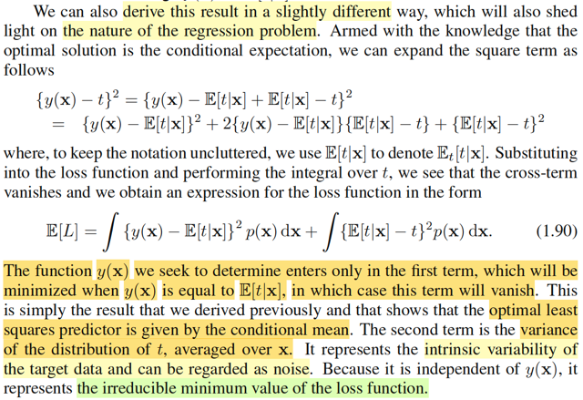</kbd>

> [!NOTE]
> Vì ta đang deal với những công thức rất phức tạp, cảm thấy cần thiết phải liên tục liên kết các kiến thức Bishop với Casella nên
> mình nên  tóm tắt bối cảnh chút xíu: Phần này đang nói về decision theory apply cho bài toán regression. Như đã biết, quá trình giải
> bài toán học máy thường sẽ bao gồm giai đoạn inference, và dựa trên đó, kết hợp với decision theory để đưa ra quyết định sao cho
> tối ưu.
>
>
>
> Giai đoạn inference, đối với bài toán regression, có thể coi như là đi tìm predictive distribution, f(t|**x**), là posterior distribution của t
> (vs prior distribution là f(t) - phân phối marginal của t).
>
>
>
> Và dựa trên đây, decision theory sẽ cho ta biết sẽ nên dự đoán T là gì.
>
>
>
> Thế thì giống như trong Casella, khi nói về Bayes estimator cho θ, ta bắt đầu coi θ là random variable, để rồi đi tìm posterior của nó
> π(θ|**x**). Khi đó, câu hỏi là, vậy ta nên point estimate cho θ thế nào, vì yêu cầu vẫn là point estimate. Câu trả lời là, mình mới nói
> về loss và risk function trước: Loss function L(δ(**x**), θ) được định nghĩa là hàm phản ánh sai số giữa  estimate δ(**x**) và θ, có
> thể dùng squared difference [δ(**x**) - θ]^2 hoặc absolute difference |δ(**x**) - θ|. Và ý nghĩa của L(δ(**x**), θ) là: với observed **X**
> = **x** như vậy, và θ như vậy, thì theo quy trình của δ(**.**) để tính ra δ(**x**) estimate cho θ, thì sai số là bao nhiêu.
>
>
>
> Để rồi sau đó, ta muốn đánh giá khả năng của δ(**X**) một cách tổng quát,xét trên mọi giá trị khả dĩ **x** của **X** luôn, bằng cách
> tính trung bình của loss trên mọi **x**: E_θ[L(δ(**X**), θ], đây chính là risk function, và nó chỉ còn là một hàm theo θ. Từ đó, ta có
> thể so sánh risk function của δ(**X**) này với risk function của δ(**X**) khác, xem với θ cụ thể thì cái nào nhỏ hơn (có nghĩa là
> estimator đó tốt hơn), và từ đó, bằng cách minimize cái risk, ta sẽ có được cái tốt nhất.
>
>
>
> Nhưng nếu tiếp cận theo Bayesian, θ cũng là biến, khi đó R(δ(X), θ) cũng là biến ngẫu nhiên tạo bởi θ, nên ta có thể tính kì vọng
> của nó, dưới phân phối prior của θ, E[R(δ(**X**), θ)] = ∫_Θ R(δ(**X**), θ)) π(θ) dθ, đây là Bayes risk biến đổi chút nó sẽ bằng
>
>
>
> i) ∫_X [ ∫_Θ L(θ, δ(**x**)) π(θ|**x**) dθ ] f(**x**) d**x**, thì ∫_Θ L(θ, δ(**x**)) π(θ|**x**) dθ là E[L(θ, δ(**x**)|**X**=**x**] là posterior
> expected loss (kì vọng của loss, là hàm theo θ, với θ ~ posterior)
>
>
>
> ii) ∫_X ∫_Θ L(θ, δ(**x**) f(**x**, θ) d**x** dθ, đây là kì vọng của loss, dưới joint distribution của X và θ.
>
>
>
> Và khi ta giải bài toán minimize Bayes risk với loss là squared error thì δ(x) tìm được sẽ chính là mean của posterior E[θ|**x**].
>
>
>
> Vậy thì ở phần này trong sách Bishop, ông đang đặt vấn đề tương tự: Ta có posterior distribution f(t|**x**) thì nên predict T bằng
> mấy thì sẽ tối ưu theo decision theory? (cũng chính là y chang trong Casella rằng ta đã có posterior π(θ|**x**) thì nên point estimate
> cho θ bằng bao nhiêu để tối ưu)
>
>
>
> Để trả lời, ông Bishop mới tính kì vọng của loss với loss tính bằng squared error dưới joint distribution của **X**, T f(**x**, t). Dưới
> ánh sáng của cuốn Casella, mình  thấy rõ đây chính là tương ứng với Bayes risk.
>
>
>
> Và ta mới đi minimize cái E[L] này bằng giải tích, kết quả cho ra y như trong Casella: Là mean của posterior E[T|**x**]
>
>
>
> Trong Casella, khi mininize Bayes risk để chứng minh kết quả tương tự, ta  làm hơi khác: là xem xét Bayes risk theo công thức i)
> để rồi, thứ cần minimize là cái posterior expected loss E[L(θ, δ(**x**)|**X**=**x**] (vì nó mới dính tới δ)
>
>
>
> minimize E[(δ(**x**) - θ)^2] |**X**=**x**], và ví dụ 2.2.6 Chap 2 của Casella nói rằng b khiến minimize E[(X - b)^2] chính là b = EX
> nên sẽ cho phép kết luận  δ(x) khiến minimize E[(δ(**x**) - θ)^2] |**X**=**x**] chính là E[θ|**x**].
>
>
>
> (Trong ví dụ đó, mình cũng chứng minh bằng 2 cách, calculus và cách thứ hai sẽ cũng chính là cách mà phần này gs Bishop nói
> tới)
>
>
>
> Do đó, để có thể hiểu là gs Bishop làm gì ở đây, mình sẽ viết lại cách chứng minh thứ hai:
>
>
>
> Chứng minh minimize_b E[(X - b)^2]
>
>
>
> Xét hàm mục tiêu E[(X - b)^2] = E[(X - EX + EX - b)^2]
>
>
>
> = E[(X - EX)^2 + (EX - b)^2 +2(X - EX)(EX - b)]
>
>
>
> = E[(X - EX)^2] + E[(EX - b)^2] +2E[(X - EX)(EX - b)]
>
>
>
> Xét: E[(X - EX)(EX - b)]
>
>
>
> Với phép tính này, thì EX-b coi như constant, nên dùng tính linearity của expectation: E[cX] = cEX ⇨ E[(X - EX)(EX - b)] = (EX - b)
> E[(X - EX)] = (EX - b)(EX- E[EX]) = (EX - b)(EX - EX) = (EX - b)*(0) = 0
>
>
>
> ⇨ .. = E[(X - EX)^2] + E[(EX - b)^2]
>
>
>
> Bài toán trở thành minimize_b E[(X - EX)^2] + E[(EX - b)^2]
>
>
>
> tương đương minimize_b E[(EX - b)^2] (bỏ term ko liên quan biến tối ưu b đi)
>
>
>
> và cái này là kì vọng của một hàm không âm, nên cũng không âm, do đó, giá trị nhỏ nhất của nó là = 0, xảy ra khi b = EX. Chứng
> minh xong.
>
>
>
> Áp dụng y chang để chứng minh E[θ|**x**] cũng là minimizer của Bayes risk:
>
>
>
> minimize_δ(**x**) ∫_**X** [ ∫_Θ L(θ, δ(**x**)) π(θ|**x**) dθ ] f(**x**) d**x**
>
>
>
> dĩ nhiên tương đương minimize_δ(**x**) ∫_Θ L(θ, δ(**x**)) π(θ|**x**) dθ, vì chỉ có cái nhân này mới phụ thuộc biến tối ưu δ(**x**), nếu
> nó nhỏ nhất, thì tích phân trên toàn miền range X cũng sẽ nhỏ nhất.
>
>
>
> Và again, cũng là minimize E[L(δ(**x**), θ)|**X**=**x**], tức posterior expected loss.
>
>
>
> Với L(δ(**x**), θ) = [δ(**x**) - θ]^2 thì bài toán có thể chứng minh y chang theo cách trên:
>
>
>
> E[L(δ(**x**), θ)|**X**=**x**] = E[[δ(**x**) - θ]^2|**X**=**x**]
>
>
>
> = E[[δ(**x**) - E(θ|**X**=**x**) + E(θ|**X**=**x**) - θ]^2|**X**=**x**]
>
>
>
> = E[[δ(**x**) - E(θ|**X**=**x**)]^2 + [E(θ|**X**=**x**) - θ]^2 + 2(δ(**x**) - E(θ|**X**=**x**))(E(θ|**X**=**x**) - θ) |**X**=**x**]
>
>
>
> = E{[δ(**x**) - E(θ|**X**=**x**)]^2 |**X**=**x**} + E{[E(θ|**X**=**x**) - θ]^2|**X**=**x**} + 2E{(δ(x) - E(θ|**X**=**x**))(E(θ|**X**=**x**) - θ)
> |**X**=**x**}
>
>
>
> Xét 2E{(δ(**x**) - E(θ|**X**=**x**))(E(θ|**X**=**x**) - θ) |**X**=**x**}
>
>
>
> = 2(δ(**x**) - E(θ|**X**=**x**) E{E(θ|**X**=**x**) - θ |**X**=**x**}
>
>
>
> = 2(δ(**x**) - E(θ|**X**=**x**) {E[E(θ|**X**=**x**)] - E[θ|**X**=**x**]}
>
>
>
> = 2(δ(**x**) - E(θ|**X**=**x**) {E(θ|**X**=**x**) - E[θ|**X**=**x**]}
>
>
>
> = 2(δ(x) - E(θ|X=x) {0}
>
>
>
> = 0
>
>
>
> Và bài toán cũng trở thành minimize_δ(**x**) = E{[δ(**x**) - E(θ|**X**=**x**)]^2 |**X**=**x**} + E{[E(θ|**X**=**x**) - θ]^2|**X**=**x**}
>
>
>
> tương đương minimize_δ(x)  E{[δ(**x**) - E(θ|**X**=**x**)]^2 |**X**=**x**}
>
>
>
> kết qủa là δ(**x**) = E(θ|**X**=**x**), là mean của posterior π(θ|**x**).
>
>
>
> nói chung chỉ là nhìn nó rắc rối là do nó đeo thêm cái đuôi conditional on **X**=**x** để nhắc nhở rằng θ là biến ngẫu nhiên đang
> tuân theo distribution là posterior π(θ|**x**) thôi.
>
>
>
> Và giờ mình xét qua phần trình bày của giáo sư Bishop để chỉ ra hoàn toàn y hệt:
>
>
>
> ------
>
>
>
> Giải bài toán tìm y(x) giúp minimize E[L(y(x), t)] dưới phân phối joint f(t,x) 
>
>
>
> PHẦN DƯỚI ĐÂY XIN QUY ƯỚC TẤT CẢ CHỮ x ĐỀU TỰ HIỂU LÀ VIẾT ĐẬM (**x**) ĐỂ ĐỠ MẤT THỜI GIAN GÕ,
>
>
>
> Hàm mục tiêu E[L(y(x), t)] = ∫∫ L(y(x),t) f(x,t)dxdt (tự hiểu hai cái tích phân là theo range T và **X**, y như tích phân ∫_X ∫_Θ ở trên
> vậy)
>
>
>
> Thay squared error loss vào:
>
>
>
> Hàm mục tiêu = ∫∫ {y(x) - t}^2 f(x,t)dxdt
>
>
>
> = ∫∫ {y(x) - t}^2 f(t|x)f(x)dxdt
>
>
>
> = ∫∫ {y(x) - t}^2 f(t|x)f(x)dtdx
>
>
>
> = ∫ [ ∫ {y(x) - t}^2 f(t|x)dt ] f(x)dx
>
>
>
> Bài toán minimize hàm mục tiêu ∫ [ ∫ {y(x) - t}^2 f(t|x)dt ] f(x)dx
>
>
>
> trở thành tương đương minimize cái cụm này, minimize ∫ {y(x) - t}^2 f(t|x)dt
>
>
>
> Và cái cụm này, chính là kì vọng của (y(x) - T)^2 dưới posterior distribution f(t|x): E[(y(x) - T)^2|X=x]
>
>
>
> (Cái cụm ∫ {y(x) - t}^2 f(t|x)dt cũng chính là tương đương với ∫_Θ L(δ(**x**), θ) π(θ|**x**) dθ = E[L(δ(**x**), θ)|**X**=**x**], posterior
> expected loss ở trên)
>
>
>
> Và như để nhắc ta nhớ đây là tính kì vọng dưới posterior distribution của t, chứ ko phải là joint distribution T, X nữa, nên ông
> Bishop mới nói trong sách "we use E[t|x] to denote E_t[t|x]" nhằm nhấn mạnh chỗ này, vì kí hiệu nó đã trở nên quá phức tạp nhưng
> nhờ đối chiếu với Casella nên mình hiểu bản chất.
>
>
>
> Rồi, thế thì bài toán là minimize_y(x) {E[(y(x) - T)^2|X=x]}, để bớt phải đeo cái đuôi X=x nhằm nhắc nhớ T ~ f(t|x), khiến công thức
> trở nên phức tạp như trên đã thấy ta cứ tạm bỏ cái đuôi này, với chú thích T ~ f(t|x) ở cuối là được.
>
>
>
> Ta cũng làm tương tự, biến đổi hàm mục tiêu:
>
>
>
> E[(y(x) - T)^2] = E[(y(x) - ET + ET - T)^2]
>
>
>
> = E[(y(x) - ET)^2 + E[(ET - T)^2] + 2E[(y(x) - ET)(ET - T)]
>
>
>
> Xét cái hạng tử cross term: 2E[(y(x) - ET)(ET - T)]
>
>
>
> Vì đây là đang tính kì vọng theo posterior f(t|x), nên y(x) - ET là constant, đưa ra ngoài, theo tính linearity:
>
>
>
> 2E[(y(x) - ET)(ET - T)] = 2(y(x) - ET) E[(ET - T)]
>
>
>
> = 2(y(x) - ET) [E(ET) - ET]
>
>
>
> = 2(y(x) - ET) [ET - ET]
>
>
>
> = 2(y(x) - ET) . 0
>
>
>
> = 0
>
>
>
> Đây chính là ứng với câu "Substituting into the loss function and performing the integral over t, we see that the cross-term vanishes"
> của gs Bishop.
>
>
>
> Kết quả còn lại: E[(y(x) - ET)^2 + E[(ET - T)^2]  (T ~ f(t|x))
>
>
>
> Nếu tại đây ta lắp E[(y(x) - ET)^2 + E[(ET - T)^2] (T ~ f(t|x)) = ∫ [y(x) - E(T|X=x]^2 f(t|x) dt + ∫ [E(T|X=x) - t]^2 f(t|x) dt
>
>
>
> vô lại ∫ [ hàm mục tiêu ] f(x)dx thì ta sẽ có công thức 1.90 trong sách:
>
>
>
> ∫ [ ∫ [y(x) - E(T|X=x]^2 f(t|x) dt + ∫ [E(T|X=x) - t]^2 f(t|x) dt ] f(x)dx
>
>
>
> ∫∫ [y(x) - E(T|X=x]^2 f(t|x) f(x) dt dx + ∫∫ [E(T|X=x) - t]^2 f(t|x) f(x) dt dx
>
>
>
> ∫∫ [y(x) - E(T|X=x]^2 f(t, x) dt dx + ∫∫ [E(T|X=x) - t]^2 f(t|x) f(x) dt dx
>
>
>
> Xét cụm thứ nhất, cái cụm [y(x) - E(T|X=x]^2 ko phụ thuộc t, nên khi tính tích phân theo t, ta đưa ra
>
>
>
> Cụm thứ nhất = ∫_X [y(x) - E(T|X=x]^2 ∫_T f(t, x) dt dx
>
>
>
> Và ∫_T f(t, x) dt, là marginalizing joint pdf của T, X over range T, sẽ được marginal pdf f(x)
>
>
>
> ⇨ Cụm thứ nhất = ∫_X [y(x) - E(T|X=x]^2 f(x) dx
>
>
>
> .. = ∫_X [y(x) - E(T|X=x]^2 f(x) dx + ∫∫ [E(T|X=x) - t]^2 f(t|x) f(x) dt dx ⇨  Đây chính là 1.90
>
>
>
> ------
>
>
>
> Trong sách, term thứ hai của 1.90 là ∫ {E[T|X=x] - t}^2 f(x) dx. Mình cho rằng: **term thứ hai có vẻ bị viết tắt** hoặc **thiếu phần tích phân theo t**. 
>
>
>
> Dạng đầy đủ về mặt toán học nên là ∫∫ [E(T|X=x) - t]^2 f(t|x) f(x) dt dx, 
>
>
>
> và nhờ vậy mới giúp giải thích khúc dưới.
>
>
>
> -------
>
>
>
> Còn nếu giải tiếp bài tóan tối ưu đang làm thì kết quả như đã biết, sẽ ra y(x) giúp minimize cái này, là E(T|X=x)
>
>
>
> (Ứng với câu trong sách "The function y(x) we seek to determine enters only in the first term, which will be minimized when y(x) is
> equal to E[t|x], in which case this term will vanish", nhắc lại, mình luôn theo notation của chuẩn toán, viết hoa với tên biến ngẫu
> nhiên, viết thường với giá trị biến, còn ông Bishop thì viết thường hết ráo khiến gây lú)
>
>
>
> Để rồi trong 1.90, ∫_X [y(x) - E(T|X=x]^2 f(x) dx sẽ = 0,
>
>
>
> chỉ còn lại ∫∫ [E(T|X=x) - t]^2 f(t|x) f(x) dt dx
>
>
>
> Và đây chính là gì? Để nhìn ra nó là cái gì, hãy phân tích từng cái:
>
>
>
> E(T|X=x) chính là mean của posterior f(t|x)
>
>
>
> Vậy đây là [E(T|X=x) - t]^2 hàm tính ra bình phương của difference giữa T, ~ f(t|x) và mean E[T|X=x)
>
>
>
> Nên ∫∫ [E(T|X=x) - t]^2 f(t|x) f(x) dt dx
>
>
>
> = ∫_{range x} [ ∫_{range t} [E(T|X=x) - t]^2 f(t|x) dt ] f(x) dx
>
>
>
> Cụm  ∫_{range t} [E(T|X=x) - t]^2 f(t|x) dt chính là Variance của T dưới phân phối posterior f(t|x): Var(T|X=x)
>
>
>
> Và ta mới lấy trung bình trên mọi x,  ∫_{range x} [Var(T|X=x) ] f(x) dx
>
>
>
> Thì cái này, gs Bishop gọi nó Variance của distribution của T lấy trung bình trên mọi x. ("The second term is the variance of the
> distribution of t, averaged over x.")
>
>
>
> Và theo gs Bishop, cái này nó phản ảnh độ nhiễu động nội tại của target data, và có thể coi như nhiễu (noise).
>
>
>
> Và vì cái này nó HOÀN TOÀN KHÔNG DÍNH GÌ / PHỤ THUỘC y(x), NÊN NÓ ĐẠI DIỆN GIÁ TRỊ NHỎ NHẤT, LÀ PHẦN KHÔNG
> THỂ GIẢM HƠN NỮA CỦA LOSS FUNCTION.

 

- **Các Phương Pháp Ước Lượng**

<kbd>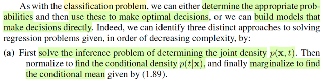</kbd>

<kbd>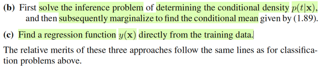</kbd>

> [!NOTE]
> Cũng tương tự như classification problem, cũng có các approaches:
>
>
>
> a) Inference joint pdf f(t,x). Rồi marginalizing ra posterior f(t|x). Và make
> decision:  lấy mean E(T|x)
>
>
>
> b) Inference trực tiếp ra posterior f(t|x). Và make decision: lấy mean
> E(T|x)
>
>
>
> c) Học trực tiếp hàm mapping y(x), không cần inference

 

- **Hàm mất mát Minkowski và q**

<kbd></kbd>

<kbd></kbd>

> [!NOTE]
> Cuối cùng, đại ý là, có những tình huống hàm squared loss sẽ cho ra
> kết quả tệ. Ta phải design hàm loss khác. Một ví dụ là Minkowski loss
>
>
>
> L(y(x), t) = |y(x) - t|^q mà với q = 2 thì nó là squared loss.
>
>
>
> Nhận xét, là với q khác nhau thì hình phạt đối với sai số sẽ khác nhau.
> Vói q = 0.3, có thể thấy loss chỉ nhỉ khi y(x) ≈ t, còn lại thì đều cao.
> q = 1 thì loss sẽ tăng tuyến tính theo sai số. q = 2 thì loss tăng quadratic
> theo sai số. q = 10 thì thì loss nhỏ khi y(x) nằm trong lân cận nào đó
> quanh t, nhưng xa hơn thì tăng rất nhanh.

 

## 1.6 Information Theory

 

### Lý thuyết thông tin

<kbd></kbd>

> [!NOTE]
> Phần cuối của chap 1, gs sẽ nói về một số key concept của Information
> Theory đóng vai trò hữu ích cho bài toán machine learning bên cạnh hai trụ
> cột lí thuyết xác suất và quyết định.
>
>
>
> Sau này, mình sẽ đọc kĩ hơn trong cuốn của Mac Kay

 

#### Định nghĩa lượng thông tin

<kbd></kbd>

<kbd></kbd>

> [!NOTE]
> Rồi, đầu tiên là xét một biến rời rạc (discrete) X (như đã nói, trong notebook
> này mình sẽ theo quy chuẩn kí hiệu chuẩn thống kê, viết hoa cho tên biến, còn
> gs Bishop viết thường khiến mình dễ lú lẫn).
>
>
>
> Thế thì, lí thuyết thông tin bắt đầu với việc: ta muốn đặt ra một đại lượng để đo
> mức độ thông tin nhiều hay ít ẩn chứa trong một event. Sao cho nếu một event
> mà gây ngạc nhiên càng lớn thì thông tin nó chứa càng lớn và ngược lại.
>
>
>
> Và độ ngạc nhiên của một event sẽ dễ thấy hợp lí khi ta gắn nó với xác suất
> của event: event càng ít xảy ra (xác suất thấp) mà nó xảy ra, thì ta sẽ ngạc
> nhiên nhiều. Ngược lại, event có xác suất cao, mà xảy ra thì ta không ngạc
> nhiên mấy.
>
>
>
> Do đó, đại lượng thông tin, của event gắn với X, sẽ dựa trên xác suất của X
> (pmf)
>
>
>
> Ngoài ra, trực giác cũng cho ta thấy: Nếu hai event không liên quan đến nhau
> mà cùng xảy ra, thì sẽ hợp logic nếu cho rằng lượng thông tin có được là tổng
> lượng thông tin của cả hai event: h(x,y) = h(x) + h(y)
>
>
>
> Trong khi đó, lí thuyết xác suất cho ta biết, nếu hai biến X, Y độc lập thì joint
> probability của hai event gắn với chúng, sẽ là tích của từng xác suất đơn lẻ:
> f(x,y) = f(x) f(y). Như vậy, ta sẽ suy ra hàm thông tin của x phải là logarit của
> f(x).
>
>
>
> Là sao? là vì ta có f(x,y) = f(x)f(y). Mà h(x,y) = h(x) + h(y). Nên h(x,y)
>
>
>
> h(.) phải là gì đó của log(.) vì chỉ như vậy thì ta mới dựa trên tính chất  log(xy)
> = log(x) + log(y) để có h(x,y) = h(x) + h(y)
>
>
>
> Và người ta sẽ dùng log base 2. Mà theo gs, chỉ là một lựa chọn tùy (arbitrary)
> tiện (tức là ko có lí do gì đặc biệt cả, chọn base nào cũng được). Và thêm dấu
> -, để có hàm không âm phản ánh sự hợp lí là thông tin thì thì ko âm.
>
>
>
> Từ đó ta có công thức h(x) = -log(f(x)) (base 2). Có đơn vị là bits.
>
>
>
> Như vậy, xác suất của một event (một possible value x của X, tức f(x), hay ở
> đây là P(X=x)) càng nhỏ, thì h(x) càng lớn

 

##### Định nghĩa Entropy

<kbd></kbd>

> [!NOTE]
> Rồi, giả sử một sender (người gửi) muốn truyền giá trị của random variable
> X này cho người nhận (receiver) thì lượng thông tin trung bình mà họ truyền
> đi sẽ được tính bằng cách lấy kì vọng của h(x), với phân phối f(x). Và cái
> này được gọi là ENTROPY.
>
>
>
> Cùng phân tích để hiểu cái công thức này:
>
>
>
> Như vừa biết h(x), là hàm số define bởi h(x) = -log(f(x)) với f(x) là pmf của X.
>
>
>
> Như vậy, theo lí thuyết xác suất, lớp stat110, gs Joe hay nhấn mạnh, bất cứ
> khi nào ta áp một hàm số lên random variable X,  thì ta có một random
> variable mới. Và từ đó có quyền nói về kì vọng của nó. Ví dụ Y = g(X), thì Y
> là random variable. Và kì vọng, EX, có bản chất chỉ là weighted average các
> possible value của X, với weight là xác suất tương ứng: EX  = Σ{mọi
> possible value x của X} x*P(X=x) Thế thì khi muốn tính EY, đáng lí ta cũng
> phải đi kiếm pmf của Y, rồi tính tương tự. Nhưng LOTUS cho phép ta cứ
> dùng pmf của X mà tính EY:
>
>
>
> EY = Eg(X) = Σ{mọi possible value x của X} g(x)P(X=x),
>
>
>
> hay viết pmf của X là f(x), thì ta có Σ{mọi possible value x của X} g(x)f(x)
>
>
>
> QUay lại đây, chính là ta đang có h(X), là random variable có được bằng
> cách áp hàm h(x) = - log(f(x)) lên X. Nên theo LOTUS, ta tính kì vọng của
> nó:
>
>
>
> E[h(X)] = Σ{mọi possible value x của X} h(x)f(x)
>
>
>
> = Σ{mọi possible value x của X} [-log(f(x))] f(x)
>
>
>
> = - Σ{mọi possible value x của X} log(f(x) f(x). Đây chính là công thức 1.93
>
>
>
> Và người ta đặt cái này là hàm Entropy
>
>
>
> Như vậy, có thể hiểu, Entropy là một **fixed number**, k**hông phải biến
> ngẫu nhiên**, vì ta **đã lấy trung bình của biến ngẫu nhiên** h(X) -
> information quantity của X rồi.
>
>
>
> Và vì hàm x log(x) → 0 khi x → 0 nên khi f(x) = 0 thì ta cho entropy = 0

 

- **Entropy và độ dài mã**

<kbd></kbd>

> [!NOTE]
> Thế thì để truyền giá trị của X cho receiver thì ta cần dùng một message
> có chiều dài 3 bits (vì cần 3 bits mới có thể mã hóa 8 giá trị khác nhau của
> X).
>
>
>
> Muốn cho receiver biết X = 1 hay 2, hay...8. Ta phải gửi chuỗi nhị phân
> 000 hoặc 001, hoặc 010,... Với 1 bits, ta chỉ có thể gửi 2 giá trị, với 2 bits
> ta có thể gửi 4 giá trị, và với 3 bits mới có thể gửi 8 giá trị khác nhau
>
>
>
> Thế thì, ý chính là, nếu mà ta chọn cách mã hóa trong đó coi mỗi trong 8
> giá trị khả dĩ của X đều có xác suất như nhau. thì entropy tính theo công
> thức trên sẽ ra = 3, phản ánh đúng câu chuyện trên: Là về trung bình, ta
> cần 3 bits để chuyển đi giá trị của X.
>
>
>
> Nhưng giả sử X lại có xác suất pmf khác nhau ở các possible values. Thì
> entropy tính ra chỉ có 2 bits như trong ví dụ.
>
>
>
> Điều này gợi ý rằng, bằng cách thiết kế kiểu mã hoá khác, sao cho các
> possible value mà hay gặp  hơn bằng các chuỗi bits ngắn hơn và dành
> chuỗi bit dài hơn để mã hóa  những giá trị khả dĩ ít gặp khi đó số bits trung
> bình để truyền đạt đi giá trị của X sẽ chỉ là 2.
>
>
>
> Ví dụ trong 8 possible values của X, tương ứng với 8 kí tự a,b..g,h. Với
> xác suất từ cao đến thấp là 1/2, 1/4,....1/64.
>
>
>
> Thì bằng cách dùng chuỗi 0 cho a, 10 cho b, 110 cho c, ...,111111 cho h.
> Thì khi đó, số bits trung bình chỉ là 2:
>
>
>
> 1/2*(1 bits của "0") + 1/4*(2 bits của "10") + 1/8*(3 bits của "110") +...
>
>
>
> đúng bằng 2 bits = entropy của X với phân phối không đều nói trên
>
>
>
> Gs lưu ý ta rằng ko thể dùng ít bits hơn cho b, ví dụ a là 0, b ko thể là 1
> mà phải là 10, rồi c phải là 110 vì mục đích là như vậy mới đảm bảo tính
> độc nhất của 1 chuỗi thông tin, chứ nếu ko một chuỗi sau khi nhận có thể
> được decode thành nhiều khả năng thì ko được.

 

- **Entropy: Bits và Nats**

<kbd></kbd>

> [!NOTE]
> Và theo lí thuyết thông tin, thì entropy là số bit ít nhất cần thiết để transmit
> giá trị của một biến ngẫu nhiên.
>
>
>
> Nhưng phần sau trở đi, ta sẽ define entropy theo log base e (log tự nhiên)
> khi đó đơn vị là nats. thay vì bits.

 

- **Entropy: Thước đo sự hỗn loạn**

<kbd></kbd>

<kbd></kbd>

> [!NOTE]
> Thế thì, nãy giờ ta đang định nghĩa, hay hiểu khái niệm entropy theo góc 
> nhìn là "trung bình của số lượng thông tin chứa trong một biến ngẫu nhiên"
> (nhớ công thức không: Entropy = E[h(X)] = E[-log(f(X))] = -Σi log(f(xi)) f(xi))
> để rồi cho ta biết trung bình cần bao nhiêu bits thì mới transmit được đủ
> giá trị của X.
>
>
>
> Còn ở đây, gs giới thiệu một định nghĩa khác của entropy: Thước đo của
> sự hỗn lọan (disorder).
>
>
>
> Ông cho ví dụ, ta có N cái object giống nhau (ví dụ N trái banh), và muốn
> bỏ vào một số cái lọ, SAO CHO n_i là số banh của lọ thứ i'th.
>
>
>
> (Chú ý, đây là ràng buộc, tức là phải xắp sếp sao cho lọ 1 có n1 trái,
> lọ 2 có n2 trái với n1, n2 ... là số đã biết)
>
>
>
> Ta sẽ lập luận như vầy:
>
>
>
> Như hồi học phương pháp đếm trong stat110.
>
>
>
> với N trái banh, ta có N~ hoán vị.
>
>
>
> Vỗi mỗi một hoán vị, cứ bỏ lần lượt n1 trái vào lọ 1, n2 trái tiếp theo vào lọ
> 2, cho đến hết (tất nhiên đề bài đã cho vậy thì Σi ni phải bằng N)
>
>
>
> Vấn đề là, ta sẽ ko care thứ tự các banh trong mỗi lọ.
>
>
>
> Như vậy, với N! hoán vị, thì đã có n1! over count cho lọ 1, tức là, ví dụ có 3
> banh đi a,b,c, và hai lọ, lọ một hai banh lọ hai một banh. 
>
>
>
> Thì 3 banh → 3! hoán vị: abc, acb, bca, bac, cba, cab
>
>
>
> Như vậy các banh trong lọ 1 là: ab, ac, bc, ba, cb, ca là 6, và nó đã overcount
> 2! lần, vì ta ko care thứ tự, nên chỉ cần biết :{a,b} {b,c} {c,a} thôi.
>
>
>
> Do đó, để adjust, ta chia đi cho 2!. 
>
>
>
> Tương tự, chia 1! để adjust số overcount của lọ 2.
>
>
>
> Nên công thức tổng quát là: [N! / n1!) / n2! /...] = N! / (Πi ni!)
>
>
>
> Cái này gọi là MULTIPLICITY
>
>
>
> Và định nghĩa của entropy là : (1/N) ln N! / (Πi ni!) (ln: log base e)
>
>
>
> = (1/N) [ ln N! - ln (Πi ni!) ]
>
>
>
> = (1/N) ln N! - (1/N) ln (Πi ni!) 
>
>
>
> = (1/N) ln N! - (1/N) Σi ln (ni!)

 

- **Xấp xỉ Stirling và Entropy**

<kbd></kbd>

> [!NOTE]
> (1/N) ln N! - (1/N) Σi ln (ni!)
>
>
>
> Xét cái term này tại limit N → inf
>
>
>
> Tiếp, dùng một  cái xấp xỉ: Stirling's approximation.
>
>
>
> ln N! ≈ N ln (N) - N
>
>
>
> ta có:
>
>
>
> lim N→inf {(1/N) ln N! - (1/N) Σi ln (ni!)}
>
>
>
> = lim N→inf {(1/N) [N ln (N) - N] - (1/N) Σi [ni ln(ni) - ni] }
>
>
>
> = lim N→inf { [ln (N) - 1] - (1/N) [Σi ni ln(ni) - Σi ni] }
>
>
>
> = lim N→inf { ln (N) - 1 - [(1/N)Σi ni ln(ni) - 1] }
>
>
>
> = lim N→inf { ln (N) - 1 - (1/N)Σi ni ln(ni) + 1 }
>
>
>
> = lim N→inf { ln (N) - (1/N)Σi ni ln(ni) }
>
>
>
> = - lim N→inf { (1/N)Σi ni ln(ni) - ln (N) }
>
>
>
> = - lim N→inf { (1/N)Σi ni ln(ni) - 1 * ln (N) }
>
>
>
> = - lim N→inf { Σi (ni/N) ln(ni) - (Σi ni / N) ln (N) }
>
>
>
> = - lim N→inf { Σi (ni/N) ln(ni) - Σi (ni/N) ln (N) }
>
>
>
> = - lim N→inf { Σi (ni/N) [ ln(ni) - ln (N) ] }
>
>
>
> = - lim N→inf { Σi (ni/N) ln(ni/N) }
>
>
>
> Đây là công thức 1.97
>
>
>
> -----
>
>
>
> Đặt pi = lim N→inf (ni/N), vì sao nó lại là xác suất một object xuất hiện
> trong lọ i'th?
>
>
>
> vì N banh, giống như N possible outcome trong Ω, tức size Ω = N,
>
>
>
> ni banh trong lọ i'th là số possible outcome trong event/subset Ni: object
> nằm trong lọ i'th,
>
>
>
> theo góc nhìn frequentist, xác suất của subset/event Ni:
>
>
>
> lim N → inf [size of Ni] / [size of Ω] = lim N → inf {ni / N}

 

- **Microstate, Macrostate, Trọng số**

<kbd></kbd>

> [!NOTE]
> Thuật ngữ vật ló dùng microstate để chỉ một sự sắp xếp cụ thể các object vào 
> các lọ.
>
>
>
> Còn macrostate để chỉ phân phối tổng thể, thể hiện qua tỉ lệ ni/N
>
>
>
> Là sao. Tức là, ví dụ, [ab][c] hay [ba][c], tức là những cách sắp cụ thể 2 banh
> vào lọ 1 và 1 banh vào lọ 2 như nãy nói, là những microstate.
>
>
>
> Còn macrostate sẽ quy định: lọ 1 có 2 banh, lọ 2 có 1 banh. Hay xác suất banh
> xuất hiện trong lọ 1 là 2/3, xác suất banh xuất hiện trong lọ 2 là 1/3.
>
>
>
> Thì khi đó, multiplicity W gọi là trọng số của macro state. Ví dụ, trong ví dụ
> này W = 3!/(2!1!) = 3. Tức là với macrostate  nói trên, thì ta sẽ có 3 cách sắp
> 3 banh vào 2 lọ ko care thứ tự trong mỗi lọ.

 

- **Đối chiếu Entropy Thông tin Vật lý**

<kbd></kbd>

> [!NOTE]
> Nhớ lại chút xíu bài học hôm qua. Mình được học định nghĩa của entropy
> theo góc nhìn thông tin: Cho biến X, thì ta dùng hàm -log(f(x)) để đo lượng
> thông tin trong mỗi possible value của nó. Possible value nào có xác suất
> thấp thì chứa nhiều thông tin và ngược lại.
>
>
>
> Khi đó, entropy được định nghĩa là trung bình (kì vọng) của hàm thông tin này:
> Entropy = - Σ{xi} log(f(xi))f(xi) với log base nào cũng được nhưng ta chọn base 2
>
>
>
> Và áp dụng vào bài toán truyền thông tin bằng chuỗi nhị phân thì nó sẽ cho 
> biết giới hạn nhỏ nhất của số bit trong chuỗi có thể dùng để truyền đi đủ các giá
> trị của X.
>
>
>
> Xong gs mới nói qua cách định nghĩa Entropy trong vật lí: Nó là đại lượng mô
> tả sự hỗn loạn.
>
>
>
> Bằng cách đưa ra bài toán rải N banh vào các lọ (bin) mỗi lọ có sức chứa cho
> trước: lọ ith có ni banh. Ta tìm số cách có thể rải banh, và ko care thứ tự các banh
> trong mỗi lọ. Kết quả là N!/{Πi ni!}, thì đây gọi là multiplicity W Và entropy được
> định nghĩa là H = (1/N) ln(W).
>
>
>
> Để rồi ta sẽ xét nó tại limit N → inf.
>
>
>
> khi đó ta có H = lim N → inf Σi (ni/N) ln(ni/N)
>
>
>
> Và đặt pi = lim N → N ni/N :
>
>
>
> H = Σi pi ln(pi)
>
>
>
> Lúc này chỉ cần coi pi là ứng với P(X = xi), hay f(xi) thì ta có lạ công thức định
> nghĩa entropy theo cách thứ nhất

 

- **Entropy và Phân phối Xác suất**

<kbd></kbd>

<kbd></kbd>

> [!NOTE]
> Thế thì khi phân phối f(x) mà có vài đỉnh, tức là xác suất tập trung xung quanh
> vài giá trị, thì khi đó entropy sẽ thấp. Ngược lại xác suất mà dàn trải thì
> entropy sẽ cao.
>
>
>
> Vì sao nhỉ?
>
>
>
> Mình nghĩ, vì entropy là gì, là trung bình / kì vọng của thông tin của X.
> E[-log(f(X))] = Σi f(xi)log(f(xi)) và thông tin của X, đúng ra phải nói là thông tin
> của một possible value x của X sẽ nhỏ nếu f(x) lớn và sẽ lớn nếu f(x) nhỏ.
>
>
>
> Nếu phân phối f(x) tập trung, thì những điểm f(x) dương cao thì đều có thông
> tin rất thấp và nó lại chiếm trọng số cực lớn nên đóng góp của lượng thông tin
> thấp này chiếm phần lớn: , còn lại những chỗ khác, tuy chứa nhiều thông tin
> nhưng trọng số lại nhỏ gần như 0 khiến chúng ko đóng góp vào trung bình
> thông tin, tức entropy nhỏ
>
>
>
> Nếu phân phối f(x) dàn trải, thì mỗi f(x) đều nhỏ (nhưng ko quá nhỏ ~ 0) →
> lượng  thông tin lớn kha khá, nhân với trọng số f(x) không quá nhỏ khiến
> trung bình thông tin, tức entropy sẽ lớn.
>
>
>
> Và cũng dễ hiểu entropy sẽ đạt nhỏ nhất nếu mọi phân phối chỉ có đúng một
> đỉnh chiếm 100% xác suất (thông tin = 0).
>
>
>
> Và ta dự đoán entropy sẽ tối đa khi sự dàn trải xác suất là tối đa: xác suất
> tại mọi xi đều bằng nhau

 

- **Tối ưu Entropy và Hàm Lagrangian**

<kbd></kbd>

<kbd></kbd>

> [!NOTE]
> Ở đây chính là gs đặt ra bài toán này: maximize entropy.
>
>
>
> Đây là lúc mình gặp lại kiến thức của bài toán tối ưu có ràng buộc đây.
>
>
>
> Đó là, ta cần maximize_over {p1,...pn} entropy = -Σi pi ln(pi)
>
>
>
> vì sao over {p1,..pn}. Là vì cái ta cần tìm là các giá trị của pi sao cho maximize entropy, nên chúng chính là biến tối ưu (optimization variable) Tuy nhiên, vì p1,..pi phải thỏa tính valid của một phân phối xác suất: không âm và tổng bằng 1, nên bài toán tối ưu có ràng buộc equality và inequality:
>
>
>
> maximize_p1,..pn -Σi pi ln(pi) subject to: pi ≥ 0, Σi pi = 1
>
>
>
> Ôn lại kiến thức bài toán equality & inequality constraint optimization đã học trong ee364a chút xíu:
>
>
>
> Xét bài toán minimize f0(x) s.t với n inequality constraint fi(x) ≤ 0 và m equality constrain hi(x) = 0, i = 1,2,..j = 1,2. ..
>
>
>
> Dĩ nhiên, nhiệm vụ là đi tìm x **thuộc domain của mọi hàm số và cũng thuộc feasible set sao cho f0(x**) có giá trị nhỏ nhất.
>
>
>
> Khi đó, ta có vài cách tiếp cận. Nếu được có thể chuyển thành bài toán tương đương như bỏ bớt constraint bằng cách tích hợp constraint vào objective.
>
>
>
> Nhưng theo chuẩn, ta sẽ xây dựng Lagrangian function, như là cách ta gom objective và constraint lại thành một.
>
>
>
> L(x, ν, λ) = f0(x) + Σi λifi(x) + Σi νihi(x).
>
>
>
> x gọi là primal variable, λ, v là dual variable
>
>
>
> Và ta sẽ hình thành bài toán minimize hàm Lagrangian với các constraint sau:
>
>
>
> λi ≥ 0. Đây gọi là dual constraint. Theo trực giác, ta cần λ ≥ 0 để khi minimize Lagrangian, thì fi(x) sẽ phải giảm về -inf để λifi(x) giảm.
>
>
>
> Tiếp, ta mới định nghĩa là hàm dual function:
>
>
>
> g(λ, v) = inf_x L(x, λ, v).
>
>
>
> và đặt ra bài toán dual problem:
>
>
>
> maximize\_λ, v g(λ, ν)
>
>
>
> Khi đó ta sẽ có lập luận sau:
>
>
>
> Gọi d **= g(λ**, v**) với λ**, v **là solution của dual problem, gọi là dual optimal
>
>
>
> Gọi p** = f0(x**), x** là solution của bài toán gốc (minimize f0(x) s.t constraint) x **gọi là primal optimal
>
>
>
> Khi đó ta có d** ≤ p **và p** - d **gọi là duality gap.
>
>
>
> Ta có cái chuỗi bất đẳng thức sau:
>
>
>
> p** = f0(x**)
>
>
>
> Vì λi fi(x) ≤ 0 ∀i, và vi hj(x) = 0 ∀j ⇨ λ*i fi(x) ≤ 0 ∀i, và v*i hj(x) = 0 ∀j
>
>
>
> ⇨ f0(x**) + Σi λ*ifi(x*) + Σj v*jhj(x*) ≤ f0(x**)
>
>
>
> ⇔ L(x**, λ**, v**) ≤ f0(x**) = p**
>
>
>
> Và g(λ**, v**) ≤ L(x**, λ**, v**) do định nghĩa g(λ,v) = inf_x L(x, λ, v), nên dĩ nhiên g(λ, v) ≤ L(x, λ, v) ∀x trong đó có x**
>
>
>
> ⇨ g(λ**, v**) ≤ L(x**, λ**, v**) ≤ f0(x**) = p **Và g(λ, v) ≤ g(λ**, v**) do định nghĩa của dual optimal
>
>
>
> Vậy g(λ, v) ≤ g(λ**, v**) = d** **≤** L(x**, λ**, v**) **≤** f0(x**) = p **Thế thì, trong trường mà bài toán thỏa một số điều kiện gọi là constraint qualification, ví dụ Slater's condition
>
>
>
> thì ta sẽ có strong duality: p** = d **khi đó, hai cái dấu ≤ in đậm ở trên phải xảy ra, dẫn đến:
>
>
>
> Dấu ≤ thứ 2: L(x**, λ**, v**) = f0(x**)
>
>
>
> ⇔ f0(x**) + Σi λ*ifi(x*) + Σi v*ihi(x*) = f0(x**)
>
>
>
> ⇔ Σi λ*ifi(x*) = 0 (vì Σihi(x**) thì dĩ nhiên là bằng 0 do x **là primal optimal, nên nó phải thỏa inequality constraint rồi)
>
>
>
> Và đây gọi là điều kiện: **complementary slackness**
>
>
>
> Nó nói rằng nếu fi(x**) &lt; 0 thì λi **phải = 0.
>
>
>
> Nếu λi** &gt; 0 thì fi(x**) phải bằng 0
>
>
>
> Dấu ≤ thứ nhất: g(λ**, v**) = d** ≤ L(x**, λ**, v**)
>
>
>
> cũng là inf_x L(x, λ**, v**) = L(x**, λ**, v**). Điều này có nghĩa là x **là minimizer của L(x, λ**, v**)
>
>
>
> ⇨ ∇\_x L(x, λ**, v**)|x=x** = 0. Đây gọi là **stationary condition**
>
>
>
> Tóm lại, ta có các điều kiện tối ưu (giúp giải x**, λ**, v**) như sau:
>
>
>
> ∇\_x L(x, λ**, v**)|x=x** = 0 (Stationary condition)
>
>
>
> Σi λ*i fi(x*) = 0 (Complementary slackness)
>
>
>
> λ**i ≥ 0 (Dual constraint)
>
>
>
> fi(x**) ≤ 0, hi(x**) = 0 (Primal constraint)
>
>
>
> Và những cái này tạo thành KKT conditions.
>
>
>
> Nếu bài toán không lồi, thỏa KKT conditions là điều kiện cần (nhưng chưa đủ)
>
>
>
> Nếu bài toán là lồi, KKT là điều kiện cần và đủ của optimal.
>
> Trong bài toán này, thì inequality constraint pi ≥ 0 nó trùng với domain, nên ta có thể bỏ cái constraint đi.
>
>
>
> Bài toán trở thành minimize Σi pi ln pi s.t Σi pi = 1 ⇔ Σi pi - 1 = 0 (chuyển từ maximize objective sang minimize negative objective)
>
>
>
> Và ta có bài toán equality constraint optimization problem
>
>
>
> Lagrangian function:
>
>
>
> L(p, λ) = Σi pi ln(pi) + λ(Σi pi - 1)
>
>
>
> KKT condition:
>
>
>
> ∇\_p L(p**, λ**) = 0
>
>
>
> ⇔ d/dp \[Σi pi ln(pi) + λ**(Σi pi - 1)\] = 0
>
>
>
> ⇔ d/dp \[Σi pi ln(pi)\] + d/dp\[λ**(Σi pi - 1)\] = 0
>
>
>
> ⇔ d/dp \[Σi pi ln(pi)\] + λ** d/dp (Σi pi - 1) = 0
>
>
>
> ---
>
>
>
> Xét d/dp \[Σi pi ln(pi)\]
>
>
>
> i) Làm theo lối truyền thống:
>
>
>
> hàm Σi pi ln(pi) là vector → scalar function, là tổng các hàm pi ln(pi) mà mỗi cái phụ thuộc một component duy nhất của p.
>
>
>
> Nên d/dp \[Σi pi ln(pi)\] = Σi d/dp \[pi ln(pi)\]
>
>
>
> d/dp \[pi ln(pi)\] = \[∂/∂p1 \[pi ln(pi)\], ∂/∂p2 \[pi ln(pi)\], ..∂/∂pi \[pi ln(pi)\] ....\]
>
>
>
> = \[0, 0 ..,ln(pi) + 1, ....\] (do ∂/∂pi \[pi ln(pi)\] = \[∂/∂pi pi\] ln(pi) + pi \[∂/∂pi ln(pi)\] = ln(pi) + pi / pi = ln(pi) + 1
>
>
>
> Vậy d/dp \[Σi pi ln(pi)\] = \[ln(p1) + 1, ln(p2) + 1,....\], hay viết ở dạng vector ln(p) + 1
>
>
>
> ii) Làm theo lối holistically của 18.s096:
>
>
>
> d/dp \[Σi pi ln(pi)\] = d/dp \[pTln(p)\]
>
>
>
> Xét df, f(p) = pTln(p).
>
>
>
> df = (p + dp)Tln(p + dp) - pTln(p) = pTln(p + dp) + dpTln(p + dp) - pTln(p)
>
>
>
> Từ MIT 18.01 ta đã biết ln(1 + ε) ≈ ε ⇨ ln(1 + dx/x) ≈ dx/x
>
>
>
> ⇨ ln(x + dx) = ln(x(1 + dx/x)) = ln(x) + ln(1 + dx/x) = ln(x) + dx/x
>
>
>
> ⇨ pTln(p + dp) + dpTln(p + dp) - pTln(p)
>
>
>
> = Σi pi ln(pi + dpi) + Σi dpi ln(pi + dpi) - Σi pi ln(pi)
>
>
>
> = Σi pi \[ln(pi) + dpi/pi\] + Σi dpi \[ln(pi) + dpi/pi\] - Σi pi ln(pi)
>
>
>
> = Σi pi ln(pi) + Σi pi dpi/pi + Σi dpi \[ln(pi) + dpi/pi\] - Σi pi ln(pi)
>
>
>
> = Σi pi dpi/pi + Σi dpi \[ln(pi) + dpi/pi\]
>
>
>
> = Σi pi dpi/pi + Σi dpi ln(pi) + Σi dpi dpi/pi
>
>
>
> = Σi dpi + Σi dpi ln(pi) (bỏ tern bậc cao Σi dpi dpi/pi)
>
>
>
> = Σi \[dpi + dpi ln(pi)\]
>
>
>
> = Σi dpi \[1 + ln(pi)\]
>
>
>
> = \[1 + ln(p)\]Tdp
>
>
>
> Vậy df(p) = \[1 + ln(p)\]Tdp ⇨ ∇f = 1 + ln(p) giống cách 1.
>
>
>
> ---
>
>
>
> Quay lại phương trình d/dp \[Σi pi ln(pi)\] + λ **d/dp (Σi pi - 1) = 0, xét hạng tử thứ 2
>
>
>
> Còn d/dp (Σi pi - 1) = d/dp (Σi pi) = d/dp (pT1) = 1 (tự hiểu đây là vector \[1,...1\])
>
>
>
> Vậy ta có: ln(p**) + 1 + λ*1 = 0 (λ*1 là λ **nhân vector 1)
>
>
>
> ⇔ ln(p*i) + 1 + λ* = 0 ∀i
>
>
>
> ⇔ ln(p*i) = -(1 + λ*) ∀i
>
>
>
> ⇔ p*i = exp\[-(1 + λ*)\] ∀i
>
>
>
> À như vậy stationary point p*1,p*2,..đều bằng nhau, bằng exp\[-(1+λ**)\]
>
>
>
> Ta cũng ko cần tính ra λ **làm gì, vì đã đủ kết luận phân phối p1,..pm có entropy lớn nhất chính là p1=p2=...=1/M
>
>
>
> ---
>
>
>
> Để kết luận p*1, p*2 ... là optimal ta còn phải secondary test (vì ko chắc hàm objective là hàm lồi nên chưa kết luận ngay dựa trên KKT condition được)
>
>
>
> Xét Hessian của \[-entropy\] tại p**:
>
>
>
> Viết lại entropy dạng vectorized: Σi pi ln pi = pTln(p)
>
>
>
> Như đã làm, gradient ∇\[pTln(p)\] = 1 + ln(p)
>
>
>
> Để tìm Hessian của entropy, thì cũng là Jacobian của ∇\[pTln(p)\], tức d/dp \[1 + ln(p)\]
>
>
>
> Lại làm theo lối Holistically của mit18s096:
>
>
>
> d∇\[pTln(p)\] = 1 + ln(p + dp) - 1 - ln(p) = ln(p + dp) - ln(p)
>
>
>
> Xét vector ln(p + dp), phần tử thứ i: = ln(pi + dpi) = ln(pi(1+dpi/pi)) = ln(pi) + ln(1 + dpi/pi)
>
>
>
> tương tự như trên, ln(1 + dpi/pi) = dpi/pi
>
>
>
> ⇨ ln(pi) + ln(1 + dpi/pi) = ln(pi) + dpi/pi
>
>
>
> ⇨ ln(p + dp) - ln(p) là vector \[ln(p1) + dp1/p1 - ln(p1), ln(p2) + dp2/p2 - ln(p2) ...\]
>
>
>
> = \[dp1/p1, dp2/p2, ...\]
>
>
>
> = \[matrix chéo tạo có đường chéo là 1/p1, 1/p2,....\] dp
>
>
>
> = diag(1/p1, 1/p2,....) dp
>
>
>
> Vậy d∇\[pTln(p)\] = diag(1/p1, 1/p2,....)dp
>
>
>
> ⇨ Jacobian của ∇\[pTln(p)\]\] cũng chính là Hessian của pTln(p) chính là diag(1/p1, 1/p2,....)
>
>
>
> (đây chính là 1.100 trong sách, trong đó ông đang xét hàm entropy, và đạo hàm cấp hai cho ra âm, nên giúp kết luận critical point là maximum, còn mình vì đã chuyển sang bài toán minimization hàm - entropy, nên đạo hàm cấp hai dương, hay đúng hơn matrix Hessian xác định dương sẽ đủ kết luận critical / stationary point giải ra từ KKT condition là minimum)
>
>
>
> Và matrix này chắc chắn là xác định dương vì pi đều dương (còn nó bằng 0 thì sao ta)
>
>
>
> Do đó theo secondary test, p*1, p*2 ...là minimum.

 

- **Mở rộng PDF biến liên tục**

<kbd></kbd>

<kbd></kbd>

> [!NOTE]
> Tiếp, ta sẽ mở rộng qua trường hợp khi X là biến liên tục. Khi đó, như đã biết, hàm pmf sẽ ko còn ý nghĩa, vì P(X=x) đều bằng 0 với mọi x, f(x) lúc này là pdf.
>
>
>
> Thế thì cách lập luận sẽ là:
>
>
>
> Ta sẽ biến bài toán trở lại công thức của trường hợp biến rời rạc nãy giờ.
>
>
>
> Bằng cách như sau, ta chia trục số x thành các khoảng bề rộng Δ.
>
>
>
> Ví dụ ta sẽ có khoảng đầu tiên từ 0 → mốc = Δ, khoảng thứ hai từ 1*Δ → 2*Δ
>
>
>
> Khi đó cứ hình dung trong một khoảng Δ nào đó, nằm từ cái mốc (i**Δ → i+1)**Δ (giống như cái khoảng Δ thứ hai ở trên), thì xác suất X nằm trong khoảng này sẽ là P(X ∈ \[iΔ,(i+1)Δ\]) = ∫iΔ:(i+1)Δ f(x)dx
>
>
>
> (Cái này chính là vì dựa trên định nghĩa của hàm pdf: Theo định nghĩa, pdf của random variable X là f(x) sao cho P(X ∈ A) = ∫\_A f(x)dx)
>
>
>
> Thế thì, còn nhớ hồi học MIT 18.01, ta đã học mean value theorem, nói rằng, khi đi từ A → B thì nhất định tồn tại điểm C nào đó trên đoạn A B sao cho độ dốc của hàm số g(x) tại C bằng độ dốc trung bình của hàm số trên đoạn AB:
>
>
>
> g'(xC) = \[g(xB) - g(xA)\] / (xB-xA)
>
>
>
> Mà theo FTC 2, khi G(x) là nguyên hàm của g(x), tức G'(x) = g(x) thì:
>
>
>
> ∫a:b g(x)dx = G(b) - G(a)
>
>
>
> Vậy ở đây g(x) là nguyên hàm của g'(x) nên: ∫xA:xB g'(x)dx = g(xB) - g(xA)
>
>
>
> ⇨ định lí mean value sẽ là tồn tại xC ∈ \[xA, xB\] sao cho:
>
>
>
> g'(xC) = ∫xA:xB g'(x)dx / (xB-xA)
>
>
>
> Áp dụng vào bài toán của ta, khi đi từ xA = iΔ tới xB = (i+1)Δ thì tồn tại xC ∈ \[xA, xB\] sao cho với g'(x) là pdf f(x)
>
>
>
> f(xC) = \[∫iΔ:(i+1)Δ f(x)dx\] / Δ
>
>
>
> Hay ∫iΔ:(i+1)Δ f(x)dx = f(xC) Δ
>
>
>
> Trong sách gọi xC là xi, ta có: Tồn tại xi ∈ \[iΔ, (i+1)Δ\] sao cho:
>
>
>
> ∫iΔ:(i+1)Δ f(x)dx = f(xi) Δ → đây chính là 1.101
>
>
>
> Như vậy xác suất P(X ∈ \[iΔ, (i+1)Δ\]) = f(xi) Δ với xi là điểm nào đó trong \[iΔ, (i+1)Δ\]
>
>
>
> ---
>
>
>
> Lúc này, kiểu như là ta đã chuyển bối cảnh về lại giống như biến rời rạc.
>
>
>
> Có nghĩa là, lúc này coi như mình đang xét biến rời rạc Y, có các possible value làm mấy cái xi của mỗi bins ở trên. Và pmf tại đó chính là f(xi) Δ:
>
>
>
> fY(xi) = Δ f(xi)
>
>
>
> Nên ta sẽ lại áp dụng cách làm đối biến rời rạc:
>
>
>
> Entropy = -Σi fY(xi) ln(fY(xi)) = -Σi Δf(xi) ln(Δf(xi))
>
>
>
> = -Σi {Δf(xi) \[ln(Δ) + ln(f(xi))\]}
>
>
>
> = -Σi {Δf(xi) ln(Δ) + Δf(xi) ln(f(xi))}
>
>
>
> = -Σi {Δf(xi) ln(Δ)} - Σi {Δf(xi) ln(f(xi))}
>
>
>
> = - ln(Δ) Σi {Δf(xi)} - Σi {Δf(xi) ln(f(xi))}
>
>
>
> Σi {Δf(xi)} chính là Σi fY(xi), đương nhiên 1 do tính valid của pmf
>
>
>
> = -ln(Δ) - Σi {Δf(xi) ln(f(xi))}
>
>
>
> Rồi, với việc cho bề rộng Δ → 0, ta có Σi {Δf(xi)ln(f(xi))} trở thành ∫ f(x)ln(f(x)) dx
>
>
>
> (vì sao? MIT 1801, nếu ta có tổng Riemann: Σi f(x) δ và xét limit δ → 0 \[Σi f(x) δ\]
>
>
>
> thì nó trở thành ∫ f(x)dx.)
>
>
>
> và cái này gọi là differential entropy.
>
>
>
> vậy entropy = lim Δ→0 \[-ln(Δ)\] - ∫ f(x) ln(f(x)) dx
>
>
>
> Và lim Δ→0 \[-ln(Δ)\] = +inf
>
>
>
> Nói lên sự thật là, với biến liên tục, entropy cuả nó sẽ tăng vô hạn nếu cho Δ → 0 mang ý nghĩa là số bit cần thiết để transmit giá trị của một biến ngẫu nhiên liên tục sẽ tăng vô hạn nếu ta cố gắng tính chính xác đến tuyệt đối. Là sao? Là vì khi xét Δ → 0, để biến tổng Reimann thành tích phân thì chính là đang cố gắng tính chính xác đến tuyệt đối khi ta chia trục số thành các khoảng ngày càng nhỏ đến vô cùng nhỏ, thì nó sẽ giống như ta muốn lấy chính xác một số thực đến phần thập phân ngày càng dài, khi đó entropy, mà như đã biết, sẽ thể hiện trung bình của lượng thông tin chứa trong biến sẽ tăng đến inf, nên sẽ cần số lượng bit rất lớn mới transmit nổi

 

- **Entropy vi phân**

<kbd></kbd>

> [!NOTE]
> Với random vector **X**, differential entropy H(**X**) = ∫f(**x**)ln(f(**x**))d**x**(f(**x**) lúc này là joint pdf)

 

- **Phân phối chuẩn entropy tối đa**

<kbd></kbd>

<kbd></kbd>

> [!NOTE]
> Đại khái là như phần trước ta đã chứng minh **distribution rời rạc có entropy cao nhất chính là discrete uniform**. Nay ta đặt vấn đề là với **continuous distribution thì cái nào có differential entropy cao nhất**.
>
>
>
> Có lẽ nên dừng lại ôn tập nhanh chút xíu.
>
>
>
> Nói về Entropy đầu tiên, là theo góc nhìn của truyền thông tin, sẽ được định nghĩa là giá trị trung bình / expected value của lượng thông tin của một random variable, và thông tin của một possible value của biến thì lại được định nghĩa sao cho xác suất càng lớn thì thông tin càng ít: info(x) = -log f(x) Và Entropy(f(x)) = E\[info(x)\] = -Σi f(xi) log \[f(xi)\].
>
>
>
> Với log có thể chọn base nào cũng được, nhưng nếu chọn base 2, ta sẽ liên hệ với việc truyền dữ liệu: Entropy chính là số bit nhỏ nhất cần có để truyền đầy đủ các giá trị khả dĩ của một random variable discrete.
>
>
>
> Kể từ đây, ta chuyển sang dùng log base e: ln
>
>
>
> Rồi, sau đó ta học góc nhìn khác của Entropy, theo đó nó đại diện cho độ hỗn loạn. Lấy ví dụ là rải N banh vào các lọ (bins) sao cho lọ thứ i có n_i banh, và không care thứ tự trong từng lọ. Câu trả lời là, N banh sẽ có N! hoán vị, chia bớt cho số hoán vị của n_i banh trong lọ i, và làm vậy cho các lọ, ta sẽ có N!/ Πi n_i!. Và đây gọi là multiplicity W, để rồi Entropy được định nghĩa là log của W tại N → infinity: Entropy = -(1/N) ln N!/ Πi n_i!
>
>
>
> Bằng một số biến đổi đại số, ta sẽ có Entropy = lim N → inf {-Σi (ni/N) ln (ni/N)} Và từ đó nếu coi việc banh rơi vào lọ i là event X = xi, thì lim N → inf {Σi (ni/N) log (ni/N)} chính là {Σi f(xi) ln f(xi)} để đồng nhất với công thức trước đó.
>
>
>
> Và bằng cách giải bài toán tối ưu có ràng buộc: maximize\_{p1,p2} \[-Σi pi ln(pi)\] s.t Σi pi = 1, ta được p1 = p2 = ...constraint, là discrete uniform.
>
>
>
> Sau đó, xét qua biến liên tục, thì ta phải chuyển sang dùng pdf.
>
>
>
> Bằng cách lập luận quantization: cho trục số thành các khoảng Δ, khi đó, với mỗi khoảng, ta xét cái điểm mà pdf tại đó nhân với Δ sẽ bằng tích phân pdf trên khoảng đó: ∫i**Δ:(i+1)**Δ f(x)dx = f(xi)**Δ. Khi đó, ta mới quay về áp dụng lập luận cho biến rời rạc đặt mới: Y, với các possible value discrete yi: fY(yi) = f(xi)**Δ
>
>
>
> - Σi fY(yi) ln\[fY(yi)\] = - Σi f(xi) Δ ln \[f(xi) Δ\]
>
>
>
> Và ta mới lấy giá trị của cái này tại limit Δ → 0:
>
>
>
> lim Δ → 0 \[-Σi f(xi) Δ ln \[f(xi) Δ\]\] = lim Δ → 0 \[-Σi f(xi) Δ {ln f(xi) + ln Δ}\]
>
>
>
> = lim Δ → 0 \[-Σi {f(xi) Δ ln f(xi) + f(xi) Δ ln Δ}\]
>
>
>
> = lim Δ → 0 \[-Σi {f(xi) Δ ln f(xi)} + {-ln Δ Σi Δf(xi)}\]
>
>
>
> = lim Δ → 0 \[-Σi {f(xi) Δ ln f(xi)} + {-ln Δ}\]
>
>
>
> = lim Δ → 0 \[-Σi {f(xi) Δ ln f(xi)} + lim Δ → 0 {-ln Δ}\]
>
>
>
> = lim Δ → 0 \[-Σi {f(xi) Δ ln f(xi)}\] + "một con số lớn khổng lồ"
>
>
>
> = ∫ f(x) ln f(x) dx, đây gọi là differential entropy, và con số lớn vô hạn kia sẽ thể hiện rằng khi muốn truyền đi giá trị chính xác tuyệt đối của một biến liên tục thì số bit cần dùng là vô hạn.
>
>
>
> Vừa rồi là ôn nhanh lại những gì đã học bữa giờ, giờ quay lại bài.
>
> Thế thì, bài toán đặt ra ở đây là trong các distribution liên tục, thì cái nào có entropy cao nhất (như với discrete thì là discrete uniform).
>
>
>
> Do đó ta phải đối mặt với bài toán tối ưu:
>
>
>
> maximize_f(x) {differential entropy} với f là một valid pdf. Dịch ra bằng lời là tìm hàm pdf f(x) sao cho differential entropy của nó là cao nhất.
>
>
>
> vì yêu cầu f(x) phải là valid pdf, nên tương tự như discrete case ta có ràng buộc ∫f(x)dx = 1. Bên cạnh đó, gọi μ và σ^2 là mean và variance, ta cũng sẽ có ∫xf(x)dx = μ và ∫(x - μ)^2f(x)dx = σ^2, là hai ràng buộc khác.
>
>
>
> Như vậy bài toán tối ưu này là một bài toán có ràng buộc đẳng thức (equality constraint optimization problem).
>
>
>
> maximize_f(x) { -∫f(x)ln\[f(x)\]dx } s.t ∫f(x)dx = 1, ∫xf(x)dx = μ, ∫(x - μ)^2f(x)dx = σ^2.
>
>
>
> Lagrangian: L(x, λ) = -∫f(x)ln\[f(x)\]dx + λ1(∫f(x)dx - 1) + λ2(∫xf(x)dx - μ) + λ3(∫(x - μ)^2f(x)dx - σ^2)
>
>
>
> = -∫f(x)ln\[f(x)\]dx + λ1∫f(x)dx - λ1 + λ2∫xf(x)dx - λ2μ + λ3∫(x - μ)^2f(x)dx - λ3σ^2
>
>
>
> = -∫f(x)ln\[f(x)\]dx + λ1∫f(x)dx + λ2∫xf(x)dx + λ3∫(x - μ)^2f(x)dx - λ1 - λ2μ - λ3σ^2
>
>
>
> = ∫ {-f(x)ln\[f(x)\] + λ1f(x) + λ2xf(x) + λ3(x - μ)^2f(x)} dx - λ1 - λ2μ - λ3σ^2
>
>
>
> Tới đây, cần chú ý, biến số của bài toán tối ưu này không phải là x. Mà là f(x). Và objective của bài toán ko phải là hàm số (function) mà là functional. H\[f(x)\].
>
>
>
> Nhờ kiến thức về Calculus of variation ở Appendix, ta đã được học, khi xét một functional F\[y(x)\] có dạng F\[y(x)\] = ∫G(y(x),y'(x),x)dx thì stationary condition:
>
>
>
> ∂F/∂y(x) = 0 sẽ ⇔ ∂G/∂y(x) + d/dx\[∂G/∂y'(x)\] = 0, đây gọi là Euler-Lagrange equation
>
>
>
> Tuy nhiên nếu G chỉ phụ thuộc y(x) và x, thì equation trên trở thành ∂G/∂y(x) = 0.
>
>
>
> Thì ở đây, ta có Lagrangian là một functional: L\[f(x)\] có dạng ∫(G(f(x),x)dx với
>
>
>
> G(f(x),x) = {-f(x)ln\[f(x)\] + λ1f(x) + λ2xf(x) + λ3(x - μ)^2f(x)}
>
>
>
> Nên ta có stationary condition:
>
>
>
> ∂G/∂f(x) = 0
>
>
>
> ⇔ ∂/∂f(x) {-f(x)ln\[f(x)\] + λ1f(x) + λ2xf(x) + λ3(x - μ)^2f(x)} = 0
>
>
>
> ⇔ ∂/∂f(x) {-f(x)ln\[f(x)\]} + ∂/∂f(x) {λ1f(x)} + ∂/∂f(x) {\[λ2xf(x)\] + ∂/∂f(x) {λ3(x - μ)^2f(x)} = 0
>
>
>
> ⇔ {∂/∂f(x) \[-f(x)\]} ln\[f(x)\] + {-f(x) \[∂/∂f(x) \[f(x)\]} + λ1 ∂/∂f(x) {f(x)} + λ2x ∂/∂f(x) {f(x)} + λ3(x - μ)^2 ∂/∂f(x) {f(x)} = 0
>
>
>
> ⇔ - ln f(x) + {-f(x) \[1/f(x)\]} + λ1 + λ2x + λ3(x - μ)^2 = 0
>
>
>
> ⇔ - ln f(x) - 1 + λ1 + λ2x + λ3(x - μ)^2 = 0
>
>
>
> ⇔ - 1 + λ1 + λ2x + λ3(x - μ)^2 = lnf(x)
>
>
>
> ⇔ exp\[-1 + λ1 + λ2x + λ3(x - μ)^2\] = f(x) ⇨ Đây là 1.108 trong sách Bishop
>
>
>
> Viết lại f(x) = exp\[-1 + λ1\] exp\[λ2x + λ3(x - μ)^2\]
>
>
>
> Giờ ta sẽ tìm các λi để đảm bảo tính valid của f(x) (thỏa các constraint)
>
>
>
> Đầu tiên xét exp\[λ2x + λ3(x - μ)^2\]
>
>
>
> = exp\[λ2x + λ3(x^2 - 2xμ + μ^2)\]
>
>
>
> = exp\[λ2x + λ3x^2 - 2λ3xμ + λ3μ^2\]
>
>
>
> = exp\[λ3x^2 - 2λ3xμ + λ2λ3x/λ3 + λ3μ^2\]
>
>
>
> = exp{λ3\[x^2 - 2xμ + λ2x/λ3 + μ^2\]}
>
>
>
> = exp{λ3\[x^2 - 2x(μ - λ2/2λ3) + μ^2\]}
>
>
>
> = exp{λ3\[x^2 - 2x(μ - λ2/2λ3) + (μ - λ2/2λ3)^2 - (μ - λ2/2λ3)^2 + μ^2\]}
>
>
>
> = exp{λ3\[x - (μ - λ2/2λ3)\]^2 - λ3(μ - λ2/2λ3)^2 + λ3μ^2\]}
>
>
>
> = exp{λ3\[x - (μ - λ2/2λ3)\]^2 - λ3\[(μ - λ2/2λ3)^2 - μ^2\]}
>
>
>
> = exp{λ3\[x - (μ - λ2/2λ3)\]^2} / exp {λ3\[(μ - λ2/2λ3)^2 - μ^2\]}
>
>
>
> ⇨ f(x) = exp(-1 + λ1) / exp {λ3\[(μ - λ2/2λ3)^2 - μ^2\]} exp{-\[x - (μ - λ2/2λ3)\]^2 / (-2/2λ3)}
>
>
>
> Đây có dạng của pdf của normal với mean μ - λ2/2λ3
>
>
>
> và variance = -1/2λ3
>
>
>
> và exp(-1 + λ1) / exp {λ3\[(μ - λ2/2λ3)^2 - μ^2\]} đóng vai trò là normalizing constant.
>
>
>
> Để thỏa mean = μ ⇨ λ2 = 0
>
>
>
> Để variance = σ^2 ⇨ -1/2λ3 = σ^2 ⇨ λ3 = -1/2σ^2
>
>
>
> và exp(-1 + λ1) / exp {λ3\[(μ - λ2/2λ3)^2 - μ^2\]} = 1/√2πσ^2
>
>
>
> ⇔ exp(-1 + λ1) / exp {λ3\[μ^2 - μ^2\]} = 1/√2πσ^2
>
>
>
> ⇔ exp(-1 + λ1) = 1/√2πσ^2
>
>
>
> ⇔ -1 + λ1 = ln\[1/√2πσ^2\]
>
>
>
> ⇔ -1 + λ1 = ln1 - ln\[√2πσ^2\]
>
>
>
> ⇔ λ1 = 1 + 0 - ln\[√2πσ^2\]
>
>
>
> ⇔ λ1 = 1 - ln\[(2πσ^2)^1/2\]
>
>
>
> ⇔ λ1 = 1 - 1/2 ln\[2πσ^2\]
>
>
>
> Vậy, kết quả là f(x) = pdf của normal(μ, σ^2). như kết quả 1.109 trong sách

 

- **Entropy phân phối Gauss**

<kbd></kbd>

> [!NOTE]
> Rồi, thế thì thử tìm differential entropy của Normal
>
>
>
> H[x] = -∫f(x)lnf(x)dx
>
>
>
> = -∫ [1/√2πσ^2] exp[-(x-μ)^2/2σ^2] ln {[1/√2πσ^2] exp[-(x-μ)^2/2σ^2]} dx
>
>
>
> = -∫ [1/√2πσ^2] exp[-(x-μ)^2/2σ^2] {ln [1/√2πσ^2] + ln exp[-(x-μ)^2/2σ^2]} dx | ln(ab) = lna + lnb
>
>
>
> = -∫ [1/√2πσ^2] exp[-(x-μ)^2/2σ^2] {ln [1/√2πσ^2] - (x-μ)^2/2σ^2} dx
>
>
>
> = -∫ [1/√2πσ^2] exp[-(x-μ)^2/2σ^2] {ln [1/√2πσ^2]} dx  +  ∫ [1/√2πσ^2] exp[-(x-μ)^2/2σ^2] (x-μ)^2/2σ^2} dx}
>
>
>
> = - ln [1/√2πσ^2] ∫[1/√2πσ^2] exp[-(x-μ)^2/2σ^2] dx  +  ∫ [1/√2πσ^2] exp[-(x-μ)^2/2σ^2] (x-μ)^2/2σ^2} dx}
>
>
>
> Vì tính valid của pdf: ∫[1/√2πσ^2] exp[-(x-μ)^2/2σ^2] dx = 1
>
>
>
> = -ln [1/√2πσ^2] * 1 + ∫ [1/√2πσ^2] exp[-(x-μ)^2/2σ^2] (x-μ)^2/2σ^2} dx
>
>
>
> Xét  ∫[1/√2πσ^2] exp[-(x-μ)^2/2σ^2] (x-μ)^2/2σ^2} dx
>
>
>
> ∫(1/√2πσ^2) exp[-(x-μ)^2/2σ^2] (x-μ)^2/2σ^2} dx
>
>
>
> = (1/2σ^2) ∫(1/√2πσ^2) exp[-(x-μ)^2/2σ^2] (x-μ)^2} dx
>
>
>
> = (1/2σ^2) ∫f(x) (x - μ)^2 dx
>
>
>
> = (1/2σ^2) E[(X - μ)^2] | X ~ f(x)
>
>
>
> = (1/2σ^2) σ^2 = 1/2
>
>
>
> Vậy kết quả là -ln [1/√2πσ^2] + 1/2 = - ln [(2πσ^2)^-1/2] + 1/2
>
>
>
> = 1/2 ln (2πσ^2) + 1/2
>
>
>
> = 1/2 [ln (2πσ^2) + 1] → Đây là kết quả 1.110
>
>
>
> Nhờ kết quả này ta có nhận xét: khi σ^2 tăng (variance tăng) thì 1/2 [ln (2πσ^2) + 1] cũng tăng theo.
>
>
>
> như vậy nó khớp với nhận định rằng, khi distribution mà càng phân tán đồng đều, (variance của normal
> tăng, thì chính là cái chuông Normal ngày càng bẹt ra, → xác suất phân tán đều hơn) thì entropy sẽ tăng

 

- **Entropy có điều kiện**

<kbd></kbd>

<kbd></kbd>

> [!NOTE]
> Cuối cùng ta được học một khái niệm nữa, đại khái là xét một joint distribution
> f(**x**,**y**). Và draw **X**, **Y** từ đó. Tác giả cho biết giả sử đã biết **X=x**, thì lượng thông
> tin cần thiết để xác định giá trị của Y tương ứng là -ln f(**y**|**x**).
>
>
>
> Là sao? 
>
>
>
> → Thì cái này chỉ là định nghĩa thôi. giống như khi ta định nghĩa lượng thông
> tin chứa trong một giá trị khả dĩ của X: info(x) = - log(f(x)). Thì ở đây, tương tự
> ta định nghĩa thông tin chứa trong giá trị khả dĩ y khi đã biết X=x là -log(f(y|x))
> Và ta dùng log base e, nên có -ln f(y|x). Hay ở đây là vector, nên là -ln(f(**y**|**x**))
>
>
>
> Và tương tự, khi ta định nghĩa entropy là trung bình của lượng thông tin 
> trong mọi possible value của X: E[info(X)] = E[-ln(f(X))] = -∫f(x) ln f(x)dx
>
>
>
> thì nay, trung bình của -ln(f(**y**|**x**)), tức E[-ln(f(**Y**|**X**))] = ∫∫-ln(f(**y**,**x**))f(**y**,**x**)d**y**d**x**
>
>
>
> được gọi là **CONDITIONAL ENTROPY** của **Y** given **X:** H(**Y**|**X**)Mình hiểu cái này như vầy:
>
>
>
> Người ta gọi, định nghĩa additional information needed to specify **y** given
> **x** là -ln(f(**y**|**x**)), thì nên hiểu ý nghĩa của nó đó là:
>
>
>
> khi đã biết **X** = **x** thì lượng thông tin cần thiết để xác định ra giá trị **y** của biến
> **Y** là -ln(f(**y**|**x**)).
>
>
>
> Nên cơ bản là mình đang có một random variable W có được bằng cách áp
> hàm g(**x**,**y**) lên hai biến **X**,**Y**: W = -ln(f(**Y**|**X**)). Và ta sẽ gọi EW là conditional
> entropy of **Y** given **X**.
>
>
>
> Vậy tính EW thế nào? → Dùng 2D lotus thôi:
>
>
>
> EW = Eg(**X**,**Y**) = ∫∫g(x,y)f(x,y)dxdy
>
>
>
> = ∫∫-ln(f(**y**|**x**))f(**x**,**y**)d**x**d**y**
> Ta có H(**Y**|**X**) = ∫∫-ln(f(**y**|**x**))f(**y**,**x**)d**x**d**y**
>
>
>
> ∫∫-ln(f(**y**,**x**)/f(**x**))f(**y**,**x**)d**x**d**y**
>
>
>
> = ∫∫-[lnf(**y**,**x**) - lnf(**x**)]f(**y**,**x**)d**x**d**y** 
>
>
>
> = ∫∫-ln(f(**y**,**x**))f(**y**,**x**)d**x**d**y** - ∫∫-ln(f(**x**))f(**y**,**x**)d**x**d**y**
>
>
>
> = ∫∫-ln(f(**y**,**x**))f(**y**,**x**)d**x**d**y** - ∫-ln(f(**x**))[∫f(**y**,**x**)d**y**]d**x** 
>
>
>
> = ∫∫-ln(f(**y**,**x**))f(**y**,**x**)d**x**d**y** - ∫-ln(f(**x**))f(**x**)d**x**
>
>
>
> = ∫∫-ln(f(**y**,**x**))f(**y**,**x**)d**x**d**y** - ∫-ln(f(**x**))f(**x**)d**x**
>
>
>
> Đây chính là H(**X**,**Y**) - H(**X**)
>
>
>
> Vậy H(**Y**|**X**) = H(**X**,**Y**) - H(**X**)

 

- **KL Divergence**

<kbd></kbd>

> [!NOTE]
> Đại ý là từ đầu đến giờ ta đã làm quen nhiều khái niệm trong lí thuyết thông
> tin, trong đó quan trọng nhất là entropy. Nay ta sẽ bắt đầu thảo luận tác
> dụng của chúng trong bài toán pattern recognition
>
>
>
> Và cụ thể là ta sẽ gặp một trong những khái niệm cực quan trọng: KL
> Divergence, hay relative entropy. Được định nghĩa là vầy:
>
>
>
> Giả sử ta có một population distribution p(**x**). (đến đây mình sẽ dùng chữ
> p, thay vì bữa giờ vẫn xài chữ f cho thuận theo notation convention của
> toán), và ta trong quá trình làm việc đã mô phỏng p(**x**) bằng một
> distribution xấp xỉ q(x).
>
>
>
> Vậy thì như đã biết khái niệm entropy, là trung bình thông tin của một biến
> ngẫu nhiên có phân phối xác suất f(x) là: E[Info(**X**)] = [E[-ln(f(**X**))] =
> -∫f(**x**)lnf(**x**)d**x**.
>
>
>
> Vậy thì ở đây, E[Info(**X**)] = E[-ln(p(**X**))]= -∫p(**x**)lnp(**x**)dx là trung
> bình thông tin của random  variable **X** ~ p(**x**)
>
>
>
> Nhưng bây giờ, nếu như đã nói ở trên, ta dùng q(**x**) để xấp xỉ cho / mô
> phỏng cho p(**x**), để rồi thông tin của **X** sẽ được tính từ q(**x**) thay vì
> p(**x**). Info(**X**) = -ln(q(**X**)).  Và trung bình thông tin của x sẽ là
> E[Info(**X**)] = E[-ln(q(**X**)]
>
>
>
> thì đây cũng là kì vọng của biến ngẫu nhiên có được từ việc áp hàm g(**x**)
> = -ln(q(**x**)) lên **X**
>
>
>
> theo **lotus** cho phép ta tính: = E[-ln(q(**X**)] = -∫p(**x**)lnq(**x**)d**x**.
>
>
>
> Nói vậy để **hiểu bản chất giúp ta khỏi thắc mắc** vì sao ko phải là
> -∫q(**x**)lnq(**x**)dx.
>
>
>
> Thế thì mức chênh lệch giữa chúng, gọi là lượng thông tin bổ sung
> (additional) để có thể xác định được giá trị của **x** một cách đầy đủ mà sự
> thiếu hụt gây ra là do ta dùng q(**x**) thay vì p(**x**), chính là relative
> entropy hay KL Divergence, kí hiệu LK(p||q)
>
>
>
> -∫p(x)lnq(x)dx -[-∫p(**x**)lnp(**x**)d**x**]
>
>
>
> = -∫[p(**x**)ln[q(**x**)-lnp(**x**)]d**x**
>
>
>
> = -∫p(**x**)ln[q(**x**)/p(**x**)]d**x**.
>
>
>
> Gs lưu ý, cái này ko có tính đối xứng, LK(p||q) khác LK(q||p)

 

- **Hàm lồi: Đạo hàm bậc hai**

<kbd></kbd>

<kbd></kbd>

> [!NOTE]
> Thế thì đại ý là tiếp theo ta sẽ đi chứng minh rằng LK(p||q) sẽ không âm, và chỉ
> bằng 0 khi và chỉ khi p(**x**) = q(**x**).
>
>
>
> Nhưng trước đó thì ông nói về hàm lồi (convex function). Những khái niệm này
> mình đã học ở ee364a nên biết hết rồi.
>
>
>
> Sẵn ôn lại chút xíu.
>
>
>
> Mình nhớ trong lớp đó cũng như trong cuốn Convex Optimization của S.Boyd
> mình được học các khái niệm như:
>
>
>
> Xét Σi αi xi
>
>
>
> Với αi bất kì thì đây là linear combination
>
>
>
> nếu αi có tổng bằng 1, thì ta có một affine combination
>
>
>
> nếu αi không âm và tổng bằng 1, ta có một mixture / convex combination,  cũng
> gọi nếu giữa hai vector thì ta có line segment
>
>
>
> và định nghĩa chính thức của convex function là hàm thỏa tập xác định (domain
> là convex set - tức mọi mixture đều nằm trong tập) và:
>
>
>
> f(λx + (1-λ)y) ≤ λf(x) + (1-λ)f(y)
>
>
>
> Và dựa vào định nghĩa này, ta có thể derive ra tính chất "non-negative
> curvature" của hàm lồi (đạo hàm bậc 2 không âm ở mọi điểm như gs Bishop
> nói ở đây"
>
>
>
> Thử chứng minh:
>
>
>
> Giả sử hàm số có đạo hàm bậc hai không âm ở mọi điểm
>
>
>
> Ta có f''(x) ≥ 0 ∀x
>
>
>
> Định lí Taylor:
>
>
>
> f(y) = f(x) + f'(x)(y-x) + f''(x+α(y-x))(y-x)^2/2 for some α ∈ (0,1)
>
>
>
> Vì (1) ⇨ f''(x+α(y-x))(y-x)^2/2 ≥ 0
>
>
>
> ⇨ f(y) ≥ f(x) + f'(x)(y-x), đây chính là convex first order condition
>
>
>
> Và cái này đúng với mọi x, y.
>
>
>
> Ta mới áp dụng với các cặp điểm: x, z và y, z với z = λx + (1-λ)y
>
>
>
> f(x) ≥ f(z) + f'(z)(x-z) (i)
>
>
>
> f(y) ≥ f(z) + f'(z)(y-z) (ii)
>
>
>
> Nhân (i) với λ ∈ [0,1] và (ii) với (1-λ) và cộng vế theo vế
>
>
>
> λf(x) + (1-λ)f(y) ≥ λf(z) + λf'(z)(x-z) + (1-λ)f(z) + (1-λ)f'(z)(y-z)
>
>
>
> ⇔ λf(x) + (1-λ)f(y) ≥ f(z) + f'(z)[λ(x-z) + (1-λ)(y-z)]
>
>
>
> ⇔ λf(x) + (1-λ)f(y) ≥ f(z) + f'(z)(λx - λz + y - λy - z + λz)
>
>
>
> ⇔ λf(x) + (1-λ)f(y) ≥ f(z) + f'(z)(λx  + y(1 - λ) - z)
>
>
>
> ⇔ λf(x) + (1-λ)f(y) ≥ f(z) + f'(z)(z - z)
>
>
>
> ⇔ λf(x) + (1-λ)f(y) ≥ f(z)
>
>
>
> ⇔ λf(x) + (1-λ)f(y) ≥ f(λx + (1-λ)y)
>
>
>
> Vậy, đến đây, vì thỏa định nghĩa của convex function nên đây là hàm convex
>
>
>
> Tạm bỏ qua chứng minh điều kiện cần (hàm convex ⇨ non-negative curvature)
>
>
>
> Vậy nếu hàm số đạo **hàm bậc hai không âm tại mọi điểm thì hàm convex**
>
>
>
> -----
>
>
>
> Bên cạnh đó còn các khái niệm strictly convex, concave và strictly concave
> đã biết ở sách S.Boyd rồi.

 

- **Bất đẳng thức Jensen**

<kbd></kbd>

> [!NOTE]
> Thế thì tiếp theo, gs nói bằng cách chứng minh quy nạp (induciton) ta có thể
> chứng mình rằng cái tính chất "f của mixture ≤ mixture của f" với mixture của
> một bộ M điểm.
>
>
>
> Tức là theo định nghĩa của convex function ta chỉ có với x1, x2 và mixture của
> nó (convex combination / line segment):
>
>
>
> f(λ1x1 + λ2x2) ≤ λ1f(x1) + λ2f(x2) (λ1 + λ2 = 1, và đều ko âm)
>
>
>
> Giả sử nó đúng với mixture của n điểm ta sẽ chứng minh nó đúng với n+1
> điểm:
>
>
>
> Nó đúng với n điểm:
>
>
>
> f(Σi=1:n λixi) ≤ Σi=1:n λif(xi) với Σiλi = 1, λi ≥ 0 ∀i
>
>
>
> f(α Σi=1:n λixi + (1-α) y) ≤ αf(Σi=1:n λixi) + (1-α)f(y) ≤ α[Σi=1:n λif(xi)] + (1-α)f(y)
>
>
>
> ⇔ f(α Σi=1:n λixi + (1-α) y) ≤ Σi=1:n αλi f(xi) + (1-α)f(y)
>
>
>
> Đến đây vế phải là f của linear combination x1,..xn,y và vế phải là linear
> combination  của f(x1),...f(xn), f(y)  với convex combination coefficient là (αλ1,
> αλ2,...,(1-α))
>
>
>
> Chúng đều ko âm và tổng = Σi=1:n α λi + (1 - α) = 1
>
>
>
> Vậy đây chính tính chất này đúng với là mixture của n+1 điểm. Chứng minh
> xong.
>
>
>
> f(Σiλixi) ≤ Σi λif(xi)
>
>
>
> Thế thì, nếu ta coi x1,x2,...xn là các possible value của random variable X có
> pmf tương ứng là λ1,...λn (vì tính ko âm và tổng = 1 khiến ta có một valid pmf)
> thì rõ ràng vế trái chính là f(Σi xiP(X=xi)), chính là f(EX).
>
>
>
> Còn vế phải. Σi λif(xi) = Σi f(xi)P(X=xi), đây chính là E[f(X)]
>
>
>
> Vậy ta có f(EX) ≤ E[f(X)].
>
>
>
> Và cái bất đẳng thức này, chính là JENSEN'S INEQUALITY nổi tiếng, 
>
>
>
> Với biến liên tục, với pdf fX(x) ta cũng có phiên bản tương đương:
>
>
>
> f(∫xfX(x)dx) ≤ ∫f(x)fX(x)dx

 

- **KL-divergence và tính chất**

<kbd></kbd>

> [!NOTE]
> Thế thì vừa rồi ta đã biết Jensen's inequality: f(EX) ≤ E[f(X)].
>
>
>
> và dĩ nhiên nó áp dụng với mọi random variable X.
>
>
>
> Quay lại đây, xét KL(p||q) = -∫p(x)ln[q(x)/p(x)]dx
>
>
>
> = -∫p(x)ln[q(x)/p(x)]dx
>
>
>
> Nếu đặt T(X) = q(X)/p(X), là random variable có được khi áp hàm q(x)/p(x) lên
> X, và xét tính chất concave của hàm ln(), nên -ln() là convex function.
>
>
>
> Khi đó áp dụng Jensen's inequality cho T và f(T) = -ln(T):
>
>
>
> f(E[T]) ≤ E[f(T)]
>
>
>
> ⇔ -ln(E[T]) ≤ E[-ln(T)]
>
>
>
> Vì T = q(X) / p(X), theo LOTUS khi ta có Y = g(X), ta có thể tính EY dùng
> pdf/pmf của X: EY = Eg(X) = ∫g(x)fX(x)dx
>
>
>
> Nên E[T] = ∫T(x)fX(x)dx
>
>
>
> = ∫[q(x)/p(x)] p(x)dx = ∫q(x)dx
>
>
>
> và cái này = 1 do tính valid của pdf q(x)
>
>
>
> Còn E[-ln(T)], tương tự đây cũng chỉ là kì vọng của biến ngẫu nhiên có được
> khi áp hàm -ln(T(x)) lên X, LOTUS cho ta tính:
>
>
>
> E[-ln(T)] = ∫-ln(T(x))fX(x)dx = ∫-ln(q(x)/p(x))p(x)dx
>
>
>
> = KL(p||q)
>
>
>
> Vậy ta có -ln(E[T]) ≤ E[-ln(T)]
>
>
>
> ⇔ -ln(1) ≤ KL(p||q)
>
>
>
> ⇔ 0 ≤ KL(p||q)
>
>
>
> -----
>
>
>
> Thế thì khi nào dấu bằng xảy ra?
>
>
>
> Dấu bằng xảy ra khi dấu bằng của Jensen's inequality xảy ra. Và f(EX) ≤
> E[f(X)]. chỉ xảy ra khi EX = constant c. khi đó f(EX) = f(c) và vì f(X) = f(c) cũng
> là hằng số nên E(f(X)) = f(c).
>
>
>
> Áp dụng cho trường hợp của T: dấu bằng xảy ra khi T(x) = q(x)/p(x) = c.
>
>
>
> ⇔ q(x) = c p(x)
>
>
>
> tích phân hai vế theo x ta được ∫q(x)dx = ∫cp(x)dx = c∫p(x)dx
>
>
>
> ⇔ 1 = c
>
>
>
> Vậy, dấu bằng xảy ra khi p(x) = q(x) với mọi x. tức là hai distribution này y
> chang nhau. Khi đó KL-divergence (p||q) sẽ đạt min = 0
>
>
>
> Và nó sẽ càng lớn nếu p(x) càng khác q(x). Chính vì vây mà khái niệm
> này được dùng để đo sự khác nhau (phân tách / divergence) của hai
> phân phối xác suất

 

- **Nén dữ liệu và Entropy thông tin**

<kbd></kbd>

> [!NOTE]
> Đoạn này đại ý là tác giả nói rằng ta sẽ thấy rằng có sự liên hệ gần gũi  giữa bài
> toán nén dữ liệu và bài toán density estimation (ví dụ, là bài toán mà ta tìm cách
> inference một phân phối xác suất, xây dựng một phân phối ước lượng của phân
> phối gốc chưa biết).
>
>
>
> Và sự liên hệ đó là: nếu như ta có thể estimate phân phối gốc càng chính xác thì
> việc nén dữ liệu sẽ càng hiệu quả. Và khi đó trung bình lượng thông tin bổ sung
> cần thiết (để transmit đủ data từ phân phối thật p(x)) nhưng lại dùng phân phối
> approx q(x) sẽ chính là KL-divergence
>
>
>
> Có lẽ nên recall lại chút về định nghĩa của KL-divergence cho nhớ
>
>
>
> Còn nhớ ta đã học rằng, người ta muốn đặt ra một function để đánh giá mức
> thông tin chứa trong một sự kiện. Thì dựa trên logic: sự kiện càng khó xảy ra thì
> khi nó xảy ra, ta sẽ càng ngạc nhiên, → chứa nhiều thông tin và ngược lại, sự
> kiện mà dễ xảy ra thì khi xảy ra, ta không ngạc nhiên mấy → ít thông tin.
>
>
>
> Từ đó người ta định ra info của sự kiện A là - ln(xác suất của A). (thật ra log
> base nào cũng được, chọn base 2 ta có đơn vị info là bits,  còn chọn base e ta
> có đơn vị là nats.
>
>
>
> Thế thì, như vậy xét một biến ngẫu nhiên rời rạc X, thì lượng thông tin chứa
> trong event X = x sẽ là info(X=x) = -ln(f(x)) với f(x) là pmf của X.
>
>
>
> Và lấy trung bình trên của info(x) với mọi x: E[info(X)] = Σ{possible value x của
> X} -ln(f(x))f(x) ta sẽ đặt nó là entropy của X, nói đúng hơn là của distribution của
> X. Nó cho ta biết tính trung bình thì distribution của X, hay X cũng được chứa
> lượng thông tin bao nhiêu.
>
>
>
> Và nếu dùng lob base 2, thì đây cũng là số bits trong chuỗi nhị phân cần dùng
> để truyền đi đầy đủ thông tin về các giá trị khả dĩ của X.
>
>
>
> Còn với biến liên tục, ta có differential entropy -∫ln(f(x))f(x)dx.
>
>
>
> Vậy thì, nếu ta không có population distribution f(x) thì sao, mà giờ ta gọi là p(x)
> đi, nếu ko có p(x), mà thay vào đó ta dùng một phân phối ước lượng cho nó,
> q(x). thì khi đó thế nào.
>
>
>
> Khi đó, lượng thông tin của một possible value x của X sẽ là:
>
>
>
> Info(X=x) = -ln(q(x)) (ta dùng q(x) thay cho p(x))
>
>
>
> Và lấy trung bình cái này, tức E[Info(X)], sẽ là Σ{possible value x của X}
> -ln(q(x))p(x)
>
>
>
> hay với pdf: -∫ln(q(x))p(x)dx
>
>
>
> Chú ý, trung bình, hay kì vọng của -ln(q(X)) thì đây là biến ngẫu nhiên được tạo
> ra bằng cách áp hàm số -ln(q(x)) lên random variable X, nên LOTUS, cho phép
> ta tính kì vọng của nó dựa trên pdf/pmf của X
>
>
>
> Và người ta gọi sai khác giữa lượng thông tin trung bình khi ta dùng q(x) để đo
> thông tin của X thay vì dùng phân phối thật của nó p(x), là relative enropy, hay
> KL-divergence(p||q):
>
>
>
> -∫ln(q(x))p(x)dx - [-∫ln(p(x))p(x)dx]
>
>
>
> gom lại ta có -∫ln(q(x)/p(x))p(x)dx,
>
>
>
> mang ý nghĩa là lượng DƯ THỪA / BỊ LÃNG PHÍ THÊM, bắt nguồn từ việc ta ko
> có distribution chính xác của X

 

- **Ước lượng độ phân kỳ KL**

<kbd></kbd>

> [!NOTE]
> Thế thì như vừa ôn lại, KL-divergence(p||q)), trung bình lượng thông tin cần
> phải bổ sung / dư thừa khi ta dùng q(x) thay vì p(x) để transmit thông tin của
> distribution p(x) = -∫ln(q(x)/p(x))p(x)dx, và cái này, dễ thấy cũng chính là
> E{-ln[q(X)/p(X)]} với X ~ p(x)
>
>
>
> Vậy thì, đại khái là, giả sử p(x) vẫn là population distribution, thứ đẻ ra dữ liệu
> quan sát được. Và ta xây dựng q(x|θ) là một distribution ước lượng cho p(x),
> có tham số θ điều chỉnh được.
>
>
>
> Thế thì, quay lại nói về KL-divergence, E{-ln[q(X)/p(X)]}. vì ta ko biết p(x) là gì,
> nên dĩ nhiên ko thể tính chính xác cái này được.
>
>
>
> Do đó, người ta approx cái này bằng một tổng hữu hạn:
>
>
>
> Σn=1:N [-ln[q(xn|θ)/p(xn)]]
>
>
>
> Vì sao lại approx như vậy? Mình có thể liên tưởng đến Xbar, vì ta ko biết θ
> của population f(x|θ, σ^2), tức có mean θ, variance σ^2, nơi sinh ra các giá trị
> quan sát được của random sample X1,..Xn. Thì ta mới dùng Xbar = (Σi Xi)/n để
> estimator cho θ. Và quả thật, đây là một unbiased estimator của θ khi E(Xbar)
> = θ và theo LLN (law of large number) khi kích thước mẫu n → inf thì Xbar  sẽ
> converge in probability về θ: lim n→inf P(|Xbar - θ| < ε) = 1 ∀ε
>
>
>
> Vậy thì ở đây, đại khái là ta cũng đang xét một distribution của random
> variable Y = -ln[q(X)/p(X)], và cụ thể là muốn estimate mean của nó: EY =
> E{-ln[q(X)/p(X)]}.
>
>
>
> Và ta dùng Y_bar để estimate cho EY.
>
>
>
> Ybar = (Σi Yi) / N = {Σi -ln[q(Xi|θ)/p(Xi)]} / N
>
>
>
> Và dù sao thì N cũng chỉ là constant, nên có tiếp theo khi ta tìm cách
> minimize cái này thì vai trò của nó ko quan trọng lắm nên trong sách Bishop
> mới ko nhắc đến, chỉ dùng Σn=1:N [-ln[q(xn|θ)/p(xn)]] để estimate cho
> KL-divergence = E{-ln[q(X)/p(X)]}.
>
>
>
> Rồi, như vậy, ta sẽ đi minimize_θ Ybar = {Σi -ln[q(Xi|θ)/p(Xi)]} / N
>
>
>
> biến đổi chút hàm mục tiêu:
>
>
>
> {Σi -ln[q(xi|θ)/p(xi)]} / N = Σi {-ln q(xi|θ) + ln p(xi)} / N
>
>
>
> = {Σi -ln q(xi|θ) + Σi ln p(xi)} / N
>
>
>
> chuyển sang bài toán tương đương bằng cách bỏ đi các constant (ko dính tới
> biến tối ưu θ)
>
>
>
> minimize_θ Σi -ln q(xi|θ)
>
>
>
> Và đây chính là cái gì?
>
>
>
> với q(xi|θ) là phân phối xác suất mà ta xây dựng để mô phỏng / ước lượng
> p(x)
>
>
>
> thì còn nhớ với tính chất iid của các random variable trong random sample
>
>
>
> joint distribution của cả bộ f(**x**|θ) = tích các marginal distribution Πi f(xi|θ)
>
>
>
> Và lại nhớ định nghĩa của likelihood function, là hàm của θ, mang ý nghĩa độ
> hợp lí của θ khi giá trị quan sát được của random sample là **X** = **x**:
>
>
>
> L(θ|**x**) = f(**x**|θ), theo tính iid nói trên, tiếp tục = Πi f(xi|θ).
>
>
>
> Nếu ta đi maximize likelihood, ta sẽ tìm được maximize likelihood estimator
> của θ, kí hiệu θ^_ml(**X**), và trong quá trình làm vậy, ta có thể chuyển thành
> bài toán tương đương là minimize - ln likelihood: - ln L(θ|x) = - ln Πi f(xi|θ)
>
>
>
> = - Σi ln f(xi|θ) (do tính chất ln(ab) = ln(a) + ln(b)
>
>
>
> Chính vì vậy mà gs nói bài toán minimize_θ Σi -ln q(xi|θ) đang xét chính là
> minimize negative log likelihood.
>
>
>
> Và ý chính đó là, muốn chỉ ra rằng, việc ta **đi tìm maximum likelihood
> estimator của θ**, là θ có độ hợp lí cao nhất dựa trên dữ liệu quan sát được,
> thì c**ũng chính là đi tìm θ giúp giảm thiểu trung bình thông tin dư thừa khi
> transmit thông tin của phân phối p(x) bằng việc dùng phân phối ước lượng
> q(x)**. Với "trung bình thông tin dư thừa.." ở đây cũng là một unbiased
> estimator  của là trung bình thật (tức là dùng Ybar thay vì EY thật)

 

- **Đo lường độc lập bằng KL-divergence**

<kbd></kbd>

> [!NOTE]
> Tiếp, phần này cũng dễ hiểu, nói rằng nếu ta xét hai random variable
> (vector) **X**  và **Y**, thì từ Stat110 hay Casella ta cũng đã biết nếu chúng
> độc lập nhau, thì joint pdf f**X**,**Y**(**x**,**y**) sẽ có thể tách thành tích các
> marginal pdf f**X**(**x**)f**Y**(**y**).
>
>
>
> Vậy thì ý tưởng ở đây là, người ta dùng KL-divergence giữa joint pdf và tích
> marginal pdf để mà đánh giá tính độc lập của **X**, **Y**.
>
>
>
> Đó là vì như đã biết KL(p||q) sẽ chỉ bằng 0 khi và chỉ khi p(x) = q(x) ∀x tức là
> hai phân phối trùng nhau.
>
>
>
> Nên tương tự, KL(fX,Y(x,y)||fY(x)fY(y)) sẽ = 0 khi fX,Y(x,y) = fX(x)fY(y) ∀ x,y
> tức là khi **X**, **Y** độc lập. Thành ra KL-divergence này có thể dùng để
> thể hiện **mức độ** độc lập giữa **X**, **Y**

 

- **Giảm bất định của thông tin tương hỗ**

<kbd></kbd>

> [!NOTE]
> Tiếp, thay công thức vào và biến đổi một chút ta sẽ có I(x,y) = H(x) - H(y|x) =
> H(y) - H(x|y).
>
>
>
> từ đó có thể nhìn nhận I(x,y) (kí hiệu của mutual information vừa rồi) là 
> khoảng giảm về độ không chắc về x khi ta được cho biết giá trị của y.
>
>
>
> Dưới góc nhìn của trường phái Bayesian, ta có thể xem p(x) là prior distribution
> của X và p(x|y) là posterior distribution của X given Y = y. Khi đó, mutual
> information là mức giảm của độ không chắc chắn về X sau khi ta biết giá
> trị của Y

 

## 1.7 Excersices

 

### 1.7, 1.8, 1.20, 1.30, 1.39

> [!NOTE]
> Về cơ bản rất nhiều bài tập mình đã làm trong quá trình ghi chú 
> nội dung các phần trước. Chỉ còn một số bài đáng làm sẽ quay lại
> làm sau. (những bài còn lại theo tư vấn của Gemini thì ko cần thiết)

 

