# Chap 2 - Probability Distribution

📊 **Progress:** `126` Notes | `195` Screenshots | `88` AI Reviews

---

## Chap 2 - Probability Distribution

 

## 2.0 Intro

 

### Phân phối xác suất và ước lượng mật độ

<kbd></kbd>

<kbd></kbd>

> [!NOTE]
> Mở đầu ông nhắc lại vai trò trung tâm trong lĩnh vực pattern recognition
> là lí thuyết xác suất. Nên chương này, ta sẽ khám phá các phân phối
> xác suất quan trọng và tính chất của chúng. Để sau này, ta sẽ dùng
> chúng như những viên gạch giúp xây dựng các mô hình phức tạp.
>
>
>
> Bên cạnh đó, thông qua việc này, ta cũng sẽ thảo luận các khái niệm 
> quan trọng trong thống kê.
>
>
>
> Thế thì ông nói, một vai trò của các distribution sẽ thảo luận là dùng để
> mô hình hóa một phân phối p(x) của các random variable **X**, cho biết
> **x1**, ..., **xN** là các giá trị quan sát của chúng. Bài toán này gọi là DENSITY
> ESTIMATION. Và ta sẽ giả định tính iid.
>
>
>
> Dừng lại chút, sau khi đã học Casella, thì mình thấy đây chính là bài 
> toán statistical inference. Vì mục đích cũng là, dựa trên giá trị quan sát
> được cuả một random sample X1,X2,...,Xn iid (mutually independent
> và identically distributed) ~ f(**x**|θ), ta sẽ muốn estimate ra θ
>
>
>
> gs nói thêm, bài toán này thực chất là ill-posed, hiểu đại khái là có nhiều
> nghiệm. Tức là, với observed data trên, thì thật ra có nhiều hàm phân
> phối p(x) chứ không phải chỉ có một, và nhiệm vụ là ta đi tìm cái nào tốt
> nhất

 

#### Ước lượng tham số: Frequentist/Bayesian

<kbd></kbd>

> [!NOTE]
> Nói sơ, ta sẽ khởi đầu với binomial / multinomial và Normal, đại diện quan
> trọng cho discrete và continous random variable. Ông gọi đây là
> PARAMETRIC  distribution là vì nó sẽ phụ thuộc các tham số ví dụ như với
> normal thì là  mean và variance.
>
>
>
> Và để giải bài toán density estimation này (inference theo Casella)  ông nói
> ta sẽ cần một quy trình. Với trường phái Frequentist / Classical thì có thể là
> ta đi tối ưu hóa một tiêu chí nào đó ví dụ maximize likelihood. (này tương
> đương với việc trong Casella ta tìm ML estimator của θ đây mà)
>
>
>
> hoặc với Bayesian thì ta chọn prior, rồi dùng Bayes rule để xây dựng
> posterior distribution (cái này cũng tương đương với xây dựng Bayes
> estimator  trong Casella)

 

##### Priors liên hợp

<kbd></kbd>

> [!NOTE]
> Tiếp, ông nói sơ về conjugate priors. Như trong casella mình đã học, rằng
> có những distribution nếu được chọn làm priori thì posterior hóa ra cũng
> sẽ cùng loại. Ví dụ còn nhớ bài toán mà random sample X ~ binomial(n, θ)
> bằng cách chọn prior của θ  là phân phối β, thì posterior hóa ra cũng là
> phân phối β, chỉ thay đổi giá trị tham số.
>
>
>
> Ở đây gs lấy ví dụ với multinomial thì như nếu chọn Dirichlet thì posterior
> thì posterior cũng là Dirichlet. 
>
>
>
> Hay conjugate prior cho mean của Normal cũng là Normal
>
>
>
> Rồi ta cũng sẽ gặp lại exponential family đã học ở casella, phân tích các
> tính chất quan trọng của nó

 

- **Tiếp cận Nonparametric**

<kbd></kbd>

> [!NOTE]
> Cuối cùng ông nói sơ về hạn chế của cách tiếp cận parametric, đó là
> nó dựa trên giả định là ta sẽ cho là population distribution thuuộc một
> dạng cụ thể nào đó, chỉ là ko biết parameter thôi.
>
>
>
> Cách tiếp cận này đôi khi sẽ không phù hợp khi hóa ra distribution mà
> ta giả định hóa ra là sai.
>
>
>
> Chương này ta cũng sẽ xem xét vài phương pháp của cách tiếp cận
> non-params

 

## 2.1 Binary Variables

 

### Phân phối Bernoulli và tính chất

<kbd></kbd>

> [!NOTE]
> Rồi, đầu tiên gặp lại (cái mà trong Stat110 hay Casella gọi là Bern(p): Phân
> phối Bernoulli.
>
>
>
> Dĩ nhiên gs Bishop ở đây ko nói gì mới cả, nó là một discrete distribution với
> hai possible value 0, 1.
>
>
>
> pmf của X ~ Bern(μ) thì như đã biết f(1) = P(X=1) = μ và f(0) = p(X=0) = 1 - μ.
>
>
>
> và thể hiện theo cách kết hợp f(x) = μ^x(1-μ)^(1-x),
>
>
>
> Ông nói chứng minh nó normalized tức là chứng minh tính valid của f(x) bằng
> cách chứng minh Σ{x=0,1} f(x) = 1, cái này thì quá rõ rồi: 
>
>
>
> μ^1(1-μ)^0 + μ^0(1-μ)^1 = μ + 1 - μ = 1
>
>
>
> Làm lại vụ tính EX, VarX đã làm trong Stat110, Casella:
>
>
>
> EX, theo định nghĩa, là weighted sum các possible value của X, với weighted
> là xác suất  tương ứng: EX = 1 * f(1) + 0*f(0) = 1 * μ = μ.
>
>
>
> VarX, theo công thức thứ nhất: 
>
>
>
> = E[(X - EX)^2], = E[(X - μ)^2],
>
>
>
>  áp dụng LOTUS = Σ{x=1,0} (x-μ)^2f(x) 
>
>
>
> = (1-μ)^2 μ + (0-μ)^2 (1-μ) 
>
>
>
> = (1-μ)^2 μ + μ^2(1-μ)
>
>
>
> = (1-2μ+μ^2)μ + μ^2 - μ^3
>
>
>
> = μ - 2μ^2 + μ^3 + μ^2 - μ^3 = μ - μ^2 = μ(1-μ)

 

#### Ước lượng Maximum Likelihood Bayes

<kbd></kbd>

> [!NOTE]
> Rồi, đoạn này đại ý là nếu ta có dataset {x1,....xN} là các giá trị quan sát được của x và
> công thức likelihood function
>
>
>
> Ôn lại chút, trong Casella, định nghiã của một random sample size n, là khi ta muốn quan
> sát giá trị của một đại lượng mang tính chất uncertainty n lần, mỗi lần đại diện bởi một
> random variable: X1,X2,....Xn, và được tiến hành sao cho các rvs này mutually
> independent và chúng có cùng distribution  population distribution kí hiệu là f(x|θ).
>
>
>
> Khi đó, nếu xét joint pdf/pmf của X1,...Xn thì nhờ tính chất independent, ta có thể tách
> thành tích các marginal pdf: f(**x**|θ) = Πi=1:n f(xi|θ)
>
>
>
> Và ta trong các bài trước nhiều lần nhắc đến likelihood function, được định nghĩa là hàm
> của θ: L(θ|**x**) = f(**x**|θ) mang ý nghĩa độ hợp lí của θ khi giá trị quan sát được của **X**
> là **x**.
>
>
>
> và đi giải bài toán maximize_θ ∈ Θ L(θ|**x**) ta sẽ tìm được Maximum Likelihood estimator
> của θ: θ^_ml(**X**)
>
>
>
> Quay lại đây, cái mà ta có cũng chính là một observed value của một random sample **X**
> =(X1,...XN) iid: chúng mutually independent và indicator distributed Xi ~ Bern(μ).
>
>
>
> Nên likelihood function L(μ|**x**), như định nghĩa = f(**x**|μ), nhờ tính iid,...
>
>
>
> = Πn=1:N f(xi|μ) = Πn=1:N μ^xn(1-μ)^(1-xn). là công thức 2.5 trong sách.
>
>
>
> ------
>
>
>
> Rồi, như vừa nói xong, gs Bishop cũng nhắc lại, trong trường phái Frequetist ta thường đi
> tìm μ khiến maximize likelihood function.
>
>
>
> Và bài toán tối ưu này như đã biết, ta có thể chuyển thành bài toán tương đương dùng
> hàm ln: maximize ln likelihood:
>
>
>
> ln {Πn=1:N μ^xn(1-μ)^(1-xn)}
>
>
>
> = Σn=1:N ln {μ^xn(1-μ)^(1-xn)}
>
>
>
> = Σn=1:N ln {μ^xn} + ln {(1-μ)^(1-xn)}
>
>
>
> = Σn=1:N ln {μ^xn} + Σn=1:N ln {(1-μ)^(1-xn)}
>
>
>
> = Σn=1:N [xn ln μ] + Σn=1:N [(1-xn) ln (1-μ)]
>
>
>
> **Vì sao phải nhắc đến Frequentist** (hay trong Casella gọi là Classical, trường phái thống
> kê cổ điển) là vì trong cách tiếp cận này, ta coi θ (hay ở đây là μ) là fixed và unknown, chứ
> không phải là biến ngẫu nhiên). Trong Casella, ngay sau khi học về ML estimator ta học về
> Bayes estimator, thì chính là làm theo trường phái Bayesian, nơi ta coi θ là random
> variables. Từ đó ta chọn prior distribution cho θ, kí hiệu là π(θ). Và dùng Bayes rule để xây
> dựng distribution của θ conditioned on **X** = **x**: π(θ|**x**)  = f(**x**|θ)π(θ)/f(**x**). Khi
> đó, ta sẽ làm theo optimality theory để xây dựng Bayes  estimator:
>
>
>
> Chọn **loss function** L(W(**X**), θ), ví dụ squared error loss hay absolute error loss,
>
>
>
> từ đó có **risk function** là lấy trung bình của loss trên mọi **x**:
>
>
>
> R(W(**X**), θ) = E_θ[L(W(**X**), θ] = ∫L(W(**x**),θ)f(**x**|θ) d**x** là hàm số theo θ.
>
>
>
> Và vì θ  là random variable, nên risk function vẫn là random variable.
>
>
>
> Người ta sẽ lấy **trung bình trên prior π(θ)**:
>
>
>
> E_θ~π(θ) [R(W(**X**),θ)] để được một fixed value không còn phụ thuộc θ, gọi là Bayes
> risk.
>
>
>
> = ∫[∫L(W(**x**),θ)f(**x**|θ)d**x**]π(θ)dθ
>
>
>
> = ∫∫L(W(**x**),θ)[π(θ|**x**)f(**x**)/π(θ)]π(θ)dθd**x**
>
>
>
> = ∫∫L(W(**x**),θ)π(θ|**x**)f(**x**)dθd**x**
>
>
>
> = ∫ {∫L(W(**x**),θ)π(θ|**x**)dθ} f(**x**)d**x**
>
>
>
> Thì cái này ∫L(W(**x**),θ)π(θ|**x**)dθ gọi là **posterior expected loss** 
>
>
>
> Từ đó, đi minimize_W(**X**) E_θ~π(θ|x) [R(W(**X**), θ)] cũng là minimize posterior
> expected loss  ta sẽ có "Bayes estimator that minimize Bayes risk" cho θ.

 

##### Thống kê đủ và MLE

<kbd></kbd>

<kbd></kbd>

<kbd></kbd>

> [!NOTE]
> Tiếp theo gs Bishop nói về việc hàm ln likelihood phụ thuộc vào x1,...xN thông
> qua Σn xn Cái này dễ thấy, vì ln likelihood = Σn=1:N [xn ln μ] + Σn=1:N [(1-xn) ln
> (1-μ)]
>
>
>
> = ln μ [Σn=1:N xn] + ln (1-μ) Σn=1:N [1-xn]
>
>
>
> = ln μ [Σn=1:N xn] + ln (1-μ) [N - Σn=1:N xn]
>
>
>
> Và ông nói đây là một sufficient statistic.
>
>
>
> Dừng lại chút, chap 6, phần 1 của Casella mình đã được học về Sufficient
> principle, cũng như sufficient statistic, nói ngắn gọn, đây là loại statistic  chứa
> đủ thông tin về θ mà sample **X** mang lại rồi. Để rồi, giả sử ta ko biết  giá trị
> của **X**, nhưng thay vào đó, chỉ cần biết giá trị của t của T(**X**), với T(**X**)
> là một sufficient statistic, thì từ t ta vẫn có thể inference ra giá trị của θ một cách
> đầy đủ giống như ta có **x** vậy.
>
>
>
> Hiểu theo cách trực giác là như vậy, nhưng định nghĩa chính thức là nếu
> T(**X**) có tính chất đó là khiến f(**x**|T(**X**) = T(**x**)) không còn là hàm phụ
> thuộc θ, thì nó chính là sufficient statistic. Trong sách Casella, với định nghĩa
> này, ta mới đi chứng minh cho thấy rằng, giả sử có hai ông A, và B, ông A biết
> **X** = **x**, và T(**X**) = T(**x**), còn ông B chỉ biết T(**X**) = T(**x**). Sau đó
> ông A dựa vào T(**X**) = T(**x**), generate các giá trị của **Y** sao cho P(**Y** =
> **y** | T(**X**) = T(**x**)) = P(**X** = **y** | T(**X**) = T(**x**)) thì ta chứng minh
> được cái random variable **Y** này qủa thật chính là ~ marginal pmf của **X**:
> f(**x**|θ) (hay P(**X**=**y**) = P(**Y**=**y**) ∀**y**) Điều này giúp kết luận là chỉ
> cần dựa trên T(**x**) cũng đủ để xây dựng hiểu biết của ta về θ
>
>
>
> Sau đó ta được học một theorem quan trọng giúp chứng minh sufficient
> statistic: **Factorization**, nói rằng, miễn f(**x**|θ) có thể được factor thành
> g(T(**x**)|θ)h(**x**) tức là tích của hàm h(**x**) chỉ phụ thuộc **x** và hàm g phụ
> thuộc  cả **x** lẫn θ nhưng chỉ phụ thuộc **x** thông qua T(**x**), thì khi đó T
> **chính là  sufficient statistic**.
>
>
>
> Nhờ theorem này, ta có cách tìm sufficient statistic: tìm các factor f(**x**|θ)
> thành dạng trên thì cái cụm nào chứa **x** trong g(T(**x**)|θ) chính là sufficient
> statistic function.
>
>
>
> Vậy ở đây mình có thể chứng minh nhanh là với X1,...Xn ~ Bern(μ) thì  Σi Xi là
> sufficient:
>
>
>
> f(**x**|μ), như vừa làm = Πn=1:N μ^xn(1-μ)^(1-xn)
>
>
>
> xét Pμ(**X**=**x**|T(**X**)=T(**x**)), trước khi chứng minh nó ko phụ thuộc θ, ta
> biến đổi chút xíu:
>
>
>
> Pμ(**X**=**x**|T(**X**)=T(**x**)) = Pμ(**X**=**x**, T(**X**)=T(**x**)) /
> P(T(**X**)=T(**x**))
>
>
>
> Vì **X**=**x** ⇨ T(**X**)=T(**x**) ⇨ (**X**=**x**) ⊂ T(**X**)=T(**x**) ⇨
> (**X**=**x**, T(**X**)=T(**x**) = (**X**=**x**)
>
>
>
> (do A ⊂ B ⇨ A ∩ B = A)
>
>
>
> ⇨ Pμ(**X**=**x**, T(**X**)=T(**x**)) / P(T(**X**)=T(**x**))
>
>
>
> = Pμ(**X**=**x**) / P(T(**X**)=T(**x**))
>
>
>
> Thay vào:
>
>
>
> Từ số Pμ(**X**=**x**) = f(**x**|μ) = Πn=1:N μ^xn(1-μ)^(1-xn)
>
>
>
> Còn mẫu số, với T(**X**) = ΣXi với Xi iid Bern(μ) thì ΣXi chính là binomial(n, μ)
>
>
>
> (còn nhớ trong Stat110, hay Casella, story của Binomial(n,p) là tổng các
> success event của chuỗi n Bern(p) trials. có pmf là P(X=k) = (n choose
> k)p^k(1-p)^(n-k)
>
>
>
> Nên P(T(**X**)=T(**x**)) = (n choose T(**x**)) μ^T(**x**) (1-μ)^[n-T(**x**)] ,với
> T(**x**) = Σnxn.
>
>
>
> Thay kết qủa này vào mẫu số ta có:
>
>
>
> Πn=1:N μ^xn(1-μ)^(1-xn)  / (n choose Σn xn) μ^(Σn xn) (1-μ)^(n-Σn xn)
>
>
>
> = μ^(Σn xn) (1-μ)^(Σn (1-xn))  / (n choose Σn xn) μ^(Σn xn) (1-μ)^(n-Σn xn)
>
>
>
> = μ^(Σn xn) (1-μ)^(n-Σn xn)  / (n choose Σn xn) μ^(Σn xn) (1-μ)^(n-Σn xn)
>
>
>
> =  1  / (n choose Σn xn)
>
>
>
> kết quả ko còn phụ thuộc μ nên theo định nghĩa Σn xn chính là sufficient
> statistic
>
>
>
> Có thể làm còn nhanh hơn bằng factorization theorem:
>
>
>
> f(**x**|μ) =  Πn=1:N μ^xn(1-μ)^(1-xn) =
>
>
>
> = μ^(Σn xn) (1-μ)^[Σn(1-xn)]
>
>
>
> = μ^(Σn xn) (1-μ)^[N-Σn xn)]
>
>
>
> bằng cách chọn h(x) = 1, g(T(x)|μ) = μ^(Σn xn) (1-μ)^[N-Σn xn)] ta suy ra ngay
> T(x) = Σx xn chính là sufficient statistic
>
>
>
> -------
>
>
>
> Còn quay lại bài toán tìm μ khiến maximum likelihood, thì cũng đơn giản, đây là
> bài toán tối ưu ko ràng buộc, dùng điều kiện cần tối ưu bậc nhất ta cho đạo
> hàm bằng 0 tìm critical point:
>
>
>
> d/dμ [Σn=1:N [xn ln μ] + Σn=1:N [(1-xn) ln (1-μ)]] = 0
>
>
>
> ⇔ Σn=1:N d/dμ [xn ln μ] + Σn=1:N d/dμ [(1-xn) ln (1-μ)] = 0
>
>
>
> ⇔ Σn=1:N [xn/μ] + Σn=1:N (1-xn) d/dμ [ln(1-μ)] = 0
>
>
>
> ⇔ Σn xn / μ - (N-Σn xn) / (1-μ) = 0
>
>
>
> ⇔ Σn xn / μ = (N-Σn xn) / (1-μ)
>
>
>
> ⇔ (1-μ) Σn xn = μ (N-Σn xn)
>
>
>
> ⇔ Σn xn - μ Σn xn  = μ (N-Σn xn)
>
>
>
> ⇔ Σn xn = μ (N-Σn xn) + μ Σn xn
>
>
>
> ⇔ Σn xn = μ N
>
>
>
> ⇔ (Σn xn) / N = μ,
>
>
>
> Tất nhiên để kết luận đây là maximizer của objective thì còn cần check đạo
> hàm bậc hai (lấy đạo hàm bậc hai tại critical point và coi thử nó có âm ko)
>
>
>
> nhưng cũng có thể dùng nhận định hàm này là tổng các hàm ln vốn là concave
> function nên cũng là concave function, từ đó khiến cho ta có thể kết luận ngay
> maximizer.
>
>
>
> Như vậy μ^_ML = (Σn xn) / N, dĩ nhiên ta biết đây chính là sample mean.
>
>
>
> Như vậy, giả sử ta trong bài toán cụ thể là tung đồng xu N lần, ra được m lần
> ngửa thì m/N chính là cách ta estimate xác suất ra ngửa của đồng xu đó (μ)
> theo cách tối đa hóa độ hợp lí dựa trên kết quả quan sát được. Ví dụ tung
> N=100, m = 10 thì dựa trên kết quả thử nghiệm dự đoán population param hợp
> lí nhất là μ = 0.1, tức xác suất xu ra ngửa là 10%.
>
>
>
> Hoặc nếu N = 3, m = 3, thì μ^_ML = 1, đồng nghĩa là theo đó, mô hình (theo
> cách estimate μ bằng maximum likelihood approach) sẽ dự đoán là nếu tiếp tục
> tung xu thì sẽ luôn luôn ra ngửa. Điều này rõ ràng là ko đúng. Theo gs Bishop,
> đây chính là một ví dụ của overfit. Và cách tiếp cận Bayesian với prior
> distribution của μ sẽ giúp khắc phục chuyện này.
>
>
>
> Nói thêm chút xíu, trong sách Casella đã nói về vụ này rồi, khi trong phần cuối
> của Bayes estimator ông có in một cái bảng (7.3.1) so sánh hai phương pháp
> MLE và Bayes. Cho thấy Bayes ít cho các extreme (thái quá) estimate hơn.
> Nguyên nhân cũng là nhờ prior distribution.

 

- **Phân phối nhị thức và chứng minh**

<kbd></kbd>

<kbd></kbd>

> [!NOTE]
> Rồi, thế thì binomial là gì thì stat110, Casella đã quá rành rồi, cái quan
> trọng nhất là story của nó: X ~ binomial(n, p) thì nó chính là  số trial
> success trong n iid Bern(p) trial. có pmf: P(X=k) = (n choose k) p^k
> (1-p)^(n-k).
>
>
>
> -------
>
>
>
> Thử giải thích lại công thức của (n choose k), đây là cái đã học từ những
> bài đầu của Stat110:
>
>
>
> Chứng minh (n choose k) có công thức như vậy (Stat110 đã học, ôn lại)
>
>
>
> Bài toán là đếm số cách chọn m object từ N object ko care thứ tự:
>
>
>
> n object có n! hoán vị.
>
>
>
> Với mỗi hoán vị ta lấy k object đầu tiên thì ta sẽ có n! cách chọn k object
>
>
>
> Tuy nhiên vì không care thứ tự các object nên ta đã đếm thừa với mỗi cách
> chọn n! lần, nên để adjust ta sẽ chia cho k!
>
>
>
> Ngoài ra, với mỗi một cách chọn này ta cũng đã đếm thừ (n-k)! lần số cách
> chọn n-k quả banh ở cuối → nên cũng phải adjust bằng cách chia (n-k)!.
>
>
>
> Nên  (n choose k) = n! / k!(n-k)!
>
>
>
> ------
>
>
>
> Derive công thức EX cực nhanh: dùng story của nó, thì bên cạnh story
> trên, binomial còn có story khác: nó là tổng có n iid indicator random
> variable I_{Aj} với Aj là trial thứ j, và I_{Aj} j=1,2....n có hai possible value là
> 1 hoặc 0 nếu  kết quả của trial là success hoặc failure, dễ thấy I_{Aj} chính
> là Bern(μ)
>
>
>
> Khi đó EX = E[Σi I_{Aj}]
>
>
>
> dựa trên tính linearity của kì vọng
>
>
>
> ...= Σi E[I_{Aj}]
>
>
>
> = Σi [μ] = nμ (hay trong sách là Nμ)
>
>
>
> ------
>
>
>
> VarX: Trong Stat110 gs Joe đã trình bày 3 cách để tìm Var của binomial
> trong đó cách dễ nhất chính là dựa trên tính chất của Variance: Nếu  X1,...
> Xn độc lập thì Var(Σi Xi) = Σi VarXi
>
>
>
> ở đây, dựa trên story binomial random variable X là tổng các iid Bern I_Aj
>
>
>
> ⇨ Var X = Σi Var(I_Aj)
>
>
>
> Mà với Bern(μ) mình đã chứng minh Var = μ(1-μ) rồi
>
>
>
> ⇨ Var X = Σi μ(1-μ) = nμ(1-μ) (hay trong sách là Nμ(1-μ))
>
>
>
> -------
>
>
>
> Nói thêm chút xíu hai công thức gs Bishop trong sách thật ra chỉ là ông
> dùng định nghĩa thôi, nhưng cách derive nhanh là như gs Joe đã dạy ở
> trên),
>
>
>
> theo định nghĩa EX = Σ{mọi possible value x của X} xP(X=x)
>
>
>
> ở đây ông Bishop dùng chữ m, để chỉ random variable binomial, (một lần
> nữa phải complain rằng việc ông dùng chữ thường để chỉ tên biến đi
> ngược lại quy ước của toán khiến ta rất dễ lú), mình cũng dùng lại chữ m
> nhưng viết hoa cho nó theo chuẩn:
>
>
>
> E[M] = Σ{mọi possible value m của M} mP(M = m)
>
>
>
> Và pmf của M ~ binomial(N,μ) thì ông kí hiệu nó là Bin(m|N, μ) (giống  như
> pdf của Normal(μ, σ^2) thì thay vì như sách toán người ta ghi f(x|μ, σ^2)
> thì ổng chơi luôn N(x|μ, σ^2), thật hay.
>
>
>
> = Σ{m=0,1,...N} m Bin(m|N,μ)
>
>
>
> Var[M], thì theo định nghĩa gốc của variance thôi: E[(M - EM)^2], và dùng
> LOTUS, ta có Σ{mọi possible value m của M} (m -EM)^2 P(M=m)
>
>
>
> = Σ{m=0,1,...N} (m - EM)^2 Bin(m|N,μ)

 

- **Ưu tiên liên hợp Beta-Nhị thức**

<kbd></kbd>

> [!NOTE]
> Đại khái là gs nói rằng mình đã thấy trong ví dụ mà ta đi xây dựng
> maximum likelihood estimator cho μ của binomial(N, μ) và cho thấy kết quả
> là μ^_ML là tỉ lệ của số lượng các observer value = 1 so với tổng số
> observed value. Để rồi giúp ta nhận thấy rằng nếu số lượng data mà nhỏ,
> thì cách làm này có thể dẫn tới những kết quả thái quá ví dụ như μ^_ML =
> 1.
>
>
>
> So với cách tiếp cận này, thì Bayesian approach sẽ khắc phục được nhược
> điểm này. Và theo cách làm này, như đã nói nhiều lần, mình sẽ coi μ như
> random variable, và chọn cho nó một distribution, gọi là prior distribution, để
> rồi dùng Bayes theorem để xây dựng posterior distribution.
>
>
>
> Và khi làm vậy, ta sẽ chọn prior sao cho đơn giản hóa việc tính toán.
>
>
>
> Thế thì ông nói khi ta nhìn vào hàm likelihood, ta thấy nó có dạng là tích
> của các cụm μ^x(1-μ)^(1-x). Từ đó nếu ta chọn prior distribution sao cho
> công thức của nó cũng có dạng μ lũy thừa gì đó nhân với (1-μ) lũy thừa gì
> đó thì ta sẽ thấy posterior cũng hóa ra sẽ là distribution cùng loại với prior.
> Và tính chất này gọi là CONJUGACY.
>
>
>
> Thế thì trong trường hợp này, cái distribution có tính chất đó, chính là β. có
> pdf: Nếu μ ~ β(a, b) thì pdf f(μ|a,b), hay beta(μ|a,b) = [Γ(a+b)/Γ(a)Γ(b)]
> μ^(a-1)(1-μ)^(b-1).
>
>
>
> Nhờ các class stat110, casella, mình đã quen với distribution này. và trong
> Casella đã nhiều lần làm các ví dụ đi xây dựng Bayes estimator của θ, với
> sample X là iid Bern(θ). Để rồi khi ta chọn prior là β, tính ra posterior, ta sẽ
> thấy cái kernel có dạng kernel của môt β có tham số khác, từ đó giúp kết
> luận posterior là β, và ta cũng ko cần care các hằng số vì nó sẽ cùng nhau
> tạo thành normalizing constant. Do đó β distribution ngọi là binomial
> conjugate.
>
>
>
> Có thể làm lướt qua rất nhanh cho vui:
>
>
>
> Đây nhé, mình có hàm joint pdf của data (observation) f(**x**|μ) của random 
> sample iid X1,..Xn ~ Bern(μ) → f(**x**|μ) = Πi f(xi|μ). Theo định nghĩa hàm
> likelihood thì L(μ|**x**) = f(**x**|μ).
>
>
>
> Tiếp, giả sử chọn β(a,b) là prior distribution của μ: π(μ) là pdf của beta(a,b).
> (trong sách Casella, ta kí hiệu prior/posterior của tham số với π)
>
>
>
> DÙng Bayes theorem để derive posterior:
>
>
>
> π(μ|**x**) = f(**x**|μ) π(μ) / f(**x**)
>
>
>
> vì f(**x**) chỉ là marginal pdf của **X** tại **x**, ta biết nó chỉ là một constant,dù không
> biết f(**x**) là gì nhưng theo lí thuyết chắc chắc nó phải tham gia vào normalizing
> constant của π(μ|**x**), vì cái này là một valid pdf (giúp đảm bảo ∫π(μ|**x**)dμ  = 1)
>
>
>
> Thành ra người ta sẽ chỉ quan tâm các term có dính μ, và chuyển sang dùng
> kí hiệu tỉ lệ thuận (vì normalizing constant phải dương)
>
>
>
> π(μ|**x**) ∝ f(**x**|μ) π(μ) và đây cũng là L(μ|**x**) π(μ), đó là lí do mà gs nhắc đến
> likelihood ở đây, nhưng cái chính ta hiểu nó là joint distribution của **x:** f(**x**|μ)
>
>
>
> Rồi, thế vô: 
>
>
>
> π(μ|x) ∝ Πi f(xi|μ) β(μ|a,b) 
>
>
>
> = Πi μ^xi(1-μ)^(1-xi) C μ^(a-1)(1-μ)^(b-1) với C là constant = [Γ(a+b)/Γ(a)Γ(b)]
>
>
>
> tiếp tục, ta lại ko cần care cái constant, vì nó sẽ nhập với cái constant f(**x**) 
> tạo thành normalizing constant của π(x|μ), giúp đảm bảo ∫π(μ|**x**)dμ = 1
>
>
>
> ⇨ π(μ|x) ∝ Πi μ^xi(1-μ)^(1-xi) μ^(a-1)(1-μ)^(b-1)
>
>
>
> ⇔ π(μ|x) ∝ μ^Σxi(1-μ)^[Σ(1-xi)] μ^(a-1)(1-μ)^(b-1)
>
>
>
> ⇔ π(μ|x) ∝ μ^(Σxi+a-1)(1-μ)^[Σ(1-xi)+b-1]
>
>
>
> ⇔ π(μ|x) ∝ μ^(Σxi+a-1)(1-μ)^[N-Σxi+b-1]
>
>
>
> từ đây ta nhận định đây là kernel (hạt nhân) của một pdf của β(Σxi+a, N-Σxi+b)
>
>
>
> nên suy ra luôn posterior chính là β(Σxi+a, N-Σxi+b)
>
>
>
> và cũng giúp ta hiểu vì sao β gọi là conjugate prior của binomial.
>
>
>
> Nếu joint pdf f(x|μ) mà là distribution khác, ví dụ Xi ~ normal, thì prior phải
> chọn normal thì posterior mới cũng ra normal, nên normal là prior conjugate
> của normal
>
>
>
> Tất nhiên việc chọn prior như vậy chỉ là để đơn giản hóa việc tính toán,giống
> như gs Bishop nói đến trong câu "form of prior distribution that has a simple
> interpretation as well as some useful analytical properties"

 

- **Kỳ vọng phân phối Beta**

<kbd></kbd>

> [!NOTE]
> Việc chứng minh mean và variance của β thì trong stat110 và casella đã làm
> rồi, làm lại cho nhớ (cũng là bài tập 2.6 của sách Bishop)
>
>
>
> Cho X ~ β(a,b). tính EX
>
>
>
> Để cho dễ ta sẽ đi tính EX^n luôn, gọi là n'th moment:
>
>
>
> Theo LOTUS để tính EY với Y = g(X), ta có thể dùng pdf/pmf f(x) của X: Eg(X)
> = ∫g(x)f(x)dx
>
>
>
> ⇨ EX^n = ∫x^n f(x)dx = ∫x^n [Γ(a+b)/Γ(a)Γ(b)] x^(a-1)(1-x)^(b-1) dx
>
>
>
> = [Γ(a+b)/Γ(a)Γ(b)] ∫x^(n+a-1)(1-x)^(b-1) dx  (đưa constant ra, nhập mũ x lại)
>
>
>
> Rồi, cái trong tích phân dễ thấy nó sẽ là kernel của β pdf có tham số n+a và b,
> tức β(n+a, b) nên ta sẽ nhân và chia cho normalizing constant của β(n+a, b):
> Γ(n+a+b) / Γ(n+a) Γ(b)
>
>
>
> → .. = [Γ(a+b)/Γ(a)Γ(b)] ∫ [Γ(n+a+b)/Γ(n+a) Γ(b)] / [Γ(n+a+b)/Γ(n+a) Γ(b)]
> x^(n+a-1)(1-x)^(b-1) dx
>
>
>
> đưa / [Γ(n+a+b) / Γ(n+a) Γ(b)] ra ngoài, bên trong tích phân bây giờ là tích
> phân từ trên toàn miền support set của β [0:1] của pdf của β(n+a, b), theo tính
> valid của pdf, cái này phải = 1
>
>
>
> = [Γ(a+b)/Γ(a)Γ(b)] / [Γ(n+a+b)/Γ(n+a)Γ(b)] ∫ [Γ(n+a+b)/Γ(n+a)Γ(b)]
> x^(n+a-1)(1-x)^(b-1) dx
>
>
>
> = [Γ(a+b)/Γ(a)Γ(b)] / [Γ(n+a+b)/Γ(n+a)Γ(b)]
>
>
>
> = Γ(a+b)Γ(n+a)/Γ(a)Γ(n+a+b)
>
>
>
> Áp dụng với n = 1: và dùng công thức Γ(a+1) = aΓ(a)
>
>
>
> EX = Γ(a+b)Γ(1+a)/Γ(a)Γ(1+a+b)
>
>
>
> = Γ(a+b)aΓ(a)/Γ(a)(a+b)Γ(a+b)
>
>
>
> = a/(a+b)
>
>
>
> Áp dụng với n = 2:
>
>
>
> EX^2 = Γ(a+b)Γ(2+a)/Γ(a)Γ(2+a+b)
>
>
>
> = Γ(a+b)(1+a)Γ(1+a)/Γ(a)(1+a+b)Γ(1+a+b)
>
>
>
> = Γ(a+b)(1+a)aΓ(a)/Γ(a)(1+a+b)(a+b)Γ(a+b)
>
>
>
> = (1+a)a/(1+a+b)(a+b)
>
>
>
> Từ đó, áp dụng công thức thứ 2 của VarX = EX^2 - (EX)^2
>
>
>
> và biến đổi đại số thì sẽ ra công thức trong sách
>
>
>
> ------
>
>
>
> a, b theo gs Bishop gọi là hyperparam, vì nó sẽ quyết định hình dạng của 
> distribution

 

- **Các dạng phân phối Beta**

<kbd></kbd>

> [!NOTE]
> β(1,1) chính là uniform(0,1).
>
>
>
> còn với các giá trị tham số khác, nó có các hình dạng khác nhau.

 

- **Hậu nghiệm Beta**

<kbd></kbd>

<kbd></kbd>

> [!NOTE]
> kết quả này nãy mình đã hiểu rồi khi đã cho thấy posterior chính là β(Σxi+a,
> N-Σxi+b), với m = Σixi, cũng là số observed data = 1, và l = N - Σxi = N - m thì
> ta có kết qủa 2.17 trong sách.
>
>
>
> Và cũng như mình đã làm, gs Bishop cũng nói rằng nó có dạng kernel của
> β(m+a,l+b), nên ta có quyền suy ra giá trị constant (lúc nãy ta làm thì trên tử có
> constant C = [Γ(a+b)/Γ(a)Γ(b)], và chia cho f(**x**) ở dưới) còn lại phải là
> normalizing constant của β(m+a,l+b)

 

- **Tham số Beta: Quan sát hiệu quả**

<kbd></kbd>

<kbd></kbd>

<kbd></kbd>

> [!NOTE]
> Đại ý là, bắt đầu với prior là β(a,b) để rồi posterior là β(a+số observed success
> (x=1), b+số observed failure (x=0))
>
>
>
> thế thì ta có thể hình dung một chuỗi suy luận về μ trong đó với mỗi lần, ta
> dùng posterior đang có làm priori, để update với giá trị quan sát mới để có
> posterior
>
>
>
> khi đó, dễ hiểu là ta sẽ thấy việc cập nhật sẽ có hiệu quả là: cứ mỗi lần quan
> sát được success (x=1) thì posterior sẽ tăng thêm 1 ở giá trị tham số đầu tiên
> (a) và nếu quan sát được failure (x=0) thì sẽ tăng thêm 1 ở giá trị  tham số thứ
> hai (b)
>
>
>
> Minh họa bởi hình 2.3, bắt đầu với β(2,2) (cũng là uniform), sau khi quan sát
> thấy một observed data x=1, posterior trở thành β(3,2)
>
>
>
> Và theo gs Bishop, điều này giúp ta có thể HIỂU / DIỄN GIẢI a, b LÀ GIÁ TRỊ
> HIỆU QỦA CỦA SỐ QUAN SÁT CỦA SUCCESS (x=1) HAY FAILURE (x=0)

 

- **Học tuần tự Bayesian**

<kbd></kbd>

> [!NOTE]
> Đại khái là cái ta vừa nói, gọi là sequential approach to learning (ý là việc học 
> (học ra giá trị tham số của distribution) theo chuỗi) nó là cách tiếp cận rất tự
> nhiên khi ta theo trường phái / góc nhìn Bayesian. Vì nó ko phụ thuộc cách
> chọn prior, điều này là rõ ràng, mà chỉ phụ thuộc vào giả định iid của data,
> vì sao?
>
>
>
> HIểu đơn giản. Còn **nhớ chính nhờ iid**, nên **joint pdf** f(**x**|θ) **mới tách thành
> tích các** f(xi|θ). Ví dụ ta có x1,x2. Thì nhờ iid mà f(x1,x2|θ) = f(x1|θ)f(x2|θ).
>
>
>
> Từ đó với prior π(θ),  posterior π(θ|x1,x2) ∝ f(x1,x2|θ)π(θ) thì cái này cũng
> bằng f(x2|θ)f(x1|θ)π(θ), và π(θ|x1) thì ∝ f(x1|θ)π(θ) thì 
>
>
>
> Thành ra ta có thể coi như quá trình học ra π(θ|x1,x2) gồm 2 bước:
>
>
>
> π(θ|x1) ∝ f(x1|θ)π(θ)
>
>
>
> π(θ|x2) ∝ f(x2|θ)π(θ|x1)
>
>
>
> Và để bảo đảm tính valid của việc này thì c**hỉ cần tính iid của data**, chứ prior
> distribution là gì, hay likelihood là gì thì đều ko care
>
>
>
> Để rồi ta có thể mỗi lần, dùng data quan sát được, (một hoặc một vài observed
> data) để update posterior, sau đó thì vứt chúng đi, không cần lưu làm gì.
>
>
>
> Nhờ vậy, với bài toán có data nhiều hoặc bài toán mà ta cần đưa ra dự đoán
> khi data ở dạng stream, ta có thể làm kiểu này, để không phải lưu trữ data.
> (Cái này gọi là real-time learning)

 

- **Phân phối dự đoán Bayesian**

<kbd></kbd>

> [!NOTE]
> Tiếp theo, đại khái là gs nói nếu ta phải đưa ra dự đoán cho thử nghiệm tiếp
> theo dựa trên những gì đã quan sát thấy, ta sẽ cần evaluate predictive
> distribution của x, dựa trên D. Là sao ta?
>
>
>
> Thì thật ra mình đã học cái này trong chap 1 rồi, predictive distribution, lập luận
> là, với cách tiếp cận Bayesian, ta coi θ (hay ở đây là μ) như random variable,
> để rồi ta chọn prior distribution cho nó, kí hiệu π(θ) (ví dụ như ta chọn β(a,b)
> cho làm prior distribution của μ vậy), rồi dùng Bayes rule để xây dựng posterior
> π(θ|**x**) ∝ f(**x**|θ) π(θ) (ví dụ như ta vừa tìm ra posterior của μ là β(a+m,b+l)
> đó). Thế thì giờ đặt vấn đề muốn dùng kết quả này để đưa ra dự đoán cho lần
> thử tiếp theo, cũng đồng nghĩa là dựa trên đó, ta muốn tính xác suất của hai
> giá trị khả dĩ x=1 và x=0.
>
>
>
> Thế thì thế này, X ~ f(x|θ), hay ở đây là X ~ Bern(μ).
>
>
>
> Nên f(x|μ)|x=1 = P_μ(X=1) = μ.
>
>
>
> Nhưng ta đâu có biết μ, ta chỉ vừa mới có posterior của μ: β(a+m,b+l) tức là ta
> có f(μ|a,b,m,l) = β(μ|a,b,m,l) thôi.
>
>
>
> Thế thì, nếu nhớ lại trong sách Casella, khi nói về Bayes estimator, sau khi đã
> có posterior, thì tùy vào việc ta muốn dùng loss là gì thì ta sẽ dùng mean hoặc
> median của posterior distribution để làm point estimator cho param θ. Ví dụ,
> nếu dùng square error loss, thì mean E[θ|**X**] θ ~ π(θ|**x**) chính là Bayes
> estimator mà minimize Bayes risk, cũng là minimize posterior expected loss,
> ngược lại nếu dùng absolute error loss, thì Bayes estimator là median của
> posterior.
>
>
>
> Như vậy, theo cách cách làm này, giả sử ta dùng squared error loss, thì
> E[μ|**x**] với μ ~ β(a+m,b+l), = a+m/(a+m+b+l) sẽ chính là Bayes estimator
> minimize Bayes risk, và từ đó ta đưa ra dự đoán xác suất trial tiếp theo  ra x=1
> sẽ là a+m/(a+m+b+l).
>
>
>
> Nhưng mà trong sách này, như đã thấy trong chap 1 (xem link), gs Bishop
> không làm kiểu đó. Mà thay vào đó, ông nói rằng vì trong bài toán machine
> learning, ta care nhiều hơn đến nhiệm vụ prediction, thay vì inference, tức là ta
> ko cần biết tham số của population distribution, mà chủ yếu là đưa ra dự đoán
> dựa trên tham số đó. Chính vì vậy, ví dụ như trong bài toán này, ta ko cần biết
> population parameter μ là bao nhiêu, mà ta cần dự đoán kết quả cho lần trial
> tiếp theo,  thông qua việc tính xác suất của việc ra X = 1 hay X = 0. Do đó, thay
> vì dùng một point estimator của μ (ví dụ dùng posterior mean, hay median) ta
> sẽ lấy trung bình f(x|μ) over mọi possible value của μ với μ ~ posterior
> π(μ|**x**), để có P(X=x|**x**) gọi là **predictive distribution**
>
>
>
> Và hành động này cũng chính marginalizing joint pdf của x, μ: f(x, μ) với mọi giá
> trị khả dĩ của μ ~ posterior: ∫f(x, μ|**x**) dμ = ∫f(x|μ) π(μ|**x**) dμ
>
>
>
> P(X=x|**x**) = E[f(x|μ)|**x**] với μ ~ π(μ|**x**), = ∫f(x|μ)π(μ|**x**)dμ
>
>
>
> và với Bern(μ) thì f(x|μ) = μ^x(1-μ)^(1-x)
>
>
>
> ⇨ E[f(x|μ)|**x**] = ∫μ^x(1-μ)^(1-x) β(μ|a+m,b+l) dμ
>
>
>
> Để rồi P(X=x|**x**) = E[f(x|μ)|**x**]|x=1 = ∫μ^1(1-μ)^(1-1) β(μ|a+m,b+l) dμ
>
>
>
> = ∫ μ β(μ|a+m,b+l) dμ
>
>
>
> và cái này cũng lại chính là E[μ|**x**] (hay E[μ|/D/] tức mean của posterior
> distribution.
>
>
>
> (chữ D in hoa trong sách Bishop cũng chính là observed data **x** thôi)
>
>
>
> -----
>
>
>
> Nói thêm chút, vì sao ∫f(x|μ)π(μ|**x**)dμ lại là E[f(x|μ)] với μ ~ π(μ|**x**)?
>
>
>
> Nhìn thế này sẽ hiểu: f(x|μ) là gì, nó là P(X=x|μ), tức là pmf của X, một random
> variable có distribution là Bern(μ), và evaluate tại x, mang ý nghĩa với xác suất
> của event X=x xảy ra là bao nhiêu nếu X ~ Bern(μ). Dĩ nhiên, theo định nghĩa
> của Bernoulli distribution thì P(X=x|μ) = μ..
>
>
>
> nhưng ở đây ta sẽ nhìn nó dưới góc độ là hàm của μ: f(x|μ) = g(μ) mà trong
> trường hợp đặc biệt này g(μ) = μ, tức g là identity function, nhưng quan trọng là
> ta xem f(x|μ) là hàm của μ.
>
>
>
> Mà μ là random variable (đây là cái mà trường phái Bayesian khác với
> Frequentist), nên f(x|μ) là gì: một hàm số của random variable, thì cũng là
> random variable!  Đây là điều mà gs Joe Blizstein đã nhắc lại nhiều lần trong
> Stat110.
>
>
>
> À, như vậy f(x|μ) là một random variable, THÌ DO ĐÓ TA CÓ THỂ NÓI VỀ KÌ
> VỌNG CỦA NÓ: E[f(x|μ)] (vì chỉ có random variable mới có quyền có kì vọng)
>
>
>
> (hoặc chặt chẽ hơn thì ghi E[f(x|μ)|**x**])
>
>
>
> Rồi, tính kì vọng của cái random variable này thế nào?
>
>
>
> → LOTUS: Vì nó là hàm của μ, là random variable có distribution posterior
> π(μ|**x**) nên theo LOTUS, khi một biến Y được tạo thành bởi áp hàm g lên
> biến X, thì  EY = ∫g(x)f(x)dx.
>
>
>
> Vậy E[f(x|μ)|**x**] = ∫f(x|μ) π(μ|**x**)dμ
>
>
>
> và trong trường hợp đặc biệt này (trường hợp khác thì chưa chắc) là khi f(x|μ)
> = μ  thì E[f(x|μ)|**x**] = ∫μ π(μ|**x**)dμ và cái này chính là E[μ|**x**], tức mean
> của posterior, như đã nói, cũng chính là Bayes esimator của μ khiến minimize
> Bayes risk với squared error loss function.

 

- **Hội tụ Ước lượng Bayes và ML**

<kbd></kbd>

<kbd></kbd>

> [!NOTE]
> kết quả 2.20 chính là mean của posterior, là một β(a+m, b+l) như mình vừa nói
> trong note trước. Và với công thức mean của β(a,b) = a/a+b thì mean của 
> posterior là (a+m)/(a+m+b+l)
>
>
>
> Điểm đáng suy nghĩ là, gs cho biết khi m và l → inf, thì kết quả này nó sẽ
> converge về kết quả của dự đoán nếu ta dùng maximum likelihood μ^_ML
>
>
>
> Vì sao nhỉ? 
>
>
>
> À là vì ta đã derive μ^_ml rồi, cho ra kết quả chính là m / N, hay m / (m + l)
> (cũng chính là sample mean).
>
>
>
> thì khi m, l càng lớn ảnh hưởng của a, và b trong (a+m)/(a+m+b+l) sẽ nhỏ
> dần, (a+m)/(a+m+b+l) → m/(m+l)
>
>
>
> và gs nói, đây là tính chất mang tính khái quát, khi dataset càng lớn thì kết quả
> của Bayesian và maximum likelihood sẽ trở nên giống nhau
>
>
>
> Còn trong một bộ data hữu hạn, thì posterior mean của μ sẽ **luôn nằm đâu đó
> giữa prior mean và μ_ML**
>
>
>
> Đây là một nhận định mà có vẻ trong sách Casella đã nói, thông qua việc 
> ông nói rằng Bayes estimator, nhờ có prior, nó sẽ khiến kết luận của Bayes
> estimator luôn ít extreme hơn là của maximum likelihood, kiểu như nhờ có 
> prior nên nó sẽ luôn có vai trò kìm hãm, kéo lại giúp tránh các estimate
> quá extreme.
>
>
>
> Với cách hiểu này, mình thấy nó y như vai trò của regularization, mà trong 
> chap 1 quả thật ta đã thấy việc giải bài toán curve fitting có regularization 
> theo Bayesian cũng chính là maximize posteriori

 

- **Giảm phương sai hậu nghiệm**

<kbd></kbd>

<kbd></kbd>

> [!NOTE]
> Đại khái là, dựa vào hình 2.2, ta có thể thấy khi số lượng quan sát tăng lên,
> thì distribution ngày càng "nhọn" hơn. Là sao?
>
>
>
> ví dụ với β(1,1), tương đương uniform(0,1), distribution hoàn toàn phẳng.
>
>
>
> Khi có thêm 3 observed data  với 1 success, 2 failure, thì posterior trở thành
> β(2,3), bắt đầu có hình quả đồi.
>
>
>
> (ta nhớ lập luận theo chuỗi (sequential Bayesian) lúc nãy: tại mỗi mắt xích,
> posterior đóng vai prior, để rồi cùng với likelihood để update lại posterior mới
> ví dụ prior đang là β(a,b) quan sát thấy m+l observation với m success (X=1)
> và l failure (X=0) thì posterior mới sẽ là β(a+m, b+l)
>
>
>
> khi có thêm 7 observation với 6 success, 1 failure thì posterior trở thành β(8,
> 4), có đỉnh nhọn hơn nữa.
>
>
>
> Bên cạnh đó công thức variance của β(a,b) (2.16) cũng cho thấy nếu a,b
> càng lớn thì variance càng nhỏ, cũng giải thích hiện tượng nói trên (đồ thị pdf
> càng nhọn, thì nó càng ốm → chính là variance càng nhỏ)
>
>
>
> -----
>
>
>
> Thế thì, gs Bishop mới đặt vấn đề là, liệu đây có phải là tính chất khái quát
> không, **rằng càng có nhiều data thì posteriori** sẽ **ngày càng có variance
> nhỏ** **lại**, (variance cũng là thể hiện tính uncertainty) hay không?

 

- **Luật Adam và Bayes**

<kbd></kbd>

> [!NOTE]
> Thế thì để chứng minh rằng, tính chất vừa nói: khi càng có nhiều data thì độ
> không chắc chắn (uncertainty) của param μ thể hiện bởi posterior  distribution
> càng giảm sẽ càng, ta xét bài toán inference khái quát với  θ là population
> parameter và D là dữ liệu quan sát được (y như trong Casella là **X** - random
> sample lấy từ distribution).
>
>
>
> Thế thì trước tiên, mình nhớ lại Stat110 đã học công thức này: Adam's Law:
>
>
>
> EX = E[E(X|Y)], thử chứng minh lại:
>
>
>
> E(X|Y) là cái gì, hay nên nhìn nhận nó như thế nào? và vì sao lại lấy kì vọng
> của cái này, và vì sao khi làm vậy lại ra EX.
>
>
>
> Đầu tiên, để có thể lấy kì vọng của nó E[E(X|Y)], thì nó phải là một random
> variable. Vậy thì có phải nó là random variable?
>
>
>
> Xét E(X|Y), bản chất của cái này là gì, thì trước tiên xét bản chất của EX là gì
> trước.
>
>
>
> EX, theo định nghĩa mà thầy Joe trong Stat110 dạy rằng, nó chỉ là giá trị trung
> bình. Vì X là random variable, vốn có bản chất là một hàm số map từ một
> possible outcome trong original sample space sang một con số thực. Nên  với
> các possible outcome khác nhau, ta có các possible value khác nhau của X. Và
> EX chỉ là trung bình của đám này. Chấm hết. Có điều, khi tính trung bình, ta sẽ
> gán trọng  số vào các giá trị, sao cho cái nào xuất hiện nhiều thì trọng số lớn,
> và ngược lại. Và trọng số đó chính là xác suất possible value đó xảy ra, hay
> pmf của X: P(X=x) Nên EX = Σ{mọi possible value x của X} P(X=x) x, hay viết
> vầy cho gọn Σi xi f(xi) Với biến liên tục thì nó trở thành ∫xf(x)dx với f(x) là pdf của
> X
>
>
>
> Vậy quay lại nói về E(X|Y). Thì hãy cho Y = một possible value y nào đó trước
> rồi nói tiếp: E(X|Y=y), hay viết gọn là E(X|y), hoàn toàn tương tự theo định
> nghĩa trên cũng chỉ là giá trị trung bình của X, chấm hết. Chỉ có điều ta cũng
> gán trọng số, và lần này, trọng số là xác suất mà một possible value x nào đó
> của X xuất hiện khi đã biết Y=10. Nên:
>
>
>
> E(X|Y=10) = Σ{mọi possible value x của X} x P(X=x|Y=10), hay viết gọn là Σi xi
> f(xi|y)
>
>
>
> Thế thì, kết quả này (E(X|10)) vì mình đã trung bình mọi possible value của X
> rồi NÊN NÓ KHÔNG PHỤ THUỘC X NỮA, HAY NÓI CÁCH KHÁC, NÓ LÀ
> MỘT CON SỐ CỐ ĐỊNH.
>
>
>
> Tuy nhiên, nên nhớ là ta đang tính với Y=10, tức là đã biết giá trị của Y, nên kết
> quả E(X|10) ra một con số cố định.
>
>
>
> Chứ nếu thay 10 bằng y, thì bản thân E(X|y) dĩ nhiên sẽ là một  hàm theo y.
>
>
>
> Vậy thì dừng lại đây, để nhớ một lời dạy khác của gs Joe trong Stat110: Bất kì
> khi nào ta có hàm g(x), ví dụ g(x) = x^2 + 1. Và ta đem áp vào random variable
> X: Để có g(X) = X^2 + 1, thì ta sẽ có MỘT RANDOM VARIABLE MỚI. Tức là
> g(X) là một random variable.
>
>
>
> Quay lại ý trên, ta đã nói E(X|y) là một hàm số theo biến y, ví dụ gọi là g(y)
>
>
>
> Ta đem áp hàm số này vào random variable Y, để có g(Y) = E(X|Y), thì như vừa
> nói, ta sẽ được một random variable mới.
>
>
>
> Vậy, E(X|Y) chính là random variable có được khi áp hàm g(t) = E(X|y) vào
> random variable Y. Và vì vậy, dĩ nhiên ta có thể bàn về kì vọng của nó:
> E[E(X|Y)]
>
>
>
> Và việc hiểu bản chất này cũng sẽ giúp ta chứng minh vì sao E[E(X|Y)] = EX
>
>
>
> Cụ thể là: ta vừa kết luận E(X|Y) có bản chất chỉ là g(Y) với g(y) = E[X|y]. và
> mình muốn tính kì vọng của g(Y). Thì trong Stat110, đã học LOTUS  tức Law Of
> Unconscious Statistician cho phép ta tính kì vọng của một biến ngẫu nhiên
> nhiên có được từ việc áp một hàm số lên biến ngẫu nhiên khác như sau:
>
>
>
> Eg(Y) = Σ{mọi possible value y của Y} g(y)P(Y=y)
>
>
>
> = Σ{mọi possible value y của Y} E[X|y] P(Y=y)
>
>
>
> viết gọn lại Σ{mọi y} E[X|y] P(Y=y)
>
>
>
> Đến đây thay E[X|y] ở trên vào, = Σ{mọi possible value x của X} xP(X=x|Y=y)
>
>
>
> viết gọn Σ{mọi x} xP(X=x|Y=y)
>
>
>
> ta có Eg(Y) = E[E[X|Y]] = Σ{mọi y} [Σ{mọi x} xP(X=x|Y=y)] P(Y=y)
>
>
>
> = Σ{mọi y} P(Y=y) [Σ{mọi x} xP(X=x|Y=y)]
>
>
>
> Đưa P(Y=y) đang đứng ngoài cái tổng ở trong vào trong cái tổng đó:
>
>
>
> .. = Σ{mọi y} [ Σ{mọi x} xP(X=x|Y=y)P(Y=y) ]
>
>
>
> Thay P(X=x|Y=y)P(Y=y) = P(X=x,Y=y), đây là định nghĩa của conditional
> probability
>
>
>
> = Σ{mọi y} [ Σ{mọi x} xP(X=x,Y=y)]
>
>
>
> Đây là tổng của tổng, ta có thể đổi chỗ hai tổng:
>
>
>
> = Σ{mọi x} [Σ{mọi y}xP(X=x,Y=y)]
>
>
>
> x ở trong tổng y không phụ thuộc y, đưa ra
>
>
>
> = Σ{mọi x} x [Σ{mọi y}P(X=x,Y=y)]
>
>
>
> đến đây, cái tổng ở trong: Σ{mọi y}P(X=x,Y=y) chính là marginalizing joint pmf
> của X,Y over mọi possible value của Y, ta biết một theorem nói rằng, nó chính là
> marginal pmf của X, tức P(X=x). Cái này có thể chứng minh dễ dàng bằng
> LOTP (Định lí xác suất toàn phần)
>
>
>
> Vậy ta có Σ{mọi x} x P(X=x) và cái này chính là EX theo định nghĩa
>
>
>
> -------
>
>
>
> Như vậy ta đã tự chứng minh lại công thức mà trong Stat110 gs Jow gọi là
> Adam's Law, áp dụng cho **θ** và D (D tương đương với **X**, tức random
> sample lấy (draw) từ population distribution trong bối cảnh thống kê dĩ nhiên
> cũng  là random variable (vector)):
>
>
>
> E[θ] = E[E[θ|D]] chính là công thức 2.21, mà gs Bishop ghi rõ với chữ D hay θ
> dưới chân là vì:
>
>
>
> vì khi tính E[θ|D], dĩ nhiên ta coi θ là random variable cần tính trung bình, nên ta
> sẽ dùng trọng số là phân phối của θ conditioned on observed  value của D, nên
> gs Bishop kí hiệu θ dưới chân chữ E thứ 2
>
>
>
> (y như ở trên ta tính E[X|y] = Σ{x} P(X=x|Y=y)
>
>
>
> còn với E[E[θ|D]], ta tự hiểu E[θ|D] là random variable cần tính trung bình, nên
> ta sẽ thông qua LOTUS, tính trung bình các giá trị của nó với phân phối của D,
> nên  gs Bishop có kí hiệu chữ D ở dưới chữ E thứ nhất là vậy.
>
>
>
> Và và phân tích bản chất ở trên cũng giúp ta hiểu 2.22 và 2.23:
>
>
>
> i) 2.22: Y như E(X) = Σ{mọi x} xP(X=x) với biến discrete và ∫xf(x)dx với biến liên
> tục có pdf f(x), thì ở đây cũng vậy, **θ** là random variable liên tục:
>
>
>
> E[**θ**] = ∫**θ**f(**θ**)d**θ** 
>
>
>
> Đúng hơn phải hiểu thêm đây là tích phân đa, vì θ đang kí hiệu chữ đậm, là random
> vector.
>
>
>
> ii) 2.23:
>
>
>
> E[θ|D] thì y như E[X|Y=y] ở trên đã nói = Σ{mọi x} xP(X=x|Y=y)
>
>
>
> với biến liên tục thì E[X|Y=y] = ∫xf(x|y)dx
>
>
>
> ⇨ E[**θ**|D] = ∫**θ**f(**θ**|D)d**θ**
>
>
>
> Và E[E[X|Y]] = Σ{mọi y} P(Y=y) [Σ{mọi x} xP(X=x|Y=y)]
>
>
>
> với biến liên tục sẽ là ∫ [∫ xf(x|y)dx] f(y) dy
>
>
>
> ⇨ E[E[**θ**|D]] = ∫ [∫**θ**f(**θ**|D)d**θ**] f(D) dD

 

- **Định luật Adam**

<kbd></kbd>

> [!NOTE]
> Và mục đích của viện dẫn Adam's Law, là gs Bishop muốn nói rằng, nếu ta
> có posterior mean. (E(**θ**|D=một observed value của D) rồi đem trung bình
> ở mọi D  thì kết qủa sẽ chính là prior mean E[θ].

 

- **Mối quan hệ phương sai Bayes**

<kbd></kbd>

> [!NOTE]
> Tính chất thứ hai liên quan đến một tính chất của variance đã học trong Stat110: Eve's Law
>
>
>
> Var(Y) = E[Var(Y|X)] + Var[E(Y|X)]
>
>
>
> Var(Y) = E[(Y - EY)^2] (định nghiã của variance)
>
>
>
> = E[(Y - E[Y|X] + E[Y|X] - EY)^2]
>
>
>
> = E[(Y - E[Y|X])^2 + 2(Y - E[Y|X])(E[Y|X] - EY) + (E[Y|X] - EY)^2]
>
>
>
> = E[(Y - E[Y|X])^2 + 2E[(Y - E[Y|X])(E[Y|X] - EY)] + E[(E[Y|X] - EY)^2]
>
>
>
> Xét hạng tử đầu tiên: E[(Y - E[Y|X])^2], đặt Z = (Y - E[Y|X])^2
>
>
>
> Áp dụng Adam's Law: E[Z] = E[E[Z|X]]
>
>
>
> = E[E[(Y - E[Y|X])^2|X]]
>
>
>
> cái này chính là E[Var(Y|X)]. vì sao?
>
>
>
> Vì theo định nghĩa của variance của Y, Var(Y) = E[(Y - EY)^2]
>
>
>
> thì variance của Y conditioned on X sẽ là Var(Y|X) = E[(Y - E(Y|X)^2|X]
>
>
>
> Xét hạng tử thứ ba: E[(E[Y|X] - EY)^2]
>
>
>
> E[Y|X] là random variable có được bởi việc áp hàm E[Y|X=x] lên X.
>
>
>
> Xét mean của nó E[E[Y|X]], theo Adam's law, chính là bằng EY.
>
>
>
> vậy E[(E[Y|X] - EY)^2] = E[(E[Y|X] - E[E[Y|X]])^2] nhìn thì rối, nhưng nếu đặt cái random variable E[Y|X] là Z ta sẽ thấy nó là
> E[(Z
> - EZ)^2] nên đây chính là Var(Z).
>
>
>
> Vậy term thứ ba chính là Var[E(Y|X)]
>
>
>
> Xét term thứ hai: 2E[(Y - E[Y|X])(E[Y|X] - EY)]
>
>
>
> Coi nguyên cục trong kì vọng là U, thì term thứ 2 là 2E(U). Áp dụng Adam's law: EU = E[E(U|X)]
>
>
>
> E[U|X] là random variable có được bởi việc áp hàm E[U|X=x] lên x.
>
>
>
> ⇨ E[E[U|X]] = ∫ E[U|X=x] fX(x) dx
>
>
>
> E[U|X=x] = E[(Y - E[Y|X])(E[Y|X] - EY)|X=x]
>
>
>
> vì đã condition on X=x, nên E[Y|X] không còn là random variable, mà là fixed value E[Y|X=x]
>
>
>
> = E[(Y - E[Y|X=x])(E[Y|X=x] - EY)|X=x]
>
>
>
> dẫn đến E[Y|X=x] - EY trở thành fixed value, đưa ra ngoài kì vọng theo tính linearity
>
>
>
> = (E[Y|X=x] - EY) E[(Y - E[Y|X=x])|X=x]
>
>
>
> tới đây thừa số E[(Y - E[Y|X=x])|X=x], theo linearity = E(Y|X=x) - E[E(Y|X=x)|X=x]
>
>
>
> = E(Y|X=x) - E(Y|X=x) = 0 (Do E(Y|X=x) là constant, nên E[E(Y|X=x)|X=x] = E(Y|X=x)
>
>
>
> Như vậy term thứ hai = (E[Y|X=x] - EY) . 0 = 0
>
>
>
> Kết luận Var(Y) = E[Var(Y|X)] + Var[E(Y|X)]
>
>
>
> -------
>
>
>
> Áp dụng vào đây giúp ta hiểu:
>
>
>
> ⇨ Var(θ) = E[Var(θ|D)] + Var[E(θ|D)]
>
>
>
> Và xét Var[E(θ|D)]:
>
>
>
> Nếu với D = một observed value d của D, ta có E[θ|D=d] là kì vọng của θ với θ ~ π(θ|D=d) dĩ nhiên chính là mean của
> posterior.
>
>
>
> ⇨ E(θ|D) là random variable khi áp hàm E[θ|D=d] lên D, giá trị của nó mang ý nghĩa, với mean của posterior ứng với các
> possible value khác nhau của D,
>
>
>
> Và Var(E(θ|D)) sẽ là variance của random variable này, do đó nó mang ý nghĩa là độ biến động của giá trị posterior mean khi
> giá trị của D thay đổi, do đó gs Bishop gọi nó là "variance in posterior mean", variance của posterior mean
>
>
>
> Chú ý, nó hoàn toàn không phải là variance của posterior distribution. Hiểu thế này: E[θ|D=d] là một point estimator của θ với
> θ ~ π(θ|D=d), tức là, một ước lượng điểm của θ, được tính bởi cách thức dùng mean của posterior distribution để ước
> lượng. Và vì tùy vào giá trị của D, ta có các posterior khác nhau, nên cái sự ước lượng ) này là một hàm số, hay, E[θ|D] cũng
> là một biến ngẫu nhiên. Tóm lại E[θ|D] là posterior mean, là một biến ngẫu nhiên và Var của nó là variance của posterior
> mean.
>
>
>
> Còn variance của posterior distribution thì phải kí hiệu là Var(θ|D=d), mang ý nghĩa là variance của θ với θ ~ π(θ|D=d).
>
>
>
> Như vậy thì đây cũng là một hàm số phụ thuộc d, nên Var(θ|D) cũng là một random variable có được do áp hàm Var(θ|D=d)
> lên D.
>
>
>
> Và E[Var(θ|D)] chính là lấy mean của random variable này, nên nó mang ý nghĩa là trung bình của [variance của posterior
> distribution]
>
>
>
> Chốt lại,
>
>
>
> term thứ nhất, mang ý nghĩa: **trung bình / kì vọng của [variance của posterior distribution]**
>
>
>
> term thứ hai mang ý nghĩa: **variance / độ biến động của [posterior mean]**
>
>
>
> Còn bên trái, Var(θ) dĩ nhiên là **[variance / độ biến động của prior distribution]**
>
>
>
> mà term thứ hai, (variance / độ biến động của [posterior mean]) dĩ nhiên không âm do variance thì luôn không âm
>
>
>
> suy ra:
>
>
>
> variance / độ biến động của prior distribution = số k0 âm + trung bình / kì vọng của [variance của posterior distribution]
>
>
>
> ⇨ **variance / độ biến động của prior distribution** ≥ **trung bình / kì vọng của [variance của posterior distribution]**
>
>
>
> -------
>
>
>
> Vậy thì cái kết luận vừa rồi cũng chính là (nói bằng lời): nói chung (lấy trung bình trên các bộ dataset D=d khác nhau) thì
> variance của posterior sẽ nhỏ hơn so với variance của prior. Cũng chính là nói: Khi ta chưa biết gì về D, chưa quan sát thấy
> data, lúc này chỉ dựa vào prior distribution, thì ta có variance của θ là nhiêu đó, ví dụ = a, thì sau khi có dữ liệu để rồi ta cập
> nhật lại distribution của θ, để có posterior distribution, thì variance của θ lúc này, ví dụ b, thì b sẽ NHỎ HƠN a Và độ giảm
> của variance, a - b, dĩ nhiên theo phương trình trên, chính là độ lớn của cái term thứ hai: variance / độ biến động của
> [posterior mean]
>
>
>
> Do đó gs Bishop mới nói trong sách rằng, mức độ giảm của variance sẽ càng lớn nếu như variance của posterior mean càng
> lớn ("The reduction in variance is greater if the variance in the posterior mean is greater").
>
>
>
> Và điều này nhằm chứng minh cho nhận định mà gs Bishop đặt vấn đề lúc nãy: liệu đây có phải là tính chất khái quát không,
> rằng càng có nhiều data thì posteriori sẽ ngày càng có variance nhỏ lại, (variance cũng là thể hiện tính uncertainty) hay
> không?

 

## 2.2 Multinomial Variables

 

### Vector hóa biến rời rạc

<kbd></kbd>

> [!NOTE]
> Đại ý là mở đầu gs cho biết biến nhị phân (binary variables) (chính là
> Bernoulli variables như đã biết) có thể được dùng để đại diện cho những
> đại lượng có hai possible values.
>
>
>
> Tuy nhiên có nhiều đại lượng khác sẽ có nhiều hơn hai các giá trị khả dĩ
> rời rạc. Thì phần này ta sẽ học một cách phổ biến và tiện lợi để represent
> loại này, tuy không phải là cách duy nhất.
>
>
>
> Giả sử ta có K possible values và μ1,...μ6 là xác suất tương ứng của K=6
> possible values này. Ví dụ U là random variable có 6 possible value u1,...
> u6 ứng với xác suất μ1,...μ6 thì dĩ nhiên ta có pmf fU(u1) = P(U=u1) = μ1.
>
>
>
> Tuy nhiên cách mà người ta sẽ làm đó là dùng một K-dimensional vector,
> trong đó chỉ có một vị trí là = 1, còn lại là bằng 0, để biểu diễn một
> possible value. Có nghĩa là K possible values sẽ được biểu diễn bởi K
> vector, mà vị trí số một sẽ tương ứng.
>
>
>
> Ví dụ trong K=6 possible value đó, thì sẽ có một cái u3  được represent
> bởi vector [0,0,1,0,0,0].
>
>
>
> Như vậy mình sẽ xem xét một random variable vector: **X** = (X1,...X6)
> mà trong đó X1,...X6 là các Bernoulli random variables. Và có ràng buộc
> X1 + ...+X6 = 1,  X1,X2,...X6 ∈ {0,1}
>
>
>
> U = u3 sẽ TƯƠNG ỨNG **X** = [0,0,1,0,0,0]T
>
>
>
> Thế thì ta có:
>
>
>
> P(U=u1) = μ1
>
>
>
> ⇔ P_**μ**(**X**=[1,0,0,0,0,0]T) = μ1
>
>
>
> ⇔ P_**μ**(X1=1,X2=0,...,X6=0) = μ1.
>
>
>
> Tương tự P_**μ**(X1=0,X2=1,...,X6=0) = μ2
>
>
>
> Vậy thì thể hiện khái quát là P_**μ**(**X**=**x**) = Πk=1:K μk^**x**k
>
>
>
> (cái này chỉ là khái quát của pmf của binary / Bern(μ) variable vốn có thể
> coi như K = 2: P_μ(X=x) = μ^x(1-μ)^(1-x))

 

#### Chuẩn hóa và Kỳ vọng có điều kiện

<kbd></kbd>

> [!NOTE]
> Cái vụ normalize thì hiển nhiên là tổng các μi = 1.
>
>
>
> Còn xem thử E[**X**|**μ**] là sao ? Câu trả lời là theo định nghĩa của  kì vọng
> thôi - là weighted average các possible value của **X** với weight là pmf
> tương ứng:
>
>
>
> E[**X**|**μ**] = Σ_{xi=**x**1,..**x**K} **x**iP(**X**=**x**i) (***x**i là các one-hot vector, hay cũng dễ nhận 
> dưới góc nhìn đại số tuyến tính, đây chính là các standard basis **e**i )
>
>
>
> = Σ_{**x**i=**x**1,..**x**K} **x**i μi
>
>
>
> Và cái này chính là gì? ⇨ linear combination các vector **x**i với hệ số μi. và
> dễ hiểu kết quả là vector **μ** (vì μ1*[1,0,..0]T + μ2*([0,1,0..]T + .. = [μ1, μ2,..]T
> = **μ**)

 

##### Hàm likelihood và thống kê đủ

<kbd></kbd>

> [!NOTE]
> Rồi, thế thì gs cho rằng ta sẽ xem xét một dataset D = {**x**1,...**x**N} (tức là
> các observation của U, hiểu theo góc nhìn Casella, thì ta có một random
> sample U1, U2..UN iid, ~ fU(u), nhưng ta represent U bởi **X** như đã nói để rồi
> observed value {u1,u2,...uN} của random sample **U1,..Un**  sẽ được represent
> bởi {**x1**, **x2**,..**xN**} của random sample **X1**, **X2, ..XN**
>
>
>
> (chú ý, chỗ này dễ confuse về kí hiệu nên nói rõ tí:  **X1** là random variable
> vector [**X1**1, **X1**2,...**X1**K] mà giá trị quan sát thấy của nó là **x1**, là
> một one hot vector nào đó (số 1 nằm ở đâu đó) ví dụ (0,1,0,..0)T
>
>
>
> Và X1 là random variable vector tương ứng với U1,
>
>
>
> Tương tự X2, ...XN cũng vậy, sẽ tương ứng với U2,...
>
>
>
> Rồi. giờ ta bàn về likelihood của data D, thì có lẽ nên nhắc lại về hàm likelihood
> chút cho nhớ:
>
>
>
> Trong Casella, mình được học định nghĩa của hàm likelihood như sau. Giả sử
> ta có random sample **X** = X1,...Xn iid ~ f(x|θ), có observed value **X** = **x**
> Thì hàm likelihood là hàm số của θ, kí hiệu L(θ|**x**) được định nghĩa là =
> f(**x**|θ) mang ý nghĩa là độ hợp lí của θ khi quan sát thấy **X** = **x**.
>
>
>
> L(θ|**x**) = f(**x**|θ). Mà vì tính iid, nên joint pdf của X có thể tách thành tích các
> marginal pdf: f(**x**|θ) = Πi=1:N f(xi|θ).
>
>
>
> Nên lúc này L(θ|**x**) = Πi=1:N f(xi|θ)
>
>
>
> Quay lại đây, bối cảnh là ta cũng đang có D = **X1**, **X2**,...**XN** iid ~
> f(**x**|**μ**).
>
>
>
> L(**μ**|D) = f(D|**μ**) = Πi=1:N f(**xi**|**μ**)
>
>
>
> = Πi=1:N Πk=1:K μk^**xi**k
>
>
>
> =  Πk=1:K { Πi=1:N μk^**xi**k }
>
>
>
> =  Πk=1:K μk^ { Σi=1:N **xi**k }
>
>
>
> Đặt mk = Σi=1:N **xi**k : tức là tổng các phần tử thứ k của các vector **x1**, ...
> **xN**.
>
>
>
> = Πk=1:K μk^mk
>
>
>
> -------
>
>
>
> Tiếp, như đã ôn lại về sufficient statistic bữa trước, theo Factorization theorem
> khi pdf của **X**: f(x|θ) có thể được factor thành tích của một hàm h(**x**) chỉ
> phụ thuộc **x** và một hàm phụ thuộc **x** và tham số θ nhưng chỉ phụ thuộc x
> thông qua một hàm T(**x**) nào đó: g(T(**x**)|θ). Tức f(**x**|θ) =
> g(T(**x**)|θ)h(**x**), thì khi đó, T(**x**) chính là sufficient statistic của θ.
>
>
>
> Ở đây ta vừa thấy f(**x**|μ) = Πk=1:K μk^ { Σi=1:N **xi**k }
>
>
>
> có dạng g(T(**x**)|**μ**)h(**x**) với h(**x**) = 1, g(T(**x**)|**μ**) = Πk=1:K μk^{T(**x**)_k}
>
>
>
> với T(**x**) = Σi=1:N **xi,** T(**x**)_k là phần tử thứ k của vector T(**x**)
>
>
>
> Như vậy T(**X**) = Σi=1:N **Xi chính là sufficient statistic**
>
>
>
> ------
>
>
>
> Cũng ko khó để hiểu T(**x**)_K, tổng các phần tử thứ k của các vector **x1**,...**xN**
> thì cũng chính là tổng số các observed value ứng với U = uk.

 

- **Ước lượng ML Lagrange**

<kbd></kbd>

<kbd></kbd>

> [!NOTE]
> L(**μ**|D) = f(D|**μ**) = Πk=1:K μk^mk
>
>
>
> với mk = Σi=1:N **xi**k : tức là tổng các phần tử thứ k của các vector **x1**,...,**xN**.
>
>
>
> Tiếp theo, đại khái là ta sẽ nói về việc tìm ML estimator của **μ**, **μ**^_ML, là solution
> của bài toán:
>
>
>
> maximize_**μ** L(**μ**|D) constraint Σk μk = 1
>
>
>
> Đây là bài toán equality constraint optimization.
>
>
>
> Như thường lệ, ta sẽ chuyển sang bài toán tương đương với hàm log (log base e)
>
>
>
> maximize ln L(**μ**|D) s.t Σk μk = 1
>
>
>
> Xét objective ln L(**μ**|D) = ln { Πk=1:K μk^mk }
>
>
>
> = Σk ln (μk^mk)
>
>
>
> = Σk mk ln μk
>
>
>
> Lagrangian: L(**μ**, λ) = Σk mk ln μk + λ (Σk μk - 1)
>
>
>
> = **m**Tln(**μ**) + λ(**μ**T**1**-1)
>
>
>
> (**m** là vector (m1, m2,...mK)T, **1** là vector (1,1,..1)T)
>
>
>
> ∇_μ L(**μ**, λ) = d/d**μ** [**m**Tln(**μ**) + λ(**μ**T**1**-1)]
>
>
>
> = d/d**μ** [**m**Tln(**μ**)] +  d/d**μ** [λ(**μ**T**1**-1)]
>
>
>
> = d/d**μ** [**m**Tln(**μ**)] +  λ d/d**μ** (**μ**T**1**-1)
>
>
>
> Xét d/dμ [**m**Tln(**μ**)], tính gradient theo cách đã học trong MIT 18.s096:
>
>
>
> d[**m**Tln(**μ**)] = **m**Tln(**μ**+d**μ**) - mTln(**μ**)
>
>
>
> = Σk {mk ln(μk + dμk)} - Σk {mk ln(μk)}
>
>
>
> = Σk {mk ln(μk + dμk) - mk ln(μk)}
>
>
>
> = Σk {mk [ln(μk + dμk) - ln(μk)]}
>
>
>
> = Σk {mk ln [(μk + dμk) / μk]}
>
>
>
> = Σk {mk ln(1 + dμk/μk)}
>
>
>
> = Σk {mk dμk/μk} | ln(1+ε) ≈ ε
>
>
>
> = Σk (mk/μk) dμk
>
>
>
> = (m1/μ1,...mK/μK)Td**μ**
>
>
>
> ⇨ ∇_**μ** [**m**Tln(**μ**)] = (m1/μ1,...mK/μK)
>
>
>
> Xét d/dμ (**μ**T**1**-1)
>
>
>
> d(**μ**T1-1) = (**μ**+d**μ**)T**1**-1) - (**μ**T**1**-1) = dμT**1** = **1**Td**μ**
>
>
>
> ⇨ ∇_**μ** [**μ**T**1**-1]= **1**
>
>
>
> Vậy ∇_μ L(**μ**, λ) = (m1/μ1,...mK/μK) + λ **1** (chú ý **1** là K-dimensional vector
> **1** = (1,1,...1)T)=(m1/μ1 + λ ,...,mK/μK + λ)
>
>
>
> Stationary condition: ∇_μ L(**μ**, λ) = 0
>
>
>
> ⇔ (m1/μ1 + λ ,...,mK/μK + λ) = 0
>
>
>
> ⇔ m1/μ1 + λ = 0 ,..., mK/μK + λ = 0
>
>
>
> ⇔ μ1 = - m1/λ ,..., μK = -mK/λ = 0.  → Đây là kết quả 2.32 trong sách.
>
>
>
> Để kết luận stationary point là maximum phải xét điều kiện đạo hàm bậc hai, hoặc cũng
> có thể chỉ ra đây là concave problem
>
>
>
> Objective = **m**Tln(**μ**)
>
>
>
> ln(.) là hàm concave ⇨ mTln(**μ**) là tổng các mk ln(μk) với mk = Σi=1:N **xi**k chắc
> chắn là không âm ⇨  cũng là hàm concave, và tổng của chúng cũng sẽ là hàm
> concave.
>
>
>
> Vậy thì, với concave problem, KKT condition đủ để kết luận optimal → stationary point
> ở trên chính là maximizer
>
>
>
> Hoặc check đạo hàm bậc hai:
>
>
>
> d/d**μ** (d/d μ Σk mk ln μk)
>
>
>
> = d/d**μ** [(m1/μ1,...mK/μK)T]
>
>
>
> Dễ thấy Jacobian của (m1/μ1,...mK/μK)T cũng là Hessian của objective chính là
> diagonal matrix: diag(-m1/μ1^2, -m2/μ2^2,...,-mK/μK^2):
>
>
>
> Ví dụ, hàng 1 của Jacobian là vector [∂(m1/μ1) ∂μ1, ∂(m1/μ1)/∂μ2,...,∂(m1/μ1)/∂μK]
>
>
>
> thì sẽ là [-m1/μ1^2, 0,..,0]
>
>
>
> tương tự hàng 2 của Jacobian là [0, -m2/μ2^2, 0,...0]
>
>
>
> Và với mọi mi đều không âm thì nó là matrix  xác định âm ⇨ stationary point là
> maximizer
>
>
>
> ------
>
>
>
> Thế optimal point **μ*** vào constraint (Σk μk - 1) = 0 để giải tìm λ (Lagrange multiplier
> hay như trong ee364a  cũng gọi là dual variable):
>
>
>
> λ [Σk (-mk / λ) - 1] = 0
>
>
>
> ⇔ - Σk mk - λ  = 0
>
>
>
> ⇔ - Σk mk = λ 
>
>
>
> ⇔ - Σk (Σi=1:N **xi**k) = λ
>
>
>
> Thế thì mk là tổng các observed ứng với class thứ k và sum qua mọi k thì chính
> là tổng số sample: N
>
>
>
> Vậy dual optimal λ = -N
>
>
>
> ⇨ Maximizer, tức **μ**^_ML = [-m1/-N, -m2/-N,...,-mK/-N]
>
>
>
> = [m1/N, m2/N,....,mK/N]
>
>
>
> Điều này có nghĩa là. Theo maximum likelihood estimator của parameter **μ** = (μ1, μ2, ...μK)
> thì ML estimate của μi chính là tỉ lệ của sample / observed data thuộc class i trong dataset.

 

- **Giải thích Phân phối Đa thức**

<kbd></kbd>

> [!NOTE]
> Tiếp gs Bishop mới nói đến joint distribution của m1,...mk. Là sao?
>
>
>
> mk = (Σi=1:N xik)
>
>
>
> Nhớ lại **X1, X2,...XN** là các random variable vector trong D
>
>
>
> dĩ nhiên **X1**\_1, **X1**\_2,...**X1**\_K, **X2**\_1, **X2**\_2,... đều là các random variable
>
>
>
> thành ra nếu coi Mk = (Σi=1:N **Xi**\_k) thì dĩ nhiên nó là random variable
>
>
>
> và từ đó **M** = (M1, M2,...MK) là random variable vector.
>
>
>
> Và cũng từ đó ta bàn đến joint distribution của M1,...MK (nhắc lại lần nữa trong sách này gs Bishop ko còn theo quy ước toán thông thường trong đó viết hoa với tên biến, viết thường với giá trị biến) nên mình phải chịu khó phân tích.
>
>
>
> Thế thì, thử xem joint distribution của M1,...MK là gì? Hay vì sao lại ra công thức 2. 34:
>
>
>
> Đầu tiên xét Mk, hay cụ thể với k = 2, xem M2 có distribution là gì.
>
>
>
> M2 = Σi=1:N **Xi**\_2, tổng số phần tử thứ 2 của các random vector **X1**,...**XN**.
>
>
>
> Đầu tiên nhận định nó là biến rời rạc, nhận các possible value là 0,1,..,N
>
>
>
> Xét ý nghĩa của M2 thì có thể thấy nó giống như là ta thực hiện N trial: mỗi lần / mỗi trial, ví dụ trial thứ 1, chính là: xét giá trị của U xem nó có phải là bằng u2, để khiến **X1** = (0,1,..0) cũng là phần tử thứ 2 của **X1**là 1 hay. không.
>
>
>
> Và các random vector **X1**,...**XN** dĩ nhiên là độc lập, (iid).
>
>
>
> Do đó, story của M2 là tổng của N iid Bern(p) trials. Với p là chính là xác suất để U = u2, P(U=u2), chính là μ2.
>
>
>
> Vậy M2 là tổng của N iid Bern(μ2) trials nên nó chính là \~ Binomial(N, μ2)
>
>
>
> Tương tự M1 \~ Binomial(N, μ1), M3 \~ Binomial(N, μ3),...MK \~ Binomial(N, μK)
>
>
>
> Thế thì dĩ nhiên M1,...MK không identically distribution.
>
>
>
> Nhưng chúng có độc lập (mutually independent) không?
>
>
>
> Câu trả lời là không, vì tổng Σk=1:K Mk = N
>
>
>
> Do đó, ta không thể xây dựng joint pdf cũa M1,..MK bằng tích các marginal pdf.
>
>
>
> Thay vào đó ta sẽ làm theo cách sau:
>
>
>
> Xét vector random variable **M** = (M1,M2,...MK)
>
>
>
> Xét một possible value của nó, (m1,m2,...mK): Σk mk = N
>
>
>
> thì về bản chất đây là event:
>
>
>
> (có m1 lần U = u1, có m2 lần U = u2,....)
>
>
>
> hay:
>
>
>
> (có m1 lần object ∈ class 1, có m2 lần object ∈ class 2,...)
>
>
>
> Vậy xác suất P(**M**=(m1,m2,...mK))
>
>
>
> = P(M1=m1,M2=m2,...MK=mK)
>
>
>
> = P("trong chuỗi N=Σk mk event quan sát giá trị của U, có m1 lần U = u1, có m2 lần U = u2,....")
>
>
>
> Thế thì xét event này, có thể thấy nó là union của nhiều event disjoint. Vì ví dụ như có m1 lần U = u1 thì vị trí xuất hiện có thể khác nhau, tương tự với các case khác.
>
>
>
> Do đó, ta cần xem đây là union của bao nhiêu disjoint event:
>
>
>
> Bài toán trở thành: đếm số cách sắp xếp m1 banh u1, m2 banh u2,...mK banh uk vào m1+m2+...mK = N vị trí:
>
>
>
> Nếu coi tất cả các banh đều khác nhau, với N vị trí ta có N! cách sắp xếp.
>
>
>
> Nhưng vì có m1 banh u1 và ta không care thứ tự các banh u1, nên với m1! cách sắp có các thứ tự khác nhau của bánh u1 (còn các loại khác thì giống nhau hết) thì ta chỉ lấy 1. Tức là, ta sẽ adjust bằng cách chia N! cho m1!.
>
>
>
> Tương tự, trong N!/m1! cách sắp xếp cũng sẽ có m2! cách sắp giống nhau hết ở các banh m1,m3,... chỉ khác nhau thứ tự các banh m2, và vì ta ko care thứ tự các banh m2, nên trong m2! thì ta chỉ lấy 1. Có nghĩa là lại chia N!/m1! cho m2!.
>
>
>
> Tiếp tục tương tự như vậy, cuối cùng ta có N!/(m1!m2!...mK!).
>
>
>
> Vậy event "trong chuỗi N=Σk mk event quan sát giá trị của U, có m1 lần U = u1, có m2 lần U = u2,...." thật ra là union của N!/(m1!m2!...mK!) event disjoint tương ứng với các thứ tự khác nhau của các m1 lần U=u1, m2 lần U=u2,...
>
>
>
> Để dễ hình dung.
>
>
>
> Lấy ví dụ K = 3, N = 5
>
>
>
> thì các chuỗi kết quả cụ thể của U1,U2,...U5 có thể là (u1,u2,u3,u1,u2) hoặc (u3,u2,u2,u3,u2) ...
>
>
>
> Vậy thì giờ giả sử ta xét event: "có 2 lần U = u1, 2 lần U = u2, 1 lần U = u3"
>
>
>
> Thì nó sẽ là union của các event:
>
>
>
> (u1,u1,u2,u2,u3), (u1,u2,u1,u2,u3), (u1,u2,u2,u1,u3),....
>
>
>
> và ta cần đếm hết các chuỗi này.
>
>
>
> Thế thì ta mới đưa về bài toán rải 2 banh vàng, 2 banh đỏ, 1 banh trắng vào 5 ô để đếm có bao nhiêu cách sắp xếp khác nhau nhưng ta không phân biệt các banh cùng màu. Ví dụ ta không coi \[vàng 1, vàng 2, đỏ 1, đỏ 2, trắng\] và \[vàng 2, vàng 1, đỏ 1, đỏ 2, trắng\] là hai cái khác nhau, đồng nghĩa ta coi hai case này là 1.
>
>
>
> Thành ra đầu tiên ta coi 5 banh này là khác nhau thì ta có 5! cách hoán vị của chúng.
>
>
>
> Sau đó, trong 5! này, sẽ có 2! lần ta có các dạng mà ta có các cách sắp hoàn toàn giống nhau mà ta đếm dư là do ta coi hai banh vàng là khác nhau, nên phải chia bớt đi cho 2! (giống như trong 2 case trên, chỉ lấy 1 mà thôi)
>
>
>
> Tương tự, trong 5!/2! này sẽ lại có 2! cách sắp hoàn toàn giống nhau mà ta đếm dư là do ta đang phân biệt hai banh đỏ. Nên phải điều chỉnh tiếp, bằng cách chia cho 2!.
>
>
>
> Tương tự, lại chia tiếp cho 1!
>
>
>
> Nói chung đây là bài toán đếm mà ta đã học ở những bài đầu của stat110.
>
>
>
> Quay lại đây, theo axiom 3: Xác suất của các union các disjoint event = tổng xác suất của từng event đó.
>
>
>
> P("trong chuỗi N=Σk mk event quan sát giá trị của U, có m1 lần U = u1, có m2 lần U = u2,....") = tổng của N!/(m1!m2!...mK!) xác suất của một event ứng với một kết quả cụ thể nào đó có dạng m1 lần U = u1, m2 lần U = u2,...
>
>
>
> Xét một event như vậy, thì đây lại là joint event của chuỗi event này độc lập (các data sample độc lập)
>
>
>
> nên xác suất này, theo tính định nghĩa của independent event, sẽ là tích các xác suất của từng event:
>
>
>
> .. = \[tích của m1 cái P(U = u1)\]\*\[tích của m2 cái P(U=u2)\]....\[tích của mL cái P(U=uK)\]
>
>
>
> = (μ1)^m1 (μ2)^m2 ...(μK)^mK
>
>
>
> = Πi=1:K μk^mk
>
>
>
> Và các event khác cũng đều bằng như vậy.
>
>
>
> Kết luận ta có:
>
>
>
> P("trong chuỗi N=Σk mk event quan sát giá trị của U, có m1 lần U = u1, có m2 lần U = u2,....") = tổng của N!/(m1!m2!...mK!) cái xác suất mỗi cái = Πi=1:K μk^mk
>
>
>
> = N!/(m1!m2!...mK!) (Πi=1:K μk^mk)
>
>
>
> ⇔ P(M1,M2,..MK =m1,m2,...mK) = N!/(m1!m2!...mK!) (Πi=1:K μk^mk)
>
>
>
> là pmf của multinomial distribution

> [!TIP]
> **🤖 AI Feedback** — ✅ Score: **98/100**
>
> Phần phân tích và dẫn xuất của bạn cho phân phối đa thức là vô cùng kỹ lưỡng và sâu sắc, vượt xa việc chỉ tóm tắt nội dung. Bạn đã thể hiện sự hiểu biết sâu sắc về các nguyên lý xác suất nền tảng. Có một lỗi nhỏ khi viết 'mL' thay vì 'mK' trong một dòng, nhưng đây là một điểm không đáng kể so với chất lượng tổng thể của bài làm.

 

- **Phân phối Dirichlet**

<kbd></kbd>

<kbd></kbd>

> [!NOTE]
> Đại khái là phần này sẽ nói về họ các prior distribution của Multinomial
>
>
>
> Ôn lại tí xíu, ta biết với Binomial thì conjugate prior là Beta, và điều này có nghĩa là khi chọn beta làm prior, thì posterior (xây dựng bằng Bayes theorem) sẽ cũng là Beta.
>
> Vậy thì ở trong phần trước ta đã biết pmf của Multinomial:
>
>
>
> f(**m**|**μ**,N) = P\_**μ**(M1,M2,..MK =m1,m2,...mK) = N!/(m1!m2!...mK!) (Πi=1:K μk^mk)
>
>
>
> bỏ qua phần constant (normalizing constant) thì ta chỉ cần chú ý tới (Πi=1:K μk^mk).
>
>
>
> Thế thì nhìn vào đó ta thấy để mà posterior có cùng dạng với prior thì prior phải có dạng là tích của các lũy thừa của μ: Πk=1:K μk^(something). Vì khi đó, khi nhân với cái cụm ở trên, để tạo ra kernel của posterior, thì nó cũng sẽ có dạng Πk=1:K μk^(something). Đây là lí do gs Bishop nói p(**μ**|**α**) ∝ Πk=1:K μk^(αk-1) với αk-1 chính là something, dĩ nhiên **α** = (α1, α2,...αK)T là parameter của prior.
>
>
>
> Thế thì vì sao Σk μk = 1?, à thì là vì đây vẫn là do điều kiện valid của pdf của multinomial thôi. Nên bây giờ do prior là distribution của **μ** tức, là cũng là joint distribution của μ1,...μK
>
>
>
> Như vậy thì chỗ này mình cần hiểu thế này, giống như là ta có một joint distribution của K random variable X1,X2,....XK với một đặc điểm là X1+X2+... +XK = 1 vậy. Cái điều kiện này khiến cho mình gặp một thứ mà trong các lớp Stat110, Casella chưa hề gặp qua, vì thường thì ta chỉ xét joint của các randomvariable X1,...Xn iid, chứ chưa khi nào gặp ràng buộc Σi Xi = 1. Và gs Bishop cho biết cái này gọi là một **simplex**.
>
>
>
> Thế thì đại khái là, cái distribution này, gọi là **Dirichlet**, thật ra chỉ là **phiên bản mở rộng của Beta** **distribution**.
>
>
>
> Còn nhớ beta(α, β) có pdf: f(x|α, β) = C x^(α-1)(1-x)^(β-1) với C là normalizing constant = beta(α, β) (hàm beta, được define là = Γ(α+β)/Γ(α)Γ(b)), thì thật ra cũng có thể coi nó là Dirichlet với K=2:
>
>
>
> **X** = (X1,X2) \~ f(x1,x2|α,β) = \[Γ(α+β)/Γ(α)Γ(b)\] x1^(α-1) x2^(β-1) với x1 + x2 = 1
>
>
>
> Từ đó ta có pdf của **X** = (X1,..XK) \~ Dirichlet distribution f(x1,x2...xK|α1,α2,...,αK)
>
>
>
> = \[Γ(α1+...+αK)/ Γ(α1)...Γ(αK)\] x1^(α1-1) x2^(α2-1) ...xK^(αK-1)
>
>
>
> = \[Γ(Σk=1:K αk)/ Γ(α1)...Γ(αK)\] Πk=1:K xk^(αk-1) 
>
>
>
> = \[Γ(α0)/ Γ(α1)...Γ(αK)\] Πk=1:K xk^(αk-1)
>
>
>
> Và cũng qua đó ta có thể hiểu đại khái công thức có vụ -1 là vì đây là một dạng mở rộng của beta.

> [!TIP]
> **🤖 AI Feedback** — ⚠️ Score: **85/100**
>
> Bài phân tích cho thấy sự nắm vững xuất sắc về khái niệm prior liên hợp và mối liên hệ sâu sắc giữa phân phối Beta và Dirichlet. Cách giải thích về dạng của prior và nguồn gốc của hằng số chuẩn hóa rất rõ ràng và mạch lạc. Tuy nhiên, cần diễn đạt chính xác hơn về lý do tại sao Σk μk = 1 lại là một ràng buộc quan trọng cho các tham số μk mà phân phối prior phải tuân thủ, chứ không chỉ đơn thuần là điều kiện hợp lệ của PMF Multinomial. Một chút tinh tế hơn trong cách dùng từ sẽ nâng cao chất lượng bài phân tích.

 

- **Prior liên hợp Dirichlet**

<kbd></kbd>

<kbd></kbd>

> [!NOTE]
> Thế thì như đã nói, với việc dùng Dirichlet Dir(**α**) làm prior cho **μ**. Thì posterior sẽ có kernel có dạng:
>
>
>
> π(**μ**|D) = f(D|**μ**) π(**μ**) / f(D) ∝ f(D|**μ**) π(**μ**)
>
>
>
> = N!/(m1!m2!...mK!) (Πk=1:K μk^mk) \[Γ(α0)/ Γ(α1)...Γ(αK)\] (Πk=1:K μk^(αk-1))
>
>
>
> = \[N!/(m1!m2!...mK!)\] \[Γ(α0)/ Γ(α1)...Γ(αK)\] (Πk=1:K μk^mk) (Πk=1:K μk^(αk-1))
>
>
>
> ∝ Πk=1:K μk^αk+mk-1
>
>
>
> Và cái này lại có dạng kernel của một Dirichlet có tham số là (α1+m1, α2+m2,....), tức Dir(**α** + **m**) Và dĩ nhiên mình hiểu là tất cả các cụm constant \[N!/(m1!m2!...mK!)\] \[Γ(α0)/ Γ(α1)...Γ(αK)\] / f(**μ**) sẽ làm thành normalizing constant của distribution này, nên ta biết chắc nó phải
>
>
>
> = Γ(Σk αk+Σk mk)/Γ(α1+m1)...Γ(αK+mK)
>
>
>
> = Γ(α0+N)/Γ(α1+m1)...Γ(αK+mK)
>
>
>
> Hình 2.5 minh họa pdf của Dir K = 3 với các **α** khác nhau.
>
>
>
> Ta thấy nó chỉ qủa thật chỉ là dạng mở rộng của beta. Với **α** = (1,1,1) tương ứng với beta(1,1) (cũng là uniform(0,1))
>
>
>
> Với α=(0.1, 0.1, 0.1) thì nó có dạng 3 đỉnh cao vút lên ở các đỉnh (giống như beta(0.1, 0.1)

> [!TIP]
> **🤖 AI Feedback** — ❌ Score: **65/100**
>
> Bài làm thể hiện sự hiểu biết tốt về cách dẫn xuất phân phối hậu nghiệm Dirichlet. Tuy nhiên, em đã bỏ sót giải thích quan trọng về ý nghĩa các tham số "αk" như số lượng quan sát hiệu quả và mô tả Hình 2.5 còn thiếu chi tiết về biểu đồ bên phải, ảnh hưởng đến chiều sâu phân tích.

 

## 2.3.0 Gaussian Distribution

 

### Phân phối Gaussian

<kbd></kbd>

> [!NOTE]
> Phần này ta sẽ nói về Gaussian (hay Normal distribution), là distribution khá quan quen thuộc sau khi học xong Stat110 và Casella. Công thức của case đơn biến hay đa biến thì mình cũng đã đều bíết rồi. Đặc biệt trong chap 1 mình đã derive lại công thức Normal đa biến để hiểu công thức 2.43 rồi.
>
>
>
> Thế thì gs nói đây là distribution hay dùng, và nó xuất hiện trong nhiều bối cảnh. Ví dụ như trong chap 1 mình đã thấy nó chính là **distribution có entropy lớn nhất**.

> [!TIP]
> **🤖 AI Feedback** — ⚠️ Score: **80/100**
>
> Ghi chú đã nắm bắt chính xác các thuộc tính chính của phân phối Gaussian, bao gồm tên gọi khác, ứng dụng rộng rãi và đặc biệt là đặc tính cực đại hóa entropy. Để tăng cường độ sâu, bạn có thể bổ sung các định nghĩa về tham số (như μ, σ², Σ) và lưu ý về việc phân phối này áp dụng cho "biến liên tục" từ văn bản.

 

#### Định lý giới hạn trung tâm

<kbd></kbd>

<kbd></kbd>

<kbd></kbd>

> [!NOTE]
> đại khái là gs Bishop nói một trường hợp nữa mà ta thấy sự xuất hiện của
>
> Normal đó là, Central Limit Theorem, còn nhớ trong Stat110 và Casella,
>
> theorem này nói rằng, xét một random sample size n X1,X2,...Xn \~ distribution
>
> có mean μ và variance σ^2 thì sample mean  Xbar sẽ converge in distribution
>
> về một normal(μ, σ^2/n).
>
>
>
> Và hình ảnh minh họa cho thấy, X1, ..Xn là uniform, và người ta plot giá trị của
>
> sample mean Xbar.
>
>
>
> Hiểu như sau. Ban đầu ta sẽ chỉ in Xbar của sample size N=1: tức là lấy
>
> random sample size N = 1 nhiều lần, mỗi lần tính ra Xbar, và plot ra, khi đó có
>
> thể thấy distribution của Xbar cũng chỉ là uniform.
>
>
>
> Nhưng ta làm vậy với N lớn dần thì sẽ thấy distribution của Xbar dần dần có
>
> dạng của normal.

> [!TIP]
> **🤖 AI Feedback** — ✅ Score: **95/100**
>
> Ghi chú của bạn giải thích rất chính xác và chi tiết về Định lý Giới hạn Trung tâm, bao gồm cả công thức cụ thể cho phân phối của trung bình mẫu. Để toàn diện hơn, bạn có thể bổ sung thêm về sự hội tụ của phân phối nhị thức đã được đề cập.

 

##### Dạng hình học phân phối Gaussian

<kbd></kbd>

<kbd></kbd>

> [!NOTE]
> Đại ý là gs nói rằng phần này ta sẽ cần nhiều kiến thức về matrixmà ông có nói đến trong Appendix C. Tuy nhiên ông khuyến khích người học nên trở nên thành thạo trong việc biến đổi liên quan đến phân phối Normal với các kĩ thuật sẽ nói đến ở đây. Vì như vậy sẽ giúp cho ta có thể hiểu được các mô hình phức tạp hơn giới thiệu trong các chương sau.
>
>
>
> Đầu tiên ta sẽ xem xét khía cạnh hình học của phân phối Gaussian. 
>
>
>
> Thế thì, ông nói, đại khái là, phân phối Gaussian sẽ phụ thuộc vào x thông qua quadratic form (**x** - **μ**)T Σinv (**x** - **μ**), đặt là Δ^2. Ý ông nói vậy có nghĩa là, ta thấy trong pdf của multivariate Normal, thì có thể thấy nó phụ thuộc với x thông qua cái cụm này, chỉ vậy thôi. Và cụm này, có dạng của zTAz, như đã biết trong MIT 1806, gọi là quadratic form (cũng chính là cái mà nếu ta có thể chỉ ra zTAz &gt; 0 với mọi z thì ta sẽ kết luận A là positive definite matrix đó).
>
>
>
> Rồi, ở đây mình được biết một ý mới, rằng Δ được gọi là Mahalanobis distance của **μ** và **x**. Và khi Σ là identity matrix I, thì Δ trở thành (**x** - **μ**)T(**x** - **μ**), dĩ nhiên đây chính là ||**x** - **μ**||^2, là L2 hay Eucledean distance của **x** và **μ**.
>
>
>
> Cuối cùng, đương nhiên ta cũng hiểu ý cuối, là nếu cái cụm này mà là constant, thì dĩ nhiên hàm pdf Gaussian cũng là constant theo **x**.

> [!TIP]
> **🤖 AI Feedback** — ✅ Score: **98/100**
>
> Ghi chú của bạn rất chi tiết, chính xác và thể hiện sự hiểu sâu sắc về nội dung, bao gồm cả khả năng liên hệ kiến thức với các môn học khác. Tiếp tục duy trì cách phân tích và ghi chú này để củng cố kiến thức một cách vững chắc.

 

- **Tính đối xứng của ma trận Σ**

<kbd></kbd>

> [!NOTE]
> Thế thì chỗ này gs nói matrix Σ có thể coi như là symmetric (đối xứng), mà không mất tính tổng quát vì mọi thành phần bất đối xứng đều bị biến mất bởi exponent. Là sao ta?
>
>
>
> Sau khi thảo luận với gemini, mình hiểu thế này: Một matrix A được gọi là đối xứng khi AT = A (A tranpose, chuyển vị, bằng chính nó). Còn nếu AT = -A thì nó gọi là anti-symmetric matrix.
>
>
>
> Thế thì giả sử ta xét một matrix A bình thường (bất kì, bằng cách biến đổi chút ta sẽ có: A = (1/2)A + (1/2)A
>
>
>
> = (1/2)A + (1/2)AT + (1/2)A - (1/2)AT
>
>
>
> = (1/2)(A + AT) + (1/2)(A - AT)
>
>
>
> Khi đó ta có (1/2)(A + AT) là matrix đối xứng, vì (1/2)(A + AT)T = (1/2)(AT + A) = (1/2)(A + AT)
>
>
>
> Còn (1/2)(A - AT) là matrix anti-symmetric vì (1/2)(A - AT)T = (1/2)(AT - A) = -(1/2)(A - AT)
>
>
>
> Như vậy có thể hiểu mọi matrix Σ bất kì đều có thể thể hiện bởi tổng của một matrix symmetric và một matrix antisymmetric.
>
>
>
> Thế thì như vậy, nếu ta xét Σ trong Gaussian là matrix bất kì, thì cái cụm quadratic form sẽ trở thành (**x** - **μ**)T Σinv (**x** - **μ**)
>
>
>
> = (**x** - **μ**)T \[Σinv_sym + Σinv_asym\] (**x** - **μ**)
>
>
>
> = (**x** - **μ**)T Σinv_sym (**x** - **μ**) + (**x** - **μ**)T Σinv_asym (**x** - **μ**)
>
>
>
> Xét hạng tử thứ hai: 
>
>
>
> (**x** - **μ**)T Σinv_asym (**x** - **μ**)
>
>
>
> như đã biết, quadratic form thì là một scalar, nên:
>
>
>
> (**x** - **μ**)T Σinv_asym (**x** - **μ**) = \[(**x** - **μ**)T Σinv_asym (**x** - **μ**)\]T
>
>
>
> ⇔ (**x** - **μ**)T Σinv_asym (**x** - **μ**) = (**x** - **μ**)T (Σinv_asym)T (**x** - **μ**)
>
>
>
> ⇔ (**x** - **μ**)T Σinv_asym (**x** - **μ**) = (**x** - **μ**)T (-Σinv_asym) (**x** - **μ**)
>
>
>
> ⇔ (**x** - **μ**)T Σinv_asym (**x** - **μ**) = -(**x** - **μ**)T (Σinv_asym) (**x** - **μ**)
>
>
>
> Như vậy,  nếu coi vế trái là c thì ta có c = -c, suy ra c = 0.
>
>
>
> Vậy (**x** - **μ**)T Σinv_asym (**x** - **μ**) = 0
>
>
>
> ⇨ (**x** - **μ**)T Σinv_sym (**x** - **μ**) + (**x** - **μ**)T Σinv_asym (**x** - **μ**)
>
>
>
> = (**x** - **μ**)T Σinv_sym (**x** - **μ**) 
>
>
>
> Do đó, dù có xét Σ có không đối xứng thì quadratic form (**x** - **μ**)T Σinv (**x** - **μ**) cũng chỉ còn lại phần đối xứng của nó. Thành ra gs mới nói là ta coi Σ là matrix đối xứng mà không sợ mất tính tổng quát (loss of generality)

> [!TIP]
> **🤖 AI Feedback** — ✅ Score: **100/100**
>
> Phân tích của bạn rất sâu sắc và chính xác, giải thích rõ ràng lý do tại sao thành phần phản đối xứng biến mất khỏi biểu thức bậc hai. Việc phân tích từng bước này thể hiện sự hiểu biết vững chắc về đại số tuyến tính.

 

- **Phân rã Eigen hiệp phương sai**

<kbd></kbd>

> [!NOTE]
> Tiếp theo, nhờ MIT 1806 cũng như kiến thức về đại số tuyến tính mà gs Bishop cung cấp ở Appendix C, ko có gì khó hiểu ở đoạn này. Là như vầy:
>
>
>
> Như đã biết, nếu gọi ui và λi, i = 1,....D là các eigenvector và eigenvalue tương ứng của Σ, thì vì định nghĩa của eigenvector/value, ta có Σui = λiui.
>
>
>
> Nhưng với Σ, là matrix số thực, và đối xứng thì ta cũng biết rằng nó có tính chất đặc biệt hơn đó là mọi eigenvalue sẽ đều là số thực, và tồn tại, có thể chọn một bộ eigenvector orthogonal, và bộ vector này đương nhiên là độc lập nhau, nhưng hơn thế nữa, nó còn đủ số lượng (theo cách nói của gs Strang trong MIT 1806: matrix đối xứng A shape nxn, luôn có đủ n eigenvector độc lập, và điều này có nghĩa là chúng sẽ đủ sức tạo một basis của R^n) để tạo một basis của R^D, hay, nói cách khác: span được toàn bộ R^D.
>
> Và cũng nên tự hiểu là chúng được normalize để có unit norm (length = 1), để vừa orthogonal + unit norm = orthonormal. Tóm lại, với Σ, các eigenvector ui của chúng có tính chất: 
>
>
>
> Unit norm ⇨ ||ui|| = 1, cũng là ||ui||^2 = 1 ⇔ uiTui = 1. 
>
>
>
> Orthogonal: uiTuj = 0, i ≠ j → đây chính là 2.46
>
>
>
> Và như trong MIT18.06 đã học, ta gom ui thành các cột của matrix U thì U là một orthogonal matrix: UTU = UUT = I ⇨ UT = Uinv.
>
>
>
> Thế thì công thức 2.48 là sao?
>
>
>
> Là vầy: Bản chất là từ các equation Σu1 = λ1u1, Σu2 = λ2u2, ...ΣuD = λDuD.
>
>
>
> Thì nếu ta gom các u1,...uD thành các cột của matrix U nói trên, và λ1u1, λ2u2,...là các cột của matrix V khi đó, dựa vào góc nhìn thứ 3 khi nhân hai matrix AB: cột j của AB = linear combination các cột của A bởi bộ hệ số là cột j của B, thì ta sẽ thấy ngay rằng hệ các phương trình trên có thể được thể hiện compact bởi: AU = V.
>
>
>
> Và tương tự, cũng dựa vào góc nhìn đó, ta sẽ thấy cột j của V, tức λj uj chính là linear combination các cột u1,..uD với bộ hệ số là 0,0...1,..0 với số 1 nằm ở vị trí thứ j, Để từ đó có thể thấy V = U diag(λ1,..λD), đặt diag(λ1,..λD) = Λ, ta có:
>
>
>
> Vậy AU = UΛ, đây chính là identity của phân rã eigenvalue (eigenvalue decomposition).
>
>
>
> Rồi, vì UT = Uinv, nên nhân bên phải hai vế cho UT, ta có A = U Λ UT.
>
>
>
> Tiếp, với phân tích cái vế phải,  theo góc nhìn là nhân hai matrix: (U Λ) với UT theo góc nhìn thứ 4: tổng các rank 1 matrix. Theo góc nhìn đó, giả sử ta có AB, thì có thể xem nó là tổng các rank 1 matrix tạo bởi \[cột j của A\] outer product \[hàng j của B\], j = 1,2,...
>
>
>
> Nên A = Σj=1:D \[cột j của UΛ\] outer product \[hàng j của UT\]
>
>
>
> Mà cột j của UΛ chính là λjuj. và hàng j của UT thì cũng là \[cột j của U lật ngang lại\], tức \[cột j của U\]T, hay ujT. Vậy A = Σj=1:D λjujujT, → 2.48.
>
>
>
> (giải thích dài dòng để hiểu bản chất)
>
>
>
> Hoàn toàn tương tự với Σinv: Ta dùng kiến thức, nếu u,λ là eigenvector/value của A thì u, 1/λ chính là eigenvector/value của Ainv. Nên eigenvalue và vector của Σinv chính là u1, 1/λi, i=1,2...D.
>
>
>
> Nên áp dụng lập luận tương tự, ta sẽ thấy Ainv = Σj=1:D ujujT/λj

> [!TIP]
> **🤖 AI Feedback** — ✅ Score: **100/100**
>
> Bạn đã giải thích các khái niệm và công thức một cách cực kỳ chi tiết và chính xác, thể hiện sự hiểu biết sâu sắc về đại số tuyến tính. Cách bạn liên hệ các kiến thức từ MIT 18.06 và các tính chất của ma trận đối xứng để chứng minh các công thức 2.48 và 2.49 là rất ấn tượng và có giá trị.

 

- **Chuyển tọa độ eigenvector**

<kbd></kbd>

<kbd></kbd>

> [!NOTE]
> Thay Σinv = Σj=1:D ujujT/λj vào (**x** - **μ**)T Σinv (**x** - **μ**) ta có:
>
>
>
> = (**x** - **μ**)T \[Σj ujujT/λj\] (**x** - **μ**)
>
>
>
> = Σj \[(**x** - **μ**)TujujT(**x** - **μ**)/λj\] | đưa (**x** - **μ**)T và (**x** - **μ**) vào trong tổng.
>
>
>
> Đặt yj = (**x** - **μ**)Tuj (cũng là ujT(**x** - **μ**) vì cái này là scalar), ta có:
>
>
>
> = Σj (yjTyj/λj) = Σj (yj^2/λj) → 2.51
>
>
>
> Thế thì với y1 = (**x** - **μ**)Tu1, y2 = (**x** - **μ**)Tu2,...mình có thể thấy: y1 = dot product của **x** - **μ** với u1, y2 là dot product của **x** - **μ** với y2,...thì với việc gs Bishop đặt U là matrix có các hàng là u1, u2,...để rồi UT là matrix có các cột là u1, u2... Thì ta sẽ thấy **y** = (y1, y2...)T chính là U(**x**-**μ**).  
>
> ⇨ **y** = U(**x** - **μ**)
>
>
>
> ---
>
>
>
> Rồi, chỗ này dùng kiến thức về **change of basis** đã học trong MIT 1806: Ôn lại nhanh:
>
>
>
> Trong MIT 1806, bài linear transformation, đại khái là mình đã học rằng, một phép biến đổi T(.) được gọi là linear transformation là khi nó thỏa mãn: T(c**u** + d**v**) = cT(**u**) + dT(**v**) (c, d là scalar, u, v là vector) Và vì A(c**u** + d**v**) = cA**u** + dA**v**, nên quả thật việc nhân A với vector **x**, chính là một phép biến đổi tuyến tính. T(**x**) = A**x**.
>
>
>
> Thế thì sau đó gs mới nói về việc, giả sử có một linear transformation T(.), thì làm sao xác định matrix A đại diện cho nó? Tức là, giả sử ta có vector **x** trong input basis v's, và kết quả T(**x**) trong output basis u's, thì làm sao tìm A khiến T(**x**) = A**x**. Câu trả lời là lập luận như sau:
>
>
>
> Gọi **v1**,...**vn** là các basis của input space. Thì tọa độ của **x** đang được thể hiện theo (linear combination của) basis này, có nghĩa là, **x** = x1**v1** + x2**v2** + ...xn**vn** = Σi xi**vi** (x1,x2...là các tọa độ của **x**)
>
>
>
> Thế thì, T(**x**), có tọa độ trong output basis T(**x**)1, T(**x**)2,...T(**x**)m:
>
>
>
> T(**x**) = Σj=1:m T(**x**)j  ****uj**
>
>
>
> Và T(**x**) = A**x** = Σi=1:n xi **a**i
>
>
>
> ⇨ Σi=1:n xi **a**i = Σj=1:m T(**x**)j**  **u**j
>
>
>
> vì T(.) là linear transformation, nên T(**x**) = T(Σi=1:n xi**v**i) = Σi=1:n xi T(**v**i).
>
>
>
> ⇔ Σi=1:n xi **a**i = Σj=1:m { \[Σi=1:n xi T(**v**i)\]j **u**j }
>
>
>
> Xét \[Σi=1:n xi T(**v**i)\]j có nghĩa là linear combine các T(**v**1), T(**v**2).. với hệ số x1,x2.., được một vector, rồi lấy phần tử thứ j của nó. Thì cái này cũng y như lấy phần tử thứ j của T(**v**1), T(**v**2),...rồi linearly combine với hệ số x1,x2...
>
>
>
> ⇨ \[Σi=1:n xi T(**v**i)\]j = Σi=1:n xi T(**v**i)j
>
>
>
> ...⇔ Σi=1:n xi **a**i = Σj=1:m { \[Σi=1:n xi T(**v**i)j\] **u**j }
>
>
>
> Tiếp, xét cụm \[Σi=1:n xi T(**v**i)j\] **u**j ở bên trong tổng j. ta có thể đưa uj vào trong tổng i, vì nó chỉ là thừa số chung:
>
>
>
> ⇨ \[Σi=1:n xi T(**v**i)j\] **u**j = Σi=1:n \[xi T(**v**i)j **u**j\]
>
>
>
> ...⇔ Σi=1:n xi **a**i = Σj=1:m { \[Σi=1:n xi T(**v**i)j **u**j\] }
>
>
>
> Tiếp, ta đang có dạng Tổng j của tổng i, có quyền swap hai dấu tổng:
>
>
>
> ...⇔ Σi=1:n xi **a**i = Σi=1:n { Σj=1:m \[xi T(**v**i)j **u**j\] }
>
>
>
> Đến đây xét cái tổng Σj=1:m \[xi T(**v**i)j **u**j\], có quyền đưa xi ra ngoài:
>
>
>
> ⇔ Σi=1:n xi **a**i = Σi=1:n xi { Σj=1:m \[ T(**v**i)j **u**j\] }
>
>
>
> Như vậy tới đây có thể suy ra:
>
>
>
> ⇨ **a**i = Σj=1:m T(**v**i) **u**j
>
>
>
> Và từ đó ta có quy tắc xây dựng matrix A đại diện cho phép biến đổi tuyến tính T(**x**) từ **x** trong input space basis **v**'s sang T(**x**) trong output space basis **u**'s:
>
>
>
> Biến đổi các basis **v**i's và thể hiện chúng trong tọa độ basis **u**'s. Khi đó tọa độ của T(**v**1),..T(**v**n) chính là là hệ số các cột của A.
>
>
>
> ---
>
>
>
> Từ đó ta xét phép biến đổi identity: Tức T(**x**) = **x**:
>
>
>
> Vì đã nói cột i của A là tọa độ của T(**v**i) trong basis u's, nên: \
> \
> T(**v**i) = linear combination các **u**1,...**u**m bởi các hệ số là cột i của A, đặt U là matrix các cột **u**1,..**u**m thì ta có T(**v**i) = U \[cột i của A\]
>
>
>
> Xét phép biến đổi identity: T(**v**i) = **v**i. Ta có:
>
>
>
> **v**i = U\[cột i của A\], i = 1,..n 
>
>
>
> Gom **v**1, **v**2...**v**n thành các cột của V, thì **v**i = U\[cột i của A\], i = 1,..n chính là V = UA
>
>
>
> Và nhân hai vế cho Uinv: UinvV = A, đây chính là công thức của "change of basis" / matrix chuyển cơ sở từ cơ sở v's sang cơ sở u's: A = UinvV.
>
>
>
> Xét một case đặc biệt, khi input basis là standard basis: **v**1, **v**2,... = **e**1, **e**2,...Hay cũng là V = I. Ta sẽ có:
>
>
>
> A = Uinv I = Uinv. Từ đây giúp kết luận, khi có **x là vector có tọa độ trong standard basis**, thì A**x** = Uinv **x**, chính là động tác tính ra tọa độ của nó trong basis **u**'s.
>
>
>
> ---
>
>
>
> Rồi, quay lại công thức y = U(**x**-**μ**):
>
>
>
> Đầu tiên chú ý là trong phần ôn lại ở trên, mình nói U là vector tạo bởi các **cột** là các basis u's.
>
>
>
> Còn trong bài này, U ở đây được gs Bishop định nghĩa là là **matrix có các các hàng là các orthogonal eigenvector ui**. Như vậy **UT là orthogonal matrix**, **có các cột là orthogonal eigenvector ui.** Và với orthogonal matrix Q thì QT = Qinv, nên (UT)T = UTinv ⇔ U = (UT)inv
>
>
>
> ⇨ **y** = U(**x**-**μ**) = (UT)inv(**x**-**μ**)
>
>
>
> Và phần ôn lại ở trên giúp ta hiểu rõ bản chất của cái này chính là:
>
>
>
> **CHUYỂN TỌA ĐỘ CỦA** **x (SAU KHI SHIFT BỞI μ) TỪ CƠ SỞ CHUẨN (BASIS e's) SANG HỆ TỌA ĐỘ CƠ SỞ LÀ CÁC CỘT CỦA UT, CHÍNH LÀ ui = CÁC EIGENVECTOR CỦA Σ!**
>
>
>
> Hơn nữa, với UT là orthogonal matrix,  (để rồi U = (UT)inv) thì UTU = UT (UT)inv = I, điều này cho thấy U cũng là orthogonal matrix. Và ta biết với orthogonal matrix, thì phép biến đổi bởi nó thực chất là phép xoay trục.
>
>
>
> Như vậy có 2 ý quan trọng cần hiểu rút ra từ phân tích trên:
>
>
>
> i) y = U(**x**-**μ**) = (UT)inv(**x**-**μ**) có bản chất là: **chuyển tọa độ của (x-μ) từ basis e's sang basis tạo bởi các cột của UT, chính là các vector ui, là eigenvector của Σ**.
>
>
>
> ii) Và UT là orthogonal matrix thì U cũng vậy, nên đây cũng là **phép xoay hệ trục tọa độ**.
>
>
>
> Gom lại hai ý này, ta sẽ hình dung **bản chất chỉ là tính lại tọa độ của x-μ bằng cách xoay trục tọa độ thẳng góc với các eigenvector của Σ.**

> [!TIP]
> **🤖 AI Feedback** — ⚠️ Score: **75/100**
>
> Bạn đã thể hiện sự hiểu biết sâu sắc về đại số tuyến tính qua việc phân tích chuyển đổi dạng toàn phương và khái niệm thay đổi cơ sở. Tuy nhiên, kết luận về lỗi của công thức (2.52) trong sách là không chính xác do bạn đã bỏ qua định nghĩa tường minh của tác giả Bishop về ma trận U (các hàng của U là u_i^T).

 

- **Đường đồng mức Gaussian**

<kbd></kbd>

> [!NOTE]
> Nhờ việc phân tích ở note trước, ta có thể hiểu đoạn sau: Đại ý là như trước đây đã nói, pdf của multivariate Gaussian sẽ phụ thuộc **x chỉ thông qua cái cụm quadratic form (x-μ)T Σinv (x-μ), nên dĩ nhiên tập hợp các điểm x trong input space sao cho cụm này bằng constant, thì tương ứng sẽ chính là những điểm có cùng mật độ xác suất pdf.**
>
>
>
> Thế thì xét một tập hợp như vậy: (**x**-**μ**)T Σinv (**x**-**μ**) = constant c, thì như vừa nói sẽ tương ứng với một level set (tập các điểm của f(**x**|**μ**, **Σ**), hay N(**x**|**μ**, **Σ**)), câu hỏi đặt ra là nó có hình dạng thế nào.
>
>
>
> Thế thì như note trước, (**x**-**μ**)T Σinv (**x**-**μ**) = constant c
>
>
>
> ⇔ Σj (yj^2/λj) = c
>
>
>
> Ta sẽ xét trong case 2 chiều, tức D=2, **x** là vector (x1,x2)T, nó sẽ là:
>
>
>
> y1^2 / λ1 + y2^2 / λ2 = c
>
>
>
> Còn nhớ cấp hai đã học, phương trình của đường ellips trong mặt phải xOy là x^2/a^2 + y^2/b^2 = 1. (a, b gọi là độ dài bán trục lớn và nhỏ). Thì chia hai vế cho c, (1) ⇔ y1^2 / cλ1 + y2^2 / cλ2 = 1. Cho thấy **level set này chính là một hình elipse**.
>
>
>
> y là tọa độ của x-μ trong hệ trục tọa độ eigenvector u1, u2.
>
>
>
> Vậy ọa độ của tâm ellipse, là 0,0 trong hệ trục này, chính là ứng với điểm nào trong hệ tọa độ gốc (basis e's)?
>
>
>
> Dùng công thức chuỷển ngược lại thôi: Nãy ta dùng (UT)inv để chuyển từ basis e's về basis eigenvector u's thì ((UT)inv)inv = UT sẽ chuyển ngược lại: đương nhiên UT**0** (ý là U tranpose nhân vector zero **O**) cũng bằng **0**, Nhưng sau đó ta sẽ phải shift lại: + **μ**: 0 + **μ** = **μ** Vậy, tâm của ellipse chính là tại **x** = **μ** trong hệ tọa độ ban đầu.
>
>
>
> Còn trục của ellipse? Như đã nói, chính là hai vector u1, u2.
>
>
>
> Tóm lại, đường đồng mức của Gaussian (level set, nơi có giá trị hàm pdf bằng nhau) trong case 2D, sẽ chính là một đường elipse có trục trùng với phương của các eigenvector của Σ, và tâm thì nằm tại **μ**
>
>
>
> Khái quát lên n-D, nó là ellipsoid trong không gian n chiều, cũng có tâm tại μ và trục trùng với eigenvector.
>
>
>
> ---
>
>
>
> Trong hình 2.7, gs vẽ level set với của pdf với level ứng với exp(-1/2) (chú ý, tự hiểu là giá trị pdf là \[hằng số gì đó (normalizing constant)\] exp(-1/2), chứ ko phải pdf = exp(-1/2) nhé)
>
>
>
> Ta có exp {-\[y1^2 / λ1 + y2^2 / λ2\]} = exp(-1/2)
>
>
>
> (chú ý, đầu giờ chỉ nói đến cái cụm quadratic form nhưng khi bỏ vào exp() của hàm pdf của Normal thì trước cái cụm quadratic form phải có dấu trừ)
>
>
>
> ⇔ -{y1^2 / λ1 + y2^2 / λ2} = -1/2
>
>
>
> ⇔ y1^2 / (λ1/2) + y2^2 / (λ2/2) = 1
>
>
>
> và ông vẽ cái đường màu đỏ chính là hình ellipse với a = λ1/2, b = λ2/2

 

- **Eigenvalues Ma trận Hiệp phương sai**

<kbd></kbd>

> [!NOTE]
> Tiếp, đại ý là, covariance matrix của phân phối multivarate Normal, tức Σ có một đặc điểm nhằm đảm bảo rằng phân phối này được define đúng (**well defined**). Đó là **mọi eigenvalues của Σ đều dương.**
>
>
>
> **Vì sao**? Ở đây có một ý rất hay mà gs Bishop không nói kĩ: Như trong note trước, ta đã hiểu cái level set (đường đồng mức của hàm 2D Gaussian là một đường ellipse) ứng với exp(-1/2) có tâm tại **μ** và có trục ellipse theo phương của các eigenvector với độ dài bán trục là λ1/2 và λ2/2.
>
>
>
> Thì như vậy ta sẽ nhận thấy một sự thật rằng: λi chính là phản ánh **mức độ phân tán** (**spreading**) **của pdf theo phương eigenvector** **u**i, và đó chính là gì: và như vậy, nó phản ánh **variance theo phương u**i.
>
>
>
> HIểu nôm na về mặt hình học là vậy, còn ta sẽ **lập luận lại từ định nghĩa của Covariance matrix**:
>
>
>
> Ở đây tạm quay lại kí hiệu chuẩn toán với việc dùng **X viết hoa** để chỉ random variable vector **X**. (**μ**, hay **u** thì cũng là vector như là vector fixed value, không phải random variable)
>
>
>
> Theo định nghĩa, Σ = Cov(**X**, **X**) = E\[(**x** - **μ**)(**x** - **μ**)T\]
>
>
>
> (covariance của hai random variable X, Y: Cov(X,Y) = E\[(X-EX)(Y-EY)\])
>
>
>
> Thế thì ta gọi λ và **u** là eigenvalue và eigenvector của Σ, ta có Σ**u** = λ**u**.
>
>
>
> ⇔ **u**TΣ**u** = **u**Tλ**u** (nhân trái hai vế cho **u**T (**u** transpose))
>
>
>
> ⇔ **u**TΣ**u** = λ**u**T**u** (λ là scalar, move tự do)
>
> \
> ⇔ **u**TΣ**u** = λ (vì ta đang luôn làm việc với bộ eigenvector orthogonal và unit norm → **u**T**u** = ||**u**||^2 = 1)
>
>
>
> ⇔ **u**T E\[(**X**-**μ**)(**X**-**μ**)T\] **u** = λ
>
>
>
> Thế thì E\[...\] là kì vọng là liên quan đến random variable vector **X**, nên **u** chỉ là vector fixed value, hay constant, đưa vào kì vọng nhờ tính linearity: E\[cX\] = cE\[X\] 
>
>
>
> ⇔ E\[**u**T(**X**-**μ**)(**X**-**μ**)T**u**\] = λ
>
>
>
> Tới đây, ta đặt Z = (**X** - **μ**)T**u ⇨** E\[ZTZ\] = E\[Z^2\] = λ 
>
>
>
> Vậy λ = E\[Z^2\] Và từ đây suy ra hai thứ:
>
>
>
> Nhưng trước tiên cần hiểu Z **cũng là một random variable** (scalar, ko phải random vector).
>
> Z = (**X**-μ)T**u**, chính là áp hàm g(**x**) = (x-μ)Tu lên random variable vector **X**, đương nhiên, theo Stat110, thầy Joe đã luôn nhắc ta khi áp một hàm số lên một random variable (vector) ta luôn được một random variable (vector) mới), do đó ta  có được random variable scalar Z. Sở dĩ phải nói vậy là vì nhờ đó mới bàn tới kì vọng / trung bình của Z: E\[Z^2\], chứ nếu Z ko phải random variable, thì điều này vô nghĩa. Và dĩ nhiên Z^2 cũng lại là một random variable, có giá trị không âm
>
>
>
> i) Như vậy λ là **trung bình / kì vọng của một biến ngẫu nhiên không âm** nên sẽ luôn **không âm**.
>
>
>
> ii) Ý thứ hai quan trọng hơn nhiều: λ = E\[Z^2\], mà Z = (**X** - **μ**)T**u** có bản chất hình học là gì?
>
>
>
>  → Ta biết trong đại số tuyến tính phép tích vô hướng aTb chính là ||a|| ||b|| cos(a,b), và nếu b là unit vector q, thì aTq chính là hình chiếu của a lên q, có giá trị là tọa độ của a theo trục q. Như vậy ở đây u là unit vector. Chính là **hình chiếu** của (**x**-**μ**) lên trục tọa độ là **eigenvector** **u**.
>
>
>
> Và thật ra ta đã có cùng kết luận này từ trong note trước, khi ta làm phân tích cái quadratic form (**x**-**μ**) Σinv (**x**-**μ**) = Σi (yiTyi/λi) = Σi yi^2/λi với yi = uiT(**x**-**μ**), cũng là vector **y** = U(**x**-**μ**). Thì ta đã hiểu ý nghĩa của cái này chính là chuyển tọa độ **x** bằng cách dời hệ trục về gốc tại **μ**, sau đó xoay hệ trục để trùng với các eigenvector ui. Nên y1, y2,...chính là tọa độ của x trong hệ trục mới: tâm tại mu, trục trùng với eigenvector **u1**, **u2**,..Mà điều này dĩ nhiên có nghĩa là y1 chính là hình chiếu của vector **X** - **μ** lên trục **u1**,  y2 là hình chiếu của vector **X** - **μ** lên trục **u2**,...Cùng chính là cùng kết luận ở trên.
>
>
>
> Xét tiếp EZ = E\[(**X**-μ)T**u**\] = E\[**X**-μ\]T**u** = (E**X**-E**μ**)T**u** = (**μ**-**μ**)T**u** = **0**T**u** = 0.
>
>
>
> Như vậy E\[Z^2\] thật ra chính là E\[Z^2 - (EZ)^2\] và đây chính là **VARIANCE** của **Z:** Var(**Z**).
>
> Và với ý nghĩa của Z là hình chiếu của (**X** - **μ**) lên trục eigenvector **u**, thì như vậy ta có thể hiểu vì sao E\[Z^2\], **CŨNG LÀ** **EIGENVALUE** **λ**, **CHÍNH LÀ PHƯƠNG SAI CỦA DISTRIBUTION THEO PHƯƠNG EIGENVECTOR** **u**, và dĩ nhiên, again, phương sai thì không âm cũng giúp khẳng định lại λ phải không âm.
>
>
>
> ---
>
>
>
> Rồi, ở trên ta đã hiểu λi của Σ chính là phương sai của distribution theo phương eigenvector ui, và do đó  nó phải không âm. Nhưng thậm chí nó phải dương luôn. Lí do có thể tạm hiểu nhanh là vì trong công thức pdf của Normal, Σ xuất hiện ở dạng inverse Σinv. Mà để invertible, thì Σ phải non-singular / full-rank. Do đó mọi eigenvalue phải khác 0.
>
>
>
> Và như vậy, từ MIT 1806 (cũng như phần Appendix C đã nhắc lại), mọi eigenvalues dương là một trong những cách để check điều kiện matrix là một positive definite matrix (bên cạnh các cách khác như check quadratic form,..)
>
>
>
> Gs cũng nói trong chap 12 ta sẽ làm việc với một phân phối Normal có covariance không đảm bảo mọi eigenvalue đều dương, mà chỉ không âm thôi, khi đó chỉ là positive semi definite. Và, nếu có eigenvalue = 0, thì matrix Σ sẽ singular. Vì sao singular, singular là sao?
>
>
>
> Ôn lại kiến thức trong MIT 18.06: singular là khi matrix tồn tại nonzero vector trong nullspace hoặc left nullspace. Khi đó vector khác 0 đó sẽ bị biến thành 0 bởi matrix. Thế thì, nếu tồn tại eigenvalue bằng 0, thì như đã biết, nếu λ và u là eigenvalue và eigenvector tương ứng, thì ta có Au = λu, vậy nếu λ = 0, thì u chính là vector bị biến thành 0 bởi A: Au = 0u = 0. Nên nó chính là non-zero vector trong nullspace, như vậy nullspace có dimension khác 0, cũng đồng nghĩa các cột của A không độc lập, cũng đồng nghĩa luôn là rank của A nhỏ hơn số hàng số cột, và matrix A không full-rank, không invertible, hay và gọi là matrix suy biến (singular).

> [!TIP]
> **🤖 AI Feedback** — ✅ Score: **98/100**
>
> Ghi chú này rất chính xác và thể hiện sự hiểu biết sâu sắc về các khái niệm. Bạn không chỉ tái hiện thông tin từ văn bản gốc mà còn bổ sung thêm các lập luận toán học chặt chẽ và giải thích trực quan về ý nghĩa hình học của các eigenvalues, giúp làm rõ lý do tại sao chúng phải dương. Đây là một cách học tập rất hiệu quả.

 

- **Ma trận Jacobian Gaussian**

<kbd></kbd>

> [!NOTE]
> Thế thì tiếp theo gs nói là ta sẽ xem xét dạng của Gaussian trong hệ trục tọa độ mới. Là sao?
>
>
>
> Có nghĩa là, như đã hiểu khi ta ôn lại kiến thức change of basis matrix trong MIT 1806 ở note trước, việc ta đặt **y** = U(**x**-**μ**) chính là = (UT)inv(**x**-**μ**), có bản chất là ta đã chuyển hệ trục tọa độ về gốc tọa độ mới là **μ** và trục tọa độ bây giờ là các eigenvector, và một điểm có tọa độ **x** trong hệ trục gốc (tức basis **e**'s) bây giờ sẽ có tọa độ **y** trong basis **u**'s.
>
>
>
> Và trong bối cảnh ở đây là hàm pdf, thì ta lại liên hệ với kiến thức đã học trong Stat110: Change of variable: Ôn lại nhanh: Khi ta có random variable X \~ fX(x), và áp dụng hàm g(x) lên nó để có một random variable mới: Y = g(X) sao cho ta có mapping 1-1 giữa x belong range X và y belong range Y, đồng nghĩa nếu y = g(x) ⇔ x = ginv(y), thì ta sẽ có theoerem cho phép xây dựng pdf của Y: fY(y) = fX(x) |dx/dy| = fX(ginv(y) |d/dy ginv(y)|.
>
>
>
> Sau đó, tương tự, khái quát lên cho random variable **VECTOR**: **X**, và **Y** = g(**X**) thì f**Y**(**y**) = f**X**(**x**) |d**x**/d**y**| = f**X**(**x**) |d/d**y** ginv(**x**)| Lúc này với việc **y** = g(**x**) và ginv(**y**) là vector → vector function, nên đạo hàm của ginv(y) đối với y sẽ là gì: Theo kiến thức đã học trong MIT 18s096, đó sẽ là một matrix, có mỗi hàng là một gradient vector: hàng i sẽ là vector các partial derivative của xi = ginv(y)\_i (phần tử thứ i của vector **x**) đối với vector **y:** (∂xi/∂y1, ∂xi/∂y2,....).
>
>
>
> Và matrix này gọi là Jacobian matrix, nên với case này thì change of variable theorem, ta có: f**Y**(**y**) = f**X**(**x**) |J| (thật ra là | |J| |, hay |det(J)| với ý nghĩa: giá trị tuyệt đối của determinant của matrix Jacobian).
>
>
>
> Thế thì quay lại đây (sách Bishop), chính là ta đang đối mặt với bài toán đổi biến (change of variables), khi ta có **X** (hay gs Bishop viết thường **x**, như nói nhiều lần, gs Bishop viết thường đối với tên biến có thể gây lú lẫn), có pdf là hàm Gaussian pdf f**X**(**x**|**μ**,Σ) = (công thức 2.43). Và nay ta có random variable vector **Y có được bằng cách áp hàm g(x) lên X, với g(x) =** U(**x**-**μ**), tức là **Y** = U(**X** - **μ**). Vậy thì áp dụng điều trên ta sẽ có pdf của **Y**:
>
>
>
> f**Y**(**y**) = f**X**(**x**|**μ**,Σ) |J|
>
>
>
> Vậy J, trong trường hợp này, cụ thể nó sẽ là thế nào: Ta có thể theo định nghĩa đã nói trên, đi tìm Jij, là ∂xi/∂yj. Nhưng MIT 18s096 cho ta một cách làm dễ hơn nhiều - tìm đạo hàm theo lối hoslistically:
>
>
>
> Ta có hàm **y** = U(**x** - **μ**) ⇨ **x** = Uinv**y** + **μ**, = g(**y**) nếu có thể chỉ ra dg(**y**) = một linear operator của d**y**, thì ta sẽ thấy ngay công thức đạo hàm. Làm như sau:
>
>
>
> dg = g(**y**+d**y**) - g(**y**) = Uinv(**y** + d**y** + **μ**) - Uinv(**y** + **μ**) = Uinvd**y**. Và đây chính là linear operator act on d**y**, nên đơn giản ta kết luận ngay d/dy g(**y**), chính là Jacobian = Uinv.
>
>
>
> Vậy J = Uinv Nên det J = det Uinv, mà U là matrix gì, còn nhớ, gs Bishop, đã define U là matrix mà các hàng là các eigenvector ui của Σ, nên UT là matrix tạo bởi các cột là các eigenvector ui, và đám này lại orthogonal, và unit norm. Đồng thời mình trong note trước cũng cũng đã nói, với orthogonal matrix thì transpose của nó cũng vậy. Như vậy UT là orthogonal matrix, thì U cũng vậy. Và như vậy Uinv = UT (tính chất của orthogonal matrix)
>
>
>
> Như vậy Jacobian **J chính là UT**, đây chính là **giải thích cho công thức 2.53**: Jij = Uji (chú ý thứ tự ij ngược nhau, vì Uji thực chất chính là (UT)ij, nên chính là ông đang nói J = UT)
>
>
>
> Rồi, thế thì tới đây nếu ta còn nhớ kiến thức trong MIT 1806 sau đây thì có thể kết luận luôn |det J| = |det UT| = 1: determinant, hay tiếng việt là định thức, có ý nghĩa là gì? là tỉ lệ của thể tích của một khối lập phương cạnh bằng 1 sau khi bị linear transform bởi matrix J so với thể tích ban đầu của nó (= 1). Hay trong 2D, thì nó là tỉ lệ của diện tích của hình vuông cạnh = 1 sau khi bị tranform bởi J. Thế thì, ta vừa nói J (chính là UT) là orthogonal matrix, nên **phép biến đổi tuyến tính bởi J chỉ là PHÉP XOAY, nó bảo tồn diện tích**. Thành ra tỉ lệ này dĩ nhiên là 1. ⇨ det J = det UT = 1.
>
>
>
> Còn trong sách, gs tính det J^2 trước, (det J)^2 = (det UT)^2
>
>
>
> = (det UT)(det UT)
>
>
>
> = (det UT)(det U) (do det A = det AT)
>
>
>
> = det(UT U) (det (AB) = det A) (det B))
>
>
>
> = det (I) (do U orthogonal → UTU = I)
>
>
>
> = 1.
>
>
>
> Vậy (det J)^2 = 1 ⇨ det J = +/-1. Nhưng trong công thức change of variable nói trên, như đã nói, thật ra ta lấy trị tuyệt đối của det, nên kết quả là 1.
>
>
>
> Như vậy ta hiểu rõ hai công thức 2.53, và 2.54 cũng như đoạn này nói gì.

> [!TIP]
> **🤖 AI Feedback** — ✅ Score: **100/100**
>
> Ghi chú của bạn thể hiện sự hiểu biết sâu sắc và toàn diện về ma trận Jacobian và định thức của nó trong ngữ cảnh thay đổi biến cho phân phối Gaussian. Bạn đã giải thích rất chi tiết và chính xác cả hai công thức (2.53) và (2.54) bằng cách liên hệ với các kiến thức nền tảng vững chắc.

 

- **Biến đổi Gaussian độc lập**

<kbd></kbd>

<kbd></kbd>

<kbd></kbd>

> [!NOTE]
> Tiếp, thử xem vì sao gs nói |Σ| có thể thể hiện bởi tích các eigenvalues?
>
>
>
>  Là vì đơn giản đây là công thức của det thôi: det A = tích các eigenvalue của nó. Và vì các eigenvalue của Σ như vừa nói, đều dương nên ta có |det Σ| = det Σ = Πi λi.
>
>
>
> ⇨ √\[det Σ\] (hay |Σ|^(1/2) = √\[Πi λi\] = (Πi λi)^1/2 = Πi λi^1/2
>
>
>
> Rồi, như vậy ta đã có đủ nguyên liệu để ráp vào công thức đổi biến để có pdf của **Y** = U(**X** - **μ**):
>
>
>
>  f**Y**(**y**) = f**X**(**x**|**μ**,Σ) |J| với:
>
>
>
> |J| = 1
>
>
>
> f**X**(**x**|**μ**,Σ) = công thức 2.43 = \[1/(2π)^(D/2)\] \[1/|Σ|^1/2\] exp\[-1/2(**x**-**μ**)T Σinv(**x**-**μ**)\]
>
>
>
> = \[1/(2π)^(D/2)\] \[1/|Σ|^1/2\] exp\[-1/2(Uinv**y**+**μ**-**μ**)T Σinv(Uinv**y**+**μ**-**μ**)\]
>
>
>
> = \[1/(2π)^(D/2)\] 1/\[Πi λi^1/2\] exp\[-1/2(UT**y**)T Σinv(UT**y**)\]
>
>
>
> = \[1/(2π)^(D/2)\] 1/\[Πi λi^1/2\] exp\[-(1/2)**y**TU Σinv UT**y**\]
>
>
>
>  Xét cụm này: (1/2)**y**TU Σinv UT**y** (bữa trước ta đã phân tích, gọi nó là Δ^2, và thu gọn nó là thành Σj (yj^2/λj)
>
>
>
> Ghi lại đoạn đó: "Thay Σinv = Σj=1:D ujujT/λj vào (**x** - **μ**)T Σinv (**x** - **μ**) ta có:
>
>
>
> = (**x** - **μ**)T \[Σj ujujT/λj\] (**x** - **μ**)
>
>
>
> = Σj \[(**x** - **μ**)TujujT(**x** - **μ**)/λj\] | đưa (**x** - **μ**)T và (**x** - **μ**) vào
>
> trong tổng.
>
>
>
> Đặt yj = (**x** - **μ**)Tuj (cũng là ujT(**x** - **μ**) vì cái này là scalar), ta có:
>
>
>
> = Σj (yjTyj/λj) = Σj (yj^2/λj) → 2.51"
>
>
>
> Nhưng ở đây mình có thể làm theo cách khác cũng ra: Xét **y**TU Σinv UT**y**, ta phân tách trị riêng (eigenvalue decomposition) đối với Σinv = Q H QT với Q là orthogonal matrix có các cột là eigenvector của Σinv, và như đã biết, Σ và Σinv có chung bộ eigenvector : tức là nếu λ, u là eigenvalue, eigenvector của Σ thì 1/λ, u cũng là eigenvalue, eigenvector của Σinv. Nên Q chính là UT. Còn H là diagonal matrix có đường chéo là các eigenvalue của Σinv. Vậy thì vì ta đang gọi λ1, λ2,... là các eigenvalue của Σ nên eigenvalue của Σinv là 1/λ1, 1/λ2,.... ⇨ H chính là diag(1/λ1, 1/λ2,...,1/λD). Vậy ta có Σinv = Q H QT = UT diag(1/λ1, 1/λ2,...,1/λD) U.
>
>
>
> Thay vào **y**TU Σinv UT**y** = **y**TU UT diag(1/λ1, 1/λ2,...,1/λD) U UT **y**
>
>
>
> với U thì ta đã biết UT = Uinv nên biểu thức trên = **y**T diag(1/λ1, 1/λ2,...,1/λD) **y**,
>
>
>
> và cái này chính là Σi=1:D yi^2/λi.
>
>
>
> Vậy tóm lại, f**Y**(**y**) (trong sách gs Bishop ghi là p(**y**)) là:
>
>
>
> \[1/(2π)^(D/2)\] 1/\[Πi=1:D λi^1/2\] exp\[-(1/2)Σi=1:D yi^2/λi\]
>
>
>
> = \[Πi=1:D\[1/(2π)^(1/2)\] 1/\[Πi=1:D λi^1/2\] exp\[-(1/2)Σi=1:D yi^2/λi\]
>
>
>
> = Πi=1:D \[1/(2πλi)^(1/2)\] exp\[-Σi=1:D yi^2/2λi\]
>
>
>
> = Πi=1:D { \[1/(2πλi)^(1/2)\] exp\[-yi^2/2λi\] } (cái tổng trong exp(), tách ra thành tích các exp luôn: e^(a+b) = e^a e^b)
>
>
>
> → **Và** **đây chính là 2.56**
>
>
>
> ---
>
>
>
> Và nhận xét quan trọng đó là: xét một thừa số trong tích:
>
>
>
> 1/(2πλi)^(1/2)\] exp\[-yi^2/2λi\]
>
>
>
> Có thể thấy, nó chính là công thức pdf của Normal(0, λi), nhớ ko, với normal(μ, σ^2) thì pdf là \[1/√(2πσ^2)\] exp\[-(x-μ)/2σ\].
>
>
>
> Đến đây ta lập luận như sau: Dùng kiến thức của Stat110 đã học: Xét joint pdf của các random variable X1,X2,...Xn. f**X**(x1,x2,..), nếu có thể factor nó thành tích các marginal pdf: fX1(x1)fX2(x2)...fXn(xn). Thì có thể suy ra các random variable X1,X2,...Xn **ĐỘC LẬP**. (independent)
>
>
>
> Vậy ở đây, f**Y**(**y**), thật ra chính là joint pdf của D random variable Y1, Y2,...YD (các phần tử của vector **Y**). Và cái công thức 2.57, là joint pdf của chúng, như đã thấy, lại chính là tích các marginal pdf của các random variable Y1,Y2....YD đơn lẻ.
>
>
>
> **NHƯ VẬY KẾT LUẬN: Y1, Y2,....YD LÀ CÁC RANDOM VARIABLE ĐỘC LẬP.**
>
>
>
> **Và ý nghĩa của điểu này chính là: Việc đổi biến, từ X sang Y, bằng cách shift bởi μ và xoay trục sao cho trùng với các eigenvector của Σ đã giúp cho trong hệ trục tọa độ mới, các tọa độ trở nên hoàn toàn độc lập nhau. Đây chính là ý mà gs Bishop nói ở đây** "*eigen- vectors therefore define a new set of shifted and rotated **coordinates** with respect to which the joint probability distribution factorizes into a product of independent distributions"*
>
>
>
> ---
>
>
>
> Ý cuối chỉ là gs nói về việc khi ta marginalizing pdf của **Y** over toàn bộ range **Y**, thì bằng cách đưa tích phân của tích thành tích các tích phân, và các tích phân này đều bằng 1 do tính valid của pdf nên kết quả là tích của các số 1, nên bằng 1. Cho thấy pdf của Y là một valid pdf. Ví dụ, để dễ hiểu thì ta có thể xét case hai biến Y1,Y2:
>
>
>
> ta có f**Y**(**y**) = f**Y**(y1,y2) = Πi=1:2 { \[1/(2πλi)^(1/2)\] exp\[-yi^2/2λi\] }
>
>
>
> = \[1/(2πλ1)^(1/2)\] exp\[-y1^2/2λ1\] \[1/(2πλ2)^(1/2)\] exp\[-y2^2/2λ2\]
>
>
>
> = f(y1) f(y2).
>
>
>
> Và xét tích phân trên toàn bộ range **Y**, trong trường hợp này là toàn mặt phẳng 2D:
>
>
>
> ∫-inf:inf∫-inf:inf f**Y**(**y**) d**y** = ∫-inf:inf∫-inf:inf f**Y**(y1,y2) dy1dy2
>
>
>
> = ∫-inf:inf∫-inf:inf f(y1) f(y2) dy1dy2
>
> \
> Tính tích phân theo y1 trước, thì vì f(y2) ko dính gì tới y1 nên đưa ra ngoài:
>
> = ∫-inf:inf \[∫-inf:inf f(y1)  dy1\] f(y2) dy2
>
> Tíếp, xét tích phân theo y2, thì vì \[∫-inf:inf f(y1)  dy1\], ko dính gì đến y2, nên đưa ra ngoài 
>
>
>
> = \[∫-inf:inf f(y1) dy1\] \[∫-inf:inf f(y2) dy2\]
>
>
>
> Và mỗi cách tích phân này, theo tính valid của một pdf, nên bắt buộc phải bằng 1.
>
>
>
> kết quả là 1 x 1 = 1.

> [!TIP]
> **🤖 AI Feedback** — ✅ Score: **98/100**
>
> Bạn đã thể hiện sự hiểu biết sâu sắc và toàn diện về chủ đề này. Các bước chứng minh chi tiết và logic, đặc biệt là việc sử dụng hai phương pháp để đơn giản hóa số mũ và liên hệ kết quả với ý nghĩa về sự độc lập của các biến ngẫu nhiên là rất xuất sắc. Việc bạn kết nối trực tiếp các công thức toán học với các phát biểu lý thuyết của Bishop cho thấy một sự nắm vững kiến thức vững chắc.

 

- **Chứng minh Mean Gaussian**

<kbd></kbd>

> [!NOTE]
> Tiếp, có thể hiểu đoạn này là gs nói rằng ta sẽ xem xét các moment của nó. Từ Stat110 mình đã biết, nói về moment, khái niệm moment của distribution, được define như sau: moment bậc n là E\[X^n\]. Và như vậy **moment bậc 1, chính là mean** của distribution, EX. Còn **moment bậc 2**, EX^2, sẽ giúp ta tính **variance** với công thức VarX = EX^2 - (EX)^2.
>
>
>
> Thế thì dù mình vẫn hay mặc định là nói với X \~ normal(μ, σ^2) thì μ chính là mean EX. Nhưng thực ra phải chứng minh. Như trong Stat110 đã làm, ta sẽ dựa vào định nghĩa của kì vọng, để chứng minh mean của Z\~ Normal(0, 1) là 0 trước, làm như sau: (đây cũng là ôn lại, nhưng sẽ cho ta thấy cái mà gs Bishop làm ở đoạn này thật ra là y chang)
>
>
>
> EZ = ∫-inf:inf zfZ(z) dz = ∫-inf:inf z \[1/√(2π)\] exp(-z^2/2) dz
>
>
>
> = \[1/√(2πσ^2)\] ∫-inf:inf z exp(-z^2/2σ^2) dz (đưa constant ra ngoài tích phân)
>
>
>
> Thế thì biểu xét biểu thức trong tích phân, coi nó như hàm g(z) = z exp(-z^2/2σ^2) thì nó là một hàm có tính chất:
>
>
>
> g(-z) = -z exp(-(-z)^2/2σ^2) = -z exp(-z^2/2σ^2) = -g(z)
>
>
>
> Vậy nó là một hàm lẻ (odd function). Mà với hàm lẻ, khi ta tích phân từ -inf tới inf, thì các giá trị sẽ cancel out nhau (hủy nhau). Nên kết quả là 0.
>
>
>
> ⇨ EZ = 0. Và từ đó, dùng location scale theorem, nói rằng nếu ta có Z \~ standard member của một location scale family, thì σZ + μ sẽ là thành viên ứng với location μ và scale σ. Với normal, nó là một location scalar family, thành ra theo đó, X = σZ + μ chính là một normal có location μ và scale σ: X \~ normal(μ, σ^2)
>
>
>
> Chứng minh cũng dễ: X = σZ + μ = g(Z) ⇨ Z = (X-μ)/σ = ginv(X). Dùng change of variable theorem, tính pdf của X:
>
>
>
> fX(x) = fZ(z) |dz/dx| = fZ(ginv(x)) |d/dx ginv(x)|
>
>
>
> = fZ((x-μ)/σ) |d/dx \[(x-μ)/σ\]|
>
>
>
> = (1/√2π) exp\[-((x-μ)/σ)^2/2\] |1/σ|
>
>
>
> = (1/√2π) exp\[-(x-μ)/2σ^2\] (1/σ)
>
>
>
> = (1/√2πσ^2) exp\[-(x-μ)/2σ^2\] → đây chính là pdf của normal(μ, σ^2).
>
>
>
> Đến đây ta sẽ dùng linearity để tính EX: EX = E(σZ + μ) = σE(Z) + E(μ) = σ0 + μ = μ. Giúp kết luận với normal(μ, σ^2) thì location μ chính là mean của distribution.
>
>
>
> Chú ý, thường thì ta cứ nghe người ta nói rằng nói normal(μ, σ^2) thì mean là μ, variance là σ^2. Tuy nhiên, đó là kết luận, ta phải chứng minh. Và việc chứng minh chính là như trên vừa làm: Chứng minh nếu X có pdf là 1/√(2πσ^2) exp\[-(x-μ)^2/2σ\] thì EX = μ.
>
>
>
> ---
>
>
>
> Rồi, quay lại đây, cái gs Bishop làm cũng là tương tự, ta có **X** có pdf:
>
>
>
> f(**x**) = \[1/(2π)^(D/2)\] \[1/|Σ|^1/2\] exp\[-1/2(**x**-**μ**)T Σinv(**x**-**μ**)\],
>
>
>
> ta sẽ phải chứng minh E**X** = **μ**.
>
>
>
> Theo định nghĩa của kì vọng:
>
>
>
> E**X** = ∫**x**f(**x**)d**x** = ∫**x** \[1/(2π)^(D/2)\] \[1/|Σ|^1/2\] exp\[-1/2(**x**-**μ**)T Σinv(**x**-**μ**)\] d**x**
>
>
>
> = \[1/(2π)^(D/2)\] \[1/|Σ|^1/2\] ∫**x** exp\[-1/2(**x**-**μ**)T Σinv(**x**-**μ**)\] d**x**
>
>
>
> Tới đây, ông Bishop đổi biến tích phân bằng cách đặt **z** = **x** - **μ** thì thực ra cái ổng làm cũng chính là lặp lại những gì ta làm ở trên, chẳng qua là nó hơi khó để thấy, như sau:
>
>
>
> Đặt **z** = **x** - **μ ⇨** d**z** = d**x**, và cận của tích phân thì vẫn vậy (vẫn là toàn miền R^D)
>
>
>
>  Khi đó, E**X** = \[1/(2π)^(D/2)\] \[1/|Σ|^1/2\] ∫ (**z**+**μ**) exp\[-(1/2) **z**T Σinv **z**\] d**z**
>
>
>
> = \[1/(2π)^(D/2)\] \[1/|Σ|^1/2\] ∫ **z** exp\[-(1/2) **z**T Σinv **z**\] d**z** +
>
>   \[1/(2π)^(D/2)\] \[1/|Σ|^1/2\] ∫ **μ** exp\[-(1/2) **z**T Σinv **z**\] d**z**
>
>
>
> Xét term thứ nhất, và xét cái cụm ∫ **z** exp\[-(1/2) **z**T Σinv **z**\] d**z**, ta sẽ thấy mr Bishop dùng lập luận y chang: vì hàm exp\[-(1/2) **z**T Σinv **z**\] là hàm chẵn, do exp\[-(1/2) **z**T Σinv **z**\] = exp\[-(1/2) (-**z**)T Σinv (-**z**)\], nên **z** exp\[-(1/2) **z**T Σinv **z**\] là hàm lẻ. Và vì vậy khi tích phân trên toàn miền sẽ ra 0.
>
>
>
> (Chú ý nhé, ông nói "exponent is an even function of the components of z" là đang nói  cái cục exp\[-(1/2) **z**T Σinv **z**\] làm hàm chẵn. nhưng ở ngoài còn thằng **z** nữa, nên **z** exp\[-(1/2) **z**T Σinv **z**\] là hàm lẻ, và khi đó thì tích phân trên toàn miền nó mới bị triệt tiêu (vanish) do tính đối xứng (symmetry))
>
>
>
> Nên ông mới nói "*the term in z in the factor (z + μ) will vanish by symmetry*" là vậy.
>
>
>
> Và hãy nhìn kĩ cái term thứ nhất, \[1/(2π)^(D/2)\] \[1/|Σ|^1/2\] ∫ **z** exp\[-(1/2) **z**T Σinv **z**\] d**z**, ta sẽ thấy nó chính là E**Z**.
>
>
>
> Vậy chỉ còn cái term thứ 2: \[1/(2π)^(D/2)\] \[1/|Σ|^1/2\] ∫ **μ** exp\[-(1/2) **z**T Σinv **z**\] d**z**
>
>
>
> Để làm tiếp, đưa μ ra ngoài tích phân, thật ra là đưa hẳn ra ngoài luôn
>
>
>
> **μ** { \[1/(2π)^(D/2)\] \[1/|Σ|^1/2\] ∫ exp\[-(1/2) **z**T Σinv **z**\] d**z** }
>
>
>
> đưa cái cụm constant vào trong tích phân lại:
>
>
>
> **μ** { ∫ \[1/(2π)^(D/2)\] \[1/|Σ|^1/2\] exp\[-(1/2) **z**T Σinv **z**\] d**z** }
>
>
>
> thì lúc này, cái cụm { ∫ \[1/(2π)^(D/2)\] \[1/|Σ|^1/2\] exp\[-(1/2) **z**T Σinv **z**\] d**z** } chính là marginalizing pdf của Z over R^D. nên theo tính valid của pdf, nó phải bằng 1.
>
>
>
> Kết quả term 2 bằng **μ**. giúp ta có E**X** = **μ**, giúp chứng minh μ chính là mean của Normal(**μ**, Σ).

> [!TIP]
> **🤖 AI Feedback** — ✅ Score: **100/100**
>
> Phân tích rất chi tiết và chính xác, giải thích cặn kẽ từng bước và cung cấp bối cảnh vững chắc từ Stat110, làm rõ hoàn toàn ý tưởng 'biến mất do đối xứng' mà tài liệu gốc chỉ trình bày ngắn gọn. Đây là một ghi chú xuất sắc giúp hiểu sâu sắc hơn về việc chứng minh kỳ vọng của phân phối Gaussian.

 

- **Kì vọng XXT Gaussian**

<kbd></kbd>

> [!NOTE]
> Tiếp theo xét qua second orther moment. Như nãy đã nói, n'th order moment của X là E\[X^n\], nên 2nd order moment là E\[X^2\]. Tuy nhiên với D-dimensional random variable vector **X** (có D variables X1, X2,...XD) thì ta sẽ biết thêm một kiến thức đó là, sẽ có D^2 cái 2nd order moment, mỗi cái là E\[XiXj\] với i,j=1,2...D. Và có thể gom lại để thể hiện cả đám ở dạng matrix E\[**XX**T\].
>
>
>
> > Dừng lại chút để nói rõ thêm về cái này: Vì sao E\[**XX**T\] là matrix? → à đơn giản là vì **XX**T (**X** nhân với **X** transpose), thì đây chính là outer product của vector **X** và chính nó, kết quả, như đã biết trong MIT 1806, sẽ là một rank 1 matrix. (sẵn nói luôn cho vui, vì sao rank 1? Là vì ta sẽ coi đây là phép nhân hai matrix có shape D-1 nhân với matrix 1-D, theo góc nhìn thứ hai khi nhân matrix A với B, thì cột j của AB là linear combination các cột của A bởi hệ số là cột j của B. Vậy thì A=**X** là matrix có mỗi 1 cột, nên cột j của AB=**XX**T sẽ là chỉ là phần tử thứ j của vector **X** nhân với cột của A, tức là vector **X**, như vậy có thể thấy mọi cột của **XX**T đều chỉ là vector **X** nhân với một số nào đó, là phần tử của vector **X**, vậy nên chắc chắn nó chỉ có duy nhất một cột độc lập ⇨ rank = 1.)
>
>
>
> Tiếp, thế thì **XX**T là matrix, và vì **X** là random variable vector, nên **XX**T là một random variable matrix. Và kì vọng của nó, sẽ là matrix có các component là kì vọng của từng phần tử của matrix, nên dĩ nhiên E\[**XX**T\] là matrix.
>
>
>
> (Lại phải nhắc lại phòng khi có người đọc bản note của mình đó là ở sách này gs Bishop ko dùng cách quy ước kí hiệu thông thường của toán học thống kê xác suất như trong sách Casella, Stat110 - Havard đó là viết hoa với tên biến, viết thường với giá trị biến, tuy vậy ông vẫn viết đậm ở vector, viết nét mảnh ở biến scalar. Cách làm này có thể có chút tiện lợi nhưng với mình là người học Stat110 và Casella, việc này khiến nó thấy sao sao á, nên mình sẽ vẫn theo kí hiệu của Stat110 và Casella, trong đó ngoài chuyện viết hoa, thường, mình sẽ thường dùng chữ f để chỉ phân phối xác suất thay vì p. Có thể qua bối cảnh khác ở những chương sau, ta sẽ có lúc phải theo cách ghi của gs Bishop.)
>
>
>
> Rồi, thế thì vì sao có công thức E\[**XX**T\] dài thòng lòng như trong đoạn này?
>
>
>
> Thật ra chỉ là theo định nghĩa của kì vọng và LOTUS, EX là weighted average của các possible value của X, với weight là xác suất tương ứng: P(X=x) (giả sử xét discrete random variable X) ⇨ EX = Σ{mọi possible value x của X} xP(X=x), và với continous variable thì EX = ∫xfX(x)dx với fX(x) là pdf của X.
>
>
>
> Thế thì, giả sử ta có Y = g(X), thì đáng lẽ để tính EY ta phải tìm pdf/pmf của Y. Nhưng LOTUS cho phép tính EY mà chỉ việc xài luôn pdf/pmf của X: EY = Eg(X) = ∫g(x)fX(x)dx.
>
>
>
> Tiếp, giả sử ta có hai biến X,Y. và muốn tính kì vọng của Z với Z = g(X,Y). Thì ta cũng có cái gọi là 2D LOTUS, cho phép tính EZ mà chỉ cần dùng joint pdf của X, Y kí hiệu fX,Y(x,y) chứ khỏi phải dùng pdf/pmf của Z: EZ = ∫∫g(x,y)fX,Y(x,y)dxdy.
>
>
>
> Vậy thì quay lại đây cũng y chang vậy, như đã nói, E\[XXT\] là matrix mà mỗi phần tử ij là E\[XiXj\]. Vậy thì E\[XiXj\] có thể thấy nó chính là E\[g(Xi,Xj)\] với g(xi,xj) = xixj. Nên theo 2D LOTUS, ta có E\[XiXj\] = ∫∫xixj fXiXj(xi,xj)dxidxj.
>
>
>
> Tuy nhiên, ta có thể coi XiXj là một hàm của X1,X2,...XD luôn: ví dụ g(x1,x2,...xD) = x1x2, vẫn được, để rồi khi đó thay vì 2D LOTUS, ta có D-D LOTUS luôn: E\[XiXj\] = E\[g(X1,X2,...XD)\]
>
>
>
> = ∫..∫ g(x1,x2,..xD) f(x1,x2...xD) dx1dx2...dxD
>
>
>
> (f(x1,..xD) là joint pdf của X1,..XD), nói cách khác chính là f**X**(**x**), mà đang xét ở đây là pdf của N(**μ**, **Σ**) đó
>
>
>
> viết gọn lại thành:
>
>
>
> ∫ xixj f(**x**)d**x**.
>
>
>
> Như vậy phần tử ij của E\[**XX**T\] sẽ có dạng ∫xixj f(**x**)d**x**
>
>
>
> > Và, như vậy ta sẽ thể hiện E\[**XX**T\] = ∫ **xx**T f(**x**)d**x**. Vì sao, hiểu thế này: **xx**T là matrix DxD có phần tử ij là xixj. Còn f(**x**) thì là scalar, là giá trị pdf tại **x**, nên **xx**T f(**x**) là matrix nhân scalar = matrix, có phần tử ij là \[xixj f(**x**)\]. Còn việc lấy tích phân, thì ∫ **xx**T f(**x**)d**x** sẽ chỉ là tổng của vô số matrix, để kết qủa là matrix có phần tử ij là tổng của vô số phần tử ij của các matrix đó, chính là ∫ xixj f(**x**)d**x**.
>
>
>
> Như vậy khi đã hiểu E\[**XX**T\] = ∫ **xx**T f(**x**)d**x**, chỉ việc thay f(**x**) pdf của Normal(**μ**, Σ) vào:
>
>
>
> E\[**XX**T\] = ∫ **xx**T \[1/(2π)^(D/2)\] \[1/|Σ|^(1/2)\] exp {-(1/2)(**x**-**μ**)T Σinv (**x**-**μ**)} d**x**
>
>
>
> và đưa các constant ra ngoài tích phân ta sẽ có:
>
>
>
> \[1/(2π)^(D/2)\] \[1/|Σ|^(1/2)\] ∫ **xx**T exp {-(1/2)(**x**-**μ**)T Σinv (**x**-**μ**)} d**x**, đây chính là hàng trên của cái công thức trong đoạn này.
>
>
>
> Và làm tương tự như khi tính E\[**X**\], đặt **z** = **x** - **μ**, và đổi biến tích phân sang **z**, ta có:
>
>
>
> \[1/(2π)^(D/2)\] \[1/|Σ|^(1/2)\] ∫ (**z**+**μ**)(**z**+**μ**)T exp {-(1/2)**z**T Σinv **z**} d**z**
>
>
>
>  → Là ta đã hiểu hết được đoạn này.

> [!TIP]
> **🤖 AI Feedback** — ✅ Score: **98/100**
>
> Bài phân tích rất sâu sắc và chính xác về các khái niệm moment bậc hai cho biến ngẫu nhiên đa chiều và ma trận hiệp phương sai. Việc giải thích chi tiết về định nghĩa E[XX^T] và cách thức áp dụng LOTUS cho biến ngẫu nhiên ma trận là điểm mạnh nổi bật, thể hiện sự nắm vững kiến thức. Bạn chỉ cần chú ý một lỗi nhỏ chính tả ở từ "orther" thay vì "order".

 

- **E[XXT] Phân tích Eigen**

<kbd></kbd>

<kbd></kbd>

<kbd></kbd>

<kbd></kbd>

> [!NOTE]
> Thế thì, ta đang có E\[**XX**T\] = \[1/(2π)^(D/2)\] \[1/|Σ|^(1/2)\] ∫ (**z**+**μ**)(**z**+**μ**)T exp {-(1/2)**z**T Σinv **z**} d**z**
>
>
>
>  Tiếp theo ta sẽ mở cái tích (**z**+**μ**)(**z**+**μ**)T ra: = (**z**+**μ**)(**z**T+**μ**T) = **zz**T+**μz**T+ **zμ**T+**μμ**T, vậy thì chú ý ở đây ko phải mr Bishop nói hai cục **μz**T và **zμ**T cancel nhau đâu nhé, mà phải hiểu là, ta tách cái tích phân này thành tổng của 4 cái tích phân:
>
>
>
> \[1/(2π)^(D/2)\] \[1/|Σ|^(1/2)\] ∫ **zz**T exp {-(1/2)**z**T Σinv **z**} d**z** +
>
>
>
> \[1/(2π)^(D/2)\] \[1/|Σ|^(1/2)\] ∫ **μz**T exp {-(1/2)**z**T Σinv **z**} d**z** +
>
>
>
> \[1/(2π)^(D/2)\] \[1/|Σ|^(1/2)\] ∫ **zμ**T exp {-(1/2)**z**T Σinv **z**} d**z** +
>
>
>
> \[1/(2π)^(D/2)\] \[1/|Σ|^(1/2)\] ∫ **μμ**T, exp {-(1/2)**z**T Σinv **z**} d**z** +
>
>
>
> Và xét cái thứ 2, và 3, ta sẽ thấy hàm trong tích phân là hàm lẻ, nên tích phân trên toàn miền sẽ bằng 0, đây mới là ý của gs khi nói "the cross-term involving **μz**T và **zμ**T will again vanish by symmetry"
>
>
>
> Còn cái thứ 4, vì **μμ**T ko dính tới **z**, nên đưa ra ngoài, đồng thời đưa hai cụm constant vào trong lại, để có:
>
>
>
> **μμ**T ∫ \[1/(2π)^(D/2)\] \[1/|Σ|^(1/2)\] exp {-(1/2)**z**T Σinv **z**} d**z**
>
>
>
> và cái tích phân này, chính là hành động marginalizing một hàm pdf của Z \~ Normal(0, **Σ**) trên toàn miền, nên theo tính valid của pdf, thì nó phải bằng 1 (đây chính là khúc ổng nói "**which itself is unity, because Gaussian distribution is normalized**". Vậy term 4 chỉ còn **μμ**T, để nó ở đó.
>
>
>
> Giờ quay lại term 1 trong 4 cái ở trên: \[1/(2π)^(D/2)\] \[1/|Σ|^(1/2)\] ∫ **zz**T exp {-(1/2)**z**T Σinv **z**} d**z**
>
>
>
> Gs mới nói tiếp, ta sẽ dùng kết quả của việc phân tách eigendecomposition (cái chữ decomposition vốn có nghĩa là phân tách, phân rã) đối với matrix covariance Σ. Là sao?
>
>
>
> Là vầy, làm lại cho nhớ ko thừa, ta đã biết Σ là symmetric, và Σinv cũng vậy. Theo MIT 1806 đã học, một khi ta có matrix đối xứng thì eigenvalue của nó chắc chắn có giá trị thực và luôn có thể chọn một bộ eigenvector orthognormal với đủ số lượng để span toàn bộ R^D (D là kích thước matrix). Và ở đây ta đã gọi **u**1,...**u**D là bộ eigenvector như vậy của Σ (và cũng là của Σinv), đặt nó thành các hàng của U, cũng là các cột của UT, thì ta sẽ có phép eigendecomposition của Σ sẽ là: Σinv = (UT)T Λinv UT = U Λinv UT với Λ là diag(1/λ1,..1/λD), diagonal matrix có các eigenvalues của Σinv (cũng là nghịch đảo các eigenvalue của Σ) trên đường chéo.
>
>
>
> (Chỗ này có chút dễ confuse do cách mr Bishop gọi U là matrix có các hàng là các eigenvector **u**1,..**u**D thay vì đặt chúng làm cột của U, cách làm này khiến UT mới là matrix có các cột là eigenvector. Và theo lí thuyết MIT 1806, thì khi Q là matrix có các cột là eigenvector của A, Λ là matrix các eigenvalues, thì ta có A = QT Λ Q. Vậy áp dụng vào Σ thì Σ = (UT)T Λinv UT, và tiếp tục = U Λinv UT)
>
>
>
> Tiếp, xét bản chất của UT Λinv U, có thể hiểu theo góc nhìn nhân hai matrix UT, và ΛinvU, với UT có các cột như đã nói, là eigenvectors **u**1,...**u**D. Và ΛinvU là matrix có các hàng là **u**1/λ1, **u**2/λ2,.... (chú ý, phải hiểu **u**1/λ1 là lấy scalar 1//λ1 nhân vector = vector). Theo 4 góc nhìn nhân hai matrix thầy Strang đã dạy thì góc nhìn thứ 4 sẽ thấy nó là tổng các rank 1 matrix tạo bởi các outer product của một cột của UT và một hàng của Λinv U. Từ đó ta có:
>
>
>
> Σinv = UT Λinv U = Σi=1:D **u**i (λ**u**i)T = Σi=1:D **u**i**u**iT/λi, viết gọn là Σi **u**i**u**iT/λi
>
>
>
> Vậy thế vào \[1/(2π)^(D/2)\] \[1/|Σ|^(1/2)\] ∫ **zz**T exp {-(1/2)**z**T Σinv **z**} d**z**, ta có:
>
>
>
> \[1/(2π)^(D/2)\] \[1/|Σ|^(1/2)\] ∫ **zz**T exp {-(1/2)**z**T (Σi **u**i**u**iT/λi) **z**} d**z**
>
>
>
> Xét cái cục này **z**T (Σi **u**i**u**iT/λi) **z**, đưa **z** vào trong tổng, = Σi \[**z**T(**u**i**u**iT/λi)**z**\] = Σi \[(**z**T**u**i)(**u**iT**z**)/λi\]
>
>
>
> Đặt yi = **z**T**u**i, chú ý, nó là scalar, kết quả của dot product của hai vector **z** và **u**i, và vì là scalar nên yi = yiT,
>
>
>
> .. = Σi \[(yi yiT)/λi\] = Σi \[(yi yi)/λi\] = Σi (yi^2/λi), hay chuyển index variable thành k (tất nhiên vẫn hiểu k=1:D) để chuẩn bị cho lát nữa, ta có
>
>
>
> **z**T (Σi **u**i**u**iT/λi) **z** = Σk (yk^2/λk)
>
>
>
> Rồi, nãy giờ, ta chỉ mới dùng cái ý mà gs Bishop nói "make use of eigenvector expansion of covariance matrix" để mà giải thích vì sao **z**T (Σi **u**i**u**iT/λi) **z** = Σk (yk^2/λk), giúp ta hiểu ở đâu ra có cái cục Σk (yk^2/2λk) trong công thức 2.61 trong sách.
>
>
>
> Thế thì sau ý đó ông nói "together with the completeness of the eigenvectors set". Là sao? Thật ra ko có gì khó, nó chính là nói cái ý mà ta nói ở trên, rằng, theo thầy Strang đã dạy trong MIT 1806, matrix A size nxn đối xứng thì luôn có thể có một bộ eigenvector orthogonal và hơn nữa chúng còn đủ số lượng n vector độc lập. Có nghĩa là, không chỉ chúng có một bộ eigenvector orthogonal, mà chúng còn có đủ n vector. Phải nhấn mạnh ý này là vì, không phải cứ là matrix vuông size nxn thì sẽ luôn có đủ n eigenvector độc lập, vì nếu như nó bị defective, là khi có eigenvalue trùng nhau, thì khi đó trong n eigenvector, thì sẽ có những cái phụ thuộc nhau (trùng phương nhau), dẫn đến ta ko có một bộ n vector độc lập, và dẫn đến chúng không thể span được toàn bộ R^n, cũng là cách nói của việc, chúng không làm thành basis của R^n, và cũng đồng nghĩa luôn với việc nếu chỉ lấy các vector độc lập, và orthogonal đó ra, đặt các vector đó vào các cột của Q, thì Q không phải là orthogonal matrix, là cho dù bộ vector đó vẫn được gọi là orthogonal, nhưng vì không đủ n vector, nên Q không vuông, nên dù vẫn có các cột orthogonal, hoặc chuẩn hóa thành unit norm, để thành orthonormal thì nó vẫn không được gọi là orthogonal matrix, mà chỉ đơn giản gọi là matrix có các cột orthonormal mà thôi.
>
>
>
> Vậy thì quay lại đây, việc Σ đối xứng giúp không những eigenvector orthogonal mà còn có đủ D cái. Thành ra chúng sẽ tạo một basis để span toàn bộ R^D Đây chính là ý "completeness of the eigenvectors set" của ngày Bishop. Và như vậy, bất kì vector **z** nào cũng đều có thể được thể hiện bởi linear combination của các basis vector **u**i này.
>
>
>
> Thế thì, quay lại nói về vector **z**, vừa rồi mình đã có đặt yi = **z**T**u**i. Thì chỗ này ta sẽ dùng một kiến thức nữa của MIT 1806: Là khi ta có một unit vector **q**, thì **a**T**q**, chính là độ dài của a trên q, và vì q có độ dài đơn vị, nên đây cũng chính là tọa độ của a trên trục q. Và nếu ta có một orthogonal basis **q**1, **q**2,...**q**n, thì **a**T**q**1, **a**T**q**2,....**a**T**q**n chính là tọa độ của a trong hệ tọa độ basis **q**1, **q**2,.., đồng nghĩa: **a** = (**a**T**q**1) **q**1 + (**a**T**q**2) **q**2 + ...+ (**a**T**q**n) **q**n
>
>
>
> (Nếu muốn nói rõ hơn thì có thể sẵn tiện ôn lại cái gốc của nó: Phép chiếu Gram-Smidth mình sẽ ghi ở cuối)
>
> Như vậy, y1,...yD chính là tọa độ của **z** trong basis **u**1,...**u**D.  Và do đó: **z** = y1 **u**1 + y2 **u**2 + .. = Σj=1:D yj**u**j, viết gọn Σj yj**u**j → đây chính là 2.60.
>
>
>
> Vậy thì tới đây đã đủ nguyên liệu, ráp vào, và bây giờ tích phân cũng trở thành theo **y** thay vì **z.** Ta có
>
>
>
> \[1/(2π)^(D/2)\] \[1/|Σ|^(1/2)\] ∫ **zz**T exp {-(1/2)**z**T (Σi **u**i**u**iT/λi) **z**} d**z**
>
>
>
> = \[1/(2π)^(D/2)\] \[1/|Σ|^(1/2)\] ∫ (Σj yj**u**j) (Σj yj**u**j)T exp {-(1/2) \[Σk (yk^2/λk)\] } d**y**
>
>
>
> Xét ∫ (Σj yj**u**j) (Σj yj**u**j)T exp {-(1/2) \[Σk (yk^2/λk)\] } d**y**:
>
>
>
> để dễ thấy ta xem D = 2 thì cái này là:
>
>
>
> ∫ (y1**u**1 + y2**u**2)(y1**u**1 + y2**u**2)T \[scalar h(**y**)\] d**z**, với (h(**y**) = exp{...})
>
>
>
> Ta sẽ thấy, bằng cách tách cái tích (y1**u**1 + y2**u**2)(y1**u**1 + y2**u**2)T, ta sẽ tách cái tích phân này thành tổng của 4 tích phân mà mỗi cái gắn với một trong 4 term:
>
> (y1^2)**u**1(**u**1T), y1y2**u**1(**u**2T), y2y1**u**2(**u**1T), (y2^2)**u**2(**u**2T).
>
>
>
> Có nghĩa là ta sẽ có Σi=1:2 Σj=1:2 ∫ yi yj **u**i **u**jT h(**y**) d**y**
>
>
>
> Vậy nên \[1/(2π)^(D/2)\] \[1/|Σ|^(1/2)\]∫ (Σj yj**u**j) (Σj yj**u**j)T exp {-(1/2) \[Σk (yk^2/λk)\] } d**y**
>
>
>
> = \[1/(2π)^(D/2)\] \[1/|Σ|^(1/2)\] Σi=1:D Σj=1:D ∫ yi yj **u**i **u**jT exp {-\[Σk (yk^2/λk)\] } d**y**
>
>
>
> Đưa yiyj ra cuối, và đưa uiuj ra ngoài tích phân
>
>
>
> = \[1/(2π)^(D/2)\] \[1/|Σ|^(1/2)\] Σi=1:D Σj=1:D **u**i **u**jT ∫ exp {-\[Σk (yk^2/λk)\] } yi yj d**y**
>
>
>
> → đây chính là kết quả trong sách (cái dấu = thứ 2)
>
>
>
> ---
>
>
>
> Để làm tiếp, ông nói ta sẽ xài kết quả 1.50, 2.55 và 2.48. Là như sau:
>
>
>
> Ta đưa cái cụm hằng số vào lại trong tổn và vào luôn trong tích phân:
>
>
>
> = Σi=1:D Σj=1:D **u**i **u**jT ∫ \[1/(2π)^(D/2)\] \[1/|Σ|^(1/2)\] exp {-\[Σk (yk^2/λk)\] } yi yj d**y**
>
>
>
>  Xét cụm này: ∫ \[1/(2π)^(D/2)\] \[1/|Σ|^(1/2)\] exp {-\[Σk (yk^2/λk)\] } yi yj d**y**
>
>
>
> Dùng 2.55 |Σ|^(1/2) = Πj=1:D λj^(1/2)
>
>
>
> = ∫ \[1/(2π)^(D/2)\] \[1/(Πj=1:D λj^(1/2))\] exp {-\[Σk (yk^2/λk)\] } yi yj d**y**
>
>
>
> = ∫ Πj=1:D \[1/(√(2πλj)\] exp {-\[Σk (yk^2/λk)\] } yi yj d**y**
>
>
>
> nếu i khác j:
>
>
>
> = ∫ Πj=1:D \[1/(√(2πλj)\] exp {-\[Σk (yk^2/λk)\] } yi yj dy1dy2...dyD
>
>
>
> = ∫ Πj=1:D \[1/(√(2πλj)\] exp {-y1^2/λ1}...exp {-yD^2/λD} yi yj dy1dy2...dyD
>
>
>
> = ∫ Πj=1:D \[1/(√(2πλj)\] exp {-y1^2/λ1} y1 ...exp {-yD^2/λD} yi yj dy1dy2...dyD
>
>
>
> khi đó ta sẽ tách thành tích các tích phân: 
>
>
>
> \[ ∫ 1/(√(2πλ1) exp {-y1^2/λ1} y dy1 \] \[∫1/(√(2πλ2) exp {-yD^2/λD} dy2\] ...\[∫ 1/(√(2πλi)exp {-yi^2/λi} yi dyi\]... \[ ∫ 1/(√(2πλj) exp {-yj^2/λj} yj dyj \]...
>
>
>
> Và trong cái tích này, hai cái tích phân ∫ 1/(√(2πλi) exp {-yi^2/λi} yi dyi, và ∫ 1/(√(2πλj) exp {-yj^2/λj} yj dyj đều là tích phân của hàm lẽ trên toàn miền, nên đều = 0, hoặc có thể nhìn ra nó đều là mean E(Yi) của Yi \~ normal(0, λi) và E(Yj) của normal(0, λj). Còn những cụm khác đều có dạng của tích phân hàm normal(0, λi) trên toàn miền, nên đều bằng 1. Nhưng dù sao, thì vì có thừa số - 0, nên cả cái tích này bằng: 1**1**...**0**0**1**1 = 0.
>
>
>
> Còn nếu i = j, thì nó sẽ trở thành 1**1**...**\[∫ 1/(√(2πλi) exp {-yi^2/λi} (yi^2)dyi\]**1**...**1
>
>
>
> = ∫ 1/(√(2πλi) exp {-yi^2/λi} yi^2 dyi
>
>
>
> và đây chính là có dạng của việc tính ∫yi^2 f(yi)dx với f(yi) là pdf của normal(0, λi). Nên kết quả chính là second moement, E\[Yi^2\] với Yi\~ Normal(0, λj). Mà ta biết VarX (=λi) = EYi^2 - (EYi)^2 ⇨ EYi^2 = VarYi + (EYi)^2 = λi + 0 = λi. Nên kết quả tích phân này là bằng λi.
>
>
>
>  Như vậy, quay lại đây, ta thấy khi xét cụm Σi=1:D Σj=1:D **u**i **u**jT ∫ \[1/(2π)^(D/2)\] \[1/|Σ|^(1/2)\] exp {-\[Σk (yk^2/λk)\] } yi yj d**y**, thì bản chất của nó là một cái tổng lớn, mà khi i khác j thì cái tích phân = 0, nên hạng tử cũng bằng 0. Còn i = j thì tích phân bằng λi.
>
>
>
> Do đó, cái tổng này chỉ còn lại:
>
>
>
> Σi=1:D **u**i **u**iT λi
>
>
>
> Và, má ơi, đây chính là gì, chính là Σ, mà ta đã phân tích ở 2.48 hoặc cũng phân tích lại ở đầu cái note này.
>
>
>
> Như vậy cái term 1, \[1/(2π)^(D/2)\] \[1/|Σ|^(1/2)\] ∫ **zz**T exp {-(1/2)**z**T Σinv **z**} d**z** = Σ.
>
>
>
> Và như vậy ta đã hiểu hết toàn bộ bước chứng minh E\[**XX**T\] với **X** \~ Normal(**μ**, Σ) chính là = Σ + **μμ**T
>
>
>
> ---
>
>
>
> (Ôn lại phần chiếu Gramd Smith với orthogonal basis giúp giải thích vì sao **a** = Σi=1:n (**a**iT**q**i) **q**i:
>
>
>
> Ta có vector **a** và muốn thể hiện nó trong orthogonal basis **q**'s: **a** = a1 **q**1 + a2 **q**2 + .. an **q**n.
>
>
>
> Đầu tiên, chiếu **a** lên **q**1. gọi **p**1 là hình chiếu của a lên **q**1, cũng chính là nói **p**1 ∈ span {**q**1}: p1 = α**q**1. Và phần dư **r**1 = **a** - **p**1 = **a** - α**q**1 sẽ vuông góc với span {**q**1}, và do đó, nó nằm trong orthogonal complement của span {**q**1}
>
>
>
> ⇨ **r**1T**q**1 = 0 ⇔ (**a** - α**q**1)T**q**1 = 0 ⇔ **a**T**q**1 = α**q**1T**q**1 ⇔ **a**T**q**1/**q**1T**q**1 = α ⇔ **a**T**q**1/1 (do q1 là unit vector → q1Tq1 = ||q1||^2 = 1) = **a**T**q**1. Vậy α = **a**T**q**1. Nên a = **p**1 + **r**1 = α**q**1 + **r**1 = (**a**T**q**1) **q**1 + **r**1.
>
>
>
> Tiếp theo, xét **r**1, nó nằm trong orthogonal complent của span {**q**1}, cũng chính là span {**q**2,..**q**n}, ta sẽ chiếu tách nó thành **p**2 là hình chiếu của **r**1 lên span {**q**2} và phần dư **r**2 = **r**1 - **p**2.
>
>
>
> Tương tự, **p**2 ∈ span {**q**2} nên **p**2 = β **q**2 phần dư **r**2 sẽ orthogonal với **q**2: (**r**1 - **p**2)T**q**2 = 0 ⇔ **r**1T**q**2 = **p**2T**q**2 ⇔ **r**1T**q**2 = β **q**2T**q**2 ⇔ **r**1T**q**2 = β (do q2 unit vector. ||**q**2|| = 1) Vậy β = **r**1T**q**2 = (**a** - **p**1)T**q**2 = (**a** - α**q**1)T**q**2 = **a**T**q**2 - α**q**1T**q**2, và cái này thì bằng **a**T**q**2 do q1,q2 vuông góc (bởi đã nói q1,..qn là bộ orthogonal basis). Vậy β = **a**T**q**2.
>
>
>
> Nên đến đây ta đã có **a** = α**q**1 + **r**1 = α**q**1 + β**q**2 + **r**2 = (**a**T**q**1) **q**1 + (aT**q**2) **q**2 + **r**2 với cái đầu là hình chiếu của **a** lên **q**1, cái sau là hình chiếu của phần dư **r**1 lên **q**2, nhưng vì bộ orthogonal basis, nên nó cũng đồng thời chính là hình chiếu của **a** lên **q**2.
>
>
>
> Và tiếp tục như vậy ta sẽ thấy kết quả là: a sẽ tách thành Σi=1:n (**a**iT**q**i) **q**i
>
>
>
> Và đây là điều chỉ có được nếu ta dùng một orthogonal basis.)

> [!TIP]
> **🤖 AI Feedback** — ✅ Score: **99/100**
>
> Bài giải thích này rất chi tiết, chính xác và có chiều sâu, giải thích cặn kẽ từng bước và liên kết tốt các khái niệm trong bài đọc. Cách bạn đi sâu vào cả những kiến thức nền tảng như eigendecomposition và tính đối xứng là rất ấn tượng.

 

- **Ma trận hiệp phương sai Σ**

<kbd></kbd>

> [!NOTE]
> Tiếp, tới đây ta đã có E\[**XX**T\] = **μμ**T + Σ
>
>
>
> Thế thì dừng lại chút, để nhớ rằng thứ ta đang cố gắng tính, E\[**XX**T\], là matrix các second moment của **X**, là random vector \~ Normal (**μ**, Σ).
>
>
>
> Vậy thì ta còn nhớ, với single random variable X, khi học về variance Var(X), thì công thức đầu tiên được học là VarX = E\[(X - EX)^2\], thì nếu nhìn kĩ vào đây, ta sẽ thấy nó chính là việc đặt một biến Z = X - EX, và lấy second moment của nó: E\[Z^2\], cho nên đây là ý của gs Bishop khi nói "subtracted the mean before taking second mo-ments in order to define a variance".
>
>
>
> Thế thì với với random variable vector **X**, ta cũng làm tương tự: trừ đi mean: E\[**X**\], và lấy second moment, mà second moment đối với random variable vector thì như đã nói, sẽ là một matrix, (ví dụ second moment của **X** là matrix E\[**XX**T\]), nên second moment của **X** - E**X** là E\[(**X** - E**X**)(X - E**X**)T\], và cái này **được gọi là covariance** của **X**.
>
>
>
> Dừng lại chút xíu để suy ngẫm rằng: Có thể thấy đây là một cách dẫn dắt khiến mình thấy hơi lạ. Trong Stat110 hay Casella, mình chưa từng được nghe về second moment của một random variable vector, nhưng đã được học về khái niệm covariance giữa hai random variable: Cov(X,Y) được define bởi E\[(X-EX)(Y-EY)\]. Tuy nhiên, mình nhớ là gs Joe trong Stat110 hay trong sách Casella cũng không nói đến covariance matrix, để rồi mình chỉ hiểu một cách đại khái là, với random variable vector **X**, là vector tạo bởi các random variable X1,...Xn, thì covariance matrix là matrix mà các phần tử sẽ là covariance của các cặp random variable Xi, Xj mà thôi. Hiểu vậy thì vẫn đúng. Nhưng ý muốn nói ở đây là, với đoạn này của sách Bishop, mình nhận ra ông đang cho ta biết về định nghĩa của **covariance của một random vector**, đó là: Covariance của vector X được define là second moment của vector **X** - E**X**, và với second moment của vector **U**, được define bởi E\[**UU**T\] thì covariance của vector **X** sẽ là E\[(**X**-E**X**)(**X**-E**X**)T\]. Như vậy từ nay khi nói về covariance matrix, mình sẽ hiểu thêm một tầng, đó là nó chính là **second moment của** (**X** - E**X**).
>
>
>
> Tiếp, gs nói tiếp, vì đang xét **X** \~ Normal(**μ**, Σ), mà ở trên ta đã chứng minh E**X** = **μ.** Nên covariance của **X**:
>
>
>
> cov(**X**) = E\[(**X** - **μ**)(**X** - **μ**)T\]
>
>
>
> Triển khai ra: E\[(**X** - **μ**)(**X** - **μ**)T\] = E\[(**X** - **μ**)(**X**T - **μ**T)\] = E\[**XX**T - **μX**T - **Xμ**T + **μμ**T\]
>
>
>
> = E\[**XX**T\] - E\[**μX**T\] - E\[**Xμ**T\] + E\[**μμ**T\]
>
>
>
> = E\[**XX**T\] - E\[**μX**T\] - E\[**Xμ**T\] + E\[**μμ**T\]
>
>
>
> = E\[**XX**T\] - **μ**E\[**X**T\] - E\[**X**\]**μ**T + E\[**μμ**T\]  (dùng tính linearity E\[**μX**T\] = **μ**E\[**X**T\], E\[**Xμ**T\] = E\[**X**\]**μ**T)
>
>
>
> = E\[**XX**T\] - **μ**(E\[**X**\]T) - **μμ**T + **μμ**T  (**μμ**T là constant ⇨ E\[**μμ**T\] = **μμ**T)
>
>
>
> = E\[**XX**T\] - **μ**(**μ**T) - **μμ**T + **μμ**T
>
>
>
> = E\[**XX**T\] - **μμ**T
>
>
>
> Vậy Cov(**X**) = E\[**XX**T\] - **μμ**T, mà kết quả 2.62 cho ta E\[**XX**T\] = **μμ**T + Σ
>
>
>
> ⇨ Cov(**X**) = **μμ**T + Σ - **μμ**T = Σ
>
>
>
> Như vậy là ta đã chứng minh rằng: **COVARIANCE** CỦA RANDOM VECTOR **X**, có định nghĩa là second moment của (**X** - E**X**), và với việc X \~ Normal(**μ**, Σ), THÌ NÓ CHÍNH LÀ Σ. 
>
>
>
> Và từ đây ta mới hiểu sâu hơn là vì sao khi nói về pdf của Normal(μ, Σ) thì Σ lại được gọi là **COVARIANCE MATRIX.**

> [!TIP]
> **🤖 AI Feedback** — ✅ Score: **100/100**
>
> Bài phân tích rất xuất sắc, vừa chính xác từng chi tiết vừa thể hiện sự đào sâu và kết nối kiến thức một cách sâu sắc. Cách bạn suy ngẫm và liên hệ với các nguồn khác cho thấy sự hiểu biết toàn diện về khái niệm ma trận hiệp phương sai.

 

- **Ma trận hiệp phương sai Normal**

<kbd></kbd>

<kbd></kbd>

<kbd></kbd>

> [!NOTE]
> Đại khái là, gs nói về nhược điểm của phân phối (multivariate) Normal: Nói ngắn gọn là tốn quá nhiều parameter, cụ thể là với D-dimension, thì ta có D parameters của **μ** và D(D+1)/2 là số parameter của Σ (ko phải DxD là vì Σ là matrix đối xứng). Như vậy tổng cộng là D(D+3)/2, tức là với D lớn, số params cũng như chi phí tính toán sẽ tăng theo O(D^2).
>
>
>
> Để khắc phục, người ta có thể đưa vào vài ràng buộc với Σ, đánh đổi việc sẽ làm hạn chế bớt khả năng biểu diễn các pattern trong data để đổi lấy việc giảm chi phí tính toán (tính toán nhanh hơn). Trong đó một cách là dùng Σ chỉ có dạng diagonal, dĩ nhiên khi đó số param chỉ là D, khiến tổng cộng chỉ là 2D.
>
>
>
> Hoặc là dùng Σ có dạng αI, có nghĩa là chỉ tốn một param cho Σ, để tổng cộng là D+1 params, và case này gọi là isotropic covariance.
>
>
>
> Thế thì thử giải thích vì sao có 3 hình dạng khác nhau trong hình a, b, c.
>
>
>
> Với hình a, là Σ bình thường. Thì note trước mình đã hiểu, với một level set của hàm pdf, sẽ tương ứng với level set của hàm exponent: exp\[-(1/2)(**x**-**μ**)T Σinv(**x**-**μ**)\] = c thì nó sẽ có dạng là một đường ellipse có tâm tại **μ**, và các trục trùng với eigenvector **u**i của Σ, và độ dài bán trục là cλ1/2, cλ2/2
>
>
>
> Thế thì nếu Σ trở thành diagonal matrix diag(σ1, σ2...) thì sao? Hay vì sao các hình ellipse trở nên thẳng góc với các trục xi?
>
>
>
> Rất đơn giản nếu như ta đã hiểu trục của ellipse là các eigenvector của Σ, thì **khi Σ là diag(σ1, σ2,...) thì eigenvector của nó là gì**? → Nó **chính là các basis vector** **e**1,**e**2,....Vì sao:
>
>
>
> Là vì **với diagonal matrix, eigenvector của nó chính là nằm trên đường chéo**: Nên λ1, λ2,...cũng chính là σ1, σ2,....
>
>
>
> Nếu gọi **u1** là eigenvector của Σ ứng với eigenvector λ1, ta có:
>
>
>
> Σ **u1** = λ1 **u1** ⇔ diag(σ1, σ2,...) **u1** = λ1 **u1**
>
>
>
> Xét vế trái, dễ thấy nó sẽ là vector (λ1 **u1**1, λ2 **u1**2,...). còn vế phải là vector (λ1 **u1**1, λ1 **u1**2,...). Nên ta có hệ phương trình: λ1 **u1**1 = λ1 u**1**1, λ2 **u1**2 = λ1 **u1**2, ...,λD **u1**D = λ1 **u1**D,.... và cái này suy ra **u1**1 = 1, u12 = u13 = ...= 0, nói cách khác **u1** chính là **e1** = \[1,0,0,..0\] 
>
>
>
> Tương tự, **u2** chính là **e2**
>
>
>
> Như vậy cái eigenvector của diagoal(σ1,...σD) chính là các trục ban đầu (basis **e**'s) thành ra các ellipse thẳng trục như hình b.
>
>
>
> Còn hình c), là khi Σ = αI, khi đó đơn giản là **mọi eigenvalue đều bằng nhau** và bằng α, nên các ellipse có **độ dài bán trục bằng nhau, nên thành hình tròn** hết (với D &gt; 2 thì các level set là các mặt cầu, spherical surface)

> [!TIP]
> **🤖 AI Feedback** — ✅ Score: **98/100**
>
> Bài ghi chú của bạn thể hiện sự hiểu biết sâu sắc và chính xác về các hạn chế của phân phối Gaussian cùng với các giải pháp khắc phục, đặc biệt là phần giải thích chi tiết về hình dạng các đường đồng mức dựa trên cấu trúc ma trận hiệp phương sai. Đây là một phân tích rất đầy đủ và có chiều sâu, vượt xa nội dung bề mặt trong tài liệu gốc.

 

- **Phân phối Gaussian và biến ẩn**

<kbd></kbd>

> [!NOTE]
> Rồi đại khái là phần cuối cùng này nói về một cái nhược điểm, một cái hạn chế nữa của cái phân phối Gaussian, phân phối normal đó. Đó là về cơ bản nó **về mặt nội tại của nó là một cái phân phối gọi là unimodal**. Có nghĩa là nó chỉ có một cái đỉnh thôi. Chính vì vậy nó không thể mô hình hóa được, không thể xấp xỉ hóa được những cái distribution trong tự nhiên mà vốn nó có nhiều đỉnh, nó gọi là multi-modal distribution. Do đó về mặt mình có thể hiểu nôm na là cái normal distribution nó **vừa quá flexible, nếu như mình xét ở khía cạnh nó quá nhiều parameters**, quá nhiều tham số. Nhưng nó cũng lại quá có **cái tính chất là không đủ flexible** khi mà xét ở khía cạnh nó chỉ là một cái **unimodal** **distribution**. 
>
>
>
> Thành thử ra là nó có cái hạn chế ở chỗ đó. 
>
>
>
> Đồng thời, những cái chương sau mình sẽ học rằng là bằng cách giới thiệu những cái đưa vào những cái **biến ẩn** gọi là **latent variable** hoặc gọi là **hidden variable** thì người ta **có thể khắc phục được chuyện này**. Và nó sẽ dẫn đến một số những cái mô hình, ví dụ như gọi là **Markov random field**, là một cái mô hình mà trong đó người ta đưa vào thêm một cái biến ẩn thuộc dạng rời rạc discrete. Cũng như là **linear dynamical system**. 
>
>
>
> Nói chung là đây là những cái mà trong những cái chương sau mình sẽ học và trong chương 8 mình sẽ học một cái rất là mạnh, một cái cách kết hợp của những cái dạng này, nó gọi là probabilistic graphical model.

> [!TIP]
> **🤖 AI Feedback** — ✅ Score: **95/100**
>
> Phần tóm tắt đã nắm bắt rất tốt các hạn chế của phân phối Gaussian và các giải pháp sử dụng biến ẩn cùng các ví dụ liên quan. Để đạt độ chính xác cao hơn, bạn có thể bổ sung chi tiết về mô hình hỗn hợp Gaussian khi nói về biến ẩn rời rạc.

 

## 2.3.1 Conditional Gaussian

 

### Chia tách vector ngẫu nhiên Gaussian

<kbd>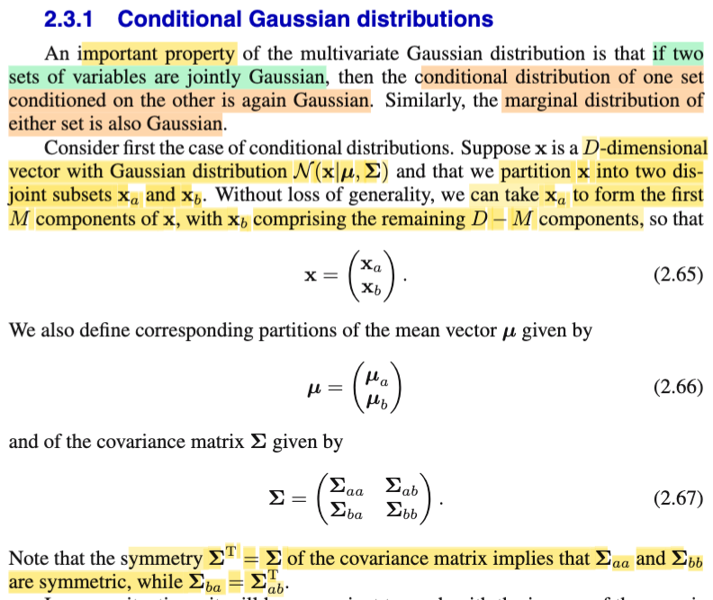</kbd>

> [!NOTE]
> Mở đầu phần này, gs nói đại khái là phân phối multivariate Normal có một tính chất quan trọng, đó là nếu ta có hai set random variables mà jointly Gaussian (tức là mình hiểu là joint distribution của chúng là Gaussian) thì khi đó, distribution của một set dựa trên set kia, cũng là Gaussian. Và thêm nữa, marginal distribution của mỗi set cũng là Gaussian.
>
>
>
> Lấy ví dụ ta sẽ xét random vector **X** có D-dimensions, dĩ nhiên có nghĩa là ta có D random variable X1,...XD. Và **X** \~ Normal(**μ**, **Σ**), tức X1,...XD có joint distribution là Normal(**μ**, **Σ**).
>
>
>
> Sau đó, ta mới tách random vector **X** thành **Xa** và **Xb**, với **Xa** là M phần tử đầu tiên của **X**, **Xb** là phần còn lại. Dĩ nhiên **Xa** là M-dimensinal random variable vector và **Xb** là D-M dimensional random variables vector.
>
>
>
> Tiếp, ta mới define vector **μ**, cũng tách thành hai phần, **μa** và **μb**. Cũng như covariance matrix **Σ** sẽ có dạng block matrix: \[**Σaa Σab; Σba Σbb**\]
>
>
>
> Suy ngẫm chút xíu: Vì sao **X** = \[**Xa**; **Xb**\] thì **μ** = \[**μa; μb**\] và **Σ =** \[**Σaa Σab; Σba Σbb**\]
>
>
>
> **μ** là location của distribution Normal(**μ**, **Σ**), và ta đã chứng minh nó chính là mean của X: E**X** = **μ**, nên khi X tách ra thành Xa và Xb, để **X** = \[**Xa**; **Xb**\] thì EX dĩ nhiên cũng tách thành E\[**Xa**; **Xb**\] = \[E(**Xa**); E(**Xb**)\] và người ta đặt E(**Xa**) là **μa**, E(**Xa**) là **μb**. Nên **μ** = \[**μa; μb**\]
>
>
>
> Còn **Σ**, là thứ mà hôm qua ta đã thấy gs chứng minh rằng nó là covariance matrix. Ở đây mình nên hiểu thế này. Do quá quen với việc khi nghe nói về Normal(

 

#### Ma trận độ chính xác phân hoạch

<kbd>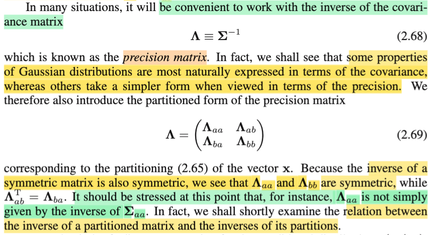</kbd>

> [!NOTE]
> Tiếp, gs nói rằng trong nhiều tình huống ta sẽ thấy làm việc với inverse của covariance **Σ** thì tiện hơn **Σ**, ta đặt nó là **Λ**. Dĩ nhiên **Λ** cũng đối xứng. Và ta gọi nó là **precision matrix**.
>
>
>
> Và với việc **X** = \[**Xa**; **Xb**\], **Λ** cũng tách thành \[**Λaa Λab; Λba Λbb**\] 
>
>
>
> Một chú ý là chưa chắc **Λaa, và Λbb đã là inverse của Σaa, Σbb.**

 

##### Chứng minh Gaussian điều kiện

<kbd>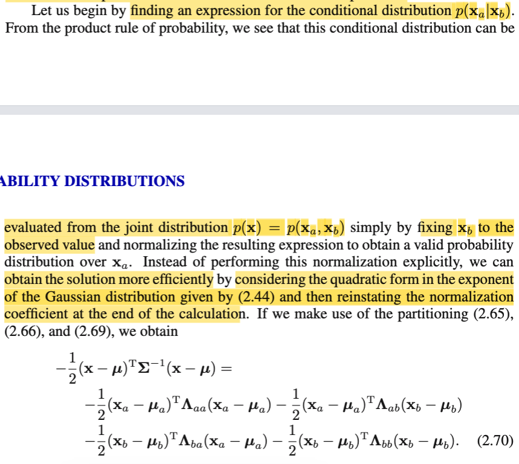</kbd>

> [!NOTE]
> Rồi, ta sẽ bắt đầu chứng minh rằng nếu ta có hai bộ random variable có joint distribution là multivariate Gaussian thì pdf của một random variable set condition set khác cũng sẽ là Gaussian, bằng cách thử derive pdf của f(**xa**|**xb**).
>
>
>
> Thế thì đại khái là, gs nói rằng ta có thể bắt đầu với joint pdf f(**xa**, **xb**), tại giá trị fixed nào đó của **xb** và sau đó normalizing để có conditional distribution f(**xa**|**xb**). Có thể hiểu ý này thế nào?
>
>
>
> Mình nghĩ cái này đơn giản chỉ là gs đang nói đến định nghĩa của conditional distribution. Ta biết theo định nghĩa, giả sử ta có hai random variable X, Y: thì fX|Y(x|y) = fX,Y(x, y) / fY(y). Áp dụng với trường hợp này, ta có f(**xa**|**xb**) = f(**xa**, **xb**) / f(**xb**). Thì như vậy nếu ta có joint pdf của f(**xa**, **xb**) với evaluate tại **xb** (tức là joint pdf **Xa**, **Xb**, cũng là pdf của **X**, f(**xa**, **xb**) chỉ là hàm theo **xa**) và chia nó f(**xb**) là joint pdf của **Xb** tại **xb**, thì ta sẽ có conditional pdf của **xa** given **xb**. Và cái bước chia cho f(**xb**) này chính là bước normalizing the resulting expression mà gs Bishop nói đến.
>
>
>
> Tuy nhiên, ông nói thêm thay vì ta làm vậy, gọi là theo lối tường minh (explicitly), ta sẽ làm theo cách mà mình hiểu đại ý là giống như trong Casella hay làm, đó là **chỉ quan tâm cái kernel (hạt nhân, tức cái phần mà dính đến biến) của pdf** thôi, trong case này, chính là cái quadratic form hay còn gọi là cái term exponent công thức Gaussian, để rồi nếu ta có thể dựa vào đó để chứng minh dạng của distribution, và không cần phải quan tâm cái normalizing constant, hoặc quan tâm đến nó sau.
>
>
>
> Thế thì phần kernel của pdf của **X** là exp\[-(1/2)(**x**-**μ**)T **Σinv** (**x**-**μ**)\]
>
>
>
> Xét cái quaratic form: -(1/2)(**x**-**μ**)T **Σinv** (**x**-**μ**)
>
>
>
> = -(1/2)(**x**-**μ**)T **Λ** (**x**-**μ**)
>
>
>
> = -(1/2)(**x**-**μ**)T \[**Λaa**, **Λab**; **Λba**, **Λbb**\] (**x**-**μ**)
>
>
>
> = -(1/2)(**x**-**μ**)T \[**Λaa**, **Λab**; **Λba**, **Λbb**\] (**x**-**μ**)
>
>
>
> = -(1/2)\[**xa**-**μa**; **xb**-**μb**\]T \[**Λaa**, **Λab**; **Λba**, **Λbb**\] \[**xa**-**μa**; **xb**-**μb**\]
>
>
>
> = -(1/2)(**xa**-**μa**)T**Λaa**(**xa**-**μa**) - (1/2)(**xa**-**μa**)T**Λab**(**xb**-**μb**) - (1/2)(**xb**-**μb**)**Λba**(**xa**-**μa**) - (1/2)(**xb**-**μb**)**Λbb**(**xb**-**μb**)
>
>
>
> Và tới đây lập luận chỉ đơn giản là, nếu ta coi **xb** là fixed, để rồi cái quadratic form này chỉ là hàm theo **xa**, thì nó có còn là quadratic form không, nếu có thì có thể kết luận ngay rằng kernel của f(**xa**|**xb**) cũng có dạng kernel của một Normal, và giúp kết luận ngay nó là một Normal, còn mean và covariance là gì thì tính sau.
>
>
>
> Nhắc lại, đây là cách làm mà mình thường thấy trong Casella, đó là khi xét tìm dạng của pdf, ta thường chỉ cần chỉ ra kernel của nó có dạng kernel của một phân phối nào đó, là đủ để có thể kết luận dạng của distribution. Sau đó, ta sẽ dùng cách bước khớp mẫu, để tìm ra giá trị của parameters. Và do đó thậm chí cũng khỏi cần quan tâm cái constant bên ngoài, vì kiểu gì thì chúng cũng đóng vai trò normalizing constant.

> [!TIP]
> **🤖 AI Feedback** — ✅ Score: **100/100**
>
> Bạn đã hiểu rất chính xác và sâu sắc phương pháp Bishop đề xuất, đặc biệt là vai trò của việc tập trung vào "kernel" của phân phối để xác định dạng. Các bước phân tích và mở rộng dạng bậc hai cũng hoàn toàn khớp với tài liệu.

 

- **Hiệp phương sai Gaussian điều kiện**

<kbd>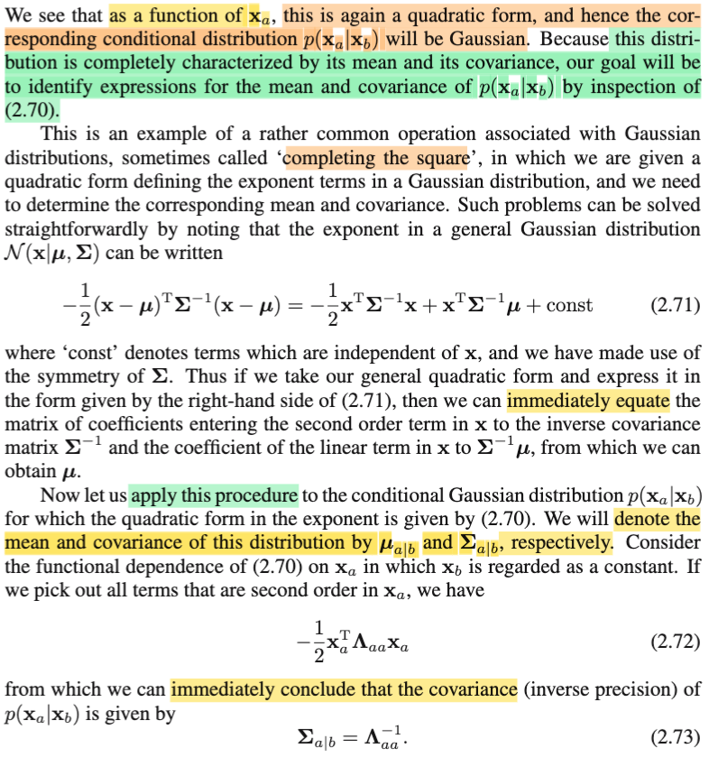</kbd>

<kbd>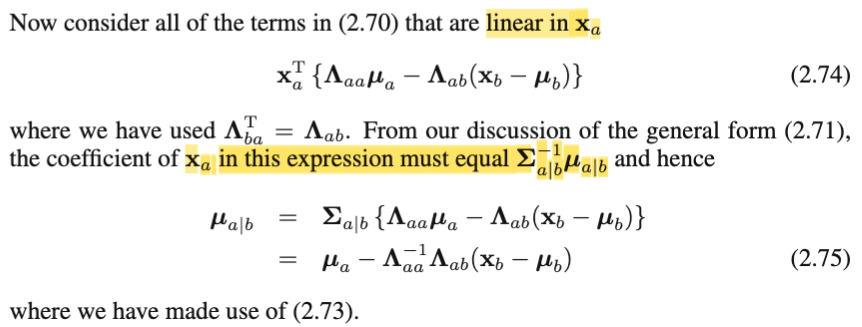</kbd>

> [!NOTE]
> Tiếp theo, đại khái là vầy, xét cái cụm này: (**xa**-**μa**)T**Λaa**(**xa**-**μa**) + (**xa**-**μa**)T**Λab**(**xb**-**μb**) + (**xb**-**μb**)T**Λba**(**xa**-**μa**) + (**xb**-**μb**)T**Λbb**(**xb**-**μb**), nếu ta triển khai ra và chỉ quan tâm những cái có dính đến **xa**, ta sẽ có:
>
>
>
> Coi cục (**xb**-**μb**)**Λbb**(**xb**-**μb**) là const, không care
>
>
>
> .. = **xa**T**Λaaxa** - **μa**T**Λaaxa** - **xa**T**Λaaμa** + **μa**T**Λaaμa** + **xa**T**Λabxb** - **μa**T**Λabxb** - **xa**T**Λabμb**+**μa**T**Λabμb** + (**xb**T**Λbaxa** - **μb**T**Λbaxa** - **xb**T**Λbaμa** + **μb**T**Λbaμa** + const
>
>
>
> Nhập tất cả các cụm không dính đến **xa** vào const luôn
>
>
>
> .. = **xa**T**Λaaxa** - 2**μa**T**Λaaxa** + **xa**T**Λabxb** - **xa**T**Λabμb** + **xb**T**Λbaxa** - **μb**T**Λbaxa** + const
>
>
>
> **xa**T**Λabxb** là scalar nên nó = (**xa**T**Λabxb**)T = **xb**T (**Λab**)T **xa** = **xb**T**Λba** **xa**, nhập với **xb**T**Λbaxa** thành 2**xb**T**Λbaxa**
>
>
>
> **xa**T**Λabμb**, là scalar, nên nó = (**xa**T**Λabμb**)T = **μb**T (**Λab**)T **xa** = **μb**T **Λba** **xa**, nhập với **μb**T**Λbaxa** thành 2**μb**T**Λbaxa**
>
>
>
> ..= **xa**T**Λaaxa** - 2**μa**T**Λaaxa** + 2**xb**T**Λbaxa** - 2**μb**T**Λbaxa** + const
>
>
>
> = **xa**T**Λaaxa** + 2(**xb**T**Λba** - **μa**T**Λaa** - **μb**T**Λba**)**xa** + const
>
>
>
> Vậy nếu viết đầy đủ cái kernel (có thêm exp\[(-1/2)..\] thì ta có:
>
>
>
> exp{(-1/2)\[**xa**T**Λaaxa** + 2(**xb**T**Λba** - **μa**T**Λaa** - **μb**T**Λba**)**xa** + const\]}
>
>
>
> Dùng e^(ab) = e^a e^b, đưa const ra, và ko care đến nó nữa, vì nó nhập vào cái normalizing constant ở ngoài, nên ta có
>
>
>
> exp{(-1/2)\[**xa**T**Λaaxa** + 2(**xb**T**Λba** - **μa**T**Λaa** - **μb**T**Λba**)**xa**\]} (1)
>
>
>
> Tới đây, ta mới xét... cái kernel của multi Normal (**μ**, **Σ**): exp\[-(1/2)(**x**-**μ**)T Σinv (**x**-**μ**)\] và triển khai cái cụm -(1/2)(**x**-**μ**)T Σinv (**x**-**μ**) này ra:
>
>
>
> \-(1/2)(**x**-**μ**)T Σinv (**x**-**μ**) = -(1/2)(**x**T**Σinvx** - **μ**T**Σinvx** - **x**T**Σinvμ** + **μ**T**Σinvμ**)
>
>
>
> = -(1/2)(**x**T**Σinvx** - 2**μ**T**Σinvx** + **μ**T**Σinvμ**) (2)
>
>
>
> Thế thì so sánh cái ta có ở trên (1) và (2)
>
>
>
> exp{(-1/2)\[**xa**T**Λaaxa** + 2(**xb**T**Λba** - **μa**T**Λaa** - **μb**T**Λba**)**xa**\]}
>
>
>
> exp{-(1/2)(**x**T**Σinvx** - 2**μ**T**Σinvx** + **μ**T**Σinvμ**)}
>
>
>
> Thì ta sẽ thấy **Λaa** tương ứng với **Σinv**, và **xb**T**Λba** - **μa**T**Λaa** - **μb**T**Λba** tương ứng với -**μ**T**Σinv ⇨ μ**T ứng với -(**xb**T**Λba** - **μa**T**Λaa** - **μb**T**Λba**)(**Λaa**\_**inv**)
>
>
>
> Nói chung là từ đó, ta có thể cộng thêm và trừ bớt cho cụm **μ**T**Σinvμ**, và đưa phần dư ra ngoài lại, ta sẽ có thể đưa cái cụm trong exp về dạng quadratic form. Và từ đó kết luận đây là một multi-Normal.
>
>
>
> Và để xác định tham số, thì thật ra cũng là cái ta vừa làm đó. Gọi **μa|b**, và **Σa|b** là mean và covariance matrix của distribution Gaussian này, thì với việc **Λaa** khớp với **Σinv**, ta có thể kết luận:
>
>
>
> **Σa|b**\_inv **CHÍNH LÀ Λaa**, ⇔ **Σa|b** = (**Λaa**)inv ⇨ đây là kết luận 2.73 trong sách.
>
>
>
> Và với việc μT ứng với -(**xb**T**Λba** - **μa**T**Λaa** - **μb**T**Λba**)(**Λaa**\_**inv**), thì ta cũng kết luận cái cụm này chính là (**μa|b**)T
>
>
>
> ⇨ **μa|b =** \[-(**xb**T**Λba** - **μa**T**Λaa** - **μb**T**Λba**)(**Λaa**\_**inv**)\]T
>
>
>
> = \[-**xb**T**ΛbaΛaa**\_**inv** + **μa**T + **μb**T**ΛbaΛaa**\_**inv**\]T
>
>
>
> = \[-**xb**T**ΛbaΛaa**\_**inv** + **μa**T + **μb**T**ΛbaΛaa**\_**inv**\]T
>
>
>
> = \[-**Λaa_inv**T**Λba**T**xb** + **μa**T + **Λaa**\_**inv**T**Λba**T**μb**
>
>
>
> = **μa** - **Λaa_inv**T**Λba**T**xb** + **Λaa**\_**inv**T**Λba**T**μb**
>
>
>
> = **μa** - **Λaa_inv Λab xb** + **Λaa**\_**inv** **Λab μb** (dùng tính đối xứng của **Λaa_inv**, và (**Λba**)T = **Λab**)
>
>
>
> = **μa** - **Λaa_inv Λab** (**xb** - **μb**)
>
>
>
> Vậy, **μa|b** = **μa** - **Λaa_inv Λab** (**xb** - **μb**) → Đây chính là 2.75.
>
>
>
> Nói tóm lại, miễn là ta thấy phần bên trong exp, nếu xét là hàm quadratic của **xa**, thì là đã đủ để kết luận đây f(**xa**|**xb**) nhất định là Gaussian. Và bằng cách khớp với công thức Gassian tổng quát, ta có thể chỉ ra đâu là mean và covariance matrix.
>
>
>
> Để rồi ta có thể kết luận f(**xa**|**xb**) chính là pdf của Gaussian có mean là **μa|b** = **μa** - **Λaa_inv Λab** (**xb** - **μb**) và covariance matrix là **Σa|b** = (**Λaa**)inv

> [!TIP]
> **🤖 AI Feedback** — ✅ Score: **100/100**
>
> Ghi chú của bạn cực kỳ chi tiết và chính xác, làm rõ hoàn toàn quá trình suy luận để đạt được các kết quả (2.73) và (2.75) mà sách chỉ trình bày vắn tắt. Việc bạn triển khai từng bước các phép tính ma trận và so sánh với dạng tổng quát của Gaussian là rất xuất sắc, cho thấy sự hiểu biết sâu sắc.

 

- **Schur complement: Biến đổi hiệp phương sai**

<kbd>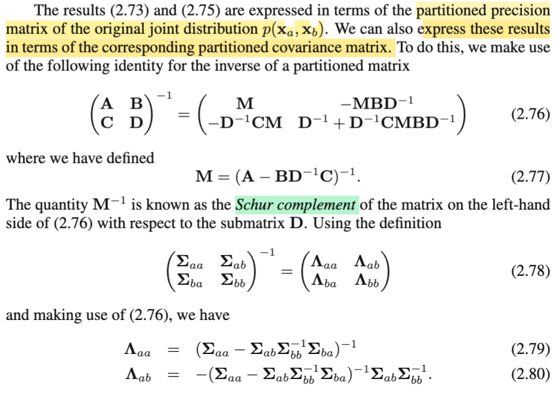</kbd>

> [!NOTE]
> Đoạn tiếp theo không có gì phức tạp. Hai kết quả trên đã thể hiện giá trị trung bình và ma trận hiệp phương sai của phân phối có điều kiện của **xa** dựa trên **xb**, thông qua các matrix khối con (tạm dịch từ partitioned) của **precision matrix** của phân phối đồng thời joint distribution. Cụ thể hơn, chúng dựa trên các ma trận con (partitioned matrices) của ma trận **precision**. 
>
>
>
> Thế thì bằng cách sử dụng một công thức được gọi là **Schur complement**, chúng ta cũng có thể **chuyển sang dạng thể hiện bởi các ma trận con (partitioned matrices) của ma trận hiệp phương sai** (covariance matrix). Đây chính là bước áp dụng đẳng thức này để biến đổi hai công thức đã chứng minh sang một dạng thể hiện khác, sử dụng các ma trận khối con của ma trận hiệp phương sai thay vì các ma trận khối con của ma trận nghịch đảo. Đây chính là một bài toán biến đổi đại số.

> [!TIP]
> **🤖 AI Feedback** — ✅ Score: **90/100**
>
> Ghi chú của bạn đã tóm tắt chính xác mục đích và phương pháp được mô tả trong đoạn văn, đặc biệt là việc chuyển đổi từ ma trận độ chính xác (precision matrix) sang ma trận hiệp phương sai (covariance matrix) bằng cách sử dụng bổ đề Schur (Schur complement). Để sâu sắc hơn, bạn có thể đề cập rõ ràng hơn đến việc sử dụng đẳng thức (2.76) về nghịch đảo của ma trận khối, vốn là công cụ chính cho phép áp dụng bổ đề Schur trong ngữ cảnh này.

 

- **Mô hình Gaussian tuyến tính**

<kbd>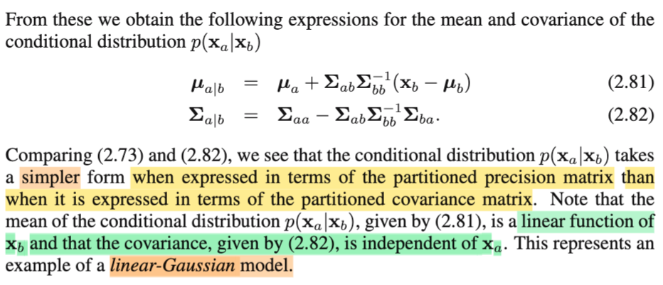</kbd>

> [!NOTE]
> Và cụ thể là bằng cách dùng Schur complement, ta có thể thể hiện **Λaa** và **Λab** theo các matrix **Σaa, Σab, Σbb** để rồi thay vài **μa|b** và **Σa|b ta sẽ có hai công thức 2.81 và 2.82**:
>
>
>
> **μa|b** = **μa** + **Σab** **Σbb_inv** (**xb** - **μb**)
>
>
>
> **Σa|b** = **Σaa** - **Σab Σbb_inv Σba**
>
>
>
> Và từ đó ta có nhận xét là so với
>
>
>
> **μa|b** = **μa** - **Λaa_inv Λab** (**xb** - **μb**)
>
>
>
> **Σa|b** = (**Λaa**)**inv**
>
>
>
> thì 2.79 và 2.80 dài dòng hơn, tức là **thể hiện bằng partitioned precision ở dưới nãy sẽ gọn hơn.**
>
>
>
> Một lưu ý cuối, đó là dựa vào cả hai công thức đều thấy **μa|b là hàm tuyến tính theo xb, cũng như Σa|b hoàn toàn không phụ thuộc xa. Và ông nói đây là một ví dụ của cái gọi là LINEAR-GAUSSIAN model (có thể sẽ được học ở các chap sau)**

> [!TIP]
> **🤖 AI Feedback** — ✅ Score: **95/100**
>
> Bài làm của bạn rất chính xác và sâu sắc. Bạn không chỉ chép đúng công thức mà còn nắm vững các nhận xét quan trọng về tính chất của mô hình và đưa ra so sánh đúng đắn về độ đơn giản của các dạng biểu diễn. Để bài làm hoàn hảo hơn, bạn nên đảm bảo các tham chiếu số công thức khớp với tài liệu gốc hoặc giải thích rõ ràng hơn về chúng.

 

## 2.3.2 Marginal Gaussian

 

### Phân phối Gaussian biên

<kbd></kbd>

<kbd></kbd>

<kbd></kbd>

> [!NOTE]
> Tiếp, phần trước mình đã thấy nếu f(**X**) với \[**Xa**; **Xb**\] là Normal thì f(**Xa**|**Xb**) cũng là Normal. Nay xét marginal distribution của **Xa** (cũng như **Xb**) thì mr Bishop cho rằng ta cũng sẽ thấy nó là Normal. Và ta cũng sẽ làm theo cách làm như trước, chỉ quan tâm kernel (phần exp(...)) để chỉ ra rằng nó cũng là quadratic function của **Xa** (hoặc **Xb**), đồng nghĩa là nó có dạng của kernel của một phân phối Gaussian, và dùng cách là khớp mẫu, ta sẽ suy ra được mean và covariance matrix.
>
>
>
> Thế thì như đã biết trong Stat110, Casella, khi ta có joint pdf của **Xa**, **Xb** (tức pdf của **X**), thì bằng cách marginalize over mọi possible value của **Xb**, thì ta sẽ có marginal pdf của **Xa**:
>
>
>
> f(**xa**) = ∫f(**xa**,**xb**)d**xb**
>
>
>
> Với f(**xa**, **xb**), là công thức dài dòng bữa trước đã biết, ta tạm không quan tâm chi tiết, chỉ cần thấy nó có dạng \[normalizing constant\] exp\[-(1/2)...\] và phần trong exp\[-(1/2)...\] là quadratic form (**x**-**μ**)T**Λ**(**x**-**μ**) và thể hiện nó dưới dạng:
>
>
>
> (**xa**-**μa**)T**Λaa**(**xa**-**μa**) + (**xa**-**μa**)T**Λab**(**xb**-**μb**) + (**xb**-**μb**)T**Λba**(**xa**-**μa**) + (**xb**-**μb**)T**Λbb**(**xb**-**μb**)
>
>
>
> Thế thì với f(**xa**|**xb**), ta chỉ việc coi **xb** là fixed (constant), và gom các term của **xa** lại, phần nào còn lại cứ đưa ra theo tính chất e^(a+b) = e^a e^b để gộp với normalizing constant đứng ngoài và làm theo chiến lược completing the square nói trên để chỉ ra mean và covariance.
>
>
>
> Còn ở đây, ta phải đối diện với cái tích phân theo **xb**.
>
>
>
> Vậy kế hoạch sẽ là, ta sẽ mở cái cụm trên ra, gom các term dính tới **xb** lại, còn lại thì tách ra (xài tính chất e^(a+b) = e^a e^b nói trên), và đối với tích phân theo **xb** thì chúng cũng là constant, nên ta đưa ra ngoài tích phân. Khi đó cơ bản là ta sẽ có kết quả có dạng:
>
>
>
> \[constant\] ∫exp{hàm của **xb**, tạo thành bởi các term dính tới **xb**} d**xb**.
>
>
>
> Lúc này, ta sẽ chỉ ra cái hàm của **xb** trong exp(..) lại có dạng quadratic function của **xb**, và như vậy nó là kernel của một Normal pdf. Dẫn tới việc nếu ta bổ sung thêm normalizing constant, (bằng cách nhân thêm và chia bớt) của cái normal này, thì việc lấy tích phân trên toàn miền, của cái này, sẽ phải ra 1 theo tính valid của pdf, đồng nghĩa là, kết quả nó sẽ chỉ còn lại cái 1/(normalizing constant). Để rồi toàn bộ sẽ chỉ còn là một hàm nào đó của **xa**, và lúc này ta sẽ chỉ ra nó lại là kernel của Normal.
>
>
>
> Ta sẽ làm chi tiết theo kết hoạch này như sau.
>
>
>
> i) Bung cụm dài thòng lòng ở trên ra gom lại để thành phần dính tới **xb** nằm riêng và không dính nằm riêng:
>
>
>
> (**xa**-**μa**)T**Λaa**(**xa**-**μa**) + (**xa**-**μa**)T**Λab**(**xb**-**μb**) + (**xb**-**μb**)T**Λba**(**xa**-**μa**) + (**xb**-**μb**)T**Λbb**(**xb**-**μb**)
>
>
>
> Đầu tiên gom hai thằng giữa lại, vì chúng giống nhau: đều là scalar, và có cùng giá trị: thằng thứ 2 = (**xa**-**μa**)T**Λab**(**xb**-**μb**) = \[(**xa**-**μa**)T**Λab**(**xb**-**μb**)\]T = (**xb**-**μb**)T(**Λab**)T(**xa**-**μa**) = (**xb**-**μb**)T**Λba**(**xa**-**μa**) = thằng thứ 3
>
>
>
> = (**xa**-**μa**)T**Λaa**(**xa**-**μa**) + 2(**xa**-**μa**)T**Λab**(**xb**-**μb**) + (**xb**-**μb**)T**Λbb**(**xb**-**μb**)
>
>
>
> = (**xa**-**μa**)T**Λaa**(**xa**-**μa**) + 2(**xa**-**μa**)T**Λabxb** - 2(**xa**-**μa**)T**Λabμb** + (**xb**-**μb**)T**Λbb**(**xb**-**μb**)
>
>
>
> = (**xb**-**μb**)T**Λbb**(**xb**-**μb**) + 2(**xa**-**μa**)T**Λabxb** - 2(**xa**-**μa**)T**Λabμb** + (**xa**-**μa**)T**Λaa**(**xa**-**μa**)
>
>
>
> Dựa vào tính chất hàm mũ, ta tách ra thành tích hai exp(term dính **xb**) exp(term không dính **xb**) (nhớ là còn con số -(1/2)):
>
>
>
> f(**xa**) = f(**xa**,**xb**) d**x** = ∫ \[constant 1\] exp{-(1/2) g(**xb**)} exp{-(1/2) h(**xa**)} d**xb**
>
>
>
> Với:
>
>
>
> g(**xb**) = (**xb**-**μb**)T**Λbb**(**xb**-**μb**) + 2(**xa**-**μa**)T**Λabxb**
>
>
>
> h(**xa**) = -2(**xa**-**μa**)T**Λabμb** + (**xa**-**μa**)T**Λaa**(**xa**-**μa**)
>
>
>
> Constant 1 là normalizing constant của pdf của **X**, = \[1/(2π)^(D/2)\] \[1/|**Σ**|^(1/2)\])
>
>
>
> đưa constant 1 cũng như exp{-(1/2) h(**xa**)} ra ngoài tích phân:
>
>
>
> .. = \[constant 1\] exp{-(1/2) h(**xa**)} ∫ exp{-(1/2) g(**xb**)} d**xb**
>
>
>
> Xét exp{-(1/2) g(**xb**)}, = exp{-(1/2) \[(**xb**-**μb**)T**Λbb**(**xb**-**μb**) + 2(**xa**-**μa**)T**Λabxb**\]}
>
>
>
> = exp{-(1/2)(**xb**-**μb**)T**Λbb**(**xb**-**μb**) - (**xa**-**μa**)T**Λabxb**}
>
>
>
> = exp{-(1/2)(**xb**T**Λbbxb** - **μb**T**Λbbxb** - **xb**T**Λbbμb** + **μb**T**Λbbμb**) - **xa**T**Λabxb** + **μa**T**Λabxb**}
>
>
>
> = exp{-(1/2)(**xb**T**Λbbxb** - 2**μb**T**Λbbxb** + **μb**T**Λbbμb**) - **xa**T**Λabxb** + **μa**T**Λabxb**}
>
>
>
> = exp{-(1/2)**xb**T**Λbbxb** + **μb**T**Λbbxb** -(1/2)**μb**T**Λbbμb** - **xa**T**Λabxb** + **μa**T**Λabxb**}
>
>
>
> = exp{-(1/2)**xb**T**Λbbxb** + \[**μb**T**Λbb** - **xa**T**Λab** + **μa**T**Λab**\]**xb** -(1/2)**μb**T**Λbbμb**}
>
>
>
> = exp{-(1/2)**xb**T**Λbbxb** + \[**μb**T**Λbb** - **xa**T**Λab** + **μa**T**Λab**\]**xb**} exp\[-(1/2)**μb**T**Λbbμb**}
>
>
>
> Tới đây thừa số đầu dính tới **xb**, cái sau thì không, ta đưa exp\[-(1/2)**μb**T**Λbbμb**} ra ngoài tích phân:
>
>
>
> Ở ngoài tích phân lúc này là \[constant 1\] exp{-(1/2) h(**xa**)} exp\[-(1/2)**μb**T**Λbbμb**}
>
>
>
> còn tích phân, trở thành ∫ exp{-(1/2)**xb**T**Λbbxb** + (**μb**T**Λbb** - **xa**T**Λab** + **μa**T**Λab**)**xb**} d**xb** 
>
>
>
> ---
>
>
>
> **Xét riêng cái tích phân**, tí nữa nhớ rằng ở ngoài còn \[constant 1\] exp{-(1/2) h(**xa**)} exp\[-(1/2)**μb**T**Λbbμb**}
>
>
>
> Đến đây, làm lại cái vụ ta phân tích cái kernel của multi Normal (**μ**, **Σ**): exp\[-(1/2)(**x**-**μ**)T Σinv (**x**-**μ**)\] và triển khai cái cụm -(1/2)(**x**-**μ**)T Σinv (**x**-**μ**) này ra:
>
>
>
> exp\[-(1/2)(**x**-**μ**)T Σinv (**x**-**μ**) = -(1/2)(**x**T**Σinvx** - **μ**T**Σinvx** - **x**T**Σinvμ** + **μ**T**Σinvμ**)\]
>
>
>
> = exp\[-(1/2)(**x**T**Σinvx** - 2**μ**T**Σinvx** + **μ**T**Σinvμ**)\]
>
>
>
> = exp\[-(1/2)**x**T**Σinvx** + **μ**T**Σinvx** -(1/2)**μ**T**Σinvμ**)\]
>
>
>
> Như vậy, bằng cách khớp:
>
>
>
> i) Khớp **Λbb với Σinv**
>
>
>
> ii) Khớp **μb**T**Λbb** - **xa**T**Λab** + **μa**T**Λab** với **μ**T**Σinv**
>
>
>
> **⇨ μ sẽ tương ứng với:** \[(**μb**T**Λbb** - **xa**T**Λab** + **μa**T**Λab**)**Λbb_inv**\]T.
>
>
>
> Để rồi, ta sẽ cộng thêm và trừ bớt cho một hằng số tương ứng với **μ**T**Σinvμ**, tức là:
>
>
>
> {\[(**μb**T**Λbb** - **xa**T**Λab** + **μa**T**Λab**)**Λbb_inv**\]T}T **Λbb** {\[(**μb**T**Λbb** - **xa**T**Λab** + **μa**T**Λab**)**Λbb_inv**\]T} (đặt là constant 2)
>
>
>
> Khi đó có thể kết luận cái tích phân ∫ exp{-(1/2)**xb**T**Λbbxb** + (**μb**T**Λbb** - **xa**T**Λab** + **μa**T**Λab**)**xb**} d**xb**  sẽ chính là:
>
>
>
> = ∫ kernel của pdf của Normal(-(1/2)\[(**μb**T**Λbb** - **xa**T**Λab** + **μa**T**Λab**)**Λbb_inv**\]T, **Λbb_inv**) exp \[hằng số mà ta đã thêm, constant 2\]
>
>
>
> = exp \[-(1/2)(-constant 2)\] ∫ kernel của pdf của Normal(-(1/2)\[(**μb**T**Λbb** - **xa**T**Λab** + **μa**T**Λab**)**Λbb_inv**\]T, **Λbb_inv**)
>
>
>
> Tiếp, nhân thêm và chia bớt cái normalizing constant của cái normal(-(1/2)\[(**μb**T**Λbb** - **xa**T**Λab** + **μa**T**Λab**)**Λbb_inv**\]T, **Λbb_inv**), đặt là constant 3, ta có:
>
>
>
> exp \[(1/2) constant 2\] \[1constant 3\] ∫ \[pdf của normal(-(1/2)\[(**μb**T**Λbb** - **xa**T**Λab** + **μa**T**Λab**)**Λbb_inv**\]T, **Λbb_inv**)\] d**xb**
>
>
>
> Nhờ tính valid của pdf → ∫ \[pdf của normal(-(1/2)\[(**μb**T**Λbb** - **xa**T**Λab** + **μa**T**Λab**)**Λbb_inv**\]T, **Λbb_inv**)\] d**xb = 1**
>
>
>
> ⇨ Cái tích phân = exp \[(1/2) constant 2\] \[constant 3\] . 1 = exp \[constant 2\] \[1/constant 3\]
>
>
>
> ---
>
>
>
> Xét toàn bộ, tức ∫f(**xa**,**xb**)d**xb** thì trở thành:
>
>
>
> \[constant 1\] exp{-(1/2) h(**xa**)} exp\[-(1/2)**μb**T**Λbbμb**} exp \[(1/2) constant 2\] \[constant 3\]
>
>
>
> Rồi, như vậy đến đây ta chỉ còn một hàm theo **xa**, và cũng không còn tích phân gì nữa. Nhiệm vụ chỉ là, chỉ ra nó có dạng của kernel của một normal gì đó.
>
>
>
> Ta sẽ xét các constant 1, 2, 3 :
>
>
>
> constant 1, còn nhớ, là normalizing constant của pdf của **X**: \[1/(2π)^(D/2)\] \[1/|**Σ**|^(1/2)\])
>
>
>
> constant 3, là normalizing constant của cái normal(\[(**μb**T**Λbb** - **xa**T**Λab** + **μa**T**Λab**)**Λbb_inv**\]T, **Λbb_inv**)
>
>
>
> Nhận xét, constant 1 không phụ thuộc **xa**, nên tiếp tục mặc kệ nó.
>
>
>
> Còn constant 3, vì ta nhớ rằng, normalizing constant của Normal (**μ**, **Σ**) chỉ dính tới **Σ**, nên constant 3 chỉ dính tới **Λbb_inv**, không dính tới **xa**, nên ta cũng tiếp tục mặc kệ nó.
>
>
>
> (1/2) constant 2, = (1/2) {\[(**μb**T**Λbb** - **xa**T**Λab** + **μa**T**Λab**)**Λbb_inv**\]T}T **Λbb** {\[(**μb**T**Λbb** - **xa**T**Λab** + **μa**T**Λab**)**Λbb_inv**\]T}
>
>
>
> Cái này có phụ thuộc **xa**
>
>
>
> Vậy trong \[constant 1\] exp{-(1/2) h(**xa**)} exp\[-(1/2)**μb**T**Λbbμb**} exp \[constant 2\] \[1/constant 3\] ta chỉ cần quan tâm exp{-(1/2) h(**xa**)} exp \[constant 2\]
>
>
>
> Gộp hai cái exp (..) này lại:
>
>
>
> exp{-(1/2)h(**xa**) + (1/2) constant 2}
>
>
>
> Xét thành phần trong mũ:
>
>
>
> \-(1/2)\[-2(**xa**-**μa**)T**Λabμb** + (**xa**-**μa**)T**Λaa**(**xa**-**μa**)\] + (1/2) \[(**μb**T**Λbb** - **xa**T**Λab** + **μa**T**Λab**)**Λbb_inv**\] **Λbb** \[(**μb**T**Λbb** - **xa**T**Λab** + **μa**T**Λab**)**Λbb_inv**\]T
>
>
>
> = (**xa**-**μa**)T**Λabμb** + -(1/2(**xa**-**μa**)T**Λaa**(**xa**-**μa**) + (1/2) {(**μb**T**Λbb** - **xa**T**Λab** + **μa**T**Λab**)**Λbb_inv** **Λbb** \[(**μb**T**ΛbbΛbb_inv** - **xa**T**ΛabΛbb_inv** + **μa**T**ΛabΛbb_inv**)\]T}
>
>
>
> = (**xa**-**μa**)T**Λabμb** - (1/2)(**xa**-**μa**)T**Λaa**(**xa**-**μa**) + (1/2) {\[**μb**T**Λbb** - (**xa**T - **μa**T)**Λab**\] (**μb**T - **xa**T**ΛabΛbb_inv** + **μa**T**ΛabΛbb_inv**)T}
>
>
>
> = (**xa**-**μa**)T**Λabμb** - (1/2)(**xa**-**μa**)T**Λaa**(**xa**-**μa**) + (1/2) {\[**μb**T**Λbb** - (**xa**T - **μa**T)**Λab**\] (**μb**T - (**xa - μa**)T**ΛabΛbb_inv**)T}
>
>
>
> = (**xa**-**μa**)T**Λabμb** -(1/2) (**xa**-**μa**)T**Λaa**(**xa**-**μa**) + (1/2) {**μb**T**Λbbμb** - (**xa**T - **μa**T)**Λabμb** - **μb**T**ΛbbΛbb_inv**T**Λab**T(**xa - μa**) + (**xa**T - **μa**T)**ΛabΛbb_inv**T**Λab**T(**xa - μa**)}
>
>
>
> = (**xa**-**μa**)T**Λabμb** -(1/2) (**xa**-**μa**)T**Λaa**(**xa**-**μa**) + (1/2) {**μb**T**Λbbμb** - (**xa**T - **μa**T)**Λabμb** - **μb**T**Λab**T(**xa - μa**) + (**xa** - **μa**)T**ΛabΛbb_inv**T**Λab**T(**xa - μa**)}
>
>
>
> = (**xa**-**μa**)T**Λabμb** -(1/2) (**xa**-**μa**)T**Λaa**(**xa**-**μa**) + (1/2) **μb**T**Λbbμb** - **μb**T**Λab**T(**xa - μa**) + (1/2)(**xa** - **μa**)T**ΛabΛbb_inv**T**Λab**T(**xa - μa**)}
>
>
>
> = -(1/2) (**xa**-**μa**)T**Λaa**(**xa**-**μa**) + (1/2) **μb**T**Λbbμb** + (1/2)(**xa** - **μa**)T**ΛabΛbb_inv**T**Λab**T(**xa - μa**)}
>
>
>
> Đưa cái (1/2) **μb**T**Λbbμb** ra khỏi cụm này (nó sẽ nhập vào phần constant)
>
>
>
> Ta còn lại phần trong exp có dính **xa**: exp{-(1/2) \[(**xa**-**μa**)T**Λaa**(**xa**-**μa**) - (**xa** - **μa**)T**ΛabΛbb_inv**T**Λab**T(**xa - μa**)}
>
>
>
> = exp{-(1/2) \[(**xa**-**μa**)T\[**Λaa** - **ΛabΛbb_inv**T**Λab**T\](**xa**-**μa**)}
>
>
>
> Và ta đã có term dạng quadratic form. Cho phép ta kết luận ngay đây là pdf của Normal, với mean là:
>
>
>
> Mean = **μa** → Ở đây **ta có cùng kết luận với trong sách là 2.89**
>
>
>
> Inverse của covariance matrix, kí hiệu **Σa**, chính là: **Λaa** - **ΛabΛbb_inv**T**Λab**T
>
>
>
> ⇨ **Σa =** \[**Λaa** - **ΛabΛbb_inv**T**Λab**T\]**inv,**
>
>
>
> dùng tính đối xứng của **Λbb_inv**: **Λbb_invT** = **Λbb_inv** và **Λab**T = **Λba**
>
>
>
> **=** \[**Λaa** - **ΛabΛbb_invΛba**\]**inv**, **→ đây là kết luận 2.88 trong sách.**
>
>
>
>  Thật ra bài toán này tuy dài nhưng chủ yếu là biến đổi đại số matrix, chứ chiến thuật đơn giản thôi: chỉ là gom bi các term gắn với **xa** lại, cái nào ko dính tới **xa** thì kệ cha nó, đưa nó ra ngoài (tức là cứ bám theo nguyên tắc chỉ xét các term dính tới **xa**, thì kiểu gì ta cũng sẽ thấy cuối cùng kết quả cho ra một quadratic form).
>
>
>
> Vậy **Xa** có phân phối Normal(**μa**, **Λaa** - **ΛabΛbb_invΛba**\]**inv**)

> [!TIP]
> **🤖 AI Feedback** — ✅ Score: **95/100**
>
> Ghi chú của bạn đã cung cấp một phân tích cực kỳ chi tiết và chính xác về quá trình suy diễn phân phối biên của Gaussian, đi theo sát logic và các kết quả trong sách giáo khoa. Tuy nhiên, việc trình bày có thể được tinh gọn hơn ở một số bước biến đổi đại số để tăng tính súc tích.

 

#### Hiệp phương sai phân phối biên Σaa

<kbd></kbd>

> [!NOTE]
> Tiếp theo cũng không có gì khó hiểu, chỉ là nói rằng kết quả mean và covariance matrix của marginal distribution f(**xa**) vừa rồi: **Xa** có phân phối Normal(**μa**, **Λaa** - **ΛabΛbb_invΛba**\]**inv**), là đang biểu thị thông qua các matrix **Λaa**, **Λab**, **Λbb**, như đã biết, là các matrix con của matrix precision **Λ**. Thì dùng cái công thức Schur Complement, ta có thể biến đổi tí để đưa nó về dạng biểu thị bởi các **Σaa,Σbb,Σab**, là các matrix con của covariance matrix **Σ**.
>
>
>
> Khi đó kết quả sẽ ra rất gọn: Covariane matrix chính là **Σaa**.
>
>
>
> Và như vậy ta có nhận xét, **với conditional distribution, thì dùng cách biểu thị theo các matrix con của precision matrix sẽ gọn hơn nhưng với marginal distribution thì dùng cách biểu thị theo partitioned covariance matrix sẽ gọn hơn**.

> [!TIP]
> **🤖 AI Feedback** — ✅ Score: **95/100**
>
> Bài phân tích rất chính xác, nắm bắt được cả các công thức biến đổi và kết luận quan trọng về sự đơn giản hóa trong biểu diễn cho phân phối biên và có điều kiện. Để bài phân tích súc tích hơn, bạn có thể cân nhắc rút gọn một số phần diễn đạt.

 

##### Phân phối Gaussian phân tách có điều kiện

<kbd></kbd>

<kbd></kbd>

<kbd></kbd>

> [!NOTE]
> Cuối cùng, tóm tắt lại việc ta chứng minh rằng với random variable vector **X** có phân phối Normal(**μ**, **Σ**) phân tách thành hai random variable vector \[**Xa**; **Xb**\].
>
>
>
> (nói là Partitioned Gaussians, có ý nghĩa chỉ là. ta có D-dimensional random vector **X**, mà dĩ nhiên cũng chỉ là một bộ các random vector X1,...XD, có joint distribution là thuộc loại Normal(**μ**, **Σ**). Nay ta tách ra (partition) làm hai bộ X1,..XM (đặt là vector **Xa**) và và XM+1,...XD (đặt là vector **Xb**)). Thì dĩ nhiên vẫn có thể nói hai random variable vector **Xa** và **Xb** có joint distribution là Normal(**μ**, **Σ**). Nên gọi là partitioned Gaussian, ko có gì ghê gớm cả)
>
>
>
> Khi đó, với **Σ** là Cov(**X**), thì nó có thể thể hiện bởi \[**Σaa, Σab; Σba Σbb**\]
>
>
>
> và **Λ**, precision matrix, inverse của **Σ**, cũng tương ứng \[**Λaa, Λab; Λba, Λbb**\]
>
>
>
> Thì ta đã chứng minh f(**xa**|**xb**) chính là pdf của Normal(**μa|b, Σa|b)**
>
>
>
> Với:
>
>
>
> **μa|b** = **μa** - **Λaa_inv Λab** (**xb** - **μb**)
>
>
>
> **Σa|b** = (**Λaa**)**inv**
>
>
>
> Còn marginal pdf f(**xa**) chính là pdf của Normal(**μa**, **Σaa**)
>
>
>
> Hình ảnh minh họa cho D=2, ramdom vector **X** tách thành hai single random variable Xa, Xb. Thì hình bên trái thể hiện joint pdf, là một 2D normal. HÌnh bên phải, màu xanh, là pdf của 1D normal của Xa. Và hình màu đỏ là f(xa|xb), cũng là normal.

> [!TIP]
> **🤖 AI Feedback** — ✅ Score: **98/100**
>
> Bài tóm tắt rất đầy đủ và chính xác các kết quả về phân phối Gaussian phân hoạch, từ định nghĩa đến các công thức và minh họa hình ảnh. Phần giải thích về ý nghĩa của "Partitioned Gaussians" rất trực quan, giúp người đọc dễ hiểu hơn.

 

## 2.3.3 Bayes's theorem for Gaussian variables

 

### Mô hình Gaussian Tuyến tính

<kbd></kbd>

> [!NOTE]
> Qua phần này, đầu tiên gs nhắc lại, hai phần trước, ta bắt đầu với **X** \~ Normal(**μ**, **Σ**), sau đó tách **X** thành hai subvector **Xa**, **Xb**, để rồi ta chứng minh rằng f(**xa**|**xb**) và f(**xa**) đều là pdf của normal. Và trong quá trình đó, ta đã đề cập đến một điểm, mean f(**xa**|**xb**) là một hàm tuyến tính theo **xb**
>
>
>
> Xem link tới note trước, ta có **μa|b** = **μa** - **Λaa_inv Λab** (**xb** - **μb**) thế thì vì sao nó là hàm tuyến tính với **xb**? à là vì nó có dạng \[matrix\] **xb** + constant, mà matrix nhân vector có bản chất là một linear transformation như đã học trong MIT 18.06.
>
>
>
> Mình nghĩ: như đã biết từ ee364a, nếu chặt chẽ, thì đây là affine function, ko phải linear function.
>
>
>
> Bên cạnh đó, covariance matrix, **Σa|b** = (**Λaa**)**inv**, thì không phụ thuộc **xb**, để rồi ông cho biết đây là một ví dụ của cái gọi là linear Gaussian model.
>
>
>
> Thế thì, trong bài toán này, cho rằng ta được cho f(**x**) và f(**y**|**x**) đều là Normal trong đó mean của f(**y**|**x**) là hàm phụ thuộc **x** và covariance matrix không phụ thuộc **x**. Đây là ví dụ của linear Gaussian model, và ta sẽ đi tìm f(**y**) cũng như f(**x**|**y**). Và đại khái là đây là bài toán gặp nhiều trong các chap sau nên ta sẽ phân tích nó ở đây trước.

 

#### Phân phối kết hợp Gaussian

<kbd></kbd>

<kbd></kbd>

<kbd></kbd>

> [!NOTE]
> Rồi, như đã nói, ta có **X** \~ Normal và **Y**|**X** \~ Normal với mean là hàm tuyến tinh của **x**, và covariance không phụ thuộc **x**. Nên ta gọi distribution của **X** là Normal(**μ**, **Λinv**) và **Y|X** \~ Normal(A**x**+b, **Linv**).
>
>
>
> (Chú ý, cách ghi của gs f(**x**) = N(**x**|**μ**, **Λinv**), chỉ cũng đồng nghĩa với việc nói hàm pdf của **X** là hàm pdf của Normal(**μ**, **Λinv**), thì nó cùng ý nghĩa với việc nói distribution của **X** là Normal(**μ**, **Λinv**), mình ít thấy cách ghi này trong Casella và Stat110)
>
>
>
> Một điểm lưu ý nữa, như đã biết, khi nói đến Normal(**μ**, **Σ**), thì Σ, như đã chứng minh, là covariance matrix, Cov(**X**), và inverse của nó, **Σinv**, gọi là precision matrix. Nên nay khi ghi **X** \~ Normal(**μ**, **Λinv**) thì **Λinv** chính là covariance matrix, và **Λ**, dĩ nhiên là precision matrix. Tương tự với **Linv**, cũng là covariance matrix của f(**y**|**x**)
>
>
>
> Rồi, nói thêm rằng M, và D là số chiều (tức số phần tử) của **X** và **Y**. Và ta sẽ đi derive joint pdf của **X**, **Y**.
>
>
>
> Một điểm có thể có bạn thấy bị ngáo: khi nói về random vector **X** = (X1,...XM), thì nói về pdf của **X**, cũng chính là nói về joint pdf của X1,...XM. Tương tự, pdf của random vector **Y**, cũng chính là joint pdf của các single random variable Y1,....YD. Vậy thì nay, nói đi tìm joint pdf của **X**, **Y** cũng chính là tìm joint pdf của X1,..XM, Y1,...YD. Hiểu vậy sẽ thấy việc ta tạo vector **Z** = \[**X**; **Y**\] (gắn nó lại thành vector M + D chiều) thì pdf của **Z** cũng chính là joint pdf của X1,..XM, Y1,...YD, hay joint pdf của **X**, **Y**
>
>
>
> Thế thì như đã học trong Casella và Stat119, dùng Bayes theorem, cho ta: f(**x**, **y**) = f(**y**|**x**)f(**x**) (mà ta nhớ cái theorem này thực ra chỉ là hệ quả từ định nghĩa của conditional probability mà thôi)
>
>
>
> ⇨ f(**z**) = f(**x**,**y**) = f(**y**|**x**)f(**x**)
>
>
>
> Và ta mới xét log của f(**z**): log f(**z**) = log \[f(**y**|**x**)f(**x**)\], dùng tính chất hàm log: log(ab) = log(a) + log(b).
>
>
>
> ⇨ log(f(**z**)) = log f(**x**) + log f(**y**|**x**)
>
>
>
> Tại sao tự nhiên gs Bishop lại lấy log?
>
>
>
> Mình hiểu: là để **dễ làm**, vì mục đích cuối cùng là chỉ ra rằng log f(**z**) có dạng của log của một hàm số mà phần phụ thuộc **z** có dạng kernel của pdf của một Normal distribution. khi đó, ta sẽ kết luận **Z** cũng là Normal variable.
>
>
>
>  Vì sao dễ làm, là vì với log f(**x**) + log f(**y**|**x**), cùng với việc hai cái f đều có dạng: \[normalizing constant\] exp\[-(1/2) quadratic form\], thì ta có:
>
>
>
> Gọi C1, C2 là hai cái normalizing constant của hai cái Normal đó, ta có
>
>
>
> log {C1 exp\[-(1/2) (**x**-**μ**)T**Λ**(**x**-**μ**)\] } + log {C2 exp\[-(1/2)(**y**-A**x**-b)T**L**(**y**-A**x**-b)\]}
>
>
>
> Dùng tính chất hàm log, tách ra:
>
>
>
> log {C1} + log exp\[-(1/2) (**x**-**μ**)T**Λ**(**x**-**μ**)\] } + log {C2} + log exp\[-(1/2)(**y**-A**x**-b)T**L**(**y**-A**x**-b)\]}
>
>
>
> = -(1/2) (**x**-**μ**)T**Λ**(**x**-**μ**) -(1/2)(**y**-A**x**-b)T**L**(**y**-A**x**-b) + log {C1} + log {C2}
>
>
>
>  = -(1/2) (**x**-**μ**)T**Λ**(**x**-**μ**) -(1/2)(**y**-A**x**-b)T**L**(**y**-**Ax**-b) + conts (hai term cuối ko dính gì đến **x**, **y**, ta ko care)
>
>
>
> = -(1/2) \[**x**T**Λx** - **μ**T**Λx** - **x**T**Λμ** + **μ**T**Λμ** + **y**T**Ly** - **x**T**A**T**Ly** - **b**T**Ly** - **y**T**LAx** + **x**T**A**T**LAx** + **b**T**LAx** - **y**T**Lb** + **x**T**A**T**Lb** + **b**T**Lb**\]
>
>
>
> Nhiệm vụ của là gom các term lại: Cái này thì chỉ là dài dòng, ko có gì khó:
>
>
>
> Đầu tiên kể ra các term bậc hai (tức có dính 2 cái **x**, 2 cái **y** hoặc dính **x** và **y**):
>
>
>
> = -(1/2) \[**x**T**Λx** + **y**T**Ly** - **x**T**A**T**Ly** - **y**T**LAx** + **x**T**A**T**LAx**\]
>
>
>
> = -(1/2) \[**x**T(**Λx** + **A**T**LA**)**x** + **y**T**Ly** - **y**T**LAx** - **x**T**A**T**Ly**\]
>
>
>
> Bằng các xét cái matrix tạo bởi các block: \[**Λ** + **A**T**LA**, -**A**T**L**; -**LA**, **L**\], đặt là **R**, thì ta sẽ thấy cái trên chính là: -(1/2) **z**T**Rz**
>
>
>
> Tiếp, ra các term bậc một: (có dính tới **x** hoặc **y**):
>
>
>
> \-(1/2) \[- **μ**T**Λx** - **x**T**Λμ** - **b**T**Ly** + **b**T**LAx** - **y**T**Lb** + **x**T**A**T**Lb** + **b**T**Lb**\]
>
>
>
> = -(1/2) \[- 2**μ**T**Λx** - 2**b**T**Ly** + 2**b**T**LAx**\]
>
>
>
> = -(1/2) \[- 2(**μ**T**Λ**-**b**T**LA**)**x** - 2**b**T**Ly**\]
>
>
>
> = (**μ**T**Λ**-**b**T**LA**)**x** + **b**T**Ly**
>
>
>
> Bằng cách define vector **h** = \[(**μ**T**Λ**-**b**T**LA**)T, (**b**T**L**)T\] = (**Λ**T**μ**-**A**T**L**T**b**, **L**T**b**) = (**Λμ**-**A**T**Lb**, **Lb**) (do tính đối xứng của L, **Λ**) , ta sẽ thấy đây chính là **h**T**z**
>
>
>
> Còn các term bậc 0, thì gom lại thành constant.
>
>
>
> và do đó, nó có dạng quadratic function của **z**: =(1/2)**z**T**Rz** + **h**T**z** + const giúp kết luận rằng: Với việc log f(**z**) **có dạng log** **exp** \[**quadratic function** của **z**\] ta **suy ra** f(**z**) **có dạng exp\[quadratic function của z\] nhân some constant**, **và điều này đủ kết luận** **Z nhất định là random variable vector có phân phối Normal**.
>
>
>
> Đồng thời, với cách làm khớp mẫu như hai phần trước đã làm, ta sẽ suy ra mean và covariance của Normal này:
>
>
>
> Với công thức Normal μ, Σ tổng quát, quadratic form sẽ có dạng: -(1/2) \[**x**T**Σinvx** - 2**μ**T**Σinvx** + **μ**T**Σinvμ**\]
>
>
>
> = -(1/2) **x**T**Σinvx** + **μ**T**Σinvx** -(1/2) **μ**T**Σinvμ**
>
>
>
> Khớp mẫu:
>
>
>
> **z**T**Rz** khớp với **x**T**Σinvx → Covariance matriz, Cov(Z) chính là Rinv, hay Precision matrix chính là R**
>
>
>
> **μ**T**Σinvx** khớp với **h**T**z ⇨** **μ**T**Σinv** khớp với **h**T ⇔ (**μ**\_**z**)T**R** = **h** ⇔ **μ**\_**z** = (**hR**inv)T = **R**invT**h**T = **R**inv**h**
>
>
>
>  Nhân vào, kết quả sẽ ra (**μ**; **Aμ** + **b**)
>
>
>
> Và để tính ra covariance matrix, Rinv, ta có thể dùng công thức 2.76 Schur complement để tính inverse của **R** = \[**Λ** + **A**T**LA**, -**A**T**L**; -**LA**, **L**\] = \[**Λ**inv, **Λ**inv**A**T; **AΛ**inv, **L**inv + **AΛ**inv**A**T\] (chỉ là bài toán đại số).

> [!TIP]
> **🤖 AI Feedback** — ✅ Score: **98/100**
>
> Bài viết giải thích rất chi tiết và sâu sắc từng bước một, từ định nghĩa phân phối đến lý do chọn log và cách các hệ số kết hợp thành dạng bậc hai của Z, cho thấy sự hiểu biết vững chắc. Để hoàn thiện hơn, bạn có thể thử tự xây dựng tường minh vector mean và ma trận precision/covariance của Z khi nó đã được chứng minh là phân phối Gaussian.

 

##### Tính chất phân phối biên Gaussian

<kbd></kbd>

> [!NOTE]
> Tiếp, khi đã có joint distribution f(**z**), cho thấy cũng là Normal. Ta sẽ đi tìm f(**y**).
>
>
>
> Có lẽ nên dừng lại review chút xíu:
>
>
>
> Bữa giờ ta ta đã chứng minh:
>
>
>
> Nếu có random vector **X tách thành hai subvector Xa, Xb**, và joint distribution của chúng là Normal(**μ**, **Σ**) hay Normal(**μ**, **Λinv**), ứng với việc **X** = \[**Xa**; **Xb**\] thì **Σ** và **Λ** (precision matrix) đều thể hiện ở dạng các matrix khối \[**Σaa, Σab; Σba, Σbb\]**, \[**Λaa, Λab; Λba, Λbb**\] thì f(**xa**|**xb**) và f(**xa**) đều là Gaussian. Trong đó với f(**xa**|**xb**) có covariance matrix thể hiện theo các matrix **Λ** sẽ gọn hơn là thể hiện theo **Σ**. Còn với f(**xa**) thì ngược lại, cụ thể ta còn **Xa** \~ Gaussian(**μa**, **Σaa**) (1) (công thức 2.92, 2.93, xem link).
>
>
>
> Sau đó, ta qua bài toán khác là có marginal và conditional đều là nornal: f(**x**) là normal (**μ**, **Λ**inv), conditional f(**y**|**x**) cũng là normal(**Aμ** + **b**, Linv), thì a đã chứng minh cho thấy joint distribution f(**z**), **z** = \[**x**; **y**\] cũng là normal. Và tiếp tục ở đây, ta sẽ nói về marginal f(**y**).
>
>
>
> Thế thì, lần này ko cần chứng minh gì, chỉ cần áp dụng kết luận đã làm: Vì ta đã có f(**z**) là normal với mean E(**Z**) = \[**μ**; **Aμ** + **b**\] và covariance Cov(**Z**) = \[**Λ**inv, **Λ**inv**A**T; **AΛ**inv, **L**inv + **AΛ**inv**A**T\], theo ý (1) ở trên, có thể kết luận: marginal f(**y**) cũng là Normal. Với tham số là:
>
>
>
> Mean là **Aμ** + **b.**
>
>
>
> Covariance matrix: Trong chứng minh trước **Σ** = \[**Σaa, Σab; Σba, Σbb\]** là cov(**X** = \[**Xa**; **Xb**\]) thì cov(**Xa**) là **Σaa**, nên ở đây Cov(Y) chính là **L**inv + **AΛ**inv**A**T.
>
>
>
> ⇨ **Y** \~ Normal(**Aμ** + **b**, **L**inv + **AΛ**inv**A**T)

> [!TIP]
> **🤖 AI Feedback** — ✅ Score: **98/100**
>
> Phân tích rất chính xác và sâu sắc, giải thích rõ ràng cách suy ra phân phối biên của y từ phân phối hợp Gaussian, khớp hoàn toàn với các công thức và ý tưởng trong hình ảnh. Việc tổng hợp các kiến thức nền trước đó cũng rất hữu ích và làm tăng độ sâu của ghi chú.

 

- **Convolution hai Gaussian**

<kbd></kbd>

> [!NOTE]
> Rồi, cùng tìm hiểu đoạn này là sao.
>
>
>
> Ôn lại bối cảnh một chút, bài toán đang làm là, cho marginal và conditional distribution đều là Normal (Gaussian) trong đó mean của f(**y**|**x**) là hàm tuyến tính theo **x**, còn covariance độc lập với **x**. Nên ta có f(**x**) \~ Normal(**μ**, **Λ**inv) và f(**y**|**x**) \~ Normal(**A**x+**b**, **L**inv).
>
>
>
> Nhiệm vụ là tìm joint distribution, và ta đã thấy nó cũng là Gaussian. Một khi có joint distribution, ta sẽ áp dụng kết quả ở phần trước, để thấy marginal distribution f(**y**) cũng là Gaussian, có mean là E\[**Y**\] = **Aμ** + **b** và cov(**Y**) = **L**inv + **A** **Λ**inv **A**T.
>
>
>
>  Thế thì ở đây mr Bishop nói rằng khi **A** là **Identity matrix** thì distribution của Y hóa ra là convolution của hai Gaussian. Trong Stat110, thực sự thì gs Joe Blizstein chỉ nói rất sơ sơ về convolution. Cụ thể là ông cho ta biết convolution là tổng của hai random variable (ông nói convolution chỉ là một từ bóng bẩy của sum, tổng) X, Y. Có điều, ông chỉ nói nhiêu đó trong bối cảnh là nói về hàm MGF, rằng, MGF sẽ cho ta cách derive pdf của một tổng các random variable dễ hơn là dùng convolution, lợi dụng một tính chất của MGF đó là nếu X, Y độc lập thì MGF của X + Y = MGF của X nhân MGF của Y: M\_(X+Y)(t) = MX(t) × MY(t).
>
>
>
> Thế thì, thử suy nghĩ một chút: Như vậy có thể thấy bài toán thực ra là, ta có hai biến ngẫu nhiên X, Y, biết pdf, và muốn tìm distribution của Z = X + Y.
>
>
>
> Thì cái này, thực ra trong Casella đã học rồi, nó chính là bài toán đổi biến (change of variable): Một cách tổng quát, bài toán là ta có X, Y với joint pdf/pmf fX,Y(x,y). Và muốn tìm distribution của (U,V) = với U = g(X, Y), V = h(X,Y), với hàm g và h có tính chất mapping 1-1 giữa (x,y) trong support set của random variable vector (X,Y) và (u,v) trong support set của (U,V). (hiểu đại khái là, với (x,y) được map với (u,v) thì vẫn có thể có (x', y') khác được map với (u,v) nhưng với điều kiện (u', v') đó phải không được nằm trong support set của (X,Y) (tập các giá trị mà joint pdf fX,Y(x,y) dương). Khi đó: với u = g1(x,y), v = g2(x,y) thì x = h1(u,v), y = h2(u,v). (g, h là hàm nào đó, ko phải đạo hàm). Ta sẽ có:
>
>
>
> fU,V(u,v) = fX,Y(x, y) |∂(x, y)/∂(u, v)| = fX,Y(h1(u, v),h2(u, v)) |∂(x, y)/∂(u, v)|
>
>
>
> Với = |∂(x, y)/∂(u, v)| là trị tuyệt đối của det của Jacobian matrix (đạo hàm của hàm vector → vector (u, v) → (x, y), có hàng 1 là gradient ∇x(u,v): (∂x/∂u, ∂x/∂v), và hàng 2 là gradient ∇y(u,v) = (∂y/∂u, ∂y/∂v).
>
>
>
> Áp dụng vào đây, ta sẽ đặt vector (Z, X) là random vector có được bởi Z = g1(X, Y) = X + Y, V = g2(X, Y) = X (identity function) ⇨ X = h1(Z, V) = V, Y = h2(Z, V) = Z - V.
>
>
>
> Jacobinan: ∇x(z,v) = (∂x/∂z, ∂x/∂v)T =  (0, 1)T. ∇y(z,v) = (∂y/∂z, ∂y/v∂) = (1, -1)T
>
>
>
> ⇨ |det J| = |det \[0, 1; 1, - 1\]| = |1| = 1.
>
>
>
> ⇨ fZ,V(z,v) = fX,Y(x,y) = fX,Y(v, z-v)
>
>
>
> = fX,Y(x, z-x) (Thay v = x)
>
>
>
> Tới đây, cái ta đang có là joint pdf của Z, V (cũng là Z, X). Bằng cách marginalizing over mọi possible của X, ta sẽ có marginal pdf của Z:
>
>
>
> fZ(z) = ∫fZ,V(z,x) dx = ∫fX,Y(x, z-x) dx.
>
>
>
> CÁI NÀY CHÍNH LÀ CÔNG THỨC CỦA CONVOLUTION.
>
>
>
> Và nếu X, Y độc lập, ta có thể tách joint pdf của X, Y thành tích các marginal pdf:
>
>
>
> ⇨ fZ(z) = ∫ fX(x) fY(z-x) dx
>
>
>
> Rồi, nãy giờ là kiểu như để mình hiểu bản chất cái công thức convolution thật ra chỉ là đổi biến. Quay lại đây, ta sẽ cùng nhau xem thử vì sao gs lại nói "nói rằng khi **A** là **Identity matrix** thì distribution của Y hóa ra là convolution của hai Gaussian"
>
>
>
>  Đầu tiên, ta đã kết luận **Y** given **x**, f(**y**|**x**) \~ Normal(**Ax**+**b**, **L**inv), theo location scalae family theorem, khi random variable X \~ một pdf thuộc location scalar familty có location μ thì X - μ sẽ là random varialbe có pdf là standard member của familty đó, tức location = 0. Với normal, nó là một dạng location scale family, nên **T** = **Y** - E**Y** = **Y** - **Ax** - **b** chính là một Normal(**0**, **L**inv).
>
>
>
> vậy ta có **T** = **Y** - **Ax** - **b** ⇔ **Y** = **T** + **Ax** + **b**.
>
>
>
> Nếu **A** = **I**, ta có **Y** = **T** + **x** + **b**
>
>
>
> Dĩ nhiên ta đang xét **x** fixed, là một observed value của **X**.
>
>
>
> Bây giờ, nếu ta tính đến với **X** là random variable, có distribution f(**x**) là Normal(**μ**, **Λ**inv), thì theo location scale, ta cũng sẽ có **U** = **X** + **b** sẽ là Normal(**μ** + **b**, **Λ**inv)
>
>
>
>  Lúc này, **Y** = **T** + **X** + **b** = **T** + **U chính là tổng của hai Normal:**
>
>
>
> **T** \~ Normal(**0**, **L**inv) và U \~ Normal(**μ** + **b**, **Λ**inv)
>
>
>
> Nếu áp dụng công thức covolution ở trên, và giải cái tích phân f(**y**) = ∫f**T**(**t**)f**U**(**y**-**t**)d**t** thay công thức pdf của **T** và **U** vào, ta có thể chứng minh rằng quả thật đây là Gaussian có mean là tổng mean, covariance là tổng covariance. Hoặc làm như trong Stat110, dùng MGF, ta cũng có thể chứng minh điều này. Nhưng cái chính là, một khi đã chỉ ra **Y** là tổng của **T**, **U** thì dùng tính linearity ta nhất định phải có mean bằng tổng mean. Và vì tính độc lập của T, U ta sẽ có covariance bằng tổng covariance:
>
>
>
> Và mean của **Y**, E**Y** = **μ** + **b**, bằng **0** + **μ** + **b =** E**T +** E**U**.
>
>
>
> Còn covarinance Cov(**Y**) = **L**inv + **Λ**inv = Cov(**T**) + Cov(**U**)
>
>
>
> Và kết quả mà mình đã làm ở phần trước - marginal pdf của **Y**, f(**y**) cho thấy nó Normal(**Aμ** + **b**, **L**inv + **AΛ**inv**A**T) , với **A** = **I**, Normal(**μ** + **b**, **L**inv + **Λ**inv) đã xác nhận điều này.
>
>
>
> Do đó, gs mới nói, với **A** = **I** thì hóa ra **Y** chính là tổng của hai Normal random variable

> [!TIP]
> **🤖 AI Feedback** — ✅ Score: **100/100**
>
> Bài viết rất chính xác và có chiều sâu vượt trội. Cách giải thích cặn kẽ về bản chất của phép tích chập (convolution) thông qua đổi biến, cùng với việc áp dụng chi tiết vào trường hợp A=I, giúp người đọc nắm vững kiến thức một cách toàn diện. Đây là một phân tích xuất sắc.

 

- **Phân phối Gaussian có điều kiện**

<kbd></kbd>

> [!NOTE]
> Rồi, cuối cùng là ta sẽ tìm f(**x**|**y**) (nhắc lại nhé, đề bài cho ta có f(**x**) \~ Normal(**μ**, **Λ**inv), f(**y**|**x**) là Normal(**Ax**+**b**, **L**inv), xong chứng minh f(**x**,**y**) và f(**y**) cũng là Gaussian, giờ đến cái f(**x**|**y**):
>
>
>
> Thì nhờ đã có f(**x**,**y**) ta cũng chỉ dùng cái kết quả ở mấy phần trước, khi trong đó ta có **X** = \[**Xa**; **Xb**\] có pdf Normal(**μ**, **Σ**) với **Σ** = \[**Σaa**, **Σab**; **Σba**, **Σbb**\] và **Σ**inv = **Λ** = \[**Λaa**, **Λab**; **Λba**, **Λbb**\], thì f(**xa**|**xb**) sẽ là Normal có **μa|b** = **μa** - **Λaa_inv Λab** (**xb** - **μb**) và covariance matrix là **Σa|b** = (**Λaa**)inv.
>
>
>
> Vậy thì áp dụng kết quả đó, cùng với ta có joint distribution của **X**, **Y** là Normal có mean = \[**μ**; **Aμ** + **b**\], precision = \[**Λ** + **A**T**LA**, -**A**T**L**; -**LA**, **L**\]
>
>
>
> và distribution của **Y** là Normal(**μ** + **b**, **L**inv + **Λ**inv)
>
>
>
> ⇨ **Λaa** ứng với **Λ** + **A**T**LA**, **Λ**ab ứng với -**A**T**L**, **xb** ứng với **y**, **μb** ứng với E\[**Y**\] =
>
> Rồi, cuối cùng là ta sẽ tìm f(**x**|**y**) (nhắc lại nhé, đề bài cho ta có f(**x**) \~ Normal(**μ**, **Λ**inv), f(**y**|**x**) là Normal(**Ax**+**b**, **L**inv), xong chứng minh f(**x**,**y**) và f(**y**) cũng là Gaussian, giờ đến cái f(**x**|**y**):
>
>
>
> Thì nhờ đã có f(**x**,**y**) ta cũng chỉ dùng cái kết quả ở mấy phần trước, khi trong đó ta có **X** = \[**Xa**; **Xb**\] có pdf Normal(**μ**, **Σ**) với **Σ** = \[**Σaa**, **Σab**; **Σba**, **Σbb**\] và **Σ**inv = **Λ** = \[**Λaa**, **Λab**; **Λba**, **Λbb**\], thì f(**xa**|**xb**) sẽ là Normal có **μa|b** = **μa** - **Λaa_inv Λab** (**xb** - **μb**) và covariance matrix là **Σa|b** = (**Λaa**)inv.
>
>
>
> Vậy thì áp dụng kết quả đó, cùng với ta có joint distribution của **X**, **Y** là Normal có mean = \[**μ**; **Aμ** + **b**\], precision = \[**Λ** + **A**T**LA**, -**A**T**L**; -**LA**, **L**\]
>
>
>
> và distribution của **Y** là Normal(**Aμ** + **b**, **L**inv + **AΛ**inv**A**T)
>
>
>
> ⇨ **Λaa** ứng với **Λ** + **A**T**LA**, **Λ**ab ứng với -**A**T**L**, **xb** ứng với **y**, **μb** ứng với E\[**Y**\] = **Aμ** + **b**
>
>
>
> ta có thể nói ngay: f(**x**|**y**) cũng là pdf của Normal, có mean:
>
>
>
> E\[**X**|**y**\]  
>
>
>
> (sẽ áp vào công thức tương ứng với **μa** - **Λaa_inv Λab** (**xb** - **μb**))
>
>
>
> = **μ** - (**Λ** + **A**T**LA**)\_inv (-**A**T**L**)(**y** - **Aμ** - **b**)
>
>
>
> = **μ** + (**Λ** + **A**T**LA**)\_inv (**A**T**L**)(**y** - **Aμ** - **b**) 
>
>
>
> = (**Λ** + **A**T**LA**)inv(**Λ** + **A**T**LA**)**μ** + (**Λ** + **A**T**LA**)\_inv\[**A**T**L**(**y** - **b**) - **A**T**LAμ**\] 
>
>
>
> = (**Λ** + **A**T**LA**)inv{(**Λ** + **A**T**LA**)**μ** + \[**A**T**L**(**y** - **b**) - **A**T**LAμ**\]}
>
>
>
> = (**Λ** + **A**T**LA**)inv \[**Λμ** + **A**T**LAμ** + **A**T**L**(**y** - **b**) - **A**T**LAμ**\]
>
>
>
> = (**Λ** + **A**T**LA**)inv \[**Λμ** + **A**T**L**(**y** - **b**)\]
>
>
>
> = (**Λ** + **A**T**LA**)inv \[**A**T**L**(**y** - **b**) + **Λμ**\] → Đây là 2.111
>
>
>
> Cov(**X**|**y**) 
>
>
>
> (sẽ áp vào công thức (**Λaa**)inv) 
>
>
>
> = (**Λ** + **A**T**LA**)inv → Đây là 2.112

> [!TIP]
> **🤖 AI Feedback** — ✅ Score: **98/100**
>
> Bài giải rất chi tiết, logic và chính xác từng bước một trong việc áp dụng kết quả từ phân phối Gaussian có điều kiện và ma trận độ chính xác, hoàn toàn khớp với hình ảnh gốc. Việc tự sửa lỗi nhỏ về phân phối biên của Y cho thấy sự cẩn trọng và hiểu biết sâu sắc.

 

- **Phân bố tiên nghiệm và hậu nghiệm**

<kbd></kbd>

<kbd></kbd>

> [!NOTE]
> Cuối cùng, gs cho rằng ta có thể coi f(**x**) như prior distribution của **X** và f(**x**|**y**) là posterior distribution của **X** dựa trên **Y** = **y**. 
>
>
>
> Và tóm tắt lại các kết quả ta đã tự làm trong bảng sau.

 

## 2.3.4 Maximum Likelihood for Gaussian

 

### Ước lượng MLE Normal đa biến

<kbd></kbd>

> [!NOTE]
> Rồi, đại khái là phần này gs nói về việc ta có thể dùng cách tiếp cận MLE để estimate tham số của một population Normal đa biến. Cho **X1** ,**X2**,....**XN** là các random variable **VECTOR**, được sample từ Normal(**μ**, **Σ**), và giả định rằng chúng độc lập ⇨ tức đây là một random sample size N iid (mutually independent, identically distributed).
>
>
>
> Review cực nhanh về MLE, đã học trong Casella: Nói ngắn gọn, trong Casella, chap 6, ta học bài toán inference: Point estimation, trong đó, với random sample size n X1,...Xn (gom thành random vector vector **X**) iid \~ f(**x**|θ), ta muốn xây dựng một hàm số W(**x**), để W(**X**), là một statistic, sao cho với oserved value **x** của **X**, ta có một giá trị estimate cho θ. Thế thì, làm sao để tìm W(**x**) cho ra estimate tốt, thì một cách tiếp cận đó là (trong sách Casella nói về 3 cách: Method of moment, MLE, và Bayes estimator) MLE: Dùng cái hàm sau đây: W_mle(**X**) = argmax\_θ L(θ|**x**), với L(θ|**x**) là likelihood function, được định nghĩa bằng (mang giá trị bằng) f(**x**|θ), và mang ý nghĩa là với input θ, L(θ|**x**) sẽ là độ hợp lí của θ đó giúp giải thích cho việc ta quan sát thấy **X** = **x**. Và ý nghĩa của argmax\_..là, ta giải bài toán tối ưu: maximize\_θ L(θ|**x**), tìm cái θ khíến có likelihood cao nhất, thì đó chính là maximum likelihood estimator cho θ, kí hiệu W_mle(**X**) hay θ^mle(**X**) đều được. Và thường ta sẽ chuyển thành bài toán tương đương: maximize log của hàm L(θ|**x**), vì hàm log monotone increasing, nên giải ra θ\* khiến log L lớn nhất thì cũng là cái khiến L lớn nhất.
>
>
>
> Vậy thì quay lại đây, cũng y chang vậy. ta có random sample size N, mà mỗi sample là một D-dimensional RANDOM VECTOR **Xi** i=1,...N. Thành ra cả bộ random sample được thể hiện bởi một **MATRIX**: Tới đây mình có lẽ hiểu vì sao ông Bishop không theo quy ước của toán thống kê thông thường đó là viết hoa cho tên biến, viết thường (lowercase) cho giá trị biến (dù vẫn viết đậm với vector, viết nét thường với với giá trị biến), là vì ổng để dành chữ **X** hoa cho matrix.
>
>
>
> Còn mình, vì theo cách kí hiệu chuẩn toán trong Casella, Stat110, trong đó viết **X** thì hiểu là vector, dẫn đến giờ muốn viết matrix X chứa các random vector **X1**, **X2**,....thì buộc phải mượn một font chữ khác, phải chú thích (hoặc tự hiểu).
>
>
>
> Ok, vậy quay lại đây, ta có **X là matrix có các hàng là các random vector X1,X2,...XN**, là một random sample iid, \~ Normal(**μ**, **Σ**).
>
>
>
> Vậy thì tương ứng với lí thuyết, ta tìm θ^mle(X) là ml estimator của θ, thì ở đây, θ chú ý, là bao gồm cả **μ** và **Σ**, nên phải viết là: ta sẽ đi tìm (**μ**, **Σ**)^\_mle, là ml estimator của (**μ**, **Σ**).
>
>
>
> Và do đó, ta sẽ giải bài toán: maximize\_(**μ**, **Σ**) L((**μ**, **Σ**)|**x**) với **x**, là observed value của matrix **X** nói trên.
>
>
>
> Thế thì, đầu tiên phải xây dựng hàm likelihood L((**μ**, **Σ**)|**x**): Theo định nghĩa đã ôn lại vừa nãy,
>
> vì dễ sai nên cần nói lại:
>
>
>
> Với random sample là vector **X**, tạo bởi các single variable X1,...Xn độc lập, có chung distribution với pdf f(x|θ), khi đó joint pdf của X1,...Xn (cũng là pdf của random vector **X**) là, f(**x**|θ). Và định nghĩa của likelihood là: L(θ|**x**) = f(**x**|θ), tức là joint pdf của mọi random sample, tại observed value **x** của **X**, và vì tính iid, nên joint pdf f(**x**|θ) tách thành Πi=1:n f(**xi**|θ), nên bài toán tìm mle lúc này là: maximize\_θ Πi=1:n f(**xi**|θ)
>
>
>
> Nhưng ở đây, mỗi một sample trong N sample, là một random vector (**X1**,...**XN** đều là random vector) có pdf là f(**x**|**μ**, **Σ**). Thì gom chúng lại, ta có random sample là **matrix X**, và joint pdf của chúng, ta phải kí hiệu là f(**matrix x** | **μ**, **Σ**) để phân biệt với f(**x**|**μ**, **Σ**), nhưng vì tính iid, ta cũng tách nó thành tích các marginal pdf: f(**matrix x** | **μ**, **Σ**) = Πi=1:N f(**xi**|**μ**, **Σ**)
>
>
>
> và L((**μ**, **Σ**)|**x**), độ hợp lí của (**μ**, **Σ**) khi quan sát thấy **matrix** **X** = **matrix** **x**, sẽ được define bởi giá trị của joint pdf của random sample trong trường hợp matrix **X** tại **x**: f(**matrix** **x**|(**μ**, **Σ**)) = Πi=1:N f(**xi**|**μ**, **Σ**).
>
>
>
> Vậy bài toán tối ưu cần giải: maximize\_(over (**μ**, **Σ**)) {Πi=1:N f(**xi**|**μ**, **Σ**)} (1)
>
>
>
> với Normal(**μ**, **Σ**), pdf, như đã biết (cái công thức dài thòng):
>
>
>
> f(**x**|(**μ**, **Σ**)) = \[1/(2π)^(D/2)\] \[1/|**Σ**|^1/2\] exp\[-1/2(**x**-**μ**)T **Σ**inv(**x**-**μ**)\]
>
>
>
> ⇨  f(**xi**|(**μ**, **Σ**)) = \[1/(2π)^(D/2)\] \[1/|**Σ**|^1/2\] exp\[-1/2(**xi**-**μ**)T **Σ**inv(**xi**-**μ**)\]
>
>
>
> Thay vào (1) ta có:
>
>
>
> maximize\_(over (**μ**, **Σ**)) {Πi=1:N \[1/(2π)^(D/2)\] \[1/|**Σ**|^1/2\] exp\[-1/2(**xi**-**μ**)T **Σ**inv(**xi**-**μ**)\]}
>
>
>
> Chuyển thành bài toán tương đương với hàm log như nói trên:
>
>
>
> maximize\_(over (**μ**, **Σ**)) log {Πi=1:N \[1/(2π)^(D/2)\] \[1/|**Σ**|^1/2\] exp\[-1/2(**xi**-**μ**)T **Σ**inv(**xi**-**μ**)\]} 
>
>
>
> Xét objective, dùng tính chất log(ab) = log(a) + log(b):
>
>
>
> log {Πi=1:N \[1/(2π)^(D/2)\] \[1/|**Σ**|^1/2\] exp\[-1/2(**xi**-**μ**)T **Σ**inv(**xi**-**μ**)\]} 
>
>
>
> = log {Πi=1:N \[1/(2π)^(D/2)\] × Πi=1:N \[1/|**Σ**|^1/2\] × Πi=1:N exp\[-1/2(**xi**-**μ**)T **Σ**inv(**xi**-**μ**)\]} 
>
>
>
> = log {Πi=1:N \[1/(2π)^(D/2)\]} + log {Πi=1:N \[1/|**Σ**|^1/2\]} + log {Πi=1:N exp\[-1/2(**xi**-**μ**)T **Σ**inv(**xi**-**μ**)\]} 
>
>
>
> Term đầu:
>
>
>
> log {Πi=1:N \[1/(2π)^(D/2)\]} = Σi=1:N {log \[(2π)^(-D/2)\]}
>
>
>
> = Σi=1:N {(-D/2)log (2π)}
>
>
>
> = (-ND/2) log (2π)
>
>
>
> Term thuần túy là constant, tí nữa ta sẽ không care (hay nói cách khác, chuyển thành bài toán tương đương lần nữa bằng cách bỏ đi constant).
>
>
>
> Term thứ 2: log {Πi=1:N \[1/|**Σ**|^1/2\]}
>
>
>
> = log {Πi=1:N \[1/|**Σ**|^1/2\]}
>
>
>
> = Σi=1:N { log \[1/|**Σ**|^1/2\]}
>
>
>
> = Σi=1:N { log \[|**Σ**|^-1/2\]}
>
>
>
> = Σi=1:N { -1/2 log |**Σ**|}
>
>
>
> = -(N/2) log |**Σ**|
>
>
>
> Term thứ ba: log {Πi=1:N exp\[-1/2(**xi**-**μ**)T **Σ**inv(**xi**-**μ**)\]} 
>
>
>
> = Σi=1:N {log exp\[-1/2(**xi**-**μ**)T **Σ**inv(**xi**-**μ**)\]} 
>
>
>
> = Σi=1:N {-1/2(**xi**-**μ**)T **Σ**inv(**xi**-**μ**)} 
>
>
>
> = -(1/2) Σi=1:N {(**xi**-**μ**)T **Σ**inv(**xi**-**μ**)} 
>
>
>
> = -(1/2) Σi=1:N {(**xi**-**μ**)T **Σ**inv(**xi**-**μ**)} 
>
>
>
> Thay vào, ta có:
>
>
>
> maximize\_(over (**μ**, **Σ**)) {(-ND/2) log (2π) -(N/2) log |**Σ**|-(1/2) Σi=1:N {(**xi**-**μ**)T **Σ**inv(**xi**-**μ**)}  → objective này chính là công thức 2.118
>
>
>
> Ta sẽ chuyển sang bài toán tương đương bằng cách bỏ đi constant:
>
>
>
> maximize\_(over (**μ**, **Σ**)) {-(N/2) log |**Σ**| -(1/2) Σi=1:N {(**xi**-**μ**)T **Σ**inv(**xi**-**μ**)}
>
>
>
> Biến đổi sắp xếp tiếp cái cục Σi=1:N {(**xi**-**μ**)T **Σ**inv(**xi**-**μ**)}:
>
>
>
> = Σi=1:N {**xi**T**Σ**inv**xi** - **μ**T**Σ**inv**xi** - **xi**T**Σ**inv**μ** + **μ**T**Σ**inv**μ**}
>
>
>
> = Σi=1:N {**xi**T**Σ**inv**xi** - 2**μ**T**Σ**inv**xi** + **μ**T**Σ**inv**μ**}
>
>
>
> = Σi=1:N {**xi**T**Σ**inv**xi**} - Σi=1:N{2**μ**T**Σ**inv**xi**} + Σi=1:N{**μ**T**Σ**inv**μ**}
>
>
>
> = Σi=1:N {**xi**T**Σ**inv**xi**} - 2**μ**T**Σ**invΣi=1:N{**xi**} + Σi=1:N{**μ**T**Σ**inv**μ**}
>
>
>
> ⇨ -(1/2) Σi=1:N {(**xi**-**μ**)T **Σ**inv(**xi**-**μ**)}
>
>
>
> = -(1/2) Σi=1:N {**xi**T**Σ**inv**xi**} + **μ**T**Σ**invΣi=1:N{**xi**} -(1/2) Σi=1:N{**μ**T**Σ**inv**μ**}
>
>
>
> Thay vào, bài toán trở thành:
>
>
>
> maximize\_(over (**μ**, **Σ**)) {-(N/2) log |**Σ**| -(1/2) Σi=1:N {**xi**T**Σ**inv**xi**} + **μ**T**Σ**inv Σi=1:N{**xi**} -(1/2) Σi=1:N{**μ**T**Σ**inv**μ**
>
>
>
> Tới đây, ta có thể làm rõ vì sao gs Bishop nói: "**we see that the likelihood function depends on the data set only through the two quantities** Σn=1:N **x**n, và Σn=1:N **x**n**x**nT", là vì:
>
>
>
> nhìn vào những chỗ có x: term thứ hai: -(1/2) Σi=1:N {**xi**T**Σ**inv**xi**}, thì bỏ qua cái -1/2, thì cái tổng chính là gì? Nhờ MIT 18.06 ta sẽ xem nó là cái gì:
>
>
>
> Đầu tiên, **xi**, nên nhắc lại, là giá trị của vector **Xi**, chủ yếu muốn nhấn mạnh đây là vector. Do đó **xi**T**Σ**inv**xi** là quadratic form của **Σ**inv, và nó là một scalar. Với scalar a ta sẽ dùng tính chất: a = tr(a) (trace a):
>
>
>
> **xi**T**Σ**inv**xi** = tr(**xi**T**Σ**inv**xi**)
>
>
>
> Dùng tính chất cyclid của trace: tr(AB) = tr(BA)
>
>
>
> ..= tr(**Σ**inv**xixi**T)
>
>
>
> ⇨ Σi=1:N {**xi**T**Σ**inv**xi**} = Σi=1:N { tr(**Σ**inv**xixi**T) }
>
>
>
> Dùng tính linearity của trace:
>
>
>
> .. = tr(Σi=1:N {**Σ**inv**xixi**T})
>
>
>
> Đặt thừa số chung (matrix **Σ**inv)
>
>
>
> = tr(**Σ**inv Σi=1:N{**xixi**T})
>
>
>
> Vậy ở đây, thay vào lại hàm objective, ta có bài toán là:
>
>
>
> maximize\_(over (**μ**, **Σ**)) {-(N/2) log |**Σ**| -(1/2) tr(**Σ**inv Σi=1:N{**xixi**T}) + **μ**T**Σ**inv Σi=1:N{**xi**} -(1/2) Σi=1:N{**μ**T**Σ**inv**μ**
>
>
>
> Như vậy rõ ràng objective, (log likelihood) phụ thuộc vào các vector xi ở:  cụm Σi=1:N{**xixi**T} và cụm Σi=1:N{**xi**} → đây chính là điều gs nói ở 2.119
>
>
>
> Có thể biến đổi thêm thêm tí ở cái term thứ 3: nhận ra Σi=1:N{**xixi**T}, là tổng của các rank 1 matrix, theo góc nhìn thứ 4 của việc nhân hai matrix, đây chính là tích của hai matrix: matrix thứ nhất có các cột là các vector **xi** (có thể thấy, đây chính là \[**matrix X**\]T) và matrix thứ hai có các hàng là các vector **xiT** (đây chính là \[**matrix X**\]).
>
>
>
> Vậy tr(**Σ**inv Σi=1:N{**xixi**T}) = tr(**Σ**inv \[**matrix X**\]T\[**matrix X**\]}), đặt matrix **G** là \[**matrix X**\]T\[**matrix X**\], G mình cố tình chọn, là vì ta còn nhớ trong MIT 1806, matrix ATA (A transposed nhân A) có tên gọi là Gram matrix. Thì cái cụm này là tr(**Σ**inv **G**).
>
>
>
> ---
>
>
>
> Tiếp ông nói, chúng chính là **sufficient statistic** của Gaussian distribution.
>
>
>
> Vì sao? Dựa vào việc đã học Casella, mình có thể hiểu ý này. Còn nhớ, trong chap 6 của Casella, sufficient statistic được định nghĩa statistic mà giá trị của nó đã phản ánh đủ thông tin giúp suy luận ra θ chứa trong **X** rồi, nói nôm na là, khi đã biết **T**=**t**, thì dù không biết **X** bằng bao nhiêu, ta vẫn có đủ thông tin để suy luận ra θ, y như việc biết **X**=**x** . Và có một theorem giúp tìm ra sufficient statistic đó là Factorization theorem, nói rằng, nếu pdf f(**x**|θ) có thể được tách thành tích của g(T(**x**)|θ) h(**x**), tức là một hàm phụ thuộc **x** không phụ thuộc θ, và một hàm phụ thuộc cả **x** và θ nhưng chỉ phụ thuộc **x** thông qua hàm T(**x**), thì khi đó, T(**X**) chính là một sufficient statistic.
>
>
>
>  Vậy thì ở đây, nên nhớ cái ta đang có là log likelihood:
>
>
>
> = -(N/2) log |**Σ**| -(1/2) tr(**Σ**inv Σi=1:N{**xixi**T}) + **μ**T**Σ**inv Σi=1:N{**xi**} -(1/2) Σi=1:N{**μ**T**Σ**inv**μ**
>
>
>
> Đặt T1(**x1,..xN**) = Σi=1:N{**xixi**T, và T2(**x1,..xN**) = Σi=1:N{**xi**}, thì có thể thấy log likelihood hiện tại nó có dạng g1(**Σ**) + g2(T1(**x1,..xN**), **Σ**) + g3( **μ**, T2(**x1,..xN**))
>
>
>
> Và do đó bỏ log, để có lại hàm likelihood, ta có dạng g1(**Σ**) × g2(T1(**x1,..xN**), **Σ**) × g3( **μ**, T2(**x1,..xN**)), và có thể coi nó là hàm g(T1,T2,**μ**,**Σ**).
>
>
>
> Để rồi, nếu coi h(**x1**,**x2**,...) = 1, thì joint pdf của **X**1,..**X**N, cũng là likelihood, chính là tích của g(T1,T2,**μ**,**Σ**)h(**x1**,**x2**,...), và theo factorization theorem, vector T(**x1,..xN**) = (T1(**x1,..xN**), T2(**x1,..xN**)) **CHÍNH LÀ SUFFICIENT STATISTIC.**
>
>
>
> ---

> [!TIP]
> **🤖 AI Feedback** — ✅ Score: **98/100**
>
> Bài ghi chép cực kỳ chi tiết, chính xác và có chiều sâu, đặc biệt trong việc giải thích lý thuyết MLE, dẫn giải công thức log-likelihood và chứng minh tính đủ của các thống kê bằng định lý Factorization. Độ dài của ghi chú có thể quá chi tiết cho một lần ôn tập nhanh, tuy nhiên, điều này thể hiện sự hiểu biết sâu sắc và kỹ lưỡng.

 

#### Ước lượng trung bình Max Likelihood

<kbd></kbd>

> [!NOTE]
> Rồi, qua đây, vẫn phải nhớ là ta đang giải bài toán maximium likelihood
>
>
>
> maximize\_(over (**μ**, **Σ**)) {-(N/2) log |**Σ**| -(1/2) tr(**Σ**inv Σi=1:N{**xixi**T}) + **μ**T**Σ**inv Σi=1:N{**xi**} -(1/2) Σi=1:N{**μ**T**Σ**inv**μ**}
>
>
>
> thay cái cụm thứ 2 bởi dạng thể hiện với matrix Gram cho gọn tr(**Σ**inv **G**)
>
>
>
> maximize\_(over (**μ**, **Σ**)) {-(N/2) log |**Σ**| -(1/2) tr(**Σ**inv **G**) + **μ**T**Σ**inv Σi=1:N{**xi**}
>
>
>
> maximize\_(over (**μ**, **Σ**)) {-(N/2) log |**Σ**| -(1/2) tr(**Σ**inv **G**) + **μ**T**Σ**inv Σi=1:N{**xi**} -(1/2) Σi=1:N{**μ**T**Σ**inv**μ**}
>
>
>
> Trước khi giải, đầu tiên mình sẽ hiểu thế này, bài toán này có hai biến tối ưu, là **μ** và **Σ**, thì trong ee364a đã học, rằng, inf_x,y f(x,y) = inf_x {inf_y f(x,y)} tức làvới bài toán tối ưu có hai biến x, y, ta có thể giải lần lượt từng biến: giữ y fixed, tìm x**, sau đó tìm y**.
>
>
>
> Vậy ở đây cũng vậy, ta sẽ giữ **Σ** fix, giải tìm **μ**** trước, sau đó giải tìm **Σ****.
>
>
>
> Dùng điều kiện tối ưu cần bậc nhất: gradient ∇\_**μ** \[objective\] = 0 (tức đạo hàm bậc nhất của hàm mục tiêu đối với **μ**, = 0).
>
>
>
> ∇\_**μ** \[objective\], = ∇\_**μ** \[{-(N/2) log |**Σ**| -(1/2) tr(**Σ**inv **G**) + **μ**T**Σ**inv Σi=1:N{**xi**} -(1/2) Σi=1:N{**μ**T**Σ**inv**μ**}}
>
>
>
> = ∇\_**μ** \[**μ**T**Σ**inv Σi=1:N{**xi**} - (1/2) Σi=1:N{**μ**T**Σ**inv**μ**}\] (hai term đầu ko dính tới **μ**, nên đạo hàm = 0)
>
>
>
> = ∇\_**μ** \[**μ**T**Σ**inv Σi=1:N{**xi**} - (1/2) Σi=1:N{**μ**T**Σ**inv**μ**}\]
>
>
>
> Nguyên cục **Σ**inv Σi=1:N{**xi**} này, thật ra chỉ là một vector, đặt là **u**, thì **μ**T**Σ**inv Σi=1:N{**xi**} = **μ**T**u** ⇨ đạo hàm đối với **μ** của **μ**T**u**, dễ thấy, chính là = **u**.
>
>
>
> Còn cục thứ hai: -(1/2) Σi=1:N {**μ**T**Σ**inv**μ**} = -(N/2) **μ**T**Σ**inv**μ**, đạo hàm theo **μ** chính là -N **Σ**inv **μ**
>
>
>
> (nhờ MIT 18s096, với f(x) = xTPx + qTx với P đối xứng mình nhớ ∇f(x) = (1/2) Px + q, cũng ko khó để derive)
>
>
>
> Vậy, ∇\_**μ** \[objective\] = **Σ**inv Σi=1:N{**xi**} - N **Σ**inv **μ**
>
>
>
> = **Σ**inv Σi=1:N{**xi**} - **Σ**inv Σi=1:N{**μ**}
>
>
>
> = **Σ**inv Σi=1:N{**xi** - **μ**} → Chính là kết quả 2.120 trong sách:
>
>
>
> (Trong sách gs Bishop kí hiệu là ∂/∂**μ** ln likelihood, cũng là đạo hàm hàm objective theo **μ** thôi.)
>
>
>
> Và như vậy, ∇\_**μ** \[objective\] = 0 ⇔ **Σ**inv Σi=1:N{**xi** - **μ**} = 0
>
>
>
> ⇔ Σi=1:N{**xi** - **μ**} = 0
>
>
>
> ⇔ Σi=1:N{**xi**} = Σi=1:N{**μ**}
>
>
>
> ⇔ Σi=1:N{**xi**} = N**μ**
>
>
>
> ⇔ Σi=1:N{**xi**}/N = **μ** → 2.121
>
>
>
> Kết luận **μ**\*, cũng là **μ**^\_mle chính là Σi=1:N{**xi**}/N, là **SAMPLE MEAN.**

> [!TIP]
> **🤖 AI Feedback** — ✅ Score: **100/100**
>
> Bài giải cực kỳ chi tiết và chính xác, từng bước đạo hàm ma trận được giải thích rõ ràng và hoàn toàn khớp với các phương trình trong hình ảnh. Cách tiếp cận tối ưu hóa tuần tự cho nhiều biến cũng rất hợp lý và sâu sắc.

 

##### Tối ưu ma trận Σ^mle

<kbd></kbd>

> [!NOTE]
> Tiếp, sau khi có μ^mle, ta sẽ giải tiếp bài toán tối ưu tìm **Σ**^mle, gs không giải ở đây mà chỉ đưa công thức, và cách này cũng phức tạp vì đây là bài toán mà biến tối ưu lại là một matrix, nên mình sẽ tạm chấp nhận kết quả này.

 

- **Tính chệch của ước lượng MLE**

<kbd></kbd>

> [!NOTE]
> Cuối cùng, là một cái mà mình đã biết từ Casella, đó là, với một estimator W(**X**) nào đó của θ, thì Bias(W(**X**)) được define bởi E\_θ\[W(**X**) - θ\], theo tính linearity, = E\_θ\[W(**X**)\] - θ, để rồi, nếu bias = 0, thì ta có một unbiased estimator của θ.
>
>
>
> Còn nhớ, trong Casella, mình cũng đã thấy, sample mean Xbar = (Σi Xi)/n là unbiased estimator của population mean, còn sample variance S^2 = (1/n) Σi (Xi-EX)^2 lại là biased estimator của population variance σ^2.
>
>
>
> Ở đây, ta gặp lại cái vụ này:
>
>
>
> E\[**μ**^ml\] = E\[(Σi **Xi**) / N\], theo linearity, = Σi E\[**Xi**\] / N = Σi **μ** / N = N **μ** / N = **μ**
>
>
>
> → Bias(**μ**^ml) = **μ** - **μ** = 0 → **μ**^ml là unbiased estimator của **μ**.
>
>
>
> Còn E\[**Σ**^ml\] = E\[(1/N) Σi=1:N (**Xi** - **μ**^ml)(**Xi** - **μ**^ml)T\]
>
>
>
> = (1/N) Σi=1:N E\[(**Xi** - **μ**^ml)(**Xi** - **μ**^ml)T\] (dùng tính linearity của kì vọng)
>
>
>
> = (1/N) Σi=1:N E\[(**Xi** - **μ** + **μ** - **μ**^ml)(**Xi** - **μ** + **μ** - **μ**^ml)T\]
>
>
>
> = (1/N) Σi=1:N E{\[(**Xi** - **μ**) + (**μ** - **μ**^ml)\]\[(**Xi** - **μ**) + (**μ** - **μ**^ml)\]T}
>
>
>
> = (1/N) Σi=1:N E{\[(**Xi** - **μ**) + (**μ** - **μ**^ml)\]\[(**Xi** - **μ**)T + (**μ** - **μ**^ml)T\]}
>
>
>
> = (1/N) Σi=1:N E\[(**Xi** - **μ**)(**Xi** - **μ**)T + (**μ** - **μ**^ml)(**Xi** - **μ**)T + (**Xi** - **μ**)(**μ** - **μ**^ml)T + (**μ** - **μ**^ml)(**μ** - **μ**^ml)T\]
>
>
>
> = (1/N) Σi E\[(**Xi** - **μ**)(**Xi** - **μ**)T\] +
>
>
>
> (1/N) Σi E\[(**μ** - **μ**^ml)(**Xi** - **μ**)T\] +
>
>
>
> (1/N) Σi E\[(**Xi** - **μ**)(**μ** - **μ**^ml)T\] +
>
>
>
> (1/N) Σi E\[(**μ** - **μ**^ml)(**μ** - **μ**^ml)T\]
>
>
>
>  Xét term thứ 2: (1/N) Σi E\[(**μ** - **μ**^ml)(**Xi** - **μ**)T\]
>
>
>
> = (1/N) E\[Σi (**μ** - **μ**^ml)(**Xi** - **μ**)T\]
>
>
>
> = (1/N) E\[(**μ** - **μ**^ml) Σi (**Xi** - **μ**)T\]
>
>
>
> = E\[(**μ** - **μ**^ml) ((1/N)Σi **Xi** - **μ**)T\] 
>
>
>
> = E\[(**μ** - **μ**^ml) (**μ**^ml - **μ**)T\] 
>
>
>
> Xét term thứ 3 (1/N) Σi E\[(**Xi** - **μ**)(**μ** - **μ**^ml)T\]
>
>
>
> tương tự, sẽ ra - E\[(**μ** - **μ**^ml) (**μ**^ml - **μ**)T\]
>
>
>
> Do đó chỉ còn (1/N) Σi E\[(**Xi** - **μ**)(**Xi** - **μ**)T\] + (1/N) Σi E\[(**μ** - **μ**^ml)(**μ** - **μ**^ml)T\]
>
>
>
> Và cái đầu chính là **Σ**, cái sau chính là **Σ**/N
>
>
>
> ⇨ Kết quả là \[(N - 1)/N\] **Σ**, kết quả này khác **Σ**
>
>
>
> do đó đây là một biased estimator của **Σ**.

 

## 2.3.5 Sequential  estimation

 

### Cập nhật ước lượng ML tuần tự

<kbd></kbd>

<kbd></kbd>

> [!NOTE]
> Phần này, đại ý là, gs cho rằng, việc thảo luận về ml estimation của Gaussian parameter (**μ** và **Σ**) trong phần trước giúp ta tiện thể nói về cái gọi là **sequential estimation for maximum likelihood**, mà ông nói đại khái là cái này sẽ mở ra khả năng cho phép xây dựng một mô hình trong đó nó sẽ đưa ra estimate cho parameter dựa trên từng data point một, giúp cho ta ứng dụng cho những ứng dụng on-line (nơi data xuất hiện liên tục, khác với việc có một cục data cùng một lúc), hoặc cũng giúp ích trong những case mà data lớn, không thể nào xử lí mọi data cùng lúc được.
>
>
>
> Trước tiên ông mượn kết quả **μml**, như đã biết, chính là **Xbar**, = (Σi Xi) / N. Và gọi nó là **μml^(N)**, tức sample mean từ sample size N.
>
>
>
> **μml**^(N) = **xbar** = (Σi=1:N-1 **x**i) + **x**N\] / N
>
>
>
> = (Σi=1:N-1 **x**i) / N + **x**N / N
>
>
>
> = **x**N/N + (Σi=1:N-1 **x**i) / N
>
>
>
> Nhân và chia term thứ hai cho N-1, mục đích để có (Σi=1:N-1 **x**i) / (N-1), chính là **μml**^(N-1), sample mean size N-1
>
>
>
> = **x**N/N + (Σi=1:N-1 **x**i) (N-1) / N (N-1)
>
>
>
> = **x**N/N + \[(N-1) / N\] (Σi=1:N-1 **x**i) / (N-1)
>
>
>
> = **x**N/N + (1 - 1/N) **μml**^(N-1)
>
>
>
> = **x**N/N + **μml**^(N-1) - **μml**^(N-1)/N
>
>
>
> = **μml**^(N-1) + **x**N/N - **μml**^(N-1)/N
>
>
>
> = **μml**^(N-1) + \[**x**N - **μml**^(N-1)\]/N
>
>
>
> Kết quả này, ông nói, cho ta một cách nhìn (interpretation) nhận như sau: với một data point / data sample **x**N mới được quan sát thấy, thì nó giúp cập nhật ml estimate theo hướng của data mới (thể hiện qua việc term thứ hai, có **x**N - **μml**^(N-1), chính là hướng từ estimation point cũ (sample mean size N-1) tới điểm **x**N. Và độ lớn của bước cập nhật, di chuyển này là tỉ lệ với 1/N.
>
>
>
> Như vậy, nếu N tăng lên, thì mức đóng góp của chuỗi các data point sẽ nhỏ lại.

> [!TIP]
> **🤖 AI Feedback** — ✅ Score: **95/100**
>
> Phân tích rất chính xác và chi tiết từng bước, từ động cơ của ước lượng tuần tự đến việc diễn giải công thức cập nhật μ_ML^(N). Tuy nhiên, cách trình bày các bước đạo hàm hơi dài dòng một chút so với văn bản gốc và bạn có thể nhấn mạnh hơn thuật ngữ "tín hiệu lỗi" (error signal).

 

#### Kì vọng có điều kiện và Hồi quy

<kbd></kbd>

> [!NOTE]
> Phần này giải thích rằng cách tiếp cận được mô tả ở ghi chú trước không phải lúc nào cũng dẫn đến một thuật toán khả thi, hay không phải lúc nào cũng có thể thực hiện được. Do đó, tác giả sẽ đề cập đến một cách tiếp cận khái quát hơn, đó là thuật toán Robin-Monroe.
>
>
>
> Trong bối cảnh này, chúng ta **xét hai biến ngẫu nhiên là θ và Z**, với **phân phối đồng thời là f(z, θ)**.
>
>
>
> Tiếp tục, ta sẽ xem xét kỳ vọng của Z dựa trên θ đã biết, ta có một hàm theo θ: E\[Z|θ\].
>
>
>
> Từ stat110 đã học về kì vọng, có bản chất chỉ là weight average các possible value của random variable với weight là xác suất tương ứng. Với biến rời rạc (ví dụ X có các possible value x1,x2,... thì EX = Σi xiP(X=xi)) còn với biến liên tục có pdf f(x) thì EX = ∫xf(x)dx.
>
>
>
> Thế thì với conditional expectation E\[X|y\], đơn giản cũng chỉ là y chang vậy, chỉ khác là ta sẽ dùng phân phối của X khi đã biết Y=y tức f(x|y) thay vì marginal pdf f(x): E\[X|y\] = ∫xf(x|y)dx. Và với việc Y là random variable, thì cái này cũng là sẽ phụ thuộc giá trị cụ thể của Y, nói cách khác, nó là hàm theo Y, và cũng chính là E\[X|Y\] là một random variable có dạng g(Y) với g(y) = ∫xf(x|y)dx.
>
>
>
> Vậy thì ở đây, E\[Z|θ\] = ∫zfZ(z|θ)dz, và cũng y như vừa nói ở trên, rằng E\[X|y\] là hàm theo y, thì E\[Z|θ\] là hàm theo θ, đặt là f(θ), và người ta gọi cái hàm này là regression function.
>
>
>
> Chú ý tạm hiểu là gs Bishop chỉ đang nói về một thuật toán thuần túy toán học, ta chưa hiểu sẽ áp dụng, hay mục đích để làm gì. Cũng vì vậy, tạm thời chấp nhận rằng, mục tiêu là đi tìm nghiệm của phương trình f(θ) = 0.
>
>
>
> Thế thì, ông nói, nếu ta có nhiều observed value của θ, và Z thì ta có thể mô hình hóa hàm regression một cách trực tiếp để sau đó ta estimate root của nó. Tức là sao?
>
>
>
> Hiểu nôm na là, nếu ta có nhiều data của Z và θ, thì mình sẽ mô phỏng lại "hình dạng" hành vi của hàm f(θ), từ đó tìm / estimate điểm θ khiến f(θ) = 0. Mô phỏng ở đây mình cứ hiểu là thế này: hàm f(θ) nhất định phải có dạng sao đó, ví dụ như hàm f(θ) = θ^2 thì nó có hình dạng parabol, đáy (root) tại θ = 0, kiểu kiểu vậy. Và giả sử như ta biết nó có dạng a θ^2 + b θ + c, thì bằng cách thu thập các điểm (θ, f(θ)) thì ta có thể giải tìm các hệ số, để từ đó có được phương trình chính xác của f(θ), khi đó có thể giải chính xác θ nào khiến f(θ) = 0. Thì ở đây cũng vậy, f(θ) = E\[Z|θ\] cũng sẽ là một phương trình có công thức nào đó. Như vậy nếu ta có nhiều cặp data (θ, f(θ)) thì đại khái là cũng có thể dùng thông tin đó để mô phỏng lại hàm f(θ), để rồi tìm root.
>
>
>
> Nhưng vấn đề là observed data lại không có một cục cùng lúc, mà lại chỉ có thêm từng cái từng cái một (one at a time). Do đó cách tiếp cận Robbins-Monro sẽ giúp ta trong nhiệm vụ này (giải tìm root: f(θ) = 0).

> [!TIP]
> **🤖 AI Feedback** — ✅ Score: **98/100**
>
> Ghi chú của bạn rất chính xác và có chiều sâu vượt trội, giải thích rõ ràng từng khái niệm và mối liên hệ giữa chúng. Bạn đã kết nối kiến thức một cách xuất sắc, làm nổi bật sự cần thiết của thuật toán Robbins-Monro trong học tuần tự.

 

##### Hiểu về Phương sai Có điều kiện

<kbd></kbd>

<kbd></kbd>

> [!NOTE]
> Trước khi nói về thuật toán của Robbins - Monroe, đầu tiên phải giả định là varance của Z: Var(Z|θ) finite.
>
>
>
> Nếu thấy khó hiểu về conditional variance thì cũng dễ thôi: chỉ cần xuất xứ từ định nghĩa của variance: Ví dụ với random variable X, Var(X) = E\[(X-EX)^2\], và ta nên nhớ, (X-EX)^2, biểu hiện một hàm số áp lên X, là cái hàm sau đây: g(x) = \[x - EX\]^2 (EX là một contant nào đó). Như vậy (X-EX)^2 có bản chất chỉ là g(X), là áp hàm g lên X, theo gs Joe luôn nhấn mạnh trong Stat110, khi áp hàm số lên random variable thì ta có một random variable, do đó và Var(X) thật ra chính là kì vọng của cái random variable g(X) này: E\[g(X)\] = E\[(X-EX)^2\].
>
>
>
> Để rồi, LOTUS, nói rằng, thay vì mày phải đi tìm pdf (hàm h(g) nào đó) của g(X), để tính Eg(X) theo định nghĩa: Eg(X) = ∫gh(g)dg, thì nó cho phép ta cứ dùng pdf f(x) của xX: E\[g(X)\] = ∫g(x)f(x)dx
>
>
>
> = ∫(x-EX)f(x)dx
>
>
>
> = ∫(x-∫xf(x)dx) f(x)dx
>
>
>
> Tóm lại tuy biết công thức là Var(X) = E\[(X-EX)^2\], nhưng ta hiểu bản chất của nó là kì vọng của biến ngẫu nhiên g(X), và khi tính, ta sẽ dùng pdf của X, f(x) để tính. 
>
>
>
> Và nói dài dòng vậy để giúp hiểu cái condition variance là gì. Đơn giản, Var(X|y), chính là kì vọng của random variable g(X), nhưng lần này, distribution của nó, phải là distribution conditioned on Y=y. Tức là, nếu tính theo định nghĩa, ta sẽ đi tìm pdf của g(X) condition Y=y, ví dụ h(g|Y=y) nào đó, rồi tính E\[g(X)|Y=y\] = ∫gh(g|y)dg. Nhưng một lần nữa lotus cho phép ta dùng conditional pdf on Y=y của X, để tính.
>
>
>
> tính E\[g(X)|Y=y\] = ∫g(x)f(x|y)dx
>
>
>
> = ∫(x - E\[X|y\])^2 f(x|y)dx
>
>
>
> = ∫(x - ∫xf(x|y)^2dx) f(x|y)dx
>
>
>
> Nói tóm lại, Var(X) là kì vọng của biến g(X) = (X-EX)^2, được tính dựa theo marginal pdf của X: f(x)
>
>
>
> Còn Var(X|Y) là kì vọng của biến g(X) = (X - E(X|Y))^2, được tính dựa thep conditional pdf của X: f(x|y)
>
>
>
> Như vậy, cũng giúp ta hiểu Var\[Z|θ\] = E\[(Z - E\[Z|θ\])^2\] = E\[(Z - f)^2\]
>
>
>
> Và giả định ở đây là cái này mang giá trị hữu hạn.
>
>
>
> ---
>
>
>
> Vậy thì Robbins-Monroe cho một quy trình để định ra một chuỗi các estimate của θ\* như sau:
>
>
>
> θ^(N) = θ^(N-1) + a_N-1 z(θ^(N-1))
>
>
>
> Cần hiểu đây là kí hiệu của chuỗi số, ko có lũy thừa gì cả.Nói bằng lời đó là, quy trình sẽ sinh ra chuỗi θ1, θ2,....theo cách thức θ2 = θ1 + a1 × z(θ1) với a1 là cons số nào đó, và z(θ1) là gía trị quan sát của Z khi θ đang có gía trị θ1. Như vậy tương tự, khi θ đang đã được cập nhật bằng θ2, ta quan sát thấy z = z(θ2), thì dùng một hệ số a2 nào đó, ta sẽ tính θ3, cứ thế...
>
>
>
> Như vậy cùng với chuỗi {θ}, ta sẽ có bộ hệ số {a1, a2,....} và Robbins-Monroes quy định nó phải thỏa các tính chất 2.130/1/2, để đảm bảo một số tính chất hội tụ (chưa hiểu lắm)

> [!TIP]
> **🤖 AI Feedback** — ✅ Score: **95/100**
>
> Ghi chú của bạn thể hiện sự hiểu biết sâu sắc, đặc biệt là phần giải thích chi tiết về phương sai có điều kiện và cách liên hệ với các định nghĩa cơ bản cùng định lý LOTUS. Cách bạn làm rõ ký hiệu lũy thừa trong công thức thuật toán cũng rất tốt. Để ghi chú hoàn thiện hơn, bạn có thể mô tả điều kiện của hàm f(θ) chính xác theo văn bản gốc (f(θ) > 0 khi θ > θ* và f(θ) < 0 khi θ < θ*) thay vì chỉ nói hàm f đồng biến.

 

- **Ứng dụng Robbins-Monro trong MLE**

<kbd></kbd>

> [!NOTE]
> Rồi, thế thì ở đây ta mới áp dụng cái Robbins Monroes vào để giải bài toán maximum likelihood estimation đây.
>
>
>
> Thế thì ta đã nói trong phần trước rằng, nói về phương pháp maximum likelihood là ta đang tìm cách ước lượng (estimate) tham số của một population mà các data được lấy từ đó. Cụ thể là với random sample X1,...Xn iid \~ f(x|θ), ta muốn tìm một statistic W(**X**) để estimate cho θ, và một cách tiếp cận, đó là dùng W(**X**) = argmax\_θ L(θ|**x**), với định nghĩa của hàm L(θ|**x**) là = f(**x**|θ), thì W(**X**) = argmax\_θ f(**x**|θ). Và với việc nó là ML estimator của θ, ta kí hiệu θ^ml, hay viết θ^ml(**X**) cũng được để nhớ rằng nó là một statistic - tức một random variable có được bởi việc áp một hàm số lên random sample **X**. Ta có θ^ml(**X**) = argmax\_θ f(**x**|θ).
>
>
>
> Sau đó, ta cũng biết để giải bài toán tối ưu, có thể chuyển bài toán gốc thành các bài toán tương đương bằng các technique khác nhau, ví dụ dùng objective mới là \[một hàm monotone áp lên hàm objective gốc\], hoặc nhân với constant.
>
>
>
> Vậy thì ở đây log là một hàm montone, nên solution của bài toán maximize hàm log (hay ln để thể hiện log base e) likelihood, nhân thêm constant (1/N), thì cũng là solution của bài toán gốc: θ^ml(**X**) = argmax\_θ {(1/N) log L(θ|**x**) = (1/N) log \[f(**x**|θ)\]
>
>
>
> và với việc data, hay random sample thường sẽ có tính iid, nên joint pdf của chúng sẽ có thể tách thành tích các marginal pdf: f(**x**|θ) = Πi=1:N f(**x**i|θ) Dẫn đến ln \[f(**x**|θ)\] = ln \[Πi=1:N f(**x**i|θ)\]. Dùng tính chất hàm log, ta có Σi=1:N ln f(**x**i|θ). Và bài toán tối ưu lúc này là:
>
>
>
> maximize\_θ {(1/N) Σi=1:N ln f(**x**i|θ)}
>
>
>
> Như vậy, đây là bài toán tối ưu ko ràng buộc có objective là (1/N) Σi=1:N ln f(**x**i|θ), thì để giải ta sẽ dùng điều kiện cần tối ưu bậc nhất (first order optimality necessary condition) để tìm stationary point, nơi có gradient vanish:
>
>
>
> ∇{(1/N) Σi=1:N ln f(**x**i|θ)} = 0,
>
>
>
> dĩ nhiên cũng có thể kí hiệu:
>
>
>
> ∂/∂θ {(1/N) Σi=1:N ln f(**x**i|θ)} = 0 → đây là công thức 2.133 trong sách.
>
>
>
> (kí hiệu .. |θml trong sách chỉ đơn giản là, cái ∂/∂θ {(1/N) Σi=1:N ln f(**x**i|θ)}, là hàm số theo θ, và với θ = θml, thì giá trị của hàm số này phải bằng 0)
>
>
>
> Tất nhiên, (1/N) Σi=1:N ln f(**x**i|θ) là tổng của N hàm, áp dụng đạo hàm của tổng = tổng đạo hàm (sum rule) ta có:
>
>
>
> ⇔ (1/N) Σi=1:N ∂/∂θ \[ln f(**x**i|θ)\]
>
>
>
> Tới đây, tác giả nói, nếu ta xét cái này ở limit, tức lấy lim N → ∞, thì ta sẽ có gì, hay ta sẽ xem nó là cái gì, mà vì sao nó lại là kết quả như 2.134 trong sách:
>
>
>
> lim N→∞ {(1/N) Σi=1:N ∂/∂θ \[ln f(**x**i|θ)\]}
>
>
>
> Thế thì mình hãy tạm bỏ qua cái lim, mà nhìn vào cụm Σi=1:N ∂/∂θ \[ln f(**x**i|θ)\]. Nếu mình xét cái hàm T(**u**) sau đây: T(**u**) = ∂/∂θ \[ln f(**u**|θ)\], thì khi đem áp nó lên một random variable vector **Xi**, ta sẽ có một random variable mới: T(**Xi**) = ∂/∂θ \[ln f(**Xi**|θ)\]. Khi đó ứng với mỗi random variable trong **X1**, **X2**, ....**XN**, ta sẽ có T1 = T(**X1**), T2 = T(**X2**),...cũng tạo thành một random sample Ti.
>
>
>
> Thế thì Tbar = (Σi Ti)/N là sample mean của random sample này.
>
>
>
> Nhớ lại trong Stat110 đã học **Week Law Of Large Number**, với random sample X1,...Xn \~ f(x|θ) với θ là population mean và Xbar là sample mean, WLLN nói rằng ta đã biết, khi N → ∞, Tbar sẽ hội tụ in probability về true population mean của Ti, cũng chính là nói rằng sample mean khi xét ở limit N → ∞ chính là true mean E\[Xi\] = θ.
>
>
>
> Vậy quay lại đây chính là ta đang dùng WLLN để nói rằng sample mean Tbar sẽ hội tụ (in probability) về true mean của Ti:
>
>
>
> lim {N → ∞} Tbar = E\[Ti\]
>
>
>
> ⇔ lim N→∞ {(1/N) Σi=1:N ∂/∂θ \[ln f(**X**i|θ)\]} = E\[∂/∂θ \[ln f(**Xi**|θ)\], giúp ta hiểu công thức 2.134 ở đâu ra.
>
>
>
> Thêm nữa, ta đã biết cái việc giải bài toán MLE, thì điều kiện cần tối ưu bậc nhất giúp giải ra stationary point chính là Σi=1:N ∂/∂θ \[ln f(**X**i|θ)\], cũng ⇔ (1/N) Σi=1:N ∂/∂θ \[ln f(**X**i|θ)\] = 0. Thì nếu vậy giá trị của nó khi xét tại limit N → ∞ cũng phải bằng 0. Do đó, điều kiện giải tìm stationary point trở thành tương đương với E\[∂/∂θ \[ln f(**Xi**|θ)\] = 0. Mà như ta đã đặt ∂/∂θ \[ln f(**Xi**|θ) = Ti, = T(**Xi**). Nên ta có điều kiện cần giải là E\[T\] = 0. Và dĩ nhiên E\[T\] là hàm phụ thuộc θ, nên ghi là E\_θ\[T\], hoặc ông Bishop ghi là E\[T|θ\] để áp cái Robbins-Monroes vào, dù rằng cách ghi này hơi khiên cưỡng vì nó có thể khiến ta lầm tưởng θ được xem như random variable, thật sự thì không phải vậy, θ trong bối cảnh bài toán MLE, chắc chắn là fixed unknown, nên đáng lí phải ghi E\_θ\[T\] thôi.
>
>
>
> Thế thì khi mở màn, gs nói về Robbins-Monroes, ông nói ta sẽ hai random variable θ và Z, có joint pdf f(θ, z), và xét hàm E\[Z|θ\], là một hàm theo θ, f(θ), và gọi nó là regresion function.
>
>
>
> Vậy ở đây, cái E\[T\], như đã nói trên, nó cũng là hàm theo θ, nên được ghi là E\_θ\[T\], nhưng nếu ghi là E\[T|θ\] với ngầm hiểu chỉ thể hiện là hàm theo θ fixed, thì ta cũng có thễ chấp nhận nó là regression function vì sao nói và việc giải E\[T|θ\] = 0 cũng chính là tìm root của regression function.
>
>
>
> Sẵn tiện ôn lại vài vài ý về của expectation hay conditional expectation:
>
>
>
> Này nhé, nếu ta có X \~ f(x|θ), và ta coi θ như fixed & unknown. Cái hàm pdf của x, thực ra có thể ghi là f\_θ(x) cũng được. Khi đó dùng định nghĩa EX, ta có EX = ∫x f\_θ(x)dx, thì cái này là hàm theo θ. Trong sách toán thống kê xác suất, khi ko muốn nhắc đến việc đây là hàm của θ, người ta có thể chỉ ghi E\[X\], còn khi muốn nhấn mạnh nó là hàm của θ, người ta ghi là E\_θ\[X\]. (chữ θ ở dưới chân E), dĩ nhiên nó là hàm theo θ, có thể đặt là g(θ)
>
>
>
> Vậy tương tự, giả sử ta thay cái kí hiệu θ bởi y, để có X \~ f(x|y), hay f_y(x), thì kì vọng của X sẽ kí hiệu là E_y\[X\], dĩ nhiên tương tự, nó là hàm theo y, có thể đặt là g(y)
>
>
>
> Tiếp, nếu ta lại coi y chỉ là một possible value của một random variable Y nào đó, lúc này, cái pdf f_y(x), hay f(x|y) trở thành conditional pdf. Và sự khác biệt là: Với y, hay θ trong hai case trên, thì nó được coi là fixed, và unknown, chỉ vì ta chưa biết giá trị của nó thôi (chứ nó chỉ có một giá trị cố định nào đó, dẫn đến pdf của X chỉ là một hàm cố định nào đó thôi), nên khi tính kì vọng của X, ta sẽ phụ thuộc vào nó, để kết quả là function của y, hay θ (g(y) hay g(θ)).
>
>
>
> Còn một khi ta đã coi y là một possible value của random variable, thì giá trị của nó ko còn fixed unknown nữa, mà nó là random variable. Lúc này, tùy vào giá trị của Y, mà pdf của X sẽ khác, tức là f(x|y) sẽ là hàm số phụ thuộc Y. Nên đây gọi là conditional pdf của X given Y. Để từ đó, kì vọng của X, vẫn là hàm phụ thuộc y, nhưng bản chất nó khác case trên ở chỗ, ở case trên, ta hiểu E_y\[X\], hay E\_θ\[X\] là con số cố định nào đó, chẳng qua chưa biết θ, hay y là gì để mà ráp vào thôi, còn ở đây kì vọng của X sẽ là con số có thể mang nhiều giá trị khác nhau, tùy vào ông Y có giá trị là gì. Thành ra người ta ko kí hiệu f_y(x) (cũng ám chỉ hàm này phụ thuộc y, nhưng mang ý nghĩa y là param có giá trị fixed, unknown) mà kí hiệu f(x|y) (cũng ám chỉ hàm này phụ thuộc y, nhưng nó hàm ý rằng y có giá trị thay đổi). Và tương ứng, ta cũng không chỉ ghi kì vọng của X là E_y\[X\], mà kí hiệu là E\[X|y\].
>
>
>
> Và lúc này E\[X|Y\], là hàm theo Y, nên nó là random variable, thành ra ta nhớ trong Adam's Law, có cái vụ E\[E\[X|Y\]\] là vì vậy: vì E\[X|Y\] chính là một random variable, có được nhờ áp hàm E\[X|y\] vào random variable Y, nên ta mới có thể nói về kì vọng của nó: E\[E\[X|Y\]\]. Chứ còn nếu chỉ là E_y\[X\], thì nó chỉ là con số fixed nào đó, chứ ko phải random variable.
>
>
>
> Cuối cùng, nhức đầu ở chỗ khi người ta viết X \~ f(x|θ), thì có khi họ đang nói θ là fixed nhưng có khi họ đang theo Bayesian mà nói θ là random variable. Thành ra dễ gây confused nếu không để ý. Do đó có khi ghi E\[X|θ\], có khi ghi E\_θ\[X\] thì phải hiểu khi ghi E\[X|θ\] thì có thể đang nói về random variable hoặc chỉ là fixed number phụ thuộc θ.
>
>
>
> Trong lúc mở màn, ổng nói ta xét hai biến Z và θ, và nói về hàm E\[Z|θ\], thì như vừa rồi đã lập luận, ta hoàn toàn hiểu cái này là hàm theo θ, gọi là regression function
>
>
>
> Vậy thì khi ta có T(X) = ∂/∂θ ln f(X|θ), thì kì vọng của T cũng có thể kí hiệu là E\[T|θ\]
>
>
>
> Và hãy nhận ra rằng, dù đang trong bài toán MLE, vốn dĩ không coi θ như random variable, nhưng mr Bishop lại đang lí thuyết của Robbins-Monroes, trong đó coi θ và Z đều là random variable, nên nó gây vài confuse.

> [!TIP]
> **🤖 AI Feedback** — ✅ Score: **99/100**
>
> Phần giải thích rất chi tiết, chính xác và sâu sắc, làm rõ cả quá trình từ bài toán MLE đến ý nghĩa của công thức 2.134 thông qua định luật số lớn. Bạn đã xuất sắc trong việc phân tích các sắc thái của ký hiệu kỳ vọng, giúp người đọc nắm vững ngữ cảnh. Tuy nhiên, để tối ưu trải nghiệm đọc, có thể xem xét cô đọng một số phần.

 

- **Robbins-Monro trong MLE Gaussian**

<kbd></kbd>

<kbd></kbd>

> [!NOTE]
> Thế thì, sau khi đã THẤY rằng việc giải first order necessary optimality condition gíup tìm stationary point của bài toán MLE chính là giải bài toán tìm root của hàm regression f(θ) = E\[T|θ\] với T(**X**) = ∂/∂θ \[ln f(**X**|θ)\] (tìm root tức là f(θ) = ⇔ E\[T|θ\] = 0) thì ta sẽ áp dụng cơ chế của Robbin-Monroes (R-M)
>
>
>
> Nhớ lại R-M nói rằng, để giải f(θ) = 0, với f(θ) = E\[Z|θ\], ta sẽ tạo (generate) chuỗi {θ^(1), θ^(2),....,θ^(N)} theo công thức:
>
>
>
> θ^(N) = θ^(N-1) + a_N-1 × z(θ^(N-1))
>
>
>
> với a_N-1 là con số dương nào đó, và z(θ^(N-1)) là giá trị quan sát được của Z khi θ đang = θ^(N-1).
>
>
>
> Áp dụng vào đây, ta muốn giải bài toán MLE tìm μML của Gaussian, thì θ cần tìm để E\[Z|θ\] = f(θ = 0 chính là μML, để f(μML) = E\[T|μML\]= \[đạo hàm của log likelihood tại μML\] = 0.
>
>
>
> (T = T(X) = ∂/∂μ \[ln f(X|μ)\]).
>
>
>
> Thế thì thuật toán R-M để tìm μML sẽ là việc tạo chuỗi {μML^(1), μML^(2),...μML^(N) tiến dần về μML thật sự thỏa f(μML) = 0}, theo công thức:
>
>
>
> μML^(N) = μML^(N-1) + a_N-1 × t(μML^(N-1))
>
>
>
> với a_N-1 là hệ số nào đó
>
>
>
> và t(μ^(N-1)) là giá trị quan sát được của T khi μML = μML^(N-1).
>
>
>
> Thế thì T = T(X) = ∂/∂μ \[ln f(X|μ)\]) thì
>
>
>
> t(μML^(N-1)) sẽ là ∂/∂μ \[ln f(X|μ)\]) | μ = μML
>
>
>
> = ∂/∂μ \[ln {\[1/√(2πσ^2)\] exp\[-(x-μ)^2/2σ^2\]) | μ = μML
>
>
>
> = ∂/∂μ \[ln {\[(2πσ^2)^(-1/2)\] exp\[-(x-μ)^2/2σ^2\]) | μ = μML
>
>
>
> = ∂/∂μ \[ln \[(2πσ^2)^(-1/2)\] + ln exp\[-(x-μ)^2/2σ^2\])\] | μ = μML
>
>
>
> = ∂/∂μ \[(-1/2) ln (2πσ^2) - (x-μ)^2/2σ^2\] | μ = μML
>
>
>
> = {∂/∂μ \[(-1/2) ln (2πσ^2)\] - ∂/∂μ \[(x-μ)^2/2σ^2\] } | μ = μML
>
>
>
> = {0 - (1/2σ^2) ∂/∂μ \[(x-μ)^2\] } | μ = μML
>
>
>
> = (1/2σ^2) 2(x-μ) | μ = μML
>
>
>
> = (1/σ^2)(x-μ) | μ = μML
>
>
>
> = (1/σ^2)(x-μML) → Đây chính là 2.136
>
>
>
> (gs Bishop ghi ∂/∂μML gây khó hiểu, đáng lí phải là ∂/∂μ\[...\] | μ = μML để thể hiện rằng, đây là hàm số đạo hàm theo μ, và evaluate tại μML)
>
>
>
> Vậy T = (tương ứng với Z khi xét lí thuyết Robbin-Monros ta nói về Z và θ) = (1/σ^2)(x-μML)
>
>
>
> Nên thuật toán sẽ là:
>
>
>
> μML^(N) = μML^(N-1) + a_N-1 (1/σ^2)(x - μML) với ý nghĩa là, gỉa sử ta đang có μML = μML^(N-1). Và data mới xuất hiện X = xN. Ta sẽ dùng nó để ráp vào công thức để tính μML mới (μML^(N)).
>
>
>
> Và ví dụ ta chọn a_N = σ^2 / N, thì công thức để update sẽ là:
>
>
>
> μML^(N) = μML^(N-1) + (xN - μML^(N-1)) / (N-1).

> [!TIP]
> **🤖 AI Feedback** — ✅ Score: **100/100**
>
> Điểm mạnh: Bài ghi chú này thể hiện sự nắm bắt xuất sắc về thủ tục Robbins-Monro và ứng dụng của nó vào ước lượng MLE tuần tự cho giá trị trung bình của phân phối Gaussian. Bạn đã trình bày chi tiết quá trình đạo hàm gradient và giải thích chính xác quy tắc cập nhật, cùng với quan sát sâu sắc về ký hiệu trong sách giáo khoa. Điểm yếu: Không có điểm yếu đáng kể nào, bài ghi chú rất kỹ lưỡng, chính xác và cung cấp cái nhìn sâu sắc vượt ngoài sách giáo khoa.

 

## 2.3.6 Bayes inference for the Gaussian

<kbd></kbd>

> [!NOTE]
> Phần trước, đại khái là với maximum likelihood framework, thì gs Bishop cho ta một cách tiếp cận để point estimate giá trị của parameter. Nhờ cày xong cuốn Casella, nên mình hiểu vì sao lại point estimate. Nói sơ lại chút xíu: Như đã học trong chap 7 Casella - Point estimation, thì bài toán đặt ra là có một random sample iid X1,..Xn (gom lại thành vector **X**) có chung population distribution f(x|θ) (tụi này manually independent và có chung distribution (indetically distributed)), yêu cầu là xây dựng một function, W(**x**), sao cho với observed value của sample **X** = **x**, thì ta sẽ có một estimation - một giá trị ước lượng của θ. Và sự ước lượng này mang tính chất là một ước lượng điểm - đơn giản là vì ta muốn ước lượng ra một điểm giá trị của θ, thay vì với bài toán khác, interval estimation, ta sẽ muốn ước lượng ra một khoảng mà ta tin sẽ chứa θ. Thế thì, maximum likelihood là một cách tiếp cận để làm cái việc đi tìm hàm W này, vì nó sẽ giúp ta có một estimation tương đối tốt. Và với MLE, nó thuần túy là thuộc trường phái Frequentist, vì ta vẫn chỉ coi θ như tham số có giá trị cố định nhưng chưa biết (fixed & unknown).
>
>
>
> Thế thì bước sang Bayesian approach, bất cứ khi nào dùng cách tiếp cận này, ta sẽ đều COI θ NHƯ **RANDOM VARIABLE**, và do đó, sẽ bắt đầu nó về distribution cuả nó, cũng như có thể nói về kì vọng, variance, ...của nó. Và thường thì ta sẽ chọn một prior distribution cho θ, trong sách Casella thường kí hiệu π(θ). Để rồi, dùng Bayes rule, ta xây dựng condional distribution của θ: π(θ|**x**), = f(**x**|θ) π(θ) / f(**x**).
>
>
>
> Nếu dừng tại đây chút xíu, có thể nói vài điểm quan trọng. Thứ nhất, vai trò của f(**x**) trong công thức này, dĩ nhiên có thể gọi nó là marginal pdf của **X** tại **x** (dù rằng thường người ta không gọi vậy), nhưng ta không quan tâm đến f là gì, vì Bayes theorem ĐẢM BẢO RẰNG, vế trái, π(θ|**x**) sẽ là một pdf hợp lệ (tức là một hàm số của θ, hợp lệ để đóng vai là một pdf, với các tính chất như: normalizing: tích phân ∫ π(θ|**x**) dθ = 1, cũng như π(θ|**x**) ≥ 0) Do đó, ta chỉ cần coi nó (f(**x**)) là một phần của normalizing constant của π(θ|**x**).
>
>
>
> Một điểm nữa, nhìn vào tử số, f(**x**|θ), dĩ nhiên, cái này là joint pdf của **X**, tại **x**, và theo định nghĩa của likelihood L(θ|**x**), thì nó chính là Likelihood của θ. Thành ra ta có thể ghi là π(θ|**x**) = L(θ|**x**) π(θ) / f(**x**), và bỏ qua cái constant, vốn là số không âm, bằng cách dùng cách thể hiện tỉ lệ thuận, ta sẽ có: π(θ|**x**) ∝ L(θ|**x**) π(θ).
>
>
>
> Và cuối cùng, một điểm quan trọng nữa đã học trong Casella, đó là có một số loại distribution mà quan hệ của chúng có tính chất như sau: Ví dụ như nếu Xi \~ binomial (tức f(x|θ) là pdf của binomial distribtion), và prior π(θ) là beta, thì posterior π(θ|**x**) hóa ra cũng sẽ là beta distribution. Đây gọi là tính chất conjugate: Beta là conjugate prior của binomial. Và tính chất này đem lại VÀI THUẬN LỢI TRONG TÍNH TOÁN. Tương tự, tí nữa ta sẽ thấy normal là prior conjugate với normal.
>
>
>
> Rồi, vẫn trong bối cảnh đang ôn lại Casella, thì sau khi có posterior thì sao: Thì khi đó ta không chỉ có một point estimation, mà ta có một distribution của θ. Do đó, ta có thể lấy mean hoặc median của distribution để làm point estimation. Và chúng chính là Bayes estimator giúp giảm thiểu Bayes risk với loss function được chọn là square error loss hay absolute error loss.
>
>
>
> Việc ôn lại Casella như vậy giúp dễ dàng hiểu những gì nói đến ở đây: gs Bishop đặt ra bài toán là ta cần infer (suy luận / suy diễn) giá trị mean μ của một population Normal(μ, σ^2) đã biết σ^2, dựa trên giá trị quan sát thấy của sample (data) **X** = (X1,...Xn) iid. Vậy thì như mình đã ôn lại ở trên, likelihood function là function của tham số θ, ở đây là μ, được định nghĩa bởi L(μ, σ^2|**x**) = f(**x**|μ, σ^2). Dùng tính iid của random sample, f(**x**|μ, σ^2), tức joint pdf của chúng được tách thành tích các marginal pdf:
>
>
>
> f(**x**|μ, σ^2) = Πn=1:N f(xn|μ, σ^2)
>
>
>
> Ráp pdf của normal(μ, σ^2) vô:
>
>
>
> .. = Πn=1:N { \[1/√(2πσ^2)\] exp\[-(xn-μ)^2/2σ^2\]}
>
>
>
> = { \[1/√(2πσ^2)\]^N Πn=1:N exp\[-(xn-μ)^2/2σ^2\]}
>
>
>
> Dùng tính chất hàm exp: e^a e^b = e^(a+b)
>
>
>
> = \[1/(2πσ^2)^N/2\] exp{ Σn=1:N \[-(xn-μ)^2/2σ^2\]}
>
>
>
> = \[1/(2πσ^2)^N/2\] exp{ (-1/2σ^2)Σn=1:N \[(xn-μ)^2\]}
>
>
>
> Viết lại:
>
>
>
> L(μ, σ^2|**x**) = f(**x**|μ, σ^2) = \[1/(2πσ^2)^N/2\] exp{ (-1/2σ^2)Σn=1:N \[(xn-μ)^2\]} → Đây là công thức 2.137 trong sách.
>
>
>
> (trong sách ông ghi là p(**X**|μ), thì chỉ là ông ko kể để σ^2, vì ta đã biết cái này, còn mình thì ghi như vậy với ghi chú đã biết σ^2 cũng chẳng sao). Còn một điểm nữa, ông Bishop dùng **X** nên hiểu là ông đang nói về giá trị của toàn bộ data set, tức **X** là vector chứa các giá trị quan sát được của X1,X2,....: **X** = (x1,x2....xN). Chỗ này ổng lại viết hoa mới đau, đáng lẽ ổng theo chuẩn kí hiệu thì chỗ này phải là viết **x**, vì với random vector **X** = (X1,...XN) thì giá trị của nó là **x**, = (x1,...xN). Nói chung là trong sách này phải tỉnh lắm mới không bị rối kí hiệu của ngà Bishop)
>
>
>
> Thế thì, nhờ Casella, tiếp theo ta cũng hiểu vì sao ông Bishop nói p(**X**|μ) không phải là một distribution over μ. Bởi lẽ đơn giản đây là hàm của θ, chỉ là được define theo cách thức mà giá trị của nó tại θ, L(θ|**x**), chính là giá trị của joint pdf của **X** tại **x**: f(**x**|θ), thì tuy đúng là f(**x**|θ) là một valid pdf, nhưng nó là khi xét nó là hàm theo **x**, thì ta mới có f(**x**|θ) sẽ luôn ko âm với mọi **x**, và ∫f(**x**|θ)d**x** = 1. Còn khi coi nó là hàm theo θ, thì CHƯA CHẮC ∫f(**x**|θ)dθ ĐÃ = 1.

> [!TIP]
> **🤖 AI Feedback** — ✅ Score: **98/100**
>
> Bài viết cực kỳ chi tiết, chính xác và sâu sắc, thể hiện sự hiểu biết vững chắc về cả phương pháp Maximum Likelihood và Bayesian Inference. Việc kết nối kiến thức với sách Casella, giải thích cặn kẽ từng khái niệm và thậm chí phân tích chi tiết về ký hiệu cho thấy khả năng tổng hợp và tư duy phản biện xuất sắc.

 

### Phân phối hậu nghiệm Normal

<kbd></kbd>

<kbd></kbd>

> [!NOTE]
> Rồi, thế thì như phần review ở note trước ta sẽ dùng Bayes rule để xây dựng posterior, bỏ qua constant f(**x**) (mình sẽ cứ theo notation của Casella):
>
>
>
> π(μ|**x**) ∝ L(μ, σ^2|**x**) π(μ)
>
>
>
> π(μ|**x**) ∝ \[1/(2πσ^2)^N/2\] exp{(-1/2σ^2)Σn=1:n \[(xn-μ)^2\]} π(μ)
>
>
>
> Ở đây ông chọn priori là Normal(μ0, σ0^2), thay vào, đồng thời tiếp tục bỏ đi các constant (vì ta đang dùng kí hiệu tỉ lệ thuận rồi)
>
>
>
> π(μ|**x**) ∝ exp{(-1/2σ^2)Σn=1:N \[(xn-μ)^2\]} exp\[-(μ-μ0)^2/2σ0^2\]
>
>
>
> π(μ|**x**) ∝ exp{-(1/2σ^2) Σn=1:N \[(xn-μ)^2\] - (1/2σ0^2) (μ-μ0)^2}
>
>
>
> Tại đây, xét phần trong dấu exp{..}: -(1/2σ^2) Σn=1:N \[(xn-μ)^2\] - (1/2σ0^2) (μ-μ0)^2, ta thấy nó là một quadratic function của μ. Nội điều này đã đủ kết luận rằng posterior distribution là một Normal. Và để xác định tham số của normal này, ta sẽ làm động tác complete the sqaure và khớp mẫu giống như đã làm ở các phần trước. Viết gọn Σn=1:N là Σn
>
>
>
> ...= -(1/2σ^2) Σn \[(xn-μ)^2\] - (1/2σ0^2) (μ-μ0)^2
>
>
>
> = -(1/2σ^2) Σn (xn^2-2xnμ+μ^2) - (1/2σ0^2) (μ^2-2μμ0+μ0^2)
>
>
>
> = -(1/2σ^2) Σn (xn^2-2xnμ+μ^2) - (1/2σ0^2) (μ^2-2μμ0+μ0^2)
>
>
>
> Đặt -(1/2σ^2) và - (1/2σ0^2) là a, b cho gọn:
>
>
>
> = aΣn (xn^2-2xnμ+μ^2) + b(μ^2-2μμ0+μ0^2)
>
>
>
> = aΣn (xn^2) - 2a(Σnxn)μ + aNμ^2 + bμ^2 - 2bμ0μ + bμ0^2
>
>
>
> = aNμ^2 + bμ^2 - 2a(Σnxn)μ - 2bμ0μ + aΣn (xn^2)+ bμ0^2
>
>
>
> = (aN + b)μ^2 - 2(aΣnxn + bμ0)μ + aΣn (xn^2)+ bμ0^2
>
>
>
> Tới đây ta xét phần bên trong exp của một μ \~ Normal(τ, ε^2) sẽ có công thức là -(μ - τ)^2/2σ^2 = -(μ^2 + τ^2 - 2μτ)/2ε^2 = (-μ^2 - τ^2 + 2μτ)/2ε^2 = -μ^2/2ε^2 - τ^2/2ε^2 + μτ/ε^2
>
>
>
> Khớp mẫu:
>
>
>
> (aN + b) = -1/2ε^2 ⇨ ε^2 = -1/\[2(aN + b)\]
>
>
>
> \- 2(aΣnxn + bμ0) = τ/ε^2
>
>
>
> ⇔ -2(aΣnxn + bμ0)ε^2 = τ
>
>
>
> ⇔ τ = -2(aΣnxn + bμ0)(-1/\[2(aN + b)\])
>
>
>
> ⇔ τ = 2(aΣnxn + bμ0)/\[2(aN + b)\]
>
>
>
> ⇔ τ = (aΣnxn + bμ0)/(aN + b)
>
>
>
> Thay a, b vào:
>
>
>
> ε^2 = -1/\[2(aN + b)\] = -1/\[2(\[-(1/2σ^2)\]N -(1/2σ0^2))\]
>
>
>
> = 1/(N/σ^2 + 1/σ0^2)
>
>
>
> ⇔ 1/ε^2 = N/σ^2 + 1/σ0^2 → Tới đây ta đã có nghịch đảo của variance của posterior (cũng là precision), chính là **công thức 2.142 trong sách**
>
>
>
> τ = (aΣnxn + bμ0)/(aN + b)
>
>
>
> = ((1/σ^2)Σnxn + (1/σ0^2)μ0)/((1/σ^2)N + 1/σ0^2)
>
>
>
> = (Σnxn/σ^2 + μ0/σ0^2)/(N/σ^2 + 1/σ0^2)
>
>
>
> = (Σnxn/σ^2 + μ0/σ0^2)/(1/ε^2) | Thay cái mẫu chính là 1/ε^2
>
>
>
> = (NΣnxn/Nσ^2 + μ0/σ0^2)/(1/ε^2)
>
>
>
> Thay Σnxn/N = μML
>
>
>
> = (NμML/σ^2 + μ0/σ0^2)/(1/ε^2)
>
>
>
> = ε^2(NμML/σ^2 + μ0/σ0^2)
>
>
>
> = ε^2NμML/σ^2 + ε^2μ0/σ0^2
>
>
>
> = ε^2μ0/σ0^2 + ε^2NμML/σ^2
>
>
>
> = \[ε^2/σ0^2\]μ0 + \[Nε^2/σ^2\]μML
>
>
>
> = \[ε^2/σ0^2\]μ0 + \[Nε^2/σ^2\]μML
>
>
>
> Với 1/ε^2 = N/σ^2 + 1/σ0^2 ⇨ ε^2 = 1 / \[N/σ^2 + 1/σ0^2\]
>
>
>
> = σ^2σ0^2 / (Nσ0^2 + σ^2)
>
>
>
> ⇨ = \[ε^2/σ0^2\]μ0 + \[Nε^2/σ^2\]μML
>
>
>
>  = \[σ^2 / (Nσ0^2 + σ^2)\] μ0 + \[Nσ0^2 / (Nσ0^2 + σ^2)\] μML
>
>
>
> → Đây chính là kết quả 2.141 trong sách

> [!TIP]
> **🤖 AI Feedback** — ✅ Score: **98/100**
>
> Bản ghi chú này rất xuất sắc, cung cấp một phân tích sâu sắc và chi tiết từng bước để suy ra phân phối hậu nghiệm. Bạn đã thành công trong việc trình bày rõ ràng các bước đại số phức tạp, dẫn đến các công thức khớp chính xác với sách giáo khoa.

 

#### Hậu nghiệm và ước lượng ML

<kbd></kbd>

<kbd></kbd>

> [!NOTE]
> Đây là đoạn ta sẽ dừng lại để nhận xét về kết quả vừa rồi khi ta đã chứng minh posterior là một Normal có:
>
>
>
> posterior mean = \[σ^2 / (Nσ0^2 + σ^2)\] μ0 + \[Nσ0^2 / (Nσ0^2 + σ^2)\] μML
>
>
>
> posterior precision 1/ε^2 = N/σ^2 + 1/σ0^2
>
>
>
> Thế thì nhận định đầu tiên: posterior mean là một sự thỏa hiệp giữa prior mean (μ0) và ML estimation của μ (μML). Để rồi khi số data tăng lên, hệ số của prior mean giảm xuống,  đóng góp của nó giảm xuống → và của μML tăng lên → Kết quả, posterior mean sẽ chuyển dịch dần về μML.
>
>
>
> Tương tự, precision (nghịch đảo của variance) cũng là kết hợp của cả hai precision (nhưng hởi khác với mean, là một convex combination, thì với precision, nó là tổng của precision): Khi dữ liệu tăng lên, precision sẽ ngày càng tăng, và cứ mỗi một data sample quan sát được, sẽ làm tăng precision thêm một khoảng bằng precision của X distribution, tức 1/σ^2.
>
>
>
> Và precision sẽ tăng lên liên tục khi tăng số sample nên hình ảnh sẽ là, data càng nhiều thì cái chuông normal posterior càng ốm lại, cộng với tâm của nó sẽ dịch về μML. Để khi N → ∞, posterior sẽ về cơ bản là cái chuông siêu ốm, với xác suất tập trung hoàn toàn tại đỉnh (peak) μML.
>
>
>
> Và hình ảnh trong sách minh họa cái vụ dịch chuyển này rất rõ.
>
>
>
> Chính vì vậy, mà gs Bishop nói rằng, cách tiếp cận Bayesian đã recover chính xác kết quả của maximum likelihood khi ta xét tại limit (khi xét điều kiện có vô số data) Nói vậy phải hiểu rằng, vốn dĩ hai cách tiếp cận này thuộc 2 trường phái rất khác nhau, trong đó ML là ước lượng điểm, coi μ là fixed nhưng ta không biết nó ở đâu unknown trong khi Bayesian coi μ là biến ngẫu nhiên, và tìm cách xây dựng distribution để thể hiện việc ta không biết về μ. Hãy để ý, quan điểm của Bayesian khác với Frequentist là coi μ như biến ngẫu nhiên để dùng distribution của nó để phản ánh tính uncertainty của nó, còn Frequentist thì phản ánh tính uncertainty thông qua việc nói rằng ta ko, chưa biết nó bằng bao nhiêu.  Để rồi với vô số data, thì hóa ra cái distribution của Bayessian trở thành một point estimation khi nó biến thành cái chuông nhọn hoắc tập trung hoàn toàn xác suất tại μML.
>
>
>
> Cuối cùng, một nhận xét nữa là nếu data ko vô hạn, chỉ hữu hạn, nhưng ta cho variance của prior tăng vô hạn, thì mean của posterior cũng trở thành μML: Điều này nghĩa là sao? Mình hiểu thế này, cái việc chọn prior là Normal(μ0, σ0^2) phản ánh một kinh nghiệm nào đó, một hiểu biết nào đó về μ. Nhưng nếu ta không biết gì hết, thì ta sẽ phản ánh sự "không biết gì hết này" bằng cách cho xác suất dàn trải ra rất rộng: tăng σ0 → ∞ (khi đó, giống như coi như ta có uniform vậy, mặc dù chính xác thì ko phải), thì khi đó, dĩ nhiên với việc ta chả có kinh nghiệm gì, thì prior chẳng đóng góp gì, mọi dự đoán sẽ đều do data mà ra, tức là, ta sẽ dựa hoàn toàn vào μML và hai cái công thức trên phản ánh điều này.

> [!TIP]
> **🤖 AI Feedback** — ✅ Score: **98/100**
>
> Phân tích của bạn rất chính xác và có chiều sâu, bao gồm cả những diễn giải quan trọng về sự hội tụ của phương pháp Bayesian về kết quả ML và sự khác biệt về quan điểm giữa Bayesian và Frequentist. Bạn đã nắm bắt rất tốt các điểm chính được nêu trong tài liệu.

 

##### Ước lượng Tuần tự Bayesian

<kbd></kbd>

> [!NOTE]
> Qua đoạn này, nhớ lại bữa trước, trong phần sequential estimation, ta đã biết dựa vào lí thuyết của Robbin-Monroes, cho phép ta có một cách làm đối với việc tính toán ra μML theo lối tạo ra một chuỗi các giá trị μML trong đó, tại mỗi bước, ta sẽ update giá trị mới của μML dựa trên một observed data sample mới, để rồi, với N → inf thì chuỗi μML^(N) sẽ hội tụ về μML.
>
>
>
> Vậy thì đoạn này, đại ý là, ông cho biết với cách tiếp cận của Bayesian, thì cái việc sequential estimation trên diễn ra rất tự nhiên, hay nói cách khác, là bản thân nó đã có thể cũng được nhìn nhận theo cách này.
>
>
>
> Rất dễ hiểu thôi, đầu tiên nhớ lại một chút, với Bayesian, điểm mấu chốt khác với trường phái Frequentiest / Classical đó là, ta sẽ coi parameter θ, hay ở đây là μ, LÀ MỘT RANDOM VARIABLE. Từ đó, ta sẽ đi tìm distribution của nó, điều này khác với Frequentist, điển hình là việc tìm ML estimation của **μ**, thì ta không coi **μ** là random variable, mà chỉ là một giá trị chưa biết nằm đâu đó trong không gian parameter space, và ta đi tìm thông qua việc giải bài toán tối ưu: tìm **μ** khiến maximize hàm likelihood mà thôi. Thế thì, mục đích chính là đi tìm distribution của μ dựa trên observed data **X** = **x**, và Bayes theorem cho ta một công cụ: Bằng cách chọn một prior distribution của **μ**: π(**μ**), thì posterio π(**μ**|**x**) = f(**x**|μ)π(**μ**) / f(**x**). Như đã nói trong note trước, f(**x**) sẽ chỉ là một constant, đóp góp vào normalizing constant của posterior. Nên ta sẽ chuyển sang kí hiệu ∝:
>
>
>
> π(μ|**x**) **∝** f(**x**|**μ**)π(**μ**)
>
>
>
> nhờ tính iid của data ..
>
>
>
> ...= Πi=1:N f(**xi**|μ) π(**μ**)
>
>
>
> (Thế thì ở đây cần ghi chú rõ xíu một cái có thể gây khó hiểu về kí hiệu **x** trong π(**μ**|**x**) (hay D trong p(**μ**|D) trong sách, mang ý nghĩa là toàn bộ data / observed value của N samples), ta có thể coi nó là matrix mà mỗi hàng là một observed value của một random variable vector **Xi**.)
>
>
>
> Bayes theorem giúp ta từ việc ban đầu chỉ có prior distribution của **μ**, tức π(**μ**), mang ý nghĩa là distribution ban đầu, khi ta chưa biết data **X** (hay D) là gì, thì ta sẽ chỉ kiểu như dựa vào kinh nghiệm để chọn ra một distribution cho **μ**. để rồi sau khi có data **X**, thì Bayes theorem giúp ta cập nhật thêm thông tin về distribution của **μ** cho chính xác hơn.
>
>
>
> Nhưng cái chínnh muốn nói ở đoạn này là, ta cũng có thể nhìn nhận theo cách sequential, bằng cách tách cái tích của N marginal pdf f(**xi**|**μ**) thành tích của N-1 cái từ x1 → x(N-1) và một cái xN\
> \
> π(**μ**|**x**) **∝** f(**x**|**μ**)π(**μ**) = Πi=1:N-1 f(**xi**|**μ**) f(**xN**|**μ**) π(**μ**)
>
>
>
> gom cái prior π(**μ**) và Πi=1:N-1 f(**xi**|**μ**) lại:
>
>
>
> > π(**μ**|**x**) = \[ Πi=1:N-1 f(xi|**μ**) π(**μ**) \] f(**xN**|**μ**)
>
>
>
> Thì đến đây đại ý là: Ta có thể nhìn nhận posterior π(**μ**|**x**) theo cách khác: Là coi Πi=1:N-1 f(**xi**|**μ**) π(**μ**) là prior distribution, và dùng Bayes theorem để cập nhật thêm distribution của **μ** sau khi quan sát thấy data thứ N: **xN**. Và như vậy, rõ ràng là Bayesian approach cho ta một cách giải thích theo kiểu sequential estimation rất tự nhiên: Ban đầu chưa biết gì (chưa có data), ta đoán **μ** có distribution π(**μ**). Sau đó, có một data sample **X1** = **x1**: Ta cập nhận lại distribution, để có posterior distribution π(**μ**|x1) = π(**μ**) f(x1|**μ**). Có thêm quan sát mới **X2** = **x2**, ta lại coi posterior trước đó là prior, cập nhật lại với posterior mới: π(**μ**|**x1**,**x2**) = \[π(**μ**) f(**x1**|**μ**)\] f(**x2**|**μ**). Cứ thế tiếp tục.
>
> \
> Và một điểm mình cần nhận ra, sở dĩ có thể làm được vậy, mấu chốt là nhờ có thể tách cái joint pdf f(**x**|μ), tức f(**x1**,**x2**,...**xN**|**μ**) thành tích f(**x1**|**μ**)f(**x2**|**μ**)...f(**xN**|**μ**). Do đó, ta sẽ hiểu vì sao gs Bishop nói cái ý này:
>
>
>
> "This sequential view of Bayesian inference is very general and applies to any problem in which the **observed data are assumed to be independent and identically distributed**."
>
>
>
> Với ý quan trọng là chỉ khi ta assumption (giả định) data có tính iid thì Bayesian inference mới có thể được nhìn nhận theo sequential view.

> [!TIP]
> **🤖 AI Feedback** — ✅ Score: **98/100**
>
> Đây là một ghi chú xuất sắc và rất sâu sắc, giải thích rõ ràng sự khác biệt giữa Bayesian và Frequentist, cũng như cơ chế cập nhật tuần tự một cách chi tiết. Việc nhấn mạnh vai trò của giả định i.i.d. là rất chính xác và quan trọng.

 

- **Suy diễn Bayesian độ chính xác**

<kbd></kbd>

<kbd></kbd>

<kbd></kbd>

> [!NOTE]
> Qua đây, đại ý là, nãy giờ là ta giả định đã biết variance σ^2, và đi infer μ. Còn bây giờ là giả định biết μ, ta sẽ infer variance (theo Bayesian approach)
>
>
>
> Cần nhắc lại chút về đầu bài: Ta có random sample (data set): X1,X2,...XN iid \~ Normal(μ, σ^2). Và observed value của chúng, là x1, x2,....Gom lại thành vector **x** = (x1,...xN) (trong sách gs viết hoa, thành **X**, mình cho là trái quy tắc, không biết để làm gì, nhưng kệ). Ở đây ta coi như biết μ, cần infer (suy diễn. statistical inference: suy diễn thống kê) ra σ^2. Với cách làm Bayesian đã biết, ta sẽ cũng coi variance là một random variable, chọn một prior distribution của nó, và dựa vào Bayes theorem để xây dựng posterior distribution.
>
>
>
> Tuy nhiên, gs Bishop, cho rằng sẽ tiện hơn nếu thay vì infer σ^2, ta infer nghịch đảo của nó: 1/σ^2, đặt là λ, như đã biết, cái này gọi là precision. Mình nên hiểu thế này: Không đơn giản là ta đang tính σ^2, thì thay vì tính σ^2, ta tính 1/σ^2, mà phải hiểu là ta đang tính cái distribution của σ^2: π(σ^2|**x**), nên khi ta đi infer λ = 1/σ^2, thì khi có distribution π(λ|**x**), ta sẽ dùng change of variable theorem để derive π(σ^2|**x**)
>
>
>
> Rồi, thế thì như thường lệ ta sẽ dùng Bayes theorem để có π(λ|**x**) ∝ f(**x**|λ) π(λ).
>
>
>
> Xét f(**x**|λ), như đã biết, theo định nghĩa hàm likelihood, nó cũng là likelihood của λ, L(λ|**x**) mang ý nghĩa độ hợp lí của λ khi quan sát thấy **X** = **x**, dùng tính iid, ta tách nó ra thành tích các marginal pdf của các Xi, là các hàm Normal pdf N(x|μ,1/λ)
>
>
>
> f(**x**|λ) = Πi=1:N f(xi|λ) = Πi=1:N N(xi, μ,1/λ)
>
>
>
> = Πi=1:N {\[1/√2π(1/λ)\] exp\[-(xi-μ)^2/2(1/λ)\]}
>
>
>
> = Πi=1:N {\[2π(λ)^-1\]^(-1/2) exp\[-(λ/2)(xi-μ)^2\]}
>
>
>
> = Πi=1:N {\[2π^(-1/2) (λ)^(1/2)\] exp\[-(λ/2)(xi-μ)^2\]}
>
>
>
> = \[2π^(-N/2) (λ)^(N/2)\] exp\[Σi=1:N -(λ/2)(xi-μ)^2\]
>
>
>
> lắp vào π(λ|**x**) ∝ f(**x**|λ) π(λ):
>
>
>
> π(λ|**x**) ∝ \[2π^(-N/2) (λ)^(N/2)\] exp\[Σi=1:N -(λ/2)(xi-μ)^2\] π(λ)
>
>
>
> Bỏ qua các constant, vì đã đang dùng cách thể hiện tỉ lệ thuận, ta hiểu rằng các constant sẽ tự động gộp vào normalizing constant của posterior
>
>
>
> π(λ|**x**) ∝ (λ)^(N/2) exp\[-(λ/2) Σi=1:N (xi-μ)^2\] π(λ) → 2.145 trong sách
>
>
>
> Tới đây ta mới lập luận như sau:
>
>
>
> Như đã viết về khái niệm conjugate prior: Đó là, có những loại distribution mà chúng có tính chất: ví dụ, nếu joint pdf của X là binomial (n, p) thì khi chọn Beta là prior distribution của tham số (p, rate of success) thì posterior của p hóa ra cũng sẽ là Beta. Và việc này, mục đích chính chỉ là: Bằng cách chọn pror distribution là conjugate của hàm joint pdf của data, thì posterior sẽ ra cùng loại, khiến tính toán thuận lợi. Mình nhớ trong sách nào đó cũng đã từng đề cập, đây thật ra là một dạng bias, mà những người theo trường phái Frequentist dùng để chê cách làm của Bayesian, vì việc chọn prior để tính toán thuận lợi đã tạo ra một bias trong quá trình làm thống kê.
>
>
>
> Vậy thì ở đây, ý chính đó là, ta sẽ nhìn vào cấu trúc của hàm λ xuất hiện trong joint pdf, để quyết định nên dùng distribution nào cho prior.
>
>
>
> Thế thì, nhận thấy likelihood của λ có dạng:
>
>
>
> λ^(c1) exp(-λ c2), là tích của một hàm lũy thừa λ với hàm e^(một hàm tuyến tính của λ).
>
>
>
> Và nó có dạng của kernel của một distribution đã học trong Stat110 và Casella: GAMMA. Một X \~ Gamma(α, β) có pdf là:
>
>
>
> f(x) = \[1/Γ(α)\] \[1/β^α\] x^(α-1) e^-x/β với x ∈ (0, inf) α, β > 0.
>
>
>
> Chỗ này cần cẩn thận, ta biết công thức Gamma, có thể thể hiện theo variance hoăc precision. Với β ở công thức trên là variance, nếu dùng β là precision thì công thức sẽ là:
>
>
>
> f(x) = \[1/Γ(α)\] \[β^α\] x^(α-1) e^-xβ với x ∈ (0, inf) α, β > 0.
>
>
>
> Nhìn vào kernel của nó, đúng là nó có dạng x^(constant 1) e^(-x × constant 2)
>
>
>
> Mean và variance của Gamma thì trong Stat110 hay Casella đã làm qua rồi.
>
>
>
> Như vậy nếu ta chọn prior cũng là Gamma (a0, b0) thì khi nhân vào, kernel của nó sẽ nhập vào hai cái term trên để hình thành kernel của một gamma có tham số khác, cùng làm thử:
>
>
>
> π(λ|**x**) ∝ (λ)^(N/2) exp\[-(λ/2) Σi=1:N (xi-μ)^2\] π(λ)
>
>
>
> Thay pdf π(λ), là pdf của Gamma(a0, b0) = \[1/Γ(a0)b0^a0 λ^(a0-1) e^-b0λ và cũng bỏ qua constant, chỉ dùng cái kernel (phần có dính đến λ):
>
>
>
> π(λ|**x**) ∝ λ^(N/2) exp\[-(λ/2) Σi=1:N (xi-μ)^2\] λ^(a0-1) e^-λb0
>
>
>
> π(λ|**x**) ∝ λ^(N/2) λ^(a0-1) exp\[-(λ/2) Σi=1:N (xi-μ)^2\] exp\[-λb0\]
>
>
>
> π(λ|**x**) ∝ λ^(N/2+a0-1) exp\[-(λ/2) Σi=1:N (xi-μ)^2 - λb0\]
>
>
>
> π(λ|**x**) ∝ λ^(N/2+a0-1) exp\[-λ \[(1/2) Σi=1:N (xi-μ)^2 + b0\]\]
>
>
>
> Và với việc kernel của một X \~ Gamma(α, β) có dạng x^(α-1) e^-xβ
>
>
>
> thì dựa việc kernel của posterior như trên ta có thể kết luận posterior là một Gamma có tham số aN, bN, với
>
>
>
> aN ứng với N/2 + a0 → 2.150
>
>
>
> bN ứng với (1/2) Σi=1:N (xi-μ)^2 + b0
>
>
>
> ⇔  bN = b0 + (1/2) Σi=1:N (xi-μ)^2
>
>
>
> Và nếu ta còn nhớ σ^2_ML, tức maximum likelihood estimator của σ^2, thì nó có công thức là: biased sample variance: σ^2_ML = \[Σi=1:N (xi-μ)^2\] / N
>
>
>
> nên bN = b0 + (N/2) σ^2_ML  → 2.151
>
>
>
> Và dĩ nhiên mình cũng hiểu câu cuối gs nói ta ko cần phải quan tâm mấy cái constant (mà nãy giờ mình đã nói bỏ qua) làm gì, vì nội cái kernel và thực hiện khớp mẫu đã giúp ta xác định được posterior là gamma có hai tham số trên, muốn tính ra normalizing constant thì chỉ việc ráp vào công thức mà tính ra

> [!TIP]
> **🤖 AI Feedback** — ✅ Score: **98/100**
>
> Bài viết của bạn rất xuất sắc, vừa chính xác từng bước trong các phép chứng minh toán học, vừa có chiều sâu trong việc giải thích các khái niệm như conjugate prior và lý do chọn precision. Độ chi tiết và khả năng kết nối với các công thức trong sách giáo trình là rất ấn tượng.

 

- **Mẫu hiệu quả trong Gamma prior**

<kbd></kbd>

> [!NOTE]
> aN = a0 + N/2
>
>
>
> bN = b0 + (N/2) σ^2_ML
>
>
>
> Rồi, tiếp theo đoạn này ý nói là vầy: ta thấy với priori là Gamma(a0, b0) thì sau khi quan sát thấy giá trị của sample size N (data), thì posterior là Gamma(a0 + N/2, b0 + N/2) σ^2_ML).
>
>
>
> Thì điều này có nghĩa là (có thể hiểu là 0 interpret): N sample khiến tham số a của Gamma tăng thêm N/2, thì như vậy ta có thể coi như con số a0 ban đầu là kết quả của việc ta quan sát thấy 2a0 sample tưởng tượng (hay hiệu quả) nào đó trước đây, để rồi khiến tham số a của Gamma tăng lên thêm 2a0/2 = a0.
>
>
>
> Tương tự, việc quan sát thấy N data sample có variance σ^2_ML khiến tham số b của Gamma tăng thêm Nσ^2_ML/2 = N × σ^2_ML / 2 , thì như vậy ta có thể coi như việc quan sát thấy 2a0 sample tưởng tượng nào đó có variance là b0/a0. Để đóng góp thêm vào b: 2a0 × (b0/a0) / 2 = b0.
>
>
>
> Và ông nói, ta cũng đã thấy một cách giải thích tương tự khi nói về Dirichlet prior (còn nhớ cái này chỉ là phiên bản khái quát của Βeta - cái distribution làm prior của Binomial, thì Dirichlet là prior của Multi-nomial)
>
>
>
> Và một sự thật nữa, là cả Beta và Gamma đều thuộc exponential family (vụ này đã biết ở Casella, và mình nhớ Normal cũng thuộc họ này), nên ta sẽ thấy cách diễn giải này, là điểm chung của các distribution trong exponential family

> [!TIP]
> **🤖 AI Feedback** — ✅ Score: **100/100**
>
> Ghi chú giải thích rất đầy đủ và chính xác các điểm chính từ văn bản gốc, bao gồm cả cách giải thích các tham số tiên nghiệm như những quan sát hiệu quả và tính tổng quát của phương pháp này cho exponential family. Các công thức tính toán và kiến thức nền bổ sung cho thấy sự hiểu biết sâu sắc và toàn diện về chủ đề.

 

- **Phân phối Gaussian-Gamma**

<kbd></kbd>

<kbd></kbd>

> [!NOTE]
> Tiếp, nãy giờ là ta đã làm hai bài toán theo phong cách Bayesian: biết σ^2, infer μ, và biết μ, infer σ^2 (hay đúng hơn là λ = 1/σ^2).
>
>
>
> Có thể nhớ lại chút xíu, rằng với bài toán biết variance, infer Normal μ, ta đã chọn priori là Normal, vì likekihood (joint pdf của sample as a function of μ) có kernel là quadratic function của μ, hay có thể nói luôn, nó chính là một Normal, nên với việc normal là conjugate prior của chính nó, ta chọn priori là normal dẫn đến posterior cũng ra normal.
>
>
>
> Còn qua bài toán biết μ, infer Normal variance σ^2, và để dễ làm, ta infer precision λ = 1/σ^2, thì likelihood lại có dạng là hàm Gamma, và bằng cách dùng conjugate prior của Gamma cũng chính là Gamma, ta có posterior của λ cũng là Gamma. (như vậy qua bài toán đó ta biết thêm một thằng conjugate với chính nó tương tự Normal nữa, chính là Gamma)
>
>
>
> Quay lại, đây, bài này ta sẽ infer cả μ và precision λ, câu hỏi cũng là, nên chọn prior là gì.
>
>
>
> Thế thì tuy có hơi khác hai trường hợp trên, nơi mà ta chỉ infer một thứ, còn ở đây ta infer cả μ lẫn precision λ, nhưng thật ra mình chỉ cần coi như đây là một random vector, để rồi cũng theo quy trình: chọn prior distribution cho (μ, λ), kí hiệu π(μ, λ), rồi dùng Bayes rules để xây dựng posterior distribution của (μ, λ) conditioned on **X** = **x**, và như thường lệ, ta chỉ cần quan tâm đến kernel, không care constant:
>
>
>
> π(μ, λ|**x**) ∝ f(**x**|μ, λ) π(μ, λ)
>
>
>
> π(μ, λ|**x**) ∝ Πi=1:N { \[1/√2π(1/λ)\] exp\[-(xi-μ)^2/(2/λ)\] } π(μ, λ)
>
>
>
> π(μ, λ|**x**) ∝ Πi=1:N { \[2π(λ^-1)\]^(-1/2) exp\[-(λ/2)(xi-μ)^2\] } π(μ, λ)
>
>
>
> π(μ, λ|**x**) ∝ Πi=1:N { (λ^1/2) exp\[-(λ/2)(xi^2-2xiμ+μ^2)\] } π(μ, λ)
>
>
>
> π(μ, λ|**x**) ∝ Πi=1:N { (λ^1/2) exp\[-(λ/2)(xi^2-2xiμ)-(λ/2)μ^2)\] } π(μ, λ)
>
>
>
> π(μ, λ|**x**) ∝ Πi=1:N { (λ^1/2) exp\[-(λ/2)(xi^2-2xiμ)\] exp\[-(λ/2)μ^2)\] } π(μ, λ)
>
>
>
> π(μ, λ|**x**) ∝ Πi=1:N { (λ^1/2) exp(-λμ^2/2)\] exp\[-(λ/2)(xi^2-2xiμ)\] } π(μ, λ)
>
>
>
> π(μ, λ|**x**) ∝ Πi=1:N { (λ^1/2) exp(-λμ^2/2)\] } × Πi=1:N { exp\[-(λ/2)(xi^2-2xiμ)\] } π(μ, λ)
>
>
>
> π(μ, λ|**x**) ∝ { (λ^1/2) exp(-λμ^2/2)\] } ^N × Πi=1:N { exp\[-(λ/2)(xi^2-2xiμ)\] } π(μ, λ)
>
>
>
> π(μ, λ|**x**) ∝ { (λ^1/2) exp(-λμ^2/2)\] } ^N × Πi=1:N { exp\[-(λ/2)xi^2 +(λ/2)2xiμ)\] } π(μ, λ)
>
>
>
> π(μ, λ|**x**) ∝ { (λ^1/2) exp(-λμ^2/2)\] } ^N × Πi=1:N { exp\[-(λ/2)xi^2 + λμxi\] } π(μ, λ)
>
>
>
> π(μ, λ|**x**) ∝ { (λ^1/2) exp(-λμ^2/2)\] } ^N × exp {Σi \[-(λ/2)xi^2 + λμxi\] } π(μ, λ)
>
>
>
> π(μ, λ|**x**) ∝ { (λ^1/2) exp(-λμ^2/2)\] } ^N × exp {-(λ/2)Σixi^2 + λμΣixi } π(μ, λ)
>
>
>
> Tới đây, likelihood, L(λ, μ|**x**) = f(**x**|λ, μ) có dạng { (λ^1/2) exp(-λμ^2/2)\] } ^α × exp {-bλ + aλμ }
>
>
>
> nên nếu muốn posterior có chung dạng với prior, thì prior phải cũng có dạng này vì sao, vì ví dụ như priori có kernel là { (λ^1/2) exp(-λμ^2/2)\] } ^β × exp {-dλ + cλμ } thì khi nhân vào, ta sẽ có:
>
>
>
> { (λ^1/2) exp(-λμ^2/2)\] } ^α × exp {-bλ + aλμ } × { (λ^1/2) exp(-λμ^2/2)\] } ^β × exp {-dλ + cλμ }
>
>
>
> = { (λ^1/2) exp(-λμ^2/2)\] }^(α+β) × exp {- bλ + aλμ - dλ + cλμ }
>
>
>
> = { (λ^1/2) exp(-λμ^2/2)\] }^(α+β) × exp {-(b+d)λ + (a+c)λμ}
>
>
>
> và nó cũng có cùng dạng với kernel của prior.
>
>
>
> Vậy kernel của prior phải có dạng:
>
>
>
> { (λ^1/2) exp(-λμ^2/2)\] } ^β × exp {-dλ + cλμ }
>
>
>
> = (λ^β/2) exp(-βλμ^2/2) × exp (-dλ + cλμ)
>
>
>
> = (λ^β/2) exp(-βλμ^2/2 - dλ + cλμ)
>
>
>
> = (λ^β/2) exp\[(-βλμ^2/2 + cλμ) - dλ\]
>
>
>
> = (λ^β/2) exp\[(-βλ/2)\[μ^2 - 2(c/β)μ)\] - dλ\]
>
>
>
> = (λ^β/2) exp\[(-βλ/2)\[μ^2 - 2(c/β)μ) + (c/β)^2 - (c/β)^2\] - dλ\]
>
>
>
> = (λ^β/2) exp\[(-βλ/2)\[μ^2 - 2(c/β)μ) + (c/β)^2\] - (-βλ/2)(c/β)^2\] - dλ\]
>
>
>
> = (λ^β/2) exp\[(-βλ/2)\[μ^2 - 2(c/β)μ) + (c/b)^2\] + λc^2/2β - dλ\]
>
>
>
> = (λ^β/2) exp\[(-βλ/2)\[μ - c/β\]^2 exp\[λc^2/2β - dλ\]
>
>
>
> = (λ^β/2) exp\[(-βλ/2)\[μ - c/β\]^2 exp\[-(d-c^2/2β)λ\]
>
>
>
> = exp\[(-βλ/2)(μ - c/β)^2\] (λ^β/2) exp\[-(d-c^2/2β)λ\] → 2.153
>
>
>
> ---
>
>
>
> Thế thì mình hiểu thế này, vì π(μ, λ), là joint pdf của μ, λ. Nên dùng conditional probability theorem, ta có π(μ, λ) = π(μ|λ) π(λ)
>
>
>
> Nên từ đó, mình có thể nhìn cái kernel mong muốn của π(μ, λ), là { (λ^1/2) exp(-λμ^2/2)\] }^β × exp {-dλ + cλμ } theo cách thức, là tích của π(μ|λ) π(λ) với
>
>
>
> π(λ) là (λ^β/2) exp\[-(d-c^2/2β)λ\]
>
>
>
> π(μ|λ) là {exp\[(-βλ/2)(μ - c/β)^2\]
>
>
>
> ---
>
>
>
> Xét π(λ) là (λ^β/2) exp\[-(d-c^2/2β)λ\]
>
>
>
> Đặt a = 1 + β/2, b = d-c^2/2β thì exp\[-(d-c^2/2β)λ\] = exp\[-bλ\]
>
>
>
> Đây là kernel của một gamma: vì pdf của Gamma là f(x) = \[1/Γ(α)\] \[β^α\] x^(α-1) e^-xβ
>
>
>
> Nên (λ^β/2) exp\[-(d-c^2/2β)λ\] chính là λ^(a-1)exp(-λb) tương ứng với kernel của Gamma(a, b)
>
>
>
> Còn π(μ|λ) là exp\[(-βλ/2)(μ - c/β)^2\]
>
>
>
> đặt μ0 = c/b, thì exp\[(-βλ/2)(μ - c/β)^2\] là exp\[(-βλ/2)(μ - μ0)^2\], là kernel của normal có μ = μ0, precision là βλ ⇨ variance = 1/βλ
>
>
>
> Trong Casella mình đã học một thứ gọi là các distribution depend nhau: **hierachical model**. Đây chính là cái vụ đó: λ có marginal là một Gamma(a,b), và dựa trên λ, thì μ là một Normal, hay Gaussian(μ, 1/βλ)
>
>
>
> Thì joint distribution của μ và λ, có là một distribution tên gọi là GAUSSIAN-GAMMA.
>
>
>
>  Và lẽ dĩ nhiên priori π(μ, λ) ở đây ko phải là tích của Normal pdf và Gamma pdf, vì trong cái Normal, nó phụ thuộc λ \~ Gamma(a,b)

> [!TIP]
> **🤖 AI Feedback** — ✅ Score: **98/100**
>
> Bài viết của bạn rất xuất sắc, đã đi sâu vào từng bước tính toán từ việc phân tích hàm likelihood đến việc xác định dạng của prior và posterior, làm nổi bật sự phụ thuộc giữa μ và λ trong phân phối Normal-Gamma một cách rõ ràng và chính xác. Một lưu ý nhỏ là hãy kiểm tra lại các biến khi chuyển đổi (ví dụ: c/b nên là c/β) để đảm bảo tính nhất quán tuyệt đối, nhưng điều này không ảnh hưởng đến độ chính xác tổng thể của bài giải.

 

- **Suy luận tham số Gaussian đa biến**

<kbd></kbd>

> [!NOTE]
> Rồi cái đoạn cuối thì đại khái là nói qua cái trường hợp mà mình muốn suy luận tham số của một cái mô hình Gaussian đa biến. Thì cũng chia ra ba trường hợp. Dĩ nhiên là trước khi nói thì mình nên nói thêm chút xíu là với cái mô hình Gaussian đa biến thì mỗi một cái observe data đó, tức là mỗi một cái data sample đó thì nó là một cái vector, nó là một cái random variable vector. Để rồi toàn bộ cái bộ sample sẽ làm thành ra một cái ma trận. Vậy thì cái case đầu tiên là mình biết covariance matrix và mình muốn infer, mình muốn suy luận cái mean, cái vector mean của cái mô hình multivariate normal này. Thì với cách làm tương tự thì mình cũng sẽ chọn ra một cái prior distribution rồi dùng Bayes theorem để mà xây dựng cái posterior. Thì ta sẽ thấy rằng là với cái mô hình mà multivariate Gaussian thì cái prior distribution cũng là multivariate Gaussian luôn. Để rồi cái posterior nó cũng là Gaussian. Cái này là ở trong mấy cái phần trước mình đã làm rồi. Rồi trường hợp thứ hai là không biết cái covariance matrix và mình muốn infer nó mà đã biết cái mu, đã biết mean rồi.
>
> Thì trong trường hợp này cái prior distribution của nó là một cái loại distribution mà lần đầu tiên mình được thấy. Nó gọi là distribution, nó có cái công thức 2.155. Thì cũng phải nói là cái bài toán này là mình cũng sẽ làm gọi là suy luận cái precision matrix thay vì cái covariance matrix. Nhưng mà nếu mình làm cái cái việc suy luận cái cái covariance matrix đó thì mình cũng sẽ thấy cái prior distribution đó cái conjugate prior nó sẽ là cái inverse Wishart. Rồi cuối cùng nếu mình không biết mean và covariance matrix và mình muốn infer cùng lúc thì mình sẽ cùng mình sẽ infer cái precision và mean cùng lúc thì mình sẽ thấy cái cái prior distribution mà nó conjugate sẽ là normal Wishart hay là Gaussian Wishart. 
>
>
>
> Nói chung cái này nó chỉ là mở rộng hoặc là khái quát hơn của những cái gì nãy giờ làm. Nãy giờ làm là với biết cái covariance matrix xin lỗi, biết cái cái variance rồi để infer mean thì cái prior conjugate là normal để rồi cái posterior cũng là normal. Nếu như mà biết mean và infer cái precision thì cái prior sẽ là gamma để rồi cái posterior cũng là gamma. Cũng đồng nghĩa là nói rằng cái cái prior conjugate của cái trường hợp đó là một cái beta à một cái gamma. Còn nếu như infer cả hai cùng lúc mean và variance thì cái prior conjugate sẽ là một cái phân phối gọi là normal gamma. Đó thì cái case ở đây nó là nó nó khái quát hơn cái chuyện đó.

> [!TIP]
> **🤖 AI Feedback** — ✅ Score: **95/100**
>
> Bài giải thích của bạn rất rõ ràng và chính xác, bao quát đầy đủ cả ba trường hợp của phân phối tiên nghiệm liên hợp cho phân phối Gaussian đa biến, và việc liên hệ với các trường hợp đơn biến thể hiện sự hiểu biết sâu sắc. Để bài làm thêm hoàn thiện, bạn có thể cân nhắc sử dụng ngôn ngữ học thuật hơn một chút.

 

## 2.3.7 Studen's t-distribution

 

### Phân phối Student t

<kbd>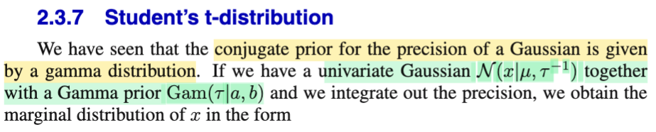</kbd>

<kbd>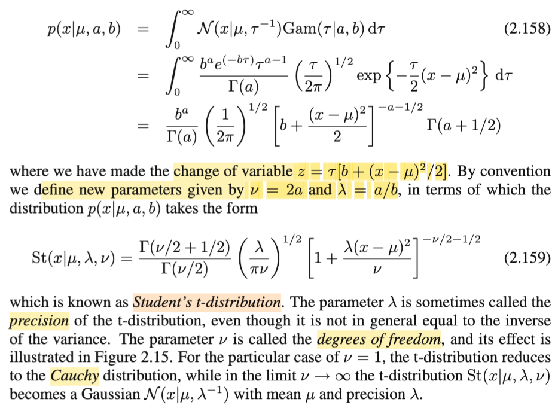</kbd>

<kbd>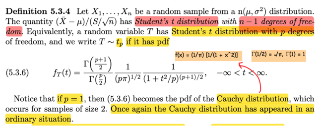</kbd>

> [!NOTE]
> Rồi. qua phần này, đầu tiên gs nói rằng, ta đã biết từ mấy phần trước, là với Normal precision hay variance thì prior conjugate chính là Gamma (có nghĩa là khi infer variance của Normal, nếu dùng prior distribution là Gamma thì posterior cũng sẽ là Gamma). Vậy thì ở đây ông xét single variance normal, và Gamma rồi đem tích phân nó, để có marginal pdf của x. Là sao ta?
>
>
>
> Để hiểu cái này, đơn giản thôi, chỉ là dùng conditional probability theorem: f(x, y) = f(x|y)f(y). Và sau đó, marginalize joint pdf của x,y over y ta sẽ được marginal pdf của x: f(x) = ∫f(x,y)dy = ∫f(x|y)f(y)dy
>
>
>
> Vậy ở đây, ta nhớ lại chút, với Bayesian approach, để infer θ, ta coi nó như random variable, có prior distribution π(θ) và dùng Bayes theorem để xây dựng posterior distribution của θ: π(θ| **x**) = f(**x**|θ) π(θ) / f(**x**). Thế thì, nếu nhìn lại, thì tử số của bên phải chính là joint pdf của **X** và θ: f(**x**, θ). Nên nếu marginal cái này over θ, ta sẽ có marginal pdf f(**x**) (và chia cho f(**x**) ở dưới, sẽ ra 1, để hoàn toàn khớp với việc ta marginal cái bên trái π(θ|**x**) over θ, cũng phải ra 1, vì đây là một valid pdf)
>
>
>
> Vậy thì quay lại đây, ta sẽ thấy bản chất của Normal(x|μ,1/τ)Gam(τ|a,b), chính là joint pdf của X và τ: f(x,τ|μ,a,b). Nên như trên vừa nói, marginalizing cái này over τ ta sẽ có marginal pdf của x:
>
>
>
> f(x|μ,a,b) = ∫f(x,τ|μ,a,b)dτ = ∫Normal(x|μ,1/τ)Gam(τ|a,b)dτ
>
>
>
> Rồi, thay công thức pdf của Gamma, Normal vào:
>
>
>
> .. = ∫(√τ/√2π) exp\[-τ(x-μ)^2/2\] b^a exp(-bτ) τ^(a-1) / Γ(a) dτ
>
>
>
> = ∫ \[b^a exp(-bτ) τ^(a-1) / Γ(a)\] (τ/2π)^(1/2) exp\[-τ(x-μ)^2/2\] dτ
>
>
>
>  = ∫ \[b^a / Γ(a)\] \[(1/2π)^(1/2)\] τ^(1/2) τ^(a-1) exp\[-τ(x-μ)^2/2-bτ\] dτ
>
>
>
> = ∫ \[b^a / Γ(a)\] (1/2π)^(1/2) τ^(a-1/2) exp{-τ\[(x-μ)^2+2b\]/2} dτ
>
>
>
> Tới đây, trong tích phân có dạng:
>
>
>
> \[constant c\] × τ^(α-1) exp(-τβ)
>
>
>
> với c = \[b^a / Γ(a)\] (1/2π)^(1/2), α = a+1/2, β = \[(x-μ)^2+2b\]/2
>
>
>
> Nhớ lại pdf của Gamma(α, β): f(x) = \[1/Γ(α)\] β^α x^(α-1) e^-βx với x ∈ (0, inf) α, β > 0
>
>
>
> Vậy từ đó có thể kết luận, cái hàm trong tích phân là kernel của một Gamma pdf có tham số α, β, do đó, bằng cách  bổ sung normalizing constant, cũng như đưa các constant sẵn có ra ngoài ta có thể rút gọn tích phân này bằng 1. Chỉ còn lại các constant:
>
>
>
> Normalizing constant của Gamma(α,β) cần bổ sung (nhân và chia bớt): \[1/Γ(α)\]β^α
>
>
>
> Vậy kết quả tích phân là: f(x|μ,a,b) = \[Γ(α)/β^α\] \[b^a / Γ(a)\] (1/2π)^(1/2)
>
>
>
> = \[b^a / Γ(a)\] (1/2π)^(1/2) \[Γ(α)/β^α\]
>
>
>
> Thay α = a+1/2, β = \[(x-μ)^2+2b\]/2 vào
>
>
>
> = \[b^a / Γ(a)\] (1/2π)^(1/2) \[Γ(a+1/2)/{\[(x-μ)^2+2b\]/2}^(a+1/2)\] 
>
>
>
> = \[b^a / Γ(a)\] (1/2π)^(1/2) \[1/{\[(x-μ)^2+2b\]/2}^(a+1/2)\] Γ(a+1/2)
>
>
>
> = \[b^a / Γ(a)\] (1/2π)^(1/2) \[{\[(x-μ)^2+2b\]/2}^(-a-1/2)\] Γ(a+1/2)
>
>
>
> = \[b^a / Γ(a)\] (1/2π)^(1/2) \[\[(x-μ)^2/2+b\]^(-a-1/2)\] Γ(a+1/2)
>
>
>
> = \[b^a / Γ(a)\] (1/2π)^(1/2) \[\[b + (x-μ)^2/2\]^(-a-1/2)\] Γ(a+1/2) → kết quả trong sách 2.158
>
>
>
>  ----
>
>
>
> Tiếp, đặt ν = 2a ⇨ a = ν/2, λ = a/b ⇨ b = a/λ
>
>
>
> Ta có:
>
>
>
> .. = \[(a/λ)^a / Γ(ν/2)\] (1/2π)^(1/2) \[\[a/λ + (x-μ)^2/2\]^(-ν/2-1/2)\] Γ(ν/2+1/2) 
>
>
>
> = \[Γ(ν/2+1/2) / Γ(ν/2)\] (1/2π)^(1/2) (a/λ)^a \[\[a/λ + (x-μ)^2/2\]^(-ν/2-1/2)\] 
>
>
>
> = \[Γ(ν/2+1/2) / Γ(ν/2)\] (1/2π)^(1/2) (a/λ)^a (a/λ)^(-ν/2-1/2) × \[1 + λ(x-μ)^2/2a\]^(-ν/2-1/2)\] 
>
>
>
> = \[Γ(ν/2+1/2) / Γ(ν/2)\] (1/2π)^(1/2) (a/λ)^(a-ν/2-1/2) × \[1 + λ(x-μ)^2/ν\]^(-ν/2-1/2)\] 
>
>
>
> = \[Γ(ν/2+1/2) / Γ(ν/2)\] (1/2π)^(1/2) (a/λ)^(ν/2-ν/2-1/2) × \[1 + λ(x-μ)^2/ν\]^(-ν/2-1/2)\] 
>
>
>
> = \[Γ(ν/2+1/2) / Γ(ν/2)\] (1/2π)^(1/2) (a/λ)^(-1/2) × \[1 + λ(x-μ)^2/ν\]^(-ν/2-1/2)\] 
>
>
>
> = \[Γ(ν/2+1/2) / Γ(ν/2)\] (1/2π)^(1/2) (λ/a)^(1/2) × \[1 + λ(x-μ)^2/ν\]^(-ν/2-1/2)\] 
>
>
>
> = \[Γ(ν/2+1/2) / Γ(ν/2)\] (1/2π)^(1/2) (2λ/ν)^(1/2) × \[1 + λ(x-μ)^2/ν\]^(-ν/2-1/2)\] 
>
>
>
> = \[Γ(ν/2+1/2) / Γ(ν/2)\] (λ/πν)^(1/2) × \[1 + λ(x-μ)^2/ν\]^(-ν/2-1/2)\]  → 2.159
>
>
>
> Và đây là pdf của Studen's t-distribution, cái pdf của distribution này mình đã gặp torng sách Casella đã định nghĩa ở 5.3.4.
>
>
>
> Và ν được gọi là độ tự do. Khi ν = 1, ta sẽ có Cauchy distribution (sách Casella cũng nói vậy)
>
>
>
> Và khi lấy ν → inf, thì nó sẽ trở thành Normal(μ, 1/λ)

> [!TIP]
> **🤖 AI Feedback** — ✅ Score: **98/100**
>
> Điểm mạnh của bạn là khả năng phân tích toán học rất sâu sắc và chi tiết, đặc biệt là việc tự giải thích và chứng minh lại các công thức 2.158 và 2.159 một cách chính xác. Bạn cũng đã kết nối các khái niệm về xác suất có điều kiện, Bayes và các phân phối khác (Cauchy, Normal) một cách rất mạch lạc. Để nâng cao hơn nữa, hãy chú ý một chút đến cách diễn đạt về "precision" và "variance" trong phần đầu để tránh nhầm lẫn, và đảm bảo mọi thuật ngữ được sử dụng nhất quán.

 

#### Student's t: Tính vững ngoại lai

<kbd>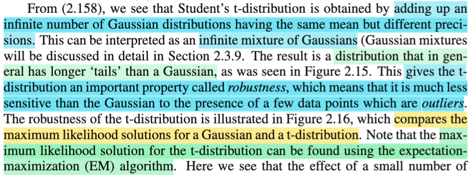</kbd>

<kbd>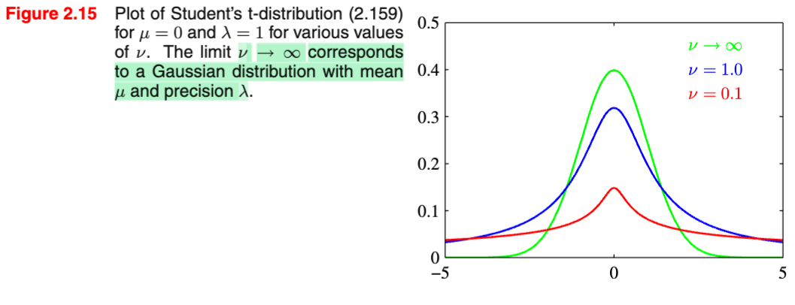</kbd>

<kbd>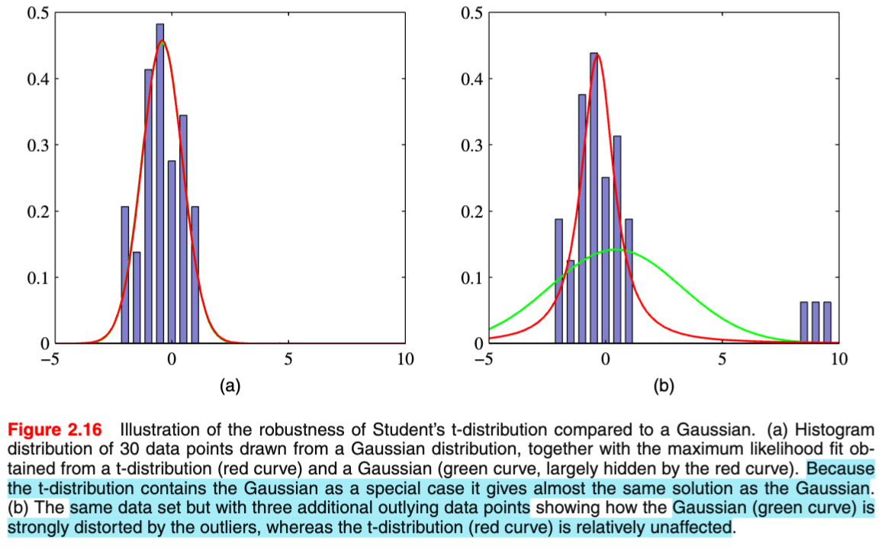</kbd>

> [!NOTE]
> Thế thì đại khái là từ 2.518: Student t's (x|μ,τ) = ∫Normal(x|μ,1/τ)Gam(τ|a,b)dτ
>
>
>
> thì nó sẽ mang ý nghĩa là: Phân phối Student's t thực chất là **TỔNG VÔ SỐ CÁC PHÂN PHỐI NORMAL, CÓ CÙNG LOCATION μ NHƯNG VỚI CÁC PRECISION** τ khác nhau. Và do đó, gs mới nói ta có thể diễn giải nó như một **HỖN HỢP CỦA CÁC GAUSSIAN** (Gaussian mixture).
>
>
>
> Và vì là đều có cùng mean μ và tổng hòa của nhiều precision khác nhau, (cũng là variacne khác nhau) nên Student's t có cùng mean μ, NHƯNG CÁI ĐUÔI SẼ DÀI HƠN so với Normal.
>
>
>
> Và gs cho biết, đặc điểm này giúp Student t's có tính ROBUSTNESS, mang ý nghĩa là nó sẽ ít NHẠY CẢM với các outlier trong data hơn là Normal. (gs nói ta sẽ học về thuật toán EM giúp giải tìm MLE của t-distribution, hiểu ý đại khái là, **không như Normal, còn nhớ, ta có thể derive ML estimator của mean và precision của Normal, còn với student t, có lẽ vì độ phức tạp, ta sẽ cần thuật toán EM**)
>
>
>
> Nói về hình minh họa 2.15: dễ thấy là các đường hình chuông ứng với ν tăng từ 0.1 → inf sẽ ngày càng có: cái đuôi bớt dài, và càng giống hình chuông Normal, minh họa cho ý trong note trước, khi ν → inf thì Student's trở thành Normal.
>
>
>
> Còn hình 2.16 a đại khái là với một bộ sample ko có outlier, thì vì bản chất của student t cũng là normal, nên mle của student t (tức là maximum likelihood estimator của student t mean và variance) sẽ cũng trùng khớp với mle của normal. Nhưng nếu có outlier thì hình b cho thấy mle của Normal bị thay đổi khá nhiều, trong khi của Student t vẫn ít bị ảnh hưởng.
>
>
>
> Có thể hiểu thế này, **thay vì ta giả định X \~ Normal, rồi giải bài toán inference Normal param. Sẽ dễ bị outlier trong data ảnh hưởng xấu. thì ta có thể giải định X \~ Student's t, và giải bài toán inference param, sẽ ít bị ảnh hưởng bởi outlier trong data hơn.**
>
>  \
> Có thể nói thêm về tính robust của Student's t so với Normal: Như đã biết, cái đuôi của Student t dày hơn, đồng nghĩa, đối với mô hình này, xác suất của một observed data có giá trị extreme (kéo về 2 đầu cách xa mean) là cao hơn so với của Normal. Mà bài toán MLE, vốn có bản chất là: tìm dạng của distribution để giải thích tốt nhất cho observed data. nên nếu như có các extreme data, thì sẽ dẫn đến hai cách ứng xử khác nhau của hai mô hình (kết quả MLE của Normal và Student's t):
>
>
>
> Giả sử ban đầu, data ko có outlier, MLE của cả hai mô hình đều ra giống nhau: ML approach estimate location và scale của Normal và Student t là tương tự nhau.
>
>
>
> Student's: Vì như đã nói, nó có xác suất của extreme data cao hơn, nên khi thật sự data outlier xuất hiện, nó không ngạc nhiên lắm, không bị làm cho ảnh hưởng, khiến ML estimate của location và scale vẫn giữ nguyên.
>
>
>
> Normal. vì phải cố giải thích sự xuất hiện của extreme data, nên nó buộc phải tăng scale lên, hình ảnh sẽ là nó phải phình to ra, để giúp cho với mô hình đó, outlier có xác suất cao hơn, cũng chính là với scale đó, có thể giải thích tốt hơn cho các giá trị outlier này. Và không những vậy, nếu việc phình to (tăng scale / variance) còn chưa đủ, nó thậm chí phải dịch chuyển cái location / mean về phía đó nữa.

> [!TIP]
> **🤖 AI Feedback** — ✅ Score: **95/100**
>
> Ghi chú của bạn rất chính xác và sâu sắc, nắm bắt tốt các khái niệm chính về phân phối t của Student, mối quan hệ với hỗn hợp Gaussian và tính bền vững trước các giá trị ngoại lệ. Để hoàn thiện hơn, bạn có thể diễn đạt rõ hơn rằng phân phối t chứa Gaussian như một trường hợp đặc biệt khi ν tiến tới vô cùng, thay vì "bản chất" là Normal.

 

##### Ưu điểm Robust của Student t

<kbd>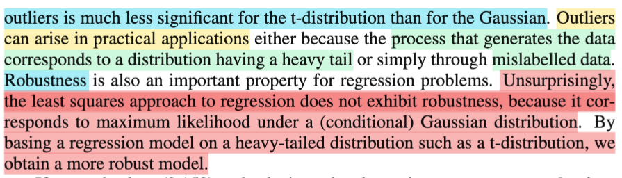</kbd>

> [!NOTE]
> Rồi, thế thì tiếp theo đây là một ý rất quan trọng. Gs nói rằng, khi hiểu về distribution Student t's có hình dạng giống normal nhưng cái đuôi dài hơn - với ý nghĩa, với mô hình xác suất này, các giá trị cực đoan có xác suất xuất hiện cao hơn, khiến cho ML estimator của distribution param, ví dụ location của nó, sẽ ít "bị nhạy cảm bởi outlier" hơn, hay nói nôm na là, khi gặp data có các giá trị cực đoan, thì mô hình ít bị xao động hơn (mình sẽ hiểu rõ hơn về cái này khi cày xong chap 10 Casella).
>
>
>
> Và như vậy, ta còn nhớ bài toán least square, có bản chất chính là bài toán ta đi tìm ML estimator của Normal mean: Tức là ta giả định T|**x** \~ Normal(y(**x**, **w**), σ^2), và ý muốn nói, vì ta dùng Normal làm distribution giả định cho T, nên nó không có tính Robust. Nếu ta thay Normal bằng Student's t, ta sẽ có thể có cách tiếp cận Robust hơn.

> [!TIP]
> **🤖 AI Feedback** — ✅ Score: **95/100**
>
> Phân tích của bạn rất chính xác và sâu sắc, nắm bắt tốt bản chất về tính vững (robustness) của phân phối t-Student và mối liên hệ với phương pháp bình phương tối thiểu. Để cô đọng hơn, bạn có thể tóm tắt trực tiếp hơn ý chính về việc thay thế phân phối giả định từ Gaussian sang t-Student mang lại sự vững vàng.

 

- **Phân phối Student T Đa biến**

<kbd>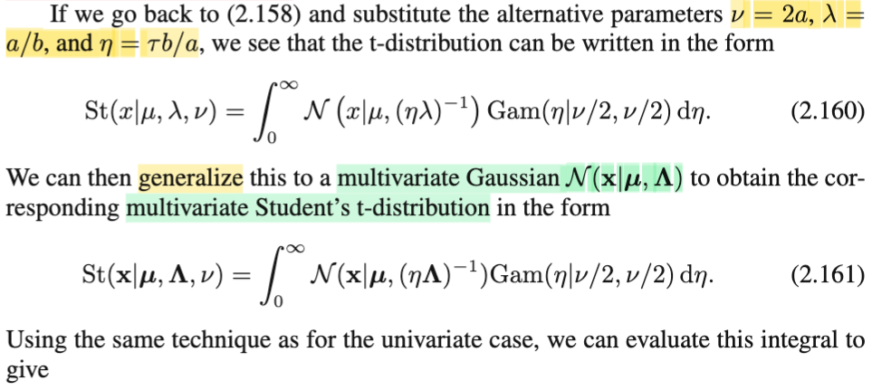</kbd>

<kbd>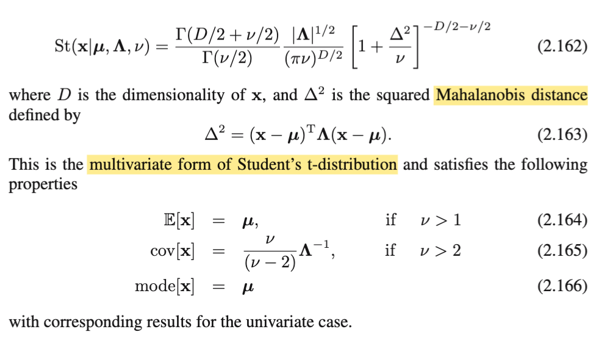</kbd>

> [!NOTE]
> Cái phân phối về cơ bản chỉ là giáo sư nói về cái phiên bản khái quát lên cái trường hợp đa biến của phân phối student T. Thì công thức của cái hàm student T đa biến mình chưa gặp ở Casella cũng như start 110. Nhưng mà ở đây mình tạm chấp nhận cái công thức đó thay vì cố gắng giải cái tích phân 2.161.

> [!TIP]
> **🤖 AI Feedback** — ⚠️ Score: **85/100**
>
> Học viên nắm bắt chính xác trọng tâm của đoạn văn về việc khái quát phân phối Student-T sang dạng đa biến và hiểu công thức 2.162 là kết quả của tích phân 2.161. Để sâu sắc hơn, hãy xem xét các yếu tố mới như khoảng cách Mahalanobis (Δ²) và các tính chất của phân phối đa biến này.

 

## 2.3.8 Periodic variables

<kbd></kbd>

> [!NOTE]
> Qua phần này, đại ý là, đầu tiên gs nói rằng, tuy Normal distribution có vai trò khá lớn khi nó có thể là building block của nhiều mô hình xác xuất phức tạp. Tuy nhiên cũng có những mô hình khó có thể dùng Normal để mô phỏng.
>
>
>
> Một trường hợp như vậy là preriodic variable. Ví dụ như hướng gió. (Kiểu như ta cho rằng X1,...Xn là các random variable, mang gía trị là hướng gió. Và muốn estimate distribution của chúng) Thì đoạn này nói rằng, một mô hình như vậy sẽ **phụ thuộc vào gốc tham chiếu nếu ta làm như kiểu thông thường** (ví dụ như dùng các random variable để mang giá trị của các observation và đi xây dựng (inference) tham số của population distribution)
>
>
>
> Ví dụ như ta có 2 observed value của hai random variable θ1, θ2 với θ1 = 1 độ, và θ2 = 359 độ. (θ1, θ2, chỉ là như X1, X2 thôi, là random variable trong sample, chẳng qua là vì trong bài toán này người ta sẽ dùng / đo hướng gió nên các random variable đây thể hiện góc của hướng gió. Có thể hiểu là θ1, θ2 là iid random sample \~ f(θ|μ, σ^2) Thì nếu lấy chọn gốc lại tại 0 độ, thì sample mean sẽ là 180, với standard deviation là 179. Nhưng nếu chọn gốc tại θ0 = 180 thì sample mean lại là 0, và standard deviation lại là 1.
>
>
>
> Do đó ta cần một cách tiếp cận đặc biệt để xử lý khi deal với periodic variable

> [!TIP]
> **🤖 AI Feedback** — ✅ Score: **97/100**
>
> Tóm tắt rất chính xác và đầy đủ các ý chính, bao gồm cả ví dụ minh họa cụ thể về sự phụ thuộc vào gốc tham chiếu. Để tăng tính súc tích, bạn có thể cân nhắc cô đọng hơn một số phần giải thích trong dấu ngoặc đơn.

 

### Đại diện hướng gió bằng véc-tơ

<kbd></kbd>

<kbd></kbd>

<kbd></kbd>

> [!NOTE]
> Ok, đại khái là, cách tiếp cận khác sẽ là như sau: Vì mục đích là mô hình hóa hướng gió, và đại lượng hướng, ngoài cách làm dùng hệ tọa độ cực (polar coordinate) và dùng thông số góc, để đại diện, thì vẫn có thể dùng một cặp giá trị (x1,x2), tức một 2D vector **x**, nằm trên unit circle để đại diện, vì lẽ dĩ nhiên mỗi một điểm như vậy, sẽ mang thông tin của một giá trị góc, và vì ta chỉ quan tâm đến hướng, nên ta chỉ cần xét những điểm nằm trên unit circle thôi.
>
>
>
> Νhư vậy, giả sử với observed value của sample θ1, θ2,...θN, sẽ tương ứng với sampe, **x**1, **x**2, ...**x**N.
>
>
>
> Từ đó sample mean θbar = (Σi θi)/N sẽ tương ứng với sample mean **x**bar = (Σi **x**i)/N
>
>
>
> Rồi, vì θn sẽ liên hệ với **x**n thông qua: **x**n = (**x**n_1, **x**n_2) = (cos θn, sin θn) nên 
>
>
>
> **xbar** = (**x**bar_1, **x**bar_2) = (rbar × cos(θbar), rbar × sin(θbar)).
>
>
>
>  và từ đó, 
>
>
>
> tan(θbar) = **x**bar_1 / **x**bar_2 
>
>
>
> = \[(1/N) Σi **x**i_1\] / \[(1/N) Σi **x**i_2\] 
>
>
>
> = Σi **x**i_1 / Σi **x**i_2 
>
>
>
> = Σi **x**i_1 / Σi **x**i_2
>
>
>
> = Σi sin(θi) / Σi cos(θi)
>
>
>
> ⇨ θbar = argtan(Σi sin(θi) / Σi cos(θi))  → 2.169
>
>
>
> Nói chung ko có gì khó hiểu cả, chỉ là, thay vì ta dùng thước đo là góc θ để ghi nhận, thể hiện giá trị của các data (đồng nghĩa ta dùng Polar coordinate), thì ta dùng 2D vector **x** trên đường tròn unit, để ghi nhận cùng một quan sát. Từ đó, bằng cách này, ta không còn bị cái vụ phụ thuộc vào mốc làm chuẩn nữa.

> [!TIP]
> **🤖 AI Feedback** — ✅ Score: **92/100**
>
> Bạn đã nắm vững lý do cần chuyển đổi sang vector 2D và cách thức suy ra công thức góc trung bình một cách rõ ràng và logic, giải quyết được vấn đề phụ thuộc hệ tọa độ. Tuy nhiên, hãy cẩn thận hơn một chút với thứ tự của các thành phần khi tính tan(θbar) trong các bước trung gian (phải là x_bar_2 / x_bar_1), dù kết quả cuối cùng của bạn vẫn đúng.

 

#### Von Mises Distribution

<kbd></kbd>

<kbd></kbd>

<kbd></kbd>

> [!NOTE]
> Rồi, thế thì, ta sẽ được học một phiên bản khái quát của phân phối Normal, có tên gọi là von Mises. Và sẽ chỉ làm với case đơn biến.
>
>
>
> Theo quy ước ta sẽ xét distribution f(θ) có chu kì 2π.
>
>
>
> Thế thì, vì tính chất perdiod, nên đại ý là, ngoài hai đặc điểm của một valid pdf: không âm và intergrate = 1, thì nó còn phải thỏa f(θ + 2π) = f(θ).
>
>
>
> Và ta sẽ bắt đầu việc derive ra công thức của pdf von Mises như sau: Xét một phân phối Normal 2D: **X** \~ Normal(**μ**, **Σ**) có mean là **μ** = (μ1, μ2), covariance là σ^2 **I** (là 2x2 matrix).
>
>
>
> Công thức 2.173 là sao?
>
>
>
> Còn nhớ công thức của multivariate Gaussian:
>
>
>
> f**X**(**x**|**μ**,Σ) = công thức 2.43 = \[1/(2π)^(D/2)\] \[1/|**Σ**|^1/2\] exp\[-1/2(**x**-**μ**)T **Σ**inv(**x**-**μ**)\]
>
>
>
> Thì ở đây với D = 2, và **Σ** = σ^2 **I**, thì |**Σ**| = (σ^2)^2 ⇨ |**Σ**|^1/2 = σ^2.
>
>
>
> Và **Σinv** sẽ là (1/σ^2) **I ⇨ Σ**inv(**x**-**μ**) = \[(x1-μ1)/σ^2; (x2-μ2)/σ^2\]T
>
>
>
> ⇨ (**x**-**μ**)T **Σ**inv(**x**-**μ**) = \[x1-μ1; x2-μ2\] dot product \[(x1-μ1)/σ^2; (x2-μ2)/σ^2\]
>
>
>
> = (x1-μ1)^2/σ^2 + (x2-μ2)^2/σ^2
>
>
>
> = \[(x1-μ1)^2 + (x2-μ2)^2\] /σ^2
>
>
>
> Thay vào ta sẽ có f(**x**|**μ**,**Σ**) = (1/2πσ^2) exp{-(1/2σ^2)\[(x1-μ1)^2 + (x2-μ2)^2\]}
>
>
>
> ---
>
>
>
> Và contour plot của hàm pdf này là những đường tròn trên hình 2.18, vì sao:
>
>
>
> Thì chỉ cần xét một c level curve: f(x) = c
>
>
>
> ⇔ (1/2πσ^2) exp{-(1/2σ^2)\[(x1-μ1)^2 + (x2-μ2)^2\]} = c
>
>
>
> ⇔ exp{-(1/2σ^2)\[(x1-μ1)^2 + (x2-μ2)^2\]} = c 2πσ^2
>
>
>
> ⇔ -(1/2σ^2)\[(x1-μ1)^2 + (x2-μ2)^2\] = log(c 2πσ^2)
>
>
>
> ⇔ (x1-μ1)^2 + (x2-μ2)^2 = - log(c 2πσ^2) 2σ^2  = constant d
>
>
>
> Thì đây là phương trình đường tròn tâm tại μ, bán kính √d

> [!TIP]
> **🤖 AI Feedback** — ✅ Score: **98/100**
>
> Bài ghi rất chính xác và có chiều sâu, đặc biệt là phần chứng minh chi tiết công thức 2.173 và giải thích vì sao đồ thị contour là hình tròn. Bạn đã thể hiện sự hiểu biết vững chắc về các khái niệm.

 

##### Gaussian distribution polar coordinates

<kbd></kbd>

<kbd></kbd>

<kbd></kbd>

> [!NOTE]
> Từ note trước ta đã hiểu f(**x**|**μ**,**Σ**) = (1/2πσ^2) exp{-(1/2σ^2)\[(x1-μ1)^2 + (x2-μ2)^2\]}
>
>
>
> Bước tiếp theo là đổi biến x1 = r cos(θ), x2 = r sin(θ), và xét trong phạm vi circle unit
>
>
>
> Theo change of variable theorem đã học ở Stat110 hoặc Casella, cụ thể ở đây là bivariate change of variable:
>
> Ôn lại nhanh, với random variable vector (X,Y) có pdf fX,Y(x,y), và ta có U = g1(X,Y), V = g2(X,Y), với mapping 1-1 từ support set của (X,Y) với support set của (U,V): X = h1(U,V), Y = h2(U,V), thì change of variable theorem cho ta:
>
>
>
> fU,V(u,v) = fX,Y(x,y) |∂(x,y)/∂(u,v)| = fX,Y(h1(u,v), h2(u,v)) |∂(x,y)/∂(u,v)|
>
>
>
> với |∂(x,y)/∂(u,v)| là trị tuyệt đối của Jacobian matrix của hàm vector → vector: \[g1(u,v), g2(u,v)\]
>
>
>
> Áp dụng vào đây
>
>
>
> f(θ, r) = f(x1,x2) |det J|, với J là jacobian matrix: matrix ∂(x1,x2)/∂(θ,r)
>
>
>
> (có thể tính |det J| ra ko khó, vì matrix này là matrix 2x2: \[∂x1/∂θ, ∂x1/∂r; ∂x2/∂θ, ∂x2/∂r\] = \[cos(θ), -rsin(θ); sin(θ), rcos(θ)\] = rcos(θ)cos(θ) - \[-rsin(θ)sin(θ)\] = r\[cos(θ)^2 + sin(θ)^2\] = r ⇨ |det J| = |r| = r)
>
>
>
> = f(r cos(θ), r sin(θ)) r
>
>
>
> = (r/2πσ^2) exp{-(1/2σ^2)\[(r cos(θ)-μ1)^2 + (r sin(θ)-μ2)^2\]}
>
>
>
> Tiếp, như thường lệ, ta sẽ chỉ cần quan tâm quadratic form (vì constant bên ngoài, chỉ đóng vai normazing constant):
>
>
>
> = -(1/2σ^2)\[(r cos(θ)-μ1)^2 + (r sin(θ)-μ2)^2\]
>
>
>
> = -(1/2σ^2)\[r^2 cos(θ)^2 - 2r μ1 cos(θ) + μ1^2 + r^2 sin(θ)^2 - 2r μ2 sin(θ) + μ2^2\]
>
>
>
> = -(1/2σ^2)\[r^2 (cos(θ)^2 + sin(θ)^2) - 2 r μ1 cos(θ) - 2 r μ2 sin(θ) + μ1^2 + μ2^2\]
>
>
>
> gọi (θ0, r0) là tọa độ tương ứng của (μ1, μ2) trong polar coordinate, ta thay vào luôn
>
>
>
> = -(1/2σ^2)\[r^2 - 2 r r0 cos(θ0) cos(θ) - 2 r r0 sin(θ0) sin(θ) + (r0 cos θ0)^2 + (r0 sin θ0)^2\]
>
>
>
> Dùng điều kiện r = 1 (do đang chỉ xét trong phạm vi trên đường unit circle)
>
>
>
> = -(1/2σ^2)\[1 - 2 r0 cos(θ0) cos(θ) - 2 r0 sin(θ0) sin(θ) + r0^2\]
>
>
>
> = -(1/2σ^2)\[1 + r0^2 - 2 r0 cos(θ0) cos(θ) - 2 r0 sin(θ0) sin(θ)\]
>
>
>
> = -(1/2σ^2)\[1 + r0^2 - 2 r0 cos(θ0) cos(θ) - 2 r0 sin(θ0) sin(θ)\]
>
>
>
> = -(1/2σ^2)(1 + r0^2) + (1/2σ^2)\[2 r0 cos(θ0) cos(θ) + 2 r0 sin(θ0) sin(θ)\]
>
>
>
> = const + (r0/σ^2)\[cos(θ0) cos(θ) + sin(θ0) sin(θ)\]
>
>
>
> = (r0/2σ^2)\[cos(θ0) cos(θ) + sin(θ0) sin(θ)\] + const
>
>
>
> = (r0/σ^2)\[cos(θ - θ0)\] + const
>
>
>
> ---
>
>
>
> Rồi, tới đây ta có:
>
>
>
> f(θ) = (1/2πσ^2) exp{(r0/σ^2)cos(θ - θ0) + const} |J|
>
>
>
> Nhưng vì ta đã làm động tác chỉ xét trên phạm vi đường tròn unit, nên bản thân cái vế phải không còn là một valid pdf nữa, hay nói cách khác, ta sẽ phải normalizing nó. Thành ra, những hằng số cụ thể ở đây ko còn đóng vai trò biểu hiện chính xác của normalizing constant nữa, nên ta ko cần care nữa cho mệt, chỉ cứ làm theo lối thông dụng: quan tâm đến kernel, và định nghĩa normalizing constant sau.
>
>
>
> Đặt m = r0 / σ^2
>
>
>
> f(θ) ∝ exp{m cos(θ - θ0)}
>
>
>
> ∝ exp{m cos(θ - θ0)}
>
>
>
> Và vì tính valid: ∫0:2π f(θ) dθ = 1 ⇔ ∫0:2π \[normalizing constant\] exp{m cos(θ - θ0)\] dθ = 1
>
>
>
> ⇔ \[normalizing constant\] ∫0:2π exp{m cos(θ - θ0)\] dθ = 1
>
>
>
> ⇔ ∫0:2π exp{m cos(θ - θ0)\] dθ = 1/\[normalizing constant\]
>
>
>
> Vậy f(θ) = \[normalizing constant\] exp{m cos(θ - θ0)}
>
>
>
> với \[normalizing constant\] = 1/∫0:2π exp{m cos(θ - θ0)\] dθ
>
>
>
> Và người ta đặt cái tích phân ở mẫu số là 2πI0(m):
>
>
>
> 2πI0(m) = ∫0:2π exp{m cos(θ - θ0)\] dθ
>
>
>
> ⇔ I0(m) = (1/2π) ∫0:2π exp{m cos(θ - θ0)\] dθ, và cái này được gọi là **hàm Bessel bậc zero of the fisrt kind** (tạm biết vậy thôi)
>
>
>
> ∫0:2π exp{m cos(θ - θ0)\] dθ = 2πI0(m) ⇔ (1/2π) ∫0:2π exp{m cos(θ - θ0)\] dθ = I0(m) , để rồi:
>
>
>
> f(θ) = \[1/2πI0(m)\] exp{m cos(θ - θ0)}
>
>
>
> Vậy là ta đã có von Mises distribution, còn gọi là **CIRCULAR NORMAL**, có mean là θ0, m là tham số **CONCENTRATION** , tương đương với **inverse variance** (precision) trong phân phối normal thông thường.
>
>
>
> ---
>
>
>
>
>
> Mình nên nói thêm chút xíu. Đại ý của cái ý tưởng của chuyện mà nãy giờ làm. Mục đích là như đã nói là muốn xây dựng một cái phân phối chuẩn nhưng mà dành cho một cái đại lượng có tính chất là periodic, có nghĩa là tính chất chu kỳ. Cái tính chất chu kỳ á nó nó là một cái tính chất mà trong một số cái trường hợp, một số cái bài toán thực tế nó phát sinh. Ví dụ, khi mà mình muốn xét một cái đại lượng mang ý nghĩa là hướng. Thì kiểu như là bây giờ cái hướng nó xoay vòng vòng. Thì nó xoay vòng vòng nó có một cái tính chất đó là khi mà mình thay đổi, ví dụ như từ hướng 1 giờ mình thay đổi thành hướng 2 giờ thì thì nó nó là giá trị nó thay đổi. Tức là nó ra một cái hướng khác. Rồi từ 2 giờ nó thành 3 giờ thì nó ra một hướng khác, nó giống như cái chuyện mà mình thay đổi trên trục số từ x1 bằng 1, từ x2 bằng 2, từ x3. Nhưng mà khi mà mình thay đổi đến cái hướng đến một cái mức nào đó nó lại quay lại vị trí cũ. Thì đó là cái tính periodic, tính chu kỳ. Thì cái này mình lại không thể nào phản ánh nó bằng những cái biến ngẫu nhiên mà mang giá trị thực được. Bởi vì giá trị thực nó không có cái chuyện đó, x1 bằng 1, x2 bằng 2, bằng 3, nếu mà nó tiếp tục tăng thì nó không bao giờ nó quay lại được cũ cả. Do đó là mình phải tìm cách là ép hoặc là xây dựng một cái phân phối chuẩn nhưng có cái tính chất chu kỳ để dành để riêng cho việc mô hình hóa những cái biến periodic.
>
>
>
>
>
> Vậy thì cái ý tưởng Đại khái là mình cứ nhìn vô cái hình trong sách. Người ta bắt đầu với một cái mô hình normal. Xét một cái hàm một cái hàm density. Cái hàm density đặc biệt ở chỗ này là nó cái hàm cái đường màu đỏ là đại khái vậy. Mình đang có một cái hàm hai biến một cái chuông ở trong không gian 3D, đúng không? Mình có cái hàm hai biến. Bây giờ mình mới restrict nó trên một cái đường tròn unit. Thì khi đó cái hàm số mà hai biến, cái hàm PDF của normal đó nhưng mà bị restrict trên một cái đường tròn đơn vị thì lúc bây giờ nó chỉ còn là một cái hàm một biến. Mà khi mà mình đi trên cái đường tròn đó thì nó có một cái tính chất thế này. Đó là khi mà mình đi một vòng thì mình lại về lại chỗ cũ. Ví dụ như mình xuất phát tại cái điểm mà tại đó cái độ lớn hàm PDF là lớn nhất đi thì khi mình đi đúng một vòng thì mình lại quay lại đúng cái chỗ cũ. Tức là mình có được một cái hàm số có cái tính chất là chu kỳ.
>
>
>
>
>
> Và mình cứ hình dung là khi mà mình di chuyển trên cái đường đó đó thì mình sẽ ví dụ như điểm bắt đầu của mình nó nói là cái điểm mà có cái có cái độ cao cao nhất, tức là cái giá trị density cao nhất. Nó là cái điểm mà nằm bên phải và nói chung là ở cái gốc bên phải ở bên trên á. Nằm đâu khúc giữa mà nó gần với cái cái cái tâm nhất của mấy cái đường màu xanh á. Thì mình cứ hiểu đại khái nó là giống như là một cái là nó ứng với tâm của cái phân phối vậy. Rồi để coi rồi mình đi mình đi trên cái đường tròn màu đỏ đó thì cái density nó giảm dần. Nhưng mà khi mình đi qua phía bên kia thì density lại tăng lên dần và nó lại về lại vị trí cũ. Và dĩ nhiên là khi mà mình đã restrict cái hàm normal PDF ở trên cái đường màu đỏ thì lúc bấy giờ nó không còn có cái tính hợp lệ để trở thành một cái PDF nữa. Do đó mình phải có cái bước gọi là normalizing. Cái bước chuẩn hóa. Nhưng mà cái kiểu như là cái cái cách biến thiên của cái hàm mà gọi là circulating Gaussian này nó cũng có cái dạng của hình chuông nhưng mà nó lại có cái tính periodic. Nó hay là chỗ đó.

> [!TIP]
> **🤖 AI Feedback** — ✅ Score: **99/100**
>
> Bài viết của bạn thể hiện sự hiểu biết sâu sắc và toàn diện về phân phối von Mises, từ quá trình biến đổi tọa độ với Jacobian đến lý do tồn tại của nó. Bạn đã làm rất tốt việc giải thích cả khía cạnh toán học và trực giác của chủ đề này.

 

- **Figure 2.19 von Mises Distribution**

<kbd></kbd>

<kbd></kbd>

> [!NOTE]
> Ôn nhanh lại chút xíu về Circulating Gaussian: Đại ý là, ta muốn mô hình hóa các đại lượng mang tính chu kì, gọi là periodic variable, và cụ thể hơn, ta muốn xây dựng một phân phối Normal đối với periodic variable. Vậy thì, đại khái là, đầu tiên, lấy ví dụ yếu tố cần mô phỏng là hướng gió, thì nếu chỉ biểu diễn theo lối thông thường, ta sẽ có kết quả rất phụ thuộc vào gốc.
>
>
>
> Ý là, ví dụ nếu như cứ cho X1,X2,...Xn là các random variable thể hiện cho các giá trị quan sát của hướng gió (còn nhớ, trong Casella đã học định nghĩa của random sample size n: Tiến hành quan sát giá trị của một đại lượng ngẫu nhiên n lần, mỗi lần dùng một random variable Xi để ghi nhận giá trị của nó, và thực hiện theo lối sao cho các random variable mutually independent và có cùng distribution. Vì tính chất random của đại lượng được quan sát nên dĩ nhiên Xi là random variable, vì nó có thể có nhiều possible values), thì vấn đề là, hướng gió (giả sử dùng đơn vị độ) 179 độ và 1 độ thật ra rất gần nhau. Dẫn đến vấn đề là, nếu ta chọn gốc khác thì mô hình sẽ khác. Ví dụ, chọn gốc tham chiếu là mốc 0 độ thì sample mean sẽ khác, mà chọn ở mốc khác thì sample mean sẽ khác.
>
>
>
> Do đó, ta mới dùng một cách tiếp cận khác: Đó là thay vì dùng góc θ để biểu diễn hướng gió, đồng nghĩa là đang dùng hệ tọa độ cực (polar coordinate) thì ta sẽ dùng hệ tọa độ Cartesian, tức là cứ dùng các vector 2D, và vì chỉ quan tâm hướng, nên ta cho chúng có độ dài bằng nhau, và tiện nhất là cho bằng 1, để sự khác nhau của các vector sẽ thể hiện sự khác nhau của hướng gió. Bằng cách này, ta loại bỏ sự phụ thuộc vào gốc tham chiếu khi sample mean luôn là sample mean (ý là ko phải bị phụ thuộc gốc tham chiếu như dùng góc). Và ta đi đến công thức:
>
>
>
> **θbar = argtan(Σi sin(θi) / Σi cos(θi))**
>
>
>
> Và đại ý là, khi ta đi xây dựng một phân phối Chuẩn dành cho biến periodic, ta sẽ thấy đây chính là công thức của ML estimator của mean θ của phân phối đó (y như Xbar, tức sample mean cũng là ML estimator của μ vậy)
>
>
>
> Thế rồi, để đi xây dựng một phân phối chuẩn nhưng dành cho biến chu kì (periodic variable), người ta có ý tưởng làm như sau: Lôi một phân phối 2D Normal(**μ**, σ^2 × **I**), và phương hướng làm (xây dựng một hàm density có tính chất của một phân phối Normal hình chuông nhưng lại có tính chu kì, đó là pdf tại θ + 2π phải bằng pdf tại θ (theo quy ước, người ta dùng chu kì 2π) như sau: CHUYỂN HÀM NORMAL SANG BIẾN θ, r (dùng change of variable, để xây dựng pdf của θ, r từ pdf của X1, X2), sau đó, GIỚI HẠN NÓ TRÊN RÀNG BUỘC R = 1. Lúc này, ta được một cái hàm density có tính chất chu kì (có được là do ràng buộc r = 1, khiến khi θ thay đổi, sẽ tương ứng ta chạy vòng quanh đường tròn đơn vị → mang lại tính chu kì) và đồng thời thừa hưởng đặc điểm của phân phối Normal, vì kiểu như khi chạy một vòng quanh đường tròn đơn vị, giá trị hàm số cũng thay đổi theo hình chuông: cao khi tới gần góc phần tư thứ 1, giảm khi đi xa ra khỏi đó.
>
>
>
> Và nhiệm vụ còn lại, là, đặt ra normalizing function để giúp cái hàm density này trở thành valid: tích phân toàn miền = 1 (vì khi ta giới hàn hàm Normal density trên r = 1, thì đã không còn valid là pdf ở điều kiện tích phân toàn miền bằng 1 nữa)
>
>
>
> Và kết qủa là ta có công thức của phân phối Von Mises, còn gọi là Circulating Gaussian:
>
>
>
> **f(θ) = \[1/2πI0(m)\] exp{m cos(θ - θ0)}**
>
>
>
> với θ là mean tương ứng với μ của normal thông thường
>
>
>
> và m là concentration, tương tự precision của normal thông thường
>
>
>
> Và để ý tính periodic của nó: f(θ + 2π) = \[1/2πI0(m)\] exp{m cos(θ - θ0 + 2π)} đúng là bằng f(θ) vì cos(α + 2π) = cos(α)
>
>
>
> ---
>
>
>
> Rồi, như trên là mình đã ôn lại ý tưởng chính giúp derive ra pdf của **Von Mises**, quay lại đây, hình này sẽ hiểu như sau:
>
>
>
> Bên trái: khi thay đổi θ: chạy từ trái sang phải, chính là thay đổi θ, thì pdf của Von Mises (π/4, 5) sẽ có giá trị cao nhất tại π/4, và của Von Miese (3 π/4, 1) là tại 3π/4, rất dễ hiểu. Tham số m, concentration, có thể thấy, chi phối sự dàn trải của xác suất, với màu đỏ (m = 5), nó có sự tập trung xác suất cao, dẫn đến hình chuông đỏ ốm, cao, ngược lại với màu xanh. Và cả hai đều thể hiện tính chu kì, khi có thể thấy khi tại 2π, đường cong giống như tiếp nối với khúc đầu.
>
>
>
>
>
> Còn cái hình bên phải thì thật ra là mình đang nhìn theo tọa độ cực. Có nghĩa là với hình bên trái là khi mình chạy từ trái sang phải, có nghĩa là mình sẽ thay đổi cái góc theta từ 0 đến 2 pi. Nhưng mà ở bên phải là mình sẽ hiểu rằng là mình **xoay cái góc theta quanh cái điểm gốc tọa độ**. Mình xoay cái góc để từ 0 radian đến 2 pi radian. Thì với cái góc nhìn đó thì mình sẽ thấy rằng là cái khoảng cách từ một cái điểm ở trên đường màu đỏ với cái tâm nó chính là giá trị của density function. Để rồi mình thấy rằng khi mình xoay mình tăng cái góc theta lên thì nó sẽ khi từ 0 radian tăng lên dần đến pi/4 thì nó sẽ đạt giá trị lớn nhất. và tiếp tục cho cái điểm giao điểm với cái của cái đường mà mình vẽ với cái đường Elip màu đỏ nó di chuyển trên cái đường Elip thì mình sẽ thấy rằng nó sẽ cái góc nó sẽ tăng lên nó sẽ tiếp tục tăng lên và quét hết toàn bộ một vòng từ 0 pi 0 đến 2pi.
>
>
>
> Cần hiểu đường màu đỏ đi rất sát gốc tọa độ, nhưng thật ra nó hơi vòng xuống dưới, vì góc θ sẽ quét từ 0 → 2π, chỉ là ở phía đối diện với π/4, giá trị xác suất ≈ 0. Cho dễ hình dung, cứ tưởng tượng ta có sợ dây thun, và cây đinh là gốc tọa độ, thì thực tế là tròng sợi dây thun vào cây đinh, và giữ ngón tay ở đầu π/4.

> [!TIP]
> **🤖 AI Feedback** — ✅ Score: **98/100**
>
> Ghi chú của bạn cực kỳ chi tiết, chính xác và thể hiện sự hiểu biết sâu sắc về phân phối Von Mises, từ động lực, quá trình dẫn xuất đến cách các tham số ảnh hưởng đến hình dạng phân phối trên cả hai loại biểu đồ. Bạn đã phân tích biểu đồ cực rất sắc sảo, giải thích rõ ràng mối quan hệ giữa giá trị hàm mật độ và khoảng cách từ tâm. Để ghi chú cô đọng hơn, bạn có thể cân nhắc rút gọn một số đoạn giải thích phụ, nhưng nhìn chung đây là một ghi chú học tập xuất sắc.

 

- **Maximum Likelihood Estimators for Von Mises**

<kbd></kbd>

<kbd></kbd>

> [!NOTE]
> Tới đây, đại khái là ta sẽ đi tìm công thức của ML estimator của Von Mises mean θ.
>
>
>
> Có nghĩa là, ta lại quay lại bài toán inference: point estimation θ, của một random sample θ1, θ2,....θn (gom tụi này lại kí hiệu là D) iid \~ Von Mises (θ0, m).
>
>
>
>  Như đã biết, chính là ta giải bài toán tối ưu sau:
>
>
>
> maximize over θ {L(θ|D)} với L là likelihood function, theo định nghĩa là hàm của tham số θ, được tính bởi joint pdf của các random variable của random sample, evaluate tại observed value, L(θ|D) = f(D|θ)
>
>
>
> (chỗ này dễ lú, nên nhắc lại lí thuyết chút: trong cách thể hiện theo lí thuyết trong sách Casella, ta có random sample X = X1,X2,...Xn, độc lập, và có cùng phân phối f(x|θ), và ta muốn infer θ, tức là xây dựng hàm W(**X**), sao cho giá trị W(**x**), tức W(**X**) evaluate tại giá trị quan sát **X** = **x** = (x1,x2,....xn) sẽ có thể estimate tốt cho giá trị θ chưa biết. Và một trong cách làm, đó là dùng hàm W(**X**) = argmax L(θ|**X**), gọi là maximum likelihood, có nghĩa là, viêc đi giải bài tóan tối ưu này sẽ cho ta ra một cái hàm theo **X**, mà khi lắp giá trị quan sát được của **X** vào, tức W(**x**) = argmax L(θ|**x**), thì ta sẽ có giá trị θ hợp lí nhất giải thích cho sự kiện **X** = **x**.
>
>
>
> Vậy thì ở đây, nên hiểu là ta có các random variable θ1, θ2,...θn độc lập, và có cùng distribution f(θ|θ0, m), với f là pdf của Von Mises distribution. Và ta sẽ làm cái việc là suy luận / point estimate giá trị của (θ0,m) (θ trong bài toán khái quát chỉ mọi tham số của population, thì ở đây là (θ0, m). Vậy thì cũng y như trên, nhiệm vụ là đi xây dựng một hàm W(θ1, θ2,....), tức W(D) sao cho khi lắp các giá trị quan sát được của D vào thì ta sẽ có một estimate tốt cho (θ0,m). Và cách làm là ta sẽ dùng hàm W(D) = argmax L(θ0,m|D), để khi đó, W(D) sẽ mang giá trị θ0, m hợp lí nhất, giúp giải thích cho việc quan sát thấy giá trị cụ thể của D.
>
>
>
> Rồi, vậy ta có bài toán maximize over θ0,m {L(θ0,m|D)}
>
>
>
> xét hàm mục tiêu L(θ0,m|D), như định nghĩa, nó là joint pdf của θ1, ...θn (với tư cách tên biến) tại observed value của D,
>
> và vì tính chất iid, nên joint pdf có thể tách thành tích các marginal pdf:
>
>
>
> = Πi=1:n f(θi|θ0, m)
>
>
>
> = Πi=1:n \[1/2πI0(m)\] exp{m cos(θi - θ0)}
>
>
>
> = \[1/2πI0(m)\]^n Πi=1:n \[exp{m cos(θi - θ0)}\]
>
>
>
> = {\[1/2πI0(m)\]^n} × exp{m Σi=1:n cos(θi - θ0)}
>
>
>
> Tiếp, như đã biết, ta có thể dùng hàm log để chuyển thành bài toán tương đương vì nó là hàm monotone:
>
>
>
> Hay dùng kí hiệu tỉ lệ thuận, ta nói hàm mục tiêu gốc (likelihood, tỉ lệ thuận với)
>
>
>
> ∝ ln { \[1/2πI0(m)\]^n × exp{m Σi=1:n cos(θi - θ0)}}
>
>
>
> = n ln \[1/2πI0(m)\] + ln exp{m Σi=1:n cos(θi - θ0)}
>
>
>
> = -n ln \[2πI0(m)\] + m Σi=1:n cos(θi - θ0)
>
>
>
> = -n ln(2π) - n ln\[I0(m)\] + m Σi=1:n cos(θi - θ0) → đây là 2.181
>
>
>
> Có nghĩa là lúc này, ta sẽ có bài toán tối ưu tương đương (equivalent optmization problem):
>
>
>
> maximize over θ0,m ln f(D|θ0, m) = -n ln(2π) - n ln\[I0(m)\] + m Σi=1:n cos(θi - θ0)
>
>
>
> Rồi, đây là bài toán tối ưu với hai biến tối ưu, θ0, m. Ta có thể giải theo từng biến, giải theo θ0 trước. Dùng first order necessary condition, tìm stationary point:
>
>
>
> d/dθ0 \[-n ln(2π) - n ln\[I0(m)\] + m Σi=1:n cos(θi - θ0)\] = 0
>
>
>
> ⇔ m \[Σi=1:n d/dθ0 cos(θi - θ0)\] = 0
>
>
>
> ⇔ m \[Σi=1:n {d/d(θi - θ0) cos(θi - θ0) . d/dθ0 (θi - θ0)\] = 0 | chain rule
>
>
>
> ⇔ m \[Σi=1:n {- sin(θi - θ0) . (-1)\] = 0
>
> \
> ⇔ m Σi=1:n {sin(θi - θ0)} = 0
>
>
>
> ⇔ Σi=1:n {sin(θi - θ0)} = 0
>
>
>
> Dùng lượng giác: sin(A - B) = cosBsinA - cosAsinB
>
>
>
> ..⇔ Σi=1:n {sin(θi)cos(θ0) - cos(θi)sin(θ0)} = 0
>
>
>
> ⇔ cos(θ0) Σi=1:n\[sin(θi)\] - Σi=1:n\[cos(θi)\]sin(θ0) = 0
>
>
>
> ⇔ cos(θ0) Σi=1:n\[sin(θi)\] = Σi=1:n\[cos(θi)\]sin(θ0)
>
>
>
> ⇔ Σi=1:n\[sin(θi)\]/Σi=1:n\[cos(θi)\] = sin(θ0)/cos(θ0)
>
>
>
> ⇔ Σi=1:n\[sin(θi)\]/Σi=1:n\[cos(θi)\] = tan(θ0)
>
>
>
> ⇔ argtan {Σi=1:n\[sin(θi)\]/Σi=1:n\[cos(θi)\]} = θ0
>
>
>
> Vậy ML estimator của θ0 là: θ0^ml = argtan {Σi=1:n\[sin(θi)\]/Σi=1:n\[cos(θi)\]}
>
>
>
> ⇨ đây cũng chính là công thức sample mean 2.169
>
>
>
>  (ở đây nếu chặt chẽ phải xét đạo hàm bậc 2 của hàm objective tại θ0^\_ml để cho thấy nó âm thì mới kết luận là maximizer được, nhưng dài quá thì thôi khỏi làm)

> [!TIP]
> **🤖 AI Feedback** — ✅ Score: **98/100**
>
> Bài viết rất chính xác và chi tiết trong việc chứng minh công thức ước lượng hợp lý cực đại, thể hiện sự hiểu biết sâu sắc về lý thuyết. Để tinh gọn hơn, bạn có thể cân nhắc cô đọng phần giải thích lý thuyết ban đầu nếu trọng tâm là các bước tính toán.

 

- **A(m) Function and Maximum Likelihood**

<kbd></kbd>

<kbd></kbd>

<kbd></kbd>

> [!NOTE]
> Tiếp, giải tìm m^ml (ML estimator của m):
>
>
>
> d/dm \[-n ln(2π) - n ln\[I0(m)\] + m Σi=1:n cos(θi - θ0)\] = 0
>
>
>
> ⇔ d/dm \[- n ln\[I0(m)\] + d/dm \[mΣi=1:n cos(θi - θ0)\] = 0
>
>
>
> ⇔ - n d/dm \[ln\[I0(m)\] + Σi=1:n cos(θi - θ0) = 0
>
>
>
> ⇔ - n \[d/d(I0(m)) \[ln\[I0(m)\] . d/dm I0(m)\] + Σi=1:n cos(θi - θ0) = 0
>
>
>
> Dùng d/dx ln(x) = 1/x. và d/dm I0(m) = I1(m) (trong sách cho biết "make use of I'0(m), tức d/dm I0(m) = I1(m))
>
>
>
> ⇔ - n \[1/I0(m) . I1(m)\] + Σi=1:n cos(θi - θ0) = 0
>
>
>
> ⇔ I1(m)/I0(m) = (1/n) Σi=1:n cos(θi - θ0)
>
>
>
> Đặt A(m) = I1(m)/I0(m), ta có:
>
>
>
> A(m) = (1/n) Σi=1:n cos(θi - θ0)
>
>
>
>  Và áp công thức lượng giác vào, phá cái cos(θi - θ0) ra, gom lại, ta sẽ có công thức 2.187, ko khó lắm.
>
>
>
> ---
>
>
>
> Cuối cùng gs Bishop nói sơ qua vài cách tiếp cận khác để xây dựng pdf của phân phối dành cho biến periodic.

> [!TIP]
> **🤖 AI Feedback** — ⚠️ Score: **88/100**
>
> Bài giải thích của bạn rất rõ ràng và chính xác trong việc dẫn xuất công thức A(m), thể hiện sự nắm vững các bước toán học. Tuy nhiên, để hoàn thiện hơn, bạn nên bổ sung phần thảo luận về giới hạn của phân phối von Mises và cách khắc phục bằng cách sử dụng các hỗn hợp phân phối.

 

## 2.3.9 Mixtures of Gaussians

 

### Mixtures of Gaussians

<kbd></kbd>

<kbd></kbd>

<kbd></kbd>

<kbd></kbd>

> [!NOTE]
> Trong phần này, chúng ta sẽ tìm hiểu về mixtures of Gaussian, hay còn gọi là hỗn hợp các phân phối Gaussian. Mở đầu, người ta nhấn mạnh vai trò quan trọng của phân phối Gaussian (hay còn gọi là phân phối Normal). Mặc dù có nhiều tính chất quan trọng, nhưng một nhược điểm lớn của phân phối này là nó gặp hạn chế khi dùng để mô hình hóa dữ liệu thực tế. Một ví dụ được đưa ra là bộ dữ liệu Old Faithful, bao gồm 272 chỉ số đo đạc về các lần phun trào của núi lửa. Old Faithful là tên của ngọn núi lửa tại Công viên Quốc gia Yellowstone ở Mỹ. Các chỉ số đo đạc này bao gồm thời gian phun trào (tính bằng phút, thể hiện ở cột nằm ngang) và khoảng thời gian (tính bằng phút) cho đến lần phun trào tiếp theo (thể hiện ở cột dọc).
>
>
>
> Quan sát hình 2.21, có thể thấy các điểm dữ liệu tập trung thành hai nhóm rõ rệt. Cụ thể, hình bên trái cho thấy nếu sử dụng một mô hình Normal (Gaussian) để mô phỏng, mô hình này không khớp tốt với dữ liệu, đặc biệt khi giá trị trung bình tập trung ở một vùng có ít điểm dữ liệu. Ngược lại, hình bên phải sử dụng tổ hợp tuyến tính của hai phân phối Gaussian. Phương pháp này, sẽ được học trong Chương 9, có khả năng biểu diễn dữ liệu tốt hơn. Điều này cho thấy một mô hình Gaussian đơn giản không thể nắm bắt được cấu trúc của loại dữ liệu này.
>
>
>
> Ngược lại, một linear superposition (tổ hợp tuyến tính) của hai mô hình Gaussian lại cho kết quả tốt hơn nhiều. Khái niệm superposition được hình thành bằng cách lấy tổ hợp tuyến tính (linear combination) của các phân phối cơ bản, không nhất thiết phải là Normal mà có thể là các phân phối khác. Từ đó, ta có được một mô hình gọi là mixture (phân phối hỗn hợp). Hình 2.22 cho thấy tổ hợp tuyến tính của các phân phối Gaussian có thể tạo ra những mô hình phức tạp hơn rất nhiều.
>
>
>
> Một ý quan trọng là **bằng cách quyết định số lượng Gaussian, điều chỉnh các tham số của từng mô hình Gaussian đơn lẻ, và các hệ số tổ hợp, chúng ta có thể biểu diễn hầu như bất kỳ hàm phân phối liên tục nào với độ chính xác rất cao.** 
>
>
>
> Nhìn chung, việc sử dụng một mô hình Gaussian đơn lẻ có những hạn chế bởi vì dữ liệu thực tế thường tuân theo các phân phối rất phức tạp. Một mô hình Gaussian (hoặc bất kỳ mô hình đơn lẻ nào) không thể nắm bắt hết được sự phức tạp đó. Tuy nhiên, bằng cách kết hợp (mixture) các mô hình này lại, chúng ta có thể tạo ra những phân phối rất phức tạp và biểu diễn dữ liệu một cách hiệu quả.

> [!TIP]
> **🤖 AI Feedback** — ✅ Score: **95/100**
>
> Bài tóm tắt rất chính xác và đầy đủ các ý chính từ văn bản gốc, bao gồm cả việc giải thích các hình ảnh minh họa. Để bài viết mạch lạc hơn, bạn có thể cân nhắc tránh lặp lại một số cụm từ và tổng hợp ý một cách ngắn gọn hơn.

 

#### Gaussian Mixture Density Formula

<kbd></kbd>

<kbd></kbd>

> [!NOTE]
> Thế thì, ở đây, ta sẽ xem xét một superposition của K phân phối Normal, như đã nói, superposition chỉ là linear combination các hàm density của các component thôi:
>
>
>
> f(**x**) = Σk=1:K πk N(**x**| **μ**k, **Σ**k)
>
>
>
> Và cái này, gọi là **ΜIXTURE OF GAUSSIAN**, là linear combination của các component k là các Gaussian, với **μ**k, **Σ**k.
>
>
>
> Hình 2.23 minh họa một superposition với K = 3. các coefficient là 0.5, 0.3, 0,2 với contour plot của f(**x**)
>
>
>
> Mình nghĩ, có vẻ như tổng hệ số bằng 1, mà như vậy thì nói đúng hơn, đây không phải linear combination, mà là **CONVEX COMBINATION**, và khi đó, như mình đã học bên Convex Optim S.Boyd, thì đúng là nó gọi là **MIXTURE**, vì convex combination còn có tên khác là mixture. Khác với linear combination, là tổ hợp tuyến tính với hệ số âm dương bất kì, nếu tổng phải bằng 1, thì ta sẽ có affine combination, và nếu **không âm + tổng bằng 1** thì ta sẽ convex combination.

> [!TIP]
> **🤖 AI Feedback** — ✅ Score: **98/100**
>
> Bạn đã nắm vững khái niệm về Hỗn hợp Gaussian (Mixture of Gaussians) và giải thích công thức (2.188) một cách chính xác, cùng với việc đọc đúng các hệ số từ hình minh họa. Phân tích sâu sắc về convex combination là một điểm cộng lớn, thể hiện sự hiểu biết vượt trội về lý thuyết.

 

##### Mixture Model Mixing Coefficients

<kbd></kbd>

> [!NOTE]
> Rồi đại khái đợi tiếp theo là nói rằng trong cái phần này mình sẽ chỉ xét những cái mixture mà những cái component nó là Gaussian thôi, nhưng mà không có nghĩa là bắt buộc phải Gaussian. Mình vẫn có thể mixture với những cái distribution khác. Nó lại cái một ý như sau những phần sau trong chương 9 bạn sẽ thấy mixture của các cái phân phối Bernoulli. Rồi một cái ý nữa giúp confirm cái điều đã nói ở cái nốt trước, đó là thật ra nói một cách chính xác nó phải là một cái convex combination.
>
>
>
> Bởi vì ở đây như tôi nói là khi mà mình xét những cái những cái hệ số pi k đó thì cái công thức mà mình định nghĩa ra một cái mixture đó, thì nếu như mà mình lấy cái tích phân mình tích phân trên toàn miền ở hai vế thì dĩ nhiên là ở bên trái là mình sẽ ra 1, bởi vì tính valid tính hợp lệ của một cái pdf. Ở bên phải thì mình cũng sẽ tách thành ba cái tích phân. Và với mỗi tích phân thì mình cũng đưa cái hệ số ra ngoài. Và để rồi mỗi một cái tích phân nó cũng là tích phân trên toàn miền của một cái phân phối hợp lệ, cho nên nó cũng phải ra 1. Để rồi kết quả mình sẽ là tổng của các hệ số bằng 1. 
>
>
>
> f(**x**) = Σk=1:K πk N(**x**| **μ**k, **Σ**k)
>
>
>
> ⇔ ∫f(**x**)d**x** = ∫Σk=1:K πk N(**x**| **μ**k, **Σ**k) d**x**
>
>
>
> ⇔ ∫f(**x**)d**x** = Σk=1:K πk ∫N(**x**| **μ**k, **Σ**k)d**x**
>
>
>
> ⇔ 1 = Σk=1:K πk × 1
>
>
>
> ⇔ 1 = Σk=1:K πk → Như là cái công thức 2.189 ở đây. 
>
>
>
> Và vì cái tính chất là valid, tính chất hợp lệ của một PDF cho nên là mình cũng có thể dễ dàng suy ra được các cái hệ số cũng phải là không âm.
>
>
>
> Như vậy là tất cả các hệ số đều không âm và tổng hệ số bằng 1 cho nên đây nhất định nó chính là một cái convex combination. Như đã học ở trong convex optimization của giáo sư Steven Boyd. Tức là mình hiểu rằng nói là một tổ hợp tuyến tính thì cũng đúng nhưng mà tổ hợp lồi thì nó là một cái trường hợp hẹp hơn, đặc biệt hơn của tổ hợp tuyến tính bởi vì khi đó các hệ số nó phải không âm và có tổng bằng 1.

> [!TIP]
> **🤖 AI Feedback** — ✅ Score: **100/100**
>
> Rất xuất sắc. Bạn đã giải thích chi tiết và chính xác mọi điểm trong văn bản, đặc biệt là việc làm rõ các bước tích phân và khái niệm "tổ hợp lồi" đã bổ sung thêm chiều sâu đáng kể cho phần giải thích.

 

- **Posterior Probabilities and Responsibilities**

<kbd></kbd>

> [!NOTE]
> Thế thì đại khái là, với việc ta đã hiểu vì sao các coefficient πk đều không âm và có tổng bằng 1, thì điều này có nghĩa bản thân tụi nó, có dáng dấp, hay, thỏa điều kiện để trở thành một phân phối xác suất. Vì cấu trúc của một hàm pmf của phân phối xác suất rời rạc là có giá trị không âm và tổng xác suất ở mọi possible value là bằng 1 (tính valid của pmf/pdf).
>
>
>
> Vậy thì, dựa vào công thức đã học Stat110, Casella: Khi marginalizing joint pmf của hai random variable X, Y over mọi possible value của Y, ta sẽ có marginal pmf của X:
>
>
>
> P(X=x), hay fX(x) = Σ{mọi possible value y của Y} P(X=x, Y=y) = Σ{mọi possible value y của Y} fX,Y(x,y)
>
>
>
> (Và bản chất cái này xuất phát từ LOTP: Định luật xác suất toàn phần Law of Total Probability)
>
>
>
> Vậy thì ở đây, nếu ta xét Y là discrete random variable có các possible value 1,2,....K. Và f(x, k) là joint pmf của **X**, và K, áp dụng cái trên ta có:
>
>
>
> f(**x**) = Σk=1:K f(**x**, k)
>
>
>
> Dựa theo conditional probability theore f(**x**, k) = f(**x**|k) f(k) = f(k)f(**x**|k)
>
>
>
> ⇨ f(**x**) = Σk=1:K f(k) f(**x**|k) → Chính là 2.191
>
>
>
> Và nếu ta coi pmf của Y là P(K=k) = πk, tức coi các coefficient πk chính là giá trị của pmf của K tại k, và đồng thời coi f(**x**|k) là pdf của Normal(**μ**k, **Σ**k), hay ghi la N(**x**|**μ**k, **Σ**k) thì
>
>
>
> f(**x**) = Σk=1:K πk f(**x**|k) chính là định nghĩa của Gaussian mixture
>
>
>
> Có nghĩa là, ta có thể nhìn thấy định nghĩa của Gaussian mixture theo góc nhìn này.
>
>
>
> Thêm nữa, pmf của Y: f(k) = πk, gs cho rằng, có thể xem nó là prior probability của việc chọn component thứ k'th, và vài bữa ta sẽ xét đến posterior probability f(k|**x**), là một khái niệm quan trọng, mang tên **responsibilities**
>
>
>
> Dùng Bayes theorem để derive f(k|**x**) như sau:
>
>
>
> f(k|**x**) = f(**x**|k)f(k) / f(**x**)
>
>
>
> Thay f(**x**) bằng công thức trên, nhưng dùng l cho index variable thay cho k để khỏi lẫn lộn với k ở tử số:
>
>
>
> = f(**x**|k)f(k) / Σl=1:K \[πl f(**x**|l)\] 
>
>
>
> = πk N(**x**|**μ**k, **Σ**k) / Σl=1:K \[πl N(**x**|**μ**l, **Σ**l)\] → 2.192

> [!TIP]
> **🤖 AI Feedback** — ✅ Score: **98/100**
>
> Ghi chú của bạn cực kỳ rõ ràng, chính xác và cung cấp một cách suy luận từng bước kỹ lưỡng cho cả hai phương trình (2.191) và (2.192), thể hiện sự hiểu biết sâu sắc về các khái niệm. Việc liên kết với các định lý xác suất cốt lõi (LOTP, Bayes) là một điểm mạnh đáng kể.

 

- **MLE cho Mô hình Hỗn hợp Gaussian**

<kbd></kbd>

> [!NOTE]
> Đại ý là, ko khó để thấy distribution của Gaussian mixtures (f(**x**) = Σk=1:K πk N(**x**| **μ**k, **Σ**k)) sẽ phụ thuộc vào các tham số: πk, **μ**k, **Σ**k với k = 1,2,...K (Gom lại thành **π** = {π1, π2,...πK}, **μ** = {**μ**1, **μ**2,...**μ**K}, **Σ** = {**Σ**1, **Σ**2,....**Σ**K})
>
>
>
> Và ta có thể dùng cách tiếp cận MLE để estimate các tham số này, như đã biết, bằng cách giải bài tóan tối ưu:
>
>
>
> maximize (over **π**, **μ**, **Σ**) {likelihood function}
>
>
>
> Nói về likelihood function, như đã nói nhiều, theo định nghĩa, nó là hàm của tham số (θ, hay cụ thể ở đây là cả cụm **π**, **μ**, **Σ**) có giá trị (được định nghĩa) bằng giá trị của joint pdf/pmf của toàn bộ các random variable trong sample tại observed data của nó, chính là **matrix** **X** (data / hay sample gồm N random vector **X**1,**X**2,... có observed value là x1,x2,..., gom lại làm thành random \[**matrix** **X**\] (hay D) có observed value là \[**matrix** **x**\].
>
> (chỗ này phải nói lại vì rất lằng nhằng trong cách kí hiệu mà xuất phát cũng vì ông Bishop khi viết sách này ko tuân thủ quy tắc kí hiệu trong toán thống kê thông thường:
>
>
>
> Toán thống kê viết hàm pdf/pmf là f,
>
>
>
> tên biến ngẫu nhiên thì viết hoa, giá trị biến thì viết chữ thường:
>
>
>
> nên nếu X là biến ngẫu nhiên đơn lẻ thì ta viết là X, có giá trị là x,
>
>
>
> nếu là vector các biến ngẫu nhiên thì viết nét đậm **X**, có giá trị là **x**
>
>
>
> Còn ông Bishop thì dùng chữ p thay vì f, và tên biến thì viết thường hết, nên không biết khi thấy x, là nói về biến hay về giá trị của nó, mà phải xem ngữ cảnh. Ổng vẫn theo lối viết đậm đối với vector, nên thấy ta thấy **x**, nhưng cũng ko biết là nói về biến hay nói về giá trị của nó.
>
>
>
> Νhưng theo cách kí hiểu của ông Bishop, thì khi ổng muốn gom các random variable vector lại thì ổng lại dùng chữ **X** (viết hoa, nét đậm), để chỉ toàn bộ mọi data, và ta cũng ko biết **X** sẽ là bản thân cái random variable matrix hay giá trị quan sát của nó
>
>
>
> Thành ra nếu ai đó theo chuẩn kí hiệu Casella sẽ thấy bối rối khi gặp **X**, vì lẽ thường nó ám chỉ random variable vector nhưng ở đây lại phải hiểu nó là random variable matrix mà cũng ko biết là chỉ biến hay chỉ giá trị, hoặc phải tự hiểu rằng khi nói công thức thì chỉ biến, khi tính thì thay giá trị vào.
>
>
>
> Còn mình do theo chuẩn Casella, nên mình sẽ ghi là data, tức sample sẽ gồm các random variable vector **X**1, ...**X**N, có observed value là **x**1, **x**2,...**x**N. Gom các random vector lại thành một random matrix: \[**matrix** **X**\] có observed value là \[**matrix** **x**\] (mà mỗi hàng là các observed value **x**1, **x**2, ...của **X**1,**X**2...**X**N.)
>
>
>
> Nói chung rắc rối đến phần lớn từ việc quy tắc kí hiệu ông Bishop dùng không tuân theo khuôn mẫu sách toán thống kê
>
>
>
> ---
>
>
>
> Quay lại đây
>
>
>
> Nên L(**π**, **μ**, **Σ**|**matrix** **x**) = f(**matrix** **x**|**π**, **μ**, **Σ**)
>
>
>
> dùng tính iid của các data sample, tách joint pmf thành tích marginal pmf
>
>
>
> = Πn=1:N f(**x**n|**π**, **μ**, **Σ**)
>
>
>
> = Πn=1:N { Σk=1:K πk N(**x**n|**μ**k, **Σ**k) }
>
>
>
> và như thường lệ cũng xét bài toán tương đương với hàm ln likelihood:
>
>
>
> ln L(**π**, **μ**, **Σ**|**x**) = ln {Πn=1:N { Σk=1:K πk N(**x**n|**μ**k, **Σ**k) }}
>
>
>
> = Σn=1:N ln {Σk=1:K πk N(**x**n|**μ**k, **Σ**k) } → Đây chính là 2.193
>
>
>
> Đến đây, mọi chuyện không đơn giản như khi hàm likelihood chỉ là của 1 Gaussian, ta nhớ khi đó, chỉ việc dùng tính chất log (ab) = log (a) + log(b) để tách normalizing constant ra, sau đó cái log exp (quadratic form) sẽ trở thành (quadratic form), và như vậy bài toán tối ưu trở nên là bài toán tối ưu lồi, khi hàm objective là hàm quadratic, và chỉ cần dùng điều kiện cần bậc nhất, tìm điểm stationary là xong, vì hàm lồi nên chắc chắn local optimizer cũng là global optimizer. Đây cũng chính là gọi là bài toán có closed-form solution là vậy
>
>
>
> Còn ở đây, ta thấy trong cái log có một cái tổng, khiến không thể nào đơn giản được. Và bài toán trở nên không có closed form solution, mà phải giải bằng các thuật toán tối ưu mà trong chap 9 mình sẽ bàn đến (khi đó các kiến thức về optimization mình đã cày bên Nocedal sẽ phát huy tác dụng)

> [!TIP]
> **🤖 AI Feedback** — ✅ Score: **98/100**
>
> Bài viết rất chính xác và cực kỳ chi tiết, giải thích rõ ràng từng bước hình thành hàm log-likelihood và lý do vì sao không có nghiệm dạng đóng. Phần bình luận về ký hiệu của Bishop cũng rất sâu sắc, giúp làm rõ những điểm gây bối rối cho người đọc.

 

## 2.4 The Exponential Family

<kbd></kbd>

> [!NOTE]
> Qua phần này, mình sẽ gặp lại Exponential Family đã học ở Casella, còn nhớ đại khái, đây là một họ các distribution, trong đó bao gồm nhiều distribution quan trọng như Normal, Exponential, Binomial,... và cái này có vài tính chất đặc biệt khiến cho nó hữu ích. Trong Casella, mình đã đi qua vài ví dụ để chỉ ra vì sao một distribution là thành viên của Exponential family, cũng như vài theorem nói về tính chất của nó. Nay mình sẽ gặp lại nó trong bối cảnh Bishop (Machine Learning)
>
>
>
> Rồi, thế thì ở đây gs Bishop cũng nhắc lại vài ý trên, đó là, Normal, thật ra là thành viên của một họ các distribution rộng hơn, gọi là Exponential family. Và chúng có nhiều đặc điểm quan trọng.
>
>
>
> Công thức chung của chúng là:
>
>
>
> f(**x**|**η**) = h(**x**)g(**η**)exp{**η**T**u**(**x**)}
>
>
>
> g(**η**) đóng vai normalizing constant.
>
>
>
> **η**, được gọi là natural parameters
>
>
>
> **u**(**x**) là function nào đó của **x**.
>
>
>
> Trong sách Casella, công thức của nó là được ghi là: f(x|**θ**) = h(x) c(**θ**) exp(Σi wi(**θ**)ti(x)) 
>
>
>
> dĩ nhiên Σi wi(**θ**)ti(x) cũng tương đương với **η**T**u**(**x**) ở đây

 

### Bernoulli Distribution Exponential Family

<kbd></kbd>

<kbd></kbd>

> [!NOTE]
> Rồi, trong Casella mình đã thấy qua ví dụ chứng minh Binomial, Normal là thành viên của của Exponential family, nay ta cũng làm lại, và thêm vài distribution khác, ví dụ Bern(μ)
>
>
>
> Pdf f(x|μ) của X \~ Bern(p), hay trong sách Bishop gs thường ghi luôn là Bern(x|μ):
>
>
>
> Bern(x|μ) = μ^x(1-μ)^(1-x)
>
>
>
> mục đích là xem nó có dạng:
>
>
>
> f(**x**|η) = h(**x**)g(**η**)exp{**η**Tu(**x**)} không
>
>
>
> dùng công thức a = exp ln (a)
>
>
>
> ⇨ μ^x(1-μ)^(1-x) = exp {ln \[μ^x(1-μ)^(1-x)\] }
>
>
>
> = exp {ln \[μ^x\]+ ln\[(1-μ)^(1-x)\]}
>
>
>
> = exp {x ln(μ) + (1-x) ln(1-μ)}
>
>
>
> = exp {x ln(μ) + ln(1-μ) - xln(1-μ)}
>
>
>
> = exp {x ln(μ) - xln(1-μ) + ln(1-μ)}
>
>
>
> = exp {x\[ln(μ) - ln(1-μ)\]} exp {ln(1-μ)}
>
>
>
> = exp {x ln\[μ/(1-μ)\]} (1-μ)
>
>
>
> = (1-μ) exp {ln\[μ/(1-μ)\] x}
>
>
>
> Tới đây, η chính là ln\[μ/(1-μ)\], và g(η) = (1-μ), và h(x) = 1, u(x) = x
>
>
>
> để từ đó pmf của Bern(η) có dạng h(x)g(η) exp{η u(x)} (công thức **η**T**u**(**x**) trong trường hợp này chính là ηu(x) = ηx) nên đây chính là thành viên của Exponential family.
>
>
>
> Ở trên mình nói g(η) = (1-μ) có thể làm rõ hơn tí:
>
>
>
> Ta có η = ln\[μ/(1-μ)\]
>
>
>
> ⇨ exp(η) = μ/(1-μ)
>
>
>
> ⇔ (1-μ) exp(η) = μ
>
>
>
> ⇔ exp(η) - μexp(η) = μ
>
>
>
> ⇔ exp(η) = μ + μexp(η)
>
>
>
> ⇔ exp(η) = μ\[1 + exp(η)\]
>
>
>
> ⇔ exp(η)/\[1 + exp(η)\] = μ
>
>
>
> ⇔ μ = σ(η) với σ(.) là sigmoid function, σ(x) = e^x / (1 + e^x) (đã gặp nhiều trong các lớp ml trước đây).
>
>
>
> Vậy g(η) = 1-μ = 1-σ(η) = 1 - exp(η)/\[1 + exp(η)\] = \[1 + exp(η) - exp(η)\]/\[1 + exp(η)\]
>
>
>
> = 1/\[1 + exp(η)\]
>
>
>
> và đây cũng chính là σ(-η), vì ráp công thức sigmoid vào sẽ thấy.
>
>
>
> Vậy g(η) = σ(-η)
>
>
>
> (thật ra ta có thể dừng ngay ở trên, vì khi η = ln\[μ/(1-μ)\], thì kiểu gì 1-μ cũng là hàm g(η) với hàm g có công thức nào đó, chẳng qua là nếu giải chi tiết ra sẽ thấy đó chính là σ(-η))

> [!TIP]
> **🤖 AI Feedback** — ✅ Score: **100/100**
>
> Bạn đã thực hiện biến đổi đại số một cách hoàn hảo và chi tiết, làm nổi bật từng bước để đưa phân phối Bernoulli về dạng của họ Exponential. Việc xác định rõ ràng các thành phần h(x), g(η), η, u(x) chứng tỏ bạn đã nắm rất vững cấu trúc của Exponential Family và vượt xa độ sâu trình bày của tài liệu gốc.

 

#### Multinomial Distribution Representation

<kbd></kbd>

> [!NOTE]
> Tương tự, xét phiên bản khái quát của Binomial, tức Multinomial distribution.
>
>
>
> f(**x**|**μ**) (hay Multinomial(**x**|**μ**)) = ∏k=1:M μk^xk
>
>
>
> (Chú ý chỗ này, **RẤT DỄ LÚ**, cần nhớ công thức pmf của multinomial(N, **μ**) với M category, tức μ = (μ1,...μM) là:
>
>
>
>  f(**x**|N, **μ**) = N! ∏k=1:M (μk^xk)/xk!
>
>
>
> Nhưng chú ý ông Bishop **ĐANG XÉT** **N = 1**, khi ổng nói "for a single observation **x**". 
>
>
>
> Và tí nữa ta sẽ derive lại pmf của multinomial(N, **μ**) để hiểu rõ lại cái pmf này)
>
>
>
> = exp ln {∏k=1:M μk^xk} (a = e^ln(a))
>
>
>
> = exp {∑k=1:M \[ln (μk^xk)\]}
>
> \
> = exp {∑k=1:M \[xk ln (μk)\]}
>
>
>
> Đặt vector **η** = \[η1, η2,...\]T = \[ln(μ1), ln(μ2),... \]T và u(**x**) = **x** ta sẽ thấy cái cụm trên chính là exp(**η**Tu(**x**))
>
>
>
> và do đó exp {∑k=1:M \[xk ln (μk)\]} = h(**x**) g(**η**) exp(**η**Tu(**x**)) với h(**x**) = 1, g(**η**) = 1 là đã đủ để chỉ ra pmf của multinomial distribution có dạng của một exponential family
>
>
>
> ---
>
>
>
>  Thử derive lại pmf của multinomial:
>
>
>
> Câu chuyện của distribution này là: Thực hiện N, ví dụ 5 thử nghiệm: bốc từ một rổ có K = 3 loại banh (đánh số thứ tự các banh). Lọ có nhiều banh, nhưng chỉ có 3 loại, (không phải chỉ có 3 banh) và xác suất bốc được banh thứ k là pk. Dĩ nhiên tổng Σk pk = 1.
>
>
>
> Một kết qủa cụ thể của thử nghiệm có thể là: 12312, và ta sẽ nói rằng, thử nghiệm cho ra 2 lần bốc banh 1, 2 lần bốc banh 2, 1 lần bốc banh 3 → (2,2,1)
>
>
>
> Và kết qủa này là story của một random vector X = (X1,X2,X3) tuân theo phân phối multinomial(N=5,K=3)
>
>
>
> Có nghĩa là story của X là X1 là số lần bốc được banh 1 trong M lần bốc, ...Xi là số lần bốc được banh i trong N lần bốc.
>
>
>
> Nên Σk=1:K Xk = N
>
>
>
> Rồi, thử xét event **X** = (2,2,1) tương ứng với nhiều kết quả, trong đó có kết quả cho ra chuỗi cụ thể 12312 ở trên
>
>
>
> Lập luận là: event X = (2,2,1) sẽ là union của các event (hay chuỗi kết quả) trong đó đều có số banh 1, 2, 3 là 2, 2, 1. gọi chung các event này là E221_j, và J là tổng số event này. Ta có:
>
>
>
> P(X = (2,2,1) = P(E221_1 U E221_2 U....E221_J)
>
>
>
> Nhận định: các event E221_j này sẽ khác nhau về mặt hình thức, chúng chỉ có cùng cấu trúc là 2, 2, 1 banh 1,2,3 mà thôi, nói cách khác, chúng là các chuỗi kết quả cụ thể khác nhau, nên đây là các DISJOINT EVENTS, từ đó, áp dụng Axiom 3 của lí thuyết xác suất, ta có: xác suất của union các disjoint event = tổng xác suất các event:
>
>
>
> ⇨ P(X = (2,2,1) = ∑j=1:J P(E221_j)
>
>
>
> Nhiệm vụ bây giờ chia thành hai việc: Tính J và tính P(221_j)
>
>
>
> Tính P(E221_j), j = 1,2,....J.
>
>
>
> Lấy một chuỗi cụ thể ra làm ví dụ, ví dụ cho rằng chuỗi 12312 là E221_1 (tức là nó là cái đầu tiên trong số các chuỗi kết quả có dạng 2 banh 1, 2 banh 2, 1 banh 3), thì bản thân nó là joint event của các event:
>
>
>
> (X1 = 1, X2 = 2, X3 = 3, X4 = 1, X5 = 2)
>
>
>
> Thế thì, vì cách tiến hành thử nghiệm khiến các lần bốc banh đều độc lập (việc bốc được banh 1 lần thứ nhất không ảnh hưởng đến xác suất bốc được banh 1 ở lần sau), do đó, các event đều độc lập. Như vậy, dùng định nghĩa của các indepenent event, xác suất củau joint event của chúng bằng tích xác suất từng event:
>
>
>
> P(E221_1) = P(X1 = 1, X2 = 2, X3 = 3, X4 = 1, X5 = 2) = P(X1=1)P(X2=2)P(X3=3)P(X4=1)P(X5=2)
>
>
>
> ráp các giá trị xác suất vào:
>
>
>
> = μ1μ2μ3μ1μ2 = (μ1^2)(μ2^2)μ3
>
>
>
> Và lập luận tiếp theo là, với bất kì cách sắp xếp nào khác của 2 banh 1, 2 banh 2, và 1 banh 3, thì cách tính cũng y chang, nên dễ thấy P(E221_j) đều bằng (μ1^2)(μ2^2)μ3 với mọi j.
>
>
>
> Nhiệm vụ thứ 2: tính J, tức tổng số chuỗi kết quả thử nghiệm có dạng 2 banh 1, 2 banh 2, và 1 banh 3:
>
>
>
> Đây chỉ là bài toán đếm: Đếm số lần kết quả ra được được chuỗi có 2 banh 1, 2 banh 2, 1 banh 3, trong đó ta không care thứ tự của chúng, và không phân biệt hai banh cùng loại với nhau.
>
>
>
>  Bài toán tương đương số cách xếp 5 banh vào chuỗi trong đó có 2 banh 1, 2 banh 2 và 1 banh 3:
>
>
>
> Chọn 2 vị trí cho 2 banh 1: 5 choose 2
>
>
>
> Chọn 2 vị trí cho 2 banh 2: 3 choose 2
>
>
>
> Chọn 1 vị trí cho 1 banh 1: 1
>
>
>
> ⇨ Đếm theo step rule: (5 choose 2)×(3 choose 2)×1 = \[5!/3!2!\]×\[3!/2!1!\]×1 = 5!/(2!2!)
>
>
>
> Có thể đếm cách khác: Nếu cho rằng các banh đều khác nhau thì với 5 vị trí ta có 5! cách xếp. Nhưng không phân biệt hai banh cùng loại nên phải điều chỉnh: 5!/(2!2!1!) = 5!/(2!2!)
>
>
>
> Vậy J = 5!/(2!2!1!)
>
>
>
> ⇨ P(**X** = (x1=2,x2=2,x3=1) = ∑j=1:J P(E221_j) = 5!/(2!2!1!) (μ1^2)(μ2^2)μ3
>
>
>
> Suy ra công thức tổng quát là:
>
>
>
> P(**X**=(x1,x2,..xK)) = \[n!/(x1!x2!...xK!)\] (μ1^x1)(μ2^x2)...(μK^xK)
>
>
>
> = N! ∏k=1:K (μk^xk)/xk! → Đây chính là pdf của **X** = (X1,...XK) \~ multinomial(N, **μ**)
>
>
>
> Nên từ đây giúp ta hiểu cái công thức mà gs Bishop đang nói như sau:
>
>
>
> Nói ngắn gọn, **ÔNG ĐANG NÓI ĐẾN MULTINOMIAL X** = (X1,X2,...XM) \~ (N=1, **μ**), nên pmf sẽ là:
>
>
>
> 1! ∏k=1:M (μk^xk)/xk!
>
>
>
> = ∏k=1:M (μk^xk)/xk!

> [!TIP]
> **🤖 AI Feedback** — ✅ Score: **98/100**
>
> Ghi chú của bạn giải thích rất chi tiết và chính xác quá trình biến đổi công thức phân phối đa thức (multinomial distribution) sang dạng exponential family, khớp hoàn hảo với hình ảnh gốc. Đặc biệt ấn tượng là việc bạn đã tự mình đạo hàm công thức tổng quát của phân phối đa thức và sau đó lý giải một cách sáng tỏ tại sao công thức trong sách lại chỉ áp dụng cho trường hợp 'một lần quan sát' (N=1).

 

##### Parameter Constraint and Reduction

<kbd></kbd>

<kbd></kbd>

> [!NOTE]
> Xét constraint của các μk: ∑k=1:M μk = 1 (constrain này đơn giản là do định nghĩa của multinomial distribution)
>
>
>
> Vậy thì ở đây nói, ta có thể bỏ đi cái constraint này, bằng cách thể hiện thằng μM bởi M-1 cái còn lại:
>
>
>
> μM = 1 - ∑k=1:M-1 μk,
>
>
>
> Ngoài ra ta còn có constraint: ∑k=1:M xk = 1 (tức ∑k xk = N, với N = 1) ⇨ xM = 1 - ∑k=1:M-1 xk
>
>
>
> lúc này tham số của distribution chỉ còn M-1 cái: μ1,...μM-1.
>
>
>
> Khi đó pmf trở thành:
>
>
>
> exp {∑k=1:M \[xk ln (μk)\]}
>
>
>
> = exp {∑k=1:M-1 \[xk ln (μk)\] + xM ln(μM)} (tách cái tổng M term thành tổng M-1 term + cái cuối xM ln(μM))
>
>
>
> = exp {∑k=1:M-1 \[xk ln (μk)\] + (1 - ∑k=1:M-1 xk) ln(μM)}
>
>
>
> = exp {∑k=1:M-1 \[xk ln(μk)\] + ln(μM) - ln(μM) ∑k=1:M-1 (xk)}
>
>
>
> = exp {∑k=1:M-1 \[xk ln(μk)\] + ln(μM) - ∑k=1:M-1 \[xk ln(μM)\]}
>
>
>
> = exp {∑k=1:M-1 \[xk ln(μk)\] - ∑k=1:M-1 \[xk ln(μM)\] + ln(μM)}
>
>
>
> = exp {∑k=1:M-1 \[xk (ln(μk) - ln(μM))\] + ln(μM)}
>
>
>
> = exp {∑k=1:M-1 \[xk ln(μk/μM)\] + ln(μM)}
>
>
>
> Thay μM = 1 - ∑k=1:M-1 μk vào, và dùng index j cho phân biệt: μM = 1 - ∑j=1:M-1 μj
>
>
>
> = exp {∑k=1:M-1 \[xk ln(μk/\[1 - ∑j=1:M-1 μj\])\] + ln(1 - ∑j=1:M-1 μj)} → đây là 2.211

> [!TIP]
> **🤖 AI Feedback** — ✅ Score: **98/100**
>
> Phần trình bày của bạn rất chi tiết và chính xác từng bước trong quá trình biến đổi đại số, thể hiện sự hiểu biết sâu sắc về việc loại bỏ tham số và cách các biến xk được xử lý. Bạn đã khớp thành công với công thức (2.211) và có nhận định đúng về trường hợp N=1 cho tổng xk. Để hoàn thiện hơn nữa, bạn có thể giải thích rõ ràng hơn về lý do ban đầu bạn chọn xử lý trường hợp N=1 trong biến đổi của mình.

 

- **Softmax Function and Multinomial Distribution**

<kbd></kbd>

> [!NOTE]
> Tiếp tục, với việc ta đã có:
>
>
>
> f(**x**|μ) = exp {∑k=1:M-1 \[xk ln(μk/\[1 - ∑j=1:M-1 μj\])\] + ln(1 - ∑j=1:M-1 μj)}
>
>
>
> (cần chú ý, đây chỉ là việc ta bỏ bớt một tham số μM dùng constraint Σk=1:M μk = 1, và cũng như cùng constraint Σk=M xk = N = 1. Và lưu ý cái số 1 đầu tiên là do định nghĩa của multinomial, tổng các xác xuất μ1,...μM phải bằng 1, còn cái số 1 thứ hai là do ta đang xét một multinomial(N, **μ**) với N = 1, tương ứng với ý nghĩa của X = x1,x2...xM là: trong N=1 lần bốc, thì có bao nhiêu lần bốc được banh 1, bao nhiêu lần bốc được banh 2, ..bao nhiêu lần bốc được banh M, và như vậy ta thấy với multinomual(1, **μ**) thì các observed value của nó luôn chỉ có dạng one-hot vector. ví dụ (1,0,0,..0), hoặc (0,1,....0))
>
>
>
> Tiếp, cái việc ta đang làm vẫn chỉ là chỉ ra cho thấy công thức pdf của multinomial có dạng của exponential family (mà lúc nãy đã làm xong rồi), chẳng qua muốn xem với việc bỏ bớt tham số nhờ constraint nói trên thì kết quả sẽ cho thấy dạng exponential family sẽ trông như thế nào. (lúc nãy kết quả ra là: exp {∑k=1:M \[xk ln (μk)\]} = h(**x**) g(**η**) exp(**η**Tu(**x**)) với h(**x**) = 1, g(**η**) = 1)
>
>
>
> Vậy tiếp tục làm việc với:
>
>
>
> f(**x**|μ) = exp {∑k=1:M-1 \[xk ln(μk/\[1 - ∑j=1:M-1 μj\])\] + ln(1 - ∑j=1:M-1 μj)}
>
>
>
> để ý trong exp là một cái tổng, mà hạng tử đầu tiên là ∑k=1:M-1 \[xk ln(μk/\[1 - ∑j=1:M-1 μj\])\]
>
>
>
> Đặt ln(μk/\[1 - ∑j=1:M-1 μj\]) = ηk
>
>
>
>  và dùng biến đổi đại số (dài dòng nhưng ko khó) ta có thể cho ra:
>
>
>
> μk = exp(ηk) / \[1 + Σj exp(ηj)\]
>
>
>
> và đây gọi là hàm SOFTMAX (đã gặp nhiều)
>
>
>
> từ đó, pdf của multinomial có thể được thể hiện ở dạng của exponential family theo cách thứ hai:
>
>
>
> f(x|η) = \[1 + ∑k=1:M-1 exp(ηk)\]^-1 exp(**η**T**x**)
>
>
>
> chính là công thức của exponential familty với u(**x**) = **x**, h(**x**) = 1, g(η) = \[1 + ∑k=1:M-1 exp(ηk)\]^-1

> [!TIP]
> **🤖 AI Feedback** — ✅ Score: **100/100**
>
> Bài làm rất chính xác và sâu sắc. Bạn không chỉ tái hiện lại các công thức mà còn giải thích chi tiết ý nghĩa của các biến đổi và ràng buộc, thể hiện sự hiểu biết toàn diện về nội dung.

 

- **Solving for mu_k**

<kbd></kbd>

<kbd></kbd>

> [!NOTE]
> Cuối cùng là Normal, cái này bên Casella đã biết rồi. Cơ bản thì vì Normal nó đã có cái exp sẵn, nên chỉ cần xử lí nó để lòi ra **η**Tu(**x**):
>
>
>
> Normal(x|μ, σ^2) = \[1/√(2πσ^2)\] exp{-(x-μ)^2/2σ^2}
>
>
>
> = \[1/√(2πσ^2)\] exp{-(x^2-2μx+μ^2)/2σ^2}
>
>
>
> = \[1/√(2πσ^2)\] exp{-x^2/2σ^2+2μx/2σ^2-μ^2/2σ^2)}
>
>
>
> = \[1/√(2πσ^2)\] exp{-x^2/2σ^2+μx/σ^2-μ^2/2σ^2)}
>
>
>
> = \[1/√(2πσ^2)\] exp{(-1/2σ^2)x^2+(μ/σ^2)x} × exp{-μ^2/2σ^2)}
>
>
>
> = \[1/√(2πσ^2)\] exp{-μ^2/2σ^2) exp{(-1/2σ^2)x^2+(μ/σ^2)x}}
>
>
>
> Đặt **η** = \[-1/2σ^2, μ/σ^2\]T
>
>
>
> u(x) = \[x^2, x\]
>
>
>
> ⇨ trong exponential chính là **η**Tu(x)
>
>
>
>  và ở ngoài \[1/√(2πσ^2)\] exp{-μ^2/2σ^2) ta có thể tin là h(x) g(**η**) luôn cũng được. Hoặc giải tìm cụ thể chúng là gì:
>
>
>
> Ta đặt **η** (= (η1, η2)) = \[-1/2σ^2, μ/σ^2\]T ⇨ η1 = -1/2σ^2 ⇨ σ^2 = -1/2η1
>
>
>
> η2 = μ/σ^2 ⇨ μ = σ^2 η2 = -η2/2η1
>
>
>
> ⇨ \[1/√(2πσ^2)\] exp{-μ^2/2σ^2) = \[1/√(2π)\] \[1/√σ^2)\] exp{-μ^2/2σ^2)
>
>
>
>  = \[1/√(2π)\] \[1/√(-1/2η1)\] exp{-(-η2/2η1)^2/2(-1/2η1))
>
>
>
> = \[1/√(2π)\] \[1/√1/(-2η1)\] exp{-(η2^2/4η1^2)/(-η1))
>
>
>
> = \[1/√(2π)\] \[√(-2η1)\] exp{η2^2/4η1)
>
>
>
> = \[1/√(2π)\] (-2η1)^1/2 exp{η2^2/4η1) → 2.223 (mình đặt eta và u(x) thứ tự ngược lại với trong sách nhưng ko quan trọng.

> [!TIP]
> **🤖 AI Feedback** — ✅ Score: **100/100**
>
> Bạn đã thể hiện sự hiểu biết sâu sắc bằng cách trình bày chi tiết từng bước chuyển đổi phân phối Gaussian sang dạng exponential family, bao gồm cả việc rút gọn h(x)g(η) một cách chính xác. Việc bạn nhận ra và giải thích sự khác biệt trong thứ tự các thành phần của η so với tài liệu gốc cho thấy một tư duy phản biện và cực kỳ chính xác.

 

## 2.4.1 Maximum likelihood & sufficient statistic

<kbd></kbd>

> [!NOTE]
> Qua phần này, ta sẽ bàn về việc estimate parameter **η** của exponential family thông qua phương pháp MLE. Cũng đã quen với MLE, chỉ nhắc lại nha, MLE vốn dĩ là một trong các phương pháp để giải bài toán point estimation - là một trong những bài toán suy luận thống kê: Cho random sample **X** = (X1,...Xn), có giá trị quan sát được là **x** = (x1,x2,...xn), là các random varialle independent & identically distributed - iid \~ f(**x**|θ) (θ là parameter của population distribution). Nhiệm vụ của bài toán point estimation là tìm một hàm W(**X**), để với giá trị quan sát được của **X**: **X** = **x**, thì W(**x**) sẽ là estimate tốt cho θ. Phải nói thêm, với cách tiếp cận MLE, thì nó thuộc trường phái Classic hay Frequentist, vì ta chỉ xem θ như giá trị cố định nhưng chưa biết, chứ không xem nó như biến ngẫu nhiên.
>
>
>
> Vậy thì theo sách Casella, estimator, có thể là bất kì function nào của sample, và với một định nghĩa mơ hồ như vậy, ta cần có những phương pháp tiếp cận để dẫn đến một estimator tốt, và tiêu biểu là MoM (method of moment). MLE (maximum likelihood estimator) và Bayes estimator. Thế thì, với MLE, nói ngắn gọn, cái hàm W(**X**) mà ta dùng sẽ là hàm số sau: W(**x**) = argmax (over θ) L(θ|**x**), với L(θ|**x**) là likelihood function, là hàm số theo θ, được define (có giá trị bởi) f(**x**|θ), tức giá trị của likelihood L(θ|**x**) tại θ được tính bằng giá trị của joint pdf của sample tại observed value **x**. 
>
>
>
> (Chú ý, L(θ|**x**) cũng chính là L(θ|(x1,x2,...xn), và f(**x**|θ) cũng là f(x1,x2,...xn|θ), mà nhờ tính chất iid sẽ tách thành f(x1|θ)f(x2|θ)...f(xn|θ))
>
>
>
> Và viết W(**x**) = argmax (over θ) L(θ|**x**) có ý nghĩa là ta sẽ giải bài toán tối ưu: maximize over θ L(θ|**x**), cũng là maximize f(**x**|θ), cũng là f(x1,x2,...xn), và với tính chất iid của X1,...Xn, thì f(**x**|θ) = f(x1,...xn|θ) có thể được tách thành tích các marginal pdf: f(**x**|θ) = f(x1,...xn|θ) = f(x1|θ) × f(x1|θ) × .. f(xn|θ) = Πi=1:n f(xi|θ)
>
>
>
> Quay lại đây, express theo cái khung của bài toán point estimation trên thì ta sẽ nói thế này: cho **X**1, ...**X**N là iid \~ f(**x**|**η**), và muốn tìm ML estimator cho **η**. Thì theo định nghĩa, likelihood function là hàm theo **η**, được define bởi giá trị của joint pdf của sample tại observed value. do đó, likelihood tại **η**, kí hiêu7 tính bằng f(**x**1, **x**2,....**x**N|**η**). Hay gom các random vector **X**1, ...**X**N, lại thành random matrix **X**, có observed value là **x**, hay mình ghi là \[**matrix x**\] cho dễ phân biệt.
>
>
>
> Khi đó, likelihood sẽ kí hiệu là L(**η**|\[**matrix** **x**\]) = f(\[**matrix x**\]|**η**) = f(**x**1,**x**2,..,**x**N|**η**) = f(**x**1|**η**)f(**x**2|**η**)...f(**x**N|**η**) = Πi=1:N f(**x**i|**η**).
>
>
>
> Nên bài toán tối ưu cần giải để có MLE của **η** là:
>
>
>
> maximize over **η** {Πi=1:N f(**x**i|**η**)} với f(**x**i|**η**) = h(**x**i)g(**η**)exp{**η**T**u**(**x**i)}
>
>
>
> (trong sách, gs Bishop dùng **X** để chỉ observed value của mọi sample, tức là tương ứng \[**matrix x**\] của mình, (vì đã nói nhiều lần, gs Bishop ko theo chuẩn kí hiệu thông thường, việc dùng X rất dễ gây lầm lẫn là một random vector X nào đó)
>
>
>
> ---
>
>
>
> Quay lại đây, trước khi giải, đầu tiên gs Bishop sẽ chuẩn bị cho việc giải bài toán này, bằng cách dùng tính chất:
>
>
>
> ∫f(**x**|**η**) d**x** = 1, để rồi, đạo hàm hai vế thế **η**, ta sẽ có một kết quả đó là - ∇ln g(**η**) = E\[u(**x**)\] đặng tí nữa dùng. Thử xem các bước như thế nào mà ra kết quả này:
>
>
>
> ∫f(**x**|**η**) d**x** = 1
>
>
>
> ⇨ d/d**η** \[∫f(**x**|**η**) d**x**\] = d/d**η** \[1\]
>
>
>
> ⇔ d/d**η** \[∫h(**x**)g(**η**)exp{**η**T**u**(**x**)} d**x**\] = 0
>
>
>
> ⇔ d/d**η** \[g(**η**) ∫h(**x**)exp{**η**T**u**(**x**)} d**x**\] = 0
>
>
>
> Dùng product rule:
>
>
>
> ⇔ d/d**η** \[g(**η**)\] × ∫h(**x**)exp{**η**T**u**(**x**)} d**x**\] + g(**η**) d/d**η**\[∫h(**x**)exp{**η**T**u**(**x**)} d**x**\] = 0
>
>
>
>  ⇔ ∇g(**η**) × ∫h(**x**) exp{**η**T**u**(**x**)} d**x** + g(**η**) × d/d**η**\[∫h(**x**)exp{**η**T**u**(**x**)} d**x**\] = 0
>
>
>
> Xét cái d/d**η**\[∫h(**x**)exp{**η**T**u**(**x**)} d**x**\] trong term thứ 2: Đây là ta đang đạo hàm theo η của một cái tích phân theo **x**, được phép đưa đạo hàm vào trong, vì biên của tích phân không phụ thuộc **η**, cái này giống như ta đạo hàm theo **η** của một cái tổng các hàm số thôi.
>
>
>
> d/d**η**\[∫h(**x**)exp{**η**T**u**(**x**)} d**x**\] = ∫d/d**η**\[h(**x**)exp{**η**T**u**(**x**)}\] d**x**
>
>
>
> = ∫h(**x**) d/d**η**\[exp{**η**T**u**(**x**)}\] d**x**
>
>
>
> Dùng chain rule: d/d**η**\[exp{**η**T**u**(**x**)}\] = d/d\[**η**T**u**(**x**)\]\[exp{**η**T**u**(**x**)}\] . d/d**η** \[**η**T**u**(**x**)\]
>
>
>
> = ∫h(**x**) d/d\[**η**T**u**(**x**)\]\[exp{**η**T**u**(**x**)}\] . d/d**η** \[**η**T**u**(**x**)\] d**x**
>
>
>
> Dùng đạo hàm hàm sơ cấp: d/dx e^x = e^x, d/dx xTa = a
>
>
>
> = ∫h(**x**) exp{**η**T**u**(**x**)} **u**(**x**)d**x**
>
>
>
> Vậy kết qủa tới đây là:
>
>
>
> ∇g(**η**) × ∫h(**x**) exp{**η**T**u**(**x**)} d**x** + g(**η**)∫h(**x**) exp{**η**T**u**(**x**)} **u**(**x**)d**x** = 0 → đây là 2.224
>
>
>
>  ⇔ ∇g(**η**) \[1/g(**η**)\] g(**η**) ∫h(**x**) exp{**η**T**u**(**x**)} d**x** = - g(**η**)∫h(**x**) exp{**η**T**u**(**x**)} **u**(**x**)d**x**
>
>
>
> Dùng tiếp cái kết quả 2.195: g(**η**)∫h(**x**)exp{**η**T**u**(**x**)} d**x** d**x** = 1
>
>
>
> ⇔ ∇g(**η**) \[1/g(**η**)\] × 1 = - g(**η**)∫h(**x**) exp{**η**T**u**(**x**)} **u**(**x**)d**x**
>
>
>
>  ⇔ -\[1/g(**η**)\] ∇g(**η**) = g(**η**)∫h(**x**) exp{**η**T**u**(**x**)} **u**(**x**)d**x**
>
>
>
> và đồng thời nhận định vế phải chính là gì?
>
>
>
> g(**η**)∫h(**x**) exp{**η**T**u**(**x**)} **u**(**x**)d**x** = ∫h(**x**) g(**η**) exp{**η**T**u**(**x**)} **u**(**x**)d**x** chính là = ∫**u**(**x**)f(**x**|**η**)d**x**, còn nhớ kiến thức về LOTUS, khi ta có X \~ pdf f(x), và Y = g(X), thì EY = Eg(X) = ∫g(x)f(x)dx. Nên tương tự, ta sẽ thấy ở đây cái ta đang có chính là E\[u(**X**)\]
>
>
>
> Vậy -\[1/g(**η**)\] ∇g(**η**) = E\[**u**(**X**)\]
>
>
>
> Và vế trái, lại là - d/d**η** ln g(**η**), vì theo chain rule, - d/d**η** ln g(**η**) = - d/dg(**η**) ln g(**η**) . d/d**η** g(**η**) = - 1/g(**η**) ∇g(**η**).
>
>
>
> Vậy ta có kết quả để dành tí nữa xài: - 1/g(**η**) ∇g(**η**) = E\[**u**(**X**)\] → 2.226
>
>
>
> (nhiệm vụ của ta vẫn là giải bài toán tối ưu: maximize ln L(**η**|**x**))

> [!TIP]
> **🤖 AI Feedback** — ✅ Score: **98/100**
>
> Phân tích cực kỳ chi tiết và sâu sắc, giải thích rõ ràng từng bước trong quá trình suy luận và các quy tắc toán học áp dụng, vượt xa nội dung được trình bày trong hình ảnh gốc. Độ chính xác cao và kiến thức nền được củng cố vững chắc.

 

### Moments by Differentiation

<kbd></kbd>

> [!NOTE]
> Quay lại ý này sau

 

#### Maximum Likelihood Estimator Condition

<kbd></kbd>

> [!NOTE]
> Rồi, tiếp tục, như đã nói, ta sẽ giải bài toán maximize  L(**η**|\[**matrix x**\]), cũng là
>
>
>
> maximize over η {ln Πi=1:N f(**x**i|**η**)}
>
>
>
> Xét hàm likelihood, L(η|\[**matrix x**\]) = Πi=1:N f(**x**i|**η**)
>
>
>
> thay công thức vô:
>
>
>
> = Πi=1:N h(**x**i)g(**η**)exp\[**η**T**u**(**x**i)\]
>
>
>
> = \[Πi=1:N h(**x**i)\] \[g(**η**)\]^N {Πi=1:N exp\[**η**T**u**(**x**i)\]}
>
>
>
> = \[Πi=1:N h(**x**i)\] \[g(**η**)\]^N exp{∑i=1:N\[**η**T**u**(**x**i)\]} → đây là 2.227
>
>
>
> Và bài toán maximize likelihood sẽ equivalient maximize ln likelihood
>
>
>
> Hàm ln likelihood:
>
>
>
> = ln \[Πi=1:N h(**x**i)\] \[g(**η**)\]^N exp{∑i=1:N\[**η**T**u**(**x**i)\]}
>
>
>
> = ln \[Πi=1:N h(**x**i)\]  + ln \[g(**η**)\]^N  + ln exp{∑i=1:N\[**η**T**u**(**x**i)\]}
>
>
>
> = ln \[Πi=1:N h(**x**i)\]  + N ln \[g(**η**)\]  + ∑i=1:N\[**η**T**u**(**x**i)\]
>
>
>
> bài toán maximize ln likelihood tiếp tục tương đương với: 
>
>
>
> maximize (over η) {N ln \[g(**η**)\] + ∑i=1:N\[**η**T**u**(**x**i)\] (tức là ta bỏ constant ln \[Πi=1:N h(**x**i)\] đi)
>
>
>
> Tới đây, dùng first order neccessary condition, cho gradient (đạo hàm theo η) của objective bằng 0 để giải ra stationary point (sau đó cần check secondary test để xác nhận là cực tiểu hay cực đại, theo kiến thức đã học ở MIT 18.01). Vậy đầu tiên tính gradient:
>
>
>
> d/dη \[N ln \[g(**η**)\] + ∑i=1:N\[**η**T**u**(**x**i)\]
>
>
>
> = N d/dη \[ln \[g(**η**)\] + d/dη ∑i=1:N\[**η**T**u**(**x**i)\]
>
>
>
> = N \[1/g(**η**)\] ∇g(**η**) + ∑i=1:N d/dη \[**η**T**u**(**x**i)\]
>
>
>
> = N \[∇g(**η**)/g(**η**)\]  + ∑i=1:N d/dη **u**(**x**i)
>
>
>
> cho cái này bằng 0:
>
>
>
> N \[∇g(**η**)/g(**η**)\] + ∑i=1:N **u**(**x**i) = 0
>
>
>
> ⇔ N \[-∇g(**η**)/g(**η**)\] = ∑i=1:N **u**(**x**i) 
>
>
>
> ⇔  \[-∇g(**η**)/g(**η**)\] = (1/N) ∑i=1:N **u**(**x**i) 
>
>
>
> → đây chính là 2.228 (vì ta đã thay d/dη \[ln \[g(**η**)\] = ∇g(**η**)/g(**η**))

> [!TIP]
> **🤖 AI Feedback** — ✅ Score: **98/100**
>
> Bài giải cực kỳ chi tiết, chính xác và thể hiện sự hiểu biết sâu sắc về các bước tính toán từ hàm likelihood đến điều kiện đạo hàm bằng 0. Cách bạn tách rời các thành phần và áp dụng quy tắc logarit, cùng với việc nhận diện hằng số, là rất ấn tượng. Chỉ có một chi tiết nhỏ về ký hiệu đạo hàm của tổng có thể được làm rõ hơn, nhưng kết quả cuối cùng hoàn toàn đúng.

 

##### Sufficient Statistic Property

<kbd></kbd>

> [!NOTE]
> Vậy thì đại khái là từ kết quả ta đã có \[-∇g(**η**)/g(**η**)\] = (1/N) ∑i=1:N u(xi), có nghĩa là, giải cái này ra ta sẽ tìm được stationary **η**, và hàm - ln likelihood, có thể chứng minh là convex, nên **η** này cũng chính là maximizer của nó → ta có maximum likelihood **η**ML. (gs Bishop ko nói gì, nhưng phải hiểu, điều kiện gradient = 0 chưa đủ để kết luận η thỏa cái gradient = 0 là maximizer, phải check thêm đạo hàm bậc hai hoặc lập luận chỉ ra hàm objective là hàm lồi)
>
>
>
> Vậy thì, có thể thấy, **η**ML chỉ là hàm phụ thuộc ∑i u(xi), và đây lại chính là một sufficient statistic. Cái này mình đã nói trước đây (xem link) trong Casella, đã học đại khái là, nếu một statistic T(**X**) được định nghĩa là nếu T(**X**) có tính chất đó là khiến f(**x**|T(**X**) = T(**x**)) không còn là hàm phụ thuộc θ, thì nó chính là sufficient statistic. Và nhờ Factorization theorem nói rằng nếu pdf f(**x**|θ) có thể tách thành g(T(**x**)|θ)h(**x**), tức một hàm h(**x**) ko phụ thuộc θ chỉ phụ thuộc **x**, và hàm g phụ thuộc cả θ và **x** nhưng chỉ phụ thuộc **x** thông qua một statistic T(**x**) thì T(**X**) chính là sufficient statistic.
>
>
>
> Vậy thì xét joint pdf của sample:
>
>
>
> f(\[matrix **X**\]|**η**) = Πi=1:N f(**x**i|**η**)
>
>
>
> = Πi=1:N h(**x**i)g(**η**)exp{ηTu(**x**i)}
>
>
>
> = \[Πi=1:N h(**x**i)\] \[g(**η**)\]^N Πi=1:N exp{**η**Tu(**x**i)}
>
>
>
> = \[Πi=1:N h(**x**i)\] \[g(**η**)\]^N exp{∑i=1:N **η**Tu(**x**i)}
>
>
>
> = \[Πi=1:N h(**x**i)\] \[g(**η**)\]^N exp{**η**T\[∑i=1:N u(**x**i)\]}
>
>
>
> ta thấy đúng là có thể tách thành h(**x**) g(T(**x**), **η**) với:
>
>
>
> h(**x**) = h(x1,x2...xN) = \[Πi=1:N h(xi)\]
>
>
>
> T(**x**) = T(x1, x2, ...xN) = ∑i=1:N u(xi)
>
>
>
> Do đó, theo **Factorization theorem**, T(X1,X2,...) ∑i=1:N u(Xi) **chính là sufficient statistic**.
>
>
>
> Và trong Casella mình đã biết ý nghĩa của sufficient statistic, đó là **inference về θ dựa trên một sufficient statistic T(x) cũng y như inference về θ dựa trên sample X**. Và thường thì sufficient statistic có kích thước nhỏ hơn sample X, nên ta có thể dùng T(x), vất bỏ đi observed data x.
>
>
>
> Làm cụ thể với Bern(μ) distribution, f(**x**|μ) = Πi=1:N f(xi|μ) = Πi=1:N μ^xi ×(1-μ)^(1-xi)
>
>
>
> = Πi=1:N {(1-μ) exp {ln\[μ/(1-μ)\] x} (chuyển pmf của Bern(μ) về dạng exponential family, kết quả bữa trước)
>
>
>
> = (1-μ)^n Πi=1:N exp {ln\[μ/(1-μ)\] xi}
>
>
>
> = (1-μ)^n exp {∑i=1:N ln\[μ/(1-μ)\] xi}
>
>
>
> = (1-μ)^n exp {ln\[μ/(1-μ)\] ∑i=1:N xi}
>
>
>
> kết qủa này có dạng h(**x**)g(T(**x**), μ) với h(**x**) = 1, g(T(**x**), μ) = (1-μ)^n exp {ln\[μ/(1-μ)\] ∑i=1:N xi}, và T(**x**) = ∑i=1:N xi
>
>
>
> Do đó theo Factorization theroerm, đối với Bern(μ) thì sufficient statistic là ∑i=1:N xi, → nên gs Bishop nói với Bern distribution thì ta chỉ cần giữ lại tổng của các data point.
>
>
>
> Còn với Normal, pdf (đã triển khai) = ..
>
>
>
> f(x|μ, σ^2) = \[1/√(2πσ^2)\] exp{-μ^2/2σ^2} exp{(-1/2σ^2)x^2+(μ/σ^2)x}
>
>
>
> ⇨ f(**x**|μ, σ^2) = Πi=1:n f(xi|μ, σ^2)
>
>
>
> = Πi=1:n { \[1/√(2πσ^2)\] exp{-μ^2/2σ^2)} exp{(-1/2σ^2)xi^2+(μ/σ^2)xi}}
>
>
>
> = \[1/√(2πσ^2) exp{-μ^2/2σ^2)}\]^n exp{∑i=1:n(-1/2σ^2)xi^2 + ∑i=1:n(μ/σ^2)xi}
>
>
>
> = \[1/√(2πσ^2) exp{-μ^2/2σ^2)}\]^n exp{(-1/2σ^2)∑i=1:n xi^2 + (μ/σ^2)∑i=1:nxi}
>
>
>
> Kết quả này có dạng h(**x**)g(T(x), μ, σ^2)
>
>
>
> với h(**x**) = 1
>
>
>
> g(T(**x**), μ, σ^2) = \[1/√(2πσ^2) exp{-μ^2/2σ^2)}\]^n exp{(-1/2σ^2)∑i=1:n xi^2 + (μ/σ^2)∑i=1:nxi}
>
>
>
> và T(**x**) = (∑i=1:n xi^2, ∑i=1:nxi)
>
>
>
> Nên theo Factorization theorem, sufficient statistic là T(**X**) = \[∑i=1:n **X**i^2, ∑i=1:n **X**i\]
>
>
>
> do đó gs Bishop nói với Normal ta cần giữ lại cả tổng xi và tổng bình phương xi là vậy (should keep both the sum of {xn} and the sum of {xn^2})
>
>
>
>
>
>  Một ý nữa, đại ý là lúc nãy ta đã đi đến kết quả này:
>
>
>
>   Kết quả 2.226: ∇g(**η**)/g(**η**) = E\[u(**X**)\]
>
>
>
> còn ở note trước ta có ηML sẽ thỏa: \[-∇g(**η**)/g(**η**)\] = (1/N) ∑i=1:N u(**x**i)
>
>
>
> Evaluate hai vế của phương trình trên tại limit N → inf:
>
>
>
> lim N→∞ \[-∇g(**η**ML)/g(**η**ML)\] = lim N→∞ \[(1/N) ∑i=1:N u(**x**i)\]
>
>
>
> Vế phải, cái ta có chính là sample mean size n: u_bar_n, theo luật số lớn (WLLN, Weak Law Of Large Number đã học trong Casella), bất kì Xbar_n = (Σi=1:n Xi)/n nào đều hội tự về population mean E\[Xi\].
>
>
>
> Nên lim N→∞ \[(1/N) ∑i=1:N u(xi)\] = E\[u(xi)\].
>
>
>
> như vậy lim N→∞ \[-∇g(**η**ML)/g(**η**ML)\] = ∇g(η)/g(η), điều này cho thấy **η**ML converge về **η**, tức population parameters. Và điều này có nghĩa là gì?
>
>
>
> Như đã học về khái niệm consistency trong Casella, định nghĩa của cái gọi là một chuỗi các estimator có tính nhất quán (consistent) đó là nếu như Wn thỏa: lim n → inf P\_θ(|Wn - θ| < ε) = 1. Mang ý nghĩa là khi kích thước mẫu tăng lên vô hạn thì xác suất mà estimator khác với θ sẽ cực kì nhỏ, hay, xác suất estimator sẽ có giá trị chính xác với θ là cực lớn.
>
>
>
> Nôm na là, lim n → inf Wn(x) = θ
>
>
>
> khi đó thì chuỗi Wn(**X**) được gọi là một sequence of **consistent** estimator của θ. Vậy thì ở đây, dựa trên kiến thức này, ta thấy ML estimator của **η**, tức **η**ML chính là một consistent estimator của **η**.

> [!TIP]
> **🤖 AI Feedback** — ✅ Score: **98/100**
>
> Bài phân tích rất chi tiết, sâu sắc và chính xác, chứng minh rõ ràng các khái niệm bằng Định lý Factorization và áp dụng cụ thể cho các phân phối. Bạn thể hiện sự hiểu biết vững chắc về lý thuyết, bao gồm cả việc bổ sung điều kiện lồi cho MLE, mặc dù có thể mở rộng thêm một chút về ứng dụng trong Bayesian inference.

 

## 2.4.4 Conjugate prior

 

### 2.4.2 Conjugate priors

<kbd>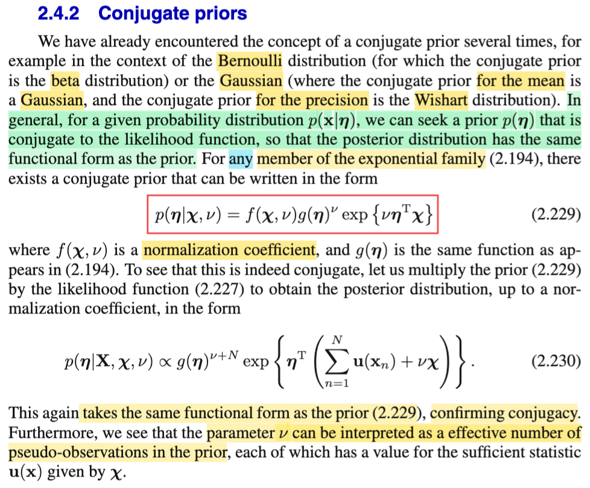</kbd>

> [!NOTE]
> Gs nói đại khái là mình đã quen với khái niệm prior distribution rồi. Ôn nhanh: Nói về prior distribution / posterior distribution thì thường là sẽ đang đi qua trường phái Bayesian khi coi tham số θ (ở đây là **η**) là random variable (vector), để rồi từ việc chọn một prior distribution cho nó (thường sách toán Casellla kí hiệu π(θ) ta sẽ dùng Bayes theorem để xây dựng posterior distribution π(θ|**x**) = f(**x**|θ)π(θ)/f(**x**). Thế thì khi prior được chọn là một distribution thuộc loại conjugate prior với distribution của sample f(x|θ) thì khi đó, posterior sẽ cho ra kết quả là cùng một loại với prior distribution, tạo ra nhiều thuận lợi trong tính toán và diễn giải.
>
>
>
> Vậy thì vài ví dụ đã gặp, như khi f(x|θ) là Bernuoilly, thì conjugate prior của population mean θ chính là beta distribution. Còn khi f(x|μ, σ^2) là pdf của normal μ, σ^2, thì conjugate prior của μ cũng là Normal, và conjugate prior của precision (1/σ^2) là Wishart distribution.
>
>
>
> Vậy thì ở đây ta bàn về conjugate prior (cho **η**) họ exponential family, gs cho biết nó là distribution có dạng như sau:
>
>
>
> f(**η**|**χ**, ν) = f(**χ**, ν)g(**η**)^ν exp{ν**η**T**χ**}
>
>
>
> Để chứng minh, chỉ việc derive posterior và chỉ ra nó cũng có dạng này.
>
>
>
> Còn nhớ pdf của exponential family:
>
>
>
> f(**x**|**η**) = h(**x**)g(**η**)exp{**η**T**u**(**x**)}
>
>
>
> ⇨ Joint pdf của mọi data point f(**x**1,..,**x**N|**η**), như đã biết do tính iid, tách thành tích các marginal pdf:
>
> f(**x**1,..,**x**N|**η**) = Πi=1:N h(**x**i)g(**η**)exp{**η**T**u**(**x**i)}
>
>
>
> Posterior distribution của **η**: 
>
>
>
> f(**η**|**x**1,...**x**N,**χ**, ν) (trong sách là p(**η**|**X**,**χ**, ν)) = f(**x**1,...**,x**N|**η**) × f(**η**|**χ**, ν) / f(**x**1,...**,x**N)
>
>
>
> Như thường lệ, ta sẽ dùng kí hiệu proportional để chỉ quan tâm đến những term chứa **η**, phần constant sẽ tham gia vào normalizing cosntant:
>
>
>
> f(**η**|**x**1,...**x**N,**χ**, ν) ∝ f(**x**1,...**,x**N|**η**) × f(**η**|**χ**, ν)
>
>
>
> = Πi=1:N \[ h(**x**i)g(**η**)exp{**η**T**u**(**x**i)} \] × f(**χ**, ν)g(**η**)^ν exp{ν**η**T**χ**}
>
>
>
> = \[Πi=1:N h(**x**i)\] × g(**η**)^N × exp{**η**T\[∑i **u**(**x**i)\]} × f(**χ**, ν) × g(**η**)^ν × exp{ν**η**T**χ**}
>
>
>
> = \[Πi=1:N h(**x**i)\] × f(**χ**, ν) × g(**η**)^N × g(**η**)^ν × exp{**η**T\[∑i **u**(**x**i)\]} × exp{ν**η**T**χ**}
>
>
>
> ∝ g(**η**)^(N+ν) × exp{**η**T\[∑i **u**(**x**i)\] + ν**η**T**χ**}
>
>
>
> ∝ g(**η**)^(N+ν) × exp{**η**T\[∑i **u**(**x**i) + ν**χ**\]}
>
>
>
> Tới đây, có thể thấy posteriori có dạng của priori với param là ∑i **u**(**x**i) + ν**χ** (so với ν**χ** của priori) và N+ν (so với ν của priori).

> [!TIP]
> **🤖 AI Feedback** — ✅ Score: **97/100**
>
> Ghi chú của bạn rất chính xác và có chiều sâu, đặc biệt là phần chứng minh chi tiết dạng của phân phối hậu nghiệm cho họ hàm mũ. Để hoàn thiện hơn, bạn có thể bổ sung thêm ý nghĩa của tham số "ν" như là số lượng quan sát giả định hiệu quả từ prior.

 

## 2.4.3 Non-informative priors

<kbd></kbd>

> [!NOTE]
> Đoạn này đại ý là, trong một số bài toán suy luận (probabilistic inference), đại khái là nhiều lúc người ta có một số ý niệm, kinh nghiệm nào đó về prior distribution, ví dụ như, ta biết chắc rằng giá trị của tham số (với tư cách là biến ngẫu nhiên) sẽ không thể có một số giá trị nào đó được (xác suất bằng 0). Khi đó, lẽ dĩ nhiên posterior distribution cũng phải nên phản ánh kinh nghiệm này, dù cho giá trị quan sát được của data có là gì đi nữa.
>
>
>
> Nhưng cũng có trường hợp khác, khi đó ta không có chút kinh nghiệm nào về prior distribution, lúc này, để đảm bảo tính công bằng, tránh đưa vào những lệch lạc, những thiên kiến nào đó, ta sẽ muốn chọn prior sao cho CHỨA ÍT ẢNH HƯỞNG ĐẾN POSTERIOR NHẤT CÓ THỂ. Khi đó ta sẽ tìm kiếm một distribution gọi là NON-INFORMATIVE PRIOR, cách tiếp cận này đôi khi được gọi là "hãy để dữ liệu tự lên tiếng" (mình hiểu, đồng nghĩa, posteror sẽ chịu ảnh hưởng hầu hết từ data)

> [!TIP]
> **🤖 AI Feedback** — ✅ Score: **98/100**
>
> Phần giải thích của bạn cực kỳ chính xác và sâu sắc, nắm bắt đầy đủ các sắc thái của khái niệm. Cách diễn giải cụm từ "hãy để dữ liệu tự lên tiếng" rất đúng trọng tâm.

 

### Improper Prior Distributions

<kbd></kbd>

> [!NOTE]
> Thế thì với loại non-informative prior, đại khái là gs cho rằng ta sẽ có thể bị cám dỗ bởi việc chọn một hằng số (để xác suất ở đâu cũng bằng nhau, thể hiện tính chất "non-informative"), tức là f(λ) = constant (λ là population param, chi phối distribution của data f(x|λ)).
>
>
>
> Ví dụ như nếu λ là biến rời rạc (discrete) có K possible values (states) thì ta sẽ cho priori là f(λ) = 1/K với mọi possible value của λ.
>
>
>
> Tuy nhiên, gs cho biết, đối với λ là continous rv, thì cách làm này, có thể có phát sinh những vấn đề tiềm năng.
>
>
>
> Vấn đề đầu tiên là nếu như range (tập xác định) của λ là unbounded (tức là nó có thể trải dài từ -inf, tới +inf với trường hợp λ đơn biến), thì khi đó, việc cho pdf = constant sẽ không thể được. Vì lúc này nó sẽ không thể normalized. Mình hiểu ý này như sau: còn nhớ theo định nghĩa của pdf/pmf, thì để một function trở thành valid, thì tổng / tích phân trên toàn miền của nó phải bằng 1, và giá trị hàm pdf/pmf luôn không âm. Vậy thì giả sử ta có hàm f(λ) = constant c, với range của λ từ -inf tới inf, thì ∫-inf:inf c dλ = c ∫-inf:inf dλ = c × ∞ = ∞, gọi là tích phân bị diverge, và không thể nào bằng 1 được, nên không thể xây dựng một valid pdf được.
>
>
>
> Và cái prior distribution này được gọi là IMPROPER (tạm hiểu là, không hợp lệ, phù hợp)
>
>
>
> Tuy vậy, trong thực tế, gs nói vẫn có thể dùng improper prior nếu posterior là proper distribution (tức là dù priori improper, nhưng nếu posterior pdf/pmf vẫn có thể thỏa yêu cầu valid). Lấy ví dụ khi ta dùng uniform (cái này mình hiểu là hàm uniform (-inf, inf), tức f(λ) = constant với mọi λ từ -inf tới inf, như đã nói, đây không phải một phân phối xác suất hợp lệ. trong Stat110, mình chỉ được học uniform(a,b) chứ không cho phép có uniform(-inf, inf)) để làm priori cho mean của Normal (sample X \~ Normal(μ, σ^2)), thì posterior sẽ vẫn là một valid pdf (proper)

> [!TIP]
> **🤖 AI Feedback** — ✅ Score: **98/100**
>
> Điểm mạnh: Bạn đã nắm bắt chính xác tất cả các điểm chính từ văn bản, với giải thích toán học sâu sắc về lý do một phân phối tiên nghiệm hằng số trên miền không bị chặn lại không thể chuẩn hóa được. Để tăng cường hơn nữa, bạn có thể thêm ví dụ cụ thể về việc sử dụng improper prior được đề cập trong văn bản.

 

#### Probability Density Transformation

<kbd></kbd>

> [!NOTE]
> Rắc rối thứ hai đại ý là như sau:
>
>
>
> Như ta đã nói, giả sử ta muốn chọn một hàm constant làm prior để thể hiện tính non-informative, và ta muốn nó ít ảnh hưởng tới posterior nhất có thể. Nhưng thực tế, lấy ví dụ ta chọn prior f(λ) (hay π(λ), theo cách viết quen thuộc của sách Casella về prior/posterior) = constant c. Rồi, trong quá trình tính toán, giả sử ta đổi biến (change of variable) với λ = η^2 chẳng hạn. Thì pdf của η sẽ không còn là constant nữa:
>
>
>
> Ôn nhanh kiến thức change of variable: Stat110 đã học, khi ta có X với pdf fX(x) và Y = g(X), với g là invertible function, tức y = g(x) thì x = ginv(y). Khi đó, pdf của Y sẽ được tính như sau: fY(y) = fX(x) |dx/dy| ⇔ fY(y) = fX(ginv(y)) |d/dy ginv(y)|.
>
>
>
> Vậy thì ở đây ta có λ (như vai trò X), η như vai trò Y, hàm ginv(y) = η^2.
>
>
>
> λ có pdf f(λ), và λ = η^2
>
>
>
> fη(η) = fλ(λ) |d/dη η^2|
>
>
>
> = fλ(λ) |2η|
>
>
>
> = 2 fλ(λ) η
>
>
>
> = 2c × η (fλ(λ) = c)
>
>
>
> Và dễ thấy fη(η) là hàm tuyến tính, không còn là constant nữa.
>
>
>
> Thế thì, đại khái là, vì cái này, nên nếu ta chọn constant function là prior thì khi đổi biến phải tính đến chuyện này.
>
>
>
> Còn nếu chỉ làm theo Maximum Likelihood thì không sao.
>
>
>
> Nói rõ thêm ý này: Ta nhớ, với MLE thì cơ bản ta chỉ giải bài toán tối ưu: maximize over λ hàm likelihood L(λ|data). Thế thì, chỉ đơn giản là vì, với MLE, TA ĐÂU CÓ NÓI VỀ PRIOR DISTRIBUTION GÌ ĐÂU mà bị ảnh hưởng hay không. Bản chất của MLE, ta còn nhớ, nó là trường phái cổ điển (frequentist), coi parameter là giá trị cố định nhưng chưa biết (fixed & uknown), và đi tìm một hàm số, một statistic W(sample **X**) để khi ráp vào observed value của data, W(**x**) sẽ estimate giá trị của nó, và MLE là một cách làm cụ thể, khi ta chọn dùng hàm W(x) = argmax\_λ L(λ|sample **x**). Và trong cách làm này, nếu có đổi biến, thì cũng chả sao, vì bản chất likelihood, như đã nói, chỉ là một hàm số theo λ, KHÔNG PHẢI LÀ HÀM PDF, nên có đổi biến thì cũng chả ảnh hưởng gì (đây là lí mr Bishop nói rằng nếu h(λ) là constant thì h^(η) = h(η^2) (h^(η) ý là, khi thay λ = η^2 vào h(λ) và coi nó  như hàm của η, thì ta có hàm khác - h^(η)) vẫn là constant. 
>
>
>
> CHỈ KHI TA CHUYỂN QUA TRƯỜNG PHÁI BAYESIAN, bằng cách coi λ LÀ RANDOM VARIABLE, THÌ MỚI NÓI VỀ DISTRIBUTION CỦA NÓ, để rồi phải nói về / chọn prior distribution và dùng bayes theorem để xây dựng posterior.
>
>
>
> Tóm lại, ý của gs chỉ đơn giản là, cái vụ constant function prior này chỉ gây rắc rối tiềm ẩn nếu ta làm theo Bayesian, còn làm theo MLE thì không đơn giản vì MLE chẳng coi λ là random variables, nên ko bàn đến prior distribution gì hết.

> [!TIP]
> **🤖 AI Feedback** — ✅ Score: **98/100**
>
> Bài giải thích rất chi tiết và sâu sắc, đặc biệt là phần làm rõ sự khác biệt giữa MLE và phương pháp Bayesian trong việc xử lý các tham số và prior distribution, giúp làm sáng tỏ lý do tại sao vấn đề này không ảnh hưởng đến MLE. Công thức đạo hàm của bạn nhìn chung chính xác, mặc dù việc thay thế λ bằng η² trong fλ(λ) sẽ giúp nó rõ ràng hơn một chút trong các bước trung gian.

 

##### Noninformative Priors: Translation Invariance

<kbd></kbd>

> [!NOTE]
> Gs giới thiệu hai ví dụ về non-informative prior. Đầu tiên là distribution có dạng f(x|μ) = g(x - μ)
>
> (mình dùng f từ đầu tương đương với p của gs, nên chỗ này gs xài f cho hàm f(x-μ), thì mình phải dùng chữ g, vì f(x|μ) ám chỉ làm pdf của X, còn g(x - μ) ám chỉ một hàm g cụ thể nào đó là hàm phụ thuộc term (x - μ), ví dụ pdf của X \~ normal(μ, σ^2) là f(x|μ, σ^2) = 1/√(2πσ^2) exp{-(x-μ)^2/2σ^2}, và nó là hàm g(x - μ) với g(u) = 1/√(2πσ^2) exp{-u^2/2σ^2}.
>
>
>
> Thế thì, μ ở đây gọi là location parameter, và họ các pdf này có tính chất translation invariance (tạm hiểu là bất biến theo vị trí, tức là dạng của chúng không bị thay đổi, ảnh hưởng bởi vị trí).
>
>
>
> Trong Casella, mình nhớ ra cái này chính là định nghĩa của location family: mọi pdf f(x|μ) = g(x - μ) với μ thay đổi sẽ tạo nên một họ (family) các distribution có chung dạng, nhưng khác location (μ). Và trong đó f(x|0) = f(x) chính là standard member của họ distribution, có location tại 0.
>
>
>
> Để cho thấy tính chất location invariant, giả sử ta có X \~ f(x|μ) = g(x - μ). đổi biến y = x + c, cũng là dời tọa độ một cách tịnh tiến. Thì để xem distribution của Y = X + c là gì. Theo transformation theorem:
>
>
>
> fY(y) = fX(x) |dx/dy| = g(x - μ) |d/dy (y-c)| = g(x - μ) × 1 = g(x - μ) = g(y - c - μ) = f(y|μ+c).
>
>
>
> Như vậy, pdf của Y có cùng dạng với X (đều là f), chỉ khác location là μ + c thay vì μ.

> [!TIP]
> **🤖 AI Feedback** — ✅ Score: **98/100**
>
> Ghi chú của bạn rất chính xác và cực kỳ sâu sắc, không chỉ nắm bắt đúng các khái niệm mà còn mở rộng bằng chứng minh toán học và kiến thức nền tảng vững chắc. Sự cẩn thận trong giải thích ký hiệu và liên hệ với Casella là điểm cộng lớn, cho thấy hiểu biết vượt trội về chủ đề.

 

- **Density and Translation Invariance**

<kbd></kbd>

<kbd></kbd>

> [!NOTE]
> Đại khái lập luận là như sau: Ta đã biết và nhắc lại hồi nãy, nói về prior là nói về Bayesian inference. Ta coi μ là random variable, rồi chọn prior distribution của μ, kí hiệu π(μ) và dùng Bayes theorem để derive π(μ|**x**) = f(**x**|μ) π(μ) / f(**x**), cũng là ∝ f(**x**|μ) π(μ).
>
>
>
> Thế thì, ở đây ta đang xét trường hợp mà density (tức đang nói đến f(**x**|μ) là một location family. Thì vì nó là một pdf thuộc location family (nên có dạng g(x - μ)) nên **khi μ thay đổi, dạng của distribution không đổi, chỉ đổi location**. 
>
>
>
> Thế thì, cái chính là **nếu như ta muốn prior distribution phản ánh được tính non-informative**, tức là thể hiện "**ta ban đầu không biết gì hết về μ**" **THÌ PRIOR DISTRIBUTION PHẢI CÓ TÍNH CHẤT: KHI TA THAY ĐỔI μ, THÌ π(μ) PHẢI KHÔNG ĐỔI**. **VÌ SAO?** **Vì nếu thay đổi μ khiến π(μ) thay đổi, thì sẽ dẫn đến hệ quả là khi nó nhân với f(x|μ) - vốn không bị ảnh hưởng hình dạng bởi μ, thì sẽ khiến posterior bị phụ thuộc vào prior → prior không còn non-informative**
>
>
>
> Lấy ví dụ nôm na có hai thứ đóng góp vào posterior: prior và likelihood. mà thằng likelihood thì không bị ảnh hưởng bởi μ, nên nếu prior có giá trị khác nhau tại μ khác nhau, thì posterior sẽ bị ảnh hưởng bởi prior, có nghĩa là prior không còn non-informative để phản ánh sự không biết gì ban đầu.
>
>
>
> Cái 2.234 và 2.235 chỉ là lập luận để chỉ ra prior π(μ), nếu muốn có tính location invariant thì phải là constant function, nhưng về trực giác thì ta hiểu là như trên.
>
>
>
> Gs cho biết một ví dụ đó là ta chọn prior distribution của Normal mean (như đã biết từ Casella, normal là một loại location scale family, cũng có nghĩa là fixed σ^2 thì normal là một location family), thì prior conjugate, như đã biết của normal mean, là normal). Vậy để thể hiện non-informative, ta cho cái normal này có variance lớn vô cực → cái chuông bẹp dí và rộng vô cực, → coi như hàm hằng.

> [!TIP]
> **🤖 AI Feedback** — ✅ Score: **95/100**
>
> Ghi chú trình bày rất tốt lập luận trực giác về lý do prior không thông tin cho tham số vị trí nên là hàm hằng. Cần làm rõ hơn về việc likelihood bị ảnh hưởng như thế nào bởi μ để tránh hiểu lầm.

 

- **Scale Invariance and Prior Distributions**

<kbd></kbd>

> [!NOTE]
> Trường hợp thứ hai, khi density có dạng f(x|σ) = (1/σ)g(x/σ), như trong Casella đã biết, đây là định nghĩa của một scale family: khi σ (scale parameter) thay đổi ta sẽ có các distribution có chung dạng, chỉ khác scale (gọi là scale invariance) với standard member là f(x|1) = g(x) (scale parameter = 1).
>
>
>
> Vậy thì tương tự như lập luận hồi nãy về việc khi density có thuộc location family, có tính location invariance (thay đổi μ thì dạng pdf giữ nguyên) kéo theo để có non-informative prior, thì prior cũng phải location invariance, mà như vậy có nghĩa là khi thay đổi μ thì π(μ) không đổi → nên π(μ) là hàm hằng). Thì ở đây, để prior π(σ) là non-informative, thì nó cũng phải scale invariance: Thay đổi σ khiến scale không đổi.
>
>
>
> Vậy thì với trường hợp location invariance, ta dễ suy ra ngay π(μ) là constant. Nhưng lập luận bài bản thì sẽ là: Xác suất μ ∈ (A, B) phải bằng xác suất μ ∈ (A - c, B - c):
>
>
>
> P(μ ∈ (A,B)) = P(μ ∈ (A - c, B - c))
>
>
>
> ⇔ ∫A:B π(μ) dμ = ∫A-c:B-c π(μ) dμ
>
>
>
> Vế phải: đổi biến ε = μ + c ⇨ dε = dμ, cận tích phân thành từ A tới B → ∫A-c:B-c π(μ) dμ = ∫A:B π(ε + c) dε
>
>
>
> ... ⇔ ∫A:B π(μ) dμ = ∫A:B π(ε + c) dε
>
>
>
> Đổi tên biến tích phân về lại μ
>
>
>
> ..⇔ ⇔ ∫A:B π(μ) dμ = ∫A:B π(μ + c) dμ
>
>
>
> ⇔ π(μ) = π(μ - c)
>
>
>
> ⇨ π(μ) = constant
>
>
>
> Còn ở đây, để thể hiện tính scale invariance:
>
>
>
> bởi P(σ ∈ (A,B)) = P(σ ∈ (A/c,B/c))
>
>
>
> ⇔ ∫A:B π(σ) dσ = ∫A/c:B/c π(σ) dσ
>
>
>
> Xét vế phải ∫A/c:B/c π(σ) dσ: Đổi biến ε = c × σ ⇨ cận tích phân từ A → B, dε = c dσ ⇔ dσ = dε / c
>
>
>
> ⇨ ∫A/c:B/c π(σ) dσ = ∫A:B π(ε/c) dε (1/c) = (1/c) ∫A:B π(ε/c) dε.
>
>
>
> Đổi lại tên biến thành σ ta có vế phải là (1/c) ∫A:B π(σ/c) dσ.
>
>
>
> Vậy đẳng thức điều kiện trở thành:
>
>
>
> ∫A:B π(σ) dσ = (1/c) ∫A:B π(σ/c) dσ.
>
>
>
> ⇨ π(σ) = (1/c) π(σ/c)
>
>
>
> c ở đây là hằng số bất kì, có nghĩa là để scale invariance, prior π(σ) phải có tính chất thỏa đẳng thức trên với mọi c, do đó ta có quyền chọn c.
>
>
>
> Chọn c = σ ⇨ π(σ) = (1/σ) π(1) = constant × (1/σ). Vậy nên điều kiện để prior có scale invariance là nó có dạng tỉ lệ thuận với 1/σ.
>
>
>
> ---
>
>
>
> Tiếp, với σ \~ π(σ) = constant × (1/σ) thì thử tính pdf của ω = ln (σ) ⇔ σ = e^ω.
>
>
>
> Dùng change of variable theorem:
>
>
>
> fω(ω) = fσ(σ) |dσ/dω| = π(σ) |d/dω e^ω|
>
>
>
> = constant × (1/σ) e^ω
>
>
>
> = constant × (1/σ) e^\[ln (σ)\]
>
>
>
> = constant × (1/σ) × σ
>
>
>
> = constant
>
>
>
> Như vậy, đại ý là, yêu cầu để prior distribution π(σ) có tính scale invariance tương đương với việc yêu cầu chọn prior distribution của ln(σ) phải là constant funciton (giống như prior của location param π(μ)) hồi nãy.

 

- **Noninformative Prior for Precision**

<kbd></kbd>

> [!NOTE]
> Rồi, một ví dụ của scale param như đã biết, là standard deviation của Normal.
>
>
>
> pdf của normal(μ, σ^2)
>
>
>
> N(x|μ, σ^2) = (1/σ√2π) exp(-(x-μ)^2/2σ^2)
>
>
>
> ∝ (1/σ) exp(-(x-μ)^2/2σ^2) (bỏ đi constant dương 1/√2π)
>
>
>
> ∝ (1/σ) exp(-(x-μ)^2/σ^2) (bỏ đi constant 1/2 trong hàm mũ, vì nó là hàm monotone increasing)
>
>
>
> = (1/σ) exp(-(x^/σ)^2) (đặt x^ = x - μ)
>
>
>
> Rồi, thế thì trong mấy phần trước mình cũng đã thấy gs nói làm việc với precision thì thuận lợi hơn variance (tức thay vì giải bài toán inference σ^2, ta sẽ giải bài toán inference 1/σ^2, gọi là precision, kí hiệu λ.
>
>
>
> Thế thì thử xem distribution của λ là gì theo prior distribution của σ, tức π(σ):
>
>
>
> λ = 1/σ^2 ⇔ σ^2 = 1/λ ⇔ 2σ dσ = -1/λ^2 dλ ⇔ dσ/ dλ = -1/2σλ^2
>
>
>
> dùng change of variable theorem tiếp:
>
>
>
> fλ(λ) = fσ(σ) |dσ/dλ| = π(σ) |-1/(2σλ^2)| = π(σ) 1/(2σλ^2)
>
>
>
> Với việc π(σ) = constant × (1/σ) để thỏa scale invariance nói trên
>
>
>
> ⇨ fλ(λ) = constant × (1/σ) × 1/(2σλ^2)
>
>
>
> = constant × (1/σ^2) × 1/(2λ^2)
>
>
>
> = constant × λ × 1/(2λ^2)
>
>
>
> = constant × 1/2λ
>
>
>
> và cái này ∝ 1/λ.
>
>
>
> Như vậy có nghĩa là, để prior distribution của σ scale invariance (π(σ) ∝ 1/σ) thì prior distribution của precision cũng phải ∝ 1/λ.
>
>
>
> ---
>
>
>
> Cuối cùng, bữa trước ta đã thấy conjugate prior của Normal precision là phân phối Gamma(λ| a0,b0). Nên để có tính chất non-informative, ta sẽ cho hai tham số a0, b0 = 0.

> [!TIP]
> **🤖 AI Feedback** — ✅ Score: **90/100**
>
> Bài làm đã thể hiện sự hiểu biết sâu sắc khi tự mình chứng minh được phân phối của độ chính xác λ tương ứng với p(λ) ∝ 1/λ, đây là một điểm mạnh lớn. Tuy nhiên, để hoàn thiện hơn, em nên bổ sung giải thích tại sao a₀ = b₀ = 0 lại khiến phân phối hậu nghiệm chỉ phụ thuộc vào dữ liệu mà không phụ thuộc vào tiền nghiệm, và chú ý hơn trong các bước biến đổi toán học ban đầu để tránh những nhầm lẫn nhỏ.

 

## 2.5 Non-parametric model

 

### Nonparametric Methods

<kbd></kbd>

> [!NOTE]
> Phần này, đại khái là bữa giờ gs cho biết ta chỉ toàn làm việc với những phân phối xác suất có dạng của một hàm số mà hành vi của nó bị chi phối bởi một số ít các tham số (paramter), và ta sẽ đi xác định giá trị của chúng nhờ data. (bài toán inference). Thì cách làm này được gọi là parametric approach - cách tiếp cận tham số đối với bài toán mô hình hóa mật độ xác suất.
>
>
>
> Tuy nhiên, nhược điểm của cách tiếp cận này đại khái là nó gặp rủi ro rằng ta giả định sai, và chọn nhầm một mô hình. Ví dụ như quy luật thật sự sinh ra dữ liệu đến từ một phân phối xác suất thuộc dạng multi modal, trong khi ta chọn một mô hình xác suất thuộc loại uni modal (như Normal), thì sẽ không thể nào nắm bắt (capture) được quy luật sinh dữ liệu.
>
>
>
>  Phần này mình sẽ bàn đến cách tiếp cận thứ hai: non-parametric approach, trong đó ta sẽ giả định ít hơn về dạng của distribution. Và ông nói ta sẽ chủ yếu là bàn về những phương pháp thuộc trường phái cổ điển (frequentist) nhưng lưu ý ta rằng các phương pháp thuộc trường phái Bayesian đang phát triển mạnh mẽ.

 

#### Histogram Density Estimation

<kbd></kbd>

> [!NOTE]
> Ở đây ta sẽ thảo luận sâu hơn về cái gọi là phương pháp histogram đối với bài toán density estimation.
>
>
>
> Phương pháp này đại ý là như sau: giả sử ta muốn estimate density (hàm mật độ xác suất - pdf) của một continous random variable X, ta sẽ làm như sau: Chia trục x thành các khoảng nhỏ i gọi có bề rộng Δi, và thường cho bề rộng bằng nhau hết = Δ. Sau đó, đặt pi = ni / NΔi với ni là số sample quan sát được của random variable X rơi vào cái bins thứ i này. Và N là tổng số sample.
>
>
>
> Như vậy có nghĩa là ta đã ĐỊNH NGHĨA RA MỘT HÀM PDF CÓ DẠNG STEP-FUNCTION,
>
> với giá trị của nó tại khoảng bin thứ i là f(x) = pi = n/NΔi.
>
>
>
> Thế thì thử xem vì sao ∫f(x)dx = 1:
>
>
>
> Xét tích phân ∫f(x)dx, ta biết bản chất của tích phân này là diện tích dưới đồ thị hàm pdf f(x) từ -inf tới inf. Ở đây vì hàm f(x) có dạng step function như nói trên, nên ta sẽ chia nó thành tổng các phần diện tích con tương ứng với các bins, và theo cách định nghĩa của hàm pdf như trên, thì tại bin i, f(x) = pi = ni / NΔi nên diện tích phần này sẽ là pi × Δi
>
>
>
> .. = Σi {over các bins i} \[pi × Δi\]
>
>
>
> = Σi {over các bins i} \[(ni / NΔi) × Δi\]
>
>
>
> = Σi {over các bins i} \[(ni / N)\]
>
>
>
> = N/N = 1
>
>
>
> Cần chú ý, đây vẫn là pdf của một biến liên tục, tức X vẫn mang giá trị liên tục, nhưng chỉ là hàm pdf là một step function, mang các giá trị rời rạc.
>
>
>
>  (cái hàm này nói nôm na là nó sẽ quy định ví dụ như trong khoảng từ x=1 tới x=2, thì f(x) = 0.1, từ x=2 tới x=3 thì f(x)=0.2 ví dụ vậy)

 

##### Figure 2.24 Histogram Density Estimation

<kbd></kbd>

> [!NOTE]
> Rồi, thế thì gs cho minh họa, cho 50 sample (observed data) của X có population distribution là một Gaussan mixture từ hai Gaussian, mà pdf thật của nó là đường màu xanh lá.
>
>
>
> Và xây dựng hàm histogram pdf như vừa nói với các Δi = Δ có giá trị khác nhau từ nhỏ đến lớn.
>
>
>
> Thế thì nhận xét quan trọng như vầy:
>
>
>
> Nếu Δ nhỏ quá, cái hàm step function của histogram pdf nó quá spiky, ý là nhô lên nhô xuống nhiều, khiến cho kiểu như nó không phản ánh được quy luật thật sự của hàm pdf thật là chỉ có 2 cái đỉnh thôi. Nhìn vào dạng của histogram, mình cũng có thể thấy nó phản ánh 2 cái đỉnh, nhưng vì mỗi bậc nó nhấp nhô liên tục nên hai cái đỉnh cũng không được thể hiện rõ.
>
>
>
> Còn khi Δ lớn quá, thì histogram pdf lại kiểu như là lại qúa mượt cũng khiến cho nó làm lu mờ luôn, khiến cũng khó thấy hình dạng của hai cái đỉnh, đồng nghĩa là nó không nắm bắt được quy luật của hàm pdf thật.
>
>
>
> Chỉ khi Δ vừa phải, thì historgam pdf mới tạm gọi là phản ánh tốt được hình dạng của hàm pdf thật.
>
>
>
> Gs nói, ngoài ra thì histogram pdf cũng bị phụ thuộc vào lựa chọn vị trí cạnh của mỗi bins, nhưng cái này ảnh hưởng nhỏ hơn so với bề rộng Δ

> [!TIP]
> **🤖 AI Feedback** — ✅ Score: **98/100**
>
> Phân tích của bạn cực kỳ chính xác và sâu sắc, nắm bắt tốt các điểm cốt lõi về ảnh hưởng của bề rộng bin (Δ) đến ước lượng mật độ histogram, từ trường hợp quá spiky đến quá mượt, cũng như giá trị tối ưu và yếu tố vị trí cạnh bin. Để bài phân tích thêm hoàn hảo, bạn có thể cân nhắc việc trực tiếp đề cập đến thuật ngữ 'tính chất hai đỉnh' (bimodal property) khi mô tả sự thất bại của histogram trong việc nắm bắt hình dạng hàm PDF thật khi Δ quá lớn.

 

- **Histogram and Curse of Dimensionality**

<kbd></kbd>

> [!NOTE]
> Đại khái là, phương pháp xây dựng density từ histogram này có vài ưu điểm: Điển hình là một khi đã tính xong histogram, thì có thể vứt data đi, khỏi phải lưu trữ, cũng như cách làm này cho phép cái kiểu có dạng có được data theo cách tuần tự (data mới đến sẽ giúp update histogram).
>
>
>
> Trong thực tế, cách làm này cũng có ưu điểm giúp phác họa nhanh dữ liệu, tuy nhiên chỉ khả thi khi ở bài toán có data 1D hoặc 2D thôi.
>
>
>
> Một vấn đề dễ thấy nữa, đó là histogram density có những khoảng không liên tục mà chủ yếu là do vị trí của cạnh của các bins chứ không liên quan gì đến density thật (hàm ý rằng, việc dùng histogram density sẽ khiến tạo ra những pattern hoàn toàn không liên quan gì đến data)
>
>
>
> Và cuối cùng là một vấn đề đã gặp: lời nguyền của dimensinality: Đại ý là, giả sử ta có M bins, thì số lượng data point cần có để lấp đầy chúng (để mỗi bin đều có ít nhất 1 data point) sẽ là M^D, nên trong bài toán thực tế với data là vector có D lớn (high dimension) thì số data cần thiết là không tưởng, khiến cho đại khái là, cái histogram pdf sẽ giống như không đủ data để mà vẽ vậy (tưởng tượng muốn vẽ histogram pdf lúc nãy nhưng chỉ có 1, 2 data point, thì ko thể hình thành một hàm histogram pdf tốt được).

> [!TIP]
> **🤖 AI Feedback** — ✅ Score: **97/100**
>
> Ghi chú của bạn rất chính xác và có chiều sâu, đặc biệt trong việc giải thích "lời nguyền của chiều dữ liệu" một cách dễ hiểu. Để hoàn thiện hơn, bạn có thể cân nhắc sử dụng ngôn ngữ học thuật hơn một chút trong các phần giải thích ban đầu.

 

- **Bài học về bề rộng bin histogram**

<kbd></kbd>

> [!NOTE]
> Cách tiếp cận histogram có cả nhược điểm và ưu điểm. Giáo sư cho rằng việc thảo luận về nó giúp chúng ta nhận ra hai bài học quan trọng. Bài học thứ nhất là để ước lượng hàm mật độ xác suất tại một vị trí cụ thể, chúng ta nên xem xét các điểm dữ liệu nằm trong phạm vi lân cận với điểm cần xem xét. Giáo sư lưu ý rằng để thảo luận về vấn đề này, cần có một thước đo, vì yếu tố lân cận phải dựa trên một tiêu chí đo lường cụ thể. Trong ngữ cảnh này, chúng ta đang sử dụng giả định về thước đo khoảng cách Euclidean. 
>
>
>
> Một ý khác là với hàm mật độ xác suất (PDF) của histogram, tính chất lân cận được định nghĩa bởi cách chia các khoảng bin. Do đó, cách định nghĩa này hàm chứa một tham số quy định mức độ cũng như hành vi mở rộng khoảng lân cận một cách tự nhiên. Tham số này chính là bề rộng của khoảng chia, và nó quy định mức độ gần xa. 
>
>
>
> Bài học thứ hai là khi bề rộng delta quá lớn hoặc quá nhỏ, hàm PDF của histogram đều không thể nắm bắt tốt các quy luật thực sự của dữ liệu. Vì vậy, giá trị của smoothing parameter, mà trong histogram điển hình là bề rộng khoảng chia, không nên quá lớn cũng không quá nhỏ. Điều này liên hệ đến ví dụ trong bài toán khớp hàm đa thức ở Chương một. Khi tăng độ phức tạp của mô hình (bậc của đa thức) quá lớn hoặc quá nhỏ, hoặc sử dụng giá trị regularization parameter không phù hợp, kết quả khớp hàm của bài toán đó cũng không đạt hiệu quả tốt. Có sự tương đồng giữa hai vấn đề này, khiến chúng ta liên tưởng đến bài toán trước đó. 
>
>
>
> Với hai bài học này, chúng ta sẽ xem xét hai mô hình nổi tiếng nhất của cách tiếp cận không tham số: kernel estimator và nearest neighbor.

> [!TIP]
> **🤖 AI Feedback** — ✅ Score: **95/100**
>
> Bản tóm tắt rất chính xác và sâu sắc, nắm bắt đầy đủ các bài học quan trọng và so sánh với khớp hàm đa thức một cách chi tiết. Để hoàn thiện hơn, bạn có thể cân nhắc giữ nguyên cách diễn đạt ở phần mở đầu và bổ sung chi tiết về lợi ích của các kỹ thuật phi tham số cuối cùng.

 

## 2.5.1 Kernel density estimators

 

### Kernel density estimators

<kbd></kbd>

> [!NOTE]
> Ta qua phương pháp đầu tiên - Kernel density estimator. 
>
>
>
> Đầu tiên gs cho rằng ta có một distribution có pdf f(**x**) nào đó có dimension. (Ý này nói theo ngôn ngữ thống kê chỉ là: xét một random variable vector **X** = (X1,...XD) có pdf là f(**x**). Và ta lấy mẫu (sampling) từ nó, với mong muốn là estimate hàm pdf này.
>
>
>
> Rồi, đại khái gọi **x** là một điểm nào đó, và gọi vùng nhỏ lân cận **x** là **R**.  Còn nhớ theo định nghĩa của hàm pdf đã học trong Casella hay Stat110, pdf của biến ngẫu nhiên liên tục X, kí hiệu fX(x) là hàm được định nghĩa là P(X ∈ A) = ∫A fX(x)dx. Nên tương tự, với f(**x**) là pdf của **X**, thì P(**X** ∈ R) = ∫R f(**x**) d**x**. Và ở đây gs đặt gía trị này là P.  (tóm lại 2.242 chỉ là từ định nghĩa của hàm pdf, không có gì cao siêu)
>
>
>
> Tiếp theo, gs cho biết ta thu thập được N giá trị quan sát từ phân phối f(**x**) này. 
>
>
>
> Chỗ này, nếu nói theo ngôn ngữ Casella, thì ta có một **random sample** size N, iid **X1**, **X2**,...**XN** đều \~ f(**x**) (dĩ nhiên phải hiểu, **X1**, viết đậm, là random variable vector trong sample, bản thân nó là vector có D phần tử **X1** = (X11, X12,..X1D).
>
>
>
> Ôn nhanh định nghĩa của random sample size n: Đó là ta có một đại lượng có tính không chắc chắn nào đó, và ta sẽ tiến hành quan sát giá trị của nó n lần, sao cho mỗi lần là độc lập nhau. Vì mỗi lần quan sát, do tính không chắc chắn, nên giá trị quan sát được sẽ có thể có nhiều possible value, do đó giá trị quan sát sẽ được thể hiện bởi một random variable: X1, ...Xn. Vì thí nghiệm được tiến hành độc lập, nên các random variable này đều độc lập lẫn nhau (mutually independent), và vì cùng quan sát một đại lượng có tính không chắc, nên các random variable này đều có chung một population distribution (indentically distributed), viết tắt lạ iid.
>
>
>
>  Thế thì, **X1**, **X2**,... **XN**,cần hiểu rằng, là các random variable vector thuộc distribution f(**x**), nên: 
>
>
>
> P(**X1** ∈ R) = ∫R f(**x**) d**x**
>
>
>
> và đối với **X2**,..,**XN** cũng vậy
>
>
>
> Nên P(**X1** ∈ R) = P(**X2** ∈ R) = ..∫R f(**x**) d**x**, và giá trị này ta đã đặt là **P** ở trên.
>
>
>
> Thế thì tiếp theo, ta sẽ gọi K là số data point rơi vào vùng R. Thì vì **X1**,...**XN** như đã nói, là các random variable, nên chúng có nhiều possible value dẫn đến việc giá trị của chúng có thuộc vùng R không và dẫn đến giá trị của K sẽ có nhiều khả năng, do đó, **K là một random variable**, và người ta quan tâm đến distribution của K.
>
>
>
> Thế thì, các possible value của K, dễ thấy sẽ từ 0,1,2... đến N. K = 0 khi mọi random variable **Xi** đều không ∈ R và K = N khi mọi **X1**, ...**XN** đều ∈ R.
>
>
>
> Như vậy, nhớ lại Stat110, ta nhớ story của binomial(n,p), là ta có n Bern(p) trial iid, và ta quan tâm đến tổng số trial success. Khi đó, đại lượng này sẽ là một random variable thuộc phân phối binomial(n,p). Vậy thì ở đây, ta cũng có N Bern trial. Mỗi trial là check xem Xi có thuộc R hay không. Và vì **Xi** đều độc lập, nên ta cũng có các Bern trial độc lập. Hơn nữa, xác suất thành công của trial này đều là P, nên đây thỏa mãn story trên: Đó là ta có N iid Bern(P), nên tổng số data point rơi vào vùng R, tức là random variable K, sẽ là một random variable \~ Binomial(N, P).
>
>
>
> Và pmf của binomial thì biết rồi:
>
>
>
> P(K = k) = (N choose k) P^k (1-P)^(N - k)
>
>
>
> hay viết theo trong sách
>
>
>
> Bin(k|N,P) = (N choose k) P^k (1 - p)(N - k)
>
>
>
> Như vậy chỗ này có thể thấy mr Bishop viết sai công thức, phải là N - k chứ không thể nào là 1 - p)^(1 - k) được.
>
>
>
> Và nhận xét thêm việc ông tương chữ K (viết hoa) vô làm ta dễ rối. vì theo nguyên tắc K là random variable, thì giá trị của nó là k (viết thường), ông ghi luôn K viết hoa trong công thức khiến khó hiểu.

> [!TIP]
> **🤖 AI Feedback** — ✅ Score: **99/100**
>
> Ghi chú của bạn rất chính xác và chi tiết, đặc biệt xuất sắc khi bạn đã phát hiện ra lỗi đánh máy trong công thức 2.243 của văn bản gốc. Khả năng liên hệ kiến thức với các giáo trình thống kê khác và giải thích cặn kẽ các khái niệm cơ bản cho thấy sự hiểu biết sâu sắc của bạn.

 

#### Mean and Variance Approximation

<kbd></kbd>

> [!NOTE]
> Rồi, thế thì với X \~ binomial(n, p) ta đã chứng minh nhiều lần (trong Casella và Stat110): EX = np, Var(X) = np(1-p)
>
>
>
> Vậy ở đây, K \~ binomial(N, P) ⇨ E\[K\] = NP ⇨ E\[K\] / N = P. Vì 1/N chỉ là constant, ta dùng tính chất linearity của kì vọng (E\[cX\] = cEX) đưa nó vào trong: E\[K\] / N = P ⇔ **E\[K/N\] = P**
>
>
>
> Tương tự, Var\[K\] = NP(1-P)
>
>
>
> Dùng tính chất của Variance: Var(cX) = c^2 Var(X)
>
>
>
> ⇨ Var\[K\] = Var\[NK/N\] = N^2 Var\[K/N\]
>
>
>
> ⇨ Var\[K\] = NP(1-P) ⇔ N^2 Var\[K/N\] = NP(1-P)
>
>
>
> ⇔ **Var\[K/N\] = P(1-P)/N**
>
>
>
> Khi N lớn thì Var\[K/N\] = P(1-P)/N sẽ tiến về 0.
>
>
>
> Vậy ta hiểu thế này: K là random variabel \~ binomial(N, P) như đã nói. Thì K/N là kết quả của việc áp một hàm số (g(u) = u/N) lên K, nên nó cũng là random variable, distribution của nó là gì ta không cần biết, nhưng biết mean của distribution này là E\[K/N\] = P, và variance là P(1-P)/N, để rồi khi N → inf thì variance → 0. Thế thì ý nghĩa của variance ta nhớ, là đại lượng đo tính chất phân tán (dispersion) của một distribution, nên nếu variance → 0, thì cũng đồng nghĩa là distribution sẽ ít phân tán và tập trung quanh mean P, đây là ý gs nói nó "will be sharply peaked around mean"
>
>
>
> Thế thì như vậy K/N, là random variable. Theo lí mà nói, không thể có giá trị nào cụ thể, mà nó có nhiều possible value. Nếu tính trung bình, qua các possible value đó, với trọng số là pmf thì ta có kì vọng E\[K/N\]. Nhưng ở đây khi N lớn, ta đã nói, xác suất sẽ tập trung hết quanh mean P, tức là coi như K/N = P với xác suất P(K/N = P) = 1. Đây là ý nghĩa của việc ghi: K/N ≈ P hay K ≈ NP.
>
>
>
> Một điểm nữa, hãy để ý, nếu ta đặt Ij = là indicator random variable gắn với event **Xj** ∈ R, j = 1,...N. Khi đó bối cảnh bài toán ta sẽ random sample I1, I2, ...IN iid \~ Bern(P) Và K/N = (∑j Ij) / N chính là sample mean. Khi đó, nhớ lại Weak Law of Large Number theorem, nói rằng: với một số điều kiện, thì sample mean sẽ hội tụ phân phối về population mean. Vậy nên ở đây K/N = (∑j Ij) / N sẽ hội tụ về E\[Ij\] = P: K/N → P. Viết ở dạng toán học: lim N→∞ K/N = P, hay có thể ghi là tại limit khi N lớn, K/N ≈ P ⇔ K ≈ PN

> [!TIP]
> **🤖 AI Feedback** — ✅ Score: **98/100**
>
> Phân tích rất chi tiết và chính xác, không chỉ tái hiện các công thức mà còn giải thích sâu sắc ý nghĩa của chúng, đặc biệt là khi liên hệ với Định luật Số lớn Yếu. Cấu trúc trình bày có thể gọn gàng hơn một chút để dễ đọc hơn.

 

##### Density Estimate Formula

<kbd></kbd>

<kbd></kbd>

> [!NOTE]
> Thế thì tiếp theo, đại khái là nếu như ta giả định rằng vùng R nhỏ đến nỗi trong phạm vi đó f(**x**) có thể coi như là constant, thì khi đó P(**X** ∈ R) = ∫\_R f(**x**)d**x** = f(**x**) ∫\_R d**x** = f(**x**) × thể tích của vùng R = f(**x**) V.
>
>
>
> Kết hợp P ≈ f(**x**)V ⇔ f(**x**) = P/V và K ≈ PN ta có f(x) ≈ K/NV.
>
>
>
> Ông cũng lưu ý rằng kết quả này dựa trên hai assumption mâu thuẫn nhau:
>
>
>
> Giả định thứ nhất là cái vừa nói: là vùng R phải đủ nhỏ để pdf trong vùng đó là hằng số.
>
>
>
> Nhưng nhớ lại chút xíu bối cảnh bài toán: Là cho random sample size N tuân theo một distribution f(**x**) nào đó, và xét vùng R, với xác suất **X** ∈ R đặt là P, khi đó gọi K = Σj Ij là số data point ∈ R, Ij là indicator random variable ứng với event **X**j ∈ R, là một Bernouilly(P) random variable, thì story của K sẽ như số trial success trong N iid Bernouilly(P) trial, nên K sẽ \~ Binomial(N, P), và (Σj Ij)/N chính là sample mean I_bar_n (sample mean từ sample size N), theo luật số lớn yếu, chuỗi I_bar_n sẽ cMộtonverger về E\[Ij\] = P.
>
>
>
> Vậy thì nó liên quan gì đến việc vùng R phải đủ lớn?
>
>
>
> Hiểu thế này:
>
>
>
>  Một ý cốt lõi để WLLN work đó là Var(Xi) phải < ∞, thì Xbar_n mới hội tụ xác suất về E\[Xi\].
>
>
>
> Vậy thì ở đây, bức tranh lớn mà gs đang dẫn dắt ta là thực hiện cái gọi là ước lượng hàm density (density estimation). Nó khác với bài toán parameter inference, trong đó ta đã biết hay giả định biết rằng hàm pdf của distribution có dạng gì (f(x|θ), chỉ là không biết giá trị cụ thể của tham số θ. Còn ở đây, cái mà ta làm, thì lại chả cần quan tâm hoặc không cần biết hình dạng của nó có dạng gì, mà chỉ là ta đi xây một cái hàm số f(x) bằng cách kiểu như vẽ ra tại x bằng các giá trị khác nhau thì f(x) sẽ bằng bao nhiêu (trong cách tiếp cận này, ta không nói gì đến tham số, vì ta không cần tham số, ta chỉ cần biết một mapping x f(x) mà thôi)
>
>
>
> Thế thì để làm cái việc đó, về cơ bản là như đã nói, ta sẽ ước lượng hàm f(**x**) tại một điểm **x** bất kì. Và ý tưởng chủ đạo cho việc này, đó là:
>
>
>
> i) Xét một vùng R quanh lân cận điểm **x**.
>
>
>
> ii) Cho rằng R đủ nhỏ để trong đó f(**x**) là hằng số, thì P(**X** ∈ R), (đặt là P) = f(**x**) V.
>
>
>
> Rồi, lại dựa trên việc ta có N sample (observation) **X**1,...**X**N, thì với việc chúng iid nên khi quan tâm đến việc chúng có thuộc R hay không thì ta sẽ có bối cảnh là chuỗi N iid Bernouilly(P) trial nên K = Σj I\_(**X**j ∈ R) sẽ là một rv \~ Binomial(N, P).
>
>
>
> Đồng thời, nếu ta xét \[Σj I\_(**X**j ∈ R)\] / N, thì đây là sample mean size N của random sample size N Bern(P) I\_(X1 ∈ R), I\_(X2 ∈ R),..... viết gọn là I1, I2,...IN. Thì theo WLLN, nếu ta đảm bảo Var\[Ij\] < ∞, thì \[Σj I\_(**X**j ∈ R)\] / N sẽ hội tụ xác suất về E\[Ij\] = P.
>
>
>
> Và nếu vậy, thì ta sẽ có thể cho \[Σj I\_(**X**j ∈ R)\] / N xấp xỉ cho P, tương đương K/N xấp xỉ f(**x**) V, cũng là f(**x**) xấp xỉ K/NV. Và như vậy ta có được estimate của f(**x**) tại **x**. Làm tương tự với mọi **x** khác trên range **X**, thì ta sẽ có được estimatio của hàm density f(**x**).
>
>
>
> Vấn đề là có thể thấy ta đã dùng hai giả định: Một là f(**x**) phải là constant trong R, nên R phải đủ nhỏ. Và hai là, ta đã viện dẫn WLLN, để cho phép \[Σj I\_(**X**j ∈ R)\] / N xấp xỉ cho P.
>
>
>
> Nhưng để viện dẫn WLLN, thì phải thỏa điều kiện của WLLN: Var\[Ij\] < ∞.
>
>
>
> Để có thể dễ hiểu hơn ta sẽ nhìn theo góc độ khác: đó là xét các random variable Zj = Ij/V. Vì Ij iid thì Zj cũng iid.
>
>
>
> E\[Zj\] = E\[Ij/V\] = E\[Ij\]/V = P/V
>
>
>
> Var\[Zj\] = Var\[Ij/V\] = Var\[Ij\]/V^2
>
>
>
> Và sample mean size N là (Σj Zj)/N,
>
>
>
> nếu Var\[Zj\] < ∞ thì chuỗi sample mean, (Σj Zj)/N, theo WLLN cũng sẽ converge về E\[Zj\] = P/V, để rồi tại limit ta có: 
>
>
>
> (Σj Zj)/N = P/V ⇔ Σj Zj = NP/V 
>
>
>
> ⇔ Σj (Ij/V) = NP/V ⇔ Σj (Ij) = NP 
>
>
>
> ⇔ P = (Σj Ij) / N 
>
>
>
> ⇔ f(**x**) = (Σj Ij) / NV = K / NV 
>
>
>
> Hay xét với N lớn thì ta có xấp xỉ: f(**x**) ≈ K / NV  như kết quả trên.
>
>
>
> Vấn đề là, với việc xét WLLN theo sample mean của Z ta mới thấy khi V quá nhỏ, V → 0 thì Var\[Zj\] = Var\[Ij\]/V^2 sẽ → ∞. Để rồi giúp ta chỉ ra rằng, muốn áp dụng được WLLN, để mà có kết quả xấp xỉ  trên thì V không thể quá nhỏ.
>
>
>
> Đó là lí do ở đây ta có hai assumption mâu thuẫn: V phải nhỏ để f(**x**) là constant trong R, nhưng phải lớn để có thể áp dụng WLLN để có ước lượng f(**x**) ≈ K / NV.

> [!TIP]
> **🤖 AI Feedback** — ✅ Score: **100/100**
>
> Ghi chú rất chính xác và đi sâu vào giải thích các giả định mâu thuẫn, đặc biệt là liên kết giả định thứ hai với điều kiện của Định luật số lớn yếu và ảnh hưởng của thể tích V đến phương sai. Giải thích rõ ràng và sâu sắc hơn nhiều so với văn bản gốc.

 

- **K-nearest-neighbour and Kernel Density**

<kbd></kbd>

> [!NOTE]
> Thế thì ở đây nói ta có thể khai thác kết quả f(**x**) ≈ K / NV theo hai cách:
>
>
>
> Giữ K cố định và dùng data để xác định V, cách này sẽ dẫn đến phương pháp K-nearest neigbor
>
>
>
> Và Giữ V cố định và tính K từ data sẽ dẫn ta đến kernel approach.
>
>
>
> Và người ta đã chứng minh là khi N → inf và cho V nhỏ một cách phù hợp theo N, Và K → N thì cả hai kết quả từ hai cách làm để sẽ hội tụ về distribution thật.

 

- **Parzen Window Density Estimation**

<kbd></kbd>

> [!NOTE]
> Rồi, đại khái là đoạn này ta sẽ bàn chi tiết về cách tiếp cận kernel method (nơi ta sẽ dựa vào f(**x**) ≈ K / NV, và fixed V, và tính K từ data)
>
>
>
> Thế thì, như vậy ta sẽ làm gì? → Dựa vào công thức f(**x**) ≈ K / NV thôi, như đã nói, ta sẽ coi như V đã biết, thì xác định K thì ta sẽ có được f(**x**). Và K là gì, còn nhớ, nó là Σj I\_(xi ∈ R), tức số observed value xi thuộc vùng R.
>
>
>
> Đầu tiên, ta sẽ chọn vùng R, là một hypercube (tương tự như trong case D=3 thì là một khối lập phương tâm tại **x**, cạnh là h). Vì việc tiếp theo cần làm là tính K, tức là đếm số data point rơi vào vùng R, nên gs cho rằng sẽ tiện hơn nếu ta định nghĩa một function k(**u**) như công thức 2.247, mà mình có thể dùng cách diễn đạt indicator cho gọn: k(**u**) = I\_{ui ≤ 1/2, i=1,2...D}. Dễ hiểu ý nghĩa của hàm này đó là nếu input vector có mọi phần tử để có trị tuyệt đối ≤ 1/2 thì trả ra 1 hoặc ngược lại thì trả ra 0. Và đây là một ví dụ của cái gọi là **kernel function**, cụ thể trong bối cảnh này, nó có tên là **Parzen window**
>
>
>
> Nhờ có k(**u**), số data point rơi vào một vùng R quanh điểm **x** (nơi cần estiamate density, tức f(**x**)) sẽ là:
>
>
>
> K = Σn=1:N k((**x**-**x**n)/h)
>
>
>
> Và vì vùng R là hypercube cạnh h, nên volume của nó sẽ là h^D (như thể tích hình khối lập phương trong case D=3 thì là h^3 vậy)
>
>
>
> Và như vậy density tại **x** sẽ là f(**x**) ≈ K/NV = Σn=1:N k((**x**-**x**n)/h) / (Nh^D)
>
>
>
> = (1/N) Σn=1:N (1/h^D) k((**x**-**x**n)/h)
>
>
>
>  Và xét cái tổng Σn=1:N k((**x**-**x**n)/h), hoàn toàn có thể nhìn nó theo hai cách: là check xem có bao nhiêu **x**i thuộc cái hộp (hypercubic) có tâm **x**. Nhưng cũng có thể nhìn theo cách khác: là check xem **x** thuộc bao nhiêu cái hộp tậm **x**i.

> [!TIP]
> **🤖 AI Feedback** — ✅ Score: **98/100**
>
> Ghi chú của bạn rất chính xác và đầy đủ, giải thích rõ ràng các khái niệm và công thức từ hình ảnh. Việc trình bày hai cách hiểu về tổng sigma cũng cho thấy sự hiểu biết sâu sắc về nội dung.

 

- **Gaussian Kernel Density Model**

<kbd></kbd>

<kbd></kbd>

> [!NOTE]
> Như vậy thì mình hình dung việc "vẽ" cái density function f(**x**) theo phương pháp kernel sẽ là như sau:
>
>
>
> (tưởng tượng ta trong case 1D, và cho **x** đi từ -inf tới inf, tại mỗi điểm ta sẽ vẽ giá trị của f(**x**) = (1/N) Σn=1:N (1/h^D) k((**x**-**x**n)/h)
>
>
>
> Thì như đã nói, với công thức này, đại khái là ta sẽ đếm, xem điểm **x đang xét thuộc cái hộp cubic của mấy data point** rồi nhân cho constant 1/Nh^D. Điều này có nghĩa là, chiều cao của hàm số tại các điểm **x khác nhau ăn thua là ở việc điểm x đó nằm gần nhiều các data point không**, còn cái hằng số thì "ai cũng như ai" chỉ đóng vai trò normalizing constant.
>
>
>
> Với D=1, thì hypercubic, thật ra chỉ là 1 đoạn thẳng có tâm tại x, (lúc này x là 1D nên không cần viết bold font), và dài h.Nên không cần vẽ ra cũng có thể tượng tưởng trong đầu là ta đi từ trái sang phải, ban đầu chưa có data point nào, thì f(x) = 0 khi vào phạm vi của một data point, ví dụ x1, thì lập tức đồ thị dựng đứng lên, và đi ngang, nếu chưa ra khỏi box của x1 mà đã vào box x2, thì đồ thị tiếp tục nhảy lên để đạt độ cao bằng tổng của hai cái. Như vậy có thể thấy, hàm density estimate này là step function, không được trơn (smooth) cho lắm.
>
>
>
> Thế thì người ta mới nghĩ đến việc dùng một hàm kernel k(**u**) khác, smooth hơn, để thay vì có cái rule cục xúc như hàm Parzen window: bằng 1 hoặc 0 khi đủ gần hoặc không. Ta sẽ dùng hàm khác, có hành vi giống pdf của Normal: Để nó có tính chất là, khi đến gần **x thì hàm sẽ tăng để đạt đỉnh tại ngay x và giảm xuống khi ra xa**. Như vậy, sẽ mang lại sự mềm mại hơn.
>
>
>
> Vậy thì quay lại ví dụ "vẽ đồ thị" ở trên, thì ta chỉ khác là khi đứng tại x, f(x) đã bằng tổng kernel của mọi điểm dù ở xa hay gần, chỉ là những điểm ở xa thì mức đóng góp ít, giống như tầm ảnh hưởng ít, còn ở gần thì đóng góp nhiều. Để rồi tiến gần tới x1, thì đóng góp của x1, (và cả các x2, x3,...) đều tăng lên, khiến hàm f(x) đi lên. Khi đi qua khỏi x1, mức đóng góp của x1, giảm xuống, nhưng x2 tăng lên,...nhưng dễ hiểu là sự lên xuống sẽ mượt, chứ không sudden như dùng Parzen window. Giúp ta hiểu cái đoạn gs nói "placing a Gaussian over each data oiint and then adding up the contributions over the whole data set, and then devidinf by N so that the density is correctly normalized"
>
>
>
> Nói chung, mình hiểu cái việc chọn hàm Gaussian kernel **chả liên quan gì với Gaussian distribution gì ở đây**, mà **chỉ là ta muốn hàm kernel nó có hành vi của Gaussian distribution, hay nói đơn giản là ta muốn nó có dạng cái chuông Normal và từ đó có tính smooth mà thôi**. Nên ta hiểu cái 2.250 **không liên quan gì tới phân phối normal cả**, nó chỉ có bản chất là (1/N) Σi k(x - xi) với k(u) là một kernel function, mà ta thay vì dùng Parzen function, thì ở đây ta dùng Gaussian kernel function, = (1/√2πh^2)exp{-(x-xi)^2/2h^2}.
>
>
>
> Cuối cùng, gs cho minh họa để thấy rằng h cũng đóng vai trò là smoothing parameter, khi h nhỏ quá thì hàm density cũng sẽ noisy mà lớn quá thì nó lại quá smooth khiến mất đi, lu mờ đi hai cái đỉnh của hàm pdf gốc (bimodal, màu xanh lá). Dĩ nhiên điều này đồng nghĩa h nhỏ quá hay lớn quá đều khiến estimate density không capture được pattern của true density. Cái này rất tương ứng với việc chọn bề rộng bins của histogram density cũng như chọn bậc của polynomial function trong bài toán curve fitting của chap 1.

> [!TIP]
> **🤖 AI Feedback** — ✅ Score: **92/100**
>
> Bài giải thích rất sâu sắc về cách thức kernel function giúp làm mượt hàm mật độ và vai trò của tham số h, thể hiện sự hiểu biết vượt trội so với văn bản. Để hoàn thiện hơn, hãy làm rõ thêm về mối liên hệ trực tiếp giữa hàm Gaussian kernel được sử dụng và đặc tính của phân phối Gaussian.

 

- **Kernel Density and Parzen Estimator**

<kbd></kbd>

> [!NOTE]
> Rồi, cuối cùng, ta có thể chọn các kernel function khác, miễn thỏa hai tính chất ko âm và tích phân = 1.
>
>
>
> Một ý quan trọng đó là, rõ ràng với phương pháp này, không có cái gì gọi là training phase cả, vì tất cả những gì ta cần là lưu trữ bộ dataset. Và khi cần tính density, thì chỉ việc chạy hàm để tính thôi. Nhưng gs cho rằng đây cũng là điểm yếu lớn nhất, khi chi phí tính toán sẽ tỉ lệ tuyến tính với kích thước dataset.

 

## 2.5.2 Nearest-neighbour methods

 

### 2.5.2 Nearest-neighbour methods

<kbd>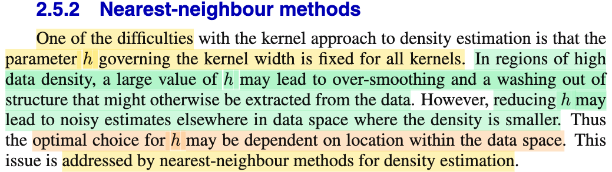</kbd>

> [!NOTE]
> Ta sẽ qua cách tiếp cận thứ hai sau kernel density estimation, đó là nearest neighbor.
>
>
>
> Đầu tiên gs nói rằng, cách làm của kernel densitiy nó có hạn chế là: h ở đâu cũng bằng nhau. Còn nhớ, h đại khái là phạm vi mà ta dùng để xác định tầm ảnh hưởng của một data point. Ví dụ như khi dùng hàm kernel là Parzen window, thì h là cạnh của một hyper-cube, để từ đó nếu khoảng cách của **x** đến data point **x**i nhỏ hơn h/2, thì pdf tại x sẽ "bị ảnh hưởng bởi **x**i" (hàm parzen window kernel sẽ = 1, khiến pdf của x sẽ tăng thêm một khoảng do ảnh hưởng của **x**i). Với kernel function khác, như Normal kernel thì cũng vậy.
>
>
>
> Thế thì vấn đề là, việc h như nhau ở mọi nơi khiến cho nó bị cứng nhắc. Vì khi xét trong **vùng có nhiều data sample, thì nên cho h nhỏ lại, và ngược lại trong vùng thưa data sample thì nên cho h lớn lên**. Vì nếu trong vùng nhiều data sample mà h lớn quá quá sẽ khiến dẫn đến over-smoothing effect, xóa xạch các cấu trúc có thể được nắm bắt từ data. Ngược lại, nơi data density thấp mà h nhỏ quá sẽ khiến noisy. Nói chung **chỉ cần hiểu là h như nhau ở mọi nơi thì không tối ưu.**

> [!TIP]
> **🤖 AI Feedback** — ✅ Score: **98/100**
>
> Ghi chú đã tóm tắt rất hiệu quả hạn chế chính của tham số 'h' cố định trong ước lượng mật độ kernel, giải thích rõ ràng hậu quả của nó trong các vùng mật độ dữ liệu cao và thấp. Việc bổ sung giải thích về tham số 'h' và các hàm kernel khác nhau đã giúp làm sâu sắc thêm sự hiểu biết về ngữ cảnh, rất đáng khen.

 

#### Local Density Estimation Method

<kbd>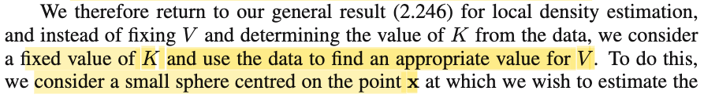</kbd>

<kbd>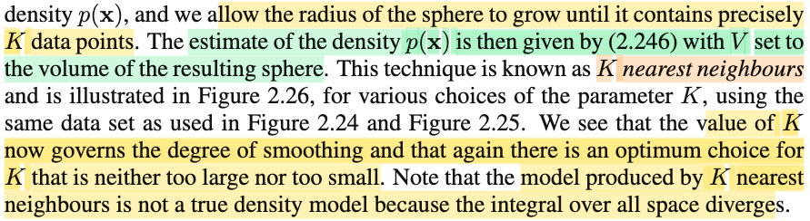</kbd>

<kbd>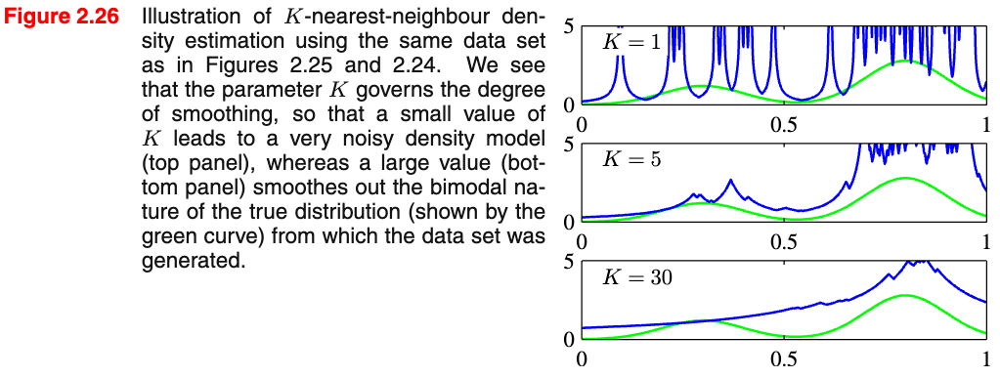</kbd>

> [!NOTE]
> Để hiểu cần recall lại chút (công thức 2.246: f(**x**) ≈ K / NV)
>
>
>
> Nói chung là, công thức này cho ta một cách để estimate giá trị của hàm density (probability density, tức pdf) tại một điểm **x**. Với K, còn nhớ, là ∑i I\_(**x**i ∈ R), là số data point (sample) rơi vào vùng R (lân cận **x**). V là volume của vùng R. Và N là kích thước sample.
>
>
>
> Thế thì dựa vào công thức này, bằng cách fixed V, và xác định K nhờ data, ta sẽ có cách tiếp cận non-parameteric đầu tiên của bài toán density estimation - kernel approach. Trong đó, ta sẽ dùng một hàm kernel để tính xem có bao nhiêu data point **x**i nằm trong phạm vi R của **x** (mà cũng là có x nằm trong phạm vi của bao nhiêu data point, và nhân với) và từ đó sẽ định ra giá trị cao hay thấp của density tại **x**.
>
>
>
> Qua cách thứ hai, ta sẽ fix K, và dựa vào data để tính V, thì cách làm là: tại **x** (nơi cần tính f(**x**)), ta sẽ mở rộng vùng R (là một sphare - khối cầu) quanh nó ra cho đến khi chứa đủ K data sample **x**i, hoặc cũng có thể nhìn theo cách khác, mở rộng R (chính là tăng, hay xác định V) sao cho **x** nằm trong vùng ảnh hưởng của K data sample **x**i.
>
>
>
> Dùng ví dụ trước để minh họa có thể thấy K sẽ ảnh hưởng đến độ mượt.
>
>
>
> K nhỏ sẽ khiến K-neighbor density không mượt (noisy) mà K lớn quá sẽ khiến nó quá mượt làm mất đi (không capture / nắm bắt được pattern) cấu trúc của hàm density thật (cụ thể là hai cái đỉnh (modal) của đường màu xanh lá cây)
>
>
>
> Ôn lại tí: Với kernel density, ta sẽ fixed V, và dựa vào K từ data để tính độ cao thấp của density. Với hàm Parzen window kernel, sự cao thấp của kernel density sẽ được quyết định bởi việc x nằm trong vùnh ảnh hưởng (hyper cubic) của bao nhiêu điểm data, và vì với Parzen window kernel là hàm binary, nên nó sẽ tạo ra hiệu ứng bậc thang, khiến hàm kernel density có dạng step function. Nên để làm trơn, ta có thể dùng Gaussian kernel, vẫn là việc x nằm trong vùng ảnh hưởng của nhiều data point hay không sẽ quyết định đến độ cao thấp của density, nhưng khác với Parzen window, nó có thêm tính chất là khi tới gần hay ra xa thì ảnh hưởng của một data point lên x sẽ lớn lên hay nhỏ lại. Nhưng dù vậy, cả hai đều có chung nguyên lý, nếu x nằm trong vùng ảnh hưởng của nhiều data point, thì density sẽ cao và ngược lại. Và ta sẽ cần hiểu, hàm Parzel window kernel hay Gaussian kernel đều chỉ quy định mức cao thấp tương đối của density, còn để có một density hợp lệ (valid) ta cần V đóng vai normalizing constant
>
>
>
> Vậy thì ở đây, gs nói, với K-nearest neighbor, khi ta fixed K và tính V, để từ đó tỉ số K/NV cao thấp tương đối so với nhau, thì vấn đề là, nó không có cái nào đóng vai normalizing constant cả,  do đó KNN density không phải là một valid pdf.

> [!TIP]
> **🤖 AI Feedback** — ✅ Score: **95/100**
>
> Bài viết thể hiện sự hiểu biết sâu sắc về phương pháp K-nearest neighbour, phân biệt rõ ràng với kernel method và mô tả chính xác ảnh hưởng của K đến độ mượt. Để hoàn thiện hơn, hãy giải thích trực tiếp lý do nó không phải "true density model" là vì tích phân trên toàn không gian phân kỳ.

 

##### K-nearest-neighbour Classification using Bayes' Theorem

<kbd>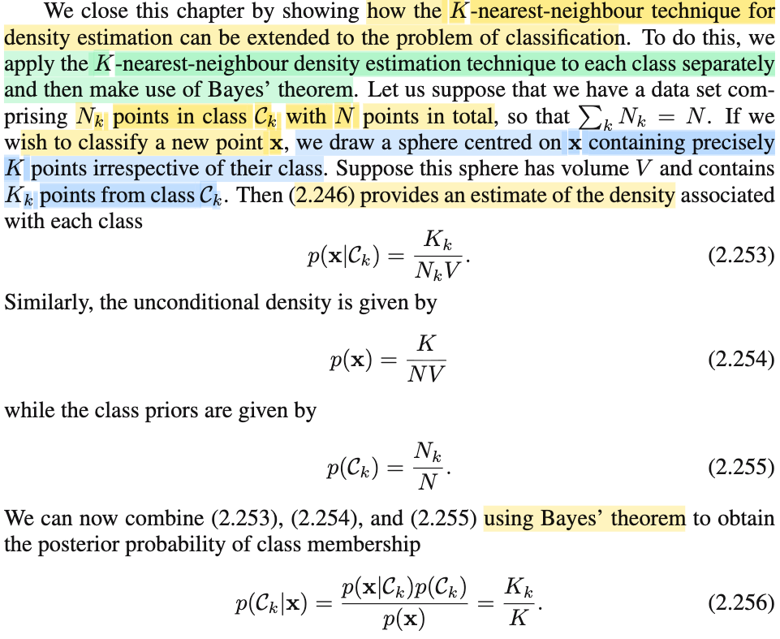</kbd>

> [!NOTE]
> Tiếp theo, phần này gs Bishop sẽ nói về việc dùng KNN technique này để giải bài toán classification:
>
>
>
> Giả sử ta có N data sample **X**1,...**X**N. Và **x** là điểm cần classify. Cũng theo KNN technique: fixed K, dựa vào data tính V → ta dựng một quả cầu tâm **x**, chứa đủ K điểm data.
>
>
>
> Chỗ này lại một điểm như ông Bishop dùng kí hiệu khiến ta rất dễ lú: ông gọi Nk là số data point trong sample thuộc class Ck, làm ta dễ hiểu lầm là có K class. Sự thật là không phải vậy, nên mình gọi các class trong bài toán là C1,C2,....CM, tức là ta có C là một discrete random variable có M possible values C1,...CM.
>
>
>
> Và với điểm **x** và quả cầu của nó, chứa K điểm data, thì ta gọi Kk là số điểm dữ liệu thuộc class Tk. Ta có Σk Kk = K.
>
>
>
> Với mỗi class Ck, ta sẽ xây dựng một K nearest neighbor (estimate) density function: f(**x**|Ck)
>
>
>
> Y như công thức f(**x**) = K/NV với K, dùng parzen window kernel, thì ta dùng hàm đếm xem có bao nhiêu điểm data **x**i nằm trong phạm vi của **x** 
>
>
>
> Vậy thì ta sẽ lập luận về f(**x**|Ck) như sau
>
>
>
> Dù gs không nói, nhưng cần hiểu rằng, ta đang xét một random variable C (class), có các discrete possible value C1,...CK Và f(**x**|Ck) dĩ nhiên là f(**x**|C=Ck), tức, dựa trên event C=Ck thì pdf tại **x** là gì.
>
>
>
> Để khỏi bối rối cái này mình cần nhớ lại định nghĩa cũng như ý nghĩa của conditional probability: P(A|B) = P(A,B)/P(B).
>
>
>
> Event A có bản chất là tập hợp: các possible outcome trong original sample space thuộc event A: A = {s ∈ Ω: s ∈ A}. Nên xét xác suất của event A, thực chất là xác suất của một tập hợp các s này: P(A) = P({s ∈ Ω: s ∈ A}) = Σ\_{s ∈ Ω: s ∈ A} P({s}). Và ta nhớ axiom 1 của probability theory nói rằng P(Ω) = 1.
>
>
>
> Thế thì khi xét xác suất của event A conditioned on B, tức là lúc này B đã xảy ra, thì ta sẽ xét tập những possible outcome thuộc B và A: Tức là (A, B) = {s ∈ B: s ∈ A}. Và xác suất của nó là P(A,B) = P({s ∈ B: s ∈ A}).
>
>
>
> Vấn đề là, nếu chỉ tính P(A|B) = P(A ∩ B) thì sẽ không hợp lệ. Lí do vì theo axiom của lí thuyết xác suất: P({s ∈ Ω}) = 1, nên lúc nếu sample space bây giờ chỉ còn là B, thì P(B) = P({s ∈ B}) = Σ\_{s ∈ B} P({s}) không bằng 1.
>
>
>
> Thành ra, để hợp lệ, P({s}) phải được scale bởi constant c để trở thành P'({s}) thỏa Σ{s ∈ B} P'({s}) = 1
>
>
>
> ⇔ Σ\_{s ∈ B} P({s}) c = 1
>
>
>
> ⇔ c Σ\_{s ∈ B} P({s}) = 1
>
>
>
> ⇔ c P(B) = 1
>
>
>
> ⇔ c = 1/P(B)
>
>
>
> Như vậy, P(A|B) = P({s ∈ B: s ∈ A}) = Σ\_{s ∈ B: s ∈ A} P'({s})
>
>
>
> = Σ\_{s ∈ B: s ∈ A} \[P({s})/P(B)\]
>
>
>
> = \[1/P(B)\] Σ\_{s ∈ B: s ∈ A} P({s}
>
>
>
> = \[1/P(B)\] P(A|B)
>
>
>
> = P(A|B)/P(B)
>
>
>
> Thế thì cũng như lập luận trên khi ta đã hiểu P(A|B) mang ý nghĩa là **khi B đã xảy ra thì sample space thu lại chỉ còn các possible outcome của B**, thì ở đây f(**x**|C=Ck) cũng có ý nghĩa tương tự, do đó nếu f(**x**) là K/NV thì f(**x**|Ck) = Kk/(Nk×V) với ý nghĩa là ta **áp dụng công thức** K/NV **cho những data point thuộc class k thôi, bỏ hết các data point khác**. Nên Kk = **chỉ xét những điểm data thuộc class k, và sau đó trong số chúng, bao nhiêu điểm nằm trong phạm vi của** **x**. Và Nk là **số data point thuộc class k**
>
>
>
> (Ôn nhanh về K trong lập luận gốc, khi ta derive ra công thức f(**x**) ≈ K/VN, thì K = Σi {I\_(**X**i ∈ R}, với I\_(**X**i ∈ **R**), hay I\_(**X**i ∈ R(**x**) là indicator function, gắn với event **X**i ∈ R(**x**), mang giá trị bằng 1 khi **X**i nằm trong region lân cận **x** và bằng 0 khi ngược lại. Để rồi, với việc fixed V, dùng data để tính K, ta có kernel density approach, trong đó ta có thể dùng hàm Parzen window k(u) = I\_|u ≤ 1/2| để đếm K = Σi=1:N k((**x**i-**x**)/h), hoặc Gaussian kernel để K = Σi=1:N \[(1/√2πh^2) exp{-(**x**-**x**i)^2/2h^2}\]. Hoặc với việc fixed K, tính V từ data ta sẽ có KNN density approach)
>
>
>
> Vậy thì, tiếp theo với f(**x**) = K/VN, ta sẽ dùng Bayes theorem:
>
>
>
> f(Ck|**x**) = f(**x**|Ck)f(Ck)/f(**x**)
>
>
>
> f(Ck), tạm gọi là prior distribution của random variable C, evaluate tại Ck (là một discrete variable), sẽ tính bằng Nk/N tức số observed data thuộc class k / tổng số observed data.
>
>
>
> ⇨ f(Ck|**x**) = f(**x**|Ck)f(Ck)/f(**x**) = (Kk/VNk) (Nk/N) / (K/VN)
>
>
>
> = Kk / K → 2.256

> [!TIP]
> **🤖 AI Feedback** — ✅ Score: **93/100**
>
> Bạn đã nắm vững cách áp dụng kỹ thuật KNN cho bài toán phân loại và suy ra công thức cuối cùng một cách chính xác. Để note ngắn gọn và tập trung hơn, bạn có thể tóm lược phần giải thích sâu về xác suất có điều kiện và đảm bảo tính nhất quán trong ký hiệu.

 

- **K-Nearest Neighbor Classification**

<kbd>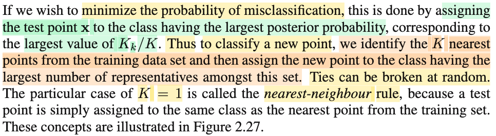</kbd>

<kbd>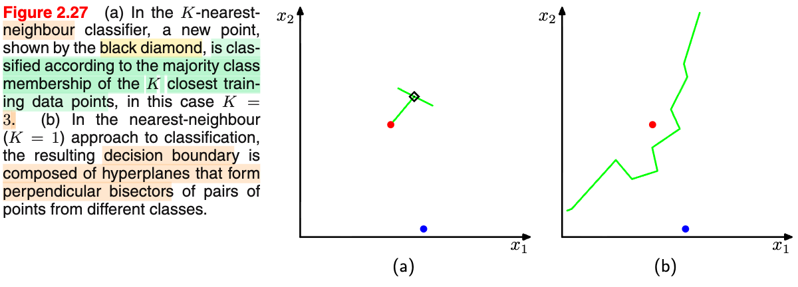</kbd>

> [!NOTE]
> Thế thì gs nói, với giá trị posterior f(Ck|**x**) như vừa rồi (mình hiểu nó là hàm conditional pmf P(C=Ck|**X**=**x**) được estimate dựa trên KNN density approach) thì để có được một decision rule giảm thiểu mis-classificate rate, thì cái rule đó sẽ là: assign class k có f(Ck|**x**) lớn nhất, tức Kk/K
>
>
>
> Dù nghe có vẻ hiển nhiên, như vì sao? → Cái này trong chap 1 đã học rồi (Xem link) và thực chất, hiểu sâu hơn kết nối với kiến thức Casella đây chính là decision rule giúp giảm thiểu Bayes risk:
>
>
>
> **CHỌN RA CÁI NÀO NHỎ NHẤT TRONG ĐÁM**: {Σk=1:K Lk1 f(x, Ck), Σk=1:K Lk2 f(x, Ck), ..Σk=1:K LkK f(x, Ck)} sau đó **LẤY INDEX** ĐỂ GÁN CLASS cho data point **x**.
>
>
>
> Và trong bài toán này, ta cho loss là như nhau (hệ số misclassification error là như nhau, tức coi như L = 1 hết), và f(**x**, Ck) = f(Ck|**x**)f(**x**), nên so f(Ck|**x**) cũng là so sánh f(Ck, **x**).
>
>
>
> Như vậy phân tích thì dài dòng chứ cuối cùng cái rule rất đơn giản: Xem trong K điểm data gần nhất với **x**, thì class k nào chiếm đa số thì dùng class đó để assign cho **x**
>
>
>
> Và khi K = 1, ta gọi nó là nearest neighbor: xem thằng gần nhất thuộc class gì thì kết luận class đó.

> [!TIP]
> **🤖 AI Feedback** — ✅ Score: **92/100**
>
> Ghi chú thể hiện sự hiểu biết sâu sắc về mối liên hệ giữa KNN, xác suất hậu nghiệm và rủi ro Bayes, đặc biệt là trong trường hợp lỗi phân loại đồng đều. Tuy nhiên, việc trình bày công thức rủi ro Bayes có thể được làm rõ hơn để tránh sự nhầm lẫn về ký hiệu.

 

- **Figure 2.28 K-nearest-neighbour Algorithm**

<kbd>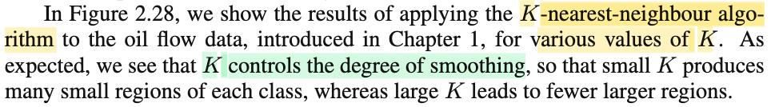</kbd>

<kbd>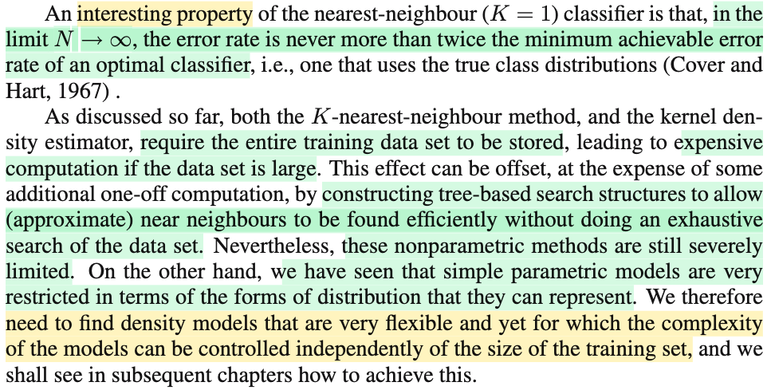</kbd>

<kbd>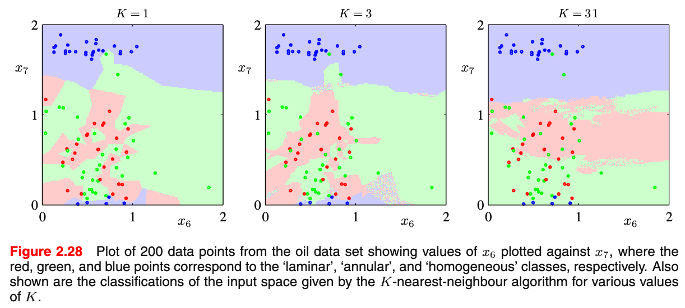</kbd>

> [!NOTE]
> Một ví dụ minh họa K thay đổi làm thay đổi độ mượt của decision boudary.
>
>
>
> Cuối cùng, đại ý gs nói là, cái này, tức KNN density estimator cũng như kernel density estimator đều không cần phải training gì hết, nhưng ta phải lưu trữ toàn bộ data, khiến sẽ là một hạn chế rất đáng kể khi data lớn.
>
>
>
> Và ông nói, tuy rằng bằng các thuật toán tree-based search ta có thể giúp tìm kiếm nearest neighbor nhanh, nhưng bản chất, nó vẫn rất hạn chế.
>
>
>
> Bên cạnh đó, chưa kể, ta đã thấy nó có nhiều vấn đề trong việc estimate distribution. Thành ra trong các chapter sau, ta sẽ bàn đến các cách tiếp cận khác, flexible hơn, với độ phức tạp có thể được kiểm soát một cách độc lập với kích thước training set.

> [!TIP]
> **🤖 AI Feedback** — ✅ Score: **95/100**
>
> Ghi chú này rất toàn diện và nắm bắt chính xác tất cả các điểm cốt lõi từ văn bản gốc, từ ví dụ minh họa về K đến các hạn chế của phương pháp. Để tăng thêm độ sâu, bạn có thể giải thích rõ hơn về bản chất 'không cần huấn luyện' của KNN liên quan đến việc nó là một phương pháp phi tham số.

 

