# Chap 3 - Linear Models for Regression

📊 **Progress:** `16` Notes | `21` Screenshots | `14` AI Reviews

---

## Chap 3 - Linear Models for Regression

 

## 3.1.0 Linear Regression and Basis Functions

<kbd></kbd>

> [!NOTE]
> Đoạn này đại ý là bữa giờ chủ yếu là ta tập trung vào unsupervied learning, thì chương này ta sẽ nói về supervied learning, cụ thể là bài toán regression - trong đó mục tiêu là dự đoán một giá trị hoặc vector các giá trị liên tục t, dựa trên input là vector D chiều.
>
>
>
> Ta đã gặp bài toán này trong ví dụ khớp hàm đa thức (polynomial curve fitting) rồi, và nó (tức polynomial function) là một ví dụ trong một tập rộng hơn các function, gọi là linear regression function (hàm hồi quy tuyến tính), mà chúng có điểm chung là: đều là hàm tuyến tính đối với các tham số có thể điều chỉnh được (adjustable parameter).
>
>
>
> Và ý chính muốn nói là, chương này ta sẽ vẫn bàn về các hàm này - tuyến tính đối với param, nhưng, ta có thể làm cho nó hiệu quả hơn bằng cách dùng hàm phi tuyến đối với inputs, bằng cách kết hợp tuyến tính các inputs, sử dụng các basis function.
>
>
>
> Nói ngắn gọn thì hiểu đơn giản, là, cái hàm dùng để dự đoán t, là hàm của cả param θ và input x. Thì ta sẽ luôn dùng các hàm tuyến tính đối với θ, có nghĩa là, coi x như constant, thì f(θ, x) = g(θ) là hàm tuyến tính, nhưng với input x thì hàm là phi tuyến. Ví dụ như f(x) = θ1 x1 + θ2 x2^2, là hàm tuyến tính theo θ = θ1, θ2 nhưng nhưng phi tuyến theo x = (x1, x2)

> [!TIP]
> **🤖 AI Feedback** — ✅ Score: **92/100**
>
> Bạn đã tóm tắt rất chính xác về trọng tâm thay đổi sang học có giám sát và định nghĩa của hồi quy. Điểm mạnh lớn nhất là cách bạn giải thích và minh họa bằng ví dụ về việc hàm có thể tuyến tính theo tham số nhưng phi tuyến theo biến đầu vào, thể hiện sự hiểu biết sâu sắc. Chỉ cần lưu ý thêm rằng các 'basis function' thường là các hàm phi tuyến của biến đầu vào, và chúng ta kết hợp tuyến tính các hàm cơ sở này.

 

### Predicting Values and Linear Models

<kbd></kbd>

> [!NOTE]
> Đại ý là, đề bài sẽ là. ta có N giá trị quan sát {**x**1, ....**x**N} (**x**i là vector D chiều), cũng như đi kèm là các giá trị target t1, ...tN tương ứng. Mục tiêu sẽ là xây dựng hàm dựa đoán t từ một vector **x** mới.
>
>
>
> Vậy thì đại khái là, ông nói, nếu làm đơn giản, ta có thể xây dựng hàm dự đoán y(**x**) để dự đoán t một cách trực tiếp.
>
>
>
> Tuy nhiên, với góc nhìn xác suất, ta sẽ muốn xây dựng một cái gọi là predictive distribution (khái niệm đã gặp ở chap 1) f(t|**x**), vì nó sẽ giúp thể hiện tính uncetainty. Và từ đó, ta sẽ đưa ra dự đoán t, theo cách thức giúp giảm thiểu giá trị trung bình của loss mà ta chọn. Phổ biến hay dùng là squared loss, khi đó, cái cách để đưa ra dự đoán t giúp giảm trung bình squared error loss chính là dùng mean của cái predictive distribution này (chính là cái mà gs nói - conditional expectation of t, E\[t|**x**\], chính là mean của phân phối f(t|**x**))
>
>
>
> Cuối cùng, ông nói tuy linear model có nhiều hạn chế đáng kể trong bài toán pattern recognition, ví dụ như khi input space là không gian cao chiều (D lớn), tuy nhiên, mô hình này có những đặc điểm tốt về mặt phân tích (analytical properties) và do đó, nó đóng vai trò nền tảng cho nhiều mô hình phức tạp sau này.
>
>
>
> ---
>
>
>
> Dù mình đoán gs Bishop cũng sẽ nhắc lại, nói lại về cái ý vừa nói ở trên - cái gì mà thay vì xây dựng hàm y(x) dự đoán t, ta xây dựng predictive distribution, và từ đó đưa ra dự đoán, theo cái cách thức nào đó giúp giảm kì vọng (trung bình) loss. Để rồi nếu làm theo cách phổ biến - dùng loss là squared loss thì ta sẽ lấy conditional expectation để dùng dự đoán cho t. Có thể nhớ lại cái này chút xíu:
>
>
>
> Đầu tiên, cái ý mà gs nói xây dựng hàm y(x) dự đoán thẳng ra t, thì đại ý là, ta xây dựng một function dựa trên tham số nào đó, để rồi với x đưa vào, lấy ra t luôn. Nhưng làm như vậy, không phản ánh được tính chất không chắc chắn. Ví dụ, làm sao để ta thể hiện ý "với x này, tôi đoán t sẽ bằng như này, nhưng không chắc lắm, nhưng tôi tin t sẽ bằng như kia hơn, tức tôi chắc chắn hơn". Do đó, để thể hiện cái ý rằng, sự dự đoán của ta có yếu tố không chắc, thì ta sẽ dùng một probability distribution, gọi là predictive distribution f(t|**x**).
>
>
>
> Thế thì f(t|**x**), tất nhiên, đã học xác suất từ Casella hay Stat110, nó là conditional probability distribution, hay nếu nói theo kiểu prior/posterior, thì nó chính là posterior distribution của T.
>
>
>
> Rồi, mình còn nhớ bài toán polynomial curfitting, cũng có bối cảnh chung của bài toán linear regression cho các observed data (**x**1, t1), ....(**x**N, tN).
>
>
>
> Đầu tiên sẽ có ích khi ôn lại bài toán point estimation của Casella: Cho random sample **X** = (X1,....Xn) iid \~ f(x|θ). Nhiệm vụ là muốn xây dựng một hàm của sample W(**X**), sao cho tại observed value của **X**, ta có W(**x**) estimate tốt cho θ. Sau đó, vì định nghĩa của point estimator quá mơ hồ (bất cứ hàm của sample nào cũng có thể là một point estiamator cho θ (nhưng có là estimator tốt hay không thì chưa biết) nên ta mới có vài phương pháp tiếp cận chính: Method of Moment, Maximum Likelihood, Bayes estimator.
>
>
>
> Thế thì tạm gác lại hai cái đầu, mình nói luôn sang Bayes estimator. Đã đụng tới chữ Bayes, dĩ nhiên là ta dùng quan điểm (perspective) của trường phái Bayesian - coi θ không phải là fixed nhưng unknown như trường phải classic (hay Frequentist), mà ta coi nó là random variable (vector). Để rồi, khi chưa có data gì, ta chọn cho nó distribution nào đó, dựa vào niềm tin ban đầu (prior knowledge), ví dụ như kinh nghiệm hay sao đó, gọi là prior distribution của θ, f(θ), hay trong sách Casella dùng π(θ). Sau đó, dựa vào Bayes theorem, ta sẽ xây dựng posterior distribution của θ, chính là f(θ|**x**), hay π(θ|**x**) = f(x|θ)π(θ)/f(**x**).
>
>
>
> Và lúc này, với một distribution, thì nhiệm vụ vẫn là, cần đưa ra một point estimator, là một hàm của sample W(**X**). Vậy thì point estimator là cái gì đây?
>
>
>
> Câu trả lời, là, ta sẽ cần viện tới decision theory, trong đó ta sẽ tính có các khái niệm như loss function, risk function. Vì thứ mà ta có là một distribution, vốn phản ánh tính không chắc chắn, nên cần dựa vào lí thuyết này để đưa ra quyết định tối ưu.
>
>
>
> Vậy thì, loss function, là hàm của một estimator, được định nghĩa phản ánh độ sai lệch, của estimator và giá trị param. Cái này nó giống định nghĩa của MSE, MSE cũng là một hàm của estimator, được định nghĩa bằng trung bình của W(**X**) - θ:
>
>
>
> Bias(W(**X**) = E\_θ\[(W - θ)^2\], để rồi triển khai ra, ta sẽ có:
>
>
>
> = E\_θ\[W^2 - 2Wθ + θ^2\]
>
>
>
> = E\_θ\[W^2\] - 2θE\[W\] + θ^2
>
>
>
> = E\_θ\[W^2\] - 2θE\[W\] + θ^2
>
>
>
> Dùng Var(W) = E\[W^2\] - (EW)^2 ⇨ E\[W^2\] = Var(W) + (EW)^2
>
>
>
> ..= Var(W) + (EW)^2 - 2θE\[W\] + θ^2
>
>
>
> = Var(W) + (EW - θ)^2
>
>
>
> = Var(W) + \[Bias(W)\]^2
>
>
>
>  Quay lại với hàm loss, L(W, θ), như đã nói, có thể có nhiều loại, một loại cụ thể là ta có thể có square error loss: L(W(**X**), θ) = (W(**X**) - θ)^2
>
>
>
> lấy trung bình: E\_θ\[L(W, θ)\], đây chính là risk function. (có nghĩa là với loss là squared error loss thì MSE chính là risk function thôi)
>
>
>
> Lưu ý, W(**X**) là statistic, tức cũng là random variable, thì L(W(**X**), θ) cũng là random variable, nên dĩ nhiên ta có quyền lấy trung bình / expected value của nó, và vì bản chất đều là function của sample **X** \~ f(**x**|θ), nên distribution của L(W(**X**), θ) sẽ phụ thuộc θ, nên ta mới ghi là E\_θ\[L(W(**X**), θ)\], ám chỉ kì vọng này, sẽ là hàm phụ thuộc θ do distribution của của L(W(**X**), θ) sẽ phụ thuộc θ.
>
>
>
> Và với risk function, hay loss function, nó không phân biệt classic hay Bayessian, vì việc ta lấy kì vọng, là đang kì vọng của random variable L(W(**X**), θ). Và điềy này mang ý nghĩa bằng lời là, ta đã biết loss của W(**X**) khi estimate cho θ, thì bây giờ ta tính trung bình trên mọi giá trị của **X**:
>
>
>
> R(θ, W(**X**)) = E\[L(W(**X**), θ)\] = ∫L(W(**x**), θ)f(**x**|θ)d**x**
>
>
>
> Thế thì, nếu giờ ta quay lại với việc đang xét Bayesian approach, và có θ \~ prior distribution f(θ).
>
>
>
> Thì lúc này E\_θ\[L(W(**X**), θ)\], hay R(θ, W(**X**)) với tư cách là function của θ, cũng lại là random variable. Từ đó ta được quyền lấy kì vọng của nó: E\[R(θ, W(**X**))\] và lần này, đây là kì vọng của một random variable có được bằng cách áp một hàm lên θ, vốn dĩ là một random variable có phân phối π(θ). Và đây chính là **Bayes risk**, nó sẽ không còn là một random variable nữa, mà là một fixed number, vì ta đã intergrate mọi possible value của θ rồi.
>
>
>
> Bayes risk = ∫\[risk function\] π(θ) dθ = ∫R(θ, W(**X**)) π(θ) dθ
>
>
>
> Điều này cũng có thể hiểu theo cách khác, là ta có L(W(**X**), θ) là function của random variable **X** và θ. Và kì vọng của nó chính là ta tính trung bình của L, dựa trên **joint distribution** của **X** và θ
>
>
>
> E\[L(W(**X**), θ)\] = ∫∫ L(W(**X**), θ) f(**x**, θ) d**x** dθ
>
>
>
> = ∫∫L(W(**X**), θ) f(**x**|θ) π(θ) d**x** dθ
>
>
>
> = ∫ \[∫L(W(**X**), θ) f(**x**|θ) d**x**\] π(θ) d**x** dθ
>
>
>
> ∫L(W(**x**), θ)f(**x**|θ)d**x** chính là risk function R(W(**X**), θ)
>
>
>
> .. = ∫ \[R(W(**X**), θ)\] π(θ) dθ → Bayes risk
>
>
>
> Do đó nếu biến đổi tí ta sẽ thấy nó cũng là:
>
>
>
> ∫∫ L(W(**X**), θ) f(**x**|θ) π(θ) d**x** dθ
>
>
>
> = ∫ \[∫L(W(**X**), θ) f(θ|**x**) dθ\] f(**x**) d**x**
>
>
>
> Thì ∫L(W(**X**), θ) f(θ|**x**) dθ chính là **posterior expected loss**
>
>
>
> để rồi ta sẽ nhìn nhận bayes risk như việc ta tính trung bình posterior expected loss over mọi possible value của **X**.
>
>
>
> Và quay lại mục tiêu đưa ra point estimator từ posterior distribution, thì mục tiêu sẽ là giảm thiểu Bayes risk: minimize\_θ ∫ \[∫L(W(**x**), θ) f(θ|**x**) dθ\] f(**x**) d**x**
>
>
>
> Và điều này (với vài lập luận) sẽ tương đương minimize ∫L(W(**x**), θ) f(θ|**x**) dθ, tức minimize posterior expect loss.
>
>
>
> Ta có bài toán: minimize (over W(**x**)) ∫L(W(**x**), θ) f(θ|**x**) dθ
>
>
>
> Giả sử dùng squared error loss: ∫L(W(**x**), θ) f(θ|**x**) dθ = ∫\[W(**x**) - θ\]^2 f(θ|**x**) dθ,
>
> dễ thấy, đây chính là E\[(W(**x**) - θ)^2\] với θ \~ f(θ|**x**).
>
>
>
> Và bài toán lúc này tương đương: tìm a để E\[(X - a)^2\] nhỏ nhất. Ta có E\[(X - a)^2\] = E\[X^2 - 2aEX + a^2\] = E\[X^2\] - E\[2aEX\] + E\[a^2\] = E\[X^2\] - 2a(EX) + a^2. Để cái này nhỏ nhất, thì -2a EX + a^2 nhỏ nhất. Đây là hàm bậc hai của a. Đạo hàm: 2a - 2EX. Cho đạo hàm bằng 0, ta có a = EX, chính là minimizer.
>
>
>
> Áp dụng vào bài toán tìm W để E\[(W(**x**) - θ)^2\] nhỏ nhất với θ \~ f(θ|**x**), thì solution là W(**X**) = E\[θ\] với θ \~ f(θ|**x**), thì cũng có thể ghi là W(**X**) = E\[θ|**X**\], tức posterior mean, và đây chính là Bayes estimator minimize Bayes risk với squared error loss 
>
>
>
> Vậy thì nãy giờ là nói về bài toán inference: suy luận θ từ data.
>
>
>
> Với bài toán prediction, ta không quan tâm θ, mà ta quan tâm đến việc dự đoán T, nên đại ý là ta sẽ xây dựng predictive distribution f(t|θ,**x**)
>
>
>
> Và để ra quyết định tối ưu, hoàn toàn tương tự, ta cũng giải bài toán minimize expected loss, và kết quả nếu loss là squared error, sẽ là E\[t|**x**\]

> [!TIP]
> **🤖 AI Feedback** — ✅ Score: **98/100**
>
> Điểm mạnh: Bạn đã tóm tắt nội dung văn bản một cách cực kỳ chính xác và đi sâu vào giải thích các khái niệm phức tạp như kỳ vọng có điều kiện và hàm lỗi bình phương bằng cách liên hệ chặt chẽ với lý thuyết thống kê Bayesian. Điều này thể hiện sự hiểu biết sâu rộng, mặc dù một chi tiết nhỏ về ký hiệu f(t|θ,x) ở cuối có thể được làm rõ thêm.

 

#### Linear Basis Function Models

<kbd></kbd>

> [!NOTE]
> Rồi, đại khái là đầu tiên gs nói về một mô hình đơn giản nhất của bài toán regression: có dạng y(**x**, **w**) = w0 + w1x1 + ...wDxD, là linear combinaton các input. (chỗ này, mình tự hiểu, cái cụm Σi wixi thì đúng là linear combination các xi, nhưng vì có thêm w0, nên đây là affine function, không hoàn toàn chính xác là linear function, điểm này trong nhiều lớp như CS224, CS231 cũng có nói tới)
>
>
>
> Với mô hình này, người ta gọi là linear regression, với đặc điểm dễ thấy là, nó là hàm tuyến tính (affine) của cả tham số **w** = (w0, w1,...wD) và input **x** = (x1, ....xD). Và gs cho rằng nó có những hạn chế nghiêm trọng.
>
>
>
> Thành ra, người ta sẽ mở rộng mô hình này, bằng cách thay vì dùng linear combination các input xi, ta sẽ dùng basis function Φi(**x**) để tạo các non-linear function của **x**, và sau đó mới tổ hợp tuyến tính chúng với hệ số wi:
>
>
>
> y(**x**, **w**) = w0 + w1 Φ1(**x**) + ...+ wM-1 ΦM-1(**x**) = w0 + Σj=1:M-1 wj Φj(**x**).
>
>
>
> Như vậy, số tham số là M.
>
>
>
> Nói chung, điểm mấu chốt là, thay vì dùng **x** = x1,...xD như input, và linear combination chúng lại, thì ta chế biến các x1,...xD thành một bộ input khác Φ1(x1,..xD), Φ2(x1,...xD),...là các hàm phi tuyến đối với **x**, khi đó tuy vẫn tổ hợp tuyến tính chúng lại với w0,w1,...: w0 + w1Φ1(**x**) + w2Φ2(**x**) + ...nhưng lúc này, đối với **x**, ta có hàm phi tuyếm, nhưng đối với **w** vẫn là hàm tuyến tính. Và mô hình này sẽ mạnh hơn.

> [!TIP]
> **🤖 AI Feedback** — ✅ Score: **98/100**
>
> Bạn đã nắm vững các khái niệm trọng tâm rất tốt, đặc biệt là sự phân biệt chính xác giữa hàm tuyến tính và hàm affine, điều này thể hiện sự hiểu biết sâu sắc. Cách bạn tóm tắt lại điểm mấu chốt của Basis Function Models cũng rất rõ ràng và đầy đủ.

 

##### Bias Parameter and Basis Function

<kbd></kbd>

> [!NOTE]
> Tiếp, gs nói về w0, đại khái là vai trò của nó giúp ta có thể gán một mức offset cố định nào đó cho data, và thỉnh thoảng người ta gọi là bias parameter.
>
>
>
> Ông lưu ý ta đừng confuse với bias trong thống kê. Ý này có thể hiểu, như note vừa nãy, mình cũng đã nhắc đến khái niệm bias trong statsitic: Cụ thể là trong bài toán point estimator, bias của estimator W(**X**) là hàm số của W(**X**), định nghĩa bởi: Bias(W(**X**)) = E\_θ\[W(**X**)\] - θ, và nếu E\_θ\[W(**X**)\] = θ, hay Bias(W(**X**)) = 0, ta gọi W(**X**) là unbiased estimator của θ.
>
>
>
> Rồi, ý sau cũng ko khó hiểu, y(**x**, **w**) = w0 + Σj=1:M-1 wj × Φj(**x**), thì sẽ thuận tiện hơn nếu ta đặt Φ0(**x**) = 1, để w0 + Σj=1:M-1 wj × Φj(**x**) = w0 × Φ0(**x**) + Σj=1:M-1 wj × Φj(**x**) = Σj=0:M-1 wj × Φj(**x**), và dễ thấy, nếu đặt **w** = \[w0, ....wM-1\]T và **Φ** = (Φ0(**x**), ...ΦM-1(**x**)), thì cái cụm trên chính là dot product của chúng **w**T**Φ**(**x**)
>
>
>
> Ông nói đại ý rằng trong nhiều bài toán pattern reconition thực tế, thì ta thường có bước feature engineering hay pre-processing (như đã biết, đại khái là ta tiền xử lí data, hoặc chế cháo tạo các feature mới từ các feature gốc) thì khi đó, chúng có thể được thể hiện thông qua các basis function này. (nói đơn giản, là ta có thể hiểu hàm Φ sẽ đại diện cho các bước preprocessing hay feature engineering này trong thực tế)

> [!TIP]
> **🤖 AI Feedback** — ✅ Score: **100/100**
>
> Ghi chú rất chính xác và chi tiết, đặc biệt là phần giải thích về vai trò của φ₀(x) và sự khác biệt giữa "bias" trong mô hình và "bias" trong thống kê. Cách bạn liên hệ hàm cơ sở với feature engineering thực tế cũng rất rõ ràng.

 

- **Gaussian Basis Functions**

<kbd></kbd>

> [!NOTE]
> Đại khái là như đã nói, nhờ có basis function mà ta có thể có mô hình phi tuyến đối với input. Tuy nhiên, vẫn là hàm tuyến tính đối với tham số (**w**) và đặc điểm này mang lại các lợi ích khi giải thích (kết quả) mô hình nhưng vẫn đi kèm vài nhược điểm - như nó hạn chế sức mạnh của mô hình.
>
>
>
> Sau đó, ông đề cập đến trong ví dụ polinomial curve fitting, thì ta còn nhớ dùng function y(**w**,x) là hàm đa thức bậc M: w0 + w1x^1 + w2x^2 + ...wMx^M (xem link), thì dễ hiểu ở đây, basis function là Φj(x) = x^j. Cách làm này, có nhược điểm liên quan tới việc hàm φ là global function của input, để rồi có thể khắc phục bằng cách dùng spline funciton. Thì ý này đại khái là, ví dụ xét hàm y(x, w) = w × x^3 đi, và muốn ép nó khớp với một nhóm data (xi, ti) thì có khi ta điều chỉnh w khiến w × φ(xi) khớp được vài điểm đầu, thì lại khiến nó rời xa nhóm khác, mà bắt nguồn là do cái hàm x^3 nó là **hàm toàn cục, khi x trải dài từ -∞ đến ∞ thì f(x) ở đâu cũng là x^3**, nên nếu thay đổi (điều chỉnh để cái hàm wx^3) ở một vùng thì nó sẽ **thay đổi luôn những vùng khác**. Còn giả sử ta xét hàm Gaussian dưới đây, ta sẽ thấy, cái hàm này, nó chỉ có tính cục bộ, cụ thể là **nó chỉ tác động với các điểm quanh μ**, trong phạm vi nào đó (do s), như vậy, **giả sử ta điều chỉnh tham số w gắn với Φ(x) giúp nó khớp những điểm ở vùng cục bộ này, thì nó không ảnh hưởng với các vùng khác**. 
>
>
>
> Rồi, nói về Gaussian basis Φj(x) = exp{-(x-μj)^2/2s^2} với μj sẽ chi phối location của basis function trong input space và s chi phối spatial scale (cũng chưa hiểu lắm).
>
>
>
> Ông lưu ý, đại khái là cái này đừng coi nó hay đòi hỏi nó phải là một valid pdf, hay cũng đừng cho rằng nó có ý nghĩa xác suất gì, cái này có thể hiểu cũng giống như với Gaussian kernel, ta chỉ muốn hàm kernel có cái hành vi như đường cong cái chuông của phân phối Normal pdf mà thôi, chứ chả có hàm ý xác suất gì cả. Nên ở đây cũng vậy, ta sẽ ko đòi hỏi Φj(x) phải có các tính chất valid của một hàm pdf (như intergrate = 1). Hơn nữa, kiểu gì thì ta cũng sẽ nhân với hệ số wj.

> [!TIP]
> **🤖 AI Feedback** — ✅ Score: **95/100**
>
> Ghi chú của bạn rất chính xác và sâu sắc. Đặc biệt, cách bạn giải thích sự khác biệt giữa hàm cơ sở toàn cục và cục bộ bằng ví dụ minh họa và phép so sánh với Gaussian kernel thể hiện sự hiểu biết sâu rộng. Một chút rõ ràng hơn về vai trò của 's' trong 'spatial scale' sẽ làm cho ghi chú trở nên hoàn hảo.

 

- **Sigmoidal and Tanh Functions**

<kbd></kbd>

<kbd></kbd>

> [!NOTE]
> Rồi, một hàm basis quan trọng nữa, là sigmoidal basis function:
>
>
>
> Φj(x) = σ\[(x - μj)/s\] với σ(a) = 1/\[1 + exp(-a)\].
>
>
>
> và một phiên bản equivalent (tương đương) là hàm tanh, có quan hệ với sigmoid: tanh(a) = 2 σ(a) - 1, có nghĩa là, có quan hệ tuyến tính giữa chúng, nên dễ hiểu khi gs nói rằng nhìn chung, một tổ hợp tuyến tính của các logistic sigmoid thì cũng là một tổ hợp tuyến tính các tanh (ví dụ, α σ1(a) + β σ2(a), là tổ hợp tuyến tính của các σ, thì thay tanh1(a) = 2 σ1(a) - 1 ⇨ σ1(a) = \[tanh1(a) + 1\]/2, và σ2(a) = \[tanh2(a) + 1\]/2 thì ta cũng sẽ có α \[tanh1(a) + 1\]/2 + β \[tanh2(a) + 1\]/2 = α tanh1(a) / 2 + α/2 + β tanh2(a)/2 + β/2, đây cũng là linear combination các tanh function (chính xác hơn là affine, nhưng như đã nói, ta coi như là linear combination luôn)
>
>
>
> Nói thêm chút về hàm sigmoid và tanh, mình đã gặp chúng trong các lớp machine learning của Andrew Ng, cũng như sau này với các lớp deep learning. Bây giờ gặp lại trong bối cảnh Bishop, thì mình được hiểu thêm chúng là thuộc loại basis function, là function nhằm tạo ra tính chất "non-linearity đối với input", mà nhờ đó, ta vẫn có linear model - là hàm tuyến tính đối với tham số, nhưng là hàm phi tuyến đối với input → giúp mạnh hơn.

> [!TIP]
> **🤖 AI Feedback** — ✅ Score: **98/100**
>
> Bạn đã ghi chú rất chính xác các định nghĩa và mối quan hệ giữa hàm sigmoid và tanh. Phần ví dụ minh họa chi tiết về tổ hợp tuyến tính cho thấy sự hiểu biết sâu sắc và khả năng áp dụng kiến thức của bạn.

 

- **Fourier Basis and Wavelets**

<kbd></kbd>

<kbd></kbd>

> [!NOTE]
> Đoạn đầu nói sơ về một loại basis function gọi là Fourier basis, có thể tìm hiểu nó sau, chỉ cần biết đại ý là nó sẽ phù hợp với input có cấu trúc dạng chuỗi ví dụ như các điểm thời gian nối tiếp nhau hoặc các pixel trên bức ảnh.
>
>
>
> Cuối cùng, gs cho rằng, phần lớn các thảo luận trong chap này không care / phụ thuộc basis fuction cụ thể là gì. Nói cách, Φ là gì cũng được, kể cả là hàm identity Φ(**x**) = **x** Và để đơn giản, ta sẽ chỉ tập trung vào bài toán mà t là scalar, tức là target variable chỉ là scalar variable chứ ko phải vector.

 

## 3.1.1 Maximum likelihood and least squares

<kbd>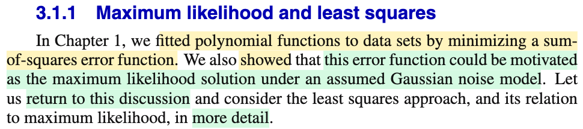</kbd>

> [!NOTE]
> Đầu tiên gs nhắc lại là ở chap 1 mình đã học bài toán polynomial curve fitting - về cơ bản là đi tìm một hàm đa thức để khớp với các data, bằng cách tìm parameter sao cho giảm thiểu sum of square error function. Và trong quá trình làm, ta đã chứng minh hoặc cho thấy rằng, bản chất của việc minimize hàm squared error function, thực chất chính là tiếp cận bài toán như bài toán point estimation, theo phương pháp maximum likelihood với một gỉa định là noise tuân theo phân phối normal.
>
>
>
> Thế thì phần này, mình sẽ quay lại bài toán đó, và bàn thêm về cách tiếp cận least square cũng như liên quan của nó với maximum likelihood.
>
>
>
> Mình muốn active recall lại tí xíu, để ít nhất có thể làm rõ vì sao nói ý trên.
>
>
>
>  Nói một cách ngắn gọn, đầu tiên ta thể hiện tính uncertainty của target bằng cách coi nó là random variable T
>
>
>
> Và giả định sai số Ei = Ti - y(**w**, **x**i) \~ normal(0, 1/β), điều này có nghĩa là, ta xây dựng function để dự đoán t, nhưng tin rằng, kể cả có đoán chính xác, thì vẫn tồn tại noise, khiến tạo ra sai số, và noise là đại lượng ngẫu nhiên, ta thể hiện nó bởi random variable Ei, có phân phối normal(0, 1/β) (precision β nào đó)
>
>
>
> Như vậy, theo location family, nếu Ei = Ti - y(**w**, **x**i) \~ normal(0, 1/β), thì Ti \~ normal(y(**w**, **x**i), 1/β).
>
>
>
> Cần nhấn mạnh: Mấu chốt là lập luận rằng: Coi target variable là một đại lượng mang tính ngẫu nhiên - điều này hợp lí vì, với một đối tác là **x**i, ti có thể có nhiều possible value, nó mang tính uncertainty. Và hàm dự đoán của ta y(**w**, **x**i) dù có làm tốt đến mấy trong việc nắm bắt được quy luật, thì vẫn còn đó sai sót do nhiễu, và nhiễu này, ta cho rằng, tuân theo phân phối chuẩn.
>
>
>
> Rồi, như vậy, bài toán trở thành, cho random sample T1,...Tn (n hay m, hay N gì đó, chỉ số sample), với Ti \~ normal(y(**w**, xi), 1/β), i = 1,2,...n. Và các random variable Ti này độc lập nhau (vì data được collect một cách độc lập). Chú ý, độc lập nhưng không identically distributed, vì các normal đều có mean khác nhau, nên không có tính iid, chỉ độc lập thôi.
>
>
>
>  Dĩ nhiên, ta có bài toán quen thuộc: tìm point estimator cho **w** - tham số chi phối distribution của Ti (given **x**i)
>
>
>
> Và cách tiếp cận phổ biến là Maximum Likelihood estimation (nhất là sau khi ta học chap 10 Casella, mình biết ML estimator sẽ tạo một chuỗi estimator có tính chất (asymptotically) efficient (và consistent))
>
>
>
> Thế thì, để làm, đầu tiên cần xét joint pdf của **T** = (T1,...Tn), ta sẽ thấy dù chúng không cùng distribution, nhưng vẫn độc lập, cho phép tách joint pdf thành tích các marginal pdf: Πi=1:n f(ti|y(**w**,**x**i), 1/β).
>
>
>
> Từ đó hàm likelihood, theo định nghĩa, là hàm của parameter, được define bởi giá trị của joint pdf của sample tại observed value:
>
>
>
> L(**w**, β|**t**, **x**1,...**x**n) = f(**t**|**w**, **x**1,..**x**n, 1/β) = Πi=1:n f(ti|y(**w**,**x**i), 1/β)
>
>
>
> Và theo ML, ta sẽ giải bài toán:
>
>
>
> maximize (over **w**, β) L(**w**, β|**t**, **x**1,...**x**n)
>
>
>
> Tới đây, ta sẽ dùng các kĩ thuật chuyển bài toán tối ưu thành bài toán tương đương bằng cách dùng hàm monoton ln, hoặc bỏ đi constant:
>
>
>
> L(**w**, β|**t**, **x**1,...**x**n) ∝ ln {L(**w**, β|**t**, **x**1,...**x**n)}
>
>
>
> = ln {Πi=1:n f(ti|y(**w**, **x**i), 1/β)} = Σi=1:n ln {f(ti|y(**w**, **x**i), 1/β)}
>
>
>
> = Σi=1:n ln {N(ti|y(**w**, **x**i), 1/β)}
>
>
>
> = Σi=1:n \[ ln { Πi \[1/√\[2π(1/β)\]\] exp\[-\[ti-y(xi,**w**)\]^2/2(1/β)\] } \]
>
> (....biến đổi, thu gọn)\
> \
> = (n/2) ln β - (n/2) ln (2π) - (β/2) Σi \[ti-y(xi,**w**)\]^2\
> \
> = - (β/2) Σi \[ti-y(xi,**w**)\]^2 + (n/2) ln β - (n/2) ln (2π)
>
>
>
> ∝ - Σi \[ti-y(xi,**w**)\]^2
>
>
>
> Như vậy, bài toán euivalent là: maximize (over **w**) - Σi \[ti-y(xi,**w**)\]^2
>
>
>
> equivalent tiếp: minimize (over **w**) {Σi \[ti-y(xi,**w**)\]^2}
>
>
>
> Và như vậy có thể thấy, đây chính là cách tiếp cận bài toán curve fitting theo lối đơn giản là đi tìm w sao cho giảm thiểu hàm loss tính bằng tổng bình phương của error Có nghĩa là trong đó ta ko bàn về xác suất gì cả, mà chỉ là cố đi tìm param để giảm thiểu loss thôi, nhưng với góc nhìn xác suất, ta thấy nó chính là đi giải bài toán tìm Maximun Likelihood estimator với giả định là noise \~ normal(0, 1/β)

> [!TIP]
> **🤖 AI Feedback** — ✅ Score: **98/100**
>
> Phân tích cực kỳ chi tiết, chính xác và sâu sắc, thể hiện sự hiểu biết thấu đáo về mối quan hệ giữa bình phương tối thiểu và ước lượng hợp lý tối đa. Bài trình bày cũng cung cấp một lời giải thích và dẫn xuất toán học rõ ràng và đầy đủ. Mặc dù rất toàn diện, một số phần của phép dẫn xuất toán học có thể được trình bày súc tích hơn một chút để tăng tính dễ đọc.

 

### Optimal Prediction with Gaussian Noise

<kbd>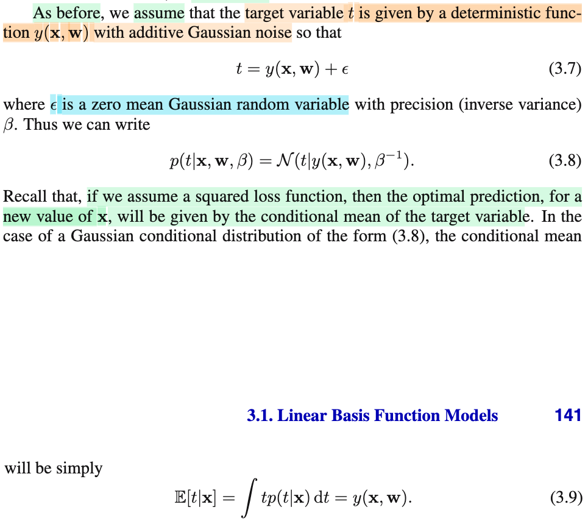</kbd>

> [!NOTE]
> Rồi, như vừa ôn lại, ta sẽ giả định noise \~ normal(0, β^-1) cũng đồng nghĩa giả định T = y(**x**, **w**) + ε \~ normal(y(**x**, **w**), β^-1), nên f(t|**x**, **w**, β) = N(t|y(**x**, **w**), β^-1) (đây chỉ là kí hiệu normal(y(**x**, **w**), β^-1))
>
>
>
> Tới đây, ông nói, ta đã biết trong chap 1 rằng, khi đã có distribution của T (f(t|**x**, **w**, β) thì nếu ta cần **đưa ra dự đoán sao cho tối ưu** (**optimal prediction**), thì khi **loss là squared loss**, thì prediction tối ưu đó chính là dùng **conditional mean**.
>
>
>
> Cùng làm rõ ý này:
>
>
>
> Thật ra cái này y như một điểm mà mình đã viết trong note trước (3.1.0) khi liên hệ với Casella, trong đó mình nói rằng, khi đã có posterior distribution của θ, π(θ|**x**), thì Bayes estimator cho θ giúp giảm thiểu Bayes risk với loss tính bằng squared loss chính là mean của posterior: E\[θ|**x**\]. Ở đây cũng y vậy, nên mình có thể chứng minh lại:
>
>
>
> Bắt đầu lại với việc mượn lập luận của bài toán inference θ trong note (Predicting Values and Linear Models, xem link), để liên hệ qua cho dễ:
>
>
>
> Squared error loss function: L(W(**X**), θ) = \[W(**X**) - θ\]^2
>
>
>
> Risk function: average over all possible **x**: ∫L(W(**x**), θ) f(**x**|θ) d**x**
>
>
>
> Nếu là Bayesian, ta có thêm Bayes risk: average over all possible θ:
>
>
>
> ∫ \[ ∫L(W(**x**), θ) f(**x**|θ) d**x** \] π(θ) dθ
>
>
>
> = ∫ \[ ∫L(W(**x**), θ) f(θ|**x**) f(**x**) / π(θ) d**x** \] π(θ) dθ
>
>
>
> = ∫∫L(W(**x**), θ) f(θ|**x**) f(**x**) d**x** dθ
>
>
>
> = ∫∫L(W(**x**), θ) f(θ|**x**) dθ f(**x**) d**x**
>
>
>
> = ∫ \[∫L(W(**x**), θ) f(θ|**x**) dθ\] f(**x**) d**x**
>
>
>
> = ∫ \[posterior expected loss\] f(**x**) d**x** (posterior expected loss = ∫L(W(**x**), θ) f(θ|**x**) dθ)
>
>
>
> Và minimize (over W) Bayes risk sẽ trở thành mininize posterior expected loss với mọi **x**
>
>
>
> ⇔ minimize E\[L(W(**x**),θ)\], θ \~ π(θ|**x**) với mọi **x**
>
>
>
> ⇔ minimize E\[(W(**x**) - θ)^2\], θ \~ π(θ|**x**) với mọi **x**
>
>
>
> Và solution là W(**x**) = E\[θ|**x**\], là posterior mean.
>
>
>
> ⇔ minimize (over W) (W(**x**)- θ)^2 với mọi x
>
>
>
> Vậy quay lại đây
>
>
>
> Loss function, cụ thể là square error loss: L(T, y(**w**, **x**)) = \[T - y(**w**, **x**)\]^2
>
>
>
> Risk function, là average over all **t**: E(\[T - y(**w**, **x**)\]^2), T \~ n(y(**w**, **x**), 1/β)
>
>
>
> Y như trên với T đóng vai θ, y(**w**,**x**) đóng vai W(**x**), ta có bài toán minimize risk function:
>
>
>
> minimize over y(w,x) {E(\[T - y(**w**, **x**)\]^2)}, với T \~ n(y(**w**, **x**), 1/β)
>
>
>
> Và solution cũng sẽ là posterior mean: E\[T\], T \~ n(y(**w**, **x**), 1/β), và có thể ghi là E\[T|**w**,**x**,β\]
>
>
>
> ---
>
>
>
> Ở đây phải rạch ròi hai việc, hay nói cách khác, có hai bài toán đặt ra:
>
>
>
> Bài toán thứ nhất là: với data quan sát được, và dưới giả định Ti \~ n(y(**w**,**x**i), 1/β) thì một estimator tốt của **w** là gì. Và nếu ta làm theo lối tìm maximum likelihood estimator cho w, kết quả ta tìm ra là: chính là w khiến minimize sum squared error {Σi=1:n \[ti - y(**w**, **x**i)\]^2}.
>
>
>
> Còn bài toán thứ hai, là, giả sử ta có distribution của T là f(t|**x**), gọi là predictive distribution, thì để dự đoán t với một **x cho trước** mới, thì hành động tối ưu là gì. Và lập luận cho thấy, giá trị tối ưu là E\[t|**x**\], tức là mean của distribution f(t|**x**) nếu như ta chọn loss là square error.
>
>
>
> Và đây là chỗ nhập nhằng dễ lú:
>
>
>
> Kết hợp hai bài toán: là ta dùng giả định Ti \~ n(y(**w**,**x**i), 1/β), để tìm ra ML estimator cho **w**: **w**^ML. Thì khi đó, ta có predictive distribution là T \~ f(t|**x**) = pdf của n(y(**w**^ML,**x**), 1/β). Và theo bài toán thứ hai, dự đoán tối ưu cho giá trị t của một x cho trước chính là mean của n(y(**w**^ML,**x**), 1/β), và ngay tại đây xảy ra sự tiện lợi ở chỗ, nó chính là y(**w**^ML,**x**).
>
>
>
> Sự tiện lợi này sẽ không tồn tại nếu các trường hợp sau:
>
>
>
> Nếu ta có T \~ f(t|**x**) = pdf của n(y(**w**^ML,**x**), 1/β), nhưng tiêu chí của bài toán thứ hai không phải là squared error, khi đó, hành động tối ưu không phải là dùng mean của n(y(**w**^ML,**x**), 1/β), mà là dùng cái gì khác, khi đó ta phải tính toán thêm.
>
>
>
> Hoặc nếu ta trong bài toán thứ nhất, ta không giả định Ti \~ n(y(**w**,**x**i), 1/β), thì việc giải tìm ML estimator của w sẽ không phải là tìm w khiến mininize sum square error. Và giả sử ta tìm ra w^ML, thì nó chưa chắc là mean của f(t|**x**).Để rồi nếu trong bài toán thứ hai ta vẫn dùng tiêu chí squarer error loss, để có solution tối ưu là mean của f(t|**x**), thì lúc này, ta sẽ phải tính tiếp mean của f(t|**x**), thay vì có thể tiện lợi dùng y(**x**,**w**)

> [!TIP]
> **🤖 AI Feedback** — ✅ Score: **98/100**
>
> Ghi chú đã giải thích rất chính xác mô hình và nguyên lý dự đoán tối ưu với hàm mất mát bình phương như trong hình ảnh. Chiều sâu phân tích, đặc biệt là phần chứng minh và phân biệt các bài toán, đã làm tăng đáng kể sự rõ ràng và toàn diện của nội dung.

 

#### Gaussian Noise and Multimodal Distributions

<kbd>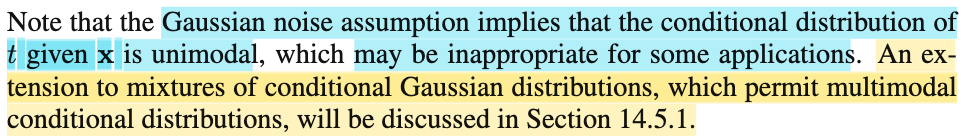</kbd>

> [!NOTE]
> Cụ thể, chúng ta giả định rằng nhiễu tuân theo phân phối chuẩn với giá trị trung bình bằng 0 và độ chính xác là beta. Điều này cũng có nghĩa là biến ngẫu nhiên T có phân phối đơn đỉnh là phân phối chuẩn, với giá trị trung bình tại giá trị của hàm dự đoán y(**x**, **w**) và tham số precision là beta. 
>
>
>
> Điểm chính cần nhấn mạnh ở đây là chúng ta không chỉ giả định T tuân theo phân phối chuẩn mà còn **giả định nó là một phân phối đơn đỉnh (unimodal)**. Tuy nhiên, **trong nhiều trường hợp và bài toán thực tế, giả định này không còn phù hợp**. Do đó, chúng ta sẽ cần sử dụng **mô hình hỗn hợp Gaussian (Gaussian mixture)**, tức là sự kết hợp của nhiều phân phối chuẩn. Chủ đề này sẽ được thảo luận chi tiết trong Phần 14 và Chương 14.

 

##### Likelihood and Error Functions

<kbd>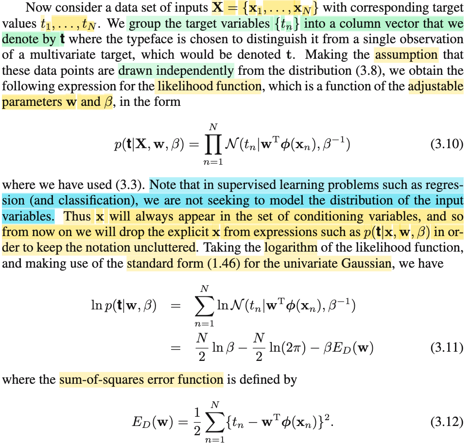</kbd>

> [!NOTE]
> Rồi, từ cái note hồi đầu của section này đã giúp ta có thể hiểu đoạn này rồi:
>
>
>
> Như đã biết, ta có bộ data, là các observed value (**x**i, ti) i=1,...N. Gom lại thành matrix **X** (có thể là mỗi **x**i làm một hàng) và vector **t** = (t1,...tN).
>
>
>
> Và như đã nói, ta dùng một distribution để thể hiện tính uncertainty của target variable, tức là coi t1,t2,...tN là observed value của các random variable T1, ...TN. Và giả định thêm rằng noise εi = Ti - y(**w**, **x**) sẽ \~ Norm al(0,1/β), nên Ti \~ normal(y(**w**, **x**i), 1/β).
>
>
>
> Từ đó xét joint distribution của T1,..TN,
>
>
>
> f(**t**|**X**, **w**, β) = f(t1,t2,..tN|**X**, **w**, β).
>
>
>
> Vì tính chất các T1,...TN độc lập (do giả định rằng các data point được drawn independently) nên lí thuyết xác suất cho ta tách joint pdf thành tích các marginal pdf:
>
>
>
> .. = Πi=1:N f(ti|**x**i, **w**, β)
>
>
>
> thay kí hiệu f(ti|**x**i, **w**, β) bằng N(ti|y(**x**i, **w**), 1/β) (vì đã nói ở trên, Ti \~ normal(y(**w**, **x**i), 1/β))
>
>
>
> .. = Πi=1:N N(ti|y(**x**i, **w**), 1/β)
>
>
>
> Tới đây, nhớ lại bối cảnh ở đây là ta đang nói về linear model: với y(**x**i, **w**) = **w**TΦ(**x**i), là hàm tuyến tính đối với w và phi tuyến với **x**i (nhờ basis function Φ, nhớ không). Nên ta có:
>
>
>
> .. = Πi=1:N N(ti|**w**TΦ(**x**i), 1/β) → Đây là 3.10 (trong sách dùng index variable là n, mình dùng i cũng được)
>
>
>
> Vậy ta có f(**t**|**X**, **w**, β) = Πi=1:N N(ti|**w**TΦ(**x**i), 1/β)
>
>
>
> Ở đây gs nói rằng, trong bài toán regression, ta sẽ chỉ mô hình hóa distribution của T, chứ ko care distribution của **X**, (tức các input vector). Cũng như để cho gọn, ta sẽ bỏ bớt **x** trong điều kiện. Đây là bước giải thích nếu ko đọc kĩ có thể gây confused.
>
>
>
> Vậy ln f(**t**|**X**, **w**, β) = f(**t**|**w**, β) (bỏ **X** cho gọn) 
>
>
>
> = Πi=1:N N(ti|**w**TΦ(**x**i), 1/β)
>
>
>
> Rồi, tiếp theo, như cách làm thông thường đến giờ đã quen, vì kiểu gì mình cũng sẽ đi thiết lập bài toán maximize likelihood, và sau đó, chuyển thành bài toán tương đương với hàm ln (nhờ tính monotone của hàm ln, nên **w** khiến maximize ln likelihood cũng là maximize likelihood) nên ta sẽ chuẩn bị hàm ln likelihood luôn là vừa:
>
>
>
> Hàm likelihood, thì như đã nói nhiều lần, theo định nghĩa, là hàm của parameter θ, define bởi L(θ|**x**) = f(**x**|θ) (chú ý, đây chẳng có gì là Bayes theorem hay gì cả, nó chỉ là cách người ta define ra hàm likelihood, với ý nghĩa là: L(θ|**x**) sẽ thể hiện độ hợp lí của θ, khi giá trị quan sát thấy của **X** là **x**, và độ hợp lí này, được tính bằng giá trị của hàm pdf của **X** (**X** \~ f(**x**|θ)) tại observed value **x**. Vậy thì ở đây ln likelihood của param **w**, β là:
>
>
>
> ln L(**w**, β|**X**,**t**) = ln f(**t**|**X**, **w**, β)
>
>
>
> = ln Πi=1:N N(ti|**w**TΦ(**x**i), 1/β)
>
>
>
> = ln Πi N(ti|**w**TΦ(**x**i), 1/β) (tự hiểu i chạy từ 1:N)
>
>
>
> = ln { Πi { (2π (1/β))^(-1/2) exp{-(ti-**w**TΦ(**x**i))^2/2(1/β)} } }
>
>
>
> = ln { Πi { (2π)^(-1/2) β^(1/2) exp{-β(ti-**w**TΦ(**x**i))^2/2} } }
>
>
>
> = ln { (2π)^(-N/2) β^(N/2) Πi { exp{-β(ti-**w**TΦ(**x**i))^2/2} } }
>
>
>
> = ln\[(2π)^(-N/2)\] + ln \[β^(N/2)\] + ln {Πi { exp{-β(ti-**w**TΦ(**x**i))^2/2} }
>
>
>
> = (-N/2) ln(2π) + (N/2) ln(β) + Σi { ln {exp{-β(ti-**w**TΦ(**x**i))^2/2} }
>
>
>
> = (N/2) ln(β) -( N/2) ln(2π) + Σi {-β(ti-**w**TΦ(**x**i))^2/2} 
>
>
>
> = (N/2) ln(β) -( N/2) ln(2π) - β Σi {(ti-**w**TΦ(**x**i))^2/2} 
>
>
>
> Đặt E_D(**w**) = Σi {(ti-**w**TΦ(**x**i))^2/2}
>
>
>
> .. = (N/2) ln(β) -( N/2) ln(2π) - β E_D(**w**) → chính là 3.11
>
>
>
> (nói chung chỉ là ta dùng tính chất hàm log: log(AB) = log(A) + log(B) thôi ko có gì phức tạp)

> [!TIP]
> **🤖 AI Feedback** — ✅ Score: **96/100**
>
> Bài ghi chú của bạn thể hiện sự hiểu biết sâu sắc và toàn diện về việc thiết lập hàm khả năng hợp lý và log-khả năng hợp lý cho mô hình hồi quy tuyến tính. Bạn không chỉ tái hiện các công thức mà còn giải thích rất rõ ràng các giả định và ý nghĩa đằng sau chúng.

 

- **Maximum Likelihood and Gradient**

<kbd>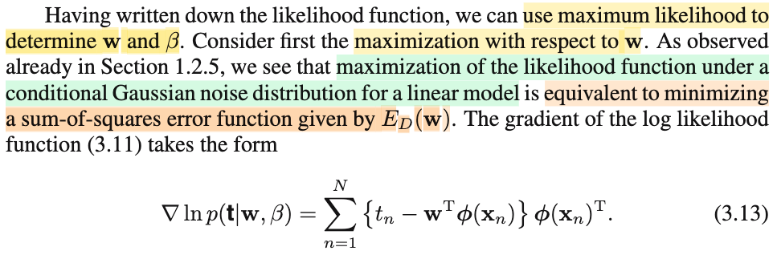</kbd>

<kbd>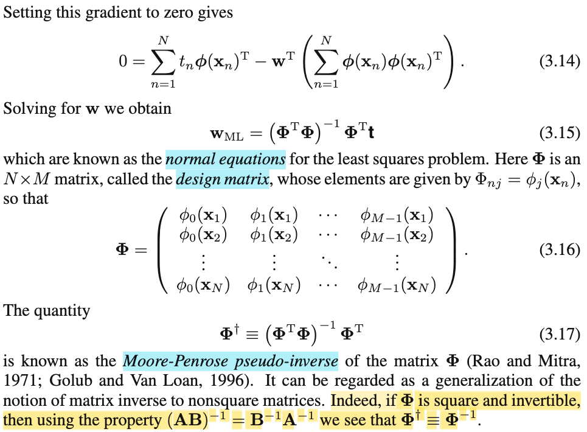</kbd>

> [!NOTE]
> Rồi, như đã biết, đây là bài toán point estimation: tìm hàm số để từ data tính ra estimate tốt cho tham số **w**, β. Thì cách tiếp cận phổ biến là MLE: (**w**, β)^mle = argmax\_**w**, β {L(**w**, β|**X**, **t**)}.
>
>
>
> Và ta có thể giải theo từng biến, tìm **w**^mle trước (hay kí hiệu **w**^ cũng được). Ta có bài toán:
>
>
>
> maximize\_**w** {L(**w**, β|**X**, **t**)}
>
>
>
> và như đã nói trước đây, giải bài toán này (maximum likelhood dưới giả định Gaussian noise) tương đương minimize sum squared error:
>
>
>
> minimize\_**w** E_D(**w**) = Σi {(ti-**w**TΦ(**x**i))^2/2}
>
>
>
> Vậy tới đây chỉ là ta đối mặt bài toán tối ưu không ràng buộc, hơn nữa, đây là hàm bậc hai đối với **w**, nên ta có bài toán tối ưu lồi, việc tìm được stationary point sẽ đủ kết luận là optimal.
>
>
>
> Dùng điều kiện tối ưu cần bậc nhất (first order necessary optimality condition) để tìm stationary point (nơi gradient = 0). Đầu tiên chuẩn bị công thức gradient, tức đạo hàm đối với **w**:
>
>
>
> ∇ ln L(**w**, β|**X**, **t**) = -∇ E_D(**w**) = - d/d**w** \[(Σi {(ti-**w**TΦ(**x**i))^2/2})\]
>
>
>
> = -(1/2) Σi { d/d**w** ( (ti-**w**TΦ(**x**i))^2)}
>
>
>
> Xét d/d**w** (ti-**w**TΦ(**x**i))^2, dùng chain rule:
>
>
>
> = d/d(ti-**w**TΦ(**x**i)) \[(ti-**w**TΦ(**x**i))^2\] . d/d**w** (ti-**w**TΦ(**x**i))
>
>
>
> = \[2(ti-**w**TΦ(**x**i)) . d/d**w** (ti-**w**TΦ(**x**i))
>
>
>
> = \[2(ti-**w**TΦ(**x**i)) . \[- d/d**w** (**w**TΦ(**x**i))\]
>
>
>
> = - 2(ti-**w**TΦ(**x**i)) Φ(**x**i)T
>
>
>
> (vì **w**TΦ(**x**i) là vector (**w**) → scalar function, áp dụng d/d**x** (**x**T**a**) **=** d/d**x** (aT**x**) = aT)
>
>
>
> ⇨ ∇ ln L(**w**, β|**X**, **t**) = -(1/2) Σi {- 2(ti-**w**TΦ(**x**i)) Φ(**x**i)T }
>
>
>
> = Σi {(ti-**w**TΦ(**x**i)) Φ(**x**i)T}
>
>
>
> Điều kiện cần bậc nhất: ∇ ln L(**w**, β|**X**, **t**) = 0
>
>
>
> ⇔ Σi {(ti-**w**TΦ(**x**i)) Φ(**x**i)T} = 0
>
>
>
> ⇔ Σi {tiΦ(**x**i)T - **w**TΦ(**x**i)Φ(**x**i)T} = 0
>
>
>
> ⇔ Σi {tiΦ(**x**i)T} = Σi {**w**TΦ(**x**i)Φ(**x**i)T}
>
>
>
> ⇔ Σi {tiΦ(**x**i)T} = **w**TΣi{Φ(**x**i)Φ(**x**i)T}
>
>
>
> Phân tích cấu trúc của hai vế:
>
>
>
> bên trái, chỉ là tổng của các (scalar ti) × \[vector Φ(**x**i) transosed\]
>
>
>
> bên phải, cái tổng Σi{Φ(**x**i)Φ(**x**i)T}, chính là tổng các N marix rank 1 trong đó mỗi matrix được tạo bởi outer product của vector Φ(**x**i) và chính nó. Theo góc nhìn thứ tư của việc nhân hai matrix mình đã học trong MIT18.06, nói rằng AB là tích các rank 1 matrix tạo bởi \[cột i của A\] outer product với hàng i của B, thì ta sẽ thấy nếu đặt các cột của A là Φ(**x**i) và các hàng của B là Φ(**x**i)T, thì Σi{Φ(**x**i)Φ(**x**i)T} chính là AB. Và dĩ nhiên B = AT, và A = BT, nên cũng có thể thấy đây chính là BTB (B tranpose B). Và trong sách, ta sẽ dùng **Φ** thay cho chữ B, là matrix có các hàng là các vector Φ(**x**i) transpose, gọi là **DESIGN MATRIX**
>
>
>
> Nên từ đó giúp hiểu rằng Σi{Φ(**x**i)Φ(**x**i)T} chính là **Φ**T**Φ**.
>
>
>
> Và vế phải sẽ là **w**T(**Φ**T**Φ**)
>
>
>
> Đồng thời, với việc đặt ra matrix **Φ** cũng giúp ta thấy vế trái chính là transposed của một linear combination của các cột của **Φ**T, bởi bộ hệ số t1,...tN. Vậy, theo góc nhìn nhân matrix với vector trong MIT 1806, thì Σi {tiΦ(**x**i)T} chính là (**Φ**T**t**)T = **t**T**Φ**
>
>
>
> Do đó Σi {tiΦ(**x**i)T} = **w**TΣi{Φ(**x**i)Φ(**x**i)T} có thể thể hiện bởi:
>
>
>
> **t**T**Φ = w**T(**Φ**T**Φ**)
>
>
>
> ⇔ **Φ**T**t =** (**Φ**T**Φ**)T**w** (Transposed hai vế)
>
>
>
> ⇔ **Φ**T**t =** (**Φ**T**Φ**)**w** (do **Φ**T**Φ** đối xứng nên (**Φ**T**Φ**)T = **Φ**T**Φ**)
>
>
>
> Tới đây có thể ôn lại tí, kiến thức MIT 18.06 cũng là sẽ giúp ta hiểu vì sao gs Bishop nói đây là normal equation.
>
>
>
> Trong 18.06, thầy Strang đã dạy mình về bài toán: Tìm hình chiếu của vector b lên column space của full column matrix A, C(A). Lập luận rất đơn giản: Gọi p là hình chiếu của b lên C(A), thì dĩ nhiên vì p ∈ C(A), nên p phải có thể được thể hiện bởi linear combination của các C(A) basis, là các cột của A (vì A full column rank, nên các cột độc lập, tạo thành một basis của C(A)), nên ta có p = Ax (x bằng nhiêu ko cần biết)
>
>
>
> Phần dư e = b - p, sẽ vuông góc với C(A), và do đó, nó nằm trong left nullspace của A, kí hiệu N(AT) (N(A transpose)), vì hai subspace này orthogonal complement. Như vậy e là solution của equation ATy = 0 ⇨ ta có ATe = 0.
>
>
>
> Thay e = b - p = b - Ax vào, ta có: AT(b - Ax) = 0
>
>
>
> ⇔ ATb = ATAx. Đây chính là normal equation.
>
>
>
> Nên trong bài toán của ta, **Φ**T**t =** (**Φ**T**Φ**)**w** chính là normal equation.
>
>
>
> Nếu tiếp tục với ATb = ATAx, thì ta sẽ lập luận tiếp như sau:
>
>
>
> Vì A full column rank, nên ATA full rank, và do đó invertible.Nhân hai vế cho (ATA)inv, ta có x = (ATA)inv ATb.
>
>
>
> Và như vậy p, là hình chiếu của b lên C(A), sẽ bằng Ax = A(ATA)inv ATb,
>
> và từ đó, nếu gọi P = A(ATA)inv AT, để rồi p = Pb, thì P chính là matrix giúp chiếu vector b lên C(A) (projection onto C(A) matrix)
>
>
>
> Như vậy, y chang như vậy, nhân hai vế cho (**Φ**T**Φ**)inv, ta có:
>
>
>
> **Φ**T**t =** (**Φ**T**Φ**)**w** ⇨ **w** = (**Φ**T**Φ**)inv **Φ**T**t**
>
>
>
> và đây chính là maximum likelihood estimator của **w**, kí hiệu **w**ML
>
>
>
> Và qua việc ôn lại 1806 ở trên thì cũng giúp ta thấy **Φw** chính là **hình chiếu của vector** **t lên column space của Φ**, tức C(**Φ**)
>
>
>
> Một điểm kiến thức nữa trong MIT 1806 đã học:
>
>
>
> Xét equation Ax = b, mình đã biết, nếu A full rank, invertible thì mới có thể có x = Ainv b. Còn trong các trường hợp khác thì sao:
>
>
>
> Nếu A full column rank, lúc này ATA full rank, nên tồn tại (ATA)inv.
>
>
>
> Nhân hai vế của Ax = b với (ATA)inv AT (gọi là left inverse của A), ta có:
>
>
>
> (ATA)inv ATAx = (ATA)inv ATb
>
>
>
> ⇔ x = (ATA)inv ATb
>
>
>
> (chú ý, chưa chắc x là solution của Ax = b, vì Ax = b ⇨ (ATA)inv ATAx = (ATA)inv ATb chứ ngược lại chưa chắc đúng, nói cách khác, đây không phải hai phương trình tương đương)
>
>
>
> Đặt (ATA)inv ATb này là x', thế ngược vào vế trái: Ax', = A(ATA)inv ATb và lập luận như sau.
>
>
>
> Ta thấy với P = A(ATA)inv AT, là matrix chiếu lên C(A) ở trên, thì Ax' ở đây chính là Pb
>
>
>
> Tới đây ta chia hai khả năng:
>
>
>
> Nếu b ∈ C(A), thì Pb = b, do đó Ax' = b → x' = (ATA)inv ATb chính là solution của Ax = b.
>
>
>
> Nếu b không ∈ C(A) thì Pb = p khác b, thì Ax' chỉ là điểm trong C(A) gần với b nhất. x' = (ATA)inv ATb **chỉ là hệ số giúp kết hợp C(A) basis để ra hình chiếu của b lên C(A)**.
>
>
>
> Hiểu được như vậy, quay lại bài toán machine learning của mình, để thấy rằng:
>
>
>
> **w**ML = (**Φ**T**Φ**)inv **Φ**T**t chính là tương ứng với x' trong lập luận trên, để rồi:**
>
>
>
> Nó chính là nghiệm của **Φw** = **t** nếu **t** ∈ C(**Φ**), là hệ số giúp combine linearly các cột của **Φ** để tạo ra **t**
>
>
>
> Còn nếu **t** không thuộc C(**Φ**), thì **w**ML chính là hệ số giúp combine linearly các cột của **Φ** để tạo ra điểm trong C(**Φ**) gần với **t** nhất (hình chiếu của t lên C(**Φ**))
>
>
>
> Và ta cũng biết trong MIT 1806, cái matrix (ATA)inv AT, là left inverse của A, cũng có tên là **Moore-Penrose pseudo-inverse**, kí hiệu A^(+)
>
>
>
> Nên giúp ta hiểu ở đây khi gs nói **Φ**^(+) = **Φ**T**Φ**)inv **Φ**T là **Moore-Penrose pseudo-inverse của Φ là vậy**
>
>
>
> ---
>
>
>
> Nói thêm tí xíu rằng cái matrix có tên là  **Moore-Penrose pseudo-inverse của Φ** có có nhiều hình dạng. 
>
>
>
> Như ở trong tình huống trên, nó là **left inverse**, giúp ta giải bài toán khi Ax = b và A full column rank, và b nằm ngoài C(A), thì nó sẽ giúp ta có AA^(+)b là điểm nằm trong C(A) gần b nhất, để và x' = A^(+)b có thể **coi như nghiệm gần đúng (hay nói theo giáo sư Strang là, nghiệm tốt nhất, best solution)** của bài toán Ax = b
>
>
>
> Nhưng trong còn trường hợp khác nữa: Khi A là matrix m × n mập lùn, có cột tự do, đồng nghĩa có nullspace vector, và giả sử C(A) span toàn bộ R^m, để b ∈ C(A). Thì lúc này, phương trình Ax = b, như đã biết, sẽ có vô số nghiệm có dạng x_complete = x_particular + x_null
>
>
>
> Khi đó A^(+) sẽ là **right inverse** = AT (AAT)inv, **giúp tìm ra cái x có norm nhỏ nhất**, như sau:
>
>
>
> Bối cảnh lúc này là ta có vô số solution x có dạng = x_particular + x_null, với việc có thể scale x_null tùy ý khiến ta có vô số nghiệm của Ax = b. Nhiệm vụ là lấy ra x_particular, vì khi đó, ||x|| = ||x_particular|| sẽ luôn ≤ ||x_particular + x_null||.
>
>
>
> Thế thì x, là một solitution của Ax = b luôn có thể tách ra làm hai phần: x **nằm trong rowspace, và z nằm trong nullspace. Và vì rowspace và nullspace orthogonal complement, nên x** chính là nghiệm có norm nhỏ nhất (chú ý, x_particular chưa chắc đã là x**, vì nó có thể không nằm trong rowspace, phải chiếu nó lên rowspace thì mới có x**, phần dư sẽ vào nullspace)
>
>
>
> Vậy ta lại dựa vào lập luận, vì x **nằm trong rowspace, nên tồn tại linear combination các rows của A tạo ra x**: ATy = x**, phần dư nằm trong nullspace x - ATy ⇨ A(x - ATy) = 0 ⇔ Ax - AATy = 0 ⇔ b = AATy ⇔ y = (AAT)inv b.
>
>
>
> Vậy x** = ATy = AT(AAT)inv b chính là nghiệm có norm nhỏ nhất trong vô số nghiệm của Ax = b
>
>
>
> Và cái A^(+) lúc này chính là right inverse của A, AT(AAT)inv, giúp tìm ra nghiệm có norm nhỏ nhất.
>
>
>
> ---
>
>
>
> Còn khi A invertible, thì đơn giản A^(+) chính là Ainv, vì dùng left hay right inverse thì đều ra Ainv cả: 
>
>
>
> (ATA)inv AT = Ainv (AT)inv AT = Ainv I = Ainv
>
>
>
> AT(AAT)inv = AT (AT)inv Ainv = I Ainv = Ainv
>
>
>
> Trong cả hai ta đều dùng tính chất (AB)inv = Binv Ainv (identity này chỉ đúng khi A, B invertible)
>
>
>
> Điều này giải thích câu cuối, khi gs nói nếu **Φ** vuông và invertible, thì thì **Φ**^(+) = **Φ**inv

> [!TIP]
> **🤖 AI Feedback** — ✅ Score: **99/100**
>
> Bạn đã nắm vững kiến thức một cách xuất sắc, từ việc thiết lập bài toán MLE, tính toán gradient tỉ mỉ đến việc dẫn ra phương trình chuẩn (normal equation) một cách chính xác. Đặc biệt, việc liên hệ sâu sắc với các khái niệm từ MIT 18.06 như phép chiếu, phương trình chuẩn và nghịch đảo giả Moore-Penrose đã chứng tỏ bạn có một nền tảng lý thuyết rất vững chắc và khả năng tổng hợp kiến thức tuyệt vời.

 

- **Bias Parameter w0 Derivation**

<kbd>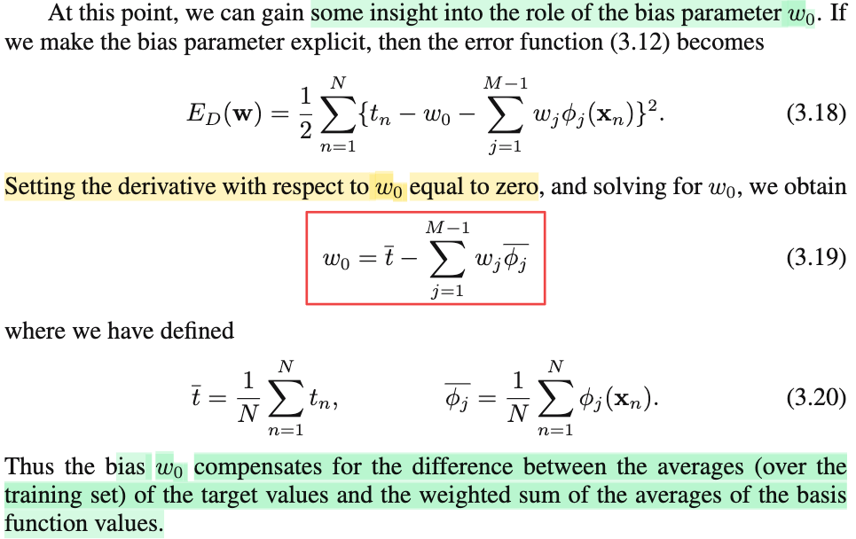</kbd>

> [!NOTE]
> Ý tưởng đoạn này đại khái là muốn xem thử với **w**ML, tức maximum likelihood estimator của **w** thì **w**0 là cái gì?
>
>
>
> Thì lôi cái phần từ đầu tiên của **w**ML ra (chính là w0_ML) sẽ khó hơn là làm theo cách này: Dù gì thì **w**ML cũng là cái có được khi ta giải first condition d/d**w** log Likelihood = 0, và cũng tương đương d/d**w** E_D(**w**) = 0. Và bản chất cái này cũng chỉ là hệ các phương trình ∂/∂wi E_D(**w**) = 0. Trong đó có ∂/∂w0 E_D(**w**) = 0. Nên bằng cách giải ∂/∂w0 E_D(**w**) = 0, ta sẽ có w0_ML (phần tử đầu tiên của **w**ML), từ đó thông qua việc xem nó là gì sẽ giúp ta hiểu về vai trò của w0, vốn là tham số chỉ gắn với hàm Φ0(**x**) = 1, không gắn với non-linear function nào của input **x** nào.
>
>
>
> Tự làm để hiểu: E_D(**w**), còn nhớ, là hàm đặt cho (1/2) Σi (ti - **w**T**Φ**(**x**))^2 = (1/2) Σi (ti - Σj=0:M-1 wj × Φ(**x**i))^2
>
>
>
> Dưới đây để cho gọn Σj tức là Σj=1:M-1, Σi tức là Σi=1:N
>
>
>
> = (1/2) Σi {ti - w0 × Φ0(**x**i) - Σj wj × Φj(**x**i)}^2
>
>
>
> = (1/2) Σi {ti - w0 × 1 - Σj wj × Φj(**x**i)}^2 (Φ0(**x**i) = 1, nhớ không)
>
>
>
> = (1/2) Σi {ti - w0 - Σj wj × Φj(**x**i)}^2
>
>
>
> d/dw0 = 0
>
>
>
> ⇔ d/dw0 \[(1/2) Σi {ti - w0 - Σj wj × Φj(**x**i)}^2\] = 0
>
>
>
> ⇔ (1/2) (-2) (Σi ti - Σi w0 - Σi\[Σj wj × Φj(**x**i))\] ) = 0
>
>
>
> ⇔ (Σi ti - Σi w0 - Σi\[Σj wj × Φj(**x**i))\] ) = 0
>
>
>
> ⇔ Σi w0 = Σi ti - Σi\[Σj wj × Φj(**x**i))\]  
>
>
>
> ⇔ N w0 = Σi ti - Σj \[wj × Σi Φj(**x**i)\]  
>
>
>
> ⇔ w0 = (Σi ti)/N - Σj \[wj × (1/N)Σi Φj(**x**i)\]  
>
>
>
> Đặt (Σi ti)/N là t^ (trong sách là t bar) là trung bình của các t
>
>
>
> và (1/N)Σi Φj(**x**i) là Φj^, là trung bình của các phần tử j của các vector Φ(**x**i). Mà Φ(**x**) như đã nói, là basis function, là function mà ta dùng để tạo ra một set các non-linear feature, nên Φj(**x**) có thể coi là feature thứ j của sample **x**. Vậy (1/N)Σi Φj(**x**i) là trung bình các feature thứ j
>
>
>
> Như vậy Σj \[wj × (1/N)Σi Φj(**x**i)\] sẽ là weighted sum của các trung bình của các feature.
>
>
>
> Nói cụ thể cho dễ hiểu, giả sử x1 là diện tích nhà, x2 là chiều dài nhà, x3 là số lầu,...thì Φ1(**x**) là quy mô căn nhà (là hàm phi tuyến nào đó dựa trên các feature gốc x1, x2,..., Φ2(**x**) là ưu thế về vị trí của căn nhà (cũng là hàm phi tuyến nào đó của feature gốc). Khi đó (1/N) Σi Φ1(**x**i) sẽ là trung bình các quy mô căn nhà trong mọi căn nhà (**x**i) trong dataset, (1/N) Σi Φ2(**x**i) là trung bình ưu thế về vị trí của mọi căn nhà. Và Σj \[wj × (1/N)Σi Φj(**x**i)\] = w1 × (1/N) Σi Φ1(**x**i) + w2 × (1/N) Σi Φ2(**x**i) + ...chính là tổng tất cả các trung bình trên, nhưng có trọng số là w1,w2,....
>
>
>
> Do đó, từ việc w0 = (Σi ti)/N - Σj \[wj × (1/N)Σi Φj(**x**i)\]  cho thấy rằng mô hình sẽ học ra cách (nói vậy là vì, w0 ta đang xét chính là maximum likelihood estimator của w0, là thứ mà ta tìm được để tối ưu likelihood) để BÙ ĐẮP (compensate) cho sự thiếu hụt giữa trung bình target value (t^) và weighted sum của trung bình các basis function values.

> [!TIP]
> **🤖 AI Feedback** — ✅ Score: **100/100**
>
> Đoạn ghi chú này trình bày việc dẫn xuất w0 một cách xuất sắc, chi tiết và chính xác, phù hợp hoàn toàn với nội dung hình ảnh. Đặc biệt, phần giải thích trực quan về các thành phần của w0 giúp người đọc dễ dàng nắm bắt vai trò của tham số này.

 

- **Maximum Likelihood Noise Precision β_ML**

<kbd>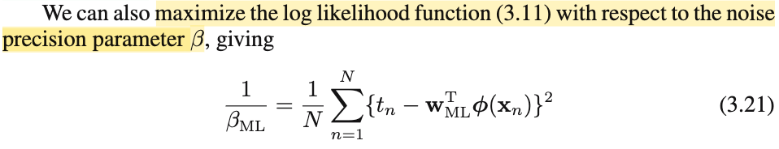</kbd>

<kbd>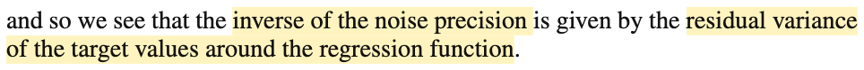</kbd>

> [!NOTE]
> Ok, nãy giờ là ta chỉ nói về **w**ML, đương nhiên tham số mô hình còn có β - precision của distribution Normal mà ta assump rằng noise ε = T - y(**w**,**x**) sẽ theo phân phối này.
>
>
>
> Để tìm βML, thì cũng chỉ đơn giản là cho đạo hàm của hàm log likelihood (**w** ở đây đều là **w**ML) đối với β = 0:
>
>
>
> d/dβ \[(N/2) ln(β) -( N/2) ln(2π) - β E_D(**w**)\] = 0
>
>
>
> ⇔ d/dβ \[(N/2) ln(β)\] - d/dβ \[β E_D(**w**)\] = 0
>
>
>
> ⇔ d/dβ \[(N/2) ln(β)\] = d/dβ \[β E_D(**w**)\]
>
>
>
> ⇔(N/2) (1/β) = E_D(**w**)
>
>
>
> ⇔ 1/β = 2E_D(**w**)/N = (2/N) (1/2) Σi (ti - Σj=0:M-1 wj × Φj(**x**i))^2
>
>
>
> = (1/N) Σi (ti - Σj=0:M-1 wj × Φj(**x**i))^2
>
>
>
> Và đây chính là (1/β)ML (tức maximum likelihood estimator của 1/β, hay cũng là σ^2_ML)
>
>
>
>  Chỗ này nói rõ chút: Nên nhớ từ đầu đến giờ ta dựa trên assumption là noise, cũng là residual = phần dư, phần sai lệch của T sau khi trừ đi y(**w**,**x**), sẽ là random variable tuân theo normal(0, 1/β), và đièu này cũng đồng nghĩa rằng ta đang assume T \~ normal(y(**w**,**x**), 1/β). Với 1/β là ngịch đảo của precision, cũng chính là variance. Nên giờ khi ta dùng maximum likelihood esimator approach để tìm esimator cho 1/β (1/β)ML, thì cũng chính là maximum likelihood estimator cho variance của Normal distribution noise.
>
>
>
> Và kết quả cho ra (1/β)ML = σ^2_ml = (1/N) Σi (ti - Σj=0:M-1 wj × Φj(**x**i))^2, thì cho ta gì?
>
>
>
> kết quả này là trung bình bình phương residual, nhưng nhìn theo góc nhìn thống kê thì sẽ thấy nó chính là sample variance của ε
>
>
>
> Đầu bài ta đã nói rằng T là random variable, nên các data sample hình thành một bộ các random variable T1,T2,...TN. Và tương ứng với mỗi T ta có εi = Ti - y(w, **x**i), cũng là các random variable.
>
>
>
> Như vậy ta cũng có một bộ ε1, ε2,...εN, làm thành một sample, có distribution đều là N(0, 1/β). Và ε1,...εN độc lập, nên theo khung xác suất thống kê thì ta đang có một random sample size N ε1, ..εN iid independent identically distribution, có cùng distribution N(0, 1/β)
>
>
>
> Variance, Var(ε) = E\[ε^2\] - \[E(ε)\]^2
>
>
>
> Nhưng vì residual ε có mean là 0: E\[ε\] = 0, nên: Var(ε) = E\[ε^2\]
>
>
>
> và (1/N) Σi (εi^2) có thể **coi như một giá trị thực nghiệm ước lượng mức biến động của ε**
>
>
>
> và mang ý nghĩa cho thấy trung bình độ biến động của Ti xung quanh mean y(**x**i,w)
>
>
>
> Và cái này giúp ta hiểu vì sao mr Bishop nói "we see that the inverse of the noise precision is given by the residual variance of the target values around the regression function"

> [!TIP]
> **🤖 AI Feedback** — ✅ Score: **98/100**
>
> Phần giải thích của bạn cực kỳ chi tiết, chính xác và đào sâu vấn đề một cách xuất sắc, từ việc trình bày bước đạo hàm đến việc làm rõ ý nghĩa thống kê của 1/β_ML và liên hệ chặt chẽ với câu kết luận trong sách. Để bản ghi chú hoàn hảo hơn, bạn có thể nhắc lại định nghĩa đầy đủ của E_D(w) ngay từ đầu phần đạo hàm để người đọc dễ theo dõi hơn.

 

## 3.1.2 Geometry of least squares

<kbd></kbd>

> [!NOTE]
> Qua góc nhìn hình học, phần lớn đều đã hiểu (trong mấy note trước đã có nói rồi).
>
>
>
> Đầu tiên, xét vector **t** = (t1,....tN), tức là tất cả target observation, sẽ là vector trong N-dimensional sapce.
>
>
>
> Thế thì hàm basis Φj() j = 0,1,...M. Ta còn nhớ là gì không? → là hàm dùng để tạo "tính chất phi tuyến", khiến cho mô hình y(**w**, **x**) = w0 Φ0(**x**) + w1 Φ1(**x**) + .. wM-1 ΦM-1(**x**) trở thành hàm phi tuyến theo **x**, (và vẫn tuyến tính theo **w**). Và nếu gom Φ1(**x**1), Φ1(**x**2),...Φ1(**x**N), thành vector **Φ**1 thì dĩ nhiên vẫn là một N-dimensional vector, nên nó cũng nằm trong vector space với vector **t** ở trên.
>
>
>
> (nói thêm chút, còn nhớ, ta define matrix **Φ**, chính là matrix có các hàng, là vector **Φ**(**x**i) = \[Φ0(**x**i), Φ1(**x**i), Φ2(**x**i),...ΦM-1(**x**i)\]. Nên vector **Φ**1 nói trên là cột 1 của matrix này. Tóm lại, các cột của design matrix **Φ** là các cột **Φ**0, **Φ**1,...**Φ**M-1. Với **Φ**j = \[Φj(**x**1), Φj(**x**2),...Φj(**x**N)\]T. Còn các hàng là vector Φ(**x**i) = \[Φ0(**x**i), Φ2(**x**i),...ΦM-1(**x**i))
>
>
>
> Thế thì, như vậy ta có M cột của design matrix, là các R^N vector **Φ**0, **Φ**1,...**Φ**M-1. Theo MIT 1806 đã học, với M vector thì trong trường hợp chúng đậc lập thì cùng lắm chỉ tạo một basis của một M-dimensional subspace của R^N thôi, cũng là nói chúng cùng lắm là chỉ span được một M-D subspace của R^N thôi. Nhưng nếu không độc lập, thì thậm chí dimension của span {**Φ**0, **Φ**1,...**Φ**M-1} còn nhỏ hơn M. Trong sách gs gọi subspace này là S. (dù ông nói nó có dimensionality là M, nhưng nhờ MIT 1806, mình hiểu điều này chỉ xảy ra khi **Φ**0, **Φ**1, **Φ**2,...**Φ**M-1 linearly independent như nói trên)
>
>
>
> Rồi, tiếp theo ta đặt vector **y** = \[y(**x**1, **w**), y(**x**2, **w**),...y(**x**N, **w**)\]T, đương nhiên, nó cũng là một N-dimensinal vector, cũng nằm trong R^N. Tuy nhiên, ta còn có thể thấy rằng:
>
>
>
> y(**x**1, **w**) = **w**T**Φ**(**x**1), y(**x**2, **w**) = **w**T**Φ**(**x**2),..
>
>
>
> nên với việc đặt design matrix **Φ** là matrix có các hàng là **Φ**(**x**1), **Φ**(**x**2),..như trên đã nói thì ta sẽ có thể thấy theo góc nhìn thứ nhất nhân matrix với vector được học trong MIT 1806 nói rằng Ax = b thì phần tử bi là dot product của hàng i của A và vector x, từ đó ta thấy **y** = **Φw**. Và từ đó, tiếp tục dùng góc nhìn thứ hai của việc nhân matrix với vector: Ax là linear combination các cột của A bởi hệ số là phần tử của x, thì ta lại thấy y chính là linear combination các cột **Φ**0, **Φ**1,...**Φ**M-1, bởi bộ hệ số là w0, w1, ...wM-1. Và điều này, theo định nghĩa của linear combination, sẽ có nghĩa là **y** phải nằm trong column space của **Φ**, là cái subspace span bởi **Φ**0, **Φ**1,...**Φ**M-1, chính là S ở trên (nên gs Bishop nới nói y có thể nằm anywhere trên M-dimensional subspace S này)
>
>
>
> Vậy thì sum of square error có công thức là = Σi \[ti - y(**w**, **x**i)\]^2, dễ thấy với việc có vector **t** và vector **y**, thì đây chính là ||**t** - **y**||^2, là squared L2 norm, cũng còn chính là bình phương Euclidean distance giữa **t** và **y**.
>
>
>
> Từ đó góc nhìn hình học này giúp ta nhìn nhận việc muốn đi giảm thiểu cái sum of squared error chính là muốn đi minimize cái L2 distance giữa **t** và **y**.
>
>
>
> Thế thì, vấn đề là **y** = **Φw**, là vector nằm đâu đó trong C(**Φ**) = S = span{**Φ**0,..**Φ**M-1}, và với các giá trị w khác nhau thì ta có có vector **y** chạy vòng vòng trong cái subspace này. Trong khi đó **t** thì sao? nó là R^N vector, là cái vector space mẹ, chứa cái subspace S, vì đang nói M < N, nên S không thể lấp đầy R^N này. Thành ra sẽ có hai trường hợp: **t nằm trong S** **hoặc không**. Do đó cái bài toán này chính là: tìm điểm nằm trong S sao cho gần với t nhất. Nói tìm điểm thực chất là tìm bộ hệ số w0,...wM-1 để dùng nó làm linear combination các cột của **Φ**, giúp ta có **y** = **Φw** gần với **t** nhất. Và đây chính là đi tìm hình chiếu của **t** lên C(**Φ**), hay S.
>
>
>
> Nói thêm, dĩ nhiên nếu hên, **t** nằm sẵn trong S, thì hình chiếu của **t** lên S là chính nó, khi đó việc minimize ||**t** - **y**||^2 sẽ có thể giảm cái này về 0, và solution đơn giản chỉ là nghiệm của **Φw** = **t**.
>
>
>
> Còn nếu **t** không nằm trong S, thì cái không thể giảm ||**t** - **y**||^2 về 0 được, mà giá trị nhỏ nhất chỉ là phần dư residual ||**t** - **p**||^2 với **p** là hình chiếu của **t** lên S. Solution của bài toán lúc này là nghiệm của **Φw** = **p**.
>
>
>
> Như mấy bữa đã từng nói rồi, dùng đặc điểm là phần dư **r** = **t** - **p** vuông góc với S, hay C(**Φ**), thì điều này có nghĩa r thuộc cái subspace mà complement orthogonal với C(**Φ**), chính là left nullspace: N(**Φ**T) (trong MIT 1806 đã học có 2 cặp subspace orthogonal complement là column space C(A) với left nullspace N(AT), và row space C(AT) với nullspace N(A)), từ đó ta có **Φ**T**r** = 0 ⇔ **Φ**T(**t** - **p**) = 0 ⇔ **Φ**T**t** = **Φ**T**p**. Tới đây ta thay **Φw** = **p** vào thì có **Φ**T**t** = **Φ**T**Φw**, chính là normal equation. Để rồi nếu **Φ** full column rank (cũng là các cột Φ0,...ΦM-1 của chúng độc lập, cũng là dimension của S là M) thì khi đó **Φ**T**Φ** full rank, ta có thể có **w** = (**Φ**T**Φ**)^-1 **Φ**T**t**. Và còn nhớ cái này **chính là** **w**ML, nơi ta giải phương trình gradient của hàm ln likelihood = 0 bữa trước.
>
>
>
> Chú ý là dù trong case t ∈ S để w là solution của **Φw** = **t, thì ta vẫn có thể nhân hai vế cho Φ**^(+), để có w = **Φ**^(+)**t** (chỉ là trong case này residual r = 0)
>
>
>
> Vậy thì ở đây gs Bishop nói đại ý là ta có thể "xác nhận" điều này (tức là **xác nhận việc giải bài toán minimize sum squared error chính là bài toán projection**) bằng cách lôi cái solution ra: **w**ML, để thấy nó chính là solution của bài toán tìm **w** giúp ta có được p là hình chiếu của **t** lên S.
>
>
>
> Và cái này thì mình đã xác nhận bên trên rồi, khi solution của bài toán projection là **w** = (**Φ**T**Φ**)^-1 **Φ**T**t** có được **bằng cách lập luận đại số tuyến tính**, thì **cũng chính là wML có được bằng cách giải điều kiện tối ưu bậc nhất** - cho gradient của hàm log likelihood bằng 0 bữa trước đó.
>
>
>
> Đoạn cuối, ông nói đại khái là việc giải nghiệm trực tiếp có thể gặp khó khăn khi **Φ**T**Φ** gần singular. Là sao?
>
>
>
> → Cũng dễ hiểu, vì cái công thức **w** = (**Φ**T**Φ**)^-1 **Φ**T**t, như đã nói trên, yêu cầu Φ**T**Φ** phải full rank / non-singular / invertible. Nên nếu **Φ**T**Φ** không invertible thì dĩ nhiên ko thể dùng công thức này.
>
>
>
> Hơn nữa, nhờ đọc Nocedal mình cũng được biết, giả sử ngay cả khi **Φ**T**Φ** invertible thì việc tính ra w cũng không phải là ta đi tính **Φ**T**Φ**, rồi tính inverse của nó (**Φ**T**Φ**)inv, sau đó nhân với **Φ**T**t**. Vì làm vậy rất tốn kém.
>
>
>
> Thay vào đó, thật ra là ta sẽ giải normal equation **Φ**T**Φw** = **Φ**T**t** theo các cách khác: Cái này chính là trong chap 10 của Numerical Optimization của J. Nocedal, nói rằng, nếu bài toán không quá lớn (large scale), ta có thể dùng các direct algorithm, dựa trên đại số tuyến tính, như các phương pháp dựa trên Cholesky factored, QR factoed, SVD, mỗi cái có ưu nhược điểm khác nhau. Còn nếu bài toán quy mô lớn, thì phải dùng trùm cuối - thuật toán Conjugate Gradient.
>
>
>
> Vậy thì ở đoạn này mình nhận ra chính là gs Bishop nói đến trường hợp đó, khi **Φ**T**Φ** gần singular, tức tồn tại các eigenvector rất nhỏ ≈ 0, sẽ khiến không thể giải bằng Cholesky factor based method được. Khi đó ta có thể giải bằng thuật toán dựa trên SVD
>
>
>
> (có nghĩa là gs Bishop ko nhắc đến, nhưng nhờ học Nocedal, nên mình biết chính xác ông nói SVD, ngoài ra còn biết về QR factor và conjugate gradient nữa)
>
>
>
> Và cũng nhờ MIT 1806 nên mình cũng hiểu đoạn ông Bishop nói vì sao có khi **Φ**T**Φ** gần singular. Đại khái là, như đã nói trên rằng khi các cột của **Φ**, độc lập, thì **Φ**T**Φ** sẽ full rank / invertivle / non-singular. Vậy thì ngược lại, nếu chúng phụ thuộc thì **Φ**T**Φ** sẽ singular. mà cột phụ thuộc là sao → tức là có thể xảy ra tình trạng có cột **Φ**i nào đó **CÓ THỂ ĐƯỢC TẠO RA BỞI MẤY CỘT KHÁC**, ví dụ **Φ**1 = 5**Φ**2, hoặc Φ1 = **Φ**2 + 3**Φ**5. Ví dụ như **Φ**1 = 5**Φ**2, thì trên không gian R^N, hai vector trùng nhau. Lúc này matrix Φ tồn tại nullspace vector khác 0, và cũng chính là tồn tại eigenvalue = 0.
>
>
>
> Vậy thì gần singular là sao? → Thì là khi ví dụ như Φ1 không bằng α Φ2 nhưng cũng rất gần bằng α Φ2, dẫn đến trong không gian, hai vector gần như trùng phương. Và eigenvalue gần bằng 0. Đó chính ý nghĩa của từ co-linear.
>
>
>
> Và gs nói hiện tượng này cũng ko phải là ít xảy ra trong các dataset thực, cũng như việc có thêm các regularization term sẽ đảm bảo ko thể xảy ra hiện tượng này

> [!TIP]
> **🤖 AI Feedback** — ✅ Score: **98/100**
>
> Phân tích cực kỳ sâu sắc và chi tiết, không chỉ nắm vững nội dung bài đọc mà còn mở rộng kiến thức từ đại số tuyến tính (MIT 1806) và tối ưu hóa số (Nocedal) để làm rõ từng khái niệm. Khả năng liên kết các ý tưởng phức tạp, đặc biệt là về phương trình chuẩn và các vấn đề tính toán liên quan đến ma trận gần suy biến, là rất ấn tượng và mang lại giá trị gia tăng đáng kể. 

 

## 3.1.3 Sequential Learning

<kbd>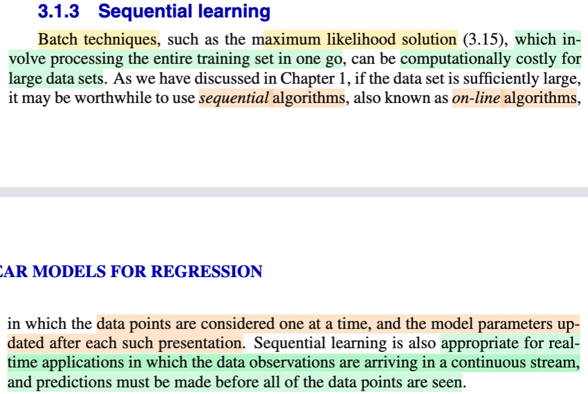</kbd>

<kbd>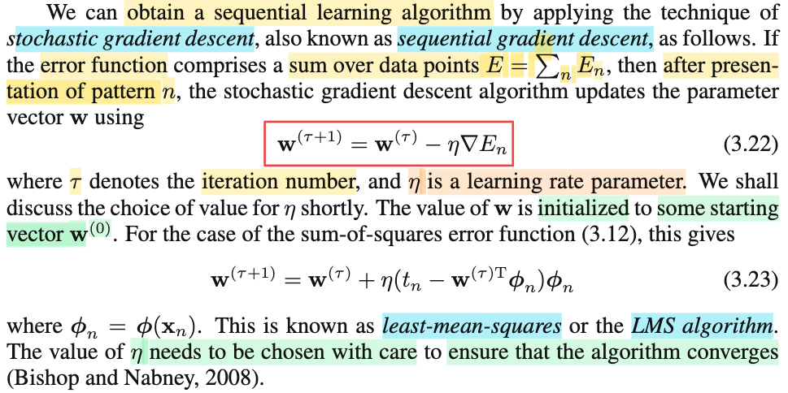</kbd>

> [!NOTE]
> Phần này đại khái là vầy:
>
>
>
> Đầu tiên ông maximum likelihood solution là một dạng của batch technique, mình hiểu đại ý là, nói về kĩ thuật mà ta dùng một gói data (observation) để mà "làm" (ví dụ như với maximum likelihood, cơ bản là ta tìm θ giúp maximile hàm likelihood L(θ|**x**), và cái hàm này thì được define bởi f(**x**|θ), tức joint pdf của data tại các observation có được, thì dĩ nhiên ta cần có một batch / gói, các observation)
>
>
>
> Thế thì ông nói tiếp đại ý rằng, có khi việc xử lí một lần toàn bộ cái bộ dataset này sẽ rất tốn kém, hoặc cũng có khi data có được không phải có liền một cục, mà đến từng cái một. Thì khi đó, trong chapter 1 ta đã học một cái gọi là sequential learning, giúp ta có thể thực hiện việc update param từ từ một cách liên tục khi có thêm data mới.
>
>
>
> Mình hiểu cái này tuy rất giống như có điểm phải phân biệt với iterative method trong tối ưu hóa. Nó giống ở chỗ ta cũng update tham số từng bước, nhưng nó khác ở chỗ cái này là **do data ta phải xài từng batch data do phải chia nhỏ để giảm chi phí tính toán hoặc do data đến theo từng batch** còn trong các thuật toán tối ưu, việc update từng bước là do **ta ko biết cách nào, hoặc quá tốn kém để nhảy một phát tới đích (solution) ngay**
>
>
>
> Nói rõ hơn, với bối cảnh tối ưu hóa, thì ta có 1 cục data, và có khả năng xử lí hết một lần, nhưng vì hàm mục tiêu quá phức tạp, ta không thể có một closed form solution (ví dụ như normal equation solution của bài toán least square này) để mà một phát tính ra ngay nghiệm của bài toán, thành ra ta phải dùng các cach tiếp cận iterative, như line search và trust region method để mà dò dẫm từng bước đi tới đích.
>
>
>
> Trái ngược với bối cảnh tối ưu hóa, ở đây, ta có thừa khả năng tính một phát ra nghiệm tối ưu, tức là có closed form solution, nhưng ngặt nỗi data lại đến từ từ từng cái. Mà dù rằng ta có thể làm theo cách sau: Cứ mỗi khi có data thêm, thì ta cập nhật bộ data đó, rồi đi tính closed form solution lại. Tuy nhiên, cách đó cũng không giúp giải quyết được vấn đề là ta tuy có closed form solution nhưng không thể tính một phát một bằng cách xử lí toàn bộ data, ví dụ ram chứa ko hết. Thành ra phải dùng kiểu iterative này.
>
>
>
> ---
>
>
>
> Vậy thì công thức update 3.22 là sao?
>
>
>
> Mình hiểu: công thức này rất đơn giản
>
>
>
> Ví dụ như data thứ n vừa đến", đồng nghĩa ta có data set (**x**1,...**x**n), (t1,...tn). Đặt ra bài toán:
>
>
>
> minimize over **w** f(**w**) = error En(**w**) = (1/2) (tn - **w**TΦ(**x**n)\]^2
>
> \
> Có nghĩa là hàm objective chỉ là bình phương difference giữa tn và **w**TΦ(**x**n).
>
>
>
> Và cơ bản là ta đang dùng một dạng steepest descent algorithm đơn giản: đứng tại vị trí hiện tại **w**\_τ (tức giá trị **w** hiện có), ta sẽ đi theo hướng dốc nhất (steepest descent direction) = - ∇f(**w**\_τ), và đi theo hướng này với **step size η**, để đến được điểm tiếp theo:
>
>
>
> **w**\_(τ+1) = **w**\_τ + η \[- ∇f(**w**\_τ)\]
>
>
>
> ⇔ **w**\_(τ+1) = **w**\_τ - η ∇f(**w**\_τ)
>
>
>
> Vì sao - ∇f(**w**\_τ) là hướng dốc nhất thì nhờ học Boyd hay Nocedal thì đã biết rồi.
>
>
>
> Thế thì ∇f(**w**\_τ) là gradient của objective function evaluate tại **w**\_τ, với objective function = En = (1/2) \[tn - **w**TΦ(**x**n)\]^2 thì:
>
>
>
> ∇En = (1/2) d/d**w** \[tn - **w**TΦ(**x**n)\]^2
>
>
>
> = (1/2) d/d\[tn - **w**TΦ(**x**n)\] \[tn - **w**TΦ(**x**n)\]^2 . d/d**w** \[tn - **w**TΦ(**x**n)\] (chain rule)
>
>
>
> = \[tn - **w**TΦ(**x**n)\] . d/d**w** \[- **w**TΦ(**x**n)\]
>
>
>
> = \[tn - **w**TΦ(**x**n)\] . \[-Φ(**x**n)\]
>
>
>
> = - \[tn - **w**TΦ(**x**n)\] Φ(**x**n)
>
>
>
> Ráp vào công thức:
>
>
>
> **w**\_(τ+1) = **w**\_τ - η ∇f(**w**\_τ)
>
>
>
> ⇔ **w**\_(τ+1) = **w**\_τ - η \[- \[tn - **w**TΦ(**x**n)\] Φ(**x**n)\] |**w**=**w**\_τ
>
>
>
> ⇔ **w**\_(τ+1) = **w**\_τ + η\[tn - **w**\_τTΦ(**x**n)\] Φ(**x**n)\]
>
>
>
> đây chính là 3.23
>
>
>
> Và thuật toán này gọi là least-mean-squares, hay LMS.
>
>
>
> Mình nhờ học Nocedal nên biết cái này chỉ là steepest gradient descent, và do đó cũng hiểu việc chọn η rất quan trọng. Lí do là vì, đi theo hướng steepest chỉ đảm bảo ta sẽ đi xuống nếu như có thể kiểm soát bước nhảy trong phạm vi nào đó, vì về cơ bản, cái này dựa trên linear approximation.
>
>
>
> Trong Nocedal mình cũng được biết các thuật toán để chọn bước nhảy như exact line search hoặc backtracking line search.
>
>
>
> Nhưng trong machine learning như ở đây vài bữa gs sẽ nói về cái này kĩ hơn.

> [!TIP]
> **🤖 AI Feedback** — ✅ Score: **98/100**
>
> Phân tích của bạn rất sâu sắc và chính xác, đặc biệt là việc làm rõ sự khác biệt giữa học tuần tự và các phương pháp tối ưu hóa lặp, cùng với việc đạo hàm công thức (3.23) một cách hoàn hảo. Bạn thể hiện khả năng kết nối kiến thức và hiểu biết vững chắc về các khái niệm.

 

