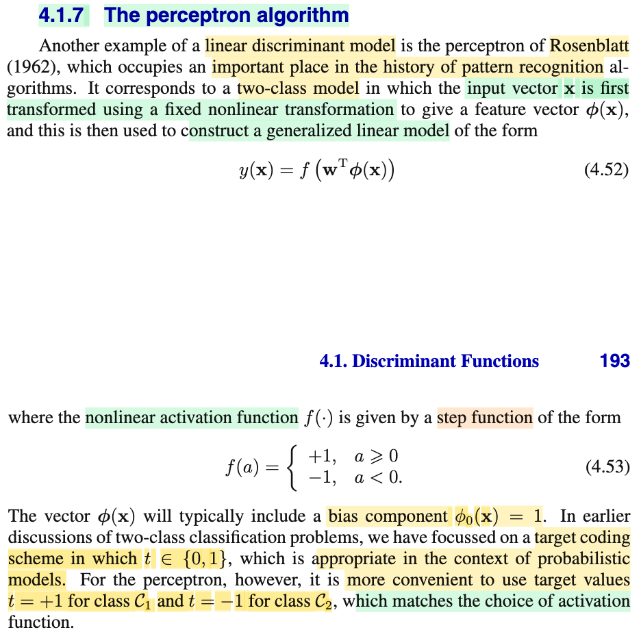
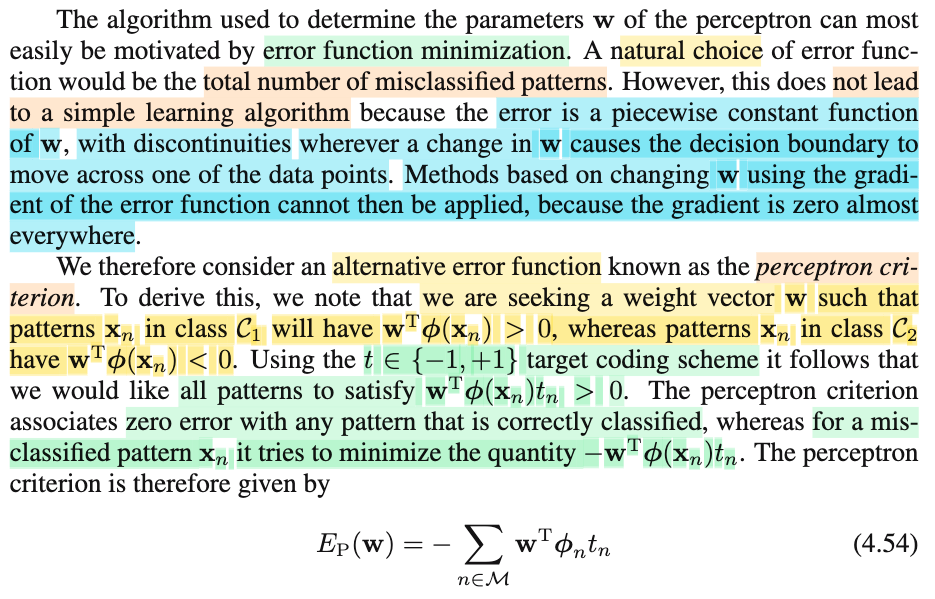
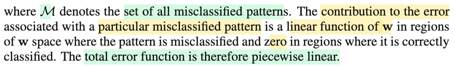

# Untitled

📊 **Progress:** `2` Notes | `3` Screenshots | `2` AI Reviews

---

## Thuật toán Perceptron

<kbd></kbd>

> [!NOTE]
> Phần này nói về thuật toán perceptron nổi tiếng, mà gs Bishop cũng nói nó đóng vai trò quan trọng trong lịch sử của lĩnh vực pattern recognition.
>
>
>
>  Đầu tiên cần để ý, đây là thuật toán dành cho bài toán phân loại nhị phân.
>
>
>
> Và cách làm của nó như sau:
>
>
>
> Nó sẽ dùng một non-linear function Φ(.) để transform input 𝐱 thành nonlinear feature Φ(𝐱), sau đó xây dựng generalized linear model: y(𝐱) = f(𝐰ᵀΦ(𝐱)) với f(a) = +1 khi a ≥ 0 và -1 khi a &lt; 0.
>
>
>
> Dừng lại xíu, để nhớ lại vì sao lại gọi là generalized linear model?
>
>
>
> Đại khái là vì, cái ta đang dùng, 𝐰ᵀΦ(𝐱), là hàm tuyến tính đối với 𝐰. Nhưng để cho ra giá trị dự đoán là các class rời rạc, hoặc ra con số trong khoảng \[0,1\] để  thể hiện một phân phối xác suất, thì người ta bọc nó trong hàm activation function: f(𝐰ᵀΦ(𝐱)), và mô hình kiểu này gọi là generalized linear model.
>
>
>
> Do đó nên hiểu generalized linear model, có thể dự đoán ra giá trị liên tục từ 0, tới 1, hoặc ra một trong các giá trị rời rạc nào đó thể hiện các class.
>
>
>
> Như vậy thì discriminant function mà bữa giờ mình học có thể coi là generalized linear model nhưng ở dạng đơn giản vì ta chỉ dùng hàm y(𝐱) = 𝐰ᵀ𝐱 + w0, có thể coi như f() là identity function.
>
>
>
> ---
>
>
>
> Một điểm nữa, là bữa giờ ta dùng cách mã hóa target của bài toán binary classification bằng cách gán t = 0 hoặc 1. Nhưng ở perceptron, ta sẽ dùng hai giá trị 1 hoặc -1.

> [!TIP]
> 🤖 **AI Check** — 🟢 Pass — ✅ **95/100** · ✓ Move on
>
> Ghi chú nắm rất chắc và chính xác các ý chính từ giáo trình, từ cấu trúc mô hình, hàm kích hoạt đến quy ước gán nhãn của Perceptron.
>
> **✓ Strengths**
> - Nắm rõ bản chất của Perceptron là mô hình tuyến tính tổng quát (generalized linear model) áp dụng hàm kích hoạt dạng bước nhảy (step function) lên không gian đặc trưng phi(x).
> - Hiểu đúng và giải thích mạch lạc lý do vì sao Perceptron chuyển sang dùng hệ mã hóa nhãn target là {-1, +1} thay vì {0, 1} như các mô hình xác suất trước đó.
> - Liên hệ tốt với các kiến thức trước đó về discriminant function khi coi f() là hàm đồng nhất (identity function).
>
> **💡 Deeper notes**
> - Trong sách, Bishop nhấn mạnh phép biến đổi phi(x) là 'fixed nonlinear transformation' (phép biến đổi phi tuyến cố định, không học tham số của phi như mạng nơ-ron sâu sau này), đây là điểm phân biệt quan trọng giữa Perceptron cổ điển và các mạng nơ-ron hiện đại.
> - Thành phần bias w0 thường được tích hợp ngầm vào vector w bằng cách đặt đặc trưng bias phi_0(x) = 1, giúp biểu thức gọn thành w^T phi(x).

**🔗 See also:** [Generalized Linear Models](./40_linear_model_for_classification.md#node-mefj30s)

 

### The Perceptron Criterion

<kbd></kbd>

<kbd></kbd>

> [!NOTE]
> Cùng tìm hiểu đoạn này: Đầu tiên đại ý là thuật toán perceptron được motivated bởi việc giảm error function. (cái này khiến ta liên tưởng đến least square classfication, cũng là tìm 𝐰 để giảm error function, với error là bình phương khác biệt của dự đoán và target)
>
>
>
> Tuy nhiên trong perceptron, error không phải sum squared error. Và đại ý là khi lựa chọn error cho bài toán classfication, một lựa chọn tự nhiên là dùng tổng số case bị misclassfied (tức bị phân loại sai). Nhưng nếu dùng error này thì hàm số error sẽ là hàm piecewise constant function theo 𝐰. Là sao?
>
>
>
> Hiểu đại khái là thế này, với error dạng này thì về cơ bản nó sẽ mang các giá trị rời rạc: ví dụ 0 ca (misclassfied), 1, 2,....N. Nên rõ ràng hàng số này sẽ là hàm bậc thang vì nó sẽ không có các giá trị trung gian như 1.1 ca phân loại nhầm. Trong khi đó 𝐰 thì mang giá trị liên tục, khi thay đổi giả sử từ rất tệ 𝐰 = 𝐰0 khiến hàm phân loại sai bét, có số misclassifed pattern = N, thì để cải thiện, 𝐰  sẽ phải thay đổi cho đến khi đạt 𝐰1 giúp số ca misclassified giảm còn N-1, vậy thì trong khoảng từ 𝐰0 tới 𝐰1, hàm error đi ngang (=N), chỉ sau khi qua 𝐰1 thì nó nhảy xuống thành N-1. Tương tự vậy, ta sẽ hình dung ra hàm bậc thang gọi là piece-wise constant (hàm hằng số theo từng đoạn)
>
>
>
> Và vấn đề là, với hàm error như này, thì ta không thể dùng thuật toán gradient descent để điều chỉnh 𝐰 được, đơn giản là vì đạo hàm bằng 0 (và tại những bước nhảy, đạo hàm còn không xác định)

> [!TIP]
> 🤖 **AI Check** — 🟢 Pass — ✅ **95/100** · ✓ Move on
>
> Ghi chú giải thích rất xuất sắc và trực quan lý do tại sao hàm lỗi đếm số lượng mẫu phân loại sai (0/1 loss) lại là hàm hằng từng đoạn (piecewise constant) và tại sao không thể dùng gradient descent để tối ưu nó.
>
> **✓ Strengths**
> - Giải thích trực quan và chính xác khái niệm hàm hằng từng đoạn (piecewise constant) thông qua việc giá trị lỗi chỉ nhận các số nguyên rời rạc trong khi w biến thiên liên tục.
> - Nắm vững lý do cốt lõi khiến gradient descent thất bại trên hàm đếm lỗi: gradient bằng 0 ở hầu hết mọi nơi và không xác định tại các bước nhảy (điểm gián đoạn).
>
> **💡 Deeper notes**
> - Ghi chú mới chỉ phân tích đoạn đầu (tại sao 0/1 loss không dùng được) mà chưa đề cập đến giải pháp thay thế ở nửa sau của văn bản: Perceptron Criterion (hàm lỗi tuyến tính từng đoạn - piecewise linear) với công thức $E_P(\mathbf{w}) = -\sum_{n \in \mathcal{M}} \mathbf{w}^T \phi_n t_n$.

 

