# 10.1 Point Estimation

📊 **Progress:** `30` Notes | `35` Screenshots | `12` AI Reviews

---

## 10.1 Point Estimation

**🔗 See also:** [Đánh giá tiệm cận](#node-wapn3q2) · [A0_casella](#node-yf9bh13)

 

## Đánh giá tiệm cận

<kbd>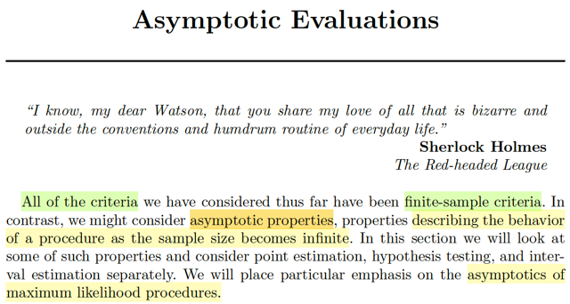</kbd>

> [!NOTE]
> Đại khái là bữa giờ ta xét các hành vi của các quy trình suy luận trong bối cảnh là **finite-sample**, tức là mẫu có số lượng hữu hạn. Chapter này sẽ xem xét tính asymptotic - tính chất mô tả hành vi của quy trình khi kích thước mẫu tăng lên infinite.
>
>
>
> Ta sẽ đánh giá tính chất này của cả 3 quy trình suy luận chính: point estimation, hypothesis testing và interval estimation. Đặc biệt tập trung vào các phương pháp liên quan đến maximum likelihood

**🔗 See also:** [10.1 Point Estimation](#node-2ixm3r0) · [Giá trị tiệm cận](#node-ozps89j)

 

### Giá trị tiệm cận

<kbd></kbd>

> [!NOTE]
> Đại ý là, gs nói sơ về giá trị của cái này là nó khiến việc tính toán trở nên đơn giản hóa khi ta cho phép số lượng mẫu tăng lên indefinite.
>
>
>
> Có những cách đánh giá trở nên bất khả thi khi xét trong bối cảnh finite-sample nhưng trở nên khả thi khi xét trong bối cảnh infinte bao gồm các technique nổi tiếng như bootstrap và M-estimation.

**🔗 See also:** [Đánh giá tiệm cận](#node-wapn3q2) · [Tính nhất quán chuỗi ước lượng](#node-eqqhqsv)

 

#### Tính nhất quán chuỗi ước lượng

<kbd></kbd>

> [!NOTE]
> Xét vấn đề đánh giá tiệm cận với phương pháp suy luận thuộc loại point 
> estimation. Đầu tiên nói về tính chất nhất quán (consistency)
>
>
>
> Thì đại ý là, cái này nó nền tảng đến nỗi nếu một estimator mà inconstent
> thì có thể phải đặt câu hỏi là có đáng để dùng không.
>
>
>
> Thế thì đầu tiên, gs nói trong bối cảnh đánh giá tiệm cận, thật ta ta nên
> hiểu là ta sẽ  **XÉT MỘT CHUỖI CÁC ESTIMATOR**, **CHỨ KHÔNG PHẢI
> LÀ MỘT CÁI ĐƠN LẺ DÙ CHO KHI NÓI THÌ TA NÓI "CONSISTENT 
> ESTIMATOR**" trông có vẻ như là tính chất của một estimator đơn lẻ.
>
>
>
> Tức là hình dung, với sample X1,X2,...Xn thì kiểu như ta dùng cùng một
> quy trình inference để xây dựng một chuỗi các point estimator với kích
> thước mẫu tăng dần. W1(X1), W2(X1,X2),....Wn(X1,...Xn)
>
>
>
> ví dụ, lấy Xbar đi (nó là point estimator cho population mean như đã biết)
>
>
>
> thì ta có Xbar1(X1) = X1, Xbar2(X1,X2) = (X1+X2)/2, Xbar_n(X1,..Xn)
> = (Σi=1:n Xi) / n
>
>
>
> Mình ghi Xbar1(X1) là hoàn toàn hợp lệ, vì gs Casella trong mấy chương
> trước đã nói, Xbar, hay S^2 thật ra chỉ là ghi cho gọn, ghi rõ phải là Xbar(**X**)
> hay S^2(**X**) để thể hiện nó là function của sample **X**

**🔗 See also:** [Giá trị tiệm cận](#node-ozps89j) · [Chuỗi Estimator Nhất Quán](#node-tpmiims)

 

##### Chuỗi Estimator Nhất Quán

<kbd></kbd>

> [!NOTE]
> Ta được học định nghĩa của cái gọi là một chuỗi các estimator có tính nhất 
> quán (consistent) đó là nếu như Wn thỏa: lim n → inf P_θ(|Wn - θ| < ε) = 1.
> Mang ý nghĩa là khi kích thước mẫu tăng lên vô hạn thì xác suất mà estimator
> khác với θ sẽ cực kì nhỏ, hay, xác suất estimator sẽ có giá trị chính xác với θ 
> là cực lớn.
>
>
>
> Dừng lại chút xíu, vì sao P_θ(|Wn - θ| < ε) lại là hàm theo θ?
>
>
>
> À, đơn giản là vì Wn ở đây là estimator của θ, theo định nghĩa, là một function 
> của sample **X** = (X1,...Xn), cũng còn gọi là một statistic. Và vì vậy, nó là một
> random variable, có distribution sẽ phụ thuộc θ luôn. Nên xác suất của |Wn - θ|
> < ε dĩ nhiên là xác suất của một event liên quan đến rv Wn có distribution
> phụ thuộc θ nên đương nhiên nó phải phụ thuộc θ. Đó mới là lí do có chữ θ 
> ở dưới, chứ ko phải là vì θ xuất hiện trong |Wn - θ|

**🔗 See also:** [Tính nhất quán chuỗi ước lượng](#node-eqqhqsv) · [Hội tụ xác suất thống kê](#node-4pzd0to)

 

- **Hội tụ xác suất thống kê**

<kbd>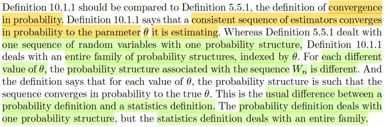</kbd>

> [!NOTE]
> Nhờ hiểu bản chất chữ θ ở dưới chân chữ P (P_θ(..)) nên ta hiểu đoạn này
> như vầy:
>
>
>
> Đại ý là trong định nghĩa 5.5.1, có nói về khái niệm gọi là CONVERGENCE
> IN PROBABILITY: như vầy: Chuỗi các random variable X1,...Xn được gọi là 
> converge in probability to X nếu như lim n → inf P(|Xn - X| < ε) = 1.
>
>
>
> Nhưng ở đây, mình hiểu đoạn này nói vầy:
>
>
>
> Khi mình nói chuỗi X1,...Xn hội tụ xác suất về X, thì thực ra chúng ta đang
> xét trong một distribution f(x|θ) với θ mang giá trị nào đó.
>
>
>
> Còn khi nói chuỗi W1, ...Wn hội tụ xác suất về θ, thì ta đang nói trong bất kì
> một θ nào.
>
>
>
> Có nghĩa là, dù giá trị thực sự của θ là bao nhiêu, thì chuỗi các estimator
> W1,..Wn (nhắc lại, là các point estimator được xây dựng từ cùng một "công
> thức", chỉ là với mẫu X có số lượng tăng dần đến infinite) cũng phải hội
> tụ về đó
>
>
>
> Thành ra trong bối cảnh của chương 10 này, kiểu như với mỗi θ ta sẽ có
> một thành viên cụ thể trong một họ các distribution index bởi θ. Và trong
> họ nào, thì cũng xảy ra hiện tượng W1,...Wn converge về θ hết.

**🔗 See also:** [Chuỗi Estimator Nhất Quán](#node-tpmiims) · [Tính nhất quán của Xbar](#node-yx0vqu9) · [Hội tụ xác suất](#node-ybskg1i)

 

- **Tính nhất quán của Xbar**

<kbd>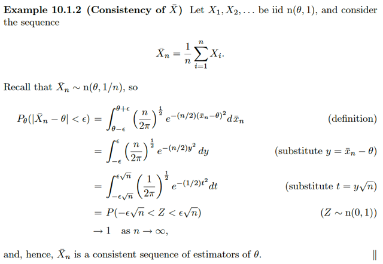</kbd>

> [!NOTE]
> Qua ví dụ này, cho X1,X2,...iid ~ n(θ, 1) và xét chuỗi các sample mean của 
> random sample size n: Xbar_n = (Σi Xi) / n.
>
>
>
> Còn nhớ, ta đã chứng minh, sample mean Xbar của random sample X1,...
> Xn ~ normal(μ, σ^2) sẽ có distribution normal(μ, σ^2/n). Nên ở đây Xbar_n
> sẽ là random variable ~ normal(θ, 1/n)
>
>
>
> Ôn lại mấy bài trước chút xíu: Ta đang bàn về tính consistency của một
> point estimator. Theo định nghĩa là khi khi kích thước mẫu tăng lên đến vô hạn 
> thì ta có một chuỗi các estimator (mỗi cái dựa trên mẫu size tương ứng)
> sẽ converge in probability về θ thể hiện bởi lim n → inf P(|Wn - θ| < ε) = 1
>
>
>
> Vậy ở đây ta xét xác suất P_θ(|Xbar_n - θ| < ε).
>
>
>
> ⇨ P_θ(|Xbar_n - θ| < ε) = P_θ(-ε < Xbar_n - θ < ε)
>
>
>
> = P_θ(-ε√n < Xbar_n - θ/(1/√n) < ε√n)
>
>
>
> Ở trên ta đã nói Xbar_n ~ normal(θ, 1/n) thì theo location scale theorem, 
> (Xbar_n - θ)/(1/√n) sẽ là rv ~ normal(0, 1)
>
>
>
> ⇨ P_θ(-ε√n < Z < ε√n), với Z = Xbar_n - θ/(1/√n), là normal(0,1)
>
>
>
> Vậy thì tới đây dễ thấy khi n → inf, thì P_θ(-ε√n < Z < ε√n) → P_θ(-inf < Z < inf) = 1
>
>
>
> Vậy theo định nghĩa Xbar là consistent estimator của θ

**🔗 See also:** [Hội tụ xác suất thống kê](#node-4pzd0to) · [Điều kiện vững ước lượng](#node-u07qsmw)

 

- **Điều kiện vững ước lượng**

<kbd>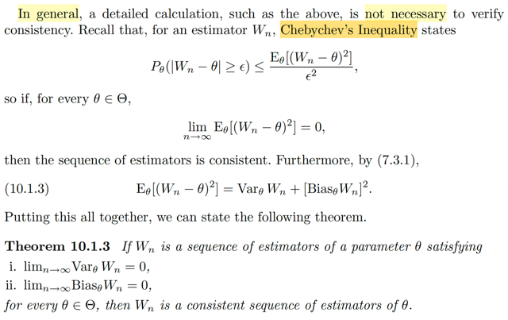</kbd>

> [!NOTE]
> Thế thì đại ý là gs nói rằng thường thì ta cũng chẳng cần phải chứng minh
> một estimator là consistency theo kiểu chứng minh cái nó hội tụ xác suất
> về θ như trong định nghĩa. Mà có cách khác dễ làm hơn như sau.
>
>
>
> Thứ nhất, cần ôn lại cái bất đẳng thức Chebyshev: P(g(X) ≥ r) ≤ Eg(X) / r
>
>
>
> Chứng minh rất dễ, làm lại luôn cho vui: 
>
>
>
> Xét vế trái, Eg(X), dĩ nhiên LOTUS cho ta tính nó bằng:
>
>
>
> Eg(X) = ∫g(x)f(x)dx với f(x) là pdf của X và tích phân là trên toàn miền -inf:inf.
>
>
>
> mà tích phân vốn có ý nghĩa là phần diện tích dưới đồ thị hàm số trong 
> khoảng đang xét.
>
>
>
> nên ∫g(x)f(x)dx ≥ ∫_{x: g(x) > r} g(x)f(x)dx 
>
>
>
> Và vì đang xét trên miền {x: g(x) > r} nên 
>
>
>
>  ∫_{x: g(x) > r} g(x)f(x)dx ≥ ∫_{x: g(x) > r} rf(x)dx = r ∫_{x: g(x) > r} f(x)dx
>
>
>
> và cái này chính là r P(g(X) > r).
>
>
>
> Vậy Eg(X) ≥ r P(g(X) > r) ⇨ P(g(X) > r) < Eg(X) / r.
>
>
>
> Quay lại đây, áp dụng vào random variable (Wn - θ)^2, ta cũng có 
>
>
>
> P_θ((Wn - θ)^2 ≥ ε^2) ≤ E_θ[(Wn - θ)^2] / ε^2.
>
>
>
> ⇔ P_θ(|Wn - θ| ≥ ε) ≤ E_θ[(Wn - θ)^2] / ε^2.
>
>
>
> -----
>
>
>
> Thế thì, tới đây nếu ta chứng minh được Wn thỏa E_θ[(|Wn - θ|)^2] / ε^2 → 0
> khi n → inf thì dĩ nhiên vế trái cũng → 0.
>
>
>
> Từ đó ta chỉ cần quan tâm vế trái E_θ[(Wn - θ)^2]
>
>
>
> Còn nhớ, theo công thức VarX = EX^2 - (EX)^2 ⇨ EX^2 = Var X + (EX)^2
>
>
>
> ⇨ E_θ[(Wn - θ)^2] = Var(Wn - θ) + [E_θ(Wn - θ)]^2
>
>
>
> = Var(Wn) + [E_θ(Wn - θ)]^2   | Var(X + c) = Var(X)
>
>
>
> Và cái E_θ(Wn - θ) = E_θ[Wn] - θ, chính là định nghĩa của Bias(Wn).
>
>
>
> ⇨ E_θ[(Wn - θ)^2] = Var(Wn - θ) + [Bias(Wn)]^2
>
>
>
> Và như vậy dĩ nhiên chỉ cần chứng minh Var(Wn - θ) → 0 và Bias(Wn) → 0
> khi n → inf, thì E_θ[(Wn - θ)^2] sẽ → 0 → P_θ(|Wn - θ| ≥ ε) → 0, và ta có
> consistent sequence of estimator Wn của θ

**🔗 See also:** [Tính nhất quán của Xbar](#node-yx0vqu9) · [Tính nhất quán của Xbar](#node-47kutgs) · [Bất đẳng thức Markov và chứng minh](#node-u9zgfoi)

 

- **Tính nhất quán của Xbar**

<kbd>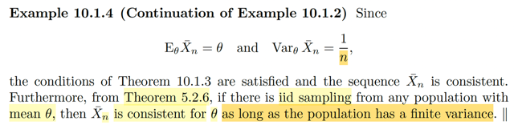</kbd>

> [!NOTE]
> Áp dụng theorem này, quay lại ví dụ hồi nãy thì chỉ cần lập luận như sau:
>
>
>
> Vì Xbar_n ~ normal(θ, 1/n) ⇨ dĩ nhiên E_θ[Xbar_n] = θ → Bias(Xbar_n) = 0
>
>
>
> Và Var(Xbar_n) = 1/n ⇨ khi n → inf dĩ nhiên Var(Xbar_n) → 0
>
>
>
> Vậy theo theorem vừa rồi Xbar_n là consistent.
>
>
>
> HƠn nữa trong ví dụ đó, là cho X1,...Xn ~ normal(θ, 1) thì ta biết Xbar_n
>  ~ normal(θ, 1/n)
>
>
>
> Nhưng theorem 5.2.6 ta đã học, nói rằng X1,...Xn ko nhất thiết là normal
> mà chỉ cần có mean μ và variance hữu hạn σ^2.
>
>
>
> Thì khi đó E[Xbar] cũng là μ và Var(Xbar) cũng bằng σ^/n.
>
>
>
> Và theo đó, Xbar cũng là consistent estimator của μ 
>
>
>
> Như vậy, mọi Xbar_n của một sample iid có population với variance hữu
> hạn sẽ đều là consistent estimator của μ

**🔗 See also:** [Điều kiện vững ước lượng](#node-u07qsmw) · [Tính chất trung bình phương sai mẫu](#node-411jdqg) · [Định lý ước lượng nhất quán](#node-itwfbr1)

 

- **Định lý ước lượng nhất quán**

<kbd>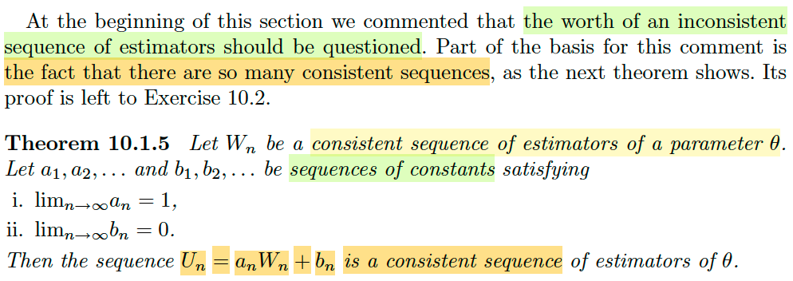</kbd>

> [!NOTE]
> Đại ý là, gs nói rằng, hồi đầu ta đã đề cập đến việc, có đáng để phải để tâm đến một inconsistent estimator không. Thì ở đây ông nói đại ý là, sở dĩ nói vậy là vì theoerem sau đây ta sẽ thấy là, nếu Wm là một consistent estimator thì với chuỗi a1,a2,...và b1,b2,...thỏa điều kiện chuỗi a hội tụ về 1, chuỗi b hội tụ về 0 thì Un = anWn + bn sẽ cũng là một consistent estimator. Ý nói, có rất nhiều consistent estimator, nên ko việc gì phải xem xét một inconsistent

**🔗 See also:** [Tính nhất quán của Xbar](#node-47kutgs) · [Tính nhất quán của MLE](#node-d19dn75)

 

- **Tính nhất quán của MLE**

<kbd>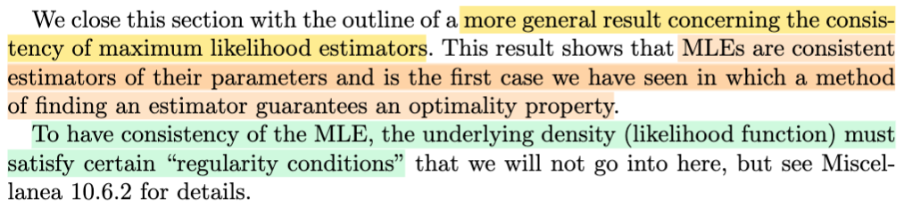</kbd>

<kbd>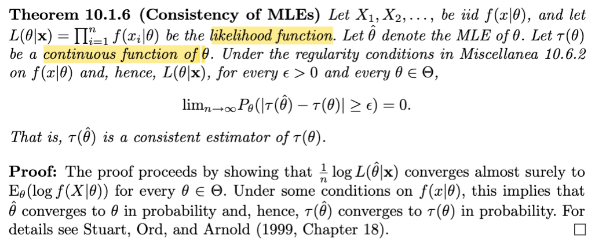</kbd>

> [!NOTE]
> Rồi, cuối cùng, gs nói về một theorem nói rằng, bất kì một ML estimator θ^ml(**X**) của một parameter θ nào cũng là consistent sequence of estimator của θ, và ông nói đây là lần đầu tiên ta gặp một trường hợp trong đó một cách tiếp cận cụ thể lại đảm bảo ta sẽ có được một estimator có được một tiêu chí tối ưu nào đó. (ông nói vậy là vì, cho đến nay, các phương pháp mà ta học để đi xây dựng một estimator chưa đảm bảo là nó sẽ là cái tốt nhất theo các tiêu chí nào đó, thì ở đây, với tiêu chí consistent, thì MLE approach lại đảm bảo là ta sẽ có được một consistent estimator)
>
>
>
> Theorem 10.1.6 nói rằng, nếu hàm likelihood mà thỏa tính chất gọi là "regularity conditions" thì: τ(θ^) sẽ hội tụ xác suất về τ(θ), thể hiện bởi lim n → inf P\_θ(|τ(θ^) - τ(θ)| ≥ ε) = 0 
>
>
>
> Và theo định nghĩa của consistent sequence of estimator rằng: Nếu chuỗi Wn, là estimator của θ hội tụ xác suất về θ thì Wn là consistent sequence of estimator của θ.
>
>
>
> Thì dĩ nhiên ở đâu nếu ta có chuỗi τ(θ^) hội tụ xác suất về τ(θ) thì chuỗi τ(θ^) sẽ là consistent sequence of estimator của τ(θ).
>
>
>
> Quay lại xem kĩ hơn phần chứng minh và regularity condition sau.

**🔗 See also:** [Định lý ước lượng nhất quán](#node-itwfbr1) · [Tính nhất quán và hiệu quả](#node-e2xtw8s) · [Theorem 10.1.12 (Asymptotic efficiency of MLEs)](#node-n1mqtrr) · [10.1.3 Calculations and Comparisons](#node-iwgmm5t) · [Theorem 10.1.6 on Consistent Estimators](#node-cpdjv2x) · [Asymptotic Efficiency of Estimator p̂](#node-ct81g3i)

 

- **Tính nhất quán và hiệu quả**

<kbd>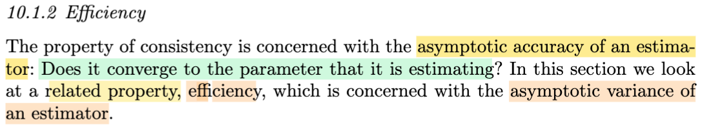</kbd>

> [!NOTE]
> Đại khái là đánh giá chuỗi estimator theo tiêu chí consistency là nói đến tính chất liên quan đến việc estimator đó chính xác đến mức nào trong việc estimate cái param mà nó đang estimate.
>
>
>
> Để rồi, ta sẽ xét một tiêu chí khác, đánh giá estimator ở khía cạnh: asymptotic variance của nó.
>
>
>
> Có nghĩa là, hiểu đại khái là consistency nói đến việc: à, chuỗi estimator (với sample size tăng dần) sẽ có thể ngày càng estimate chính xác giá trị của param không. Thì efficiency sẽ đánh giá rằng khi sample size tăng dần thì mức biến động của estimator sẽ thế nào.

> [!TIP]
> **🤖 AI Feedback** — ✅ Score: **92/100**
>
> Bài làm thể hiện sự hiểu biết sâu sắc và chính xác về các khái niệm consistency và efficiency như được trình bày. Tuy nhiên, cần sử dụng ngôn ngữ học thuật trang trọng hơn thay vì các cụm từ không chính thức để nâng cao chất lượng trình bày.

**🔗 See also:** [Tính nhất quán của MLE](#node-d19dn75) · [Phương sai tiệm cận và giới hạn](#node-62aug4x)

 

- **Phương sai tiệm cận và giới hạn**

<kbd>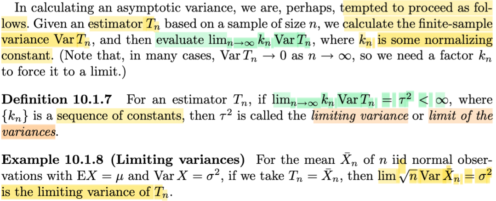</kbd>

<kbd>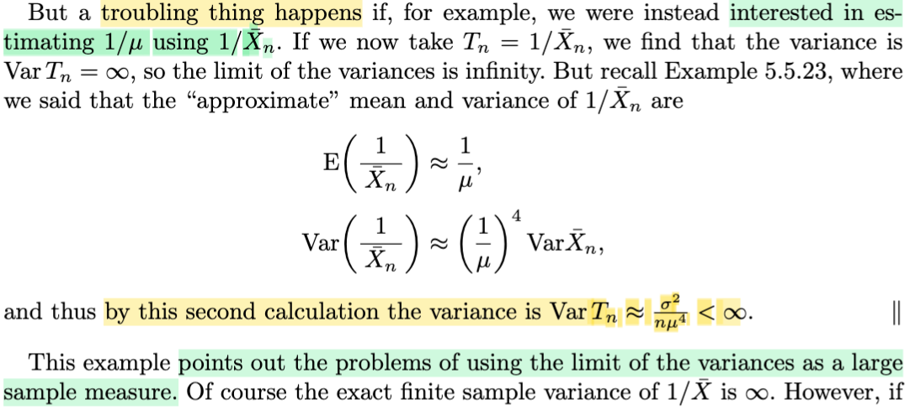</kbd>

<kbd>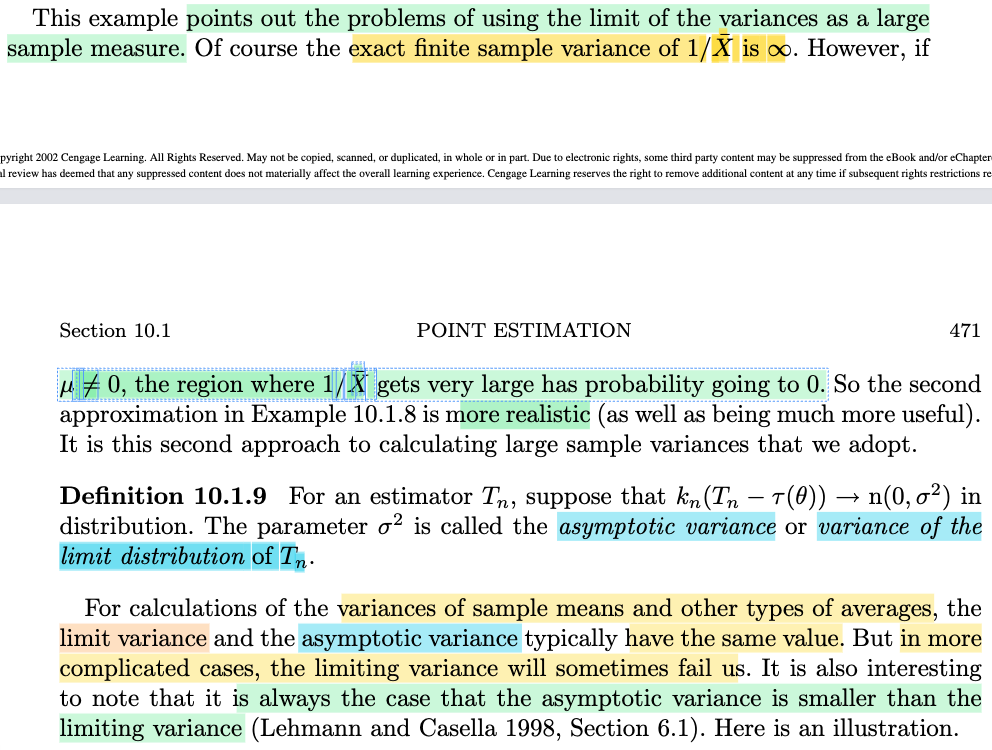</kbd>

> [!NOTE]
> Rồi, thế thì gs nói đại khái là khi tính **phương sai tiệm cận (asymptotic variance)**, ta có thể sẽ **bị cám dỗ bởi (tempting) cách làm như sau**: Gọi Tn là estimator (dựa trên sample size n), thì Var(Tn) là variance của Tn, khi đó ta xem xét variance của Tn tại limit:
>
>
>
> lim n → ∞ {kn Var(Tn)}
>
>
>
> Với kn là chuỗi các constant đóng vai trò normalizing constant (chưa hiểu lắm)
>
>
>
> Thế thì ta định nghĩa ra một khái niệm khác: giới hạn phương sai (limiting variance) được định nghĩa bởi: Nếu một (sequence of estimator) có phương sai tiệm cận lim n→∞ kn Var(Tn) = τ^2 < ∞, thì τ^2 được gọi là **limiting variance**.
>
>
>
> Lấy ví dụ, Xbar_n, là sample mean của iid normal(μ, σ^2) sample size n, như đã biết, nó sẽ một normal(μ, σ^2/n). Như vậy Var(Xbar_n) = σ^2/n ⇨ n Var(Xbar_n) = σ^2. Do đó, với Xbar_n thì lim n → ∞ n Var(Xbar_n) = σ^2, là con số hữu hạn (finite), < ∞. Do đó theo định nghĩa trên, σ^2 chính là limiting variance. (trong trường hợp này, chuỗi {kn} chính là {1,2,....n}.
>
>
>
> ---
>
>
>
> Thế thì đại ý là, việc đánh giá asymptotic variance bằng cách lấy giới hạn của variance của Tn sẽ không vấn đề gì khi Tn là sample mean, vì lim n → inf Var(Tn) = lim n → inf σ^2/n = 0. Và với một số Tn khác cũng vậy.
>
>
>
> Nhưng nếu ta quan tâm đến asymtotic variance của Tn = 1/Xbar_n, thì ta sẽ gặp vấn để vì Var(Tn) sẽ = inf, vì sao nhỉ?
>
>
>
> Chỉ cần hiểu đại khái, theo định nghĩa Var(Tn) = E\[Tn^2\] - (ETn)^2 = E\[(1/Xbar_n)^2\] - \[E(1/Xbar_n)\]^2
>
>
>
> Với E\[(1/Xbar_n)^2\], theo LOTUS, = ∫(1/xbar_n)^2 f(xbar_n) d(xbar_n) với f là pdf của xbar_n. Ta đã biết, Xbar_n của sample \~ normal(μ, σ) sẽ có limiting distribution là normal(μ, σ^2/n), tức là Xbar_n sẽ hội tụ distribution về một rv thuộc phân phối normal(μ, σ^2). thế thì với phân phối này, trong tích phân ∫(1/xbar_n)^2 f(xbar_n) d(xbar_n) đang nói, tồn tại xác suất dương nào đó để xbar_n = 0, khiến tích phân này = inf (explode), vì sao, vì range của normal là từ -inf, inf, nên có nghĩa là tại xbar_n=0, vẫn tồn tại giá trị pdf không âm.
>
>
>
> Không cần xét cái term thứ hai, lập luận trên cũng đủ để nói Var(1/Xbar_n) = ∞.
>
>
>
> ---
>
>
>
> Vấn đề là, trong ví dụ 5.5.23, mình đã học về Delta method giúp ta có công thức tính xấp xỉ mean và variance của 1/Xbar_n, có thể ôn lại chút xíu như sau:
>
>
>
> Delta method rất đơn giản thôi: Giả sử ta đang muốn xem xét random variable g(T) (T là random variable nào đó \~ f(t|μ). Thì lập luận như vầy: Theo giải tích, nếu xét phạm vi t \~ μ, thì ta có xấp xỉ bậc một: g(t) ≈ g(μ) + g'(μ)(t-μ)
>
> Áp dụng hai cái hàm số xấp xỉ nhau này lên random variable T, ta sẽ có hai random variable xấp xỉ:\
> \
> g(T) ≈ g(μ) + g'(μ)(T-μ)
>
>
>
> Thế thì xét E\_μ\[g(T)\], vì xấp xỉ trên nên ta có:
>
>
>
> E\_μ\[g(T)\] ≈ E\_μ\[g(μ) + g'(μ)(T-μ)\] = E\_μ\[g(μ)\] + E\_μ\[g'(μ)(T-μ)\]
>
>
>
> = g(μ) + g'(μ) E\_μ\[T-μ\]
>
>
>
> = g(μ) + g'(μ) (E\_μ\[T\]-μ)
>
>
>
> = g(μ) + g'(μ) (μ-μ)
>
>
>
> = g(μ)
>
>
>
> Vậy E\_μ\[g(T)\] ≈ g(μ)
>
>
>
> Còn Var\_μ\[g(T)\] = E\_μ{g(T) - E\_μ\[g(T)\]}^2
>
>
>
> ≈ E\_μ{g(T) - g(μ)}^2 (thay E\_μ\[g(T)\] ≈ g(μ))
>
>
>
> ≈ E\_μ{g(μ) + g'(μ)(T-μ) - g(μ)}^2 (thay g(T) ≈ g(μ) + g'(μ)(T-μ))
>
>
>
> = E\_μ\[g'(μ)(T-μ)\]^2
>
>
>
> = (g'(μ))^2 E\_μ\[(T-μ)\]^2
>
>
>
> = (g'(μ))^2 Var\_μ\[T\]
>
>
>
> Áp dụng với T = Xbar_n là có mean E(Xbar_n) = μ và variance Var(Xbar_n) và g(Xbar_n) = 1/Xbar_n:
>
>
>
> ⇨ g'(t) = -1/t^2
>
>
>
> E\[1/Xbar_n\] = 1/E\[Xbar_n\] = 1/μ 
>
>
>
> Var\[1/Xbar_n\] = (-1/μ^2)^2Var\_μ\[Xbar\] = **(1/μ^4) Var\_μ\[Xbar\]**
>
>
>
> Và như vậy, ý chính muốn nói, với Tn = 1/Xbar_n, thì khi ta t**ính chính xác variance của nó, được ∞**. Nhưng tính xấp xỉ, thì lại là **(1/μ^4) Var\_μ\[Xbar\]**
>
>
>
> ---
>
>
>
> Như vậy, tóm lại, việc tính asymptotic variance của Tn theo kiểu lấy Variance của Tn tại limit (lim n → inf Var(Tn), gọi là limiting variance không ổn, trong khi đó, dùng cách làm xấp xỉ thì lại thực tế hơn và hữu ích hơn. Thành ra ta sẽ có **định nghĩa chính thức của asymptotic variance** như sau:
>
>
>
> đó là, cho chuỗi estimator (dựa trên sample size n) Tn: sao cho kn (Tn - τ(θ)) hội tụ phân phối về n(0, σ^2), khi đó σ^2 gọi là asymptotic variance của Tn. Có nghĩa là, thì **thay vì dùng Var(Tn) tại limit, ta dùng variance của cái phân phối normal là limit distribution của** kn (Tn - τ(θ)) **làm asymptotic variance**. Như vậy, với Tn = 1/Xbar, thay vì dùng Var(1/Xbar) tại limit (=inf), ta dùng (1/μ^4) Var\_μ\[Xbar\]
>
>
>
> Và một điểm thú vị nữa, đó là asymptotic variance thì luôn nhỏ hơn limiting variance.

> [!TIP]
> **🤖 AI Feedback** — ✅ Score: **98/100**
>
> Ghi chú của bạn rất chính xác và có chiều sâu đáng kinh ngạc. Bạn không chỉ tóm tắt nội dung mà còn giải thích chi tiết lý do tại sao Var(1/Xbar_n) lại là vô cùng và tự mình chứng minh lại phương pháp Delta, thể hiện sự hiểu biết sâu sắc và khả năng suy luận tốt.

**🔗 See also:** [Tính nhất quán và hiệu quả](#node-e2xtw8s) · [Phương sai Tỷ lệ Odd](#node-44z7xj9) · [Example 10.1.10 Large-sample Mixture Variances](#node-slkl4m8) · [Definition 10.1.11 Asymptotic Efficiency](#node-bgijdqy)

 

- **Example 10.1.10 Large-sample Mixture Variances**

<kbd>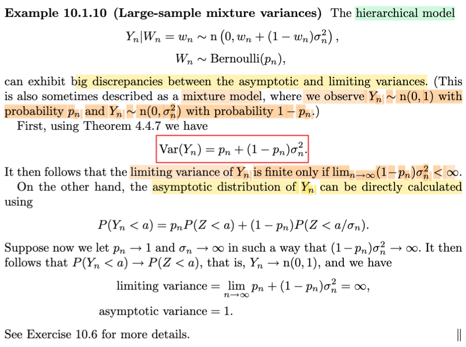</kbd>

> [!NOTE]
> Ví dụ này ta có một hierarchical modal:
>
>
>
> Yn|Wn = wn \~ n(0, wn + (1-wn)σn^2)
>
>
>
> Wn \~ Bern(pn)
>
>
>
> Đã gặp cái này ở mấy chương trước có nghĩa là nếu biết giá trị của Wn (= wn) thì Yn là normal mean 0 có variance wn + (1-wn) σn^2. Và bản thân Wn thì là một rn \~ Bern(pn).
>
>
>
> Vậy thì ở đây, gs nói cái này cũng chính là mixture model khi ta thấy Yn \~ n(0,1) với xác suất pn và Yn \~ n(0, σn^2) với xác suất 1 - pn. Là sao ta:
>
>
>
> Khái niệm mixture model, trong sách này (Casella) cho đến giờ chưa được nghe. Nhưng, quachapter 2 của PRML của C.Bishop đã biết khái niệm mixture model, cũng đơn giản, đại khái như sau: f(x) = convex combination của các fi(x): ∑i αi fi(x). với fi(x) là các pdf của distribution. Ví dụ f(x|**μ**, **σ^2**) = αi fi(x|μi, σi^2) với fi là pdf của Normal(μi, σi^2), và αi ≥ 0 ∀i, và ∑i αi = 1, thì ta sẽ có một Gaussian (normal) mixture.
>
>
>
> Vậy thì ở đây, ta có f1(x|0,1) là pdf của Normal(0,1) và f2(x|0, σn^2) là pdf của Normal(0, σn^2) và convex combination coefficient là α1 = pn và α2 = 1-pn.
>
>
>
> Chú ý là Yn|(Wn=wn) \~ n(0, wn + (1 - wn) σn^2) & Wn \~ Bern(pn), cũng là cái Gaussian mixture nói trên, KHÔNG PHẢI LÀ MỘT NORMAL DISTRIBUTION có variance là wn + (1 - wn) σn^2. Mà cách viết n(0, wn + (1 - wn) σn^2) chỉ có nghĩa là, nếu Wn = 1 (vốn là sự kiện có xác suất xảy ra là pn) thì Yn|Wn=1 sẽ là rv \~ normal(0,1), và nếu Wn = 0, là sự kiện có xác suất xảy ra là 1-pn, thì Yn|Wn=1 sẽ là rv \~ normal(0, σn^2). Nên gs mới nói câu "ta quan sát thấy Yn \~n(0,1) với xác suất pn và Yn\~n(0, σn^2) với xác suất 1-pn.
>
>
>
> Dùng công thức 4.4.7 (xem link) ta có thể có công thức của Var(Yn) = pn + (1 - pn)σn^2, để rồi ta sẽ nhận định rằng cái này tại limit (tức limiting variance) chỉ hữu hạn nếu giá trị tại limit của (1 - pn)σn^2 cũng hữu hạn.
>
>
>
> Nhưng với asymptotic variance thì ta sẽ tính được = 1. Thử xem họ tính vậy là sao?
>
>
>
> P(Yn < a) = pnP(Z < a) + (1-pn) P(Z < a/σn), dòng này là sao?
>
>
>
> P(Yn < a) tức là FYn(a) (cdf của Yn tại a)
>
>
>
> gọi fYn là pdf của Yn, ta biết theo định nghĩa của cdf và pdf, ta có:
>
>
>
> FYn(a) = ∫-inf:a fYn(t)dt
>
>
>
> Vì Yn \~ Gaussian mixture → fYn(t) = pn N(t|0,1) + (1-pn) N(t|0, σn^2)
>
>
>
> ⇨ FYn(a) = ∫-inf:a fYn(t)dt = ∫-inf:a\[pn N(t|0,1) + (1-pn) N(t|0, σn^2)\] dt
>
>
>
> = ∫-inf:a \[pn N(t|0,1)\] dt + ∫-inf:a \[(1-pn) N(t|0, σn^2)\] dt
>
>
>
> = pn ∫-inf:a N(t|0,1) dt + (1-pn) ∫-inf:a N(t|0, σn^2) dt
>
>
>
> = pn ∫-inf:a N(t|0,1) dt + (1-pn) ∫-inf:a N(t|0, σn^2) dt
>
>
>
> ∫-inf:a N(t|0,1) dt chính là cdf tại a của Z \~ normal(0,1), tức FZ(a), cũng là P(Z < a)
>
>
>
> còn ∫-inf:a N(t|0, σn^2) dt chính là cdf tại a của W \~ normal(0, σn^2), tức FW(a), và cũng là P(W < a)
>
>
>
> Mà theo location scale theorem ta cũng biết W chính là Zσn, nên P(W < a) = P(Zσn < a) = P(Z < a/σn)
>
>
>
> Vậy ta có P(Yn < a) = pn P(Z < a) + (1-pn) P(Z < a/σn).
>
>
>
> ---
>
>
>
> Thế thì, hồi nãy, với limiting variance ta nói, chỉ khi (1-pn)σn^2 → giá trị hữu hạn khi n → inf thì limiting variance mới finite.
>
>
>
> Vậy thì ở đây, ta thử cho (1-pn)σn^2 → inf luôn (bằng cách cho pn → 1 và σn → ∞, thì ta sẽ thấy khi đó:
>
>
>
> P(Yn < a) = pn P(Z < a) + (1-pn) P(Z < a/σn) sẽ → 1 × P(Z < a) + 0 × P(Z < 0) = P(Z < a)
>
>
>
> Mà P(Yn < a) → P(Z < a) tức là FYn(a) → FZ(a), theo định nghĩa cuả hội tụ phân phối (converge in distribution), đây chính là nói Yn → (d) Z. Và theo định nghĩa của asysmtotic variance, là variance của limiting distribution, thì ta có asymtotic variance của Yn = Var(Z) = 1.
>
>
>
> Như vậy, khi ta cho pn → 1, σn → ∞ thì:
>
>
>
> limiting variance = inf (vì pn + (1-pn)σn^2 → inf)
>
>
>
> nhưng
>
>
>
> asymptotic variance = 1
>
>
>
> Và điều này chỉ rõ một điều nói ở trên: là dùng limiting variance (tức giá trị của Var(Tn) tại limit) là không hữu ích và cũng không thực tế bằng việc dùng asymptotic variance (variance của limiting distribution). Mà việc khi ta cho pn → 1 và σn → ∞ với hai kết quả trái ngược nhau ở trên có ý nghĩa rất hay như sau:
>
>
>
> Cho pn → 1, tức là cho xác suất chọn được n(0,1) là rất rất lớn, đồng nghĩa rất rất hiếm xảy ra việc chọn được n(0, σn^2). Nhưng đồng thời cho σn → ∞ tức là cho nó rất rất lớn. Thì cái limiting variance ngu ngốc ở chỗ, nó vẫn cho rằng có xác suất dương nào đó (dù vô cùng nhỏ) xảy ra việc chọn cái normal có variance khổng lồ, nên nó cho rằng variance tổng (ý là limiting variance) là khổng lồ. Trong khi đó, thực tế thì, thật ra với xác suất cực lớn của việc chọn được n(0,1) thì variance = 1 sẽ hợp lí hơn, cũng là nói asymptotic variance sẽ thực tế hơn.

**🔗 See also:** [Phương sai tiệm cận và giới hạn](#node-62aug4x) · [Định lý phương sai toàn phần](#node-ivmktz5) · [Definition 10.1.11 Asymptotic Efficiency](#node-bgijdqy)

 

- **Definition 10.1.11 Asymptotic Efficiency**

<kbd>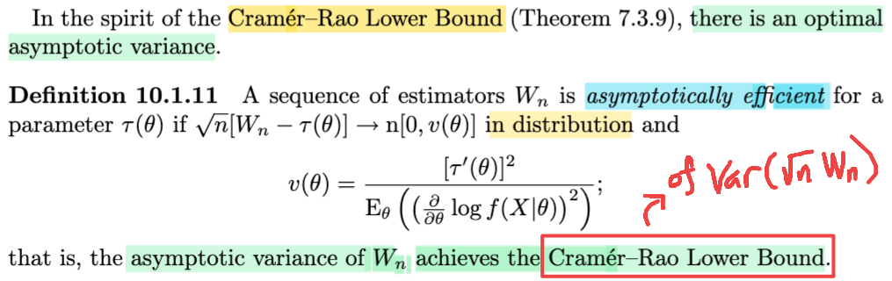</kbd>

> [!NOTE]
> Nói ngắn gọn, ở đây người ta **định nghĩa** ra cái gọi là khi nào thì **chuỗi estimator Wn** được gọi là **ASYMPTOTICALLY EFFICIENT** của một parameter τ(θ), đó là nếu như **asymptotic variance của nó có thể đạt được giá trị variance nhỏ nhất được thể hiện bởi giá trị chặn dưới Cramer-Rao (lower bound)**.
>
>
>
> Để hiểu cái này, ta sẽ cần liên hệ lại (nhớ lại) kiến thức về Cramer-Rao Lower Bound là cái gì), đã học ở chap 7, trong phần đánh giá chất lượng của các point estimator. Nói ngắn gọn, khi cần phải đánh giá các estimator (evaluating estimator quality), thì một tiêu chí quan trọng là MSE, được định nghĩa là một hàm của estimator: MSE(W(**X**)) = E\_θ\[(W(**X**) - θ)^2\], và ta muốn cái này càng nhỏ càng tốt. Sau đó, bằng cách biến đổi chút, ta sẽ cho thấy nó = Var\_θ \[W(**X**)\] + \[Bias(W(**X**)\]^2 với Bias(W(**X**)) = E\_θ\[W(**X**)\] - θ. Để rồi, câu chuyện tiếp theo là, giả sử ta **xét một đám các estimator có cùng bias** (đồng nghĩa có cùng kì vọng E\_θ\[W(**X**)\]), thì thằng nào có Var\_θ\[W(**X**)\] nhỏ nhất sẽ là tốt nhất.
>
>
>
> Thế thì, việc tính variance có thể phức tạp, và quan trọng hơn, trong nhiều trường hợp, ta cũng không thể biết được rằng, một estimator có variance nào đó có phải là nhỏ nhất hay không. Từ đó, mới nói đến một công cụ cho vấn đề này: **Cramer Rao Lower Bound**. Đây chỉ đơn giản là một theorem, nói rằng, giả sử ta có bối cảnh thỏa mãn yêu cầu đề ra nào đó (xem cụ thể trong theorem) thì khi đó, ta có thể **xác định được cái lower bound của** Var\_θ(W(**X**)), từ đó, **nếu ta có một estimator có variance bằng với chặn dưới này, thì có thể kết luận nó chính là cái tốt nhất** (cái tốt nhất trong đám các estimator có chung bias, và nếu đang xét đám các unbiased estiamtor thì ta gọi nó là uniformly minimum variance unbiased estimator)
>
>
>
> ---
>
>
>
> Cramer Rao Inequality:
>
>
>
> Var\_θ(W(**X**)) ≥ \[d/dθ E\_θ\[W(**X**)\]\]^2 / E\_θ\[(∂/∂θ log f(**X**|θ))^2\]
>
>
>
> = \[d/dθ E\_θ\[W(**X**)\]\]^2 / In(θ)
>
>
>
> với In(θ) = E\_θ\[(∂/∂θ log f(**X**|θ))^2\], do iid = n E\_θ\[(∂/∂θ log f(Xi|θ))^2\] = n I1(θ)
>
> \
> Vậy Var\_θ(W(**X**)) ≥ \[d/dθ E\_θ(W(**X**))\]^2 / n I1(θ)
>
>
>
> Và CRLB của Var\_θ(W(**X**)) là \[d/dθ E\_θ(W(**X**))\]^2 / n I1(θ)
>
>
>
> ---
>
>
>
> Quay lại đây, định nghĩa Wn của chuỗi estimator cho τ(θ) có tính tiệm cận hiệu quả đó là khi √n(Wn - τ(θ)) → (d) n(0, \[τ'(θ)\]^2 / I1(θ))
>
>
>
> Mà theo định nghĩa Wn (là estimator của τ(θ)) có phương sai tiệm cận là σ^2: nếu kn(Wn - τ(θ)) → (d) n(0, σ^2). Nên ở đây việc ta có √n(Wn - τ(θ)) → (d) n(0, \[τ'(θ)\]^2 / I1(θ)) chính là nói AsympVar(Wn) = \[τ'(θ)\]^2 / I1(θ)
>
>
>
>  Nếu Wn là unbiased estimator cho τ(θ): E\[Wn\] = τ(θ) ⇨ τ'(θ) = d/dθ E\[Wn\], và từ đó việc √n(Wn - τ(θ)) → (d) n(0, \[τ'(θ)\]^2 / I1(θ)) chính là nói rằng:
>
>
>
> AsympVar(Wn) = \[d/dθ E(Wn)\]^2 / I1(θ), và cái này thì bằng n × \[d/dθ E(Wn)\]^2 / nI1(θ), tức n × CRLB.
>
>
>
> Vậy thì thế quái nào trong sách lại tương vào câu "that is, asym var(Wn) archivese CRLB, trong khi nó gấp n lần CRLB?
>
>
>
> Câu trả lời là ông Casella buộc ta hiểu đang nói đến không phải là CRLB của Var(Wn) có công thức \[d/dθ E\[Wn\]\]^2 / n I1(θ). Mà sự thật là đang nói về CRLB của √n Wn, có công thức là \[d/dθ E\[Wn\]\]^2 / I1(θ).

> [!TIP]
> **🤖 AI Feedback** — ✅ Score: **100/100**
>
> Bài giải thích rất sâu sắc và chi tiết, làm rõ định nghĩa về ước lượng hiệu quả tiệm cận (asymptotically efficient) bằng cách liên hệ chặt chẽ với Cramér-Rao Lower Bound, bao gồm cả bối cảnh và công thức. Độ chính xác và chiều sâu của kiến thức được trình bày rất ấn tượng.

**🔗 See also:** [Example 10.1.10 Large-sample Mixture Variances](#node-slkl4m8) · [Bất đẳng thức Cramer-Rao](#node-1qs416c) · [Theorem 10.1.12 (Asymptotic efficiency of MLEs)](#node-n1mqtrr) · [10.1.3 Calculations and Comparisons](#node-iwgmm5t) · [Phương sai tiệm cận và giới hạn](#node-62aug4x)

 

- **Theorem 10.1.12 (Asymptotic efficiency of MLEs)**

<kbd>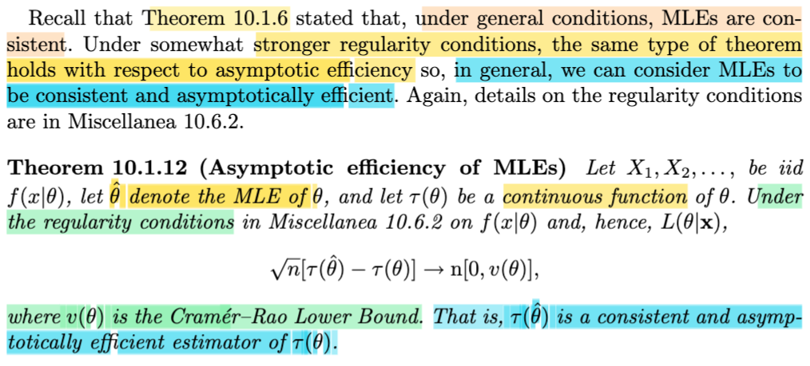</kbd>

> [!NOTE]
> Thế thì, tiếp theo là một theorem nói rằng, dưới một số điều kiện nhất định (xem thêm trong phần Miscellanea) của hàm f(x|θ) và gọi θ^ là ML estimator của θ, τ là hàm liên tục nào đó. Theorem này nói rằng:
>
>
>
> √n (τ(θ^) - τ(θ)) sẽ hội tụ phân phối về n(0, ν(θ)) với ν(θ) là Cramer Rao Lower Bound (1)
>
>
>
> Điều này có nghĩa là dưới những điều kiện nhất định nói trên, thì **τ(θ^)** **sẽ là một consistent và asymptotically efficient estimator** **của** **τ(θ)**.
>
>
>
> Nên hiểu, (1) hàm ý hai thứ:
>
>
>
> i) τ(θ^) → (p) τ(θ), và theo định nghĩa, đây cho thấy τ(θ^) là consistent sequence of estimator của τ(θ). Chứng minh nhanh:
>
>
>
> Ta có √n (τ(θ^) - τ(θ)) → (d) n(0, ν(θ)) thì phải hiểu là √n (τ(θ^) - τ(θ)) → (d) Z \~ n(0, ν(θ)) (√n (τ(θ^) - τ(θ)) sẽ trở thành một random variable có phân phối n(0, ν(θ)).
>
>
>
> Và 1/√n → 0 (đơn giản là vì lim n→inf 1/√n = 0
>
>
>
> Theo Slusky theorem: nếu Xn → (d) X, Yn → constant a thì XnYn → (d) aX, vậy áp dụng vào đây √n (τ(θ^) - τ(θ)) × 1/√n → (d) 0 × Z = 0.
>
>
>
> Mà theo một theorem 5.5.13, nói rằng, nếu Xn → (d) constant μ ⇔ Xn → (p) constant μ. Nên áp dụng theorem này, ta có √n (τ(θ^) - τ(θ)) × 1/√n = τ(θ^) - τ(θ) cũng → (p) contant 0. Và theo định nghĩa của consistent sequence of estimator, nếu P\_θ(|Wn - θ| < ε) = 1 ∀ε, cũng chính là nói Wn → (p) θ, thì Wn là consistent sequence of estimator. Vậy, theo đó, τ(θ^) là consistent sequence of estimator của τ(θ)
>
>
>
> (nói là chuỗi là bởi vì phải tự hiểu θ^ là MLE, có bản chất cũng là một statistic, một hàm của sample size n).
>
>
>
> ii) phân phối đích có variance là ν(θ), tức là cái này chính là asymptotically variance của τ(θ^), mà cái này là CRLB, thì theo định nghĩa của asymtoptically efficient, thì τ(θ^) chính là một asymtoptically efficient sequence of estimator của τ(θ)
>
>
>
> Và nhờ phân tích trên mình cũng sẽ thấy rằng, thật ra efficient chính là sẽ consistent. Là sao? Là vì theo định nghĩa của efficient: √n (τ(θ^) - τ(θ)) sẽ hội tụ phân phối về n(0, ν(θ)) với ν(θ) là Cramer Rao Lower Bound, thì dựa vào cái định nghĩa này, ta chứng minh như ở trên để cho thấy tính consistent. Vậy thì một sequence estimator thỏa định nghĩa này, sẽ là efficient và cũng tự nhiên là consistent, nên nói cách khác, efficient bao hàm consistent, thành ra nói vừa efficient vừa consistent là thừa (redundant), mà trong phần sau gs nói chính là này.

> [!TIP]
> **🤖 AI Feedback** — ✅ Score: **95/100**
>
> Ghi chú giải thích Theorem 10.1.12 rất chi tiết và chính xác, đặc biệt là phần chứng minh tính consistency bằng định lý Slutsky. Để hoàn thiện hơn, bạn có thể bổ sung giới hạn n → ∞ vào định nghĩa tính consistent.

**🔗 See also:** [Definition 10.1.11 Asymptotic Efficiency](#node-bgijdqy) · [Tính nhất quán của MLE](#node-d19dn75) · [Chứng minh Hiệu quả Ước lượng MLE](#node-ucl78tu) · [Định lý Slutsky](#node-uwbmbt7) · [Hội tụ xác suất và phân phối](#node-wqcasc6) · [Giới hạn dưới Cramer-Rao](#node-ihoar4m) · [CLT - Định lý giới hạn trung tâm](#node-32vkewg) · [Chuẩn tiệm cận, nhất quán, hiệu quả](#node-v1s5jks)

 

- **Chứng minh Hiệu quả Ước lượng MLE**

<kbd></kbd>

<kbd>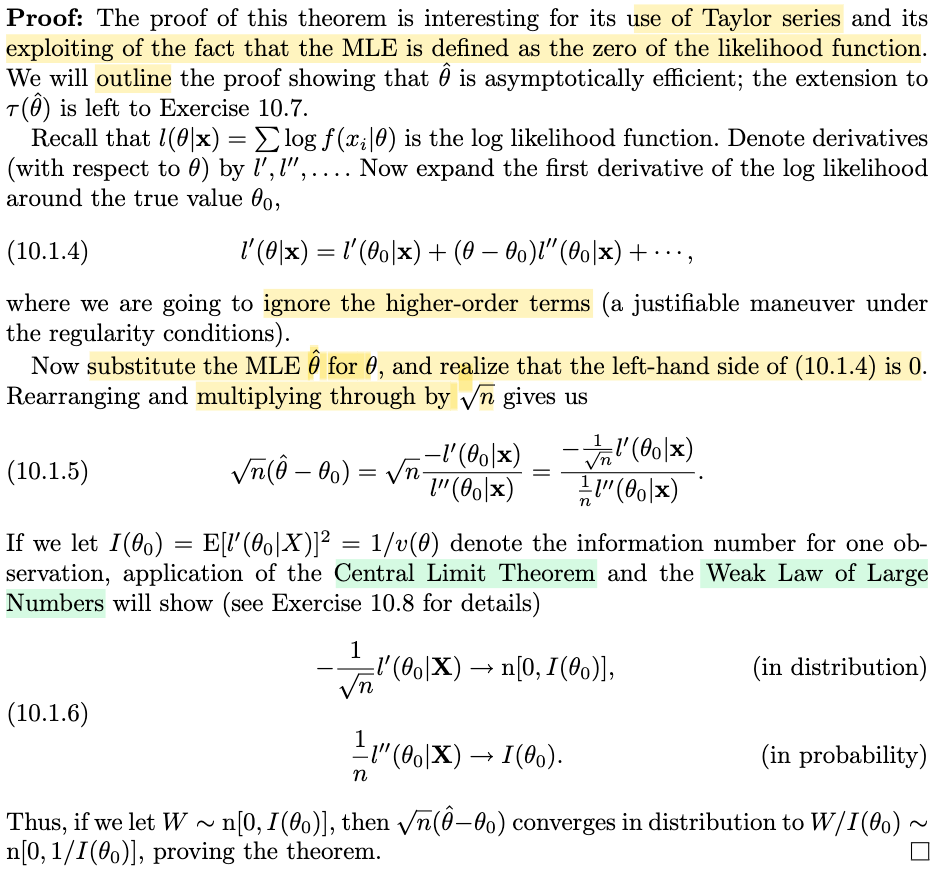</kbd>

> [!NOTE]
> Ở đây sẽ chứng minh τ(θ^) = θ^ là efficient sequence of estimator cho θ:
>
>
>
> Đầu tiên, ta kí hiệu l(θ|**x**) là hàm log likelihood, thì đạo hàm của nó là l'(θ|**x**). ta mới linear approx tại θ0 (gọi true value của θ là θ0)
>
>
>
> l'(θ|**x**) ≈ l'(θ0|**x**) + l''(θ0|**x**)(θ - θ0)
>
>
>
> Tiếp, thay θ^ (MLE của θ) vô hai vế. Nhưng phải đặt câu hỏi: Vì sao có thể thay vào?
>
>
>
> Phải hỏi vậy là vì, sở dĩ cái phương trình xấp xỉ trên, chỉ valid khi θ ≈ θ0, thì liệu θ^ có ≈ θ0 không? Sẽ quay lại câu hỏi này sau, tạm thời chấp nhận, ta có:
>
>
>
> l'(θ^|**x**) ≈ l'(θ0|**x**) + l''(θ0|**x**)(θ^ - θ0) 
>
>
>
> Vế trái lúc này, có thể hiểu, chính là d/dθ \[log L(θ|**x**)\]|θ=θ^, mà vì định nghĩa của MLE, là solution của bài toán maximize\_θ L(θ|**x**), nên theo điều kiện cần bậc nhất, d/dθ \[L(θ|**x**)\]|θ=θ^ phải bằng 0, cũng là d/dθ \[log L(θ|**x**)\]|θ=θ^. Vậy vế trái = 0, ta có:
>
>
>
> 0 ≈ l'(θ0|**x**) + l''(θ0|**x**)(θ^ - θ0) 
>
>
>
> ⇔ l''(θ0|**x**)(θ^ - θ0)  ≈ -l'(θ0|**x**)
>
>
>
> ⇔ (θ^ - θ0)  ≈ -l'(θ0|**x**)/l''(θ0|**x**)
>
>
>
> ⇔ √n(θ^ - θ0)  ≈ √n\[-l'(θ0|**x**)/l''(θ0|**x**)\]
>
>
>
> ⇔ √n(θ^ - θ0)  ≈ √n\[-(1/√n)l'(θ0|**x**)\] / \[(1/√n)l''(θ0|**x**)\]
>
>
>
> ⇔ √n(θ^ - θ0)  ≈ \[-(1/√n)l'(θ0|**x**)\] / \[(1/n)l''(θ0|**x**)\] → 10.1.5
>
>
>
> Tới đây đặt I(θ0) = E\[l'(θ0|X)\]^2 = 1/ν(θ) và nói rằng nó là information number của một observation. Là sao ta?
>
>
>
> → l là hàm log likelihood, nên l'(θ0|X) = d/dθ \[log L(θ|X)\]|θ=θ0
>
>
>
> và cũng là d/dθ \[log f(X|θ0)\]. Và cái này, dĩ nhiên là random variable, có được từ việc áp hàm d/dθ \[log f(x|θ0)\] lên X, bình phương lên, cũng là random variable, thành ra có thể lấy kì vọng.
>
>
>
> Vậy vì sao E\[l'(θ0|X)\]^2 = E\[d/dθ \[log L(θ|X)\]|θ=θ0\]^2 = E\[d/dθ \[log L(θ0|X)\]\]^2 lại được ông gọi là information number của một observation?
>
>
>
> Nhớ lại bất đẳng thức Cramer Rao, giúp ta có lower bound của variance của estimator:
>
>
>
> Var\_θ\[W(**X**)\] ≥ {d/dθ E\_θ\[W(**X**)\]}^2 / E\_θ\[(∂/∂θ log f(**X**|θ)^2\] 
>
>
>
>  thì cái đại lượng E\_θ\[(∂/∂θ log f(**X**|θ))^2\] được gọi là **information number** hoặc **Fisher information**
>
>
>
> Vậy thì theo đó, mình sẽ tạm hiểu rằng, E\_θ\[(∂/∂θ log f(Xi|θ))^2\] là information number của một observation Xi (còn ở trên, là của mọi, hay n observation X1,...Xn).
>
>
>
>  ---
>
>  (Quay lại sau)

> [!TIP]
> **🤖 AI Feedback** — ❌ Score: **0/100**
>
> Vui lòng nhập lời giải thích của bạn để được chấm điểm.

**🔗 See also:** [Theorem 10.1.12 (Asymptotic efficiency of MLEs)](#node-n1mqtrr) · [Chuẩn tiệm cận, nhất quán, hiệu quả](#node-v1s5jks) · [Giới hạn dưới Cramer-Rao](#node-ihoar4m)

 

- **Chuẩn tiệm cận, nhất quán, hiệu quả**

<kbd>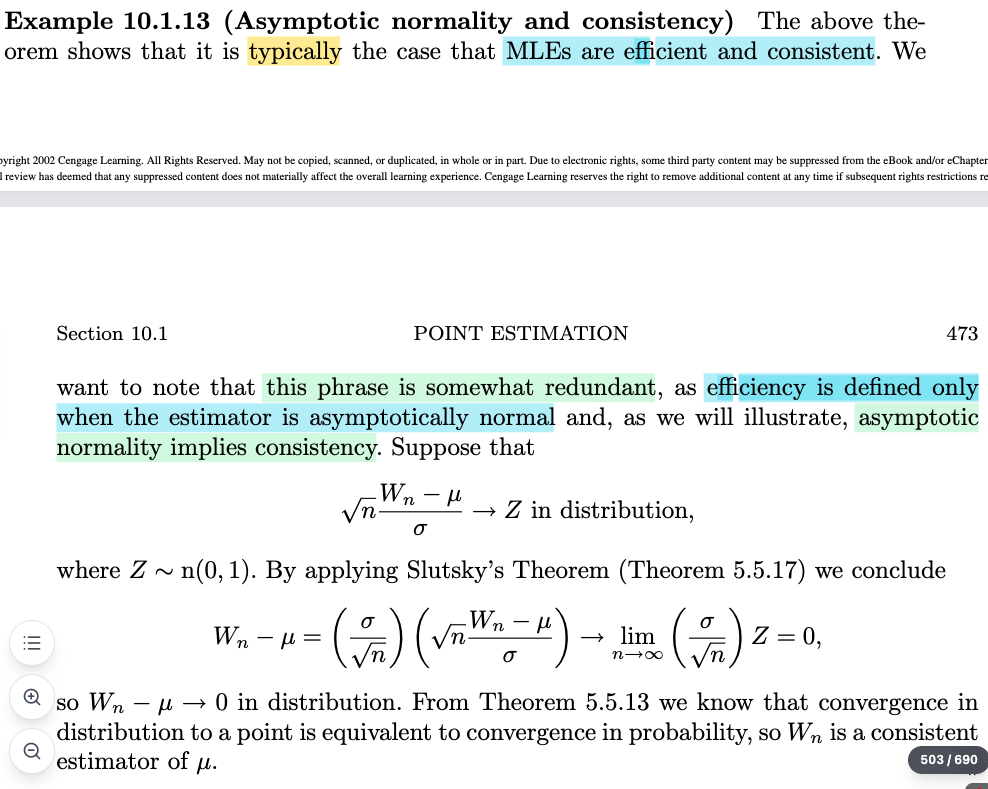</kbd>

> [!NOTE]
> Phần này như trong note trước đã hiểu rồi

**🔗 See also:** [Chứng minh Hiệu quả Ước lượng MLE](#node-ucl78tu) · [Theorem 10.1.12 (Asymptotic efficiency of MLEs)](#node-n1mqtrr) · [10.1.3 Calculations and Comparisons](#node-iwgmm5t)

 

- **10.1.3 Calculations and Comparisons**

<kbd>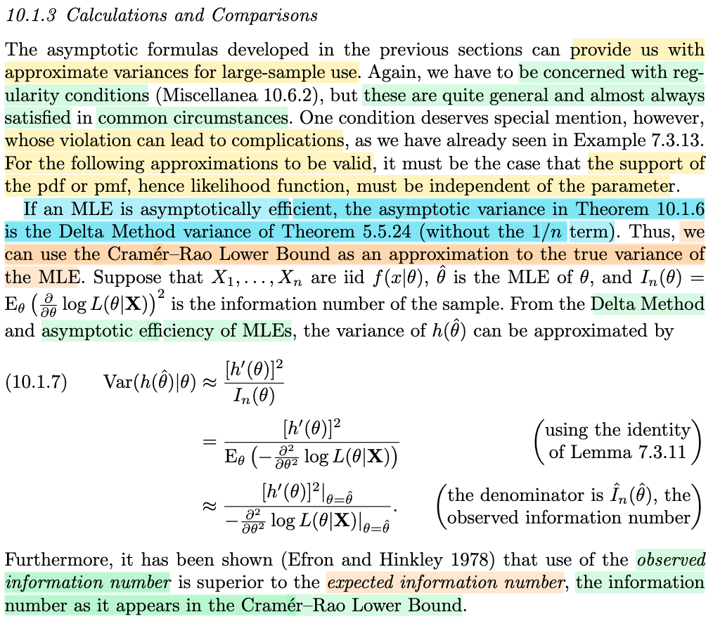</kbd>

> [!NOTE]
> Cùng giải nghĩa đoạn này:
>
>
>
> Đại ý là, từ các mảnh ghép: i) CRLB của Wn, ii) định nghĩa của một estimator hiệu quả tiệm cận và iii)
>
> MLE là estimator hiệu quả tiệm cận thì ta có thể dùng chúng để giải quyết vấn đề sau đây: Estimate,
>
> ước lượng xấp xỉ giá trị của variance của một MLE, θ^, hoặc nói chung hơn, là h(θ^).
>
>
>
> Lập luận như sau:
>
>
>
> Đầu tiên, cùng ôn lại CRLB, nói đơn giản, theorem này cho biết, nếu ta có một statistic Wn là estimator
>
> của θ thỏa vài điều kiện nhất định thì Var(Wn) ≥ \[d/dθ E\[Wn\]\]^2 / In(θ) với In(θ) là information number
>
> của n observation. Công thức của nó có thể nhìn trong sách, nhưng viết In(θ) cho gọn, và không khó
>
> để thấy nhờ tính iid, In(θ) = n I1(θ).
>
>
>
> Gút lại, kết quả này chỉ là: nếu ta có Wn là estimator của θ thì CRLB của Var(Wn) là \[d/dθ E\[Wn\]\]^2 / n
>
> I1(θ), và nếu xét Wn có E\[Wn\] = h(θ) thì cái CRLB là **\[h'(θ)\]^2 / n I1(θ)**.
>
>
>
> Kết quả này chỉ là để đây tí nữa xài.
>
>
>
> Tiếp theo ta xét định nghĩa của một Wn estimator **hiệu quả tiệm cận** của g(θ), thì theo định nghĩa:
>
>
>
> √n(Wn - θ) → (d) n(0, ν(θ)) với ν(θ) = \[g'(θ)\]^2 / I1(θ).
>
>
>
> Và ta lại đã chứng minh mle θ^ của θ, cũng coi như của g(θ) với g là identity function, là một estimator
>
> hiệu quả tiệm cận (cũng là nhất quán (consistent) luôn), nên theo định nghĩa trên ta có:
>
>
>
> √n(θ^ - θ) → (d) n(0, 1/I1(θ)), và với định nghĩa của phương sai tiệm cậnv thì đây cũng chính là nói
>
> Avar(θ^) = 1/I1(θ))
>
>
>
> Rồi, tiếp, ta xét delta method theorem, nó nói rằng:
>
>
>
> nếu √n(Yn - θ) → (d) n(0, σ^2) thì √n(g(Yn) - g(θ)) → (d) n(0, \[g'(θ)\]^2 σ^2))
>
>
>
> Và cái trên cũng tương đương với việc nói Avar(Yn) = σ^2 thì Avar(g(Yn)) = \[g'(θ)\]^2 σ^2 = \[g'(θ)\]^2
>
> Avar(Yn)
>
>
>
> Và việc nói Avar(g(Yn)) = \[g'(θ)\]^2 Avar(Yn) thì cũng có nghĩa là
>
>
>
> khi n lớn thì Var(g(Yn)) ≈ \[g'(θ)\]^2 Avar(Yn) / n
>
>
>
> vì sao, vì √n(g(Yn) - g(θ)) → (d) n(0, \[g'(θ)\]^2 σ^2)) = n(0, \[g'(θ)\]^2 Avar(Yn))) có bản chất ý nghĩa là: khi
>
> n vô cùng thì random variable √n(g(Yn) - g(θ)) sẽ có distribution là n(0, \[g'(θ)\]^2 Avar(Yn))).
>
>
>
> Nên dĩ nhiên khi n lớn thì ta có xấp xỉ:
>
>
>
> Var\[√n(g(Yn) - g(θ))\] ≈ \[g'(θ)\]^2 Avar(Yn)
>
>
>
> (ủa ko phải sao, vì nói distribution khi n vô cùng của X là n(μ, ε^2), tức cũng là nói khi n lớn X có
>
> distribution là normal, mean là μ, variance là ε^2, vậy thì khi n lớn ta sẽ có Var(X) ≈ ε^2 chứ, hoàn toàn
>
> logic)
>
>
>
> ⇔ n Var(g(Yn)) - n Var(g(θ)) ≈ \[g'(θ)\]^2 Avar(Yn)
>
>
>
> ⇔ n Var(g(Yn)) - 0 ≈ \[g'(θ)\]^2 Avar(Yn)
>
>
>
> ⇔ Var(g(Yn)) ≈ \[g'(θ)\]^2 Avar(Yn) / n
>
>
>
> Như vậy, nếu ta áp dụng delta method cho Yn = θ^ và g = h thì sao:
>
>
>
> Var(h(θ^)) ≈ \[h'(θ)\]^2 Avar(θ^) / n.
>
>
>
> Và với việc ta đã chỉ ra với θ^ là mle của θ, nên là estimator hiệu quả tiệm cận, nên Avar(θ^) = 1/I1(θ)
>
>
>
> ⇨ Var(h(θ^)) ≈ \[h'(θ)\]^2 (1/I1(θ)) / n
>
>
>
> ⇔ Var(h(θ^)) ≈ **\[h'(θ)\]^2 /nI1(θ))**, đây chính là 10.1.7
>
>
>
> Và vế phải như trên đã nói, chính là CRLB của một estimator Wn nào đó có E\[Wn\] = h(θ)
>
>
>
> **Từ đó ta có thể tính CRLB của một estimator Wn nào đó có E\[Wn\] = h(θ), và dùng nó để estimate cho**
>
> **Var(h(θ^))**
>
>
>
> Tóm lại, nếu nói cực ngắn gọn thì chỉ là 3 bước lập luận:
>
>
>
> i) Delta method cho Avar(h(θ^)) = \[h'(θ)\]^2 Avar(θ^).
>
>
>
> Và cái này cũng là cho ta: khi n lớn, Var(h(θ^)) ≈ \[h'(θ)\]^2 Avar(θ^) / n
>
>
>
> ii) θ^ là mle của θ, nên hiệu quả tiệm cận, theo định nghĩa của hiệu quả tiệm cận cho ta: Avar(θ^) =
>
> 1/I1(θ))
>
>
>
> i) và ii) ⇨ khi n lớn, Var(h(θ^)) ≈ \[h'(θ)\]^2 \[1/I1(θ))\] / n = \[h'(θ)\]^2/ nI1(θ))
>
>
>
> ⇔ Var(h(θ^)) ≈ \[h'(θ)\]^2/ nI1(θ)) (1)
>
>
>
> Cuối cùng:
>
>
>
> iii) CRLB theorem nói rằng với Wn thỏa vì điều kiện Var(Wn) ≥ \[d/dθ E\_θ\[Wn\]\]^2 / nI1(θ).
>
>
>
> nên nếu chọn Wn có E\_θ\[Wn\] = h(θ) thì:
>
>
>
> CRLB của Var(Wn) = \[h'(θ)\]^2 / nI1(θ) (2)
>
>
>
> Từ (1) và (2), ta suy ra Var(h(θ^)) ≈ CRLB của Var(Wn) với Wn có E\_θ\[Wn\] = h(θ).
>
>
>
> Phần tiếp theo chỉ là dùng công thức để thế vào In(θ), nhưng ý tưởng chính thì mình đã thông.

**🔗 See also:** [Chuẩn tiệm cận, nhất quán, hiệu quả](#node-v1s5jks) · [Phương pháp Delta](#node-lo99k23) · [Tính nhất quán của MLE](#node-d19dn75) · [Definition 10.1.11 Asymptotic Efficiency](#node-bgijdqy) · [Bất đẳng thức Cramer-Rao](#node-1qs416c) · [Delta Method Variance Approximation](#node-2mwxabg)

 

- **Delta Method Variance Approximation**

<kbd>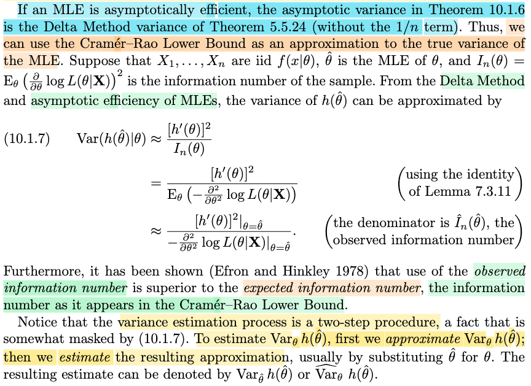</kbd>

> [!NOTE]
> Rồi, ôn lại nhanh cái lập luận bữa trước để cho phép ta dùng CRLB để estimate cho variance:
>
>
>
> rất đơn giản thôi, dựa trên các điểm sau đây:
>
>
>
> i) Với một Wn, là estimator của g(θ) thì CRLB của variance của nó: Var(Wn) ≥ \[d/dθ E\_θ\[Wn\]\]^2 / nI1(θ) (với I1(θ) là information number của 1 observation)
>
>
>
> nên nếu ta chọn Wn có E\[Wn\] = h(θ), thì CRLB của nó là \[h'(θ)\]^2 / nI1(θ)
>
>
>
> ii) Theo theorem của Delta method nói rằng nếu Avar(Yn) = σ^2 thì Avar(g(Yn)) = \[g'(θ)\]^2 σ^2 = \[g'(θ)\]^2 Avar(Yn). Và biểu thị toán học của của Avar(g(Yn)) = \[g'(θ)\]^2 Avar(Yn) đó là √n(g(Yn) - g(θ)) → (d) n(0, \[g'(θ)\]^2 Avar(Yn)), và cái này có nghĩa là nếu n lớn ta có Var\[√n(g(Yn) - g(θ))\] ≈ \[g'(θ)\]^2 Avar(Yn)) ⇔ Var\[g(Yn)\] ≈ \[g'(θ)\]^2 Avar(Yn)) / n.
>
>
>
> iii) Và giả sử ta có θ^ là mle của θ, thì nó sẽ có tính hiệu quả tiệm cận, theo định nghĩa, có nghĩa là:
>
>
>
> Avar(θ^) = 1/I1(θ). Nên nếu áp dụng điều ii) với Yn = θ^ và hàm h, thì ta sẽ có Var\[h(θ^)\] ≈ \[h'(θ)\]^2 / nI1(θ), và cái này theo (i) thì chính là CRLB của Wn có E\[Wn\] = h(θ)
>
>
>
> Vậy có nghĩa là, nếu ta muốn estimate variance của h(θ^), ta có thể dùng CRLB của một estimator Wn nào đó có E\[Wn\] = h(θ): Var\[h(θ^)\] ≈ CRLB của Var(Wn) = \[h'(θ)\]^2 / nI1(θ).
>
>
>
> Và tới đây, cách làm sẽ như sau:
>
>
>
> i) Dùng công thức xấp xỉ trên, sẽ cho phép ta dùng CLRB của Var(Wn) (với E\[Wn\] = h(θ)) = \[h'(θ)\]^2 / nI1(θ) để làm xấp xỉ cho Var(h(θ^).
>
>
>
> Nhưng bản thân cái xấp xỉ này ta cũng không biết vì nó dính θ, thành ra ta sẽ có bước 2:
>
>
>
> ii) Dùng estimator của θ, tức θ^ trong công thức xấp xỉ, như vậy:
>
>
>
> Estimator Var(h(θ^)) ≈ \[h'(θ^)\]^2 / nI1(θ^)
>
>
>
> Tóm lạ.
>
>
>
> Var(h(θ^)) ≈ \[h'(θ)\]^2 / In(θ), đây là công thức có được nhờ Delta method, và định nghĩa của efficient estimator.
>
>
>
> Với In(θ), thì dùng bổ đề 7.3.11 ta có công thức tính.
>
>
>
> Sau đó, ta dùng θ^ thay cho θ, và chuyển thành dấu xấp xỉ lần nữa.
>
>
>
> Var(h(θ^)) ≈ \[h'(θ^)\]^2 / In(θ^), hay Var(h(θ^)) ≈ \[h'(θ)\]^2 / In(θ) | θ = θ^
>
>
>
> nên kí hiệu là Var\_ θ^\[h(θ^)\] ý là hàm Var(h(θ^)) ≈ \[h'(θ)\]^2 / In(θ) evaluate tại θ^
>
>
>
> hoặc Var^(h(θ^)).
>
>
>
> Đây cũng là ý gs nói khúc cuối.
>
>
>
> ---
>
>
>
> Quay lại nói về cái vụ dùng Lemma 7.3.11:
>
>
>
> Như đã biết, trong phần CRLB, thhì E\_θ{\[∂/∂θ log f(**X**|θ)\]^2}, được kí hiệu là In(θ), information number của n observation (xem link).
>
>
>
> thì theo Lemma 7.3.11 nói rằng nếu f(x|θ) thỏa d/dθ E\_θ\[∂/∂θ log f(**X**|θ)\]
>
>
>
> = ∫ ∂/∂θ\[(∂/∂θ log f(x|θ)d(x|θ)\] dx thì E\_θ{\[∂/∂θ log f(**X**|θ)\]^2} = - E\_θ\[∂^2/∂θ^2 log f(**X**|θ)\]
>
>
>
>  Nên In(θ) ở đây = E\_θ{\[∂/∂θ log f(**X**|θ)\]^2}
>
>
>
> = - E\_θ\[∂^2/∂θ^2 log f(**X**|θ)\]
>
>
>
> = - E\_θ\[∂^2/∂θ^2 log L(θ|**X**)\] (do L(θ|**X**) = f(**X**|θ))
>
>
>
> Tới đây, một lần nữa người ta **bỏ kì vọng** chuyển sang dùng -∂^2/∂θ^2 log L(θ^|**X**) và gọi nó là **observed information number**, là cái mà ông nói thật ra ngon hơn (superior) so với expected information number (In(θ))
>
>
>
> = - E\_θ\[∂^2/∂θ^2 log L(θ|**X**)\] (do L(θ|**X**) = f(**X**|θ))
>
>
>
> ≈ -∂^2/∂θ^2 log L(θ^|**X**)
>
>
>
> Nói tóm lại lần nữa.
>
>
>
> Nhờ Delta method, định nghĩa của hiệu quả tiệm cận nên ta có công thức xấp xỉ:
>
>
>
> Var(h(θ^)) ≈ CRLB của Wn, với E\[Wn\] = h(θ), = h'(θ) / In(θ), In(θ) là expected information number.
>
>
>
> Tiếp, ta sẽ estimate cái xấp xỉ này, bằng cách evaluate công thức trên tại θ^ (vì ko biết θ). Đồng thời thay cái expected information number bằng observed information number luôn.
>
>
>
> Var(h(θ^)) ≈ \[h'(θ) / -∂^2/∂θ^2 log L(θ|**X**)\] | θ=θ^. Và đây là cách ta estimate variance của một hàm của một mle.

> [!TIP]
> **🤖 AI Feedback** — ✅ Score: **98/100**
>
> Bài giải thích rất chi tiết và sâu sắc các lập luận để ước lượng phương sai của h(θ̂) bằng CRLB, liên kết chặt chẽ các khái niệm về định lý Delta Method, hiệu quả tiệm cận của MLE và CRLB, hoàn toàn khớp với nội dung trong ảnh. Em đã nắm vững cách áp dụng các công thức và ý nghĩa của chúng.

**🔗 See also:** [10.1.3 Calculations and Comparisons](#node-iwgmm5t) · [Theorem 10.1.6 on Consistent Estimators](#node-cpdjv2x) · [Giới hạn dưới Cramer-Rao](#node-ihoar4m) · [Bổ đề Tính toán Hàm mũ](#node-sttybm4)

 

- **Theorem 10.1.6 on Consistent Estimators**

<kbd>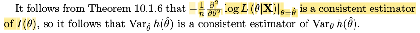</kbd>

> [!NOTE]
> Còn một ý, nói -(1/n) ∂^2/∂θ^2 log L(θ|**X**)|θ=θ^ là consistent estimator của I(θ), Là sao ta?
>
>
>
> Vì ∂^2/∂θ^2 log L(θ|**X**) = ∂^2/∂θ^2 log f(**X**|θ)
>
>
>
> = ∂^2/∂θ^2 log Πi f(Xi|θ)
>
>
>
> = ∂^2/∂θ^2 Σi \[log f(Xi|θ)\]
>
>
>
> = Σi \[∂^2/∂θ^2 log f(Xi|θ)\]
>
>
>
> Dĩ nhiên ∂^2/∂θ^2 log f(Xi|θ) là một random variable. Và với iid random sample X1,...Xn thì ta cũng có một random sample Y1, ...Yn với Yi = ∂^2/∂θ^2 log f(Xi|θ)
>
>
>
> Do đó Ybar = (Σi Yi)/n = (1/n) Σi \[∂^2/∂θ^2 log f(Xi|θ)\]
>
>
>
> và theo LLN, Ybar → (p) E\_θ\[Yi\] = E\_θ\[∂^2/∂θ^2 log f(Xi|θ)\]
>
>
>
> và cái này thì chính là -Ii(θ), tức information number của observation i'th.
>
>
>
> Do đó, -Ybar = (1/n) Σi \[∂^2/∂θ^2 log f(Xi|θ)\] → (p) Ii(θ)
>
>
>
> Kết quả này thì có nghĩa là gì?
>
>
>
> Có nghĩa là cái xấp xỉ lúc nãy:
>
>
>
>  Var(h(θ^)) ≈ \[h'(θ^)^2 / -∂^2/∂θ^2 log L(θθ^|**X**)\] có đặc địểm:
>
>
>
> mẫu số -∂^2/∂θ^2 log L(θθ^|**X**)  = -n Ybar là consistent estimator của n Ii(θ), tức là In(θ)
>
>
>
> Vậy Var(h(θ^)) = nominator / denominator. Mà denominator là consistent estimator của In(θ).
>
>
>
> Còn nominator \[h'(θ^)\]^2 cũng sẽ hội tụ về \[h'(θ)\]^2 vì n → inf, θ^ → θ (do mle là consistant estimator của θ)
>
>
>
> Vậy suy ra Var(h(θ^)) cũng → (p) \[h'(θ)\]^2 / In(θ), tức là công thức xấp xỉ ban đầu mà ta lập luận từ Delta method và định nghĩa hiệu quả tiệm cận.
>
>
>
> Tóm lại, ý nói, cái việc ta dùng θ^ thay cho θ, và dùng observed information number thay cho expected information number In(θ). thì ta vẫn đang có một consistent estimator: Var^(h(θ^)), hay Var\_θ^(h(θ^)) là consistent estimator của Var\_θ(h(θ^))

**🔗 See also:** [Delta Method Variance Approximation](#node-2mwxabg) · [Tính nhất quán của MLE](#node-d19dn75) · [Approximate binomial variance](#node-ytulpwg)

 

- **Approximate binomial variance**

<kbd>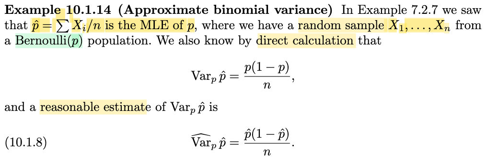</kbd>

> [!NOTE]
> Rồi, thế thì, hôm qua đã học về đại khái là cách để estimate variance của một mle θ^ - maximum likelihood estimator của θ, chính xác hơn là variance của h(θ^).
>
>
>
> Recall nhanh lần nữa cho nhớ:
>
>
>
> Đại khái là theo định nghĩa của (cái gọi là một estimator hiệu quả tiệm cận) đó là: nếu Yn là estimator hiệu quả tiệm cận của θ, thì Avar(Yn) = 1/I1(θ) với I1(θ) là infomation number of 1 observation. Và biểu thị toán học là √n(Yn - θ) → (d) (1, 1/I1(θ))
>
>
>
> Rồi, theo Delta method, nếu Avar(Yn) = σ^2 thì Avar(g(Yn)) = \[g'(θ)\]^2 σ^2 = \[g'(θ)\]^2 Avar(Yn). Như vậy, giả sử ta có Yn là estimator hiệu quả tiệm cận ở trên thì Avar(g(Yn)) = \[g'(θ)\] (1/I1(θ)). Và cái này thì có nghĩa là √n(g(Yn) - g(θ)) → (d) n(0, \[g'(θ)\] (1/I1(θ))), nên nếu n lớn, ta có Var\[√n(g(Yn) - g(θ)\] ≈ \[g'(θ)\] (1/I1(θ)) ⇔ Var(g(Yn)) ≈ \[g'(θ)\] / nI1(θ)
>
>
>
> Và vế phải, \[g'(θ)\] / nI1(θ), theo CRLB theorem, nói rằng, nếu ta có Wn là estimator của g(θ), thì Var(Wn) ≥ \[d/dθ E\_θ(Wn)\]^2 / In(θ). Nên nếu Wn có Eθ\[Wn\] = g(θ), thì Var(Wn) ≥ \[g'(θ)\]^2 / In(θ) = \[g'(θ)\]^2 / nI1(θ)
>
>
>
> Như vậy có thể thấy, với việc Var(g(Yn)) ≈ \[g'(θ)\] / nI1(θ) và Var(Wn) ≥ \[g'(θ)\]^2 / In(θ) = \[g'(θ)\]^2 / nI1(θ) thì như vậy ta có thể dùng CRLB của Wn có kì vọng = g(θ) để xấp xỉ cho Var(g(Yn))
>
>
>
> Áp dụng với θ^ là mle của θ, theo bữa trước đã chứng minh, thì mle là một estimator hiệu quả tiệm cận cũng như consistent. Nên theo trên, ta có: Var\[h(θ^)\] có thể tính xấp xỉ bởi CRLB của Var(Wn) có E\[Wn\] = h(θ) = \[h'(θ)\]^2 / nI1(θ),
>
>
>
> Và ta gọi cái này là Var\_θ(h(θ^))
>
>
>
> Tuy nhiên, công thức xấp xỉ này cũng vô dụng vì ta không biết θ. Nên tới đây, ta mới đi thêm một bước nữa: Dùng chính θ^ để estimate cho θ trong công thức \[h'(θ)\]^2 / nI1(θ)
>
>
>
> Và sau đó, khi xét In(θ) có công thức là E\_θ{\[∂/∂θ log f(**X**|θ)\]^2}, thì dùng một Lemma, ta thấy nó bằng - E\_θ\[∂^2/∂θ^2 log f(**X**|θ)\] = - E\_θ\[∂^2/∂θ^2 log L(θ|**X**)\].
>
>
>
> Thế thì, E\_θ{\[∂/∂θ log f(**X**|θ)\]^2} là expected information number, còn -∂^2/∂θ^2 log L(θ|**X**) là observed information number và ta sẽ dùng observed information number.
>
>
>
> Như vậy Var\_θ(h(θ^)) với việc dùng observed information number cũng như là dùng θ^ thay cho θ, ta sẽ có:
>
>
>
> Var\_θ(h(θ^)) ≈ Var\_θ^(h(θ^)), hay Var^\_θ(h(θ^)) = \[h'(θ)\]^2|θ=θ^ / \[-∂^2/∂θ^2 log L(θ|**X**)\]|θ=θ^, chính là cách mà ta sẽ estimate công thức xấp xỉ cho Var(h(θ^))
>
>
>
> ---
>
>
>
> Trên cơ sở vừa ôn lại lí thuyết này xong, ta sẽ áp dụng vào ví dụ 10.1.14:
>
>
>
>  Ở đây ta có p^ = (Σi Xi)/n là MLE của p với bối cảnh bài toán là ta có random sample X1, X2,...Xn iid \~ Bern(p).
>
>
>
> Và tính Var(p^) một cách trực tiếp thì ta tính ra được = p(1-p)/n 
>
>
>
> (Cái này chỉ đơn giản là với sample mean, ta đã chứng minh Var(Xbar) = Var(X) / n, nên ở đây Var(Xbar), tức Var(p^) = Var(Xi) / n. Variance của Bern(p) có thể chứng minh nhanh: = EX^2 - (EX)^2 = 1^2 × p + 0^2 × (1-p) - p^2 = p(1-p). Nên Var(p^) = p(1-p)/n)
>
>
>
> và dùng p^ thay cho p trong công thức Var_p(p^), ta sẽ có Var^(p^) (hay Var_p^(p^) công thức xấp xỉ của Var_p(p^)):
>
>
>
>  Var^(p^) = p^(1-p^)/n

**🔗 See also:** [Theorem 10.1.6 on Consistent Estimators](#node-cpdjv2x) · [Asymptotic Efficiency of Estimator p̂](#node-ct81g3i)

 

- **Asymptotic Efficiency of Estimator p̂**

<kbd>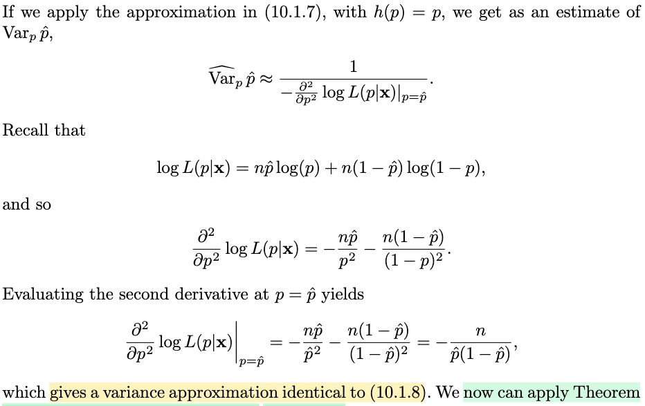</kbd>

> [!NOTE]
> Rồi, bây giờ ta áp dụng công thức Var^(h(θ^)) ≈ \[h'(θ)\]^2|θ=θ^ / \[-∂^2/∂θ^2 log L(θ|**x**)\]|θ=θ^
>
>
>
> Với h(θ) = θ thì:
>
>
>
> Tử số: \[h'(θ)\]^2|θ=θ^ = 1
>
>
>
> Mẫu số: \[-∂^2/∂θ^2 log L(θ|**x**)\]|θ=θ^
>
>
>
> Để tính mẫu số ta xét cái này trước:
>
>
>
> log L(θ|**x**) = log f(**x**|θ) = log Πi f(xi|θ) = Σi \[log(p^xi (1-p)^(1-xi))\]
>
>
>
> = Σi {log(p^xi) + log\[(1-p)^(1-xi)\]}
>
>
>
> = Σi {xi log(p) + (1-xi) log(1-p)}
>
>
>
> = Σi {xi log(p) + (1-xi) log(1-p)}
>
>
>
> = Σi {xi log(p)} + Σi{(1-xi) log(1-p)}
>
>
>
> = log(p) Σi xi + log(1-p) Σi (1-xi)
>
>
>
> = log(p) np^ + log(1-p) (n-Σixi)
>
>
>
> = log(p) np^ + log(1-p) (n-np^)
>
>
>
> = log(p) np^ + log(1-p) n(1-p^)
>
>
>
> ⇨ ∂/∂p \[log(p) np^ + log(1-p) n(1-p^)\]
>
>
>
> = ∂/∂p \[log(p) np^\] + ∂/∂p\[log(1-p) n(1-p^)\]
>
>
>
> = np^ ∂/∂p \[log(p)\] + n(1-p^) ∂/∂p\[log(1-p)\]
>
>
>
> = np^ (1/p) + n(1-p^) \[-/(1-p)\]
>
>
>
> Và ∂^2/∂p^2 \[log(p) np^ + log(1-p) n(1-p^)\]
>
>
>
> = ∂/∂p \[np^ (1/p) + n(1-p^) \[-1/(1-p)\]\]
>
>
>
> = ∂/∂p \[np^ (1/p)\] + ∂/∂p \[n(1-p^) \[-1/(1-p)\]\]
>
>
>
> = np^ × (-1/p^2) + ∂/∂p \[n(1-p^) \[1/(1-p)^2\]\]
>
>
>
> = -np^/p^2 + n(1-p^)/(1-p)^2
>
>
>
> Vậy -∂^2/∂θ^2 log L(θ|**x**) = -\[-np^/p^2 + n(1-p^)/(1-p)^2\]
>
>
>
> = np^/p^2 + n(1-p^)/(1-p)^2
>
>
>
> (chú ý, np^/p^2 là n p_hat chia p bình phương, coi chừng nhìn nhầm và rút gọn thành n/p^ là sai)
>
>
>
> Evaluate tại p = p^:
>
>
>
> \[-∂^2/∂p^2 log L(p|**x**)\]|p=p^
>
>
>
> = np^/(p^)^2 + n(1-p^)/(1-p^)^2
>
>
>
> = n/p^ + n/(1-p^)
>
>
>
> = \[n(1-p^)/p^(1-p^) + np^/p^(1-p^)
>
>
>
> = n/p^(1-p^)
>
>
>
> Và như vậy Var^(h(p^)) ≈ \[h'(p)\]^2|p=p^ / \[-∂^2/∂p^2 log L(p|**x**)\]|p=p^
>
>
>
> ⇔ Var^(p^) ≈ 1 / \[n/p^(1-p^)\]
>
>
>
> ⇔ Var^(p^) ≈ p^(1-p^)/n
>
>
>
> Và công thức này thì giống công thức Var^(p^) = p^(1-p^)/n mà ta đã tính hồi nãy (thế p^ thay cho p, trong công thức Var(p) = p(1-p)/n
>
>
>
> Ý quan trọng muốn nhấn mạnh đó là: Trong bài toán này, ta biết mle thật sự sẽ có công thức là Var(p^) (hay Var_p(p^), để thể hiện nó là hàm theo p) = p(1-p)/n. Để rồi từ đó, bằng cách dùng p^ thay p, ta có ước lượng của variance Var^(p^) = p^(1-p^)/n.
>
>
>
> Sau đó, bằng cách tiếp cận dựa trên lí thuyết nói rằng Var^(h(θ^)) ≈ \[h'(θ)\]^2|θ=θ^ / \[-∂^2/∂θ^2 log L(θ|**x**)\]|θ=θ^, ta cũng tính ra được cùng kết quả Var^(p^) ≈ p^(1-p^)/n.
>
>
>
> Như vậy có nghĩa là: **Giả sử ta không có công thức** **Var(θ^) theo θ, kí hiệu Var\_θ(θ^), để từ đó thế θ^ vào để có Var^(θ^), là xấp xỉ của Var\_θ(θ^). Thì ta có thể dùng cách tiếp cận thứ hai nói trên**: Chỉ việc tính:
>
>
>
> i) \[h'(θ)\]^2|θ=θ^, mà ở đây khi đang tính Var(θ^) thì tức là h(.) = identity function, \[h'(θ)\]^2|θ=θ^ = 1.
>
>
>
> ii) Tính -∂^2/∂θ^2 log L(θ|**x**)\]|θ=θ^, tức là derive công thức đạo hàm bậc hai của log likelihood L(θ|**x**), sẽ ra một hàm theo θ, lấy dấu âm, và thế θ^ vào.
>
>
>
> iii) Khi đó 1/\[kết quả mẫu số\], chính là cũng sẽ cho ra Var^(θ^), mà trong ví dụ cụ thể này, đó là Var^(p^) ≈ p^(1-p^)/n

> [!TIP]
> **🤖 AI Feedback** — ✅ Score: **90/100**
>
> Bài làm rất chi tiết và có chiều sâu, giải thích rõ ràng từng bước và mục đích của việc áp dụng công thức xấp xỉ phương sai, đồng thời so sánh kết quả với công thức đã biết. Tuy nhiên, trong quá trình tính đạo hàm bậc hai của hàm log likelihood, bạn đã mắc lỗi về dấu ở thành phần thứ hai (∂/∂p [n(1-p^) [-1/(1-p)]] phải là -n(1-p^)/(1-p)^2 chứ không phải dương), dù kết quả cuối cùng vẫn chính xác.

**🔗 See also:** [Approximate binomial variance](#node-ytulpwg) · [Tính nhất quán của MLE](#node-d19dn75) · [Giới hạn dưới Cramer-Rao](#node-ihoar4m) · [Asymptotic Efficiency of Estimator p̂ (bản sao)](#node-suvnj6h)

 

- **Asymptotic Efficiency of Estimator p̂ (bản sao)**

<kbd>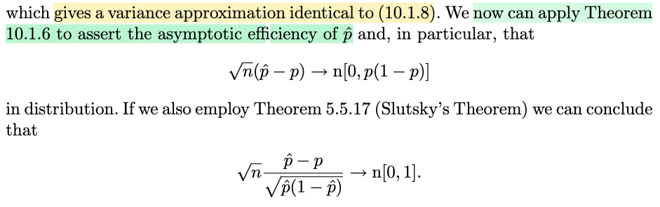</kbd>

> [!NOTE]
> Tiếp, đoạn này nói rằng vì p^, hay θ^ là mle, được theo theorem nào đó, là một estimator có tính hiệu quả tiệm cận và consistent.
>
>
>
> √n(p^ - p) → (d) n(0, 1/I1(p))
>
>
>
> với I1(p) = E_p\[(∂/∂p log f(X|p))^2\]
>
>
>
> log f(X|p) = log\[p^X (1-p)^(1-X)\]
>
>
>
> = X log(p) + (1-X)l og(1-p)
>
>
>
> ⇨ d/dp \[X log(p) + (1-X) log(1-p)\]
>
>
>
> = X/p + (1-X) \[-1/(1-p)\]
>
>
>
> = X/p - (1-X)/(1-p)
>
>
>
> = X(1-p)/p(1-p) - p(1-X)/p(1-p)
>
>
>
> = \[X(1-p) - p(1-X)\]/p(1-p)
>
>
>
> = \[X - Xp - p + pX)\]/p(1-p)
>
>
>
> = (X-p)/p(1-p)
>
>
>
> E_p\[(∂/∂p log f(X|p))^2\] = E_p\[((X-p)/p(1-p))^2\]
>
>
>
> = E_p\[((X-p))^2\] / \[p(1-p)\]^2
>
>
>
> = Var_p(X) / \[p(1-p)\]^2
>
>
>
> = p(1-p) / \[p(1-p)\]^2
>
>
>
> = 1 / p(1-p)
>
>
>
>  Như vậy **√n(p^-p) → (d) n(0, 1/I1(p)) = n(0, p(1-p))**
>
>
>
> Lại cộng với Slusky theorem: Xn → (d) X, Yn → (p) a ⇨ XnYn → (d) aX
>
>
>
> Ta có ở trên √n(p^-p) → (d) n(0, p(1-p)),
>
>
>
> và 1/√\[p^(1-p^)\] → (p) 1/√\[p(1-p)\] do p^ → (p) p
>
>
>
> nên √n(p^-p) × \[1/√\[p^(1-p^)\]\] → (d) n(0, p(1-p)) × 1/√\[p(1-p)\])
>
>
>
> Mà với Z \~ n(0, σ^2), tức là một thành viên của location scale family ứng với scale = σ, thì theo location scale family, Z/σ sẽ \~ n(0,1). Vậy n(0, p(1-p)) /√\[p(1-p)\] sẽ \~ n(0,1)
>
>
>
> Vậy √n(p^-p)/√\[p(1-p)\] → (d) n(0, 1).

> [!TIP]
> **🤖 AI Feedback** — ✅ Score: **98/100**
>
> Phân tích của bạn rất sâu sắc và chính xác, đặc biệt là phần dẫn xuất Fisher Information để chứng minh phương sai. Bạn đã giải thích rất rõ ràng cách áp dụng Định lý Slutsky và chuẩn hóa phân phối để đạt được kết quả cuối cùng.

**🔗 See also:** [Asymptotic Efficiency of Estimator p̂](#node-ct81g3i) · [Section 10.1 Point Estimation](#node-13p5sy2)

 

- **Section 10.1 Point Estimation**

<kbd>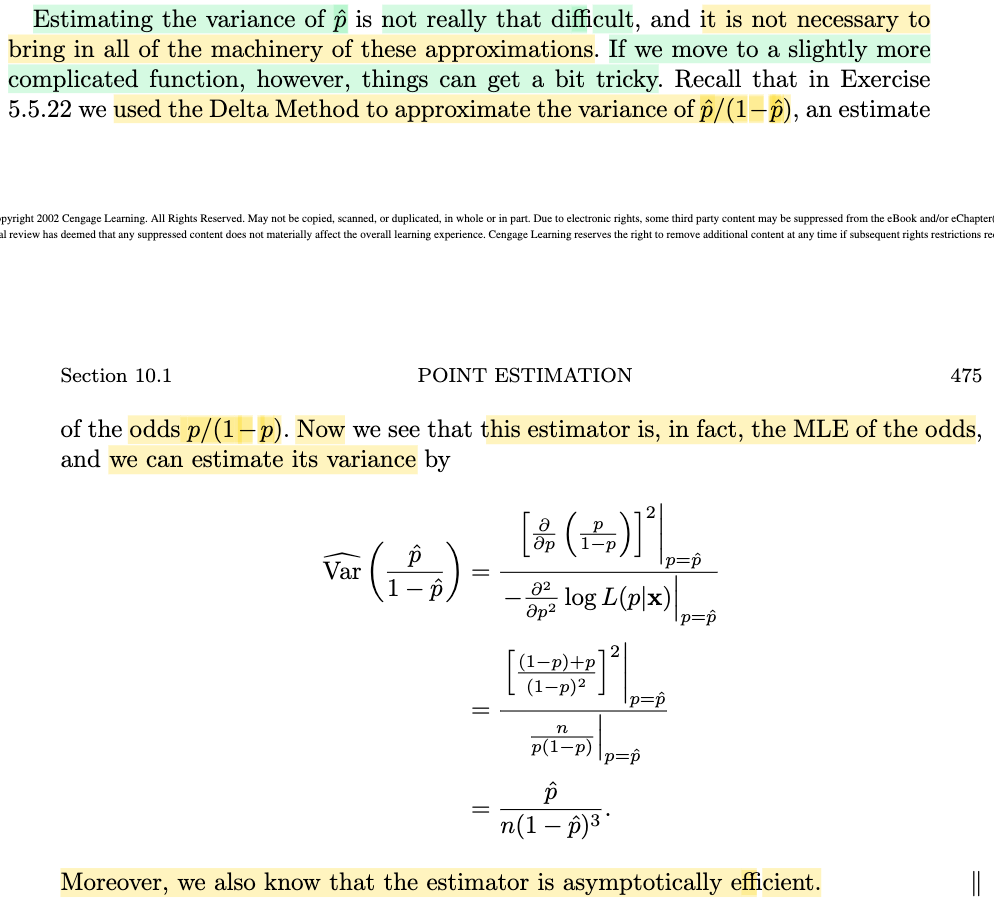</kbd>

> [!NOTE]
> Mình thấy cần thiết phải ôn lại cái lập luận dẫn đến cách tiếp cận để giải quyết được bài toán estiamte variance của một mle vì thật sự đây là kiến thức rất khó và quan trọng.
>
>
>
> Đầu tiên cần nhấn mạnh, yêu cầu đặt ra là estiamte được variance của một mle θ^, của θ. Ta sẽ dựa trên các công cụ sau đây:
>
>
>
> Đầu tiên là khái niệm phương sai tiệm cận (asymptotically variance), kí hiệu Avar, được định nghĩa là phương sai của phân phối chuẩn mà √n(Wn - θ) hội tụ (distribution) về. Tức là, nếu ta có √n(Wn - θ) → (d) n(0, σ^2), thì Avar(Wn) = σ^2.
>
>
>
> Rồi, tiếp theo, là Delta method theorem, nói rằng nếu √n(Wn - θ) → (d) n(0, σ^2), thì √n(g(Wn) - g(θ)) → (d) n(0, g'(θ)^2 σ^2). Điều này cũng đồng nghĩa nói đơn giản hơn là nếu Wn có phương sai tiệm cận là Avar(Wn) thì Avar\[g(Wn)\] = \[g'(θ)\]^2 Avar(Wn).
>
>
>
> Kế đến, là công cụ nữa: Khái niệm thế nào là một estimator có tính hiệu qủa tiệm cận: Định nghĩa nói rằng, nếu estimator Wn của θ có Avar(Wn) = 1/I1(θ), thì nó là estiamator hiệu quả tiệm cận, đồng thời cũng imply consistent.
>
>
>
> Và công cụ tiếp theo là theorem nói rằng ML estimator của θ hay h(θ) thì sẽ là estimator hiệu quả tiệm cận.
>
>
>
> Với tất cả các công cụ trên ta sẽ lập luận như sau:
>
>
>
> Xét θ^, là MLE của θ và ta như ban đầu đã nói, ta muốn estimate variance của h(θ^).
>
>
>
> Thế thì, vì θ^ là MLE của θ, nên nó là estimator hiệu quả tiệm cận: Do đó Avar(θ^) = 1/I1(θ), I1(θ) là information number của 1 observation. Và theo định nghĩa của phương sai tiệm cận thì ta có √n(θ^ - θ) → (d) n(0, 1/I1(θ)).
>
>
>
> Rồi, theo Delta method theorem, khi θ^ có phương sai tiệm cận là Avar(θ^) thì Avar\[h(θ^)\] = \[h'(θ)\]^2 Avar(θ^), thay kết quả trên vào ta có:
>
>
>
> Avar\[h(θ^)\] = \[h'(θ)\]^2 \[1/I1(θ)\]
>
>
>
> Và theo định nghĩa của phương sai tiệm cận thì ta có:
>
>
>
> √n\[h(θ^) - h(θ)\] → (d) n(0, \[h'(θ)\]^2 \[1/I1(θ)\])
>
>
>
> Và điều này, ý nghĩa của nó là, khi n lớn đến vô hạn thì random variable √n\[h(θ^) - h(θ)\] sẽ có distribution là n(0, \[h'(θ)\]^2 \[1/I1(θ)\]).
>
>
>
> Vậy nếu xét n đủ lớn, thì ta có thể nói Var\[ √n\[h(θ^) - h(θ)\]\] ≈ \[h'(θ)\]^2 \[1/I1(θ)\]
>
>
>
> ⇔ n \[Var\[h(θ^)\] + 0\] ≈ \[h'(θ)\]^2 \[1/I1(θ)\] (khai triến vế trái theo tính chất của phương sai Var(c1X + c2) = c1^2Var(X).
>
>
>
> ⇔ Var\[h(θ^)\] ≈ \[h'(θ)\]^2 \[1/I1(θ)\] / n
>
>
>
> ⇔ Var\[h(θ^)\] ≈ \[h'(θ)\]^2 / nI1(θ)
>
>
>
> Tới đây là ta đã có công thức để tính xấp xỉ variance của h(θ^) rồi.
>
>
>
> Và với việc biết về theorem Cramer Rao Lower Bound, nói rằng, nếu ta có Wn là chuỗi estimator của θ, thì phương sai của nó không thể nhỏ hơn CRLB: Var\_θ(Wn) ≥ \[d/dθ E\_θ\[Wn\]^2/ In(θ). Và nếu ta có Wn là estiamtor có E\[Wn\] = h(θ) thì Var\_θ(Wn) ≥ \[h'(θ)\]^2/ In(θ) = \[h'(θ)\]^2/ nI1(θ) chính là cái trên. Do đó ta mới nói:
>
>
>
> Var\[h(θ^)\] ≈ \[h'(θ)\]^2 / nI1(θ) là CRLB của một estimator Wn có E\[Wn\] = h(θ)
>
>
>
> Rồi, thế thì tuy là ta có công thức để mà estimate Var(h(θ^)) ≈ \[h'(θ)\]^2 / nI1(θ) nhưng công thức này vô dụng vì dù sao ta cũng không thể biết θ là gì. Do đó, ta sẽ làm hai động tác để lại mang ý nghĩa là ta sẽ ước lượng (estimate) cái công thức xấp xỉ (approximate) trên:
>
>
>
> i) Động tác đầu tiên là chỗ nào có θ thì ta dùng θ^.
>
>
>
> ii) Động tác thứ hai, là nói về cái In(θ), vốn có công thức cần phải tính kì vọng: E\_θ{\[∂/∂θ log f(**X**|θ)\]^2}, nên nó gọi là expected information number.
>
>
>
> Phân tích cái này: Đầu tiên hãy hiểu rằng f(**X**|θ) là random variable có được bởi việc áp joint pdf của **X**: f(**x**|θ) lên random variable vector **X**, và sau đó là áp hàm log, rồi lấy đạo hàm theo θ, rồi bình phương, nên cuối cùng ta vẫn là có một random variable. Hay nói cách khác, ta có thể coi như đây là random variable có được bằng cách áp hàm g(**x**) = {d/dθ \[log f(**x**|θ)\]}^2, lên **X**. Và vì là random variable, nên ta có quyền lấy kì vọng. Và thêm nữa vì đây là random variabel có được từ việc áp dụng hàm g lên **X**, mà ông **X** có distribution phụ thuộc θ: **X** \~ f(**x**|θ) nên dĩ nhiên g(**X**) cũng vậy, và do đó expected value của nó phải là hàm phụ thuộc θ, nên nó mới có cái chữ θ ở dưới chân: E\_θ{\[∂/∂θ log f(**X**|θ)\]^2}. Nói chung hiểu bản chất của hắn ta sẽ dễ hiểu mấy khúc sau.
>
>
>
> Rồi, Theo Lemma 7.3.11 nói rằng nếu f(x|θ) thỏa d/dθ E\_θ\[∂/∂θ log f(**X**|θ)\] = ∫ ∂/∂θ\[(∂/∂θ log f(x|θ)d(x|θ)\] dx thì:
>
>
>
> E\_θ{\[∂/∂θ log f(**X**|θ)\]^2} = - E\_θ\[∂^2/∂θ^2 log f(**X**|θ)\]
>
>
>
> Và để tính kì vọng cuả cái này, thì vì ko biết θ, nên cũng không thể tính được. Do đó, ta sẽ không dùng kì vọng, mà thay bằng cái gọi là **observed information number**.
>
>
>
> Tức là thay - E\_θ\[∂^2/∂θ^2 log f(**X**|θ)\]
>
>
>
> bằng: - ∂^2/∂θ^2 log f(**x**|θ) 
>
>
>
> (chú ý, ở trên, là **X**, vì đây là random variable, và ta tính kì vọng của cái ∂^2/∂θ^2 log f(**X**|θ), cũng là random variable. Còn ở dưới, là ta thế observed value vào, bỏ kì vọng)
>
>
>
> Và với hai động tác đó, ta có công thức estimate cái công thức approximate:
>
>
>
> Var\[h(θ^)\] ≈ \[h'(θ)\]^2 / nI1(θ)
>
>
>
> ≈ \[h'(θ)\]^2|θ=θ^ / \[-∂^2/∂θ^2 log f(**x**|θ)\]|θ=θ^
>
>
>
> Và dĩ nhiên f(**x**|θ) = L(θ|**x**)
>
>
>
> ≈ \[h'(θ)\]^2|θ=θ^ / \[-∂^2/∂θ^2 logL(θ|**x**)\]|θ=θ^
>
>
>
> ---
>
>
>
> Rồi. thế thì ở đây nhắc đến trong bài tập 5.5.22 mình đã dùng Delta Method để approximate var(p^/(1-p^)). Thì như vừa ôn lại Delta method ở trên, theorem này nói rằng nếu Wn có Avar(Wn) thì g(Wn) có Avar(g(Wn)) = \[g'(θ)\]^2 Avar(Wn). Nên áp dụng cái này, ta sẽ coi như g(p^) = p^/(1-p^) để rồi:
>
>
>
> Avar\[p^/(1-p^)\] = \[g'(p)\]^2 Avar(p^)
>
>
>
> và với cái này thì ta có thể có Var\[p^/(1-p^)\] ≈ \[g'(p)\]^2 Avar(p^)/n
>
>
>
> Thế thì mình biết với random sample X1, X2,... Xn có mean μ và variance σ^2 thì CLT (central limit theorem) cho ta biết rằng √n(Xbar - μ)/σ → (d) n(0, 1), cũng chính là √n(Xbar - μ) → n(0, σ^2).
>
>
>
> Vậy áp dụng CLT ta sẽ có √n(p^ - p) → n(0, true variance) với true variance trong bài toán này là p(1-p). Vậy nên Avar(p^) = p(1-p).
>
>
>
> Còn \[g'(p)\]^2: g(p) = p/(1-p)
>
>
>
> ⇨ g'(p) = { \[d/dp p\](1-p) - p \[d/dp (1-p)\] } / (1-p)^2
>
>
>
> = \[(1-p) + p\] / (1-p)^2
>
>
>
> = 1 / (1-p)^2
>
>
>
> Vậy thay vô ta có: Var\[p^/(1-p^)\] ≈ \[g'(p)\]^2 Avar(p^)/n
>
>
>
> = \[1 / (1-p)^2\]^2 × p(1-p) / n
>
>
>
> = \[1 / (1-p)^4\] × p(1-p) / n
>
>
>
> = p / n(1-p)^3\]
>
>
>
> Vậy Var\[p^/(1-p^)\] ≈ p / n(1-p)^3\] và đây chính là ta đã giải lại bài tập 5.5.22 tính Var\[p^/(1-p^)\] theo Delta method. Và dĩ nhiên ta lại không có p, nên dùng cách thay p^ vào p, để có estimate của cái xấp xỉ này:
>
>
>
> Var^\[p^/(1-p^)\] ≈ Var_p\[p^/(1-p^)\]|p=p^ = p/n(1-p)^3|p=p^
>
>
>
> = **p^/n(1-p^)^3**
>
>
>
> ---
>
>
>
> Giờ, ta sẽ dùng cái kiến thức hồi nãy vừa ôn lại để tính cái này theo cách đó.
>
>
>
> Đó là Var(g(p^)) ≈ \[g'(p)\]^2|p=p^ / \[-∂^2/∂θ^2 log L(p|**x**)\]|p=p^
>
>
>
> Tử số: \[g'(p)\]^2 như trên đã tính = 1/(1-p)^4 
>
>
>
> ⇨ 1/(1-p)^4|p=p^ = 1/(1-p^)^4
>
>
>
> Mẫu số: -∂^2/∂θ^2 log L(p|**x**) note trước mình đã tính = np^/p^2 + n(1-p^)/(1-p)^2
>
>
>
> Evaluate tại p^: np^/p^2 + n(1-p^)/(1-p)^2|p=p^
>
>
>
> = np^/p^2 + n(1-p^)/(1-p^)^2
>
>
>
> = n/p^ + n/(1-p^)
>
>
>
> = n/p^(1-p^)
>
>
>
> Vậy Var(g(p^)) = \[1/(1-p^)^4\] / \[n/p^(1-p^)\]
>
>
>
> = \[1/(1-p^)^4\] × \[p^(1-p^)/n\]
>
>
>
> = **p^/n(1-p^)^3**
>
>
>
> Kết quả y chang cách 1 dùng Delta method.

**🔗 See also:** [Asymptotic Efficiency of Estimator p̂ (bản sao)](#node-suvnj6h) · [MLE Variance Approximation Limitations](#node-0d20ljz)

 

- **MLE Variance Approximation Limitations**

<kbd>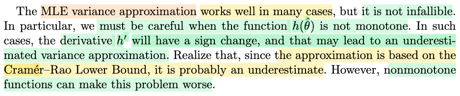</kbd>

> [!NOTE]
> Đoạn này đại ý là tuy phương pháp ước lượng xấp xỉ variance của MLE hoạt động khá tốt trong nhiều trường hợp, nhưng nó không phải là không thể fail. Đặc biệt là khi hàm h(θ^) không monotone. Trong những trường hợp như vậy, đạo hàm h'sẽ đổi dấu, và điều này sẽ dẫn đến việc underestimate - đánh giá giá trị của variance thấp hơn thực tế.
>
>
>
> Ông nói thêm, vốn dĩ, việc dùng CRLB để ước lượng xấp xỉ cho variance của h(θ^) vốn dĩ đã có thể dễ dẫn dến under estimate rồi. Nhưng với hàm không monotone thì vấn đề có thể tệ hơn.

**🔗 See also:** [Section 10.1 Point Estimation](#node-13p5sy2) · [Example 10.1.15 Bernoulli Variance](#node-irc30cd)

 

- **Example 10.1.15 Bernoulli Variance**

<kbd>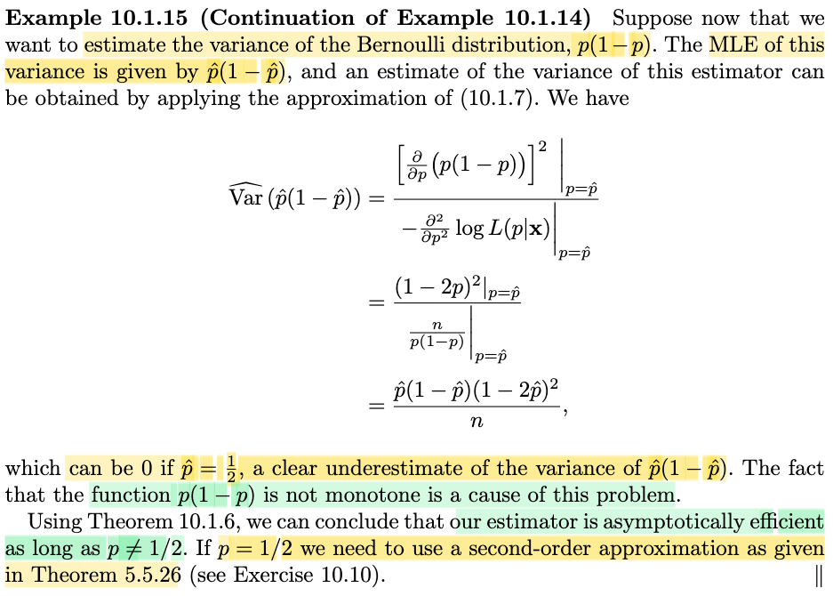</kbd>

> [!NOTE]
> Quay lại sau, nhưng đại ý đoạn này là minh họa rằng khi h(θ^) ko monotone thì giá trị xấp xỉ của variance Var(h(θ^)) có thể bị thấp hơn giá trị thật.

**🔗 See also:** [MLE Variance Approximation Limitations](#node-0d20ljz) · [Asymptotic Relative Efficiency](#node-2y7vyqf)

 

- **Asymptotic Relative Efficiency**

<kbd>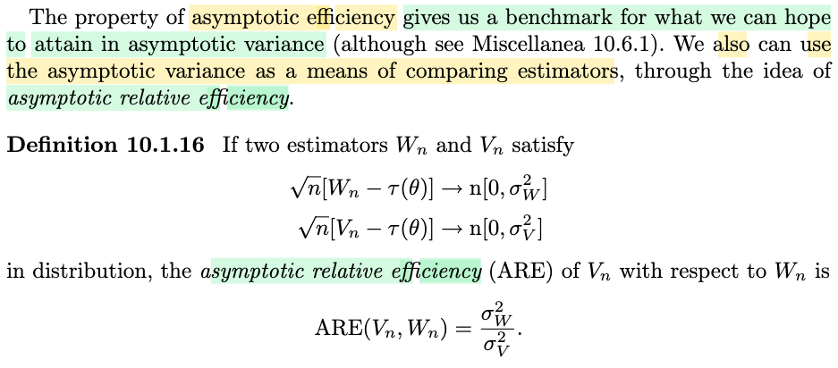</kbd>

> [!NOTE]
> Đại khái đoạn này nói rằng, tính chất hiệu quả tiệm cận rõ ràng cho ta một thước đo tiêu chuẩn mà một estimator hướng tới: Ý là, xét trên diện phương sai tiệm cận, thì tốt nhất chính là đặt được cái Cramer Rao Lower Bound (1/I1(θ)), để được gọi là estimator hiệu quả tiệm cận.
>
>
>
> Thì bên cạnh vai trò trên, ta sẽ bàn qua một tác dụng nữa của tính hiệu quả tiệm cận: Đó là dùng để so sánh các estimator.
>
>
>
> Để làm việc này, ta sẽ có định nghĩa của hiệu quả tiệm cận tương đối - asymptotic relative efficiency.
>
>
>
> Định nghĩa như sau:
>
>
>
> nếu ta có hai estimator Wn và Vn thỏa:
>
>
>
> √n(Wn - τ(θ)) → (d) n(0, σW^2) và
>
>
>
> √n(Vn - τ(θ)) → (d) n(0, σV^2)
>
>
>
> thì ARE của Vn wrt Wn được định nghĩa là ARE(Vn, Wn) = σW^2 / σV^2
>
>
>
> Suy nghĩ chút về cái định nghĩa này:
>
>
>
> Ta đã biết định nghĩa của phương sai tiệm cận: Đó là nếu √n(Wn - τ(θ)) → (d) n(0, σ^2) thì phương sai tiệm cận của Wn chính là σ^2: Avar(Wn) = σ^2.
>
>
>
> Vậy thì ở đây có thể hiểu định nghĩa của hiệu quả tiệm cận tương đối của Vn đối với Wn chính là tỉ lệ của Avar(Wn) và Avar(Vn) thôi chứ có gì đâu: 
>
>
>
> ARE(Vn, Wn) = Avar(Wn) / Avar(Vn)

> [!TIP]
> **🤖 AI Feedback** — ✅ Score: **98/100**
>
> Bài giải thích rất rõ ràng, bám sát nội dung gốc và còn mở rộng thêm chiều sâu bằng cách liên hệ với Cramer-Rao Lower Bound và định nghĩa phương sai tiệm cận (Avar), giúp người đọc dễ hiểu hơn về bản chất của Hiệu quả tiệm cận tương đối (ARE). Không có điểm yếu đáng kể, đây là một ghi chú xuất sắc.

**🔗 See also:** [Example 10.1.15 Bernoulli Variance](#node-irc30cd) · [Example 10.1.17 Poisson Estimators](#node-eej3duv)

 

- **Example 10.1.17 Poisson Estimators**

<kbd>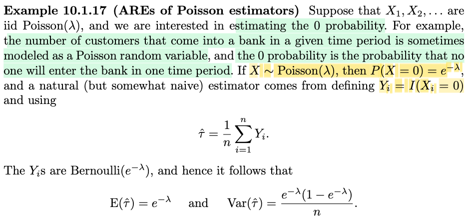</kbd>

> [!NOTE]
> Ví dụ này sẽ giúp ta thấy công dụng của ARE (hiệu quả tiệm cận tương đối). Đầu tiên, bài toán là cho X1, X2,... iid Poisson(λ). Và ta muốn estimate xác suất 0.
>
>
>
> Hiểu đại khái Xác suất 0, tức là xác suất X \~ pois(λ), bằng 0. Tức P(X = 0), và với pdf của Pois, thì P(X = 0) là e^-λ. Và ta hiểu thế này: ta ko biết λ thật bằng bao nhiêu, và ta muốn estimate cái hàm h(λ) = e^-λ này.
>
>
>
> Và đây cũng chỉ là bài toán point estimation thôi, thay vì estimate λ, ta estimate h(λ).
>
>
>
> Thế thì, mình nghĩ, ủa, thì nói mẹ nó là estimate λ đi, khi mày estimate được λ, ví dụ có λ^ (mle của λ) thì e^-λ^ sẽ là estimate cho "xác suất 0" không đúng sao.
>
>
>
> Nhưng cứ đọc tiếp: Thì tiếp theo, đại khái là gs nói rằng một cách đơn giản để estimate h(λ) đó là đặt Yi = I(Xi = 0), và dùng τ^ = (ΣYi)/n để estimate cho h(λ).
>
>
>
> Chỗ này mình hiểu: Có nghĩa là, cách làm naive và đơn giản là xem thử trung bình thì có bao nhiêu observed data = 0. Vì cái ta muốn estiamte là xác suất X = 0 mà. Nên ta sẽ đếm xem số event Xi = 0, hay số observed data có giá trị 0, và lấy trung bình.
>
>
>
> Và tức là mình hiểu Y1, ..Yn là các statistic: Y1 = I(X1 = 0), ..Yn = I(Xn = 0) và vì X1,..Xn iid \~ pois(λ) nên Y1,...Yn cũng tạo thành random sample iid \~ Bern(P(X = 0)), tức Bern(e^-λ) và τ^ chính là sample mean của random sample này.
>
>
>
> Nên ta có thể ghi là τ^(**Y**), mà thậm chí cũng có thể ghi là τ^(**X**), vì anyway, **Y** vẫn là hàm theo **X**: **Y** = \[I(X1 = 0, ...I(Xn = 0)\]
>
>
>
> Trong các chap trước mình đã biết với X \~ Bern(p) thì EX = p, Var(X) = p(1-p).
>
>
>
> Và ta cũng đã biết E\[Xbar\] = EX, Var(Xbar) = Var(X)/n
>
>
>
> Nên áp dụng vào đây, E\[τ^\] = EYi = e^-λ và Var(τ^) = (e^-λ)(1-e^-λ)/n
>
>
>
>  Nói thêm một ý, τ^, tức τ^(**Y**), là sample mean của sample Y1,...Yn như đã nói ở trên, nên theo CLT: √n(τ^ - E(Yi)) → (d) n(0, Var(Yi))
>
>
>
> ⇔ √n(τ^ - e^-λ) → (d) n(0, (e^-λ)(1-e^-λ), tí nữa ta sẽ dùng cái này.

> [!TIP]
> **🤖 AI Feedback** — ✅ Score: **100/100**
>
> Phân tích của bạn rất sâu sắc và chính xác, thể hiện sự hiểu rõ các khái niệm và khả năng đặt câu hỏi phản biện. Bạn đã giải thích rất rõ ràng nguồn gốc và ý nghĩa của các công thức, làm nền tảng vững chắc cho việc tìm hiểu về AREs.

**🔗 See also:** [Asymptotic Relative Efficiency](#node-2y7vyqf) · [MLE of e-lambda with Delta Method](#node-jiyzyog)

 

- **MLE of e-lambda with Delta Method**

<kbd>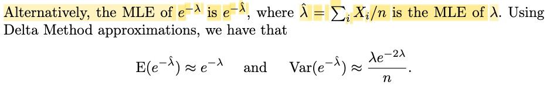</kbd>

> [!NOTE]
> Tiếp theo, gs nhắc đến mle của λ, là sample mean λ^ = (Σi Xi) / n cũng như nói e^-λ^ sẽ là mle của e^λ. Cùng tìm hiểu ý này.
>
>
>
> Đầu tiên là công thức mle. Có thể đi chứng minh lại nhanh:
>
>
>
> ML estimator, λ^(**x**) = argmax L(λ|**x**) = argmax f(**x**|λ)
>
>
>
> tức là ta cần giải bài toán tối ưu: maximize\_λ L(λ|**x**)
>
>
>
> f(**x**|λ) = L(λ|**x**) = Πi f(xi|λ) = Πi \[e^-λ λ^xi / xi!\]
>
>
>
> = (e^-λ)^n λ^(Σi xi) / (Πi xi!)
>
>
>
> Chuyển sang bài toán tương đương dùng hàm log
>
>
>
> ⇨ log L(λ|**x**) = log {(e^-λ)^n λ^(Σi xi) / (Πi xi!)}
>
>
>
> = log(e^-nλ) + log\[λ^(Σi xi)\] - log\[Πi xi!\]
>
>
>
> = -nλ +(Σi xi) log(λ) - log(Πi xi!)
>
>
>
> Again, chuyển sang bài toán tương đương tiếp tiếp theo, bằng cách bỏ đi constant:
>
>
>
> maximize\_λ {g(λ) = -nλ +(Σi xi) log(λ)}
>
>
>
> d/d g(λ) = 0 ⇔ -n + (Σi xi) 1/λ = 0 ⇔ λ = (Σi xi)/n, đây là stationary point. Và hàm (Σi xi) log(λ) là hàm concave, -nλ là hàm affine, vừa concave vừa convex ⇨ tổng hai hàm là concave function. Vậy stationary point chính là maximum ⇨ λ^ = (Σi xi)/n
>
>
>
> Còn ý thứ hai khi nói e^-λ^ cũng là mle của e^-λ là vì ta có theorem trong chap 7 nói về tính invariance của MLE (xem link)
>
>
>
> Như vậy là đã làm rõ câu đầu.
>
>
>
> ---
>
>
>
>  Tiếp, ông dùng Delta method để có E\[e^-λ^\] ≈ e^-λ và Var(e^-λ^) ≈ λ e^-2λ/n. Thử làm lại:
>
>
>
> i) Chứng minh: Var(e^-λ^) ≈ λ e^-2λ/n. Dùng Delta method theorem:
>
>
>
> Delta method theorem nói ngắn gọn là: nếu Wn có Avar(Wn) thì Avar(g(Wn)) = \[g'(θ)\]^2 Avar(Wn)
>
>
>
> Với g(λ) = e^-λ, thì g'(λ) = -e^-λ
>
>
>
> ⇔ Avar(e^(-λ^)\] = \[-e^-λ\]^2 Avar(λ^)
>
>
>
> Tiếp, CLT nói rằng với random sample X1,...Xn có EXi = μ và Var(Xi) = σ^2 &lt; inf thì √n(Xbar - μ)/σ → (d) n(0,1). Cũng chính là √n(Xbar - μ) → (d) n(0, σ^2).
>
>
>
> Nên ta sẽ có √n(λ^ - λ) → (d) n(0, Var(Xi)). Và Var(Xi) với Xi \~ Pois(λ), cũng là λ.
>
>
>
> Vậy ta có Avar(λ^) = λ
>
>
>
> ⇨ Avar(e^(-λ^)\] = \[-e^-λ\]^2 λ = λe^(-2λ)
>
>
>
> Tức √n(e^(-λ^) - e^(λ)) → n(0, λe^(-2λ))
>
>
>
> Và cái này có nghĩa là khi n lớn thì Var\[√n(e^(-λ^) - e^(-λ))\] ≈ λe^(-2λ)
>
>
>
> ⇔ n Var\[(e^(-λ^)\] ≈ λe^(-2λ)
>
>
>
> ⇔ Var\[e^(-λ^)\] ≈ λe^(-2λ) / n
>
>
>
> ---
>
>
>
> ii) Chứng minh E\[e^-λ^\] ≈ e^-λ:
>
>
>
> Cũng là delta method: dùng xấp xỉ tuyến tính của hàm g(λ) tại λ^, vì tính consistent (LLN nói rằng sample mean sẽ → (p) về true mean λ, và theo định nghĩa của consistent thì λ^ chính là consistent estimator của λ) chính là khi nên khi n → ∞ thì λ^ sẽ → λ, cho phép ta xấp xỉ tuyến tính g(λ) tại λ':
>
>
>
> g(λ^) ≈ g(λ) + g'(λ)(λ^ - λ)
>
>
>
> Tới đây nên nhớ λ^, có thể viết là λ^(**X**), cũng chỉ là một statistic, là một random variable, có được bởi áp một hàm số lên random sample **X**.
>
>
>
> Nên với việc ta xấp xỉ g(λ^) ≈ g(λ) + g'(λ)(λ^ - λ) thì do đó:
>
>
>
> g(λ^(**X**)) ≈ g(λ) + g'(λ)(λ^(**X**) - λ)
>
>
>
> Và vế trái là một random variable, vế phải cũng vậy (do đều là hàm áp lên **X**) và do đó mới có chuyện xét kì vọng của g(λ^(**X**)), cũng như là vì ta đang có hai hàm số xấp xỉ nhau, nên lấy trung bình cũng sẽ giữ dấu xỉ, và kết quả vẫn là hàm phụ thuộc λ do gốc rễ Xi \~ Pois(λ)
>
>
>
> E\_λ\[g(λ^(**X**))\] ≈ E\_λ\[g(λ) + g'(λ)(λ^(**X**) - λ)\].
>
>
>
> Hiểu bản chất rồi thì bỏ **X** đi cho gọn
>
>
>
> ⇔ E\_λ\[e^-(λ^)\] ≈ E\_λ\[g(λ)\] + E\_λ\[g'(λ)(λ^ - λ)\].
>
>
>
> ⇔ E\_λ\[e^-(λ^)\] ≈ g(λ) + g'(λ) E\_λ(λ^ - λ)
>
>
>
> ⇔ E\_λ\[e^-(λ^)\] ≈ g(λ) + g'(λ) \[E\_λ(λ^) - E\_λ(λ)\]
>
>
>
> ⇔ E\_λ\[e^-(λ^)\] ≈ e^-λ -e^-λ \[λ - λ\] (do E(λ^) = λ)
>
>
>
> ⇔ E\_λ\[e^-(λ^)\] ≈ e^-λ → Xong.

> [!TIP]
> **🤖 AI Feedback** — ✅ Score: **100/100**
>
> Bài giải này cực kỳ chính xác và chi tiết, không chỉ nhắc lại các công thức mà còn chứng minh từng bước một. Độ sâu phân tích vượt xa thông tin được cung cấp trong hình ảnh, thể hiện sự hiểu biết vững chắc về các khái niệm.

**🔗 See also:** [Example 10.1.17 Poisson Estimators](#node-eej3duv) · [Chứng minh tính bất biến MLE](#node-6d46egj) · [Stronger Central Limit Theorem](#node-yngnkwh) · [Asymptotic Relative Efficiency Analysis](#node-wgjpxiz)

 

- **Asymptotic Relative Efficiency Analysis**

<kbd>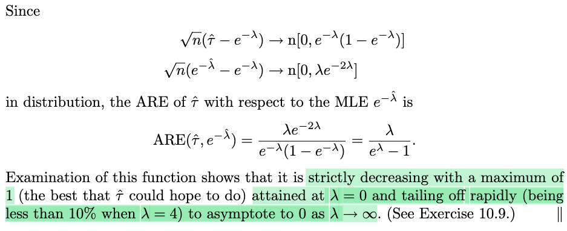</kbd>

<kbd>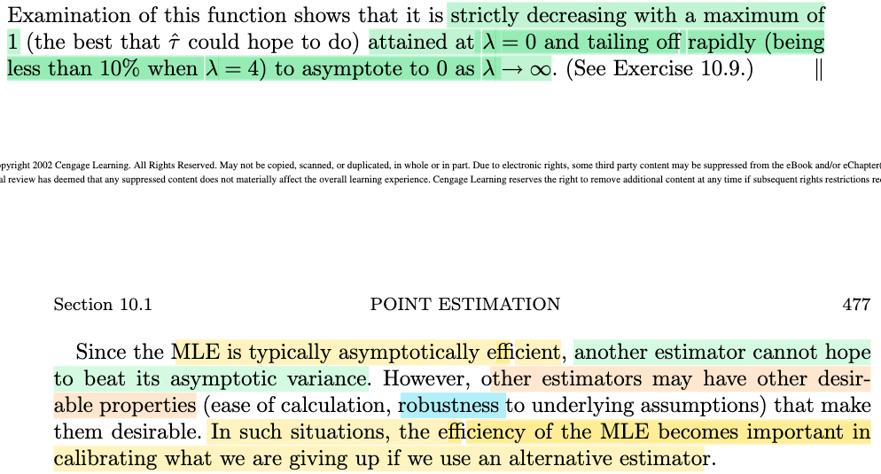</kbd>

> [!NOTE]
> Rồi, như vậy, phần đầu ta đã có:
>
>
>
> √n(τ^ - e^-λ) → (d) n(0, (e^-λ)(1-e^-λ)/n), tức Avar(τ^) = (e^-λ)(1-e^-λ)
>
>
>
> Phần sau, ta đã tự chứng minh lại để thấy E\[e^-λ^\] ≈ e^-λ và Var(e^-λ^) ≈ λ e^-2λ/n, cũng là Avar(e^(-λ^)\] = λe^(-2λ)
>
>
>
> Nên ráp vào định nghĩa của ARE(τ^,  e^(-λ^)) = Avar(e^(-λ^)\] / Avar(τ^)
>
>
>
> = λe^(-2λ) / \[(e^-λ)(1-e^-λ)\]
>
>
>
> = λe^(-2λ) / \[(e^-λ)(1-e^-λ)\]
>
>
>
> = λe^(-λ) / (1-e^-λ)
>
>
>
> = λ / (1/e^(-λ)-1)
>
>
>
> = λ / \[e^(λ) - 1\]
>
>
>
> Và ông nói nếu ta phác thảo cái hàm này sẽ thấy nó giảm liên tục đến gía trị lớn nhất = 1, khi λ = 0, sau đó giảm nhanh chóng.
>
>
>
>
>
> Rồi như vậy thì cái kết quả về cái sự biến động của cái hàm ARE đó gọi là đồ thị hiệu quả tiệm cận tương đối của hai cái estimator một cái τ^ và một cái là MLE. Thì kết quả này cho thấy rõ là với một cái estimator nào đó khác không phải MLE thì variance của nó, tức là cái variance tiệm cận của nó, asymptotically variance sẽ luôn luôn không thể nào vượt quá, tức là không thể nào nhỏ hơn cái phương sai tiệm cận của MLE được. 
>
>
>
> Và điều này về cơ bản là nó là điều mình đã đoán trước. Bởi vì MLE là một estimator có tính chất hiệu quả tiệm cận, asymptotically efficient. Mà theo định nghĩa của một cái estimator hiệu quả tiệm cận đó thì phương sai tiệm cận của nó sẽ đạt cái mức Cramer-Rao, mức chặn dưới. Tức là nó sẽ đạt cái mức nhỏ nhất có thể của một cái một cái estimator. Thành thử ra là cái kết quả trên nó là minh chứng hoặc là minh họa cho cái nhận định này. Để thấy rằng rõ ràng là thông qua cái chỉ số ARE đó thì mình sẽ thấy rằng là nó sẽ không thể nào mà vượt quá số một được. 
>
>
>
> (Phương sai tiệm cận của MLE ≤ phương sai tiệm cận của τ^ nên tỉ lệ không thể nào quá một)
>
>
>
> Thì cái đoạn cuối giáo sư nói rằng là cái MLE đó, cái tính chất hiệu quả tiệm cận nó cho mình một cái tiêu chí để mà so sánh các estimator.
>
>
>
> Tuy nhiên, là trong một số tình huống khác thì những estimator khác tuy có phương sai tiệm cận lớn hơn phương sai tiệm cận của MLE nhưng có thể nó sẽ tốt hơn MLE ở những tiêu chí khác ví dụ như robustness mà ở phần tiếp theo là mình sẽ nói. thử ra trong những cái tình huống như vậy giáo sư kết luận rằng cái tính hiệu quả của MLE nó trở thành một một yếu tố có thể khiến mình phải đắn đo trong cái việc là sử dụng những estimator khác: kiểu như nếu dùng cái khác thì phải hi sinh bao nhiêu mức efficient

> [!TIP]
> **🤖 AI Feedback** — ⚠️ Score: **85/100**
>
> Bài làm đã thể hiện sự hiểu biết sâu sắc về cách tính toán và rút gọn biểu thức ARE, các bước đạo hàm và rút gọn đại số đều chính xác. Tuy nhiên, mô tả về hành vi của hàm số chưa hoàn toàn đúng; hàm ARE này thực tế là giảm nghiêm ngặt thay vì tăng liên tục đến giá trị lớn nhất.

**🔗 See also:** [MLE of e-lambda with Delta Method](#node-jiyzyog)

 

