# 10.2 Robustness

📊 **Progress:** `16` Notes | `20` Screenshots | `16` AI Reviews

---

 

## Tính robust của ước lượng

<kbd></kbd>

> [!NOTE]
> Đại khái là gs cho biết, khi xây dựng estimator, ta đã luôn dựa trên một giả định về dạng của distribution. Ví dụ, cho random sample size n X1,...Xn có observed value x1,...xn, có population distribution f(x|θ), thì để bắt đầu đi xây dựng estimator của θ (theo MLE hay Bayes approach) thì đầu tiên ta phải giả định f có dạng phân phối gì cái đã. Ví dụ như normal(μ, σ^2), rồi từ đó mới đi derive (μ)ml và (σ^2)ml.
>
>
>
> Thế thì vì lí do đó, nên mới nói là khi ta đi evaluate chất lượng của một estimator, thì dĩ nhiên sự đánh giá này cũng đang dựa trên giả định trên. Mà giả định thì có thể sai. Cho nên ý chính muốn nói là, giả sử ta tìm ra W1(**X**) là một estimator rất tốt cho θ, và nó là cái tốt nhất, nên nó ngon hơn W2(**X**) Nhưng hóa ra giả định là sai, mà sự thật là, nếu dựa trên giả định đúng, thì W2(X) mới là cái tốt hơn.
>
>
>
> Như vậy, từ vấn đề này (chất lượng của estimator đang dựa trên giả định ban đầu nào đó về dạng của population distribution), nên người ta mới đặt vấn đề: Liệu có thể hi sinh chút xíu tính chất tối ưu của một estimator, nhưng tăng thêm tính chất khác: Đó là, nếu giả định sai, thì ta sẽ bớt bị ảnh hưởng hơn.
>
>
>
> Có nghĩa là, ta đặt ra một tính chất mới mà ta mong muốn ở estimator: Đó là mức độ chống chịu của nó khi giả định ban đầu là sai.
>
>
>
> Vậy hình dung thế này, W1(**X**), như đã nói, là cái tốt nhất dựa trên các tiêu chí tối ưu, và cái W2(**X**) chỉ xếp sau. Tuy nhiên, nếu giả định là sai, thì estimate của W1(**X**) là thảm họa, tụt dốc không phanh, trong khi đó, nếu giả định là sai, thì W2(**X**) vẫn là một estimator không đến nỗi nào. Khi đó, người ta sẽ cân nhắc việc dùng W2(**X**) thay vì W1(**X**), và như vậy, ta hi sinh chút tính chất optimality nhưng đổi lại được tính chất "chống chọi với giả định sai". Và tính chất này, người ta gọi là Robustness.

> [!TIP]
> **🤖 AI Feedback** — ✅ Score: **95/100**
>
> Your explanation is exceptionally clear and uses fantastic, concrete examples comparing W1 and W2 to perfectly capture the trade-off between optimality and robustness. To make it even more precise, you could note that robust estimators specifically guard against small-to-medium deviations from the assumed model rather than any complete model failure.

 

### Huber's Criteria for Robustness

<kbd></kbd>

> [!NOTE]
> Rồi, đại khái là ba cái ý này nó sẽ mô tả cho cái tính chất robustness. 
>
>
>
> Thứ nhất đó là nó nên có một cái độ hiệu quả tương đối tốt. Mà độ hiệu quả, tức là efficiency đó, thì theo mình đoán hoặc là theo mình nhớ một cái khái niệm mà mình đã học ở trong cái phần 10.1, nó gọi là asymptotically efficient, tức là hiệu quả tiệm cận. Tức là khi mà số lượng mẫu tăng lên vô hạn thì phương sai của cái estimator nó sẽ giảm về cái mốc nhỏ nhất (CRLB) Nói chung là cái mức biến động sẽ nhỏ đi khi mà tăng số lượng mẫu lên. Vậy thì có thể hiểu ý một đó là nó phải đủ tốt, nó phải có một cái độ tốt tương đối, reasonably good. 
>
>
>
> Cái thứ hai mới quan trọng, đó là cái tính chất robust nó sẽ phải thể hiện ở chỗ này. Đó là một cái sự deviation nhỏ, một cái sự biến động chút xíu trong cái giả định ban đầu, có nghĩa là nó không còn đúng, tức là nó không chính xác, cái giả định ban đầu nó hơi sai, thì một robust estimator phải không bị ảnh hưởng mấy, thể hiện qua cái cụm là impair the performance only slightly, tức là cái sự sai lệch nhỏ trong cái giả định của ban đầu nó chỉ ảnh hưởng nhỏ đến cái estimator thôi. 
>
>
>
> Và ý thứ ba đó là ngay cả một cái sự sai lệch lớn, ví dụ như ban đầu giả định như vậy nhưng mà nó sai hoàn toàn, thì đối với một cái robust estimator đó, cái điều đó nó không ảnh hưởng đến mức gây ra thảm họa. Thì ba cái ý đó nó chính là mô tả cho một cái khái niệm là robustness.

> [!TIP]
> **🤖 AI Feedback** — ✅ Score: **95/100**
>
> Ghi chú phân tích rất xuất sắc và có chiều sâu khi liên hệ chính xác khái niệm 'efficiency' với tính hiệu quả tiệm cận (asymptotic efficiency) và CRLB. Để hoàn thiện hơn, bạn có thể lấy thêm ví dụ thực tế (như trung vị vs trung bình khi có outliers) để minh họa trực quan cho ý (2) và (3).

 

#### Robustness of the Sample Mean

<kbd></kbd>

> [!NOTE]
> Câu hỏi đặt ra là, sample mean Xbar (như đã biết, là một trong những estimator quan trọng nhất) có roburst không. Thì gs nói rằng để trả lời, ta phải có thước đo độ robusrt mới được.
>
>
>
> Lấy ví dụ ta có X1,...Xn iid \~ normal(μ, σ^2), thì đại khái là, như ta còn nhớ, với Xbar, thì ta có công thức cho variance của nó: Var(Xbar) = populaton variance/n, và ở đây, với population variance là σ^2 thì Var(Xbar) = σ^2/n (chú ý, công thức này, đúng với cả các population khác)
>
>
>
> Và gs nói đây chính là CRLB. tức giới hạn phương sai nhỏ nhất mà Variance của một estimator có thể có, do đó, nó thỏa tiêu chí 1): Bản thân robust estimator là một estimator hiệu quả (hoặc ít nhất là tương đối tốt)
>
>
>
> Ở đây mình có thể tranh thủ ôn lại về CRLB để xem vì sao σ^2/n lại là CRLB?
>
>
>
> CRLB theorem nói rằng, với W(**X**), là estimator thỏa điều kiện (xem trong link của theorem) thì ta có:
>
>
>
> Var(W(**X**)) ≥ \[∂/∂θ Eθ\[W(**X**)\]^2 / nI1(θ)
>
>
>
> với I1(θ) là information number hay Fisher information  của sample size 1.
>
>
>
> Áp dụng vào đây, W(**X**) là Xbar
>
>
>
> Eθ\[W(**X**)\] = Eμ\[W(**X**)\] = μ ⇒ d/dμ Eμ\[W(**X**)\] = 1
>
>
>
> I1(θ) = E\_θ\[(∂/∂θ log f(X|θ))^2\]:
>
>
>
> log f(X|θ) = log \[1/√(2πσ^2) exp {-(X-μ)^2/2σ^2}
>
>
>
> = log \[1/√(2πσ^2)\] + log exp {-(X-μ)^2/2σ^2}
>
>
>
> = log \[1/√(2πσ^2)\] - (X-μ)^2/2σ^2
>
>
>
> ⇒ ∂/∂θ log f(X|θ) = ∂/∂μ \[log \[1/√(2πσ^2)\] - (X-μ)^2/2σ^2\]
>
>
>
> = ∂/∂μ \[-(X-μ)^2/2σ^2\]
>
>
>
> = (-1/2σ^2) ∂/∂μ \[(X-μ)^2\]
>
>
>
> = 2(1/2σ^2) (X-μ)
>
>
>
> = (X-μ)/σ^2 
>
>
>
> ⇒ (∂/∂θ log f(X|θ))^2 = (X-μ)^2/σ^4 
>
>
>
> ⇒ E\_θ\[(∂/∂θ log f(X|θ))^2\] = E\_θ\[(X-μ)^2/σ^4\]
>
>
>
> = E\_θ\[(X-μ)^2\]/σ^4
>
>
>
> = Var(X)/σ^4
>
>
>
> = σ^2/σ^4
>
>
>
> = 1/σ^2
>
>
>
> Vậy CRLB ở đây = \[∂/∂θ Eθ\[W(**X**)\]^2 / nI1(θ) = 1/n(1/σ^2)
>
>
>
> = σ^2/n
>
>
>
> Như vậy đúng là Var(Xbar) đạt Cramer Rao Lower Bound.

> [!TIP]
> **🤖 AI Feedback** — ✅ Score: **95/100**
>
> Ghi chú rất xuất sắc và chi tiết khi bạn đã chủ động tự chứng minh lại định lý Cramer-Rao Lower Bound để làm rõ ví dụ trong sách. Có một lỗi nhỏ về dấu ở bước trung gian khi lấy đạo hàm theo $\mu$, nhưng kết quả biến đổi cuối cùng vẫn hoàn toàn chính xác.

**🔗 See also:** [Bất đẳng thức Cramer-Rao](./73_methods_of_evaluating_estimators.md#node-1qs416c) · [Giới hạn dưới Cramer-Rao](./73_methods_of_evaluating_estimators.md#node-ihoar4m)

 

##### Delta-Contamination Model

<kbd></kbd>

> [!NOTE]
> Cùng nhau hiểu đoạn này:
>
>
>
> Đoạn trước ta đã thấy Xar thỏa tiêu chí thứ nhất của một robust estimator: Đó là nó khá efficient, thể hiện qua việc Var(Xr) qủa thật chính là Cramer Rao Lower Bound - mức variance nhỏ nhất mà một estimator có thể đạt được.
>
>
>
> Đoạn này đại khái là xét qua đặc tính thứ hai: Rằng liệu là Xbar có thỏa tính chất là khi giả định ban đầu sai, thì sự ảnh hưởng sẽ chỉ nhỏ thôi. Thì để làm vậy, đầu tiên ta sẽ định nghĩa cụ thể hơn cái đặc tính trên là như thế nào cái đã.
>
>
>
> Một cách tiếp cận phổ biến là dùng cái gọi là δ-contamination model:
>
>
>
> Đó là ta sẽ giả sử Xi sẽ tuân theo phân phối n(μ, σ^2) với xác suất 1-δ và f(x) (có mean θ, variance τ^2) với xác suất δ.
>
>
>
> Ta có thể mô tả thông qua một biến Y, Bern(δ): Xi \~ n(μ, σ^2) khi Y=0 (xác suất 1-δ) và Xi \~ f(x) khi Y=1 (xác suất δ)
>
>
>
> Khi đó Var(Xbar) sẽ là theo công thức (1-δ)σ^2/n + δτ^2/n + δ(1-δ)(θ-μ)^2/n
>
>
>
> Công thức này là sao?
>
>
>
> Dựa vào identity trong Theorem 4.4.7: Var(X) = E\[Var(X|Y)\] + Var(E\[X|Y\]) ta sẽ có:
>
>
>
> Gọi Y là random variable \~ Bern(δ)
>
>
>
> Var(Xi) = E\[Var(Xi|Y)\] + Var(E\[Xi|Y\])
>
>
>
> i) Xét E\[Var(Xi|Y)\]. Phân tích chút về nó, Var(Xi|Y) là gì? Nó chính là, random variable có được khi áp hàm g(y) sau đây lên random variable Y: g(y) = Var(Xi|y). Cái hàm này sẽ nhận vào y, và trả ra variance của Xi dựa trên Y=y. Do đó, dĩ nhiên là ta có thể lấy kì vọng của random variable Var(Xi|Y) này. Và áp dụng LOTUS, cho ta tính kì vọng này, và dụng thực tế rằng Y là discrete variable có hai possible value 0,1 với xác suất 1-δ, và δ nên:
>
>
>
> E\[Var(Xi|Y)\] = Var(Xi|Y=0) × P(Y=0) + Var(Xi|Y=1) × P(Y=1)
>
>
>
> Khi Y=0, thì Xi \~ n(μ, σ) → Var(Xi) = σ^2 và khi Y=1 thì Xi \~ f(x) có variance τ^2 → Var(Xi) = τ^2
>
>
>
> ..= σ^2 × (1-δ) + τ^2 × δ
>
>
>
> = (1-δ) σ^2 + δ τ^2
>
>
>
> ---
>
>
>
> ii) Xét Var(E\[Xi|Y\]): Thì E\[Xi|Y\], cũng là random variable, có được bằng cách áp hàm E\[Xi|y\] (hàm nhận vào giá trị của Y, và tính mean của Xi tùy theo Y bằng mấy) lên random variable Y, thành ra mới nói đến việc tính variance của E\[Xi|Y\], chứ nếu nó là constant thì variance đã bằng 0 rồi).
>
>
>
> Thế thì, theo công thức tính của variance: Var(X) = E(X^2) - (EX)^2,
>
>
>
> nên Var\[E\[Xi|Y\]\] = E{\[E\[Xi|Y\]\]^2} - {E\[E\[Xi|Y\]\]}^2
>
>
>
> iia) Tính E\[E\[Xi|Y\]\], như đã nói, E\[Xi|Y\] là random variable bởi hàm E\[Xi|y\] áp lên Y, nên dùng LOTUS cho phép ta tính kì vọng:
>
>
>
> E\[E\[Xi|Y\]\] = E\[Xi|Y=1\] × P(Y=1) + E\[Xi|Y=0\] × P(Y=0)
>
>
>
> = E\[Xi|Xi\~f(x), có mean θ\] × δ + E\[Xi|Xi\~n(μ, σ^2)\] × (1-δ)
>
>
>
> = θ × δ + μ × (1-δ)
>
>
>
> = θδ + μ(1-δ)
>
>
>
> ⇒ {E\[E\[Xi|Y\]\]}^2 = \[θδ + μ(1-δ)\]^2
>
>
>
> iib) Tính E{\[E\[Xi|Y\]\]^2}, tương tự, \[E\[Xi|Y\]\]^2 là random variable có được bởi việc áp hàm \[E\[Xi|y\]\]^2 lên random variable Y, theo LOTUS ta có:
>
>
>
> E{\[E\[Xi|Y\]\]^2}
>
>
>
> = \[E\[Xi|Y=1\]\]^2 × P(Y=1) + \[E\[Xi|Y=0\]\]^2 × P(Y=0)
>
>
>
> = (θ)^2 × δ + (μ)^2 × (1-δ)
>
>
>
> = δ(θ)^2 + (1-δ)(μ)^2
>
>
>
> Vậy ghép hai term lại ta có:
>
>
>
> δ(θ^2) + (1-δ)(μ)^2 - \[θδ + μ(1-δ)\]^2
>
>
>
> = δ(θ^2) + (1-δ) μ^2 - δ^2θ^2 - μ^2 (1-δ)^2 - 2θδμ(1-δ)
>
>
>
> = δ(θ^2) - δ^2θ^2 + μ^2\[1 - δ - (1-δ)^2\] - 2θδμ(1-δ)
>
>
>
> = δ(θ^2)(1 - δ) + μ^2\[1 - δ - 1 - δ^2 + 2δ\] - 2θδμ(1-δ)
>
>
>
> = δ(θ^2)(1 - δ) + μ^2(δ - δ^2) - 2θδμ(1-δ)
>
>
>
> = δ(θ^2)(1 - δ) + μ^2δ(1 - δ) - 2θδμ(1 - δ)
>
>
>
> = (1 - δ) \[δ(θ^2) + μ^2δ - 2θδμ\]
>
>
>
> = (1 - δ) δ (θ^2 + μ^2 - 2θμ)
>
>
>
> = (1 - δ) δ (θ - μ)^2 
>
>
>
> Vậy kết luận Var(Xi) = (1-δ) σ^2 + δ τ^2 + (1 - δ) δ (θ - μ)^2 
>
>
>
> Và Var(Xbar) luôn = Var(Xi) / n
>
>
>
> ⇒ Var(Xbar) = (1-δ) σ^2/n + δ τ^2/n + (1 - δ) δ (θ - μ)^2/n
>
>
>
> ---
>
>
>
>
>
>  Thế thì đại ý là, khi θ ≈ μ và τ^2 ≈ σ^2 thì Var(Xbar), với công thức trên sẽ là:
>
>
>
> ≈ (1-δ) σ^2/n + δ τ^2/n + 0  (do θ ≈ μ nên (1 - δ) δ (θ - μ)^2/n ≈ 0)
>
>
>
> ≈ (1-δ) σ^2/n + δ σ^2/n  (do θ ≈ μ)
>
>
>
> = σ^2/n = Var(Xbar) ban đâù. Có nghĩa là, nếu như vì lí do nào đó, giả định mô hình (rằng Xi \~ n(μ, σ^2)) là sai, thì trong trường hợp mà phân phối xác suất thật sự của Xi khi đó có mean và variance không khác mấy so với giả định ban đầu (chỉ là nó không phải là normal thôi). Thì khi đó, variance của Xbar vẫn là σ^2/n, tức là nó vẫn là efficient estimator (do variance đạt mức nhỏ nhất - CRLB)
>
>
>
> Tuy nhiên, chỉ cần f(x) là Cauchy, thì τ^2 lập tức là ∞ (đây là tính chất của Cauchy). khi đó, dù xác suất rất nhỏ δ, và n rất lớn, cũng không thể ngăn δ τ^2/n biến thành con số rất lớn → Var(Xbar) trở nên rất lớn, không còn là một efficient estimator nữa.

> [!TIP]
> **🤖 AI Feedback** — ✅ Score: **100/100**
>
> Ghi chú của bạn cực kỳ xuất sắc và chính xác, đặc biệt là phần tự chứng minh chi tiết công thức bằng Luật phương sai toàn phần vốn không có sẵn trong sách. Cách bạn giải thích ý nghĩa thực tế khi mô hình bị nhiễu bởi phân phối Cauchy cũng rất trực quan và rõ ràng.

**🔗 See also:** [Định lý phương sai toàn phần](./44_hierarchical_model_mixture_distribution.md#node-ivmktz5) · [Eve's Law of Total Variance *(STAT110_Havard)*](../stat110_havard/lec_27_conditional_expectation_given_an_rv.md#node-qtzyzjc)

 

###### Definition 10.2.2 Breakdown Value

<kbd></kbd>

> [!NOTE]
> Hiểu đại khái như sau, để check qua tiêu chí thứ 3 của một robust statistic: Khi giả định ban đầu sai hoàn toàn thì cũng không gây ra thảm họa.
>
>
>
> Thế thì, gs cho biết, ta sẽ dùng sự kiện sau đây để thể hiện sự kiện giả định ban đầu sai hoàn toàn: là trong số các giá trị quan sát được, thì bỗng nhiên có giá trị vô cùng lớn (thể hiện toán học là X(n), tức cái n'th order statistic, tức là thằng có giá trị lớn nhất trong mẫu, tiến đến ∞.
>
>
>
> Và trước khi nói tiếp, ta sẽ học thêm 1 khái niệm: breakdown value của một statistic.
>
>
>
> Định nghĩa của cái gọi là breakdown value b: Hiểu nôm na, giả sử ta có random sample size n: X1,...Xn và xếp thành từ nhỏ đến lớn (bộ order statistic X(1),...X(n). Và Tn là một statistic (dĩ nhiên theo định nghĩa, là một hàm của sample) 
>
>
>
> Và giả sử ta lấy con số làm mốc để chia bộ giá trị của sample (sắp xếp từ nhỏ đến lớn) thành 2 phần, và ta lấy phần từ mốc bên phải b trở đi, đem cho lớn vô cùng. Thì nếu b là con số sao cho chỉ cần nếu lớn hơn mốc này chút xíu thì hành động trên sẽ khiến statistic Tn tăng vọt lên vô cùng. Còn nếu vẫn chỉ lấy từ mốc b thì Tn vẫn hữu hạn. Thì khi đó mốc b chính là breakdown value của Tn.
>
>
>
> Thể hiện cái ý trên bằng toán chính là:
>
>
>
> lim X({(1-b)n}) → ∞ {Tn} &lt; ∞ và lim X({(1-(b+ε))n}) → ∞ {Tn} = ∞
>
>
>
> Có thể ôn lại (theo link) cái kí hiệu percentile, nhưng đại ý là vầy:
>
>
>
> {(1-b)n} là ta tính giá trị của (1-b)n, và làm tròn về giá trị nguyên gần nhất. Ví dụ 7.2 thì {7.2} = 7, và X{7} là cái 7'th order statistic, tức là ta sẽ là cái statistic có được bằng cách áp hàm sau đây vào sample **X**: X{7} = lấy ra thằng nhỏ thứ 7 của đám X1,...Xn, hay xếp giá trị của X1,....Xn từ nhỏ đến lớn, rồi đưa cho tao thằng thứ 7 (nói như vậy có thể thấy nó là một hàm số).
>
>
>
> Khi đó ta hiểu X{(1-b)n} chỉ là cái thằng order statistic nào đó thôi, và việc cho nó lớn vô cùng dĩ nhiên cũng đồng nghĩa là cho đám order statistic từ nó trở lên lớn vô cùng.
>
>
>
> Vậy thì lim X({(1-b)n}) → ∞ {Tn} &lt; ∞ có nghĩa là cho cái đám order statistic từ cái mốc tính bởi b lớn vô cùng thì Tn vẫn không vọt lên vô cùng. Trong khi chỉ nhích b lên tí xíu thành b + ε và làm tương tự thì lại khíến Tn vọt lên vô cùng. 
>
>
>
> Do đó ta hình dung b giống như cái ngưỡng mà Tn chịu hết nổi, giống như con lừa đang bị chở nặng đến mức cực hạn, để gánh thêm cái áo nhẹ thênh thì cũng đủ nó quỵ xuống.

> [!TIP]
> **🤖 AI Feedback** — ✅ Score: **98/100**
>
> Ghi chú giải thích rất trực quan, chính xác bản chất toán học của breakdown value và sử dụng hình ảnh so sánh sinh động (con lừa gánh nặng). Để hoàn thiện hơn, bạn có thể nhấn mạnh thêm rằng b đại diện cho tỷ lệ phần trăm dữ liệu bị lỗi tối đa mà statistic có thể chịu đựng.

**🔗 See also:** [Quy ước làm tròn phân vị mẫu](./54_order_statistic.md#node-87bnmo9)

 

###### Breakdown Value of Mean and Median

<kbd>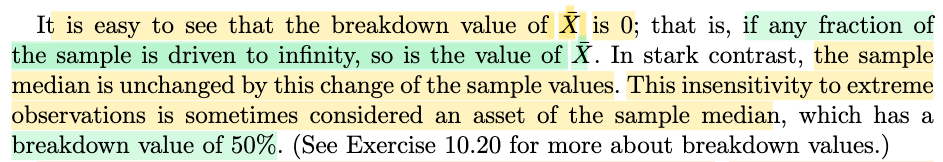</kbd>

> [!NOTE]
> Thế thì, với định nghĩa của breakdown value là như vậy, thì ta cũng có thể hiểu đại khái là, đây là tỉ lệ (fraction) lớn nhất các sample mà khi ta kéo giá trị của chúng lên vô cùng thì statistic sẽ vẫn không bị tăng lên vô cùng. Ví dụ có X1,X2,...X10. Ném {X6,...X10} kéo ra ∞ mà Tn vẫn ok nhưng nếm X5 kéo ra ∞ thì Tn tạch thì khi đó b là tỉ lệ của số lượng X5 → X10 trên toàn bộ: tức 6/10 = 60%)
>
>
>
> Vậy với sample mean, chỉ cần 1 sample nào đó lớn vô cùng thì Xbar sẽ lớn vô cùng, nên tỉ lệ lớn nhất mà nó chịu được chỉ là 0. Vì ví dụ X1,...X10. thì dù chỉ một thằng X10 bị kéo ra ∞ thì cũng đủ để Xbar tạch (lớn lên vô cùng), nên tỉ lệ mà nó chịu được chỉ là 0%
>
>
>
> Trong khi đó, với sample median, là giá trị của thằng đứng giữa (ví dụ X1,X2,...X10 thì sample median = (X4+X6)/2 thì ví dụ kéo X7,X8,X9,X10 (40%) ra ∞ thì sample median vẫn ko tạch. Nhưng nếu kéo thêm X6 (thành ra 5/10 = 50%) thì nó tạch, nên ngưỡng tạch nhỏ nhất của nó là 50%

> [!TIP]
> **🤖 AI Feedback** — ✅ Score: **93/100**
>
> Ghi chú giải thích rất trực quan và chính xác bản chất breakdown value của trung bình và trung vị qua ví dụ 10 phần tử rất dễ hiểu. Bạn chỉ mắc một lỗi nhỏ khi viết nhầm công thức trung vị của 10 số là trung bình của X5 và X6 (thay vì X4 và X6).

 

###### Asymptotic Relative Efficiency

<kbd>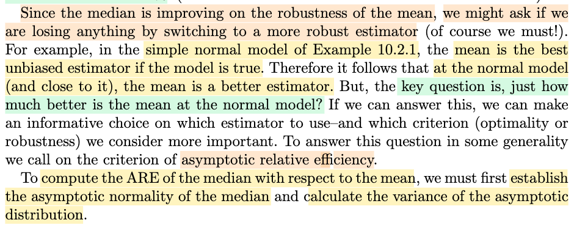</kbd>

> [!NOTE]
> Thế thì như vậy, với việc ta biết sample median sẽ robust hơn sample mean, câu hỏi sẽ là. trong tình huống như ví dụ 10.2.1, nơi mà ta có tình trạng là, nếu như giả định phân phối thật là Normal, thì sample mean, với việc ta đã biết nó có bias = 0, và Variance lại là CRLB, nên đây chính là cái uniformly best unbiased estimator của population mean.
>
>
>
> Vậy tính sao với việc median roburst hơn đây. Để trả lời ta phải hỏi câu khác: rằng, khi giả định là đúng, thì mean nó tốt hơn median được bao nhiêu. Ý là, nếu median roburst hơn nhiều, và khi giả định là đúng thì mean cũng không hơn median là bao thì ta có thể hi sinh chút tiêu chí optimality, để chọn tiêu chí robusrt median.
>
>
>
> Và để trả lời câu hỏi này, ta sẽ mượn đến công cụ ARE - độ hiệu quả tiệm cận tương đối.
>
>
>
> Còn nhớ định nghĩa của cái này đó là tỉ lệ phương sai tiệm cận của hai estimator.

> [!TIP]
> **🤖 AI Feedback** — ✅ Score: **95/100**
>
> Ghi chú của bạn thể hiện sự hiểu biết sâu sắc và chính xác về sự đánh đổi giữa tính vững (robustness) và tính tối ưu (optimality) thông qua công cụ ARE. Bạn chỉ cần lưu ý sửa một vài lỗi chính tả nhỏ như 'roburst' (robust) hay 'công cụL' để ghi chú thêm phần hoàn hảo.

**🔗 See also:** [Asymptotic Relative Efficiency](./101_point_estimation.md#node-2y7vyqf)

 

###### Asymptotic Normality of the Median

<kbd>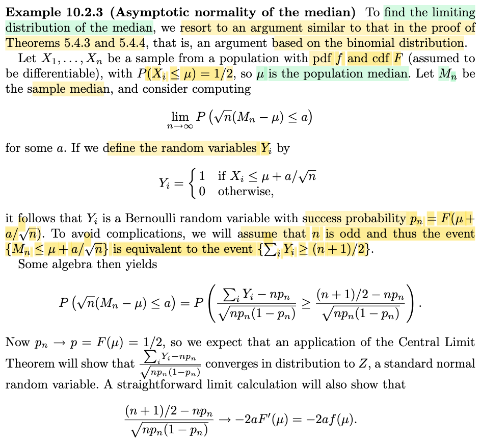</kbd>

<kbd>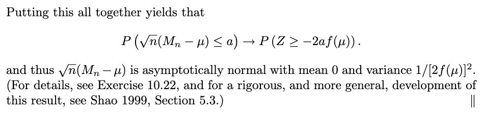</kbd>

> [!NOTE]
> Rồi, ví dụ này, mục đích là ta sẽ đi tìm phân phối giới hạn của sample median, từ đó có được cái phương sai tiệm cận của nó, để rồi dùng trong việc tính ARE giúp so sánh nó với sample mean. (vì ARE là tỉ lệ phương sai tiệm cận của hai thằng, giúp cho thấy cái nào tốt hơn)
>
>
>
> Đầu tiên cần nhớ, định nghĩa của median. Nếu μ là median của distribution có cdf là F, thì F(μ) = 1/2.
>
>
>
> Thế thì ta gọi X1,...Xn là random sample \~ pdf f và cdf F (và population median là μ), ta sẽ có P(Xi ≤ μ) = F(μ) = 1/2. Và gọi Mn là sample median.
>
>
>
> Mục đích của ta là đi tìm lim P(√n(Mn - μ) ≤ a) for some a. Tí nữa sẽ nói nguyên nhân, còn giờ cứ tập trung vào √n(Mn - μ) ≤ a.
>
>
>
> Event này tương đương Mn ≤ μ + a/√n
>
>
>
> Vậy làm cách nào để tính P(Mn ≤ μ + a/√n)
>
>
>
> Với Mn là sample median, ta sẽ lập luận như sau: Ta giả sử n (sample size) là số lẻ. Ví dụ n = 3, sample là X1,X2,X3 và order statistic là X(1),X2,X3. Thì khi đó sample median chính là thằng X2. Như vậy, với sample size n, Mn chính là thằng X((n+1)/2)
>
>
>
> Do đó Mn ≤ μ + a/√n ⇔ X((n+1)/2) ≤ μ + a/√n và như vậy đồng nghĩa X(1),X(2),...X((n+1)/2) đều ≤ μ + a/√n
>
>
>
> Từ đó ta có thể thấy, event Mn ≤ μ + a/√n tương đương event: Có ít nhất (n+1)/2 random variable trong random sample X1,....Xn có giá trị ≤ μ + a/√n
>
>
>
> Tới đây ta đặt Yj là Bernouilly random variable mang giá trị 1 khi Xj ≤ μ + a/√n và mang giá trị 0 khi ngược lại. Thì event "Có ít nhất (n+1)/2 random variable trong random sample X1,....Xn có giá trị ≤ μ + a/√n" sẽ tương đương với event "Y1+Y2+...Yn ≥ (n+1)/2", hay Σj Yj ≥ (n+1)/2
>
>
>
> (sẽ dễ dàng nhận ra, theo những gì đã học trong Stat110 với gs Joe, nó liên quan đến random variable Σj Yj, có story là tổng các Bernouilly(p) trial iid:độc lập (vì X1,...Xn độc lập), và có cùng distribution tham số pn = P(Xj ≤ μ + a/√n) (vì Xj iid nên P(Xj ≤ μ + a/√n) cũng đều giống nhau với mọi j). Nhưng ở đây ta không dùng thực tế Σj Yj là binomial, mà chỉ quan tâm đến Y1,...Yn là iid \~ Bern(pn).
>
>
>
> Như đã biết với Bern(pn) distribution thì mean và variance:
>
>
>
> EYj = pn
>
>
>
> Var(Yj) = pn(1 - pn)
>
>
>
> Biến đổi tiếp: Σj Yj ≥ (n+1)/2, mục đích là đưa về dạng √n(sample mean - population mean)/σ để dùng LT:
>
>
>
> ⇔ (Σj Yj)/n ≥ (n+1)/2n
>
>
>
> ⇔ (Σj Yj)/n - pn ≥ (n+1)/2n - pn
>
>
>
> ⇔ √n\[(Σj Yj)/n - pn\]/√\[pn(1 - pn)\] ≥ √n\[(n+1)/2n - pn\]/√\[pn(1 - pn)\]
>
>
>
> Chú ý: Lúc này vế trái chính là có dạng: √n \[sample mean (Σj Yj)/n\] - population mean (=pn)\] / √population variance (=√\[pn(1 - pn)\])
>
>
>
> Rút gọn bớt, đưa n xuống dưới:
>
>
>
> ⇔ \[(Σj Yj) - npn\]/√n\[pn(1 - pn)\] ≥ \[(n+1)/2 - npn\]/√\[npn(1 - pn)\]
>
>
>
> Thế thì, theo Central Limit Theorem, nếu ta có X1,...Xn , có mean μ, variance σ^2. Thì khi n → ∞ P(√n(Xbar - μ)/σ ≤ x), tức cdf √n(Xbar - μ)/σ tại x của sẽ converge về Φ(x), tức P(Z ≤ x) với Z là standard normal variable. (đây gọi là converge in distribution: √n(Xbar - μ)/σ → (d) n(0,1)
>
>
>
> Vậy áp dụng CLT ở đây, \[(Σj Yj) - npn\]/√n\[pn(1 - pn)\] → (d) n(0,1)
>
>
>
> Nên tại limit n → ∞, thì event \[(Σj Yj) - npn\]/√n\[pn(1 - pn)\] ≥ \[(n+1)/2 - npn\]/√\[npn(1 - pn)\] sẽ là event liên quan đến normal random variable Z:
>
>
>
> Z ≥ lim n → ∞ \[(n+1)/2 - npn\]/√\[npn(1 - pn)\]
>
>
>
> Từ đó ta sẽ có thể có P(√n(Mn - μ) ≤ a) → P(Z ≥ cái gì đó), và từ vào đây ta sẽ cố gắng đưa vế phải về dạng P(something × Z ≤ a) để kết luận √n(Mn - μ) converge in distriution về \[something\] × Z, và nó cũng là một normal có variance là \[something\]^2, giúp kết luận Avar(Mn) theo định nghĩa.
>
>
>
> ---
>
>
>
> Vậy, tiếp theo ta sẽ đi tính lim n → ∞ \[(n+1)/2 - npn\]/√\[npn(1 - pn)\], với pn = P(Xj ≤ μ + a/√n)
>
>
>
> khi n → ∞, P(Xj ≤ μ + a/√n) → P(Xj ≤ μ + 0) = F(μ) = 1/2 (do μ là population median)
>
>
>
> nên mẫu số√\[npn(1 - pn)\] → √\[n(1/2)(1/2)\] = √(n/4) = √n/2
>
>
>
> Còn tử số (n+1)/2 - npn = (n+1)/2 - nP(Xj ≤ μ + a/√n)
>
>
>
> P(Xj ≤ μ + a/√n), tức F(μ + a/√n) ≈ F(μ) + F'(μ)(a/√n) (linear approx)
>
>
>
> = F(μ) + f(μ)(a/√n)
>
>
>
> ⇒ (n+1)/2 - nP(Xj ≤ μ + a/√n) ≈ (n+1)/2 - n\[F(μ) + f(μ)(a/√n)\]
>
>
>
> = (n+1)/2 - nF(μ) - nf(μ)(a/√n)
>
>
>
> = (n+1)/2 - n/2 - nf(μ)(a/√n)
>
>
>
> = 1/2 - nf(μ)(a/√n)
>
>
>
> Nên khi n → inf, tử số → - a√nf(μ)
>
>
>
> Vậy khi tại limit, \[(n+1)/2 - npn\]/√\[npn(1 - pn)\] = - a√nf(μ)/(√n/2) = - 2af(μ)
>
>
>
> ---
>
>
>
> Như vậy, tại limit, event Mn ≤ μ + a/√n tương đương Z ≥ - 2af(μ)
>
>
>
> nên P(Mn ≤ μ + a/√n) = P(√n(Mn - μ) ≤ a) → P(Z ≥ - 2af(μ)), cũng là P(Z ≤ 2af(μ))
>
>
>
> (do Z \~ n(0,1), P(Z ≥ - 2af(μ)) là diện tích đồ thị hàm pdf từ mốc -2af(μ) trở lên, do tính đối xứng, nó sẽ bằng diện tích đồ thị từ -∞ đến +2af(μ), tức P(Z ≤ 2af(μ)).
>
>
>
> Như vậy, P(√n(Mn - μ) ≤ a) → P(Z/2f(μ) ≤ a) có nghĩa là cdf của √n(Mn - μ) converge về cdf của Z.
>
>
>
> Theo định nghĩa của converge in distribution, điều này có nghĩa là √n(Mn - μ) → (d) \[1/2f(μ)\] × Z.
>
>
>
> Và theo location scale family, đây là normal(0, \[1/2f(μ)\]^2)
>
>
>
> Vậy limit distribution của √n(Mn - μ) là normal(0, \[1/2f(μ)\]^2), nên theo định nghĩa của phương sai tiệm cận, ta nói Avar(Mn) = \[1/2f(μ)\]^2.

> [!TIP]
> **🤖 AI Feedback** — ✅ Score: **98/100**
>
> Ghi chú vô cùng chi tiết và chính xác, đặc biệt là phần tự khai triển xấp xỉ Taylor rất trực quan mà sách giáo khoa đã bỏ qua. Điểm trừ duy nhất là một lỗi ký hiệu nhỏ ở mẫu số vế trái trong bước biến đổi trung gian, nhưng không ảnh hưởng đến tính đúng đắn của toàn bộ bài viết.

**🔗 See also:** [Xác suất thống kê thứ tự rời rạc](./54_order_statistic.md#node-rdrmu3r) · [Stronger Central Limit Theorem](./55_convergence_concepts.md#node-yngnkwh) · [Phương sai tiệm cận và giới hạn](./101_point_estimation.md#node-62aug4x)

 

###### AREs of the Median to the Mean

<kbd>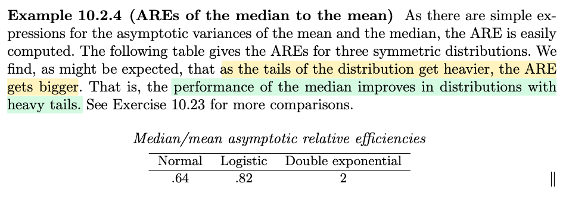</kbd>

> [!NOTE]
> và như vậy, khi ta đã có Avar(Mn) = \[1/2f(μ)\]^2, với f(μ) là pdf của Xi tại population median μ.
>
>
>
> Ta mới dùng ARE (asymptotic relative efficientcy), như đã nói, là tỉ lệ của Avar của hai estimator.
>
>
>
> Nên ARE(Mn,Xbar_n) = Avar(Xbar_n)/Avar(Mn)
>
>
>
> = (σ^2)/\[1/2f(μ)\]^2
>
>
>
> Chú ý,  ARE(Mn,Xbar_n) = Avar(Xbar_n)/Avar(Mn) càng lớn chứng tỏ Avar của sample median càng vượt trội Avar(sample mean) và cho thấy sample median tốt hơn.
>
>
>
> Và người ta tính toán cái này với các distribution khác nhau thì thấy
>
>
>
> Khi distribution là normal, thì ARE là 0.64, cho thấy Avar(sample mean) chỉ bằng 0.64 Avar(sample median) chứng tỏ, sample mean tốt hơn.
>
>
>
> Nhưng khi distribution ngày càng khác normal, có dạng heavy tail (khác với light tail của normal) thì ARE lớn cho thấy phương sai tiệm cận của sample median nhỏ hơn → sample median tốt hơn

> [!TIP]
> **🤖 AI Feedback** — ✅ Score: **95/100**
>
> Ghi chú rất chính xác và chi tiết, giải thích rõ ràng công thức ARE cũng như ý nghĩa thực tế đối với phân phối đuôi nặng dựa trên tài liệu. Bạn chỉ cần viết rõ hơn ký hiệu toán học ở mẫu số [1/(2f(μ))]^2 để tránh hiểu nhầm về mặt toán học.

**🔗 See also:** [Asymptotic Relative Efficiency](./101_point_estimation.md#node-2y7vyqf)

 

###### Section 10.2.2 M-Estimators

<kbd>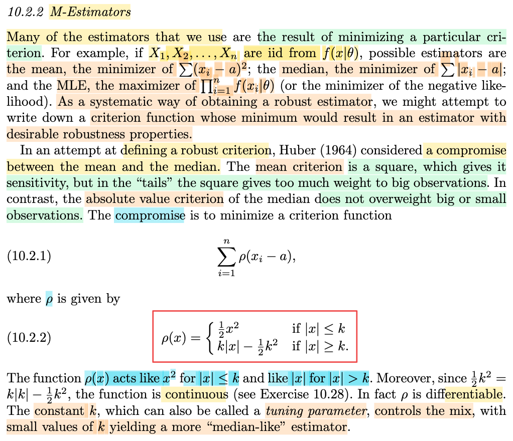</kbd>

> [!NOTE]
> Qua phần này, đại khái là, nhiều estimator thật ra có bản chất là kết quả của quá trình ta giải bài toán tối ưu nào đó.
>
>
>
> Ví dụ, nổi tiếng nhất, chính là MLE, như đã biết, chính là ta đi giải bài toán tối ưu: maximize (over θ) L(θ|**x**) = f(**x**|θ) = Πi f(xi|θ), để có được ML estimator θ^(**X**) của θ, để rồi với observed value **X** = **x**, θ^(**x**) sẽ là giá trị của θ có độ hợp lí cao nhất giải thích cho việc quan sát được data mang gía trị này.
>
>
>
> Bên cạnh đó, sample mean Xbar, hay diễn ta rằng nó cũng là một estimator, là hàm của sample, ta viết Xbar(**X**). Thì thật ra nó cũng là kết quả của bài toán tối ưu sau: minimize (over W) Σi (W - Xi)^2. Cái này dễ thấy, dùng ngôn ngữ tối ưu, đây là bài toán tối ưu hàm quadratic function của W, là bài toán lồi. Dùng đìều kiện tối ưu bậc một ta có d/dW \[Σi (W - Xi)^2\] = 0 ⇔ Σi \[d/dW (W - Xi)^2\] = 0 ⇔ Σi \[2(W - Xi)\] = 0 ⇔ nW - ΣiXi = 0 ⇔ W = (ΣiXi)/n chính là sample mean Xbar(**X**)
>
>
>
> Tương tự, với sample median, nó cũng chính là solution của bài toán minimize |W - Xi|
>
>
>
> Vậy khi minimize (sum) **square** của (W - Xi)^2 thì ta có sample mean
>
>
>
> mininize (sum) **absolute** của |W - Xi| thì ta có sample median
>
>
>
> và minimize sum **ln f(xi|θ)** đối với MLE
>
>
>
> (bài toán MLE, như đã biết, ta có thể chuyển thành equivalent bằng hàm ln: maximize ln Πi f(xi|θ), hay minimize - ln Πi f(xi|θ) = -Σi ln f(xi|θ)
>
>
>
>
>
> Vậy, ở đây đại ý là, gs muốn tìm một cách mang tính hệ thống, cụ thể là một tiêu chí nào đó để khi giải bài toán tối ưu với tiêu chí đó thì ta sẽ được một roburst estmator.
>
>
>
> Thế thì, nhà thống kê Huber (cái tên Huber loss trong Machine Learning là tên ông này) tiếp cận như sau:
>
>
>
> Ông đặt ra tiêu chí là: minimize (over a) Σi ρ(xi-a) (a hay W cũng được, chỉ là tên biến tối ưu)
>
>
>
> với ρ(x) = (1/2)x^2 khi |x| ≤ k và = k|x| - (1/2)k^2 khi |x| ≥ k
>
>
>
> Và đại ý là, cái này giống như **kết hợp tiêu chí square và absolute** lại. Với k là constant gọi là tuning parameter.

> [!TIP]
> **🤖 AI Feedback** — ✅ Score: **95/100**
>
> Ghi chú của bạn rất xuất sắc, chính xác và có chiều sâu khi tự chứng minh bài toán tối ưu cho sample mean và liên hệ tốt với Huber loss trong Machine Learning. Để hoàn thiện hơn, bạn nên chú ý viết đầy đủ ký hiệu tổng cho trường hợp median và rà soát một vài lỗi chính tả nhỏ như 'roburst estmator'.

 

###### Example 10.2.5 Huber Estimator

<kbd>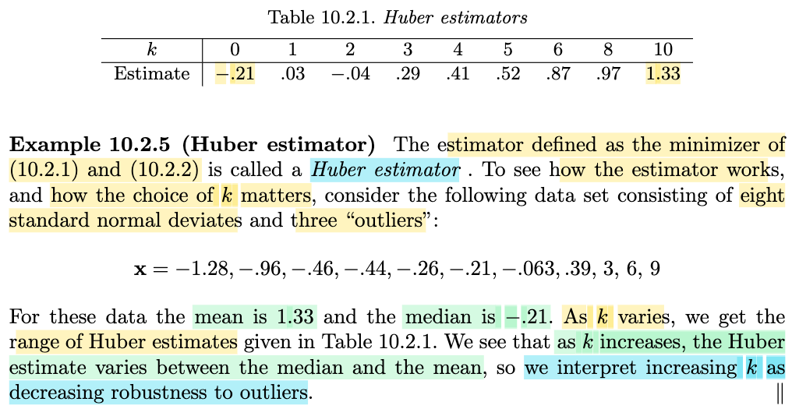</kbd>

> [!NOTE]
> Thế thì người ta lấy ví dụ có sample với giá trị quan sát được là -1.28,.....9 (tức là x1=-1.28, x2=-0.96,.....
>
>
>
> Và với giá trị của sample vậy, sample mean và sample median là 1.33 và -0.21.
>
>
>
> Và cũng tính giá trị của Huber estimator tại observed value.
>
>
>
> Phải nói chút xíu chỗ này: Nên nhớ, sample mean, sample median đều là estimator, là function của sample W(**X**), với W là hàm số nào đó. Và như đã nói ở note trước, chúng thực chất là kết quả của việc giải bài toán tối ưu với tiêu chí khác nhau. Nên cụ thể là với sample mean, W(**X**) = (Σi Xi)/n, cũng được, mà ghi là argmin_W {Σi (W - Xi)^2} cũng được luôn.
>
>
>
> Tương tự, với sample median thì cái hàm đó là W(**X**) = argmin_W {Σi |W - Xi|}.
>
>
>
> Tương tự, Huber loss, nó là W(**X**) = argmin_W {Σi ρ(W - Xi)}
>
>
>
> Rồi, dù là sample mean / median hay Huber estimator, vì đều chỉ là các hàm của **X**, nên khi có observed value của **X**, = **x**, ta có observed value của 3 cái estimator này, lần lượt là:
>
>
>
> sample mean: argmin_W {Σi (W - xi)^2}, hay (Σi xi)/n và tính ra là 1.33
>
>
>
> sample median: argmin_W {Σi |W - xi|} = -0.21
>
>
>
> Huber estimator: argmin_W {Σi ρ(W - xi)} = một giá trị nào đó còn phụ thuộc hằng số k
>
>
>
> Và với k khác nhau tăng dần, ta thấy giá trị của Huber estimator thay đổi từ -0.21 đến 1.33 giúp ta có một góc nhìn là:
>
>
>
> khi k tăng dần, Huber estimator sẽ chuyển dịch từ sample median (có độ robusrt tốt hơn sample mean) sang sample mean, có độ roburst kém hơn. Do đó trong sách nói nó sẽ giảm tính robusrtness đối với outlier so khi k tăng (outlier ý là, trong data quan sát được xuất hiện những giá trị cực hạn, bất thường, mà điều đó đồng nghĩa là giả định ban đầu của ta về phân phối thật không đúng, và tính robusrt thì giúp chống lại ảnh hưởng từ điều này. Nên giảm tính robursness với outliner có nghĩa là giảm khả năng chống chọi với việc giả định ban đầu là sai.

> [!TIP]
> **🤖 AI Feedback** — ✅ Score: **98/100**
>
> Note giải thích rất chi tiết và chính xác bản chất toán học của các estimator dưới dạng bài toán tối ưu, cũng như giải nghĩa rõ ràng về tính chất robust đối với outlier khi k thay đổi. Để hoàn thiện hơn, bạn có thể giải thích ngắn gọn cách Huber loss chuyển hóa về L1-loss khi k tiến về 0 và L2-loss khi k tiến ra vô cùng.

 

###### Introduction to M-Estimators

<kbd>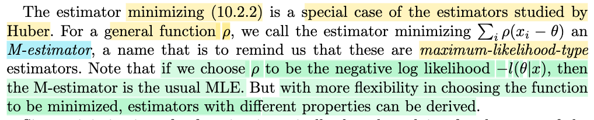</kbd>

> [!NOTE]
> Đại ý là thật ra hàm ρ như trong 10.2.2 chỉ là một trường hợp đặc biệt, có thể có công thức khác. Và khi xét hàm ρ tổng quát, người ta gọi cái estimator argmin_W Σi ρ(xi - W) là M-estimator.
>
>
>
> (trong sách ghi mininize Σi ρ(xi - θ), theo mình là dễ gây nhầm lẫn khi dùng θ làm biến tối ưu, nên ghi là mininize Σi ρ(xi - a) hay mininize Σi ρ(xi - W), giải ra sẽ có được một hàm theo **x**. Còn không thì ta phải hiểu θ ở đây là biến tối ưu, mà solution của bài toán tối ưu này là sẽ là estimator cho θ)
>
>
>
> Và khi ρ(x-θ) = -l(θ|x) ta sẽ có kết quả M-estimator chính là MLE, thử xem đúng không.
>
>
>
> Với ρ(x-θ) = -l(θ|x) thì ρ(xi-θ) = -l(θ|xi), khi đó bài toán tối ưu sẽ là: 
>
>
>
> minimize Σi ρ(xi - θ) = Σi \[-l(θ|xi\] = Σi \[-ln L(θ|xi)\] = -ln Πi L(θ|xi)
>
>
>
> ≡ maximize ln Πi L(θ|xi)
>
>
>
> cũng là maximize maximize ln Πi f(xi|θ), nhờ tính iid, nên đây chính là maximize ln L(θ|**x**), và do đó solution của nó chính là MLE.

> [!TIP]
> **🤖 AI Feedback** — ✅ Score: **98/100**
>
> Ghi chú rất xuất sắc, không chỉ hiểu rõ nội dung sách mà còn chỉ ra điểm dễ nhầm lẫn trong ký hiệu và tự chứng minh lại một cách chặt chẽ. Bạn chỉ cần lưu ý làm rõ hơn giả định i.i.d. khi biến đổi từ tổng log-likelihood thành tích likelihood.

 

###### Taylor Expansion for M-Estimators

<kbd>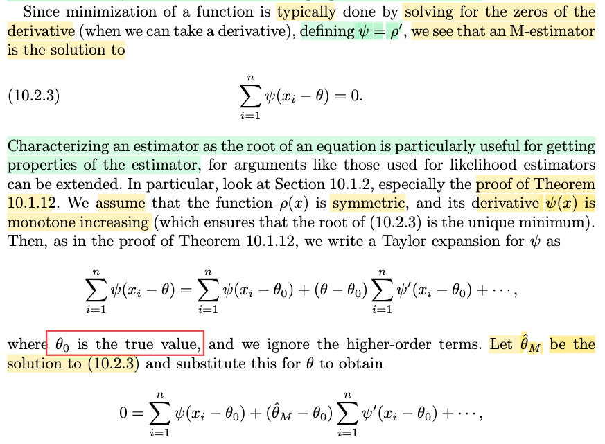</kbd>

<kbd>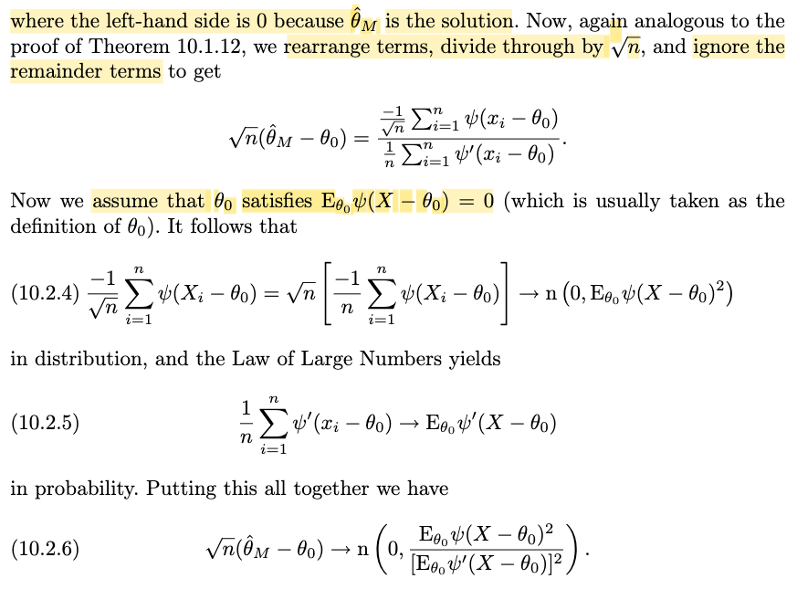</kbd>

> [!NOTE]
> Rồi, qua đây, đầu tiên cần nhận định là đoạn này ông Casella muốn làm gì: Chính là muốn tìm phương sai tiệm cận của cái M-estimator (là cái estimator có công thức: W(**x**) = argmin_W Σi ρ(xi - W)) mà ta đã nói ở trên, và làm vậy để làm gì, thì câu trả để mà đánh giá tính tối ưu của nó thôi (ví dụ như khi tính ARE, giúp so sánh hai estimator, thì ta cần có phương sai tiệm cận Avar)
>
>
>
> Thế thì cứ theo cách dẫn dắt của gs Casella: Đầu tiên, ông nói vì cái estimator này giống với MLE, trong đó đều là ta đi giải bài toán tối ưu, nên bằng cách define ψ = ρ' (tức đạo hàm của hàm ρ) thì M-estimator chính là solution của:
>
>
>
> Σi ψ(xi - θ) = 0
>
>
>
> Giải thích chỗ này, vì sao gs lại nói vậy:
>
>
>
> Đơn giản thôi, W, hay W(**x**), = argmin_W Σi ρ(xi - W)) thì cũng có nghĩa là W là nghiệm của bài toán minimize ρ(xi - W). Đây là bài toán tối ưu không ràng buộc (unconstraint optimization problem), và áp dụng điều cần kiện tối ưu bậc nhất sẽ cho ta ứng cử viên có solution (mà nếu hàm số là hàm convex thì có thể kết luận luôn nghiệm):
>
>
>
> Điều kiện cần bậc nhất (first order optimality condition): d/dW \[Σi ρ(xi - W))\] = 0 (đạo hàm của hàm mục tiêu đối với biến tối ưu vanish)
>
>
>
> ⇔ Σi d/dW \[ρ(xi - W)\] = 0
>
>
>
> ⇔ Σi \[ρ'(xi - W)\] = 0
>
>
>
> ⇔ Σi ψ(xi - W) = 0 → 10.2.3 
>
>
>
> (trong sách dùng θ (Σi ψ(xi - θ) = 0) mình dùng W, cái nào cũng được, vì đây chỉ là tên biến tối ưu, muốn dùng a, b, c, gì cũng được, tuy nhiên mình sẽ dùng θ cho giống trong sách trong phần chứng minh, nhưng cần nhấn mạnh là xài W, a, á ớ gì cũng được vì chỉ là tên biến, cuối cùng vẫn là một hàm số của sample **X**, tức là một estimator.)
>
>
>
> ---
>
>
>
> Tiếp, ông sẽ dùng cái kiểu biến đổi giống như khi chứng minh Theorem 10.1.12 (xem link). Giả định thêm là hàm ρ đối xứng (và hàm số đạo hàm của nó, tức hàm ψ đơn điệu tăng (monotone increasing). Ông làm như sau:
>
>
>
> Đầu tiên, theo cách thức tương tự như khi chứng minh theorem 10.1.12, trong đó ta chứng minh phương sai tiệm cận của MLE đạt mức nhỏ nhất (Cramer Rao Lower Bound), từ đó kết luận MLE thỏa định nghĩa của cái gọi là estimator hiệu quả tiệm cận (asymptotically efficient). Thì đầu tiên trong bước chứng minh đó, ta xấp xỉ bậc 1 hàm \[∂/∂θ log likelihood l(θ|**X**)\] (tức đạo hàm của log likelihood): Với θ ≈ θ0, định lý Taylor cho phép ta coi hành vi của hàm l'(θ) ≈ l'(θ0) + l''(θ0)(θ - θ0). Và với lập luận rằng θ^ là một consistent estimator của θ0, nên khi n tăng lên vô cùng, θ^ sẽ tiến sát tới θ0, cho phép ta áp dụng cái xấp xỉ trên với θ^: l'(θ^) ≈ l'(θ0) + l''(θ0)(θ^ - θ0). Và vì θ^ là MLE, là nghiệm của bài toán minimize log likelihood l(θ|**X**), nên đương nhiên nó thỏa điều kiện cần bậc nhất: l'(θ^) = 0, giúp ta có l'(θ0) + l''(θ0)(θ^ - θ0), và từ đó chuyển vế đổi dấu, nhân thêm √n hai vế, ta sẽ có √n(θ^ - θ) xuất hiện ở bên trái. Và thực hiện cái bước tiếp theo áp dụng CLT và WLLN ta sẽ có phương sai tiệm cận của θ^.
>
>
>
> Vậy ở đây ta cũng làm y chang: Ta xét hàm số đạo hàm bậc nhất của ρ: ρ'(θ) = Σi ψ(xi - θ). Và lập luận tương tự rằng:
>
>
>
> khi xét θ nằm rất gần θ0, giải tích cho phép ta xấp xỉ hàm ρ'(θ) bằng hàm tuyến tính
>
>
>
> (nói trước chút xíu, trong sách ông Casella nói ta sẽ dùng Taylor expansion rồi tí nữa bỏ đi các remainder (ám chỉ các term bậc cao, thì chính là xấp xỉ tuyến tính thôi)
>
>
>
> ρ'(θ) ≈ ρ'(θ0) + ρ''(θ0)(θ - θ0)
>
>
>
> ⇔ Σi ψ(xi - θ) ≈ Σi ψ(xi - θ0) + (∂/∂θ \[Σi ψ(xi - θ0)\])(θ - θ0)
>
>
>
> ⇔ Σi ψ(xi - θ) ≈ Σi ψ(xi - θ0) + (θ - θ0) (Σi ∂/∂θ\[ψ(xi - θ0))
>
>
>
> ⇔ Σi ψ(xi - θ) ≈ Σi ψ(xi - θ0) + (θ - θ0) Σi ψ'(xi - θ0) (tại đây thiếu cái dấu ba chấm "+ ..." nữa chỉ các term bậc cao thì sẽ giống trong sách)
>
>
>
> Nhớ rằng, kết quả này, chỉ đơn thuần là thứ mà giải tích (định lý Taylor) cho phép, khi xét θ nằm trong lân cận θ0.
>
>
>
> Vậy thì giả sử θ^M cũng thỏa yêu cầu này, ta sẽ có thể thế θ^M vào:
>
>
>
> Σi ψ(xi - θ^M) ≈ Σi ψ(xi - θ0) + (θ^M - θ0) Σi ψ'(xi - θ0)
>
>
>
> Tiếp theo, theo cách lập luận tương tự như trong phần chứng minh theorem 10.1.12 mà mình có nói sơ ở trên, ta sẽ nói rằng, vì θ^M, tức M-estimator, theo định nghĩa của nó thì nó là solution của bài toán mininize\_θ hàm Σi ρ(xi - θ), nên dĩ nhiên nó sẽ thỏa first order optimality condition, tức d/dθ \[Σi ρ(xi - θ)\] = 0. Tức là ta có d/dθ \[Σi ρ(xi - θ)\]|θ=θ^M = 0 ⇔ Σi ψ(xi - θ^M) = 0.
>
>
>
> Do đó ta có 0 = Σi ψ(xi - θ^M) ≈ Σi ψ(xi - θ0) + (θ^M - θ0) Σi ψ'(xi - θ0)
>
>
>
> ⇔ 0 ≈ Σi ψ(xi - θ0) + (θ^M - θ0) Σi ψ'(xi - θ0)
>
>
>
> ⇔ (θ^M - θ0) Σi ψ'(xi - θ0) ≈ - Σi ψ(xi - θ0)
>
>
>
> ⇔ (θ^M - θ0) ≈ - Σi ψ(xi - θ0) / Σi ψ'(xi - θ0)
>
>
>
> ⇔ √n (θ^M - θ0) ≈ - √n Σi ψ(xi - θ0) / Σi ψ'(xi - θ0) (nhân hai vế cho √n)
>
>
>
> ⇔ √n (θ^M - θ0) ≈ - √n (1/n) Σi ψ(xi - θ0) / \[(1/n) Σi ψ'(xi - θ0)\] (nhân tử và mẫu vế phải cho 1/n)
>
>
>
> ⇔ √n (θ^M - θ0) ≈ - (1/√n) Σi ψ(xi - θ0) / \[(1/n) Σi ψ'(xi - θ0)\] → đây là kết quả trong sách.
>
>
>
> ---
>
>
>
> Chỗ đây cần lưu ý, kết quả trên nên được viết ra rõ ràng là: 
>
>
>
> √n (θ^M(**x**) - θ0) ≈ - (1/√n) Σi ψ(xi - θ0) / \[(1/n) Σi ψ'(xi - θ0)\] để thể hiện vế trái, vẫn chỉ là hàm số theo **x**, do θ^M về bản chất vẫn là hàm số theo **x**.
>
>
>
> Và khi thay **x** bởi sample **X**, ta sẽ có vế trái với tư cách là một statistic, √n (θ^M(**X**) - θ0) và vế phải cũng là hai cái statistic chia nhau: 
>
>
>
> \- (1/√n) Σi ψ(Xi - θ0) / \[(1/n) Σi ψ'(Xi - θ0)\]
>
>
>
> Mục đích của việc này là tí nữa ta sẽ đi tìm limit distribution của tử và mẫu, thì phải hiểu bản chất chúng là các statistic.
>
>
>
> ---
>
>
>
> Tiếp, gs mới đặt thêm giả định E\_θ0\[ψ(Xi - θ0\]= 0 mà ông nói là thường thì (giả định này) sẽ thỏa do định nghĩa của θ0.
>
> Và sau đó, ông nói ta sẽ có kết quả 10.2.4:
>
>
>
> \-1/√n(....) hội tụ in distribution về n(0, E\_θ0\[ψ(Xi - θ0\]^2).
>
>
>
> Là sao nhỉ? Vì sao lại có 10.2.4:
>
>
>
> Đại ý là ta sẽ làm tương tự như chứng minh theorem 10.1.12, khi đã tới được đây: 
>
>
>
> √n (θ^M - θ0) ≈ - (1/√n) Σi ψ(xi - θ0) / \[(1/n) Σi ψ'(xi - θ0)\]
>
>
>
> hay cũng là:
>
>
>
> √n (θ^M(**x**) - θ0) ≈ - (1/√n) Σi ψ(xi - θ0) / \[(1/n) Σi ψ'(xi - θ0)\]
>
>
>
> và do đó cũng là:
>
>
>
> √n (θ^M(**X**) - θ0) ≈ - (1/√n) Σi ψ(Xi - θ0) / \[(1/n) Σi ψ'(Xi - θ0)\]
>
>
>
> thì bước tiếp theo là lôi cái vế phải ra:
>
>
>
> \- (1/√n) Σi ψ(Xi - θ0) / \[(1/n) Σi ψ'(Xi - θ0)\]
>
>
>
> ...để cố gắng xem thử khi n tăng vô cùng thì có thể áp dụng CLT để cho thấy chúng sẽ hội tụ về phân phối nào, thì khi đó vế trái cũng sẽ như vậy. 
>
>
>
> ---
>
>
>
> Ta sẽ **tập trung vào cái tử số** trước: - (1/√n) Σi ψ(Xi - θ0) 
>
>
>
> và trong đó, ta sẽ tập trung vào cái tổng: Σi ψ(xi - θ0): Đây là một cái tổng của n hạng tử: ψ(xi - θ0). Do đó, dễ thấy với i = 1,...n, thì ta sẽ có ψ(X1 - θ0),...ψ(Xn - θ0) là một random sample iid (vì mỗi cái đều là random variable có dạng là hàm số của random variable Xi, và X1,....Xn iid \~ f(x|θ0) (**chú ý, θ0 chính là true mean, xem chỗ đóng khung đỏ trong hình**) nên ..
>
>
>
> nếu đặt Y1 = ψ(X1 - θ0),...Yn = ψ(Xn - θ0) thì Y1,...Yn cũng iid.
>
>
>
> Thế thì xét mean và variance của Y1,..Yn xem thử nó là gì, vì là iid, nên lấy đại thằng Y1 ra xét
>
> \
> EY1 = E\[ψ(X1 - θ0)\]. Ta phân tích: vì Y1 là random variable có được bởi một hàm của random varable Xi, mà Xi có phân phối f(x|θ0), nên dĩ nhiên Y1 cũng có phân phối phụ thuộc θ0, và tính kì vọng Y1, sẽ ra một hàm phụ thuộc θ0. Nên ta sẽ ghi thêm θ0 dưới chân để thể hiện chuyện này: EY1 = E\_θ0\[ψ(X1 - θ0)\]. Và **đây lại là cái giáo sư Casella đang cho bằng 0**
>
>
>
> Vậy ta có EY1 = 0
>
>
>
> Còn Var(Y1)? Với việc EY1 = 0, thì Var(Y1) chỉ còn bằng E\[Y1^2\] (vì Var(Y1) theo công thức thứ 2 của variance, = E\[Y1^2) - \[E(Y1)\]^2 = E\[Y1^2) - 0^2 = E\[Y1^2\])
>
>
>
> Nên Var(Y1) = E\[Y1^2\] = E\[(ψ(Xi - θ0))^2\], tương tự, đây cũng là hàm theo θ0. ta ghi E\_θ0\[(ψ(Xi - θ0))^2\]
>
>
>
> Tới đây, với Y1,...Yn có mean = 0, variance = E\_θ0\[(ψ(Xi - θ0))^2\], và sample mean Ybar. Áp dụng CLT (Central Limit Theorem) cho phép ta có:
>
>
>
> \[√n(Ybar - true mean) / true standard deviation\] sẽ converge in distribution về n(0,1), tức:
>
>
>
> √n(Ybar - 0) / √E\_θ0\[(ψ(Xi - θ0))^2\] → (d) n(0,1) 
>
>
>
> ⇔ √n(Ybar) / √E\_θ0\[(ψ(Xi - θ0))^2\] → (d) n(0,1) 
>
>
>
> (tức là cái random variable ở vế trái sẽ trở thành một biến Z tuân theo phân phối standard normal)
>
>
>
> Mà true variance, √E\_θ0\[(ψ(Xi - θ0))^2\], dĩ nhiên chỉ là constant, nên sẽ converge (in probability) về chính nó
>
>
>
> Do đó áp dụng Slutsky theorem, nói rằng nếu ta có Xn → (d) X, Yn → (p) a, thì XnYn → (d) aX 
>
>
>
> Do đó -√E\_θ0\[(ψ(Xi - θ0))^2\] × (√n(Ybar) / √E\_θ0\[(ψ(Xi - θ0))^2\]) → (d) (-√E\_θ0\[(ψ(Xi - θ0))^2\]) × Z với Z \~ n(0,1))
>
>
>
> ⇔ -√n(Ybar) → (d) √E\_θ0\[(ψ(Xi - θ0))^2\] × Z với Z \~ n(0,1)), và theo location scale theorem, với Z là normal (0,1) thì αZ sẽ là normal(0, α^2). Vậy ta có:
>
>
>
> \-√n(Ybar) → (d) n(0, E\_θ0\[(ψ(Xi - θ0))^2\])
>
>
>
> Thay Ybar = (1/n) Σi ψ(Xi - θ0), ta có: -√n(1/n)(Σi ψ(Xi - θ0)) = (1/√n)(Σi ψ(Xi - θ0)) → (d) n(0, E\_θ0\[(ψ(Xi - θ0))^2\])
>
>
>
> Đến đây ta đã "làm xong" cái tử số -(1/√n) Σi ψ(xi - θ0),  khi biết:
>
>
>
>  -(1/√n)(Σi ψ(Xi - θ0)) → (d) n(0, E\_θ0\[(ψ(Xi - θ0))^2\])
>
>
>
>  ⇔ √n(-1/n)(Σi ψ(Xi - θ0)) → (d) n(0, E\_θ0\[(ψ(Xi - θ0))^2\])
>
>
>
> Đây chính là 10.2.4 
>
>
>
> ---
>
>
>
> Xét qua mẫu số: (1/n) Σi ψ'(Xi - θ0)
>
>
>
> Đặt Zi = ψ'(Xi - θ0) thì ta cũng có một sample iid Z1,...Zn, có phân phối phụ thuộc θ0, và cái mẫu này cũng là sample mean Zbar.
>
>
>
> Xét E(Z1) (cũng bằng E(Z2),...do Z1,..Zn cũng iid): E(Z1) = E\_θ0\[ψ'(Xi - θ0)\]
>
>
>
> Nên theo WLLN, Xbar sẽ hội tụ xác suất về true mean, ta có:
>
>
>
> Zbar = (1/n) Σi ψ'(Xi - θ0) → (p) E(Z1) = E\_θ0\[ψ'(Xi - θ0)\], đây chính là 10.2.5
>
>
>
> ---
>
>
>
> Kết hợp lại 10.2.4, 10.2.5:
>
>
>
>  √n(-1/n)(Σi ψ(Xi - θ0)) → (d) n(0, E\_θ0\[(ψ(Xi - θ0))^2\])
>
>
>
> (1/n) Σi ψ'(Xi - θ0) → (p)  E\_θ0\[ψ'(Xi - θ0)\]
>
>
>
> Dùng tiếp Slusky theorem đã xài ở trên, ta có: 
>
>
>
> √n(-1/n)(Σi ψ(Xi - θ0)) / (1/n) Σi ψ'(Xi - θ0) → (d) n(0, E\_θ0\[(ψ(Xi - θ0))^2\]) / E\_θ0\[ψ'(Xi - θ0)\]
>
>
>
> Vế trái chính là ≈ √n (θ^M - θ0)
>
>
>
> Vế phải theo location scale theorem, chính là n(0, E\_θ0\[(ψ(Xi - θ0))^2\] / {E\_θ0\[ψ'(Xi - θ0)\]}^2)
>
>
>
> Vậy ta có: √n (θ^M - θ0) converge in distribution về n(0, E\_θ0\[(ψ(Xi - θ0))^2\] / {E\_θ0\[ψ'(Xi - θ0)\]}^2)
>
>
>
>
>
>
>
>
>
>
>
>
>
>
>
>
>
>
>
>
>
>
>
>
>
>
>
>
>
>
>
>
>
>
>
>
>
>
>
>
>
>
>
>
>
>
>
>
>
>
>
>
>
>
>
>
>
>
>
>
>
>
>
>
>
>
>
>
>
>
>
>
>
> ---

> [!TIP]
> **🤖 AI Feedback** — ✅ Score: **98/100**
>
> Ghi chú giải thích cực kỳ chi tiết, chính xác từng bước biến đổi toán học từ khai triển Taylor đến việc áp dụng các định lý giới hạn (CLT, WLLN, Slutsky). Cách viết rất sư phạm, mạch lạc và giúp người đọc hiểu sâu bản chất thống kê của từng đại lượng.

**🔗 See also:** [Theorem 10.1.12 (Asymptotic efficiency of MLEs)](./101_point_estimation.md#node-n1mqtrr) · [Định lý Slutsky](./55_convergence_concepts.md#node-uwbmbt7) · [CLT - Định lý giới hạn trung tâm](./55_convergence_concepts.md#node-32vkewg) · [Luật số lớn yếu WLLN](./55_convergence_concepts.md#node-j5m3pa1)

 

###### Limit Distribution of Huber Estimator

<kbd>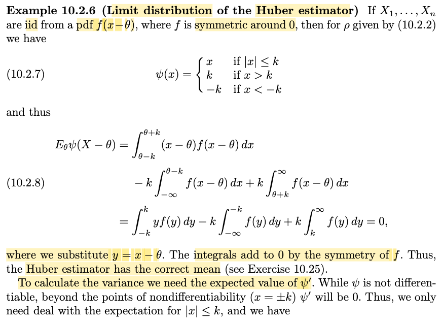</kbd>

<kbd>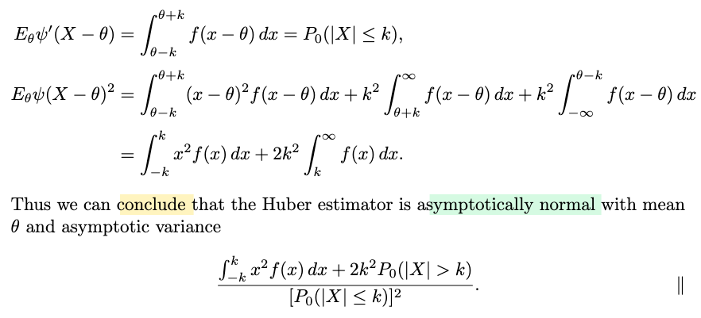</kbd>

> [!NOTE]
> Quay lại sau, đây chỉ là áp dụng cái kết quả vừa rồi với một trường hợp đặc biệt của M-estimator, là Huber estimator. Nói chung chỉ là thực hành tính tích phân. Kết qủa là cho thấy Huber estimator sẽ có phương sai tiệm cận là cái công thức dài thòng lòng dưới cùng.
>
>
>
> Còn vì sao nói nó asymptotically normal mean θ? Thì là vì ta đã chứng minh M-estimator có:
>
>
>
> √n (θ^M - θ0) converge in distribution về n(0, E\_θ0\[(ψ(Xi - θ0))^2\] / {E\_θ0\[ψ'(Xi - θ0)\]}^2)
>
>
>
> đồng nghĩa khi n rất lớn thì
>
>
>
> √n (θ^M - θ0) xấp xỉ một random variable Z với Z \~ n(0, E\_θ0\[(ψ(Xi - θ0))^2\] / {E\_θ0\[ψ'(Xi - θ0)\]}^2)
>
>
>
> nên θ^M sẽ xấp xỉ Z/√n + θ0
>
>
>
> Và theo location scale thì Z/√n + θ0 sẽ \~ n(θ0, (1/n) E\_θ0\[(ψ(Xi - θ0))^2\] / {E\_θ0\[ψ'(Xi - θ0)\]}^2)
>
>
>
> nên mới nói θ^M cũng sẽ tiệm cận là một normal mean θ0
>
>
>
> và áp dụng vào ví dụ cụ thể này thì cũng vậy ta sẽ có Huber estimator sẽ tiệm cận là một normal mean θ

> [!TIP]
> **🤖 AI Feedback** — ✅ Score: **95/100**
>
> Ghi chú giải thích rất chính xác và dễ hiểu bản chất toán học của phân phối tiệm cận đối với Huber estimator từ công thức tổng quát của M-estimator. Để hoàn thiện hơn, bạn có thể bổ sung cách chuyển đổi các tích phân thành xác suất dựa trên tính đối xứng của hàm mật độ.

 

###### ARE of the Huber Estimator

<kbd>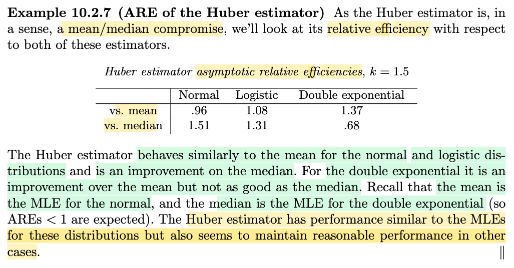</kbd>

> [!NOTE]
> Đại khái là khi đã có công thức phương sai tiệm cận của Huber estimator, ta sẽ thấy nó giống như một sự thỏa hiệp (compromise) giữa sample mean và sample median.
>
>
>
> Khi nhìn vào bảng so sánh chỉ số ARE (nhớ là, ARE(W, U) ở đây sẽ luôn là Avar(U)/Avar(W)) ta sẽ thấy khi so với sample mean (mà thằng estimator này chính là MLE của normal) thì ta thấy khi distribution thật sự là normal, logistic thì Huber estimator kém hơn sample mean, nhưng vẫn tốt hơn sample median. và khi chuyển dần sang các distribution như doubld exponential, nơi sample mean kém dần và sample median tốt dần thì Huber estimator lại tốt hơn sample mean dù không bằng sample median.
>
>
>
> Do đó một kết luận đáng nhớ là: Cho dù là distribution nào (distribution thật sự là gì) thì Huber nó cũng có chất lượng gần bằng cái MLE của distribution đó. Điều này giúp thỏa tiêu chí 1 của roburstness: là dưới giả định về một distribution, thì estimator phải cũng là một estimator tương đối hiệu quả.
>
>
>
> Ví dụ, giả sử giả định phân phối thật là normal, thì Huber vẫn không kém mấy so với thằng tốt nhất là sample mean.
>
>
>
> Nhưng vì nếu phân phối thật là cái khác, ví dụ double exponential, Huber vẫn tốt, do đó, đồng nghĩa là, trong trường hợp gỉa định normal là sai, thì thằng sample mean sẽ gãy, nhưng thằng Huber lại vẫn khá, đây chính là thỏa tiêu chí 2 và 3 của roburstness - khi giả định sai chút đỉnh estimator không bị ảnh hưởng nhiều và khi gỉa định là sai hoàn toàn thì estimator không trở thành thảm họa.

> [!TIP]
> **🤖 AI Feedback** — ✅ Score: **92/100**
>
> Ghi chú thể hiện sự hiểu bài rất sâu sắc khi liên hệ chính xác các kết quả số liệu với các tiêu chí của tính vững (robustness). Điểm cần lưu ý duy nhất là với phân phối Logistic, Huber estimator thực chất tốt hơn sample mean một chút (ARE = 1.08 > 1) chứ không phải kém hơn.

 

###### Asymptotic Variance of M-Estimators

<kbd>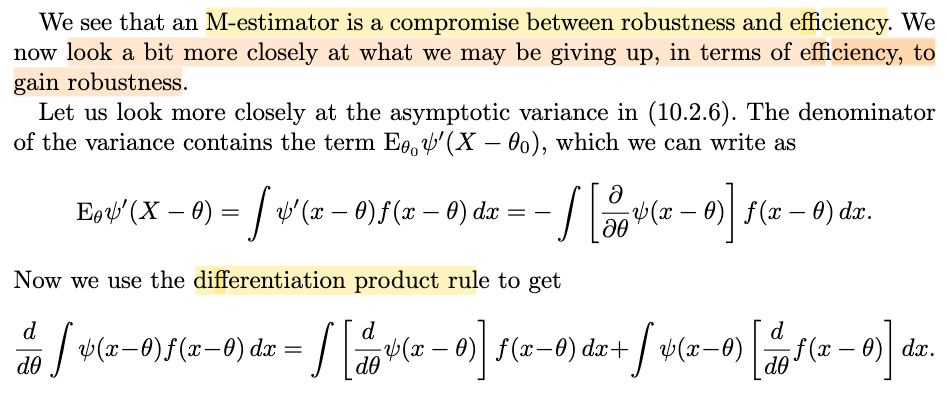</kbd>

<kbd>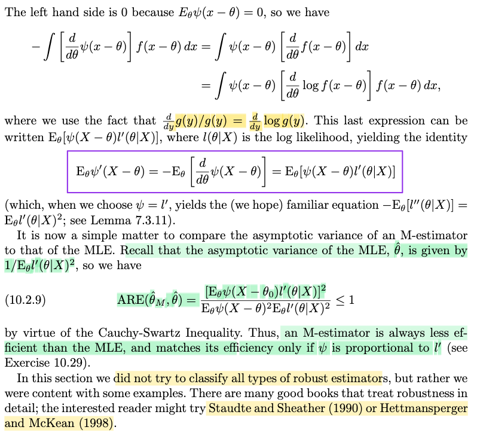</kbd>

> [!NOTE]
> Đại ý là, sau khi đã thấy trong việc so sánh ARE thực tế ở trên rằng M-estimator là sự thỏa hiệp giữa robustness và efficiency, thì phần này ta sẽ xem kĩ hơn để khẳng định rằng nếu chọn M-estimator để có thêm tính roburstness, thì ta sẽ phải đánh đổi tính efficiency. Nói cách khác, ở đây ta sẽ chứng minh là M-estimator luôn kém efficient hơn MLE (thông qua ARE sẽ luôn nhỏ hơn hoặc bằng 1)
>
>
>
> Đầu tiên lôi lại kết quả ta đã có ở trên:
>
>
>
> √n (θ^M - θ0) converge in distribution về n(0, E\_θ0\[(ψ(Xi - θ0))^2\] / {E\_θ0\[ψ'(Xi - θ0)\]}^2) 
>
>
>
> và từ cái này ta có Avar(θ^M) = E\_θ0\[(ψ(Xi - θ0))^2\] / {E\_θ0\[ψ'(Xi - θ0)\]}^2
>
>
>
> Tiếp theo gs nhìn vào mẫu số, và xem xét cái cục trong bình phương E\_θ0\[ψ'(Xi - θ0)\], bỏ kí hiệu θ0 đi, dùng θ (ý là dùng θ thay vì θ0 để chỉ true parameter)
>
>
>
> Bằng vài phép biến đổi tích phân, ta có E\_θ\[ψ'(X - θ0)\] = E\_θ\[ψ(X - θ)l'(θ|X)\]
>
>
>
>  Và như vậy ARE(θ^M, θ^) = E\_θ(\[ψ(X - θ)l'(θ|X)\]^2) / E\_θ(\[ψ'(Xi - θ)\]^2) E\_θ(\[l'(X-θ)\]^2)
>
>
>
> và cái này có dạng \[E(AB)\]^2 / E\[(A^2) (B^2)\], nên theo bất đẳng thức Cauchy: \[E(AB)\]^2 ≤ E\[(A^2) (B^2)\] khiến tỉ số này luôn nhỏ hơn hoặc bằng 1. Từ đó kết luận là: M-estimator luôn kém hiệu quả hơn MLE. Và nó chỉ bằng khi hàm ψ tỉ lệ thuận với l' (cái này được giao trong bài tập)
>
>
>
> ---
>
>
>
> Sơ lược là vậy, giờ ta sẽ làm rõ vài ý trên
>
>
>
> Vì sao E\_θ\[ψ'(X - θ)\] = E\_θ\[ψ(X - θ)l'(θ|X)\].
>
>
>
> Dùng định nghĩa của kì vọng và LOTUS thôi:
>
>
>
> E\_θ\[ψ'(X - θ)\] là kì vọng của random variable ψ'(X - θ).
>
>
>
> Nếu nhìn nó dưới góc độ là hàm của random variable X thì ta sẽ có thể dùng LOTUS để tính E\_θ\[ψ'(X - θ)\]
>
>
>
> (Review nhanh LOTUS cho phép nếu có g(X) và X \~ f(x) thì Eg(X) = ∫g(x)f(x)dx)
>
>
>
> ⇒ E\_θ\[ψ'(X - θ)\] = ∫ψ'(x - θ) f(x|θ) dx 
>
>
>
> mà pdf của X là f(x-θ) (xem lại đề bài của Example 10.2.6, nói rằng X1,...Xn iid có pdf f(x-θ), nên:
>
>
>
> E\_θ\[ψ'(X - θ)\] = ∫ψ'(x - θ) f(x-θ) dx
>
>
>
> Tiếp, nói về ψ'(x - θ): Ở đây, rất dễ sai nếu cho rằng ψ'(x - θ) là ∂/∂θ(x-θ). Phải hiểu nó là hàm số đạo hàm của hàm ψ(u), tức d/du ψ(u), và evaluate tại x - θ. Nói cách khác ψ'(x - θ) luôn phải hiểu là ψ'(u)|u=x-θ = d/du ψ(u)|u=x-θ = d/d(x-θ) ψ(x-θ).
>
>
>
> Như vậy ψ'(x - θ) = ∂/∂(x - θ) \[ψ(x - θ)\].
>
>
>
> mà ∂/∂θ ψ(x - θ) = \[∂/∂(x-θ) ψ(x - θ)\]\[∂/∂θ (x - θ)\] = \[∂/∂(x-θ) ψ(x - θ)\](-1) theo chain rule
>
>
>
> nên ⇒ ∂/∂(x-θ) ψ(x - θ) = -∂/∂θ ψ(x - θ)
>
>
>
> ⇒ E\_θ\[ψ'(X - θ)\] = -∫\[∂/∂θ ψ(x - θ)\] f(x-θ)dx, giúp ta có cái hàng đầu tiên trong sách.
>
>
>
> ---
>
>
>
> Tiếp theo ta sẽ xét d/dθ ∫ψ(x-θ)f(x-θ)dx, còn nhớ trong mấy chương đầu, có lúc ta đã học một theorem **Leibniz's rule** có thể đổi chỗ đạo hàm và tích phân (xem crosslink "Đạo hàm dưới dấu tích phân"), nên ta có:
>
>
>
> ∫ d/dθ \[ψ(x-θ)f(x-θ)\] dx
>
>
>
> dùng tính chất differentiation product rule ((uv)' = u'v + u(v'), ta có:
>
>
>
> ∫ d/dθ \[ψ(x-θ)f(x-θ)\]dx = ∫\[d/dθ ψ(x-θ)\]f(x-θ)dx + ∫ ψ(x-θ) \[d/dθ f(x-θ)\] dx
>
>
>
> Mà xái cục trong vế trái ∫ψ(x-θ)f(x-θ)dx, = ∫ψ(x-θ)f(x-θ)d(x-θ), thì lại cũng chính là E\[ψ(X-θ)\]
>
>
>
> và nó phải bằng 0 theo định nghĩa của M-estimator (xem lại đoạn "Now we assume that θ0 satisfies E\_θ0\[ψ(X − θ0)\] = 0 (which is usually taken as the definition of θ0)")
>
>
>
> Do đó 0 = ∫\[d/dθ ψ(x-θ)\]f(x-θ)dx + ∫ ψ(x-θ) \[d/dθ f(x-θ)\] dx
>
>
>
> ⇔ -∫\[d/dθ ψ(x-θ)\]f(x-θ)dx = ∫ ψ(x-θ) \[d/dθ f(x-θ)\] dx
>
>
>
> và nhân và chia phần trong tích phân của vế phải cho f(x-θ):
>
>
>
> .. = ∫ ψ(x-θ) \[d/dθ f(x-θ)\] dx = ∫ ψ(x-θ) \[1/f(x-θ)\] \[d/dθ f(x-θ)\] f(x-θ) dx
>
>
>
> thì \[1/f(x-θ)\] \[d/dθ f(x-θ)\] chính là d/dθ (log f(x-θ))
>
>
>
> = ∫ ψ(x-θ) \[d/dθ log f(x-θ)\] f(x-θ) dx
>
>
>
> ---
>
>
>
> Đến đây, với việc ta nhớ rằng f(x-θ) chính là f(x|θ), nên cũng là hàm likelihood L(θ|x), thành ra d/dθ log f(x-θ) chính là d/dθ log L(θ|x) = d/dθ l(θ|x) = l'(θ|x)
>
>
>
> Do đó ∫ ψ(x-θ) \[d/dθ log f(x-θ)\] f(x-θ) dx = ∫ ψ(x-θ) l'(θ|x) f(x-θ) dx
>
>
>
> và lại triệu hồi LOTUS, giúp ta thấy cái này chính là E\[ψ(X-θ) l'(θ|X)\], và viết thêm θ ở dưới chân E để thể hiện đây là hàm theo θ: E\_θ\[ψ(X-θ) l'(θ|X)\]. Đến đây ta có kết quả đóng khung màu tím.
>
>
>
> ---
>
>
>
> Như vậy quay lại công thức Avar(θ^M) = E\_θ\[(ψ(Xi - θ))^2\] / {E\_θ\[ψ'(Xi - θ)\]}^2
>
>
>
> thay mẫu số Eθ\[ψ'(X-θ)\] = E\_θ\[ψ(X-θ) l'(θ|X)\] ta có:
>
>
>
> Avar(θ^M) = E\_θ\[(ψ(Xi - θ))^2\] / {E\_θ\[ψ(X-θ) l'(θ|X)\]}^2 
>
>
>
> Còn Avar(θ^), tức sample mean, như ta đã chứng minh, chính là CRLB, tức 1/I1(θ)
>
>
>
> ...
>
>
>
> = 1/E\[l'(θ|X)^2\]
>
>
>
> Do đó ARE(θ^M, θ^) =  (E\_θ\[ψ(X - θ)l'(θ|X)\])^2 / E\_θ0{\[ψ'(Xi - θ0)\]^2} E\_θ(\[l'(X-θ)\]^2)
>
>
>
> Tới đây theo lập đã nói, ta kết luận.

> [!TIP]
> **🤖 AI Feedback** — ✅ Score: **90/100**
>
> Bài viết giải thích rất chi tiết và chính xác quá trình biến đổi chứng minh đẳng thức đạo hàm bằng LOTUS và luật Leibniz. Tuy nhiên, bạn có một lỗi gõ nhỏ ở công thức tính ARE cuối bài khi viết nhầm $\psi'$ thay vì $\psi$ ở mẫu số ($E_\theta[\psi(X-\theta)^2]$).

**🔗 See also:** [Bổ đề Tính toán Hàm mũ](./73_methods_of_evaluating_estimators.md#node-sttybm4) · [Giá trị kỳ vọng và LOTUS](./22_expected_value.md#node-p3585vu) · [Đạo hàm dưới dấu tích phân](./24_differentiating_under_integral.md#node-817xtmo)

 

