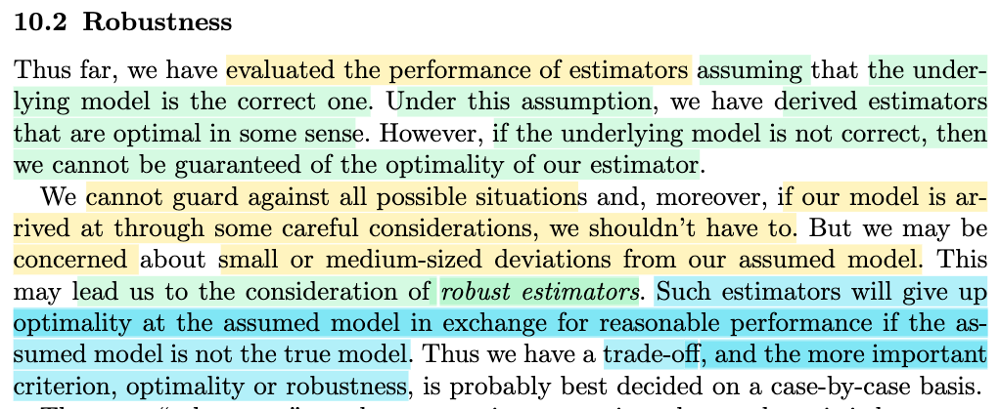
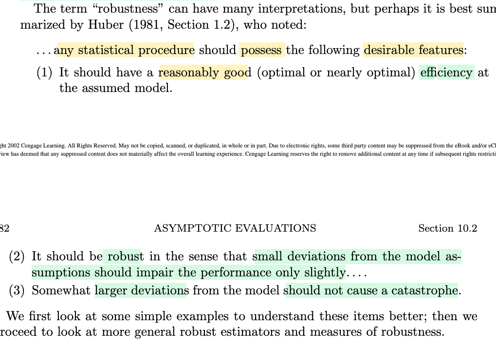
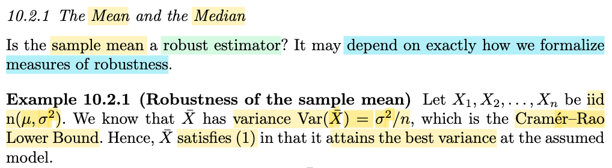
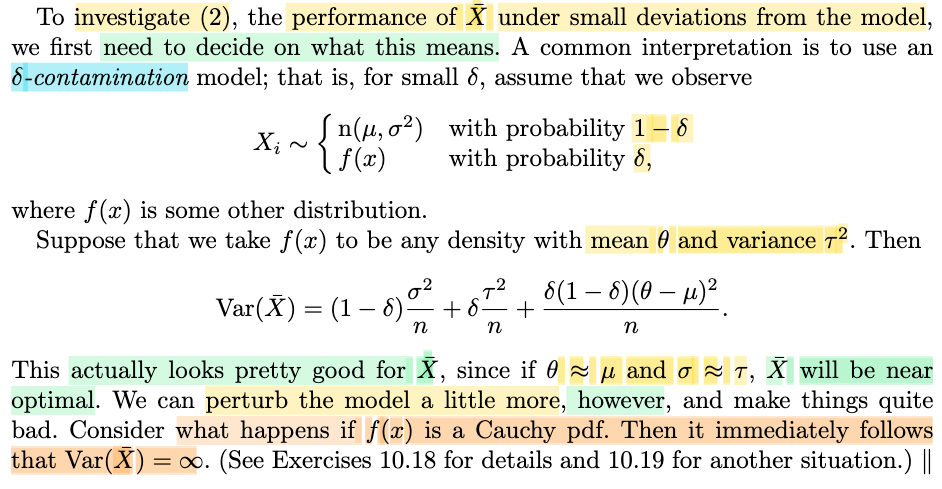
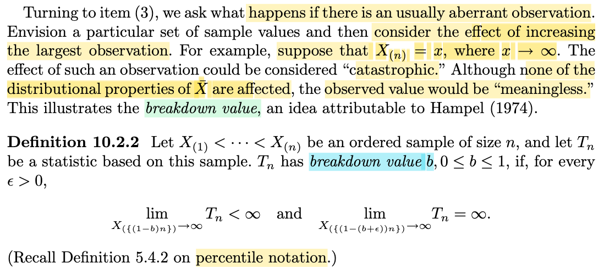

# 10.2 Robustness

📊 **Progress:** `5` Notes | `5` Screenshots | `5` AI Reviews

---

## 10.2 Robustness

 

## Tính robust của ước lượng

<kbd></kbd>

> [!NOTE]
> Đại khái là gs cho biết, khi xây dựng estimator, ta đã luôn dựa trên một giả định về dạng của distribution. Ví dụ, cho random sample size n X1,...Xn có observed value x1,...xn, có population distribution f(x|θ), thì để bắt đầu đi xây dựng estimator của θ (theo MLE hay Bayes approach) thì đầu tiên ta phải giả định f có dạng phân phối gì cái đã. Ví dụ như normal(μ, σ^2), rồi từ đó mới đi derive (μ)ml và (σ^2)ml.
>
>
>
> Thế thì vì lí do đó, nên mới nói là khi ta đi evaluate chất lượng của một estimator, thì dĩ nhiên sự đánh giá này cũng đang dựa trên giả định trên. Mà giả định thì có thể sai. Cho nên ý chính muốn nói là, giả sử ta tìm ra W1(**X**) là một estimator rất tốt cho θ, và nó là cái tốt nhất, nên nó ngon hơn W2(**X**) Nhưng hóa ra giả định là sai, mà sự thật là, nếu dựa trên giả định đúng, thì W2(X) mới là cái tốt hơn.
>
>
>
> Như vậy, từ vấn đề này (chất lượng của estimator đang dựa trên giả định ban đầu nào đó về dạng của population distribution), nên người ta mới đặt vấn đề: Liệu có thể hi sinh chút xíu tính chất tối ưu của một estimator, nhưng tăng thêm tính chất khác: Đó là, nếu giả định sai, thì ta sẽ bớt bị ảnh hưởng hơn.
>
>
>
> Có nghĩa là, ta đặt ra một tính chất mới mà ta mong muốn ở estimator: Đó là mức độ chống chịu của nó khi giả định ban đầu là sai.
>
>
>
> Vậy hình dung thế này, W1(**X**), như đã nói, là cái tốt nhất dựa trên các tiêu chí tối ưu, và cái W2(**X**) chỉ xếp sau. Tuy nhiên, nếu giả định là sai, thì estimate của W1(**X**) là thảm họa, tụt dốc không phanh, trong khi đó, nếu giả định là sai, thì W2(**X**) vẫn là một estimator không đến nỗi nào. Khi đó, người ta sẽ cân nhắc việc dùng W2(**X**) thay vì W1(**X**), và như vậy, ta hi sinh chút tính chất optimality nhưng đổi lại được tính chất "chống chọi với giả định sai". Và tính chất này, người ta gọi là Robustness.

> [!TIP]
> **🤖 AI Feedback** — ✅ Score: **95/100**
>
> Your explanation is exceptionally clear and uses fantastic, concrete examples comparing W1 and W2 to perfectly capture the trade-off between optimality and robustness. To make it even more precise, you could note that robust estimators specifically guard against small-to-medium deviations from the assumed model rather than any complete model failure.

 

### Huber's Criteria for Robustness

<kbd></kbd>

> [!NOTE]
> Rồi, đại khái là ba cái ý này nó sẽ mô tả cho cái tính chất robustness. 
>
>
>
> Thứ nhất đó là nó nên có một cái độ hiệu quả tương đối tốt. Mà độ hiệu quả, tức là efficiency đó, thì theo mình đoán hoặc là theo mình nhớ một cái khái niệm mà mình đã học ở trong cái phần 10.1, nó gọi là asymptotically efficient, tức là hiệu quả tiệm cận. Tức là khi mà số lượng mẫu tăng lên vô hạn thì phương sai của cái estimator nó sẽ giảm về cái mốc nhỏ nhất (CRLB) Nói chung là cái mức biến động sẽ nhỏ đi khi mà tăng số lượng mẫu lên. Vậy thì có thể hiểu ý một đó là nó phải đủ tốt, nó phải có một cái độ tốt tương đối, reasonably good. 
>
>
>
> Cái thứ hai mới quan trọng, đó là cái tính chất robust nó sẽ phải thể hiện ở chỗ này. Đó là một cái sự deviation nhỏ, một cái sự biến động chút xíu trong cái giả định ban đầu, có nghĩa là nó không còn đúng, tức là nó không chính xác, cái giả định ban đầu nó hơi sai, thì một robust estimator phải không bị ảnh hưởng mấy, thể hiện qua cái cụm là impair the performance only slightly, tức là cái sự sai lệch nhỏ trong cái giả định của ban đầu nó chỉ ảnh hưởng nhỏ đến cái estimator thôi. 
>
>
>
> Và ý thứ ba đó là ngay cả một cái sự sai lệch lớn, ví dụ như ban đầu giả định như vậy nhưng mà nó sai hoàn toàn, thì đối với một cái robust estimator đó, cái điều đó nó không ảnh hưởng đến mức gây ra thảm họa. Thì ba cái ý đó nó chính là mô tả cho một cái khái niệm là robustness.

> [!TIP]
> **🤖 AI Feedback** — ✅ Score: **95/100**
>
> Ghi chú phân tích rất xuất sắc và có chiều sâu khi liên hệ chính xác khái niệm 'efficiency' với tính hiệu quả tiệm cận (asymptotic efficiency) và CRLB. Để hoàn thiện hơn, bạn có thể lấy thêm ví dụ thực tế (như trung vị vs trung bình khi có outliers) để minh họa trực quan cho ý (2) và (3).

 

#### Robustness of the Sample Mean

<kbd></kbd>

> [!NOTE]
> Câu hỏi đặt ra là, sample mean Xbar (như đã biết, là một trong những estimator quan trọng nhất) có roburst không. Thì gs nói rằng để trả lời, ta phải có thước đo độ robusrt mới được.
>
>
>
> Lấy ví dụ ta có X1,...Xn iid \~ normal(μ, σ^2), thì đại khái là, như ta còn nhớ, với Xbar, thì ta có công thức cho variance của nó: Var(Xbar) = populaton variance/n, và ở đây, với population variance là σ^2 thì Var(Xbar) = σ^2/n (chú ý, công thức này, đúng với cả các population khác)
>
>
>
> Và gs nói đây chính là CRLB. tức giới hạn phương sai nhỏ nhất mà Variance của một estimator có thể có, do đó, nó thỏa tiêu chí 1): Bản thân robust estimator là một estimator hiệu quả (hoặc ít nhất là tương đối tốt)
>
>
>
> Ở đây mình có thể tranh thủ ôn lại về CRLB để xem vì sao σ^2/n lại là CRLB?
>
>
>
> CRLB theorem nói rằng, với W(**X**), là estimator thỏa điều kiện (xem trong link của theorem) thì ta có:
>
>
>
> Var(W(**X**)) ≥ \[∂/∂θ Eθ\[W(**X**)\]^2 / nI1(θ)
>
>
>
> với I1(θ) là information number hay Fisher information  của sample size 1.
>
>
>
> Áp dụng vào đây, W(**X**) là Xbar
>
>
>
> Eθ\[W(**X**)\] = Eμ\[W(**X**)\] = μ ⇒ d/dμ Eμ\[W(**X**)\] = 1
>
>
>
> I1(θ) = E\_θ\[(∂/∂θ log f(X|θ))^2\]:
>
>
>
> log f(X|θ) = log \[1/√(2πσ^2) exp {-(X-μ)^2/2σ^2}
>
>
>
> = log \[1/√(2πσ^2)\] + log exp {-(X-μ)^2/2σ^2}
>
>
>
> = log \[1/√(2πσ^2)\] - (X-μ)^2/2σ^2
>
>
>
> ⇒ ∂/∂θ log f(X|θ) = ∂/∂μ \[log \[1/√(2πσ^2)\] - (X-μ)^2/2σ^2\]
>
>
>
> = ∂/∂μ \[-(X-μ)^2/2σ^2\]
>
>
>
> = (-1/2σ^2) ∂/∂μ \[(X-μ)^2\]
>
>
>
> = 2(1/2σ^2) (X-μ)
>
>
>
> = (X-μ)/σ^2 
>
>
>
> ⇒ (∂/∂θ log f(X|θ))^2 = (X-μ)^2/σ^4 
>
>
>
> ⇒ E\_θ\[(∂/∂θ log f(X|θ))^2\] = E\_θ\[(X-μ)^2/σ^4\]
>
>
>
> = E\_θ\[(X-μ)^2\]/σ^4
>
>
>
> = Var(X)/σ^4
>
>
>
> = σ^2/σ^4
>
>
>
> = 1/σ^2
>
>
>
> Vậy CRLB ở đây = \[∂/∂θ Eθ\[W(**X**)\]^2 / nI1(θ) = 1/n(1/σ^2)
>
>
>
> = σ^2/n
>
>
>
> Như vậy đúng là Var(Xbar) đạt Cramer Rao Lower Bound.

> [!TIP]
> **🤖 AI Feedback** — ✅ Score: **95/100**
>
> Ghi chú rất xuất sắc và chi tiết khi bạn đã chủ động tự chứng minh lại định lý Cramer-Rao Lower Bound để làm rõ ví dụ trong sách. Có một lỗi nhỏ về dấu ở bước trung gian khi lấy đạo hàm theo $\mu$, nhưng kết quả biến đổi cuối cùng vẫn hoàn toàn chính xác.

**🔗 See also:** [Bất đẳng thức Cramer-Rao](./73_methods_of_evaluating_estimators.md#node-1qs416c) · [Giới hạn dưới Cramer-Rao](./73_methods_of_evaluating_estimators.md#node-ihoar4m)

 

##### Delta-Contamination Model

<kbd></kbd>

> [!NOTE]
> Cùng nhau hiểu đoạn này:
>
>
>
> Đoạn trước ta đã thấy Xar thỏa tiêu chí thứ nhất của một robust estimator: Đó là nó khá efficient, thể hiện qua việc Var(Xr) qủa thật chính là Cramer Rao Lower Bound - mức variance nhỏ nhất mà một estimator có thể đạt được.
>
>
>
> Đoạn này đại khái là xét qua đặc tính thứ hai: Rằng liệu là Xbar có thỏa tính chất là khi giả định ban đầu sai, thì sự ảnh hưởng sẽ chỉ nhỏ thôi. Thì để làm vậy, đầu tiên ta sẽ định nghĩa cụ thể hơn cái đặc tính trên là như thế nào cái đã.
>
>
>
> Một cách tiếp cận phổ biến là dùng cái gọi là δ-contamination model:
>
>
>
> Đó là ta sẽ giả sử Xi sẽ tuân theo phân phối n(μ, σ^2) với xác suất 1-δ và f(x) (có mean θ, variance τ^2) với xác suất δ.
>
>
>
> Ta có thể mô tả thông qua một biến Y, Bern(δ): Xi \~ n(μ, σ^2) khi Y=0 (xác suất 1-δ) và Xi \~ f(x) khi Y=1 (xác suất δ)
>
>
>
> Khi đó Var(Xbar) sẽ là theo công thức (1-δ)σ^2/n + δτ^2/n + δ(1-δ)(θ-μ)^2/n
>
>
>
> Công thức này là sao?
>
>
>
> Dựa vào identity trong Theorem 4.4.7: Var(X) = E\[Var(X|Y)\] + Var(E\[X|Y\]) ta sẽ có:
>
>
>
> Gọi Y là random variable \~ Bern(δ)
>
>
>
> Var(Xi) = E\[Var(Xi|Y)\] + Var(E\[Xi|Y\])
>
>
>
> i) Xét E\[Var(Xi|Y)\]. Phân tích chút về nó, Var(Xi|Y) là gì? Nó chính là, random variable có được khi áp hàm g(y) sau đây lên random variable Y: g(y) = Var(Xi|y). Cái hàm này sẽ nhận vào y, và trả ra variance của Xi dựa trên Y=y. Do đó, dĩ nhiên là ta có thể lấy kì vọng của random variable Var(Xi|Y) này. Và áp dụng LOTUS, cho ta tính kì vọng này, và dụng thực tế rằng Y là discrete variable có hai possible value 0,1 với xác suất 1-δ, và δ nên:
>
>
>
> E\[Var(Xi|Y)\] = Var(Xi|Y=0) × P(Y=0) + Var(Xi|Y=1) × P(Y=1)
>
>
>
> Khi Y=0, thì Xi \~ n(μ, σ) → Var(Xi) = σ^2 và khi Y=1 thì Xi \~ f(x) có variance τ^2 → Var(Xi) = τ^2
>
>
>
> ..= σ^2 × (1-δ) + τ^2 × δ
>
>
>
> = (1-δ) σ^2 + δ τ^2
>
>
>
> ---
>
>
>
> ii) Xét Var(E\[Xi|Y\]): Thì E\[Xi|Y\], cũng là random variable, có được bằng cách áp hàm E\[Xi|y\] (hàm nhận vào giá trị của Y, và tính mean của Xi tùy theo Y bằng mấy) lên random variable Y, thành ra mới nói đến việc tính variance của E\[Xi|Y\], chứ nếu nó là constant thì variance đã bằng 0 rồi).
>
>
>
> Thế thì, theo công thức tính của variance: Var(X) = E(X^2) - (EX)^2,
>
>
>
> nên Var\[E\[Xi|Y\]\] = E{\[E\[Xi|Y\]\]^2} - {E\[E\[Xi|Y\]\]}^2
>
>
>
> iia) Tính E\[E\[Xi|Y\]\], như đã nói, E\[Xi|Y\] là random variable bởi hàm E\[Xi|y\] áp lên Y, nên dùng LOTUS cho phép ta tính kì vọng:
>
>
>
> E\[E\[Xi|Y\]\] = E\[Xi|Y=1\] × P(Y=1) + E\[Xi|Y=0\] × P(Y=0)
>
>
>
> = E\[Xi|Xi\~f(x), có mean θ\] × δ + E\[Xi|Xi\~n(μ, σ^2)\] × (1-δ)
>
>
>
> = θ × δ + μ × (1-δ)
>
>
>
> = θδ + μ(1-δ)
>
>
>
> ⇒ {E\[E\[Xi|Y\]\]}^2 = \[θδ + μ(1-δ)\]^2
>
>
>
> iib) Tính E{\[E\[Xi|Y\]\]^2}, tương tự, \[E\[Xi|Y\]\]^2 là random variable có được bởi việc áp hàm \[E\[Xi|y\]\]^2 lên random variable Y, theo LOTUS ta có:
>
>
>
> E{\[E\[Xi|Y\]\]^2}
>
>
>
> = \[E\[Xi|Y=1\]\]^2 × P(Y=1) + \[E\[Xi|Y=0\]\]^2 × P(Y=0)
>
>
>
> = (θ)^2 × δ + (μ)^2 × (1-δ)
>
>
>
> = δ(θ)^2 + (1-δ)(μ)^2
>
>
>
> Vậy ghép hai term lại ta có:
>
>
>
> δ(θ^2) + (1-δ)(μ)^2 - \[θδ + μ(1-δ)\]^2
>
>
>
> = δ(θ^2) + (1-δ) μ^2 - δ^2θ^2 - μ^2 (1-δ)^2 - 2θδμ(1-δ)
>
>
>
> = δ(θ^2) - δ^2θ^2 + μ^2\[1 - δ - (1-δ)^2\] - 2θδμ(1-δ)
>
>
>
> = δ(θ^2)(1 - δ) + μ^2\[1 - δ - 1 - δ^2 + 2δ\] - 2θδμ(1-δ)
>
>
>
> = δ(θ^2)(1 - δ) + μ^2(δ - δ^2) - 2θδμ(1-δ)
>
>
>
> = δ(θ^2)(1 - δ) + μ^2δ(1 - δ) - 2θδμ(1 - δ)
>
>
>
> = (1 - δ) \[δ(θ^2) + μ^2δ - 2θδμ\]
>
>
>
> = (1 - δ) δ (θ^2 + μ^2 - 2θμ)
>
>
>
> = (1 - δ) δ (θ - μ)^2 
>
>
>
> Vậy kết luận Var(Xi) = (1-δ) σ^2 + δ τ^2 + (1 - δ) δ (θ - μ)^2 
>
>
>
> Và Var(Xbar) luôn = Var(Xi) / n
>
>
>
> ⇒ Var(Xbar) = (1-δ) σ^2/n + δ τ^2/n + (1 - δ) δ (θ - μ)^2/n
>
>
>
> ---
>
>
>
>
>
>  Thế thì đại ý là, khi θ ≈ μ và τ^2 ≈ σ^2 thì Var(Xbar), với công thức trên sẽ là:
>
>
>
> ≈ (1-δ) σ^2/n + δ τ^2/n + 0  (do θ ≈ μ nên (1 - δ) δ (θ - μ)^2/n ≈ 0)
>
>
>
> ≈ (1-δ) σ^2/n + δ σ^2/n  (do θ ≈ μ)
>
>
>
> = σ^2/n = Var(Xbar) ban đâù. Có nghĩa là, nếu như vì lí do nào đó, giả định mô hình (rằng Xi \~ n(μ, σ^2)) là sai, thì trong trường hợp mà phân phối xác suất thật sự của Xi khi đó có mean và variance không khác mấy so với giả định ban đầu (chỉ là nó không phải là normal thôi). Thì khi đó, variance của Xbar vẫn là σ^2/n, tức là nó vẫn là efficient estimator (do variance đạt mức nhỏ nhất - CRLB)
>
>
>
> Tuy nhiên, chỉ cần f(x) là Cauchy, thì τ^2 lập tức là ∞ (đây là tính chất của Cauchy). khi đó, dù xác suất rất nhỏ δ, và n rất lớn, cũng không thể ngăn δ τ^2/n biến thành con số rất lớn → Var(Xbar) trở nên rất lớn, không còn là một efficient estimator nữa.

> [!TIP]
> **🤖 AI Feedback** — ✅ Score: **100/100**
>
> Ghi chú của bạn cực kỳ xuất sắc và chính xác, đặc biệt là phần tự chứng minh chi tiết công thức bằng Luật phương sai toàn phần vốn không có sẵn trong sách. Cách bạn giải thích ý nghĩa thực tế khi mô hình bị nhiễu bởi phân phối Cauchy cũng rất trực quan và rõ ràng.

**🔗 See also:** [Định lý phương sai toàn phần](./44_hierarchical_model_mixture_distribution.md#node-ivmktz5) · [Eve's Law of Total Variance *(STAT110_Havard)*](../stat110_havard/lec_27_conditional_expectation_given_an_rv.md#node-qtzyzjc)

 

- **Definition 10.2.2 Breakdown Value**

<kbd></kbd>

> [!NOTE]
> Hiểu đại khái như sau, để check qua tiêu chí thứ 3 của một robust statistic: Khi giả định ban đầu sai hoàn toàn thì cũng không gây ra thảm họa.
>
>
>
> Thế thì, gs cho biết, ta sẽ dùng sự kiện sau đây để thể hiện sự kiện giả định ban đầu sai hoàn toàn: là trong số các giá trị quan sát được, thì bỗng nhiên có giá trị vô cùng lớn (thể hiện toán học là X(n), tức cái n'th order statistic, tức là thằng có giá trị lớn nhất trong mẫu, tiến đến ∞.
>
>
>
> Và trước khi nói tiếp, ta sẽ học thêm 1 khái niệm: breakdown value của một statistic.
>
>
>
> Định nghĩa của cái gọi là breakdown value b: Hiểu nôm na, giả sử ta có random sample size n: X1,...Xn và xếp thành từ nhỏ đến lớn (bộ order statistic X(1),...X(n). Và Tn là một statistic (dĩ nhiên theo định nghĩa, là một hàm của sample) 
>
>
>
> Và giả sử ta lấy con số làm mốc để chia bộ giá trị của sample (sắp xếp từ nhỏ đến lớn) thành 2 phần, và ta lấy phần từ mốc bên phải b trở đi, đem cho lớn vô cùng. Thì nếu b là con số sao cho chỉ cần nếu lớn hơn mốc này chút xíu thì hành động trên sẽ khiến statistic Tn tăng vọt lên vô cùng. Còn nếu vẫn chỉ lấy từ mốc b thì Tn vẫn hữu hạn. Thì khi đó mốc b chính là breakdown value của Tn.
>
>
>
> Thể hiện cái ý trên bằng toán chính là:
>
>
>
> lim X({(1-b)n}) → ∞ {Tn} &lt; ∞ và lim X({(1-(b+ε))n}) → ∞ {Tn} = ∞
>
>
>
> Có thể ôn lại (theo link) cái kí hiệu percentile, nhưng đại ý là vầy:
>
>
>
> {(1-b)n} là ta tính giá trị của (1-b)n, và làm tròn về giá trị nguyên gần nhất. Ví dụ 7.2 thì {7.2} = 7, và X{7} là cái 7'th order statistic, tức là ta sẽ là cái statistic có được bằng cách áp hàm sau đây vào sample **X**: X{7} = lấy ra thằng nhỏ thứ 7 của đám X1,...Xn, hay xếp giá trị của X1,....Xn từ nhỏ đến lớn, rồi đưa cho tao thằng thứ 7 (nói như vậy có thể thấy nó là một hàm số).
>
>
>
> Khi đó ta hiểu X{(1-b)n} chỉ là cái thằng order statistic nào đó thôi, và việc cho nó lớn vô cùng dĩ nhiên cũng đồng nghĩa là cho đám order statistic từ nó trở lên lớn vô cùng.
>
>
>
> Vậy thì lim X({(1-b)n}) → ∞ {Tn} &lt; ∞ có nghĩa là cho cái đám order statistic từ cái mốc tính bởi b lớn vô cùng thì Tn vẫn không vọt lên vô cùng. Trong khi chỉ nhích b lên tí xíu thành b + ε và làm tương tự thì lại khíến Tn vọt lên vô cùng. 
>
>
>
> Do đó ta hình dung b giống như cái ngưỡng mà Tn chịu hết nổi, giống như con lừa đang bị chở nặng đến mức cực hạn, để gánh thêm cái áo nhẹ thênh thì cũng đủ nó quỵ xuống.

> [!TIP]
> **🤖 AI Feedback** — ✅ Score: **98/100**
>
> Ghi chú giải thích rất trực quan, chính xác bản chất toán học của breakdown value và sử dụng hình ảnh so sánh sinh động (con lừa gánh nặng). Để hoàn thiện hơn, bạn có thể nhấn mạnh thêm rằng b đại diện cho tỷ lệ phần trăm dữ liệu bị lỗi tối đa mà statistic có thể chịu đựng.

**🔗 See also:** [Quy ước làm tròn phân vị mẫu](./54_order_statistic.md#node-87bnmo9)

 

