# 10.3 Hypothesis Testing

📊 **Progress:** `12` Notes | `15` Screenshots | `12` AI Reviews

---

 

## Section 10.3 Hypothesis Testing

<kbd>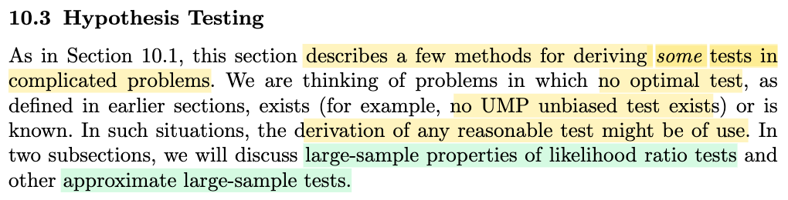</kbd>

> [!NOTE]
> Phần này đại ý là ta sẽ bàn về bài toán hypothesis testing trong các trường hợp phức tạp.
>
>
>
> Cụ thể là khi các bài toán không có optimal test, ví dụ như không có UMP test.
>
>
>
> Đã học hypothesis testing từ chap 8, có lẽ nên active recall chút xíu:
>
>
>
> Đầu tiên, bài toán hypothesis testing cũng là bài toán inference (model parameter), giống như bài toán point estimator. Với point estimation, trong đó, cho sample X1,...Xn \~ f(x|θ) (và ta giả định f(x|θ) là một dạng, một loại nào đó, và đây gọi là cách tiếp cận parameteric model) và mục tiêu là đi tìm một estimator - theo định nghĩa, là một hàm của sample W(**X**), để với observed value **x** của **X**, W(**x**) sẽ cho ta một point estimate của θ.
>
>
>
> Còn với hypothesis testing, nhiệm vụ cũng là đưa ra một hàm số của sample, nhưng thay vì tính ra point estimate của θ, hàm này sẽ đưa ra quyết định giữa một trong hai giả thuyết: θ nằm trong Θ0 (gọi là H0) hay θ nằm trong Θ0c (gọi là H1). Và để làm vậy, ta sẽ xây dựng một hypothesis testing, có bản chất là một hàm quyết định: nhận vào một possible value của sample, tính ra một hàm của sample (gọi là test statistic δ(**X**)), và từ giá trị của nó, ta sẽ đưa ra output: kết luận θ thuộc Θ0 hay θ thuộc Θ0c (ví dụ như so δ(**x**) với một ngưỡng nào đó)
>
>
>
> Và cũng đồng nghĩa, phép thử sẽ tạo ra một cái gọi rejection region R, chứa các input x khiến kết quả phép thử là reject H0 (tức kết luận cho rằng θ ∈ Θ0c): 
>
>
>
> R = {**x** ∈ **𝒳**: δ(**x**) = reject H0}
>
>
>
> Và từ đó, cũng như ta có các cách tiếp cận để có point estimator W(**X**) tối ưu, thì ở đây ta cũng sẽ đánh giá để tìm ra hypothesis testing tối ưu.

> [!TIP]
> **🤖 AI Feedback** — ✅ Score: **90/100**
>
> Bạn đã tóm tắt chính xác ý chính và có tư duy liên hệ xuất sắc khi chủ động ôn lại các khái niệm nền tảng từ chương trước. Tuy nhiên, để đầy đủ hơn, bạn nên bổ sung hai phương pháp cụ thể được nhắc đến ở cuối bài là kiểm định tỷ số khả biến mẫu lớn và các kiểm định xấp xỉ mẫu lớn.

 

### Section 10.3.1 Asymptotic Distribution of LRTs

<kbd>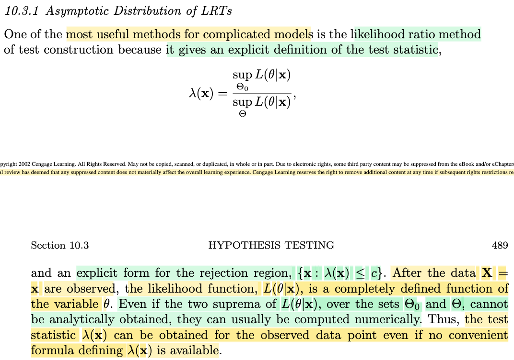</kbd>

> [!NOTE]
> Đầu tiên gs nói rằng đại ý là một trong nhưng method hữu ích nhất cho các mô hình phức tạp là likelihood ratio method, vì nó cho ta một định nghĩa tường minh của test statistic, cũng như rejection region có dạng tường minh.
>
>
>
> Dừng lại chút ôn lại cái này: Như note trước mình vừa recall lại, rằng trong bài toán hypothesis testing, nhiệm vụ là đi tìm, xây dựng một test statistic để dựa vào giá trị của nó để đưa ra kết luận về θ thuộc Θ0 (H0) hay Θ0c (H1). Vậy thì một cách đó là dùng test statistic sau: likelihood ratio test (LRT) kí hiệu λ(**x**), có công thức là:
>
>
>
> λ(**x**) = sup\_{θ∈Θ0}  {L(**x**|θ)} / sup\_{θ∈Θ} {L(**x**|θ)}, có ý nghĩa là:
>
>
>
> với observed data **X** = **x**, thì tỉ số giữa độ hợp lí lớn nhất của θ tìm được trong tập Θ0 so với độ hợp lí lớn nhất của θ tìm được trong toàn không gian parameter space Θ là bao nhiêu.
>
>
>
> Và với LRT thì decision rule là: So với một threshold c nào đó, để nếu λ(**x**) ≤ c thì kết luận reject H0, và ngược lại. Và điều này mang ý nghĩa là "nếu tìm trong Θ0 mà kết quả chỉ có độ hợp lí quá nhỏ so với kết quả khi tìm trong toàn parameter space Θ, thì ta kết luận θ không nằm trong Θ0".
>
> Đương nhiên để hoàn thành một hypothesis test, ta vẫn phải chọn giá trị của c, nhưng cách thức là như vậy.
>
>
>
> Như vậy, với LRT, rejection region là: R = {**x** ∈ 𝒳: λ(**x**) ≤ c}.
>
>
>
> Dễ thấy cái mẫu số chính là là giá trị của likelihood tại MLE θ^, vì theo định nghĩa của MLE, θ^ chính là argmax\_Θ L(θ|**x**).
>
>
>
> Và theo gs Casella, dù cho việc tính hai cái đỉnh của hàm likelihood khi xét θ trong Θ0 hay Θ có thể không tính được theo lối analytic (ví dụ như dùng giải tích để có closed form formula để tính) thì ta vẫn có thể tính theo lối numerically (ám chỉ các thuật toán tối ưu). Do đó dù không có công thức tính tử số và mẫu số ta vẫn có thể tính giá trị của λ(**x**) dựa trên thuật toán.

> [!TIP]
> **🤖 AI Feedback** — ✅ Score: **98/100**
>
> Ghi chú cực kỳ chi tiết và chính xác, thể hiện sự hiểu biết sâu sắc về mặt toán học cũng như ý nghĩa thực tiễn của phương pháp LRT. Bạn chỉ cần lưu ý một chút về ký hiệu truyền thống của hàm likelihood là L(\theta|\mathbf{x}) thay vì viết ngược lại, nhưng tổng thể bài viết là xuất sắc.

 

#### Level Alpha Test Definition

<kbd>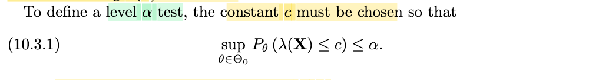</kbd>

> [!NOTE]
> Và ở đây nhắc lại về khái niệm level-α test, cũng là dịp để active recall chút xíu:
>
>
>
> Như đã nói, cũng như với point estimator, ta sẽ có cách (tiêu chí) để evaluate chúng, thì với hypothesis test cũng vậy.
>
>
>
> Thế thì đối với test, nó có thể có hai loại error: Kết luận H0 khi θ ∈ Θ0c hoặc ngược lại kết luận H1 khi θ ∈ Θ0, gọi là Type I và Type II error.
>
>
>
> Như vậy, với LRT, event Type I error xảy ra khi λ(**X**) ≤ c khi θ ∈ Θ0, và xác suất mắc Type I error là: P(λ(**X**) ≤ c) khi θ ∈ Θ0. Tương tự event Type II error xảy ra khi λ(**x**) &gt; c khi θ thuộc Θ0c.
>
>
>
> Và từ đó ta có định nghĩa của level α test: Đó là phép thử mà xác suất mắc Type error I không vượt quá α: sup\_θ∈Θ0 P(λ(**X**) ≤ c) ≤ α.

> [!TIP]
> **🤖 AI Feedback** — ✅ Score: **95/100**
>
> Ghi chú rất tốt và chính xác khi giải thích rõ mối liên hệ giữa sai lầm Loại I (Type I error) và định nghĩa của level-α test từ hình ảnh. Điểm cần lưu ý nhỏ là ở câu cuối bạn nên viết rõ là 'sai lầm Loại I' thay vì ghi chung chung là 'Type error' để tránh nhầm lẫn.

 

##### Asymptotic Distribution of the LRT

<kbd>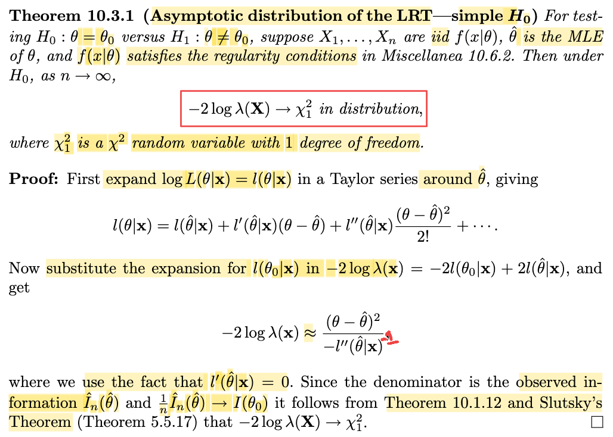</kbd>

> [!NOTE]
> Định lí 10.3.1, xét một bài toán testing giữa H0: θ = θ0 vs H1: θ ≠ θ0, cho X1,....Xn iid \~f(x|θ), với θ^ là MLE của θ, và f(x|θ) thỏa regularity condition. Khi đó, theorem nói rằng:
>
>
>
> Under H0 (tức là nếu θ = θ0), thì -2log λ(**X**) → (d) χ²\_1
>
>
>
> Chứng minh như sau:
>
>
>
> Đầu tiên, khai triển Taylor quanh θ^ đối với hàm log likelihood l(θ|**x**) = log L(θ|**x**):
>
>
>
> l(θ|**x**) = l(θ^|**x**) + l'(θ^|**x**)(θ-θ^) + (1/2)l''(θ^|**x**)(θ-θ^)^2 + ....
>
>
>
> = l(θ^|**x**) + 0 × (θ-θ^) + (1/2)l''(θ^|**x**)(θ-θ^)^2 + ....
>
>
>
> = l(θ^|**x**) + (1/2)l''(θ^|**x**)(θ-θ^)^2 + ....
>
>
>
> Thay θ = θ0:
>
>
>
> l(θ0|**x**) = l(θ^|**x**) + (1/2)l''(θ^|**x**)(θ0-θ^)^2 + ....
>
>
>
> ⇒ l(θ0|**x**) ≈ l(θ^|**x**) + (1/2)l''(θ^|**x**)(θ0-θ^)^2
>
>
>
> Tiếp, xét cái -2 log λ(**x**). Như đã ôn lại, λ(**x**) = sup\_Θ0 L(θ|**x**) / sup\_Θ L(θ|**x**),
>
>
>
> và θ^ là MLE của θ nên mẫu số chính là L(θ^|**x**) nên ta có:
>
>
>
> và gọi θ^0 là restricted MLE, tức là argmax\_Θ0 L(θ|**x**), và vì ở đây Θ0 = {θ0}, nên θ^0 = θ0
>
>
>
> ⇒ -2 log λ(**x**) = -2 log \[L(θ0|**x**) / L(θ^|**x**)
>
>
>
> = -2 (log L(θ0|**x**) - log L(θ^|**x**))
>
>
>
> = -2 (l(θ0|**x**) - l(θ^|**x**))
>
>
>
> Thay l(θ0|**x**) ≈ l(θ^|**x**) + (1/2)l''(θ^|**x**)(θ0-θ^)^2 vào:
>
>
>
> ..= -2 (l(θ^|**x**) + (1/2)l''(θ^|**x**)(θ0-θ^)^2 - l(θ^|**x**))
>
>
>
> = - l''(θ^|**x**)(θ0-θ^)^2
>
>
>
> Vậy ta có -2 log λ(**x**) ≈ - l''(θ^|**x**)(θ0-θ^)^2 = (θ0-θ^)^2 \[-l''(θ^|**x**)\]
>
>
>
> (chỗ này trong sách ghi là chia cho l''(θ^|**x**) mình cho là bị in lỗi thiếu ^(-1), tức mẫu số đúng phải là l''(θ^|**x**)\]^(-1))
>
>
>
> Vậy -2 log λ(**X**) ≈ (θ0-θ^)^2 \[- l''(θ^|**X**)\]
>
>
>
> ---
>
>
>
> Xét - l''(θ^|**X**):
>
>
>
> \- l''(θ^|**X**) = \[-∂^2/∂θ^2 log L(θ|**X**)\] | θ=θ^
>
>
>
> Xét -∂^2/∂θ^2 log L(θ|**X**)
>
>
>
> = -∂^2/∂θ^2 log f(**X**|θ)
>
>
>
> = - ∂^2/∂θ^2 log Πi f(Xi|θ)
>
>
>
> = - ∂^2/∂θ^2 (Σi log f(Xi|θ))
>
>
>
> = - Σi \[∂^2/∂θ^2 log f(Xi|θ)\]
>
>
>
> Nếu xét random variable -∂^2/∂θ^2 log f(X|θ) thì -∂^2/∂θ^2 log f(Xi|θ) với i=1,2....n sẽ làm một random sample iid size n
>
>
>
> và sample mean sẽ là:
>
>
>
> \-Σi \[∂^2/∂θ^2 log f(Xi|θ)\] / n
>
>
>
> (= -\[∂^2/∂θ^2 log L(θ|**X**)\]/n = -l''(θ^|**X**)/n)
>
>
>
> Theo luật số lớn nó sẽ hội tụ xác suất về true mean, tức:
>
>
>
> \-Σi \[∂^2/∂θ^2 log f(Xi|θ)\] / n → (p) E\_θ{-∂^2/∂θ^2 log f(X1|θ)}
>
>
>
> Và E\_θ{-∂^2/∂θ^2 log f(X1|θ)} theo bổ đề 7.3.11 (xem link) sẽ bằng E\_θ\[∂/∂θ log f(X1|θ)\]^2
>
>
>
> và cái này chính là I1(θ), tức information number của sample size 1
>
>
>
> Vậy -l''(θ|**X**)/n → (p) I1(θ)
>
>
>
> và vì θ^ → θ
>
>
>
> nên -l''(θ^|**X**)/n = -l''(θ|**X**)/n | θ=θ^ → (p) I1(θ)
>
>
>
> viết lại -l''(θ^|**X**)/n → (p) I1(θ)
>
>
>
> ---
>
>
>
> Đến đây, xét MLE θ^ theo định lý (...) là estimator hiệu quả tiệm cận, nên Avar(θ^) = 1/I1(θ), cũng là:
>
>
>
> √n(θ^ - θ) → (d) n(0, 1/I1(θ))
>
>
>
> ⇔ √I1(θ) √n(θ^ - θ) → (d) √I1(θ) n(0, 1/I1(θ)) = n(0, 1)
>
>
>
> ⇒ \[√I1(θ) √n(θ^ - θ)\]^2 → (d) χ²\_1
>
>
>
> ⇔ I1(θ) n (θ^ - θ)^2 → (d) χ²\_1
>
>
>
> ⇔ n (θ^ - θ)^2 → (d) χ²\_1 / I1(θ)
>
>
>
> ---
>
>
>
>  Vậy -2 log λ(**X**) ≈ (θ0-θ^)^2 \[- l''(θ^|**X**)\]
>
> = n(θ0-θ^)^2 \[- l''(θ^|**X**) / n\]
>
>
>
> i) n (θ^ - θ)^2 → (d) χ²\_1 / I1(θ)
>
>
>
> ii) -l''(θ^|**X**) / n → (p) I1(θ)
>
>
>
> Theo Slusky theorem (nói nếu Xn → (d) X, Yn → (p) Y thì XnYn → (d) XY
>
>
>
> ⇒ (θ0-θ^)^2 \[- l''(θ^|**X**)\] → (d) I1(θ) × χ²\_1 / I1(θ)
>
>
>
> ⇔ (θ0-θ^)^2 \[- l''(θ^|**X**)\] → (d) χ²\_1
>
>
>
> ⇔ -2 log λ(**X**)  → (d) χ²\_1

> [!TIP]
> **🤖 AI Feedback** — ✅ Score: **100/100**
>
> Bài viết rất xuất sắc, trình bày cực kỳ chi tiết và chính xác từng bước chứng minh toán học của định lý, đặc biệt là việc phát hiện ra lỗi in ấn ở mẫu số trong sách giáo khoa và giải thích tường tận cách áp dụng Định lý Slutsky.

**🔗 See also:** [Bổ đề Tính toán Hàm mũ](./73_methods_of_evaluating_estimators.md#node-sttybm4) · [Delta Method Variance Approximation](./101_point_estimation.md#node-2mwxabg) · [Theorem 10.1.12 (Asymptotic efficiency of MLEs)](./101_point_estimation.md#node-n1mqtrr)

 

###### Poisson Likelihood Ratio Test

<kbd>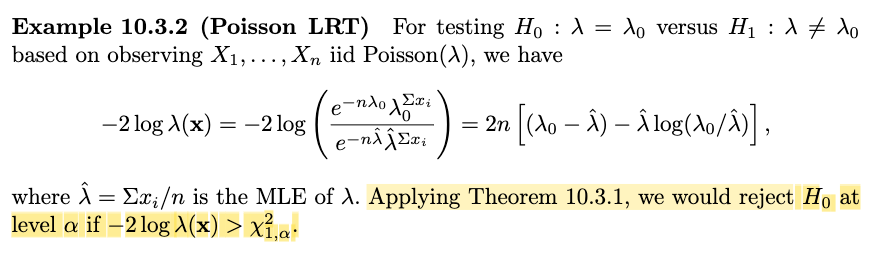</kbd>

> [!NOTE]
> Áp dụng theorem 10.3.1, -2 log λ(**x**) sẽ hội tụ về một χ²\_1.
>
>
>
> Nên để ta có một leve α test, tức là test có P(Type I error) ≤ α
>
>
>
> ⇔ P(reject H0) ≤ α khi θ ∈ Θ0
>
>
>
> ⇔ P(λ(**X**) ≤ c) ≤ α khi θ ∈ Θ0
>
>
>
> ⇔ P(log λ(**X**) ≤ log c) ≤ α khi θ ∈ Θ0
>
>
>
> ⇔ P(-2log λ(**X**) ≥ - 2log c) ≤ α khi θ ∈ Θ0
>
>
>
> Và với việc khi n rất lớn thì -log λ(**X**) trở thành χ²\_1
>
>
>
> Ta có ⇔ P(χ²\_1 ≥ - 2log c) ≤ α khi θ ∈ Θ0
>
>
>
> Từ đó ta có thể tìm ra c1 (=-2log c) khiến thỏa P(χ²\_1 ≥ c1) ≤ α. Và đó chính là χ²\_1,α
>
>
>
> Như vậy level alpha sẽ test rule là reject H0 khi observed value **x** thỏa: -2log λ(**x**) ≥ χ²\_1,α

> [!TIP]
> **🤖 AI Feedback** — ✅ Score: **95/100**
>
> Ghi chú của bạn rất xuất sắc, trình bày logic chặt chẽ để chứng minh miền bác bỏ của kiểm định tỷ số khả trị (LRT) dựa trên định lý Wilks. Tuy nhiên, có một lỗi gõ nhỏ ở dòng gần cuối khi ghi thiếu số 2: '-log λ(X)' cần sửa thành '-2log λ(X)'.

 

###### Asymptotics of Poisson LRT Statistic

<kbd>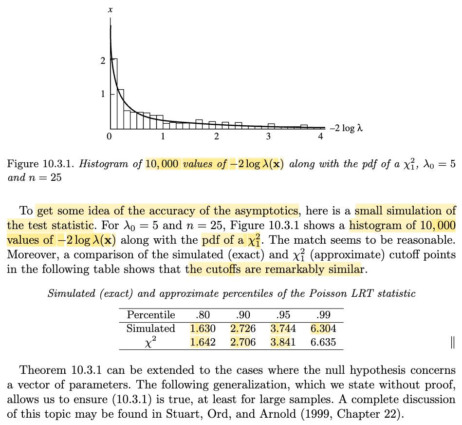</kbd>

> [!NOTE]
> Đại khái là, ở đây gs sẽ minh họa như sau:
>
>
>
> Như ta vừa đã hiểu, rằng test rule là reject H0 khi observed value **x** thỏa: -2log λ(**x**) ≥ χ²\_1,α, có nghĩa là, chỉ việc tính -2 log λ(**x**) và so nó với giá trị χ²\_1,α (ví dụ với α = 0.05 thì tra bảng xem con số χ²\_1,0.05 là bao nhiêu. Còn -2 log λ(**x**) thì trong bài toán đang xét ta đã có công thức.
>
>
>
> Như vậy, ở đây gs cho sampling 10.000 bộ sample size 25 từ f(x|λ0=5), và tính -2 log λ(**x**) từ 10.000 sample này, vẽ vẽ được histogram trong hình.
>
>
>
> Ta hiểu histogram được vẽ như sau: trục ngang chia thành những ô nhỏ bề rộng Δ. Với mỗi sample **x** (tổng cộng có 10.000 sample), là một bộ 25 con số (x1,...xn), ta sẽ tính -2 log λ(**x**) và xem giá trị của nó rơi vào ô nào thì cho chiều cao cột của ô đó trong histogram tăng lên một đơn vị, và sau cùng thì ta chia cho 10000Δ. Vậy chiều cao của các cột so với nhau của histogram tại một ô sẽ là tỉ lệ số lượng sample **x** có -2 log λ(**x**) rơi vào ô đó.
>
>
>
> (Ví dụ có 3 cột với chiều cao h1 = 1000/10000Δ, h2 = 7000/10000Δ, h3 = 2000/10000Δ) Tổng diện tích các cột = 1: h1 Δ + h2 Δ + h3 Δ = 1)
>
>
>
> Lúc này có thể coi như một pmf. Và tăng số lượng 10000 lên vô cùng, thì chiều cao tại đó sẽ trở thành:
>
>
>
> lim N → ∞ \[số điểm giá trị (của random variable Y = -2 log λ(**X**) rơi vào vùng có bề rộng Δ quanh mốc a\] / NΔ
>
>
>
> Và đây chính là định nghĩa theo trường phái cổ điển (Frequentist) của xác suất Y rơi vào vùng Δ quanh (mốc a nào đó): P(a ≤ Y ≤ a + Δ)
>
>
>
> Và khi cho Δ → 0, thì ta có: lim Δ → 0 P(a ≤ Y ≤ a + Δ) / Δ,
>
>
>
> và đây chính là định nghĩa của probability density pdf: f(a).
>
>
>
> Do đó ta có thể hiểu rằng histogram này là phiên bản chưa tiến hóa của pdf -log λ(**X**), khi số lượng sample là 10.000. Nếu cho con số 10.000 tăng lên vô hạn và cho bề rộng ô nhỏ lại về 0 thì histogram sẽ ngày càng mượt, trở thành đường cong pdf.
>
>
>
> Tiếp theo người ta lại vẽ pdf của χ²\_1 là đường cong màu đen.
>
>
>
> Kết quả thể hiện qua hình vẽ 10.3.1 cho thấy nó rất match với histogram dù đây chỉ là phiên bản chưa tiến hóa, nhưng các histogram thể hiện khá sát với pdf của χ²\_1. Và cũng thể hiện qua con số trong cái bảng bên dưới khi ta so các phân vị.
>
>
>
> Hiểu cái bảng đó như sau:
>
>
>
> Ví dụ percentile 0.8, theo định nghiã ví dụ percentile 0.80 thì có nghĩa là: Ta lấy cái order statistic mà 80% các sample còn lại đều nhỏ hơn (hoặc bằng). Và khi tính cho bảng này, ta sẽ coi như có sample với size 10.000: X1,...X10.000, rồi xếp từ nhỏ đến lớn thành bộ order statistic X\_{1}, ...X\_{10.000} và lấy ra cái order statistic mà 80% đều nhỏ hơn (hoặc bằng). Giá trị của order statsitic này chính là 1.630.
>
>
>
> Soi chiếu nó trên cái histogram, thì đây sẽ là cái mốc trên trục ngang mà tại đó: diện tích của caí histogram (tổng diện tích bằng 1) sẽ bị chia làm 2 phần với phần bên trái chiếm 80%. Vì sao? Vì như đã nói cách vẽ cái histogram này: chiều cao mỗi ô là là tỉ lệ của số sample trong 10.000 sample có giá trị -2log λ(**x**) rơi vào ô đó, chia cho 10.000. Vậy nếu giả sử ta có cái mốc a nào đó, thì tổng chiều cao các cột bên trái nó sẽ chính là tỉ lệ của số sample trong 10.000 sample có giá trị -2log λ(x) nhỏ hơn mốc a đó. Và để a đạt 80%. ta sẽ kéo nó về bên phải cho đến khi thỏa. Và dễ thấy là nó sẽ nằm trúng ngay cái order statistic X\_{8000} vì đây là nó sẽ hơn hoặc bằng 8000 thằng trong 10000 (lớn hơn 7999 thằng và kể cả nó là 8000).
>
>
>
> Vậy ta hiểu vì sao cái X\_{8000}, có giá trị 1.630, chính là cái mốc mà chia histogram thành hai phần tỉ lệ (theo diện tích, hay theo tổng hiểu cao đều được, vì các phần có bề rộng như nhau, nên ví dụ bên trái có 2 cột cao h1, h2 bên phải có 3 cột h3,4. thì tỉ lệ diện tích là (Δ h1 + Δ h2) / (Δ h3 + Δ h4) cũng chính là (h1 + h2) / (h3 + h4).
>
>
>
> Và khi ta làm vậy với pdf của χ²\_1: Lấy mốc chia diện tích của pdf thành hai phần tỉ lệ 80:20, nó ra con số 1.642. Rất gần với 1.63.
>
>
>
> Tương tự cho các mốc khác. Minh họa về mặt số liệu cho hình ảnh đường cong pdf của χ²\_1 match với đồ thị histogram.
>
>
>
> Điều này minh họa cho ý mà theorem vừa rồi đã tuyên bố, khi n tăng lên vô cùng thì -2 log λ(**X**) sẽ hội tụ phân phối về χ²\_1.
>
>
>
> Và thật ra cần hiểu thế này: Việc phiên bản chưa tiến hóa đã có thể match khá tốt đường pdf của χ²\_1 có ý nghĩa như sau:
>
>
>
> Có nghĩa là, từ nay về sau, cứ việc lôi χ²\_1 ra mà tính, tức là, cứ dùng bảng tra các mốc phân vị của χ²\_1 để dùng, hay nói cách khác, cứ coi -2 log λ(**X**) như biến χ²\_1.

> [!TIP]
> **🤖 AI Feedback** — ✅ Score: **98/100**
>
> Ghi chú giải thích rất xuất sắc, chính xác và trực quan cả về lý thuyết thống kê (định lý Wilks) lẫn cách dựng histogram thực nghiệm. Một điểm lưu ý nhỏ là định nghĩa phân vị nên diễn đạt chặt chẽ hơn một chút (80% số quan sát nhỏ hơn hoặc bằng giá trị đó), nhưng tổng thể tài liệu cực kỳ chất lượng.

**🔗 See also:** [Quy ước làm tròn phân vị mẫu](./54_order_statistic.md#node-87bnmo9) · [Chứng minh P(X=x)=0](./16_pdf_pmf.md#node-29g5dq1)

 

###### Theorem 10.3.3 Likelihood Ratio Test

<kbd>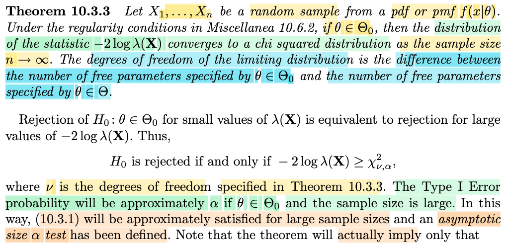</kbd>

<kbd>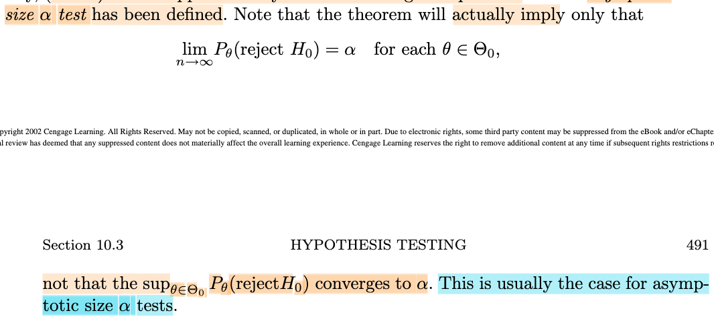</kbd>

> [!NOTE]
> Thế thì, từ cái theorem vừa rồi, khi đại ý nói rằng khi n lớn lên vô cùng thì - 2 log λ(**X**) sẽ trở thành một χ²\_1, do đó, theorem này mới đem áp dụng điều này vào bài toán hypothesis testing, cụ thể là như sau:
>
>
>
> Như bối cảnh bữa giờ là, ta quan tâm đến bài toán hypothesis testing: H0: θ ∈ Θ0 vs H1: θ ∉ Θ0, và một loại test khá hữu ích là Likelihood Ratio Test (LRT), với test rule là λ(**x**) ≤ c. Và λ(**x**) ≤ c ⇔ -2 log λ(**x**) ≥ -2 log(c)
>
>
>
> Và để có một level α test, thì c phải là mốc nào đó khiến khi θ ∈ Θ0 thì P(reject H0) = P(**X** ∈ Rejection region) = P(-2 log λ(**X**) ≥ -2 log(c)) ≤ α.
>
>
>
> Đặt c\* = -2 log(c), bài toán trở thành: tìm c\* để P(-2 log λ(**X**) ≥ c\*) ≤ α.
>
>
>
> Khi đó tính c từ c\*, thì ta sẽ có một level α LRT test: Reject H0 khi λ(**X**) ≤ c,
>
>
>
> hay cứ để theo c\* cũng được: Reject H0 khi -2 log λ(**x**) ≥ c\*
>
>
>
> Vấn đề là để tìm c\* thỏa P(-2 log λ(**X**) ≥ c\*) ≤ α rất khó.
>
>
>
> Vì, khi xét sự thật rằng đây là xác suất liên của một event liên quan đến statistic -2 log λ(**X**), và ta không biết distribution của nó. Ví dụ như nếu biết nó là Z \~ normal(0, 1) chẳng hạn, thì bài toán trở thành tìm c\* để P(Z ≥ c\*) ≤ α, ta chỉ việc tìm mốc phần diện tích pdf bên phải bằng α là xong, và ta có thể tra bảng để có mốc này, và nó chính là cái được kí hiệu bởi Z\_α.
>
>
>
> Nhưng sự thật thì ta không biết distribution của Y = -2 log λ(**X**) là gì.
>
>
>
> Tuy nhiên, một theorem đã chứng minh rằng Y = -2 log λ(**X**) là một random variable hội tụ phân phối về χ²\_1.
>
>
>
> Từ đó ta có thể xấp xỉ việc tìm c\* thỏa P(-2 log λ(**X**) ≥ c\*) ≤ α bằng bài toán:
>
>
>
> tìm c\* để P(χ²\_1 ≥ c\*) ≤ α, và như vậy, có thể tra bản để có mốc c\*, tương tự như Z\_α, thì ở đây chính là χ²\_1\_α.
>
>
>
> ---
>
>
>
> Tuy nhiên theorem này nói rằng, ta không cần dùng χ²\_1, tứcχ²\_ν với ν = 1, thay vào đó, ông nói ta có thể dùng ν theo định nghĩa trong theorem 10.3.3 mà mình sẽ nói sau (ở đây hiểu bức tranh toàn cảnh trước) Nhưng dù gì đi nữa, cơ bản chỉ là, dựa vào bảng tra của χ²\_ν, ta tra ra mốc χ²\_ν,α. Và đó chính là c\*
>
>
>
> Từ đó, ta có level α LRT test rule là: Reject H0 khi -2 log λ(**X**) ≥ χ²\_ν,α
>
>
>
> Và theorem này cũng nói rằng, khi n tăng lên, thì cái test này, không chỉ là level α test, mà nó thậm chí dần trở thành size α test, tức là xác suất mắc Type I error không chỉ ≤ α mà sẽ trở nên gần bằng α. Và gs Casella gọi là **Asymptotic size α test**.
>
>
>
> ---
>
>
>
> Recall chút về size α vs level α test. 
>
>
>
> Với level α test, với định nghĩa là test có xác suất mắc Type I error không lớn hơn α: Tức là sup\_θ∈Θ0 P(reject H0) ≤ α
>
>
>
> còn size α test, là test có sup\_θ∈Θ0 P(reject H0) = α
>
>
>
> Vậy thì gs lưu ý rằng, cái định nghĩa **asymptotic size α test** chỉ có nghĩa là: khi n → ∞ thì P(reject H0) → α với mỗi θ ∈ Θ, nhưng có thể chưa chắc (hay đôi khi thì không thỏa) n → ∞ thì sup\_θ∈Θ0 P(reject H0) = α (cái này hơi khó hiểu), nhưng đại ý gs nói là thực tế thì ta có thể coi như khi n → ∞ thì ta sẽ có size α test.

> [!TIP]
> **🤖 AI Feedback** — ✅ Score: **95/100**
>
> Bài viết giải thích rất trực quan, logic và nắm bắt xuất sắc bản chất việc chuyển từ phân phối chính xác sang phân phối tiệm cận chi-bình phương. Điểm cần lưu ý là định nghĩa chính xác của 'size' (kích thước) của kiểm định là supremum của xác suất sai lầm loại I trên tập giả thuyết không, chứ không chỉ đơn thuần là bằng $\alpha$.

 

###### Degrees of Freedom for Test Statistic

<kbd>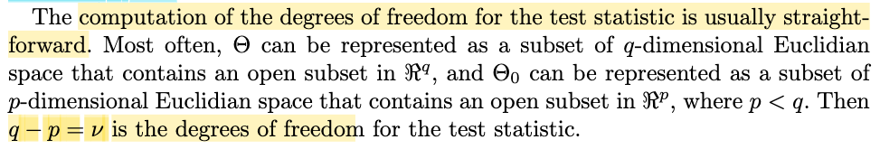</kbd>

> [!NOTE]
> Active recall: Trước khi vài ví dụ, đã vài ngày trôi qua nên mình thấy cần gợi nhớ chủ động chút xíu về những gì bữa giờ đang học.
>
>
>
> Nói chung là, nhìn lại, mình đang hiểu gs Casella đang chỉ cho ta cách để áp dụng likelihood ratio test trong thực tế.
>
>
>
> Nói vậy là sao, vì sao lại là "trong thực tế", câu hỏi này có phải gợi ý là vì trong lí thuyết nó sẽ khác hay sao?
>
>
>
> Câu trả lời đúng là vậy, và để hiểu vì sao, ta sẽ nói về bài toán hypothesis testing, và sau đó là likelihood ratio test.
>
>
>
> Trong bài toán hypothesis testing, dựa trên một observed value của sample **X** = **x**, f(x|θ) ta muốn đưa ra inference: θ thuộc Θ0 hay Θ0c, chính là một trong hai hypothesis: H0: θ ∈ Θ vs H1 ∈ Θ0c. Và để làm điều này, chính là ta sẽ xây dựng một phép thử (hypothesis test), về bản chất, là một decision function, nhận vào giá trị của sample **X**, và đưa ra kết luận là H0 hoặc H1. Và "trong cái ruột của function này", ta sẽ tính ra một hàm số nào đó, rồi có thể là so sánh giá trị của nó với một ngưỡng (threshold) nào đó để kết luận. Thì cái hàm số của sample đó, chính là một statistic, gọi là test statistic.
>
>
>
> Và với một test, nó sẽ chia không gian 𝒳 thành hai miền: những **x** khiến test kết luận reject H0 và đám còn lại, từ đó ta có khái niệm rejection region: R = {**x** ∈ 𝒳: test statistic (**x**) khiến reject H0}
>
>
>
> Vậy thì cũng như trong bài toán inference point estimation, trong vô vàn các hàm số có thể dùng để estimate cho θ, thì maximum likelihood estimator là một estimator tốt. Thì ở đây, likelihood ratio test (LRT) là một loại test tốt. Và cái test này có rule có dạng là:
>
>
>
> Reject H0 khi λ(**x**) ≤ c, với c là threshold nào đó nằm trong khoảng từ 0 tới 1.
>
>
>
> với λ(**x**) = sup\_Θ0 L(θ|**x**) / sup\_Θ L(θ|**x**) = L(θ^0|**x**) / L(θ^|**x**) (θ^ chính là MLE, còn θ^0 là restricted MLE, tạm hiểu là thằng MLE nửa mùa, khi chỉ tìm kiếm trong phạm vi giới hạn là Θ0)
>
>
>
> Đương nhiên, đây chỉ là một nửa của một test hoàn chỉnh, vì để có test hoàn chỉnh phải định ra giá trị của threshold nữa.
>
>
>
> Thế thì, để có c, ta sẽ dựa theo tiêu chí đánh giá một test: Xác suất mắc Type I và Type II error. Và cụ thể ta sẽ tập trung vào Type I error, là loại error khi test reject H0 trong khi θ thực sự thuộc Θ0. Do đó, xác suất một LRT mắc Type I error là:
>
>
>
> P(observed value của **X** khiến khi đưa vào test, nó reject H0) = P(λ(**X**) ≤ c). Và cái này chỉ dựa trên điều kiện là θ ∈ Θ0 (vì nếu θ ∈ Θ0c) thì event "Test reject H0" không phải là event "Type I error".
>
>
>
> Một điểm hết sức chú ý, cái event trên, hay tính không chắc chắn của nó, là đến từ tính không chắc của giá trị **X**. Nói đơn giản, đây là một event, mà tính không chắc chắn (để từ đó ta mới nói chuyện xác suất của event) là gắn với một hàm số của random variable (vector) **X**. Chứ đây là cách tiếp cận của trường phái Frequentist, nơi ta coi θ của population distribution là cố định, nhưng chưa biết (fixed & unknown). Do đó, sẽ là sai nếu ta nghĩ xác suất mắc Type I error theo kiểu P(θ ∈ Θ0 và test reject H0) theo cách hiểu đây là joint event: θ ∈ Θ0 và Test reject H0. Thay vào đó, cách hiểu đúng đó là, ta có một random variable λ(**X**) là hàm số của random sample **X**, và sự kiện mà λ(**X**) ≤ c chính là một Type I error nếu như θ thực sự thuộc Θ0. Cũng chính vì vậy, xác suất của event này, vì phụ thuộc vào distribution của **X**, nên cũng phụ thuộc θ. Thành ra người ta ghi là: P\_θ(λ(**X**) ≤ c)
>
>
>
> Thế thì, để đặt ra tiêu chí cho test, ta có khái niệm level α và size α test: là test có xác suất mắc Type I error không vượt quá α hoặc bằng đúng α. Và ví dụ như ta muốn có một level 0.05 test, tức là ta muốn có phép thử mà dù θ thật sự bằng bao nhiêu, thì xác suất mắc Type I error của nó cũng không qúa 0.05.
>
>
>
> Và bài toán đặt ra là. chọn c thế nào để ta có một level α likelihood ratio test: Tức là test có:
>
>
>
> sup\_θ∈Θ0 P\_θ(λ(**X**) ≤ c) ≤ α
>
>
>
> Vấn đề đặt ra là, nếu ta biết distribution của λ(**X**) (nó cũng là một random variable thôi, vì nó là hàm số của random variable **X**) thì khi đó chọn c để thỏa cái này rất dễ dàng. Ví dụ như, nếu ta có Z \~ normal(0,1), và muốn tìm cái mốc c để P(Z ≤ c) ≤ α (mà cũng chính là ta muốn tìm c để P(Z ≤ c) = α) thì chỉ việc tra bảng cdf của n(0,1), sẽ tìm ra c khiến F(c) = α, cũng là c khiến diện tích pdf bên trái mốc này = α, đây là cái mà người ta gọi là Z\_α
>
>
>
> Nhưng λ(**X**) là một hàm số phức tạp, nên rất khó để biết distribution của nó.
>
>
>
> Tuy nhiên một định lí quan trọng giúp ta điều sau đây:
>
>
>
> Định lí, ý chính cốt lõi của nó nói rằng: Nếu ta có sự thật là θ = θ0, và vài điều kiện cần thiết, thì phân phối limit của cái statistic -2 log λ(**X**) chính là phân phối χ²\_1, thể hiện theo toán là -2 log λ(**X**) → (d) χ²\_1
>
>
>
> Dựa vào định lí này, ta mới có một hướng đi trong việc áp dùng LRT cho bài toán testing mà Θ0 = {θ0}, Θ0c = {θ: θ ≠ θ0}. Cụ thể là, ta sẽ biến đổi chút xíu λ(**X**) ≤ c như sau:
>
>
>
> λ(**X**) ≤ c ⇔ log λ(**X**) ≤ log (c) (vì hàm log monotone increasing)
>
>
>
> ⇔ -2 log λ(**X**) ≥ -2 log (c)
>
>
>
> ⇒ P\_θ(λ(**X**) ≤ c) = P\_θ(-2 log λ(**X**) ≥ -2 log (c))
>
>
>
> Từ đó, việc tìm c để LRT test của bài toán này có level α, tức:
>
>
>
> sup\_θ∈Θ0 P\_θ(λ(**X**) ≤ c) ≤ α
>
>
>
> tương đương tìm c để:
>
>
>
> sup\_θ∈Θ0 P\_θ(-2 log λ(**X**) ≥ -2 log (c)) ≤ α
>
>
>
> ⇔ tìm c để sup\_θ=θ0 P\_θ(-2 log λ(**X**) ≥ -2 log (c)) ≤ α
>
>
>
> ⇔ tìm c để P\_θ0(-2 log λ(**X**) ≥ -2 log (c)) ≤ α
>
>
>
> Và nếu dựa trên giả định θ = θ0 thì định lí ở trên nói rằng khi n lớn vô cùng thì -2 log λ(**X**) là một χ²\_1 random variable. Nên khi n rất lớn, ta có thể coi như bài toán trở thành:
>
>
>
> tìm c để P\_θ0(χ²\_1 ≥ -2 log(c)) ≤ α
>
>
>
> đặt d = -2 log(c), cũng như χ²\_1 không còn phụ thuộc θ, ta ko cần care về θ nữa, bài toán tiếp tục tương đương:
>
>
>
> tìm d để P(χ²\_1 ≥ d) ≤ α
>
>
>
> Và để giải tìm d rất đơn giản, tra bảng pdf của χ²\_1, tìm cái mốc cần thiết, và đây chính là χ²\_1, α.
>
>
>
> Đó chính là ý tưởng chính của cái theorem 10.3.3 nói rằng: Trong bài toán test ting H0: Θ={θ0} này thì nếu ta dùng cái test rule đó là, giả sử ta muốn level α = 0.05, tra bảng xem χ²\_1,0.05 là bao nhiêu đó chính là d, từ d tình ra c. Thì cái rule "reject H0 khi λ(x) ≤ c" sẽ có thể dần trở thành một level size 0.05 test khi n lớn.
>
>
>
> Nhưng khái quát hơn, đó là ta không tra bảng χ²\_1, mà tra bảng χ²\_ν với ν là số bậc tự do còn lại. Cũng dễ hiểu thôi, làm như sau:
>
>
>
> Giả sử ta có Θ là không gian parameter, có q chiều. (Ví dụ, giả sử ta giải bài toán hypothesis mà θ là parameter của normal, thì Θ sẽ là R^2, vì θ lúc này là vector (μ, σ^2)) Sau đó, Θ0 lại chỉ có p &lt; q chiều (ví dụ, ta xét H0 là {(μ, σ^2) ∈ R^2: μ = 5}. Khi đó ν sẽ là q - p = 2 - 1 = 1.
>
>
>
> (còn trong ví dụ từ trên đến giờ, là θ là đơn, nên Θ là trục R, có số chiều là 1, và Θ0 là {θ0} (1 điểm) có số chiều p = 0, nên ν = 1 - 0 = 1, nên ta theorem mới nói -2 log λ(X) → χ²\_1)
>
>
>
> Tóm lại, nhờ cái định lý này, gọi là định lý Wilkin, ta có thể dùng bảng tra của χ², để có các threshold, giúp lắp vào LRT test rule, ta sẽ có test rule level α tiệm cận (asymptotically level α test)

> [!TIP]
> **🤖 AI Feedback** — ✅ Score: **95/100**
>
> Ghi chú của bạn cực kỳ chi tiết, chính xác và thể hiện sự hiểu bài sâu sắc từ bản chất kiểm định tỷ số khả hợp (LRT) cho đến cách tính bậc tự do của định lý Wilks ($q - p$) như trong ảnh. Để hoàn thiện hơn, bạn có thể lưu ý thêm rằng định lý tiệm cận này đòi hỏi một số điều kiện chuẩn tắc (regularity conditions) nhất định để nghiệm đúng.

 

###### Example 10.3.4 Multinomial LRT

<kbd>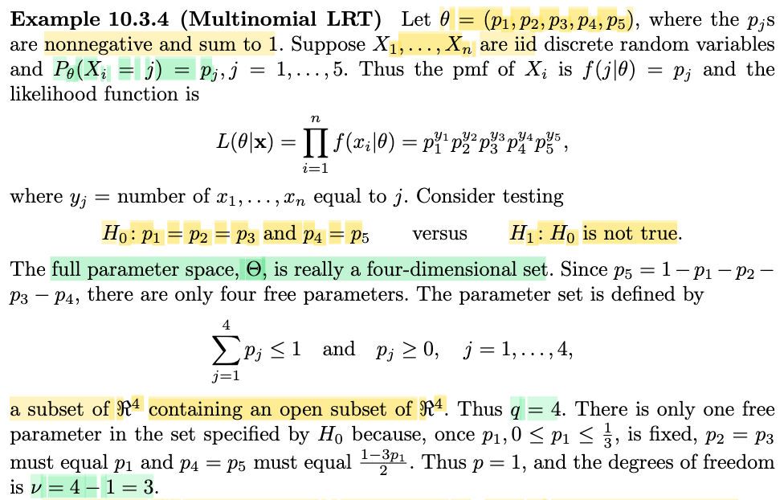</kbd>

<kbd>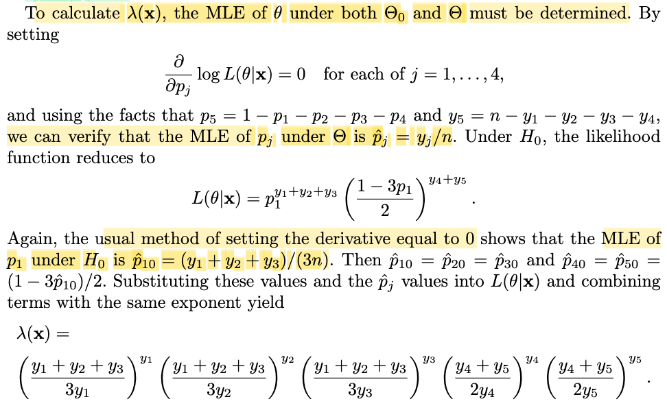</kbd>

<kbd>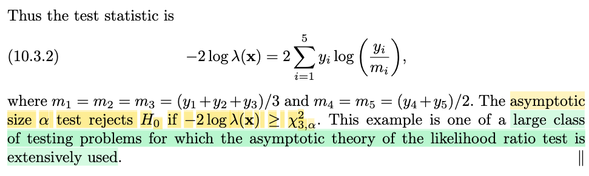</kbd>

> [!NOTE]
> Qua ví dụ này, ta sẽ áp dụng theorem vừa rồi: Cho θ là R^5 vector, (p1,p2,...p5) với tổng pj = 1, và đều không âm. X1,...Xn iid, discrete với P(Xi - j) = pj. Tức là population distribution là một discrete distribution, X có 5 discrete possible value, pmf tại j, P(X = j) pj
>
>
>
> Thử xem vì sao likelihood function lại là:
>
>
>
> L(θ|**x**) = Πi=1:n f(xi|θ) = (p1^y1)(p2^y2)(p3^y3)(p4^y4)(p5^y5) với yj là số x1,...xn = j
>
>
>
> Ta nhớ lại, định nghĩa của hàm likelihood là: Là hàm của tham số θ, kí hiệu L(θ|**x**) (nói vậy có nghĩa là, hàm nhận input là θ, còn **x** chỉ coi như hằng số), mà giá trị của nó tính bởi f(**x**|θ), mang ý nghĩa là độ hợp lí của θ dựa trên giá trị quan sát của data là **x**. Nên L(θ|**x**) = f(**x**|θ).
>
>
>
> Mà f(**x**|θ), dĩ nhiên là joint pmf của X1,...Xn, đồng thời do tính iid, joint pmf = tích các marginal pmf:
>
>
>
> f(**x**|θ) = Πi f(xi|θ)
>
>
>
> đề bài cho các random variable X có pmf f(j|θ) = pj
>
>
>
> nên nếu xi lần lượt bằng 1,2,3,4,5 thì f(xi|θ) sẽ lần lượt bằng p1,p2,p3,p4,p5
>
>
>
> Nếu đặt y1 = Σi=1:n I\_{xi=1}, y2 = Σi=1:n I\_{xi=2},... thì dễ thấy Πi f(xi|θ) = (p1^y1)(p2^y2)(p3^y3)(p4^y4)(p5^y5)
>
>
>
> Không có gì quá khó hiểu.
>
>
>
> ---
>
>
>
> Tiếp, theo, nói đến hai giả thuyết của bài toán testing: H0: p1=p2=p3 và p4=p5 vs H1: H0 ko đúng.
>
>
>
> Nhiệm vụ cần làm tiếp theo là xác định bậc tự do ν là gì. Vậy thử hỏi q là gì p là gì.
>
>
>
> q là dimension của parameter space Θ. θ ở đây tuy là 5-D vector, nhưng thật ra ta không thể chọn 5 con số bất kì, mà chúng phải không âm. Nên với ý này, chúng chỉ là một nửa của không gian 5D. Tiếp, chúng có ràng buộc tổng = 1, điều này có nghĩa nếu biết 4 thằng thì sẽ biết thằng số 5. Do đó q = 4.
>
>
>
> Còn H0, với việc yêu cầu p1=p2=p3 và p4=p5, thì bậc tự do chỉ còn 1, vì chọn p1, là tự biết 4 thằng còn lại.
>
>
>
> Vậy ν = 4-1 = 3.
>
>
>
> (trong sách giải thích kĩ hơn nhưng mình hiểu đại khái là vậy được rồi)
>
>
>
> ---
>
>
>
> Vậy cái rule cho một tiệm cận level alpha LRT test là: Đi tìm cái mốc χ²\_3, giải bài toán -2 log (c) = χ²\_3 từ đó là ta đã có cái threhold c. Để rồi nhiệm vụ chỉ là nhận **x**, tính ra λ(**x**), và so với c để ra quyết định reject H0 nếu λ(**x**) ≤ c và ngược lại là xong.
>
>
>
> Vậy còn một bước phải làm, là đi tìm công thức của λ(**x**) trong bài toán cụ thể này (công thức L(θ^0|**x**) / L(θ^|**x**) chỉ là khái quát thôi, đâu biết hình thù nó ra sao mà tính)
>
>
>
> Như ta phải đi giải 2 bài toán tối ưu: 
>
>
>
> maximize\_Θ L(θ|**x**)
>
>
>
> ⇔ maximize\_{pj ≥ 0, Σj pj = 1} (p1^y1)(p2^y2)(p3^y3)(p4^y4)(p5^y5)
>
>
>
> ⇔ maximize\_{pj ≥ 0, Σj pj = 1} log \[(p1^y1)(p2^y2)(p3^y3)(p4^y4)\] (chuyển thành bài toán tương đương với hàm log)
>
>
>
> ⇔ maximize\_{pj ≥ 0, Σj pj = 1} {log (p1^y1) + log (p2^y2) + log (p3^y3) + log (p4^y4)}
>
>
>
> ⇔ maximize\_{pj ≥ 0, Σj pj = 1} {y1 log (p1) + y2 log (p2) + y3 log (p3) + y4 log (p4) + y5 log (p5)}
>
>
>
> ⇔ maximize\_{pj ≥ 0, Σj pj = 1} Σj yj log(pj)
>
>
>
> Đây là bài toán tối ưu có ràng buộc đẳng thức + bất đẳng thức. Ta sẽ dùng kiến thức KKT conditions đã học trong Convex Boyd hoặc Numerical Optimization (J. Nocedal).
>
>
>
> maximize Σj yj log(pj) s.t pj ≥ 0, j=1,2,3,4,5. Σj pj - 1 = 0
>
>
>
> Lagrangian: L(**p**, **λ**, ω) = Σj yj log(pj) - Σj λj pj + ω (Σj pj - 1)
>
>
>
> Stationary condition:
>
>
>
> ∇\_p L(**p\***, **λ\***, ω\*) = 0
>
>
>
> ⇔ d/d**p** \[Σj yj log(pj) - Σj λj pj + ω (Σj pj - 1)\] = 0
>
>
>
> ⇔ d/d**p** \[**y**Tlog(**p**) - **λ**T**p** + ω (**p**T**1** - 1)\] = 0
>
>
>
> ⇔ d/d**p** \[**y**Tlog(**p**)\] - d/d**p** \[**λ**T**p**\] + d/d**p** \[ω (**p**T**1** - 1)\] = 0
>
>
>
> i) d/d**p** \[**y**Tlog(**p**)\]: d\[**y**Tlog(**p**)\] = **y**Tlog(**p**+d**p**) - **y**Tlog(**p**)
>
>
>
> = **y**T\[log(**p**+d**p**) - log(**p**)\]
>
>
>
> = Σi yi × log\[(pi+dpi)/pi\]
>
>
>
> = Σi yi × log(1+dpi/pi)
>
>
>
> ≈ Σi yi × dpi/pi
>
>
>
> = Σi yi/pi × dpi
>
>
>
> = \[y1/p1, y2/p2...,y5/p5\]T d**p**
>
>
>
> Vậy d\[**y**Tlog(**p**)\] = \[y1/p1, y2/p2...,ỵ5/p5\]T d**p** ⇒ ∇\[**y**Tlog(**p**)\] = \[y1/p1, y2/p2...,y5/p5\]
>
>
>
> ii) d/d**p** \[**λ**T**p**\] = **λ**
>
>
>
> iii) d/d**p** \[ω (**p**T**1** - 1)\] = ω d/d**p** \[**p**T**1**\] = w × **1** (tức là vector \[w,w,w,w,w\]
>
>
>
> Vậy ∇\_p L(**p\***, **λ\***, ω\*) = 0 ⇔ \[y1/p1, y2/p2...,y5/p5\] - **λ**  + w × **1** = **0**
>
>
>
> ⇔ yj/pj - λj + ω = 0
>
>
>
> ⇔ yj/pj = λj - ω
>
>
>
> ⇔ yj = pjλj - pj ω (j=1,2..5) (1)
>
>
>
> ---
>
>
>
> Dùng điều kiện Complementary slackness: λj pj = 0 j=1,2,3,4,5
>
>
>
> Khi đó (1) tương trở thành:
>
>
>
> yj = - pj ω (j=1,2..5) 
>
>
>
> ⇔ pj = -yj/ω  (j=1,2..5) 
>
>
>
> ---
>
>
>
> Dùng tới điều kiện Σj pj = 1 
>
>
>
> ⇔ Σj (-yj/ω) = 1
>
>
>
> ⇔ -(Σj yj) = ω
>
>
>
> Mà yj theo định nghĩa trên thì (Σj yj) chính là n
>
>
>
> ⇔ ω = -n
>
>
>
> Vậy pj = -yj/(-n) = yj / n  (j=1,2..5). Ta đã tìm được MLE của **p**: p^j = yj / n
>
>
>
> Thế **p**^ vào L(p|**x**) ta có mẫu số là:
>
>
>
> Πj=1,2..5 pj^yj | pj=p^j=yj / n
>
>
>
> = Πj (yj / n)^yj
>
>
>
> ---
>
>
>
> Tiếp theo là giải bài tóan restricted MLE:
>
>
>
> ⇔ maximize\_{p1=p2=p3, p4=p5, 3p1 + 2p4 = 1, p1,p4 ≥ 0} (p1^y1)(p2^y2)(p3^y3)(p4^y4)(p5^y5)
>
>
>
> Lúc này objective chỉ là (p1^y1)(p1^y2)(p1^y3) \[(1-3p1)/2\]^y4 \[(1-3p1)/2\]^y5
>
>
>
> = p1^(y1+y2+y3) \[(1-3p1)/2\]^(y4+y5)
>
>
>
> Đặt (y1+y2+y3) là c1, (y4+y5) = c2 cho gọn, Objective trở thành p1^c1 \[(1-3p1)/2\]^c2
>
>
>
> Bài toán có các constraint p1=p2=p3, p4=p5, 3p1 + 2p4 = 1, p1,p4 ≥ 0 nhưng bằng cách đưa các constraint này vào objective, constraint còn lại chỉ là: p1,p4 ≥ 0
>
>
>
> DÙng hàm log chuyển thành bài toán tương đương: 
>
>
>
> log {p1^c1 \[(1-3p1)/2\]^c2} = c1 log p1 + c2 log \[(1-3p1)/2\]
>
>
>
> = c1 log p1 + c2 log (1-3p1) - c2 log (2)
>
>
>
> Đạo hàm = c1 / p1 + c2 (-3) \[1/(1-3p1)\]
>
>
>
> = c1 / p1 - 3c2 / (1-3p1)
>
>
>
> Đièu kiện tối ưu bậc nhất: c1 / p1 - 3c2 / (1-3p1) = 0
>
>
>
> ⇔ c1 / p1 = 3c2 / (1-3p1) 
>
>
>
> ⇔ c1(1-3p1) = 3c2p1 
>
>
>
> ⇔ c1 - 3c1p1 = 3c2p1 
>
> \
> ⇔ c1 = 3c2p1 + 3c1p1
>
>
>
> ⇔ c1 = 3(c2+ c1)p1
>
>
>
> ⇔ c1/3(c2+ c1) = p1
>
>
>
> Thay c1, c2 vào, ta có p1 = (y1+y2+y3)/3(y1+y2+y3+y4+y5) = (y1+y2+y3)/3n
>
>
>
> Đây chính là restricted MLE của p1, và từ đó cũng là của p2,p3 và ta suy ra restricted MLE của p4,p5 là:
>
>
>
> (1-3p1)/2 | p1=(y1+y2+y3)/3n
>
>
>
> = \[1-3(y1+y2+y3)/3n\] /2
>
>
>
> = \[y1+y2+y3+y4+y5-(y1+y2+y3)\]/2n
>
>
>
> = \[y4+y5\]/2n
>
>
>
> Thế vào L(p|**x**), ta có:
>
>
>
> \[(y1+y2+y3)/3n\]^c1 \[y4+y5\]/2n\]^c2
>
>
>
> ---
>
>
>
> Và từ đó ta có công thức λ(**x**)
>
>
>
> = {\[(y1+y2+y3)/3n\]^c1 \[y4+y5\]/2n\]^c2} chia Πj (yj / n)^yj  
>
>
>
> Triệt tiêu bớt ta sẽ còn:
>
>
>
> cái công thức dài như trong sách.
>
>
>
> Và như vậy, cùng với việc đã có threshold χ²\_3,α ta sẽ đã có cái level α (tiệm cận) LRT

> [!TIP]
> **🤖 AI Feedback** — ✅ Score: **98/100**
>
> Ghi chú cực kỳ chi tiết và chính xác, tự chứng minh và giải quyết triệt để các bước tối ưu hóa (như dùng điều kiện KKT) mà sách giáo khoa bỏ qua. Bạn đã hiểu rất sâu sắc bản chất toán học của kiểm định tỷ số hợp lý (LRT) này.

**🔗 See also:** [Các loại bài toán Machine Learning *(Pattern Recognition Machine Learning_C.Bishop)*](../pattern_recognition_machine_learning_cbishop/10_into.md#node-qebm7e9)

 

###### Section 10.3.2 Other Large-Sample Tests

<kbd>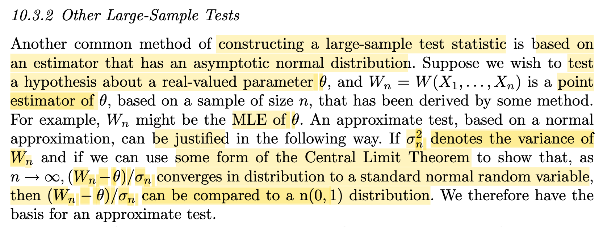</kbd>

> [!NOTE]
> Đại ý là phần này sẽ nói về một phương pháp xây dựng large sample test statistic khác trong đó ta sẽ dựa trên một estimator nào đó mà khi n lớn, distribution của nó sẽ converge về standard normal.
>
>
>
> Có thể liên hệ cái này với phần trước để thấy ý định của nó. Trong phần trước, khi ta nói về likelihood ratio test, ta đã đi đến một ý đó là, một level α LRT sẽ có rule là: Reject H0 khi sup Θ0 P(λ(**X**) ≤ c) ≤ α. Từ đó, ta mới đặt câu hỏi là, làm sao có distribution của statistic λ(**X**) để mà chọn ra mốc c. Thì một trường hợp khi áp dụng cho một hypothesis testing trong đó Θ0 = {θ0} thì nó trở thành P\_θ0(λ(**X**) ≤ c) ≤ α ⇔ P\_θ0(-2log λ(**X**) ≥ -2log c) ≤ α. Lúc này, định lí Wilks cho ta biết rằng -2log λ(**X**) khi n lớn, sẽ có limit distribution là χ²\_1. Và như vậy, khi n đủ lớn, ta có thể dùng phân phối của χ², là một phân phối đã biết để tính ra threshold giúp ta có một asymptotically level α LR test.
>
>
>
> Vậy thì ở đây cũng tương tự, đó là giả sử nếu ta có thể dùng CLT (chính xác hơn là một dạng nào đó của CLT) để chỉ ra một estimator W(**X**) của θ thỏa mãn: (Wn(**X**) - θ) / σn → (d) n(0,1). Thì khi đó ta có thể dùng n(0,1) để xây dựng test (y như ta dùng χ² để thay cho -2log λ(**X**) (vốn là một statistic mà ta ko biết distribution))

> [!TIP]
> **🤖 AI Feedback** — ✅ Score: **100/100**
>
> Ghi chú xuất sắc, không chỉ hiểu đúng nội dung đoạn văn mà còn liên hệ rất tốt với Likelihood Ratio Test và định lý Wilks ở chương trước để thấy rõ bức tranh tổng thể. Tư duy hệ thống này cực kỳ tốt và hoàn toàn chính xác.

 

###### Asymptotic Normality of MLE

<kbd>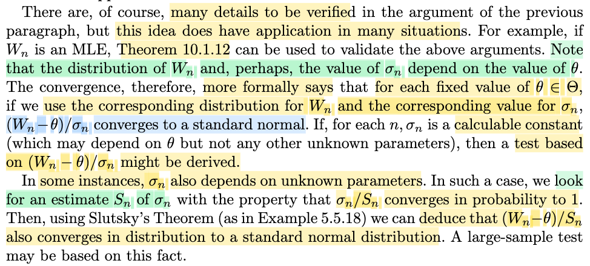</kbd>

> [!NOTE]
> Đại ý là, vì phương pháp (xây dựng test) này, như đã nói sẽ dựa trên một estimator Wn nào đó mà (Wn - θ) / σn → (d) n(0,1)) thì Wn ở đây có thể là gì, statistic nào có tính chất này?
>
>
>
> → Đó có thể là MLE, vì định lý 10.1.12 đã học nói rằng với θ^ là MLE của θ, thì √n \[τ(θ^) - τ(θ)\] → n(0, ν(θ)) với ν là CRLB.
>
>
>
> Để hiểu rõ ngọn ngành đoạn này. Phải ôn lại chút xíu về i) Thế nào gọi là một estimator tiệm cận hiệu quả và ii) Định lý nói MLE là một estimator như vậy.
>
>
>
> ---
>
>
>
> i) Trong định nghĩa về khái niệm thế nào là một estimator tiệm cận hiệu quả của τ(θ), đó là:
>
>
>
> Wn là asymptotically effiicient estimator của τ(θ) thì có phương sai tiệm cận là ν(θ) = \[τ'(θ)\]^2 / I1(θ)
>
>
>
> thể hiện toán học bởi: √n(Wn - τ(θ)) → n(0, ν(θ) = \[τ'(θ)\]^2 / I1(θ)) (1)
>
>
>
> (và cái này đồng nghĩa nói Avar(Wn) = \[τ'(θ)\]^2 / I1(θ))
>
>
>
> và cái này có nghĩa là khi n lớn Var\[√n(Wn - τ(θ))\] ≈ \[τ'(θ)\]^2 / I1(θ)) (1)
>
>
>
> ⇔ nVar(Wn) ≈ \[τ'(θ)\]^2 / I1(θ))
>
>
>
> ⇔ Var(Wn) ≈ \[τ'(θ)\]^2 / nI1(θ))
>
>
>
> ⇔ Var(Wn) ≈ \[τ'(θ)\]^2 / In(θ))
>
>
>
> Và vế phải chính là CRLB của một estimator unbiased (unbiased: E\[Un\] = τ(θ) hoặc khi n lớn thì E\[Un\] → τ(θ). Vì CRLB của Un define bởi \[d/dθ E(Un)\]^2 / In(θ). Nên mới nói nếu Wn là estimator hiệu qủa tiệm cận của τ(θ) thì variance của nó sẽ dần đạt mức nhỏ nhất của Variance của một unbiased estimator của τ(θ)
>
>
>
> ---
>
>
>
> Và ii) định lí 10.1.2 nói rằng với θ^ là MLE của θ thì √n(τ(θ^) - τ(θ)) → n(0, ν(θ)). Cũng chính là nói Avar(τ(θ^)) = ν(θ) = \[τ'(θ)\]^2 / I1(θ) và theo định nghĩa (i) thì MLE τ(θ^) chính là estimator tiệm cận hiệu quả của τ(θ).
>
>
>
> Nếu ta chọn τ là identity function thì kết quả trên cũng cho biết θ^ cũng là estimator tiệm cận hiệu quả của θ. Và biểu thức toán học là:
>
>
>
> √n(θ^ - θ) → n(0, ν(θ)) với ν(θ) = \[τ'(θ)\]^2 / I1(θ), vì τ(θ) = θ nên lúc này ν(θ) = \[1\]^2 / I1(θ) = 1/I1(θ)
>
>
>
> Và như vậy đồng nghĩa khi n lớn, Var\[√n(θ^ - θ)\] ≈ 1/I1(θ) ⇔ Var(θ^) ≈ 1/nI1(θ) = 1/In(θ)
>
>
>
> Vậy với việc θ^ là MLE của θ thì khi n lớn Var(θ^) ≈ 1/In(θ), cũng là STD(θ^) ≈ 1/√In(θ)
>
>
>
> ---
>
>
>
> Vậy thì sao, liên quan gì?
>
>
>
> Câu trả lời đó là: Wn, nếu là MLE của θ, thì vừa nói ở trên, Wn sẽ là estimator tiệm cận hiệu quả của θ, và thể hiện điều này bởi:
>
>
>
> √n(Wn - θ) →(d) n(0, 1/I1(θ))
>
>
>
> (cái này cũng chính là nói Avar(Wn) = 1/I1(θ))
>
>
>
> Mà √I1(θ) →ᵖ √I1(θ), áp dụng Slutsky theorem, hoặc đơn giản là vì √I1(θ) là constant nên:
>
>
>
> √n(Wn - θ) × √I1(θ) →(d) √I1(θ) × n(0, ν(θ) = 1/I1(θ)),
>
>
>
> vế phải lúc này chính là n(0, (√I1(θ))^2 × 1/I1(θ)) = n(0,1)
>
>
>
> Vậy ta có (với Wn là MLE của θ thì) √n√I1(θ) (Wn - θ) → n(0,1)
>
>
>
> Tiếp, với việc Wn là MLE thì STD(Wn) ≈ 1/√In(θ)
>
>
>
> Vậy: √n√I1(θ) (Wn - θ) = (Wn - θ) / \[1/√n√I1(θ)\]
>
>
>
> = (Wn - θ) / \[1/√nI1(θ)\]
>
>
>
> chính là (Wn - θ) / STD(Wn), kí hiệu σn\]
>
>
>
> Như vậy ta có: với Wn là MLE của θ thì: (Wn - θ)/σn → (d) n(0,1)
>
>
>
> Cũng là khi n đủ lớn ta có thể coi (Wn - θ)/σn như một n(0,1). và từ đó xây dựng hypothesis test.
>
>
>
> ---
>
>
>
> Vấn đề là, có thể thấy trong bước lập luận (!!!) ở trên, để từ
>
>
>
> √n(Wn - θ) →(d) n(0, 1/I1(θ))
>
>
>
> sang
>
>
>
> √n√I1(θ) (Wn - θ) → n(0,1)
>
>
>
> thì ta phải coi như √I1(θ) là constant, fix.
>
>
>
> Do đó, giúp mình hiểu đại khái gs nói "một cách formally hơn, ta phải hiểu là, với mỗi giá trị θ fixed thì nếu ta dùng phân phối của Wn, và std tương ứng của σn thì (Wn - θ) / σn mới hội tụ về n(0,1))"
>
>
>
> Để từ đó, ta sẽ áp dụng điều này để xây dựng hypothesis test như sau:
>
>
>
> (Cần nói trước, sẽ chỉ dùng cho một hypothesis test nào đó mà null hypothesis H0: Θ0 = {θ0})
>
>
>
> Quy trình sẽ là, tương tự như khi ta xây dựng level α LRT là test thỏa:
>
>
>
> sup\_Θ0 P\_θ(λ(x) ≤ c) ≤ α
>
>
>
> với việc Θ0 = {θ0} cho phép cái điều kiện này trở thành P\_θ0(λ(x) ≤ c) ≤ α. (Từ đó chuyển thành điều kiện liên quan đến -2 log λ(x), và dùng định lý Wilks để dùng χ²)
>
>
>
> Thì ở đây cũng vậy, giả sử ta dùng Wn để xây dựng một test rule có dạng:
>
>
>
> reject H0 khi (Wn - θ) / σn(θ) cách quá xa một mốc c nào đó, thể hiện bởi |(Wn - θ) / σn(θ)| ≥ c
>
>
>
> ---
>
>
>
> (Ôn nhanh cách hiểu nôm na về cách đặt rule:
>
>
>
> One-side test (left): H0: θ &lt; θ0, tức là cho rằng θ nhỏ, ta đặt test rule là \[giá trị test statisic lớn (hơn mốc nào đó) thì bác bỏ H0
>
>
>
> One-side test (right): H0: θ &gt; θ0, tức là cho rằng θ lớn, ta đặt test rule là \[giá trị test statistic nhỏ (hơn mốc nào đó) thì bác bỏ H0
>
>
>
> Two-side test: H0: θ = θ0, tức là cho rằng θ = giá trị nào đó, thì ta đặt test rule là \[giá trị test statistic không luẩn quẩn quanh mốc nào đó, mà cách xa mốc đó, thì bác bỏ H0))
>
>
>
> ---
>
>
>
>
>
> (Wn là MLE của θ, σn(θ) là STD của Wn, phụ thuộc θ như nói ở trên)
>
>
>
> thì để có level α, test này sẽ thỏa: sup\_Θ0={θ0} P\_θ(|(Wn - θ) / σn(θ)| ≥ c) ≤ α
>
>
>
> tương đương P\_θ0(|(Wn - θ0) / σn(θ0)| ≥ c) ≤ α (nhờ Θ0={θ0}, nên ta nhét θ0 vào thay θ)
>
>
>
> Đến đây, ta dùng lập luận rằng khi n lớn thì (Wn - θ0) / σn(θ0) sẽ giống một n(0,1) để biến điều kiện thành:
>
>
>
> P\_θ0(|Z| ≥ c) ≤ α với Z \~ n(0,1)
>
>
>
> Và tới đây, với tính chất đối xứng của ta sẽ thấy điều kiện này trở thành:
>
>
>
> |Z| ≥ z\_α/2
>
>
>
> Và chỉ việc tra bảng normal là tính được z\_α/2 để thỏa yêu cầu level α test.
>
>
>
> Còn 1 ý nữa:
>
>
>
> Giả sử khi đó để có α = 0.05, ta tính được threshold c rồi thì ta có hoàn chỉnh một level 0.05 test có test rule như sau: reject H0 nếu |(Wn - θ0)| / σn ≥ z\_α/2
>
>
>
> từ đó dùng cái test này như sau: Với observed value **X** = **x**, ta tính Wn, σn(θ0), và so cụm (Wn - θ0) / σn(θ0) với c để ra quyết định.
>
>
>
> Do đó mình cũng hiểu được vì sao gs Casella nói "σn is a calculable constant may depend on θ but not any other unknown parameters". Là bởi giả sử σn còn phụ thuộc unknown parameters nào khác thì ta sẽ không tính được σn(θ0).
>
>
>
> ---
>
>
>
> Đây cũng là điều gs nói ở đoạn kế tiếp, trong trường hợp ta ko tính được σn vì nó phụ thuộc tham số khác chưa biết, thì ông cho rằng ta có thể dùng Sn, một estimator của σn có tính chất σn /Sn →ᵖ 1 với lập luận sau:
>
>
>
>  σn/Sn →ᵖ 1
>
>
>
> và (Wn - θ)/σn →(d) n(0,1)
>
>
>
> Theo định lý Slusky đã học ở chap 5 (xem link), nói rằng nếu ta có Xn →(d) X, Yn →ᵖ Y thì Xn Yn sẽ → (d) XY.
>
>
>
> Áp dụng vào ta có:
>
>
>
> (σn/Sn) × (Wn - θ)/σn → (d) n(0,1)
>
>
>
> ⇔ (Wn - θ)/Sn → (d) n(0,1)

> [!TIP]
> **🤖 AI Feedback** — ✅ Score: **100/100**
>
> Ghi chú của bạn cực kỳ xuất sắc, thể hiện sự hiểu biết sâu sắc và chính xác về toán thống kê từ tính hiệu quả tiệm cận của MLE đến việc xây dựng kiểm định giả thuyết. Việc giải thích chi tiết ý nghĩa của việc cố định theta dưới H0 để tính toán sigma_n là hoàn toàn chính xác.

**🔗 See also:** [Theorem 10.1.12 (Asymptotic efficiency of MLEs)](./101_point_estimation.md#node-n1mqtrr) · [Bất đẳng thức Cramer-Rao](./73_methods_of_evaluating_estimators.md#node-1qs416c) · [Definition 10.1.11 Asymptotic Efficiency](./101_point_estimation.md#node-bgijdqy) · [Kiểm định tỉ số khả dĩ cỡ α](./83_methods_of_evaluating_test.md#node-8t9g9rt)

 

###### Kiểm định giả thuyết thống kê

<kbd>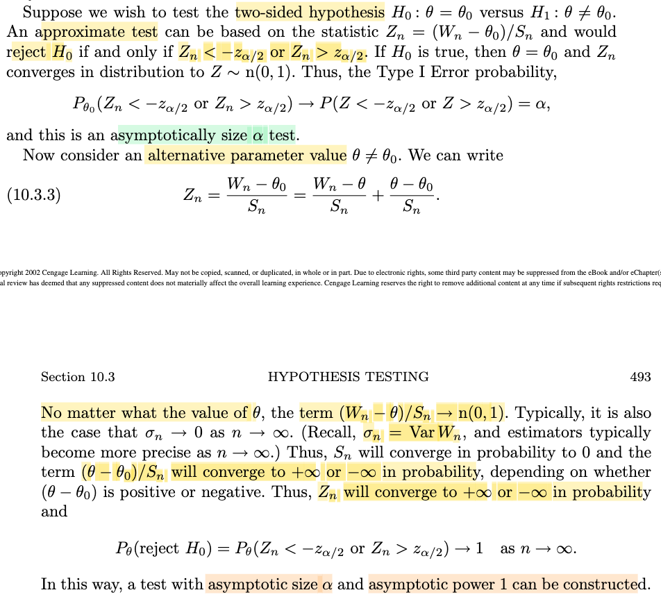</kbd>

> [!NOTE]
> Rồi, với những hiểu biết từ hai note trước ta hoàn toàn có thể hiểu đoạn này, đại khái là như sau:
>
>
>
> Đầu tiên cần nhớ, z\_α/2, theo định nghĩa, nó là cái mốc mà với một normal(0,1), P(|Z| ≥ cái mốc này) = α ⇔ P(Z ≥ z\_α/2 hoặc Z ≤ -z\_α/2) = α. Ý nghĩa là, \[phần diện tích của pdf ở bên phải z\_α/2\] + \[phần diện tích của pdf ở bên trái mốc -z\_α/2\] = α. Nên z\_α/2 sẽ là số cố định, đã biết từ trước, lấy từ bang tra pdf của normal (α bao nhiêu thì ta có z\_α/2 bấy nhiêu)
>
>
>
> Thế thì, phần trước mình đã hiểu nguyên lý của cái cách xây dựng test này.
>
>
>
> Giả sử ta có hypothesis test: H0: θ = θ0 vs H1: θ ≠ θ0: Dựa trên một statistic Wn nào đó mà có được tính chất **DƯỚI ĐIỀU KIỆN** θ = θ0 thì (Wn - θ0)/Sn → n(0,1)
>
>
>
> Chú ý: Cái này **dễ sai, khi nghĩ rằng (Wn - θ0) / Sn là tự động hội tụ về n(0,1)**. Không phải! nó chỉ hội tụ khi θ0 là true param (tức X1,...Xn \~ f(x|θ0)). đó là lí do vì sao tác giả Casella viết "**If H0 is true, then θ = θ0 and Zn converges in distribution to Z \~ n(0,1)**)
>
>
>
> Thì ta có thể xây dựng một cái test mà level của nó sẽ tiệm cận α như sau.
>
>
>
> Đầu tiên, vì đây là 2 side test, với H0 nói rằng θ bằng đúng giá trị θ0, nên cái rule ta sẽ đặt là: "nếu như quan sát được data, và tính ra test statistic value ra quá lớn hoặc quá bé, thì ta sẽ bác bỏ H0", thể hiện bởi: Reject H0 khi |test statisitic| ≥ c.
>
>
>
> Thứ hai, test statistic ta chọn là (Wn - θ0)/Sn để lợi dụng sự thật là cái này, DƯỚI ĐIỀU KIỆN θ = θ0 sẽ hội tụ phân phối về một random variable \~ n(0,1).
>
>
>
> Khi đó, nhiệm vụ lúc này là tìm c. Thế thì thì theo định nghĩa của level alpha test, đó là test có xác suất mắc Type I error không quá α: sup\_Θ0 P(Reject H0) ≤ α.
>
>
>
> Nên muốn test "Reject H0 khi |(Wn - θ0)/Sn| ≥ c" có level alpha, ta cần c phải thỏa:
>
>
>
> sup\_Θ0 P\_θ(|(Wn - θ0)/Sn| ≥ c) ≤ α.
>
>
>
> Vì Θ chỉ có θ0, nên tương đương
>
>
>
> P\_θ0(|(Wn - θ0)/Sn| ≥ c) ≤ α (1)
>
>
>
> Và sử dụng the fact là: dưới điều kiện true param là θ0 thì (Wn - θ0)/Sn → (d) Z \~ n(0,1)
>
>
>
> (phải nhấn mạnh lần nữa: ko phải (Wn - θ0)/Sn mặc định converge về n(0,1) mà chỉ đúng nếu distribution của **X** có tham số thực sự là θ0)
>
>
>
> nên P\_θ0(|(Wn - θ0)/Sn| ≥ c) → P\_θ0(|Z| ≥ c), và cái P\_θ0(|Z| ≥ c) này không phụ thuộc θ0 nữa, nên ghi là P(|Z| ≥ c)
>
>
>
> Do đó khi n lớn ta xấp xỉ điều kiện tìm c để có level alpha test (1) bởi:
>
>
>
> P(|Z| &gt; c) ≤ α (2), và c thỏa cái này chính là cái z\_α/2 nói lúc đầu.
>
>
>
> Như vậy, ở (1), P\_θ0(|(Wn - θ0)/Sn| ≥ c) ≤ α, ta không thể tìm được c nếu không biết distribution của cái statistic |(Wn - θ0)/Sn|, nên không thể có được một test có level alpha chính xác.
>
>
>
> Nhưng vì khi n lớn, các statistic |(Wn - θ0)/Sn| dần trở thành một biến \~ n(0,1), nên (1) cũng dần trở thành (2) và từ đó ta có thể tra bảng tính ra c
>
>
>
> Nhưng dĩ nhiên trong thực tế n ko thể là vô hạn, chỉ là rất lớn, nên đại ý là cái threshold z\_α/2 chỉ là giá trị gần đúng nên thực tế, level của test: Reject H0 khi |(Wn - θ0)/Sn| ≥ z\_α/2 chỉ được gọi là tiệm cận α.
>
>
>
> ---
>
>
>
> Còn đoạn sau, để hiểu cần active recall về cái gọi là power function được định nghĩa là:  β(θ) = P(reject H0) = P\_θ(**X** ∈ R) (Xem link)
>
>
>
> Trong hai loại error, Type I và Type II, thì với Type I, ta muốn khống chế nó bởi việc đi xây dựng level α test, có xác suất mắc Type I error không quá α.
>
>
>
> Với Type II error, tức dạng error khi "không reject H0 trong khi nên vậy, tức θ ∈ Θ0c", ta cũng muốn nó nhỏ, và dĩ nhiên đồng nghĩa muốn xác suất "Làm đúng, tức reject H0 khi θ ∈ Θ0c, càng lớn càng tốt".
>
>
>
> Để rồi cái test mà có power lớn nhất được gọi là **Uniform Most Power** test (UMP): với mọi θ ∈ Θ0c, thì beta của UMP luôn lớn hơn hoặc bằng beta của các test khác.
>
>
>
> Và dĩ nhiên ta sẽ thấy power lớn nhất là = 1 (vì nó là P\_θ(**X** ∈ R))
>
>
>
> Cho nên ở đây. Chính là gs chỉ ra rằng, cái test (tiệm cận level alpha) mà ta vừa làm cũng sẽ có power tiệm cận 1. Hiểu đại khái như sau:
>
>
>
> Đầu tiên cần nhắc lại, ta chỉ muốn power lớn khi θ ∈ Θ0c, vì khi đó power là xác suất làm đúng (reject H0 khi thật sự là nên reject H0). Chứ còn khi θ ∈ Θ0, thì ta muốn power nhỏ.
>
>
>
> Vậy thì xét trường hợp true parameter θ ∈ Θ0c, và ở đây tức là θ ≠ θ0, thì VỚI MỌI θ như vậy, Wn - θ / Sn → n(0,1). Vì sao?
>
>
>
> Vì như đã nhấn mạnh ở trên rằng, "(Wn - ?) / Sn → n(0,1)" chỉ đúng khi ta gắn true parameter vào dấu hỏi.
>
>
>
> Tức là: 
>
>
>
> "(Wn - θ0) / Sn → n(0,1)" chỉ đúng nếu trong trường hợp param thực sự là θ0, cũng chính là nói rằng "under H0"
>
>
>
> "(Wn - 5) / Sn → n(0,1)" chỉ đúng nếu trong trường hợp param thực sự là 5
>
>
>
> Vậy tương tự, khi đang "under H1", tức là đang xét case mà tham số thật sự đang là θ khác θ0 thì ta có "(Wn - θ) / Sn → n(0,1)". 
>
>
>
> Khi đó (Wn - θ0)/Sn = (Wn - θ + θ - θ0)/Sn = (Wn - θ)/Sn + (θ - θ0)/Sn 
>
>
>
> hạng tử (Wn - θ)/Sn → Z\~ n(0,1)
>
>
>
> hạng tử (θ - θ0)/Sn, thì vì Sn trong phần trên được đặt cho một estimator của σn hội tụ về σn ("..In such a case, we look for an estimate Sn of σn with the property that σn/Sn converges in probability to 1") nên Sn → σn và σn thì lại → 0 Do ta đang dùng một statistic mà có tính chất Wn - θ / Sn → n(0,1) và với tính chất này, thì Var(Wn) phải hội tụ về 0
>
>
>
> Do đó tùy vào (θ - θ0) dương hay âm mà (θ - θ0)/Sn sẽ → ∞ hoặc -∞
>
>
>
> Khiến tổng hai hạng tử cũng sẽ → Z\~ n(0,1) + ∞ = ∞ hoặc Z\~ n(0,1) -∞ = -∞
>
>
>
> Từ đó under H1, P(reject H0) = P(|Zn| ≥ z\_α/2) = P(Zn ≤ -z\_α/2 or Zn ≥ z\_α/2) → P(-∞ &lt; -z\_α/2 or z\_α/2 &lt; ∞) và xác xuất này dĩ nhiên = 1.
>
>
>
> Như vậy mục đích cuối cùng là nói: Giả sử ta muốn alpha = 0.01 đi, cái test rule xây dựng theo kiểu này sẽ có đặc điểm: 
>
>
>
> Nếu H0 là đúng thì xác suất mắc Type 1 error sẽ nhỏ tiệm cận level 0.01 tức là tốt, good
>
>
>
> Còn nếu H1 là đúng thì cái test rule này sẽ cũng là cái tiệm cận power 1 với mọi θ, tức cũng là là trùm luôn, là dĩ nhiên cũng tốt.

> [!TIP]
> **🤖 AI Feedback** — ✅ Score: **98/100**
>
> Ghi chú của bạn cực kỳ chính xác, chi tiết và làm nổi bật được những điểm mấu chốt dễ sai như sự khác biệt về điều kiện hội tụ dưới H0 và H1. Để hoàn hảo hơn, bạn có thể giải thích rõ thêm định lý Slutsky khi kết hợp giới hạn của hai hạng tử (một hội tụ phân phối, một hội tụ xác suất ra vô cùng).

**🔗 See also:** [Kiểm định giả thuyết tối ưu](./83_methods_of_evaluating_test.md#node-i8kwc7p) · [Khái niệm hàm công suất kiểm định](./83_methods_of_evaluating_test.md#node-bksfmes)

 

