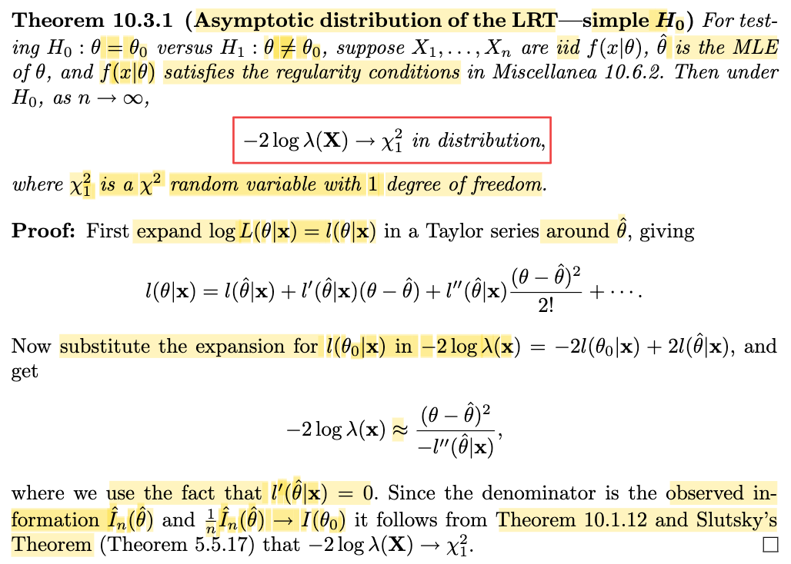

# 10.3 Hypothesis Testing

📊 **Progress:** `3` Notes | `4` Screenshots | `3` AI Reviews

---

 

## Section 10.3 Hypothesis Testing

<kbd></kbd>

> [!NOTE]
> Phần này đại ý là ta sẽ bàn về bài toán hypothesis testing trong các trường hợp phức tạp.
>
>
>
> Cụ thể là khi các bài toán không có optimal test, ví dụ như không có UMP test.
>
>
>
> Đã học hypothesis testing từ chap 8, có lẽ nên active recall chút xíu:
>
>
>
> Đầu tiên, bài toán hypothesis testing cũng là bài toán inference (model parameter), giống như bài toán point estimator. Với point estimation, trong đó, cho sample X1,...Xn \~ f(x|θ) (và ta giả định f(x|θ) là một dạng, một loại nào đó, và đây gọi là cách tiếp cận parameteric model) và mục tiêu là đi tìm một estimator - theo định nghĩa, là một hàm của sample W(**X**), để với observed value **x** của **X**, W(**x**) sẽ cho ta một point estimate của θ.
>
>
>
> Còn với hypothesis testing, nhiệm vụ cũng là đưa ra một hàm số của sample, nhưng thay vì tính ra point estimate của θ, hàm này sẽ đưa ra quyết định giữa một trong hai giả thuyết: θ nằm trong Θ0 (gọi là H0) hay θ nằm trong Θ0c (gọi là H1). Và để làm vậy, ta sẽ xây dựng một hypothesis testing, có bản chất là một hàm quyết định: nhận vào một possible value của sample, tính ra một hàm của sample (gọi là test statistic δ(**X**)), và từ giá trị của nó, ta sẽ đưa ra output: kết luận θ thuộc Θ0 hay θ thuộc Θ0c (ví dụ như so δ(**x**) với một ngưỡng nào đó)
>
>
>
> Và cũng đồng nghĩa, phép thử sẽ tạo ra một cái gọi rejection region R, chứa các input x khiến kết quả phép thử là reject H0 (tức kết luận cho rằng θ ∈ Θ0c): 
>
>
>
> R = {**x** ∈ **𝒳**: δ(**x**) = reject H0}
>
>
>
> Và từ đó, cũng như ta có các cách tiếp cận để có point estimator W(**X**) tối ưu, thì ở đây ta cũng sẽ đánh giá để tìm ra hypothesis testing tối ưu.

> [!TIP]
> **🤖 AI Feedback** — ✅ Score: **90/100**
>
> Bạn đã tóm tắt chính xác ý chính và có tư duy liên hệ xuất sắc khi chủ động ôn lại các khái niệm nền tảng từ chương trước. Tuy nhiên, để đầy đủ hơn, bạn nên bổ sung hai phương pháp cụ thể được nhắc đến ở cuối bài là kiểm định tỷ số khả biến mẫu lớn và các kiểm định xấp xỉ mẫu lớn.

 

### Section 10.3.1 Asymptotic Distribution of LRTs

<kbd></kbd>

> [!NOTE]
> Đầu tiên gs nói rằng đại ý là một trong nhưng method hữu ích nhất cho các mô hình phức tạp là likelihood ratio method, vì nó cho ta một định nghĩa tường minh của test statistic, cũng như rejection region có dạng tường minh.
>
>
>
> Dừng lại chút ôn lại cái này: Như note trước mình vừa recall lại, rằng trong bài toán hypothesis testing, nhiệm vụ là đi tìm, xây dựng một test statistic để dựa vào giá trị của nó để đưa ra kết luận về θ thuộc Θ0 (H0) hay Θ0c (H1). Vậy thì một cách đó là dùng test statistic sau: likelihood ratio test (LRT) kí hiệu λ(**x**), có công thức là:
>
>
>
> λ(**x**) = sup\_{θ∈Θ0}  {L(**x**|θ)} / sup\_{θ∈Θ} {L(**x**|θ)}, có ý nghĩa là:
>
>
>
> với observed data **X** = **x**, thì tỉ số giữa độ hợp lí lớn nhất của θ tìm được trong tập Θ0 so với độ hợp lí lớn nhất của θ tìm được trong toàn không gian parameter space Θ là bao nhiêu.
>
>
>
> Và với LRT thì decision rule là: So với một threshold c nào đó, để nếu λ(**x**) ≤ c thì kết luận reject H0, và ngược lại. Và điều này mang ý nghĩa là "nếu tìm trong Θ0 mà kết quả chỉ có độ hợp lí quá nhỏ so với kết quả khi tìm trong toàn parameter space Θ, thì ta kết luận θ không nằm trong Θ0".
>
> Đương nhiên để hoàn thành một hypothesis test, ta vẫn phải chọn giá trị của c, nhưng cách thức là như vậy.
>
>
>
> Như vậy, với LRT, rejection region là: R = {**x** ∈ 𝒳: λ(**x**) ≤ c}.
>
>
>
> Dễ thấy cái mẫu số chính là là giá trị của likelihood tại MLE θ^, vì theo định nghĩa của MLE, θ^ chính là argmax\_Θ L(θ|**x**).
>
>
>
> Và theo gs Casella, dù cho việc tính hai cái đỉnh của hàm likelihood khi xét θ trong Θ0 hay Θ có thể không tính được theo lối analytic (ví dụ như dùng giải tích để có closed form formula để tính) thì ta vẫn có thể tính theo lối numerically (ám chỉ các thuật toán tối ưu). Do đó dù không có công thức tính tử số và mẫu số ta vẫn có thể tính giá trị của λ(**x**) dựa trên thuật toán.

> [!TIP]
> **🤖 AI Feedback** — ✅ Score: **98/100**
>
> Ghi chú cực kỳ chi tiết và chính xác, thể hiện sự hiểu biết sâu sắc về mặt toán học cũng như ý nghĩa thực tiễn của phương pháp LRT. Bạn chỉ cần lưu ý một chút về ký hiệu truyền thống của hàm likelihood là L(\theta|\mathbf{x}) thay vì viết ngược lại, nhưng tổng thể bài viết là xuất sắc.

 

#### Level Alpha Test Definition

<kbd></kbd>

> [!NOTE]
> Và ở đây nhắc lại về khái niệm level-α test, cũng là dịp để active recall chút xíu:
>
>
>
> Như đã nói, cũng như với point estimator, ta sẽ có cách (tiêu chí) để evaluate chúng, thì với hypothesis test cũng vậy.
>
>
>
> Thế thì đối với test, nó có thể có hai loại error: Kết luận H0 khi θ ∈ Θ0c hoặc ngược lại kết luận H1 khi θ ∈ Θ0, gọi là Type I và Type II error.
>
>
>
> Như vậy, với LRT, event Type I error xảy ra khi λ(**X**) ≤ c khi θ ∈ Θ0, và xác suất mắc Type I error là: P(λ(**X**) ≤ c) khi θ ∈ Θ0. Tương tự event Type II error xảy ra khi λ(**x**) &gt; c khi θ thuộc Θ0c.
>
>
>
> Và từ đó ta có định nghĩa của level α test: Đó là phép thử mà xác suất mắc Type error I không vượt quá α: sup\_θ∈Θ0 P(λ(**X**) ≤ c) ≤ α.

> [!TIP]
> **🤖 AI Feedback** — ✅ Score: **95/100**
>
> Ghi chú rất tốt và chính xác khi giải thích rõ mối liên hệ giữa sai lầm Loại I (Type I error) và định nghĩa của level-α test từ hình ảnh. Điểm cần lưu ý nhỏ là ở câu cuối bạn nên viết rõ là 'sai lầm Loại I' thay vì ghi chung chung là 'Type error' để tránh nhầm lẫn.

 

##### Asymptotic Distribution of the LRT

<kbd></kbd>

 

