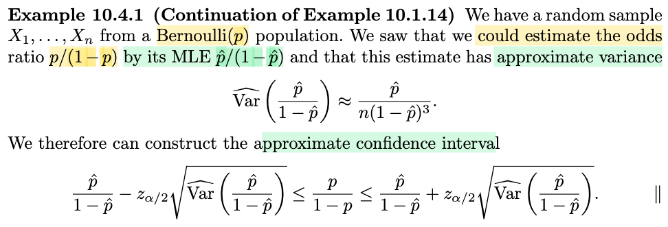
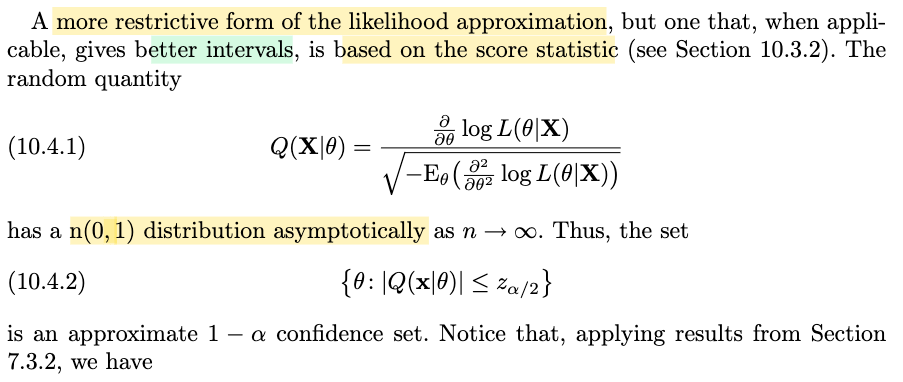
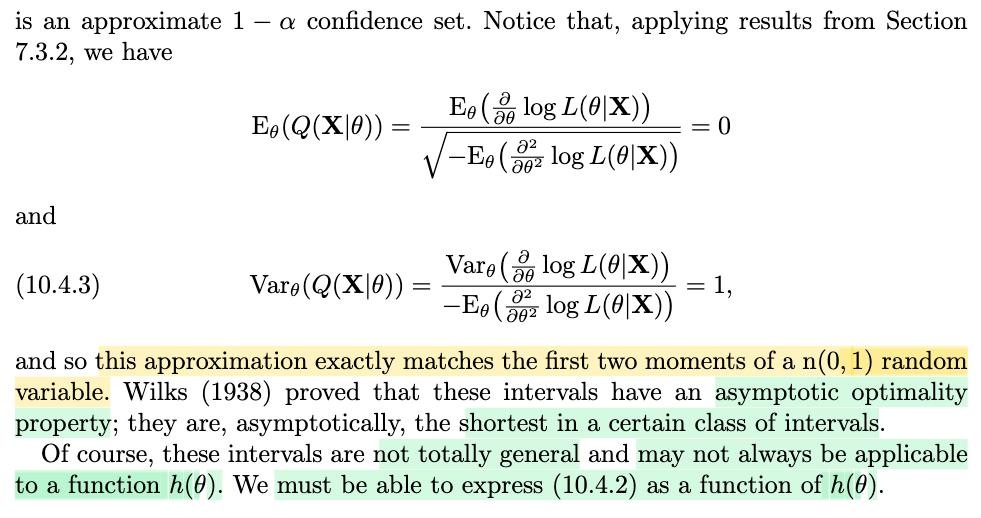
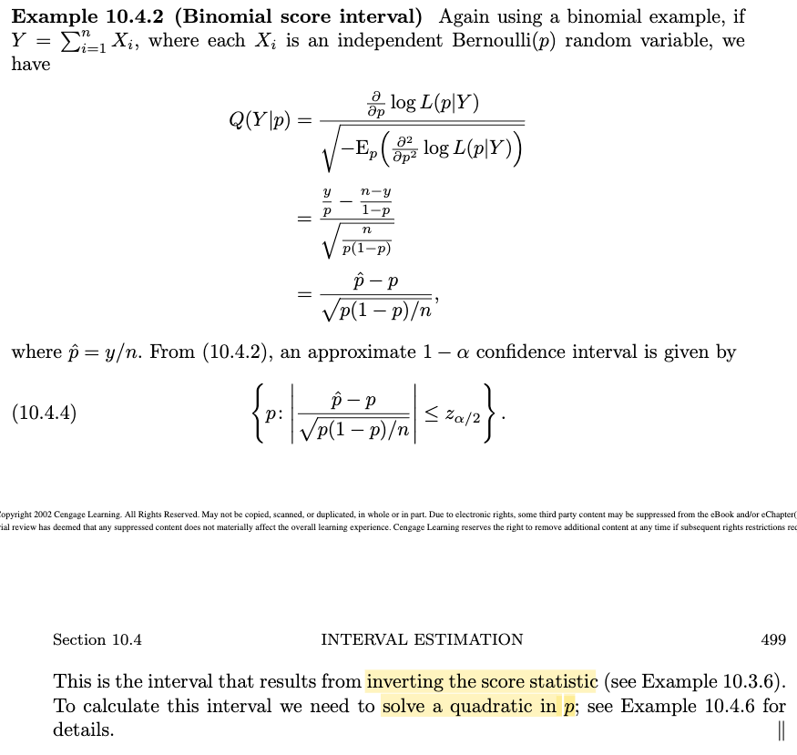
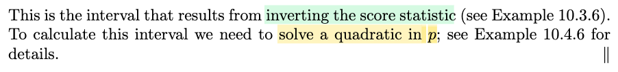

# 10.4 Interval Estimation

📊 **Progress:** `8` Notes | `9` Screenshots | `8` AI Reviews

---

 

## 10.4 Interval Estimation

<kbd></kbd>

> [!NOTE]
> Ok, qua phần 10.4. Thì đầu tiên là mình nên hiểu lại hoặc là nhìn lại những cái phần trước, hoặc là trong bối cảnh chương 10 này, để mình hiểu là mình đang làm cái gì. Thì cái ý tưởng xuyên suốt của chương 10 là muốn deal với một vấn đề. Mình lấy ví dụ, trong cái phần 10.3 đó, khi mình bàn về bài toán hypothesis testing đó, thì mình gặp một số những cái test statistic mà bản chất của nó, cái hàm phân phối, cái phân phối xác suất của nó, nó rất phức tạp. Ví dụ như đối với cái gọi là likelihood ratio test, để mà mình xem xét cái phân phối xác suất của nó, mình sẽ thấy nó phức tạp. Và từ đó nếu như mình muốn xây dựng ra một cái phép thử để đạt một cái level alpha nào đó, và thông qua đó là mình cần phải chọn ra được cái ngưỡng, thì vì mình deal với một cái bài toán mà cái xác suất là gắn với một cái statistic có cái phân phối phức tạp, nên mình sẽ rất khó để mà xác định ra chính xác cái ngưỡng nào để rồi hoàn thành để mà có được một cái phép thử mà đạt yêu cầu. 
>
>
>
> Đó. Vậy thì cái chương này nó chỉ cho mình cách để mình deal với vấn đề đó bằng cách là mình áp dụng những cái định lý, ví dụ như định lý giới hạn trung tâm, định lý luật số lớn, mà những cái định lý này nó cho phép mình có được một cái chuyện đó là khi mà số lượng mẫu nó tiến tới vô cùng, tức là vô cùng lớn, thì những cái statistic này sẽ hội tụ phân phối về phân phối chuẩn. Và như vậy có nghĩa là nếu như mình xét số lượng mẫu, phải không, kích thước mẫu ở một cái mức độ lớn, thì mình có thể coi, mình có thể được phép xấp xỉ những cái statistic đó bởi một cái random variable normal.
>
>
>
>
>
> Và từ đó là mình có thể dùng cái phân phối xác suất của Normal. Vậy thì cái phần cuối của chương 10 này sẽ là deal với cái bài toán interval estimation, không? Là cái bài toán statistical inference thứ ba ở trong ba loại là point estimation, hypothesis testing, và interval estimation. Thì ý của tác giả nói đây nè là sẽ nói về một số những phương pháp mà có thể được dùng trong những cái tình huống mà phức tạp. Và trong hầu hết trường hợp thì những cái phương pháp này nó cho ra những cái kết quả không phải là tốt nhất, nhưng trong nhiều trường hợp đây là những cái tốt nhất mà mình có.

> [!TIP]
> 🤖 **AI Check** — 🟡 Minor issues — ✅ **92/100** · ✓ Move on
>
> Ghi chú nắm rất tốt bức tranh tổng quan của chương 10 và ngữ cảnh của mục 10.4 về ước lượng khoảng xấp xỉ/tiệm cận.
>
> **🟡 Minor issues**
>
> **1.** *"Ví dụ như đối với cái gọi là likelihood ratio test... những cái statistic này sẽ hội tụ phân phối về phân phối chuẩn"*
>
> Trong kiểm định tỷ số hợp lý (Likelihood Ratio Test - LRT), thống kê kiểm định -2 log(lambda) hội tụ về phân phối Chi bình phương (theo định lý Wilks), chứ không phải phân phối chuẩn. Phân phối chuẩn thường áp dụng trực tiếp cho các ước lượng như MLE hoặc thống kê Wald/Score.
>
>
> **✓ Strengths**
> - Hiểu rất rõ logic chuyển tiếp và mối liên hệ xuyên suốt giữa ba bài toán suy diễn thống kê lớn: ước lượng điểm, kiểm định giả thuyết và ước lượng khoảng.
> - Nắm bắt chính xác thông điệp tác giả truyền tải: phương pháp tiệm cận giúp giải quyết các tình huống phức tạp để đưa ra câu trả lời khả dĩ, dù không phải tối ưu tuyệt đối nhưng thường là cách tốt nhất ta có.
>
> **💡 Deeper notes**
> - Khái niệm 'confidence sets' tổng quát hơn 'confidence intervals' vì nó bao gồm cả trường hợp tham số đa chiều hoặc không gian tham số có cấu trúc bất kỳ.

 

### Approximate Maximum Likelihood Intervals

<kbd></kbd>

<kbd></kbd>

> [!NOTE]
> Đầu tiên ta sẽ xem xét Maximum Likelihood Intervals.
>
>
>
> Gs cho biết đại ý là từ những thảo luận ở 10.1, ta đã có phương pháp chung để có phân phối tiệm cận của một MLE. Từ đó ta sẽ có thể xây dựng confidence interval.
>
>
>
> Tí nữa mình sẽ active recall chút xíu về bài toán confidence interval, và vì sao gọi là Maximum Likelihood Interval.
>
>
>
> Thế thì cho X1,...Xn iid \~ f(x|θ), θ^ là mle của θ, thì theo 10.1.6, variance của h(θ^) có thể được estimate bởi \[h'(θ)\]²|θ=θ̂ / \[-∂²/∂θ² log L(θ|𝐱)|θ=θ̂.
>
>
>
> Thử giải thích cái này, cũng là ôn lại.
>
>
>
> Còn nhớ, có một theorem (theorem 10.1.12, xem link) nói rằng, nếu Wn là MLE của τ(θ) thì nó là một **asymptotically efficient & consistent estimator.**
>
>
>
> Và theo định nghĩa của khái niệm này (xem cross-link tới định nghĩa 10.1.11), nói rằng nếu Wn asymptotically efficient estimator của τ(θ) thì: √n(Wn - τ(θ)) → (d) n(0, ν(θ)) với ν(θ) = Cramer Rao Lower Bound = \[d/dθ τ(θ)\]² / E\_θ\[(∂/∂θ log f(X|θ))²\].
>
>
>
> Và lại theo định nghĩa của asymptotically variance, nói √n(Wn - τ(θ)) → (d) n(0, ν(θ)) chính là nói Wn có assymtotically variance = ν(θ)
>
>
>
> Kết hợp 3 thứ trên thì ở đây cho θ^ là mle của θ thì h(θ^) cũng là mle của h(θ) nên phương sai tiệm cận của h(θ^):
>
>
>
> Avar(h(θ^)) = \[d/dθ h(θ)\]² / E\_θ\[(∂/∂θ log f(X|θ))²\]\]
>
>
>
> = \[h'(θ)\]² / E\_θ\[(∂/∂θ log f(X|θ))²\])
>
>
>
> Thể hiện theo toán bởi:
>
>
>
> √n\[h(θ^) - h(θ)\] → (d) n(0, \[h'(θ)\]² / E\_θ\[(∂/∂θ log f(X|θ))²\])
>
>
>
> Và như vậy, khi n lớn, Var\[√n\[h(θ^) - h(θ)\]\] ≈ \[h'(θ)\]² / E\_θ\[(∂/∂θ log f(X|θ))²\])
>
>
>
> ⇔ nVar\[h(θ^)\] ≈ \[h'(θ)\]² / E\_θ\[(∂/∂θ log f(X|θ))²\]
>
>
>
> ⇔ Var\[h(θ^)\] ≈ \[h'(θ)\]² / n E\_θ\[(∂/∂θ log f(X|θ))²\]
>
>
>
> (Vì sao n E\_θ\[(∂/∂θ log f(X|θ))² = E\_θ\[(∂/∂θ log f(𝐗|θ))², xem lại link tới Chứng minh Cramer-Rao từ Cauchy-Schwarz)
>
>
>
> ⇔ Var\[h(θ^)\] ≈ \[h'(θ)\]² / E\_θ\[(∂/∂θ log f(𝐗|θ))²\]
>
>
>
> Và một định lý khác (chính xác xem link tới bổ đề 7.3.11), đã chứng minh:
>
>
>
> E\_θ\[(∂/∂θ log f(X|θ))²\] = -E\_θ\[∂²/∂θ² log f(X|θ)\]
>
>
>
> Vậy ở trên ⇔ Var\[h(θ^)\] ≈ \[h'(θ)\]² / -E\_θ\[∂²/∂θ² log f(𝐗|θ)\]
>
>
>
> Đây là kết quả cho ta thấy công thức của Var\[h(θ^)\] (khi n lớn) chính là \[h'(θ)\]² / -(∂²/∂θ² log f(𝐗|θ)\]
>
>
>
> Và từ đó ta làm 2 động tác sau để công thức trên trở thành ESTIMATE của Var\[h(θ^)\]:
>
>
>
> i) Thay kì vọng -E\_θ\[∂²/∂θ² log f(𝐗|θ)\] ở mẫu số bởi -∂²/∂θ² log f(𝐱|θ), chính là thay vì dùng **information** **number** of sample size n, ta dùng **observed** **information** **number** (xem link tới 10.1.7)
>
>
>
> ii) thay θ bởi θ^, tức là dùng MLE của θ thay cho giá trị thật của θ.
>
>
>
> Ta sẽ có công thức estimate của Var\[h(θ^)\], kí hiệu Var^\[h(θ^)\] = \[h'(θ)\]²|θ=θ̂ / -(∂²/∂θ² log f(𝐗|θ)\] |θ=θ̂
>
>
>
> ---
>
>
>
> Bên cạnh đó, √n\[h(θ^) - h(θ)\] → (d) n(0, \[h'(θ)\]² / E\_θ\[(∂/∂θ log f(X|θ))²\]) cũng tương đương:
>
>
>
> √n\[h(θ^) - h(θ)\] → (d) h'(θ) / √E\_θ\[(∂/∂θ log f(X|θ))²\] × n(0, 1)
>
>
>
> ⇔ \[√n\[h(θ^) - h(θ)\] / h'(θ)\] / √E\_θ\[(∂/∂θ log f(X|θ))²\] → (d) n(0, 1)
>
>
>
> ⇔ \[h(θ^) - h(θ)\] / \[h'(θ) / √n√E\_θ\[(∂/∂θ log f(X|θ))²\]\] → (d) n(0, 1)
>
>
>
> ⇔ \[h(θ^) - h(θ)\] / \[h'(θ) / √nE\_θ\[(∂/∂θ log f(X|θ))²\]\] → (d) n(0, 1)
>
>
>
> ⇔ \[h(θ^) - h(θ)\] / \[h'(θ) / √E\_θ\[(∂/∂θ log f(𝐗|θ))²\]\] → (d) n(0, 1)
>
>
>
> ⇔ \[h(θ^) - h(θ)\] / SD\[h(θ^)\] → (d) n(0, 1)
>
>
>
> Và kết quả này sẽ cho thấy rằng nếu gọi σn là SD(h(θ^)) thì \[h(θ^) - h(θ)\]/σn → (d) n(0,1)
>
>
>
> Và ta dùng định lý Slusky, nói rằng nếu Xn → (d) X, Yn → (p) Y thì XnYn → (d) XY để chỉ ra rằng nếu ta thay √Var\[h(θ^)\] bởi Sn = √Var^\[h(θ^)\] thì \[Wn - h(θ)\] / √Var^\[h(θ^)\] vẫn converge phân phối về n(0,1):
>
>
>
> \[h(θ^) - h(θ)\]/σn → (d) n(0,1)
>
>
>
> Sn → (p) σn ⇔ σn/Sn → (p) 1
>
>
>
> Áp dụng Slutsky: (\[h(θ^) - h(θ)\]/σn) × (σn/Sn) → (d) n(0,1) × 1
>
>
>
> ⇔ \[h(θ^) - h(θ)\]/Sn → (d) n(0,1)
>
>
>
> Như vậy, \[h(θ^) - h(θ)\] / √Var^\[h(θ^)\] → (d) n(0,1)
>
>
>
> Đây là kết quả đóng khung đỏ mà ta muốn giải thích.
>
>
>
> ---
>
>
>
> Và như vậy, dựa trên điều này, ta sẽ có thể xây dựng một approximate confidence interval (nói tiếp ở note sau, ta sẽ ôn lại confidence interval là gì)

> [!TIP]
> 🤖 **AI Check** — 🟢 Pass — ✅ **95/100** · ✓ Move on
>
> Ghi chú rất xuất sắc, tái hiện và kết nối chính xác nguồn gốc lý thuyết của công thức tính phương sai tiệm cận (thông tin Fisher, delta method) và việc áp dụng định lý Slutsky để chuẩn hóa phân phối.
>
> **🟡 Minor issues**
>
> **1.** *"⇔ [h(θ^) - h(θ)] / [h'(θ) / √nE_θ[(∂/∂θ log f(X|θ))²]] → (d) n(0, 1)"*
>
> Lỗi gõ phím nhỏ: ở bước trung gian này bị thiếu dấu căn bậc hai ở mẫu số kỳ vọng (dòng trước đó có '√n√E', dòng sau đã gom lại thành căn của cả n mẫu nên kết quả cuối vẫn đúng).
>
> **2.** *"Sn → (p) σn ⇔ σn/Sn → (p) 1"*
>
> Cách viết hơi phi hình thức vì cả Sn và σn đều phụ thuộc vào n và tiến về 0. Về mặt toán học chuẩn mực, ta thường nhân thêm √n vào cả tử và mẫu (√n Sn →(p) √ν(θ) và √n σn = √ν(θ)), từ đó suy ra tỷ số Sn/σn →(p) 1.
>
>
> **✓ Strengths**
> - Hiểu rất rõ cơ chế chuyển dịch từ Information number (kỳ vọng) sang Observed Information (thông tin quan sát) tại θ = θ̂.
> - Kết nối chính xác các mắt xích kiến thức từ Delta method, cận Cramer-Rao đến định lý Slutsky để thu được phân phối N(0,1).
>
> **💡 Deeper notes**
> - Để tỷ số hội tụ theo xác suất về 1 và áp dụng được Slutsky, các điều kiện chính quy (regularity conditions) cần đảm bảo đạo hàm cấp hai liên tục tại lân cận của θ và luật số lớn áp dụng được cho observed information.

**🔗 See also:** [Theorem 10.1.12 (Asymptotic efficiency of MLEs)](./101_point_estimation.md#node-n1mqtrr) · [10.1.3 Calculations and Comparisons](./101_point_estimation.md#node-iwgmm5t) · [Definition 10.1.11 Asymptotic Efficiency](./101_point_estimation.md#node-bgijdqy) · [Bổ đề Tính toán Hàm mũ](./73_methods_of_evaluating_estimators.md#node-sttybm4) · [Chứng minh Cramer-Rao từ Cauchy-Schwarz](./73_methods_of_evaluating_estimators.md#node-bevjtm7)

 

#### Approximate Confidence Interval

<kbd></kbd>

> [!NOTE]
> Active recall confidence interval là gì:
>
>
>
> Trong sách này, mình hiểu chap 7,8,9 lần lượt giới thiệu 3 bài toán statistical inference: Cho random sample X1,...Xn iid \~ f(x|θ) và muốn suy luận ra giá trị của θ. Với **point estimation**, ta muốn xây dựng một hàm W(𝐗), để estimate cho giá trị θ, để rồi khi bỏ vào observed value của 𝐗 = 𝐱, ta sẽ có W(𝐱) là một point estimate value của θ.
>
>
>
> Với **hypothesis testing**, ta muốn xây dựng một hypothesis test, có bản chất chỉ là một decision rule, nhận vào giá trị observed value của 𝐗 (=𝐱) thì decision rule này sẽ đưa ra infercence là θ nằm trong Θ0 hay Θ0c (tức không reject H0 hay reject H0)
>
>
>
>
>
> Và cuối cùng, với interval estimation, ta muốn xây dựng một **random interval / random set** C(𝐗), có xác suất C(𝐗) chứa θ là bao nhiêu phần trăm mong muốn nào đó.
>
>
>
> Và khi θ là scalar, thì random set trở thành **random interval**, có dạng \[L(𝐗), U(𝐗)\].
>
>
>
> θ fixed unknonw
>
>
>
> Dĩ nhiên, trong cả ba bài toán, ta đều phải có các cách tiếp cận sao cho có được một estimator, hypothesis test, confidence interval tốt. Do đó người ta đặt ra các yếu tố để evaluate chất lượng của chúng. Với point estimation thì thông qua các tiêu chí như unbias và có variance thấp nhất có thể (đỉnh cao là có variance đạt mức đáy Cramer Rao Lower Bound), bên cạnh đó là các tính chất như consistent, efficient, robustness. Với test thì ta muốn có level α test giúp khống chế Type I error, cũng như Type II error.
>
>
>
> Thì với confidence interval cũng vậy, ta muốn xây dựng một interval mà xác suất bắt được, chứa được h(θ) sẽ đạt mức nào đó.
>
>
>
> Do đó, ta giả sử muốn một confidence set có P(L(𝐗) ≤ h(θ) ≤ U(𝐗)) ≈ 1-α
>
>
>
> Thế thì, vì \[h(θ^) - h(θ)\] / √Var^(h(θ^|θ)) → (d) n(0,1) nên:
>
>
>
> đại khái là khi n lớn ta có thể coi nó như Z \~ n(0,1)
>
>
>
> Từ đó để có một confidence interval có xác suất bắt được h(θ) xấp xỉ 1-α (ví dụ α = 0.05, 1 - α = 0.95) ta làm như sau:
>
>
>
> Đó là L(𝐗) = h(θ^) - z\_α/2 √Var^(h(θ^|θ)) và
>
>
>
> U(𝐗) = h(θ^) + z\_α/2 √Var^(h(θ^|θ))
>
>
>
> Vì khi đó: P(L(𝐗) ≤ h(θ) ≤ U(𝐗)))
>
>
>
> = P(h(θ^) - z\_α/2 √Var^(h(θ^|θ)) ≤ h(θ) ≤ h(θ^) + z\_α/2 √Var^(h(θ^|θ)))
>
>
>
> = P(-z\_α/2 ≤ \[h(θ^) - h(θ)\] / √Var^(h(θ^|θ)) ≤ z\_α/2 )
>
>
>
> khi n → inf thì:
>
>
>
> P(-z\_α/2 ≤ \[h(θ^) - h(θ)\] / √Var^(h(θ^|θ)) ≤ z\_α/2 )
>
>
>
> → P(-z\_α/2 ≤ Z ≤ z\_α/2) và cái này = 1-α
>
>
>
> Như vậy khi n lớn P(h(θ^) - z\_α/2 √Var^(h(θ^|θ)) ≤ h(θ) ≤ h(θ^) + z\_α/2 √Var^(h(θ^|θ))) ≈ 1 - α.
>
>
>
> (Nhớ lại khái niệm z\_α, nó là mốc mà P(Z ≥ z\_α), tức phần đồ thị pdf từ mốc z\_α trở đi = α. Và vì tính đối xứng của n(0,1) nên P(Z ≤ -z\_α) cũng = α. Như vậy thì:
>
>
>
> P(-z\_α/2 ≤ Z ≤ z\_α/2 ) = 1 - P(Z ≤ -z\_α/2) - P(Z ≥ z\_α/2) = 1 - α/2 - α/2 = 1 - α.

> [!TIP]
> 🤖 **AI Check** — 🟢 Pass — ✅ **98/100** · ✓ Move on
>
> Ghi chú rất xuất sắc, hệ thống hóa bài bản mối liên hệ giữa ước lượng điểm, kiểm định giả thuyết và ước lượng khoảng, đồng thời biến đổi đại số để tìm khoảng tin cậy tiệm cận hoàn toàn chính xác.
>
> **✓ Strengths**
> - Khái quát hóa mạch lạc bức tranh tổng quan của suy diễn thống kê từ ước lượng điểm đến khoảng tin cậy.
> - Biến đổi chuẩn xác các bất đẳng thức xác suất để đưa khoảng tin cậy về dạng chuẩn hóa hội tụ theo phân phối.
> - Giải thích cặn kẽ ý nghĩa hình học và tính đối xứng của giá trị tới hạn z_{alpha/2} trên phân phối chuẩn tắc.
>
> **💡 Deeper notes**
> - Trong tài liệu gốc, định lý Slutsky đóng vai trò mấu chốt để thay thế phương sai lý thuyết Var(h(theta^)|theta) bằng ước lượng nhất quán của nó là Var^(h(theta^)|theta) mà vẫn bảo toàn sự hội tụ về n(0, 1).
> - Ký hiệu Var^(h(theta^)|theta) là một thống kê (statistic) tính từ dữ liệu mẫu X (thường bằng cách thay theta bằng theta^ trong biểu thức phương sai tiệm cận), đảm bảo hai đầu mút L(X) và U(X) không còn phụ thuộc vào tham số chưa biết theta.

 

##### Example 10.4.1 Odds Ratio CI

<kbd></kbd>

> [!NOTE]
> Rồi, cái ví dụ này là sao?
>
>
>
> Cực đơn giản thôi: Bài toán cho random sample iid X1,....Xn \~ Bern(p)
>
>
>
> Bằng cách thay p bởi p̂ (MLE của p) ta có được một MLE của odds ratio p/(1-p): p̂/(1-p̂)
>
>
>
> Và ta cũng có estimate của Var\[p̂/(1-p̂)\], kí hiệu Var^\[p̂/(1-p̂)\] ≈ p̂ /n(1-p̂)³
>
>
>
> (công thức này ở đâu ra? mình sẽ active recall làm lại ở dưới)
>
>
>
> Nên ta có thể dùng tính chất: nói rằng nếu Wn là MLE của θ và Sn là một consistent estimator của SD(Wn) thì (Wn - θ)/Sn → (d) Z \~ n(0,1) (cái này đã nói nhiều lần trong các ví dụ về Wald test) để tạo một confidence interval có P\_θ(confidence interval chứa được θ) ≈ 1-α như sau:
>
>
>
> Đầu tiên nếu ta có Z \~ n(0,1) thì, theo định nghĩa của z\_α thì:
>
>
>
> P(Z ≤ -z\_α/2) + P(Z ≥ z\_α/2) = α/2 + α/2 = α
>
>
>
> ⇒ P(-z\_α/2 ≤ Z ≤ z\_α/2) = 1-α
>
>
>
> Mà (Wn - θ)/Sn → (d) Z \~ n(0,1), nên khi n lớn P(-z\_α/2 ≤ (Wn - θ)/Sn ≤ z\_α/2) ≈ 1-α
>
>
>
> ⇔ P(-z\_α/2 ≤ (p̂/(1-p̂) - p/(1-p)) / √\[p̂ /n(1-p̂)³\] ≤ z\_α/2) ≈ 1-α
>
>
>
> ⇔ P(-z\_α/2 √\[p̂ /n(1-p̂)³\] ≤ p̂/(1-p̂) - p/(1-p) ≤ z\_α/2 √\[p̂ /n(1-p̂)³\]) ≈ 1-α
>
>
>
> ⇔ P(p̂/(1-p̂) - z\_α/2 √\[p̂ /n(1-p̂)³\] ≤ p/(1-p) ≤ p̂/(1-p̂) + z\_α/2 √\[p̂ /n(1-p̂)³\]) ≈ 1-α
>
>
>
> Và như vậy \[ L(𝐗) = p̂/(1-p̂) - z\_α/2 √\[p̂ /n(1-p̂)³\]; U(𝐗) = p̂/(1-p̂) + z\_α/2 √\[p̂ /n(1-p̂)³\] \] sẽ là một confidence interval có xác suất chứa true value của odds rations p/(1-p) là 1-α
>
>
>
> ---
>
>
>
> Thử làm lại vì sao Var^\[p̂/(1-p̂)\] ≈ p̂ /n(1-p̂)³
>
>
>
> Đại ý là dùng tính chất nói rằng nếu Wn là MLE của τ(θ) thì nó là một asymptotically efficient estimator của τ(θ), mà theo định nghĩa của khái niệm này, thì tức là phương sai tiệm cận của Wn là bằng Cramer Rao Lower Bound: ν(θ) = \[d/dθ τ(θ)\]² / I1(θ), với I1(θ) là information number của sample size 1, = E\_θ\[(∂/∂θ log L(θ|X))²\].
>
>
>
> Ở đây τ(p) = p/(1-p) ⇒ τ'(p) = \[(d/dp p)(1-p) - p\[d/dp (1-p)\] / (1-p)² = (1-p+p)/(1-p)² = 1/(1-p)²
>
>
>
> ⇒ \[τ'(p)\]² = 1/(1-p)⁴
>
>
>
> Vậy Avar(Wn) = 1/\[(1-p)⁴I1(p)\], trong đó Wn = p̂/(1-p̂) là MLE estimate của τ(p) = p/(1-p)
>
>
>
> Theo định nghĩa của phương sai tiệm cận, cái này cũng được thể hiện bởi:
>
>
>
> √n(Wn - τ(θ)) → (d) n(0, 1/(1-p)⁴I1(p))
>
>
>
> Nên khi n lớn, nVar(Wn) ≈ 1/(1-p)⁴I1(p) ⇔ Var(Wn) ≈ 1/(1-p)⁴In(p)
>
>
>
> Xét In(p): là information number của sample size n, = E\_θ\[(∂/∂θ log L(θ|𝐗))²\]
>
>
>
> Xét trước ∂/∂θ log f(𝐗|θ)
>
>
>
> = ∂/∂θ log Πi f(Xi|θ)
>
>
>
> = ∂/∂θ Σi log f(Xi|θ)
>
>
>
> = ∂/∂θ Σi log \[(θ^Xi)(1-θ)^(1-Xi)\]
>
>
>
> = ∂/∂θ Σi {log (θ^Xi) + log \[(1-θ)^(1-Xi)\]}
>
>
>
> = ∂/∂θ Σi {Xi log θ + (1-Xi) log (1-θ)}
>
>
>
> = ∂/∂θ { Σi Xi log θ + Σi (1-Xi) log (1-θ)}
>
>
>
> = (Σi Xi) ∂/∂θ log θ + \[Σi (1-Xi)\] ∂/∂θ log (1-θ)
>
>
>
> = (Σi Xi) / θ - (n-ΣiXi) / (1-θ)
>
>
>
> = n \[ X̄ / θ - (1-X̄) / (1-θ)\]
>
>
>
> = n \[ X̄ (1-θ) - θ(1-X̄)\] / \[θ(1-θ)\]
>
>
>
> = n \[ X̄ -X̄ θ - θ+θX̄ \] / \[θ(1-θ)\]
>
>
>
> = n(X̄ -θ) / \[θ(1-θ)\]
>
>
>
> ⇒ E\_θ\[(∂/∂θ log L(θ|𝐗))²\] = E\_θ\[(n(X̄ -θ) / \[θ(1-θ)\])²\]
>
>
>
> = E\_θ\[n²(X̄ -θ)² / \[θ(1-θ)\]²\]
>
>
>
> = n² E\_θ\[(X̄ -θ)²\] / \[θ(1-θ)\]²
>
>
>
> E\_θ\[(X̄ -θ)²\] chính là Var(X̄), theo công thức = Var(X)/n
>
>
>
> Thay θ = p, In(p) = n² Var(X) / n\[p(1-p)\]²
>
>
>
> Với X \~ Bern(p), EX = p, E(X²) = 0² × (1-p) + 1² × p = p ⇒ Var(X) = EX² - (EX)² = p - p² = p(1-p)
>
>
>
> ⇒ .. = In(p) = \[n² p(1-p)\] / n\[p(1-p)\]² = n / \[p(1-p)\]
>
>
>
> ⇒ Var(Wn) = 1 / \[(1-p)⁴In(p)\] = 1 / {(1-p)⁴ n / \[p(1-p)\]}
>
>
>
> = \[p(1-p)\] / {n(1-p)⁴}
>
>
>
> = p / \[n(1-p)³\]
>
>
>
> ---
>
>
>
> Rồi, như vậy Var(Wn) = Var\[p̂/(1-p̂)\] ≈ p / \[n(1-p)³\]
>
>
>
> Thay p bởi p̂ ta có công thức xấp xỉ Var^(Wn) ≈ p̂ / \[n(1-p̂)³\]

> [!TIP]
> 🤖 **AI Check** — 🟢 Pass — ✅ **100/100** · ✓ Move on
>
> Ghi chú cực kỳ xuất sắc và chi tiết! Bạn không chỉ hiểu đúng cách xây dựng khoảng tin cậy tiệm cận (Wald-type CI) mà còn tự chứng minh lại chính xác công thức phương sai tiệm cận thông qua Fisher Information và Delta Method.
>
> **✓ Strengths**
> - Hiểu bản chất việc áp dụng định lý giới hạn trung tâm kết hợp định lý Slutsky để dựng khoảng tin cậy Wald.
> - Tự suy luận (active recall) và tính toán đạo hàm, Fisher Information của phân phối Bernoulli cực kỳ chuẩn xác và mạch lạc.
> - Áp dụng chính xác phương pháp Delta (hoặc tính tiệm cận của MLE đạt CRLB) để tìm phương sai tiệm cận của hàm tham số tau(p).
>
> **💡 Deeper notes**
> - Về mặt thuật ngữ, việc suy ra Var tiệm cận qua tau'(p)^2 / In(p) thực chất chính là Delta Method áp dụng cho phân phối tiệm cận của p_hat ~ N(p, p(1-p)/n).
> - Khoảng tin cậy này là khoảng tin cậy tiệm cận (approximate / asymptotic CI), độ tin cậy xấp xỉ 1 - alpha khi n đủ lớn và p không quá gần 0 hoặc 1.

**🔗 See also:** [Section 10.1 Point Estimation](./101_point_estimation.md#node-13p5sy2)

 

###### Score Statistic Confidence Intervals

<kbd></kbd>

> [!NOTE]
> Qua cái này, tác giả nói ta có thể dựng trên score statistic để xây dựng interval tốt hơn (nếu áp dụng được):
>
>
>
> Dựa vào việc Q(𝐗|θ) = ∂/∂θ log L(θ|𝐗) / √-E\_θ(∂²/∂θ² log L(θ|𝐗)) → (d) n(0,1).
>
>
>
> Giải thích chỗ này:
>
>
>
> ∂/∂θ log L(θ|𝐗) gọi là score statistic, được nhắc đến lần đầu tiên trong phần ta nói về score test. Thế thì đại ý là, cái statistic này nó có đặc điểm là kì vọng của nó bằng 0 (đã được chứng minh trong 7.3.2, tí mình sẽ chứng minh lại). Bên cạnh đó, variance của nó, chính là In(θ) (information number của sample size n). Và hơn nữa, bản thân nó có thể chỉ ra là một sample mean. Từ đó, ta có thể dùng CLT: (X̄ - E\[X\])/SD(X) → (d) n(0,1) để xây dựng score test hoặc score interval.
>
>
>
> Nó là sample mean: ∂/∂θ log L(θ|𝐗) = ∂/∂θ log f(𝐗|θ) (theo định nghĩa likelihood)
>
>
>
> = ∂/∂θ log Πi f(Xi|θ) (tính iid)
>
>
>
> = ∂/∂θ Σi log f(Xi|θ) = Σi ∂/∂θ log f(Xi|θ)
>
>
>
> = Σi ∂/∂θ log f(Xi|θ)
>
>
>
> Tới đây có thể thấy nó là tổng của các random variable Yi = ∂/∂θ log f(Xi|θ), i = 1,2,...n. Nhân thêm và chia bớt n, ta sẽ có ∂/∂θ log L(θ|𝐗) là nȲ
>
>
>
> ---
>
>
>
> Kì vọng của Y = ∂/∂θ log L(θ|X) sẽ bằng 0:
>
>
>
> ∂/∂θ log L(θ|X) = (1/L(θ|X)) ∂/∂θ L(θ|X) = ∂/∂θ L(θ|X) / L(θ|X) (chain rule của đạo hàm)
>
>
>
> Nhìn thế này: Y chỉ là một random variable có dạng là một hàm g(x) áp lên random variable X, với g(x) = ∂/∂θ L(θ|x) / L(θ|x). Nên áp dụng LOTUS (xem link tới bài giảng LOTUS trong Stat110) ta có thể tính kì vọng của Y: E\[Y\] = ∫g(x)f(x)dx, và vì X \~ f(x|θ), nên E\[Y\] sẽ phụ thuộc θ, E\_θ\[Y\]:
>
>
>
> ⇒ E\[Y\] = E\_θ\[∂/∂θ log L(θ|X)\] = E\_θ\[(1/L(θ|X)) ∂/∂θ L(θ|X)\]
>
>
>
> =∫\[(1/L(θ|x)) ∂/∂θ L(θ|x)\] f(x|θ) dx
>
>
>
> Dùng định nghĩa hàm likelihood: Likelihood chỉ là hàm số đo độ hợp lý của θ khi quan sát thấy giá trị cụ thể của data, và có thể là một quan sát (X=x) hoặc n quan sát (𝐗=𝐱). Nên ở đây L(θ|x) là độ hợp lí của θ khi quan sát thấy X = x, và được định nghĩa bởi pdf/pmf của data tại giá trị quan sát, f(x|θ).
>
>
>
> =∫\[(1/f(x|θ)) ∂/∂θ L(θ|x)\] f(x|θ) dx
>
>
>
> =∫ ∂/∂θ L(θ|x) dx (triệt tiêu f(x|θ))
>
>
>
> =∫ ∂/∂θ f(x|θ) dx (lại dùng định nghĩa likelihood)
>
>
>
> =∂/∂θ \[∫ f(x|θ) dx\] (đổi chỗ đạo hàm và tích phân, điều này không luôn đúng nhưng ở đây ta assume là đủ điều kiện)
>
>
>
> =∂/∂θ \[1\]
>
>
>
> = 0 (đạo hàm của constant không phụ thuộc θ).
>
>
>
> ---
>
>
>
> Tiếp, xét Var(Y), trong Stat110 (Xem link), theo công thức thứ hai Var(Y) = E(Y²) - (EY)² = E(Y²) (do mean đã = 0)
>
>
>
> = E\_θ\[(∂/∂θ log L(θ|X))²\]
>
>
>
> và cái này, theo định nghĩa, chính là information number (xem link), theo một bổ đề (Lemma 7.3.11) ta có:
>
>
>
> E\_θ\[(∂/∂θ log L(θ|X))²\] = - E\_θ\[∂²/∂θ² log L(θ|X)\]
>
>
>
> Vậy Var(Y) = - E\_θ\[∂²/∂θ² log L(θ|X)\]
>
>
>
> Bên cạnh đó, cũng có thể chứng minh nI1(θ) = In(θ) ), gọi là information number of sample size n, tức là:
>
>
>
> n E\_θ\[(∂/∂θ log L(θ|X))²\] = E\_θ\[(∂/∂θ log L(θ|𝐗))²\]
>
>
>
> và again theo bổ đề 7.3.11, = - E\_θ\[∂²/∂θ² log L(θ|𝐗)\])
>
>
>
> Từ tất cả những điều này, tổng hợp lại ta sẽ áp dụng CLT như sau:
>
>
>
> CLT nói rằng nếu random sample X1,...Xn có EX = μ, Var(X) = σ² &lt; ∞, thì:
>
>
>
> √n(X̄ - μ)/σ → (d) n(0,1)
>
>
>
> Nên ở đây ta có Y1,...Yn iid, có EY = 0, Var(Y) = I1(θ) nên:
>
>
>
> √n(Ȳ - 0)/√I1(θ) → (d) n(0,1)
>
>
>
> Thay ∂/∂θ log L(θ|𝐗) = nȲ ⇔ Ȳ = (1/n) ∂/∂θ log L(θ|𝐗)
>
>
>
> √n((1/n) ∂/∂θ log L(θ|𝐗) - 0)/√I1(θ) → (d) n(0,1)
>
>
>
> ⇔ ∂/∂θ log L(θ|𝐗) / √n√I1(θ) → (d) n(0,1)
>
>
>
> ⇔ ∂/∂θ log L(θ|𝐗) / √In(θ) → (d) n(0,1)
>
>
>
> Thay In(θ) = - E\_θ\[∂²/∂θ² log L(θ|𝐗)\]
>
>
>
> ⇔ ∂/∂θ log L(θ|𝐗) / √-E\_θ\[∂²/∂θ² log L(θ|𝐗)\] → (d) n(0,1)
>
>
>
> ---
>
>
>
> Như vậy, ta hiểu được vì sao, dựa vào đâu Q(𝐗|θ) → (d) n(0,1). Có thể nhắc lại một nhận định đã từng nói: rằng cái này, là dựa vào thuần túy CLT, khác với các Wald statistic, sẽ cần dựa vào một MLE (để rồi dựa vào tính hiệu quả tiệm cận của nó)
>
>
>
> ---
>
>
>
> Như vậy áp dụng cái này, thì để có confidence interval có xác suất chứa được θ xấp xỉ 1-α ta sẽ xài threshold z:
>
>
>
> Lập luận quen thuộc:
>
>
>
> Ta có (theo định nghĩa của z\_α/2): P(-z\_α/2 ≤ Z ≤ z\_α/2) = 1-α
>
>
>
> ⇒ P(-z\_α/2 ≤ Q(𝐗|θ) ≤ z\_α/2) ≈ 1-α (a)
>
>
>
> ⇒ {θ: -z\_α/2 ≤ Q(𝐱|θ) ≤ z\_α/2} chính là confidence set có xác suất chứa θ xấp xỉ 1-α (b)
>
>
>
> Giải thích thêm chỗ này, từ (a) dẫn tới (b) là sao?
>
>
>
> Cần hiểu trong bài toán confidence interval hoặc interval estimation, cái ta cần tìm là một random set C(𝐗), sao cho xác suất nó (random quantity) chứa được θ (fixed & unknown) đạt mức nào đó, ví dụ 1-α: P(C(𝐗) chứa θ) hay P(θ ∈ C(𝐗)) = 1-α. Cần nhấn mạnh θ không phải biến ngẫu nhiên, và yếu tố ngẫu nhiên là random set C(𝐗), vì nếu coi θ là biến ngẫu nhiên, ta sẽ bước sang Bayesian approach, khi đó không gọi là confidence set mà gọi là credible set. Tiếp, thế thì khi C(𝐗) có dạng một interval, ta gọi nó là confidence interval, có dạng tạo bởi hai random variable L(𝐗), U(𝐗): \[L(𝐗), U(𝐗)\].
>
>
>
> Thấy thì ở đây ta có P(-z\_α/2 ≤ Q(𝐗|θ) ≤ z\_α/2) = 1-α
>
>
>
> Đặt A(θ) = {𝐱: -z\_α/2 ≤ Q(𝐱|θ) ≤ z\_α/2} và
>
>
>
> Đặt C(𝐱) = {θ: -z\_α/2 ≤ Q(𝐱|θ) ≤ z\_α/2}
>
>
>
> Thì 𝐱 ∈ A(θ) khi và chỉ khi θ ∈ C(𝐱)
>
>
>
> Mà -z\_α/2 ≤ Q(𝐗|θ) ≤ z\_α/2 có bản chất là {𝐱: -z\_α/2 ≤ Q(𝐗|θ) ≤ z\_α/2}
>
>
>
> nên P(-z\_α/2 ≤ Q(𝐗|θ) ≤ z\_α/2) = P({𝐱: -z\_α/2 ≤ Q(𝐗|θ) ≤ z\_α/2})
>
>
>
> và P({𝐱: -z\_α/2 ≤ Q(𝐗|θ) ≤ z\_α/2}) = P({𝐱: 𝐱 ∈ A(θ)}) = P(𝐗 ∈ A(θ))
>
>
>
> Và vì 𝐱 ∈ A(θ) ⇔ θ ∈ C(𝐱)
>
>
>
> Nên P(𝐗 ∈ A(θ)) = P(θ ∈ C(𝐗))
>
>
>
> Vậy P(𝐗 ∈ A(θ)) = 1-α nên P(θ ∈ C(𝐗)) = 1-α, nên C(𝐱) = {θ: -z\_α/2 ≤ Q(𝐱|θ) ≤ z\_α/2} là tập có xác suất chứa θ bằng 1-α

> [!TIP]
> 🤖 **AI Check** — 🟢 Pass — ✅ **98/100** · ✓ Move on
>
> Ghi chú xuất sắc, giải thích rất sâu sắc và chính xác về mặt toán học từ việc phân rã score statistic thành tổng iid để áp dụng CLT đến kỹ thuật đảo test statistic để suy ra confidence set.
>
> **🟡 Minor issues**
>
> **1.** *"Và hơn nữa, bản thân nó có thể chỉ ra là một sample mean... Tới đây có thể thấy nó là tổng của các random variable Yi = ∂/∂θ log f(Xi|θ), i = 1,2,...n. Nhân thêm và chia bớt n, ta sẽ có ∂/∂θ log L(θ|𝐗) là nȲ"*
>
> Về mặt thuật ngữ, ∂/∂θ log L(θ|𝐗) là tổng (nȲ) chứ không phải trực tiếp là sample mean (Ȳ). Dù sau đó bạn đã viết chính xác là nȲ, câu mở đầu nói 'bản thân nó là một sample mean' có thể hơi thiếu chặt chẽ một chút.
>
>
> **✓ Strengths**
> - Hiểu rất rõ và chứng minh chi tiết việc kỳ vọng của score function bằng 0 dựa trên việc hoán đổi đạo hàm và tích phân.
> - Chứng minh chặt chẽ phân phối tiệm chuẩn của Q(X|θ) thuần túy thông qua CLT cho tổng các biến ngẫu nhiên iid.
> - Giải thích xuất sắc bản chất của confidence set qua việc đảo test acceptance region (inverting the test statistic) và phân biệt rành rọt giữa Frequentist confidence set và Bayesian credible set.
>
> **💡 Deeper notes**
> - Việc hoán đổi đạo hàm và tích phân (hoặc tổng) đòi hỏi các điều kiện chính quy (regularity conditions), cụ thể là miền giá trị của X (support) không được phụ thuộc vào tham số θ (ví dụ: không áp dụng được trực tiếp cho Uniform(0, θ)).
> - Tập hợp C(x) = {θ: |Q(x|θ)| ≤ z_{α/2}} là một confidence set; để nó trở thành một 'interval' liên tục [L(x), U(x)], hàm Q(x|θ) thường cần đơn điệu theo θ trên không gian tham số.

**🔗 See also:** [Kỳ vọng của Score Statistic](./103_hypothesis_testing.md#node-wzyceag) · [Lec 14: Location, Scale, Lotus *(STAT110_Havard)*](../stat110_havard/lec_14_location_scale_lotus.md#node-2oglyyh) · [linked note *(STAT110_Havard)*](../stat110_havard/lec_12_discrete_vs_continuous_the_uniform.md#node-cmnrs7p) · [Giới hạn dưới Cramer-Rao](./73_methods_of_evaluating_estimators.md#node-ihoar4m) · [Bổ đề Tính toán Hàm mũ](./73_methods_of_evaluating_estimators.md#node-sttybm4) · [Mối quan hệ C(x) và A(θ)](./92_methods_of_finding_interval_estimators.md#node-cebe6p1)

 

###### Asymptotic Optimality of Confidence Intervals

<kbd></kbd>

> [!NOTE]
> Chưa hiểu lắm, quay lại sau.

> [!TIP]
> 🤖 **AI Check** — 🔴 Critical issues — ❌ **0/100** · ✗ Fix first
>
> Ghi chú chưa có nội dung ghi nhận hay phân tích kiến thức nào từ tài liệu. Bạn hãy quay lại đọc hiểu phần kỳ vọng, phương sai của hàm điểm và tính tối ưu tiệm cận của khoảng tin cậy Wilks rồi tóm tắt lại nhé.
>
> **🔴 Critical issues**
>
> **1.** *"Chưa hiểu lắm, quay lại sau."*
>
> Ghi chú chưa chứa bất kỳ nội dung, suy luận hay tóm tắt kiến thức nào để thể hiện việc tiếp thu bài học.
>
>
> **💡 Deeper notes**
> - Đoạn tài liệu chỉ ra rằng thống kê $Q(\mathbf{X}|\theta)$ dựa trên hàm điểm (score function) chuẩn hóa có kỳ vọng bằng 0 và phương sai bằng 1 (khớp với hai moment đầu của phân phối chuẩn tắc $N(0, 1)$).
> - Định lý của Wilks (1938) chứng minh rằng các khoảng tin cậy xây dựng từ phương pháp này đạt tính tối ưu tiệm cận (ngắn nhất tiệm cận trong một lớp khoảng tin cậy nhất định).

 

###### Example 10.4.2 Binomial Score Interval

<kbd></kbd>

> [!NOTE]
> Y = Σi Xi, Xi \~ Bern(p)
>
>
>
> Ở phần trước mình đã hiểu rằng Q(𝐗|θ) = ∂/∂θ log L(θ|𝐗) / √-E\_θ(∂²/∂θ² log L(θ|𝐗)) → (d) n(0,1)
>
>
>
> Áp dụng vào đây. Với Xi \~ Bern(p)
>
>
>
> ⇒ L(θ|𝐗) = f(𝐗|θ) = Πi f(Xi|θ) ⇒ ∂/∂θ log L(θ|𝐗) = ∂/∂θ log Πi f(Xi|θ)
>
>
>
> = ∂/∂p Σi log f(Xi|p)
>
>
>
> thay pmf của Bern(p) vô: P(X=1) = p, P(X=0) = 1-p ⇒ P(X=x) = (p^x)(1-p)^(1-x)
>
>
>
> = ∂/∂p Σi log \[(p^Xi)(1-p)^(1-Xi)\]
>
>
>
> = ∂/∂p \[Σi log(p^Xi) + Σi log(1-p)^(1-Xi)\]
>
>
>
> = ∂/∂p \[Σi Xi log(p) + Σi (1-Xi)log(1-p)\]
>
>
>
> = ∂/∂p {log(p)(Σi Xi) + \[log(1-p)\] Σi (1-Xi)}
>
>
>
> = \[∂/∂p log(p)\] × (Σi Xi) + \[∂/∂p log(1-p)\] × Σi (1-Xi)}
>
>
>
> (∂/∂p log(1-p) = ∂/∂(1-p) log(1-p) . ∂/∂p (1-p) = -1/(1-p) (-1) = 1/(1-p)
>
>
>
> = (Σi Xi)/p - Σi (1-Xi)/(1-p)
>
>
>
> = (Σi Xi)/p - (n-Σi Xi)/(1-p)
>
>
>
> = Y/p - (n-Y)/(1-p)
>
>
>
> = \[Y(1-p) - p(n-Y)\]/p(1-p)
>
>
>
> = (Y-Yp - pn+pY)/p(1-p)
>
>
>
> = (Y-pn)/p(1-p)
>
>
>
> Viết lại ∂/∂θ log L(θ|𝐗) = (Y-pn)/p(1-p)
>
>
>
> ---
>
>
>
> Còn mẫu số:  √-E\_θ(∂²/∂θ² log L(θ|𝐗)):
>
>
>
> ∂/∂p log L(θ|𝐗) = Y/p - (n-Y)/(1-p)
>
>
>
> ⇒ ∂²/∂p² log L(θ|𝐗) = ∂/∂p (Y/p) - ∂/∂p\[(n-Y)/(1-p)\]
>
>
>
> = Y ∂/∂p (1/p) - (n-Y) ∂/∂p\[1/(1-p)\]
>
>
>
> = Y (-1/p²) - (n-Y) \[-1/(1-p)² × (-1)\]
>
>
>
> = -Y/p² - (n-Y)/(1-p)²
>
>
>
> ⇒ E_p\[∂²/∂p² log L(θ|𝐗)\] = E_p\[-Y/p² - (n-Y)/(1-p)²\]
>
>
>
> = E_p\[-Y/p²\] - E_p\[(n-Y)/(1-p)²\] (linearity)
>
>
>
> = -E_p\[Y\]/p² - E_p\[n-Y\]/(1-p)² (linearity: E\[cX\] = cE\[X\])
>
>
>
> (E_p\[Y\] = E_p\[Σi Xi\] = Σi E_p\[Xi\] = Σi p = np
>
>
>
> = -np/p² - (n-np)/(1-p)²
>
>
>
> = -n/p - n(1-p)/(1-p)²
>
>
>
> = -n/p - n/(1-p)
>
>
>
> = \[-n(1-p) - np\]/p(1-p)
>
>
>
> = \[-n+ np - np\]/p(1-p)
>
>
>
> = -n/p(1-p)
>
>
>
> ⇒ -E_p\[∂²/∂p² log L(θ|𝐗)\] = n/p(1-p)
>
>
>
> ⇒ √-E_p\[∂²/∂p² log L(θ|𝐗)\] = √\[n/p(1-p)\]
>
>
>
> Vậy Q(𝐗|p) = \[(Y-pn)/p(1-p)\] / √\[n/p(1-p)\]
>
>
>
> Y = Σi Xi = np̂, p̂ = (Σi Xi) / n
>
>
>
> ..= \[(np̂ -pn) / p(1-p)\] / √\[n/p(1-p)\]
>
>
>
> = \[n(p̂ -p)\] / \[p(1-p)\] × \[√p(1-p) / √n\]
>
>
>
> = \[n(p̂ -p)\] / \[√p(1-p)\] × \[1 / √n\]
>
>
>
> = \[n(p̂ -p)\] / √\[np(1-p)\]
>
>
>
> = √n(p̂ -p) / √\[p(1-p)\]
>
>
>
>
>
> ---
>
>
>
> Dựa vào việc ta đã nhờ CLT chứng minh Q(𝐗|p) → (d) Z \~ n(0,1)
>
>
>
> P(Z ≤ -z\_α/2 ∪ z\_α/2 ≤ Z) = α
>
>
>
> ⇒ P(|Z| ≤ z\_α/2) = 1 - α
>
>
>
> ⇒  P(|√n(p̂ -p) / √\[p(1-p)\] | ≤ z\_α/2) ≈ 1 - α đây chính là 10.4.4 (mình chỉ là để √n trên tử thay vì lộn nó dưới mẫu.
>
>
>
> Và đến đây ta chỉ việc giải tìm p thỏa: |√n(p̂ -p) / √\[p(1-p)\]| ≤ z\_α/2
>
>
>
> bằng cách bình phương hai vế ta có:  {√n(p̂ -p) / √\[p(1-p)\]}² ≤ (z\_α/2)²
>
>
>
> ⇔ n(p̂ -p)² / \[p(1-p)\] ≤ (z\_α/2)²
>
>
>
> ⇔ n(p̂ -p)² ≤ (z\_α/2)² p(1-p)
>
>
>
> ⇔ np̂ ² - 2np̂p + np² ≤ (z\_α/2)² p - (z\_α/2)²p²
>
>
>
> ⇔ np̂ ² - 2np̂p - (z\_α/2)² p + np² + (z\_α/2)²p² ≤ 0
>
>
>
> ⇔ \[n + (z\_α/2)²\]p² - \[2np̂ + (z\_α/2)²\]p + np̂ ² ≤ 0
>
>
>
> và ta sẽ giải ra được khoảng (interval) chứa p

> [!TIP]
> 🤖 **AI Check** — 🟢 Pass — ✅ **100/100** · ✓ Move on
>
> Ghi chú rất xuất sắc và chi tiết; bạn đã tự mình triển khai toàn bộ các bước đạo hàm hàm score, tính Fisher information và thiết lập chính xác phương trình bậc hai theo p để đảo ngược thống kê kiểm định.
>
> **✓ Strengths**
> - Đạo hàm log-likelihood và tính kỳ vọng của đạo hàm bậc hai để ra Fisher information rất chuẩn xác, mạch lạc từng bước.
> - Biến đổi đại số đưa về dạng thống kê kiểm định chuẩn hoá Q(X|p) hoàn toàn chính xác.
> - Thiết lập bất phương trình bậc hai theo p đúng chuẩn để chuẩn bị giải ra khoảng tin cậy Wilson score.
>
> **💡 Deeper notes**
> - Ký hiệu phân phối chuẩn nên dùng N(0, 1) hoặc chữ in hoa thay vì n(0, 1) để tránh nhầm lẫn với cỡ mẫu n.
> - Hệ số của p² là n + (z_α/2)² luôn dương, do đó tập nghiệm của bất phương trình bậc hai dạng A*p² + B*p + C ≤ 0 sẽ là đoạn nằm giữa hai nghiệm thực [p_lower, p_upper], bảo đảm khoảng tin cậy luôn đóng và bị chặn.

 

###### Inverting the Score Statistic

<kbd></kbd>

> [!NOTE]
> Nói thêm vế ý này, vì sao lại gọi là cái interval trên là kết quả của việc inverting the score statistic.
>
>
>
> Trong ví dụ 10.3.6, ta có bài toán hypothesis testing: H0: p = p0 vs H1: p ≠ p0. Và ta dùng score statistic test:
>
>
>
> reject H0 nếu |{(p̂n - p0) / √\[p0(1-p0)/n\]| ≥ z\_α/2
>
>
>
> Đây sẽ là một level α test.
>
>
>
> Và đi inver cái test này ta sẽ có cái confidence interval hồi nãy.
>
>
>
> Invert là sao?

> [!TIP]
> 🤖 **AI Check** — 🔴 Critical issues — ❌ **0/100** · ✗ Fix first
>
> Ghi chú chưa có nội dung giải thích mà chỉ mới đưa ra câu hỏi hoặc ghi chú lại yêu cầu cần làm rõ.
>
> **🔴 Critical issues**
>
> **1.** *"Nói thêm vế ý này, vì sao lại gọi là cái interval trên là kết quả của việc inverting the score statistic."*
>
> Ghi chú chưa thực sự phân tích hay giải thích nội dung kiến thức, chỉ mới dừng lại ở việc đặt câu hỏi/nêu dự định tìm hiểu mà chưa có nội dung thực tế (vi phạm Progress Check).
>
>
> **💡 Deeper notes**
> - Việc đảo ngược một thống kê kiểm định (inverting a test statistic) để tìm khoảng tin cậy 100(1-alpha)% nghĩa là tập hợp tất cả các giá trị tham số p0 sao cho giả thuyết H0: p = p0 không bị bác bỏ ở mức ý nghĩa alpha.
> - Đối với kiểm định Score (Score test/Rao score test) cho tỉ lệ Bernoulli, thống kê kiểm định z = (p_hat - p0) / sqrt(p0(1-p0)/n) sử dụng phương sai dưới giả thuyết H0 (tức phụ thuộc vào p0 thay vì p_hat). Khi đặt điều kiện |z| <= z_{alpha/2} và bình phương hai vế, ta thu được một bất phương trình bậc hai theo biến p0. Nghiệm của bất phương trình bậc hai này chính là Wilson score interval.

**🔗 See also:** [Binomial Score Test](./103_hypothesis_testing.md#node-3qjyz3i)

 

