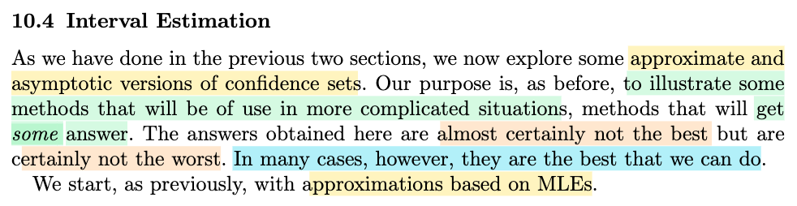
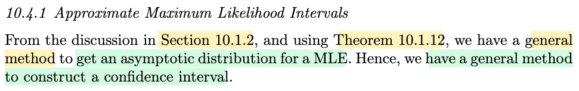
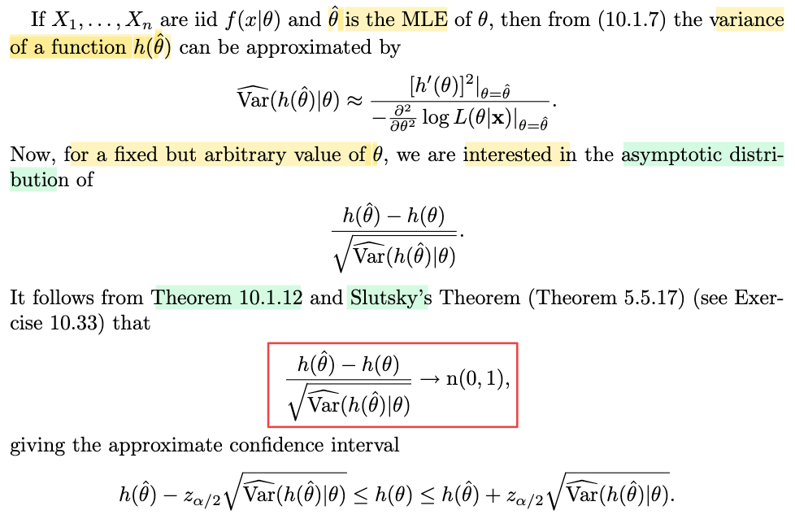
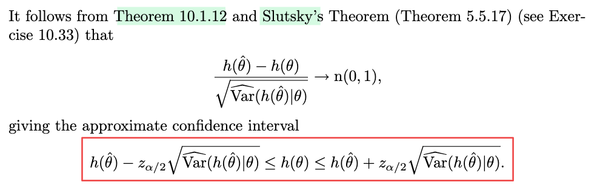

# 10.4 Interval Estimation

📊 **Progress:** `3` Notes | `4` Screenshots | `3` AI Reviews

---

 

## 10.4 Interval Estimation

<kbd></kbd>

> [!NOTE]
> Ok, qua phần 10.4. Thì đầu tiên là mình nên hiểu lại hoặc là nhìn lại những cái phần trước, hoặc là trong bối cảnh chương 10 này, để mình hiểu là mình đang làm cái gì. Thì cái ý tưởng xuyên suốt của chương 10 là muốn deal với một vấn đề. Mình lấy ví dụ, trong cái phần 10.3 đó, khi mình bàn về bài toán hypothesis testing đó, thì mình gặp một số những cái test statistic mà bản chất của nó, cái hàm phân phối, cái phân phối xác suất của nó, nó rất phức tạp. Ví dụ như đối với cái gọi là likelihood ratio test, để mà mình xem xét cái phân phối xác suất của nó, mình sẽ thấy nó phức tạp. Và từ đó nếu như mình muốn xây dựng ra một cái phép thử để đạt một cái level alpha nào đó, và thông qua đó là mình cần phải chọn ra được cái ngưỡng, thì vì mình deal với một cái bài toán mà cái xác suất là gắn với một cái statistic có cái phân phối phức tạp, nên mình sẽ rất khó để mà xác định ra chính xác cái ngưỡng nào để rồi hoàn thành để mà có được một cái phép thử mà đạt yêu cầu. 
>
>
>
> Đó. Vậy thì cái chương này nó chỉ cho mình cách để mình deal với vấn đề đó bằng cách là mình áp dụng những cái định lý, ví dụ như định lý giới hạn trung tâm, định lý luật số lớn, mà những cái định lý này nó cho phép mình có được một cái chuyện đó là khi mà số lượng mẫu nó tiến tới vô cùng, tức là vô cùng lớn, thì những cái statistic này sẽ hội tụ phân phối về phân phối chuẩn. Và như vậy có nghĩa là nếu như mình xét số lượng mẫu, phải không, kích thước mẫu ở một cái mức độ lớn, thì mình có thể coi, mình có thể được phép xấp xỉ những cái statistic đó bởi một cái random variable normal.
>
>
>
>
>
> Và từ đó là mình có thể dùng cái phân phối xác suất của Normal. Vậy thì cái phần cuối của chương 10 này sẽ là deal với cái bài toán interval estimation, không? Là cái bài toán statistical inference thứ ba ở trong ba loại là point estimation, hypothesis testing, và interval estimation. Thì ý của tác giả nói đây nè là sẽ nói về một số những phương pháp mà có thể được dùng trong những cái tình huống mà phức tạp. Và trong hầu hết trường hợp thì những cái phương pháp này nó cho ra những cái kết quả không phải là tốt nhất, nhưng trong nhiều trường hợp đây là những cái tốt nhất mà mình có.

> [!TIP]
> 🤖 **AI Check** — 🟡 Minor issues — ✅ **92/100** · ✓ Move on
>
> Ghi chú nắm rất tốt bức tranh tổng quan của chương 10 và ngữ cảnh của mục 10.4 về ước lượng khoảng xấp xỉ/tiệm cận.
>
> **🟡 Minor issues**
>
> **1.** *"Ví dụ như đối với cái gọi là likelihood ratio test... những cái statistic này sẽ hội tụ phân phối về phân phối chuẩn"*
>
> Trong kiểm định tỷ số hợp lý (Likelihood Ratio Test - LRT), thống kê kiểm định -2 log(lambda) hội tụ về phân phối Chi bình phương (theo định lý Wilks), chứ không phải phân phối chuẩn. Phân phối chuẩn thường áp dụng trực tiếp cho các ước lượng như MLE hoặc thống kê Wald/Score.
>
>
> **✓ Strengths**
> - Hiểu rất rõ logic chuyển tiếp và mối liên hệ xuyên suốt giữa ba bài toán suy diễn thống kê lớn: ước lượng điểm, kiểm định giả thuyết và ước lượng khoảng.
> - Nắm bắt chính xác thông điệp tác giả truyền tải: phương pháp tiệm cận giúp giải quyết các tình huống phức tạp để đưa ra câu trả lời khả dĩ, dù không phải tối ưu tuyệt đối nhưng thường là cách tốt nhất ta có.
>
> **💡 Deeper notes**
> - Khái niệm 'confidence sets' tổng quát hơn 'confidence intervals' vì nó bao gồm cả trường hợp tham số đa chiều hoặc không gian tham số có cấu trúc bất kỳ.

 

### Approximate Maximum Likelihood Intervals

<kbd></kbd>

<kbd></kbd>

> [!NOTE]
> Đầu tiên ta sẽ xem xét Maximum Likelihood Intervals.
>
>
>
> Gs cho biết đại ý là từ những thảo luận ở 10.1, ta đã có phương pháp chung để có phân phối tiệm cận của một MLE. Từ đó ta sẽ có thể xây dựng confidence interval.
>
>
>
> Tí nữa mình sẽ active recall chút xíu về bài toán confidence interval, và vì sao gọi là Maximum Likelihood Interval.
>
>
>
> Thế thì cho X1,...Xn iid \~ f(x|θ), θ^ là mle của θ, thì theo 10.1.6, variance của h(θ^) có thể được estimate bởi \[h'(θ)\]²|θ=θ̂ / \[-∂²/∂θ² log L(θ|𝐱)|θ=θ̂.
>
>
>
> Thử giải thích cái này, cũng là ôn lại.
>
>
>
> Còn nhớ, có một theorem (theorem 10.1.12, xem link) nói rằng, nếu Wn là MLE của τ(θ) thì nó là một **asymptotically efficient & consistent estimator.**
>
>
>
> Và theo định nghĩa của khái niệm này (xem cross-link tới định nghĩa 10.1.11), nói rằng nếu Wn asymptotically efficient estimator của τ(θ) thì: √n(Wn - τ(θ)) → (d) n(0, ν(θ)) với ν(θ) = Cramer Rao Lower Bound = \[d/dθ τ(θ)\]² / E\_θ\[(∂/∂θ log f(X|θ))²\].
>
>
>
> Và lại theo định nghĩa của asymptotically variance, nói √n(Wn - τ(θ)) → (d) n(0, ν(θ)) chính là nói Wn có assymtotically variance = ν(θ)
>
>
>
> Kết hợp 3 thứ trên thì ở đây cho θ^ là mle của θ thì h(θ^) cũng là mle của h(θ) nên phương sai tiệm cận của h(θ^):
>
>
>
> Avar(h(θ^)) = \[d/dθ h(θ)\]² / E\_θ\[(∂/∂θ log f(X|θ))²\]\]
>
>
>
> = \[h'(θ)\]² / E\_θ\[(∂/∂θ log f(X|θ))²\])
>
>
>
> Thể hiện theo toán bởi:
>
>
>
> √n\[h(θ^) - h(θ)\] → (d) n(0, \[h'(θ)\]² / E\_θ\[(∂/∂θ log f(X|θ))²\])
>
>
>
> Và như vậy, khi n lớn, Var\[√n\[h(θ^) - h(θ)\]\] ≈ \[h'(θ)\]² / E\_θ\[(∂/∂θ log f(X|θ))²\])
>
>
>
> ⇔ nVar\[h(θ^)\] ≈ \[h'(θ)\]² / E\_θ\[(∂/∂θ log f(X|θ))²\]
>
>
>
> ⇔ Var\[h(θ^)\] ≈ \[h'(θ)\]² / n E\_θ\[(∂/∂θ log f(X|θ))²\]
>
>
>
> (Vì sao n E\_θ\[(∂/∂θ log f(X|θ))² = E\_θ\[(∂/∂θ log f(𝐗|θ))², xem lại link tới Chứng minh Cramer-Rao từ Cauchy-Schwarz)
>
>
>
> ⇔ Var\[h(θ^)\] ≈ \[h'(θ)\]² / E\_θ\[(∂/∂θ log f(𝐗|θ))²\]
>
>
>
> Và một định lý khác (chính xác xem link tới bổ đề 7.3.11), đã chứng minh:
>
>
>
> E\_θ\[(∂/∂θ log f(X|θ))²\] = -E\_θ\[∂²/∂θ² log f(X|θ)\]
>
>
>
> Vậy ở trên ⇔ Var\[h(θ^)\] ≈ \[h'(θ)\]² / -E\_θ\[∂²/∂θ² log f(𝐗|θ)\]
>
>
>
> Đây là kết quả cho ta thấy công thức của Var\[h(θ^)\] (khi n lớn) chính là \[h'(θ)\]² / -(∂²/∂θ² log f(𝐗|θ)\]
>
>
>
> Và từ đó ta làm 2 động tác sau để công thức trên trở thành ESTIMATE của Var\[h(θ^)\]:
>
>
>
> i) Thay kì vọng -E\_θ\[∂²/∂θ² log f(𝐗|θ)\] ở mẫu số bởi -∂²/∂θ² log f(𝐱|θ), chính là thay vì dùng **information** **number** of sample size n, ta dùng **observed** **information** **number** (xem link tới 10.1.7)
>
>
>
> ii) thay θ bởi θ^, tức là dùng MLE của θ thay cho giá trị thật của θ.
>
>
>
> Ta sẽ có công thức estimate của Var\[h(θ^)\], kí hiệu Var^\[h(θ^)\] = \[h'(θ)\]²|θ=θ̂ / -(∂²/∂θ² log f(𝐗|θ)\] |θ=θ̂
>
>
>
> ---
>
>
>
> Bên cạnh đó, √n\[h(θ^) - h(θ)\] → (d) n(0, \[h'(θ)\]² / E\_θ\[(∂/∂θ log f(X|θ))²\]) cũng tương đương:
>
>
>
> √n\[h(θ^) - h(θ)\] → (d) h'(θ) / √E\_θ\[(∂/∂θ log f(X|θ))²\] × n(0, 1)
>
>
>
> ⇔ \[√n\[h(θ^) - h(θ)\] / h'(θ)\] / √E\_θ\[(∂/∂θ log f(X|θ))²\] → (d) n(0, 1)
>
>
>
> ⇔ \[h(θ^) - h(θ)\] / \[h'(θ) / √n√E\_θ\[(∂/∂θ log f(X|θ))²\]\] → (d) n(0, 1)
>
>
>
> ⇔ \[h(θ^) - h(θ)\] / \[h'(θ) / √nE\_θ\[(∂/∂θ log f(X|θ))²\]\] → (d) n(0, 1)
>
>
>
> ⇔ \[h(θ^) - h(θ)\] / \[h'(θ) / √E\_θ\[(∂/∂θ log f(𝐗|θ))²\]\] → (d) n(0, 1)
>
>
>
> ⇔ \[h(θ^) - h(θ)\] / SD\[h(θ^)\] → (d) n(0, 1)
>
>
>
> Và kết quả này sẽ cho thấy rằng nếu gọi σn là SD(h(θ^)) thì \[h(θ^) - h(θ)\]/σn → (d) n(0,1)
>
>
>
> Và ta dùng định lý Slusky, nói rằng nếu Xn → (d) X, Yn → (p) Y thì XnYn → (d) XY để chỉ ra rằng nếu ta thay √Var\[h(θ^)\] bởi Sn = √Var^\[h(θ^)\] thì \[Wn - h(θ)\] / √Var^\[h(θ^)\] vẫn converge phân phối về n(0,1):
>
>
>
> \[h(θ^) - h(θ)\]/σn → (d) n(0,1)
>
>
>
> Sn → (p) σn ⇔ σn/Sn → (p) 1
>
>
>
> Áp dụng Slutsky: (\[h(θ^) - h(θ)\]/σn) × (σn/Sn) → (d) n(0,1) × 1
>
>
>
> ⇔ \[h(θ^) - h(θ)\]/Sn → (d) n(0,1)
>
>
>
> Như vậy, \[h(θ^) - h(θ)\] / √Var^\[h(θ^)\] → (d) n(0,1)
>
>
>
> Đây là kết quả đóng khung đỏ mà ta muốn giải thích.
>
>
>
> ---
>
>
>
> Và như vậy, dựa trên điều này, ta sẽ có thể xây dựng một approximate confidence interval (nói tiếp ở note sau, ta sẽ ôn lại confidence interval là gì)

> [!TIP]
> 🤖 **AI Check** — 🟢 Pass — ✅ **95/100** · ✓ Move on
>
> Ghi chú rất xuất sắc, tái hiện và kết nối chính xác nguồn gốc lý thuyết của công thức tính phương sai tiệm cận (thông tin Fisher, delta method) và việc áp dụng định lý Slutsky để chuẩn hóa phân phối.
>
> **🟡 Minor issues**
>
> **1.** *"⇔ [h(θ^) - h(θ)] / [h'(θ) / √nE_θ[(∂/∂θ log f(X|θ))²]] → (d) n(0, 1)"*
>
> Lỗi gõ phím nhỏ: ở bước trung gian này bị thiếu dấu căn bậc hai ở mẫu số kỳ vọng (dòng trước đó có '√n√E', dòng sau đã gom lại thành căn của cả n mẫu nên kết quả cuối vẫn đúng).
>
> **2.** *"Sn → (p) σn ⇔ σn/Sn → (p) 1"*
>
> Cách viết hơi phi hình thức vì cả Sn và σn đều phụ thuộc vào n và tiến về 0. Về mặt toán học chuẩn mực, ta thường nhân thêm √n vào cả tử và mẫu (√n Sn →(p) √ν(θ) và √n σn = √ν(θ)), từ đó suy ra tỷ số Sn/σn →(p) 1.
>
>
> **✓ Strengths**
> - Hiểu rất rõ cơ chế chuyển dịch từ Information number (kỳ vọng) sang Observed Information (thông tin quan sát) tại θ = θ̂.
> - Kết nối chính xác các mắt xích kiến thức từ Delta method, cận Cramer-Rao đến định lý Slutsky để thu được phân phối N(0,1).
>
> **💡 Deeper notes**
> - Để tỷ số hội tụ theo xác suất về 1 và áp dụng được Slutsky, các điều kiện chính quy (regularity conditions) cần đảm bảo đạo hàm cấp hai liên tục tại lân cận của θ và luật số lớn áp dụng được cho observed information.

**🔗 See also:** [Theorem 10.1.12 (Asymptotic efficiency of MLEs)](./101_point_estimation.md#node-n1mqtrr) · [10.1.3 Calculations and Comparisons](./101_point_estimation.md#node-iwgmm5t) · [Definition 10.1.11 Asymptotic Efficiency](./101_point_estimation.md#node-bgijdqy) · [Bổ đề Tính toán Hàm mũ](./73_methods_of_evaluating_estimators.md#node-sttybm4) · [Chứng minh Cramer-Rao từ Cauchy-Schwarz](./73_methods_of_evaluating_estimators.md#node-bevjtm7)

 

#### Approximate Confidence Interval

<kbd></kbd>

> [!NOTE]
> Active recall confidence interval là gì:
>
>
>
> Trong sách này, mình hiểu chap 7,8,9 lần lượt giới thiệu 3 bài toán statistical inference: Cho random sample X1,...Xn iid \~ f(x|θ) và muốn suy luận ra giá trị của θ. Với point estimation, ta muốn xây dựng một hàm W(𝐗), để estimate cho giá trị θ, để rồi khi bỏ vào observed value của 𝐗 = 𝐱, ta sẽ có W(𝐱) là một point estimate value của θ.
>
>
>
> Với hypothesis testing, ta muốn xây dựng một hypothesis test, có bản chất chỉ là một decision rule, nhận vào giá trị observed value của 𝐗 (=𝐱) thì decision rule này sẽ đưa ra infercen là θ nằm trong Θ0 hay Θ0c (tức không reject H0 hay reject H0)
>
>
>
> Và cuối cùng, với interval estimation, ta muốn xây dựng một **random interval / random set** C(𝐗), có xác suất C(𝐗) chứa θ là bao nhiêu phần trăm mong muốn nào đó.
>
>
>
> Và khi θ là scalar, thì random set trở thành random interval, có dạng \[L(𝐗), U(𝐗)\].
>
>
>
> Dĩ nhiên, trong cả ba bài toán, ta đều phải có các cách tiếp cận sao cho có được một estimator, hypothesis test, confidence interval tốt. Do đó người ta đặt ra các yếu tố để evaluate chất lượng của chúng. Với point estimation thì thông qua các tiêu chí như unbias và có variance thấp nhất có thể (đỉnh cao là có variance đạt mức đáy Cramer Rao Lower Bound), bên cạnh đó là các tính chất như consistent, efficient, robustness. Với test thì ta muốn có level α test giúp khống chế Type I error, cũng như Type II error.
>
>
>
> Thì với confidence interval cũng vậy, ta muốn xây dựng một interval mà xác suất bắt được, chứa được h(θ) sẽ đạt mức nào đó.
>
>
>
> Do đó, ta giả sử muốn một confidence set có P(L(𝐗) ≤ h(θ) ≤ U(𝐗)) ≈ 1-α
>
>
>
> Thế thì, vì \[h(θ^) - h(θ)\] / √Var^(h(θ^|θ)) → (d) n(0,1) nên:
>
>
>
> đại khái là khi n lớn ta có thể coi nó như Z \~ n(0,1)
>
>
>
> Từ đó để có một confidence interval có xác suất bắt được h(θ) xấp xỉ 1-α (ví dụ α = 0.05, 1 - α = 0.95) ta làm như sau:
>
>
>
> Đó là L(𝐗) = h(θ^) - z\_α/2 √Var^(h(θ^|θ)) và
>
>
>
> U(𝐗) = h(θ^) + z\_α/2 √Var^(h(θ^|θ))
>
>
>
> Vì khi đó: P(L(𝐗) ≤ h(θ) ≤ U(𝐗)))
>
>
>
> = P(h(θ^) - z\_α/2 √Var^(h(θ^|θ)) ≤ h(θ) ≤ h(θ^) + z\_α/2 √Var^(h(θ^|θ)))
>
>
>
> = P(-z\_α/2 ≤ \[h(θ^) - h(θ)\] / √Var^(h(θ^|θ)) ≤ z\_α/2 )
>
>
>
> khi n → inf thì:
>
>
>
> P(-z\_α/2 ≤ \[h(θ^) - h(θ)\] / √Var^(h(θ^|θ)) ≤ z\_α/2 )
>
>
>
> → P(-z\_α/2 ≤ Z ≤ z\_α/2) và cái này = 1-α
>
>
>
> Như vậy khi n lớn P(h(θ^) - z\_α/2 √Var^(h(θ^|θ)) ≤ h(θ) ≤ h(θ^) + z\_α/2 √Var^(h(θ^|θ))) ≈ 1 - α.
>
>
>
> (Nhớ lại khái niệm z\_α, nó là mốc mà P(Z ≥ z\_α), tức phần đồ thị pdf từ mốc z\_α trở đi = α. Và vì tính đối xứng của n(0,1) nên P(Z ≤ -z\_α) cũng = α. Như vậy thì:
>
>
>
> P(-z\_α/2 ≤ Z ≤ z\_α/2 ) = 1 - P(Z ≤ -z\_α/2) - P(Z ≥ z\_α/2) = 1 - α/2 - α/2 = 1 - α.

> [!TIP]
> 🤖 **AI Check** — 🟢 Pass — ✅ **98/100** · ✓ Move on
>
> Ghi chú rất xuất sắc, hệ thống hóa bài bản mối liên hệ giữa ước lượng điểm, kiểm định giả thuyết và ước lượng khoảng, đồng thời biến đổi đại số để tìm khoảng tin cậy tiệm cận hoàn toàn chính xác.
>
> **✓ Strengths**
> - Khái quát hóa mạch lạc bức tranh tổng quan của suy diễn thống kê từ ước lượng điểm đến khoảng tin cậy.
> - Biến đổi chuẩn xác các bất đẳng thức xác suất để đưa khoảng tin cậy về dạng chuẩn hóa hội tụ theo phân phối.
> - Giải thích cặn kẽ ý nghĩa hình học và tính đối xứng của giá trị tới hạn z_{alpha/2} trên phân phối chuẩn tắc.
>
> **💡 Deeper notes**
> - Trong tài liệu gốc, định lý Slutsky đóng vai trò mấu chốt để thay thế phương sai lý thuyết Var(h(theta^)|theta) bằng ước lượng nhất quán của nó là Var^(h(theta^)|theta) mà vẫn bảo toàn sự hội tụ về n(0, 1).
> - Ký hiệu Var^(h(theta^)|theta) là một thống kê (statistic) tính từ dữ liệu mẫu X (thường bằng cách thay theta bằng theta^ trong biểu thức phương sai tiệm cận), đảm bảo hai đầu mút L(X) và U(X) không còn phụ thuộc vào tham số chưa biết theta.

 

