# 11.1 & 2  introduction, One-way Anova

📊 **Progress:** `16` Notes | `20` Screenshots | `13` AI Reviews

---

 

## Section 11.1 Introduction

<kbd>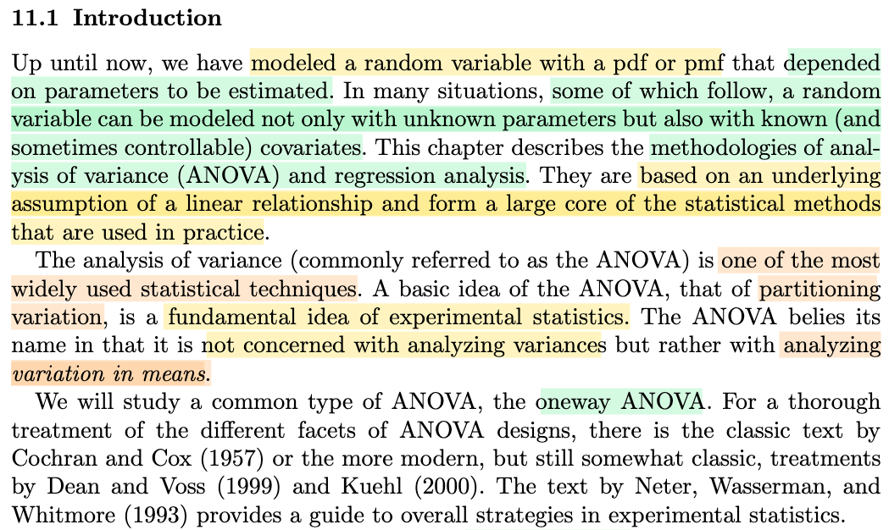</kbd>

> [!NOTE]
> Đại ý là, cho đến giờ, ta chỉ đều mô hình một random variable thông qua pdf/pmf phụ thuộc vào tham số nào đó cần estimate. Nhưng trong nhiều trường hợp, một random variable có thể được mô hình không chỉ bởi những parameter chưa biết, mà còn có thể bởi những covariate
>
>
>
> Do đó, chương này sẽ nói về những phân tích về variance và regression, dựa trên giả định quan hệ tuyến tính, và từ đó hình thành các phương pháp thống kê dùng trong thực tế.
>
>
>
> Nói chung mình chưa hiểu lắm, nhưng có vẻ như nó liên quan trực tiếp đến machine learning.
>
>
>
> Nói thêm cái tên, thật ra ko phải là phân tích variance, mà là sự biến thiên / chênh lệch giữa các giá trị trung bình

> [!TIP]
> 🤖 **AI Check** — 🟢 Pass — ✅ **95/100** · ✓ Move on
>
> Ghi chú tóm tắt rất chính xác và nắm trọn vẹn các ý chính của đoạn giới thiệu, đặc biệt là bản chất thật sự của ANOVA (phân tích sự biến thiên giữa các kỳ vọng/means).
>
> **✓ Strengths**
> - Tóm tắt chuẩn xác sự chuyển dịch từ việc mô hình hóa phân phối chỉ dựa trên tham số sang việc kết hợp thêm các biến phụ thuộc (covariates).
> - Nắm bắt chính xác điểm mấu chốt thú vị về mặt thuật ngữ: ANOVA thực chất là kiểm định sự khác biệt giữa các giá trị trung bình (means) thay vì bản thân các phương sai.
>
> **💡 Deeper notes**
> - Về mặt kỹ thuật, lý do phương pháp này vẫn mang tên là 'Analysis of Variance' (ANOVA) vì nó phân tách tổng biến thiên (partitioning variation / sum of squares) thành các nguồn khác nhau để từ đó so sánh và đưa ra kết luận về các giá trị trung bình (means).

 

### Simple Linear Regression Overview

<kbd>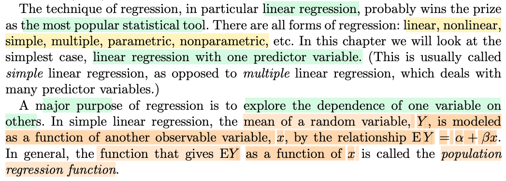</kbd>

> [!NOTE]
> Đoạn này nói sơ về việc chương này ta cũng sẽ thảo luận về bài toán regression, cụ thể là tập trung vào simple regression trong đó ta mô hình hóa mean của một random variable Y bởi hàm số của x: EY = α + βx

 

#### Oneway Analysis of Variance

<kbd>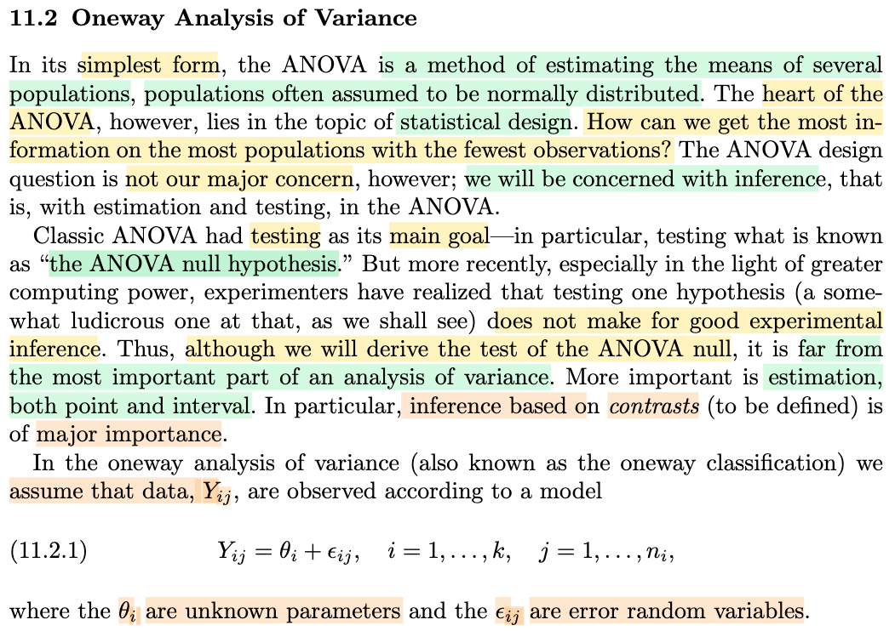</kbd>

> [!NOTE]
> Cần chú ý định nghĩa này: ANOVA là phương pháp ta **estimate mean của các population**, và các population này **thường có giả định là normal**.
>
>
>
> Lại nói tiếp, trọng tâm của ANOVA xoay quanh nhiệm vụ **statistical design**: làm thế nào để khai thác nhiều nhất hiểu biết về population trong khi **dùng ít quan sát nhất có thể**.
>
>
>
> Nhưng ở đây ta sẽ không đặt chú ý vào tác vụ này mà quan tâm đến bài toán inference: Estimation và testing.
>
>
>
> Nói đại ý là với ANOVA cổ điển thì mục đích chính của nó là xoay quanh phép kiểm định giả thiết (với null hypothesis là gọi là ANOVA null) nhưnng ngày nay thì phép inference quan trọng lại là estimation (point và interval)
>
>
>
> Nói chung là chỉ là nói sơ, ta sẽ hiểu rõ hơn ở phần sau.
>
>
>
> Tuy nhiên cần biết **oneway ANOVA** dựa trên **giả định** là Yij = θi + εij với θi là tham số chưa biết, và εij là error random variable.

> [!TIP]
> 🤖 **AI Check** — 🟢 Pass — ✅ **95/100** · ✓ Move on
>
> Ghi chú tóm tắt rất tốt và chính xác nội dung giới thiệu về ANOVA một yếu tố (oneway ANOVA), từ sự dịch chuyển mục tiêu từ kiểm định sang ước lượng cho đến mô hình cơ sở.
>
> **✓ Strengths**
> - Nắm bắt chính xác sự khác biệt giữa quan điểm ANOVA cổ điển (tập trung kiểm định giả thiết null) và quan điểm hiện đại (chú trọng ước lượng điểm và khoảng).
> - Ghi lại đúng dạng mô hình tổng quát của oneway ANOVA cùng ý nghĩa của các thành phần theta_i và sai số ngẫu nhiên epsilon_ij.
>
> **💡 Deeper notes**
> - Về mặt giả định mô hình, các quần thể thường được giả định tuân theo phân phối chuẩn (normal distribution).
> - Trong suy diễn thống kê hiện đại cho ANOVA, bài giảng đặc biệt nhấn mạnh tầm quan trọng của suy diễn dựa trên các tương phản (contrasts).

**🔗 See also:** [Oneway ANOVA Assumptions](#node-2zo08q5)

 

##### Example 11.2.1 Oneway ANOVA

<kbd>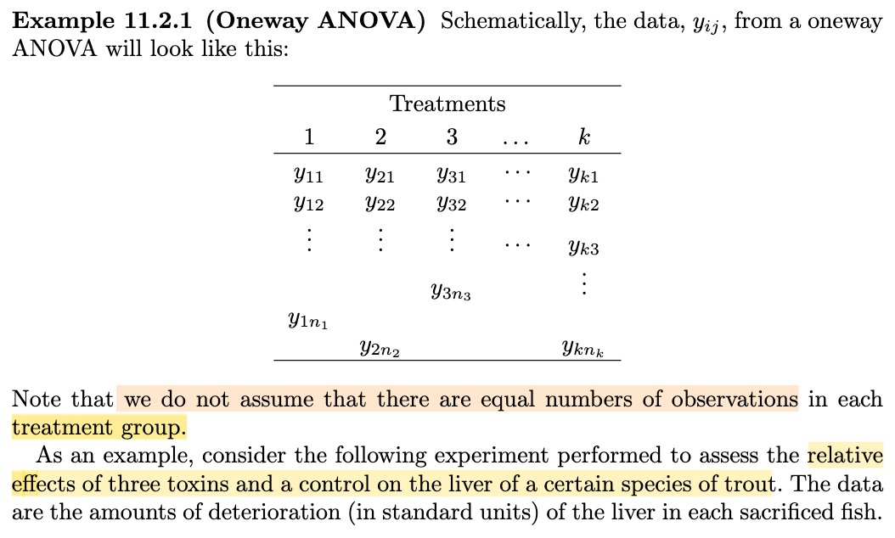</kbd>

<kbd>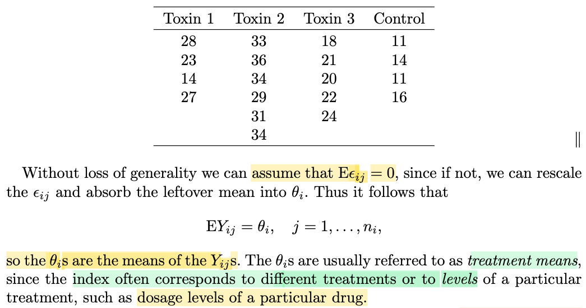</kbd>

> [!NOTE]
> Đại ý là phần này cho ta thấy một bộ dữ liệu cho Oneway ANOVA sẽ trông như thế này, và lưu ý rằng ta không assume số quan sát của mỗi nhóm điều trị là bằng nhau.
>
>
>
> Ta có thể giả định E(εij) = 0 mà không làm mất tính tổng quát. Do đó E\[Yij\] = E\[θi + εij\] = E\[θi\] + E\[εij\] (do linearity) = E\[θi\] = θi
>
>
>
> Cuối cùng, là người ta gọi θi là treatment mean = tạm dịch là trung bình của một loại điều trị / thử nghiệm (chữ treatment có có thể hiểu là lọai - class, để rồi ta có nhiều loại khác nhau, và θi là trung bình của lọai i)
>
>
>
> Ví dụ: Thử nhiều loại thuốc khác nhau, thì θi là giá trị trung bình môt (chỉ số nào đó) của class i
>
>
>
> Hoặc dùng thuốc với nhiều loại liều lượng khác nhau

> [!TIP]
> 🤖 **AI Check** — 🟡 Minor issues — ✅ **95/100** · ✓ Move on
>
> Ghi chú tóm tắt rất tốt và chính xác nội dung cơ bản của bảng dữ liệu Oneway ANOVA cũng như ý nghĩa của treatment mean.
>
> **🟡 Minor issues**
>
> **1.** *"E[Yij] = E[θi + εij] = E[θi] + E[εij] (do linearity) = E[θi]"*
>
> Trong mô hình fixed-effects ANOVA thông thường, θi là một tham số hằng số (fixed parameter), không phải biến ngẫu nhiên, nên kỳ vọng của nó bằng chính nó: E[θi] = θi. Bạn nên viết bước cuối là = θi để chuẩn xác về mặt toán học.
>
>
> **✓ Strengths**
> - Nắm rõ lưu ý quan trọng rằng số lượng quan sát ở các nhóm không nhất thiết phải bằng nhau (unbalanced design).
> - Hiểu đúng bản chất của θi là treatment mean và liên hệ thực tế tốt với các mức liều lượng hoặc phân loại điều trị.
>
> **💡 Deeper notes**
> - Việc giả định E[εij] = 0 'without loss of generality' dựa trên việc nếu sai số có kỳ vọng khác 0, giá trị kỳ vọng đó hoàn toàn có thể được gộp (absorb) vào tham số trung bình nhóm θi.

 

###### The Overparameterized Model

<kbd>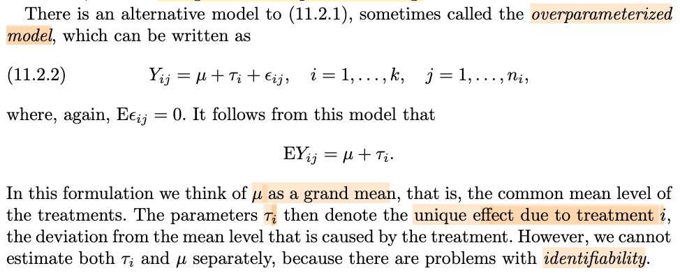</kbd>

> [!NOTE]
> Một dạng khác, được gọi là overparameterized model: Yij = μ + τi + εij
>
>
>
> Với μ gọi là grand mean
>
>
>
> τi là hiệu ứng duy nhất của mỗi treatment i

 

###### Definition 11.2.2 Identifiability

<kbd>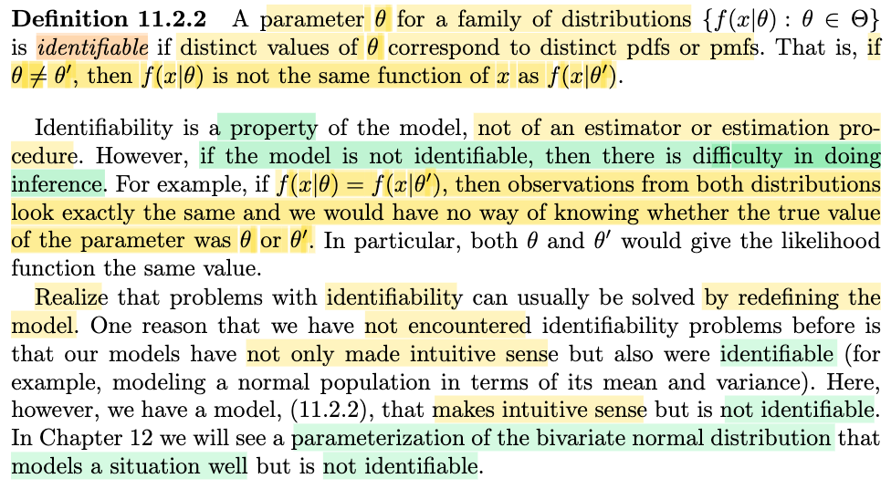</kbd>

> [!NOTE]
> Định nghĩa về cái gọi là identifiable - là một tính chất của một họ các distribution. Nói ngắn gọn là, nếu họ các distribution có tính chất này, thì với các θ khác nhau thì f(x|θ) sẽ khác nhau. Và từ đó giúp cho bài toán inference có thể thuận lợi.
>
>
>
> Ngược lại, nếu không có tính identifiable, thì có thể với θ và θ' khác nhau nhưng f(x|θ) và f(x|θ') giống nhau. Khi đó, việc quan sát được data, sẽ khó có thể suy luận ra nó đến từ f(x|θ) hay f(x|θ').
>
>
>
> Và ta nhớ khái niệm likelihood, L(θ|x) là hàm theo θ, define bởi f(x|θ), thì cái vừa nói chính là L(θ'|x) = L(θ|x), tức là cả hai θ và θ' đều có độ hợp lý như nhau
>
>
>
> Và trước giờ ta chưa bàn đến khái niệm này vì đều chọn mô hình identifiable. Nhưng sắp tới thì sẽ gặp những mô hình không identifiable.

> [!TIP]
> 🤖 **AI Check** — 🟡 Minor issues — ✅ **90/100** · ✓ Move on
>
> Ghi chú nắm rất tốt bản chất trực giác của tính định danh (identifiability) và mối liên hệ với hàm likelihood trong bài toán thống kê suy luận.
>
> **🟡 Minor issues**
>
> **1.** *"với các θ khác nhau thì f(x|θ) sẽ khác nhau"*
>
> Về mặt hình thức, hai phân phối khác nhau nghĩa là hai hàm số f(·|θ) và f(·|θ') khác nhau (tức tồn tại x để giá trị khác nhau, hoặc khác nhau trên một tập có xác suất dương), chứ không nhất thiết f(x|θ) phải khác f(x|θ') tại mọi điểm x.
>
>
> **✓ Strengths**
> - Hiểu chính xác bản chất của mô hình có tính định danh: các tham số khác nhau phải tương ứng với các phân phối xác suất khác nhau.
> - Liên hệ rất trực quan giữa việc bất định danh với hàm likelihood: khi hai tham số sinh ra cùng một phân phối, likelihood của chúng bằng nhau với mọi dữ liệu x, khiến không thể phân biệt nghiệm tốt nhất.
>
> **💡 Deeper notes**
> - Với biến liên tục, tính đồng nhất của hai phân phối f(·|θ) = f(·|θ') được xét theo nghĩa bằng nhau hầu khắp nơi (almost everywhere) theo độ đo chuẩn, do giá trị hàm mật độ tại một vài điểm rời rạc có thể thay đổi mà không làm thay đổi bản chất phân phối xác suất.

 

###### Identifiability in ANOVA Models

<kbd>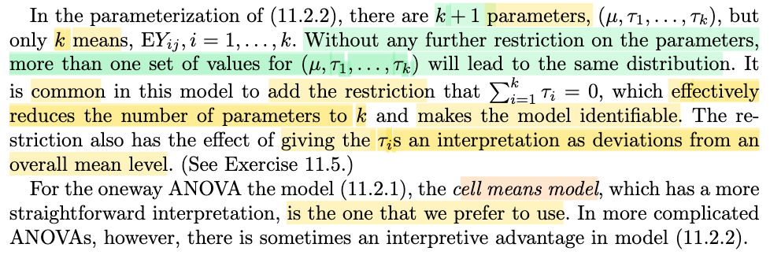</kbd>

> [!NOTE]
> Cuối cùng đại ý là nói rằng cái mô hình thứ hai, sẽ không identifiable, trừ khi ta add thêm vài ràng buộc.
>
>
>
> Nhưng đại ý vẫn là, ta sẽ ưu tiên dùng cái mô hình thứ nhất hơn (Yij = θi + εij), cái này gọi là cell means model.

> [!TIP]
> 🤖 **AI Check** — 🟢 Pass — ✅ **95/100** · ✓ Move on
>
> Ghi chú tóm tắt rất chính xác ý chính của đoạn văn: mô hình tham số thứ hai (effects model) bị thiếu tính định danh nếu không có ràng buộc, và trong ANOVA một yếu tố thì mô hình trung bình ô (cell means model) được ưu tiên sử dụng hơn.
>
> **✓ Strengths**
> - Nắm đúng vấn đề then chốt về tính không định danh (identifiability) của mô hình nếu không áp thêm ràng buộc.
> - Hiểu rõ sự ưu tiên dành cho mô hình cell means trong bài toán phân tích phương sai một yếu tố (oneway ANOVA).
>
> **💡 Deeper notes**
> - Đoạn văn có nêu thêm một lưu ý: việc ưu tiên 'cell means model' áp dụng cụ thể cho oneway ANOVA; đối với các mô hình ANOVA phức tạp hơn (nhiều yếu tố, tương tác), mô hình thứ hai (effects model) đôi khi lại mang lại lợi thế về mặt diễn giải ý nghĩa.

 

###### Oneway ANOVA Assumptions

<kbd>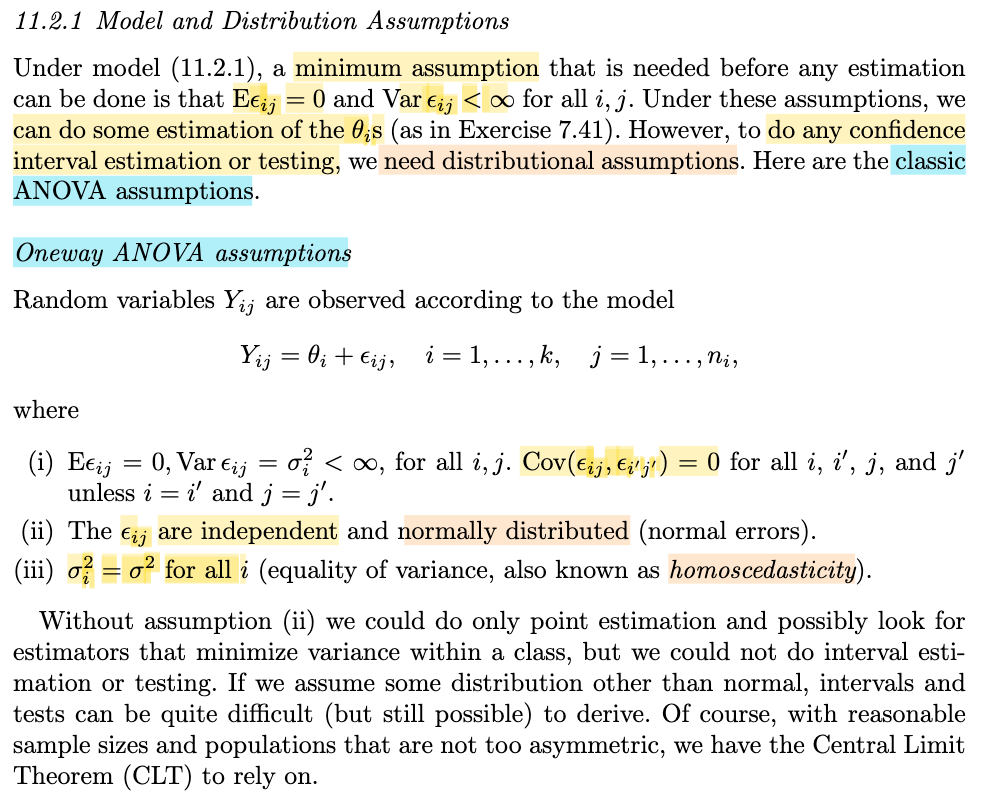</kbd>

> [!NOTE]
> Đại khái là, để mà có thể thực hiện cả point + interval estimation và testing (tức là cả ba dạng inference) thì ta cần một giả định gọi là giả định ANOVA:
>
>
>
> Cụ thể ở đây là Oneway ANOVA assumption như sau:
>
>
>
> i) E\[εij\] = 0, Var(εij) = σi² &lt; ∞ với mọi i,j. Và Cov(εij, εi'j') = 0 với mọi i,j,i',j' trừ khi i=i', j=j'
>
>
>
> Là sao: Là error random variable là zero mean, variance finite, và uncorrelate (covariance) giữa hai error khác nhau là bằng 0.
>
>
>
> ii) Các error random variable εij độc lập và có phân phối NormalL εij
>
>
>
> iii) Variance của chúng bằng nhau σi² bằng nhau với mọi i
>
>
>
> Như vậy có nghĩa là εij đều iid với mọi i,j (independent do ý (ii) và có cùng \~ n(0, σ²) do ý (ii)(iii)
>
>
>
> Nói chung đại ý đoạn cuối là để có point estimation ta chỉ cần ý i) là đủ, nhưng để có đủ bộ interval estimation và testing thì cần cả 3 ý.
>
>
>
> Thêm nữa, nếu ta ko thể giả định normal, mà dùng một distribution khác, thì về toán sẽ khá khó, tuy nhiên nếu có sample size phù hợp, thì CLT sẽ có thể được áp dụng.

> [!TIP]
> 🤖 **AI Check** — 🟢 Pass — ✅ **95/100** · ✓ Move on
>
> Ghi chú tóm tắt rất chính xác và súc tích các giả định của Oneway ANOVA, đồng thời tổng hợp chuẩn xác việc các sai số là i.i.d. theo phân phối chuẩn N(0, σ²).
>
> **✓ Strengths**
> - Hiểu đúng mục đích: để thực hiện được kiểm định và ước lượng khoảng (interval estimation & testing) thì bắt buộc cần thêm các giả định phân phối thay vì chỉ ước lượng điểm.
> - Tổng hợp chính xác cả 3 điều kiện thành kết luận then chốt: các sai số ε_ij độc lập cùng phân phối chuẩn i.i.d. N(0, σ²).
>
> **💡 Deeper notes**
> - Về mặt kỹ thuật, ước lượng điểm (point estimation) chỉ cần giả định tối thiểu là E[ε_ij] = 0 và phương sai hữu hạn, không nhất thiết phải cần phân phối chuẩn.
> - Đoạn cuối giáo trình có mở rộng: khi không có giả định phân phối chuẩn hoàn hảo, Định lý Giới hạn Trung tâm (CLT) vẫn cho phép suy diễn xấp xỉ nếu cỡ mẫu đủ lớn và phân phối không quá lệch.

**🔗 See also:** [Oneway Analysis of Variance](#node-bbj2x4f)

 

###### Section 11.2 Oneway Analysis of Variance

<kbd>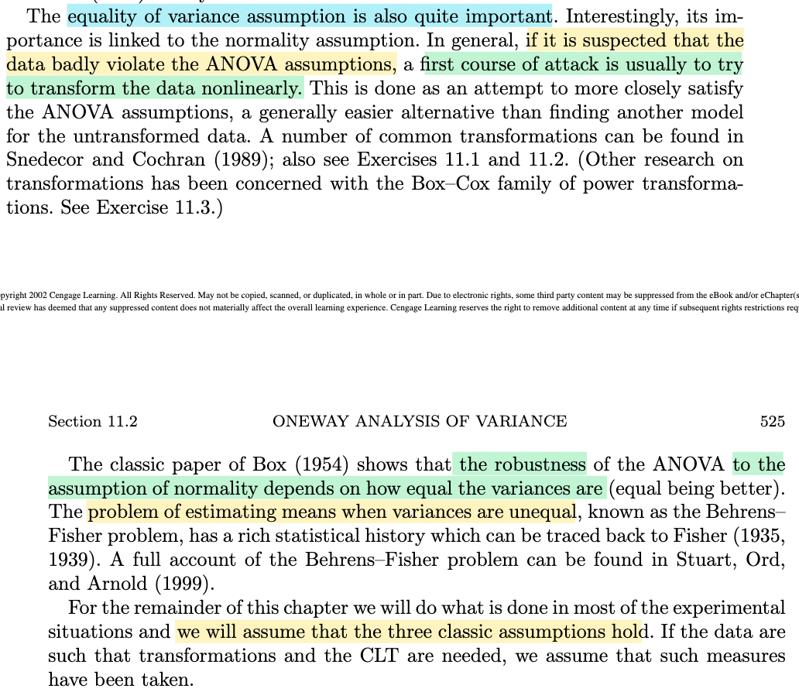</kbd>

> [!NOTE]
> Rồi, đại khái á là cái giả định mà variance nó giống nhau á thì là cái giả định quan trọng nhất. Okay. Thế thì đại ý là nói chung á, nếu như mà mình thấy dữ liệu nó vi phạm cái giả định ANOVA đó thì cái hành động đầu tiên đó là mình sẽ biến đổi dữ liệu phi tuyến. Đó, để cho nó khiến cho dữ liệu nó trở nên gần với ANOVA assumption hơn, phải không? Thì cái này nó dễ hơn là so với việc đi kiếm một cái mô hình khác. 
>
>
>
> Rồi, có đề cập tới một cái nghiên cứu của ông Box năm 1954 đại ý rằng á là nói về cái tính chất robustness của ANOVA đó đối với cái giả định dữ liệu theo phân phối chuẩn á, nó sẽ tùy theo là cái phương sai thực tế nó có bằng nhau thật hay không. 
>
>
>
> Và trong cái phần còn lại của cái chương này là mình sẽ luôn luôn là dùng cái giả định đầy đủ, phải không? Dùng cái giả định ANOVA đầy đủ.

> [!TIP]
> 🤖 **AI Check** — 🟡 Minor issues — ⚠️ **88/100** · ✓ Move on
>
> Ghi chú nắm rất tốt các ý chính về cách xử lý khi vi phạm giả định ANOVA, biến đổi phi tuyến và nghiên cứu của Box (1954). Có một điểm chưa chuẩn xác nhỏ khi bạn phóng đại tầm quan trọng của giả định đẳng phương sai thành 'quan trọng nhất'.
>
> **🟡 Minor issues**
>
> **1.** *"cái giả định mà variance nó giống nhau á thì là cái giả định quan trọng nhất"*
>
> Sách chỉ viết 'is also quite important' (cũng khá quan trọng) chứ không nói đây là giả định 'quan trọng nhất'. Trên thực tế, trong các phân tích ANOVA, giả định về tính độc lập thường nhạy cảm và nghiêm ngặt nhất.
>
>
> **✓ Strengths**
> - Hiểu đúng giải pháp đầu tiên khi vi phạm giả định ANOVA là thực hiện biến đổi dữ liệu phi tuyến (nonlinear transformation) thay vì vội tìm mô hình khác phức tạp hơn.
> - Tóm tắt chính xác kết luận từ bài báo của Box (1954) về mối liên hệ giữa tính vững (robustness) đối với phân phối chuẩn và mức độ bằng nhau của các phương sai.
>
> **💡 Deeper notes**
> - Ba giả định cổ điển (three classic assumptions) của ANOVA gồm: tính độc lập (independence), phân phối chuẩn (normality), và phương sai bằng nhau (homogeneity of variances).
> - Trường hợp phương sai không bằng nhau khi so sánh trung bình giữa các nhóm dẫn đến bài toán nổi tiếng trong thống kê gọi là bài toán Behrens–Fisher.

 

###### The Classic ANOVA Hypothesis

<kbd>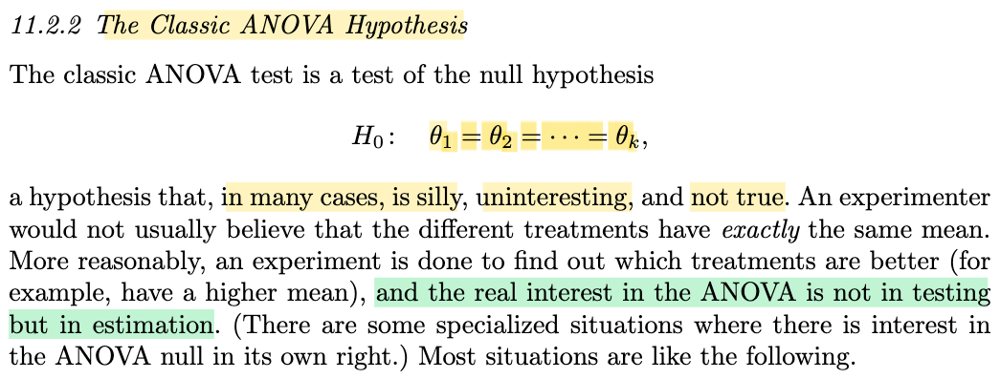</kbd>

<kbd>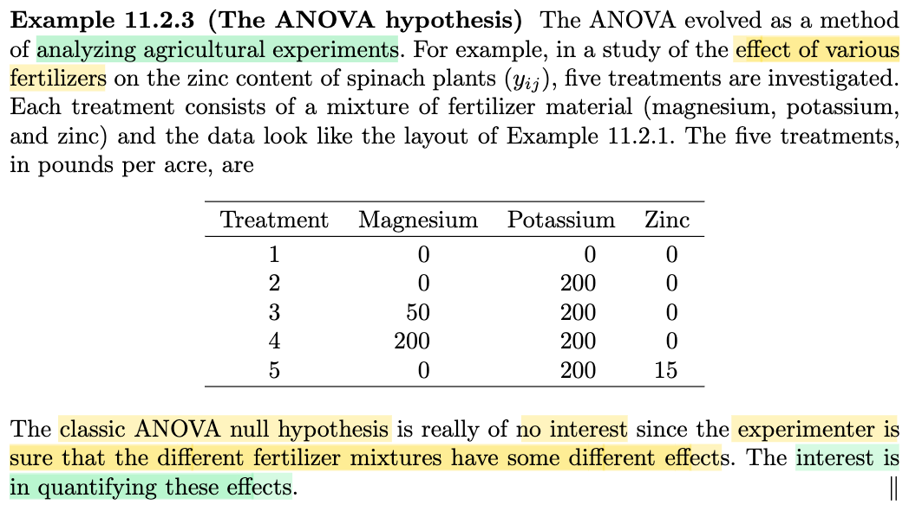</kbd>

<kbd>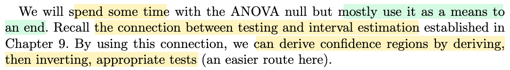</kbd>

> [!NOTE]
> Đại khái, ở đây, tác giả giới thiệu cho ta cái gọi là phép kiểm định ANOVA cổ điển (the classic ANOVA test), và nó là phép kiểm định cho bài tóan hypothesis testing với null hypothesis sau: H0: θ1 = θ2 = ...= θk
>
>
>
> Ông cho biết, trong phần nhiều trường hợp thì cái null hypothesis này nó rất silly (ngớ ngẩn), vì một experimenter thường sẽ không tin rằng các loại treatment khác nhau lại có chung mean, mà cái mà người ta quan tâm thường là đi tìm xem cái nào tốt hơn. Do đó, bài toán inference mà người ta muốn làm hơn là estimation, chứ không phải testing.
>
>
>
> Lấy ví dụ này, tác giả cho biết thật ra thì ANOVA được phát triển nhằm tạo một công cụ để phân tích các thử nghiệm nông nghiệp. Ví dụ như xem thử các loại phân bón khác nhau có hiệu quả thế nào. Cho nên thật sự thì đại khái là người ta không ai quan tâm đến việc kiểm tra xem ANOVA null hypothesis có đúng hay không, vì hầu hết đều tin chắc là các loại phân bón khác nhau (hỗn hợp các thành phần khác nhau) đều sẽ có các hiệu qủa khác nhau (đồng nghĩa rằng họ biết thừa null hypothesis là sai. Mà cái họ quan tâm là làm sao để định lượng được những sự khác nhau này.

> [!TIP]
> 🤖 **AI Check** — 🟢 Pass — ✅ **95/100** · ✓ Move on
>
> Ghi chú tóm tắt rất chính xác tinh thần và ý tưởng cốt lõi của tác giả về giả thuyết null trong ANOVA cổ điển cũng như sự chuyển hướng từ kiểm định sang ước lượng định lượng hiệu ứng.
>
> **✓ Strengths**
> - Hiểu đúng bản chất của giả thuyết null trong ANOVA cổ điển ($H_0: \theta_1 = \theta_2 = \dots = \theta_k$) và lý do thực tế khiến nó thường không hấp dẫn đối với các nhà thực nghiệm.
> - Nắm rõ trọng tâm thực sự của ANOVA trong hầu hết các ứng dụng thực tế là bài toán ước lượng và định lượng mức độ sai khác (estimation/quantification) thay vì chỉ kiểm định bác bỏ $H_0$.
>
> **💡 Deeper notes**
> - Tác giả có lưu ý một ngoại lệ nhỏ trong ngoặc đơn: vẫn tồn tại một số ngữ cảnh chuyên biệt (specialized situations) mà người ta thực sự quan tâm đến bản thân giả thuyết null của ANOVA.

 

###### Inverting Tests for Confidence Regions

<kbd>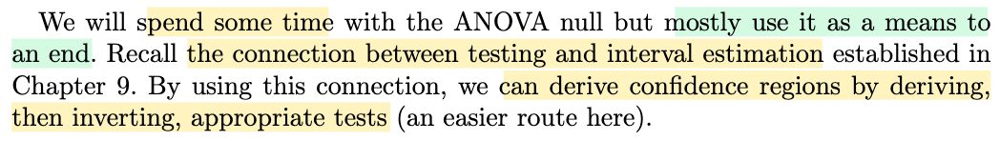</kbd>

> [!NOTE]
> Đây là dịp để active recall về quan hệ giữa hypothesis testing và interval estimation
>
>
>
> Đại khái là, giả sử ta có một bài toán hypothesis testing: H0: θ=θ0 vs H1: θ≠ θ0. Và ta đã có một phép thử có level α. Ta có thể invert nó để tạo một interval estimation.
>
>
>
> Phép thử, thể hiện bởi rejection region R, là tập {𝐱 ∈ 𝓧: reject H0} 
>
>
>
> một phép kiểm định giải thuyết về cơ bản chỉ là một hàm phân loại: f(𝐱) reject H0 or not reject H0 
>
>
>
> thì acceptance region Rc = A(θ0) = {𝐱 ∈ 𝓧: accept θ=θ0} 
>
>
>
> ví von tập các chàng trai 𝐱 thích cô gái θ0
>
>
>
> đặt tập C(𝐱) = {θ: 𝐱 ∈ A(θ)}
>
>
>
> giống như là tập hợp các cô gái θ mà anh 𝐱 thích.
>
>
>
> thì do định nghĩa này, dĩ nhiên 𝐱 ∈ A(θ) ⇔ θ ∈ C(𝐱)
>
>
>
> Ví dụ nếu anh chàng 𝐱 thích cô θ (thể hiện bởi 𝐱 ∈ A(θ)) thì dĩ nhiên cô đó (θ) phải nằm trong list các cô mà anh 𝐱 thích (thể hiện bởi θ ∈ C(𝐱)). Và ngược lại, nếu có cô θ nằm trong list các cô mà anh 𝐱 thích (θ ∈ C(𝐱)) thì đương nhiên anh chàng 𝐱 phải nằm trong số những anh thích cô 𝐱 (𝐱 ∈ A(θ))
>
>
>
> ---
>
>
>
> C(𝐗) random set
>
>
>
> Level α test
>
>
>
> Type I error: θ ∈ Θ0, mà mình lại reject H0
>
>
>
> P\_θ(𝐗 ∈ R) và θ ∈ Θ0 (𝐗 = X1,X2,... \~ f(x|θ)
>
>
>
> P\_θ0(𝐗 ∈ R) ≤ α
>
>
>
> ⇔ 1 - P\_θ0(𝐗 ∈ Rc) ≤ α
>
>
>
> ⇔  P\_θ0(𝐗 ∈ Rc) ≥ 1 - α
>
>
>
> ⇔  P\_θ0(𝐗 ∈ A(θ0)) ≥ 1 - α
>
>
>
> 𝐱 ∈ A(θ) ⇔ θ ∈ C(𝐱) 
>
>
>
> Về bản chất 𝐗 ∈ A(θ0) = {s ∈ S: 𝐗(s) = 𝐱, 𝐱 ∈ A(θ0)}
>
>
>
> = {s ∈ S: 𝐗(s) = 𝐱, θ0 ∈ C(𝐱)}
>
>
>
> = θ0 ∈ C(𝐗)
>
>
>
> ⇒ P\_θ0(𝐗 ∈ A(θ0)) = P\_θ0(θ0 ∈ C(𝐗))
>
>
>
> ⇔  P\_θ0(θ0 ∈ C(𝐗)) ≥ 1 - α
>
>
>
> ⇔  P\_θ(θ ∈ C(𝐗)) ≥ 1 - α
>
>
>
> Coverage probability P\_θ(C(𝐗) chứa θ)
>
>
>
> Confidence coefficient inf\_θ P\_θ(C(𝐗) = 1-α
>
>
>
> Nên C(𝐗) gọi là 1-α confidence interval

📹 [Xem video trên YouTube](https://www.youtube.com/watch?v=iyUvmtl4bpg)

> [!TIP]
> 🤖 **AI Check** — 🟢 Pass — ✅ **95/100** · ✓ Move on
>
> Ghi chú thể hiện sự hiểu biết rất xuất sắc và chính xác về mối liên hệ đối ngẫu giữa kiểm định giả thuyết và khoảng tin cậy (test inversion), với trực giác và các bước biến đổi xác suất chặt chẽ.
>
> **🟡 Minor issues**
>
> **1.** *"Confidence coefficient inf_θ P_θ(C(𝐗) = 1-α"*
>
> Lỗi nhỏ về ký hiệu: thiếu dấu ngoặc và 'chứa θ', đúng ra là inf_θ P_θ(θ ∈ C(𝐗)) ≥ 1 - α.
>
> **2.** *"những anh thích cô 𝐱 (𝐱 ∈ A(θ))"*
>
> Typo nhỏ ở câu ví von: 'cô 𝐱' thay vì 'cô θ'.
>
>
> **✓ Strengths**
> - Diễn giải trực quan sinh động và chính xác về quan hệ đối ngẫu x ∈ A(θ) ⇔ θ ∈ C(x).
> - Trình bày chi tiết và chuẩn xác derivation toán học chứng minh xác suất bao phủ P_θ(θ ∈ C(X)) ≥ 1 - α từ mức ý nghĩa kiểm định α.
>
> **💡 Deeper notes**
> - C(X) tổng quát là confidence region (miền tin cậy), không nhất thiết luôn là một khoảng liên tục (interval) trừ khi acceptance region thỏa mãn một số tính chất hình học nhất định.

 

###### Breaking Down ANOVA Hypotheses

<kbd>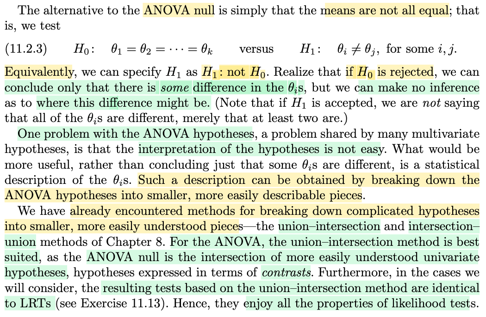</kbd>

> [!NOTE]
> Đại ý là với H0 của classic ANOVA hypothesis test: θis bằng nhau hết thì H1 (alternative hypothesis) sẽ là: chúng không bằng nhau, hay, có sự khác nhau nào đó giữa các θis.
>
>
>
> Thế thì ý chính muốn nói, một vấn đề của các giả thuyết ANOVA là rất khó diễn giải, ví dụ nói rằng các θis khác nhau chẳng ích lợi gì. 
>
>
>
> Do đó, người ta muốn bẻ nhỏ cái hypothesis này ra thành các hypothesis con dễ giải thích hơn, và công cụ phù hợp là union-intersection.
>
>
>
> Lí do là bởi ANOVA null hypothesis là intersection của các hypothesis con dễ hiểu hơn, mà có thể được biểu thị bởi khái niệm contrasts
>
>
>
> Hơn nữa, ta sẽ thấy trong test có được dựa theo phương pháp này sẽ chính là LRTs, nên sẽ thừa hưởng mọi tính chất tốt của LRT.

> [!TIP]
> 🤖 **AI Check** — 🟢 Pass — ✅ **100/100** · ✓ Move on
>
> Ghi chú tóm tắt rất chính xác và súc tích nội dung cốt lõi của đoạn văn bản về hạn chế của giả thuyết ANOVA truyền thống và động lực áp dụng phương pháp union-intersection.
>
> **✓ Strengths**
> - Hiểu chính xác bản chất của giả thuyết đối H1 trong ANOVA là chỉ cần tồn tại ít nhất một cặp khác nhau chứ không nhất thiết tất cả phải khác nhau.
> - Nắm bắt đúng vấn đề cốt lõi về mặt thực hành: bác bỏ H0 chỉ cho biết có sự khác biệt nhưng không chỉ ra được khác biệt nằm ở đâu.
> - Xác định đúng giải pháp được đề xuất là phân rã giả thuyết phức tạp thành các thành phần nhỏ hơn thông qua phương pháp union-intersection.
>
> **💡 Deeper notes**
> - Trong văn bản gốc, các giả thuyết con được phân rã cụ thể thông qua khái niệm 'contrasts' (đối chứng tuyến tính), và kiểm định theo phương pháp union-intersection ở đây tương đương với kiểm định tỷ số hợp lý (LRT).

 

###### Definition 11.2.4 Contrasts and Linear Combinations

<kbd>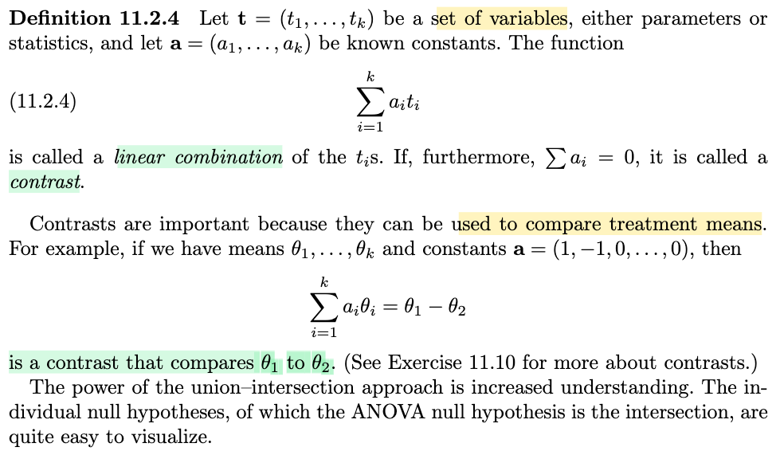</kbd>

> [!NOTE]
> Tiếp theo là định nghĩa của khái niệm contrast, cũng dễ hiểu, đại ý nó là một tổ hợp tuyến tính có tổng hệ số bằng 0. tác dụng của nó là có thể dùng để so sánh.
>
>
>
> Ví dụ ta có bộ θ1,θ2,...θk
>
>
>
> thì dùng contrast 𝐚 = (1,-1,0,..0) thì Σi ai θi = θ1-θ2 sẽ có thể dùng để so sánh θ1 và θ2 (bằng cách xem Σi ai θi dương hay âm)

> [!TIP]
> 🤖 **AI Check** — 🟢 Pass — ✅ **100/100** · ✓ Move on
>
> Ghi chú nắm rất chính xác định nghĩa contrast (tổ hợp tuyến tính có tổng hệ số bằng 0) và hiểu rõ trực giác ứng dụng để so sánh các giá trị trung bình.
>
> **✓ Strengths**
> - Nắm chuẩn xác định nghĩa toán học của contrast là tổ hợp tuyến tính với tổng hệ số triệt tiêu (sum of coefficients = 0).
> - Hiểu đúng bản chất ứng dụng so sánh thông qua việc lấy hiệu giữa hai tham số cụ thể.
>
> **💡 Deeper notes**
> - Trong thống kê suy luận (như phân tích sau ANOVA), contrast thường được dùng để kiểm định giả thuyết H0: sum(a_i * theta_i) = 0 hoặc dựng khoảng tin cậy, thay vì chỉ xét dấu trực tiếp, nhằm kiểm soát sai số ngẫu nhiên từ mẫu.

 

###### Theorem 11.2.5 Parameter Contrasts

<kbd>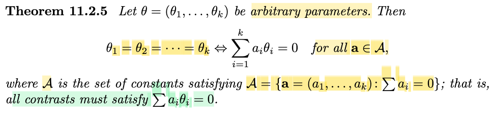</kbd>

<kbd>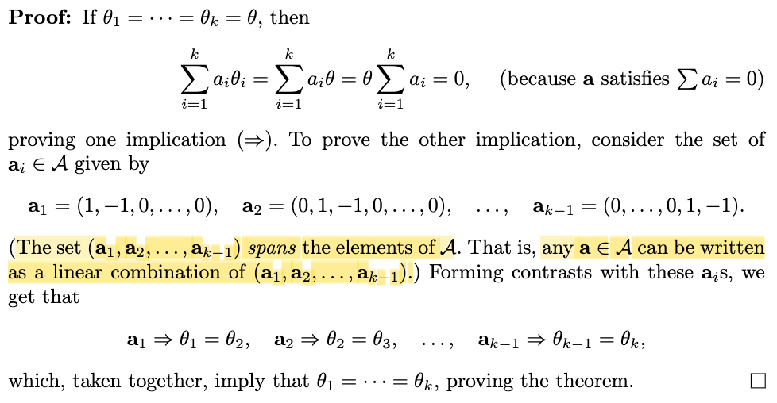</kbd>

> [!NOTE]
> Theorem này, nói rằng cho θ = (θ1,...θk) thì θis bằng nhau hết khi và chỉ khi mọi contrast bất kì (tức tổ hợp tuyến tính Σi aiθi với bộ hệ số ai có tổng bằng 0 bất kì) đều bằng 0.
>
>
>
> Chứng minh đại ý là vầy:
>
>
>
> Chứng minh chiều đi: θ = (θ1,...θk) thì θis bằng nhau ⇒ mọi contrast bất kì đều bằng 0
>
>
>
> Vì θ1=θ2=...=θk (đặt là giá trị chung này là θ), thì dĩ nhiên contrast bất kì Σi aiθi sẽ bằng θ Σi ai, và cái này bằng 0 do Σi ai theo định nghĩa contrast.
>
>
>
> Chứng minh chiều ngược lại: mọi contrast bất kì đều bằng 0 ⇒ θis bằng nhau
>
>
>
> Ta có với mọi 𝐚 ∈ 𝒜 thì 𝐚ᵀ𝛉 đều bằng 0 nên nó đúng với cả các vector 𝐚1, 𝐚2,...𝐚k sau đây:
>
>
>
> 𝐚1 = (1,-1,0,0...0), 𝐚2 = (0,1,-1,0...0),..., 𝐚k-1 = (0,0,0...1,-1)
>
>
>
> nên 𝐚1ᵀ𝛉 = 0 ⇒ θ1 = θ2
>
>
>
> 𝐚2ᵀ𝛉 = 0 ⇒ θ2 = θ3,
>
>
>
> ...
>
>
>
>
>
> Vậy suy ra mọi θis đều bằng nhau.

> [!TIP]
> 🤖 **AI Check** — 🟡 Minor issues — ✅ **95/100** · ✓ Move on
>
> Ghi chú nắm rất chắc nội dung định lý và ý tưởng chứng minh hai chiều một cách ngắn gọn, chính xác.
>
> **🟡 Minor issues**
>
> **1.** *"nó đúng với cả các vector 𝐚1, 𝐚2,...𝐚k sau đây"*
>
> Có một lỗi đánh máy nhỏ: chỉ có k - 1 vector cơ sở dạng này (từ a1 đến a_{k-1}) như bạn đã liệt kê đúng ở ngay dòng phía dưới.
>
>
> **✓ Strengths**
> - Nắm chuẩn định nghĩa contrast và phát biểu tương đương của định lý.
> - Trình bày mạch lạc, chính xác cả hai chiều chứng minh của định lý.
>
> **💡 Deeper notes**
> - Trong chứng minh gốc, tập hợp {a1, ..., a_{k-1}} tạo thành một cơ sở sinh ra toàn bộ không gian contrast A (có số chiều k - 1), giải thích vì sao chỉ cần kiểm tra k - 1 vector này là đủ bao quát.

 

###### ANOVA Hypotheses via Contrasts

<kbd>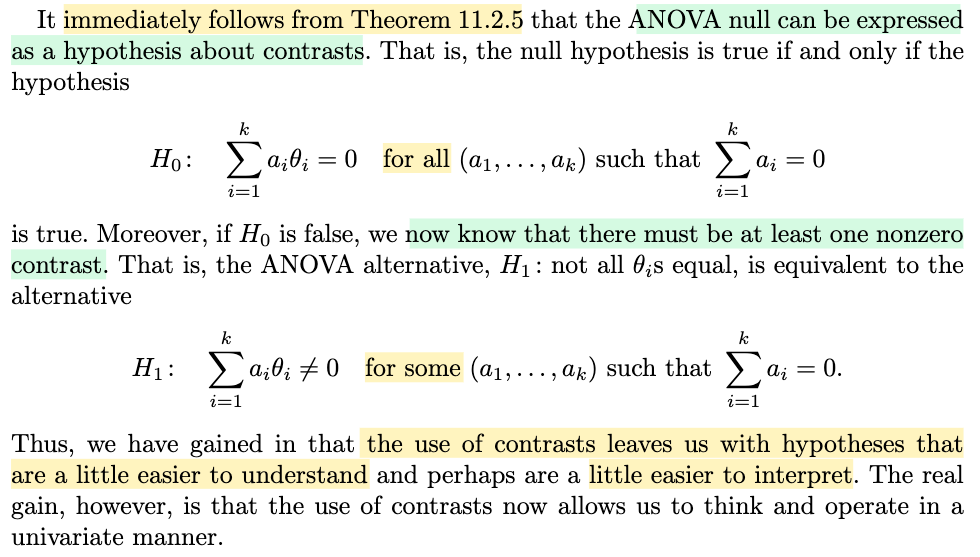</kbd>

> [!NOTE]
> Và nhờ theorem này, đại khái là ta có thể thể hiện cái null hypothesis ANOVA theo cách tương đương: thông qua constrast:
>
>
>
> H0: θis đều bằng nhau trở thành H0: 𝐚ᵀ𝛉 = 0 với mọi 𝐚 ∈ 𝒜 (bộ hệ số tổ hợp tuyến tính tổng bằng không)
>
>
>
> và tương tự H1 trở thành:
>
>
>
> H1: θis không bằng nhau, trở thành H1: ít nhất tồn tại 𝐚 ∈ 𝒜 sao cho 𝐚ᵀ𝛉 ≠ 0
>
>
>
> Và ông nói, cách thể hiện tương đương này giúp dể hiểu hơn và dễ giải thích hơn một chút

> [!TIP]
> 🤖 **AI Check** — 🟢 Pass — ✅ **95/100** · ✓ Move on
>
> Ghi chú tóm tắt rất chính xác bản chất của việc chuyển đổi giả thuyết ANOVA ($H_0$ và $H_1$) sang ngôn ngữ của các phép tương phản (contrasts) bằng biểu diễn véc-tơ gọn gàng.
>
> **✓ Strengths**
> - Diễn đạt lại công thức tổng $\sum a_i \theta_i$ dưới dạng tích vô hướng $\mathbf{a}^T\boldsymbol{\theta}$ rất chuẩn xác và súc tích.
> - Nắm đúng điều kiện tương đương logic giữa $H_0$ (với mọi $\mathbf{a} \in \mathcal{A}$) và $H_1$ (tồn tại ít nhất một $\mathbf{a} \in \mathcal{A}$).
>
> **💡 Deeper notes**
> - Đoạn cuối của sách nhấn mạnh một lợi ích cốt lõi lớn hơn ('The real gain') là việc dùng contrasts cho phép chúng ta tư duy và thao tác theo hướng đơn biến (univariate manner) thay vì đa biến phức tạp.

 

###### Section 11.2.3 Linear Combinations of Means

<kbd>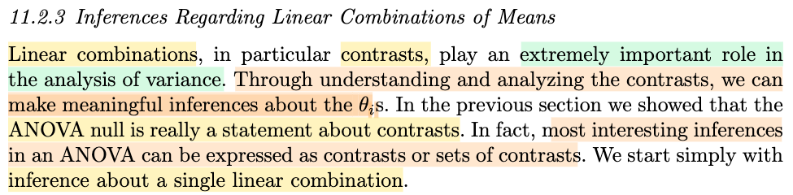</kbd>

> [!NOTE]
> Đại khái là, mở đầu tác giả cho biết về tầm quan trọng của contrast (còn nhớ, là linear combination với hệ số có tổng bằng 0). Nó giúp ta có những suy luận hữu ích về giá trị các θis.
>
>
>
> Trong phần trước, mình cũng đã thấy rằng null hypothesis của ANOVA hypothesis testing (H0: θis bằng nhau ∀i) có thể thể hiện bởi H0: 𝐚ᵀ𝛉 = 0 ∀ 𝐚 ∈ 𝒜. 
>
>
>
> Và sự thật rằng những suy luận thú vị nhất trong bài toán ANOVA có thể được thể hiện bởi một hoặc một tập các contrast.

 

