# 1.2.4 Enumerating
outcome

📊 **Progress:** `10` Notes | `14` Screenshots | `5` AI Reviews

---

## 1.2.4 Enumerating
outcome

 

## Xác suất outcome đồng khả năng

<kbd>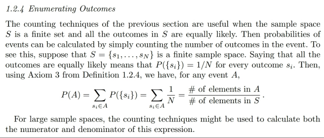</kbd>

> [!NOTE]
> Đại khái là sau **khi biết cách đếm số possible outcomes** trong sample
> space hoặc **event**, thì **nếu** mà các possible outcome này có **khả năng
> xảy ra là như nhau** (equally likely) thì **việc tính xác suất của một event rất
> đơn giản**.
>
>
>
> Cụ thể là vầy, giả sử ta có **S = {s1, s2, ...sn}**. Thế thì, theo **ĐỊNH NGHĨA
> CỦA PROBABILITY FUNCTION** mà phần trước ta đã học (cái mà ta nghe
> họ nói rằng để định nghĩa **một function** xác suất sao cho nó **thỏa mãn các
> Axiom**) trong đó **define xác suất của một event A chứa các possible
> outcome si, ...**  như sau:
>
>
>
> **P(A) = ∑ {si** ∈ **A} pi** (dịch ra là **tổng xác suất của các possible
> outcome** **chứa** trong subset/event A.
>
>
>
> Thế thì theo đó P(S) dĩ nhiên sẽ bằng:
>
>
>
> **P(S) = ∑ {si** ∈ **S} pi.**
>
>
>
> Mà theo **Axiom 2, P(S) = 1**, nên:
>
>
>
> **∑ {si** ∈ **S} pi = 1**
>
>
>
> Thế thì **nếu** như các possible outcome **equally likely** thì dĩ nhiên ta sẽ có
> **p1 = p2 =...pn = 1/n**
>
>
>
> Tức là **P({si}) = 1/n với mọi i**.
>
>
>
> Từ đó ta có ta tính P(A), cũng theo định nghĩa trên:
>
>
>
> P(A) = **∑ {si** ∈ **A} P({si})**
>
>
>
> = **∑ {si** ∈ **A} 1/n**
>
>
>
> Và như vậy để tính xác suất event A, ta chỉ cần **ĐẾM số possible outcome
> chứa trong subset A** và nhân cho **1 / sample space size**

 

### Xác suất rút 4 Át

<kbd>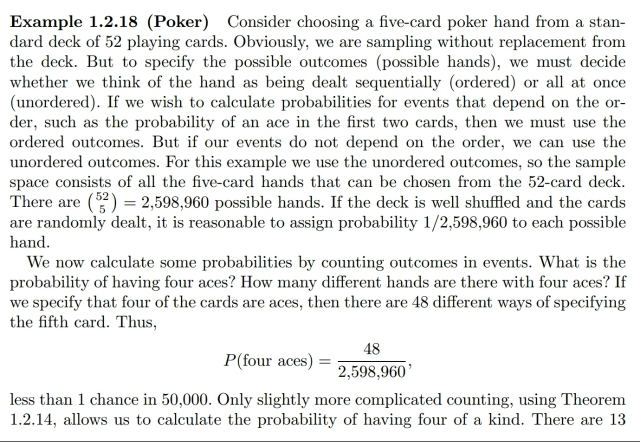</kbd>

> [!NOTE]
> Xét ví dụ với bộ bài, cụ thể là **rút 5 lá**. Tính **xác suất** của việc **kết quả ra 5
> lá với 4 con xì (Ace)**.
>
>
>
> Thế thì đại ý là, khi mà **đối diện** với một bài toán tính xác xuất của event, như
> vậy ta sẽ cần **xác định thêm** là người ta **có phân biệt thứ tự hay không**. Ví
> dụ c**ó cần phân biệt bộ (34567) khác với bộ (43567)** hay không.
>
>
>
> Vì **nếu** **có phân biệt** thì **số possible outcome trong sample space sẽ
> khác**, mà **không phân biệt** thì **số possible outcome cũng sẽ khác**. Rồi
> cách **sampling có hoàn lại hay không** cũng sẽ **ảnh hưởng đến kết quả**.
>
>
>
> Thì ở đây **theo lẽ thông thường** khi hỏi xác suất của việc rút được 5 lá có 4
> con ách thì ta **sẽ hiểu là** **không quan tâm thứ tự**, miễn là bộ có 4 con ách là
> đc. Thêm nữa **việc rút bài cũng thường được hiểu** là **rút ra thì lấy ra luôn**
> chứ không bỏ vào lại.
>
>
>
> Thế thì, như vậy đầu tiên cần xem thử **sample space của một thử nghiệm như
> vậy có bao nhiêu possible outcome**, hay có bao nhiêu kết quả có thể xảy ra khi
> lấy 5 lá từ 52 lá, hay, có bao nhiêu set 5 lá có thể tạo từ 52 lá. Đây là công thức
> quen thuộc **(52 choose 5)**.
>
>
>
> (có thể nói vậy vì ta đã rào trước ở trên rằng thử nghiệm này không quan tâm
> thứ tự và sampling không hoàn lại)
>
>
>
> Thế thì, **lẽ thông thường**, nếu **bộ bài được bình thường**, thì việc rút được
> bộ nào trong (52 choose 5) bộ **đều có khả năng xảy ra như nhau** (equally
> likely). Do đó x**ác xuất xảy ra của mỗi possible outcome** đều bằng 1/n =
> **1/(52 choose 5)**
>
>
>
> Tiếp theo ta mới xét event **A = (5 lá có 4 lá Ace)**, để rồi áp dụng định nghĩa về
> hàm xác suất:
>
>
>
> P(A) = ∑ {si ∈ A} P({si})
>
>
>
> Theo định nghĩa này, giúp ta hiểu **việc ta cần làm** sẽ là **xem trong event A có
> những possible outcome nào** (có bao nhiêu cái)
>
>
>
> (Có thể thấy tới đây ta hiểu sâu hơn tại sao P(A) = "event size" / "sample space
> size")
>
>
>
> Do đó ta sẽ đếm các possible outcome có trong A, hay có bao nhiêu bộ 5 lá mà
> có chứa 4 lá Ace: Để đếm cái này, ta sẽ thực hiện theo hai bước: Bước 1 **chọn
> 4 lá ách**: Rõ ràng **chỉ có một cách chọn**, vì bộ bài chỉ có 4 lá ách. Bước 2
> **chọn 1 lá thứ 5**: Có **52-4=48 cách chọn**
>
>
>
> (again, chỗ này cũng bị chi phối bởi việc có hoàn lại hay không).
>
>
>
> Và vì hai bước **tuân theo step rule** tức **kết quả của bước trước không ảnh
> hưởng đến số lựa chọn của bước sau** nên ta sẽ có **1*48=48 cách chọn**.
> Hay, có 48 possible outcome trong event/subset A, và mỗi cái đều có xác suất
> 1/(52 choose 5)
>
>
>
> Từ đó P(A) = ∑ {si ∈ A} P({si})
>
>
>
> = ∑ {si ∈ A} 1/(52 choose 5)
>
>
>
> = 1/(52 choose 5) * 48
>
>
>
> = **48/(52 choose 5)**

**🔗 See also:** [Ordered and Unordered Sample Space](#node-512w59h)

 

#### Xác suất các tay bài Poker

<kbd>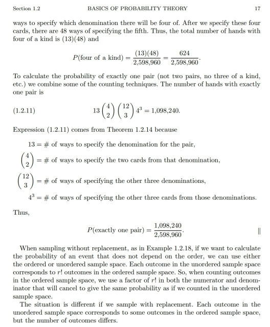</kbd>

<kbd></kbd>

> [!NOTE]
> Tương tự ta có thể **tính xác xuất của event B**: **5 lá trong đó có 4 lá cùng loại**. Ta cũng chỉ việc **xem B chứa mấy possible outcome** bằng cách đếm theo hai bước:
>
>
>
> Bước 1: **chọn loại (số nút) của bộ 4 lá** cùng loại: có **13** cách chọn. Bước 2: **chọn 4 lá cùng loại đó**: Có **1** **cách** chọn. Bước 3: **chọn lá thứ 5**: Có (52-4=**48**) **cách** chọn.
>
>
>
> Vậy, có **13\*48** possible outcome trong event B:
>
>
>
> P(B) = ∑ {si ∈ B} P({si}) = 1/(52 choose 5) \* (13\*48)
>
>
>
> = 1 3 48/(52 choose 5)
>
>
>
> ====
>
>
>
> Hoặc **event C**: Bộ 5 lá trong đó **có đúng một cặp** (ko dc bộ 3, và ko dc có nhiều hơn một cặp): Đếm số possible outcome trong C: Bước 1 chọn loại của cặp: 13. Bước 2 chọn hai lá của cặp: (4 choose 2). Bước 3 chọn loại của 3 lá còn lại (phải khác nhau để ko làm thành cặp nào khác và khác loại của hai lá trong cặp): (13 choose 3) Bước 4 chọn lá thứ 3 (loại gì thì đã chọn ở bước 3): (4 choose 1) Bước 5 chọn lá thứ 4: (4 choose 1). Bước 6 chọn lá thứ 5: (4 choose 1)
>
>
>
> Kết quả là có:
>
>
>
> 13 × (4 c 2) × (13 c 3) × (4 c 1)^3
>
>
>
> Nên P(C) = ∑ {si ∈ C} P({si})
>
>
>
> = 13 × (4 c 2) × (13 c 3) × (4 c 1)^3 / (52 choose 5)

 

##### Ordered and Unordered Sample Space

<kbd>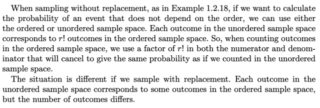</kbd>

> [!NOTE]
> Đại ý tác giả là, khi mà ta lấy mẫu theo lối không hoàn lại và muốn tính xác suất của một event không phụ thuộc vào thứ tự, thì có thể dùng sample space có thứ tự hay không thứ tự đều được. Làm rõ ý này:
>
>
>
> Sample space có thứ tự hay không thứ tự là sao?
>
>
>
> → sample space, là tập hợp mọi possible outcome. Vậy ordered sample space là tập hợp mọi possible outcome trong đó ta có sự phân biệt hai outcome theo thứ tự. Ví dụ, nếu experiment là rút 5 lá bài (không hoàn lại) từ bộ bài. Thì ordered sample space tập hợp mọi possible outcome sẽ là mọi kết qủa rút được, trong đó ta có phân biệt các kết quả có chung các lá bài nhưng khác thứ tự, ví dụ Già cơ, đầm rô, 10 bích, 9 cơ sẽ khác với 9 cơ, 10 bích, già cơ, đầm rô. Còn unordered sample space thì ta sẽ không phân biệt hai bộ này, mà chỉ tính là một. Và nó cùng với nhiều kết quả khác (đều là 4 con bài này, nhưng thứ tự khác nhau) đều tính là một possible outcome {già cơ, đầm rô, 10 bích, 9 cơ} trong unorder sample space.
>
>
>
> Như vậy, dễ hiểu, số lượng possible outcome của unordered sample space sẽ nhỏ hơn ordered sample space. Và với mỗi một possible outcome của unorder sample space, sẽ tương ứng với 4! possible outcome của ordered sample space.
>
>
>
> Thế thì, nếu ta tính xác suất của một event nào đó, ví dụ rút 4 là mà có 3 lá ách không quan tâm thứ tự chẳng hạn. Thì dễ hiểu là ta có thể tính bằng cả order sample space hoặc unorder sample space.
>
>
>
> Nói rõ hơn: vì cách tính xác suất của event với việc các possible outcome đều có xác suất xảy ra bằng nhau, thì cơ bản là trở thành bài toán đếm: đếm xem trong event A có bao nhiêu outcome. Và đem nhân nó với xác suất của một outcome. Gọi a là số outcome trong event A, và p là xác suất của một outcome.
>
>
>
> Thì theo quan hệ (1) ta sẽ có a_order = 4 a_unorder
>
>
>
> Còn p, thì vì equally likely nên p = 1/S'size
>
>
>
> mà S_order's size = 4 S_unorder's size
>
>
>
> Như vậy P(A)\_order = a_order / S_order's size
>
>
>
> = 4a_unorder / 4S_unorder's size = a_order / S_order's size
>
>
>
> Như vậy có thể tính bằng order hay unorder sample space đều được là vậy.
>
>
>
> ---
>
>
>
> Tuy nhiên, cái trên chỉ đúng nếu như ta sampling without replacement, và xét xác suất của event mà ta ko care thứ tự. Chứ nếu sampling with replacement, hay event có care thứ tự thì dĩ nhiên không thể tính bằng cả hai cách.

**🔗 See also:** [Xác suất rút 4 Át](#node-9wsbvqw)

 

- **Example 1.2.19 Sampling with Replacement**

<kbd>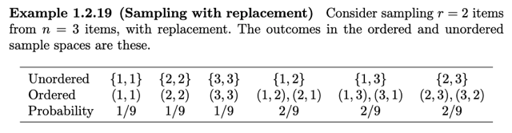</kbd>

<kbd>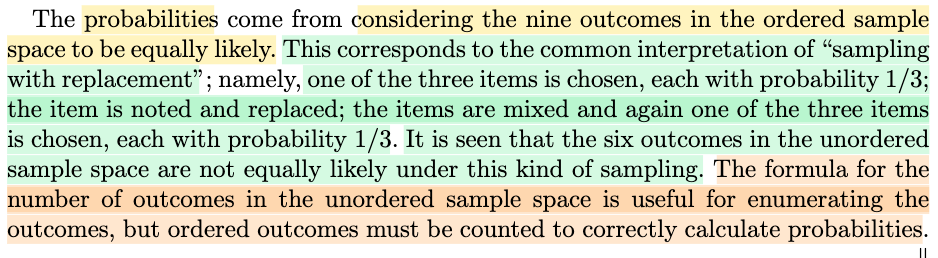</kbd>

> [!NOTE]
> Ví dụ này cho thấy các possible outcome của unorder và order sample space: Khi thử nghiệm là sampling 2 iterm từ 3 items khác nhau {1,2,3}
>
>
>
> Với unorder sample space, như đã nói, ta sẽ không phân biệt các possible outcome có cùng item nhưng khác thứ tự. Và với order sample space thì ngược lại.
>
>
>
> Như ở case này khi sampling là có replacement, ta thấy cái quy luật "mỗi outcome của unorder sample space sẽ ứng với r! outcome của order sample space" không còn đúng nữa.
>
>
>
> Quả thật, nhìn vào cái bảng này ta thấy đúng là vậy:
>
>
>
> Unordered sample space:
>
>
>
> {1,1}: 1 outcome → (1,1): 1 outcome → không phải là 2! = 2 outcome
>
>
>
> {2,2}: 1 outcome → (2,2): 1 outcome → không phải là 2! = 2 outcome
>
>
>
> {3,3}: 1 outcome → (3,3): 1 outcome → không phải là 2! = 2 outcome
>
>
>
> {1,2}: 1 outcome → (1,2), (2,1): 2 outcome.
>
>
>
> {1,3}: 1 outcome → (1,3), (3,1): 2 outcome
>
>
>
> {2,3}: 1 outcome → (2,3), (3,2): 2 outcome
>
>
>
> Có thể thấy 3 case đầu tiên, khi outcome trong order sample space không phải là 2! = 2 outcome trong unorder sample space.
>
>
>
> Và thêm nữa, các outcome trong unorder sample space không equally likely.
>
>
>
> Thử tính P({1,1}): gọi A1, A2 là kết quả sampling lần 1 và lần 2. vì sampling replacement, nên A1, A2 độc lập.
>
>
>
> P({1,1}) = P(A1=1, A2=1) = P(A1=1)P(A2=1) = (1/3) (1/3) = 1/9
>
>
>
> Tương tự, tính P({1,2}) = P((A1=1, A2=2) | (A1=2, A2=1)) (theo axiom 3, xác suất của hai disjoint event = tổng xác suất mỗi event) = P(A1=1, A2=2) + P(A1=2, A2=1) = P(A1=1)P(A2=2) + P(A1=2)P(A2=1) = (1/3)(1/3) + (1/3)(1/3) = 1/9 + 1/9 = 2/9
>
>
>
> Có thể thấy P({1,2}) = 2 P({1,1})
>
>
>
> Với order sample space thì các outcome vẫn equally likely.
>
>
>
> Như vậy tóm lại là, nếu là sampling with replacement thì các unorder outcome không còn equally likely.
>
>
>
>
>
> Rồi cái đoạn dưới đó thì đại khái ông giáo sư nói là cái chỉ số xác suất 1/9 1/9 rồi 2/9 gì đó. Thì đó là chỉ số xác suất tính thông qua tạm gọi là order sample space. Giống như cách mình tính ở trên. Thì qua đó mình mới thấy rằng cũng như mình đã nhận định ở vừa phía trên là trong cái bài toán này nếu như mà mình xét cái sample space mà unorder thì những cái outcome nó không có equally likely. Nếu mình vẫn xét là order sample space thì những outcome vẫn equally likely. Nhưng cái chính muốn nói là cái công thức dùng để mà mình tính cái số outcome của cái gọi là unorder sample space đó thì nó hữu ích trong cái việc là giúp mình kiểu như là liệt kê ra có bao nhiêu cái possible outcome. Ví dụ như trong bài toán này là mình có ba cái item và mình muốn bóc ra hai cái và mình không quan tâm thứ tự. Thì kiểu như là mình có thể dùng cái công thức để mình đếm có bao nhiêu là cái kết quả có thể xảy ra. Nhưng để mà tính xác suất là mình phải dùng mình phải dùng cái order sample space. Bởi vì khi mà mình dùng order sample space thì các cái outcome mới equally likely và từ đó mới giúp mình tính một cách chính xác. Ở phần trên mình tính như mình vừa mới tính ở trên là mình khi mà mình tính cái xác suất mà của cái outcome mà cả hai cái đều số một đó hay là xác suất của outcome là một cái là một, một cái là hai thì thật ra mình đều đang chuyển nó về cái bài toán mà order sample space.

> [!TIP]
> **🤖 AI Feedback** — ✅ Score: **93/100**
>
> Ghi chú thể hiện sự hiểu biết sâu sắc về lấy mẫu có hoàn lại, phân biệt rõ ràng giữa không gian mẫu có thứ tự và không có thứ tự. Bạn đã phân tích chính xác tại sao quy luật giai thừa không còn đúng khi có sự lặp lại và tính toán xác suất để chứng minh các kết quả không thứ tự không đồng khả năng. Chỉ cần lưu ý sửa ký hiệu P(A|B) thành P(A hoặc B) hoặc P(A U B) khi đề cập đến xác suất của hai biến cố rời nhau.

 

- **Hiểu sai "equally likely"**

<kbd>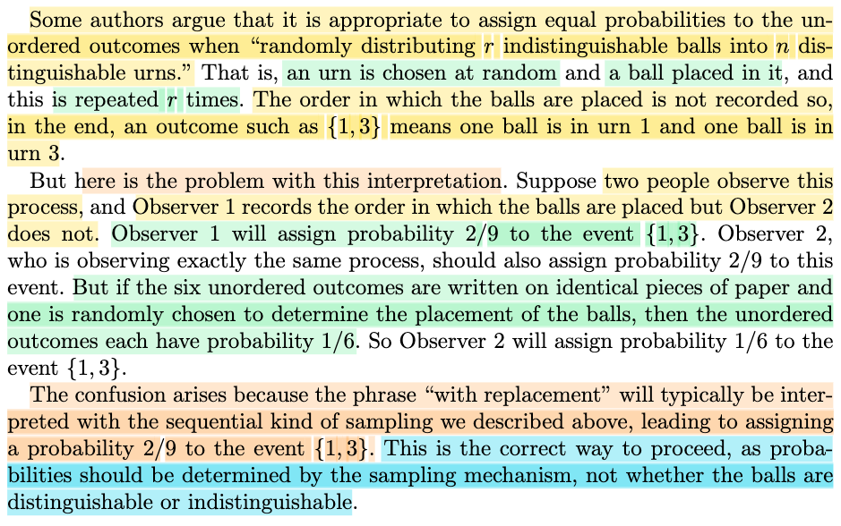</kbd>

> [!NOTE]
> Đại khái là **có người cho rằng các outcome của unorder sample space cũng equally likely** (theo đó thì {1,2}, {1,1} sẽ có xác suất như nhau (mà mình đã tự tính và thấy rõ là không đúng). Nhưng họ vẫn dùng lập luận là: outcome {1,3} là kết quả của hành động **thả 2 trái banh vào 3 cái hộp**. Và kết quả là 1 banh ở hộp 1 và 1 banh ở hộp 3. Và như vậy các trạng thái có thể xảy ra là:
>
>
>
> {1, 1} Cả hai banh đều ở hộp 1
>
> {2, 2} Cả hai banh đều ở hộp 2
>
> {3, 3} Cả hai banh đều ở hộp 3
>
> {1, 2} Một banh ở hộp 1, một banh ở hộp 2
>
> {1, 3} Một banh ở hộp 1, một banh ở hộp 3
>
> {2, 3} Một banh ở hộp 2, một banh ở hộp 3
>
>
>
> Và kiểu như người ta chỉ dựa theo lập luận: Tôi chỉ thấy có 6 trạng thái có thể xảy ra, và xác suất của chúng là như nhau = 1/6.
>
>
>
> Dĩ nhiên suy nghĩ kiểu đó là sai. 
>
>
>
> Và gs Casella chỉ ra nó sai ở chỗ đại khái là **ta đã không ghi nhận rằng {1,2} thực sự có thể xảy ra ở hai dạng: (1,2) và (2,1) là hai outcome riêng biệt**. 
>
>
>
> Ví dụ như có hai ông quan sát quá trình thả banh như trên, ông A có ghi thứ tự và ông B thì chỉ xem kết quả cuối (sau khi hai banh đã yên vị) thì ông A sẽ thấy quá trình ra kết quả {1,2} có thể xảy ra theo 2 cách khác nhau (1,2) hoặc (2,1) (trong khi ông B chỉ thấy {1,2}) nên xác suất của nó sẽ phải gấp đôi cái {1,1}.
>
>
>
> Tóm lại, ý chính muốn nói **KHI TÍNH XÁC SUẤT THÌ LUÔN PHẢI TUÂN THEO NGUYÊN TẮC: DÙNG ORDER SAMPLE SPACE (PHÂN BIỆT THỨ TỰ)**.

> [!TIP]
> **🤖 AI Feedback** — ✅ Score: **98/100**
>
> Phân tích của bạn rất rõ ràng và chính xác, nắm bắt hoàn toàn điểm cốt lõi của bài viết gốc. Bạn đã trình bày xuất sắc về sai lầm phổ biến khi tính xác suất cho các biến cố không thứ tự và giải thích thuyết phục tại sao cần sử dụng không gian mẫu có thứ tự. Để nội dung thêm hoàn hảo, bạn có thể cân nhắc đề cập rõ ràng hơn về 'bóng không phân biệt' ngay từ phần giới thiệu vấn đề.

 

- **Example 1.2.20 Calculating Average**

<kbd>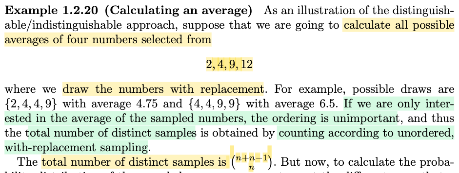</kbd>

> [!NOTE]
> Qua ví dụ này, để minh họa cho kết luận vừa rồi rằng, khi liệt kê xem có bao nhiêu trạng thái, kết quả khác nhau (ví dụ như, trong nhiều trường hợp, ta muốn biết một discrete random variable có thể có bao nhiêu possible value), khi đó ta có thể đếm bằng unorder sample space. Nhưng sau đó, để tính xác suất của event, ví dụ tính pmf của discrete random variable nói trên, thì ta phải đếm bằng order sample space.
>
>
>
> Bài toán đặt ra là, cho tập 4 con số {2, 4, 9, 12}, ta đặt ra X là random variable với story như sau: Lấy 4 số theo lối sampling có replacement từ tập này, và tính trung bình. Và ta muốn tìm distribution của X.
>
>
>
> Phân tích bản chất của X, rõ ràng nó là kết quả của một random process (khi lấy mẫu có hòan lại). Và X mang giá trị là trung bình của 4 số theo kiểu này, có thể thấy nó là discrete random variable. Và để tìm distribution của nó, ta phải biết nó có các possible value nào. Và pmf của mỗi cái là bao nhiêu.
>
>
>
> Câu hỏi a) chính là tương ứng với: có bao nhiêu possible outcome khi sampling with replacement 4 số từ tập 4 số trên, là những outcome nào.
>
>
>
> Thế thì ta sẽ giải bài toán này trước, và như trong mấy phần trước, để đếm kết quả của bài toán này, ta có công thức (n + r - 1 choose r). Lập luận lại như sau:
>
>
>
> Bài toán là **sampling có hoàn lại** từ lọ có **n** banh, và đếm số kết quả khi bốc **r** banh trong đó ta không phân biệt thứ tự các banh. (1)
>
>
>
> (Khi đó, bài toán bốc 4 số từ 4 số ở trên sẽ tương đương với framework này: đếm số kết quả khi bốc 4 banh theo kiểu có hoàn lại từ lọ có 4 banh khác nhau, trong đó ta không phân biệt thứ tự các banh.)
>
>
>
> Để giải bài toán (1), ta lập luận như sau: Chuyển nó về dạng thử nghiệm tương đương:
>
>
>
> Ví dụ n = 4 (banh 1,2,3,4), r = 3. Thì outcome (1,1,2) sẽ giống y như (1,2,1), và (2,1,1) và ta chỉ tính chung với outcome {1,1,2}.
>
>
>
> Cách làm là: {1,1,2} sẽ tương đương với thử nghiệm "Rải 3 bóng trắng (tức như nhau, không phân biệt bóng nào) vào 4 ô 1,2,3,4" và có hai bóng vào ô 1, một bóng vào ô 2.
>
>
>
> Tương tự, {1,2,4} sẽ tương đương với thử nghiệm "Rải 3 bóng trắng vào 4 ô 1,2,3,4" và ra kết quả là có một bóng vào các ô 1,2,4.
>
>
>
> Như vậy, ta sẽ thấy bài toán đếm sẽ tương đương:  Số cách rải 3 bóng trắng vào 4 ô 1,2,3,4. (hay khái quát là số cách rải r bóng trắng vào n ô 1,2,3....n)
>
>
>
> Lúc này để giải bài toán này: Ta sẽ dùng lối: đếm overcount rồi điều chỉnh: Bằng cách thay vì bóng trắng ta sơn 3 bóng là xanh đỏ vàng, và xét thêm 3 cái vách ngăn v1,v2,v3. Để rồi ta sẽ đếm các bước sau:
>
>
>
> i) Số hoán vị của 3 bóng xanh đỏ vàng + 3 vách ngăn v1, v2, v3: Dễ thấy là 6! (khái quát (n + r - 1)!)
>
>
>
> ii) Bước điều chỉnh thứ nhất: khi ta coi 3 cái vách là giống nhau thì trong 6! hoán vị đó. sẽ có nhiều cái chỉ khác nhau bởi việc coi các vách là khác nhau. Ví dụ (đỏ vàng v1 xanh v2 v3) và (đỏ vàng v2 xanh v1 v3). Và dễ thấy sẽ có 3! cái outcome có dạng (đỏ vàng v xanh vv).
>
>
>
> Do đó với việc ta không còn phân biệt các vách thì với mỗi một "combo" khác nhau cách sắp thứ tự banh và v, thì ta đều coi / tính 3! outcome như 1. Nên bước điều chỉnh khi không còn phân biệt các vách sẽ là: 6! / 3! (khát quát: (n + r - 1)! / (n-1)!)
>
>
>
> iii) Bước điều chỉnh thứ hai: không phân biệt các banh (vì bài toán gốc là rải r banh trắng vào n hộp 1,2...n). Tương tự, ví dụ như với (đỏ vàng v xanh v v) và (vàng xanh v đỏ v v) thì ta sẽ coi như là giống nhau. Vậy cứ mỗi combo ta đã đếm dư 3! (là số hoán vị của 3 banh). Nên bước adjust tiếp theo: chia cho 3! (tức r!):
>
>
>
> 6!/3!3!, hay khái quát là (n + r - 1)! / \[(n-1)! r!\], và đây chính là (n - 1 choose r)
>
>
>
> Như vậy, quay lại bài toán đếm số possible value của X, khớp với cái khung là đếm số kết quả khi ta bốc r = 4 item từ n = 4 item khác nhau (2,4,9,12), trong đó ta không phân biệt thứ tự. Thì kết quả sẽ là:
>
>
>
> (n + r - 1)!/(n - 1)!r! = (n - 1 choose r) = (4 + 4 - 1)! / 4!3! = 7!/4!3!
>
>
>
> (cũng chính là trong sách ghi (n + n - 1 choose n) vì ở đây ta có r = n = 4.

> [!TIP]
> **🤖 AI Feedback** — ✅ Score: **90/100**
>
> Bài phân tích thể hiện sự hiểu biết sâu sắc về bản chất bài toán, từ việc xác định loại lấy mẫu (có hoàn lại, không thứ tự) đến việc áp dụng công thức tổ hợp. Phần chứng minh công thức (n+r-1 chọn r) rất chi tiết và đúng đắn về mặt ý tưởng, tuy nhiên, có một lỗi nhỏ ở bước cuối cùng khi bạn viết (n+r-1)! / [(n-1)! r!] là (n-1 chọn r) thay vì (n+r-1 chọn r).

**🔗 See also:** [Bootstrap Standard Errors](./101_point_estimation.md#node-gumecun)

 

- **Đếm mẫu tính xác suất**

<kbd>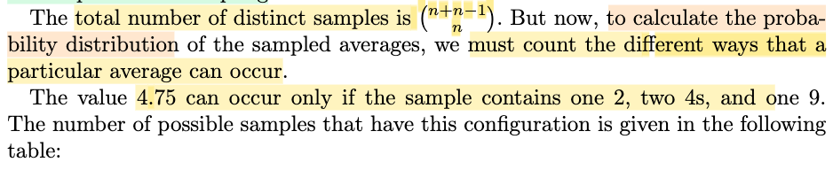</kbd>

<kbd>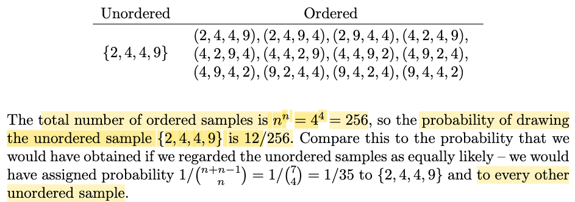</kbd>

> [!NOTE]
> Tuy nhiên, như đã nói công thức trên là tính **SỐ LƯỢNG DISTINCT OUTCOME, NÔM NA LÀ SỐ OUTCOME KHÁC NHAU CÓ THỂ XẢY RA, CHỨ BẢN THÂN MỘI OUTCOME KHÔNG CHẮC SẼ EQUALLY LIKELY.** Do đó để tính pmf của X ứng với các possible value, cũng là xác suất của các possible outcome này thì ta **phải tính bằng cách dựa trên order sample space.**
>
>
>
> Ví dụ ta sẽ tính P(X = 4.75), cũng là P({2,4,4,9}).
>
>
>
> Thì cái outcome này, nó sẽ tương ứng với 12 outcomes trong order sample space. Vì sao ta?
>
>
>
> Lại giải bài toán đếm số outcome chứ 2,4,4,9 từ 4 số {2,4,9, 12} trong đó ta có phân biệt thứ tự (có nghĩa là (2,4,4,9) sẽ khác (4,2,4,9) và khác (9,4,4,2) nhưng ko phân biệt hai số 4 với nhau. Vậy thay vì liệt kê bằng tay, ta có thể tính ra con số 12 không?
>
>
>
> Có thể tính theo 2 bước: Coi hai con số 4 là khác nhau, ta sẽ có 4! hoán vị. Sau đó điều chỉnh bằng cách chia 2! (số hoán vị của 2 con số 4): 4!/2! = 4 × 3 = 12.
>
>
>
> Như vậy event X = 4.75 hay {2,4,4,9} có 12 possible order outcome.
>
>
>
> Và chúng có xác suất bằng nhau, do mỗi outcome đều có xác suất = (1/4)×(1/4)×(1/4)×(1/4) = 1/4^4.
>
>
>
> Nên P(X = 4.75) = P({2,4,4,9}) = 12 × (1/4^4) = 12/256 
>
>
>
> Dĩ nhiên đây là kết quả đúng, để so sánh với việc nếu ta tính bằng cách dùng unordered sample space, để rồi coi {2,4,4,9} sẽ chỉ là 1 trong 7!/4!3! các outcome khác và chúng đều có xác suất bằng nhau, và = 1/\[7!/4!3!\], thì kết quả sẽ là 1/(7 choose 4) = 1/35 → là kết quả sai, khác hoàn toàn kết quả đúng là 12/256.

> [!TIP]
> **🤖 AI Feedback** — ✅ Score: **98/100**
>
> Ghi chú giải thích rất rõ ràng và chính xác sự khác biệt quan trọng giữa việc đếm số lượng các mẫu phân biệt và việc tính xác suất bằng cách sử dụng không gian mẫu có thứ tự, với các ví dụ minh họa và tính toán chi tiết hoàn toàn trùng khớp với tài liệu. Để cải thiện nhỏ, bạn có thể cân nhắc làm rõ hơn mối liên hệ giữa các công thức tổ hợp ở phần cuối với công thức tổng quát đã đề cập ban đầu.

**🔗 See also:** [Bootstrapping a variance](./101_point_estimation.md#node-f5aaasl)

 

- **Histogram of Sample Averages**

<kbd>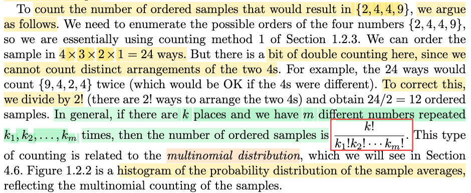</kbd>

<kbd>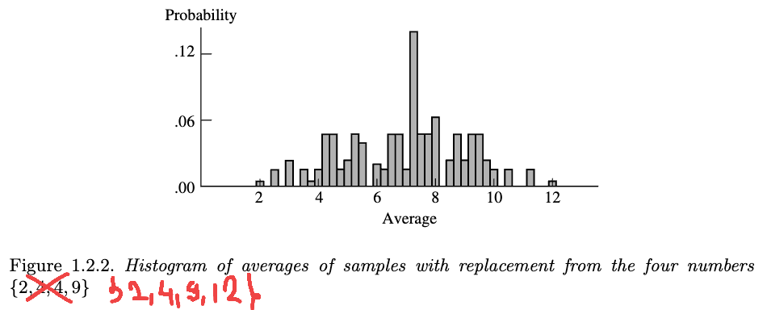</kbd>

> [!NOTE]
> Đoạn tiếp theo chính là gs chỉ cách tính số order outcome của event {2,4,4,9}, giống như mình đã tự tính ở note trước.
>
>
>
> Và khái quát lên, khi ta có k vị trí, và m con số khác nhau trong đó chúng lặp lại k1,k2,...km lần (ví dụ như ở đây ta có k = 4 vị trí, có m=3 số 2,4,9 lặp lại k1=1, k2=2, k3=1 lần). thì số ordered sample sẽ là k!/(k1!k2!...km!), và đây chính là multinomial distribution.
>
>
>
> Hình 1.2.2 là histogram, rõ ràng có sai sót. X là trung bình của 4 số bốc từ bộ 4 số {2, 4, 9, 12} chứ ko phải là {2, 4, 4, 9}. Và cái histogram này chính là pmf của X.

> [!TIP]
> **🤖 AI Feedback** — ✅ Score: **95/100**
>
> Bài phân tích của bạn rất chính xác và sâu sắc. Bạn đã hiểu rõ cách tính số lượng mẫu có thứ tự và công thức tổng quát của nó liên quan đến phân phối đa thức. Đặc biệt, việc bạn phát hiện ra sự không nhất quán giữa biểu đồ histogram và mô tả nguồn dữ liệu {2,4,4,9} là một điểm mạnh nổi bật, thể hiện khả năng phân tích và tư duy phản biện xuất sắc. Để tăng thêm độ chính xác, bạn có thể cân nhắc gọi biểu đồ này là 'biểu đồ phân phối xác suất' thay vì chỉ 'pmf' nếu các giá trị trung bình có thể không hoàn toàn rời rạc.

 

- **The Bootstrap Statistical Technique**

<kbd>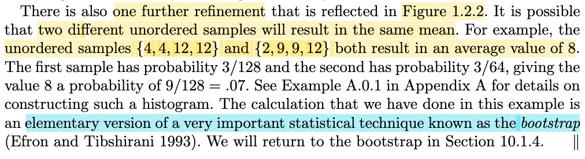</kbd>

> [!NOTE]
> Rồi thì để ý là ông nói về cái việc cái mà nãy giờ mình tính toán đó thì nó là một cái kỹ thuật đơn giản, một phiên bản đơn giản của một cái kỹ thuật trong thống kê rất quan trọng đó là bootstrap mà mình sẽ gặp lại ở chương 10.1.4.

 

