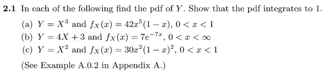
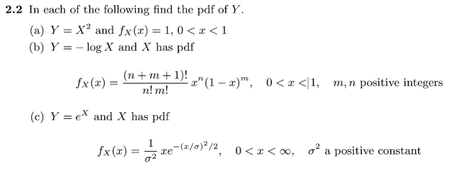

# 2.5 Ex

📊 **Progress:** `1` Notes | `2` Screenshots

---

 

## Tính PDF của hàm biến đổi

<kbd></kbd>

> [!NOTE]
> Hướng làm: để tìm pdf của Y = g(X), rõ ràng ta sẽ dùng cách lập luận gốc
> để xây dựng cdf của Y:
>
>
>
> P(Y ≤ y) = P(g(X) ≤ y) = P({x ∈ ΩX: g(x) ≤ y}) | ΩX là range / sample space
> của X
>
>
>
> = Σ x ∈ {x ∈ ΩX: g(x) ≤ y} P(X = x)
>
>
>
> Nếu gọi A là tập {t ∈ ΩY: t ≤ y}, cũng chính là (-inf, y] thì tập  {x ∈ ΩX: g(x)
> ≤ y} chính là g⁻¹(A) = g⁻¹({t ∈ ΩY: t ≤ y})
>
>
>
> ⇨ có thể ghi là Σ x ∈ g⁻¹((-inf, y]) P(X = x)
>
>
>
> Ở đây X là continuous rv thì công thức tương đương là:
>
>
>
> = ∫ x ∈ g⁻¹((-inf, y]) fX(x)dx
>
>
>
> Nên câu chuyện là xác định g⁻¹((-inf, y]).
>
>
>
> ====
>
>
>
> Thế thì xét ∫ {x: g(x) ≤ y} fX(x)dx
>
>
>
> Nếu hàm g(x) **đơn điệu tăng**: thì g(x) ≤ y ⇔ g⁻¹(g(x)) ≤ g⁻¹(y) ⇔ x ≤ g⁻¹(y)
>
>
>
> Khi đó {x: g(x) ≤ y} = {x: x ≤ g⁻¹(y)} = x ∈ (-inf: g⁻¹(y))
>
>
>
> ⇨ ∫ {x: g(x) ≤ y} fX(x)dx = ∫-inf: g⁻¹(y) fX(x)dx và đây chính là FX(g⁻¹(y))
> tức cdf của X evaluate tại g⁻¹(y), nên:
>
>
>
> FY(y) = FX(g⁻¹(y))
>
>
>
> Ta biết fY(y) = d/dy FY(y) = d/dy FX(g⁻¹(y))
>
>
>
> = d/dx FX(g⁻¹(y)) . d/dy x 
>
>
>
> **= fX(g⁻¹(y)) d/dy g⁻¹(y)** (Hay fX(g⁻¹(y)) dx/dy)
>
>
>
> -----
>
>
>
> Còn khi g(x) **đơn điệu giảm**: g(x) ≤ y ⇔ g⁻¹(g(x)) = x ≥ g⁻¹(y)
>
>
>
> ⇨ {x: g(x) ≤ y} = {x: x ≤ g⁻¹(y)} = x ∈ (g⁻¹(y), inf)
>
>
>
> ⇨ ∫ {x: g(x) ≤ y} fX(x)dx = ∫g⁻¹(y):inf fX(x)dx 
>
>
>
> Và đây chính là 1 - ∫-inf: g⁻¹(y) fX(x)dx  (bởi lẽ ∫-inf:inf fX(x)dx = 1)
>
>
>
> mà cái này ∫-inf: g⁻¹(y) fX(x)dx, lại chính là FX(g⁻¹(y))
>
>
>
> ⇨ FY(y) = 1 - FX(g⁻¹(y))
>
>
>
> Tương tự, lấy đạo hàm ta có fY(y):
>
>
>
> fY(y) = d/dy FY(y) = d/dy [1 - FX(g⁻¹(y))]
>
>
>
> = - d/dy FX(g⁻¹(y)) = -d/dx FX(g⁻¹(y)) d/dy g⁻¹(y)
>
>
>
> = - fX(g⁻¹(y)) d/dy g⁻¹(y)
>
>
>
> Vậy kết luận:
>
>
>
> f**Y(y) = fX(g⁻¹(y)) d/dy g⁻¹(y) khi hàm g đơn điệu tăng
>
>
>
> và - fX(g⁻¹(y)) d/dy g⁻¹(y) khi hàm g đơn điệu giảm
>
>
>
> Gom lại là: fX(g⁻¹(y)) |d/dy g⁻¹(y)| 
>
>
>
> Còn khi nó không đơn điệu thì ko tính được**
>
> Câu a) g(x) = x³ ≤ y
>
>
>
> Xét hàm g(x) = x³:
>
>
>
> d/dx g(x) = 3x², và với 0 < x < 1 thì d/dx g(x) đều dương ⇨ Theo mean
> value theorem cho thấy hàm số tăng liên tục trong khoảng (0, 1)
>
>
>
> ⇨ hàm g(x) là hàm đơn điệu tăng
>
>
>
> ⇨ g(x) = x³ ≤ y ⇔ x ≤ y^1/3
>
>
>
> ⇨ {x ∈ ΩX: g(x) = x³ ≤ y} = {x ∈ ΩX: x ≤ y^1/3}
>
>
>
> Do đó:
>
>
>
> FY(y) = P(Y ≤ y) = ∫ {x ∈ ΩX: x ≤ y^1/3} fX(x)dx = ∫-inf y^1/3 fX(x)dx
>
>
>
> Và cái này chính là FX(y^1/3)
>
>
>
> Nên fY(y) = d/dy FY(y) = d/dy [∫-inf y^1/3 fX(x)dx]
>
>
>
> = d/dy FX(y^1/3) =
>
>
>
> = d/dx FX(y^1/3) d/dy x
>
>
>
> = fX(y^1/3) d/dy y^1/3
>
>
>
> = fX(y^1/3) 1/3y^(-2/3)
>
>
>
> Vậy fY(y) = (1/3) fX(y^1/3) y^(-2/3)
>
>
>
> Thay fX(x) = 42x^5(1 - x)
>
>
>
> ⇨ fY(y) = (1/3) 42(y^1/3)^5 [1 - y^1/3] y^(-2/3)
>
>
>
> = (42/3) (y^5/3) [1 - y^1/3] y^(-2/3)
>
>
>
> = (42/3) (y) [1 - y^1/3] 
>
>
>
> = 14(y - y⁴/3)
>
>
>
> Với x ∈ (0, 1) ⇨ y ∈ (0, 1)
>
>
>
> ====
>
>
>
> Thử chứng minh ∫-inf:inf fY(y)dy = 1:
>
>
>
> ∫-inf:inf fY(y)dy = ∫0:1 14(y - y⁴/3) dy
>
>
>
> = 14 ∫0:1 (y - y⁴/3) dy
>
>
>
> = 14 [ (1/2)y² - (3/7)y^7/3)] |0:1
>
>
>
> = 14 [1/2 - 3/7)]
>
>
>
> = 7 - 6 = 1
>
>
>
> b) QUAY LẠI LÀM SAU
>
> QUAY LẠI SAU LÀM CÂU B, C

 

<kbd></kbd>

 

