# 5.3 Sampling From The Normal Distribution

📊 **Progress:** `21` Notes | `29` Screenshots | `7` AI Reviews

---

 

## Lấy mẫu từ phân phối chuẩn

<kbd>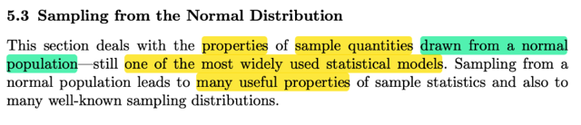</kbd>

> [!NOTE]
> Phần này đại ý là sẽ nói về việc ta xem xét sampling distribution của các 
> statistic của random sample có population là normal distribution. Đây dĩ
> nhiên là một trong các statistical model phổ biến nhất.
>
>
>
> Việc sampling từ normal distribution có nhiều tính chất hữu ích, cũng như là
> sampling distribution của các statistic từ normal sẽ có dạng quen thuộc là
> những mô hình xác suất nổi tiếng

 

### Tính chất Trung bình & Phương sai mẫu

<kbd>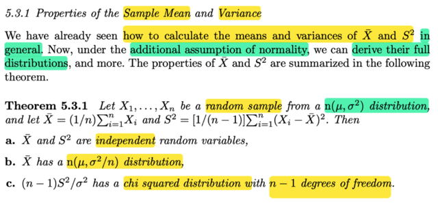</kbd>

> [!NOTE]
> Rồi, cái này đại khái là, họ nói ta đã biết cách tính mean, và variance của X̄ và S² nói chung. Bây giờ, với việc thêm vào gỉa định là ta biết population distribution thuộc loại normal distribution. Thì ta có thể derive (cho thấy) hoàn chỉnh **distribution của sample mean và sample variance**.
>
>
>
> Theorem 5.3.1: Đại khái nói là, ta có một random sample X1,X2...Xn từ một population và lần này ta biết nó là normal (μ, σ²). Vì với sample mean X̄, sample variance S² (mà công thức thì ta đã biết từ những phần trước rồi)
>
>
>
> Khi đó theorem này nói rằng:
>
>
>
> a) Hai cái random variable này, tức X̄ và S², **độc lập nhau.**
>
>
>
> b) Cái sampling distribution của sample mean X̄  là **normal (μ, σ²/n)**
>
>
>
> c) (n-1)S²/ σ² có sampling distribution là **chi-square với n-1 bậc tự do**
>
>
>
> Một vài suy nghĩ:
>
>
>
> i) Tại sao tác giả lại nói đền "additional assumption of normality" (tạm hiểu là có thêm giả định là normality): Mình nghĩ có thể hiểu rằng, thực tế, ta thường không biết cái population mà mình thực hiện lấy mẫu (sampling) có distribution là lọai gì. Nên ở đây, ta giả định nó là normal distribution.
>
>
>
> ii) Ôn lại chút về việc tại sao Sample mean X̄ và sample variance S² lại là random variable (Để rồi ở đây nói chúng độc lập): Thì đó là vì ta đã biết, định nghĩa của chúng, nói ngắn gọn, là, chúng là kết quả của việc ta dùng một function nào đó, để tính toán với các random variable X1,..Xn trong random sample. Cụ thể với X̄ thì nó là X̄ = g1(X1,..Xn) với g1 có công thức là g1(x1,..xn) = (x1 + x2 + ...xn)/n. Mà ta đã biết khi apply một function lên một (hoặc một đám) random variable thì ta cũng có một random variable mới.
>
>
>
> Thêm nữa, vì X1,...Xn là các random variable của một random sample. nên người ta gọi các random variable có được khi apply các function lên bộ random variable này là statistic.
>
>
>
> Và again, các statistic là random variable, nên nó cũng có distribution. Và người ta dùng cái tên SAMPLING DISTRIBUTION, để phân biệt với distribution của các random variable X1,...Xn vốn là distribution có sẵn (population distribution)
>
>
>
> Vậy thì thử xem ta có thể chứng minh theorem này ra sao.

📹 [Xem video trên YouTube](https://www.youtube.com/watch?v=8oEGxDhqdME)

> [!TIP]
> 🤖 **AI Check** — 🟢 Pass — ✅ **95/100** · ✓ Move on
>
> Ghi chú tóm tắt rất tốt và chính xác nội dung định lý 5.3.1 cùng các tính chất phân phối mẫu. Phần liên hệ và giải thích trực giác về statistic cũng như sampling distribution rất rõ ràng, chuẩn xác.
>
> **✓ Strengths**
> - Nắm trọn vẹn và chính xác ba kết luận then chốt của Định lý 5.3.1 về phân phối mẫu của X̄ và S² dưới giả định chuẩn.
> - Giải thích bản chất thống kê lượng (statistic) là hàm của các biến ngẫu nhiên trong mẫu và làm rõ khái niệm sampling distribution rất chuẩn xác.
>
> **💡 Deeper notes**
> - Cụm từ 'in general' ở phần đầu bài học có ý nghĩa quan trọng: các kết quả trước đó về kỳ vọng và phương sai (E[X̄]=μ, Var(X̄)=σ²/n, E[S²]=σ²) đúng với mọi phân phối có kỳ vọng và phương sai hữu hạn, không cần giả định chuẩn. Giả định chuẩn ('normality') chỉ cần thiết khi muốn suy ra trọn vẹn dạng phân phối (exact distributions) và tính độc lập giữa X̄ và S².

**🔗 See also:** [Chứng minh S² Chi-square](#node-nh8m52t) · [Suy diễn phân phối t](#node-iwzyu9l) · [Khoảng tin cậy từ đại lượng pivot](./92_methods_of_finding_interval_estimators.md#node-g9mg0da) · [Pooled Estimator and Student t Distribution](./111_2_introduction_one_way_anova.md#node-680r0w1)

 

#### MGF trung bình mẫu

<kbd>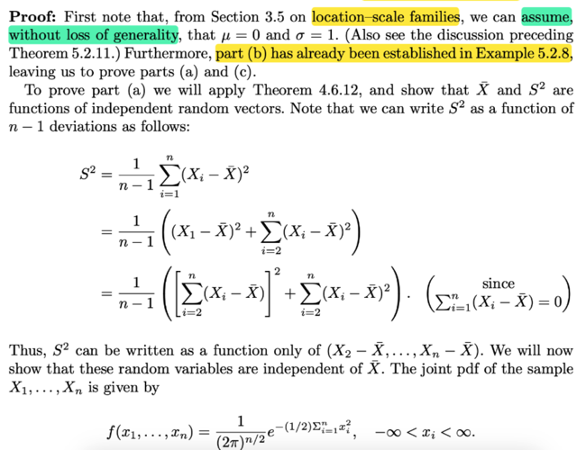</kbd>

> [!NOTE]
> Đầu tiên phần b đã được chứng minh rồi, thử làm lại nhanh.
>
>
>
> Đại khái là ta sẽ chứng mgf của X̄ có dạng là mgf của normal (μ, σ²/n)
>
>
>
> Thế thì, ôn lại về mgf (moment generating function), mgf của X, kí hiệu M_X(t) có bản chất công thức là E\[e^tX\], tức là, tạo một random variable mới Y = e^tX và lấy kì vọng (expected value) của nó.
>
>
>
> ---
>
>
>
> MX(t) = E\[e^tX\] = E\[g(X)\] với g(x) = e^tx
>
>
>
> MX(t)|t=1 = E\[e^X\]
>
>
>
> MX(t)|t=2 = E\[e²X\]
>
>
>
> MX(t)|t=100 = E\[e^100X\]
>
>
>
> ---
>
>
>
> ⇨ mgf của X̄, kí hiệu M_X̄ (t), có bản chất là E\[e^tX̄ \]
>
>
>
> Với X̄ = (Σi Xi)/n, ta có:
>
>
>
> E\[e^tX̄ \] = E\[e^(t(Σi Xi)/n)\] (e mũ \[t(Σi Xi)/n\])
>
>
>
> = E\[e^\[(t/n)(Σi Xi)\] \]
>
>
>
> = E\[e^\[(t/n)(X1 + X2 + ..Xn)\] \] | ghi rõ Σ ra
>
>
>
> = E\[e^\[(t/n)X1 + (t/n)X2 + ..(t/n)Xn\] \] | phân phối t/n vô
>
>
>
> Dùng tính chất hàm mũ e^(a+b) = e^a × e^b
>
>
>
> ..= E \[e^(t/n)X1 × e^(t/n)X2 × ....× e^(t/n)Xn \]
>
>
>
> Tới đây, đại khái ta có thể lập luận lại hoặc cho nhanh thì dùng một theorem đã chứng minh: nếu X1, X2...mutually independent thì E(X1X2.. Xn) = EX1 × EX2 ...× EXn
>
>
>
> ---
>
>
>
> (Chứng minh lại cũng dễ: Gọi f(x), f(y), f(x,y) là marginal pdf và joint pdf:
>
>
>
> E\[XY\] = E\[Z = g(X,Y)\] với g(x,y) = xy; theo 2D LOTUS, = ∫∫g(x,y)f(x,y)dxdy = ∫∫xyf(x,y)dxdy = ∫∫xyf(x)f(y)dxdy = ∫yf(y)(∫xf(x)dx)dy = ∫yf(y)(EX)dy = E\[X\] ∫yf(y)dy = E\[X\]E\[Y\])
>
>
>
> Ôn nhanh LOTUS:
>
>
>
> X \~ fX(x), Y = g(X).
>
>
>
> Theo định nghĩa, EX = weighted average các possible value với weight là xác suất tương ứng
>
>
>
> Nên với biến rời rạc X có possible values x1,x2,x3: EX = P(X=x1) x1 + P(X=x2)x2 + P(X=x3)x3, với biến liên tục: EX = ∫xf(x)dx
>
>
>
> Nhưng LOTUS cho phép tính EY mà không cần tìm pdf/pmf của Y: EY = ∫g(x)f(x)dx
>
>
>
> ---
>
>
>
> và ở đây, vì X1, X2....Xn là các random variables của một random sample, theo định nghĩa chúng sẽ mutually independent.
>
>
>
> Mà khi X1,X2...Xn independent thì g(X1), g(X2)...g(Xn) tức là các random variable có được bằng cách apply hàm g lên các random variable này, cũng sẽ mutually independent.
>
>
>
> Do đó E \[e^(t/n)X1 × e^(t/n)X2 × ....× e^(t/n)Xn\]
>
>
>
> = E\[e^(t/n)X1\] × E\[e^(t/n)X2\] × ....× E\[e^(t/n)Xn\]
>
>
>
> Rồi, tới đây xem xét E\[e^(t/n)X1\] là cái gì?
>
>
>
> Như lúc nãy đã nhắc lại định nghĩa mgf MX(t) = E\[e^tX\]. Vậy thì MX(t/n) = E\[e^(t/n)X\]
>
>
>
> (có nghĩa là, bản chất của hàm mgf của X evaluate tại t, là ta apply hàm g(x) = e^tx lên random variable X, để có một random variable mới: Y = e^tX. Rồi đem lấy kì vọng: E\[Y\] thì đó chính là MX(t). Vậy thì, nếu ta muốn evaluate tại t/n. thì dĩ nhiên là ta apply hàm khác g(x) = e^\[(t/n)x\] lên random variable X, để có Y = g(X) = e^\[(t/n)X\], ròi lấy kì vọng.
>
>
>
> Như vậy, quay lại đây E\[e^(t/n)X1\], chính là MX1(t/n).
>
>
>
> tương tự E\[e^(t/n)X2\] = MX2(t/n)
>
>
>
> ⇨ cái tích trên = MX1(t/n) MX2(t/n)....MXn(t/n)
>
>
>
> Rồi, tới đây, ta lại dùng định nghĩa của random sample, ôn nhanh, đó là các random variable X1,...Xn sẽ là các giá trị quan sát được của một biến số nào đó. Và chúng độc lập lẫn nhau (mutually independent) như đã nói, nhưng ngoài ra, chúng cũng có CHUNG MỘT MARGINAL DISTRIBUTION. Do đó pdf, hay pmf, hay cdf, hay mgf của chúng là giống nhau.
>
>
>
> Vậy cái tích trên có thể thay bằng \[MX1(t/n)\]ⁿ, hay gọi MX(t) là mgf của population distribution, ta có M_X̄ (t) = \[MX(t/n)\]ⁿ
>
>
>
> Tới đây ta dùng cái đề bài cho là sample có population distribution là normal(μ, σ²), thì mgf của một normal(μ, σ²) có thể nhớ hoặc tra bảng = e^\[μt + (1/2) σ²t²\]
>
>
>
>  Thay vào, **nhớ là đang evaluate tại t/n**
>
>
>
> ⇨ M_X̄ (t) = \[MX(t/n)\]ⁿ
>
>
>
> = {e^\[μ(t/n) + (1/2) σ²(t/n)²\]}ⁿ
>
>
>
> Ở đây, nhìn một nùi vậy chứ chỉ là (e^u)ⁿ, ta dùng tính chất hàm mũ: (aⁿ)ᵐ = aᵐⁿ
>
>
>
> = e^\[n\[μ(t/n) + (1/2) σ²(t/n)²\]\]
>
>
>
> = e^\[nμ(t/n) + n(1/2) σ²(t/n)²\] | phân phối n vô thôi
>
>
>
> = e^\[μt + (1/2) σ²(t²/n)\] | cancel n bớt
>
>
>
> = e^\[μt + (1/2) (σ²/n)t²\] | đổi chỗ thôi
>
>
>
> Tới đây, nhớ lại ta vừa nói random variable \~ normal(μ, σ²) sẽ có
>
>
>
> mgf M(t) = e^\[μt + (1/2) σ²t²\]
>
>
>
> nên normal(μ, σ²/n) sẽ có mgf là M(t) = e^\[μt + (1/2) (σ²/n)t²\]
>
>
>
> Cả pdf, cdf,pmf,mgf đều có thể dùng để xác định phân phối
>
>
>
> Chính là kết quả trên ta đang có,
>
>
>
> Từ đó có thể kết luận **sampling distribution của** **sample mean X̄ là normal(μ, σ²/n)**
>
>
>
> (vì như đã biết, mgf, cũng như cdf, pdf pmf, đều có thể giúp xác định loại của một distribution)

> [!TIP]
> 🤖 **AI Check** — 🟢 Pass — ✅ **98/100** · ✓ Move on
>
> Ghi chú xuất sắc khi tự chứng minh lại đầy đủ và chính xác phân phối của trung bình mẫu X̄ thông qua hàm sinh mô-men (mgf). Lập luận chặt chẽ, các bước biến đổi đại số rõ ràng và bản chất xác suất được nắm rất vững.
>
> **✓ Strengths**
> - Tự triển khai hoàn chỉnh từng bước suy dẫn hàm mgf của X̄ từ định nghĩa mẫu ngẫu nhiên i.i.d mà không bỏ sót bước biến đổi nào.
> - Hiểu rõ bản chất hàm sinh mô-men, nguyên lý hàm của biến ngẫu nhiên độc lập và tính duy nhất của mgf để nhận diện phân phối chuẩn.
>
> **💡 Deeper notes**
> - Định lý xác định duy nhất phân phối qua mgf yêu cầu mgf phải tồn tại trong một khoảng mở chứa điểm 0; đối với phân phối chuẩn, mgf hội tụ trên toàn bộ R nên điều kiện này luôn được đảm bảo.
> - Về mặt thuật ngữ chặt chẽ trong thống kê toán, X1, ..., Xn là các biến ngẫu nhiên (chưa thực hiện phép đo), còn các giá trị thực nhận x1, ..., xn sau khi lấy mẫu mới là các giá trị quan sát (realized values).

 

##### X̄ và S² độc lập

<kbd>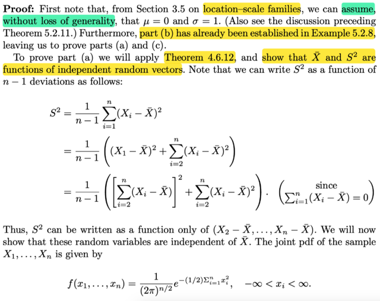</kbd>

<kbd>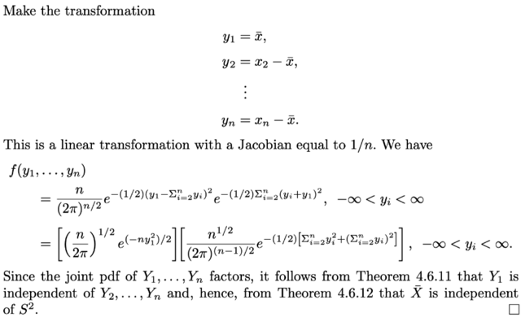</kbd>

<kbd>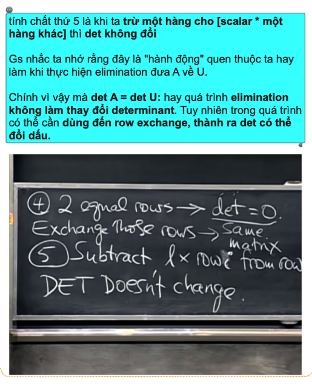</kbd>

> [!NOTE]
> Để chứng minh ý b): X̄ và S² độc lập, nhìn khá khoai. Nhưng chiến lược
> hay ý tưởng là dùng cái theorem (..) đã học ở những chương trước nói rằng:
> nếu như X, Y là hai random variable độc lập thì g(X), h(Y) cũng độc lập nhau.
> (tức là apply function g và h lên X và Y để có hai random variable mới, thì chúng
> cũng độc lập)
>
>
>
> Và cụ thể thì ta sẽ cho thấy rằng Y1 = X̄, sẽ độc lập với Y2,...Yn Và S² chỉ
> là function theo Y2,...Yn ⇨ cũng độc lập với Y1, tức X̄.
>
>
>
> Đầu tiên họ sẽ chứng minh cho thấy S² chỉ là function của Y1,...Yn 
>
>
>
> (Y1 = X1 - X̄)
>
>
>
> Dựa vào: 
>
>
>
> Σi (Xi - X̄) = 0 (cái này dễ thấy)
>
>
>
> (X1 - X̄) + Σi=2:n (Xi - X̄) = 0
>
>
>
> ⇔ (X1 - X̄) = - Σi=2:n (Xi - X̄)
>
>
>
> ⇨ (X1 - X̄)² = [Σi=2:n (Xi - X̄)]²
>
>
>
> S² = [1/(n-1)] Σi (Xi - X̄)²
>
>
>
> = [1/(n-1)] [(X1 - X̄)² + Σi=2:n (Xi - X̄)²]
>
>
>
> = [1/(n-1)] [[Σi=2:n (Xi - X̄)]² + Σi=2:n (Xi - X̄)²]
>
>
>
> ⇨ S² chỉ là hàm phụ thuộc X2-X̄,....Xn-X̄
>
>
>
> Và sau đó ta sẽ chứng minh các rv này independent với X̄ thì như vậy
> S² là hàm của các biến mà chúng độc lập với X̄, thì như Y = g(Z) mà Z
> độc lập với X thì Y độc lập với X
>
>
>
> Và người ta chứng minh điều này bằng cách xuất phát từ joint pdf của X1,...Xn
>
>
>
> Sau đó đặt Y1 = X̄, Y2 = X2 - X̄,....Yn = Xn - X̄
>
>
>
> ta sẽ xây dựng joint pdf của Y1, ...Yn và cho thấy nó có dạng là tích của 
> một hàm theo y1, và một hàm theo y2,....yn. Từ đó kết luận Y1 độc lập với Y2,..Yn
>
>
>
> Từ đó chứng minh xong.
>
>
>
> Sau đây sẽ là mình làm chi tiết bước này:
>
>
>
> joint pdf của X1,...Xn:
>
> Sau đây sẽ là mình làm chi tiết bước này:
>
>
>
> joint pdf của X1,...Xn:
>
>
>
> Vì X1,...Xn độc lập nên joint pdf = tích marginal pdf (là pdf của normal(0, 1)
>
>
>
> fX1(x) = [1/√(2π)] e^-x² / 2
>
>
>
> ⇨ f(x1,...xn) = Πi=1:n [1/√(2π)] e^-xi² / 2
>
>
>
> = [1/√(2π)]^n Πi=1:n e^-xi² / 2
>
>
>
> = [1/√(2π)]^n e^[Σi=1:n -xi² / 2]
>
>
>
> = [1/√(2π)]^n e^[(1/2)Σi=1:n -xi²]
>
>
>
> Đổi biến:
>
>
>
> Y1 = X̄, Y2 = X2 - X̄
>
>
>
> y1 = x̄
>
>
>
> y2 = x2 - x̄
>
>
>
> y3 = x3 - x̄
>
>
>
> ..
>
>
>
> (x1 - x̄) = - Σi=2:n (xi - x̄)
>
>
>
> ⇨ x1 = x̄ - Σi=2:n (xi - x̄) = y1 - Σi=2:n yi
>
>
>
> ⇨ ∂x1/∂y1 = 1, ∂x1/∂y2 = ∂x1/∂yn = -1
>
>
>
> x2 = y2 + x̄ = y2 + y1
>
>
>
> ⇨ ∂x2/∂y1 = ∂x2/∂y2 = 1, ∂x2/∂y3 = ...∂x2/∂yn = 0
>
>
>
> x3 = y3 + y1
>
>
>
> ⇨ ∂x3/∂y1 = ∂x3/y3 = 1, ∂x3/∂y2 và các cái khác = 0
>
>
>
> ...
>
>
>
> ⇨ ta có Jacobinan có dạng:
>
>
>
> [1 -1 -1...-1]
> [1 1 0...0]
> [1 0 1...0]
> ...
> [1 0 0...1]
>
>
>
> Tới đây chưa vội tính det cái này, mà dùng một tính chất đã học ở mit1806
> thay 1 hàng bằng cách trừ nó cho 1 hàng khác (nhân scalar) thì det ko
> đổi. Nên lần lượt ta biến đổi matrix qua một chuỗi các matrix mà mỗi bước
> ta lần lượt lấy hàng 1 = hàng 1 + hàng 2, rồi hàng 1 = hàng 1 + hàng 3,...
> để cuối cùng ta có:
>
>
>
> [n 0 0...0]
> [1 1 0...0]
> [1 0 1...0]
> ...
> [1 0 0...1]
>
>
>
> Tới đây dùng cofactor formula: 
>
>
>
> Tính theo hàng 1, thì nó bằng a11. (+) det matrix M11 (M11 là matrix bỏ
> hàng 1 cột 1), chính là I, có det = 1 (tính chất đầu tiên của det) 
>
>
>
> ⇨ det J = a11*1 = a11 = n
>
>
>
> Transformation theorem:
>
>
>
> f𝐘(y1, y2,..yn) = f𝐗(x1,x2...xn) | J | = [1/√(2π)]^n e^[(1/2)Σi=1:n -xi²] n
>
>
>
> Tiếp thế x1 = y1 - Σi=2:n yi
>
>
>
> x2 = y2 + y1, x3 = y3 + y1, ... xn = yn + y1
>
>
>
> ... = [1/√(2π)]^n e^[(1/2)Σi=1:n -xi²] n
>
>
>
> = (n/[√(2π)]^n) e^[(1/2)Σi=1:n -xi²]
>
>
>
> = (n/[√(2π)]^n) e^(1/2)[-x1² + Σi=2:n -xi²]
>
>
>
> = (n/[√(2π)]^n) e^(-1/2)[x1² + Σi=2:n xi²]
>
>
>
> Thay x1 = y1 - Σi=2:n yi = y1 - S (đặt S = Σi=2:n yi)
>
>
>
> x2 = y2 + y1, ...
>
>
>
> = (n/[√(2π)]^n) e^(-1/2)[(y1 - S)² + Σi=2:n (yi + y1)²]
>
>
>
>
>
>
>
> a) (y1 - S)² = y1² - 2y1S + S²
>
>
>
> b) Σi=2:n (yi + y1)² = Σi=2:n (yi² + y1² + 2yiy1)
>
>
>
> = Σi=2:n yi² + Σi=2:n y1² + Σi=2:n 2yiy1
>
>
>
> = Σi=2:n yi² + (n-1) y1² + 2y1 Σi=2:n yi
>
>
>
> = Σi=2:n yi² + (n-1) y1² + 2y1S
>
>
>
> ⇨ (y1 - S)² + Σi=2:n (yi + y1)²
>
>
>
> = y1² - 2y1S + S² + Σi=2:n yi² + (n-1) y1² + 2y1S
>
>
>
> = y1² + (n-1) y1² + S² + Σi=2:n yi² 
>
>
>
> = n y1² + S² + Σi=2:n yi² 
>
>
>
> = n y1² + (Σi=2:n yi)² + Σi=2:n yi² 
>
>
>
> ⇨ (n/[√(2π)]^n) e^(-1/2)[(y1 - S)² + Σi=2:n (yi + y1)²]
>
>
>
> = (n/[√(2π)]^n) e^(-1/2)[n y1² + (Σi=2:n yi)² + Σi=2:n yi² ]
>
>
>
> = (n/[√(2π)]^n)    e^(-1/2)[n y1²]    e^[(Σi=2:n yi)² + Σi=2:n yi² ]
>
>
>
> là tích của  e^(-1/2)[n y1²]  chỉ chứa y1
>
>
>
> và e^[(Σi=2:n yi)² + Σi=2:n yi² ] chỉ chứa y2,...yn
>
>
>
> mà nhớ là đây là joint pdf của Y1,...Yn ⇨ Y1 độc lập với Y2,...Yn
>
>
>
> ⇨ Y1 cũng độc lập với S² (là function của Y2,...Yn)
>
>
>
> ⇨ X̄ (=Y1)  cũng độc lập với S² (là function của Y2,...Yn)

> [!TIP]
> 🤖 **AI Check** — 🟡 Minor issues — ✅ **92/100** · ✓ Move on
>
> Ghi chú rất xuất sắc khi tự mình tính toán chi tiết định thức Jacobian (vận dụng kiến thức MIT 18.06) và khai triển đại số ở số mũ mà sách giáo khoa bỏ qua. Có một vài sơ suất nhỏ về ký hiệu và thiếu hệ số -1/2 khi chép lại số mũ ở bước cuối nhưng không ảnh hưởng tới bản chất suy luận độc lập.
>
> **🟡 Minor issues**
>
> **1.** *"= (n/[√(2π)]^n)    e^(-1/2)[n y1^2]    e^[(Σi=2:n yi)^2 + Σi=2:n yi^2 ]"*
>
> Khi tách tích hai hàm mũ, bạn bị sót hệ số -1/2 ở số mũ của thừa số thứ hai. Đúng ra phải là e^(-1/2)[(Σ yi)^2 + Σ yi^2]. Dù vậy, hàm này vẫn chỉ phụ thuộc vào (y2,...,yn) nên tính chất phân rã độc lập vẫn giữ nguyên.
>
> **2.** *"Để chứng minh ý b): X̄ và S^2 độc lập"*
>
> Trong giáo trình, việc chứng minh X̄ và S^2 độc lập là ý (a) (To prove part (a)...), còn ý (b) đã được chứng minh từ ví dụ trước.
>
> **3.** *"Đầu tiên họ sẽ chứng minh cho thấy S^2 chỉ là function của Y1,...Yn 

(Y1 = X1 - X̄)"*
>
> Đoạn nháp này hơi nhầm lẫn ký hiệu ban đầu khi gán Y1 = X1 - X̄, tuy nhiên ngay sau đó bạn đã chỉnh lại chuẩn xác biến đổi theo (X2 - X̄, ..., Xn - X̄) và đặt Y1 = X̄.
>
>
> **✓ Strengths**
> - Tự lực giải quyết trọn vẹn bước tính định thức Jacobian của phép đổi biến ngược bằng cách biến đổi hàng và khai triển Laplace theo hàng 1, giải thích rõ ràng tại sao lại xuất hiện hệ số n.
> - Nắm rất vững chiến lược cốt lõi: phân rã joint pdf của (Y1, ..., Yn) thành tích g(y1)h(y2,...,yn) để suy ra Y1 độc lập với nhóm (Y2,...,Yn), từ đó kéo theo tính độc lập với S^2.
> - Khai triển đại số chi tiết và chính xác cho tổng bình phương ở số mũ.
>
> **💡 Deeper notes**
> - Sách ghi 'Jacobian equal to 1/n' vì họ đang xét Jacobian của phép biến đổi thuận (từ x sang y), còn khi thay vào công thức đổi biến joint pdf ta cần Jacobian của phép biến đổi ngược (từ y sang x) nên định thức bằng n (hoặc lấy nghịch đảo 1/(1/n) = n). Ghi chú của bạn tính trực tiếp ma trận ngược này là hoàn toàn chuẩn xác.
> - Chứng minh này ngầm dựa trên giả thiết mẫu ngẫu nhiên từ phân phối chuẩn N(0, 1) (không mất tính tổng quát nhờ tính chất họ vị trí - tỉ lệ scale-location family).

 

###### Bổ đề Chi-square

<kbd>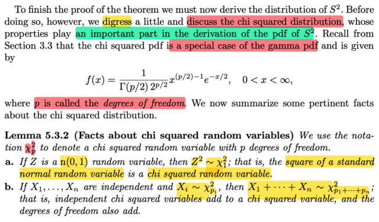</kbd>

<kbd>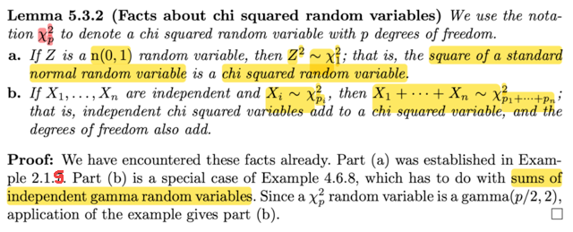</kbd>

> [!NOTE]
> đại khái là ta sẽ lạc đề tí, bàn qua Chi-square một chút trước khi quay lại vì distribution này có tầm quan trọng trong việc triển khai ra pdf của sample variance S².
>
>
>
> Phần trước mình đã biết qua Chi-square là một trường hợp đặc biệt của Gamma, có pdf là:
>
>
>
> f(x) = \[1/Γ(p/2)2^(p/2)\] x^\[(p/2)-1\] e^(-x/2), 0 &lt; x &lt; ∞, p là bậc tự do
>
>
>
> Thì bổ đề này cho biết đại ý là:
>
>
>
> a) Nếu Z là normal (0, 1) thì Z² sẽ là Chi-square 1 bậc tự do, kí hiệu χ²\_1
>
>
>
> b) nếu ta có X1, X2,....Xn là các Chi-square rv độc lập với các bậc tự do tương ứng Xi \~ χ²\_pi, thì tổng của chúng cũng là Chi-square và bậc tự do thì cộng lại
>
>
>
> ---
>
>
>
> Chứng minh: 
>
>
>
> Phần a thì dựa trên ví dụ trong chương 2, nơi mình đã tìm pdf của Y = g(X) = X². Từ đó áp dụng sự thật là X là normal(0,1) thì bỏ pdf của nó vô ta sẽ có pdf của Y là pdf của χ²\_1
>
>
>
> Dùng kết quả của Example 2.1.7, ta có fY(y) = (1/2√y) fX(√y) + (1/2√y) fX(-√y)
>
>
>
> Nếu X \~ n(0,1), fX(x) = (1/√2π) exp(-x²/2) ⇒ fX(√y) = (1/√2π) exp(-y/2) và fX(-√y) cũng vậy
>
>
>
> → fY(y) = (1/2√y) (1/√2π) exp(-y/2) + (1/2√y) (1/√2π) exp(-y/2)
>
>
>
> = (1/√y) (1/√2π) exp(-y/2)
>
>
>
> = (1/√2π) (1/√y) exp(-y/2) 
>
>
>
> theo công thức f(x) = \[1/Γ(p/2)2^(p/2)\] x^\[(p/2)-1\] e^(-x/2), 0 &lt; x &lt; ∞, p là bậc tự do
>
>
>
> thì đây chính là Chi-square với p = 1, χ²\_1:
>
>
>
> Để thấy rõ, nhắc lại vài tính chất hàm Gamma: Γ(a) = ∫0:inf t^(a-1)e^(-t) dt, Γ(1) = 1, Γ(1/2) = √π
>
>
>
> \[1/Γ(1/2)2^(1/2)\] x^\[(1/2)-1\] e^(-x/2)
>
>
>
> = (1/√π√2) (1/√x) e^(-x/2)
>
>
>
> = (1/√2π) (1/√x) e^(-x/2)
>
>
>
> ---
>
>
>
> Bên cạnh đó, ta cũng PDF của Gamma(α, β) = 1/\[Γ(α)β^α\] x^(α-1) e^(-x/β)
>
>
>
> Nên χ²\_1 chính là Gamma(1/2,2)
>
>
>
> ---
>
>
>
> Còn phần b thì dựa trên ví dụ trong chương 4 đã làm để thấy tổng của các Γ cũng là Γ, với tham số cộng lại. Ở đây gs nói vì Chi-square là một loại Γ cụ thể là Γ(p/2, 2) nên dĩ nhiên nó cũng đúng.

> [!TIP]
> 🤖 **AI Check** — 🟢 Pass — ✅ **98/100** · ✓ Move on
>
> Ghi chú rất xuất sắc, không chỉ tóm tắt chính xác nội dung bổ đề mà còn chủ động giải chi tiết lại phép biến đổi biến ngẫu nhiên và chứng minh tính tương đương giữa Gamma(1/2, 2) và Chi-bình phương 1 bậc tự do.
>
> **✓ Strengths**
> - Nắm vững và diễn giải trực quan, chính xác hai tính chất quan trọng của phân phối Chi-bình phương trong Bổ đề 5.3.2.
> - Tự triển khai đầy đủ và chính xác công thức đạo hàm hàm mật độ qua phép đổi biến Y = X² từ phân phối chuẩn tắc.
> - Chứng minh mạch lạc sự trùng khớp giữa Chi-square(1) và Gamma(1/2, 2) thông qua giá trị hàm Gamma tại 1/2 là √π.
>
> **💡 Deeper notes**
> - Ở phần (b), tính chất cộng của các biến ngẫu nhiên Gamma (tổng các biến Gamma độc lập là một biến Gamma với shape parameter cộng lại) chỉ đúng khi tất cả các biến đó có cùng scale parameter β. Trong trường hợp Chi-bình phương, điều này luôn thỏa mãn vì mọi χ²_p đều có chung β = 2.

**🔗 See also:** [PDF của Y=X²](./21_distribution.md#node-6yi0r3h) · [Tổng biến ngẫu nhiên Gamma](./46_multi_variate_distribution.md#node-08ciur5) · [Ước lượng Satterthwaite](./72_method_of_finding_estimators.md#node-fosb15b) · [Pooled Estimator and Student t Distribution](./111_2_introduction_one_way_anova.md#node-680r0w1) · [Hàm Gamma và Tính chất](./33_continuous_distribution.md#node-4frhl19) · [Phân phối Chi-squared từ Y=X²](./21_distribution.md#node-f14tr9i) · [Hàm Gamma và Phân phối Gamma](./33_continuous_distribution.md#node-xt1ypib)

 

###### Chứng minh S² Chi-square

<kbd>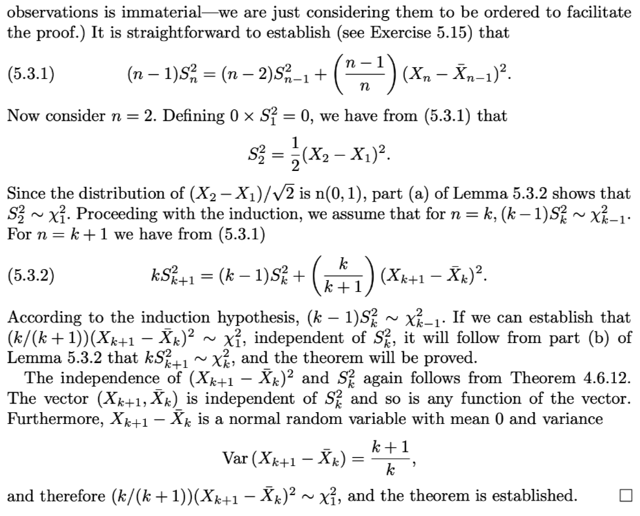</kbd>

<kbd>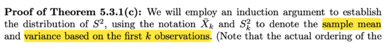</kbd>

> [!NOTE]
> Phần này gs chứng minh vế cuối của theorem: là nếu X1,...Xn là random sample từ normal(μ, σ²) thì
>
>
>
> c): (n-1)S²/σ sẽ là Chi-square n-1 (χ²\_n-1)
>
>
>
> Ko làm mất tính khái quát ta có thể xét normal (0,1) (vì sao?)
>
>
>
> Có nghĩa là cần chứng minh (n-1)S² sẽ là Chi-square n-1
>
>
>
> Đầu tiên phải ta sẽ chấp nhận công thức sample variance của mẫu size n sẽ quan hệ với sample variance của mẫu size n-1 bởi:
>
>
>
> (n - 1)S²\_n = (n - 2)S²\_n-1 + (n-1)/n (Xn - X̄\_n-1)²
>
>
>
> X̄\_n-1 là sample mean của mẫu size n-1, (X1,...Xn-1)
>
>
>
> Chứng minh nó đúng với n=2, tức chứng minh (2-1)S²\_2/σ (sample variance của bộ có 2 cái X1, X2) là một Chi-square 1
>
>
>
> Thì S²\_2 = 1/(2-1) \[(X1 - X̄)² + (X2 - X̄)²\] triển khai ra sẽ = (1/2)(X2 - X1)²
>
>
>
> Và vì X2, X1 đều là normal(0,1) nên X2 - X1 cũng là normal rv, vì sao?
>
>
>
> Vì theorem trước đây đã có nói (theo link), tổng của hai rv independent normal sẽ cũng là một normal, với param mean = tổng mean và variance = tổng variance. Ở đây X1, X2 là independent normal(0,1), thì -X1 cũng là normal(0, 1), (vì tuy có thể trả lời bằng cách derive pdf, nhưg có thể dùng location scale không? nó nói nếu Z \~ standard pdf f(x), thì σZ + μ sẽ là family member có location μ và scale param σ. với normal thì location và scale cũng là mean và standard deviation nên σZ + μ sẽ có mean μ, variance σ², ở đây -X1 = (-1)\*X1 + 0 ⇨ -X1 distribution cũng là thành viên với location = mean là 0, scale = -1 ⇨ variance = (-1)² = 1
>
>
>
> Vậy X2 - X1 là normal(0 + 0, 1 + 1) = normal(0, 2).
>
>
>
> Tiếp, xét (X2 - X1)/2 thì cũng lại dùng location scale theorem: Nói rằng nếu X \~ thành viên có location μ, scale σ thì Z = (X - μ)/ σ sẽ là thành viên chuẩn (location 0, scale 1) Nên ở đây (X2 - X1) là thành viên location 0, scale √2 ⇨ \[(X2 - X1) - 0\]/√2 chính là sẽ ra thành viên chuẩn (location 0, scale 1) mà xét trong bối cảnh normal thì sẽ là mean 0, std 1 ⇨ normal(0,1)
>
>
>
> Vậy (X2 - X1)/√2 là normal(0,1) ⇨ \[(X2 - X1)/√2\]² = (X2 - X2)/2 là Chi-square 1
>
>
>
> Hay, (2-1) S²\_2 (hay (n-1)S²\_n với n = 2) là Chi-square 1
>
>
>
> ====
>
>
>
> Thế thì, theo quy nạp, ta sẽ giả sử điều đang cần chứng minh đúng ở mẫu size k thì nếu ta chứng minh nó cũng đúng ở mẫu size k+1 thì sẽ có thể theo nguyên lí quy nạp (induction) mà kết luận nó đúng với mọi size
>
>
>
> Vậy thì ta giả sử nó đúng với mẫu size k, tức là (k-1)S²\_k/σ (sample mean của mẫu size k (tức gồm X1,...Xk) là một Chi-square (k-1)
>
>
>
> Theo công thức (n - 1)S²\_n = (n - 2)S²\_n-1 + (n - 1)/n (Xn - X̄\_n-1)²
>
>
>
> ta có (k + 1 - 1)S²\_k+1 = (k + 1 - 2)S²\_k+1-1 + (k+1-1)/k+1 (X_k+1 - X_k+1-1_bar)²
>
>
>
> ⇔ kS²\_k+1 = (k-1)S²\_k + (k/k+1) (X_k+1 - X̄\_k)²
>
>
>
> Với việc đã giả thiết (k-1)S²\_k là Chi-square (k-1) thì ta cần chứng minh S²\_k+1 là Chi-square k
>
>
>
> Xét term thứ 2: (k/k+1) (X_k+1 - X̄\_k)²
>
>
>
> Đại khái là vầy: X_k+1 - X̄\_k = X_k+1 - (X1 + X2 + ...Xk) / k. Và cái này là tổng của các normal (X_k+1, -X1/k, -X2/k,.. đều là normal, chỉ khác param) Và có thể làm kĩ để xem nó là normal param bao nhiêu hoặc chỉ dùng linearity tính variance của nó.
>
>
>
> Làm kĩ: X_k+1 thì là normal(0,1) rồi, -X1/k = (-1/k) X1 + 0, với X1 là standard member thì (-1/k) X1 + 0 là member với location 0, scale -1/k, và với việc X1 là normal thì ⇨ ta có (-1/k) X1 \~ normal(0, 1/k²). Tương tự với (-1/k) X2,....(-1/k) Xk
>
>
>
> ⇨ X_k+1 - (X1 + X2 + ...Xk) / k \~ normal(0 + ..0, 1 + Σi=1:k 1/k²) = normal(0, 1 + k/k²)
>
>
>
> tức là variance của nó: = 1 + k/k² = 1 + 1/k = **(k+1)/k**
>
>
>
> Còn không có thể tính Var(X_k+1 - X̄\_k) = Var(X_k+1 - (X1 + X2 + ...Xk) / k)
>
>
>
> = Var(X_k+1) + Var(-X1/k) + Var(-X2/k) + ...+ Var(-Xk/k) | Ta có điều này là vì các
>
>
>
> X_k+1, -X1/k, -X2/k,... mutually independent ⇨ covariance bằng 0 = 1 + (1/k²) Var(X1) + (1/k²) Var(X2) + ...(1/k²) Var(Xk) | dùng tính chất của variance:
>
>
>
> Var(cX) = c² Var(X)
>
>
>
> = 1 + (1/k²) + ...(1/k²) = 1 + k/k² = 1 + 1/k
>
>
>
> Tiếp, vậy X_k+1 - X̄\_k là normal (0, (k+1)/k), nên lại theo location scale theorem:
>
>
>
> (chú ý nói X_k+1 - X̄\_k là normal (0, (k+1)/k) thì tức là nó là member có location 0 scale √(k+1)/k nhé)
>
>
>
> \[(X_k+1 - X̄\_k) - 0\] / √\[(k+1)/k\] sẽ là standard member có location 0, scale 1, tức normal(0,1)
>
>
>
> ⇨ √(k/k+1)(X_k+1 - X̄\_k) \~ normal (0,1)
>
>
>
> Và suy ra bình phương của nó là Chi-square 1
>
>
>
> \[√(k/k+1)(X_k+1 - X̄\_k)\]² = **(k/k+1)**(X_k+1 **-** X̄\_k)\*\*² **\~ Chi-square 1**
>
>
>
> ====
>
>
>
> Vậy quay lại đây kS²\_k+1 = (k-1)S²\_k + (k/k+1) (X_k+1 - X̄\_k)²
>
>
>
> Ta đã có S²\_k theo giả thiết là Chi-square k
>
>
>
> Nay ta đã chứng minh (k/k+1) (X_k+1 - X̄\_k)² là Chi-square 1
>
>
>
> Vậy dùng cái theorem vữa nãy, nói là tổng của các chi-square sẽ là chi-square với bậc tự do cộng lại. Suy ra (k-1)S²\_k + (k/k+1) (X_k+1 - X̄\_k)² là một Chi-square có k + 1 bậc tự do. Chứng minh xong kS²\_k+1 là Chi-square k + 1
>
>
>
>
>
> Một điểm quan trọng có thể bỏ xót. Phải nói rõ là các Chi-square độc lập thì mới áp dụng theorem tổng Chi-square cũng là Chi-square nhé. Nên ở đây trong sách giáo sư Casella có chỉ ra S²\_k độc lập với X_k+1 - X̄\_k
>
>
>
> Và vì sao chúng độc lập là vì vế a) của theorem 5.3.1 nói rằng với X1,..Xn là random sample từ normal(μ, σ²) thì X̄ và S² độc lập nhau.
>
>
>
> Vậy với random sample size k từ normal(0, 1) thì sample mean X̄\_k và sample variance S²\_k cũng độc lập nhau. Mà như vậy thì X_k+1 - X̄\_k cũng độc lập với S²\_k vì S²\_k chả liên quan gì đến X_k+1 (vì nó chỉ liên quan X1,...Xk)

> [!TIP]
> 🤖 **AI Check** — 🔴 Critical issues — ❌ **68/100** · ✗ Fix first
>
> Ghi chép thể hiện sự nắm bắt rất tốt về các bước biến đổi và lập luận tính độc lập, tuy nhiên ở bước chốt của phép quy nạp bạn đã nhầm lẫn bậc tự do khiến kết luận bị sai lệch thành Chi-square k+1 thay vì k.
>
> **🔴 Critical issues**
>
> **1.** *"Ta đã có Sk^2 theo giả thiết là Chi-square k ... Suy ra (k-1)Sk^2 + (k/k+1) (Xk+1 - Xk_bar)^2 là một Chi-square có k + 1 bậc tự do. Chứng minh xong kSk+1^2 là Chi-square k + 1"*
>
> Theo giả thiết quy nạp, (k-1)S_k^2 có phân phối Chi-square với k - 1 bậc tự do (chứ không phải k). Do đó khi cộng với số hạng thứ hai có phân phối Chi-square 1 bậc tự do, tổng k*S_{k+1}^2 có phân phối Chi-square với (k - 1) + 1 = k bậc tự do. Việc ghi nhận thành k + 1 bậc tự do mâu thuẫn trực tiếp với định lý cần chứng minh là (n-1)S_n^2 ~ Chi-square(n-1).
>
>
> **🟡 Minor issues**
>
> **1.** *"(n-1)S^2/σ sẽ là Chi-square n-1"*
>
> Mẫu số chuẩn hóa phải là phương sai σ² chứ không phải độ lệch chuẩn σ: (n-1)S²/σ² ~ Chi-square(n-1).
>
> **2.** *"tức là (k-1)Sk^2/σ  (sample mean của mẫu size k (tức gồm X1,...Xk) là một Chi-square (k-1)"*
>
> Gõ nhầm thuật ngữ 'sample mean' thay vì 'sample variance' khi đang nói về S_k².
>
> **3.** *"[(X2 - X1)/√2]^2 = (X2 - X2)/2"*
>
> Lỗi gõ nhầm (typo) ở tử số, đúng ra phải là (X2 - X1)²/2.
>
> **4.** *"scale = -1"*
>
> Theo quy ước định nghĩa họ location-scale, tham số scale luôn là một số dương (σ > 0); phép nhân với -1 cho scale là |-1| = 1.
>
>
> **✓ Strengths**
> - Trình bày và dẫn dắt rất tường minh, chi tiết bước cơ sở n = 2 bằng tính chất tổng/hiệu của hai biến chuẩn độc lập.
> - Tự tính toán chuẩn xác kỳ vọng và phương sai của biến ngẫu nhiên X_{k+1} - X̄_k thông qua tính chất tuyến tính của phương sai.
> - Nắm rất vững và giải thích đúng điều kiện cần thiết về tính độc lập giữa S_k² và X̄_k (theo Theorem 5.3.1a) để áp dụng định lý cộng các biến Chi-square.
>
> **💡 Deeper notes**
> - Cần lưu ý phân biệt rạch ròi giữa kích thước mẫu (k, k+1) và bậc tự do của phân phối Chi-square (k-1, k) để tránh nhầm lẫn ở bước cộng bậc tự do.
> - Việc giả sử normal(0, 1) không làm mất tính tổng quát vì với mẫu chuẩn bất kỳ N(μ, σ²), ta luôn chuẩn hóa được Z_i = (X_i - μ)/σ và khi đó (n-1)S²/σ² chính là tổng bình phương sai lệch của các biến Z_i chuẩn hóa.

**🔗 See also:** [MGF của tổng phân phối chuẩn](./42_conditional_distributions_independent.md#node-tk1wnj7) · [Tính chất Trung bình & Phương sai mẫu](#node-aytwme7)

 

###### Độc lập trung bình phương sai

<kbd>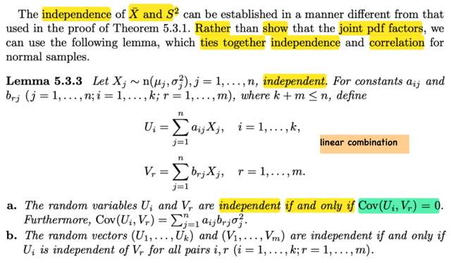</kbd>

> [!NOTE]
> Đại khái là  tác giả nói có thể chứng minh sample mean và sample variance 
> độc lập bằng cách khác, thay vì như lúc nãy ta đã làm là chứng minh
> joint pdf của chúng tách ra. Thì đầu tiên sẽ biết qua bổ đề sau:
>
>
>
> Đại khái nó nói là: cho X1,...Xn là các rv ~ normal(μj, σj²) j = 1,...n 
>
>
>
> thì với các constant aij, brj ta định nghiã ra:
>
>
>
> Ui = Σj aij Xj 
>
>
>
> và Vr = Σj brj Xj
>
>
>
> Có nghĩa là ta có các random variable mới Ui, tạo ra bởi linear combine
> các random variabel X1,..Xn
>
>
>
> Khi đó: 
>
>
>
> a)Ui và Vr đọc lập khi và chỉ khi Cov(Ui, Vr) = 0 và hơn nữa  
> Cov(Ui, Vr) = Σj aijbrj j²
>
>
>
> b) random vector (U1,...Uk) và (V1,...Vm) độc lập khi và chỉ khi Ui độc lập
> với Vr với mọi cặp i, j

> [!TIP]
> 🤖 **AI Check** — 🟡 Minor issues — ⚠️ **85/100** · ✓ Move on
>
> Ghi chú đã nắm đúng tinh thần và nội dung chính của Bổ đề 5.3.3 về mối liên hệ giữa tính độc lập và hiệp phương sai của các tổ hợp tuyến tính từ biến chuẩn. Tuy nhiên, bạn đã bỏ quên giả thiết độc lập ban đầu của các $X_j$ và có hai lỗi gõ phím nhỏ ở công thức hiệp phương sai và chỉ số cặp.
>
> **🟡 Minor issues**
>
> **1.** *"cho X1,...Xn là các rv ~ normal(μj, σj^2) j = 1,...n"*
>
> Bổ đề yêu cầu các biến ngẫu nhiên $X_1, \dots, X_n$ phải độc lập với nhau (independent). Thiếu điều kiện này thì công thức tính Covariance và tính chất tương đương độc lập sẽ không còn áp dụng trực tiếp như vậy.
>
> **2.** *"Cov(Ui, Vr) = Σj aijbrj j^2"*
>
> Lỗi gõ phím: công thức đúng là $\sum_j a_{ij} b_{rj} \sigma_j^2$ (phương sai $\sigma_j^2$), không phải $j^2$.
>
> **3.** *"với mọi cặp i, j"*
>
> Lỗi nhầm chỉ số: $U_i$ đi với chỉ số $i$ ($1 \le i \le k$) và $V_r$ đi với chỉ số $r$ ($1 \le r \le m$), nên phải là 'với mọi cặp $i, r$' thay vì 'cặp $i, j$'.
>
>
> **✓ Strengths**
> - Nắm bắt chính xác mục đích của đoạn trích: dùng bổ đề về tổ hợp tuyến tính để chứng minh tính độc lập của $\bar{X}$ và $S^2$ thay vì phân tích hàm mật độ đồng thời (joint pdf).
> - Hiểu đúng bản chất của $U_i$ và $V_r$ là các tổ hợp tuyến tính của các biến ngẫu nhiên ban đầu.
> - Nắm chuẩn hai mệnh đề then chốt: độc lập tương đương với hiệp phương sai bằng 0 cho từng cặp, và hai vector độc lập khi mọi cặp thành phần độc lập.
>
> **💡 Deeper notes**
> - Cần lưu ý điều kiện kích thước $k + m \le n$ trong bổ đề để đảm bảo tính hợp lệ khi chuyển đổi cơ sở/biến ngẫu nhiên.
> - Tính chất 'độc lập $\iff \text{Cov} = 0$' chỉ đúng đặc biệt đối với phân phối chuẩn (jointly normal), trong trường hợp tổng quát không phân phối chuẩn thì Cov bằng 0 chỉ có nghĩa là không tương quan chứ chưa chắc độc lập.

 

###### Điều kiện độc lập tổ hợp Normal

<kbd>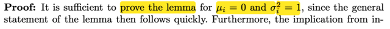</kbd>

<kbd>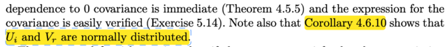</kbd>

> [!NOTE]
> đầu tiên giáo sư cho rằng có thể chứng minh bổ đề này với μi = 0, σi² = 1
> ta sẽ quay lại ý này sau.
>
>
>
> Còn bây giờ ôn lại vài cái đã học:
>
>
>
> X, Y independent thì Cov(X, Y) = 0. Đại khái là vì (tức là lập luận để chứng 
> minh) Cov(X,Y) = E[(X - EX)(Y - EY)] = triển khai ra ta sẽ có công thức thứ 2:
>
>
>
> = E[XY - (EX)Y - XEY + EXEY]
>
>
>
> = E(XY) - E[(EX)Y] - E[XEY] + E(EXEY)
>
>
>
> = E(XY) - EXEY - EYEX + EXEY | linearity
>
>
>
> = E(XY) - EXEY 
>
>
>
> Mà với X, Y independent thì E(XY) = EXEY (chứng minh bằng cách dùng
> 2D lotus, sau đó phân tách joint pdf thành tích marginal pdf để đưa
> về tích hai tích phân ⇨ EX EY)
>
>
>
> Vậy ⇨ Cov(X,Y) = 0
>
>
>
> Tiếp, chứng minh ý thứ hai: Cov(Ui, Vr) = Σj aij brj σj²
>
>
>
> Ui = Σj aij Xj, Vr = Σj brj Xj
>
>
>
> Cov(Ui, Vr) = E[(Ui - EUi)(Vr - EVr)]
>
>
>
> EUi = E[Σj aij Xj] = Σj aij EXj (linearity) = Σj aij μj
>
>
>
> Ui - EUi = Σj aij Xj -  Σj aij μj =  Σj aij (Xj - μj)
>
>
>
> EVr = E[Σj brj Xj] = Σj brj EXj = Σj brj μj
>
>
>
> Vr - EVr = Σj brj Xj - Σj brj μj = Σj brj (Xj - μj) 
>
>
>
> ⇨ Cov(Ui, Vr) = E[Σj aij (Xj - μj) Σj brj (Xj - μj)]
>
>
>
> = E[[ai1(X1 - μ1) + ai2(X2 - μ2) + ...][br1(X1 - μ1) + br2(X2 - μ2) + ...]]
>
>
>
> = E[
>
>
>
> ai1br1(X1 - μ1)² + ai2br2(X2 - μ2)² + ...
>
>
>
> + 2ai1br2(X1 - μ1)(X2 - μ2) + ... (các cross term)
>
>
>
> ]
>
>
>
> = E[Σj=1:n aijbrj (Xj - μj)² + Σk=1:n, h=1:n, k≠h aik brh (Xk - μk)(Xh - μh) ]
>
>
>
> Dùng linearity
>
>
>
> = Σj=1:n aijbrj E(Xj - μj)² + Σk=1:n, h=1:n, k≠h aik brh E(Xk - μk)(Xh - μh) 
>
>
>
> Các E(Xk - μk)(Xh - μh) = Cov(Xk, Xh) đều bằng 0 do Xk, Xh độc lập
>
>
>
> Còn E(Xj - μj)² = Var(Xj) = σj²
>
>
>
> ⇨ Cov(Ui, Vr) = Σj=1:n aijbrj σj² . Chứng minh xong
>
>
>
> ====
>
>
>
> Và cuối cùng, Hệ quả 4.6.10 (theo link xanh) ta có tổ hợp tuyến tính các normal
> rv cũng là normal
>
> Vậy thì nói thêm một chút: 
>
>
>
> Ở đây, ta sẽ chứng minh lemma này với μi = 0, σi² = 1. 
>
>
>
> Và cái ý a của Lemma đại khái là:
>
>
>
> Cho Xj ~ normal(μj, σj²) độc lập và ta có các Ui, Vr là các random variable
> tạo bởi tổ hợp tuyến tính của các rv Xj. Thì chúng sẽ độc lập khi và chỉ khi
> covariance của chúng bằng 0.
>
>
>
> Vậy thì cái ta cần chứng minh là cho thấy joint pdf của Ui, Vr phân tách
> thành tích các marginal pdf
>
>
>
> Và ta làm điều này với cái đã có là covariance của chúng = 0.
>
>
>
> Mà covariance của Ui, Vr như đã làm vừa rồi, = Σj=1:n aijbrj σj²
>
>
>
> Mà đã nói, ta sẽ đang chứng minh với σi = 1 ⇨ Σj=1:n aijbrj σj² = Σj=1:n aijbrj 
>
>
>
> ⇨ điều kiện ta đang có để dùng là **Σj=1:n aijbrj = 0
>
>
>
> Đây chính là cái ràng buộc (restriction) đối với các constant mà giáo sư 
> nói tới trong phần tiếp theo**

**🔗 See also:** [Định lý Độc lập Hiệp phương sai](./45_covariance_correlation.md#node-o2ergsg) · [Chứng minh tổng biến chuẩn](./46_multi_variate_distribution.md#node-uaywczk)

 

###### Độc lập biến chuẩn

<kbd>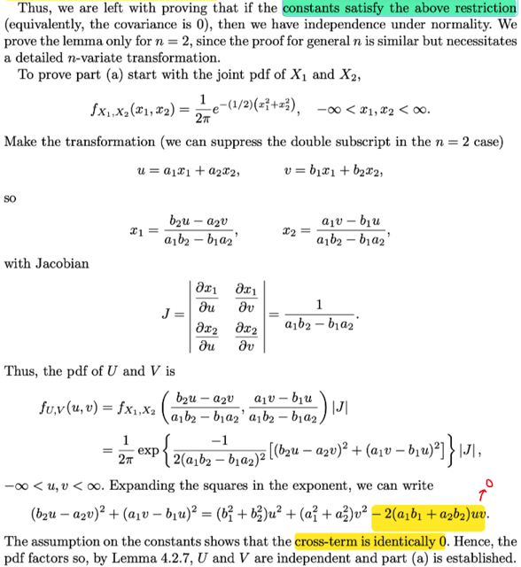</kbd>

> [!NOTE]
> Rồi, giáo sư nói tiếp, ta sẽ chứng minh lemma với n = 2, vì phần chứng minh với khái quát n cũng tương
> tự.
>
>
>
> Chứng minh với n = 2 tức là chứng minh: ta có X1 ~ n(μ1 = 0, σ1² = 1)  X2 ~ n(0, 1)
>
>
>
> (again, nhắc lại là giáo sư mở đầu đã nói ta có thể chứng minh với  μj = 0, σj = 1),
>
>
>
> Và Ui = Σj=1:2 aijXj = ai1X1 + ai2X2, tất nhiên có nhiều Ui, i = 1,...k
>
>
>
> Vr = Σj=1:2 brjXj = br1X1 + br2X2, r = 1,2...m
>
>
>
> Và ta sẽ chứng minh nếu cov(Ui, Vr) = 0
>
>
>
> (Mà điều này tương đương Σj=1:n aij brj σj² = Σj=1:n aij brj = 0)  thì joint pdf của Ui, Vr sẽ factor, tức
> chúng độc lập
>
>
>
> Rồi: Đơn giản là dùng transformation theorem thôi:
>
>
>
> Nhưng sẵn ôn lại tí: Bài toán đặt ra là ta triển khai ra joint pdf của U,V từ joint pdf đã có của X, Y.
>
>
>
> Vấn đề là để dùng theorem này, ta cần có MAPPING 1-1 TỪ SUPPORT SET CỦA X, Y TỚI ẢNH CỦA
> NÓ: Là sao?
>
>
>
> 𝒜 là support set của X,Y, đơn giản là tập (con của R², vì (X,Y) là R² random variable vector) mà
> trong đó joint pdf của X,Y dương.
>
>
>
> Dĩ nhiên là thông qua hàm g1, g2, thì U = g1(X,Y), V = g2(X, Y) thì các giá trị khả dĩ (x,y) của X, Y sẽ
> được map với u,v trong R². Nhưng mà ta sẽ chỉ quan tâm tới (x,y) trong 𝒜, vì tại đó mới là nơi "có
> thể xảy ra" (ý là giá trị của X,Y)
>
>
>
> Ảnh của 𝒜 tức là ℬ = {(u,v) ∈ R²: u = g1(x, y), v = g2(x, y) for some (x,y) ∈ 𝒜}
>
>
>
> Và mapping 1-1 giữa 𝒜 và ℬ tức là:
>
>
>
> với một (u,v) trong ℬ thì chỉ tìm thấy duy nhất một (x,y) trong 𝒜 mà thôi.
>
>
>
> (Và điều này không ngăn cản việc có thể có điểm (x,y) khác trong R² nằm ngoài 𝒜 được map với
> (u,v) nhưng vì tại (x,y) khác này, joint pdf của X,Y = 0 nên ko ảnh hưởng gì, nên theorem chỉ cần
> mapping 1-1 giữa 𝒜 với ℬ là đủ)
>
>
>
> Khi thỏa yêu cầu đó, thì từ (u,v) trong ℬ, như đã nói ta có thể tìm thấy (x,y) trong 𝒜: x = h1(u,
> v), y = h2(u,v) mà nếu điều kiện mapping 1-1 ko thỏa thì ta ko biết x, y là gì hết.
>
>
>
> Khi đó ta có thể có joint pdf của U,V từ joint pdf của X, Y như sau:
>
>
>
> fU,V(u,v) = fX,Y(x,y) |∂(x, y)/∂(u, v)|
>
>
>
> = fX,Y(h1(u,v), h2(u,v)) |∂(h1(u,v), h2(u,v))/∂(u, v)|
>
>
>
> ====
>
>
>
> Áp dụng vào bài toán này, nhắc lại, ta cần chứng minh Ui và Vr độc lập với Ui = Σj=1:2 aijXj tức, = ai1X1
> + ai2X2 và Vr = Σj=1:2 brj Xj = br1X1 + br2X2
>
>
>
> Cho i = 1,r = 1, tức là ta sẽ chứng minh U1, V1 độc lập, và cho gọn ta gọi là U, V với U = a1X1 + a2X2, V
> = b1X1 + b2X2 và "thành lập" random variable vector (U, V) (để mà ta sẽ chứng minh joint pdf của U, V
> factored, từ joint pdf của X1, X2)
>
>
>
> Vậy thì ở đây, U = g1(X1, X2) và V = g2(X1, X2) với g1(x1,x2) = a1x1 + a2x2, g2(x1,x2)  = b1x1 + b2x2
>
>
>
> Chúng đều là hàm tuyến tính, nên có thể nói là ta đã thỏa yêu cầu mapping 1-1 từ support set của X1,X2
> tới ảnh của nó.
>
>
>
> Hoặc đơn giản là ta thấy có thể giải tìm x,y từ u = g1(x,y), v = g2(x,y):
>
>
>
> u = a1x1 + a2x2; v = b1x1 + b2x2
>
>
>
> => x1 = (b2u - a2v) / (a1b2 - b1a2),
>
>
>
> Và x2 = (a1v - b1u) / (a1b2 - b1a2) (đây chính là h1, h2)
>
>
>
> Từ đó ta có Jacobian: ∂(x1,x2)/∂(u,v)
>
>
>
> Row 1: [∂x1/∂u, ∂x1/∂v] = [ b2 / (a1b2 - b1a2), -a2 / (a1b2 - b1a2) ]
>
>
>
> Row 2: [∂x2/∂u, ∂x2/∂v] = [ -b1 / (a1b2 - b1a2), a1 / (a1b2 - b1a2)]
>
>
>
> ⇨ |J| = [b2 / (a1b2 - b1a2)] [a1 / (a1b2 - b1a2)] - [-a2 / (a1b2 - b1a2)] [-b1 / (a1b2 - b1a2)]
>
>
>
> = (b2a1 - b1a2) / (a1b2 - b1a2)²
>
>
>
> = **1 / (a1b2 - b1a2)**
>
>
>
> Thế vào theorem:
>
>
>
> fU,V(u,v) = fX1,X2(x1,x2) |J|
>
>
>
> Mà X1, X2 độc lập nên joint pdf factored:
>
>
>
> = fX1(x1) fX2(x2) |J|
>
>
>
> = fX1((b2u - a2v) / (a1b2 - b1a2)) fX2((a1v - b1u) / (a1b2 - b1a2)) |J|
>
>
>
> pdf cuả n(0,1) f(x) = [1/√2π] exp{-x1²/2}
>
>
>
> = [1/√2π] exp{-[(b2u - a2v) / (a1b2 - b1a2)]²/2} [1/√2π] exp{-[(a1v - b1u) / (a1b2 - b1a2)]²/2} |J|
>
>
>
> = [1/2π] exp{-[(b2u - a2v) / (a1b2 - b1a2)]²/2} exp{-[(a1v - b1u) / (a1b2 - b1a2)]²/2} |J|
>
>
>
> = [1/2π] exp{ -(1/2) [(b2u - a2v) / (a1b2 - b1a2)]² + [(a1v - b1u) / (a1b2 - b1a2)]² }  |J|
>
>
>
> = [1/2π] exp{ -1 / [2(a1b2 - b1a2)²] [(b2u - a2v)² + (a1v - b1u)²] } |J| (1)
>
>
>
> Xét [(b2u - a2v)² + (a1v - b1u)²]
>
>
>
> triển khai ra ta sẽ có (b1² + b2²)u² + (a1² + a2²)v² - **2(a1b1 + a2b2)uv**
>
>
>
> Và TA DÙNG cái ràng buộc của các constant được suy ra từ covariance = 0: a1b1 + a2b2 = 0
>
>
>
> ⇨ chỉ còn (b1² + b2²)u² + (a1² + a2²)v²
>
>
>
> Như vậy (1) =  [1/2π] exp{ -1 / [2(a1b2 - b1a2)²] [(b1² + b2²)**u**² + (a1² + a2²)**v**²] } |J|
>
>
>
> = [1/2π] exp{ -1 / [2(a1b2 - b1a2)²] [(b1² + b2²)**u**² } * exp {-1 / [2(a1b2 - b1a2)²][a1² +
> a2²)**v**²] } |J|
>
>
>
> Tới đây là đủ để thấy joint pdf của U, V phân tách ⇨ U, V độc lập ⇨ Chứng minh xong phần a)

 

###### Độc lập vector qua PDF chung

<kbd>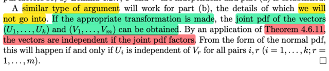</kbd>

> [!NOTE]
> Rồi, đại khái là phần b, giáo sư cho là cũng có thể làm tương tự, là ta sẽ
> tìm joint pdf của random variable vector (U1,..Uk) và (V1,.. Vm) chú ý
> (joint pdf của hai random variable vector nhé) tức gọi 𝐔 = (U1,...Uk), 
> **V** = (V1,...Vm). thì joint pdf của chúng: f𝐔,**V**(**u**,**v**)  (viết bold hết để thể hiện
> là vector).
>
>
>
> Sau đó ta có thể dùng theorem 4.6.11 nói rằng nếu joint pdf của các 
> random vector **X1**, **X2**, ...**Xn** mà factored, tức là có thể tách hàm 
> f**X1**,**X2**,...**Xn**(**x1,**...**xn**) thành tích các hàm g1(**x1**)g2(**x2**)...gn(**xn**)
>
>
>
> (có nghĩa là hàm f**X1,X2,...Xn**(**x1**,...**xn**) là function nhận vào bộ vector **x1,..xn**
> có thể tách thành tích các function gi mà mỗi cái apply riêng lên vector **xi )**
> thì khi đó các rv Vector **X1,...Xn** là độc lập

> [!TIP]
> 🤖 **AI Check** — 🟢 Pass — ✅ **95/100** · ✓ Move on
>
> Ghi chú tóm tắt và giải thích rất chính xác ý tưởng chứng minh trong bài đọc, đặc biệt là việc làm rõ bản chất hàm mật độ đồng thời phân tích thành nhân tử (factorization) để suy ra tính độc lập giữa các vector ngẫu nhiên.
>
> **✓ Strengths**
> - Hiểu đúng và phân biệt rõ ràng giữa biến ngẫu nhiên vô hướng và vector ngẫu nhiên khi xét joint pdf.
> - Giải thích chuẩn xác định lý phân tích nhân tử (factorization theorem) cho vector ngẫu nhiên nhiều chiều.
>
> **💡 Deeper notes**
> - Đoạn trích còn có ý kết luận quan trọng cho phân phối chuẩn: tính độc lập giữa hai vector U và V tương đương với việc mọi cặp thành phần Ui và Vr độc lập với nhau (hay hiệp phương sai bằng 0).
> - Định lý phân tích nhân tử thường kèm điều kiện miền xác định (support) phải là tích Descartes của các miền xác định thành phần (với phân phối chuẩn đa biến thì điều này luôn thỏa do support là toàn không gian thực).

**🔗 See also:** [Khái quát tính độc lập biến ngẫu nhiên](./46_multi_variate_distribution.md#node-hvcrd7p)

 

###### Hiệp phương sai Độc lập Biến Chuẩn

<kbd>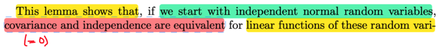</kbd>

<kbd>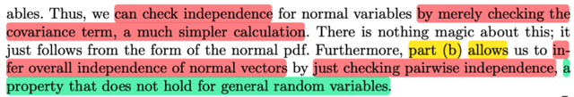</kbd>

> [!NOTE]
> Vậy đại ý là cái bổ đề vừa rồi: Nó cho phép: KHI TA BẮT ĐẦU VỚI CÁC
> NORMAL RANDOM VARIABLES ĐỘC LẬP (X1,....Xn) thì COVARIANCE
> VÀ TÍNH CHẤT INDEPENDENT của các linear function của đám rvs này
> (Ui,Vr) sẽ là một.
>
>
>
> Từ đó cho phép ta check xem các linear function của đám rvs này tức Ui,
> có độc lập hay không bằng cách xem Covariance của chúng có bằng 0 hay
> không (đó là  ứng dụng của part a)
>
>
>
> Còn part b, khi lemma nói nếu Ui độc lập Vr với mọi i và r thì suy ra vector U
> độc lập vector R. Điều này cho phép khi ta có các random vector normal..
>
>
>
> (hiểu ko: (U1,...Uk) mà mỗi cái là linear function của đám normal X1,..Xn
> thì U1,...Uk như đã nói trong phần chứng minh lemma, cũng là normal,
> nên (U1,..Uk) gọi là normal vector hay random variable vector mà mỗi cái
> đều là normal rv)
>
>
>
> ..thì ta có thể làm bằng cách check xem các phần tử (Ui, và Vr có độc lập
> từng cặp (pair wise) với nhau không.
>
>
>
> Và DUY CHỈ CÓ KHI TA START VỚI NORMAL THÌ MỚI CÓ TÍNH CHẤT
> NÀY

 

###### Chứng minh độc lập S² X̄

<kbd>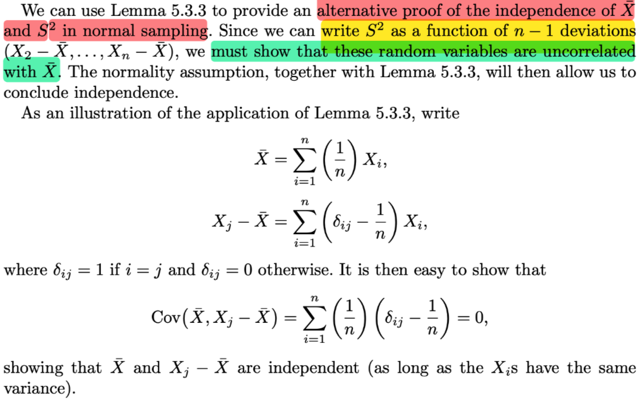</kbd>

> [!NOTE]
> QUAY LẠI SAU
>
>
>
> Nhưng đại ý là ta có thể dùng bổ đề vừa rồi để chứng minh S² độc lập với
> X̄ theo cách khác nếu như sampling là normal sampling (X1,..Xn là sample
> size n từ population ~ normal distrbution)
>
>
>
> Thì như lemma này nói với Ui Vr là tổ hợp tuyến tính (hay linear function)
> của X1,...Xn mà có population là normal thì chỉ cần chứng minh Covariance
> của Ui và và Vr = 0 là đủ kết luận chúng độc lap
>
>
>
> Vậy ở đây X̄ là Σi (1/n)Xi , là một tổ hợp.
>
>
>
> Xi  - X̄ cũng vậy, cũng là các tổ hợp tuyến tính của X1,...Xn
>
>
>
> Giáo sư mới chứng minh các Xi  - X̄ đều có covariance = 0 vói X̄:
>
>
>
> Cov(X1 - X̄, X̄) = 0,...Cov(Xn - X̄, X̄) = 0
>
>
>
> Từ đó theo bổ đề ta suy ra X1-X̄ độc lập X̄, X2-X̄ độc lập X̄, ...
>
>
>
> mà trước đây đại khái là có theorem nói rằng nếu X, Y độc lập thì apply các hàm
> vào thì ta vẫn có các rv độc lập.
>
>
>
> Nên ở đâu S² = là function của (X1 - X̄, X2 - X̄,...)
> nên nó cũng độc lập X̄

 

###### Phân phối và biến động trung bình mẫu

<kbd>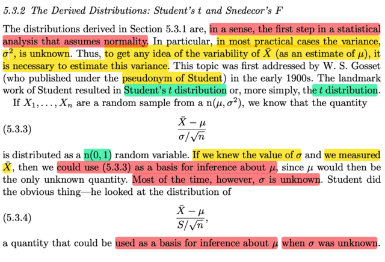</kbd>

> [!NOTE]
> đại khái là vầy: giáo sư Casella nói phần trước, khi ta  tìm cách derive
> distribution (của các statistic như sample mean, sample variance) với 
> giả định là random sampling từ normal là bởi vì (đại khái là) trong thực
> hành phân tích thống kê thì bước đầu tiên chính là giả định tính normality.
>
>
>
> Cụ thể hơn, trong hầu hết các case thực tế, thì ta KHÔNG BIẾT σ² (tức
> population variance của population normal distribution.
>
>
>
> Thế thì để mà chuyển qua phân tích về TÍNH BIẾN ĐỘNG CỦA SAMPLE
> MEAN X̄, thì ta cần phải estimate variance σ².
>
>
>
> (variability của sample mean, tức là sao? Là vì sampling mean ta đã biết
> là một random variable, có distribution, mà ta gọi là sampling distribution,
> vậy thì sắp tới ta quan tâm VARIANCE CỦA NÓ, chú ý, nó hoàn toàn khác
> với SAMPLE VARIANCE nhé, cái này nhắc lại là variance của sample mean)
>
>
>
> Vậy thì giáo sư cho biết, nếu X1.....Xn là random sample từ n(μ, σ²), thì
> ta đã biết (X̄ - μ) / σ/√n sẽ ~ n(0,1). Tại sao?
>
>
>
> Đầu tiên, ôn lại random sample là cái gì: Theo định nghĩa random sample
> size n từ population f tức là ta sẽ tiến hành quan sát giá trị của một biến số
> nào đó n lần, mỗi lần giá trị sẽ được đại diện bởi một random variable X_i
>
>
>
> Và các random variables X1,...Xn sẽ mutually independent, cũng như là
> identically distributed, tức có chung marginal distribution là population distribs
>
>
>
> Vậy thì trong phần trước mình đã biết rằng, sample mean X̄, với random
> sample từ normal(μ, σ²) thì X̄ cũng là normal, nhưng là normal(μ, σ²/n)
>
>
>
> Thế thì mới nói tới location scale theorem ta đã biết, nói rằng: nếu Z là random
> variable có pdf f(z), tức là thành viên chuẩn của location scale family, thì random 
> variable X = σZ + μ sẽ là thành viên của family với location μ, và scale σ
>
>
>
> Và ngược lại nếu X là thành viên có location μ, scale σ thì (X - μ) / σ sẽ là thành
> viên chuẩn tức có location 0, scale 1.
>
>
>
> Mà ta cũng biết với normal, thì location là mean và scale là standard deviation.
>
>
>
> nên mới nói X̄ là normal(μ, σ²/n) thì (X̄ - μ) / (σ²/n) sẽ là một normal(0,1)
>
>
>
> ====
>
>
>
> Thế thì, đại khái là với việc biết (X̄ - μ) / (σ²/n) sẽ là một normal(0,1) thì ta 
> có thể đo X̄, và nếu biết σ² (population variance) thì khi đó ta có thể làm cơ
> sở để SUY LUẬN RA μ (population mean).
>
>
>
> TUY NHIÊN, như đã nói, hầu hết ta đều không biết σ²,
>
>
>
> THÀNH RA, NGHIÊN CỨU CỦA ÔNG STUDENT, sẽ là quan sát distribution của
> (X̄ - μ) / S/√n (dùng sampling standard deviation thay cho σ). Nhằm làm cơ 
> sở cho việc **suy luận ra μ Mà ko cần biết variance σ**

**🔗 See also:** [Kiểm định LRT cho trung bình](./82_method_of_finding_tests.md#node-ouhenhy)

 

###### Suy diễn phân phối t

<kbd>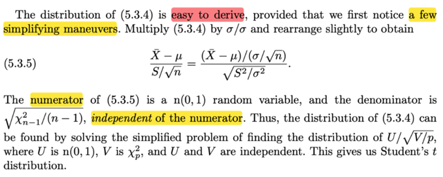</kbd>

> [!NOTE]
> Thế thì đại ý là distribution của cái này (X̄ - μ) / S/√n thật ra là ko khó để
> derive:
>
>
>
> Biến đổi chút xíu:
>
>
>
> (X̄ - μ) / (S/√n)
>
>
>
> = (X̄ - μ)/(σ/√n)  /  (S/√n)/(σ/√n) (chia tử và mẫu cho (σ/√n))
>
>
>
> = (X̄ - μ)/(σ/√n)  /  (S/√n)(√n/σ)
>
>
>
> = (X̄ - μ)/(σ/√n)  /  (S/σ)
>
>
>
> = (X̄ - μ)/(σ/√n)  /  √(S²/σ²)
>
>
>
> Tới đây, tử số là n(0,1) như đã nói.
>
>
>
> Còn mẫu, thì bài trước ta đã biết, Sn², tức là sample variance của  một
> random sample size n từ normal thì sẽ có tính chất:
>
>
>
> (n-1) Sn² / σ² là một Chi-square n - 1, kí hiệu /X/²_n-1
>
>
>
> Vậy thì Sn² / σ² dĩ nhiên là có bản chất cũng là (một Chi-square n-1) /
> (n-1)
>
>
>
> (này nhé nếu đặt Y = (n-1) Sn² / σ² thì ta có Y là Chi-square n-1, vậy giờ
> đem Y chia cho (n-1) thì ta nói là X = Y / (n-1) là một (Chi-square n-1) /
> (n-1) thôi.
>
>
>
> Nhưng chưa biết nó có là Chi- square hay không, nhưng ta hiểu nó là việc
> apply hàm h(u) = u / (n-1) lên  một Chi-square (n-1) random variable thôi.
> Và nếu h(u) = √[u / (n-1)] thì  Y là √[Chi-square (n-1)] / (n-1)]. Nói chung
> hiểu bản chất là sẽ thấy ko khó.
>
>
>
> Rồi, ý quan trọng là, cái thằng mẫu (random variable ở mẫu)
>
>
>
> = √[χ²_n-1 / (n-1)], nó độc lập với tử.
>
>
>
> Do đó, nếu gọi U là tử, là một n(0,1), và V = χ²_p, thì mẫu là một √(V / p)
> thì việc tìm distribution của (X̄ - μ) / (S/√n) cũng chỉ là tìm distribution
> của U/√(V/p). Và quan trọng là U, V độc lập.
>
>
>
> Do đó có thể giải bài toán để tìm distribution của U/√(V/p)
>
>
>
> V là Chi-square p, thì ta có thể tìm distribution của √(V/p), rồi U là n(0,1) thì
> nói chung ta có thể tìm được distribution của U/√(V/p)

**🔗 See also:** [Tính chất Trung bình & Phương sai mẫu](#node-aytwme7)

 

###### Phân phối t của Student

<kbd>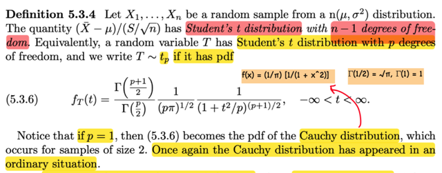</kbd>

> [!NOTE]
> Ta có định nghĩa: Cho random sample X1,...Xn từ n(μ, σ²), thì 
>
>
>
> cái quantity (cái random variable có được từ) (X̄ - μ) / S/√n sẽ là 
> một STUDENT's t  distribution, với n - 1 degree of freedom.
>
>
>
> Và nếu nói T là random variable ~ Student's t với p bậc tự do, thì ta 
> kí hiệu là T ~ t_p. Và nó có pdf như vầy.
>
>
>
> Với p = 1 thì nó chính là pdf của Cauchy distribution

**🔗 See also:** [Kiểm định hợp-giao cỡ α](./83_methods_of_evaluating_test.md#node-aruspge) · [Tối ưu hóa kỳ vọng độ dài](./93_methods_of_evaluating_interval_estimators.md#node-cu30bvl)

 

###### Đạo hàm phân phối t-Student

<kbd>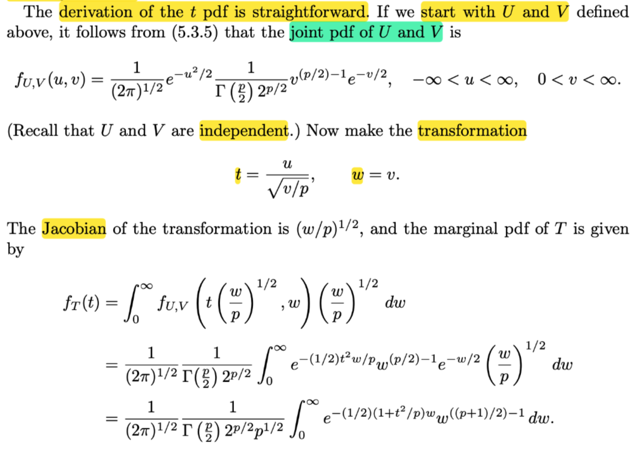</kbd>

<kbd>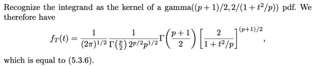</kbd>

> [!NOTE]
> Rồi, thử làm theo, derive pdf của Student's t:
>
>
>
> Như đã nói, bài toán chính là tìm pdf của U/√(V/p) với U là n(0,1), 
> V là Chi-square p bậc tự do. Và U, V độc lập
>
>
>
> Thế thì: đầu tiên là xây dựng joint pdf của U, V:
>
>
>
> Vì U, V độc lập, nên fU,V(u,v) = fU(u)fV(v)
>
>
>
> = 1/√(2π) e^-u²/2 . 1/ [Γ(p/2) 2^(p/2)] v^[(p/2)-1] e^(-v/2),  
>
>
>
> -inf < u < inf, 0 < v < inf
>
>
>
> Rồi, ta sẽ define transformation:
>
>
>
> T = g1(U, V)  với g1(u,v) = u / √(v/p). W = g2(U,V) , g2(u,v) = v
>
>
>
> Ôn lại không thừa: Để dùng transformation theorem: ta cần mapping 1-1 từ
> support set của (U,V) tới ảnh của nó.
>
>
>
> Ở đây với t = g1(u,v) = u / √(v/p), w = v thì xem thử có thể giải ra u, v từ t, w 
> không
>
>
>
> w = v ⇨ v = w
>
>
>
> t = u / √(v/p) ⇨ u = t √(v/p) = t √(w/p)
>
>
>
> Như vậy là mapping là 1-1 nên ta có thể dùng transformation theorem.
>
>
>
> Jacobian: ∂(u,v)/∂(t,w)
>
>
>
> Row 1: [∂u/∂t, ∂u/∂w] 
>
>
>
> u = t √(w/p) ⇨ ∂u/∂t = √(w/p), 
>
>
>
> ∂u/∂w = (t/√p) (1/√w) = t/√(pw)
>
>
>
> Row 2: [∂v/∂t, ∂v/∂w] 
>
>
>
> v = w ⇨ ∂v/∂t = 0, ∂v/∂w = 1
>
>
>
> ⇨ J = [√(w/p), t/√(pw); 0, 1] ⇨ |J| = √(w/p)
>
>
>
> Tiếp: joint pdf của T, W:
>
>
>
> fT,W(t,w) = fU,V(u,v) |J|
>
>
>
> Và để tìm pdf của T thì ta chỉ việc marginalizing over mọi possible value của W:
>
>
>
> fT(t) = ∫ fU,V(u,v) |J| dw
>
>
>
> = ∫0:inf 1/√(2π) e^-u²/2 . 1/ [Γ(p/2) 2^(p/2)] v^[(p/2)-1] e^(-v/2) √(w/p) dw
>
>
>
> = 1/√(2π)  1/ [Γ(p/2) 2^(p/2)] ∫0:inf e^-u²/2 .v^[(p/2)-1] e^(-v/2) √(w/p) dw
>
>
>
> (đưa constant ra)
>
>
>
> Xét ∫0:inf e^-u²/2 . v^[(p/2)-1] e^(-v/2) √(w/p) dw
>
>
>
> ...
>
>
>
> Nói chung là ta sẽ nhận ra bên trong là kernel của Γ((p+1)/2, 2/(1+t²/p))
>
>
>
> từ đó ta có pdf của T,là pdf của student t p degree

 

###### Giới hạn momen phân phối t

<kbd>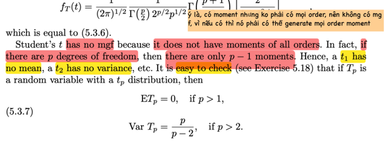</kbd>

> [!NOTE]
> Đại khái là Student's t distribution không có hàm mgf. Vì ko phải mọi moment 
> nào cũng có. 
>
>
>
> Cụ thể thì nó có moment, nhưng ko có hết. Chính xác là với p bậc tự do thì
> chỉ có p - 1 moment.
>
>
>
> Nên student's t p = 1 thì ko có mean, tức là ko có moment bậc 1
>
>
>
> student's t  p = 2 thì có mean, nhưng ko có variance (moment bậc 2)
>
>
>
> Và ta cũng có công thức của mean (với p > 1) : ETp = 0
>
>
>
> variance với p > 2 VarTp = p / (p - 2)

**🔗 See also:** [Kiểm định hợp-giao cỡ α](./83_methods_of_evaluating_test.md#node-aruspge)

 

###### Phân phối F: Tỉ lệ phương sai

<kbd>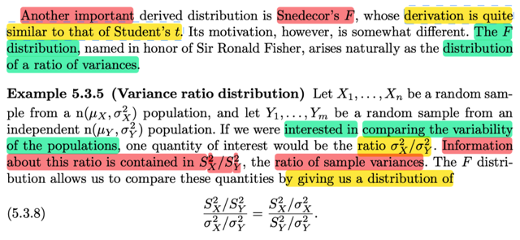</kbd>

> [!NOTE]
> đại khái là, ta sẽ biết một distribution quan trọng nữa F distributin.
>
>
>
> Động lực của cái này, đó là ta muốn tìm distribution của một "tỉ lệ của
> variances"
>
>
>
> Cho X1,..Xn là random sample n(μX, σX²) và Y1,...Ym là random sample
> n(μY, σY²). Và ta quan tâm đến việc / MUỐN SO SÁNH  ĐỘ BIẾN ĐỘNG
> (VARIABILITY) của hai population. Dĩ nhiên lẽ tự nhiên là ta muốn quan tâm
> đến ratio σX² / σY².
>
>
>
> Thì thông tin về ratios này chứa đựng trong S²X / S²Y (tỉ lệ của hai
> sample variance)
>
>
>
> Thế thì chỗ này phải hiểu là, sở dĩ ta có thể dùng tỉ lệ giữa hai sample
> variance để suy luận, suy đoán cho tỉ lệ giữa hai true population variance
> σX²/σY² là vì / là nhờ vào một loại distribution có tên là F distribution.
> Mà, cụ thể là, cái random variable sau đây sẽ là một F random variable
>
>
>
> S²X/S²Y / σ²X/σ²Y
>
>
>
> Để rồi, tí nữa ta sẽ thấy, khi tính kì vọng của cái random variable này,
> thì ta sẽ thấy nó bằng 1 khi m lớn. Từ đó ý nghĩa là, hay cho phép kết luận
> là, hay có cơ sở để nói là, SX² / SY² ≈ σX² / σY²

 

###### Phân phối F và Đối xứng Cầu

<kbd>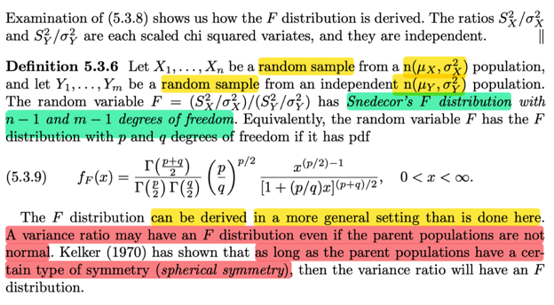</kbd>

<kbd>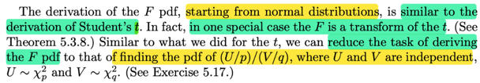</kbd>

> [!NOTE]
> Định nghĩa này nói rằng, với random sample size n từ n(μX, σX²)
> và random sample size m từ n(μY, σY²) thì random variable F
> với F = (SX²/σX²)(SY²/σY²) sẽ tuân theo distribution có tên
> là Snedecor's F distribution với bậc tự do là n-1 và m-1
>
>
>
> Và nó có pdf là như trong sách (khá là dài)
>
>
>
> Vậy thì ở đây, giáo sư Casella cho biết  variance ratios có thể có F
> distribution ngay cả khi population không phải normal mà chỉ cần nó có
> tính đối xứng (spherical symmetry)
>
>
>
> Và việc chứng minh ra công thức pdf của F distribution có thể làm 
> tương tự như khi derive pdf của t distribution (nhớ lại, với t distribution,
> thì ta dựa vào định nghĩa của nó là U/√(V/p) với U là normal(0,1) V là
> Chi-square p

 

###### Phân phối F và phương sai

<kbd>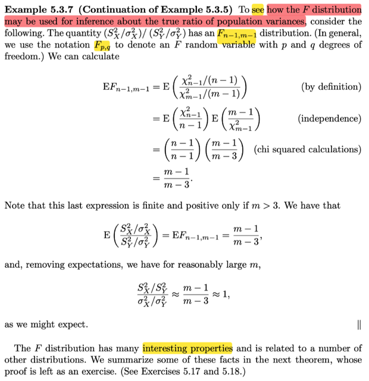</kbd>

> [!NOTE]
> Tiếp nối phần lập luận ở Example 5.3.5
>
>
>
> ...Thế thì chỗ này phải hiểu là, sở dĩ ta có thể dùng tỉ lệ giữa hai sample
> variance để suy luận, suy đoán cho tỉ lệ giữa hai true population variance
> σX²/σY² là vì / là nhờ vào một loại distribution có tên là F distribution. Mà, cụ
> thể là, cái random variable sau đây sẽ là một F random variable
>
>
>
> S²X/S²Y / σ²X/σ²Y
>
>
>
> Để rồi, tí nữa ta sẽ thấy, khi tính kì vọng của cái random variable này, thì ta sẽ
> thấy nó bằng 1 khi m lớn. Từ đó ý nghĩa là, hay cho phép kết luận là, hay có cơ
> sở để nói là, SX² / SY² ≈ σX² / σY²
>
>
>
> Vừa rồi, đã nói, định nghĩa của distribution của một random variable có được
> bởi (SX²/σX²)(SY²/σY²) là một Fn-1,m-1 random variable, và ta có pdf của
> F rồi.
>
>
>
> Thế thì, xét E[Fn-1,m-1], tức là, ý là xét kì vọng của môt random variable thuộc
> Fn-1,m-1 distribution.
>
>
>
> mà theo định nghĩa, ví dụ như gọi F là một random variable ~ Fn-1,m-1
>
>
>
> thì nó là (kết quả của) lấy SX² / σX² chia cho SY² / σY².
>
>
>
> Mà SX² / σX² thì ta có định nghĩa:
>
>
>
> (n - 1) Sn² / σ² sẽ là một Chi-square n - 1
>
>
>
> Câu này có nghĩa là, nếu ta có random sample size n từ normal(μ, σ²)  thì cái
> random variable được tạo bằng cách lấy hàm g(z) = (n-1) z / σ² apply lên
> sample variance S², thì cái random variable đó sẽ có distribution đã biết, có tên
> là Student t, và nói đã biết tức là ta biết pdf của nó.
>
>
>
> Nếu gọi J = (n - 1) Sn² / σ², thì Sn² / σ² =  J / (n - 1)
>
>
>
> Và đặt U = Sn² / σ², và ta quan tâm đến distribution của thằng rv K này, thì ta
> có thể derive distribution của nó dựa vào transformation K = J / (n-1) và người ta
> gọi K là một Chi-square (n-1) / n - 1 thì có nghĩa là vậy
>
>
>
> Tương tự, nếu gọi V = SY² / σY², thì ta gọi nó là Chi-square (m-1) / (m-1)
>
>
>
> Rồi, tới đây ta lại quan tâm đến distribution của một random variable
>
>
>
> F = U / V, nên ta nói F là một
>
>
>
> [Chi-square (n-1) / n - 1] / [Chi-square (m-1) / (m-1)]
>
>
>
> để từ đó, dựa vào quan hệ này, giúp ta tìm ra pdf của F
>
>
>
> Cái này cũng chỉ y như khi ta có X, Y với pdf đã biết fX, fY, hoặc biết joint pdf
> của chúng fX,Y, và ta quan tâm đến một random variable U tạo ra bởi việc apply
> function g1 lên X, Y. Thì ta ko biết pdf của U, và nhờ transformation theorem ta
> có thể tìm ra được.
>
>
>
> Vậy thì ở đây cũng thế thôi, CÁI VIỆC TA NÓI RẰNG:
>
>
>
> "F là một  [Chi-square (n-1) / n - 1] / [Chi-square (m-1) / (m-1)]"
>
>
>
> CHÍNH LÀ NÓI RẰNG: À, TA CÓ X, Y LÀ HAI RANDOM VARIABLE ĐÃ BIẾT
> PDF (LÀ PDF CỦA CHI-SQUARE), VÀ BÂY GIỜ, MUỐN TÌM PDF CỦA F =
> g(X,Y)
>
>
>
> nên phải hiểu khi nói vậy tức là NHẤN MẠNH VÀO QUAN HỆ, HAY, CÁCH
> TRANSFORMATION.
>
>
>
> Rồi, như vậy việc tìm distribution của F chính là gỉai bài toán (1) ở trên, nhưng
> mình sẽ thay X,Y bằng U, V cho giống trong sách. U là Chi-square n-1, V là
> Chi-square m - 1, và F = g(U,V) = [U/(n-1)]/[V/(m-1).
>
>
>
> Nhưng mà n-1, hay m-1 chỉ là con số cụ thể, ta có thể khái quát nó thành bài
> toán, ta có U là Chi-square p, V là Chi-square q, và F = (U/p) / (V/q), và ta sẽ tìm
> distribution của F. Và đó là phần Exersice 5.17, nhưng cái chính là mình hiểu
> như vậy
>
>
>
> Thế thì cái thằng F mà ta tìm ra pdf của nó từ U, V, người ta gọi distribution của
> nó là F n-1, m-1
>
>
>
> Hoặc khái quát, Fp,q, và ta hiểu Fp,q sẽ là distribution của một random variable
> X nào đó mà được tạo ra bởi g(U,V) = (U/p) / (V/q) với U, V là Chi-squares p, và
> Chi-square q
>
>
>
> Vậy quay lại đây, họ ghi :
>
>
>
> E[Fn-1,m-1] = E{[Chi-square (n-1) / (n-1)] / [Chi-square (m-1) / (m-1)]}
>
>
>
> thì có thể hiểu là, đây giống như nói tắt, đáng là phải nói:
>
>
>
> Cho F ~ Fn-1,m-1, thì nhất định F là một random variable tạo bởi U/p / V/q với
> U, V độc lập và U ~ Chi-square p, V ~ Chi-square q, p = n-1, q = m-1
>
>
>
> EF = E[(U/q) / (V/q)]
>
>
>
> Và do U V độc lập nên U/q và 1/[(V/q)] cũng độc lập
>
>
>
> ... = E[(U/p)] . E[1/(V/q)] = EU/p . qE[1/V]
>
>
>
> = EU/(n-1) . (m-1)E(1/V)
>
>
>
> tiếp theo đó dựa trên việc đã biết pdf của U, V ta tính ra:
>
>
>
> thì có két quả (m - 1)/(m - 3)
>
>
>
> Và do đó nếu m lớn thì EF ≈ 1
>
>
>
> Như vậy kì vọng của một random variable có distribution là Fn-1,m-1 với m lớn,
> sẽ là 1.
>
>
>
> Mà đã nói (SX² / σX²) / (SY² / σY²) với SX là sample variance của random
> sample size n, từ normal(μX, σX²) và SY là sample variance của một random
> sample size m từ normal(μY, σY²) SẼ LÀ MỘT RANDOM VARIABLE CÓ
> DISTRIBUTION Fn-1,m-1
>
>
>
> NHƯ VẬY, với m lớn thì:  E[(SX² / σX²) / (SY² / σY²)] = 1
>
>
>
> Suy ra SX²/SY² ≈ σX²/σY² LÀM CƠ SỞ CHO VIỆC TA CÓ THỂ DÙNG TỈ
> SỐ CỦA HAI SAMPLE VARIANCE ĐỂ SUY LUẬN CHO TỈ SỐ CỦA HAI
> POPULATION VARIANCE

 

###### Tính chất phân phối F và t

<kbd>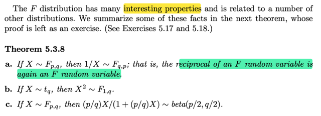</kbd>

> [!NOTE]
> Cuối cùng là theorem nói đại khái là nghịch đảo của một F rv cũng là 
> một F rv (cái distribution này tên là F, khiến ta dễ lú lẫn, ví dụ mình có thể
> ghi là cho F ~ F, có nghĩa là đặt một random variable F, có distribution F)
>
>
>
> Nếu X là một Student's t có q bậc tự do thì X² là một F 1,q

 

