# 5.5 Convergence Concepts

📊 **Progress:** `42` Notes | `52` Screenshots | `2` AI Reviews

---

## 5.5 Convergence Concepts

 

## Khái niệm hội tụ

<kbd>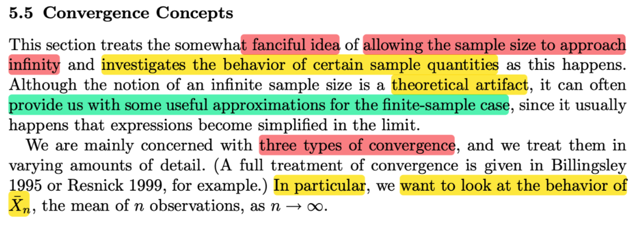</kbd>

> [!NOTE]
> Đại khái là, phần này ta sẽ thảo luận một khái niệm bóng bẩy, đó là **cho
> phép số lượng random variable của một random sample lớn đến vô cùng**.
> Và trong quá trình đó, ta sẽ **xem xét hành vi của một sample quantities** (
> ý nói các **statistic**, ví dụ sample mean)
>
>
>
> Tác giả nói đại ý là dù cái việc này **mang tính chất lí thuyết** (khi xem xét
> số lượng mẫu lớn đến vô hạn) nhưng nó sẽ **giúp cho phép ta thấy các ước
> lượng hữu ích** cho mẫu hữu hạn vì khi xét tại limit, thì một số thứ đơn giản
> xảy ra.
>
>
>
> Và ta sẽ quan tâm **3 loại convergence**. Và cụ thể, ta sẽ xem xét hành vi
> của Xn_bar, **sample mean** của mẫu size n

 

### Hội tụ xác suất

<kbd>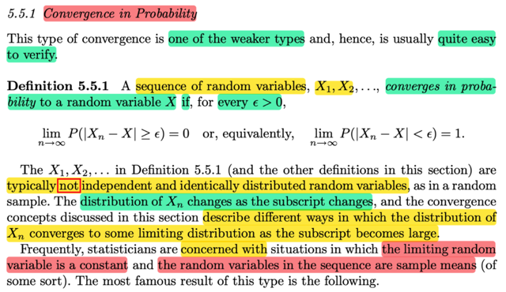</kbd>

> [!NOTE]
> Loại convergence thứ nhất là **Convergence in probability**: Được định nghĩa
> đại khái bằng lời là: ta nói X1,X2,...converge về X in probability nếu như
> **khi n → inf** thì xác suất t**ồn tại khác biệt  giữa Xn và X là bằng 0**, thể hiện
> bởi toán học:
>
>
>
> lim n → inf P(|Xn - X| > ε) = 0 với ε bất kì
>
>
>
> Một điểm lưu ý là, các **X1,X2...ko cần phải iid**. Do đó **khi n thay đổi thì 
> distribution của Xn cũng thay đổi** (X1 có distribution khác, X2 khác...)
>
>
>
> Cuối cùng, thường thường ta sẽ quan tâm đến tình huống là muốn random 
> variable hội tụ về một constant, trong đó **cái random variable mà ta quan
> tâm** là **sample mean**

**🔗 See also:** [Hội tụ hầu chắc](#node-jayixv4) · [Hội tụ xác suất thống kê](./101_point_estimation.md#node-4pzd0to)

 

#### Luật số lớn yếu

<kbd>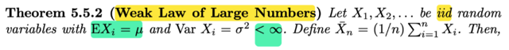</kbd>

<kbd>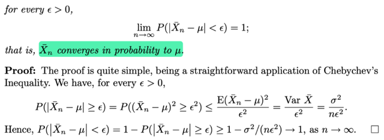</kbd>

> [!NOTE]
> ta qua luật số lớn yếu: Cho X1,X2...là iid random variables với EXi = μ và 
> VarXi = σ^2 < inf. Đặt Xbar_n = (1/n) Σi=1:n Xi thì:
>
>
>
> bằng lời: Xbar_n hội tự in probability về μ, 
>
>
>
> theo định nghĩa hội tụ trong xác suất thì có nghĩa là:
>
>
>
> lim n → inf P(|Xbar_n - μ| > ε) = 0
>
>
>
> hay cũng là:
>
>
>
> lim n → inf P(|Xbar - μ| < ε) = 1 với ε bất kì
>
>
>
> Chứng minh cái này ta sẽ cần ôn lại Chebyshev inequality: Cho hàm g(x)
> là hàm không âm, thì với mọi số dương r thì P(g(X) ≥ r) ≤ Eg(X) / r
>
>
>
> Tí mình sẽ chứng minh lại
>
>
>
> Còn ở đây áp dụng inequality này 
>
>
>
> Xét event |Xn_bar - μ| ≥ ε,  vì hai vế đều ko ân nên ta có:
>
>
>
> ⇔ (Xn_bar - μ)^2 ≥ ε^2
>
>
>
> Áp dụng Chebyshev's inequality với g(Xn_bar) = (Xn_bar - μ)^2,
>
>
>
> thì với mọi số dương ε^2 ta có:
>
>
>
> P((Xn_bar - μ)^2 ≥ ε^2) ≤ [E(Xn_bar - μ)^2 ] / ε^2
>
>
>
> Mà vế phải là gì chính là Var(Xn_bar) / ε^2
>
>
>
> Mà variance của Xn_bar, tức variance của sample mean, theo theorem 
> bữa trước (theo link cam) chính là σ^2/n 
>
>
>
> ⇨ Vế phải = σ^2/(nε^2)
>
>
>
> Vậy ta có P(|Xn_bar - μ| ≥ ε) = P[(Xn_bar - μ)^2 ≥ ε^2] ≤ σ^2/(nε^2)
>
>
>
> ⇔ - P(|Xn_bar - μ| ≥ ε) ≥ - σ^2/(nε^2)
>
>
>
> Tiếp xét P(|Xbar - μ| < ε) = 1 - P(|Xbar_n - μ| > ε)
>
>
>
> áp dụng kết quả trên: 
>
>
>
> .. ≥ 1 - σ^2/(nε^2)
>
>
>
> Vậy khi xét limit:
>
>
>
> lim n → inf P(|Xbar - μ| < ε) ≥ lim n → inf 1 - σ^2/(nε^2)
>
>
>
> và khi n → inf thì 1 - σ^2/(nε^2) → 1
>
>
>
> vậy lim n → inf P(|Xbar - μ| < ε) = 1
>
>
>
> Đơn giản là vì xác suất thì chỉ trong  range 0,1, mà cái P này ≥ 1 cái tiến tới 1
> thì P chắc chắn cũng phải → 1, chứ ko thể tiến tới số nào nhỏ hơn 1 được,

**🔗 See also:** [Bất đẳng thức Markov và chứng minh](./36_inequalities.md#node-u9zgfoi) · [Tính chất trung bình phương sai mẫu](./52_of_random_variables_from_a_random_sample.md#node-411jdqg)

 

##### WLLN và nhất quán

<kbd>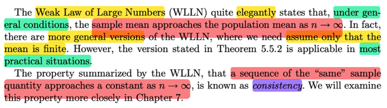</kbd>

> [!NOTE]
> đại khái là, WLLN, cho phép ta nói rằng, **nói chung** (nếu thỏa điều kiện) , thì **sample mean sẽ tiến tới population mean khi n → inf**
>
>
>
> Và gs cho biết dù rằng còn có một phiên bản khái quát hơn trong đó chỉ yêu cầu population mean là hữu hạn. Nhưng đây vẫn là phiên bản được sử dụng rộng rãi.
>
>
>
> Một tính chất được tóm tắt bới WLLN đó là **một chuỗi giá trị của statistic** ví dụ như sample mean của random sample size n **sẽ tiến tới hằng số** khi **n → inf**, được đặt tên là tính **NHẤT QUÁN - CONSISTENCY** mà ta sẽ gặp lại trong chương 7

 

- **Tính nhất quán của phương sai mẫu**

<kbd>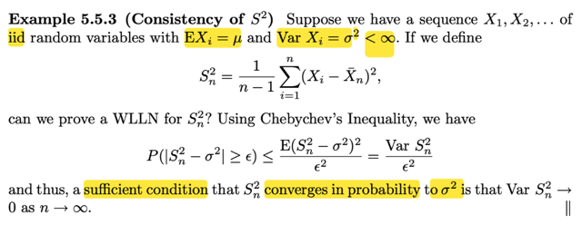</kbd>

> [!NOTE]
> Ví dụ này xét tính consistency của S^2 (sample variance). cho chuỗi các  random
> variable X1, X2,....iid với EXi = μ. VarXi = σ^2 < inf
>
>
>
> Đặt Sn^2 (sample variance của random sample size n)
>
>
>
> = [1/(n-1)] Σ (Xi - Xn_bar)^2
>
>
>
> Câu hỏi là Sn^2, có consistency không
>
>
>
> Thế thì đại khái là, như định nghĩa ở trên, thì, để có tính consistency, thì Sn^2
> phải converge in probability tới σ^2 (population variance)
>
>
>
> (giống như Xn_bar converge in probability tới μ) khi n → inf
>
>
>
> Thế thì để vậy ta cần lim n → inf P(|Sn^2 - σ^2| ≥ ε) = 0 với mọi ε dương
>
>
>
> Mà xét P(|Sn^2 - σ^2| ≥ ε) = P((Sn^2 - σ^2)^2 ≥ ε^2) | cái này chỉ là event tương
> đương
>
>
>
> ≤ E[(Sn^2 - σ^2)^2] / ε^2 |  (Chebyshev inequality)
>
>
>
> = Var(Sn^2) / ε^2
>
>
>
> Như vậy để Sn^2 tiến tới σ^2 in probability (theo yêu cầu của tính consistency)
>
>
>
> thì P(|Sn^2 - σ^2| ≥ ε) phải → 0
>
>
>
> và như vậy Var(Sn^2) phải → 0

**🔗 See also:** [Tạo biến ngẫu nhiên mũ](./56_generating_random_sample.md#node-bxd38ye)

 

- **Định lý ánh xạ liên tục**

<kbd>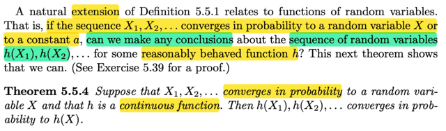</kbd>

> [!NOTE]
> đại khái là, ta có theorem là nếu X1,X2,....converge in probability tới một
> random  variable X,  hoặc một constant
>
>
>
> thì với hàm h là hàm liên tục, h(X1),  h(X2) sẽ converge in probability về h(X)

 

- **Tính nhất quán và chệch S**

<kbd>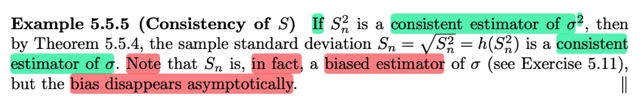</kbd>

> [!NOTE]
> Rồi, áp dụng theorem vừa rồi, ta sẽ có NẾU Sn^2 là **CONSISTENT ESTIMATOR** của σ^2 (tức là, nó sẽ converge in probability tới σ^2) thì apply hàm g liên tục, ở đây là hàm g(u) = √u, thì chuỗi g(Sn^2), tức √Sn^2 (n = 1,2...) cũng sẽ converge in probability tới √σ^2 = σ. Do đó √Sn^2 **CŨNG LÀ CONSISTENT ESTIMATOR CỦA population standard deviation σ**
>
>
>
> Nhưng giáo sư lưu ý, ta phát biểu trên là NẾU Sn^2 là consistent estimator của σ^2, NHƯNG THỰC TẾ THÌ Sn^2 LẠI LÀ BIASED ESTIMATOR CỦA σ^2 nhưng sự biased này biến mất asymtotically

 

- **Hội tụ hầu chắc**

<kbd>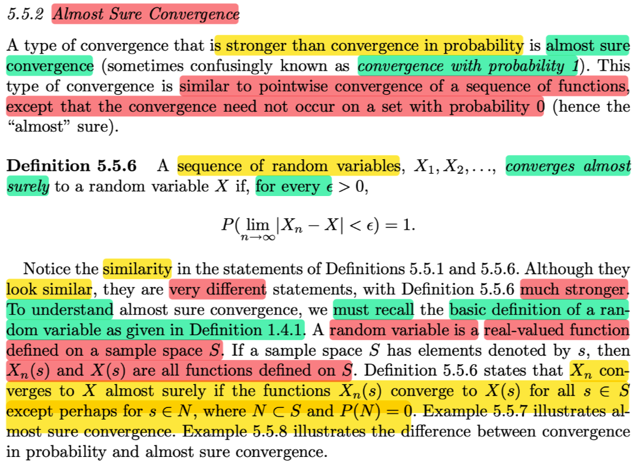</kbd>

> [!NOTE]
> Đại khái là một loại convergence mạnh hơn convergence in probability là **almost sure convergence**.
>
>
>
> Định nghĩa của nó là: Ta nói X1,X2,....CONVERGES ALMOST SURELY tới random variable X nếu với mọi ε > 0 thì ta có:
>
>
>
> P(lim n → inf |Xn - X| < ε) = 1
>
>
>
> Và để hiểu cái này, đại khái là ta cần nhớ bản chất của random variable là function, map giữa s trong sample space gốc S, với induced sample space (range của X)
>
>
>
> Thế thì như vậy Xn → X theo định nghĩa converge almost surely
>
>
>
> thì có nghĩa là **với mọi s trong S**, **thì Xn(s) đều converge về X(s)** (khi n → inf):
>
>
>
> lim n → inf Xn(s) = X(s)

**🔗 See also:** [Hội tụ xác suất](#node-ybskg1i)

 

- **Hội tụ hầu chắc**

<kbd>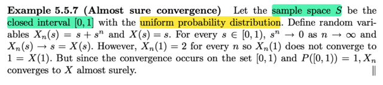</kbd>

> [!NOTE]
> Cho Xn(s) = s + s^n
>
>
>
> X(s) = s
>
>
>
> đại khái là hãy nhìn Xn với n = 1,2....là một loạt các hàm số. Thì đại ý là, ta sẽ ta thấy khi n → inf, thì Xn(s) sẽ là làm thành một dãy số X1(s), X2(s), ....
>
>
>
> Ta sẽ có converge almost surely nếu như với mọi s thì dãy số này đều converge về cùng một giá trị.
>
>
>
> Ở đây ta thấy sample space S = \[0,1\]
>
>
>
> thế thì với mọi s trong S{1} thì, dãy số X1(s), X2(s),...sẽ hội tụ về s Vì sao, vì nó là: s + s^1, s + s^2, .....với 0 ≤ s < 1 thì s^1, s^2,..→ 0 ⇨ s + s^1, s + s^2,...→ s, và s chính là X(s)
>
>
>
> Duy chỉ có s = 1, thì dãy số X1(s), X2(s) ...không hội tụ về 1. Mà thay vào đó, nó là dãy số: 1 + 1^1, 1 + 1^2, ...tức là 2, 2, ....
>
>
>
> Tuy nhiên, theo định nghĩa, convergence in probability nói rằng, chỉ cần việc này xảy ra trên toàn bộ sample space nhưng cho phép loại trừ một tập N mà trên đó xác suất xảy ra bằng 0.
>
>
>
> thì ở đây, tập N chính là point set {1}. Vì sao xác suất xảy ra bằng 0. Vì s là giá trị liên tục, nên xác suất P({s} = 1) = 0
>
>
>
> Như vậy, ta nói Xn converge almost surely tới X

 

- **Hội tụ xác suất không hầu chắc**

<kbd>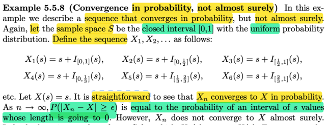</kbd>

> [!NOTE]
> Cho một ví dụ về converge in probability nhưng ko almost surely:
>
>
>
> Cho sample space S là interval đóng: \[0,1\] với uniform distribution.
>
>
>
> Định nghĩa X1,X2...như sau:
>
>
>
> X1(s) = s + I\[0,1\]{s}, X2(s) = s + I\[0,1/2\]{s}, X3(s) = s + I\[1/2, 1\]{s} ..
>
>
>
> Đại khái là (như đã biết, rv bản chất chỉ là function), thì ở đây các function có dạng s + một indicator function check việc s nằm trong một đoạn ngày càng ngắn dần. (\[0,1\], \[0,1/2\], \[1/2,0\], \[0,1/3\], \[1/3,2/3\], \[2/3, 1\], \[0,1/4\], \[1/4, 2/4\],....)
>
>
>
> Thế thì, dễ thấy khi n càng lớn, thì cái khoảng trong term thứ 2 của Xn sẽ càng nhỏ, tức là, hàm indicator sẽ check s nằm trong một đoạn càng ngắn.
>
>
>
> Thì khi ta xét P(|Xn - X| > ε) với ε dương bất kì thì ta thấy:
>
>
>
> xác suất này sẽ chỉ là bằng xác suất của việc s nằm trong một đoạn ngày càng ngắn: → xác suất này tiến về 0
>
>
>
> Vì (Xn - X) có bản chất chỉ là một function: (Xn - X)(s)
>
>
>
> Nên |Xn - X| > ε có bản chất là {s ∈ S: |Xn(s) - X(s)| > ε}
>
>
>
> ⇨ P(|Xn - X| > ε) = P({s ∈ S: |Xn(s) - X(s)| > ε})
>
>
>
> = P({s ∈ S: |s + I[αn, βn](s) - s| > ε})
>
>
>
> = P({s ∈ S: |I[αn, βn](s)| > ε})
>
>
>
> mà hàm indicator chỉ có hai giá trị 1 hoặc 0, nên event giá trị của nó hơn hơn ε dương nhỏ thì cũng là event gía trị của nó = 1
>
>
>
> ⇨ P({s ∈ S: |I[αn, βn](s)| = 1}) , và cũng là P(s ∈ \[αn, βn\])
>
>
>
> Và như đã nói đoạn này càng ngắn ⇨ P này → 0
>
>
>
> ⇨ lim n → inf P(|Xn - X| > ε ) = 0
>
>
>
> Do đó, nó thỏa convergence in probability.
>
>
>
> Xn converge in probability to X

 

- **Hội tụ hầu chắc chắn**

<kbd>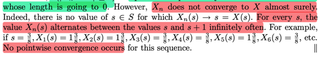</kbd>

> [!NOTE]
> Nhưng xét converge almost surely thì ko:
>
>
>
> Vì theo định nghĩa muốn gọi là Xn converge almost surely to X thì
> với mọi s thì Xn(s) phải → X khi n → inf
>
>
>
> Nhưng ví dụ như s = 3/8
>
>
>
> X1(3/8) = 3/8 + I[0,1](3/8) = 3/8 + 1
>
>
>
> X2(3/8) = 3/8 + I[0,1/2](3/8) = 3/8 + 1
>
>
>
> X3(3/8) = 3/8 + I[1/2,1](3/8) = 3/8 + 0
>
>
>
> X4(3/8) = 3/8 + I[0,1/3](3/8) = 3/8 + 0
>
>
>
> X5(3/8) = 3/8 + I[1/3,2/3](3/8) = 3/8 + 1
>
>
>
> X6(3/8) = 3/8 + I[2/3,1](3/8) = 3/8 + 0
>
>
>
> ...
>
>
>
> Có thể thấy dãy 3/8, 1 + 3/8, 3/8, 3/8, 1 + 3/8, 3/8, ....sẽ không hội
> tụ về 3/8.
>
>
>
> Ví dụ này cho thấy rõ convergence in probability và convergence
> almost surely tuy trông có vẻ giống giống nhau nhưng hoàn toàn
> khác nhau.
>
>
>
> Khi n càng lớn thì xác suất Xn khác X sẽ ngày càng nhỏ.
>
>
>
> khi n → inf thì P(|Xn - X| > ε) → 0
>
>
>
> Do đó (cũng là nó thỏa) lim n → inf P(|Xn → X| > ε) = 0
>
>
>
> Nhưng Xn(s) không → X(s) với mọi s trong S
>
>
>
> nên ko thỏa P(lim n → inf |Xn - X| < ε) = 1

 

- **Định luật số lớn mạnh**

<kbd>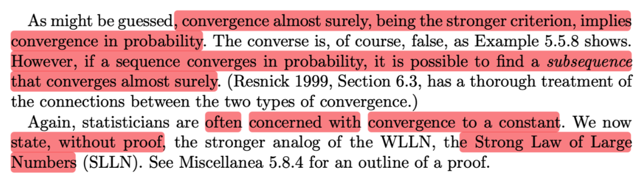</kbd>

> [!NOTE]
> Đại khái là convergence almost surely thì mạnh hơn, và nó sẽ imply 
> convergence in probability.
>
>
>
> Tuy ta ko có chiều ngược lại nhưng giáo sư cho biết khi ta có convergence
> in probability thì thường là có thể tìm được một subsequence mà converge
> almost surely (cái này chỉ nói sơ vậy, tìm hiểu sách khác)
>
>
>
> Cuối cùng, trong thống kê như thường lệ thì ta sẽ quan tâm đến convergence
> đến một constant.
>
>
>
> Nên ở đây với bối cảnh ta dùng convergence almost surely thì ta có Strong
> Law of Large number

 

- **Luật số lớn mạnh**

<kbd>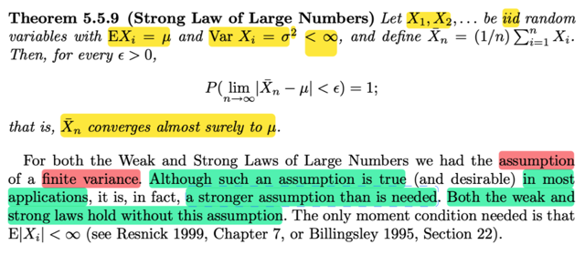</kbd>

> [!NOTE]
> Ta có Strong LLN:
>
>
>
> VỚi X1,X2,....là iid random variables với EXi = μ, Var Xi = σ^2 < inf (finite variance) và define Xnbar = (1/n) Σi Xi
>
>
>
> Thì với mọi ε > 0, P(lim n→inf |Xnbar - μ| < ε) = 1
>
>
>
> tức Xnbar converge almost surely tới μ

**🔗 See also:** [Phương pháp mô phỏng WLLN](./56_generating_random_sample.md#node-jeizj20)

 

- **Hội tụ theo phân phối**

<kbd>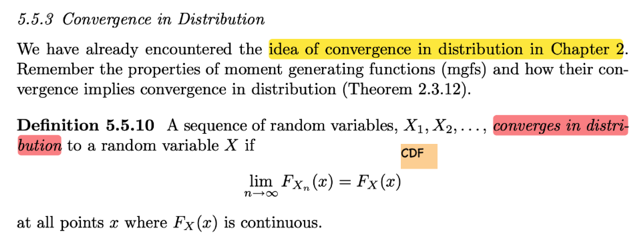</kbd>

> [!NOTE]
> Đến khái niệm convergence in distribution.
>
>
>
> Định nghiã của nó: Ta gọi chuỗi các random variable X1,X2,.... converge
> in distribution đến một random variable X nếu lim n → inf FXn(x) = FX(x)
> tại mọi điểm x mà FX(s) liên tục

 

- **X(n) hội tụ xác suất**

<kbd>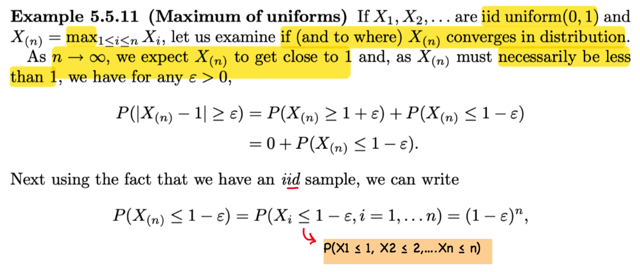</kbd>

<kbd>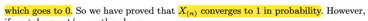</kbd>

> [!NOTE]
> Cho X1,X2...iid uniform(0,1) và X(n) được định nghĩa là max i ∈ \[1,n\] Xi, ta xem thử X(n) có converge in distribution không và nếu có thì converge về đâu.
>
>
>
> Thế thì ông nói, đám Xi i = 1,2,... là các uniform(0,1) rvs, rồi ta lại lấy X(n) định nghĩa như vậy. Dĩ nhiên khi n → inf thì ta kì vọng / đoán rằng X(n) sẽ → 1, nhưng vẫn nhỏ hơn 1.
>
>
>
> Vậy thì thử xem X(n) có converge in probability về 1 ko:
>
>
>
> Xét P(|X(n) - 1| ≥ ε) (ta cần chứng minh rằng cái này sẽ → 0)
>
>
>
> Vậy thì |X(n) - 1| ≥ ε ⇔ X(n) - 1 ≥ ε or X(n) - 1 ≤ -ε
>
>
>
> ⇨ P(|X(n) - 1| ≥ ε) = P(X(n) - 1 ≥ ε ∪ X(n) - 1 ≤ -ε)
>
>
>
> = P(X(n) - 1 ≥ ε) + P(X(n) - 1 ≤ -ε) | axiom 3 xác suất của ∪ các disjoint event
>
>
>
> = P(X(n) ≥ ε + 1) + P(X(n) ≤ 1 - ε)
>
>
>
> = 0 + P(X(n) ≤ 1 - ε) | Do X(n) sẽ ko thể ≥ 1
>
>
>
> Xét X(n) ≤ 1 - ε, tức max {1≤i≤n} Xi ≤ 1 - ε
>
>
>
> ⇨ X1 ≤ 1 - ε và ...Xn ≤ 1 - ε
>
>
>
> ⇨ P(X(n) ≤ 1 - ε) = P(∩i = 1,...n Xi ≤ 1 - ε )
>
>
>
> = Πi P(Xi ≤ 1 - ε) (do X1,X2....independent)
>
>
>
> = Πi (1 - ε) (do Xi \~ uniform(0,1))
>
>
>
> = (1 - ε)^n
>
>
>
> Và kết quả này, khi n → inf thì (1 - ε)^n → 0 do 1 - ε < 1
>
>
>
> Vậy đúng là X(n) converge về 1 in probability

 

- **Hội tụ xác suất và phân phối**

<kbd>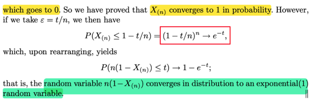</kbd>

> [!NOTE]
> Nếu chọn ε = t/n
>
>
>
> áp dụng ta đang có P(X(n) ≤ ε) = (1 - ε)^n, ta sẽ có:
>
>
>
> P(X(n) ≤ 1 - t/n) = (1 - t/n)^n
>
>
>
> Và khi n → inf thì cái này lại tiến về e^-t
>
>
>
> (vì đây là một cái hội tụ nổi tiếng: (1 + x/n)^n → e^x)
>
>
>
> X(n) ≤ 1 - t/n ⇔ nX(n) ≤ n - t ⇔ n(1 - X(n)) ≥ t
>
>
>
> ⇨ P(X(n) ≤ 1 - t/n) = P(n(1 - X(n)) ≥ t)
>
>
>
> = 1 - P(n(1 - X(n)) ≤ t)
>
>
>
> Và như vậy khi n → inf thì 1 - P(n(1 - X(n)) ≤ t) → e^-t
>
>
>
> ⇨ P(n(1 - X(n)) ≤ t) → 1 - e^-t
>
>
>
> Và đây lại chính là CDF của exponential(1)
>
>
>
> còn vế trái, chính là CDF của n(1 - X(n))
>
>
>
> Vậy cho thấy X(n) converge in probability về 1
>
>
>
> Nhưng n(1 - X(n)) cũng converge in distribution về expo(1) nữa

 

- **Hội tụ xác suất sang phân phối**

<kbd>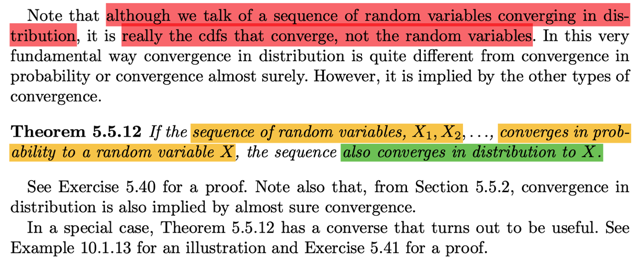</kbd>

> [!NOTE]
> Đoạn này không có gì khó hiểu. Tác giả nhấn mạnh rằng chúng ta cần chú ý đến loại hội tụ thứ ba, hội tụ theo phân phối (in distribution). **Mặc dù người ta nói một chuỗi các biến ngẫu nhiên hội tụ, nhưng thực chất, thứ hội tụ chính là hàm phân phối tích lũy (CDF)**.
>
>
>
> Nếu nhìn nhận theo cách này, **loại hội tụ thứ ba này khác biệt so với hai loại hội tụ trước đó là hội tụ theo xác suất (convergence in probability) và hội tụ hầu chắc chắn (convergence almost surely)**. 
>
>
>
> Lý do là hai loại hội tụ trước đề cập đến việc một chuỗi các biến ngẫu nhiên hội tụ về một biến ngẫu nhiên. Trong khi đó, loại hội tụ thứ ba thực chất nói về việc hàm CDF hội tụ về một hàm CDF, hay nói cách khác, một chuỗi các hàm CDF hội tụ về một hàm CDF.
>
>
>
> Tuy nhiên, mặc dù bản chất khác biệt, Định lý 5.5.12 phát biểu rằng **nếu một chuỗi các biến ngẫu nhiên hội tụ theo xác suất (in probability) về một biến ngẫu nhiên X** (tức là chuỗi X1, X2, ..., Xn hội tụ về X theo xác suất), thì điều này cũng **đồng thời hàm ý sự hội tụ theo phân phối (in distribution)**. Nói một cách nôm na, nếu một chuỗi các biến ngẫu nhiên hội tụ về một biến ngẫu nhiên, thì nó cũng hội tụ theo phân phối.

 

- **Hội tụ xác suất và phân phối**

<kbd>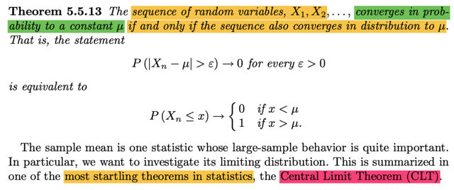</kbd>

> [!NOTE]
> Theorem này nói là, chuỗi các random variable X1,X2....converges in probability tới constant μ khi và chỉ khi chuỗi này cũng converges in distribution tới μ
>
>
>
> Nhớ lại định nghĩa của hội tụ xác suất (một chuỗi random variable Xn hội tụ xác suất về μ): là khi n → ∞ thì xác suất để X khác μ là bằng 0 (ý này thể hiện theo toán học bởi P(|Xn-X| < ε) = 0 ∀ε).
>
>
>
> Còn hội tụ phân phối (chuỗi rvs Xn hội tụ phân phối về rv X thì theo định nghĩa là (khi n → ∞) thì cdf FXn(x) → FX(x) với mọi x.
>
>
>
> Vậy thì ở đây, nói chuỗi Xn hội tụ phân phối về μ, thì có nghĩa là FXn(x) → Fμ(x) ∀x. Với Fμ(x) là cdf của việc coi μ là random variable. Fμ(x) = P(μ ≤ x), dĩ nhiên vì bản thân μ là fixed number nên P(μ ≤ x) = 0 nếu x < μ và bằng 1 nếu x > μ. Như vậy Xn hội tụ phân phối về μ có nghĩa là. FXn(x) → 0 nếu x < μ và → 1 nếu x > μ
>
>
>
> Và theorem này mào đầu cho một thoerem quan trọng bậc nhất trong statistic Central Limit Theorem

**🔗 See also:** [Theorem 10.1.12 (Asymptotic efficiency of MLEs)](./101_point_estimation.md#node-n1mqtrr)

 

- **CLT - Định lý giới hạn trung tâm**

<kbd>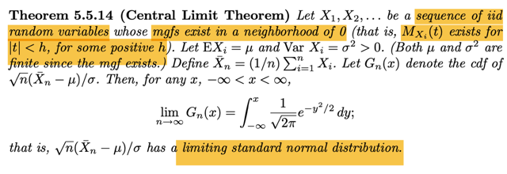</kbd>

> [!NOTE]
> Theorem này nói rằng cho X1, X2...là chuỗi iid random variables, mà mgf của chúng tồn tại trong lân cận của 0 (MXi(t) tồn tại với -h < t < h với h dương nào đó).
>
>
>
> Rồi gọi E\[Xi\] là μ, Var Xi = σ^2 > 0, cả hai cái này đều finite vì đã nói mgf tồn tại. (ta nhớ EXi là first moment, EXi^2 là second moment).
>
>
>
> Định nghiã sample mean của random sample size n: Xbar_n = ∑i=1:n Xi
>
>
>
> Dùng Gn(x) kí hiệu cho cdf của √n (Xbar_n - μ) / σ.
>
>
>
> Khi đó với mọi x: thì lim x→∞ Gn(x) = ∫-inf:x (1/√2π) e^-y^2/2 dy
>
>
>
> Và điều này có nghĩa là:
>
>
>
> **√n (Xnbar - μ) / σ hội tụ phân phối về standard normal random variable**

**🔗 See also:** [Phương pháp Delta 1/Xbar](#node-1zfrnml) · [Stronger Central Limit Theorem](#node-yngnkwh) · [Theorem 10.1.12 (Asymptotic efficiency of MLEs)](./101_point_estimation.md#node-n1mqtrr)

 

- **Định lý Giới hạn Trung tâm**

<kbd>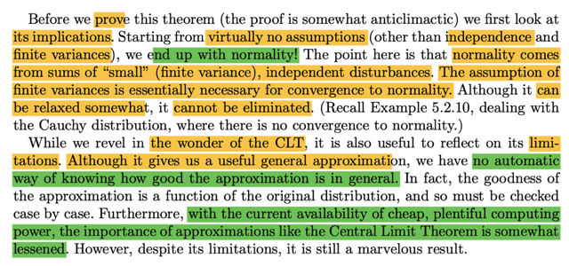</kbd>

> [!NOTE]
> đại khái là giáo sư Casella cho rằng, cái hay của theorem này là, ta **hầu như xuất phát với ko có giả định nào trừ việc các random variable độc lập và variance hữu hạn. Thế mà ta lại kết thúc với normal distribution**
>
>
>
> Gs nhấn mạnh, cái **assumption về finite variance** tuy **có thể nới lỏng chút ít nhưng bắt buộc phải có**.
>
>
>
> Rồi, theorem này cũng có hạn chế là **tuy rằng nó cho ta một cách ước lượng cũng hữu ích nhưng ko tự động cho biết sự ước lượng này tốt cỡ nào**.
>
>
>
> Cuối cũng, với **sức mạnh tính toán ngày càng lớn thì tầm quan trọng của theorem này ngày càng ít**

**🔗 See also:** [MGF của aX+b](./23_mgf.md#node-4ypjp34) · [Các định lý độc lập n biến](./46_multi_variate_distribution.md#node-151qbd1)

 

- **Proof of Theorem 5.5.14**

<kbd>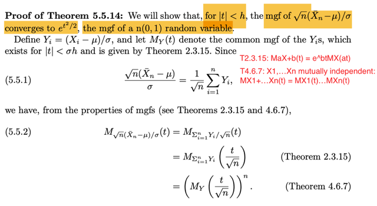</kbd>

> [!NOTE]
> Để chứng minh thì ta sẽ **chứng minh mgf của √n(Xn_bar - μ) / σ converge về e^t^2/2 - là mgf của standard normal**.
>
>
>
> Đặt Yi = (Xi - μ) / σ. Gọi MY(t) là common mgf của Yis, theo theorem, thì nó tồn tại với |t| < σh.
>
>
>
> Dừng lại chút chỗ này là sao?
>
>
>
> Ta nhớ **location scale** **theorem**. Nói rằng khi Z là standard member có pdf f(z) thì X = σZ + μ sẽ là thành viên trong family có location μ, scale σ với pdf là: fX(x) = f((x - μ)/σ)/σ
>
>
>
> Thử chứng minh:
>
>
>
> Chứng minh chiều đi: Z có pdf f(z) thì fX(x) = f((x - μ)/σ)/σ:
>
>
>
> FX(x) = P(X ≤ x) = P(σZ + μ ≤ x) = P({s: σZ(s) + μ ≤ x}) = P({s: Z(s) ≤ (x - μ) / σ})
>
>
>
> = P(Z ≤ (x - μ) / σ) = FZ\[(x - μ) / σ\]
>
>
>
> d/dx FX(x) = fX(x) = d/dx FZ\[(x - μ) / σ\] = d/d\[(x - μ) / σ\] FZ\[(x - μ) / σ\] . d/dx \[(x-μ) / σ\]
>
>
>
> = fZ((x - μ) / σ) . 1/σ = f((x - μ) / σ) / σ. Chứng minh xong
>
>
>
> Ngược lại, nếu X là thành viên có location μ scale σ thì (X - μ) / σ sẽ là thành viên chuẩn có location 0, scale 1
>
>
>
> Chứng minh chiều ngược lại: Cho X có pdf fX(x) = f((x - μ)/σ)/σ . Thì Z quan hệ với X bởi equation: X = σZ + μ sẽ có pdf là f(z):
>
>
>
> FZ(z) = P(Z ≤ z) = P\[(X - μ)/σ ≤ z\] = P(X ≤ σz + μ) = FX(σz + μ)
>
>
>
> ⇨ fZ(z) = d/dz FZ(z) = d/dz FX(σz + μ) = d/d(σz + μ) FX(σz + μ) . d/dz (σz-μ)
>
>
>
> = fX(σz + μ) σ = \[f(σz + μ - μ) / σ)/σ\] σ = f(z)
>
>
>
> =====
>
>
>
> Vậy thì ở đây Yi = (Xi - μ) / σ. Vì X1, X2...iid, có nghĩa là chúng chung marginal distribution, nên Y1,Y2,...là các g(X1), g(X2)...với g(u) = (u - μ) / σ cũng sẽ là independent mutually. Và cũng sẽ có chung marginal distribution (vì X1, X2.. có chung marginal pdf, nên nếu dùng transformation theorem để tìm pdf của Y1,.. thì cũng ra giống nhau).
>
>
>
> Gọi MY(t) là mgf của Y1,...Yn
>
>
>
> Rồi, biến đổi chút xíu ta sẽ có quan hệ giữa Xnbar và Yi:
>
>
>
> Yi = (Xi - μ) / σ
>
>
>
> ⇨ Σi Yi = Σi (Xi - μ) / σ = (Σi Xi - Σi μ) / σ
>
>
>
> ⇔ (Σi Yi) / √n = (Σi Xi - Σi μ) / σ√n
>
>
>
> ⇔ (Σi Yi) / √n = √n (Σi Xi - Σi μ) / σ√n√n
>
>
>
> = √n \[(Σi Xi)/n - Σμ/n\] / σ
>
>
>
> = √n (Xbar_n - μ) / σ
>
>
>
> ⇔ **(Σi Yi) / √n = √n (Xbar_n - μ) / σ**
>
>
>
> Xét mgf của √n (Xbar_n - μ) / σ, kí hiệu là M\_\[√n(Xbar_n-μ)/σ\](t)
>
>
>
> dĩ nhiên cũng là mgf của (Σi Yi) / √n, kí hiệu M\_\[(Σi Yi) / √n\](t)
>
>
>
> Áp dụng theorem 4.6.7, **mgf của tổng các independent rv = tích các mgf**:
>
>
>
> M\_\[(Σi Yi)/√n\](t) = Πi M\_(Yi/√n)(t)
>
>
>
> Xét M\_(Yi/√n)(t), thì áp dụng theorem 2.3.15 nói rằng mgf của aX + b:
>
>
>
> M\_(aX + b)(t) = (e^bt)MX(at)
>
>
>
> ⇨ M\_(Yi/√n)(t) = M\[(1/√n)Yi + 0\](t) = e^(0t) MYi(t/√n) = MYi(t /√n)
>
>
>
> Vậy M\_\[(Σi Yi)/√n\](t) = Πi M_Yi/√n(t) = Πi MYi(t/√n)
>
>
>
> và MYi(t) đều giống nhau, đều là MY(t) nên
>
>
>
> ... = \[MY(t /√n)\]^n

**🔗 See also:** [Biến đổi PDF Location-Scale](./35_location_and_scale_families.md#node-cs2rm3i) · [MGF của aX+b](./23_mgf.md#node-4ypjp34)

 

- **Khai triển Taylor MGF Moment**

<kbd>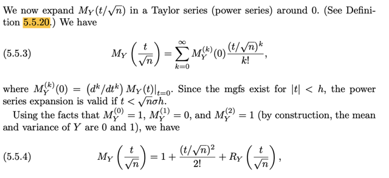</kbd>

<kbd>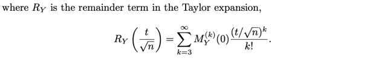</kbd>

> [!NOTE]
> Rồi, theo định nghĩa, đại khái là mình đã từng học đó là, theo **định nghĩa của mgf** khi ta Taylor expansion nó ra, thì hệ số gắn với term bậc 1, cũng là đạo hàm bậc 1 của mgf chính là first moment, tức EX, hệ số gắn với term bậc 2, cũng là đạo hàm bậc 2 của mgf chính là second moment, tức EX^2, ....
>
>
>
> Nên ở đây, ta sẽ Taylor expand tại 0, MY(t /√n) = Σk=0:inf MY^(k)(0) (t/√n)^k / k!
>
>
>
> thì ta hiểu MY^(k)(0) chính là k'th moment, và nó chính là đạo hàm bậc k của MY(t)
>
>
>
> Tiếp, cũng có thể hiểu, ta dùng the fact là moment bậc 0, 1 và 2 của Y mình đã biết, lần lượt là 1, 0, 1. Vì, Yi = (Xi - μ)σ thì EYi = (EXi - μ) / σ = (μ - μ) / σ = 0.
>
>
>
> VarYi = Var (Xi - μ)σ = Var (Xi - μ) / σ^ = Var(Xi) / σ^2 = σ^2/σ^2 = 1
>
>
>
> ⇨ EYi^2 - (EYi)^2 = 1 ⇨ EYi^2 = 1 - 0 = 1, đây chính là moment bậc 2
>
>
>
> Vậy MY(t/√n) = 1 + (t/√n)^2/2! + RY(t/√n) với RY là các term còn lại của Taylor expansion (là sao, là vì ta đã biết 3 cái moment đầu tiên nên thay vào ta có 3 hạng tử đầu tiên như vầy, còn các hạng tử khác, gom vô thành hàm RY)

 

- **Định lý Taylor**

<kbd>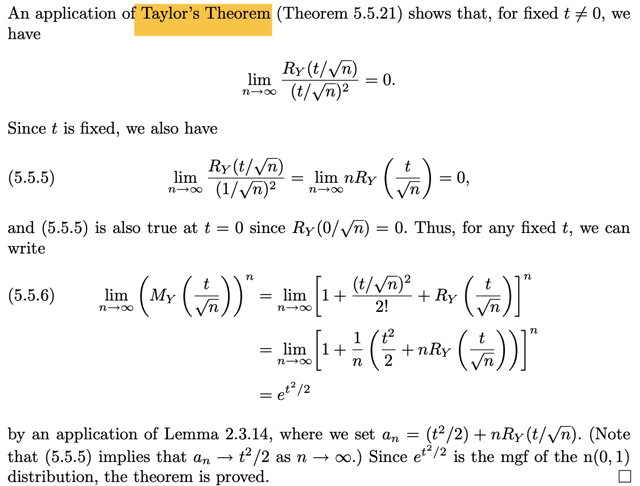</kbd>

> [!NOTE]
> Tới đây thêm vài bước nữa là chứng minh xong. 
>
>
>
> QUAY LẠI SAU

 

- **Stronger Central Limit Theorem**

<kbd>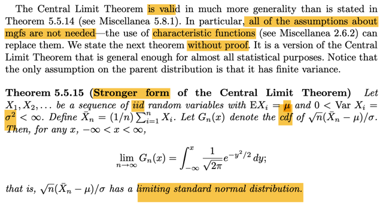</kbd>

<kbd>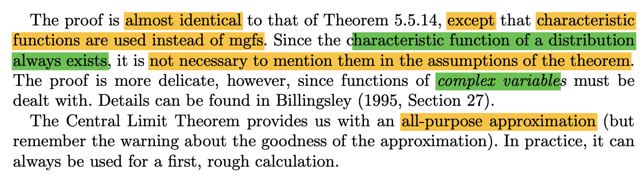</kbd>

> [!NOTE]
> Đại khái khái đây là **phiên bản mạnh hơn của CLT**, trong đó **ko cần các giả thiết về mgf**. Ở đây gs ko chứng minh.
>
>
>
> Nội dung thì đại khái là cũng cho chuỗi rv X1,X2...iid, có population mean μ, finite variance σ^2. Và Xbar_n là sample mean size n. Gn(x) là cdf của √n(Xbar_n - μ) / σ thì theorem nói rằng n → inf thì Gn(x) → ∫-inf:x 1/√2π e^-y^2/2dy chính là cdf của standard normal (normal(0,1))
>
>
>
> Chú ý là, hai cái chỉ khác nhau cái điều kiện, với phiên bản CLI thường, nó yêu cầu mgf tồn tại (trong khoảng lân cận của 0), còn ở đây thì không cần giả thiết đó, mà cái này dùng characteristic function, vốn là luôn tồn tại.
>
>
>
> Cái CLT này cho ta một công cụ hữu ích, **all-purpose approximation**, nhưng phải lưu ý rằng **chất lượng của approximation này phải xem lại**. Trong thực tế, nó luôn có ích trong việc đưa ra những tính toán sơ bộ đầu tiên

**🔗 See also:** [CLT - Định lý giới hạn trung tâm](#node-32vkewg) · [MLE of e-lambda with Delta Method](./101_point_estimation.md#node-jiyzyog) · [Asymptotic Normality of the Median](./102_robustness.md#node-zvthtrd)

 

- **Xấp xỉ Chuẩn Nhị thức Âm**

<kbd>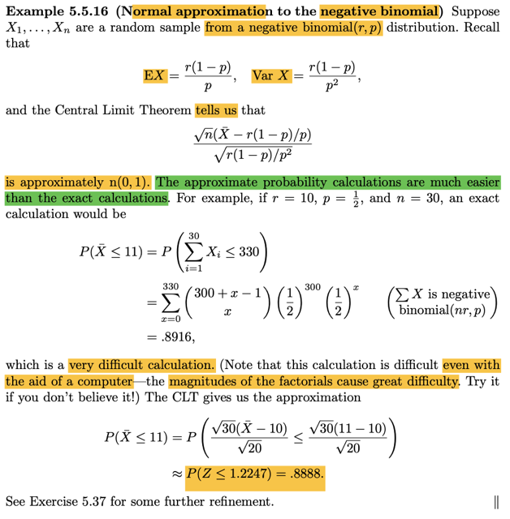</kbd>

> [!NOTE]
> Đại khái là một ví dụ, khi mà ta có random sample từ population là thuộc loại negative binomial(r, p).
>
>
>
> Cái này ta đã học mean và variance của nó là r(1 - p) / p và r(1 - p)/p^2
>
>
>
> Có thể chứng minh lại nếu muốn.
>
>
>
> Nhưng ý chính là, **giả sử ta muốn tính xác suất liên quan đến sample mean**, ví dụ P(Xbar ≤ 11) thì **nếu tính chính xác thì sẽ rất khó, do sẽ phải deal với các giai thừa** (do pmf của negative binomial) kể cả khi có máy tính.
>
>
>
> Trong khi đó nếu dùng CLT, nói rằng **√n(Xn - μ) / σ sẽ có thể coi như xấp xỉ như một normal(0,1)** thì khi đó **việc tính xác suất trên sẽ dễ hơn nhiều**
>
>
>
> Ôn lại thì story của negative binomial(r, p) là: "số Bern(p) trial iid cần thiết để có r success"
>
>
>
> Nên nên event (X = k) tức là có k Bern(p) trial và có đủ r success, với một success đứng cuối. ⇨ nó sẽ chuỗi có dạng \[r - 1 sucess + k - r failure lộn\] và \[1 success cuối\]
>
>
>
> (X = k) = {s ∈ Ω, s có dạng như trên}
>
>
>
> P(X = k) = P({s ∈ Ω, s có dạng như trên})
>
>
>
> Theo định nghĩa, = Σ{s ∈ Ω, s có dạng như trên} P({s})
>
>
>
> Xét P({s}), đều có dạng là joint event của r success và k - r failure. mà lại độc lập nhau, nên theo định nghĩa của independent event, P của joint event này = tích các P, = P(success)^r P(failure)^k-r = p^r (1-p)^(k-r)
>
>
>
> Việc còn lại là đếm số lượng của set {s ∈ Ω, s có dạng như trên}
>
>
>
> Thì nó là số hoán vị của r - 1 success và k - r failure, nhưng ko care thứ tự của các success cũng như của các failure.
>
>
>
> = (k-1)! / (r-1)! (k-r)!
>
>
>
> ⇨ pmf P(X = k) = \[(k-1)! / (r-1)! (k-r)!\] p^r (1-p)^(k-r)
>
>
>
> = \[(k-1) choose (r-1)\] p^r (1-p)^(k-r)
>
>
>
> ---
>
>  Như vậy, quay lại đây:
>
>
>
> P(Xbar ≤ 11) = P(Σi=1:30 Xi ≤ 11) = P(Σi Xi ≤ 330)
>
>
>
> Tới đây ta phải tìm distribution của Y = Σi Xi, với Xi là negative binomial(r, p)
>
>
>
> thì ở đây người ta cho biết nó sẽ là neg bin (nr, p)
>
>
>
> (hình như cũng dễ hiểu thôi, theo story proof, nếu X1 có story là số Bern(p) trial để có được r success, X2 cũng là số Bern(p) trial để có được r success, thì X1 + X2 dễ thấy sẽ có story là số Bern(p) trial để có được 2r success)
>
>
>
> Rồi, nhờ đó ta có thể tính P(Y ≤ 330)
>
>
>
> QUAY LẠI SAU
>
>
>
> = Σk=0:330
>
> QUAY LẠI SAU

 

- **Định lý Slutsky**

<kbd>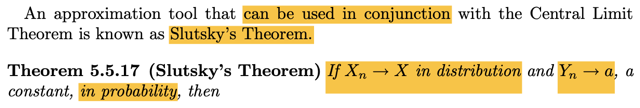</kbd>

<kbd>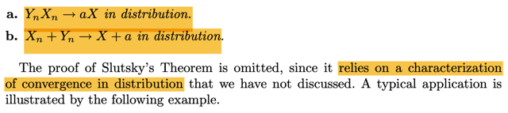</kbd>

<kbd>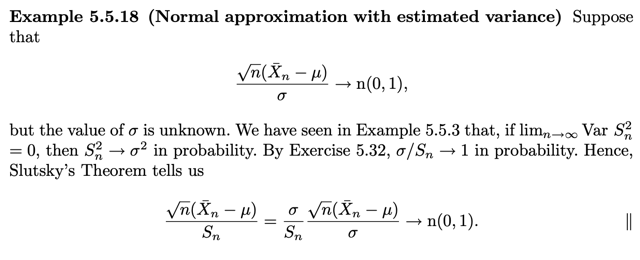</kbd>

> [!NOTE]
> Theorem này rất quan trọng, hữu ích:
>
>
>
> Nó nói Xn → (d) X, Yn → (p) a thì XnYn → (d) aX
>
>
>
> Và Xn + Yn → (d) X + a
>
>
>
> Gs cũng không chứng minh theorem này

**🔗 See also:** [Theorem 10.1.12 (Asymptotic efficiency of MLEs)](./101_point_estimation.md#node-n1mqtrr)

 

- **Ước lượng Odds và Delta Method**

<kbd>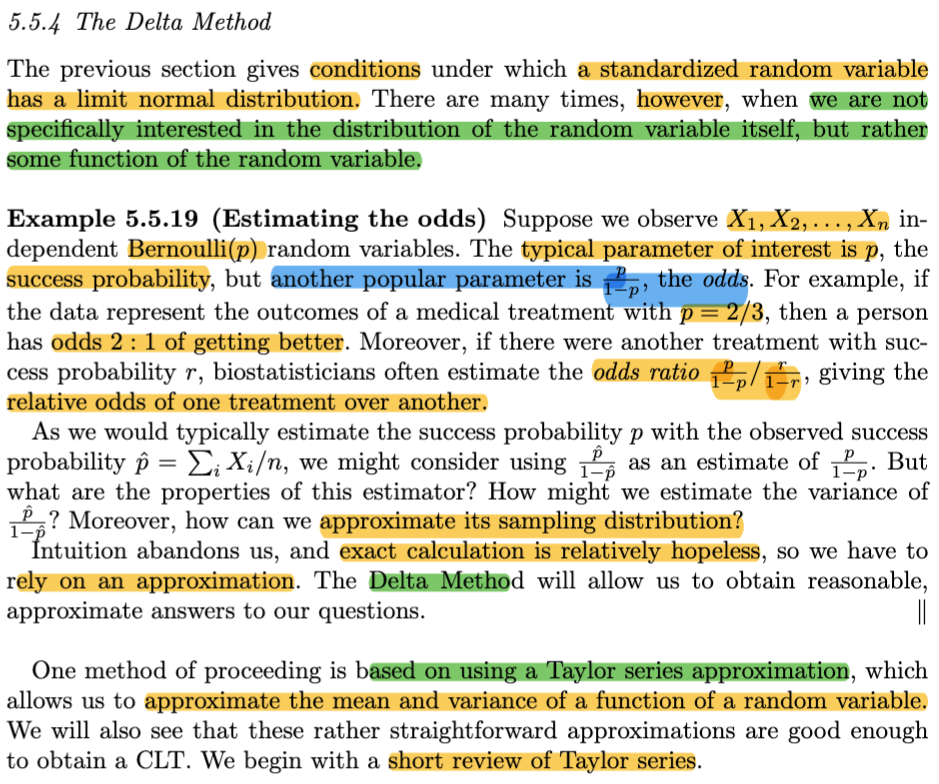</kbd>

> [!NOTE]
> Đại khái là, phần trước, là ta quan tâm đến điều kiện **khi nào thì một random variable đã chuẩn hóa sẽ có limit normal distribution** (ý là, kiểu như ta được học rằng √n(Xbar_n- μ) / σ sẽ → normal(0,1)
>
>
>
> Nhưng có **nhiều khi ta ko care distribution của random variable, mà care distribution của một function apply lên rv đó cơ.**
>
>
>
> (random variable ở đây đang chỉ nhiều loại rv có limit distribution là normal(0,1) trong đó có √n(Xbar_n - μ)/σ^2, chứ sample mean không phải là cái duy nhất (nhưng là statistic quan trọng nhất) vậy thì ý là nhiều khi ta muốn tìm limit distribution của g(Xbar_n) chứ không phải của Xbar, ví dụ 1/Xbar_n hoặc Xbar_n / (1 - Xbar_n), là odd sẽ nói ở dưới đây)
>
>
>
> Thế thì đầu tiên được học khái niệm **odd** (đã gặp trong ISL), bối cảnh là ta có các random sample size n X1,X2...Xn từ Bern(p) distribution.
>
>
>
> Thì ngoài p, là xác suất success, ta còn care p/1-p, đây chính là odd, ý nghĩa của nó, nói **xác suất khỏi bệnh là 2/3** thì cũng là nói ta có **tỉ lệ cược 2:1 cho việc khỏi bệnh** (2 ăn 1 tức là ta tin rằng khả năng khỏi là 2 phần, khả năng không khỏi là 1 phần)
>
>
>
> Để rồi người ta có thể quan tâm đến **odds ratios**, là **tỉ lệ của tỉ lệ cược giữa hai phương pháp chữa bệnh**
>
>
>
> Đại khái là cũng giống như khi ta thường dùng Xbar_n = (ΣiXi)/n (sample mean) để estimate cho population mean p.
>
>
>
> Gọi p^ = (ΣiXi)/n, thì ta có thể **cũng dùng p^/(1-p^) để estimate cho p/(1-p)**
>
>
>
> Nhưng câu hỏi là **CÁCH** **ESTIMATE NÀY CHÍNH XÁC HAY KO** (đánh giá thông qua các tính chất như mean và variance của nó) và sau đó là **LÀM SAO TÌM SAMPLING DISTRIBUTION CỦA p^/(1-p^)**
>
>
>
> (dừng lại tí, ôn lại chút xíu, dĩ nhiên p^ là sample mean, là một statistic, là function apply lên các random variable của random sample. Thế thì, p^/(1-p^) cũng là function apply lên statistic, cũng là statistic, và distribution của statistic được gọi là **sampling distribution,** để phân biệt với **population distribution**)
>
>
>
> Thế thì, đại ý là, **DELTA METHOD** sẽ giúp trong việc này

 

- **Khai triển Taylor**

<kbd>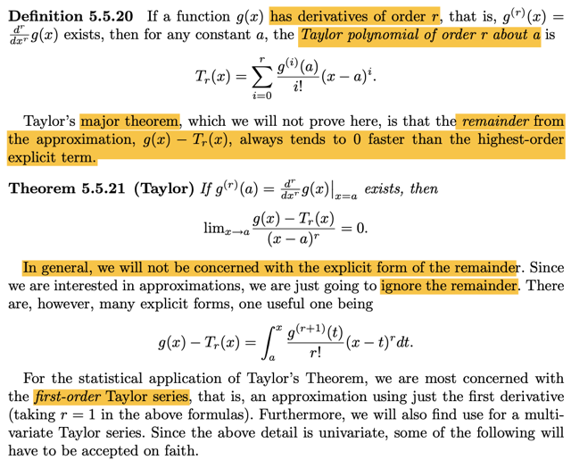</kbd>

> [!NOTE]
> Nói về Taylor expansion, cái này thì đã gặp nhiều bên giải tích, tối ưu nên cũng nhớ rồi.
>
>
>
> Cho hàm g(x) có **đạo hàm bậc r**, có nghĩa là **tồn tại hàm g^(r)(x) = d^r/dx^r g(x)**. Khi đó với mọi constant a:
>
>
>
> g(x) = Σi=0,1,2... (g^(i)(a)/i!) \[x-a\]^i
>
>
>
> Cái này gọi là Taylor expansion around x = a
>
>
>
> Nhưng trong cuốn Numerical Optimization của J. Nocedal, mình cũng đã học Taylor's theorem: Ta nhớ nó có gốc gác là Mean Value Theorem, nói rằng, cho hàm f(x), thì khi đi từ a → b, sẽ tồn tại điểm c trong khoảng (a, b) sao cho độ dốc hàm số tại c bằng độ dốc trung bình: f'(c) = \[f(b)-f(a)\]/(b-a).
>
>
>
> Nên từ x = x0 tới x0 + p sẽ tồn tại điểm x0 + tp với t ∈ (0,1) sao cho f'(x + tp) = \[f(p) - f(x)\]/p ⇔ f'(x + tp)p = f(p) - f(x) ⇔ f(p) = f(x) + f'(x + tp)p.
>
>
>
> Tương tự, từ x = x0 tới x = x0 + p cũng sẽ tồn tại điểm x = x0 + tp với t ∈ (0,1) sao cho f(p) = f(x) + f'(x)p + (1/2)f''(x + tp)p^2
>
>
>
> Và tương tự, từ x = x0 tới x = x0 + p cũng sẽ tồn tại điểm x = x0 + tp với t ∈(0,1) nào đó sao cho f(p) + f'(x)p + (1/2)f''(x)p^2 + (1/6)f^(3)(x+tp)p^3
>
>
>
> ---
>
> Vậy thì ở đây, ta cũng sẽ có khi đi từ a → x cũng sẽ tồn tại điểm c nào đó trong khoảng (a,x) sao cho:
>
>
>
> g(x) = g(a) + g'(a)(x-a) + (1/2)g''(a)(x-a)^2 + ...+ (1/r!)g^(r)(a)(x-a)^r + \[1/(r+1)!\]g^(r+1)(c)(x-a)^(r+1)
>
>
>
> Thế thì nếu ta chỉ lấy r hạng tử đầu tiên (tới term bậc r), thì đó là định nghĩa của cái gọi là Taylor polynomial of order r about a:
>
>
>
> Tr(x) = Σi=r (g^(i)(a)/i!) \[x-a\]^i
>
>
>
> Như vậy có thể thấy g(x) = Tr(x) + \[1/(r+1)!\]g^(r+1)(c)(x-a)^(r+1)
>
>
>
> ⇔ g(x) - Tr(x) = \[1/(r+1)!\]g^(r+1)(c)(x-a)^(r+1)
>
>
>
> Và ở đây mình được học kiến thức liên quan đến định lý Taylor nữa trong context thống kê, đại ý là, gs nói rằng, định lý Taylor cho biết, phần dư (residual) có được sau khi trừ g(x) cho Tr(x), sẽ converge về 0 NHANH HƠN là (x-a)^r converge về 0, khi x → a. Thể hiện bởi: lim x→a \[g(x) - Tr(x)\] / (x - a)^r = 0
>
>
>
> Vậy thì nhờ đã biết Taylor theorem nên ta biết phần dư là \[1/(r+1)!\]g^(r+1)(c)(x - a)^(r+1), nên chứng minh ý trong sách dễ ẹt:
>
>
>
> lim x → a {\[1/(r+1)!\]g^(r+1)(c)(x - a)^(r+1) / (x - a)^r}
>
>
>
> lim x → a {\[1/(r+1)!\]g^(r+1)(c)(x - a)}
>
>
>
> dĩ nhiên lim này = 0 → chứng minh xong
>
>
>
> ---
>
>
>
> Gs cho biết ta thường không quan tâm đến dạng tường minh của phần dư, tuy nhiên, có một dạng công thức tường minh (explicit) mà sẽ tỏ ra hữu ích, đó là g(x) - Tr(x) = ∫a:x \[g^(r+1)(t)/r!\] (x-t)^r dt, hiểu cái này như sau:
>
>
>
> Chứng minh cái này bằng tích phân toàn phần:
>
>
>
>  Chứng minh với r = 0: g(x) - T0(x) = ∫a:x g'(t) dt ⇔ g(x) - g(a) = ∫a:x g'(t)dt. Cái này không cần phải chứng minh, vì chỉ cần áp dụng FTC. Còn nhớ FTC 2 nói rằng, nếu G là nguyên hàm của f, tức d/dt G(t) = f(t) thì ∫a:b f(t)dt = G(b) - G(a). Ở đây g(t) là nguyên hàm của g'(t) ⇨ ∫a:x g'(t)dt = g(x) - g(a).
>
>
>
> Chứng minh với r = 1: g(x) - T1(x) = ∫a:x g''(t)(x-t)dt ⇔ g(x) - \[g(a) + g'(a)(x-a)\] = ∫a:x g''(t)(x-t)dt
>
>
>
>  ⇔ g(x) - g(a) - g'(a)(x-a) = ∫a:x g''(t)(x-t)dt
>
>
>
>  ⇔ g(x) = g(a) + g'(a)(x-a) + ∫a:x g''(t)(x-t)dt
>
>
>
> Bắt đầu với kết quả đã có: g(x) - g(a) = ∫a:x g'(t)dt
>
>
>
> ⇔ g(x) = g(a) + ∫a:x g'(t)dt
>
>
>
> Xét ∫a:x g'(t)dt. Dùng tích phân từng phần (integration by part), ôn lại nhanh IBP:
>
>
>
> Xuất phát từ product rule: d(uv) = (du)v + u(dv). Tích phân hai vế: ∫d(uv) = ∫vdu + ∫udv ⇔ uv = ∫vdu + ∫udv ⇔ uv - ∫udv = ∫vdu
>
>
>
> Đặt g'(t) = v ⇨ dv = g''(t)dt
>
>
>
> Đặt du = dt ⇨ u = t + constant c, chọn c = -x
>
>
>
> Áp dụng IBP, ∫a:x g'(t)dt = g'(t)(t-x)|a:x - ∫(t-x)g''(t)dt
>
>
>
> = g'(x)(0) - g'(a)(a-x) - ∫(t-x)g''(t)dt
>
>
>
> = g'(a)(x-a) + ∫g''(t)(x-t)dt
>
>
>
> Vậy g(x) - g(a) = ∫a:x g'(t)dt ⇔ g(x) - g(a)
>
>
>
> = g'(a)(x-a) - ∫g''(t)(t-x)dt ⇔ g(x)
>
>
>
> = g(a) + g'(a)(x-a) + ∫g''(t)(x-t)dt
>
>
>
> = T1(x) + ∫g''(t)(x-t)dt → chứng minh xong g(x) - Tr(x) = ∫a:x \[g^(r+1)(t)/r!\] (x-t)^r dt cho r = 2.
>
>
>
> Tiếp tục như vậy ta sẽ chứng minh được quy luật
>
>
>
> g(x) = Tr(x) + ∫a:x \[g^(r+1)(t)/r!\] (x-t)^r dt
>
>
>
> ⇔ g(x) - Tr(x) = ∫a:x \[g^(r+1)(t)/r!\] (x-t)^r dt

 

- **Xấp xỉ kỳ vọng Taylor**

<kbd>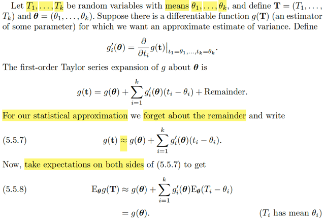</kbd>

> [!NOTE]
> rồi, ở đây là nói qua case đa biến. Cho T1,...Tk là các random variable với mean θ1, ..θk. Và đặt vector **T** = (T1,...Tk), và **θ** = (θ1,...θk).
>
>
>
> Giả sử có hàm g(**T**) là hàm khả vi, đóng vai trò là estimator của some parameter.
>
>
>
> (Trong chap 7 ta sẽ học bài toán point estimation, để hiểu khái niệm estimator của θ, được định nghĩa là một hàm số của sample W(**X**). Nên ở đây g(**T**) có thể là một estimator cho parameter nào đó.
>
>
>
> Và vấn đề là ta muốn ước lượng variance, tức là, ta **muốn estimate Var(g(T)), variance của random variable g(T)** này. Cái này sẽ liên quan đến việc **đánh giá chất lượng của estimator**, thông qua một tính chất gọi là efficiency, kiểu như, nếu estimator W(X) của θ có variance ngày ngàng nhỏ khi kích thước mẫu ngày càng lớn thì đó sẽ là một estimator efficient, đây ko phải định nghĩa chính xác nhưng có thể hiểu đại khái là vậy)
>
>
>
> Define g'i(**θ**) = ∂/∂ti g(**t**)|ti = θ1,...,tk=θk.
>
>
>
> Cái này là sao, đơn giản thôi, g'i(**θ**) là ∂/∂ti g(**t**)|**t**=**θ** ý là kí hiệu sẽ dùng để chỉ đạo hàm riêng của g đối với **t**i, evaluate tại **t**=**θ**
>
>
>
> Vậy thì ta có first order Taylor series expansion của g about **θ**:
>
>
>
> Thì cũng y như trong giải tích hay tối ưu ta hay nói first order approximation của hàm f tại x0:
>
>
>
> f(x) ≈ f(x0) + ∇f(x0)T(x-x0)
>
>
>
> Thì ở đây là:
>
>
>
> g(**t**) ≈ g(**θ**) + Σi=1:k g'i(**θ**)(ti - θi) → 5.5.7
>
>
>
> Cái vế sau chính là ∇g(**θ**)T(**t** - **θ**) thôi
>
>
>
> Rồi, bây giờ ta sẽ lấy expectation hai vế:
>
>
>
> Là sao nhỉ.
>
>
>
> Mình hiểu là, đã nói về việc lấy kì vọng, thì chỉ có thể nói về kì vọng của random variable. Nên hiểu ở đây ý là, ta sẽ lấy expectation của g(**T**). Với **T** là random variable vector **T** define ở trên, thì g(**T**) đương nhiên cũng là random variable (hoặc random variable vector, ở đây ko nói g là vector hay scalar, nhưng dù là gì thì vẫn có thể lấy kì vọng)
>
>
>
> Eg(**T**), thế còn tại sao phải ghi là E\_**θ** g(**T**)?
>
>
>
> Là vì g(**T**) là random variable được tạo bởi **T**, mà **T** = (T1,...Tk) là vector các random varible có distribution với param θ1,..θk, nên distribution của g(**T**) cũng phụ thuộc **θ**, đóng vai tham số, nên E\_θ g(**T**) sẽ phụ thuộc **θ**.
>
>
>
> Rồi, như vậy thì E\_**θ**\[g(**T**)\], vì g(t) ≈ g(**θ**) + Σi=1:k g'i(**θ**)(ti - θi)
>
>
>
> nên ta có E\_**θ**\[g(**T**)\] ≈ E\_**θ**\[g(**θ**) + Σi=1:k g'i(**θ**)(Ti - θi)\]
>
>
>
> = E\_**θ**\[g(**θ**)\] + E\_**θ**\[Σi=1:k g'i(**θ**)(Ti - θi)\] | linearity
>
>
>
> với **θ**, là tham số, dĩ nhiên trong bối cảnh thông thường, là Classical statistic,(không phải Bayesian), thì ta sẽ coi như fixed & unknown nên g(**θ**) là constant ⇨ E\_**θ**\[g(**θ**)\] = g(**θ**)
>
>
>
> .. = g(**θ**) + E\_**θ**\[Σi=1:k g'i(**θ**)(Ti - θi)\]
>
>
>
> = g(**θ**) + Σi=1:k E\_**θ**\[g'i(**θ**)(Ti - θi)\] | linearity
>
>
>
> = g(**θ**) + Σi=1:k g'i(**θ**) E\_θ(Ti - θi) | g'i(**θ**) cũng là fixed → đưa ra ngoài kì vọng theo linearity
>
>
>
> = g(**θ**) + Σi=1:k g'i(**θ**) \[E\_**θ**(Ti) - E\_**θ**(θi)\]
>
>
>
> = g(**θ**) + Σi=1:k g'i(**θ**) \[θi - θi\] | Do E\_**θ**(Ti) = θi, và E\_**θ**(θi) = θi
>
>
>
> = g(**θ**)
>
>
>
> Vậy E\_**θ**\[g(**T**)\] ≈ g(**θ**)
>
>
>
> Chú ý, vì ta đang dùng xấp xỉ bậc 1 cho g, nên cái ta có chỉ là approximated của E\_**θ** g(**T**).

**🔗 See also:** [Xấp xỉ Mean Variance Tỉ số](#node-oj905vr)

 

- **Công thức phương sai hàm**

<kbd>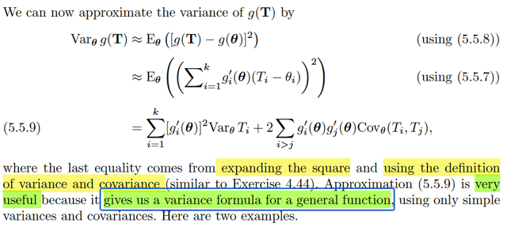</kbd>

> [!NOTE]
> Rồi, khi đã có E\_θ\[g(**T**)\] rồi, tức là approximated mean của g(**T**) ta sẽ **đi tính approximated variance**:
>
>
>
> Var\_**θ** g(**T**), theo công variance đã biết Var\[X\] = E\[X - EX\]^2
>
>
>
> ⇨ Var\_θ\[g(**T**)\] = E\_θ\[g(**T**) - E\_θ(g(**T**))\]^2
>
>
>
> Thay E\_θ\[g(**T**)\] ≈ g(**θ**)
>
>
>
> .. ≈ E\[g(**T**) - g(**θ**)\]^2 (ta dùng approx. value tính ở trên, bởi vậy nên ở đây ta phải dùng kí hiệu approx)
>
>
>
> Tới đây, ta dùng lại xấp xỉ 5.5.7 g(**t**) ≈ g(**θ**) + Σi=1:k g'i(**θ**)(ti - θi) ⇨ g(**T**) ≈ g(**θ**) + Σi=1:k g'i(**θ**)(Ti - θi)
>
>
>
> ≈ E\[g(**θ**) + Σi=1:k g'i(**θ**)(Ti - θi) - g(**θ**)\]^2
>
>
>
> ≈ E\[Σi=1:k g'i(**θ**)(Ti - θi)\]^2
>
>
>
> Đây là kì vọng của bình phương một cái tổng k hạng tử, dùng công thức Newton mở cái tổng này ra thì nó sẽ trở thành tổng của k hạng tử có dạng g'i(**θ**)(Ti - θi), còn lại là các cross-term g'i(**θ**)(Ti - θi)g'j(**θ**)(Tj - θj), i khác j. Dùng tính linearity đưa E vào trong tổng.
>
>
>
> = Σi=1:k E\[g'i(**θ**)(Ti - θi)\]^2 + 2Σi>j E\[g'i(**θ**)(Ti - θi)g'j(**θ**)(Tj - θj)\]
>
>
>
> = Σi=1:k g'i(**θ**)^2 E\[(Ti - θi)\]^2 + 2Σi>j g'i(**θ**)g'j(**θ**) E\[(Ti - θi)(Tj - θj)\]
>
>
>
> (tiếp tục dùng tính linearity, đưa constant ra)
>
>
>
> = Σi=1:k g'i(**θ**)^2 E\[(Ti - ETi)\]^2 + 2Σi>j g'i(**θ**)g'j(**θ**) E\[(Ti - ETi)(Tj - ETj)\]
>
>
>
> (Thay θi = ETi)
>
>
>
> Thì E\[(Ti - ETi)\]^2 chính là Var(Ti) và E\[(Ti - ETi)(Tj - ETj)\] chính là Cov(Ti, Tj)
>
>
>
> = Σi=1:k g'i(**θ**)^2 VarTi + 2Σi>j g'i(**θ**)g'j(**θ**) Cov(Ti, Tj)
>
>
>
> Vậy ta có kết quả: 
>
>
>
> Var\_θ\[g(**T**)\] ≈ Σi=1:k g'i(**θ**)^2 VarTi + 2Σi>j g'i(**θ**)g'j(**θ**) Cov(Ti, Tj)
>
>
>
> VÀ gs cho biết **công thức approx cho var\[g(t)\] này sẽ rất hữu ích, vì nó cho phép ta công thức tính ước lượng variance của một hàm chung chung nào đó**
>
>
>
> (ý là tính approx variance của một random variable khi apply hàm g chung chung nào đó lên các rv đã biết) mà chỉ cần dùng variance và covariance của rvs)

> [!TIP]
> **🤖 AI Feedback** — ✅ Score: **98/100**
>
> Ghi chú giải thích từng bước đạo hàm công thức phương sai xấp xỉ một cách cực kỳ chi tiết, rõ ràng và chính xác, bao gồm cả những giả định quan trọng. Phần giải thích về tính hữu ích của công thức cũng được trình bày rất tốt, thể hiện sự hiểu biết sâu sắc.

 

- **Phương sai Tỷ lệ Odd**

<kbd>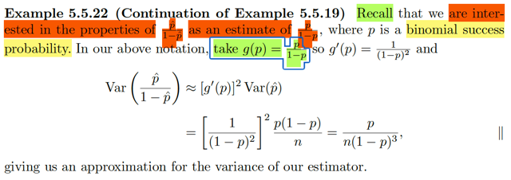</kbd>

> [!NOTE]
> Rồi, cái vừa rồi là **để áp dụng cho cái này**. Là vì như đã nói, ta **đang quan tâm đến odd**: **p / (1-p)**. Tức là, bối cảnh là ta có một random sample X1,X2,...Tn size n từ population là Bern(p). Thì dĩ nhiên ta quan tâm đến p, nhưng với Bern(p) thì ta cũng quan tâm đến một tham số khác là odd: = p/(1-p).
>
>
>
> Thế thì với **p, ta dùng sample mean Xbar = Σi Xi**, hay kí hiệu khác **p^** để estimate cho nó. Thì với **odd, ta dùng p^/(1-p^) để estimate cho nó.**
>
>
>
> Sau khi học chap 7 quay lại đây mình thấy hiểu hơn những chỗ này, p^,hay Xbar, là các statistic, là estimator của parameter. Với Tbar, hay, cũng có thể viết là Xbar(**X**) hay p^(**X**) để nhấn mạnh nó là hàm số của sample **X**, và ta dùng làm estimator cho p, và như đã biết, nó là một sufficient statistic của p (vì khi kích thước mẫu tăng lên n → inf, thì Xbar, (hay Xbar_n để thể hiện sample mean từ mẫy size n) sẽ hội tụ phân phối và cả xác suất về p)
>
>
>
> Vậy thì ta sẽ muốn tìm sampling distribution, hay ít nhất là các properties của estimator của odd: W(**X**) = p^/(1-p^), cụ thể là Variance của cái estimator của odd này.
>
>
>
> Nên hiểu, p^ hay p^/(1-p^) đều đóng tư cách là hàm của sample **X**. Nên ta có thể ghi là p^(**X**) (y như Xbar(**X**), với p^(**X**) = (ΣiXi/n), và \[p^/(1-p^)\](**X**), với ý nghĩa \[p^/(1-p^)\] là hàm của **X**, = (ΣiXi/n)/(1-(ΣiXi/n)).
>
>
>
> Áp dụng kết quả: Var\_θ\[g(**T**)\] ≈ Σi=1:k g'i(**θ**)^2 VarTi + 2Σi>j g'i(**θ**)g'j(**θ**) Cov(Ti, Tj)..
>
>
>
> ..sẽ giúp ta tính được estimated variance của là p^/(1 - p^) vốn dĩ là một hàm phức tạp của **X**, = ((ΣiXi/n)/(1-(ΣiXi/n)), nhưng ta sẽ coi nó là hàm của p^, để áp dụng cái trên, cho p^ đóng vai T, và giúp ta estimate variance của g(**T**). Tức là ta hiểu đại khái là ở đây **T** chính là vector có 1 component là p^, và vector **θ** = p.
>
>
>
> Áp dụng:
>
>
>
> term 1: Σi=1:k g'i(**θ**)^2 VarTi, ở đây chỉ có k = 1, nên ta có g'(**θ**)^2 Var(T)
>
>
>
> g'(**θ**) là gì, tức là đạo hàm hàm g, evaluate tại **θ**, mà **θ** ở đây cũng chỉ là, là p.
>
>
>
> Nên g'(**θ**) ở đây chính là g'(p), hay ghi kiểu này cũng được g'(u) | u = p để nhấn mạnh ta sẽ evaluate thàm g' tại p
>
>
>
> Còn Var(T) dĩ nhiên là Var(p^) rồi.
>
>
>
> Nên term 1 là g'(p)^2 Var(p^)
>
>
>
> Còn term 2: thì ko có, vì ở đây ta chỉ có vector **T** có một random variable p^ thôi
>
>
>
> ====
>
>
>
> Vậy Var\[(p^/1 - p^)\] ≈ g'(p)^2 Var(p^)
>
>
>
> g(u) = u/1-u ⇨ g'(u) = 1/(1-u)^2 (chỉ là dùng quotient rule, ko khó)
>
>
>
> Và **Var(p^)** thì là gì, nó chính là **Var(Xbar)**, tức **variance của sample mean** đó, có công thức là **σ^2/n** tức là **population variance chia n**
>
>
>
> Và ở đây, với X \~ Bern(p) thì variance Var(X) là gì? Thử tính lại đơn giản:
>
>
>
> Var(X) = EX^2 - (EX)^2 = EX^2 - p^2 = \[1^2(PX=1) + 0^2P(X=0)\] - p^2
>
>
>
> = p - p^2 = **p(1-p)**
>
>
>
> ⇨ Ta có kết quả Var\[(p^/1 - p^)\] ≈ \[1/(1-p)^2\]^2 p(1-p)/n ≈ p/\[n(1-p)^3\]
>
>
>
> ⇨ Var\[(p^/1 - p^)\] ≈ p/\[n(1-p)^3\]
>
>
>
> Nói thêm chút, mình nên hiểu thế này: Nãy giờ, là muốn tính, hay đang nói về việc ta quan tâm đến Variance của một statistic: W(**X**) được tính bởi công thức sau đây W(**X**) = ((ΣiXi/n)/(1-(ΣiXi/n)). (Hay thể hiện nó theo p^ (=Xbar) = p^/(1-p^), thì ta cần tính variance của p^/(1-p^) để mà đánh giá nó, xem nó có tốt hay không.
>
>
>
> Thế nhưng gs Casella, trong đoạn mở màn về Delta Method nói rằng, đại khái là ta sẽ rất khó để tính chính xác cái variance của p^/(1-p^) (ông nói: exact calculation is hopeless), đó chỉ có thể tính gần đúng, và Delta method cho phép ta tính gần đúng.
>
>
>
> Vậy thì vì sao tính chính xác lại hopeless: → Cứ theo công thức mà tính:
>
>
>
> E\[p^/(1-p^)\], giả sử ta có f là pdf của p^, theo LOTUS, cho ta tính cái này như sau:
>
>
>
> ∫-inf:inf \[p^/(1-p^)\] f(p^)dp^
>
>
>
> mang ý nghĩa là tổng của các possible value của p^/(1-p^), với weight là xác suất f(p^). Vì p^, là sample mean, có distribution (tại limit) là normal(p, σ^2/n), nên trong cái tổng (tích phân coi như tổng vô hạn phần tử) này, sẽ có lúc p^ = 1 khiến \[p^/(1-p^)\] = inf, nhưng f(p^) vẫn dương. vì phân phối normal tại p^ = 1 sẽ luôn dương dù rất nhỏ. Như vậy E\[p^/(1-p^)\] sẽ = inf. Và đại khái là sẽ khiến Var cũng vậy. Mình sẽ gặp lại cái này trong Chap 10. Xem link

> [!TIP]
> **🤖 AI Feedback** — ✅ Score: **100/100**
>
> Ghi chú của bạn cực kỳ chính xác và có chiều sâu vượt trội so với nội dung hình ảnh, giải thích cặn kẽ từng bước và cơ sở lý thuyết. Để nâng cao hơn nữa, bạn có thể cân nhắc nêu rõ tên "phương pháp Delta" ngay từ đầu.

**🔗 See also:** [Phương sai tiệm cận và giới hạn](./101_point_estimation.md#node-62aug4x)

 

- **Xấp xỉ kì vọng phương sai**

<kbd>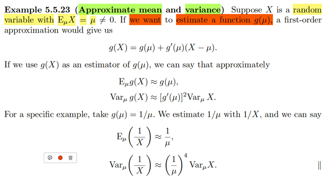</kbd>

> [!NOTE]
> Một ví dụ khác, là giả sử ta có random variable X với Eμ(X) = μ khác 0. Và ta muốn estimate một function g(μ).
>
>
>
> Chú ý nhé, ta muốn estimate g(μ), chứ ko phải estimate μ. Muốn estimate μ, thì ta dùng sample mean Xbar rồi.
>
>
>
> Thế thì ở đây nói rằng, first order approx. cho ta:
>
>
>
> **g(X) = g(μ) + g'(μ)(X - μ)**
>
>
>
> Dừng lại chút để nói về ý này: Đương nhiên phải hiểu, bản chất là ta có linear approximation của hàm g(x) gần μ: g(x) ≈ g(μ) + g'(μ)(x-μ), có nghĩa là ta chỉ có sự gần đúng này nếu xét x ≈ μ. Sau đó, với sự gần bằng như vậy, thay x bằng random variable X, ta sẽ có g(X) ≈ g(μ) + g'(μ)(X - μ).
>
>
>
> Và như vậy, ta có vế trái, là một random variable g(X), xấp xỉ bằng vế phải, cũng là một random variable, nên trung bình của chúng cũng xấp xỉ bằng nhau:
>
>
>
> E\_μ\[g(X)\] ≈ E\_μ\[g(μ) + g'(μ)(X - μ)\]
>
>
>
> = E\_μ\[g(μ)\] + E\_μ\[g'(μ)(X - μ)\] | linearity
>
>
>
> = g(μ) + g'(μ)E\_μ(X - μ) | linearity
>
>
>
> = g(μ) + g'(μ)(E\_μ(X) - E\_μ(μ))
>
>
>
> = g(μ) + g'(μ)(μ - μ)
>
>
>
> = g(μ)
>
>
>
> Vậy ta có kết quả E\[g(X)\] ≈ g(μ)
>
>
>
> ---
>
>
>
> Var\[g(X)\]:
>
>
>
> = E\[g(X) - Eg(X)\]^2
>
>
>
> ≈ E\[g(X) - g(μ)\]^2 (thay Eg(X) ≈ Eg(μ) = g(μ))
>
>
>
> ≈ E\[g(μ) + g'(μ)(X - μ) - Eg(μ)\]^2 (thay g(X) ≈ g(μ) + g'(μ)(X - μ)
>
>
>
> = E\[g(μ) + g'(μ)(X - μ) - g(μ)\]^2
>
>
>
> = E\[g'(μ)(X - μ)\]^2
>
>
>
> = E\[g'(μ)^2(X - μ)^2\]
>
>
>
> = g'(μ)^2 E\[(X - μ)\]^2
>
>
>
> = g'(μ)^2 Var\_μ(X)
>
>
>
> ====
>
>
>
> Ví dụ như lấy g(μ) = 1/μ
>
>
>
> Thì như vậy E\_μ(1/X) ≈ 1/μ
>
>
>
> Và Var\_μ(1/X) ≈ (1 / μ)^4 Var\_μ(X)
>
>
>
> ---
>
>
>
> Tổng hợp lại bối cảnh chút xíu:
>
>
>
> Trong ví dụ trước đó, đại khái là người ta quan tâm đến p/(1-p), với bối cảnh là ta có random sample từ population distribution thuộc loại Bern. Dĩ nhiên ta ko biết population mean p. Và ta dùng sample mean p^ =(1/n) Σi Xi để estimate cho p. Nhưng như đã nói, ta còn quan tâm một population paramter khác: odd = p/(1-p). Và lẽ tự nhiên ta sẽ muốn đặt câu hỏi về tính chất của cách làm này, kiểu như là, cũng giống như việc dùng sample mean để estimate cho population mean thì mình đã có nhiều hiểu biết rồi, cũng như đã có nhiều theorem cho ta công cụ để tìm hiểu sampling distribution của sample mean. Thì bây giờ, ta muốn tìm hiểu là việc dùng p^/(1-p^) để estimate cho p/(1-p) là tốt đến mức nào, cũng như sampling distribution của p^/(1-p^) là gì.
>
>
>
> Thế thì, vấn đề là với một statistic như p^/(1-p^), nếu dùng công thức tính variance của nó, ta sẽ ra ∞ (vì sao thì bữa nói rồi), nên ta mới dùng công cụ này: first order Taylor expansion.
>
>
>
> Sở dĩ như vậy là vì, ta nhìn cái p^/(1-p^) theo cách nhìn thế này: Nó là một hàm số của p^, tức là ta đang quan tâm g(p^), với hàm g(.) có công thức là g(t) = t/(1-t).
>
>
>
> Mà đối với hàm số f(x), thì first order Taylor expansion nó cho ta biết rằng: với x ≈ x0 thì ta có thể có sự xấp xỉ sau đây: f(x) ≈ f(x0) + f'(x0)(x-x0). Đây là thứ mà Calculus cho ta. Vậy thì áp dụng vào đây, ta sẽ có g(t) ≈ g(t0) + g'(t0)(t-t0). Và dùng X cho vai trò của t, p^ cho vai trò của x0 (là điểm cố định cho trước) thì ta có:
>
>
>
> g(X) ≈ g(p^) + g'(p^)(X - p^)
>
>
>
> Thế thì, tới đây, mới quay lại vấn đề đã nói, cái mà ta quan tâm là tính chất của việc dùng p^/(1-p^) để estimate cho p/(1-p), và hơn nữa, ta quan tâm đến sampling distribution của nó.
>
>
>
> Thế thì, p^ là sample mean, là một statistic, là một random variable có được từ việc áp dụng function f(x1,x2...xn) = (x1 + x2 + ...xn) / n lên các random variable X1,..Xn của random sample. Và vì là random variable, nên ta có quyền đặt vấn đề tìm kì vọng, variance và distribution của nó (mà vì nó là statistic, nên người ta gọi distribution này là sampling distribution)
>
>
>
> Vậy thì p^/(1-p^) cũng là một random variable có được khi apply function g(t) = t/(1-t) lên statistic p^, nên dĩ nhiên nó cũng có quyền có mean, variance, sampling distribution.
>
>
>
> Do đó ta mới đặt vấn đề tìm E\[p^/(1-p^)\] cũng như Var\[p^/(1-p^)\] mà cái chính là cái này Var\[p^/(1-p^)\]
>
>
>
> và từ cái xấp xỉ ở trên: g(X) ≈ g(p^) + g'(p^)(X - p^), ta sẽ có được:
>
>
>
> Var\[p^/(1-p^)\] ≈ g'(p)^2 Var p^ = p/\[n(1-p)^3\]
>
>
>
> Và như vậy, dù cũng đếch biết nó là gì, vì ta ko biết p, nhưng nó cho ta cái khung để làm, ví dụ như đưa p^ thay cho p (estimate cho p) thì ta sẽ có estimate cho Var\[p^/(1-p^)\]
>
>
>
> Vậy thì tiếp theo qua ví dụ này, 5.5.23: Thì vấn đề đặt ra là ta có random variable X và gọi μ là mean của nó (và ta chưa biết μ). Và cái ta quan tâm là g(μ), ví dụ, 1/μ.
>
>
>
> Vậy thì, again, ta cũng nhìn 1/μ dưới dạng, ...(dĩ nhiên) ..là function của μ: g(μ).
>
>
>
> Để rồi ta cũng áp dụng cái công cụ mà Giải tích cho ta: g(X) ≈ g(μ) + g'(μ)(X - μ)
>
>
>
> Để từ đó ta có Eg(X) ≈ g(μ) và Var g(X) ≈ g'(μ)^2 Var(X)
>
>
>
> Và cái chính muốn nói là, cũng giống như ở ví dụ trước, ta có được cái khung, rằng Var \[p^/(1-p^)\] ≈ p/\[n(1-p)^3\], đặng từ đó mà có thể làm tiếp (lắp p^ vào thay cho p), thì ở đây cũng vậy, kết quả từ Taylor expansion cho ta rằng, nếu ta quyết định dùng g(X) để estimate cho g(μ) thì ta có thì đi tính Var\[g(X)\] dựa theo cái khung là g'(μ)^2 Var(X).

 

- **Phương pháp Delta**

<kbd>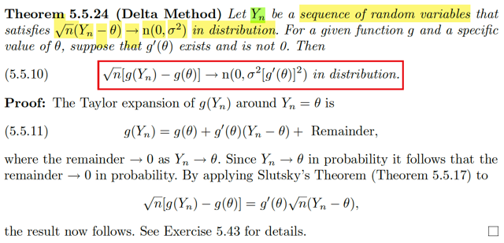</kbd>

<kbd>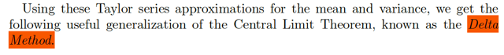</kbd>

<kbd>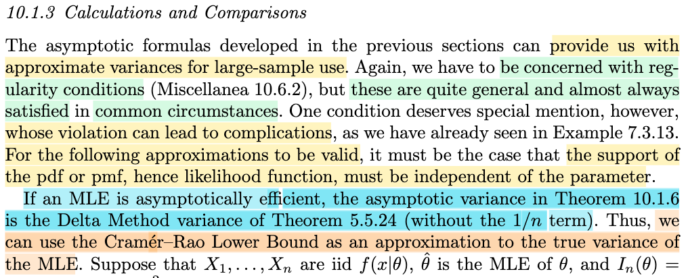</kbd>

> [!NOTE]
> Qua Delta Method, theorem này nói rằng:
>
>
>
> Cho Yn là một chuỗi các random variables thỏa √n(Yn - θ) → (d) n(0, σ^2)   (có nghĩa là n → inf thì cdf của √n(Yn - θ) → cdf của n(0, σ^2)).
>
>
>
> Cho hàm g và giá trị cụ thể của θ, giả thiết g'(θ) tồn tại và khác 0. theorem này nói rằng:  
>
>
>
> √n\[g(Yn) - g(θ)\] → (d) n(0, σ^2\[g'(θ)\]^2)
>
>
>
> Ví dụ như ta có một random sample X1,...Xn có population mean μ, population variance σ^2
>
>
>
> Và ta lấy sample mean Xbar_n = (Σi Xi)/n, thì theo CLI, √n (Xnbar - μ) / σ sẽ → (d) n(0,1).
>
>
>
> Thì bối cảnh ở đây chính là, có thể áp dụng cho chuỗi Xbar_n đó. Vì chuỗi Xnbar cũng thỏa mãn yêu cầu.
>
>
>
> ---
>
>
>
> Chứng minh:
>
>
>
> Slutsky theorem nói rằng cho Xn → X in distribution và Yn → a in probability thì XnYn → aX in distribution.
>
>
>
> Thế thì ở đây ta có Taylor expansion của g(Yn) quanh θ:
>
>
>
> g(Yn) = g(θ) + g'(θ)(Yn - θ) + remainder
>
>
>
> Và dĩ nhiên remainder → 0 thì Yn → θ
>
>
>
> Vậy thì Yn → θ in probability, và remainder → 0 in probability.
>
>
>
> Rồi, ta có đề bài cho chuỗi Yn thỏa √n(Yn - θ) → X với X \~ n(0, σ^2) (chuỗi Yn ở đây có thể là chuỗi sample mean của sample có mean θ, nên theo CLT thì √n(Yn - θ) → (d) n(0, σ^2)
>
>
>
> Ta có approx:
>
>
>
> g(Yn) ≈ g(θ) + g'(θ)(Yn - θ)
>
>
>
> ⇔ g'(θ)(Yn - θ) ≈ g(Yn) - g(θ)
>
>
>
> ⇔ √n g'(θ)(Yn - θ) ≈ √n (g(Yn) - g(θ))
>
>
>
> ⇔ g'(θ) √n (Yn - θ) ≈ √n (g(Yn) - g(θ))
>
>
>
> Vậy thì xét vế trái, nó gồm g'(θ) nhân √n(Yn - θ) :
>
>
>
> √n(Yn - θ) → (d) X \~ n(0, σ^2)
>
>
>
> g'(θ) → (p) g'(θ) (vì g'(θ) là constant, mà constant thì cũng → chính nó)
>
>
>
> Theo Slutsky, Xn → (d) X in distribution, và Yn → (p) a in probability thì XnYn → (d) Xa
>
>
>
>  Do đó theo theorem này, g'(θ) √n (Yn - θ) sẽ → (d) g'(θ) X với X \~ n(0, σ^2) in distribution
>
>
>
> Mà xét random variable U = g'(θ) X:
>
>
>
> nhớ lại location scale, có một theorem nói rằng nếu ta có Z là standard member của family với location 0, scale 1, có pdf là f(z) thì X = σZ + μ sẽ là member có location μ, scale σ. Nên ở đây X là thành viên có location 0, scale σ, tại nó là n(0, σ^2) Nên nhất định nó có dạng = σZ
>
>
>
> Rồi, bây giờ ta có U = g'(θ)X = g'(θ) σ Z, thì dĩ nhiên U chính là \~ thành viên của family có location 0, scale = g'(θ) σ. Và với normal distribution thì location cũng là mean và scale cũng chính là standard deviation.
>
>
>
> Từ đó kết luận U \~ n(0, g'(θ)^2 × σ^2)

**🔗 See also:** [10.1.3 Calculations and Comparisons](./101_point_estimation.md#node-iwgmm5t)

 

- **Phương pháp Delta 1/Xbar**

<kbd>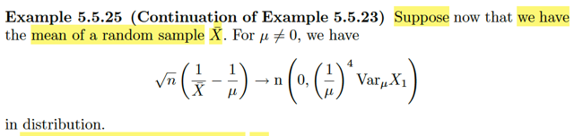</kbd>

> [!NOTE]
> Ok, chỗ này là vầy:
>
>
>
> Theo Central Limit Theorem ta có (cho X1,X2...là các rv có population mean là μ, population variance là σ^2) và Xbar_n là sample mean size n, viết Xbar cho gọn) thì ta có:
>
>
>
> **√n(Xbar - μ) / σ → n(0,1)** in distribution
>
>
>
> Dựa vào Slutsky theorem:
>
>
>
> √n(Xbar - μ) / σ → Z \~ n(0,1) và σ → σ,
>
>
>
> theo Slutsky theorem σ √n(Xbar - μ) / σ → σZ và σZ thì \~ (n, σ^2)
>
>
>
> Vậy: **√n(Xbar - μ) → n(0, σ^2)** in distribution
>
>
>
> ====
>
>
>
> Tiếp, dùng cái delta method theorem vừa rồi, nói rằng:
>
>
>
> Nếu **√n(Yn - θ) →**(d) **N(0, θ^2)** thì
>
>
>
> √**n(g(Yn) - g(θ))** →(d) **n(0, σ^2 g'(θ)^2)**
>
>
>
> Nên áp dụng vào đây, ta đang có:
>
>
>
> √n(Xbar - μ) →(d) n(0, σ^2)
>
>
>
> Và ta có hàm g(t) = 1/t, g'(t) = -1/t^2
>
>
>
> ⇨ √n(g(Xbar) - g(μ)) →(d) n(0, σ^2 g'(μ)^2)
>
>
>
> Và có nghĩa là:
>
>
>
> **√n(1/Xbar - 1/μ)** →(d) n(0, σ^2 (-1/μ^2)^2) = **n(0, σ^2 (1/μ^4))**
>
>
>
> Với σ^2 là population variance, người ta ghi là Var\[X1\] cũng có thể hiểu được
>
>
>
> Vậy ta có **√n(1/Xbar - 1/μ) → n(0, (1/μ^4) Var X1)** là vậy

**🔗 See also:** [CLT - Định lý giới hạn trung tâm](#node-32vkewg)

 

- **Ước lượng Tham số Slutsky**

<kbd>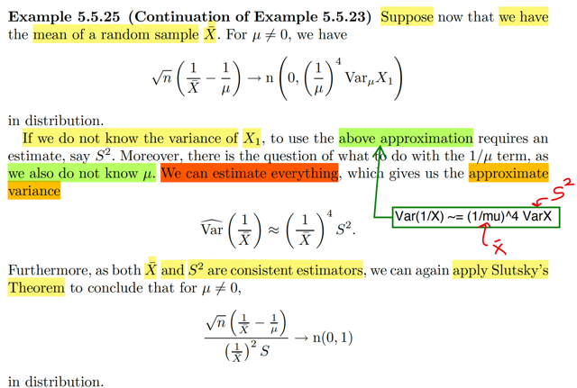</kbd>

> [!NOTE]
> Ok, vừa rồi mình đã hiểu được là √n(1/Xbar - 1/μ) →(d) n\[0, (1/μ)^4 Var(X1)\]
>
>
>
> Hay gọi σ^2 là Var(X1), tức population variance cho gọn, ta có:
>
>
>
> √n(1/Xbar - 1/μ) →(d) n\[0, (1/μ)^4 σ^2\]
>
>
>
> Thế thì, Slutsky theorem cho ta: nếu Xn →(P) X và Yn →(p) a thì XnYn →(d) Xa
>
>
>
> Nên ở đây √n(1/Xbar - 1/μ) → (d) Z \~ n\[0, (1/μ)^4 σ^2\]
>
>
>
> và 1/\[p(1/μ)^4 σ^2\] (dĩ nhiên) → (p) 1/\[(1/μ)^4 σ^2\]
>
>
>
> Thì \[√n(1/Xbar - 1/μ)\] / \[(1/μ)^4 σ^2\] → (d) Z / \[(1/μ)^4 σ^2\]
>
>
>
> Và Z là rv \~ n\[0, (1/μ)^4 σ^2\] thì ta đã biết nó là thành viên trong family có location 0, scale (1/μ)^4 σ^2.
>
>
>
> Theo kiến thức từ location scale family thì nếu ta có X là thành viên có location μ, scale σ thì (X - μ) / σ sẽ là thành viên chuẩn có location 0, scale 1.
>
>
>
> Vậy Z / \[(1/μ)^4 σ^2\] sẽ chính là thành viên chuẩn, như trên, và với normal distribution thì location cũng là mean và scale cũng là standard deviation. Nên ta kết luận Z / \[(1/μ)^4 σ^2\] sẽ \~ n(0,1)
>
>
>
> **Như vậy ta có:**
>
>
>
> \[√n(1/Xbar - 1/μ)\] / \[(1/μ)^4 σ^2\] sẽ → (d) n(0,1)
>
>
>
> =====
>
>
>
> Tuy nhiên, ta ko biết μ, σ. Nên nói về cái này, \[√n(1/Xbar - 1/μ)\] / \[(1/μ)^4 σ^2\], là vô nghĩa vì có tính được đâu.
>
>
>
> Thế thì: ĐẠI Ý LÀ, TA SẼ CÓ THỂ DÙNG SAMPLE MEAN Xbar THAY CHO POPULATION MEAN μ VÀ SAMPLE VARIANCE S^2, THAY CHO σ^2.
>
>
>
> \[(1/μ)^4 σ^2\] THAY BẰNG \[(1/Xbar)^4 S^2\]
>
>
>
> Để rồi \[√n(1/Xbar - 1/μ)\] / \[(1/μ)^4 σ^2\]
>
>
>
> THAY BẰNG \[√n(1/Xbar - 1/μ)\] / \[(1/Xbar)^4 S^2\]
>
>
>
> VÀ NHỜ MỘT SỰ THẬT LÀ HAI CÁI NẦY ĐỀU LÀ **UNBIASED ESTIMATOR** NÊN DÙNG SLUTSKY THEOREM TA SẼ CHO THẤY RẰNG
>
>
>
> CÁI SAU, CŨNG SẼ → (d) n(0,1)
>
>
>
> Như sau, xét
>
>
>
> \[√n(1/Xbar - 1/μ)\] / \[(1/Xbar)^4 S^2\]
>
>
>
> (nhân và chia cho \[(1/μ)^4 σ^2\])
>
>
>
> = \[√n(1/Xbar - 1/μ)\] / \[(1/μ)^4 σ^2\] × \[(1/μ)^4 σ^2\] / \[(1/Xbar)^4 S^2\]
>
>
>
> Thì term 1, \[√n(1/Xbar - 1/μ)\] / \[(1/μ)^4 σ^2\], như đã nói ở trên, sẽ converge in probability về n(0,1)
>
>
>
> Còn tern 2, \[(1/μ)^4 σ^2\] / \[(1/Xbar)^4 S^2\]:
>
>
>
> Thì viết lại, = (Xbar/μ)^4 × σ^2/S^2
>
>
>
> Và vì như đã biết:
>
>
>
> Xbar →(p) μ
>
>
>
> và S^2 →(p) σ^2
>
>
>
> Do đó (Xbar/μ)^4 σ^2/S^2 **converge in probability về 1**, hay (Xbar/μ)^4 σ^2/S^2 → 1 in probability.
>
>
>
> Vậy, áp dụng Slutsky theorem, ta có:
>
>
>
> \[√n(1/Xbar - 1/μ)\] / \[(1/μ)^4 σ^2\] × \[(1/μ)^4 σ^2\] / \[(1/Xbar)^4 S^2\]
>
>
>
> sẽ → Z × 1  = Z với Z \~ n(0,1)
>
>
>
> chứng minh xong
>
>
>
> và **đại ý của tất cả cái này là**:
>
>
>
> **Nhờ vào tính unbiased estimator của Xbar và S^2** (mà công thức là chia cho n-1) thì cái 
>
> \[√n(1/Xbar - 1/μ)\] / \[(1/Xbar)^4 S^2\] vẫn → n(0,1)
>
>
>
> y như cái \[√n(1/Xbar - 1/μ)\] / \[(1/μ)^4 σ^2\]

 

- **Chia ước lượng phương sai**

<kbd>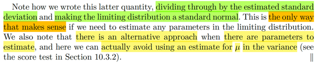</kbd>

> [!NOTE]
> cái này có thể khi học về các phần sau sẽ rõ hơn. Nhưng đại khái là gs đề
> cập tới việc, bằng cách chia cho ước lượng của variance, (vì ko biết variance
> thật) thì kết quả trên nó cho ta cơ sở để biện minh cho các kết  luận khác.

 

- **Delta method bậc hai**

<kbd>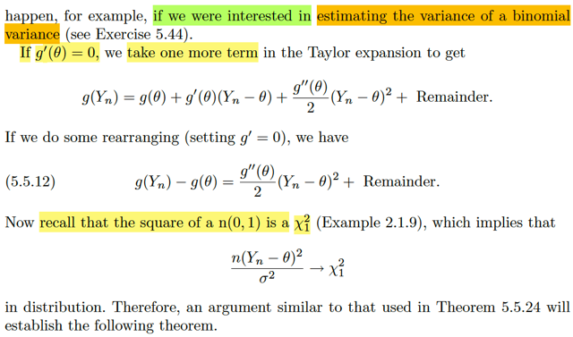</kbd>

<kbd>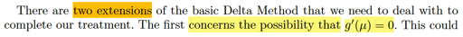</kbd>

<kbd>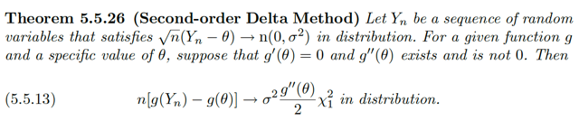</kbd>

> [!NOTE]
> Đại khái là mở rộng của Δ method theorem.
>
>
>
> Trong Δ method theorem, ta bắt đầu với giả thiết là ta có chuỗi Y1,...Yn
> sao cho
>
>
>
> √n(Yn - θ) → (d) n(0, σ^2)
>
>
>
> thì Δ method theorem nói rằng nếu có hàm g(t) sao cho g'(θ) tồn tại và 
> khác 0 thì: 
>
>
>
> √n[g(Yn) - g(θ)] sẽ → (d) n(0, σ^2[g'(θ)]^2]
>
>
>
> Thế thì, phiên bản mở rộng của Δ method theorem này deal với case
> mà g'(θ) = 0:
>
>
>
> Cụ thể là, dùng Taylor expansion ta có thể ghi rõ hạng tử bậc 2:
>
>
>
> g(Yn) = g(θ) + g'(θ)(Yn - θ) + g''(θ)(Yn - θ)^2/2 + Remainder
>
>
>
> Lập luận là: giả sử g'(θ) = 0. Ta có
>
>
>
> g(Yn) = g(θ) + g''(θ)(Yn - θ)^2/2 + Remainder
>
>
>
> Và ta có thể  bỏ remainder và chuyển sang dùng xấp xỉ: 
>
>
>
> g(Yn) ≈ g(θ) + g''(θ)(Yn - θ)^2/2
>
>
>
> ⇔ g''(θ)(Yn - θ)^2/2 ≈ g(Yn) - g(θ) (1)
>
>
>
> Rồi. Theo CLT: √n(Yn - θ)/σ →(d) n(0,1)
>
>
>
> thì cái này bản chất / hay nói cách khác là:
>
>
>
> √n (Yn - θ)/σ  →(d) X ~ (0, 1)
>
>
>
> mà phát biểu bằng lời là, khi n → inf thì √n(Yn - θ)/σ sẽ trở nên 
> "giống với" một random variable ~ n(0, 1)
>
>
>
> Và như vậy, lẽ dĩ nhiên [√n(Yn - θ)/σ]^2 sẽ trở nên giống X^2 với
> X ~ n(0,1). Hay:
>
>
>
> n(Yn - θ)^2/σ^2 → Chi-square 1 (2)
>
>
>
> Mà bình phương của một rv thuộc n(0,1) sẽ chính là một rv thuộc
> Chi-square_1 /X/^2
>
>
>
> Rồi: g''(θ) thì là constant, →(p) g''(θ) (3)
>
>
>
> Vậy thì
>
>
>
> (1) ta có g''(θ)(Yn - θ)^2/2 ≈ g(Yn) - g(θ)
>
>
>
> (2) n(Yn - θ)^2/σ^2 → Chi-square 1
>
>
>
> (3) g''(θ) →(p) g''(θ)
>
>
>
>
> (1) ta nhân hai vế cho n: (1) ⇔ g''(θ) n (Yn - θ)^2/2 ≈ n[g(Yn) - g(θ)]
>
>
>
> (3) g''(θ) →(p) g''(θ) thì g''(θ) σ^2/2 →(p) g''(θ) σ^2/2 (4)
>
>
>
> Tới đây: 
>
>
>
> Dùng (2) và (4):
>
>
>
> n(Yn - θ)^2/σ^2 → Chi-square 1
>
>
>
> g''(θ) σ^2/2 →(p) g''(θ) σ^2/2 
>
>
>
> Áp dụng Slusky theorem: Xn →(d) X, Yn →(p) a thì XnYn →(d) aX
>
>
>
> ⇨  g''(θ) σ^2/2 n(Yn - θ)^2/σ^2 → g''(θ) σ^2/2 Chi-square 1
>
>
>
> ⇔ n g''(θ)(Yn - θ)^2 → g''(θ) σ^2/2 Chi-square 1
>
>
>
> Vế trái chính là n[g(Yn) - g(θ)]
>
>
>
> ⇨  n[g(Yn) - g(θ)] →(d) g''(θ) σ^2 Chi-square 1 hay σ^2 g''(θ) / 2 /X_1/^2

 

- **Mở rộng Delta đa biến**

<kbd>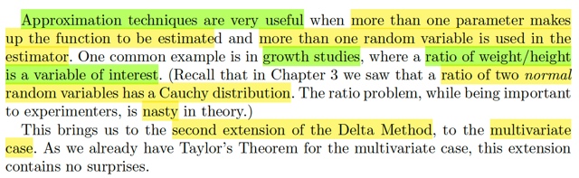</kbd>

> [!NOTE]
> Extension thứ hai của Δ method là khi deal với multivariate case.
>
>
>
> Đại khái là để ta deal với các trường hợp mà ta  cần estimate một tỉ số

 

- **Đạo hàm riêng tỉ lệ**

<kbd>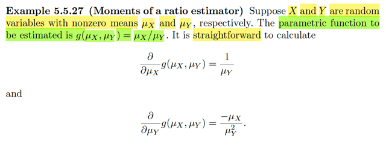</kbd>

> [!NOTE]
> Ví dụ này cho X, Y là hai random variable có non zero mean μX, μY. Và
> function cần g(μX, μX) = μX / μY.
>
>
>
> Ta có ∂/∂μX g(μX, μY) = 1 / μY
>
>
>
> và ∂/∂μY g(μX, μY) = - μX/μY^2
>
>
>
> Là sao? Thì đơn giản đây là tính đạo hàm riêng (partial derivative) thôi
> ko có gì khó

 

- **Xấp xỉ Mean Variance Tỉ số**

<kbd>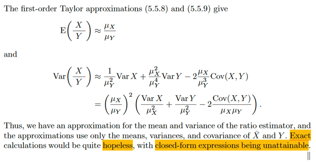</kbd>

> [!NOTE]
> Áp dụng hai công thức 5.5.8 / 5.5.9 (mình đã tự chứng minh nên đã hiểu rồi, ở đây
> cứ xài thôi): Thì đại khái 5.5.8 nói rằng Eg(**T**) ≈ g(**θ**), **T** là vector các rv,
> **θ** là vector các mean θi = EXi
>
>
>
> E(g(X,Y)) = E[X/Y] ≈ g([μX, μY]) = μX/μY
>
>
>
> Còn Var g(**T**) = Σi=1:k [g'i(**θ**)]^2 Var Ti + 2 Σi>j g'i(θ) g'j(θ)Cov(Ti, Tj)
>
>
>
> áp dụng vào đây:
>
>
>
> Var[g(X,Y)] = Var(X/Y)
>
>
>
> = ∂/∂x g(μX,μY) Var X + ∂/∂y g(μX,μY) Var Y + 2 ∂/∂x g(μX,μY) ∂/∂y g(μX,μY)
> Cov(X, Y)
>
>
>
> = (1/μY)^2 Var X + (- μX/μY^2)^2 VarY + 2 (1/μY) Var X (- μX/μY^2) Cov(X, Y)
>
>
>
> = (1/μY^2) Var X + (- μX^2/μY^4) VarY + 2 (1/μY) Var X (- μX/μY^2) Cov(X, Y)
>
>
>
> = (μX/μY)^2 [VarX/μX^2 + VarY/μY^2 - 2Cov(X,Y)/μXμY]
>
>
>
> Nói chung là như vậy ta có được estimation cho mean và variance của cái ratio
> (chỉ là estimation vì ta dùng Taylor approx.)
>
>
>
> Và gs cho biết việc tính tính xác (mean và variance của cái ratio) là ko thể, vì tỉ số
> của hai normal là một random variable thuộc lại Cauchy. mà ta đã biết nó ko có
> mean (xem link xanh)

**🔗 See also:** [Xấp xỉ kỳ vọng Taylor](#node-o8nor00) · [Đặc điểm phân phối Cauchy](./22_expected_value.md#node-d6kf31i)

 

- **CLT ước lượng tỉ số**

<kbd></kbd>

> [!NOTE]
> Đại khái là, xét random variable vector **X** = (X1,...Xp) có population mean
> và covariance: **μ** = (μ1, ...μp), Cov(Xi, Xj) = σij
>
>
>
> Rồi, mới lấy random sample size n, từ distribution này **X1, ...Xn**. Dĩ nhiên
> là mỗi vector **Xk,** k =1,...n là một random variable vector cũng có p random 
> variable: (Xk1, Xk2...Xkp). Mà ở đây hình như người ta kí hiệu sẽ là:
>
>
>
> **X**k = (X1k, X2k,...Xpk)
>
>
>
> Dĩ nhiên, là như vậy ta sẽ giống như, xét X1k, k = 1,...n. Thì nó giống
> như random sample size n của population có mean là μ1
>
>
>
> Rồi, họ mới đặt Xbar_i = (Σk=1:n Xik) / n Có nghĩa là, sample mean của 
> Xi1, Xi2,...,Xin. Tức là random variable phần tử thứ i của các random variable
> vector **X1**,....**Xn**
>
>
>
> Ta đã có kết quả 5.5.7: g(**t**) ≈ g(**θ**) + Σ g'i(**θ**)(ti - θi) 
>
>
>
> (cái này đơn giản là linear approx thôi: g(**t**) ≈ g(**θ**) + ∇g(**θ**)T(**t** - **θ**)
>
>
>
> Áp dụng vào đây với **x** = (xbar1, xbar2,...xbarp)
>
>
>
> ⇨ g(**x**) ≈ g(**μ**) + ∇g(**μ**)T(**x** - **μ**)

 

- **Phương pháp Delta Đa biến**

<kbd></kbd>

> [!NOTE]
> QUAY LẠI SAU

 

