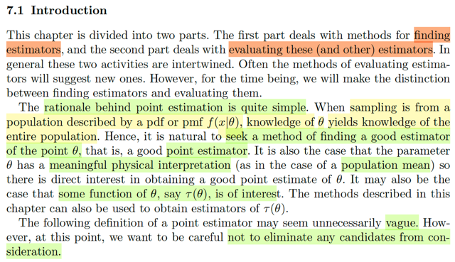
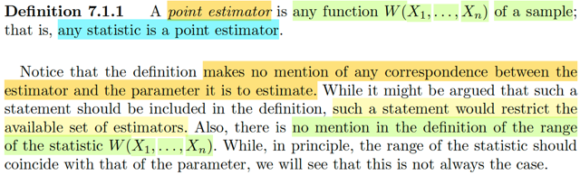
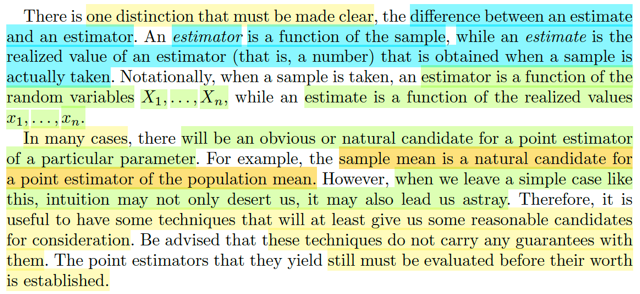

# 7.1 Introduction

📊 **Progress:** `3` Notes | `3` Screenshots | `3` AI Reviews

---

 

## Ước lượng điểm và đánh giá

<kbd></kbd>

> [!NOTE]
> Đại ý là, chương này sẽ chia làm hai phần: Bàn về các phương pháp 
> tìm estimator và các cách đánh giá estimator.
>
>
>
> Cái lí do của quá trình / công việc point estimator rất đơn giản. Đó là
> khi sampling từ một population có distribution được mô tả bởi pmf hoặc
> pdf f(x|θ), thì kiến thức về θ sẽ cho ta biết về về cả quần thể.
>
>
>
> Do đó, lẽ tự nhiên ta sẽ muốn tìm kiếm một phương pháp giúp tìm kiếm
> good estimator của điểm θ, gọi là good point estimator.
>
>
>
> Có nghĩa là ta sẽ tìm kiếm một ước lượng cho giá trị của θ.
>
>
>
> Và một số trường hợp thì θ mang một ý nghĩa có thể diễn dịch được, như
> population mean là một ví dụ.
>
>
>
> Nhưng một số trường hợp khác, ta sẽ đi tìm kiếm, một function nào đó của θ 
>
>
>
> Thế thì tiếp theo ta sẽ học về định nghĩa chính thức của point estimator,
> và tác giả nói rằng có thể ta sẽ thấy nó rất mơ hồ (vague) nhưng đây là điều
> cần thiết nhằm mục đích là đảm bảo ta không bỏ xót ứng cử viên nào hết

> [!TIP]
> 🤖 **AI Check** — 🟡 Minor issues — ✅ **92/100** · ✓ Move on
>
> Ghi chú tóm tắt rất tốt và chính xác nội dung phần mở đầu về ước lượng điểm (point estimation). Có một điểm phân biệt thuật ngữ nhỏ giữa estimation (quá trình ước lượng) và estimator (hàm/thống kê ước lượng) cần lưu ý.
>
> **🟡 Minor issues**
>
> **1.** *"Cái lí do của quá trình / công việc point estimator rất đơn giản"*
>
> Trong tiếng Anh và thống kê học, 'point estimation' là quá trình ước lượng điểm, còn 'point estimator' là hàm/thống kê dùng để ước lượng (ước lượng tử). Tác giả viết 'The rationale behind point estimation', do đó gọi là 'quá trình point estimation' sẽ chuẩn xác hơn.
>
>
> **✓ Strengths**
> - Nắm bắt trọn vẹn và chuẩn xác 2 phần trọng tâm của chương: tìm kiếm estimator và đánh giá estimator.
> - Hiểu đúng bản chất tại sao cần ước lượng θ: vì biết θ sẽ giúp xác định toàn bộ phân phối xác suất của quần thể.
> - Hiểu được lý do tại sao định nghĩa ban đầu của sách lại có vẻ mơ hồ (vague): nhằm tránh loại bỏ sớm các ứng viên tiềm năng.
>
> **💡 Deeper notes**
> - Cần lưu ý phân biệt bộ ba thuật ngữ: Point Estimation (quá trình ước lượng điểm), Point Estimator (công thức/thống kê W(X) dùng để ước lượng, là biến ngẫu nhiên), và Point Estimate (giá trị cụ thể tính được từ dữ liệu quan sát).

 

### Định nghĩa điểm ước lượng

<kbd></kbd>

> [!NOTE]
> Định nghiã của point estimator: ĐÓ LÀ BẤT KÌ FUNCTION W(X1,...Xn) của
> sample. Có nghĩa là, đơn giản rằng, BẤT KÌ STATISTIC NÀO CŨNG LÀ
> MỘT POINT ESTIMATOR.
>
>
>
> Ôn lại một chút, ta biết statistic là gì? Nó là function của các random
> variable X1,...Xn của một random sample. Và function của các random
> variables thì cũng là random variable, chẳng qua cái random variable này
> đặc biệt hơn là vì nó được tao bởi random variable trong một random
> sample. Và người ta gọi nó là statistic.
>
>
>
> Và ở đây, định nghĩa của point estimator là một function của các random
> variables X1,...Xn của random sample. Cho nên về cơ bản nó chính là
> statistic, chỉ vậy thôi.
>
>
>
> Tác giả nói thêm rằng, ta thấy chẳng có một đề cập nào về mối tương nào 
> giữa estimator và cái paramter mà nó đang estimate cả. Nhưng ông cho
> rằng điều này là cần thiết, vì khi đề cập vào thì nó sẽ làm hạn chế / giảm số 
> lượng những estimator khả thi

> [!TIP]
> 🤖 **AI Check** — 🟡 Minor issues — ✅ **90/100** · ✓ Move on
>
> Ghi chú nắm rất tốt và chính xác định nghĩa của point estimator cùng trực giác mà tác giả muốn truyền tải. Có một điểm thiếu sót nhỏ về mặt kỹ thuật khi nhắc lại khái niệm statistic (thống kê) là chưa nêu điều kiện hàm không được chứa tham số chưa biết.
>
> **🟡 Minor issues**
>
> **1.** *"Ôn lại một chút, ta biết statistic là gì? Nó là function của các random variable X1,...Xn của một random sample."*
>
> Định nghĩa toán học chuẩn của statistic (thống kê) yêu cầu hàm này không được chứa bất kỳ tham số chưa biết nào (does not depend on any unknown parameters). Nếu phụ thuộc vào tham số chưa biết thì không thể tính toán được từ mẫu dữ liệu quan sát.
>
>
> **✓ Strengths**
> - Hiểu chính xác bản chất: bất kỳ một statistic nào cũng là một point estimator.
> - Nắm bắt tốt ý đồ của tác giả về việc định nghĩa mở rộng, không trói buộc sự tương ứng cụ thể giữa estimator và parameter để tránh hạn chế tập các ước lượng khả dĩ.
>
> **💡 Deeper notes**
> - Đoạn văn gốc còn lưu ý thêm một chi tiết: định nghĩa không ràng buộc miền giá trị (range) của statistic phải trùng với miền giá trị của tham số (dù về mặt nguyên tắc ta mong muốn chúng trùng nhau, nhưng thực tế có trường hợp không trùng).

**🔗 See also:** [Cross-Entropy Error Function Gradient *(Pattern Recognition Machine Learning_C.Bishop)*](../pattern_recognition_machine_learning_cbishop/432_logistic_regression.md#node-gvw6cdv) · [Model Evidence and Occam Factor *(Pattern Recognition Machine Learning_C.Bishop)*](../pattern_recognition_machine_learning_cbishop/441_model_comparison_and_bic.md#node-vwb8lk4)

 

#### Khái niệm và đánh giá Estimator

<kbd></kbd>

> [!NOTE]
> Một điểm nữa mà tác giả nhấn mạnh ta phải lưu ý: Là phải phân biệt  giữa
> estimator và estimate.
>
>
>
> Estimator như đã nói, là statistic, là function, của random sample.
>
>
>
> Còn estimate, là giá trị cụ thể của estimator khi bỏ vào giá trị cụ thể của 
> các random variable trong random sample. 
>
>
>
> Cái này thì hoàn toàn không có gì khó hiểu cả. vì Estimator / statistic có
> bản chất là random variable, mà random variable có bản chất là hàm số.
>
>
>
> Để rồi khi nó nhận vào các giá trị cụ thể của đầu vào thì nó mới có giá trị
> cụ thể.
>
>
>
> ====
>
>
>
> Cuối cùng, là tác giả cho rằng trong một số tình huống thì ta sẽ thấy rất rõ
> đâu là ứng cử viên - estimator cho population parameter là gì. Ví dụ như
> với population mean thì sample mean rõ ràng là một point estimator 
>
>
>
> Khoan, dừng lại một giây, nói nó rõ ràng là một ứng cử viên không có nghĩa
> nó là good estimator ngay lập tức, ta sẽ vẫn phải đánh giá nó.
>
>
>
> Bên cạnh đó, có thể hiểu ý của tác giả nói rằng khi bước ra các case khác
> thì cái kiểu định nghĩa quá rộng như vừa rồi (là function của random sample)
> hoàn toàn khiến ta không biết tìm estimator như thế nào.
>
>
>
> Do đó, ta sẽ có những technique để mà dẫn dắt ta tới các ứng cử viên cho
> good estimator.
>
>
>
> Tuy nhiênt tác giả cũng nhấn mạnh, các technique này không đảm bảo là
> ta sẽ tự nhiên có good estimator, mà vẫn phải có các phương pháp đánh giá

> [!TIP]
> 🤖 **AI Check** — 🟢 Pass — ✅ **95/100** · ✓ Move on
>
> Ghi chú nắm rất chắc và chính xác sự khác biệt giữa estimator (hàm/biến ngẫu nhiên) và estimate (giá trị hiện thực hóa cụ thể), đồng thời diễn giải đúng thông điệp của tác giả về vai trò của các kỹ thuật tìm ước lượng.
>
> **✓ Strengths**
> - Phân biệt chuẩn xác giữa ước lượng lượng (estimator - biến ngẫu nhiên/hàm) và giá trị ước lượng (estimate - số thực cụ thể thu được từ mẫu dữ liệu).
> - Hiểu đúng cảnh báo của tác giả: trực giác có thể hữu ích trong trường hợp đơn giản (như trung bình mẫu) nhưng không đủ cho trường hợp phức tạp, và các kỹ thuật tìm ước lượng (như MLE, MoM) chỉ đưa ra ứng cử viên chứ không đảm bảo ngay đó là ước lượng tối ưu mà cần qua bước đánh giá.
>
> **💡 Deeper notes**
> - Về mặt toán học khắt khe: Ước lượng $W = g(X_1, \dots, X_n)$ là một biến ngẫu nhiên (hàm từ không gian mẫu $\Omega$ vào $\mathbb{R}$), còn hàm $g: \mathbb{R}^n \to \mathbb{R}$ là quy tắc tính toán. Khi thu thập dữ liệu cụ thể $(x_1, \dots, x_n)$, giá trị $g(x_1, \dots, x_n)$ chính là một con số cụ thể (estimate).

 

