# 9.2 Methods Of Finding
interval Estimators

📊 **Progress:** `52` Notes | `61` Screenshots

---

## 9.2 Methods Of Finding
interval Estimators

 

## Phương pháp ước lượng khoảng

<kbd>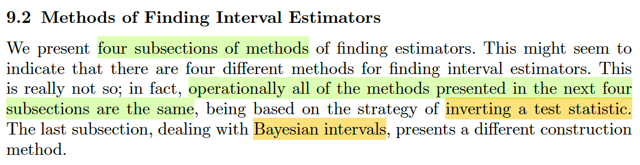</kbd>

> [!NOTE]
> Phần này ta sẽ học 4 phương pháp để tìm / xây dựng một interval estimator
> giáo sư nói rằng tuy trông có vẻ là 4 phương pháp khác nhau nhưng thực ra
> cách triển khai đều giống: dựa trên chiến lược ĐẢO NGƯỢC MỘT TEST
> STATISTIC. Chỉ có cái cuối, Bayesian intervals thì hơi khác

 

### Đảo ngược test statistic

<kbd>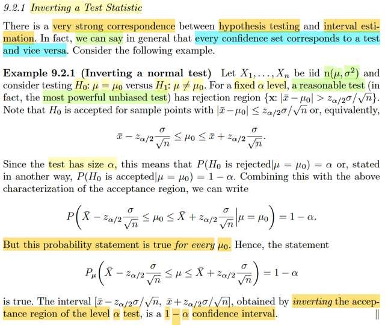</kbd>

> [!NOTE]
> Chiến lược đầu tiên: Đảo ngược một test statistic. Mở đầu gs nói có một sự
> **TƯƠNG ỨNG RẤT MẠNH GIỮA MỘT HYPOTHESIS TESTING** và **INTERVAL
> ESTIMATION**. Thậm chí ta có thể nói rằng, nói chung, **MỌI CONFIDENCE SET**
> đều tương ứng với một **TEST** và ngược lại.
>
>
>
> Có lẽ nên ôn một tí những định nghĩa hôm qua đã học: Đầu tiên, bài toán
> interval estimation là gì? Bắt đầu với việc nhớ lại trong point estimation, ta sẽ
> thực hiện một inference bằng cách đưa ra một point estimate cho giá trị của θ.
> Với bài toán hypothesis testing thì một inference là một kết luận / nhận định là θ
> nằm ở Θ0 hay Θ0c. Vậy thì với interval estimation, một inference là việc ta đưa
> ra nhận định rằng θ NẰM TRONG một tập C(**x**). Do đó, so với point
> estimation thì inference của bài toán interval estimation hi sinh sự chính xác,
> nhưng bù lại, có được một cái mà point estimation không có: khả năng đánh giá
> mức độ tự tin về inference. Vì so với P_θ(W(**X**) = θ) = 0, thì P_θ(C(**X**)
> chứa θ) sẽ dương.
>
>
>
> Thế thì thật ra ở dạng khái quát thì phải gọi là bài toán set estimation mới đúng.
> nhưng phần lớn thời gian ta sẽ deal với θ ∈ R, nên C(**X**) khi đó trở thành một
> interval [L(**X**), U(**X**)], gọi là random interval, dẫn đến cái tên interval
> estimation.
>
>
>
> Như vậy, định nghĩa chính thức của một interval estimatior chính là một random
> interval [L(**X**), U(**X**)], mà một khi quan sát được giá trị của **X** = **x**, ta
> sẽ xác lập được một inference: θ ∈ [L(**x**), U(**x**)] (y như khi trong bài toán
> point estimation, khi quan sát được **X** = **x**, thì ta sẽ xác lập một inference
> θ^ = W(**x**), với W là point estimator, hoặc trong bài toán hypothesis testing thì
> khi thấy **X** = **x**, sẽ xác lập inference là **X** ∈ R / reject H0 hay không).
>
>
>
> Qua đó cũng thấy sự giống nhau của interval estimation và hypothesis testing:
> Trong hypothesis testing, cái rejection region đã được xác lập sẵn, {**x** ∈ R:
> T(**X**) khiến reject H0} để rồi khi quan sát **X** = **x** lập tức inference được
> thiết lập: reject H0 (θ ∈ Θ0) nếu **x** ∈ R hay accept H0 Còn với interval
> estimation, khi quan sát **X** = **x**, thì C(**x**) mới được hình thành, và
> inference được thiết lập: θ ∈ C(**x**)
>
>
>
> Tiếp, xét cái xác suất P_θ(L(**X**) ≤ θ ≤ U(**X)**), thì cái này được gọi là
> **COVERAGE PROBABILITY**, nó là hàm theo θ, giúp đánh giá mức tự tin của
> một interval estimation, tương tự như power của một test (nhớ lại β(θ) =
> P_θ(**X** ∈ R), giúp đánh giá xác suất làm đúng việc accept H1 khi θ ∈ Θ0c của
> test)
>
>
>
> Và nếu lấy minimum: inf_θ∈Θ P_θ(L(**X**) ≤ θ ≤ U(**X**)) thì ta sẽ có một hàm
> không phụ thuộc θ nữa, gọi là **CONFIDENCE COEFFICIENT** Để rồi nếu ta
> có giá trị của cái này, ví dụ 1 - α thì ta gọi nó (cái interval estimator) là một **1
> - α confidence set**.
>
>
>
> ====
>
>
>
> Thế thì ở ví dụ này, cho X1,...Xn là iid normal(μ, σ^2) và xem xét test giữa H0: μ
> = μ0 vs H1: μ ≠ μ0. Với một fixed α level thì gs nói cái test mà reasonable nhất,
> mà quả thật nó chính là cái most power unbiased test chính là cái này: reject H0
> nếu |Xbar - μ0| > z_α/2 (σ/√n).
>
>
>
> Dừng lại một tí:
>
>
>
> Most power test là ý nói uniformly most powerful test UMP:
>
>
>
> Theo định nghĩa, là test mà β của nó lớn hơn mọi β của các test khác tại θ bất kì
> thuộc Θ0c
>
>
>
> Còn unbiased, theo định nghĩa là test mà β(θ') ≥ β(θ'') với mọi θ' ∈ Θ0c và θ'' ∈
> Θ0
>
>
>
> Nên xét ta sẽ đi tìm trong mọi unbiased test, cái nào là UMP thì ta sẽ có most
> powerful unbiased test.
>
>
>
> Tiếp, có thể dễ hiểu rằng với cái test có rule reject H0 khi |Xbar - μ0| > z_α/2
> σ/√n thì nó sẽ accept H0 khi |Xbar - μ0| ≤ z_α/2 (σ/√n)
>
>
>
> ⇔ -z_α/2 σ/√n ≤ Xbar - μ0 ≤ z_α/2 σ/√n
>
>
>
> ⇔ μ0 ≤ Xbar + z_α/2 σ/√n & Xbar - z_α/2 σ/√n ≤ μ0
>
>
>
> ⇔ Xbar - z_α/2 σ/√n ≤ μ0 ≤ Xbar + z_α/2 σ/√n
>
>
>
> Tiếp, đây là size α test, còn nhớ, theo định nghĩa: tức là sup_θ∈Θ0 (**X** ∈ R) =
> α
>
>
>
> ⇔ sup_μ=μ0 P_μ,σ^2(reject H0) = α
>
>
>
> ⇔ P_μ0,σ^2(reject H0) = α
>
>
>
> ⇔ P_μ0,σ^2(accept H1) = 1 - α
>
>
>
> ⇔ P_σ^2(Xbar - z_α/2 σ/√n ≤ μ0 ≤ Xbar + z_α/2 σ/√n) = 1 - α
>
>
>
> Tiếp, vì cái này đúng với mọi μ0: Dễ hiểu, vì lập trên không ràng buộc gì với μ0
> cả. Nên ta có:
>
>
>
> P_σ^2(Xbar - z_α/2 σ/√n ≤ μ ≤ Xbar + z_α/2 σ/√n) = 1 - α ∀μ ∈ R
>
>
>
> Tới đây ta có gì? Chính là một interval estimator [L(**X**), U(**X**)] với L(**X**) = Xbar -
> z_α/2 σ/√n và U(X) = Xbar + z_α/2 σ/√n. Và coverage probability là 1 - α, và
> cũng là confidence coefficient vì inf_μ (1 - α) = 1 - α
>
>
>
> Vậy ta đã có một **1 - α confidence interval** (hay 1 - α interval estimator) được xây
> dựng đơn giản chỉ bằng cách đảo ngược một hypothesis test

**🔗 See also:** [Đặc điểm kiểm định giả thuyết](#node-21ae20z)

 

#### Mối liên hệ Kiểm định - Khoảng tin cậy

<kbd>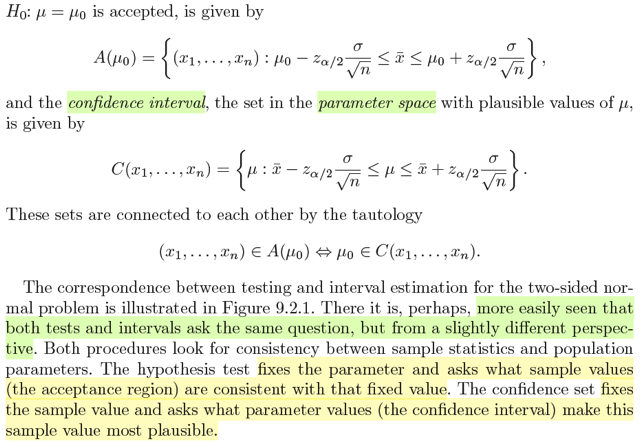</kbd>

<kbd>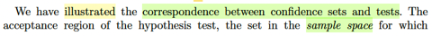</kbd>

> [!NOTE]
> Hiểu đại khái là gs nói về mối liên hệ giữa acceptance region trong
> hypothesis test và confidence interval trong interval estimation,
>
>
>
> Với bài toán test giữa H0: θ ∈ Θ0 vs H1: θ ∈ Θ0c, như đã biết, rejection
> region R = {**x**: reject H0} mà trong ví dụ vừa rồi là  {**x:** |Xbar - μ0| >
> z_α/2 σ/√n}
>
>
>
> → Acceptance region: {**x**: |Xbar - μ0| ≤ z_α/2 σ/√n}
>
>
>
> = {**x**: -z_α/2 σ/√n ≤ xbar - μ0 ≤ z_α/2 σ/√n}
>
>
>
> Đặt kí hiệu nó là A(μ0)
>
>
>
> Thì dĩ nhiên đây là subset trong sample space, cái này ko có gì phải nói.
>
>
>
> Còn trong interval estimation, thì confidence set là:
>
>
>
> C(**x**) = {μ: xbar - z_α/2 σ/√n ≤ μ ≤ xbar + z_α/2 σ/√n}
>
>
>
> Và hai tập này kết nối với nhau qua quan hệ:
>
>
>
> **x** ∈ A(μ0) ⇔ μ0 ∈ C(**x**)
>
>
>
> Để rồi đại khái là sau khi đã thiết lập một cái test nào đó ví dụ cái test tốt nhất
> rồi, nó sẽ cho phép ta:
>
>
>
> Trong bài toán testing: ta giữ cố định parameter θ và đặt vấn đề là " **x nào
> thì sẽ phù hợp / consistent với θ đó" (thấy x bằng bao nhiêu thì ta sẽ accept
> θ đó, ám chỉ acceptance region)**
>
>
>
> Còn trong bài toán interval estimation: ta giữ cố định **x**, và đặt câu hỏi là
> θ nào phù hợp nhất với với (giá trị quan sát thấy) của **x** đó
>
>
>
> Ví dụ minh họa trong hình:
>
>
>
> Sử dụng cái most reasonable test (most power unbiased test rule) giúp thiết
> lập ra rejection / acceptance region
>
>
>
> Thì kiểu như nếu ta c**á cược rằng μ = μ0**, thì sẽ thiết lập đoạn A(μ0) là
> vùng mà **nếu sau này ta quan sát** được **X** = **x** **nằm trong này thì sẽ
> giúp kết luận mình đúng: accept μ = μ0** (accept H0 trong bài toán
> hypothesis test)
>
>
>
> Còn nếu ta làm ngược lại, **dựa quan sát thấy** **X** = **x***, để có xbar*, thì
> cái rule này sẽ **giúp xác lập** C(**x***) (hay C(xbar*) cũng được)sẽ là
> **khoảng phù hợp mà ta cho rằng nhất định μ phải nằm trong đó**

 

##### Khoảng tin cậy và Kiểm định

<kbd>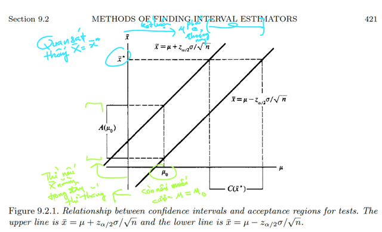</kbd>

> [!NOTE]
> Hình này rất quan trọng giúp hiểu:
>
>
>
> Luồng màu xanh dương: 
>
>
>
> 1) **QUAN SÁT THẤY** **X = x*** (và→ Xbar = xbar*) thì cái test rule của UMPtest
> sẽ **GIÚP KẾT LUẬN μ PHẢI NẰM TRONG ĐOẠN NÀY C(xbar*)**
>
>
>
> 2) Còn **MUỐN KẾT LUẬN μ = μ0**, thì **PHẢI QUAN SÁT THẤY Xbar NẰM TRONG
> ĐOẠN NÀY A(μ0)**

 

- **Mối quan hệ C(x) và A(θ)**

<kbd>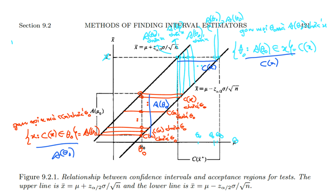</kbd>

> [!NOTE]
> Màu xanh: lấy **x** cụ thể nào đó. gom hết các ông θ0 ∈ θ có A(θ0)
> chứa **x**, tạo thành C(**x**)
>
>
>
> Màu đỏ: lấy θ0. gom hết các ông **x** ∈ **X** mà C(**x**) chứa θ0, đặt là
> A(θ0)

 

- **Liên hệ Kiểm định - Tin cậy**

<kbd>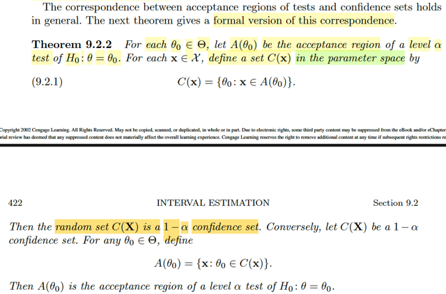</kbd>

> [!NOTE]
> Theorem 9.2.2 này sẽ chính thức tuyên bố quan hệ này: Hiểu đại khái
> cái theorem này như sau:
>
>
>
> Đầu tiên, nó nói nếu như ta xét tập A(θ0) là acceptance region, (đương
> nhiên, nó là tập chứa **x**) của một bài toán kiểm định H0: θ=θ0, và cái
> test tạo acceptance region này có level α. Thì ta có thể dùng nó để tạo
> một confidence set C(**X**) có coefficient 1-α bằng cách như sau:
>
>
>
> Xây dựng một hàm tập: **x** → tập C(**x**) chứa các θ0 mà tập A(θ0) của nó
> có chứa **x**. Nói bằng lời, cái hàm hàm này nhận vào **x**,rồi bên trong gom
> các θ0 mà A(θ0) chứa **x** lại, và trả cái tập đó ra. Thì với cái hàm tập C(**x**)
> này, áp nó lên random sample **X**, ta sẽ có một RANDOM SET C(**X**). Và,
> đây chính là một confidence set có confidence coefficient 1 - α (theo định
> nghĩa, interval estimator, hay confidence set về bản chất chỉ là một random
> interval hay khái quát hơn là random set)
>
>
>
> -----
>
>
>
> Ở chiều ngược lại, nó nói, nếu ta có một confidence set C(**X**) (mà bản chất
> như vừa nói, chỉ là một random set, define bởi một hàm tập - set function
> c(**x**) áp lên random variable **X**) có coefficient 1-α. Thì theorem này nói rằng
> ta có thể dùng nó để mà xây dựng một test cho bài toán kiểm định H0: θ = θ0
> có level α. Làm như sau: Ta sẽ dùng cái hàm tập này, để tạo một tập như
> sau: gom các **x** mà C(x) chứa θ0, thành tập kí hiệu là A(θ0), thì cái tập này
> chính là acceptance region của cái test đang cần, dĩ nhiên đồng nghĩa đã
> định ra cái test đó.

 

- **Mối quan hệ Test Tập tin cậy**

<kbd>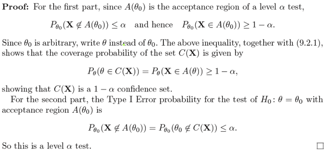</kbd>

> [!NOTE]
> Phần chứng minh:
>
>
>
> i) Ý đầu tiên nói nếu ta có A(θ0) là một tập acceptance region (của một test) có level α 
> cho bài toán kiểm tra H0: θ = θ0, thì ta sẽ có thể xây dựng một confidence set
> có coefficient 1 - α bằng cách như sau: Tạo hàm tập nhận vào một giá trị **x**,
> trả ra tập như sau: Xem trong các θ0 ∈ Θ, cái nào có A(θ0) chứa **x**, thì gom lại
> thành tập C(**x**) = {θ0 ∈ Θ: **x** ∈A(θ0)}. Khi đó áp cái hàm này lên **X**, sẽ cho ta 
> một random set, hay random interval, là nó chính là một confidence set có 
> confidence coefficient = 1-α:
>
>
>
> Vậy đầu tiên ta có level α acceptance region A(θ0) nên A(θ0) là rejection region.
> Theo định nghĩa của level α test, ta có sup_θ∈Θ0 P_θ(**X** ∈ A(θ0)c) ≤ α. 
>
>
>
> sup_θ=θ0 P_θ(X ∈ A(θ0)c) ≤ α.
>
>
>
> ⇔ P_θ0(**X** ∈ A(θ0)c) ≤ α.
>
>
>
> ⇔ 1 - P_θ0(**X** ∈ A(θ0)) ≤ α 
>
>
>
> ⇔ 1 - α ≤ P_θ0(**X** ∈ A(θ0)) 
>
>
>
> Nhớ rằng thứ ta đang có là do giả thuyết cho level α acceptance region A(θ0)
> của bài toán test H0: θ = θ0
>
>
>
> Rồi đến đây ta mới xem cách xây dựng 1-α confidence set, nhắc lại cho nhớ: với mỗi
> x trong range X. tạo tập C(x) = {θ0 ∈ Θ: A(θ0) chứa x}. Vì cách tạo này nên:
>
>
>
> nếu θ0 thuộc Θ mà A(θ0) chứa x (tức x ∈ A(θ0)) thì nó (θ0) sẽ chứa trong C(x) và 
> ngược lại, nếu θ0 nằm trong C(x) thì nhất định A(θ0) của nó sẽ chứa x. Nên ta có
> quan hệ: θ0 ∈ C(x) ⇔ x ∈ A(θ0)
>
>
>
> Rồi, vậy giờ xét P_θ0(**X** ∈ A(θ0)), về bản chất nó là cái gì:
>
>
>
> theo lí thuyết xác suất, nó chính là: P_θ0({s ∈ Ω: **X**(s) ∈ A(θ0)})
>
>
>
> = P_θ0({**x** ∈ range **X**: **x** ∈ A(θ0)})
>
>
>
> mà **x** ∈ A(θ0) ⇔ θ0 ∈ C(**x**)
>
>
>
> ⇨ = P_θ0({x ∈ range X: x ∈ A(θ0)}) = P_θ0({**x** ∈ range **X**: θ0 ∈ C(x)})
>
>
>
> và đây chính là P_θ0(θ0 ∈ C(**X**))
>
>
>
> Như vậy ta có C(**X**) là một random set có tính chất:
>
>
>
> 1 - α ≤ P_θ0(θ0 ∈ C(**X**)) 
>
>
>
> và điều này đúng với θ0 tùy ý, vì θ0 có từ giả thuyết là giá trị tùy ý trong Θ, hoàn toàn
> không có ràng buộc nào.
>
>
>
> Do đó ta có thể ghi là:
>
>
>
> 1 - α ≤ P_θ(θ ∈ C(**X**))
>
>
>
> và do đó 1 - α ≤ inf_θ∈Θ P_θ(θ ∈ C(**X**))
>
>
>
> Và đây chính là định nghĩa của một 1-α confidence set, một cái lưới giăng bẫy θ mà
> xác suất bắt dính được θ (dù chưa biết nó ở đâu) cũng luôn từ 1-α trở lên.
>
>
>
> ====
>
>
>
> Ngược lại, nếu xuất phát điểm của ta có là một 1-α confidence set C(**X**), thì theorem
> này nói là có thể xây dựng một test có level α cho bài toán kiểm định H0: θ = θ0 với
> θ0 bất kì trong Θ. Và cách xây dựng như sau: Còn nhớ, một test, thật ra là một rule,
> và cái rule này có thể được nhìn nhận ở dạng một cái rejection region R hay phần bù
> của nó, acceptance region Rc. Vậy thì, từ confidence set C(**X**), ta sẽ xài cái hàm C(**x**)
> để gom hết các thằng **x** ∈ range **X** nào mà C(**x**) của nó chứa θ0 (θ0 của H0: θ = θ0 
> đang xét), và gom lại thành tập gọi là A(θ0). Thì cái tập này, theo theorem, chính là
> Rc của tạo bởi một level α test của bài toán kiểm định H0: θ = θ0.
>
>
>
> Chứng minh: Ta có 1-α confidence set C(**X**), nên theo định nghĩa của confidence 
> coefficient:
>
>
>
> inf_θ∈Θ P_θ(θ ∈ C(**X**)) = 1 - α 
>
>
>
> ⇨ 1 - α ≤ P_θ(θ ∈ C(**X**)) ∀θ 
>
>
>
> (mang ý nghĩa, cái lưới C(**X**) này, luôn có xác suất bắt được θ) ít nhất là từ 1 - α trở lên, 
> dù θ nằm ở đâu)
>
>
>
> vì nó đúng với mọi θ nên nó đúng với θ = θ0 mà ta đang xét bài toán kiểm tra H0: θ = θ0
>
>
>
> 1 - α ≤ P_θ0(θ0 ∈ C(**X**)) (1)
>
>
>
> lưu ý, đên đây chỉ đon thuần kết quả là do giả thuyết ta có 1-α confidence set.
>
>
>
> Bây giờ ta mới xét cách xây dựng test, chính xác là tập Rc của nó: tập A(θ0) là tập chứa
> các giá trị **x** ∈ range **X** sao cho C(**x**) chứa θ0. Vì cách xây dựng như vậy cho nên ta có
> quan hệ: **x** mà thuộc A(θ0) thì có nghĩa là θ0 thuộc C(**x**) và ngược lại, θ0 thuộc C(**x**) thì
> **x** nằm trong A(θ0): **x** ∈ A(θ0) ⇔ θ0 ∈ C(**x**)
>
>
>
> Như vậy, ta xét event θ0 ∈ C(**X**), event này có bản chất là {**x** ∈ **X**: θ0 ∈ C(**x**)} và vì cái ta có
> ở trên nên tập này bằng tập {**x** ∈ **X**: x ∈ A(θ0)} = **X** ∈ A(θ0)
>
>
>
> ⇨ P_θ0(θ0 ∈ C(**X**)) = P_θ0(**X** ∈ A(θ0))
>
>
>
> vậy (1) ⇔ 1 - α ≤ P_θ0(**X** ∈ A(θ0))
>
>
>
> ⇔ 1 - α ≤ 1 - P_θ0(**X** ∈ A(θ0)c)) 
>
>
>
> ⇔ P_θ0(**X** ∈ A(θ0)c)) ≤ α 
>
>
>
> ⇔ sup_θ∈Θ0={θ0} P_θ(**X** ∈ A(θ0)c)) ≤ α   
>
>
>
> Và đây chính là nói rằng test có rejection region A(θ0)c (cũng là acceptance region A(θ0)
> là một level α test. Chứng minh xong.

 

- **Đảo ngược test ra khoảng tin cậy**

<kbd>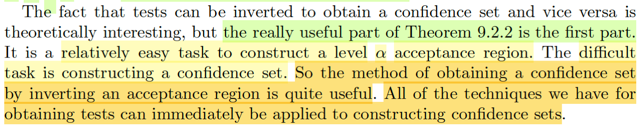</kbd>

> [!NOTE]
> Đoạn này đại khái gs nói là cái sự thật mà ta vừa được biết rằng có thể đảo
> ngược một cái test để có một cái interval estimator (hay ta nhớ nó còn có cái
> tên khác là confidence interval, và khái quát hơn là confidence set) và ngược
> lại rất hay nhưng thật sự thì cái phần đầu mới là hữu ích (tức có test, invert để
> có interval estimator)
>
>
>
> Và nó hữu ích là bởi vì thực tế việc **xây dựng một cái interval estimator
> thường khó**, nhưng việc **xây dựng cái level α acceptance region** (ý là cái
> level α test) thì thường là dễ, nên cách vụ **invert test ra interval estimator này
> rất có lợi**. Mà xây dựng test thì ta đã biết các cách để làm như hồi chap
> trước rồi.

 

- **H1 và Dạng Tập Tin Cậy**

<kbd>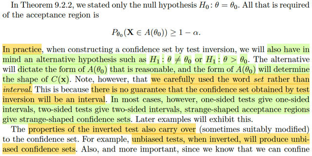</kbd>

<kbd>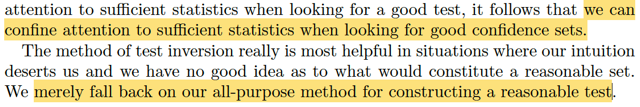</kbd>

> [!NOTE]
> tiếp đại khái là theorem 9.2.2 ta chỉ nói đến bài toán mà null hypothesis là H0:
> θ = θ0, và yêu cầu chỉ là bắt đầu với acceptance region có P_θ0 (X ∈ A(θ0)) ≥
> 1-α  (để từ đó ta có thể invert để có 1-α confidence set)
>
>
>
> Tuy nhiên gs nói, ta **cũng phải xem xét cái H1 là gì nữa**: là **2 side test (H1: θ ≠
> θ0) hay 1-side test** (H0: θ > θ0) vì cái này sẽ ảnh hưởng đến dạng của A(θ0).
> và từ đó ảnh hưởng đến dạng của confidence set C(**x**).
>
>
>
> Ngoài ra, gs còn nói ta nên để ý là theorem chỉ dùng từ confidence set (thay
> vì confidence interval) vì không có gì đảm bảo C(**x**) sẽ là một interval. Tuy
> vậy **phần lớn trường hợp** ta sẽ thấy **one-sided test sẽ cho ta one-sided
> interval,** **two side test sẽ cho ta two-sides interval**....
>
>
>
> Một điểm nữa cũng dễ hiểu, gs nói là các tính chất tốt đẹp của một test cũng
> sẽ được chuyển sang cho confidence set. Ví dụ như bắt đầu với unbiased
> test ta cũng sẽ có unbiased confidence set.
>
>
>
> Hoặc là ta cũng đã biết có thể xây dựng test dựa trên sufficient statistic thay
> vì random sample, thì inverting cũng sẽ giúp tạo confidence set như vậy.
>
>
>
> Cuối cùng, gs nói ta sẽ thấy cái này hữu ích nhiều nhất khi gặp tình huống
> mà ta ko có ý niệm gì về một reasonable set, (ý là ko có bất cứ ý niệm nào về
> cái interval mà ta nên tạo ra) thì khi đó bài toán trở về là đi theo cách tiếp cận
> đã  biết để tạo ra một reasonable test trước, rồi invert để có reasonable
> confidence set

**🔗 See also:** [UMA từ kiểm định UMP](#node-6ofz752)

 

- **Khoảng tin cậy đảo ngược LRT**

<kbd>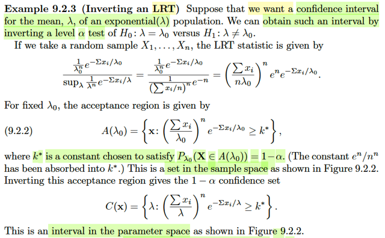</kbd>

> [!NOTE]
> Qua ví dụ này, ta cần xây dựng confidence interval cho mean của một
> expo(λ) population.
>
>
>
> Thế thì ta sẽ dùng inverting a test technique, và sẽ dùng một level α
> likelihood ratio test của bài toán testing H0: λ = λ0 vs H1: λ ≠ λ0.
>
>
>
> Đây là dịp ôn lại LRT là gì: LRT test, là một cái test, dùng likelihood ratio
> test statistic: λ(**X**) = sup_θ∈Θ0 L(θ|**x**) / sup_θ∈Θ L(θ|**x**) =
> L(θ^0|**x**)/L(θ|**x**) chính là likelihood function tại restricted to Θ0 MLE và
> unrestricted MLE.
>
>
>
> Còn còn nhớ, likelihood function là function của θ, được định nghĩa là
> L(θ|**x**) = f(**x**|θ) (là joint pdf/pmf của random sample) mang ý nghĩa là
> độ hợp lí của θ  khi quan sát được **X** = **x**.
>
>
>
> Cho nên ở đây, với expo(λ), L(λ|**x**) = f(**x**|λ) = Πi=1:n f(xi|λ)
>
>
>
> = (1/λ) e^-xi/λ  (do tính iid)
>
>
>
> = Πi=1:n (1/λ) e^-xi/λ
>
>
>
> = (1/λ)^n Πi=1:n e^-xi/λ
>
>
>
> = (1/λ)^n e^(-Σxi/λ)
>
>
>
> ⇨ λ(**x**) = sup_λ=λ0 {(1/λ)^n e^(-Σxi/λ)} / sup_λ {(1/λ)^n e^(-Σxi/λ)}
>
>
>
> = (1/λ0)^n e^(-Σxi/λ0) / sup_λ {(1/λ)^n e^(-Σxi/λ)}
>
>
>
> Xét cái mẫu, giải nhanh bài toán maximize_λ (1/λ)^n e^(-Σxi/λ)
>
>
>
> equivalent maximize_λ log f(λ)
>
>
>
> = log [(1/λ)^n e^(-Σxi/λ)]
>
>
>
> = log [λ^(-n) e^(-Σxi/λ)]
>
>
>
> = log [λ^(-n)] + [log e^(-Σxi/λ)]
>
>
>
> = -n log λ + -Σxi/λ
>
>
>
> f'(λ) = -n/λ +Σxi/λ^2
>
>
>
> f'(λ) = 0
>
>
>
> ⇔ -n/λ +Σxi/λ^2 = 0
>
>
>
> ⇔ Σxi/λ^2 = n/λ
>
>
>
> ⇔ Σxi/n = λ
>
>
>
> f''(λ) = n/λ^2 + Σxi [-1/(λ^2)^2] 2λ
>
>
>
> = n/λ^2 - 2Σxi /λ^3
>
>
>
> tại λ^ = Σxi/n → f''(λ^) = n/(Σxi/n)^2 - 2Σxi / (Σxi/n)^3
>
>
>
> = n^3 / (Σxi)^2 - 2 n^3 / (Σxi)^2
>
>
>
> = - n^3 / (Σxi)^2 < 0
>
>
>
> hay -n^3/(nλ)^2 = -n/(λ^)^2 < 0
>
>
>
> → λ^ = Σxi/n là maximum
>
>
>
> Và L(λ^|**x**) là mle, = (1/λ^)^n e^(-Σxi/λ^)
>
>
>
> = (1/(Σxi/n))^n e^(-Σxi/(Σxi/n))
>
>
>
> = (n/(Σxi))^n e^(-n)
>
>
>
> ⇨ λ(**x**) = (1/λ0)^n e^(-Σxi/λ0) / (n/(Σxi))^n e^(-n)
>
>
>
> = ((Σxi)/nλ0)^n e^(-Σxi/λ0 - (-n))
>
>
>
> = (Σxi/nλ0)^n e^(n)e^(-Σxi/λ0) là công thức trong sách.
>
>
>
> ====
>
>
>
> Thế thì với LRT thì cái rule sẽ là: reject H0 khi λ(**x**) ≤ c với c là con số
> nào đó từ 0 tới 1, ⇨ reject region là {**x**: λ(**x**) ≤ c} (và acceptance
> region là {**x:** λ(**x**) > c})
>
>
>
> Thế thì để có một level α test, hay ở đây ta thấy gs nói về luôn một size α
> test (là thằng tệ nhất trong đám level α test) thì c phải được chọn sao cho
> sup_θ∈Θ0 P_θ(reject H0) = α ⇔ P_λ0(λ(**X**) ≤ c) = α
>
>
>
> ⇔ P_λ0((Σxi/nλ0)^n e^(n)e^(-Σxi/λ0) ≤ c) = α
>
>
>
> ⇔ P_λ0((Σxi/λ0)^n e^(-Σxi/λ0) ≤ cn^n/e^(n)) = α
>
>
>
> Và gọi c được chọn, hay cả cái cục c(n^n)/e^(n) là k*. Ta có:
>
>
>
> P_λ0((Σxi/λ0)^n e^(-Σxi/λ0) ≤ k*) = α
>
>
>
> Và ta có rejection region: R = {**x**: (Σxi/λ0)^n e^(-Σxi/λ0) ≤ k*}
>
>
>
> Và acceptance region: Rc = {**x**: (Σxi/λ0)^n e^(-Σxi/λ0) > k*}, đặt nó là
> A(λ0)
>
>
>
> thì cái ta đang có chính là một level α acceptance region của bài toán kiểm
> tra H0: λ = λ0
>
>
>
> ----
>
>
>
> Đến đây, ôn lại theorem 9.2.2 một chút, ý (i) của nó nói rằng: nếu ta có
> A(θ0) là acceptance region tạo bởi một level α test, thì có thể xây dựng một
> 1-α confidence set như sau: tạo hàm-tập C(**x**): nhận vào **x**, xem hết
> các θ0 ∈ Θ, cái nào có A(θ0) chứa **x,** thì gom lại tạo tập C(**x**).
>
>
>
> C(**x**) = {θ0 ∈ Θ: **x** ∈ A(θ0)},
>
>
>
> trong cách ghi vừa rồi θ0 hay θ hay u gì đều được, vì nó là dummies
> variable.
>
>
>
> Nên ta sẽ ghi là C(**x**) = {θ ∈ Θ: **x** ∈ A(θ)}
>
>
>
> thì khi đó C(**X**) chính là một 1-α confidence set.
>
>
>
> Vậy ở đây ta có A(θ0) là A(λ0) = {**x**: (Σxi/λ0)^n e^(-Σxi/λ0) > k*}
>
>
>
> Ta sẽ làm như theorem: tạo hàm tập C(**x**) bằng cách gom những θ (λ)
> mà A(θ) chưá **x**: C(**x**) = {λ: A(λ) chứa **x**} = {λ: **x** ∈ A(**λ**)}
>
>
>
> mà **x** ∈ A(λ) thì tức là **x** thỏa cái rule (Σxi/λ)^n e^(-Σxi/λ) > k* giúp định
> ra tập A(λ) đó
>
>
>
> ⇨ C(**x**) = {λ: (Σxi/λ)^n e^(-Σxi/λ) > k*}
>
>
>
> Và từ đó, ta có random set:
>
>
>
> C(**X**) = {λ: (ΣXi/λ)^n e^(-ΣXi/λ) > k*} chính là một 1-α confidence set.

**🔗 See also:** [Khoảng tin cậy tối ưu](#node-uj1aylo)

 

- **Miền chấp nhận, khoảng tin cậy**

<kbd>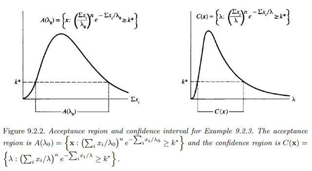</kbd>

> [!NOTE]
> Mình hiểu rằng tập A(λ0) là tập chứa **x** thỏa cái rule .. ≥ k* , mà cái rule này
> có thể thể hiện bởi Σxi, nên nếu vẽ đồ thị Σixi vs (Σxi/λ0)^n exp(-Σxi/λ0) 
> thì cái đoạn của Σxi mà đồ thị cao hơn k* chính là cái đoạn sẽ TƯƠNG ỨNG
> VỚI CÁI ĐOẠN CỦA **x** TRONG A(λ0) (phải nói vậy là vì A(λ0) là tập chứa **x**,
> là một range của **x, không phải range của Σixi**) 
>
>
>
> Nói ngắn gọn A(λ0) ở trong hình không phải là A(λ0) thật, nó chỉ là đoạn
> tương ứng của Σixi ứng với các **x** trong A(λ0)
>
>
>
> Còn hình thứ hai, ta vẽ cái đồ thị của λ vs (Σxi/λ)^n exp(-Σxi/λ). Thì vì C(**x**)
> là tập chứa λ thỏa cái rule này, nên đoạn λ mà ở đó đồ thị cao hơn k* quả
> thật chính là C(**x**) (khác với case trên)

 

- **Xây dựng khoảng tin cậy**

<kbd>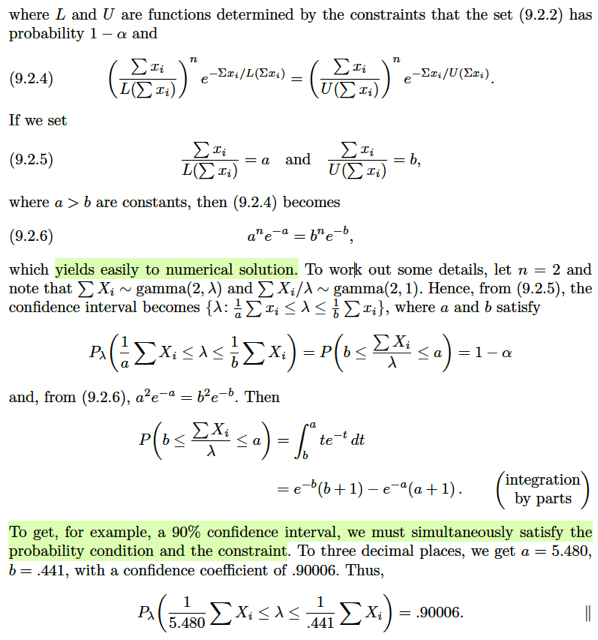</kbd>

<kbd>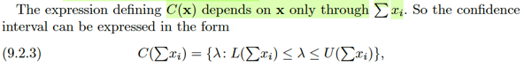</kbd>

<kbd>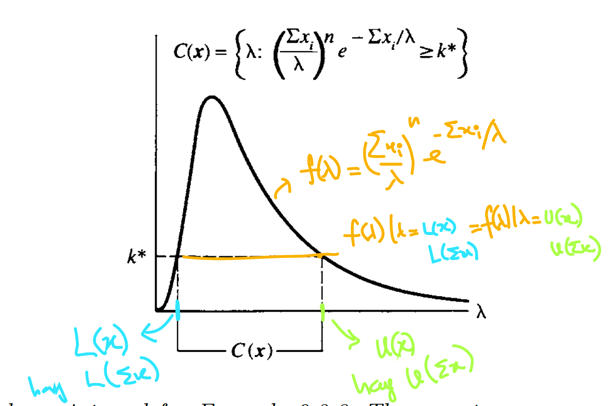</kbd>

> [!NOTE]
> Tiếp, xét C(**X**) = {λ: (ΣXi/λ)^n e^(-ΣXi/λ) > k*} mà ta đã nói chính là một
> 1-α confidence set. Nên nhắc lại lần nữa, nó là tập chứa λ, thỏa cái rule f(λ)
> = (Σixi/λ)^n exp[-Σixi/λ] ≥ k*
>
>
>
> Thế thì, vì parameter space của λ là R, nên dĩ nhiên cái random set này là
> một random interval. Có nghĩa là với observed value **X** = **x**, ta sẽ có
> C(**x**) là một interval có dạng [λ_low, λ_high] mà với λ trong đó f(λ) ≥ k*.
>
>
>
> Thế thì, dĩ nhiên λ_low là giá trị cụ thể của hàm L(**x**)nào đó và λ_high
> = U(**x**) nào đó.
>
>
>
> Hoặc là ta cũng có thể thay cách thể hiện hàm số trên bằng L(Σixi) và
> U(Σixi) để có thể thể hiện C(**X**) ở trên = [L(Σixi, U(Σixi)] với **L, U được
> define sao cho với mọi λ** ∈ **[λlow = L(Σixi), λhigh = U(Σixi)] thì f(λ) ≥ k*
> (1)**
>
>
>
> Và vì k* là con số để thỏa A(λ0) là một level α acceptance region để rồi
> C(**X**) theo định nghĩa trên ({λ: (ΣXi/λ)^n e^(-ΣXi/λ) > k*}) là một 1-α
> confidence interval,  nên giờ yêu cầu L, U thỏa cái (1) cũng chính là nói
> **cần tìm L,U sao cho khiến C(x)  = [L(x), U(x)] là một 1-α confidence
> interval
>
>
>
> Do đó điều (1) viết lại thành: inf_λ P_λ(λ** ∈ **[L(X), U(X)] = 1 - α** 
>
>
>
> Vậy câu hỏi là **đi tìm L(.), U(.)**:
>
>
>
> Đầu tiên, dựa vào đồ thị, ta thấy: với observed value **X**=**x**
>
>
>
> f(λ)|λ=λlow = f(λ)|λ=λhigh
>
>
>
> ⇔ f(λ)|λ=L(Σixi) = f(λ)|λ=U(Σixi)
>
>
>
> ⇔ (Σixi/L(Σixi))^n exp[-Σixi/L(Σixi)] = (Σixi/U(Σixi))^n exp[-Σixi/U(Σixi)]
>
>
>
> Đặt a = Σixi/L(Σixi), b = Σixi/U(Σixi)
>
>
>
> Nếu ta có thể tìm a, b sao cho
>
>
>
> i) a^n exp(-a) = b^n exp(-b)
>
>
>
> ii) a và b phải sao đó thỏa với mọi λ ∈ [L(Σixi) = Σixi/a, U(Σixi) = Σixi/b] thì
> f(λ) ≥ k*
>
>
>
> thì khi đó ta sẽ đã xây dựng xong C(**X**) = [L(ΣiXi), U(ΣiXi)] là một 1-α
> confidence set
>
>
>
> ====
>
>
>
> Vậy thì để kiểu như ta có thể có một bài toán cụ thể để mà giải tìm một
> confidence set có level cụ thể nào đó. Người ta mới cho n = 2.
>
>
>
> Lúc này, xét điều kiện i) trở thành a^2 e^-a = b^2 e^-b
>
>
>
> và ii) trở thành tìm a, b sao cho inf_λ P_λ(λ ∈ [L(**X**), U(**X**)]) = 1 - α
>
>
>
> ⇔ 1 - α ≤ P_λ(L(**X**) ≤ λ ≤ U(**X**))
>
>
>
> ⇔ 1 - α ≤ P_λ(ΣiXi/a ≤ λ ≤ ΣiXi/b)
>
>
>
> ⇔ 1 - α ≤ P_λ(ΣiXi ≤ aλ, λb ≤ ΣiXi)
>
>
>
> ⇔ 1 - α ≤ P_λ(b ≤ ΣiXi/λ ≤ a)
>
>
>
> Rồi. Thế thì với expo(λ), ta biết nó cũng chính là một Γ(1, λ) distribution.
> (location param = 1, scale param = λ)
>
>
>
> Và ví dụ 4.6.7 ta cũng đã biết tổng của các iid Γ(αi, β) sẽ là một Γ(Σiαi, β)
>
>
>
> ⇨ ΣiXi ~ Γ(n, λ)
>
>
>
> và do đó theo lí thuyết location scale family, thì ΣiXi / λ là thành viên   có
> scale là 1: Γ(n, 1)
>
>
>
> Vậy Y = ΣiXi / λ ~  Γ(2, 1) như sách nói là vậy.
>
>
>
> Và P_λ(b ≤ ΣiXi/λ ≤ a) dĩ nhiên là ∫b:a fY(y)dy
>
>
>
> = ∫b:a ye^-ydy dùng tích phân từng phần ta sẽ giải ra cái này là
>
>
>
> e^-b(b+1) - e^-a(a+1)
>
>
>
> Áp vào điều kiện:
>
>
>
> 1 - α ≤ e^-b(b+1) - e^-a(a+1)
>
>
>
> Và a^2 e^-a = b^2 e^-b
>
>
>
> Chọn α = 0.1, có cách để giải ra a, b như vậy từ đó ta có một [L(**X**),
> U(**X**)] là một  1-α confidence set (cái này gs không nói)

**🔗 See also:** [Tổng biến ngẫu nhiên Gamma](#node-08ciur5)

 

- **LRT và Tập tin cậy**

<kbd>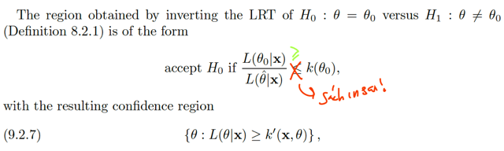</kbd>

> [!NOTE]
> Rồi, đoạn này đại khái là vầy: như ví dụ vừa rồi cũng đã ôn lại, một cái LRT sẽ có
> dạng như sau: reject H0 khi λ(**X**) ≤ c với λ(**X**) là LRT test statistic, có công thức
> = L(θ^0|**x**) / L(θ^|**x**) với θ^0 và θ^ là restricted on Θ0 và unrestricted MLE. Nên
> reject region sẽ là R = {**x**: L(θ^0|**x**) / L(θ^|**x**) ≤ c}, hay acceptance region là Rc
> = {**x**: L(θ^0|**x**) / L(θ^|**x**) > c}
>
>
>
> Với bài toán test H0: θ=θ0 thì dĩ nhiên L(θ^0|**x**) = L(θ0|**x**)
>
>
>
> ⇨ Rc = {**x**: L(θ0|**x**) / L(θ^|**x**) > c}
>
>
>
> Và để thể hiện c sẽ là một ngưỡng, được chọn cụ thể cho cái test đang phục vụ bài
> toán testing H0: θ=θ0. người ta dùng k(θ0) (ý nói, với θ0 khác nhau, ta dùng các
> threshold khác nhau, chỉ vậy thôi)
>
>
>
> Do đó gs Casella mới nói "cái region" là {**x**: L(θ0|**x**) / L(θ^|**x**) ≥ k(θ0)}
>
>
>
> gs dùng dấu ≥ (trong sách in sai với dấu ≤), vì phần lớn ta sẽ deal với biến liên  tục,
> nên dấu > hay ≥ thì cũng như nhau thôi.
>
>
>
> Tiếp {**x**: L(θ0|**x**) / L(θ^|**x**) ≥ k(θ0)} = {**x**: L(θ0|**x**) ≥ k(θ0) L(θ^|**x**)}
>
>
>
> mà L(θ^|**x**) có giá trị phụ thuộc **x ,** ⇨ ta sẽ nhập luôn nó với k(θ0) để thành một
> ngưỡng k'(θ0,**x**) mới, để rồi thể hiện acceptance region bởi:
>
>
>
> {**x**: L(θ0|**x**) ≥ k'(θ0,**x**)}, đây là kí hiệu A(θ0), và muốn có level α acceptance
> region thì ta sẽ chọn k'(θ0,**x**) phù hợp
>
>
>
> thế thì từ đó, theo cách làm của theorem 9.2.2 mà ta đã nói đi nói lại nãy giờ, bằng
> cách invert cái tập này, cụ thể là tạo hàm tập C(**x**) = {θ0 ∈ Θ: A(θ0) chứa **x**} hoặc
> dùng dummies variable θ, C(**x**) = {θ ∈ Θ: A(θ) chứa **x**} thì C(**X**) = {θ:
> L(θ|**X**) ≥ k'(θ,**x**)} chính là 1-α confidence set.

 

- **Đảo ngược kiểm định**

<kbd>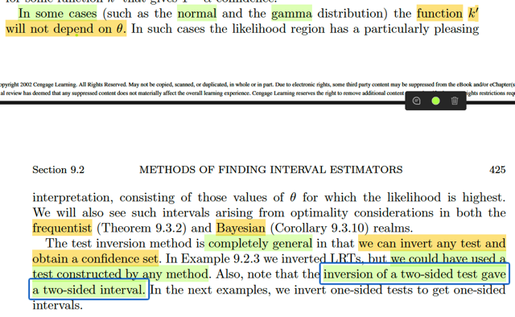</kbd>

> [!NOTE]
> Ok, cuối cùng, đại ý gs là có khi k' (θ0) lại không phụ thuộc θ0, là constant.
> Tức là trong những tình huống đó, cái ngưỡng để có một test có level 
> mong muốn luôn là constant đối với θ0, bất kể đang test H0: θ = θ0 bao 
> nhiêu, tức k'(θ,**x**) chỉ còn phụ thuộc **x.** Ta sẽ thấy nó xuất hiện sau này.
>
>
>
> Và hơn nữa, theo lí thuyết thì invert cái test nào cũng sẽ ra một confidence
> set, mà ví dụ vừa rồi ta invert một LRT.

 

- **Giới hạn tin cậy trên**

<kbd>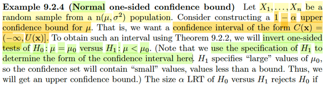</kbd>

> [!NOTE]
> Ví dụ này, xét một random sample X1..Xn ~ n(μ, σ^2). Đại khái là ta sẽ muốn
> tạo một confidence set cho μ (có coefficient 1-α nào đó). Nhưng lần này, ta
> muốn confidence set có dạng: upper confidence bound tức là, interval sẽ có
> dạng one-side: (-inf, U(**X**)].
>
>
>
> Nhớ lại chút, confidence set, hay interval estimator là bài toán inference mà ta
> muốn xây dựng một random set C(**X**), và nếu có thể có một 1-α confidence
> set thì ta sẽ có một set mà chắc chắn rằng xác suất θ nằm trong đó là từ 1-α
> trở lên. Thế thì ở đây, ta muốn một upper bound U(**X**) sao cho dù μ có bằng
> bao nhiêu thì xác suất nó nằm dưới cái bound này ít nhất là 1-α trở lên.
>
>
>
> inf_μ P_μ(μ ∈ (-inf, U(**X**)]) = inf_μ P_μ(μ < U(**X**)) = 1 - α.
>
>
>
> Thế thì theo gs, ta sẽ xây dựng cái interval này bằng cách invert một cái one-
> side test có dạng: H0: μ = μ0 vs H1: μ < μ0. Câu hỏi là, tại sao invert cái test
> này lại cho ta một cái upper confidence bound.
>
>
>
> Thử xét cái test của bài toán này, giả sử mình có một cái test có rule: reject H0
> nếu T(**X**) ≤ c (ví dụ Xbar ≤ μ0 - margin chẳng hạn, để về trực giác rất dễ
> thấy: ta đang test giữa H0: μ = 100 vs H1: μ < 100 thì nếu quan sát thấy xbar
> tức giá trị trung bình chỉ là 10, thì ta sẽ reject H0 mà cho rằng H1 mới đúng tức
> μ thật sự nhỏ hơn 100 nhiều)
>
>
>
> Thì khi đó, cái rejection region sẽ là: R = {**x**: xbar ≤ μ0 - margin} và
> acceptance  region là
>
>
>
> Rc = {**x**: xbar > μ0 - margin}.
>
>
>
> Thế thì đên đây ta mới làm theo theorem Tautology 9.2.2: Còn nhớ, nó nói
> rằng i) nếu ta có một level α acceptance region của bài toán testing: H0: θ =
> θ0, đặt là A(θ0).Thì ta có thể xây dựng một 1-α confidence set cho θ như sau:
>
>
>
> Tạo hàm C(**x**) nhận vào **x** ∈ range **X**, trả ra tập các θ0 ∈ Θ mà A(θ0)
> chứa **x**: C(**x**) = {θ0: **x** ∈ A(θ0)} = {**θ**: **x** ∈ A(**θ**)}
>
>
>
> Khi đó C(**X**) chính là 1-α confidence set của θ.
>
>
>
> Vậy thì ở đây, nếu gọi Rc ở trên, là A(μ0). Thì bằng cách đặt C(**x**) là tập
> chứa các μ0 ∈ R sao cho A(μ0) chứa **x**:
>
>
>
> C(**x**) = {μ0 ∈ R: **x** ∈ A(μ0)} = {μ: **x** ∈ A(μ)}
>
>
>
> thì C(**x**) sẽ là 1-α confidence set. Nhưng cái quan trọng là mình sẽ thấy
> C(**x**) có dạng gì:
>
>
>
> Nó chứa những μ0 mà A(μ0) chứa **x**
>
>
>
> Nếu A(μ0) chứa **x**, tức **x** thuộc acceptance region của bài toán test H0:
> μ = μ0  vs H1: μ < μ0, như vậy xbar > μ0 - margin.
>
>
>
> Vậy C(**x**) = {μ: **x** ∈ A(μ)}
>
>
>
> = {μ: xbar > μ - margin}
>
>
>
> = {μ: μ < xbar + margin}
>
>
>
> VÀ ĐÂY CHO THẤY C(**X**) CÓ DẠNG (-inf, U(**X**)], đúng là dạng của một
> confidence upper bound

 

- **Thiết lập khoảng tin cậy một phía**

<kbd>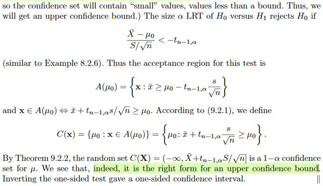</kbd>

> [!NOTE]
> Và quả thật là như vậy, với bài toán testing này, trong các ví dụ trước mình đã
> xây dựng ra cái size α LRT, có rule như sau:
>
>
>
> reject H0 nếu (Xbar - μ0) / (S/√n) < -tn-1,α 
>
>
>
> Do đó Rc, hay A(μ0) sẽ là {**x**: (xbar - μ0) / (s/√n) ≥ -tn-1,α}
>
>
>
> Dùng Theorem 9.2.2, ta tạo C(**x**) = {μ0: **x** ∈A(μ0)} 
>
>
>
> = {μ: **x** ∈ A(μ)} (μ hay μ0 chỉ là dummies variable)
>
>
>
> Mà **x** ∈ A(μ0) ⇔ (xbar - μ0) / (s/√n) ≥ -tn-1,α
>
>
>
> hay **x** ∈ A(μ) ⇔ (xbar - μ) / (s/√n) ≥ -tn-1,α
>
>
>
> = {μ: (xbar - μ) / (s/√n) ≥ -tn-1,α}
>
>
>
> = {μ: (xbar - μ)  ≥ -(tn-1,α)(s/√n)}
>
>
>
> = {μ: (xbar + (tn-1,α)(s/√n)  ≥ μ}
>
>
>
> = {μ: μ ≤ (xbar + (tn-1,α)(s/√n)}
>
>
>
> Và Theorem 9.2.2 nói rằng C(**X**) chính là một 1-α confidence set
>
>
>
> C(**X**) = {μ: μ ≤ (Xbar + (tn-1,α)(S/√n)}
>
>
>
> Và quan trọng là ta thấy nó có dạng (-inf, U(**X**)] với U(**X**) = (Xbar + (tn-1,α)(S/√n)

 

- **Chặn dưới p nhị thức**

<kbd>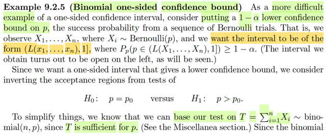</kbd>

> [!NOTE]
> Tiếp theo sẽ là môt ví dụ khó hơn trong việc xây dựng một one-sided 
> confidence interval, cùng nhau tìm hiểu:
>
>
>
> Đầu tiên, bài toán đặt ra là ta muốn xây dựng một lower confidence bound 
> chặn dưới) của p, tham số của một Binomial(n,p) population, và ta muốn
> confidence coefficient là 1-α.
>
>
>
> Vài thứ có thể ôn lại: Nhờ Stat110 cũng như trong sách này, mình đã biết
> story của Binomial(n,p) rv là số trial success trong n iid Bern(p) trials.
> Và định nghĩa của 1-α confidence set là confidence set (hay còn gọi là 
> interval estimator nếu như không gian tham số là trục số thực) có xác 
> xuất chứa θ luôn từ 1-α trở lên dù chưa biết θ bằng bao nhiêu:
>
>
>
> 1-α = inf_θ P_θ(θ ∈ C(**X**)), ⇨ 1-α ≤ P_θ(θ ∈ C(**X**))
>
>
>
> ở đây ta muốn tìm lower confidence bound, nên C(**X**) có dạng [L(**X**), inf) 
> và θ ở đây là p, có Θ chỉ là [0,1]:
>
>
>
> → 1-α ≤ P_p(p ∈ [L(**X**), 1))
>
>
>
> Thế thì, gs nói, ta sẽ xây dựng cái C(**X**) nói trên bằng cách invert cái test
> của bài toán one-side test: H0: p = p0 vs H1: p > p0.

 

- **Thống kê đủ và kiểm định UMP**

<kbd>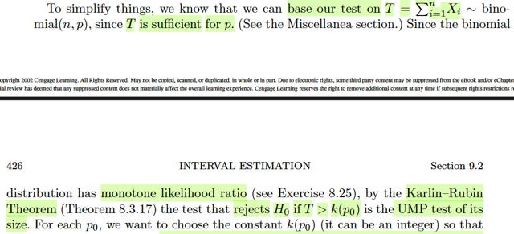</kbd>

> [!NOTE]
> Rồi, tiếp. gs cho biết để đơn giản hóa, ta sẽ based cái test trên T = ΣiXi thay vì
> **X**, bởi vì T là sufficient statistic của p. Là sao nhỉ?
>
>
>
> → Có nghĩa là ta sẽ dùng test statistic là T(**X**) = ΣiXi. Cái này thì chưa cần
> liên quan gì đến tính đủ của T. Vì mình còn nhớ, cái statistic nào cũng có thể
> dùng làm test statistic cả. Tuy nhiên, tính đủ của T(**X**) sẽ phát huy tác dụng
> chốc nữa.
>
>
>
> Việc T là sufficient statistic của p, ta sẽ chứng minh sau. Có thể là bằng cách
> dùng Factorization theorem, chứng minh pdf/pmf của X có thể được tách thành
> dạng g(T(**X**)|p)h(**X**).
>
>
>
> Tiếp, gs nói ta sẽ dựa vào sự thật là binomial có tính MRT: monotone likelihood
> ratio nên theo **Karlin-Rubin** Theorem, cái test có rule: reject H0 nếu T >
> k(p0) sẽ là một UMP test. Và k(p0) là constant được chọn (cho cái test của bài
> toán H0:p=p0) sao cho test có level α.
>
>
>
> Chỗ này là sao:
>
>
>
> Thật ra chỗ này nên dựa vào **Neyman-Pearson** theorem:
>
>
>
> Vì trong theorem đó, nói rằng, xét bài toán test giữa H0: θ = θ0 vs H1: θ = θ1
> (θ0 < θ1), nếu ta có cái test có rule: reject H0 khi f(**x**|θ0)/f(**x**|θ1) > k for
> some k thì nó chính là UMP test trong đám test có level = size của test đó.
>
>
>
> Sau đó, nếu ta có sufficient statistic T(**X**). mà pdf/pmf family của nó {g(t|θ)}
> lại có tính monotone likelihood ratio (MLR) thì sẽ dẫn đến:
>
>
>
> Xét cái tule của cái test  (mà N-P nói rằng nó là UMP trong đám có level = size
> của nó)
>
>
>
> f(**x**|θ0)/f(**x**|θ1) > k for some k (i)
>
>
>
> ⇔ g(t|θ1)h(**x**)/g(t|θ0)h(**x**) > k | do T sufficient, dùng Factorization theorem
>
>
>
> ⇔ g(t|θ1)/g(t|θ0) > k
>
>
>
> ⇔ Likelihood Ratio (t) > k
>
>
>
> ⇔ t > t0 (do Likelihood Ratio (.) monotone), for some t0
>
>
>
> Kết luận: vì N-P nói cái test có rule (i) là UMP của đám test có level = size của
> nó
>
>
>
> mà rule này thì tương đương rule (ii)
>
>
>
> mà cái test ko có gì khác ngoài bản chất chỉ là cái rule
>
>
>
> nên kết luận cái test có rule T > t0 là UMP của đám test có level = size của nó,
>
>
>
> tức là nó là UMP level α = sup_θ ∈ {θ0} P_θ(reject H0) = P_θ0(T > t0) (thật ra
> cái test dựa theo x hay dưa theo T thì cái size như nhau thôi, vì:
>
>
>
> P_θ0(T > t0) = P_θ0(Likelihood Ratio (t) > k) = P_θ0(f(**x**|θ1)/f(**x**|θ0) > k)
>
>
>
> Như vậy, trong bài toán test H0: θ = θ0 vs H1: θ1 (θ1 > θ0) thì test có rule
> reject H0 khi T > t0 là UMP level α = P_θ0(T > t0)
>
>
>
> **NHƯNG CÁI TEST RULE NÀY LẠI KHÔNG PHỤ THUỘC θ1. NÊN DÙ θ1
> BẰNG BAO NHIÊU TRONG (θ0, inf) THÌ TEST T VẪN LÀ UMP LEVEL α CỦA
> BÀI TOÁN H0: θ = θ0 vs H1: θ1**
>
>
>
> Mà xét khái niệm UMP test của class C, theo định nghĩa, β của nó sẽ luôn hơn
> hoặc bằng β  của mọi test khác trong class, tại mọi θ ∈ Θ0c.
>
>
>
> Nên việc test T là UMP level α của mọi bài toán H0: θ = θ0 vs H1: θ1 với θ1
> khác nhau ∈ (θ0, inf) có nghĩa là:
>
>
>
> ∀ θ1 ∈ (θ0, inf), β(θ1) ≥ β'(θ1)
>
>
>
> với β' là test bất kì thuộc level α test của bài toán H0: θ = θ0 vs H1: θ1, tức tập
> các test có:
>
>
>
> {test: sup_θ ∈ Θ0={θ0} P_θ(reject H0) = P_θ0(reject H0) ≤ α}
>
>
>
> Cái tập này ko phụ thuộc θ1, nên dù θ1 bằng bao nhiêu ta cũng có cùng một
> tập.
>
>
>
> Bây giờ, nếu xét bài toán H0: θ = θ0 vs H1: θ0 < θ thì cái tập level α test của
> bài toán này  sẽ là: {test: P_θ0(reject H0) ≤ α}, cũng chính là tập các test trên.
> Và trong cái tập này, thì thằng test T luôn có β mạnh hơn các thằng khác tại
> mọi θ ∈ (θ0, inf).
>
>
>
> Do đó theo định nghĩa test T là UMP level α của bài toán H0: θ = θ0 vs H1: θ0
> < θ với α = size của test T = P_θ0(T > t0)
>
>
>
> Đây là giải thích cho câu nói của gs: cái test reject H0 nếu T > k(p0) là UMP
> test of its size (t0 ở đây có thể hiểu là k(p0), nó là cái threshold nào đó giúp
> test T có size mong muốn thôi)

**🔗 See also:** [Kiểm định UMP bằng MLR](#node-r9it3lg)

 

- **Ngưỡng k(p0) kiểm định mức alpha**

<kbd>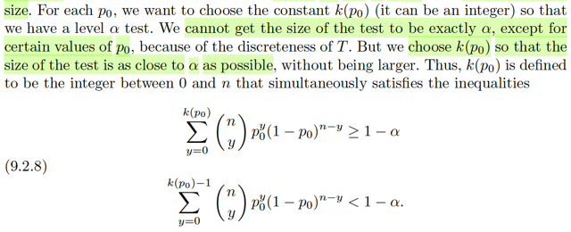</kbd>

> [!NOTE]
> Tiếp theo ta sẽ nói tiếp về k(p0), là cái ngưỡng nào đó giúp test T có level 
> nào đó mong muốn.
>
>
>
> Nhớ lại, test có level α là test có sup_θ∈Θ0 P_θ(reject H0) ≤ α 
>
>
>
> nên ở đây nếu ta muốn test T có level α, tức là:
>
>
>
> sup_θ∈Θ0={θ0} P_θ(reject H0) ≤ α 
>
>
>
> ⇔ P_θ0(reject H0) ≤ α
>
>
>
> ⇔ P_θ0(T > k(p0)) ≤ α 
>
>
>
> Rồi, mình cũng nhớ, trong những level α test, thì để có cái có β lớn
> nhất, ta sẽ lấy cái test có size = α. Mang ý nghĩa, việc cũng là level α giúp
> xác xuất mắc lỗi loại I không lớn hơn α, và việc có β lớn nhất, giúp khi H0
> nên được reject thì test sẽ làm tốt nhất trong việc reject H0.
>
>
>
> Nên ta sẽ muốn:
>
>
>
> P_θ0(T > k(p0)) = α 
>
>
>
> Tuy nhiên, vấn đề là ở đây T là binomial, một discrete random variable.
> Nên xác suất của event T > k(p0) bằng y chóc a là rất khó xảy ra trừ một 
> vài giá trị a cụ thể nào đó. Vì sao? Vì xác suất này là tổng khối lượng xác
> suất (pmf) tại các điểm từ k(p0) trở lên n (range của T là 0,1,2....n), và do
> đó nó là hàm bậc thang. Và để hàm bậc thang bằng đúng α thì chỉ có vài
> α là phù hợp thôi.
>
>
>
> Như vậy, không thể / khó có thể có k(p0) giúp equation thỏa, để có size α 
> test. Do đó, ta phải chấp nhận một level α test với size < α. Vậy phải tìm
> cái con số nguyên (trong range của T) sao cho tại đó xác suất trên vẫn < α 
> nhưng nhích thêm một, thì thành ra > α (tức là ta cần tìm cái ngưỡng nhỏ nhất)
> Cho nên điều kiện tìm k(p0) mới thành ra hai bất phương trình:
>
>
>
> P_θ0(T > k(p0)) ≤ α
>
>
>
> P_θ0(T > k(p0) - 1) > α
>
>
>
> (bất phương trình sau lại có dạng như vậy, là vì như đã nói, xác suất này là
> tổng pmf tại các điểm bên phải mốc k(p0), cho đến t = n, nên nếu nhích qua 
> phải thì xác suất sẽ giảm, nhích qua trái (tức -1) thì nó sẽ tăng)
>
>
>
> ⇔ 1 - P_θ0(T ≤ k(p0)) ≤ α
>
>
>
> và 1- P_θ0(T ≤ k(p0) - 1) > α
>
>
>
> ⇔ 1 - α ≤ P_θ0(T ≤ k(p0)) 
>
>
>
> và 1 - α > P_θ0(T ≤ k(p0) - 1) 
>
>
>
> T, hay T(**X**) = ΣiXi, với Xi là iid Bern(p), T(**X**) chính là Binomial(n,p)
>
>
>
> .. ⇔ Σt=0:k(p0) (n choose t)p0^t(1-p0)^(n-t) ≥ 1 - α
>
>
>
> và Σt=0:k(p0)-1 (n choose t)p0^t(1-p0)^(n-t) < 1 - α
>
>
>
> Đây chính là 9.2.8

 

- **Khoảng Tin Cậy qua Đảo Kiểm Định**

<kbd>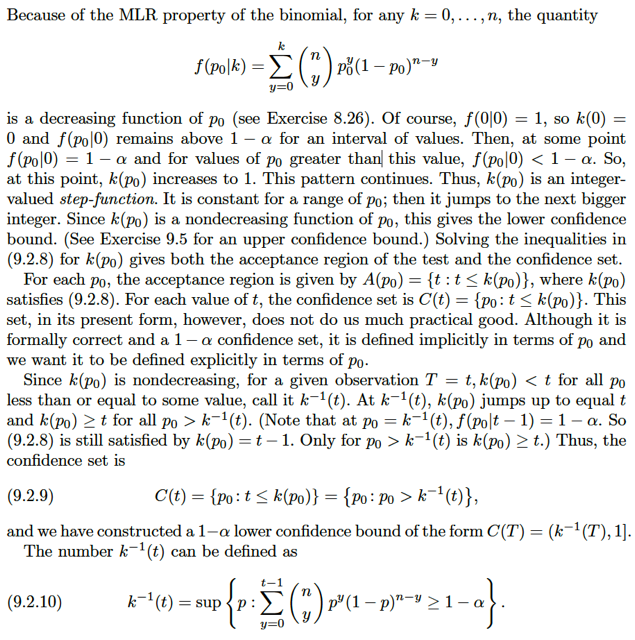</kbd>

<kbd>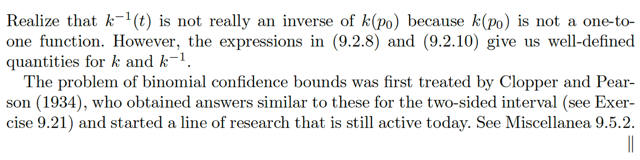</kbd>

> [!NOTE]
> hôm qua đến giờ đang ráng hiểu các đoạn rời rạc của bức tranh, chỉ nhớ là ta
> đang đi tìm CI bằng cách invert một test.
>
>
>
> Vậy thì nhìn lại, ban đầu ta đã kiểu như giải thích lại, chứng minh lại để hiểu vì
> sao tác giả nói là cái test dựa trên T: reject H0: p = p0 khi T > k(p0),  là một UMP
> test trong đám test có level = size của test T = P_p0(T > k(p0))
>
>
>
> Sau đó, ta đã phân tích nếu k(p0) thỏa mãn hai bất đẳng thức này, thì ta sẽ có
> một level α test.
>
>
>
> Vậy thì ở đây mình nên ôn lại Theorem Tautology: Mà ý i) của nó nói rằng, nếu
> ta có một level α test của bài toán testing: H0: θ = θ0, và thể hiện bởi
> acceptance của nó, đặt là A(θ0) (acceptance của bài toán testing H0: θ = θ0), thì
> bằng cách dựng hàm tập C(x), nhận vô x ∈ range X, trả ra tập chứa các θ0 ∈ Θ
> sao cho A(θ0) chứa x: C(x) = {θ0: x ∈ A(θ0)} = {θ: x ∈ A(θ)}  thì khi đó C(X) chính
> là confidence set có coefficient 1-α.
>
>
>
> Vậy câu hỏi nên là acceptance A(θ0), hay A(p0) của level α test (test T) là gì:
>
>
>
> → Dĩ nhiên là complement của R = {t: t > k(p0)}, tức {t: t ≤ k(p0)}
>
>
>
> Vậy, theo Theorem, ta mới tạo hàm tập c(t) = {p0 ∈ Θ: t ∈ A(p0)} thì C(T) sẽ là CI
> cần tìm.
>
>
>
> = {p0 ∈ Θ: t ≤ k(p0)}
>
>
>
> Mà k(p0) là hàm bậc thang non-decreasing (mình sẽ quay lại ý này)
>
>
>
> nên với fixed t, thì để có các thằng p0 mà k(p0) > t thì nhất định tương đương p0
> phải từ một cái mốc nào đó trở lên, gọi nó là u, và cái này sẽ phụ thuộc t, ta kí
> hiệu u(t)
>
>
>
> Vậy thì ta sẽ có C(t) = {p0: u(t) < p0 ≤ 1} là tập chứa các p0 ∈ Θ sao cho A(p0)
> chứa t.
>
>
>
> Nên kết luận C(T) = (U(T), 1] là confidence set cần tìm.
>
>
>
> ------
>
>
>
> Dĩ nhiên ta sẽ đi tìm u(t) là cái gì:
>
>
>
> Nhắc lại, nó là cái mốc của p0 mà từ đó trở đi k(p0) >= t
>
>
>
> Mà k(p0) lại là cái thỏa hai bất phương trình:
>
>
>
> 1 - α ≤ P_p0(T ≤ k(p0))
>
>
>
> và 1 - α > P_p0(T ≤ k(p0) - 1)
>
>
>
> -------
>
>
>
> Đến đây mình phải tìm hiểu hàm k(p0):
>
>
>
> nó là hàm mà với input p0, output của nó sẽ là cái ngưỡng giúp test T có level α.
>
>
>
> Vậy thì mình sẽ xem vì sao gs nói nó là hàm tăng, và có dạng bậc thang (giống
> như cdf  của biến rời rạc vậy)
>
>
>
> Vậy cùng phân tích hành vi của k(p0):
>
>
>
> dĩ nhiên p0, là biến đầu vào, sẽ chạy từ 0 → 1. và chú ý, p0, là giá trị liên tục
> trong khoảng [0,1], vì nó là xác suất thành công của Bern trial mà)
>
>
>
> khi p0 nhỏ, tức xác suất Bern trial ra success nhỏ → giá trị quan sát của T ~
> binomial(n, p0) cũng sẽ có xu hướng nhỏ, cho nên với một 1-α cho trước mong
> muốn, thì để 1-α ≤ P_p0(T < k(p0)) thì thì ta sẽ cần ngưỡng k(p0) thấp thôi, ví
> bản chất là số trial có xác suất thành công thấp thì xác suất mà tổng số trial
> thành công ở dưới một ngưỡng nhỏ cũng sẽ cao đủ yêu cầu.
>
>
>
> Giả sử tại p0 = p0_1, ta có ngưỡng k(p0_1).
>
>
>
> sau đó tăng dần p0 lên một mức α nào đó, để có p0_2 và với giá trị này xác suất
> Bern trial thành công cao hơn → T có xu hướng lớn hơn → xác suất T nhỏ hơn
> một ngưỡng nhỏ (k(p0_1)) đã nhỏ đi →  và giả sử nó đã không còn lớn hơn 1-α
> nữa: 1-α > P_p0_2(T < k(p0_1)) dẫn đến cái ngưỡng cũ k(p0_1) không còn thỏa
> yêu cầu của hai inequalities (giúp test có level α) nữa. Do đó, ta sẽ phải TĂNG
> ngưỡng lên, vì khi đó sẽ giúp xác suất T (vốn đang lớn lên) nhỏ hơn cái ngưỡng
> mới (to hơn), sẽ nhỏ lại, giúp thỏa 1-α < P_p0_2(T < k(p0_2)).
>
>
>
> Và tương tự như vậy, cứ tăng p0, thì để cái ngưỡng k(p0) vẫn thỏa hai
> inequalities thì nó sẽ phải tăng theo. → Giúp kết luận hàm k(p0) là hàm
> NON-DECREASING.
>
>
>
> Còn vì sao k(p0) cũng có dạng bậc thang?
>
>
>
> Là vì hãy nhìn: 1-α > P_p0_2(T < k(p0_1)), 1-α < P_p0_2(T < k(p0_2))
>
>
>
> mà hàm P_p0(T < k(p0)) là hàm bậc thang nên để giá trị của nó thay đổi, thì k
> phải tăng hay giảm một khoảng nào đó chứ không phải chỉ nhích một chút là
> hàm P thay đổi.
>
>
>
> Như vậy, giả sử tại k1 không đạt và k2 đạt thì giữa chúng phải là một bước
> nhảy. Ta sẽ tìm hiểu liên hệ của bước  nhảy này với xác suất của T:
>
>
>
> (cũng trong câu chuyện cho p0 tăng từ p0_1 → p0_2 khiến ngưỡng k phải tăng
> theo)
>
>
>
> gọi P1 là giá trị của f(k1) = P_p0_2(T < k1), mà 1-α > P1 (lúc này ngưỡng k vẫn
> giữ k1 = k(p0_1), khiến không đạt, phải tăng lên để đạt, tức thỏa 2 inequalities)
>
>
>
> và P2 là gía trị của f(k2) = P_p0_2(T < k2) mà 1-α < P2
>
>
>
> Có nghĩa là ta đang đặt hàm f(k) = P_p0_2(T < k)
>
>
>
> Như vậy P2 - P1 = f(k2) - f(k1) = P_p0_2(T < k2) - P_p0_2(T < k1)
>
>
>
> mà P_p0_2(T < k) là cdf, mang ý nghĩa phần diện tích đồ thị hàm pmf/cdf bên
> trái ngưỡng đang xét.
>
>
>
> nên cái ta có ở đâu chín là phần diện tích của pdf trong khoãng giữa hai mốc k1,
> k2. hoặc với pmf thì nó là tổng probability mass function tại cái điểm nằm giữa
> hai mốc này.
>
>
>
> Σk1≤k là số nguyên <k2 P_p0_2(T=k)
>
>
>
> Và giả sử tại k1 = 4 không đạt, thì phải tăng lên thì k2 sẽ là bao nhiêu: Câu trả
> lời k2 chính là 5, vì k1 là cái ngưỡng mà thỏa hai inequalities:
>
>
>
> 1-α < P_p0_1(T < k1)
>
>
>
> Sau đó p tăng lên MỘT CÁCH LIÊN TỤC từ p0_1 dần thì xác suất P_p(T < k1)
> giảm dần MỘT CÁCH LIÊN TỤC. Có nghĩa là từ từ nó sẽ vượt qua để rồi rớt
> xuống cái mốc 1-α.
>
>
>
> Lúc này, ta sẽ cần tăng k, mà bước tăng k sẽ tạo một bước tăng của hàm P có
> độ lớn bằng giá trị của cái tổng pmf của T tại một điểm nào đó. Nhưng  vì chỉ
> cần sự tăng của P nhích lên thêm 1 nấc là đã đủ để kéo P lên cao hơn 1-α rồi.
> Do đó khoảng tăng Δk chỉ cần để để nhích cái hàm P sao cho nó gặm  thêm một
> cục pmf nữa là được. Do đó, k2=k1+1.
>
>
>
> Một lưu ý nữa, k tuy ko cần phải là số nguyên nhưng để cho dễ ta cứ dùng số
> nguyên vì P(T < 3.5) thì cũng không khác gì P(T < 4) vì T là biến rời rạc mang
> giá trị nguyên.
>
>
>
> Do đó, một bức tranh mô tả hành vi của hàm k(p0) có thể hình dung như sau:
>
>
>
> p0 tăng liên tục từ 0 → 1
>
>
>
> Gọi p01 là điểm mà:
>
>
>
> từ 0 → p01 nhỏ, khiến T xu hướng nhỏ, nên chỉ cần ngưỡng k nhỏ = 1 thì đã đủ
> làm cho 1-α < P_p01(T ≤ 1) → k(p0) = 1. Và tại đây, P_p01(T ≤ 1) vẫn lớn hơn
> 1-α nhưn nó đã sát mép rồi.
>
>
>
> Từ p01 tăng lên ε nhỏ tí, P_p0(T ≤ 1) giảm khoảng δ cũng nhỏ tí nhưng đủ khiến
> P_p01(T ≤ 1) đã thấp hơn 1-α. Lúc này phải tăng k lên.
>
>
>
> thì như đã nói ở trên, chỉ cần tăng thêm 1 thành 2 là đã đủ để P_p0(T ≤ 2)
> ngoạm thêm một cục pmf: P_p0(T=2) mang giá trị dương và chắc chắn dư sức
> để bù cái khoảng δ giúp lúc này P_p0(T ≤ 2) đã cao hẳn bên trên lên mốc 1-α.
>
>
>
> tiếp tục p0 tăng lên, P_p0(T<2) giảm dần liên tục
>
>
>
> thì gọi p02 là đoạn mà từ p01+ε → p02 thì P_p0(T ≤ 2) vẫn > 1-α nhưng tại p02
> thì P_p0(T ≤ 2) đã sát mép 1-α rồi
>
>
>
> câu chuyện lặp lại, tăng p0 lên một khoảng nhỏ thành p02 + ε, khiến P_p0(T ≤ 2)
> đã lủng mép 1-α, yêu cầu phải tăng k. Và y như lúc trước, k chỉ cần tăng lên 3
> để P_p0(T < k) ngoạm thêm một cục pmf P(T = 3) nữa là đủ để kéo lên lại cao
> hơn 1-α.
>
>
>
> Cứ thế tiếp tục như vậy, giúp ta thấy hành vi của hàm k(p0): Nó sẽ tăng từng
> bậc  có bước nhảy bằng 1, nói cách khác khi p0 chạy từ 0 đến 1 thì k sẽ giật lên
> 1 → 2 → 3,...→ n
>
>
>
> Với ý nghĩa hàm k(p0), thì ví dụ k(p0*),tức k(p0)|p0=p0* = 3 có nghĩa là 3 là cái
> ngưỡng khiến khi p0 chạy từ 0 → p0=p0* thì P_p0(T < 3) ≥ 1-α
>
>
>
> Do đó p0* = giá trị p0 lớn nhất mà tại đó P_p0(T < 3) ≥ 1-α
>
>
>
> và ta thể hiện theo toán học như sau:
>
>
>
> p0* thỏa k(p0*)= 3 chính là sup_p0 {P_p0(T < 3) ≥ 1-α }
>
>
>
> suy ra:
>
>
>
> p0* thỏa k(p0*) = t chính là sup_p0 {P_p0(T < t) ≥ 1-α}
>
>
>
> ráp pmf của binomial vô:
>
>
>
> p0* thỏa k(p0*) = t chính là sup_p0 {Σi=0:t-1 (n choose y) p0^y(1-p0)^n-y ≥ 1-α}
>
>
>
> Và đây chính là kinv(t) công thức 9.2.10.
>
>
>
> Thật ra ta nói u(t) là cái mốc của p0 mà từ đó trở đi k(p0) ≥ t, nhưng với k là số
> nguyên thì cái mốc này cũng là cái mà k(p0) = t.
>
>
>
> Và như vậy 1-α Confidence Set của bài toán này là:
>
>
>
> (sup_p0 {Σi=0:T-1 (n choose y) p0^y(1-p0)^n-y ≥ 1-α}, 1]

 

- **Khái niệm xác suất bao phủ**

<kbd>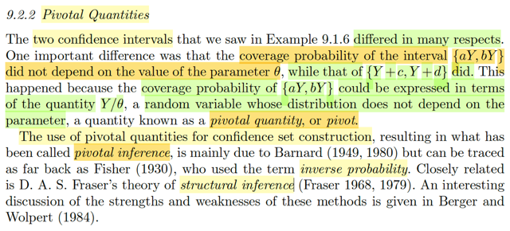</kbd>

> [!NOTE]
> Qua phần này, trước tiên ôn lại một chút các khái niệm để hiểu coverage
> probability là gì?
>
>
>
> Ta còn nhớ, bài toán interval estimation, là tên khái quát hơn nên là set
> estimation bài toán mà ta sẽ tìm cách xây dựng một set C(**X**) để khi khi
> nhận giá trị quan sát **X** = **x**, thì inference của ta, nhận định của ta là
> (nói rằng) θ nằm trong C(**X**) này. Và **coverage probability** của một
> confidence set / interval estimator là một hàm theo θ, define bởi P_θ(θ ∈
> C(**X**)). Từ đó nếu ta lấy inf_θ P_θ(θ ∈ C(**X**)) thì sẽ được confidence
> coefficient. Khi parameter space Θ là trục số thực, thì confidence set
> C(**X**) sẽ là một interval có dạng [L(**X**), U(**X**)]
>
>
>
> Bản thân C(**X**) nên hay là một random set, [L(**X**), U(**X**)] là random
> interval nên bài toán interval estimator cơ bản là đi xây dựng một random
> set hay random interval, nên đi interval estimator có bản chất là một
> random interval, cũng y như một point estimator có bản chất cũng chỉ là
> một random variable / statistic thôi.
>
>
>
> Vậy thì ở đây gs nhắc lại hồi ví dụ 9.1.6, ta xét hai ví dụ của interval
> estimator trong đó một cái cho ra kết quả là coverage probability của
> interval estimator không phụ thuộc θ, một cái thì có phụ thuộc.
>
>
>
> Và lí do là, cái coverage probability không phụ thuộc θ là vì nó  P_θ(θ ∈
> [L(**X**), U(**X**)] (xác suất của một event liên quan đến hai rvs là L(**X**),
> U(**X**), lại có thể được thể hiện bởi xác suất của một event liên quan đến
> một rv khác, nhưng rv này **LẠI CÓ PHÂN PHỐI KHÔNG PHỤ THUỘC θ**,
> dẫn đến xác suất của event này không còn phụ thuộc θ luôn.
>
>
>
> Cụ thể là, trong ví dụ 9.1.6, probability coverage (cái mà ko phụ thuộc θ)
>
>
>
> là P_θ(θ ∈ [aY, bY]) (đây là P_θ(θ ∈ [L(**X**), U(**X**)] thông thường) với
> L(**X**) = a max {Xi}
>
>
>
> U(**X**) = b max {Xi}
>
>
>
> nhưng sau đó chuyển thành
>
>
>
> P_θ(Y/θ ∈ [a, b]) (thì đây chính là xác suất của event liên quan đến rv Y/θ,
> hay max {Xi} / θ  và distribution của nó lại không còn phụ thuộc θ khiến xác
> suất này cũng không còn  phụ thuộc θ nữa.
>
>
>
> Và người ta gọi random variable (đóng vai trò tạo thành random interval
> [L(**X**), U(**X**)]) mà có tính chất như trên là **PIVOTAL QUANTITY**. Và cái
> nhánh đi xây dựng một confidence set dùng pivotal quantity được gọi là
> **PIVOTAL INFERENCE**

 

- **Định nghĩa đại lượng then chốt**

<kbd>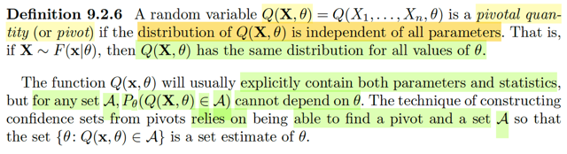</kbd>

> [!NOTE]
> Nhờ hiểu như note vừa rồi nên ta hiểu cái định nghĩa chính thức của pivotal
> quantity: Đại khái là, nó là một random variable có được khi áp một cái hàm
> có dính đến θ lên random sample **X:** Q(**X**, θ) nhưng distribution của nó
> không còn phụ thuộc θ
>
>
>
> Ta đã luôn nhắc đi nhắc lại  rằng khi apply một function lên random variable
> thì ta sẽ được một random variable, nên nó sẽ có distribution. Và nếu áp một
> function lên sample **X** - một vector các random variable thì ta sẽ có
> random variable gọi là statistic
>
>
>
> Nhưng statistic thì phải chỉ là function of random sample thôi, g(**X**), nên
> Q(**X**, θ) k**hông phải là statistic** mà là **function của cả statistic và
> parameter**. Nhưng nó vẫn là một random variable, và do đó có distribution,
> để rồi đặt ra yêu cầu là distribution không dính tới θ.
>
>
>
> Còn cái câu nếu **X** ~ F(**x**|θ) thì Q(**X**, θ) có cùng distribution với mọi θ
> thì chính là nói distribution của Q(**X**, θ) ko phụ thuộc θ đó.
>
>
>
> Và vì vậy đương nhiên xác suất của event P_θ(Q(**X**, θ) ∈ tập A bất kì sẽ
> không phụ thuộc θ (tại phân phối xủa Q còn dính tới θ nữa đâu). Kí hiệu thì
> vẫn ghi P_θ bởi khi  ghi một cách khái quát thì Q(**X**, θ) vẫn dính tới θ do θ
> là input của Q(.) và bản thân thằng **X** cũng có phân phối phụ thuộc θ.
> nhưng phải hiểu là **với việc Q là pivotal thì kết quả này nhất định không còn
> dính tới θ**.
>
>
>
> Cuối cùng, gs nói, thách thức của việc xây dựng interval estimator từ pivotal
> quantity bây giờ trở thành:
>
>
>
> làm sao tìm được Q(**x**, θ)
>
>
>
> thì sau đó với A bất kì, ta đặt tập C(**X**) = {θ: Q(**X**,θ) ∈ A}
>
>
>
> vì định nghĩa, θ ∈ C(**x**) ⇔ Q(**x**, θ) ∈ A
>
>
>
> thì P_θ(θ ∈ C(**X**) = {θ: Q(**X**,θ) ∈ A} ) (tức probability coverage của
> C(**X**))
>
>
>
> = P_θ(Q(**X**, θ) ∈ A) , và cái này không phụ thuộc θ
>
>
>
> Do đó C(**X**) sẽ là một **interval mà có probability coverage không phụ
> thuộc θ nữa**

 

- **Đại lượng then chốt và họ phân phối**

<kbd>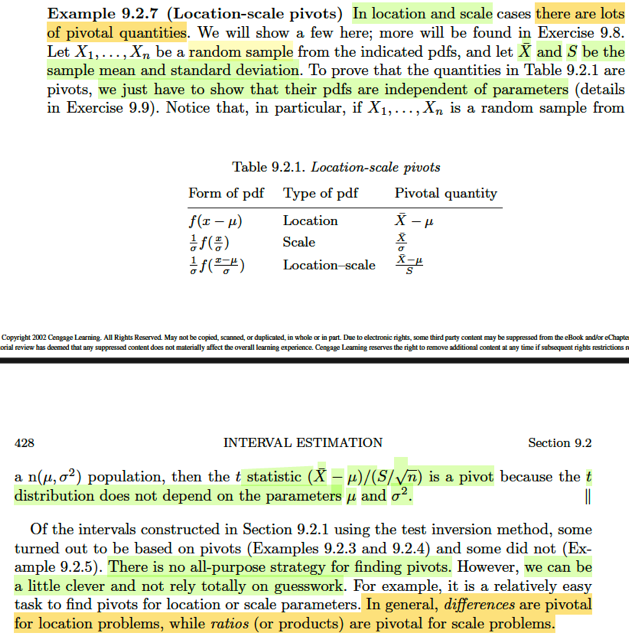</kbd>

> [!NOTE]
> Ôn lại chút xíu về khái niệm pivotal quantities đã học hôm qua:
>
>
>
> Đại khái là khi ta có một confidence set (hay interval estimator) mà  có
> thể được thể hiện bởi một quantity có dạng Q(**X**, θ), và cái này thì lại
> có distribution không phụ thuộc θ, dẫn đến là khi đó, xác suất của event
> θ ∈ C(**X**), tức coverage proabability P_θ(θ ∈ C(**X**)) có thể được thấy như 
> xác suất của một event liên quan đến rv Q, và vì distribution của Q không 
> phụ thuộc θ nên P_θ(θ ∈ C(**X**)) cũng không phụ thuộc θ luôn. Thì Q được 
> gọi là pivotal quantity.
>
>
>
> Ở đây có vài ví dụ về pivotal quantities, tác giả nói để chứng minh nó là
> pivotal thì chỉ cần chứng minh pdf/pmf của chúng ko phụ thuộc θ.
>
>
>
> ví dụ với location family f(x - μ), vì sao Xbar - μ là pivotal quantity?
>
>
>
> Ta còn nhớ, một định lí của location family, nếu X ~ fX là thành viên với
> location μ thì Z = X - μ sẽ là thành viên với location 0 (standard member)
>
>
>
> Vậy thì ở đây Xbar - μ = ΣiXi/n - μ = (ΣiXi - nμ)/n = Σi(Xi - μ) / n
>
>
>
> = Σi Zi/n với Zi = Xi - μ, Như trên vừa nhắc lại, ta có Xi ~ thành viên của
> location family có location μ thì Zi có location 0 (đồng nghĩa là pdf sẽ 
> không còn phụ thuộc μ), nên đương nhiên Σi Zi / n cũng vậy. → Xbar - μ
> có distribution không còn phụ thuộc μ 
>
>
>
> Tương tự, Xbar / σ = ΣiXi / nσ = Σi(Xi/σ)/n.
>
>
>
> với Xi ~ scale family có scale factor σ thì Xi / σ là member có scale 1, đồng
> nghĩa distribution không phụ thuộc σ 
>
>
>
> ⇨ (1/n) Σi(Xi/σ) cũng sẽ có distribution không còn phụ thuộc σ
>
>
>
> Hoàn toàn tương tự với location - scale family
>
>
>
> Cuối cùng, ta cũng đã biết cái vụ nếu Xi ~ normal(μ, σ^2) thì Xbar sẽ có
> distribution normal(μ, σ^2/n), và (Xbar - μ) / (S/√n) ~ tn-1, hoàn toàn chỉ
> phụ thuộc n không phụ thuộc μ hay σ nữa.
>
>
>
> Cuối cùng, gs nói không có chiến lược nào đảm bảo sẽ luôn giúp  tìm được
> interval chỉ dựa trên pivotal quantities nhưng nói chung là ta có thể nhớ là
> với location family thì dùng difference, với scale family thì dùng ratios

 

- **Đại lượng chốt phân phối mũ**

<kbd>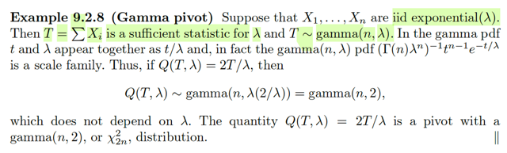</kbd>

> [!NOTE]
> Một ví dụ, nếu X1,...Xn iid ~ expo(λ) thì T = ΣiXi là sufficient statistic của λ
> (cái này trong phần trước đã làm). Và T ~ gamma(n, λ), và nó là một thành
> viên của scale family với scale = λ. Do đó T/λ sẽ là một thành viên của family
> có scale = 1 → 2T/λ là thành viên có scale = 2, tức gamma(n, 2)
>
>
>
> (hay α T / λ với α constant sẽ là thành viên có scale α, γ(n, α) → distribution
> của nó không còn phụ thuộc λ nữa
>
>
>
> Như vậy Q(T, λ) = 2T/λ (hay αT/λ) sẽ là pivotal quantities.
>
>
>
> Riêng 2T/λ thì nó cũng chính là chi-square 2n bậc tự do: X^2_2n

 

- **Pivot từ công thức PDF**

<kbd>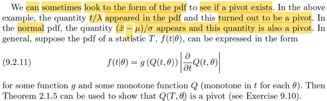</kbd>

> [!NOTE]
> Đoạn này gs cho biết đại khái là đôi khi ta còn có thể nhìn vào công thức pdf
> để mà nghĩ đến cái nào là pivot.
>
>
>
> Lấy ví dụ như trong công thức pdf của T ~ expo(λ), ta sẽ thấy nó có dính
> đến t/λ, và hóa ra T/λ là pivot thật (đương nhiên dẫn tới αT/λ cũng vậy) Hoặc
> như trong pdf của normal. ta thấy có (xbar - μ)/σ để rồi quả thật Xbar - μ / σ
> cũng là pivot. Làm rõ chỗ này chút xíu:
>
>
>
> → Tức là gs đang nói đến pdf của Xbar, là một sufficient statistic của μ 
> mà ta đã biết nó sẽ có phân phối normal(μ, σ^2/n)
>
>
>
> → pdf fXbar(xbar) = (1/√2π(σ^2/n)) exp[-(xbar-μ)^2/2(σ^2/n)]
>
>
>
> = (1/√2π(σ^2/n)) exp[-(n/2)(xbar-μ)^2/σ^2]
>
>
>
> = (1/√2π(σ^2/n)) exp{-(n/2)[(xbar-μ)/σ]^2}
>
>
>
> ta sẽ thấy trong đó xuất hiện (xbar - μ) / σ và quả thật nó chính là pivol
>
>
>
> và với Xi ~normal(μ, σ^2). nó là một thành viên của location scale family ứng
> với location μ, scale σ → Xi - μ / σ là thành viên chuẩn (scale 1, location 0),
> cũng  chính là standard normal (normal(0,1)) ⇨ Σi[(Xi - μ)/σ]/n chắc chắn là
> rv có distribution không còn dính tới μ, σ^2
>
>
>
> ====
>
>
>
> Và nói chung, gs nói giải sử ta có pdf của một statistic T f(t|θ) có thể được
> thể hiện ở dạng f(t|θ) = g(Q(t, θ)) |∂/∂t Q(t, θ)| với some function g và some
> monotone function Q thì theorem 2.1.5 có thể dùng để chỉ ra Q(T, θ) là pivot
> Thử chứng minh:
>
>
>
> Nhắc lại theorem transformation, nếu ta có fX là pdf của X, và Y = g(X) thì
> nếu g là mapping 1-1 giữa x và y: y = g(x) ⇔ x = ginv(y) thì ta sẽ có:
>
>
>
> fY(y) = fX(x) |d/dy x(y)| = fX(x) |d/dy ginv(y)|
>
>
>
> Giả thuyết cho fT(t|θ) có thể được express ở dạng:
>
>
>
> fT(t|θ) = g(Q(t,θ)) |∂/∂t Q(t, θ)|
>
>
>
> Ta sẽ đặt function dùng để tạo Q là h: Q = h(T, θ)
>
>
>
> → fT(t|θ) = g(h(t,θ)) |∂/∂t h(t, θ)|
>
>
>
> Vì Q, hay h là một hàm monotone theo t với mọi θ) thì tức là mapping 
> giữa t → q là 1-1: q = h(t, θ) ⇔ t = hinv(q, θ)
>
>
>
> khi đó, transformation theorem cho ta biết:
>
>
>
> fQ(q) = fT(t) |∂/∂q t(q)|
>
>
>
> = fT(hinv(q, θ)) |∂/∂q hinv(q, θ)|
>
>
>
> Thế mà nếu ta lại có fT(t|θ) có thể được express ở dạng:
>
>
>
> fT(t|θ) = g(h(t,θ)) |∂/∂t h(t, θ)|
>
>
>
> ⇨ fQ(q) = fT(t) |∂/∂q t(q, θ)| 
>
>
>
> = g(h(t,θ)) |∂/∂t h(t, θ)| |∂/∂q hinv(q, θ)|
>
>
>
> = g(q) |∂/∂t q| |∂/∂q t|
>
>
>
> = g(q) |∂q/∂t| |∂t/∂q|
>
>
>
> = g(q) |∂q/∂t . ∂t/∂q|
>
>
>
> = g(q). như vậy fQ(q) = g(q) **hoàn toàn không phụ thuộc θ** nữa.

 

- **Xây dựng tập tin cậy**

<kbd>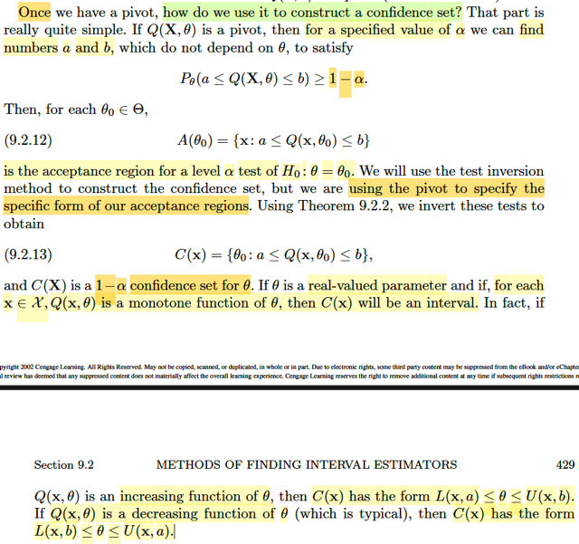</kbd>

> [!NOTE]
> Khi đã có pivot, câu hỏi là làm sao để xây dựng confidence set.
>
>
>
> Câu trả lời rất đơn giản:
>
>
>
> Đầu tiên ta sẽ tìm hai con số a, b sao cho P_θ(a ≤ Q(**X**, θ) ≤ b) ≥ 1 - α
>
>
>
> vì là pivot nên distribution của Q(**X**, θ) không phụ thuộc θ, và a, b không
> phụ thuộc θ thì cái xác suát này sẽ có kết quả không phụ thuộc θ.
>
>
>
> Và sau đó, với mỗi θ0 ∈ Θ thì tập A(θ0) = {**x**: a ≤ Q(**x**, θ0) ≤ b} sẽ là
> acceptance region của level α test of H0: θ = θ0. Là sao?
>
>
>
> → Thì bởi vì cái test accept H0 khi Q(**X**, θ0 thỏa ∈ [a,b] sẽ có:
>
>
>
> P_θ(reject H0) = 1 - P_θ(accept H0) = 1 - P_θ(Q(**X**, θ0) ∈ [a,b])
>
>
>
> mà P_θ(Q(**X**, θ0) ∈ [a,b]) ≥ 1-α ⇨ 1-P_θ(Q(**X**, θ0) ∈ [a,b]) ≤ α
>
>
>
> ⇨ P_θ(reject H0) ≤ α → test có acceptance region này là một level α test
>
>
>
> Và tới đây ta dùng Theorem Tautology: Ôn lại theorem này một chút, nó nói
> rằng: Giả sử ta có A(θ0 là một level α acceptance region của bài toán testing
> H0: θ = θ0, ta  có thể dùng nó để xây dựng một interval estimator /
> confidence set có confidence coefficient 1-α:
>
>
>
> Chuẩn bị hàm tập C(**x**): nhận vào **x**, trả ra tập các θ0 thỏa A(θ0) chứa
> **x**:
>
>
>
> C(**x**) = {θ0 ∈ Θ: x ∈ A(θ0)} hay (thay dummies variable θ) {θ ∈ Θ: **x** ∈
> A(θ)}
>
>
>
> Khi đó, C(**X**) (có thể hiểu như áp cái hàm c(**x**) lêm **X**), ta sẽ có một
> random set, và theorem này nói rằng, cái random set này chính là 1-α
> confidence set.
>
>
>
> Như vậy ở đây, ta sẽ có C(**x**) = {θ: **x** ∈ A(θ)} = {θ: a ≤ Q(**x**, θ) ≤ b}
>
>
>
> Và C(**X**) = {θ: a ≤ Q(**X**, θ) ≤ b} (hay {θ0: a ≤ Q(**X**, θ0) ≤ b} cũng
> được) chính là 1-α confidence set for θ.
>
>
>
> Dừng lại chút xíu để nhận định lại:
>
>
>
> A(θ0) = {**x**: a ≤ Q(**x**, θ0) ≤ b} là acceptance region level α của bài toán
> testing H0: θ = θ0.
>
>
>
> C(**x**) = {θ: a ≤ Q(**x**, θ) ≤ b} là confidence interval / interval estimator có
> confidence coefficient 1-α cho θ.
>
>
>
> Như vậy, cái sự tiện lợi của việc dùng pivotal quantity là, nếu nhìn dưới góc
> độ bài toán hypothesis testing, ta đang muốn tìm bằng chứng (**X**) để
> accept H0: θ = θ0 thì chỉ cần đợi **x** khiến Q(**x**, θ0) thuộc [a,b] với xác
> suất sai sót chỉ < α. Ngược lại, trong bài toán interval estimator, thì nếu quan
> sát được **X** = **x**, ta sẽ có thể có cái lưới {θ: a ≤ Q(**x**, θ) ≤ b} để đảm
> bảo θ nằm trong đó với độ tự tin 1-α .
>
>
>
> Và cái tập C(**X**) = {θ: a ≤ Q(X, θ) ≤ b}, trong trường hợp θ là real value,
> và nếu hàm Q monoton theo θ ở mọi **x** ∈ range **X** thì C(**X**) sẽ là một
> random interval.
>
>
>
> Để rồi nếu monotone increasing, thì ta có random interval có dạng [L(**X**,a)
> ≤ θ < U(**X**,b)] và ngược lại, ta sẽ có dạng [L(**X**,b) ≤ θ < L(**X**,a)]

 

- **Khoảng tin cậy λ phân phối mũ**

<kbd>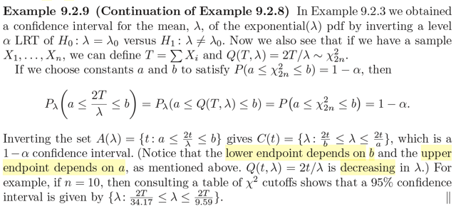</kbd>

> [!NOTE]
> Qua ví dụ này, tiếp nối của 9.2.8. Đại khái là gs nhắc lại trong ví dụ 9.2.3
> mình đã tìm được confidence interval cho mean λ của expo(λ) pdf bằng
> cách invert một LRT có level α của bài toán testing H0: λ = λ0 vs H1: λ ≠
> λ0.
>
>
>
> Trong ví dụ 9.2.8 ta đã thấy Q(**X**, λ) = c T / λ với T = ΣiXi, c là constant
> bất kì,  là một pivot (distribution của nó không phụ thuộc λ).
>
>
>
> Vậy thì dựa vào kiến thức vừa nói, nếu ta có pivot Q(**X**, θ), thì bằng
> cách tìm constant a, b sao cho P_θ(a ≤ Q(**X**, θ) ≤ b) ≥ α thì C(**X**) = {θ:
> a ≤ Q(**X**, θ) ≤ b}  chính là 1-α confidence set cho θ.
>
>
>
> Thế thì, áp dụng cái này, cho trước α mong muốn ta sẽ chọn a, b sao cho
> P_θ(a ≤ c T(**X**) / λ ≤ b) ≥ 1 - α.
>
>
>
> Tuy nhiên, vì ta biết nếu c = 2, thì 2T/λ chính là Chi-square X^2_2n, nên đại
> khái là ta sẽ dùng c = 2, để từ đó có thể tra bảng của Chi-square X^2_2n
> để chọn a, b. Ví dụ như để có con số (1-α) = .95 thì ta cần a = 9.59, b = 34.
> 17
>
>
>
> Khi đó, như lí thuyết đã nói A(λ0) = {**x**: a ≤ 2T(**x**)/λ ≤ b} chính là α
> level acceptance  region trong bài toán testing H0: λ = λ0
>
>
>
> Và C(**X**) = {a ≤ 2 T(**X**) / λ ≤ b} = { 2T(**X**)/b ≤ λ ≤ 2T(**X**)/a } chính
> là 1-α confidence  interval.
>
>
>
> Và ở đây cũng xác nhận việc vừa nói rằng nếu Q là hàm monotone
> increasing  đối với λ với mọi x, thì C(**X**) sẽ có dạng [L(**X**, a), U(**X**,
> b)] và ngược lại nếu Q là  hàm monotone decreasing thì C(**X**) sẽ có
> dạng [L(**X**, b), U(**X**, a)]
>
>
>
> và ở đây Q(λ, t) với t fixed = 2t/λ  là monotone decreasing theo λ ⇨ C(**X**)
> có dạng [L(**X**, b) = 2T(**X**)/b, U(**X**, a) = 2T(**X**)/a]

 

- **Khoảng tin cậy từ đại lượng pivot**

<kbd>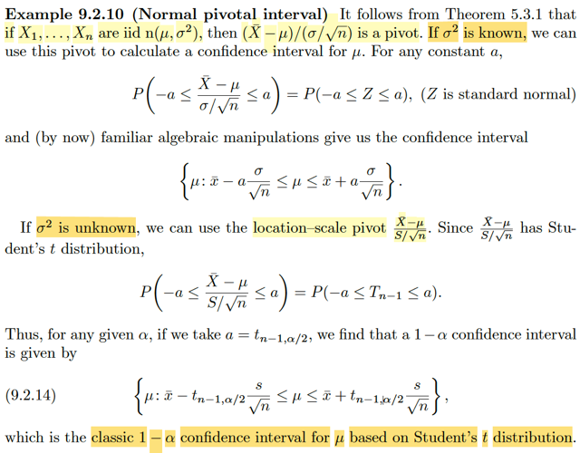</kbd>

> [!NOTE]
> Ôn lại chút về cách xây dựng confidence interval từ pivot Q(**X**, θ).
>
>
>
> Ta sẽ tìm a, b sao cho P_θ(a ≤ Q(**X**, θ) ≤ b) ≥ 1-α, khi đó, A(θ0)
> = {**x**: a ≤ Q(**x**, θ0) ≤ b} chính là α level acceptance region của bài toán
> testing H0: θ = θ0. Và như vậy dùng Tautology theorem ta sẽ có
> C(**X**) = {θ0: a ≤ Q(**X**, θ0) ≤ b} chính là 1-α confidence set cho θ.
>
>
>
> Thế thì ở đây, ta xem xét lại trường hợp của X1,....Xn ~ normal(μ, σ^2)
> và gs nói rằng thật ra ta đã dùng cái vụ pivot này một cách vô tình rồi.
>
>
>
> Cụ thể là, ta đã biết Xbar chính là một normal(μ, σ^2/n)
>
>
>
> và (Xbar - μ) / (σ/√n) chính là một standard normal, normal(0,1) có distr
> bution không còn phụ thuộc μ, σ^2.
>
>
>
> Do đó, cho trước α mong muốn:
>
>
>
> Ta sẽ tìm a, b sao cho P_μ(a ≤ (Xbar - μ) / (σ/√n) ≤ b) ≥ 1-α 
>
>
>
> Với việc Z = (Xbar - μ) / (σ/√n) là normal(0,1) ta có thể tra bảng để 
> có a, b.
>
>
>
> Khi đó, A(μ0) = {x: a ≤ (xbar - μ) / (σ/√n) ≤ b } sẽ là level α acceptance
> region của bài toán testing H0: μ = μ0
>
>
>
> Và C(**X**) = {μ: a ≤ (Xbar - μ) / (σ/√n) ≤ b}
>
>
>
> = {μ: b (σ/√n) ≤ (Xbar - μ) /  ≤ a (σ/√n)}
>
>
>
> = {μ: xbar - aσ/√n ≤ μ ≤ Xbar - bσ/√n}
>
>
>
> chính là 1-α confidence interval cho μ.
>
>
>
> (Dĩ nhiên đây là xét case ta biết σ^2)
>
>
>
> Nếu không biết σ^2.
>
>
>
> Thì ta có thể dùng cách khác, một pivot khác: Đó là ta biết (Xbar - μ) / (S/√n)
> sẽ là một Student t bậc tự do n-1: tn-1, cũng có distribution không phụ thuộc 
> μ, σ 
>
>
>
> Khi đó, tương tự, ta sẽ chọn a, b sao cho P_θ(a ≤ Tn-1 ≤ b) = 1-α 
>
>
>
> từ đó, C(X) = {μ: a ≤ (Xbar - μ) / (S/√n) ≤ b}
>
>
>
> = {μ: a (S/√n) ≤ Xbar - μ ≤ b (S/√n)}
>
>
>
> = {μ: a (S/√n) ≤ Xbar - μ , Xbar - μ ≤ b (S/√n)}
>
>
>
> = {μ: μ ≤ Xbar - a (S/√n) , Xbar - b (S/√n) ≤ μ}
>
>
>
> = {μ: Xbar - b (S/√n) ≤ μ ≤ Xbar - a (S/√n)}
>
>
>
> chính là 1-α confidence interval cho μ 
>
>
>
> ====
>
>
>
> Vì tính đối xứng của normal (0,1) và student t bậc n-1, đại khái là ta có thể
> chỉ cần tìm a, tức tìm a sao cho P_μ(-a ≤ Z ≤ a) = 1 - α.
>
> ⇔ 1 - P_μ(-a ≤ Z ≤ a) = α
>
>
>
> ⇔ P_μ(Z ≤ -a U a ≤ Z) = α
>
>
>
> ⇔ 2P_μ(a ≤ Z) = α
>
>
>
> ⇔ P_μ(a ≤ Z) = α/2
>
>
>
> a = z_α/2
>
>
>
> ⇨ confidence interval: {μ: xbar - z_α/2 σ/√n ≤ μ ≤ xbar + z_α/2 σ/√n}
>
>
>
> Tương tự, cũng chỉ cần tìm a sao cho P_μ(-a ≤ Tn-1 ≤ a) = 1-α 
>
>
>
> ⇨ a = tn-1_α/2 
>
>
>
> ⇨ confidence interval: {μ: xbar - tn-1_α/2 s/√n ≤ μ ≤ xbar + tn-1_α/2 s/√n}

**🔗 See also:** [Tính chất Trung bình & Phương sai mẫu](#node-aytwme7)

 

- **Khoảng tin cậy cho phương sai**

<kbd>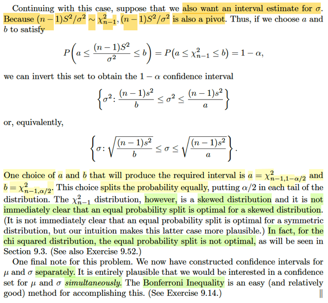</kbd>

> [!NOTE]
> Ok, tiếp theo, có thể ôn nhanh chút xíu cái lí thuyết khái quát của việc xây
> dụng confidence interval dựa trên một pivot Q(**X**, θ):
>
>
>
> Lí thuyết nói rằng nếu có Q(**X**, θ), bằng cách chọn a, b sao cho P_θ(a ≤ Q
> ≤ b) ≥ 1-α với α mong muốn cho trước. thì khi đó, ta sẽ có:
>
>
>
> A(θ0) = {**x**: a ≤ Q(**x**, θ0) ≤ b} là level α acceptance region của bài toán
> test H0: θ = θ0
>
>
>
> Vì sao level α? Vì P_θ(reject H0) = 1 - P_θ(accept H0) = 1 - P(**X** ∈ A(θ0))
>
>
>
> = 1 - P_θ(a ≤ Q(**X**, θ0) ≤ b)
>
>
>
> mà a, b được chọn sao cho P_θ(a ≤ Q(**X**, θ0) ≤ b) ≥ 1-α
>
>
>
> ⇨ 1 - P_θ(a ≤ Q(**X**, θ0) ≤ b) ≤ 1 - (1 - α) = α.
>
>
>
> ⇨ P_θ(reject H0) ≤ α ⇨ đây là level α test, và A(θ0) là level α acceptance
> region.
>
>
>
> Khi đó, dùng Tautology theorem: Xây dựng C(**x**) = {θ0: A(θ0) chứa **x**}
>
>
>
> = {θ0: **x** ∈ A(θ0)}
>
>
>
> = {θ0: a ≤ Q(**x**, θ0) ≤ b}
>
>
>
> ⇨ C(**X**) = {θ0: a ≤ Q(**X**, θ0) ≤ b} chính là 1-α confidence set cho θ
>
>
>
> ====
>
>
>
> Quay lại đây, sau khi đã dùng kiến thức này để tìm confidence interval cho μ.
> Ta có thể tìm luôn cho σ^2:
>
>
>
> Dựa trên việc đã biết (n-1)S^2/σ^2 ~ Chi-square bậc n-1 (theo link xem  lại
> theorem)
>
>
>
> Như vậy đây chính là cho ta một đại lượng trục (pivot) Q(**X**, σ^2)
>
>
>
> = (n-1)S^2(**X**)/σ^2 (ôn lại: pivotal quantity là một function of statistic và
> parameter, (dĩ nhiên cũng là một random variable) có distribution không còn
> phụ thuộc θ)
>
>
>
> Áp dụng cách thức trên, ta có thể chọn a, b sao cho thỏa:
>
>
>
> P_σ^2(a ≤ một Chi-square bậc n-1 ≤ b) ≥ (hay =) 1-α
>
>
>
> Tra bảng hay sao đó pdf của Chi-square n-1 ta sẽ có a, b. (chú ý, bằng hay ≥
> thì cũng là như nhau thôi, vì ví dụ tìm cái mốc mà tại đó con số bắt đầu lớn
> hơn x thì cũng chính là tìm cái mốc mà con số nó bằng x)
>
>
>
> Khi đó, C(**X**) = {σ^2: a ≤ (n-1)S^2/σ^2 ≤ b}
>
>
>
> = {σ^2: a σ^2 ≤ (n-1)S^2 ≤ b σ^2}
>
>
>
> = {σ^2: (n-1)S^2 / b ≤ σ^2 ≤ (n-1)S^2 / a}
>
>
>
> = {σ: √[(n-1)S^2 / b] ≤ σ ≤ √[(n-1)S^2 / a]}
>
>
>
> sẽ chính là 1-α confidence interval của σ^2
>
>
>
> ====
>
>
>
> Thế thì đại khái gs nói là, ta có thể chọn a = Chisquare_n-1_1-α/2 và b =
> Chi-square_α/2 (tương tự như z_α/2) để có xác suát mỗi bên bằng nhau.
>
>
>
> Tuy nhiên vì phân phối chisquare không đối xứng nên đại khái là cách chọn a,
> b này có thể không tối ưu.
>
>
>
> -------
>
>
>
> Cuối cùng, gs nói ta cũng có thể tìm ra cái confidence interval của μ và σ^2
> cùng lúc (thay vì làm riêng từng cái như trên) dựa trên cái gọi là Bonferonni 
> Inequality

 

- **Pivot CDF và Confidence Set**

<kbd>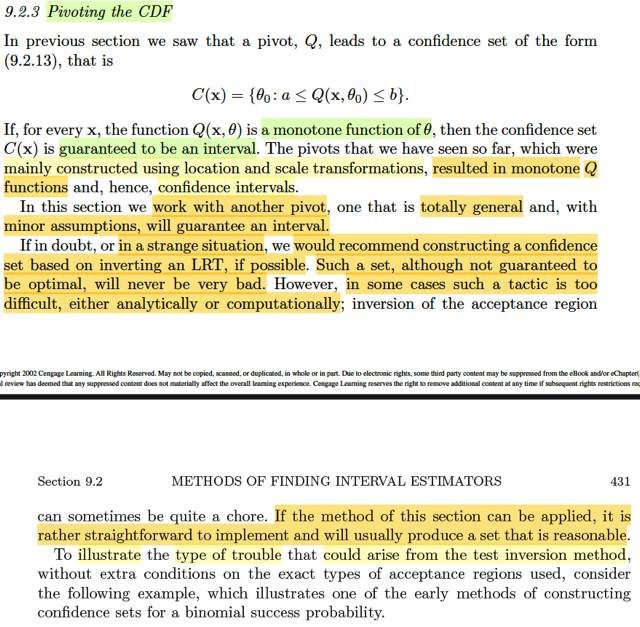</kbd>

> [!NOTE]
> Đại khái là trong phần vừa rồi, ta đã học các xây dựng confidence set dựa
> trên pivotal quantities Q(**X**, θ). Ôn lại nhanh:
>
>
>
> Theo định nghĩa, pivot là một random variable có được khi áp một function
> lên một statistic và parameter θ, nhưng phân phối của nó lại không còn phụ
> thuộc θ nữa. Khi đó, với α / 1-α cho trước mong muốn, bằng cách chọn a, b
> sao cho P_θ(a ≤ Q(**X**, θ) ≤ b) ≥ 1-θ thì ta sẽ có A(θ0) = {**x**: a ≤ Q(**x**,
> θ0) ≤ b} là một level α acceptance region của bài toán testing H0: θ = θ0.
>
>
>
> (Vì khi đó: 
>
>
>
> sup_θ∈Θ0={θ0} P_θ(reject H0) =
>
>
>
> = P_θ0(reject H0)
>
>
>
> = 1 - P_θ0(accept H0) 
>
>
>
> = 1 - P_θ0(**X** ∈ A(θ0))
>
>
>
> = 1 - P_θ0(a ≤ Q(**X**, θ0) ≤ b) ≤ 1-(1-α) = α
>
>
>
> Do đó theo Theorem Tautology, C(**X**) = {θ0: a ≤ Q(**X**, θ0) ≤ b} chính là
> 1-α confidence set của θ.
>
>
>
> Thế thì ta cũng đã biết, khi hàm Q là hàm monotone theo θ với mọi **x** thì
> C(**X**) sẽ là một interval (có dạng [L(**X**,a), U(**X**,b)] khi Q monotone
> increasing và [L(**X**,b), U(**X**,a)] khi Q monotone decreasing)
>
>
>
> Thì đại khái là, cho tới nay cách tiếp cận để tìm confidence set từ pivot chủ
> yếu xoay quanh location - scale, (ví dụ như nếu có statistic U ~ fU là
> member của location scale family ứng với location μ, scale σ thì (U - μ) / σ
> sẽ là  rv ~ member chuẩn, có location 0, không còn phụ thuộc μ → chính là
> một pivot)
>
>
>
> Và gs nói trước đó là, thông thường, khi ko biết nên làm gì, thì ta cứ nên
> dùng cách invert một LRT, tuy chưa chắc cho ra một confidence set tối ưu
> nhưng chắc chắn là ko tệ. Tuy nhiên đôi khi cách này khó, thì ta có thể có
> một cách tiếp cận khác.

 

- **Phương pháp Sterne**

<kbd>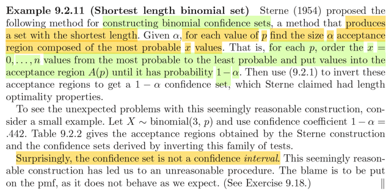</kbd>

<kbd>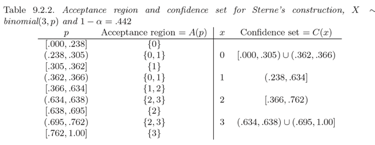</kbd>

> [!NOTE]
> Đại khái hiểu vầy: Theo lí thuyết Tautology, miễn là ta có A(θ0) là level α
> acceptance region của bài toán testing H0: θ = θ0 thì bằng cách invert cái test
> này, ta sẽ có 1-α confidence set. Có điều nếu muốn kết quả là interval ở dạng
> một đoạn liên tục (chứ không phải là chắp nối nhiều đoạn) thì ta phải dùng
> pivot có tính monotone. Và ví dụ này ông tác giả muốn minh họa là nếu mà có
> A(θ0) level α nhưng ko dựa trên một pivot monotone, thì kết quả sẽ ra interval
> chắp vá.
>
>
>
> Còn cách làm cụ thể trong thì cũng ko có gì khó hiểu: Chỉ cần nhớ ổng đang
> tìm cách xây dựng một level α acceptance region của bài toán testing H0: θ =
> θ0
>
>
>
> Mà level α acceptance region A(θ0) của bài toán testing H0: θ = θ0 là gì:
>
>
>
> Chính là {**x**: accept H0} với
>
>
>
> sup_θ∈Θ0={θ0} P_θ(reject H0) 
>
>
>
> = P_θ0(reject H0) ≤ α ⇔ 1 - P_θ(accept H0) ≤ α
>
>
>
> ⇔ P_θ0(accept H0) ≥ 1-α
>
>
>
> ⇔ P_θ0(**X** ∈ A(θ0)) ≥ 1-α
>
>
>
> Do đó ở đây, A(p0) của bài toán testing H0: p = p0 sẽ có thể được xây như
> sau:
>
>
>
> Tính hết pmf tại các possible value **x** của **X**, sau đó, gom những thằng
> có pmf cao nhất vào một tập, dĩ nhiên khi lần lượt bỏ vào tập thì xác suất
> **X** thuộc tập đó sẽ cao dần lên, cho đến khi nào vượt 1-α thì thôi. Khi đó ta
> đã có tập chứa các possible value **x** của **X** mà thỏa P_θ(**X** ∈ tập đó)
> ≥ 1-α. Đó chính là một level α acceptance region của bài toán testing H0: p =
> p0. Cái vụ bỏ các **x** vào dần dần theo pmf của chúng đơn giản là cách để
> mau chóng có một tập chứa **x** mà xác suất vượt 1-α mong muốn thôi.
>
>
>
> Và kết quả khi invert cái test có acceptance region này, thì confidence set quả
> thật cũng là các đoạn (vì tham số p là real value), nhưng chúng ko liên tục,
> mà là chắp nối nhiều đoạn. Từ đó minh họa rõ cho ta thấy, vì cách xây dựng
> tập A(p0) như vậy, ko dựa vào một monotone pivot nào, nên confidence set
> cho ra rất xấu xí (dù vẫn đúng là một 1-α confidence set).
>
>
>
> Và phần này, ta sẽ học một cách tiếp cận đảm bảo có được một monotone
> pivot.

 

- **Biến đổi tích phân xác suất**

<kbd>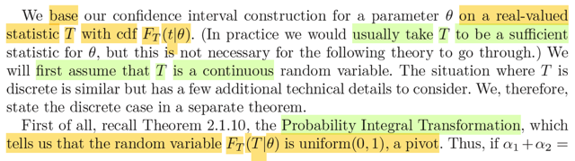</kbd>

> [!NOTE]
> Ok, như đã nói, mục tiêu là tìm ra một monotone pivot để từ đó ta sẽ có thể
> đảm bảo là cái confidence set xây dựng ra sẽ là một interval đẹp (ko chắp
> nối).
>
>
>
> Thế thì ta sẽ dùng một statistic T có cdf FT(t|θ) và đầu tiên xét case đây là
> biến liên tục.
>
>
>
> Gs nhắc lại trong chapter 2 ta đã học theorem PIT để biết rằng khi ném
> random variable T vào hàm cdf của chính nó, ta sẽ được một rv mới tuân
> theo phân phối uniform(0,1). Theorem này dễ, thử chứng minh lại:
>
>
>
> Gọi U = FT(T|θ), dùng transformation theorem, tìm pdf của U:
>
>
>
> Đầu tiên, FT là cdf của T, dĩ nhiên nó là một monotone -nondecreasing function
> do đó đảm bảo mapping 1-1 giữa T và U: u = FT(t|θ) ⇔ t = FT_inv(u|θ)
>
>
>
> Còn nhớ stat110, thầy Joe Blizstein đã dạy: đi tìm distribution của biến liên tục
> thì ta sẽ nên đi tìm cdf của nó, còn của biến rời rạc thì pmf. Đi tìm cdf của U:
>
>
>
> FU(u|θ), theo định nghĩa của cdf, là hàm: P_θ(U ≤ u)
>
>
>
> về bản chất, nó chính là:
>
>
>
> = P_θ({s ∈ Ω: U(s) ≤ u})
>
>
>
> = P_θ({s ∈ Ω: FT(T|θ)(s) ≤ u})
>
>
>
> = P_θ({s ∈ Ω: FT(T(s)|θ) ≤ u}) 
>
>
>
> Mà FT là cdf nên nó monotone non-decreasing như nói ở trên:
>
>
>
> FT(T(s)|θ) ≤ u ⇔ T(s) ≤ FT_inv(u|θ)
>
>
>
> ⇨ P_θ({s ∈ Ω: FT(T(s)|θ) ≤ u}) = P_θ({s ∈ Ω: T(s) ≤ FT_inv(u|θ)})
>
>
>
> = P_θ(T ≤ FT_inv(u|θ))
>
>
>
> = FT(FT_inv(u|θ)|θ) theo định nghĩa cdf   
>
>
>
> = u 
>
>
>
> Như vậy FU(u) = P_θ(U ≤ u) = u, đủ để kết luận U ~ uniform(0,1).
>
>
>
> ====
>
>
>
> Chứng minh ý hai của PIT luôn: Nếu ta có F là một valid cdf, thì Finv(U) với U
> ~ unform(0,1) chính là một rv ~ F
>
>
>
> Tức là ta cần chứng minh X = Finv(U) là rv có pdf là F:
>
>
>
> Xét FX(x), theo định nghĩa, = P(X ≤ x), 
>
>
>
> = P({s ∈ Ω: X(s) ≤ x})
>
>
>
> = P({s ∈ Ω: Finv(U)(s) ≤ x})
>
>
>
> = P({s ∈ Ω: Finv((U(s)) ≤ x})
>
>
>
> Nếu F là valid cdf, tức là monotone non-decreasing ta sẽ có:
>
>
>
> Finv((U(s)) ≤ x ⇔ F[Finv((U(s))] ≤ F(x) ⇔ U(s) ≤ F(x)
>
>
>
> = P({s ∈ Ω: U(s) ≤ F(x)})
>
>
>
> = PU(F(x))
>
>
>
> với việc U là uniform(0,1)
>
>
>
> ⇨ PU(F(x)) = F(x)
>
>
>
> Vậy FX(x) = F(x) → chứng minh xong.

**🔗 See also:** [Biến đổi tích phân xác suất](#node-ezy1q8o)

 

- **Vùng chấp nhận và khoảng tin cậy**

<kbd>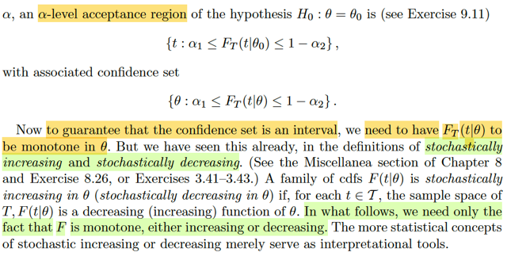</kbd>

<kbd>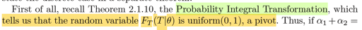</kbd>

> [!NOTE]
> Đầu tiên thử chứng minh vì sao gs nói:
>
>
>
> Nếu α1 + α2 = α, thì tập {t: α1 ≤ FT(t|θ0) ≤ 1 - α2} chính là một level α
> acceptance region của bài toán testing H0: θ = θ0
>
>
>
> P_θ0(reject H0) = 1 - P_θ0(accept H0)
>
>
>
> = 1 - P_θ0(T ∈ {t: α1 ≤ FT(t|θ0) ≤ 1 - α2}}
>
>
>
> = 1 - P_θ0(α1 ≤ FT(T|θ0) ≤ 1-α2)
>
>
>
> = 1 - P(α1 ≤ uniform(0,1) rv ≤ 1-α2)
>
>
>
> = 1 - (FU(1-α2) - FU(α1))
>
>
>
> = 1 - (1 - α2 - α1)
>
>
>
> = 1 - 1 + α2 + α1
>
>
>
> = α
>
>
>
> Vậy P_θ0(reject H0) = α ⇔ sup_θ∈Θ0={θ0} P_θ(reject H0) = α
>
>
>
> ⇨ đây là một size α test, đương nhiên cũng là level α test.
>
>
>
> Như vậy thì A(θ0) = {t: α1 ≤ FT(t|θ0) ≤ 1-α2} là một level α acceptance
> region của bài toán testing H0: θ = θ0.
>
>
>
> Mà FT(T|θ0) là một uniform (0,1), không phụ thuộc θ. Do đó, nó chính
> là một pivot.
>
>
>
> Và như vậy cái mà ta đang có chính là có {**x**: α1 ≤ Q(**X**, θ) ≤ α2} 
> = với Q(**X**, θ) = FT(T(**X**)|θ) là một pivot.
>
>
>
> Do đó C(**X**) 
>
>
>
> = {θ: α1 ≤ Q(**X**, θ) ≤ α2} 
>
>
>
> = {θ: α1 ≤ FT(T|θ) ≤ α2}
>
>
>
> chính là một 1-α confidence set

 

- **Khoảng tin cậy xoay CDF**

<kbd>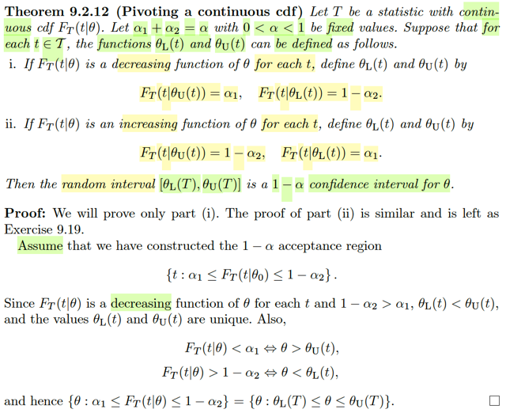</kbd>

> [!NOTE]
> Theorem 9.2.12, tương đối khó hiểu, nhưng đại ý là thế này:
>
>
>
> Cho rằng ta có statistic T có cdf liên tục FT(t|θ), và α1 + α2 = α, với α là giá trị 
> cố định từ 0 đến 1. Giả sử với một t ∈ range T.
>
>
>
> Vừa rồi mình đã hiểu vì sao {t: α1 ≤ FT(t|θ) ≤ α2} là một level α acceptance region
> của θ. Dẫn đến thì {θ: α1 ≤ FT(t|θ) ≤ α2} là 1-α confidence set. 
>
>
>
> Thì theorem này chẳng qua chỉ là nói đến cái confidence set này sẽ có thể
> thể hiện ở dạng interval [θL(t), θU(t)] như sau:
>
>
>
> Đơn giản là là ta cần tìm θL sao cho α1 = FT(t|θL), giải ra ta sẽ có θL, nhưng vì
> quá trình này sẽ dính đến t, nên mới ghi nó là θL(t).
>
>
>
> Tương tự, giải tìm θU sao cho α2 = FT(t|θU)
>
>
>
> khi đó ta sẽ có {θ: α1 ≤ FT(t|θ) ≤ α2} = {θ: θL(t) ≤ θ ≤ θU(t)}
>
>
>
> Nhưng cái này chỉ đúng nếu như FT thỏa tính chất α1 = FT(t|θL) < α2 = FT(t|θU))
> ⇔ θL < θU, tức là hàm FT đồng biến (monotone increasing) theo θ.
>
>
>
> Còn nếu như FT nghịch biến theo θ thì α1 < α2 thì phải gán θL cho solution của
> α2 = FT(t|θ) và θU cho solution của α1 = FT(t|θ).

 

- **Phương pháp Khoảng Tin Cậy Pivot**

<kbd>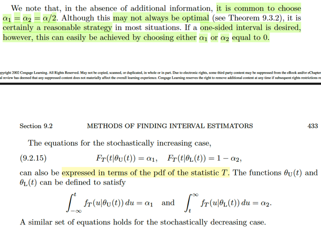</kbd>

> [!NOTE]
> Ôn lại chút về những gì đã học hôm qua: Điểm băn khoăn mà người ta
> đang bàn tới, là tính monotone của pivot. Là sao. Cần nhớ lại pivot là rv có
> được bởi áp một hàm lên statistic và θ. Q(**X**, θ) mà distribution của nó lại
> không phụ thuộc θ. Dẫn tới, nếu ta có thể tìm được a, b sao cho:
>
>
>
> P_θ(a ≤ Q(**X**, θ) ≤ b) ≥ 1-α thì cũng đồng nghĩa là
>
>
>
> tập A(θ0) = {**x**: a ≤ Q(**x**, θ0) ≤ b} sẽ có đặc địểm sau:
>
>
>
> Khi xét bài toán testing H0: θ = θ0, và xét một cái test có acceptance region
> là A(θ0) thì ta sẽ thấy rằng sup_θ ∈ Θ0 = {θ0} P_θ(**X** ∈ A(θ0)_c)
>
>
>
> = P_θ0(**X** ∈ A(θ0)_c) = 1 - P_θ0(**X** ∈ A(θ0))  ≤ 1 - (1 - α) = α
>
>
>
> Như vậy, theo định nghĩa, đây là một level α test, A(θ0) là level α
> acceptance region.
>
>
>
> Từ đó, theo Theorem Tautology, ta sẽ có thể xây dựng C(**x**):
>
>
>
> C(**x**) = {θ0: **x** ∈ A(θ0)} = {θ0: a ≤ Q(**x**, θ0) ≤ b}
>
>
>
> thì C(**X**) = {θ0: a ≤ Q(**X**, θ0) ≤ b} , hay  {θ: a ≤ Q(**X**, θ) ≤ b}  chính là
> 1-α confidence set của θ.
>
>
>
> Nói ngắn gọn, cái hay của pivot là một khi ta đã có a, b khiến  P_θ(a ≤
> Q(**X**, θ) ≤ b) ≥ 1-α
>
>
>
> thì {x: a ≤ Q(**x**, θ0) ≤ b} là level α acceptance region của bài toán testing
> H0: θ = θ0
>
>
>
> mang ý nghĩa, nếu ta muốn tìm bằng chứng để ko reject H0 (accept H0: θ =
> θ0) thì ta cần **x** xuất hiện trong tập này.
>
>
>
> và {θ: a ≤ Q(**x**, θ) ≤ b} là 1-α confidence set của θ. Mang ý nghĩa, nếu
> dựa trên quan sát **X** = **x** thì ta có thể kết luận θ nằm trong vùng này
> với độ tin cậy 1-α
>
>
>
> Vấn đề là: Ta cần Q monotone theo θ, vì khi đó cái tập của θ: {θ: a ≤ Q(**x**,
> θ) ≤ b} mới có thể chuyển thành, thể hiện thành một interval. [L(.), U(.)] Cụ
> thể, nếu Q monotone increasing, ta sẽ có [L(**X**,a), U(**X**,b)] và ngược
> lại nếu Q monotone decreasing thì ta sẽ có [L(**X**,b), U(**X**,a)]
>
>
>
> Và trong ví dụ trước ta cũng đã thấy một minh họa về việc tạo confidence
> set từ một acceptance region mà ko dựa trên một monotone pivot dẫn đến
> confidence set là các interval chắp nối.
>
>
>
> Tóm lại, yêu cầu đặt ra là xác định pivot, cái này vốn dĩ là có thể nhờ
> location scale family để tìm. Nhưng quan trọng hơn, ta cần pivot monotone.
>
>
>
> Đó là lúc ta mới nhớ về định lý PIT: ném X vào cdf của nó FX sẽ cho ta một
> uniform rv. Nên nếu thằng statistic T có pdf FT còn phụ thuộc θ thì FT(T|θ)
> sẽ chính là một uniform(0,1), có distribution không phụ thuộc θ nữa, để cho
> ta một pivot.
>
>
>
> Đồng thời hàm FT (đóng vai trò như hàm Q) chính là một hàm có phẩm
> chất monotone: **Chú ý**, ta cần nó **monotone theo θ** với mỗi t chứ ko
> phải  là monotone theo t (ta cần Q(**x**, θ) monotone theo θ với mỗi **x**)
>
>
>
> Do đó, nếu ta có α1 + α2 = α cho trước, thì {t: α1 ≤ FT(t|θ0) ≤ 1-α2} sẽ là
> một level α  acceptance region của bài toán testing H0: θ = θ0:
>
>
>
> Vì sup θ∈Θ0={θ0) P_θ(reject H0) = P_θ0(reject H0) = 1 - P_θ0(accept H0)
>
>
>
> = 1 - P_θ0(**X** ∈ Acceptance region)
>
>
>
> = 1 - P_θ0(T ∈ {t: α1 ≤ FT(t|θ0) ≤ 1-α2})
>
>
>
> = 1 - P_θ0(α1 ≤ FT(T|θ0) ≤ 1-α2)
>
>
>
> = 1 - P_θ0(α1 ≤ uniform(0,1) ≤ 1-α2)
>
>
>
> = 1 - [FU(1-α2) - FU(α1)]
>
>
>
> = 1 - [1 - α2 - α1]
>
>
>
> = α2 + α1 = α
>
>
>
> Và theo Tautology theorem, {θ0: α1 ≤ FT(t| θ0) ≤ 1-α2} chính là 1-α
> confidence set của θ.
>
>
>
> Và vấn đề chỉ là để chuyển thành dạng [L, U] thì ta sẽ cần giải:
>
>
>
> Nếu FT increasing
>
>
>
> FT(t|θ) = α1 → giải ra θL(t, α1), hay nói trong sách là FT(t| θL(t)) = α1
>
>
>
> và cũng có thể thể hiện bởi pdf của T: ∫-inf:t fT(u| θL(t))du = α1
>
>
>
> FT(t|θ) = 1-α2 → giải ra θU(t, α2), hay viết như trong sách là FT(t|θU(t)) = 1-α2
>
>
>
> thể hiện bởi pdf của T: ∫-inf:t fT(u| θU(t))du = 1-α2
>
>
>
> ⇔ ∫t:inf fT(u| θU(t))du = α2
>
>
>
> Néu FT decreasing.
>
>
>
> FT(t|θ) = 1-α2 → giải ra θL(t, α2), hay FT(t| θL(t)) = 1-α2
>
>
>
> thể hiện bởi pdf của T: ∫-inf:t fT(u| θL(t))du = 1-α2
>
>
>
> ⇔ ∫t:inf fT(u| θU(t))du = α2
>
>
>
> FT(t|θ) = α1 → giải ra θL(t, α1) hay FT(t| θL(t)) = α1
>
>
>
> thể hiện bởi pdf của T: ∫-inf:t fT(u| θU(t))du = α1
>
>
>
> Hay với α1, α2 đã biết gọi chung là θL(t), θU(t) thì [θL(t), θU(t)] chính là 1-α
> confidence interval

 

- **Khoảng tin cậy mũ vị trí**

<kbd>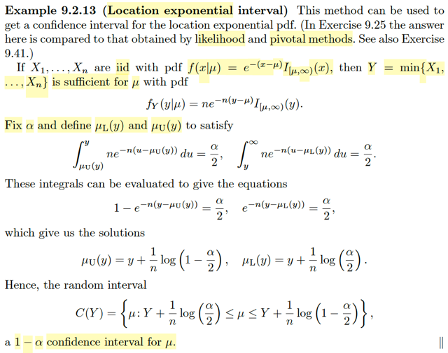</kbd>

> [!NOTE]
> Ví dụ này áp dụng cái vụ vừa học: Đại khái là ta có random sample X1,..Xn ~ f(x|μ) =
> exp{-(x-μ)}I_[μ, inf)(x)
>
>
>
> Dừng lại chút, cái này là sao? → nó chính là cách để integrate range của x vào trong
> công thức hàm pdf luôn: Ta còn nhớ:
>
>
>
> pdf của expo(β): f(x|β) = (1/β)exp(-x/β), với 0 ≤ x ≤ inf, β > 0
>
>
>
> thế thì exp{-(x-μ)I_[μ, inf)(x)} chính là tương đương với:
>
>
>
> exp{-(x-μ)} 0 ≤ x-μ ≤ inf, β = 1
>
>
>
> Đây là thành viên của location family exp(1) ứng với location μ.
>
>
>
> Có nghĩa là, f(x) = exp{-x/1} là standard member của family, ứng với location 0
>
>
>
> thì f(x - μ) = exp(-(x-μ)) là member của family ứng với location μ.
>
>
>
> Tiếp, khi đó Y = min_i {Xi} là sufficient statistic for μ (cái này trong các phần trước đã
> chứng minh rồi), có pdf fY(y|μ) = nexp[-n(y-μ)] I_[μ, inf)(y)
>
>
>
> Giữ α fixed, ta sẽ define μL(y) và μU(y) thỏa:
>
>
>
> ∫μU(y):y nexp[-n(y-μU(y))] du = α/2
>
>
>
> ∫y:inf nexp[-n(y-μL(y))] du = α/2
>
>
>
> Dựng lại chút: Chỗ này là sao vậy?
>
>
>
> Ôn lại (kết nối với cái note lí thuyết mà mình mới hệ thống lại) thì sẽ thấy ở đây gs
> Casella đang làm gì:
>
>
>
> Theo lí thuyết, ta đã nói là nếu có statistic T, thì FT(T|θ) chính là một pivot, và và từ
> đó, nếu có α1 + α2 = α mong muốn thì A(θ0) = {t: α1 ≤ FT(t|θ0) ≤ 1-α2} chính là level
> α acceptance region của bài toán testing H0: θ = θ0. Và tautology theorem cho ta
> C(T) = {θ0: α1 ≤ FT(T|θ0) ≤ 1-α} chính là 1-α confidence set của θ0. Để rồi tùy vào
> việc FT(t|θ) là hàm monotone increasing hay decreasing đối với θ mà ta sẽ giải FT(t|
> θU(t)) = 1-α2 hoặc α1 và FT(t| θL(t)) = α1 hoặc 1-α2 để có thể thể hiện confidence
> set ở dạng interval [θL(t), θU(t)] Hơn nữa, cũng có thể thể hiện ở dạng pdf của T:
>
>
>
> FT(t| θU(t)) = ∫-inf:t fT(u| θU(t)) du =1-α2 hoặc α1
>
>
>
> ⇔ ∫t:inf fT(u| θU(t)) du = α2 hoặc ∫-inf:t fT(u| θU(t)) du = α1
>
>
>
> FT(t| θL(t)) = ∫-inf:t fT(u| θL(t)) du = α1 hoặc 1-α2
>
>
>
> ⇔ ∫-inf:t fT(u| θL(t)) du = α1 hoặc ∫t:inf fT(u| θL(t)) du = α2
>
>
>
> Vậy thì ở đây, Y chính là đóng vai T:
>
>
>
> Và cho α1 = α2 = α/2 thì cơ bản ta khỏi cần quan tâm FY tăng hay giảm
>
>
>
> nếu FT tăng: ∫y:inf fY(u| μU(y)) du = α/2 và ∫-inf:y fY(u| μL(y)) du = α/2
>
>
>
> nếu FT giảm: ∫-inf:y fY(u| μU(y)) du = α/2 và ∫y:inf fY(u| μL(y)) du = α/2
>
>
>
> thì hai cái này là giống nhau, vì ∫-inf:t fT(u| μU(t)) du = α/2 cũng tương đương ∫t:inf
> fT(u| vU(t)) du = α/2. Và ∫t:inf fT(u| μL(t)) du = α/2 cũng tương đương với ∫-inf:t fT(u|
> μL(t)) du = α/2.
>
>
>
> Vậy hệ cần giải là:
>
>
>
> ∫-inf:y fY(u| μU(y)) du = α/2 và ∫y:inf fY(u| μL(y)) du = α/2
>
>
>
> nhưng support set của Y là [μ, inf) nên ∫-inf:y fY(u| μU(y)) du = ∫μU(y):y fY(u| μU(y))
> du
>
>
>
> vậy hệ cần giải là:
>
>
>
> ∫μU(y):y fY(u| μU(y)) du = α/2 và ∫y:inf fY(u| μL(y)) du = α/2
>
>
>
> Thay pdf của Y vô sẽ giúp hiểu vì sao sách ghi vậy.
>
>
>
> ∫μU(y):y nexp[-n(u-μU(y))] du = α/2
>
>
>
> và ∫y:inf nexp[-n(u-μL(y))] du = α/2
>
>
>
> -----
>
>
>
> Thế thì thử giải hai phương trình tích phân này: (nhớ chú ý u,du chỉ là dummies
> variable, μU(y) là kí hiệu cho cận dưới - Under của μ, và nó sẽ là hàm theo y, giống
> như θU(t) là cận dưới cho θ, là hàm theo t vậy)
>
>
>
> Phương trình 1:
>
>
>
> ∫μU(y):y nexp[-n(u-μU(y))] du = α/2
>
>
>
> ⇔ n ∫μU(y):y exp[-n(u-μU(y))] du = α/2
>
>
>
> ⇔ n [nguyên hàm của exp[-n(u-μU(y))]] | μU(y):y = α/2
>
>
>
> ⇔ n [exp[-n(u-μU(y))] / (-n)] | μU(y):y = α/2
>
>
>
> ⇔ - exp[-n(u-μU(y))]  | μU(y):y = α/2
>
>
>
> ⇔ - exp[-n(y-μU(y))] + exp[-n(μU(y)-μU(y))] = α/2
>
>
>
> ⇔ - exp[-n(y-μU(y))] + 1 = α/2
>
>
>
> ⇔ 1 - exp[-n(y-μU(y))] = α/2 → như trong sách
>
>
>
> ⇔ 1 - α/2 = exp[-n(y-μU(y))]
>
>
>
> ⇔ log(1 - α/2) = -n(y-μU(y)) = -ny + nμU(y))
>
>
>
> ⇔ log(1 - α/2) / n + y = μU(y))
>
>
>
> ⇔ μU(y)) = y + (1/n) log(1 - α/2) → giống trong sách.
>
>
>
> Phương trình 2:
>
>
>
> ∫y:inf nexp[-n(u-μL(y))] du = α/2
>
>
>
> ⇔ n ∫y:inf exp[-n(u-μL(y))] du = α/2
>
>
>
> ⇔ n [nguyên hàm của exp[-n(u-μL(y))]] | y:inf = α/2
>
>
>
> ⇔ n [exp[-n(u-μL(y))] / (-n)] | y:inf = α/2
>
>
>
> ⇔ -exp[-n(u-μL(y))] | y:inf = α/2
>
>
>
> ⇔ -exp[-n(inf-μL(y))] + exp[-n(y-μL(y))] = α/2
>
>
>
> ⇔ 0 + exp[-n(y-μL(y))] = α/2
>
>
>
> ⇔ exp[-n(y-μL(y))] = α/2 → giống trong sách.
>
>
>
> ⇔ -n(y-μL(y)) = log (α/2)
>
>
>
> ⇔ -y + μL(y)) = (1/n) log (α/2)
>
>
>
> ⇔ μL(y)) = y + (1/n) log (α/2) → giống trong sách.
>
>
>
> Như vậy: 1-α confidence interval cho μ cần tìm chính là:
>
>
>
> C(Y) = [μL(Y), μU(Y)]
>
>
>
> = {μ:  Y + (1/n) log (α/2) ≤ μ ≤ Y + (1/n) log(1 - α/2)}

 

- **Khoảng tin cậy số**

<kbd>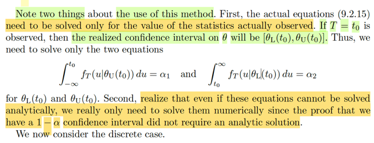</kbd>

> [!NOTE]
> Đại ý đoạn này tạm hiểu là gs lưu ý rằng ta chỉ cần giải tìm θL(t), θU(t) dựa
> trên giá trị thực sự quan sát được của t (tức là t = T(**x**)). Tức là ý gs nói
> rằng, ta ko cần phải đi tìm cái hàm θL(t), θU(t) mà chỉ là lắp giá trị quan sát
> được của T, ví dụ T = t0 vào, và giải ra hai CON SỐ θL(t0) và θU(t0) mà thôi.
>
>
>
> Và việc giải cái này, không cần phải giải ra analytically mà có thể numerically.
> Là sao ? Tạm hiểu ý gs nói là vì trong theorem chẳng có ý nào bắt buộc
> nghiệm giải ra phải là giải từ công thức toán học, nên ta có thể giải hai cái
> phương  trình này theo lối numerically cũng được, thì vẫn sẽ có 1-α
> confidence interval. (giải theo lối numerically thì mình có thể liên hệ với tối ưu
> hóa, ví dụ giải Ax = b mà theo lối analytically thì ta sẽ tính Ainv, nhân với b.
> Nhưng nếu giải theo thuật toán iteratively thì ta sẽ tạo chuỗi {xi} tiến dần về x
> = Ainv b, đó chính là numerically,

 

- **Lật CDF thống kê rời rạc**

<kbd>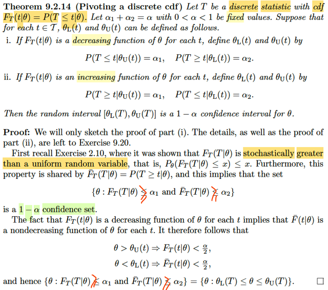</kbd>

> [!NOTE]
> Nhớ lại về việc construct một confidence interval từ invert một cdf.
>
>
>
> Với statistic T là biến liên tục, thì nếu ta có α1 + α2 = α, thì {t: α1 ≤ FT(t|θ0) ≤
> 1-α2} là  một level α acceptance region của bài toán testing H0: θ=θ0.
>
>
>
> Vì sup_θ∈Θ0={θ0} P_θ(reject H0) = P_θ0(reject H0) = 1 - P_θ0(accept H0)
>
>
>
> = 1 - P_θ0(T ∈ {t: α1 ≤ FT(t|θ0) ≤ 1-α2}) = 1 - P_θ0(α1 ≤ FT(T|θ0) ≤ 1-α2)
>
>
>
> = 1 - P(α1 ≤ Uniform(0,1) ≤ 1-α2)
>
>
>
> = 1 - [FU(1-α2) - FU(α1)]
>
>
>
> = 1 - (1 - α2 - α1)
>
>
>
> = α2 + α1 = α
>
>
>
> Vậy đây là cái test có size α (cũng là level α) của bài toán accept H0: θ = θ0
>
>
>
> Và từ đó, theo Tautology theorem, {θ0: α1 ≤ FT(t|θ0) ≤ θ1} chính là 1-α
> confidence set. Từ đó, tùy vào việc FT(t|θ) là hàm monotone increasing hay
> decreasing theo  θ mà ta sẽ giải FT(t|θL(t)) = α1 hay 1-α2 và FT(t|θU(t)) = 1-α2
> hay α1 để có một interval [θL(t), θU(t)]
>
>
>
> Thế thì ở đây, nếu statistic T là biến rời rạc. thì FT(T|θ0) không phải là uniform để
> mà áp dụng lập luận trên vì ta sẽ ko thể có:
>
>
>
> P_θ0(α1 ≤ FT(T|θ0) ≤ 1-α2) = P(α1 ≤ Uniform(0,1) ≤ 1-α2), từ đó ko thể cho ra
> kết quả tập {t: α1 ≤ FT(t|θ) ≤ α2} là level α acceptance region test của bài toán
> testing H0: θ = θ0
>
>
>
> Thay vào đó là tập này {t: FT(t|θ0) ≥ α1 và FbarT(t|θ0) ≥ α2} sẽ là level α
> acceptance region của bài toán testing H0: θ = θ0.
>
>
>
> Trong đó FbarT(t|θ0) là hàm define bởi P_θ0(T ≥ t), chú ý, do đó FbarT(t|θ0)
> không bằng 1 - FT(t|θ0) với T là biến rời rạc đâu nhé, vì cả hai thằng ko phải là
> bù nhau, vì chúng để có chứa pmf tại t.
>
>
>
> Chứng minh:
>
>
>
> sup_θ∈Θ0={θ0} P_θ(reject H0) = P_θ0(reject H0) = 1 - P_θ0(accept H0)
>
>
>
> = 1 - P_θ0(α1 ≤ FT(T|θ0) và α2 ≤ FbarT(T|θ0))
>
>
>
> Dùng định lí De Morgan nói rằng 1 - P(A ∩ B) = P(Ac U Bc):
>
>
>
> = P_θ0(α1 > FT(T|θ0) U α2 > FbarT(T|θ0))
>
>
>
> ≤ P_θ0(α1 > FT(T|θ0)  + P_θ0(α2 > FbarT(T|θ0))
>
>
>
> = P_θ0(FT(T|θ0 < α1)  + P_θ0(FbarT(T|θ0) < α2)
>
>
>
> ≤ P_θ0(FT(T|θ0 ≤ α1)  + P_θ0(FbarT(T|θ0) < α2)
>
>
>
> Dùng P_θ0(FT(T|θ0 ≤ α1) ≤ α1, P_θ0(FbarT(T|θ0) ≤ α2) ≤ α2 do tính chất  "
> stochastically greater than uniform" của FT(t) và FbarT(t)
>
>
>
> (tính chất này là sao, mình sẽ chứng minh lại trong note kế tiếp)
>
>
>
> ≤ α1 + α2 = α
>
>
>
> Như vậy {t: FT(t|θ0) ≥ α1 và FbarT(t|θ0) ≥ α2} sẽ là level α acceptance region
> của bài toán testing H0: θ = θ0
>
>
>
> Nên theo Tautology theorem, {θ0: α1 ≤ FT(t|θ0), α2 ≤ FbarT(t|θ0)} chính là 1-α
> confidence set của θ. (sách viết sai dấu).
>
>
>
> Ta sẽ tìm cách đưa về dạng [θL(t), θU(t)]:
>
>
>
> Biện luận như sau:
>
>
>
> a) Nếu FT đồng biến, thì FbarT nghịch biến, khi đó
>
>
>
> Giải α1 = FT(t|θ), giả sử ra θ=θ1. Khi đó, vì FT đồng biến nên muốn α1 ≤ FT(t|θ)
> thì θ1 phải ≤ θ. Nên nghiệm của α1 ≤ FT(t|θ) là θ1 ≤ θ. Như vậy việc giải α1 =
> FT(t|θ) sẽ cho ra cái chặn dưới, hay thể hiện bởi: α1 = FT(t|θL(t))
>
>
>
> Tương tự, giải phương trìmh α2 = FbarT(t|θ), giả sử ra nghiệm θ = θ2. Thì vì
> FbarT nghịch biến nên để α2 ≤ FbarT(t|θ) thì θ phải < θ2. Do đó, θ2 chính là
> chặn trên, hay và thể hiện bởi: α2 = FbarT(t| θU(t))
>
>
>
> Như vậy nếu FT đồng biến, ta sẽ giải hai phương trình α1 = FT(t|θL(t)) và α2 =
> FbarT(t|θU(t)) để tìm ra [θL(t), θU(t)]
>
>
>
> b) Nếu FT nghịch biến, thì FbarT đương nhiên đồng biến lập luận tương tự:
>
>
>
> Giải α1 = FT(t|θ) giả sử ra θ = θ1, vì FT nghịch biến, nên để α1 ≤ FT(t|θ) thì θ ≤
> θ1 Nên θ1 chính là chặn trên, θU(t). Nên mới nói α1 = FT(t| θU(t))
>
>
>
> Giải α2 = FbarT(t|θ) giả sử ra θ = θ2, vì FTbar đồng biến nên để α2 ≤ FbarT(t|θ)
> thì θ2 phải ≤ θ. Nên θ2 chính là chặn dưới, tức θL(t). Vậy α2 = FbarT(t| θL(t))
>
> Nói về cái vụ "stochastically greater than a uniform"
>
>
>
> Đại khái cái này có nghĩa là, nếu ta có X là biến rời rạc có cdf FX, thì đặt Y =
> FX(X) thì phân phối của Y sẽ có tính chất FY(y) ≤ y Khác với nếu X là biến liên
> tục, thì Y = FX(X) chính là một uniform và FY(y) chính là cdf của uniform(0,1), = y.
> Còn ở trên là dấu "≤" thay vì dấu "=", do đó gọi là "stochastically greater than
> uniform"
>
>
>
> Cái lí do có chữ greater là vì:
>
>
>
> FY(y) ≤ y thì cũng chính là FY(y) ≤ FU(y) với FU là cdf của Uniform(0,1)
>
>
>
> ⇔ P(Y ≤ y) ≤ P(U ≤ y) với U là rv ~ Uniform(0,1)
>
>
>
> thay y bằng a, b, x, ε gì đó vẫn đúng:
>
>
>
> P(Y ≤ ε) ≤ P(U ≤ ε)
>
>
>
> ⇔ 1 - P(Y > ε) ≤ 1 - P(U > ε)
>
>
>
> ⇔ P(Y > ε) ≥ P(U > ε)
>
>
>
> VÀ Ý NGHĨA CỦA CHỮ GREATER LÀ Ở CHỖ NÀY: VÌ CÁI TÍNH CHẤT NÀY NÓ
> DẪN ĐẾN VIỆC XÁC SUẤT MỘT BIẾN Y ĐƯỢC TẠO RA TỪ FX(X) CÓ GIÁ TRỊ
> LỚN HƠN ε NÀO ĐÓ LUÔN LỚN HƠN XÁC SUẤT MỘT UNIFORM CÓ GIÁ TRỊ
> LỚN HƠN CON SỐ ĐÓ.
>
>
>
> VÀ NÓ CÓ NGHĨA LÀ, VỀ MẶT THỐNG KÊ, THÌ GIÁ TRỊ CỦA Y LUỐN ÍT NHẤT
> LÀ BẰNG HOẶC HƠN U. NHƯNG VÌ ĐÂY LÀ RANDOM VARIABLE VỚI NHAU,
> NÊN TA KO THỂ NÓI Y GREATER THAN U NÊN PHẢI NHÉT VÀO CÁI CHỮ "
> STOCHASTICALLY" (NGẪU NHIÊN)  LÀ VẬY.
>
>
>
> Chứng minh thì dễ thôi
>
>
>
> Vì X là biến rời rạc, ta gọi tập support set của nó là tập finite các giá trị SX = {x1,..
> ..xk} với x1 < x2 < .. xk
>
>
>
> Và vì Y = FX(X) nên tập support set của Y cũng là tập các giá trị rời rạc SY = {y1,.
> ...yk} với yi = FX(xi). Và vì hàm FX là cdf nên nó cũng non-decreasing giúp ta có
> y1 ≤ y2 ≤ ...≤ yk
>
>
>
> Ta cần chứng minh FY(y) ≤ y.
>
>
>
> Gọi y* là gía trị trong tập {y1,..}  sao cho nó là giá trị lớn nhất nhưng không vượt
> quá y.
>
>
>
> Thế thì xét FY(y), theo định nghĩa là P(Y ≤ y),
>
>
>
> cũng chính là Σ_{yj ∈ SY, yj ≤ y} P(Y = yj)
>
>
>
> cũng bằng Σ{y1,..,y*} P(Y = y), = P(Y ≤ y*) = FY(y*)
>
>
>
> Vậy FY(y) = FY(y*)
>
>
>
> P(Y ≤ y) = P(Y ≤ y*)
>
>
>
> Xét P(Y ≤ y*)
>
>
>
> nó = P(FX(X) ≤ FX(x*)) (x* là cái mà FX(x*) = y*, hay nói cách khác x* = FX_inv(y*)
>
>
>
> có bản chất là P({s ∈ Ω: FX(X)(s) ≤ FX(x*)})
>
>
>
> = P({s ∈ Ω: FX(X(s)) ≤ FX(x*)})
>
>
>
> mà hàm FX non-decreasing nên FX(X(s)) ≤ FX(x*) ⇔ X(s) ≤ x*
>
>
>
> Và như vậy {s ∈ Ω: FX(X(s)) ≤ FX(x*)} = {s ∈ Ω: X(s) ≤ x*}
>
>
>
> ⇨ P({s ∈ Ω: FX(X)(s) ≤ FX(x*)}) = P({s ∈ Ω: X(s) ≤ x*})
>
>
>
> và cái này chính là P(X ≤ x*) cũng là FX(x*) và nó chính là y*
>
>
>
> Vậy: P(Y ≤ y*) = y*
>
>
>
> ⇨ P(Y ≤ y) = y*, mà y* theo định nghĩa thì là số lớn nhất trong tập SY mà ko
> vượt quá y, nên ta có y* ≤ y
>
>
>
> Vậy P(Y ≤ y) ≤ y. Chứng minh xong

 

- **Khoảng tin cậy Poisson**

<kbd>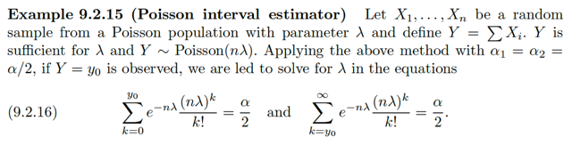</kbd>

> [!NOTE]
> Ok, áp dụng vô ví dụ này thế nào. X1,...Xn là random sample từ Poisson population
> parameter λ và Y = ΣiXi, Y ~ Poisson(nλ), là sufficient statistic cho λ.
>
>
>
> Để quá trình áp dụng được trơn tru, có lẽ nên ôn lại phần lí thuyết đã học hôm qua.
> Đại khái là ta đang ở trong bối cảnh là muốn DỰA TRÊN MỘT MONOTONE PIVOT
> để xây dựng được confidence set có dạng một INTERVAL Vắn tắt chút xíu: Trước đó,
> ta đã biết về việc dùng pivot, là rv có dạng Q(**X**, θ) mà distribution của nó không
> phụ thuộc θ. Để rồi nếu xác định được a,b sao cho với α mong muốn cho trước thì
> P_θ(a ≤ Q(**X**, θ) ≤ b) ≥ 1-α thì khi đó với bài toán testing H0: θ = θ0, tập A(θ0) =
> {**x**: a ≤ Q(**x**, θ) ≤ b} chính là một level α acceptance region, để rồi theo Tautology
> theorem, C(**X**) = {θ: a ≤ Q(**X**, θ) ≤ b} chính là 1-α confidence set của θ. Rồi sau
> đó, tùy vào việc hàm Q monotone increasing / decreasing theo θ với mọi x thì ta sẽ
> giải tìm L(**X**, a hoặc b) và U(**X**, b hoặc a) để có interval có dạng [L(**X**),
> U(**X**)].
>
>
>
> Thế rồi, location scale family cho ta một cách tiếp cận để tìm pivot. Bên cạnh đó còn
> một cách tiếp cận khác. Dùng theorem PIT. Nói rằng nếu ta có X ~ FX thì FX(X) ~
> Uniform(0,1). Nên nếu ta có statistic T, thì FT(T|θ) sẽ là uniform(0,1) rv, có distribution
> không phụ thuộc θ. Từ đó, với case liên tục thì ta có theorem giúp xây confidence set
> của θ đại khái là như sau: là nếu có α1 + α2 = α thì dựa vào pivot FT(T|θ), thì {t: α1 ≤
> FT(t|θ0) ≤ 1-α2} chính là level α acceptance region của bài toán testing H0: θ = θ0.
> Để rồi, theo Tautology, {θ: α1 ≤ FT(t|θ) ≤ 1-α2} chính là 1-α confidence set của θ.
> Tương tự, tùy vào FT là hàm monotone increasing hay decreasing đối với θ, thì ta sẽ
> giải các hệ phương trình để tìm ra chặn trên và chặn dưới, giúp thể hiện confidence
> set ở dạng một interval. Cụ thể là nếu FT monotone increasing thì α1 = FT(t|θL(t)) và
> 1-α2 = FT(t|θU(t)). Ngược lại nếu FT monotone decreasing thì α1 = FT(t|θU(t)) và 1-α
> = FT(t|θL(t)).
>
>
>
> Rồi, bây giờ ta mới tiến sang case biến rời rạc. Vấn đề là với biến rời rac, thì không
> có chuyện nếu X ~ FX thì FX(X) là uniform(0,1), để rồi, cdf của nó tại θ, tức P(FX(X) ≤
> θ) bằng đúng θ. Trong case liên tục thì ta có điều này, nên mới dùng nó để chứng
> minh cái tập {t: α1 ≤ FT(t|θ0) ≤ α2} là size α acceptance region của bài toán testing
> H0: θ = θ0 Còn trong discrete case, ta sẽ ko làm vậy được.
>
>
>
> Thay vào đó ta mới dựa trên tính chất gọi là "**stochastically greater than uniform**" của
> một biến rời rạc được tạo thành bởi áp cdf của X lên chính nó: P(FX(X) ≤ ω) ≤ ω
> (không phải là dấu bằng như của case liên tục). Và với FbarX(u) được định nghĩa là
> = P(X ≥ u) thì FbarX(X) cũng có tính stochastically greater than uniform, nên
> P(FbarX(X) ≤ ε) ≤ ε.
>
>
>
> Từ đó, ta có thể chứng minh một theorem nói rằng, nếu ta có statistic T với cdf FT và
> define hàm FbarT(t|θ) = P_θ(T ≥ t) như trên thì tập sau đây sẽ là level α acceptance
> region của bài toán testing H0: θ = θ0:
>
>
>
> A(θ0) = {t: α1 ≤ FT(t|θ) và α2 ≤ FbarT(t|θ)}
>
>
>
> Khúc này mình sẽ chứng minh lại luôn:
>
>
>
> sup_θ ∈ Θ0={θ0) P_θ(reject H0) = P_θ0(reject H0)
>
>
>
> = 1 - P_θ0(accept H0) = 1 - P_θ0(T ∈ A(θ0)
>
>
>
> = 1 - P_θ0(α1 ≤ FT(T|θ) ∩ α2 ≤ FbarT(T|θ))
>
>
>
> Tại đây dùng một định lí chuyển xác suất của intersection của hai event thành xác
> suất của union của complement (phần bù của nó): De Morgan theorem: (A ∩ B)c = Ac
> U Bc  ⇨ P[(A ∩ B)c] = P(Ac U Bc) ⇔ 1 - P(A ∩ B) = P(Ac U Bc)
>
>
>
> ⇨ .. = P_θ0(α1 > FT(T|θ) U α2 > FbarT(T|θ))
>
>
>
> Dùng thêm định lí P(A U B) ≤  P(A) + P(B)
>
>
>
> ⇨ .. ≤ P_θ0(α1 > FT(T|θ)) + P(α2 > FbarT(T|θ))
>
>
>
> viết lại cho thuận mắt
>
>
>
> = P_θ0(FT(T|θ) < α1) + P(FbarT(T|θ) < α2)
>
>
>
> Với tính chất stochastic greater than uniform của FT(T|θ), và FbarT(T|θ) thì ta có
> P_θ0(FT(T|θ) < α1) ≤ α1 và P(FbarT(T|θ) < α2) ≤ α2
>
>
>
> .. ≤ α1 + α2 = α
>
>
>
> Như vậy đã chứng minh được A(θ0) là một level α acceptance region của bài toán
> testing H0: θ = θ0.
>
>
>
> Và do đó, again, theo Tautology theorem. thì C(T) = {θ: α1 ≤ FT(T|θ), α2 ≤ FbarT(T|θ)}
> chính là 1-α confidence set của θ.
>
>
>
> Để rồi ta sẽ chuyển sang dạng [L(**X**), U(**X**)] bằng cách giải các phương trình:
>
>
>
> Nếu FT monotone increasing theo θ với mọi t, khi đó, theo định nghĩa cua FbarT thì
> nó sẽ  monotone decreasing theo θ với mọi t:
>
>
>
> thì giải α1 = FT(t|θ) sẽ cho ta chặn dưới, nói cách khác α1 = FT(t|θL(t)) và giải α2 =
> FbarT(t|θ) sẽ cho ta chặn trên, nói cách khác α2 = FbarT(t|θU(t))
>
>
>
> Ngược lại, nếu FT monotone decreasing thì giải α1 = FT(t|θ) sẽ cho ta chặn trên
> θU(t) và giải phương trình α2 = FbarT(t|θ) sẽ cho ta chặn dưới θL(t).
>
>
>
> =====
>
>
>
> Bây giờ sau khi đã nhớ lại lí thuyết, ta sẽ áp dụng vào bài toán này: Thì Y là tổng Xi,
> là một sufficient statistic, có cdf FY là cdf của Poisson(nλ). Thế thì áp dụng lí thuyết
> trên ta sẽ có A(λ0) = {y: α1 ≤ FY(y|λ0), α2 ≤ FbarY} là level α acceptance region của
> bài toán testing H0: λ = λ0. Để rồi C(Y) = {λ: α1 ≤ FY(Y|λ), α2 ≤ FbarY(Y|λ)} chính là
> 1-α confidence set của λ.
>
>
>
> Và với giá trị quan sát được Y = y0, α1 = α2 = α/2, ta sẽ giải hai phương trình:
>
>
>
> alpha 1 = α/2 = FY(y0|λ) và α2 = α/2 = FbarY(y0|λ)
>
>
>
> Việc còn phải làm là xem FY(y|λ) là hàm monotone increasing hay decreasing theo λ
> để xác định cái nào là chặn trên hay dưới
>
>
>
> Vậy phải xem lại cdf của Poisson. Ta có pmf của X ~ Poisson(λ) fX(x) = P(X=x)
>
>
>
> = exp(-λ) λ^x / x!
>
>
>
> ⇨ cdf FX(x) = P(X ≤ x) = Σk=0,1,..x exp(-λ) λ^k / k!
>
>
>
> và FbarX(X) = P(X ≥ x) = Σk=x,x+1,..inf exp(-λ) λ^k / k!
>
>
>
> Áp dụng vào đây, với giá trị quan sát Y = y0 ta sẽ cần giải phương trình:
>
>
>
> FY(y0|λ) = Σk=0,1,..y0 exp(-nλ) (nλ)^k / k! = α/2
>
>
>
> FbarY(y0|λ) = Σk=y0,y0+1,..inf exp(-nλ) (nλ)^k / k! = α/2
>
>
>
> Đây chính là hai phương trình 9.2.16 trong sách.

**🔗 See also:** [Vùng HPD Poisson](#node-yh9h8wy)

 

- **Khoảng tin cậy Poisson Chi-square**

<kbd>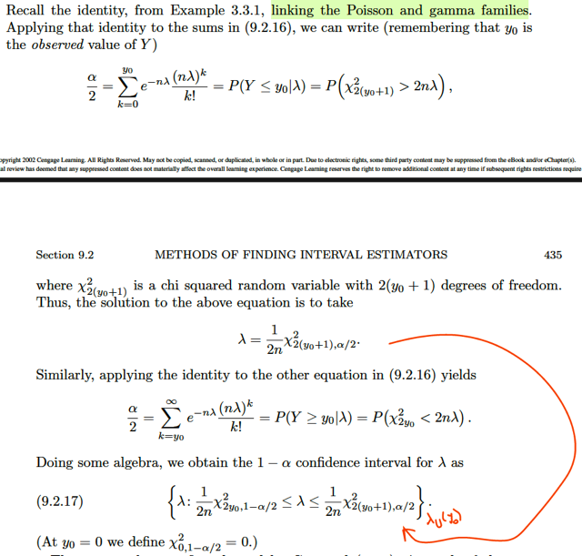</kbd>

> [!NOTE]
> Tiếp, gs nhắc lại ví dụ 3.3.1 nói về một quan hệ giữa Gamma và Poisson
> distribution: Nếu X ~ Γ(**α**, β) thì với mọi x: P(X ≤ **x**) = P(Y ≥ **α**) với Y ~
> Pois(**x**/β) (lúc đó mình tạm bỏ qua chưa note chứng minh)
>
>
>
> Ở đây ta đang có Y ~Pois(nλ), và đang giải hai phương trình:
>
>
>
> FY(y0|λ) = α/2 và FbarY(y0|λ) = α/2
>
>
>
> FY(y0|λ) theo định nghĩa, chính là P_λ(Y ≤ y0), = 1 - P_λ(Y > y0), và vì Y discrete
> nên cái này = 1 - P_λ(Y ≥ y0 + 1)
>
>
>
> Và 3.3.1 giúp ta có, vì Y ~ Pois(nλ) coi như Pois(2nλ/2) (2nλ đóng vai x, 2 đóng
> vai β)
>
>
>
> Thì khi đó gọi X là Γ(y0+1, 2) thì P_λ(Y ≥ y0 + 1) chính là P(X < 2nλ)
>
>
>
> ⇨ 1 - P_λ(Y ≥ y0 + 1) = 1 - P(X < 2nλ)  = P(X ≥ 2nλ)
>
>
>
> Tới đây gs Casella lại liên hệ Γ với Chi-Square nữa: X^2_p chính là Γ(p/2,2) Nên
> Γ(y0+1, 2) chính là X^2_2(y0+1), là Chi-quare bậc tự do 2(y0 + 1).
>
>
>
> Nên thành ra phương trình cần giải FY(y0|λ) = α/2 chính là P(X ≥ 2nλ) = α/2 cũng
> là P(X^2_2(y0+1) ≥ 2nλ) (Vì X là rv ~ Γ(y0+1, 2), cũng là ~ X^2_2(y0+1))
>
>
>
> Và dùng cdf của X^2_2(y0+1), giúp ta giải ra λ:
>
>
>
> P(X^2_2(y0+1) ≥ 2nλ) = α/2
>
>
>
> ⇔ 2nλ = X^2_2(y0+1),α/2
>
>
>
> ⇔ λ = X^2_2(y0+1),α/2 / 2n
>
>
>
> Cái chỗ này dễ lú, phải hiểu thế này, X^2_2(y0+1) chỉ là kí hiệu ám chỉ X trong
> phương trình P(X ≥ 2nλ) = α/2 là một biến thuộc phân phối Chi-square có bậc tự
> do 2(y0 + 1), y như khi nếu như X là Normal(0,1) thì ta sẽ viết phương trình là
> P(Normal(0,1) ≥ 2nλ) = α/2 vậy, X^2_2(y0+1) nó chỉ là kí hiệu của Chi-square
> distribution.
>
>
>
> Rồi, giả sử như X là Normal(0,1), mà mình hay dùng kí hiệu là Z, thì phương trình
> cần giải sẽ là P(Z ≥ 2nλ) = α/2, và ta đã biết, dùng bảng tra pdf của  Normal 0,1,
> thì cái mốc mà 2nλ cần bằng để P(Z ≥ 2nλ) = α/2 chính là / hay được kí hiệu là
> Z_α/2
>
>
>
> Thì tương tự như vậy, ở đây X là Chi-square bậc tự do 2(y0 + 1), kí hiệu
> X^2_2(y0+1)  (thay cho Z) thì cái mốc giá trị mà 2nλ cần bằng để P(Z ≥ 2nλ) = α/2
> chính là hay được kí hiệu là X^2_2(y0+1)_α/2, hay X^2_2(y0+1), α/2, chỉ vậy thôi.
>
>
>
> Do đó 2n λ = X^2_2(y0+1), α/2
>
>
>
> ⇨ λ = (1/2n) X^2_2(y0+1), α/2
>
>
>
> Và hoàn toàn tương tự ta sẽ giải ra cái mốc trên.
>
>
>
> Đáng lí nên có bước biện luận là FY(y|λ) là hàm monotone increasing .
> decreasing để biết hai cái mốc này cái nào là λL(y0) cái nào là λU(y0) nữa.
> Nhưng cũng dễ thôi. Có thể làm theo calculus, hoặc dùng story của phân phối
> Poisson.
>
>
>
> Phân phối Posson(λ), còn nhớ trong Stat110 với gs Joe, ta biết story của nó là
> rate of event. ví dụ số lần xuất hiện của một event trong một khoảng thời gian.
> Nếu và λ đóng vai tỉ lệ xuất hiện, nên dễ thấy này tăng lên, thì trong 1 khoảng
> thời  gian nhất định, số event xuất hiện sẽ tăng lên.
>
>
>
> Do đó xét FY(y|λ) = P_λ(Y ≤ y) với y fixed, thì khi λ tăng, tức tỉ lệ xuất hiện tăng
> thì xác suất để Y nhỏ hơn con số y fixed sẽ nhỏ lại, vì Y sẽ có xu hướng tăng lên
> do nó là số lần event xuát hiện mà. Như vậy dễ thấy FY(y|λ) là monotone
> decreasing đối với λ. Do đó λ mà ta có được ở phương trình đầu chính là chặn
> trên λU(y0) và cái kia là λL(y0)

**🔗 See also:** [Tích phân từng phần CDF Gamma](#node-ip8ufue)

 

- **Ví dụ của giáo sư**

<kbd>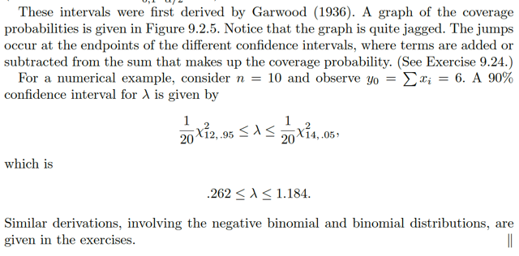</kbd>

> [!NOTE]
> Còn khúc nhỏ này, đại khái
> là gs cho ví dụ thôi

 

- **Diễn giải khoảng tin cậy**

<kbd>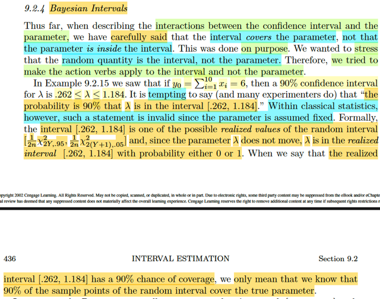</kbd>

> [!NOTE]
> Qua **Bayesian** **Interval**, đoạn này nhấn mạnh lại một ý rất quan
> trọng. đó là bữa giờ, ta luôn nói theo kiểu: interval "bao trùm"
> parameter, thay vì nói parameter "nằm trong" interval. Là bởi vì, bữa
> giờ, cái interval là cái random, có dạng [L(**X**), U(**X**)], gọi là
> random interval, hay nếu nói ở dạng khái quát C(**X**) thì nó là
> random set.
>
>
>
> Cụ thể lấy ví dụ nếu ta quan sát y0 = 6, thì một cái 90% confidence
> interval cho λ sẽ là 0.262 ≤ λ ≤ 1.184. Khi đó, gs nói ta **DỄ BỊ CÁM
> DỖ** bởi việc gọi là / nói là "**Xác suất λ nằm trong đoạn [0.262, 1.184]
> là 90%**".
>
>
>
> Tuy nhiên, theo trường phái thống kê cổ điển, **NÓI VẬY LÀ HOÀN
> TOÀN SAI**. Vì ta nhớ, theo trường phái này, θ là FIXED BUT
> UNKNOWN, không phải random quantity, thành ra, nếu quan sát
> thấy y0, từ đó xác định được  hai random variable trong random
> interval sẽ có phân phối cụ thể là Chi-square bậc mấy (2y0 và
> 2(y0+1)  từ đó xác định được hai cái X^2_2y0, .95 và X^2_2(y0+1), .
> 05 để có được [0.262, 1.184]
>
>
>
> Thì cho trước một khoảng như vậy, thì một là λ nằm trong đó, hai là
> nó nằm ngoài, đồng nghĩa xác suất này chỉ là 100% hoặc 0%.
>
>
>
> CÁCH HIỂU ĐÚNG, NHƯ ĐÃ NÓI, **PHẢI CHÚ TRỌNG VÀO CÁI
> RANDOM INTERVAL**. Tức là xác suất cái random interval [L(X), U(X)]
> = [X^2_2Y,.95, X^2_2(Y+1),.05] CHỨA λ LÀ 90%.
>
>
>
> Điều này có nghĩa là: **NẾU XÉT MỌI POSSIBLE VALUES CỦA HAI
> RANDOM VARIABLE X^2_2Y,.95, X^2_2(Y+1),.05 KHI CHO Y NHẬN
> MỌI POSSIBLE VALUE y CỦA NÓ. NHƯ VẬY, THÌ SẼ CÓ 90% CÁC
> GIÁ TRỊ y CỦA Y (*) TẠO RA CÁC CẶP X^2_2y,.95, X^2_2(y+1) GIÚP
> TẠO RA MỘT KHOẢNG SẼ CHỨA λ**.
>
>
>
> Nếu Y là biến liên tục, thì ta có thể hiểu ý (*) theo cách: tạo vô số lần
> random sample Y từ phân phối của nó, thì sẽ có 90% lần được giá trị
> y khiến tạo ra khoảng [X^2_2y,.95, X^2_2(y+1)] chứa λ.

 

- **Lý thuyết và Ước lượng Bayesian**

<kbd>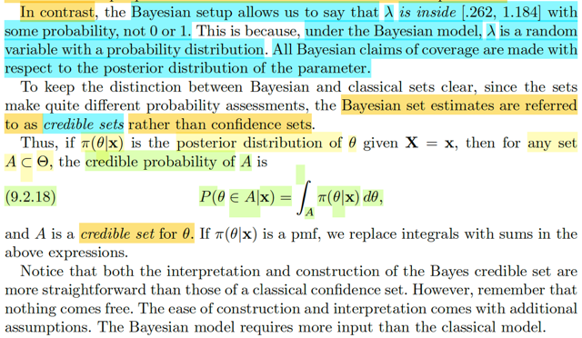</kbd>

> [!NOTE]
> Giờ nói về trường phái Bayesian, nhớ lại chút xíu. Trong Bayesian, người
> ta coi parameter là random variable, thay vì fixed but unknown. Mà đã là rv,
> thì dĩ nhiên có distribution. Thế thì, phân phối của nó gọi là prior distribution,
> kí hiệu π(θ). Nhưng khi quan sát thấy dữ liệu **X** = **x**, thì ta có thể dùng
> định lí Bayes f(**x**|θ)π(θ) = π(θ|**x**)f(**x**) ⇨ π(θ|**x**) = f(x|θ)π(θ)/f(**x**)
> để có được phân phối của θ dựa trên giá trị quan sát được của **X**. Đó
> được gọi là posterior distribution của θ. Và cũng vì vậy mà trường phái này
> đặt tên là Bayesian.
>
>
>
> Thế thì trong chap 7, mình đã học cái gọi là Bayes estimator. Estimator
> được định nghĩa là một function của random sample W(**X**) được xây
> dựng nhằm mục đích dựa trên quan sát thấy **X** = **x**, ta sẽ có một suy
> luận về giá trị của θ: W(**x**) Điển hình là các các tiếp cận như method of
> moment, maximum likelihood estimator Ví dụ, với MLE, thì function W đó
> chính là: θ^_mle = argmax_θ L(θ|**x**), mang ý nghĩa: dựa trên gía trị quan
> sát thấy **X** = **x** thì θ nào trong không gian Θ sẽ có độ hợp lí lớn nhất
> dựa trên quan sát thấy **x**. Nên θ^_mle(**X**) = argmax_θ L(θ|**X**)Vậy thì qua Bayes estimator, vì coi θ như random variable, nên nó có
> distribution prior distribution π(θ) và posterior distribution π(θ|**x**). Và **ĐỐI
> DIỆN VỚI MỘT DISTRIBUTION THÌ ĐIỀU HỢP LÍ LÀ DÙNG MEAN CỦA
> NÓ, DĨ NHIÊN SẼ LÀ MỘT CON SỐ CỐ ĐỊNH**. Và đó **CHÍNH LÀ ĐỊNH
> NGHĨA CỦA BAYES ESTIMATOR**: θ^_B(**X**) = E[θ|**X**]
>
>
>
> Vậy quay lại đây, với việc coi θ như random variable thì trường phái
> **BAYESIAN CHO PHÉP NÓI: XÁC SUẤT θ NẰM TRONG MỘT KHOẢNG
> NÀO ĐÓ**. Lúc này, khoảng là cố định, và yếu tố random đến từ θ. Và ví dụ
> như xét xác suất λ ∈ [.262, 1.184] thì ta sẽ tính nó với xác suất posterior
> của λ: π(λ|**x**), không phải với prior distribution.
>
>
>
> Và để nhấn mạnh sự khác nhau giữa hai khoảng của hai trường phái, thì
> Bayesian gọi nó là **CREDIBLE SET / INTERVAL.**
>
>
>
> Định nghĩa chính thức của một credible set đơn giản là **bất kì tập con nào
> của Θ**. Và ta sẽ có cái gọi là **CREDIBLE PROBABILITY của A** được định
> nghĩa là:
>
>
>
> P(θ ∈ A|**x**) = ∫_A π(θ|**x**)dθ

 

- **Khoảng tin cậy Poisson Gamma**

<kbd>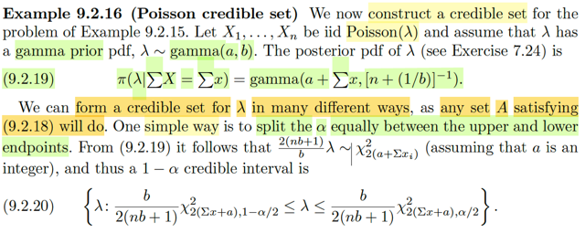</kbd>

> [!NOTE]
> Ok, ví dụ này cho X1,..Xn là iid Pois(λ) và cho rằng prior distribution của 
> λ là Γ(a,b). Thì khi đó posterior pdf của λ là π(λ| ΣiXi = Σixi) sẽ là 
> Γ(a + Σx, [n + (1/b)]^-1
>
>
>
> Đây là nội dung của bài tập 7.24, thử làm lại cho nhớ:
>
>
>
> Theo lí thuyết vừa ôn lại ban nãy:
>
>
>
> π(λ|**x**) = f(**x**|λ)π(λ)/f(**x**) 
>
>
>
> Với với X1,...Xn là iid Poison(λ) ta có f(**x**|λ) như sau:
>
>
>
> f(**x**|λ) = Πi f(xi|λ) (do tính iid)
>
>
>
> = Πi [exp(-λ) λ^xi / xi!]
>
>
>
> = Πi exp(-λ) Πi λ^xi / Πi xi!
>
>
>
> = exp(-Σiλ) λ^(Σixi) / Πi xi!
>
>
>
> = exp(-nλ) λ^(Σixi) / Πi xi!
>
>
>
> Với λ, ta đang giả định prior distribution của nó là  Γ(a,b), nên: 
>
>
>
> π(λ) = [1/Γ(a)b^a] λ^(a-1) exp(-λ/b)   
>
>
>
> Còn f(**x**) là prior distribution của **X** tại **x**, chỉ là constant nào đó, ta ko care
>
>
>
> Như vậy dùng notation tỉ lệ thuận ∝ ta có:
>
>
>
> f(**x**|λ) ∝ exp(-nλ) λ^(Σixi) λ^(a-1) exp(-λ/b) 
>
>
>
> = exp(-nλ-λ/b) λ^(Σixi+a-1) 
>
>
>
> = λ^(Σixi+a-1) exp(-nλ-λ/b)
>
>
>
> = λ^(Σixi+a-1) exp[-λ(n+1/b)]
>
>
>
> = λ^(Σixi+a-1) exp[-λ(nb+1)/b)]
>
>
>
> = λ^(Σixi+a-1) exp[-λ/[b/(nb+1)]]
>
>
>
> Đây chính là cái ruột (kernel) của công thức pdf của Γ(Σixi+a, b/(nb+1))
>
>
>
> = Γ(Σixi+a, 1/[(nb+1)/b])
>
>
>
> = Γ(Σixi+a, 1/[n+1/b])
>
>
>
> = Γ(Σixi+a, [n+1/b]^-1)
>
>
>
> (những gì còn lại để tạo nên pdf đầy đủ sẽ chỉ là normalizing constant
> mà ta tin chắc là các term liên quan đến **x**, không dính tới λ sẽ cùng
> nhau tạo thành)
>
>
>
> Do đó, ta có thể kết luận posterior distribution của λ dựa trên quan sát
> **X** = **x** sẽ chính là Γ(Σixi+a, [n+1/b]^-1) chính là 9.2.19
>
>
>
> Ok, vậy thì đại ý là, để tạo một 1-α CREDIBLE INTERVAL của λ, ta sẽ tìm 
> set đơn giản như sau: 
>
>
>
> Tìm set A sao cho P(λ ∈ A|**x**) = 1-α 
>
>
>
> set A sẽ là một interval, nên ta biết:
>
>
>
> P(lower bound ≤ λ ≤ upper bound|**x**) = 1-α
>
>
>
> Nhưng làm vậy thì sẽ đại khái là sẽ hơi khó, vì thật ra mình có thể chọn
> lower bound nào đó, rồi dựa vào pdf của λ, giải phương trình để tìm upper
> bound, hoặc ngược lại.
>
>
>
> Thế thì ở đây gs cho cách làm đơn giản hơn: Dựa trên việc mình biết
> quan hệ của Γ và Chi-square: Chi-square p bậc tự do, kí hiệu X^2_p chính
> là một Γ(p/2,2). Vậy thì ở đây ta có λ là một Γ(Σixi+a, [n+1/b]^-1)
>
>
>
> Dẫn đến, theo location scale family, thì nếu X có pdf/pmd là thành viên của family
> ứng với location μ. scale σ thì X/σ sẽ là rv có pdf là thành viên có scale 1.
> Xem link, trong phần đó, tác giả cũng cho ta biết Γ(α, β) nếu giữ α fixed, thì nó là 
> một scale family với scale param là β. Như vậy distribution của λ là thành viên
> của scale family ứng với scale param = [n+1/b]^-1. Nên như trên, λ / [n+1/b]^-1
> = [n+1/b] λ CHÍNH LÀ THÀNH VIÊN ỨNG VỚI SCALE PARAM = 1.
>
>
>
> Và như vậy cũng dễ hiểu [n+1/b] λ sẽ là thành viên trong họ với scale param = 2.
>
>
>
> Nói cách khác, 2[n+1/b] λ = [2(nb+1)/b] λ CHÍNH LÀ MỘT Γ(Σixi+a, 2)
>
>
>
> Mà như ta cũng biết Γ(p/2,2) chính là X^2_p
>
>
>
> ⇨ [2(nb+1)/b] λ CŨNG CHÍNH LÀ MỘT X^2_2(Σixi+a), TỨC CHI-SQUARE
> BẬC TỰ DO 2(Σixi+a).
>
>
>
> Từ đó, ta có thể tìm khoảng credible dựa theo distribution của CHI-SQUARE, như
> sau:
>
>
>
> Ta muốn tìm khoảng [l, u] sao cho P(l ≤ λ ≤ u) = 1-α 
>
>
>
> Xét riêng vế trái: P(l ≤ λ ≤ u), có bản chất chỉ là:
>
>
>
> P({o ∈ Ω: l ≤ λ(o) ≤ u})
>
>
>
> Mà l ≤ λ(o) ≤ u ⇔ l*(2[n+1/b]) ≤ 2[n+1/b] λ ≤ u*(2[n+1/b])
>
>
>
> ⇨ P({o ∈ Ω: l ≤ λ(o) ≤ u}) = P({o ∈ Ω: l*(2[n+1/b]) ≤ 2[n+1/b] λ ≤ u*(2[n+1/b])})
>
>
>
> = P(L(n,b) ≤ X^2_2(Σixi+a) ≤ U(u,n,b))
>
>
>
> với L(l,n,b) = l*(2[n+1/b]), U(u,n,b) = u*(2[n+1/b])
>
>
>
> Và như vậy, cái khoảng cần tìm l,u trở thành cái khoảng L, U cần tìm sao cho:
>
>
>
> P(L(n,b) ≤ X^2_2(Σixi+a) ≤ U(u,n,b)) = 1 - α 
>
>
>
> Và đây là xác suất của event liên quan đến rv distribution X^2_2(Σixi+a)
>
>
>
> Cách làm rất đơn giản: 
>
>
>
> Chọn mốc L là mốc mà P(X^2_2(Σixi+a) < L) = α/2
>
>
>
> cũng chính là P(X^2_2(Σixi+a) ≥ L) = 1-α/2
>
>
>
> , mốc này chính là đươc kí hiệu là X^2_2(Σixi+a), 1-α/2
>
>
>
> (với một distribution, thì cái mốc k khíến P(X > k) = α thì k = [tên distribution]_α 
> ví dụ ta hay gặp Z ~ normal(0,1), thì mốc P(Z > k) = α thì k = z_α.
>
>
>
> Chọn mốc U là mốc mà P(U < X^2_2(Σixi+a) = α/2, mốc này đựơc kí hiệu là
> X^2_2(Σixi+a), α/2
>
>
>
> Như vậy, P[L ≤ X^2_2(Σixi+a) ≤U]
>
>
>
> = 1 - P(X^2_2(Σixi+a) < L) - P(U <  X^2_2(Σixi+a)) = 1 - α/2 - α/2 = 1 - α NHƯ
> YÊU CẦU.
>
>
>
> Tuy nhiên đây chỉ là khoảng của X^2_2(Σixi+a), tức 2(Σixi+a)λ 
>
>
>
> Ta cần gỉai ra hai cái mốc l,u của λ:
>
>
>
> L(l,n,b) = X^2_2(Σixi+a), 1-α/2 = l*(2[n+1/b]) = l * 2(nb+1)/b
>
>
>
> ⇔ l = **[b/2(nb+1)] X^2_2(Σixi+a), 1-α/2**
>
>
>
> U(u,n,b) = X^2_2(Σixi+a), α/2 = u*(2[n+1/b]) = u * 2(nb+1)/b
>
>
>
> ⇔ u = **[b/2(nb+1)] X^2_2(Σixi+a), α/2**
>
>
>
> Vật 1-α CREDIBLE INTERVAL của λ là: 
>
>
>
> [b/2(nb+1)] X^2_2(Σixi+a), 1-α/2 →  [b/2(nb+1)] X^2_2(Σixi+a), α/2]
>
>
>
> Chính là 9.2.20

**🔗 See also:** [Xác suất Credible & Tin cậy](#node-m77g4jo) · [Vùng HPD Poisson](#node-yh9h8wy)

 

- **Khác biệt Credible Confidence**

<kbd>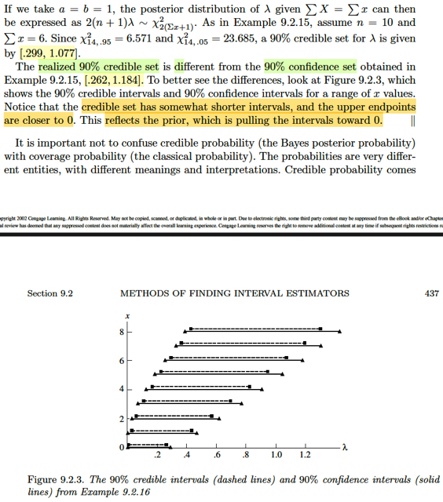</kbd>

> [!NOTE]
> Rồi, đại khái là gs nói nếu lấy a = b = 1 thì ta sẽ có 2(n+1)λ sẽ là
> một Chi-square_2(Σx+1), và làm giống ví dụ 9.2.15 (nơi ta cũng lấy
> ví dụ này, nhưng tìm confidence interval) với n = 10, Σx = 6, thì ta
> sẽ có 90% credible interval là [.299, 1.077].
>
>
>
> Kết quả này hơi khác so với kết quả confidence interval mà ta giải
> ra ở bài đó: [.262, 1.184].
>
>
>
> Và gs cho biết, nếu ta lấy tính và vẽ hai cái này với các observed
> value của Σx khác nhau, thì ta sẽ thấy credible set NGẮN HƠN
> cũng như ĐIỂM CUỐI CỦA NÓ GẦN 0 HƠN, điều này được cho
> là phản ánh cái prior distribution của λ

 

- **Xác suất đáng tin cậy và độ phủ**

<kbd>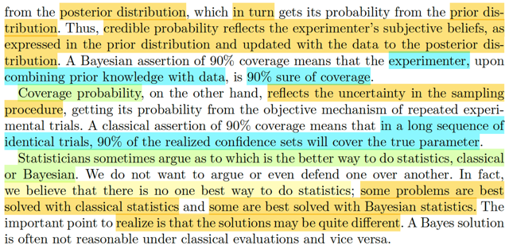</kbd>

<kbd>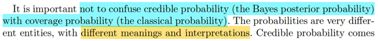</kbd>

> [!NOTE]
> Đại khái là chỗ này gs nhấn mạnh cần phân biệt ý nghĩa khác nhau của
> credible probability và coverage probability.
>
>
>
> Như đã biết, credible probability của một credible interval là xác suất mà
> parameter (theo Bayesian, là random variable) nằm trong interval đó, với
> phân phối của parameter là posterior distribution π(θ|**x**).
>
>
>
> Nếu gọi A là credible interval thì nó là P(θ ∈ A) = ∫_A π(θ|**x**)dθ
>
>
>
> Trong khi đó, coverage probability, nhớ lại một chút về khái niệm này: Nó
> là xác suất mà một confidence set, hay confidence interval (là một random
> inverval) che phủ được giá trị thực sự của θ (vốn dĩ là giá trị cố định
> nhưng chưa biết).
>
>
>
> Nếu gói C(**X**) = [L(**X**), U(**X**)] là confidence interval thì coverage
> probability là P_θ(L(**X**) ≤ θ ≤ U(**X**)), và đây là xác suất của joint
> event của hai statistic L(**X**) và U(**X**).
>
>
>
> (và sẵn nói luôn, nếu lấy infimum: inf_θ P_θ(L(**X**) ≤ θ ≤ U(**X**)) thì
> chính là confidence coefficient của interval estimator / confidence interval.
> [L(**X**), U(**X**)]
>
>
>
> Thế thì quay lại, đây, dễ hiểu điều tác giả nói, cái credible probability là
> xác xuất của một event liên quan đến random variable θ, tuân theo
> posterior distrib π(θ|**x**), mà dĩ nhiên là cũng sẽ liên đới tới prior
> distribution π(θ) **được** **chọn. Do đó, NÓ ÍT NHIỀU PHẢN ẢNH NIỀM
> TIN BAN ĐẦU của experimenter khi chọn prior distribution của θ.**
>
>
>
> Và việc ta có P(θ ∈ A) = 90% sẽ mang ý nghĩa là: θ có phân phối xác
> suất khiến nếu lấy **ngẫu nhiên giá trị của nó vô số lần thì 90% nó sẽ nằm
> trong khoảng A này**.Trong khi đó, coverage probability là xác suất che phủ được θ mang giá
> trị cố định của random interval [L(**X**), U(**X**)], lại liên quan đến
> distribution của **X**. Và xác suất coverage 90% sẽ mang ý nghĩa là: nếu
> ta sampling giá trị của **X vô số lần thì 90% giá trị quan sát được sẽ tạo
> nên một khoảng L(x), U(x) chứa θ.** Do đó, chính là ý giáo sư Casella nói
> ở câu "**reflect the uncertainty in the sampling procedure**"
>
>
>
> Thằng Gemini có cái ví von rất hay mình copy của nó:
>
>
>
> **Frequentist** (Coverage Probability): **Đánh giá sự rủi ro của CÔNG CỤ
> ĐO LƯỜNG** (Sampling procedure). Tham số $\\θ$ là cái **cọc sắt đóng
> cứng trên đất**. Cái **Interval** là cái vòng. Mày **ném vòng vô số lần**
> (lấy mẫu $X$ vô số lần), **90% số vòng sẽ trúng cọc.**
>
>
>
> **Bayesian** (Credible Probability): **Đánh giá sự bất định** của **CHÂN
> LÝ** (True parameter). Cái Interval là một **cái lồng sắt mày vừa đóng
> xuống đất** (dựa vào Data **X** đã cố định). Tham số θ là **con chim
> bay lượn ngẫu nhiên** (dựa trên Prior + Data = Posterior). Mày khẳng
> định có **90% khả năng con chim đang đậu** trong cái lồng này.
>
>
>
> Đoạn cuối gs Casella nói về quan điểm của ông về hai trường phái thống
> kê: ko có cái nào ưu việt hơn cái nào. Mà tùy hoàn cảnh mà vận dụng.

 

- **Xác suất Credible & Tin cậy**

<kbd>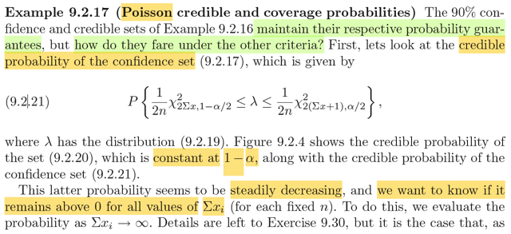</kbd>

> [!NOTE]
> Ví dụ này, đại ý là vầy:
>
>
>
> Gs xét (để so sánh) hai cái:
>
>
>
> Cái thứ nhất: Lấy cái 1-α confidence interval của λ mà ta đã làm ở ví dụ
> trước (cái vụ dùng tính chất "stochastically greater than uniform" để xây
> dựng level α acceptance region của bài toán testing H0: λ = λ0 và sau đó
> dùng Tautology để có C(**X**) là 1-α confidence set. Rồi lập luận dựa trên
> tính monotone increasing / decreasing của FY(y|λ) để mà giải ra hai cái
> chặn λL(y0) và λU(y0) đó.
>
>
>
> Thế thì gs viết lại cái confidence interval đó ở đây, và xét **CREDIBLE
> PROBABILITY** của cái tập CONFIDENCE, tức là, xét **XÁC SUẤT BIẾN λ
> NẰM TRONG CÁI CONFIDENCE SET NÀY**.
>
>
>
> Và vẽ giá trị xác suất này khi giá trị quan sát y0, tức Σixi khác nhau.
>
>
>
> Và nhận xét thấy rằng nó GIẢM DẦN. Mình sẽ quay lại nói vì sao nó giảm
> mà ko còn giữ giá trị 1-α.
>
>
>
> Cái thứ hai: Lấy cái 1-α credible interval mà ta vừa làm: là khoảng biến
> ngẫu nhiên  λ theo phân phối posterior π(λ|**x**) nằm trong đó là 1-α.
>
>
>
> Xác suất credible của cái này DĨ NHIÊN LÀ CỐ ĐỊNH, luôn bằng 1-α. VÌ
> SAO?
>
>
>
> MÌNH HIỂU THẾ NÀY: LÀ **BỞI VÌ KHI MÌNH XÂY DỰNG CÁI KHOẢNG
> CREDIBLE NÀY**, VỚI MỤC TIÊU LÀ **TÌM 1 KHOẢNG** MÀ **XÁC SUẤT
> λ NẰM TRONG ĐÓ**, DỰA TRÊN PHÂN PHỐI POSTERIOR CỦA NÓ, SẼ
> = **1 - α** . ĐỂ RA KẾT QUẢ NHƯ VẬY, thì ĐẠI KHÁI LÀ, **NÓ KHÔNG
> PHỤ THUỘC GIÁ TRỊ CỦA X**.
>
>
>
> Hay nói cách khác, việc ta thiết lập được khoảng
>
>
>
> A = [l = [b/2(nb+1)] X^2_2(Σixi+a), 1-α/2 ; u = [b/2(nb+1)] X^2_2(Σixi+a),
> α/2]
>
>
>
> khiến P(λ ∈ A) = 1-α vốn dĩ đã luôn đối xử với A như khoảng cố định rồi, giá
> trị này  chỉ phụ thuộc phân phối của λ. Do đó, P(λ ∈ A) = 1-α luôn đúng với
> mọi gía trị **x** củau **X** (cũng là với mọi **Σixi**)
>
>
>
> Nhưng vì sao **credible probability** của **confidence interval** của case
> thứ nhất lại thay đổi theo **x**: Là vì LÚC XÂY DỰNG RA confidence
> interval, ta KHÔNG COI λ LÀ BIẾN SỐ. Mà chỉ coi nó là số cố định,
> L(**X**), U(**X**) mới là biến số. Nên giờ đây ta lại coi λ là biến số, có
> distribution thì khi xét xác suất λ nằm trong khoảng này nó giống như là ta
> **LÀM MỘT ĐẰNG** mà **XÀI MỘT KIỂU** khác vậy,
>
>
>
> Tức là **DÙNG KHÔNG ĐÚNG CÁCH!**, thì dĩ nhiên là ko thể đòi xác suất
> này luôn = 1 - α được. Dùng đúng **cách phải là tiếp tục coi λ là fixed,
> confidence interval mới là random element.
>
>
>
> Và sở dĩ nó giảm khi dùng ko đúng cách là bởi: khi dùng theo cách đó, coi
> λ là biến thì nó bị chi phối bởi prior belief → khiến giá trị của nó bị kéo gần
> về 0**
>
>
>
> Nói chung đại khái nguyên nhân vẫn là ta **thiết kế một đằng mà sử dụng
> một nẻo.**
>
>
>
> Và vì dùng ko đúng cách thì đừng nói nó gì giảm, ko còn giữ giá trị 1-α
> mà thận chí nó còn có thể **TRỞ THÀNH 0 LUÔN**. Và điều này ko có gì
> mâu thuẫn cả, vì đã nói, vì ta dùng sai cách mà.

**🔗 See also:** [Khoảng tin cậy Poisson Gamma](#node-ahces3c)

 

- **Xác suất đáng tin cậy khoảng**

<kbd>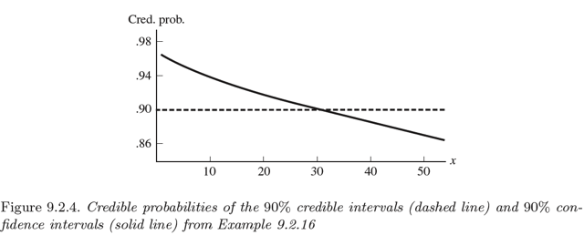</kbd>

 

- **Sai mục đích Credible Set**

<kbd>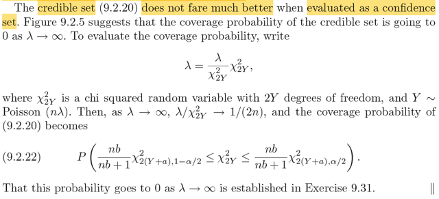</kbd>

> [!NOTE]
> Và sau đó,hoàn toàn tương tự, là nếu ta lại lấy **CREDIBLE SET** đem tính
> **COVERAGE PROBABILITY**, thì again, cũng lại là làm một đằng mà xài
> một kiểu: Sai mục đích.
>
>
>
> Do đó ko có gì đảm bảo mọi chuyện còn đúng nữa, cụ thể, khi thay đổi
> **λ, giá trị xác suất này cũng có thể trở thành lớn vô cùng** (việc chứng
> minh cụ thể có thể xem lại sau, nhưng đại ý là vậy)Vì sao "dùng sai mục đích", thì bởi **credible set được thiết kế bằng cách
> coi λ  là random variable có posterior distribution**, trong khi đó **lúc "xài"
> lại đem tính coverage probability, tức là lại coi yếu tố random đến từ hai
> cái chặn**, và coi λ  là fixed, vậy là sai rồi

 

- **Phân phối hậu nghiệm Bayes Normal**

<kbd>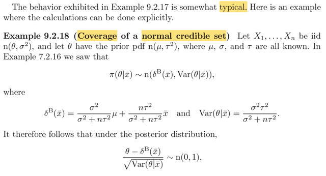</kbd>

> [!NOTE]
> Qua ví dụ này gs sẽ minh họa chuyện dùng sai vừa nói.
>
>
>
> Cho X1,...Xn là iid n(θ, σ^2) và θ là prior pdf n(μ, τ^2) với μ, σ, τ đều đã biết.
> Gs nhắc lại trong ví dụ 7.2.16 ta đã có kết quả: π(θ|xbar) ~ n(δB(xbar),
> Var(θ|xbar) với δB(xbar) và Var(θ|xbar) có công thức như vậy.
>
>
>
> Là sao nhỉ?
>
>
>
> Chỉ cần nhớ Bayes estimator của θ là cái gì: Theo định nghĩa, nó chính là
> mean của posterior distribution của θ, tức π(θ|**x**), và còn nhớ, estimator là
> function của random sample, và với Bayes estimator ta kí hiệu với chữ B:
> δB(**X**) (vs MLE: δ_mle(**X**)) mà function của **X** hay của Xbar thì cơ
> bản là như nhau, nên trong sách ở đây ghi là δB(xbar)
>
>
>
> Thành ra mình biết posterior distribution của θ cũng là normal, thì mình sẽ
> ghi là π(θ|**x**) ~  normal(δB(**X**), variance)
>
>
>
> variance thì ta sẽ bàn sau.
>
>
>
> Còn thử chứng minh π(θ|**x**) cũng là normal:
>
>
>
> π(θ|**x**) ∝ f(**x**|θ)π(θ) = Πi f(xi|θ)π(θ)
>
>
>
> = {Πi (1/√2πσ^2) exp[-(xi-θ)^2/2σ^2]} (1/√2πτ^2) exp[-(θ-μ)^2/2τ^2]
>
>
>
> = (1/√2πσ^2)^n exp[-Σi(xi-θ)^2/2σ^2] (1/√2πτ^2) exp[-(θ-μ)^2/2τ^2]
>
>
>
> = (1/√2πσ^2)^n (1/√2πτ^2) exp[-Σi(xi-θ)^2/2σ^2] exp[-(θ-μ)^2/2τ^2]
>
>
>
> Gom lại, ta có thể chỉ ra nó có dạng kernel của normal pdf, và mean và
> variance là gì. Từ đó kết luận posterior distribution là normal. Dĩ nhiên cũng
> sẽ cho ta luôn mean và variance thì mean chính là Bayes estimator δB(**X**)
>
>
>
> Còn cái variance sẽ kí hiệu là Var(θ|**X)**
>
>
>
> Để kết luận posterior π(θ|**x**) ~ normal(δB(**x**), Var(θ|**x**))
>
>
>
> (hay ghi như trong sách normal(δB(xbar), Var(θ|xbar) cũng được (vì
> một function của xbar thì cũng là function của **x** thôi)
>
>
>
> Và như θ theo posterior distribution ~ normal(δB(xbar), Var(θ|xbar))
>
>
>
> Từ đó theo location scale theorem, thì vì normal là một location scale family
> các pdf, với location chính là mean, scale chính là standard deviation và θ 
> thuộc thành viên ứng với location δB(xbar), scale là √Var(θ|xbar). Nên 
> [θ - δB(xbar)] / √Var(θ|xbar) thì chính là thành viên chuẩn của family, location
> 0 scale 1, tức là, và do đó, với việc đang xét normal. thì:
>
>
>
> [θ - δB(xbar)] / √Var(θ|xbar) ~ normal(0,1)

**🔗 See also:** [Ước lượng Bayes phân phối chuẩn](#node-5ldrh78)

 

- **Khoảng tin cậy 1-α**

<kbd>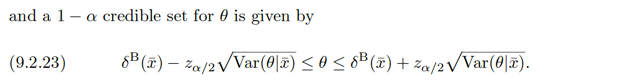</kbd>

> [!NOTE]
> Thế thì vì sao gs nói 1 - α credible set của θ là cái này?
>
>
>
> À thì là vì, nếu xét A là 1-α credible set của θ, thì có nghĩa là credible probability của nó là 1-α, theo định
> nghĩa ta có:
>
>
>
> P(θ ∈ A) = 1-α
>
>
>
> Bản chất của vế trái là: P({s ∈ Ω: θ(s) ∈ A})
>
>
>
> Gọi A có dạng là interval θL, θU: θ(s) ∈ A ⇔ θL ≤ θ(s) ≤ θU
>
>
>
> ⇔ θL - δB(xbar) ≤ θ(s) - δB(xbar) ≤ θU - δB(xbar)
>
>
>
> ⇔ [θL - δB(xbar)] / √Var(θ|xbar) ≤ [θ(s) - δB(xbar)] / √Var(θ|xbar) ≤ [θU - δB(xbar)] / √Var(θ|xbar)
>
>
>
> ⇔ [θL - δB(xbar)] / √Var(θ|xbar) ≤ Z(s) ~ normal(0,1) ≤ [θU - δB(xbar)] / √Var(θ|xbar)
>
>
>
> Vậy P({s ∈ Ω: θ(s) ∈ A})
>
>
>
> = P({s ∈ Ω: [θL - δB(xbar)] / √Var(θ|xbar) ≤ Z(s) ~ normal(0,1) ≤ [θU - δB(xbar)] / √Var(θ|xbar)})
>
>
>
> = P([θL - δB(xbar)] / √Var(θ|xbar) ≤ Z ≤ [θU - δB(xbar)] / √Var(θ|xbar))
>
>
>
> = FZ([θU - δB(xbar)] / √Var(θ|xbar)) - FZ([θL - δB(xbar)] / √Var(θ|xbar))
>
>
>
> Bài toán trở thành tìm θU, θL sao cho:
>
>
>
> = FZ([θU - δB(xbar)] / √Var(θ|xbar)) - FZ([θL - δB(xbar)] / √Var(θ|xbar)) = 1-α
>
>
>
> Chọn [θU - δB(xbar)] / √Var(θ|xbar) sao cho P(Z ≥ [θL - δB(xbar)] / √Var(θ|xbar)) = α/2
>
>
>
> ⇨ [θU - δB(xbar)] / √Var(θ|xbar) = z_α/2
>
>
>
> ⇨ θU = δB(xbar) + z_α/2 Var(θ|xbar)
>
>
>
> Chọn [θL - δB(xbar)] / √Var(θ|xbar) sao cho P(Z ≤ [θL - δB(xbar)] / √Var(θ|xbar)) = α/2
>
>
>
> ⇔ 1 - P(Z > [θL - δB(xbar)] / √Var(θ|xbar)) = α/2
>
>
>
> ⇔ 1 - α/2 = P(Z > [θL - δB(xbar)] / √Var(θ|xbar))
>
>
>
> Và như vậy [θL - δB(xbar)] / √Var(θ|xbar) = z_1-α/2
>
>
>
> Nhưng vì tính đối xứng qua 0 của normal(0,1) nên z_1-α/2, tức là 
>
>
>
> mốc z_1-α/2 mà tại đó P(Z > z_1-α/2) = 1-α/2
>
>
>
> thì **đổi dấu của nó** chính là **mốc mà P(Z < -z_1-α/2) = 1-α/2 (vì tính đối xứng nên cắm
> hai cái mốc đối xứng thì sẽ tạo hai cái đuôi có diện tích bằng nhau)**
>
>
>
> ⇔ α/2 = 1 - P(Z < -z_1-α/2)
>
>
>
> ⇔ α/2 = P(Z ≥ -z_1-α/2)
>
>
>
> ⇨ -z_1-α/2 cũng chính là z_α/2
>
>
>
> ⇨ **z_1-α/2 = -z_α/2.**
>
>
>
> ⇨ [θL - δB(xbar)] / √Var(θ|xbar) = -z_α/2
>
>
>
> ⇨ θL =  δB(xbar) - z_α/2√Var(θ|xbar)
>
>
>
> khi đó P([θL - δB(xbar)] / √Var(θ|xbar) ≤ Z ≤ [θU - δB(xbar)] / √Var(θ|xbar)) = 1 - α/2 - α/2 = 1-α
>
>
>
> Vậy 1-α credible interval A cần tìm chính là [δB(xbar) - z_α/2√Var(θ|xbar), δB(xbar) + z_α/2 √Var(θ|xbar)]

 

- **Độ phủ khoảng đáng tin**

<kbd>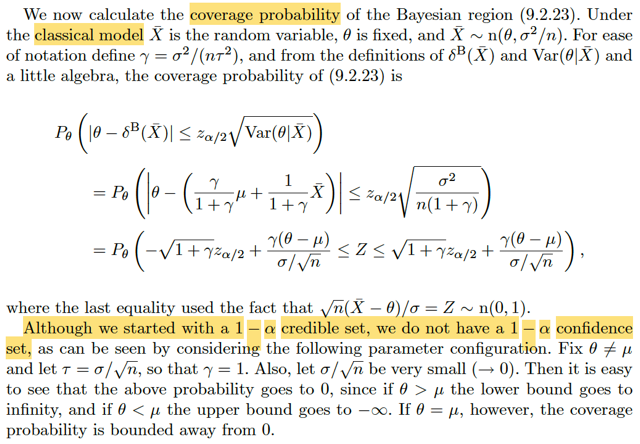</kbd>

> [!NOTE]
> Tiếp, ta sẽ thử đi tính coverage probability của cái 1-α credible interval
>
>
>
> [δB(xbar) - z_α/2√Var(θ|xbar), δB(xbar) + z_α/2 √Var(θ|xbar)]
>
>
>
> Có nghĩa là ta sẽ làm cái việc như sau: Nếu coi đây là một interval estimator
> hay còn gọi là confidence interval, thì coverage probability là gì, có còn là 1-α
> không.
>
>
>
> Cần ôn lại chút: Bản chất của interval estimator, hay confidence interval chỉ là
> một random set / interval C(**X**) = [L(**X**), U(**X**)]. Và có thể hiểu theo
> cách, ta sẽ có được cái này bằng cách app một "set function" hay "interval"
> function c(**x**) như sau: nhận vào **x**, trả ra một tập các θ, hay một đoạn các
> θ chặn bởi hai  đầu là L(**x**) và U(**x**). Áp cái hàm này vào random sample
> **X**, ta sẽ có một random set, hay random interval C(**X**) = [L(**X**), C(**X**)]
> (y như cái logic hay dùng là áp một function g(**x**) lên random variable **X**,
> sẽ cho ta một random variable mới g(**X**) vậy
>
>
>
> Thế thì note trước ta đã có [δB(xbar) - z_α/2√Var(θ|xbar), δB(xbar) + z_α/2
> √Var(θ|xbar)] là một 1-α credible set, mang ý nghĩa là khi coi θ như con chim
> bay lượn (random variable), thì dù **X** có observed bằng bao nhiêu (để có
> **x**, và xbar) thì xác suất nó đậu vào khoảng này luôn là 1-α.
>
>
>
> Nhưng bây giờ, ta lấy cái khoảng này ra, coi nó như hàm c(**x**), để áp vào
> **X**, thì nó cũng sẽ cho ta một random interval như vừa mới nói:
>
>
>
> C(**X**) =  [δB(Xbar) - z_α/2√Var(θ|Xbar), δB(Xbar) + z_α/2 √Var(θ|Xbar)]
>
>
>
> (chú ý, lúc này xbar phải ghi là Xbar)
>
>
>
> Đây dĩ nhiên là một random interval [L(**X**), U(**X**)] với
>
>
>
> L(**X**) = δB(Xbar) - z_α/2√Var(θ|Xbar)
>
>
>
> và U(**X**) = δB(Xbar) + z_α/2 √Var(θ|Xbar)
>
>
>
> Và ta sẽ đi tính coverage probability của cái interval estimator này.
>
>
>
> Theo định nghĩa, sẽ là P_θ(θ ∈ C(**X**))
>
>
>
> Điểm mà gs Casella đã nhấn mạnh nhiều lần ban nãy, đó là lúc này ta coi θ là
> fixed và chưa biết, và nó sẽ chi phối phân phối xác suất của **X**. Yếu tố ngẫu
> nhiên lúc này là **X**, tuân theo  phân phối f(**x**|θ), nên cái xác suất của event
> này là liên quan đến distribution của **X**.
>
>
>
> P_θ(θ ∈ C(**X**)) =  P_θ(δB(Xbar) - z_α/2√Var(θ|Xbar) ≤ θ ≤ δB(Xbar) + z_α/2
> √Var(θ|Xbar))
>
>
>
> dĩ nhiên, ta nên thấy đây là xác suất của joint event:
>
>
>
> P_θ(δB(Xbar) - z_α/2√Var(θ|Xbar) ≤ θ; θ ≤ δB(Xbar) + z_α/2 √Var(θ|Xbar))
>
>
>
> Thay công thức của δB(Xbar) và Var(θ|Xbar) và Đặt γ = σ^2/(nτ^2)
>
>
>
> δB(Xbar) = (σ^2 / (σ^2 + nτ^2)) μ + (n τ^2 / (σ^2 + n τ^2)) Xbar
>
>
>
> = (σ^2/nτ^2 / (σ^2/nτ^2 + 1)) μ + (1 / (σ^2/n τ^2 + 1)) Xbar
>
>
>
> = (γ / (γ + 1)) μ + (1 / (γ + 1)) Xbar
>
>
>
> Var(θ|Xbar) = σ^2 τ^2 / (σ^2 + nτ^2)
>
>
>
> = σ^2/nτ^2 τ^2 / (σ^2/nτ^2 + 1)
>
>
>
> = γ τ^2 / (γ + 1)
>
>
>
> = (γ / (γ + 1)) τ^2
>
>
>
> (với θ fixed, hai cái này bây giờ chỉ là function của Xbar):
>
>
>
> và Xbar như đã biết là normal(θ, σ^2/n) ⇨ (Xbar - θ)/ (σ/√n) ~ normal(0,1)
>
>
>
> ⇨ P_θ(δB(Xbar) - z_α/2√Var(θ|Xbar) ≤ θ ≤ δB(Xbar) + z_α/2 √Var(θ|Xbar))
>
>
>
> = P_θ((γ / (γ + 1)) μ + (1 / (γ + 1)) Xbar - z_α/2√[(γ / (γ + 1)) τ^2] ≤ θ;
>
>
>
> θ ≤ (γ / (γ + 1)) μ + (1 / (γ + 1)) Xbar + z_α/2 √[(γ / (γ + 1)) τ^2]) (A)
>
>
>
> a) Xét (γ / (γ + 1)) μ + (1 / (γ + 1)) Xbar - z_α/2√[(γ / (γ + 1)) τ^2] ≤ θ
>
>
>
> ⇔ (1 / (γ + 1)) Xbar - θ ≤ z_α/2√[(γ / (γ + 1)) τ^2] - (γ / (γ + 1)) μ
>
>
>
> ⇔ (1 / (γ + 1)) Xbar - θ (γ + 1) / (γ + 1) ≤ z_α/2 τ √[γ / (γ + 1)] - (γ / (γ + 1)) μ
>
>
>
> ⇔ (1 / (γ + 1)) [Xbar - θ (γ + 1)] ≤ z_α/2 τ √[γ / (γ + 1)] - (γ / (γ + 1)) μ
>
>
>
> ⇔ (1 / (γ + 1)) [Xbar - θ - θγ] ≤ z_α/2 τ √[γ / (γ + 1)] - (γ / (γ + 1)) μ
>
>
>
> ⇔ (1 / (γ + 1)) [Xbar - θ] ≤ z_α/2 τ √[γ / (γ + 1)] - (γ / (γ + 1)) μ + θγ / (γ + 1)
>
>
>
> ⇔ Xbar - θ ≤ z_α/2 τ √[γ(y+1)] - γμ + θγ
>
>
>
> ⇔ (Xbar - θ) / σ/√n ≤ [z_α/2 τ √[γ(y+1)] - γμ + θγ] / σ/√n
>
>
>
> Nhớ lại γ ta đặt là σ^2/nτ^2 ⇔ (σ/√n)^2 = γτ^2 ⇨ σ/√n = τ√γ
>
>
>
> ..⇔ (Xbar - θ) / σ/√n ≤ [z_α/2 τ √[γ(y+1)] - γμ + θγ] / τ√γ
>
>
>
> ⇔ (Xbar - θ) / σ/√n ≤ z_α/2 √(y+1) + (θ - μ)γ / τ√γ
>
>
>
> ⇔ (Xbar - θ) / σ/√n ≤ z_α/2 √(y+1) + γ(θ - μ) / σ/√n
>
>
>
> b) Hoàn toàn tương tự:
>
>
>
> θ ≤ (γ / (γ + 1)) μ + (1 / (γ + 1)) Xbar + z_α/2 √[(γ / (γ + 1)) τ^2])
>
>
>
> ⇔ -z_α/2 √(γ+1) + γ(θ - μ) / σ/√n ≤ (Xbar - θ) / σ/√n
>
>
>
> ⇨ Xác suất (A) cần tính =
>
>
>
> P(-z_α/2 √(γ+1) + γ(θ - μ) / σ/√n ≤ (Xbar - θ) / σ/√n ≤ z_α/2 √(γ+1) + γ(θ - μ) /
> σ/√n)
>
>
>
> = P(-z_α/2 √(γ+1) + γ(θ - μ) / σ/√n ≤ Normal(0,1) ≤ z_α/2 √(γ+1) + γ(θ - μ) /
> σ/√n)
>
>
>
> → như trong sách.
>
>
>
> ------
>
>
>
> Và ta sẽ thấy như sau: xác suất này ko những ko còn là 1-α mà nó còn có thể
> không hành sử bình thường:
>
>
>
> Chọn τ = σ/√n ⇨ γ = 1, giúp khoảng này luôn có bề rộng cố định là :
>
>
>
> z_α/2 √(γ+1) + γ(θ - μ) / σ/√n - [-z_α/2 √(γ+1) + γ(θ - μ) / σ/√n]
>
>
>
> = z_α/2 √(γ+1) + γ(θ - μ) / σ/√n + z_α/2 √(γ+1) - γ(θ - μ) / σ/√n]
>
>
>
> = 2 z_α/2 √(γ+1)
>
>
>
> = 2√2 z_α/2
>
>
>
> cho σ/√n → 0 thì γ(θ - μ) / σ/√n → +inf hoặc -inf tùy theo θ > hay < hơn μ.
>
>
>
> Khi đó cái khoảng này, dù bề rộng cố định là, nhưng nó sẽ ở -inf hoặc +inf.
> Hình dung ta lấy một khúc bề rộng cố định áp lên đồ thị hình chuông và trượt nó
> ra hai cái đuôi hình chuông, và xét cái diện tích của hình chuông giữa khúc đó
>
>
>
> Khi đó dễ thấy là phần diện tích này sẽ → 0.
>
>
>
> Trong khi đó, nếu θ = μ thì thì khi đó, cái khung này sẽ nằm ngay đỉnh hình
> chuông và do đó diện tích sẽ dương.
>
>
>
> Nhưng ý nói là: **NẾU TA LẤY CÁI CREDIBLE SET ĐEM DÙNG LÀ
> CONFIDENCE INTERVAL**, thì sẽ giống như lấy cái công thức tính hai cái mốc
> mà 90% con chim θ sẽ đậu vào, đem dùng làm công thức tính ra cái mốc của
> hai đầu lưới dùng để ném vào một cái cọc trên mặt đất: Cơ bản là **HAI
> CHUYỆN ĐÓ CHẢ LIÊN QUAN CON KHỈ GÌ**.
>
>
>
> Và NÓ CHỈ **VÔ TÌNH TỎ RA HUỮ ÍCH** NẾU NHƯ θ = μ, TỨC LÀ, THAM SỐ
> CỦA PRIOR DISTRIBUTION μ (khi coi θ là biến) BẰNG ĐÚNG GIÁ TRỊ CỦA θ
> (khi coi nó là fixed but unknown)
>
>
>
> ĐIỂM CHÍNH CUỐI CÙNG LẠI MUỐN NÓI: VẪN LÀ VÌ **LÚC THIẾT KẾ THÌ LÀM
> MỘT ĐẰNG MÀ LÚC XÀI THÌ XÀI MỘT NẺO**, NÊN TA CÓ CÁI TÌNH HUỐNG
> LÀ TỤI NÓ **CHẢ LIÊN QUAN GÌ NHAU** HẾT. LẤY KHOẢNG CREDIBLE SET
> ĐÊM DÙNNG NHƯ CONFIDENCE INTERVAL HOẶC NGƯỢC LẠI ĐỀU TRỚT
> QUỚT.

 

- **Khoảng Tin Cậy và Đáng Tin Cậy**

<kbd>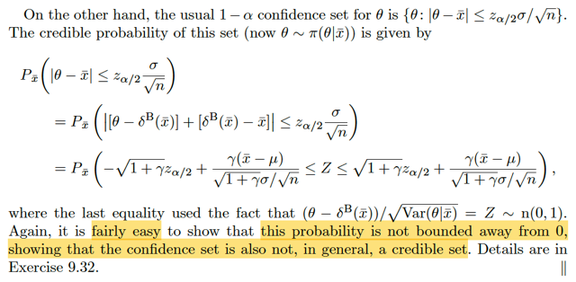</kbd>

> [!NOTE]
> Khúc sau là làm ngược lại: Dùng cái 1-α confidence interval, đem đi tính  credible probability. Chỉ cần hiểu, nó cũng là cái sự stupid. Vì
> khi thiết kế ra 1-α confidence interval, ta đang cói θ fixed. Nên khi đêm tính credible probability lại chính là đang coi θ là biến. Nên dĩ
> nhiên trớt quớt, chả liên quan mẹ gì. Thành ra xác suất credible cũng ko nhũng ko có lí do gì vẫn giữ giá trị 1-α mà còn hành xử rất tào
> lao.
>
>
>
> Rồi, ta sẽ xét một 1-α confidence interval cho θ: {θ: |θ - xbar| ≤ z_α/2 σ/√n}
>
>
>
> Vì sao đây là 1-α confidence interval?
>
>
>
> Chech P_θ(θ ∈ tập này)
>
>
>
> = P_θ(|θ - Xbar| ≤ z_α/2 σ/√n)
>
>
>
> = P_θ(|Xbar - θ| ≤ z_α/2 σ/√n)
>
>
>
> = P_θ(-z_α/2 σ/√n ≤ Xbar - θ ≤ z_α/2 σ/√n)
>
>
>
> = P_θ(-z_α/2 ≤ (Xbar - θ) / σ/√n ≤ z_α/2)
>
>
>
> = P(-z_α/2 ≤ Z ~ Normal(0,1) ≤ z_α/2)
>
>
>
> = 1 - P(Z ≤ -z_α/2) - P(Z ≥ z_α/2)
>
>
>
> = 1 - α/2 - α/2 = 1 - α
>
>
>
> Giờ ta sẽ xét credible interval: {θ: |θ - xbar| ≤ z_α/2 σ/√n} và xem thử credible probability, dĩ nhiên lúc này ta sẽ coi θ như random
> variable có posterior distribution là normal(δB(xbar), Var(θ|xbar)):
>
>
>
> P_xbar(|θ - xbar| ≤ z_α/2 σ/√n)
>
>
>
> = P_xbar(-z_α/2 σ/√n ≤ xbar - θ ≤ z_α/2 σ/√n)
>
>
>
> = P_xbar(xbar - z_α/2 σ/√n ≤ θ ≤ xbar + z_α/2 σ/√n)
>
>
>
> Với θ ~ normal(δB(xbar), Var(θ|xbar))
>
>
>
> ⇨ [θ - δB(xbar)] / √Var(θ|xbar) ~ normal(0,10
>
>
>
> P_xbar(xbar - z_α/2 σ/√n ≤ θ ≤ xbar + z_α/2 σ/√n)
>
>
>
> = P_xbar([xbar - z_α/2 σ/√n] - δB(xbar)] / √Var(θ|xbar) ≤ θ - δB(xbar)] / √Var(θ|xbar) ≤ [xbar + z_α/2 σ/√n] - δB(xbar)] / √Var(θ|xbar))
>
>
>
> = P_xbar([xbar - z_α/2 σ/√n] - δB(xbar)] / Var(θ|xbar) ≤ Z ≤ [xbar + z_α/2 σ/√n] - δB(xbar)] / Var(θ|xbar))
>
>
>
> Biến đổi chút nữa thì sẽ ra như sách thôi

 

