# 9.3 Methods Of Evaluating Interval Estimators

📊 **Progress:** `34` Notes | `35` Screenshots

---

 

## Đánh giá ước lượng khoảng

<kbd>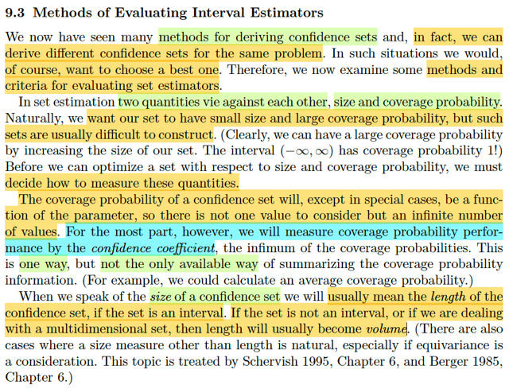</kbd>

> [!NOTE]
> Qua phần này ta sẽ học cách tiêu chí và phương pháp đánh giá các Interval
> Estimator. Dễ hiểu là vì một problem ta có thể có nhiều interval estimator
> nên đương nhiên là ta cần đánh giá xem cái nào tốt hơn cái nào.
>
>
>
> Thế thì với set / interval estimator, ta sẽ có hai đặc điểm quan trọng: kích
> thước và coverage probability. Và ta sẽ đương nhiên là muốn kích thước
> nhỏ nhưng độ bao phủ lớn.
>
>
>
> Vậy thì, ở đây tác giả nhắc lại cho ta rằng, coverage probability trong phần
> lớn trường hợp, thì là function của θ. Nên không thể dùng nó để so sánh
> được. Do đó ta sẽ dùng confidence coefficient. chính là infimum.
>
>
>
> Ý này dễ hiểu thôi. Nhớ lại coverage probability, của một interval estimator
> hay confidence set, là hàm theo θ, defined bởi P_θ(θ ∈ C(**X**)).
>
>
>
> Nhưng mình cũng biết, một số confidence set nếu được construct dựa trên
> pivot quantity, Q(**X**, θ) thì nó lại có distribution không phụ thuộc θ. Khi đó,
> coverage probability của confidence set này sẽ là constant theo θ. Đó là các
> case đặc biệt gs nói tới ở đây.
>
>
>
> Và ta cũng còn nhớ, định nghĩa của confidence coefficient = inf_θ P_θ(θ ∈
> C(**X**)). và nó sẽ ko còn phụ thuộc θ nữa

 

### Tối ưu độ dài khoảng tin cậy

<kbd>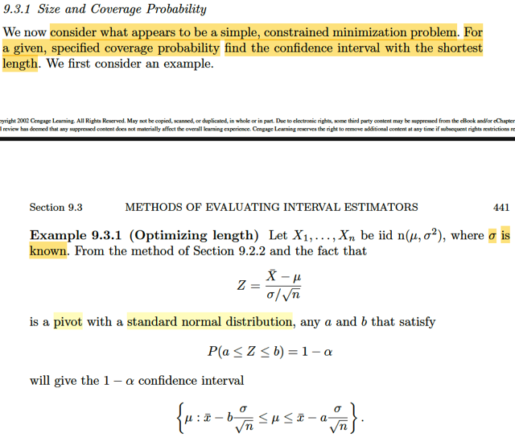</kbd>

> [!NOTE]
> Đại khái là đầu tiên ta sẽ bàn đến một cách tiếp cận mà hóa ra sẽ trở thành bài
> toán tối ưu có ràng buộc:  Cố định giá trị mong muốn của coverage probability và
> tìm cách giảm length tối thiểu.
>
>
>
> Xét ví dụ này, ta có X1,..Xn là iid n(μ, σ^2) với σ đã biết. Thì a, b thỏa P(a ≤ Z ≤
> b) = 1 - α sẽ cho ta một 1-α confidence interval {μ: xbar - b σ/√n} ≤ μ ≤ xbar
> \- a σ/√n
>
>
>
> Thử xem là vì sao?
>
>
>
> Ôn lại: Là vì bữa trước đã học cách xây dựng một confidence set từ một pivot.
> Pivot là một random variable có dạng Q(**X**, θ) nhưng distribution lại ko phụ
> thuộc θ.
>
>
>
> Nên nếu ta thể tìm ra một khoảng a, b sao cho P(a ≤ Q(**X**, θ) ≤ b) = 1-α thì
> điều này sẽ đúng với mọi θ ∈ Θ. Dẫn đến khi xét bài toán testing H0: θ = θ0 thì
> {**x**: a ≤ Q(**x**, θ) ≤ b} chính là một level α acceptance region.
>
>
>
> Vì sup_θ∈Θ0={θ0} P_θ(**X** ∈ R) = P_θ0(**X** ∈ R) = 1 - P_θ0(**X** ∈ Rc)  = 1 - P(a
> ≤ Q(**X**, θ) ≤ b) = 1 - (1 - α) = α. ⇨ test có acceptance region này chính là một
> level α test.
>
>
>
> Và they Tautology theorem, C(**X**) = {θ: a ≤ Q(**X**, θ) ≤ b} chính là 1-α
> confidence  set.
>
>
>
> Để rồi như đã biết, nếu θ là số thực, thì tập này sẽ có dạng là interval.
>
>
>
> Và ta có thể chuyển nó về dạng [θL(**X**, a or b), θU(**X,** b or a)] tùy theo là
> hàm Q monotone increasing hay decreasing.
>
>
>
> Vậy thì ở đây: Ta biết với X1,...Xn là iid normal(μ, σ^2) thì Xbar là normal(μ,
> σ^2/n) Và normal lại là thuộc location scale family với mean là location param,
> standard deviation là scale param.
>
>
>
> Nên theo location scale family thì (Xbar - μ) / (σ/√n) chính là standard member
> ứng với location = 0, scale = 1 → Z = (Xbar - μ) / (σ/√n) chính là normal(0,1). Và
> distribution của nó không còn phụ thuộc μ nữa. Ta sẽ dùng nó làm pivot.
>
>
>
> Nên mới nói, nếu có được a, b sao cho P(a ≤ Z ≤ b) = 1-α
>
>
>
> thì {x: a ≤ Z(**X**, μ) ≤ b} chính là level α acceptance region của bài toán testing
> H0: μ = μ0
>
>
>
> Theo Tautology, {μ: a ≤ Z(**X**, μ) ≤ b} chính là 1-α confidence interval của μ
>
>
>
> Và  a ≤ Z(X, μ) ≤ b ⇔ a ≤ (Xbar - μ) / (σ/√n) ≤ b
>
>
>
> ⇔ a (σ/√n) ≤ Xbar - μ ≤ b (σ/√n)
>
>
>
> ⇔ Xbar - b (σ/√n) ≤ μ ≤ Xbar - a (σ/√n)
>
>
>
> ⇨ tập trên có thể thể hiện bởi [μL(X, b), μU(X,a)] = {μ: Xbar - b (σ/√n) ≤ μ ≤ Xbar -
> a (σ/√n)}
>
>
>
> chính là 1-α confidence interval của μ
>
>
>
> Và phù hợp với nhận định là b sẽ nằm ở chặn dưới, a nằm ở chặn trên do hàm
> Z = (Xbar - μ) / (σ/√n) là hàm monotone decreasing theo μ

 

#### Khoảng tin cậy ngắn nhất

<kbd>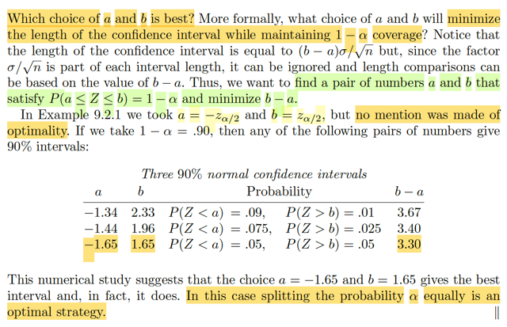</kbd>

> [!NOTE]
> Vậy thì câu hỏi đặt ra là chọn a , b thế nào để thỏa xác suất trên bằng
> 1 - α để ta có một confidence set có coverage probability là 1 - α nhưng 
> length của nó phải ngắn nhất. Và bởi việc cả hai chặn trên dưới đến
> dính đến σ/√n nên việc minimize (b-a) σ/√n sẽ trở thành minimize b-a
>
>
>
> Rồi ông mới nhắc đến trong kết quả bữa trước, ta chọn a, b là -/+ z_α/2
> nhưng chưa chắc nó là optimal.
>
>
>
> Nói lại chút xíu về kết quả này: Đơn giản là như trên, ta đã có:
>
>
>
> Ta muốn tìm a, b soa cho P(a ≤ Z ≤ b) = 1-α 
>
>
>
> Thì đây là diện tích của phần đồ thị của normal(0,1) giữa hai mốc a, b.
> Vậy thì một cách dễ thấy là: chọn b để P(Z > b) = α/2, và a khiến P(Z ≤ a)
> = α/2. khi đó diện tích khúc giữa sẽ là 1 - α/2 - α/2 = 1 - α.
>
>
>
> Thế thì b để P(Z > b) = α/2 thì b chính là z_α/2.
>
>
>
> Còn a để P(Z ≤ a) = α/2 ⇔ 1 - P(Z > a) = α/2 ⇔ P(Z > a) = 1 - α/2
>
>
>
> ⇨ a chính là z_(1-α/2).
>
>
>
> Tới đây ta nói luôn khoảng [z_(1-α/2), z_α/2] là cái cần tìm vẫn đúng.
>
>
>
> Nhưng n(0,1) lại đối xứng qua 0. Có nghĩa là phần diện tích bên phải mốc
> u sẽ bằng phần diện tích bên trái mốc -u (với u dương), Do đó:
>
>
>
> a = -b ⇨ z_(1-α/2) = - z_α/2.
>
>
>
> Nên cái khoảng trên cũng chính là [-z_α/2, z_α/2]
>
>
>
> -----
>
>
>
> Quay lại đây, đại ý cũng dễ hiểu là, ta có thể chọn các mốc khác, để
> xác suất này bằng 1-α, và chúng sẽ cho ra các length khác nhau, và cho
> thấy cái a, b trên chính là cái có lenght nhỏ nhất. Nhưng gs chỉ nói là vì
> về mặt giá trị thì ta thấy vậy, chứ đây ko phải là chứng minh rằng trong case
> này lấy đối xứng lại là tốt nhất.
>
>
>
> -----
>
>
>
> Có thể dễ hiểu là trong case này chắc chắn phải lấy đối xứng thì mới tối
> ưu (length ít nhất). Là vì cái đám mây chuông đối xứng quanh 0. Khi đó
> nếu ta kéo lệch qua trái hay phải hay thậm chí ra khỏi phạm vi cái đỉnh
> thì vì tại đó cái đám mây sẽ mỏng lét, nên để đủ giá trị xác suất 1-α 
> thì ta sẽ phải kéo nó rất dài mới gom đủ.

 

##### Đoạn ngắn nhất PDF đơn đỉnh

<kbd>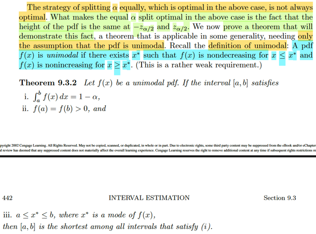</kbd>

> [!NOTE]
> Tiếp theo đại khái là theorem nói về cái này: nếu pdf thuộc dạng
> unimodal (hiểu nôm na là chỉ có 1 đỉnh, nói bằng toán học là tồn tại x*
> khiến đi x ≤ x* thì hàm không giảm, và x* ≤ x thì hàm không tăng) thì khi
> đó. Nếu tại a, b pdf đều dương và bằng nhau. và xác suất x giữa a, b
> (∫a:bf(x)dx) là 1-α. thì [a,b] chính là đoạn có length ngắn nhất trong số
> những đoạn khiến xác suất là 1-α

 

###### Chứng minh xác suất đoạn ngắn nhất

<kbd>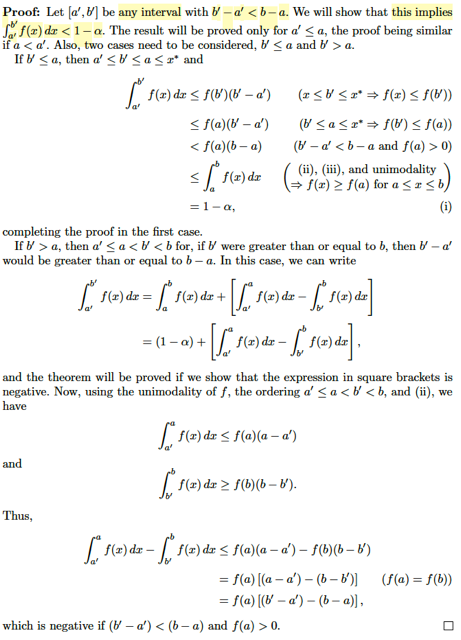</kbd>

> [!NOTE]
> Phần chứng minh thấy vậy mà dễ hiểu thôi ko có gì khó:  Để chứng
> minh [a, b] là đoạn ngắn nhất trong số những đoạn thỏa P(x ∈ [a,b])
> = 1-α ta chỉ cần chứng minh mọi đoạn [a',b'] ngắn hơn [a,b] đều có
> xác suất không đạt.
>
>
>
> Ta xét case a' < a: Khi đó sẽ có hai case để có các thứ tự của các
> mốc như sau
>
>
>
> b' < a ⇨ a' < b' < a < b:
>
>
>
> xét ∫a':b' f(x)dx, chắc chắn nó sẽ ≤ f(b)(b'-a') vì sao:
>
>
>
> vì ∫a':b' f(x)dx là diện tích của phần đồ thị pdf của hàm số từ a' đến
> b'. Mà trong đoạn này hàm non-decresing, do x* là cái mode sẽ
> nằm trong [a,b] như theo đề bài cho. do đó, diện tích này là diện
> tích dưới một đường cong đi lên hoặc đi ngang. Do đó nó phải nằm
> trong diện tích của hình chữ nhật có chiều cao là f(b') (dịện tích là
> f(b)(b'-a').
>
>
>
> Còn cách đơn giản hơn, thì lập luận trên cho ta f(x) ≤ f(b') với  mọi
> x ∈ [a',b'] nên ∫a':b' f(x)dx ≤ ∫a':b' f(b')dx = f(b')(b'-a')
>
>
>
> Vậy ta có ∫a':b' f(x)dx ≤ f(b)(b'-a')
>
>
>
> ≤ f(a)(b-a) do a nằm bên phải b' nên f(b') < f(a) và (b'-a') < (b-a)
>
>
>
> ≤ ∫a:b f(x)dx  do cũng vì tính chất đừong cong non-decreasing nên
>
>
>
> f(a) ≤ f(x) với mọi x từ a đến b
>
>
>
> = 1-α, chứng minh xong cho case này
>
>
>
> a < b' ⇨ a' < a < b' < b
>
>
>
> Xét ∫a':b' f(x)dx = ∫a:b f(x)dx + ∫a':a f(x)dx - ∫b':b f(x)dx
>
>
>
> = (1-α) + ∫a':a f(x)dx - ∫b':b f(x)dx
>
>
>
> Ta sẽ chỉ cần chứng minh ∫a':a f(x)dx - ∫b':b f(x)dx âm thì sẽ suy ra
> vế trái < 1-α
>
>
>
> ∫a':a f(x)dx ≤ f(a)(a-a')
>
>
>
> ∫b':b f(x)dx ≤ f(b)(b-b') ⇨ -∫b':b f(x)dx ≤ -f(b)(b-b')
>
>
>
> ⇨ ∫a':a f(x)dx - ∫b':b f(x)dx ≤ f(a)(a-a') -f(b)(b-b')
>
>
>
> = f(a)(a-a'-b+b') = f(a)(b'-a'-(b-a)) < 0 do đang nói [a',b'] ngắn hơn
> [a,b]
>
>
>
> chứng minh xong

 

###### Khoảng tin cậy tối ưu

<kbd>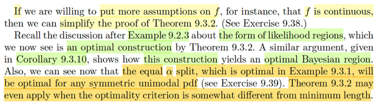</kbd>

> [!NOTE]
> Tiếp theo, đại khái là gs nhắc lại trong ví dụ 9.2.3 (xem link) mình đã xét
> một bài toán mà trong đó ta xây dựng 1-α confidence set bằng cách invert
> một likelihood ratio test. Với ý tưởng chính đại khái là như sau:
>
>
>
> Dựa trên việc một LRT sẽ là cái test có rule reject hay accept H0 dựa trên
> λ(**X**) là likelihood ratio test statistic nhỏ hơn hay lớn hơn một threshold c
> là con số nào đó từ 0 đến 1.
>
>
>
> Do đó, nếu ta có một cái LRT cho bài toán testing H0: θ = θ0, thì ta có thể
> chọn c  sao cho sup_θ∈Θ0={θ0) P_θ(reject H0) = P_θ0(reject H0) =
> P_θ0(λ(**X**) ≤ c) ≤ α
>
>
>
> Rồi, với cái c đó dĩ nhiên cái tập {**x**: λ(**x**) ≤ c} sẽ là level α rejection
> region, cũng như {**x**: λ(**x**) > c} là level α acceptance region A(θ0) của
> bài toán testing H0: θ = θ0.
>
>
>
> Từ đó, theo Tautology theorem, ta sẽ có C(**X**) = {θ: λ(**X**) > c} = {θ:
> L(θ|**x**) / L(θ^_mle|**x**) > c}  sẽ là 1-α confidence  interval cho θ
>
>
>
> Và từ đó, ta mới xét hàm số g(θ) = L(θ|**x**) / L(θ^_mle|**x**), và xét nó là
> hàm theo θ, thì nó sẽ là có dạng một đỉnh núi. Để rồi nếu có thể chuyển {θ:
> L(θ|**x**) / L(θ^_mle|**x**) > c} thành [θL(**x**), θU(**x**)] với g(θL) = g(θU)
>
>
>
> Vậy thì quay lại đây, ĐẠI Ý GS NÓI RẰNG, với việc ta vừa chứng minh
> Theorem 9.3.2 ta sẽ QUAY LẠI KẾT LUẬN RẰNG, CÁI INTERVAL
> [θL(**X**) ≤ θ ≤ θU(**X**)] CÓ ĐƯỢC BẰNG CÁCH LÀM NÀY CHÍNH LÀ
> TỐI ƯU.
>
>
>
> Không phải bằng cách ốp trực tiếp theorem này vào, vì cái hàm g mà ta có
> (và đem cắt ngang mốc c để lấy hai điểm) ko phải là hàm pdf. Nhưng đại ý
> là có thể chứng minh được là theorem này cũng sẽ dẫn đến kết luận cái
> interval đó là tối ưu.
>
>
>
> Và gs nói thêm, qua phần sau, ta sẽ thấy, nó cũng chính là cách làm để
> tạo ra cái Bayesian region (credible set) tối ưu.
>
>
>
> Và cuối cùng, tiếp theo ta sẽ chứng minh rằng với pdf nào unimodal, thì
> cách làm equal α split (tức là chặt bỏ khúc đầu và khúc sau nơi có diện
> tích = α/2)  sẽ đều cho ra đoạn optimal length.

**🔗 See also:** [Khoảng tin cậy đảo ngược LRT](./92_methods_of_finding_interval_estimators.md#node-jw4zng6)

 

###### Tối ưu hóa kỳ vọng độ dài

<kbd>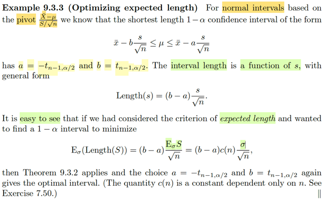</kbd>

> [!NOTE]
> Đại khái là ta còn nhớ, với random sample normal(μ, σ^2), thì có hai statistic
> có thể đóng vai pivot:
>
>
>
> Cái thứ nhất là dựa trên việc Xbar  ~ normal(μ, σ^2/n), thì theo location scale
> family, (Xbar - μ) / σ/√n sẽ là ~ normal(0,1) → distribution không còn phụ thuộc
> μ, σ.
>
>
>
> Cái thứ hai là ta biết (Xbar - μ)/ S/√n ~ tn-1, tức Student 's t distribution bậc tự
> do n-1, cũng có distribution không phụ thuộc μ, σ gì nữa.
>
>
>
> Tuy vậy, ta sẽ **CHỈ** xây dựng interval estimator cho μ **dựa trên cái thứ nhất
> (Xbar - μ) / σ/√n NẾU  BIẾT σ**.
>
>
>
> Vì sao? Bởi lẽ đơn giản là quá trình làm để đưa về cái xác suất liên quan đến
> pivot thì bản thân hai cái khoảng sẽ chứa σ, nếu không biết σ thì làm sao làm
> được.
>
>
>
> Còn nhớ, cách thức để xây dựng một confidence set có coefficient 1-α mong
> muốn, từ pivot Q(X, θ), đó là, ta sẽ tìm a, b sao cho P_θ0(a ≤ Q(**X**, θ0) ≤ b)
> = 1 - α, thì khi đó ta sẽ có thể nói rằng, đối với bài toán testing H0: θ = θ0, thì
> nếu xét A(θ0)  = {**x**: a ≤ Q(**x**, θ0) ≤ b} thì sup_θ∈Θ0={θ0}
>
>
>
> P_θ(**X** ∈A(θ0)_c) = P_θ0(**X** ∈ A(θ0)_c) = 1 - P_θ0(**X** ∈ A(θ0)) = 1 - (1 - α) = α, 
> giúp  kết luận A(θ0) chính là một level α acceptance region của bài toán 
> testing H0: θ=θ0.
>
>
>
> Từ đó, theo Tautology, nếu xây dựng hàm C(**x**) nhận vào x và trả ra tập {θ:
> a ≤ Q(**x**, θ) ≤ b} thì C(**X**) = {θ: a ≤ Q(**X**, θ) ≤ b} chính là 1-α confidence
> set/interval của θ.
>
>
>
> Thế thì với việc ta có pivot Z = (Xbar - μ) / σ/√n thì làm như trên, ta sẽ xây
> dựng tập A(μ0) = {x: a ≤ (Xbar - μ) / σ/√n ≤ b} sao cho P_μ0(**X** ∈ A(μ0)) =
> 1-α
>
>
>
> ⇔ P(a ≤ (Xbar - μ0) / σ/√n ≤ b) = 1 - α
>
>
>
> ⇔ P(a ≤ Z ≤ b) = 1-α
>
>
>
> Bước này ta có thể tìm ra a, b để thỏa cái này, ví dụ a = -z_α/2, b = z_α/2
>
>
>
> Tuy nhiên khi đó C(**X**) = {μ: a ≤ (Xbar - μ) / σ/√n ≤ b}
>
>
>
> = {μ: aσ/√n ≤ Xbar - μ ≤ bσ/√n}
>
>
>
> = {μ: Xbar - bσ/√n ≤ μ ≤ Xbar - aσ/√n}
>
>
>
> là 1-α confidence interval cho μ.
>
>
>
> thì đây lại là khoảng phụ thuộc σ. Tuy rằng **DÙ σ BẰNG BAO NHIÊU THÌ
> ĐÂY VẪN LÀ 1-α CONFIDENCE SET, NHƯNG KHÔNG BIẾTσ THÌ CŨNG VÔ
> NGHĨA.**
>
>
>
> ----- Do đó, khi không biết σ ta sẽ dùng cái pivot thứ hai: (Xbar - μ) / S/√n,
> với S^2 là sample variance (chính xác thì gọi là unbiased sample variance có
> công thức Σi (Xi - xbar)^2 / (n-1), vì E(S^2) = σ^2)
>
>
>
> Cách làm hoàn toàn tương tự, ta sẽ tìm a, b để A(μ0) = {**x**: a ≤ Xbar - μ) /
> S/√n ≤ b} là một level α acceptance region của bài toán testing H0: μ = μ0
>
>
>
> Cũng là P_μ0(a ≤ (Xbar - μ) / S/√n ≤ b} = 1-α
>
>
>
> ⇔ P_μ0(a ≤ T_n-1 ≤ b} = 1-α
>
>
>
> Ta sẽ chon a là mốc sao cho P(T_n-1 ≤ a) = α/2 ⇔ 1 - α/2 = P(T_n-1 ≥ a) ⇨ a
>
>
>
> = tn-1_(1-α/2)
>
>
>
> và chọn b sao cho P(T_n-1 ≥ b) = α/2 ⇨ b = tn-1_α/2
>
>
>
> Khi đó, theo Tautology, C(**X**) = {μ: a ≤ (Xbar - μ) / S/√n ≤ b} sẽ là 1-α confidence 
> set của μ
>
>
>
> = {μ: a ≤ (Xbar - μ) / S/√n, (Xbar - μ) / S/√n ≤ b}
>
>
>
> = {μ: a S/√n ≤ (Xbar - μ), (Xbar - μ) ≤ b S/√n}
>
>
>
> = {μ: μ ≤ Xbar - a S/√n, Xbar - b S/√n ≤ μ}
>
>
>
> = {μ: Xbar - b S/√n ≤ μ ≤ Xbar - a S/√n} chính là 1-α confidence interval cho μ
>
>
>
> Và vì tn-1 cũng có tính đối xứng giống normal nên tn-1_(1-α/2) = -tn-1_α/2
>
>
>
> ⇨ [Xbar - tn-1,α/2 S/√n ≤ μ ≤ Xbar + tn-1,α/2 S/√n]
>
>
>
> Và observed value X = x thì cái khoảng 1-α confidence để vây bắt μ sẽ là 
>
>
>
> [xbar - tn-1,α/2 s/√n ≤ μ ≤ xbar + tn-1,α/2 s/√n]
>
> Tiếp tục, theo như theorem vừa mới học thì cái interval này chính là optimal trong
> số những khoảng có coefficient 1-α, đồng nghĩa nó là ngắn nhất. Vì sao?
>
>
>
> Là vì cách ta chọn a, b chính là thỏa:
>
>
>
> P(a ≤ Tn-1 ≤ b) = 1-α, cũng chính là ∫a:b f(t)dt = 1-α với f(t) là pdf của tn-1
>
>
>
> f(a) = f(b) vì f(-tn-1,α/2) = f(tn-1,α/2) do tính đối xứng của tn-1
>
>
>
> và đỉnh của distribution này nằm ở đâu đó trong đoạn [a, b], lí do là vì đây là một
> uni-modal pdf.
>
>
>
> Nên theo Theorem 9.3.2, đây là đoạn ngắn nhất thỏa P(a ≤ Tn-1 ≤ b) = 1-α → từ
> đó cũng giúp kết luận [Xbar - tn-1,α/2 S/√n ≤ μ ≤ Xbar + tn-1,α/2 S/√n] là đoạn tối
> ưu.
>
>
>
> -----
>
>
>
> Nhưng ở đây đại khái là ta có thể nhìn thấy ở một góc nhìn khác:
>
>
>
> xét interval length = Xbar - a S/√n - (Xbar - b S/√n) = (b - a) S/√n
>
>
>
> Thế thì nếu ta lấy trung bình của interval length: E_μ,σ [(b - a) S/√n]
>
>
>
> Tuy nhiên ta biết (n-1) S^2 / σ^2 ~ Chi-square_n-1, không phụ thuộc μ, nên từ đó
> pdf của S^2 cũng ko phụ thuộc μ:
>
>
>
> Còn nhớ location scale theorem: nếu f(z) là pdf của location scale family của với
> thành viên chuẩn thì X = σZ + μ sẽ thuộc thành viên có location μ, scale σ, có pdf
> fX(x) = f((x-μ)/σ) / σ
>
>
>
> Nên nếu gọi f(c) là pdf của X^2_n-1 ~ Chi-square_n-1, thì dùng theorem trên ta
> sẽ có  thì X^2_n-1 [σ^2/(n-1)] sẽ là thành viên có scale σ^2/(n-1), có pdf sẽ là:
>
>
>
> fS^2(s^2) = f(s^2 / [σ^2/(n-1)]) / σ^2/(n-1)
>
>
>
> Qua đó, cho thấy pdf của S^2 sẽ phụ thuộc σ, không phụ thuộc μ.
>
>
>
> Nên không có lí do gì distribution của S lại phụ thuộc μ. Tất nhiên để chứng minh
> chặt chẽ ta lại dùng transformation theorem: S = √S^2 để xây dựng pdf của S,
> nhưng vì pdf của S^2 không dính đến μ, chỉ dính đến σ nên chắc chắn pdf của S
> cũng vậy.
>
>
>
> Nên ta sẽ viết E_σ [(b - a) S/√n] (ko phụ thuộc μ)
>
>
>
> -----
>
>
>
> Tiếp, đây là tính kì vọng của S, những cái khác coi như hằng số, dùng linearity, ta
> có:
>
>
>
> = (b - a)/ √n E_σ(S)
>
>
>
> Tới đây, nếu ra ngay E_σ(S) = σ thì sẽ là sai, ta chỉ biết E_σ[S^2] = σ^2, vì S^2  là
> unbiased sample variance. Đây là nội dung bài tập 7.5
>
>
>
> Kết quả sẽ là (b - a)c(n) σ/√n với c(n) là constant phụ thuộc n.
>
>
>
> Thì cái chính muốn nói đó là, nếu bây giờ ta giải bài toán minimize cái này, hay
> đúng hơn là minimize trị tuyệt đối của trung bình length |E_σ[length trung bình]|
> thì chính là minimize |b - a| s.t P(a ≤ tn-1 ≤ b) = 1 - α. Và cái theorem 9.3.2 đã
> chứng minh a, b theo cách chọn đó chính là có length nhỏ nhất thỏa điều kiện.
>
>
>
> Vậy, mục đích của gs là kết nối theorem đó với việc quả thật nó khiến ta có kì
> vọng của interval length nhỏ nhất trong bài toán cụ thể này.

**🔗 See also:** [Phân phối t của Student](./53_sampling_from_the_normal_distribution.md#node-isdevob) · [Biến đổi PDF Location-Scale](./35_location_and_scale_families.md#node-cs2rm3i)

 

###### Khoảng tin cậy ngắn nhất β

<kbd>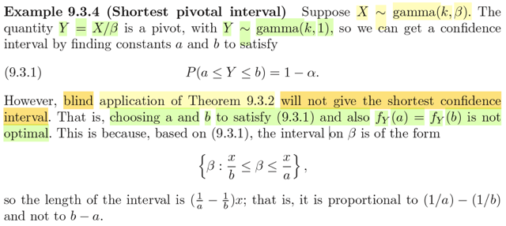</kbd>

> [!NOTE]
> Tiếp, qua ví dụ này, đại khái là cho X ~ γ(k, β) thì X/β sẽ là γ(k,1) (γ là scale
> family với scale là β). Nên distribution của nó không phụ thuộc β, nên nó là
> một pivot, có thể được dùng để xây dựng confidence interval cho β.
>
>
>
> Như thường lệ, nói lại cho nhớ, ta sẽ tìm a , b sao cho:
>
>
>
> P(a ≤ X/β ≤ b) = 1-α mong muốn
>
>
>
> Khi đó sup_β∈Θ0={β0} P_β(reject H0) = P_β0(Reject H0) = 1 - P_β0(Accept
> H0) = 1 - P_β0(X ∈ {x: a ≤ x/β0 ≤ b}) = 1 - P_β0(a ≤ X/β ≤ b) = 1 - (1 - α) = α
>
>
>
> ⇨ A(β0) = {x: a ≤ x/β0 ≤ b} chính là level α acceptance region của bài toán
> testing H0: β = β0
>
>
>
> ⇨ Theo Tautology theorem C(X) = {β: a ≤ X/β ≤ b} chính là 1 - α confidence
> interval của β.
>
>
>
> Thế thì theo Theorem 9.3.2, cái ta đang có chính là gì?
>
>
>
> Ta có pdf của Y = X/β, là γ(k,1) sẽ là một unimodal.
>
>
>
> Nếu ta chọn a, b được chọn theo cách thức fY(a) = fY(b) > 0 sao cho ∫a:b
> fY(y)dy = 1-α thì theorem này cho ta biết đoạn [a,b] là đoạn ngắn nhất (tối ưu)
> khiến ta có P(a ≤ X/β ≤ b) = 1-α.
>
>
>
> TUY NHIÊN, VẤN ĐỀ LÀ:
>
>
>
> Đúng là khi đó, observed X = x, thì [a, b] là đoạn ngắn nhất thỏa P(a ≤ x/β ≤ b)
> = 1-α
>
>
>
> Như khoảng của β lại là [x/b, x/a] lại CHƯA CHẮC LÀ ĐOẠN NGẮN NHẤT.
>
>
>
> đơn giản là vì, length của đoạn này là x/a - x/b. Nên nếu a-b ngắn chưa chắc
> x/a - x/b đã ngắn. 
>
>
>
> Do đó trong trường hợp này, ta không thể dựa vào theorem 9.3.2 mà kết luận
> [x/b, x/a] là optimal 1-α confidence interval cho β được.

 

###### Điều kiện khoảng tin cậy tối ưu

<kbd>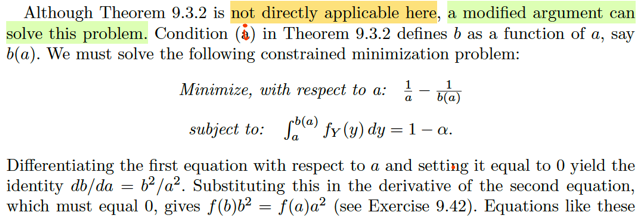</kbd>

> [!NOTE]
> Đại khái là, tuy không thể áp dụng trực tiếp theorem 9.3.2 vào để kết luận
> cái khoảng 1-α confidence TỐI ƯU của β là gì (vì như vừa thấy, không thể
> suy ra [x/b,x/a] là tối ưu được dù [a,b] theo theorem là đoạn ngắn nhất
> thỏa ∫a:bfY(y)dy = 1 - α.
>
>
>
> Nhưng ta có thể vẫn có cách để tìm:
>
>
>
> Vì a, với b phải thỏa ∫a:bfY(y)dy = 1 - α ⇨ FY(b) - FY(a) = 1 - α 
>
>
>
> ⇨ FY(b) = FY(a) + 1 - α 
>
>
>
> ⇨ b = FYinv[FY(a) + 1 - α], coi như b = b(a), là hàm theo a.
>
>
>
> Khi đó, bài toán đặt ra để tìm hai cái chốt của β có length nhỏ nhất sẽ là:
>
>
>
> minimize x(1/a - 1/b) s.t ∫a:bfY(y)dy = 1 - α
>
>
>
> Đây là bài toán tối ưu theo hai biến a, b ràng buộc equality 
>
>
>
> Ta có thể giải theo lối sau: từ ∫a:bfY(y)dy = 1 - α ⇨ b = b(a) như trên. Thế
> b = b(a) vào objective, ta chuyển thành bài toán tối ưu ko ràng buộc
>
>
>
> minimize x(1/a - 1/b(a))
>
>
>
> Điều kiện cần tối ưu bậc nhất:
>
>
>
> d/da [x(1/a - 1/b(a))] = 0
>
>
>
> ⇔ x { d/da (1/a) - d/da [1/b(a))] } = 0
>
>
>
> ⇔ x { (-1/a^2) - d/da [b(a)^-1] } = 0
>
>
>
> ⇔ (-1/a^2) - d/db(a) [b(a)^-1] . d/da b(a) = 0
>
>
>
> ⇔ (-1/a^2) - [-b(a)^-2] . b'(a) = 0
>
>
>
> ⇔ (-1/a^2) + b(a)^-2 . b'(a) = 0
>
>
>
> Thay b(a) = FYinv[FY(a) + 1 - α]
>
>
>
> b'(a) = d/da FYinv[FY(a) + 1 - α]
>
>
>
> Tới đây cần kiến thức đạo hàm của hàm nghịch:
>
>
>
> Xét hàm f và inverse của nó: finv. Ta có finv(f(x)) = x
>
>
>
> Đạo hàm hai vế theo x:
>
>
>
> d/dx finv(f(x)) = d/dx x
>
>
>
> ⇔ d/df(x) finv(f(x)) . d/dx f(x) = 1 | chain rule
>
>
>
> ⇔ d/df(x) finv(f(x)) = 1 / [d/dx f(x)]
>
>
>
> ⇔ d/df(x) finv(f(x)) = 1 / [d/dx f(finv(f(x))]  | vì x = finv(f(x))
>
>
>
> Đặt y = f(x), x = finv(y)
>
>
>
> ⇔ **d/dy finv(y) = 1 / [d/dx f(x)] = 1 / [d/dx f(x)|x=finv(y)] = f'(x)|x=finv(y)**
>
>
>
> Vậy thì ở đây mình đang cần tính b'(a) = d/da Finv[F(a) + 1 - α]
>
>
>
> Đặt z(a) = FY(a) + 1 - α
>
>
>
> b'(a) = d/da  Finv(z(a))
>
>
>
> = d/dz Finv(z) . d/da z(a)
>
>
>
> Xét d/da z(a) = d/da [F(a) + 1 - α] = d/da F(a) + 0 = f(a) (tức fY(a) đó)
>
>
>
> Xét d/dz Finv(z): Áp dụng cái công thức trên: 
>
>
>
> = 1 / d/dx F(x)|x = Finv(z)
>
> = 1/ F'(Finv(z))
>
>
>
> = 1/ f(Finv(z))
>
>
>
> = 1/ f(Finv(FY(a) + 1 - α)) 
>
>
>
> Đây chính là 1/ f(b).
>
>
>
> Vậy b'(a) = 1/ f(b) . f(a) = f(a) / f(b)
>
>
>
> Quay lại thế vào điều kiện cần bậc nhất: ⇔ (-1/a^2) + b(a)^-2 . b'(a) = 0
>
>
>
> ⇔ (-1/a^2) + b(a)^-2 . [f(a) / f(b)] = 0
>
>
>
> Thay b(a) = b lại. (ý là ko cần dùng kí hiệu b(a) để thay cho b nữa)
>
>
>
> ⇔ (-1/a^2) + b^-2 . [f(a) / f(b)] = 0
>
>
>
> ⇔ -1/a^2 + f(a) / b^2 f(b) = 0
>
>
>
> ⇔ f(a) / b^2 f(b) = 1/a^2
>
>
>
> ⇔ a^2 f(a) = b^2 f(b)
>
>
>
> Và đây chính là điều kiện để giải tìm a, b khiến minimize length x/a - x/b
> sao cho vẫn thỏa ∫a:b f(y)dy = 1 - α.

 

###### Khoảng ngắn nhất: Trục và Tổng thể

<kbd>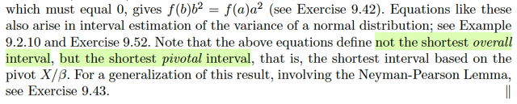</kbd>

> [!NOTE]
> Đại khái là cuối cùng gs lưu ý rằng, cái equation f(b)b^2 = f(a)a^2 chỉ giúp ta
> tìm ra shortest pivotal interval thay vì the shortest overall interval.
>
>
>
> Có nghĩa là sao? Có nghĩa là đây chỉ là interval của β (ý là 1-α confidence
> interval) ngắn nhất trong số những cái được dựa trên pivot X / β thôi.
> CHƯA CHẮC NÓ LÀ CÁI NGẮN NHẤT TRÊN ĐỜI (so với mọi 1-α
> confidence interval của β

 

###### Tính tối ưu liên quan kiểm định

<kbd>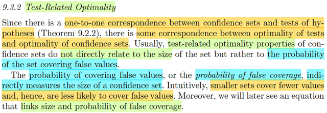</kbd>

> [!NOTE]
> Qua phần này. Đầu tiên đại ý tác giả nói là như ta đã biết, vì hầu như các
> confidence set / interval đều mapping 1-1 với một hypothesis test, nên
> ta có thể liên quan TÍNH TỐI ƯU CỦA MỘT TEST VỚI TÍNH TỐI ƯU CỦA
> CONFIDENCE SET. (hiểu nôm na là, ta có thể đánh giá một cái confidence
> set bằng cách đánh giá độ ưu việt test tương ứng)
>
>
>
> Tác giả nói trước, khi dùng các tính chất của một confidence set mà các tính 
> chất này thuộc loại những tính chất liên quan đến cái hypothesis test, thì
> ta sẽ thấy nó không liên quan trực tiếp đến yếu tố kích thước, mà thay vào
> đó, nó liên quan đến size một cách gián tiếp, thông qua một thước đo khác: 
>
>
>
> Xác suất cái confidence set chứa giá trị sai - probability of false coverage.
>
>
>
> Nói nó liên quan đến size một cách gián tiếp là bởi: nếu một set có xác suất
> mang giá trị sai nhỏ, thì cũng chính là nó càng ngắn.

 

###### Xác suất phủ sai

<kbd>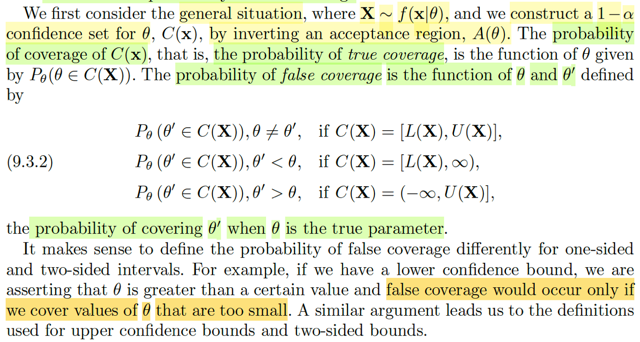</kbd>

> [!NOTE]
> Đầu tiên, gs bàn đến định nghĩa của probability of false coverage:
>
>
>
> Đại khái là như ta biết nếu C(**X**) là một 1-α confidence set của θ, được hình
> thành bằng cách invert một level α acceptance region A(θ0) của bài toán
> testing H0: θ = θ0. Thì theo định nghĩa, coverage probability của nó chính  là
> P_θ(θ ∈ C(**X**)). Thì đây cũng được gọi là PROBABILITY OF TRUE
> COVERAGE.
>
>
>
> tức là, nó mang ý nghĩa là, nếu θ LÀ GIÁ TRỊ THẬT của param, thì xác suất
> cái confidence set này chứa θ là bao nhiêu. (Chú ý, nó ko phải là 1-α nhé, vì
> 1-α là confidence  coefficient, là inf_θ P_θ(θ ∈ C(**X**))
>
>
>
> Và mình cũng hiểu đây là hàm theo θ vì 2 lí do: θ là input, và thứ hai là đây là
> xác suất của C(**X**), một random interval dựa trên random sample **X**, nên
> có thể xác suất này phụ  thuộc θ (trừ khi ta có một interval được xây dựng
> dựa trên pivot)
>
>
>
> Còn bây giờ, ta được học định nghĩa của **PROBABILITY OF FALSE
> COVERAGE**, mang ý nghĩa như sau: với một θ' KHÔNG PHẢI LÀ GIÁ TRỊ
> THẬT của param, và θ MỚI LÀ GIÁ TRỊ THẬT của param, thì xác xuất C(**X**)
> chứa θ' là bao nhiêu.
>
>
>
> Do đó có thể dự đoán công thức của cái này sẽ là P_θ(θ' ∈ C(**X**))
>
>
>
> Tuy nhiên, vì lí do gì đó, người ta chia ra làm 3 case điều kiện với input.
>
>
>
> Nếu C(**X**) có dạng [L(**X**), U(**X**)] thì chỉ xét θ' khác θ
>
>
>
> Nếu C(**X**) có dạng (-inf, U(**X**)] thì chỉ xét θ' > θ
>
>
>
> Nếu C(**X**) có dạng [L(**X**), inf) thì chỉ xét θ' < θ
>
>
>
> Và cái lí do đó là vầy:
>
>
>
> Hiểu đại khái thì, bản chất của việc đặt ra cái này, xác suất cover giá trị sai là
> nhằm tính toán, định lượng MỨC ĐỘ DỞ / YẾU KÉM của confidence set
> C(**X**) bằng cách đó xác suất nó chứa giá trị sai θ'
>
>
>
> Vậy thì nếu C(**X**) = [L(**X**), inf), thì có nghĩa là gì → ta nhớ, có nghĩa là về
> bản chất, cái interval estimator này đang ĐOÁN θ NẰM TRONG ĐÂY: L(**X**)
> < θ < inf Mà như vậy thì việc đánh giá độ dở của C(**X**) CHỈ CÓ NGHĨA nếu
> ta xét mấy  thằng θ' < θ. Vì mọi θ' > θ đương nhiên C(**X**) cũng chứa hết rồi,
> nên đánh giá xác suất nó chứa mấy thằng đó là vô nghĩa. Và bằng cách đánh
> giá bởi các θ'  < θ, thì ta mới làm động tác cố gắng **GIẢM ĐỘ YẾU KÉM**
> của C(**X**) BẰNG CÁCH **NÂNG** L(**X**) **CÀNG SÁT VỚI θ CÀNG TỐT**,
> KHI ĐÓ, SẼ **ĐÁ HẾT MẤY THẰNG θ'** < θ **RA KHỎI** C(**X**) CẢ.
>
>
>
> Tương tự như vậy, nếu C(X) = (-inf, U(**X**)] thì sẽ chỉ có ý nghĩa nếu ta xét
> các θ' > θ.
>
>
>
> Còn với C(X) có dạng [L(**X**), U(**X**)] thì dĩ nhiên ta sẽ xét hết θ' khác θ.

 

###### Tập tin cậy UMA và UMP

<kbd>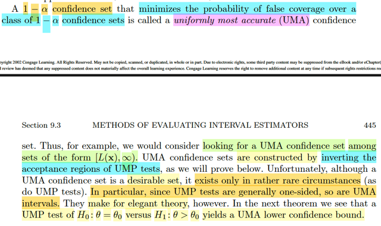</kbd>

> [!NOTE]
> Rồi, thế thì tiếp theo sẽ dẫn đến ĐỊNH NGHĨA CỦA MỘT **UNIFORMLY
> MOST ACCURATE** 1-α confidence set: Là cái confidence set mà xác suất
> false coverage cuả nó là thấp nhất mọi thằng set khác với mọi θ'.
>
>
>
> Có nghĩa là ta vừa define xong khái niệm probability of false coverage, là
> hàm theo θ' và θ.
>
>
>
> Thì C(X) là UMA 1-α confidence set của θ thì với C'(**X**) là 1-α confidence
> set  bất kì của θ. Thì với mọi θ' thì:
>
>
>
> P_θ(θ' ∈ C(X)) ≤ P_θ(θ' ∈ C'(X)) ∀ θ' khác θ / hay < θ hay > θ tùy vào
> C(**X**) và C'(**X**) có dạng nào trong 3 dạng vừa nói.
>
>
>
> Thế thì đại ý gs nói rằng, ngay sau đây mình sẽ chứng minh rằng **BẰNG
> CÁCH INVERT MỘT CÁI UNIFORMLY MOST POWERFUL TEST** ta sẽ có
> một  **UNIFORMLY MOST ACCURATE SET.** 
>
>
>
> Tuy nhiên vì đa phần các **UMP** test **ĐỀU CHỈ CÓ DẠNG LÀ MỘT ONE-SIDE** 
> test, **NÊN UMA set** cũng vậy.

 

###### Định lý 9.3.5: UMA Confidence Set

<kbd>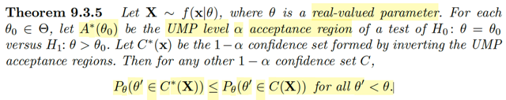</kbd>

> [!NOTE]
> Ôn lại chút xíu những gì học hôm qua: Đại khái là mình qua một tiêu chí khác,
> một cách tiếp cận khác để đánh giá confidence set (cái đầu tiên là dùng
> coverage probability và size, để rồi mình có Theorem 9.3.2 giúp tìm cái có size /
> length nhỏ nhất trong số những cái có cùng coverage probability) đó là dùng
> các tính chất liên quan đến chất lượng của cái test tương ứng. Vì như ta đã
> biết, bất kì cái confidence set (hay còn gọi là interval estimator) để gắn với một
> hypothesis testing.
>
>
>
> Thế thì, ta được học một khái niệm mới - probability of false coverage: Được
> định nghĩa là function của θ' và θ  mang ý nghĩa xác suất confidence set chứa
> θ': P_θ(θ' ∈ C(**X**)) với θ' khác θ hoặc < θ hoặc > θ tùy vào việc C(**X**) có
> dạng [L(**X**), U(**X**)] hay [L(**X**), inf) hoặc (inf, U(**X**)], và nó sẽ thể hiện
> độ yếu kém của một confidence set.
>
>
>
> Từ đó, ta có một thước đo để so sánh đánh giá các confidence set, để rồi cái
> gọi là Uniformly Most Accurate 1-α set sẽ là cái mà xác suất of false coverage
> tại θ' sẽ luôn nhỏ hơn của các 1-α set khác.
>
>
>
> Thế thì đây sẽ là một Theorem làm cơ sở cho việc xây dựng một cái UMA level
> α confidence set: Invert từ một Uniform Most Powerful level α test.
>
>
>
> Còn nhớ khái niệm UMP of class C test: thì nó chính là cái test trong class C
> mà β(θ) ≥ β'(θ) với mọi θ ∈ Θ0c, với β' là power function của cái test bất kì trong
> class C. Mà power function, còn nhớ, được định nghĩa bởi xác suất reject H0
> khi nên reject H0, tức θ ∈ Θ0c: β(θ) = P(reject H0). Nên UMP of level α test 
> mang ý nghĩa là cái test mà khi nên reject H0, thì nó là cái có xác suất reject H0
> cao nhất.
>
> Theorem nói rằng: Với mỗi θ0 ∈ Θ, gọi A*(θ0) là UMP level α acceptance region
> của bài toán testing H0: θ = θ0 vs H1: θ > θ0. Thì khi đó nếu gọi C*(**x**) là 1-α
> confidence set tạo bởi cách inver cái test trên thì nó chính là UMA 1-α
> confidence set, thể hiện bởi:
>
>
>
> P_θ(θ' ∈ C*(**X**)) ≤ P_θ(θ' ∈ C(**X**)) với mọi θ' < θ, với mọi 1-α confidence
> set bất kì C(**X**) khác.

 

###### UMA từ kiểm định UMP

<kbd>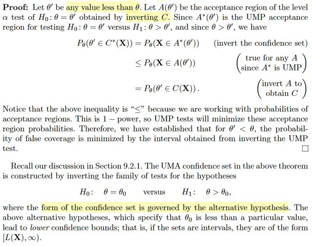</kbd>

> [!NOTE]
> Thử xem chứng minh như thế nào:
>
>
>
> Đầu tiên, dĩ nhiên để chứng minh rằng cái C*(**X**) là UMA 1-α confidence set
> có dạng [L(**X**), inf) thì xác suất of false coverage của nó là nhỏ nhất:
>
>
>
> P_θ(θ' ∈ C*(**X**)) ≤ P_θ(θ' ∈ C(**X**)) ∀θ' < θ.
>
>
>
> với C(**X**) là 1-α confidence set  bất kì.
>
>
>
> ------
>
>
>
> Thế thì, ta có đề bài cho với mọi θ0 ∈ Θ, A*(θ0) là **UMP level α acceptance region** 
> của bài toán testing H0: θ = θ0 vs H1: θ > θ0. 
>
>
>
> Theo định nghĩa của UMP test vừa ôn lại, thì nếu gọi β' là power function của bất kì 
> level α test  khác, và β là power của UMP level α test thì
>
>
>
> Với mọi θ ∈ Θ0c, β(θ) ≥ β'(θ)
>
>
>
> Cũng như vừa ôn lại power function của một test là hàm theo θ được định nghĩa 
> bởi: β(θ) = P_θ(reject H0) 
>
>
>
> Nên power function của UMP test = β(θ) = P_θ(**X** ∈ A*(θ0)_c)
>
>
>
> Và power function của test khác: P_θ(**X** ∈ Rejection region của test đó)
>
>
>
> Gọi A(θ0) là level α acceptance region được tạo bởi invert cái 1-α confidence
> set C(**X**) bất kì, thì power function của cái test này sẽ là:
>
>
>
> P_θ(**X** ∈ A(θ0)_c)
>
>
>
> Và ta có:
>
>
>
> P_θ(**X** ∈ A*(θ0)_c) ≥ P_θ(**X** ∈ A(θ0)_c) ∀θ ∈ Θ0c (cũng là ∀ θ > θ0)
>
>
>
> ⇔ 1 - P_θ(**X** ∈ A*(θ0)) ≥ 1- P_θ(**X** ∈ A(θ0)) ∀θ > θ0
>
>
>
> ⇔ P_θ(**X** ∈ A*(θ0)) ≤ P_θ(**X** ∈ A(θ0)) ∀θ > θ0
>
>
>
> -------
>
>
>
> Tiếp, ôn lại chút về Tautology theorem:
>
>
>
> Nó nói rằng, nếu ta có A(θ0) là level α acceptance region của bài toán testing
> H0: θ = θ0, thì bằng cách đặt C(**x**) = {θ: **x** ∈ A(θ)} thì C(**X**) chính là 1-α confidence
> set của θ.
>
>
>
> Vì khi A(θ0) là level α acceptance region của bài toán testing H0: θ=θ0 thì
> sup_θ∈Θ0={θ0} P_θ(reject H0) ≤ α 
>
>
>
> ⇔ P_θ0(reject H0) = P_θ0(**X** ∈ A(θ0)_c) ≤ α 
>
>
>
> ⇔ 1 - P_θ0(**X** ∈ A(θ0)) ≤ α 
>
>
>
> ⇔ 1 - α ≤ P_θ0(**X** ∈ A(θ0)) 
>
>
>
> ⇔ 1 - α ≤ P_θ0(**X** ∈ A(θ0)) 
>
>
>
> Mà vì cách define C(**x**) = {θ0 ∈ Θ: **x** ∈A(θ0)} nên **x** ∈ A(θ0) ⇔ θ0 ∈ C(**x**)
>
>
>
> ⇨ hai event này là một
>
>
>
> ⇨ P_θ0(**X** ∈ A(θ0)) = P_θ0(θ0 ∈ C(**X**))
>
>
>
> ⇨ 1 - α ≤ P_θ0(θ0 ∈ C(**X**))
>
>
>
> Và như vậy C(**X**) là một confidence set mà với mọi θ0 ∈ Θ thì coverage
> probability đều lớn hơn 1 - α, đồng nghĩa 1 - α ≤ inf_θ0∈Θ P_θ0(θ0 ∈ C(X)) 
> ⇨ 1 - α < confidence coefficient ⇨ đây là 1-α confidence set.
>
>
>
> -----
>
>
>
> Như vậy thì quay lại đây, ta đang có P_θ(**X** ∈ A*(θ0)) ≤ P_θ(**X** ∈ A(θ0)) ∀θ > θ0
>
>
>
> Ta có: P_θ(**X** ∈ A*(θ0)) = P_θ(θ0 ∈ C*(**X**)) 
>
>
>
> P_θ(**X** ∈ A(θ0)) = P_θ(θ0 ∈ C(**X**))
>
>
>
> Vậy P_θ(θ0 ∈ C*(**X**)) ≤ P_θ(θ0 ∈ C(**X**)) ∀θ > θ0 cũng là với mọi θ0 < θ 
>
>
>
> Như vậy, chỉ cần thay kí hiệu θ' cho θ0 thì ta có cái ta cần chứng minh là: 
>
>
>
> P_θ(θ' ∈ C*(**X**)) ≤ P_θ(θ' ∈ C(**X**)) ∀θ' < θ.

**🔗 See also:** [H1 và Dạng Tập Tin Cậy](./92_methods_of_finding_interval_estimators.md#node-y9cjzgq)

 

###### UMA từ Test UMP

<kbd>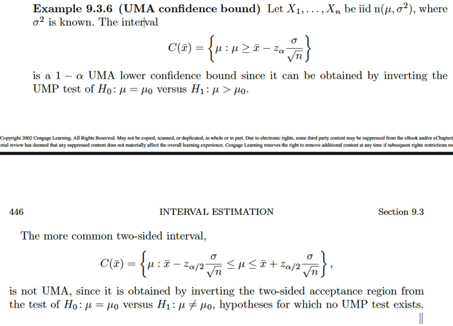</kbd>

> [!NOTE]
> Ví dụ này cho X1,...Xn là iid n(μ, σ^2), với σ^2 đã biết. Interval C(xbar) = {μ: μ > xbar -
> z_α σ/√n} là một 1-α UMA lower confidence bound vì nó có thể được tạo ra bằng cách
> invert một UMP test của bài toán testing H0: μ = μ0 vs H1: μ > μ0.
>
>
>
> Recall kiến thức chút xíu: Bữa giờ mình đã biết thêm định nghĩa của probability of false
> coverage, của một confidence set C(**X**), là một hàm theo θ và θ', define bởi P_θ(θ' ∈
> C(**X**))
>
>
>
> θ' sẽ lần lượt là i) θ' ≠ θ, ii) θ' < θ, iii) θ' > θ ứng với C(**X**) có dạng i) [L(**X**), U(**X**)]
> ii) [L(**X**), inf), iii) (-inf, U(**X**)]
>
>
>
> Và từ đó ta đã biết thế nào là Uniformly Most Accurate set/interval: Đó là set mà xác
> suất of false coverage tại giá trị sai param θ' luôn nhỏ hơn hoặc bằng xác suất of false
> coverage tại đó của bất kì set khác có cùng confidence coefficient:
>
>
>
> Tức là nếu C*(**X**) và C(**X**) lần lượt là UMA 1-α confidence set và 1-α confidence
> set bất kì, thì P_θ(θ' ∈ C*(**X**)) ≤ P_θ(θ' ∈ C(**X**)) với mọi θ và θ'.
>
>
>
> Thế thì hôm qua ta đã học một theorem nói rằng, nếu ta invert một cái UMP level α test
> của bài toán testing H0: θ = θ0 cs H1: θ0 < θ thì ta sẽ có được một UMA 1-α confidence
> set của θ. Có thể chứng minh lại cho nhớ như sau:
>
>
>
> Còn nhớ, ta đã hiểu, một cái test của bài toán Hypothesis testing H0: θ ∈ Θ0 vs H1: θ ∈
> Θ0c, có bản chất chỉ là một cái rule: Dùng một statistic, gọi là test statistic T(**X**) nào
> đó và check với một cái rule nào đó để quyết định rằng sẽ accept hay reject H0. Và với
> cái rule đó, khi xét mọi possible value x của X, ta sẽ chia range X thành hai tập: reject
> region: R = {**x** ∈ range **X**: T(**x**) khiến kết luận reject H0} và R_c là acceptance
> region.
>
>
>
> Thế thì do đó, một cái test thật ra chính là thể hiện qua một cái reject region hay
> acceptance region.
>
>
>
> Rồi, tiếp, ta mới nói về level của một cái test: Được định nghĩa là, nếu gọi một cái test
> có level α, thì tức là xác suất mà nó mắc Type I error: reject H0 khi đáng lí phải accept
> H0, luôn nhỏ hơn hoặc bằng α:
>
>
>
> với mọi θ∈Θ0 P_θ(**X** ∈ R) ≤ α,
>
>
>
> hay sup_θ∈Θ0 P_θ(**X** ∈ R) ≤ α.
>
>
>
> Nếu cái sup này = α thì ta có một size α test.
>
>
>
> Sau đó, ta biết về power function, được định nghĩa là một function θ, define bởi xác suất
> test reject H0: β(θ) = P_θ(**X** ∈ R).
>
>
>
> để rồi, ý nghĩa của cái này chính là, nếu θ thật sự ∈ Θ0c (tức là điều đúng đắn nên làm
> là reject H0, accept H1) thì xác suất mà cái test làm đúng là bao nhiêu. Và do đó, ta
> muốn có một cái test có power mạnh, giúp nó có xác suất cao trong việc làm đúng khi
> nên reject H0, và cũng chính là có xác suất thấp trong việc mắc Type II error: Accept H0
> khi đáng ra phải reject H0 (θ ∈ Θ0c)
>
>
>
> Từ đó ta mới có một cái gọi là UMP class C test, tức uniformly most powerful test của
> class C, được định nghĩa là, nếu gọi β' là power function của mọi test khác trong class
> C, thì β(θ) ≥ β'(θ) với mọi θ ∈ Θ0c: Ý nghĩa: khi điều đúng đắn nên làm là reject H0 (θ
> thật sự là nằm trong Θ0c) thì UMP sẽ là cái có xác suất làm đúng luôn không thua
> những cái khác.
>
>
>
> Và nếu ta xét trong những level α test, thì UMP level α test sẽ là cái có xác suất mắc
> Type I error không quá α nhưng là cái UMP trong đám level α test = đồng nghĩa là cái có
> xác suất mắc Type II error tốt nhất (ko bao giờ lớn hơn mấy cái test khác).
>
>
>
> Rồi, thế thì. Như vậy, quay lại đây, nếu ta xét bài toán testing H0: θ = θ0 vs H1: θ0 < θ
> và TA GỌI A*(θ0) là UMP level α test. Và nên hiểu là ta làm vậy với θ0 bất kì. (tức là
> A*(θ0), là kí hiệu mà ta dùng để nói về acceptance region của cái UMP level α test của
> bài toán testing H0: θ = θ0 vs H1: θ0 < θ với mọi θ0 khác nhau)
>
>
>
> Và ta gọi A(θ0) là một level α test bất kì của bài toán này (ko phải UMP)
>
>
>
> Điều mình cần chứng minh đó là:
>
>
>
> Khi invert A*(θ0), và A(θ0) để có 1-α confidence set C*(**X**) và C(**X**) thì C*(**X**) sẽ
> luôn có probability of false coverage nhỏ hơn hoặc bằng probability of false coverage
> của C(**X**) với mọi θ' < θ và với mọi θ:
>
>
>
> P_θ(θ' ∈ C*(**X**)) ≤ P_θ(θ' ∈ C(**X**)) ∀ θ' < θ
>
>
>
> Thế thì, từ việc A*(θ0) là UMP level α test, như vừa ôn lại, có nghĩa là cái test tạo ra
> A*(θ0) sẽ có xác xuất reject H0 luôn ≥ xác suất reject H0 của các level α test khác khi θ
> thật sự ∈ Θ0c, mà ở đây, là tập {θ: θ0 < θ}, ta có:
>
>
>
> P_θ(**X** ∈ A*(θ0)_c) ≥ P_θ(**X** ∈ A(θ0)_c) ∀ θ ∈ Θ0c = {θ: θ0 < θ}
>
>
>
> ⇔ 1 - P_θ(**X** ∈ A*(θ0)) ≥ 1 - P_θ(**X** ∈ A(θ0)) ∀θ ∈ Θ0c = {θ: θ0 < θ}
>
>
>
> ⇔ P_θ(**X** ∈ A*(θ0)) ≤  P_θ(**X** ∈ A(θ0)) ∀θ ∈ Θ0c = {θ: θ0 < θ} (I)
>
>
>
> Rồi, đến đây, ở trên ta nói C*(**X**) là 1-α confidence set của θ tạo bởi invert level α
> acceptance region A*(θ0) của bài toán testing H0: θ = θ0 vs H1: θ0 < θ.
>
>
>
> Ôn lại một chút lập luận của cái này: Đó là nếu ta có A(θ0) là level α acceptance region
> của bài toán testing H0: θ = θ0, thì bằng cách xây dựng hàm tập c(**x**) nhận vào x, trả
> ra tập c(**x**) = {θ: **x** ∈ A(θ0)}, thì khi đó, C(**X**) chính là một 1-α confidence set của
> θ. Lí do:
>
>
>
> A(θ0) là level α acceptance region của bài toán testing H0: θ = θ0 ⇨ xác suất mắc Type
> I error của cái test sinh ra A(θ0) ko bao giờ vượt quá α:
>
>
>
> Tức là với mọi θ ∈ Θ0 P_θ(reject H0) ≤ α
>
>
>
> ⇔ sup_θ∈Θ0={θ0} P_θ(**X** ∈ A(θ0)_c) ≤ α
>
>
>
> ⇔ P_θ0(**X** ∈ A(θ0)_c) ≤ α
>
>
>
> ⇔ 1 - P_θ0(**X** ∈ A(θ0)) ≤ α
>
>
>
> ⇔ 1 - α ≤ P_θ0(**X** ∈ A(θ0)) (1)
>
>
>
> Đến đây, như đã nói, nếu xây dựng hàm c(**x**) = {θ: **x** ∈ A(θ)}
>
>
>
> thì logic sẽ là nếu **x** ∈ A(θ) chỉ khi θ ∈ c(**x**)
>
>
>
> cũng là **x** ∈ A(θ0) khi và chỉ khi θ0 ∈ c(**x**)
>
>
>
> Do đó, nếu xét  P_θ0(**X** ∈ A(θ0))
>
>
>
> bán chất của nó là P_θ0({**x**: **x** ∈ A(θ0)})
>
>
>
> và vì **x** ∈ A(θ0) ⇔ θ0 ∈ C(**x**) như vừa nói nên: {**x**: x ∈ A(θ0)} = {**x**: θ0 ∈
> c(**x**)}
>
>
>
> ⇨ P_θ0({**x**: **x** ∈ A(θ0)}) = P_θ0({**x**: θ0 ∈ c(**x**)})
>
>
>
> và vế phải chính là P_θ0(C(**X**) chứa θ0) hay P_θ0(θ0 ∈ C(**X**))
>
>
>
> Như vậy (1) ⇔ 1 - α ≤ P_θ0(θ0 ∈ C(**X**)) và vì điều này đúng với mọi θ0 bất kì (tức là
> với θ0 bất kì, nếu ta tạo C(**X**) bằng cách làm vừa rồi xuất phát từ một level α
> acceptance region A(θ0) thì đều dẫn đến kết quả này bất kể θ0 là bao nhiêu). Do đó cái
> ta có chính là:
>
>
>
> ∀θ ∈ Θ 1 - α ≤ P_θ(θ ∈ C(**X**)) ⇨ 1 - α ≤ inf_θ∈Θ P_θ(θ ∈ C(**X**)) giúp theo định
> nghĩa kết luận C(**X**) chính là một 1 - α confidence set của θ
>
>
>
> ------
>
>
>
> Vậy thì ở đây mình đã vừa ôn lại / hiểu lại cái gọi là Tautology Theorem, quay lại (I) là
> cái ta đang có:
>
>
>
> ⇔ P_θ(**X** ∈ A*(θ0)) ≤  P_θ(**X** ∈ A(θ0)) ∀θ ∈ Θ0c = {θ: θ0 < θ} (I)
>
>
>
> thì lập luận y như trên, P_θ(**X** ∈ A*(θ0)) = P_θ({**x**: **x** ∈A*(θ0)}) = P_θ({**x**:
> θ0 ∈ C*(**x**)})
>
>
>
> và cái này chính là P_θ(θ0 ∈ C*(**X**))
>
>
>
> Tương tự, P_θ(**X** ∈ A(θ0)) = P_θ(θ0 ∈ C(**X**))
>
>
>
> Vậy ta có: P_θ(θ0 ∈ C*(**X**)) ≤ P_θ(θ0 ∈ C(**X**)) ∀θ ∈ Θ0c = {θ: θ0 < θ}
>
>
>
> hay P_θ(θ0 ∈ C*(**X**)) ≤ P_θ(θ0 ∈ C(**X**)) ∀θ: θ0 < θ
>
>
>
> Chú ý, điều này đúng VỚI MỌI θ: θ0 < θ, là ý đang nói về θ (ở dưới chữ P)
>
>
>
> ta sẽ nói tiếp: là đề bài cho A*(θ0) là UMP level α của mọi bài toán testing H0: θ = θ0 vs
> H1: θ0 < θ. Nên ta cũng có điều trên đúng với mọi θ0 < θ.
>
>
>
> Chỉ cần thay θ' kí hiệu cho θ0, cái ta có chính là:
>
>
>
> P_θ(θ' ∈ C*(**X**)) ≤ P_θ(θ' ∈ C(**X**)) ∀θ: θ' < θ
>
>
>
> và đây chính là [xác suất false coverage tại θ' của C*(**X**)] ≤ [xác suất of false
> coverage tại θ'của C(**X**)]
>
>
>
> với mọi θ' < θ. ⇨ C*(**X**) chính là UMA 1-α confidence set
>
> Quay lại ví dụ này, trong chap 8 (xem link) ta đã làm ví dụ để thấy test UMP
> level α test (của bài toán testing H0: θ = θ0 vs H1: θ < θ0) sẽ là cái mà có
> rule là reject H0 nếu xbar < c  với c = -z_α(σ/√n) + θ0
>
>
>
> thì đại khái là nếu xét bài toán testing H0: θ = θ0 vs H1: θ > θ0 thì bằng cách
> lập luận tương tự ví dụ đó, ta có thể kết luận cái rule
> sẽ là reject H0 nếu c < xbar, với c = z_α σ/√n + θ0
>
>
>
> Điều này có nghĩa là A*(μ0) = {**x**: xbar > z_α(σ/√n) + μ0}_complement
>
>
>
> = {**x**: xbar ≤ z_α(σ/√n) + μ0}
>
>
>
> chính là UMP level α acceptance region của bài toán testing H0: μ = μ0 vs
> H1: μ > μ0
>
>
>
> Nên invert cái này ta sẽ có UMA 1-α confidence set:
>
>
>
> Tạo C*(**x**) = {μ: **x** ∈ A(μ)}
>
>
>
> = {μ: xbar ≤ z_α (σ/√n) + μ}
>
>
>
> = {μ: xbar - z_α (σ/√n) ≤ μ}
>
>
>
> = {μ: μ ≥ xbar - z_α (σ/√n)}
>
>
>
> ====
>
>
>
> Còn đoạn sau đại ý là C(xbar) này ko phải UMA vì nó được tạo ra bằng
> cách invert một cái 2-sided acceptance region của bài toán testing H0: μ = μ0
> vs H1: μ khác μ0, mà bài toán toán này KHÔNG TỒN TẠI UMP.

**🔗 See also:** [Kiểm định UMP tham số trung bình](./83_methods_of_evaluating_test.md#node-kd3nfb2)

 

###### Tính không chệch kiểm định ước lượng

<kbd>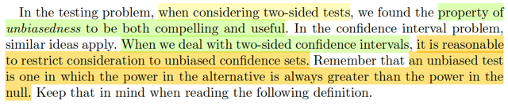</kbd>

> [!NOTE]
> Đại khái gs cho biết khi xem xét các 2-sided test, (tức là các tests của bài
> toán testing H0: θ = θ0, vs H1: θ ≠ θ0) thì tính chất UNBIASEDNESS rất hữu
> ích.
>
>
>
> Và trong bài toán interval estimator thì cũng vậy, khi xét các 2-sided
> confidence interval thì cũng sẽ hữu ích nếu ta xét tính unbiasedness.
>
>
>
> Nhớ lại tính chất **UNBIASEDNESS**: Nôm na ý tưởng / ý nghĩa là vầy: Như ta
> vừa ôn lại, với một test, thì ta muốn nó làm được hai việc: Giảm Type I và
> giảm Type II error.
>
>
>
> Để có Type I error thấp, tức khi θ ∈ Θ0, thì P_θ(reject H0) nên thấp, vì lúc
> này P_θ(reject H0) chính là xác suất mắc Type I error (reject H0 trong khi
> đáng lí phải accept H0).
>
>
>
> Để có Type II error thấp, tức là khi θ ∈ Θ0c, thì P_θ(reject H0) phải nên cao,
> vì  lúc này, nó chính là xác suất làm đúng: accept H1 khi nên accept H1, cũng
> chính là giảm xác suất mắc lỗi loại 2.
>
>
>
> Mà power function của một test, theo định nghĩa là β(θ) = P_θ(reject H0)
>
>
>
> Do đó, ta muốn cái test có β(θ) thấp khi θ ∈ Θ0 và cao khi θ ∈ Θ0c. Đó chính
> là ý tưởng của UNBIASED test: Test có power tại θ trong alternative
> hypothesis (θ ∈ Θ0c) luôn phải l**ớn hơn** power tại θ trong null hypothesis
> (θ ∈ Θ0)
>
>
>
> β(θ') ≤ α ≤ β(θ) với mọi θ' ∈ Θ0 và θ ∈ Θ0c

 

###### Tập tin cậy không chệch

<kbd>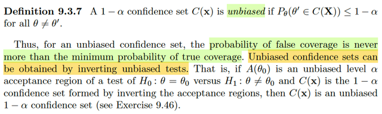</kbd>

> [!NOTE]
> Vừa rồi ta đã ôn lại khái niệm unbiased test, thì bây giờ được học khái
> niệm 1-α unbiased confidence set, được định nghĩa là: Là set mà xác suất
> of false coverage luôn ≤ 1-α.
>
>
>
> Hiểu nôm na là vậy. Với unbiased level α test, tức là ta muốn khi khi θ ∈ Θ0
> thì P_θ(reject H0) nhỏ (≤ α) giúp tránh sai lầm loại I, nhưng khi θ ∈ Θ0c thì
> ta P_θ(reject H0) lớn (≥ α) giúp tránh sai lầm loại II. Nên định nghĩa của
> unbiased level α test là: β(θ) ≤ β(θ') ∀ θ' ∈ Θ0c, θ ∈ Θ0.
>
>
>
> Còn với confidence set, theo định nghĩa 1-α confidence set là set có
> confidence coefficient = 1-α, tức là inf_θ P_θ(θ ∈ C(**X**)) = 1-α, ví dụ 1-α =
> 90% thì mang ý nghĩa là cái confidence set này có xác suất bắt được θ
> (đúng) luôn lớn hơn 90%.
>
>
>
> 1 - α ≤ P_θ(θ ∈ C(**X**))
>
>
>
> Nhưng ta cũng muốn với gía trị sai của θ: θ' thì xác suất mà confidence set
> chứa nó phải thấp, từ đó ta có khái niệm unbiased confidence set như trên.
> Như vậy ta có
>
>
>
> P_θ(θ' ∈ C(**X**)) ≤ 1 - α ≤ P_θ(θ ∈ C(**X**)) với mọi θ' ≠ θ
>
>
>
> ------
>
>
>
> Thế thì, tác giả cho biết, nếu ta invert một unbiased test thì ta sẽ có một
> unbiased confidence set. Cụ thể, nếu A(θ0) là unbiased level α acceptance
> region của bài toán testing H0: θ = θ0 vs H1: θ ≠ θ0 thì C(**x**) được tạo
> bằng cách invert cái test trên sẽ là một 1-α unbiased confidence set của θ.
> Thử chứng minh luôn (đây là nội dung của bài tập 9.46)
>
>
>
> Cần chứng minh: P_θ(θ' ∈ C(**X**)) ≤ 1 - α với mọi θ' ≠ θ
>
>
>
> Ta có A(θ0) là unbiased level α acceptance region của bài toán testing H0:
> θ = θ0 vs H1: θ ≠ θ0 thì theo định nghĩa vừa ôn lại ta có:
>
>
>
> β(θ') ≤ α ≤ β(θ) ∀θ' ∈ Θ0, θ ∈ Θ0c
>
>
>
> β(θ') ≤ α ≤ β(θ) ∀θ' = θ0, θ ≠ θ0
>
>
>
> Để chứng minh, ta chỉ cần tập trung bất đẳng thức sau
>
>
>
> α ≤ β(θ) ∀θ ≠ θ0
>
>
>
> ⇔ α ≤ P_θ(reject H0) ∀θ ≠ θ0
>
>
>
> ⇔ α ≤ P_θ(**X** ∈ A(θ0)_c) ∀θ ≠ θ0
>
>
>
> ⇔ α ≤ 1 - P_θ(**X** ∈ A(θ0)) ∀θ ≠ θ0
>
>
>
> ⇔ P_θ(**X** ∈ A(θ0)) ≤ 1 - α ∀θ ≠ θ0
>
>
>
> Giờ ta sẽ xét C(**X**) được tạo bằng cách invert test này.
>
>
>
> C(**x**) = {θ0: **x** ∈ A(θ0)} ⇨ **x** ∈ A(θ0) ⇔ θ0 ∈ C(**x**)
>
>
>
> P_θ(**X** ∈ A(θ0)) = P_θ({**x**: **x** ∈ A(θ0)}) = P_θ({**x**: θ0 ∈ C(**x**)})
>
>
>
> = P_θ(C(**X**) chứa θ0)
>
>
>
> Vậy từ P_θ(**X** ∈ A(θ0)) ≤ 1 - α ∀θ ≠ θ0
>
>
>
> ⇨ ta có P_θ(θ0 ∈ C(**X**)) ≤ 1-α ∀θ ≠ θ0
>
>
>
> Và với mọi θ0, thì từ unbiased level α acceptance region A(θ0) thì ta đều có
> kết quả này.
>
>
>
> Do đó ∀ θ0 khác θ P_θ(θ0 ∈ C(**X**)) ≤ 1 - α ⇨ theo định nghĩa, giúp kết
> luận C(**X**) là unbiased 1-α confidence set.

 

###### Khoảng tin cậy không chệch

<kbd>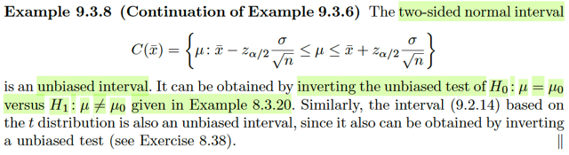</kbd>

> [!NOTE]
> Trong ví dụ 8.3.20, xét bài toán testing H0: θ = θ0 vs H1: θ ≠ θ0, ta có một
> unbiased test, là test có rule sau:
>
>
>
> reject H0 nếu Xbar > σ z_α/2 / √n + θ0 hoặc Xbar < -σ z_α/2 / √n + θ0
>
>
>
> Theo theorem vừa rồi, invert cái này test này sẽ cho ta một cái unbiased
> confidence set:
>
>
>
> Theo cái rule của test trên thì A(θ0) = {**x**: -σ z_α/2 + θ0 ≤ xbar ≤ σ z_α/2 + θ0} 
> chính là unbiased level α acceptance region
>
>
>
> C(**X**) = {θ0: **X** ∈ A(θ0)} = {θ0: -σ z_α/2 + θ0 ≤ Xbar ≤ σ z_α/2 + θ0}
>
>
>
> = {θ0: Xbar - σ z_α/2 ≤ θ0 ≤ Xbar + σ z_α/2}
>
>
>
> Hay dùng μ thay θ0:
>
>
>
> = {μ: Xbar - σ z_α/2 ≤ μ ≤ Xbar + σ z_α/2} chính là unbiased 1-α confidence
> set của μ

**🔗 See also:** [Không tồn tại UMP test](./83_methods_of_evaluating_test.md#node-66jeahy)

 

###### Neyman-shortest: Chiều dài khoảng tin cậy

<kbd>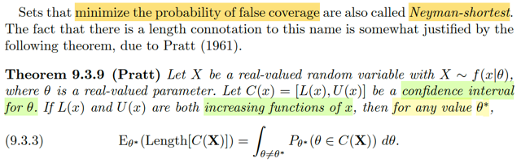</kbd>

> [!NOTE]
> Đại khái là tác giả cho biết, một cái confidence set mà có xác suất false
> coverage tối thiểu sẽ được gọi là Neyman-shortest.
>
>
>
> Tiếp theo sẽ là một theorem đại ý nói về liên hệ giữa CHIỀU DÀI (LENGTH)
> TRUNG BÌNH CỦA MỘT CONFIDENCE INTERVAL và XÁC SUẤT OF
> FALSE COVERAGE.
>
>
>
> Gọi X là rv ~ f(x|θ) với θ là real value param. C(x) = [L(x), U(x)] là confidence
> interval cho θ. Thì nếu L và U đều là increasing function theo x thì với mọi
> θ*:
>
>
>
> E_θ*[Length[C(**X**)]] = ∫_θ≠θ' P_θ*(θ ∈ C(**X**)) dθ
>
>
>
> -----
>
>
>
> Dừng lại chút xiú để hiểu về vế trái:
>
>
>
> Ta đã biết C(X) = [L(X), U(X)] là một random interval, cấu thành bởi hai
> random variable L(X) và U(X). Thì length của C(X), dĩ nhiên dễ hiểu sẽ là
> U(X) - L(X), cũng không có gì khác ngoài việc nó là một function của các
> random variable L(X) và U(X), nên đương nhiên nó (tức Length[C(X)]) cũng
> là một variable, và do vậy việc tính kì vọng là hoàn toàn hợp lệ.
>
>
>
> Thế thì, vì sao lại là E_θ*? À thì là vì đang gọi θ* là giá trị thật của θ, hay  ta
> hiểu, đang nói X ~ f(x|θ*), và do đó distribution của Length[C(X)] cũng sẽ
> phụ thuộc θ*, và từ đó tính kì vọng cũng sẽ ra một hàm theo θ*.
>
>
>
> Còn bên phải, ∫θ≠θ* P_θ*(θ ∈ C(X)) dθ, là cái gì?
>
>
>
> nó chính là tổng mọi xác suất of false coverage, vì tích phân bản chất chỉ
> là tổng, và bên trong tích phân P_θ*(θ ∈ C(X)) với θ khác θ* thì chính là
> xác suất of false coverage, tại θ.
>
>
>
> Vậy nên đây là tổng mọi xác suất of false coverage tại mọi giá trị false của param
>
>
>
> Ở đây hơi thắc mắc, X này ko phải random vector, nên vì sao lại viết chữ
> đậm?

 

###### Chứng minh kỳ vọng độ dài C(X)

<kbd>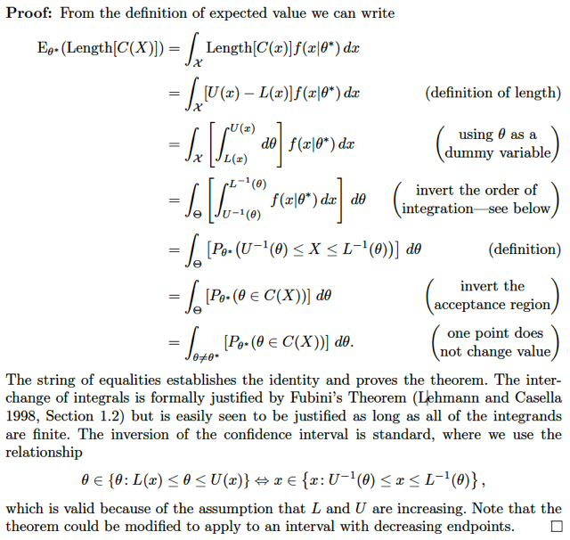</kbd>

> [!NOTE]
> Phần chứng minh cũng ko khó gì:
>
>
>
> Bắt đầu từ vế trái: E_θ*[Length C(X)]
>
>
>
> Như đã nói, đây chỉ là kì vọng của random variable là Length C(X), nên
> giống như LOTUS cho phép tính Eg(X) = ∫_range X [g(x)f(x)dx] với biến liên tục
> hoặc Σ_x ∈ range X [g(x)f(x)], ở đây g(x) chính là U(x) - L(x)
>
>
>
> E_θ*[Length C(X)] = ∫_range X [U(x) - L(x)] f(x|θ*) dx
>
>
>
> Tới đây họ dùng một cái trick: thể hiện U(x) - L(x) = ∫L(x):U(x) 1 dθ
>
>
>
> = ∫_range X [∫L(x):U(x) 1 dθ] f(x|θ*) dx
>
>
>
> = ∫_range X ∫L(x):U(x) dθ f(x|θ*) dx
>
>
>
> = ∫_range X ∫L(x):U(x) f(x|θ*) dx dθ
>
>
>
> Nhớ hồi học 1802, để đổi thứ tự tích phân ta phải lập luận như sau (ở đây nhắc
> đến định lí Fubini, tạm hiểu nó sẽ đảm bảo cho phép việc đổi thứ tự tích phân hợp lệ
> chứ còn cách đổi thì như đã học ở MIT 1802 thôi)
>
>
>
> HIện tại nếu tính tích phân theo θ trước, thì có nghĩa là: với x ∈ range X thì
> θ chạy từ đâu đến đâu: Từ L(x) đến U(x).
>
>
>
> Còn để tính tích phân theo x trước, ta sẽ đặt câu hỏi, với θ cố định trong parameter
> space Θ thì x chạy từ đâu tới đâu. Thì lập luận như sau:
>
>
>
> với θ cố định bất kì, ta luôn có: L(x) ≤ θ ≤ U(x)
>
>
>
> vì L(x), U(x) đồng biến theo x nên L(x) ≤ θ ⇨ x ≤ Linv(θ), θ ≤ U(x) ⇨ Uinv(θ) ≤ x
>
>
>
> Vậy ta có Uinv(θ) ≤ x ≤ Linv(θ) ⇨ với θ fix, thì x chạy từ Uinv(θ) tới Linv(θ).
>
>
>
> → ta có ∫_Θ ∫_Uinv(θ):Linv(θ) f(x|θ*)dx dθ
>
>
>
> =  ∫_Θ P_θ*(Uinv(θ) ≤ X ≤Linv(θ) f(x|θ*)) dθ
>
>
>
> Tới đây, thì ta lại dùng lập luận: Uinv(θ) ≤ X ≤Linv(θ) ⇔ L(X) ≤ θ ≤ U(X), hay θ ∈ C(X)
>
>
>
> ⇨ .. = ∫_Θ P_θ*(θ ∈ C(X)) dθ
>
>
>
> Câu hỏi: vì sao từ range θ ∈ Θ thành θ ≠ θ*, vì θ liên tục nên bỏ tích phân
> trên = ∫_θ=θ* P_θ*(θ ∈ C(X)) dθ = 0
>
>
>
> ⇨ ∫_Θ P_θ*(θ ∈ C(X)) dθ = ∫_θ ≠ θ* P_θ*(θ ∈ C(X)) dθ
>
>
>
> Chứng minh xong.

 

###### Tối ưu chiều dài khoảng tin cậy

<kbd>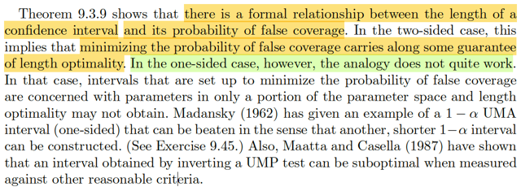</kbd>

> [!NOTE]
> Đại khái là theorem vừa rồi cho ta một mối quan hệ chính thức giữa chiều dài
> của một confidence interval và xác suất of false coverage. Để từ đó nếu xét
> một 2-sided confidence interval thì bằng cách minimize cái xác suất false 
> coverage, ta sẽ có được confidence set tối ưu chiều dài.
>
>
>
> Tuy nhiên với 1-sided confidence set thì không áp dụng.

 

###### Tối ưu khoảng tin cậy Bayesian

<kbd>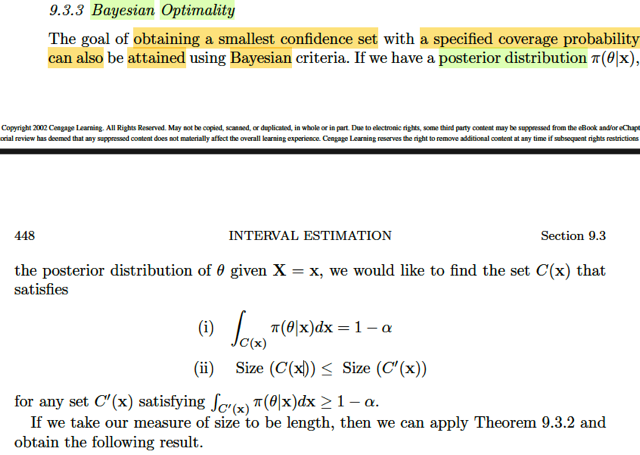</kbd>

> [!NOTE]
> Qua phần Bayesian Optimality, có lẽ nên nói lại chút xíu về bối cảnh
> bữa giờ: Là ta muốn tìm cách đánh giá một confidence set/interval.
>
>
>
> Trong phần đầu tiên 9.3.1 là ta nói về tiêu chí để đánh giá, thông qua
> cái length và xác suất coverage: Ta muốn tìm cái có length nhỏ nhất
> trong số những cái có coverage probability đạt giá trị mong muốn 1-α
> nào đó.
>
>
>
> Sau đó, qua 9.3.2 mới nói về việc đánh giá các confidence set thông
> qua các tính chất có liên quan đến cái test (mỗi confidence set đều
> tương ứng với một cái test), thì từ đó học thêm khái niệm xác suất of
> false coverage. Từ đó theorem vừa rồi, cho biết quan hệ giữa length và
> xác suất false coverage, giúp tối thiểu xác suất này cũng sẽ cho ta
> optimal length.
>
>
>
> Thế thì qua phần này, như đã biết, với Bayesian approach, người ta sẽ
> coi θ như random variable có priori và posteriori là π(θ) và π(θ|x) khi đó
> nếu ta có một tập A thì ta có thể xét xác suất θ ∈ A dựa theo phân phối
> posterior: P(θ ∈ A|**x**) = ∫_A π(θ|**x**)dθ.
>
>
>
> Và tập A này được gọi là một credible set. Ví dụ như xác suất trên bằng
> 1-α thì ta sẽ có một 1-α credible set / interval mang ý nghĩa là ta có thể
> tin rằng, với việc đối xử với θ như random variable thì ta có thể tin rằng
> xác suất nó nằm trong đó, là 1-α.
>
>
>
> Nên nhấn mạnh lần nữa để hiểu rằng, khi nói về việc ta muốn tìm một
> 1-α confidence set C(**X**), thì ta đang nó theo classical approach,
> C(**X**) là random invertal, θ là fixed unknown. Và ta muốn tìm hàm tập
> C(**x**)  sao cho khi áp lên random sample **X,** để có C(**X**) thì
> P_θ(C(**X**) chứa θ) là 1-α.
>
>
>
> Thế thì mục đích cuối cùng vẫn là ta muốn: với observed value **X** =
> **x thì ta có một set / interval C(x) mà xác suất chứa θ là 1-α, hơn nữa
> ta cũng muốn size của nó nhỏ nhất có thể.**
>
>
>
> Vậy thì, nói dài dòng để nhấn mạnh rằng tuy rằng khi đã nói về
> Bayesian trong đó ta coi θ như rv, và với observed value **X** = **x** thì
> ta có distribution của **X**: π(θ|**x**) và nếu có thể tìm được C(**x**)
> sao cho P(θ ∈ C(**x**)) = 1-α  thì tuy là về bản chất ta đang làm rất khác
> nhau. Nhưng về hình thức thì giống: **VẪN LÀ ĐỐI DIỆN VỚI GIÁ TRỊ
> QUAN SÁT ĐƯỢC** **X** = **x NÀO ĐÓ THÌ TA CÓ TẬP / INTERVAL
> C(x) MÀ XÁC SUẤT CHỨA θ LÀ 1 - α**
>
>
>
> Do đó có thể hiểu rằng, mục tiêu vẫn là tìm 1-α confidence set
> C(**X**), nhưng mượn cách tiếp cận Bayesian.
>
>
>
> Nhưng gỉa sử đã tìm ra C(**x**) khiến P(θ ∈ C(**x**)|**x**) = 1-α thì
> không tự động  giúp kết luận C(**X**) một 1-α confidence set, đơn giản
> là vì **KHÔNG CÓ LÍ DO GÌ ĐỂ SUY RA** C(**X**) **LÀ MỘT RANDOM
> SET MÀ** P_θ(C(**X**) chứa θ) luôn = 1-α  với mọi θ.  Nói cách khác,
> tất cả những gì ta có chỉ là, biết rằng với giá trị quan sát **X** = **x**, thì
> xác suất θ nằm trong C(**x**) là 1-α, chấm hết, còn đem cái hàm tập
> C(**x**) này đi áp vào random sample **X** để có C(**X**) thì không có lí
> do gì để kết luận nó sẽ tạo ra một 1-α confidence set.

 

###### Vùng HPD và Likelihood

<kbd>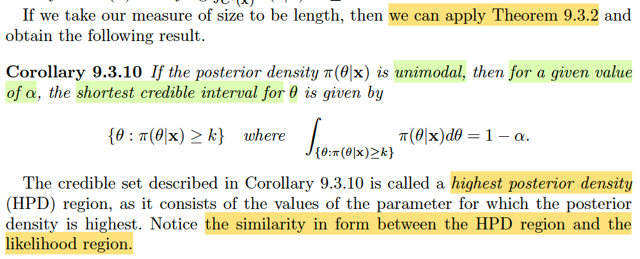</kbd>

> [!NOTE]
> Còn nhớ Theorem 9.3.2, đại khái nói là nếu ta có X ~ pdf f(x) là một
> unimodal distribution và a, b được chọn sao cho f(a) = f(b), và ∫a:b f(x)dx =
> 1-α thì cái đoạn [a,b] chính là đoạn ngắn nhất trong số những đoạn thỏa
> ∫a:b f(x)dx = 1-α
>
>
>
> Vậy áp dụng vào trường hợp này, nếu ta có θ ~ π(θ|x) là một unimodal pdf,
> thì nếu cái khoảng θ: {θ: π(θ|**x**) ≥ k} khiến xác suất P(θ ∈ khoảng đó) =
> 1-α thì khoảng này cũng là interval có length nhỏ nhất thỏa điều này.
>
>
>
> Và nó có tên là **highest posterior density region.**
>
>
>
> Gs lưu ý ta về sự giống nhau giữa HPD region và likelihood region. Là
> sao?
>
>
>
> Còn nhớ, theo định nghĩa: likelihood là function của θ, define bởi L(θ|**x**)
> = f(**x**|θ) mang ý nghĩa là độ hợp lí của θ khi giá trị quan sát được **X** =
> **x**.
>
>
>
> Áp dụng Bayes rule f(**x**|θ) π(θ) = π(θ|**x**) f(**x**) ⇨ f(**x**|θ) = π(θ|**x**)
> f(**x**) / π(θ). Nên L(θ|**x**) = π(θ|**x**) f(**x**) / π(θ)
>
>
>
> Và nếu ta chọn priori là uniform (ta còn nhớ, prior distribution phản ánh
> niềm tin ban đầu của experimenter về distribution của θ, trong trường hợp
> chả biết gì hết, ta sẽ chọn là uniform) ⇨ π(θ) = constant thì π(θ|x) ≥ k
>
>
>
> ⇔ L(θ|**x**) π(θ) / f(**x**) ≥ k
>
>
>
> ⇔ L(θ|**x**) ≥ k f(**x**) / π(θ) = k' nào đó
>
>
>
> Có nghĩa đại khái là HPD region {θ: π(**x**|θ) ≥ k} thì cũng tương đương
> với {θ: L(θ|**x**) ≥ k' nào đó} (đây gọi là likelihood region - ý nghĩa là cái
> region / vùng mà hàm likelihood lớn hơn mức nào đó), nên mới nói hai
> region này similar in form  là vậy

 

###### Vùng HPD Poisson

<kbd>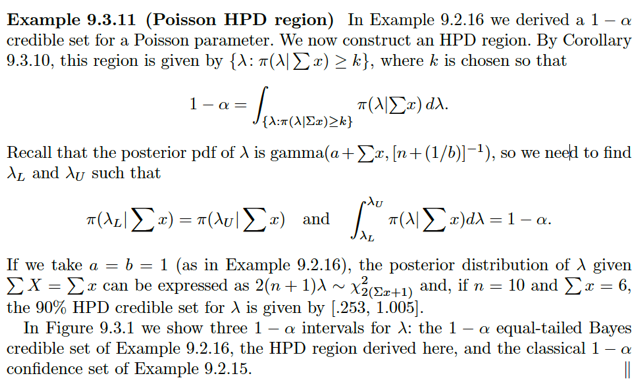</kbd>

> [!NOTE]
> Đại khái là liên hệ với ví dụ 9.2.16, trong đó ta đã derive một cái 1-α
> credible set cho Poison param λ. Thì nay ta sẽ derive cái HPD.
>
>
>
> Thì cứ theo định nghĩa mà làm thôi, cái ta cần tìm để xây dựng được HPD
> là xem posterior distribution π(λ|**x**) là gì, để rồi tìm k sao cho:
>
>
>
> P(λ ∈ {λ: π(λ|**x**) ≥ k}) = 1-α (1)
>
>
>
> Rồi, thì với việc λ có posterior là Γ(Σixi+a, [n+1/b]^-1), là một unimodal pdf,
> ta thì việc tìm k thỏa cũng chính là tìm hai cái mốc λL, λU sao cho:
>
>
>
> **P(λL ≤ λ ≤ λU) = 1-α** và **PDF TẠI ĐÓ BẰNG NHAU**: π(λL|**x**) = π(λU|**x**)
>
>
>
> Giải ra hai cái mốc này ta sẽ có cái HDP (chú ý, cái này phải dùng máy tính
> để giải)
>
>
>
> Còn cái **1-α equal-tailed Bayes credible set** mà nói đến ở đây là gì, thì
> nó chính là cái interval mà ta đã làm ở ví dụ đó, cũng là đi tìm hai cái mốc
> khiến xác suất λ nằm trong đó = 1-α. Nhưng ko cần π(λL|**x**) = π(λU|**x**), ta
> chỉ cần dùng cách **CẮT ĐẦU, CẮT ĐUÔ**I: CHỌN λU sao cho diện tích
> khúc đuôi ở sau (P(λ > λU) = α/2 và λL sao cho diện tích khúc đuôi ở đâu
> cũng = α/2 P(λ < λL) = α/2.
>
>
>
> Thế còn classical interval? Thì là interval tạo bởi cách làm classic, tức là
> ko cói λ như biến ngẫu nhiên mà chỉ là uknonw fixed value (xem link tới 
> ví dụ 9.2.15

**🔗 See also:** [Khoảng tin cậy Poisson Gamma](./92_methods_of_finding_interval_estimators.md#node-ahces3c) · [Khoảng tin cậy Poisson](./92_methods_of_finding_interval_estimators.md#node-z5eytsr)

 

###### Vùng HPD bất đối xứng

<kbd>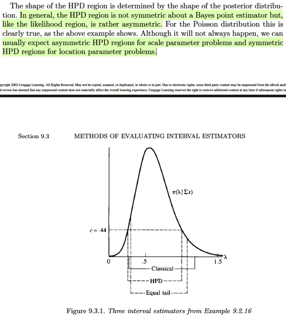</kbd>

 

###### Tối ưu hàm mất mát

<kbd>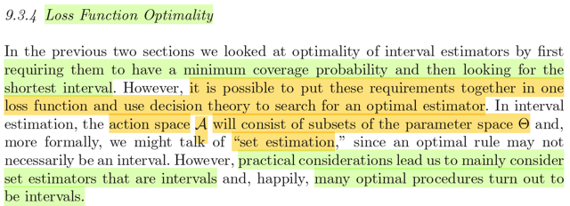</kbd>

> [!NOTE]
> Qua phần này. đại ý mở đầu gs nói là bữa giờ, mình bàn về tính tối ưu của
> interval estimator theo cách tiếp cận là đặt yêu cầu cho coverage
> probability trước, sau đó mới tìm cách có được cái interval ngắn nhất có
> thể.
>
>
>
> Tuy nhiên qua phần này, gs cho biết ta có thể làm theo cách khác, đó là tối
> ưu cùng lúc cả hai tiêu chí và dựa vào decision theory để quyết định  cái
> nào là tốt nhất.
>
>
>
> Trong những chương trước, ví dụ trong chap 7, mình cũng đã thấy cái
> cách để đánh giá point estimator dựa trên loss function. Thì trong đó đã
> biết khái niệm Action space, mà trong bài toán point estimator thì Action là
> một giá trị mà ta đưa ra để estimate cho θ. Còn ở đây, action space sẽ là
> không gian chứa các tập con của parameter space Θ, và một action là một
> subset mà ta dùng để dự đoán sẽ chứa θ.
>
>
>
> Để mang tính khái quát, gs đề nghị ta sẽ dùng "set estimation" thay vì "
> interval estimation", vì ngay cả khi parameter space Θ là trục số thực thì
> subset của nó cũng có thể là những đoạn rời rạc - không thể gọi là interval
> được.

 

###### Hàm quyết định C(x)

<kbd>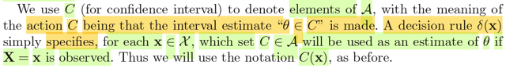</kbd>

> [!NOTE]
> Vài giải thích về kí hiệu sẽ dùng. Như vừa nói, trong bài toán set estimation thì
> Action space là không gian chứa các tập con của Θ, để rồi một action, sẽ là
> một tập mà ta dùng để dự đoán sẽ chứa θ. Kí hiệu là C, thì action C là một suy
> luận rằng: "θ ∈ C".
>
>
>
> Tuy nhiên, việc chọn C nào để suy luận sẽ phụ thuộc, còn dựa trên giá trị quan
> sát thấy **X** = **x**. Nên có thể hiểu là ta sẽ có một **DECISION FUNCTION**
> δ(**x**) nhận vào giá trị possible value **x** của **X** và **trả ra tập C dùng để
> làm thành một suy luận "θ** ∈ **C"**.
>
>
>
> Do đó, ta có thể kí hiệu C(**x**) như bữa giờ hay dùng.
>
>
>
> (ôn lại chút xíu, bữa giờ khi nói đến C(**x**), hay C(**X**) mình đã luôn nghĩ
> rằng nó là một hàm tập, nhận vào giá trị quan sát được x, trả ra một tập dùng
> để tuyên bố rằng sẽ chứa θ. C(**X**) là một random set. Hay nếu C(**x**) có
> dạng [L(**x**), U(**x**)] thì C(**X**) là random interval tạo bởi hai rvs L(**X**) và
> U(**X**). Thì ở đây, chẳng qua mình sẽ chuyển góc nhìn tí xíu, để thấy C(**X**) là
> một function nhận vào giá trị **x** và trả ra một subset C trong Θ

 

###### Hàm mất mát ước lượng khoảng

<kbd>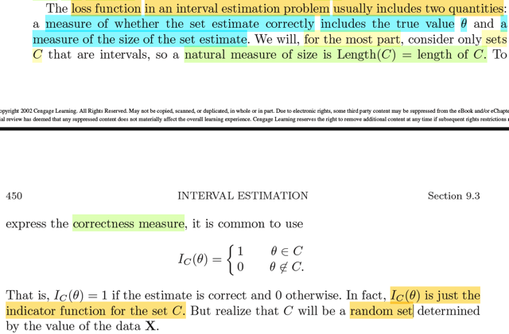</kbd>

> [!NOTE]
> Tới đây họ giới thiệu về loss function trong bài toán interval estimation.
> Nhớ lại một chút, trong bài toán point estimation, ta nhớ loss function sẽ
> phản ánh mức độ nghiêm trọng khi estimation không chính xác so với
> giá trị thực tế. Và ta sẽ quyết định mức độ nghiêm trọng theo nhiều
> cách. Có thể là bình phương của sai số (δ(**X**) - θ)^2 hoặc trị tuyệt đối
> |δ(**X**) - θ|
>
>
>
> (Từ đó nếu lấy kì vọng thì ta có khái niệm MSE của một point estimator
> MSE(δ(**X**) = E_θ[δ(**X**) - θ]^2)
>
>
>
> Thế thì ở bài toán này, loss function sẽ gồm hai phần:
>
>
>
> Phần phản ánh mức độ chính xác trong việc dự đoán set sẽ chứa θ, sẽ
> là một indicator function I_C(θ) trả ra 1 nếu θ ∈ C và 0 nếu θ !∈ C
>
>
>
> (Indicator function thì đã học ở Stat110, ví dụ như Indicator function của
> event A, I_A(.) là hàm trả ra gía trị 1 / 0 tùy theo event A có xảy ra hay
> không.
>
>
>
> Vậy thì I_C(θ) cũng chỉ là function gắn với event A = θ ∈ C mà thôi. Chỉ
> có điều cần lưu ý rằng C là tập random set phụ thuộc **X**, với giá trị cụ
> thể **X** = **x** thì mới có giá trị cụ thể của tập C
>
>
>
> và phần thứ hai phản ánh size của C, mà với interval, thì là length:
> length(C)

 

###### Hàm mất mát và rủi ro

<kbd>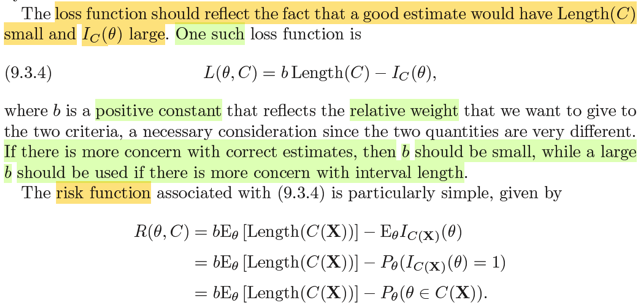</kbd>

> [!NOTE]
> Rồi, đại khái là loss function sẽ có dạng b Length(C) - IC(θ) với b là hằng số
> dương đóng vai trò trọng số giúp điều chỉnh mức độ quan trọng của hai
> objective. (cái này có dạng y như loss function trong machine learning, 
> khi ta combine main loss với regularization loss).
>
>
>
> Ở đây gặp lại khái niệm risk function, còn nhớ, theo định nghĩa, nó chỉ là
> lấy trung bình của loss function, tức là hàm risk function của một estimator
> là hàm define bởi: risk function R(θ, δ(**X**)) = E_θ(L(δ(**X**), θ)).
>
>
>
> Thì nay cũng vậy thôi: 
>
>
>
> R(θ, C(**X**)) = E_θ[L(θ, C(**X**))]
>
>
>
> = E_θ[b Length(C) - IC(θ)]
>
>
>
> = b E_θ[Length(C)] - E[IC(θ)] (linearity)
>
>
>
> Xét E_θ[Length(C)], hiểu cái này thế nào: Ta hiểu C(**X**) là random interval
> thì Length(C(**X**)) có thể coi như áp cái hàm Length(C(**x**)) lên **X** vậy, để thấy
> Length(C(**X**)) cũng chỉ là một random variable để mà tính kì vọng.
>
>
>
> Còn E[IC(θ)], thì hiểu thế này, theo định nghĩa IC(θ) = 1 hoặc 0 tùy theo θ 
> có nằm trong C(**X**) không. cho thấy IC(θ) là một Bernoulli random variable.
> Chỉ có điều cần hiểu yếu tố random đến từ C(**X**) chứ ko phải đến từ θ.
>
>
>
> Theo công thức kì vọng, của discrete rv IC(θ):
>
>
>
> E_θ[IC(θ)] = 1 * P_θ(IC(θ) = 1) + 0 * P_θ(IC(θ) = 0)
>
>
>
> Mà IC(θ) = 1 ⇔ θ ∈ C(**X**)
>
>
>
> .. = P_θ(θ ∈ C(**X**))
>
>
>
> Chú ý, nhắc lại đây là xác suất của một event của đại lượng ngẫu nhiên là C(**X**)
> và **X** thì có phân phối phụ thuộc θ nên xác suất này mới phụ thuộc θ.
>
>
>
> Vậy R(θ, C(**X**)) = b E_θ[Length(C(**X**))] - P_θ(θ ∈ C(**X**))

**🔗 See also:** [Hàm rủi ro ước lượng](./73_methods_of_evaluating_estimators.md#node-qschovu)

 

###### Hàm rủi ro: Kiểm soát Trade-off

<kbd>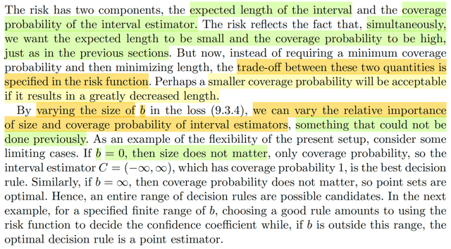</kbd>

> [!NOTE]
> đại ý là với cách tiếp cận này ta có sự linh hoạt hơn rất nhiều trong việc kiểm
> soát trade of giữa hai objective, thay vì phải chọn cái có length nhỏ nhất trong
> số những cái có coverage probability cho trước, ta có thể tối ưu chúng cùng
> lúc bằng cách set up risk function (chọn b). 
>
>
>
> Lấy ví dụ extreme một chút để thấy ví dụ như khi b = 0, khi đó phần size trong
> risk function = 0, khiến việc tối ưu risk sẽ đẩy P_θ(θ ∈ C(**X**)) lên rất lớn (để
> âm của nó xuống rất nhỏ) và điều này sẽ tạo C(**X**) khiến mức bao phủ rất
> rộng (để xác suất bao phủ → 1).
>
>
>
> Ngược lại nếu b = inf, thì phần size rất nặng, khiến muốn giảm risk thì 
> length (C) phải → 0, dẫn đến việc ta sẽ tạo ra một point set

 

###### Rủi ro ước lượng khoảng chuẩn

<kbd>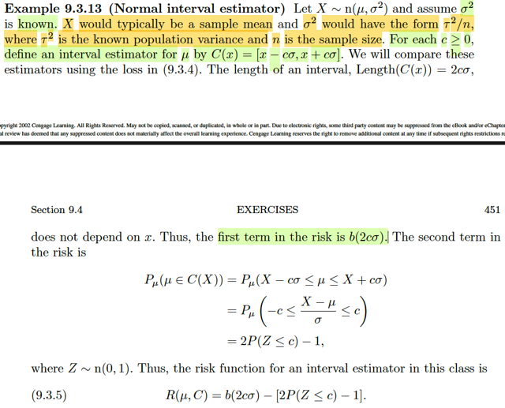</kbd>

> [!NOTE]
> Qua ví dụ này, đại khái là gs gọi X ~ n(μ, σ^2) và cho rằng σ^2 đã biết. Ông
> nói, đại ý là, ta có thể coi cái biến X này là một sample mean nào của một
> random sample nào đó có population distribution là normal(μ, τ^2). Bởi lẽ ta
> đã biết, nếu ta có X1,...Xn là random sample size n ~ normal(μ, τ^2) thì Xbar,
> là sample mean sẽ có distribution là normal(μ, τ^2/n), tức là nếu gọi σ^2 là
> variance của Xbar thì σ^2 = τ^2/n.
>
>
>
> Tóm lại ở đây ta xét X, là một random variable mà xuất thân của nó có thể là
> sample mean của một normal random sample.
>
>
>
> Thế thì, ta mới làm như sau: Với MỖI c > 0, ta mới define C(x) = [x - cσ, x +
> cσ] để có MỘT interval estimator cho μ.
>
>
>
> Dừng lại chút, chỗ này là sao?
>
>
>
> Như đã biết quá rành, với random sample **X** ~ f(**x**|θ), việc thiết lập một
> interval estimator (hay  còn gọi là confidence interval) cho một parameter θ
> là một random interval có dạng  [L(**X**), U(**X**)] dùng để thực hiện một
> suy luận: θ ∈ C(**X**).
>
>
>
> Vậy thì ở đây, có thể coi như ta đang có một random sample size n = 1, có
> distribution normal(μ, σ^2) với σ đã biết. Và ta muốn tạo / tìm interval
> estimator cho μ, và như vừa nói, chúng sẽ là random interval có dạng [L(X),
> U(X)]. Nhưng ở đây, ta sẽ xét một subset của tập "mọi interval có dạng
> [L(X),  U(X)]", đó là tập các interval mà L(X) = X - c*σ, U(X) = X + c*σ.
>
>
>
> Và ta sẽ đánh giá chúng, hay chính xác hơn, là tìm ra cái tối ưu trong đám
> này dựa theo cách tiếp cận Decision Theory
>
>
>
> Ôn lại chút xíu, như đã biết qua việc áp dụng lối tiếp cận này để đánh giá
> Point Estimator δ(**X**) của θ, điểm qua những ý chính, thì ta sẽ xây dựng,
> chọn loss function, là một function của "cái inference", ý là ám chỉ point
> estimator hoặc interval estimator" và θ, mà việc chọn lựa này có thể nhằm
> những mục đích khác nhau. Ví dụ với point estimator, δ(**X**) ta có thể dùng
> squared error loss:  L(δ(**X**), θ) = [δ(**X**) - θ]^2 hoặc absolute error loss:
> L(δ(**X**), θ)) = |δ(**X**) - θ|. Còn ở interval estimator C(**X**), thì vì trong bối
> cảnh bài toán này, ta quan tâm không chỉ một mà là hai yếu tố: size của
> interval, Length(C) tức là length, và việc nó có chứa θ hay ko, biểu diễn
> bởi Indicator function I_C(θ), mang giá trị 1/0 tùy vào θ ∈ C(**X**) có xảy ra
> hay không.Và đây là hai objective có trade off
> nhau, nên ta sẽ kết hợp chúng trong loss function như sau
>
>
>
> L(C(**X**), θ) = b * Length(C(**X**) - I_C(θ),
>
>
>
> trong đó b là hằng số dương đóng vai trò kiểm soát trọng số tương đối giữa
> hai objective.
>
>
>
> Rồi, một cái nữa đó chính là risk function được định nghĩa là ta lấy kì vọng
> của loss function.
>
>
>
> Với point estimator R(δ(**X**), θ) = E_θ[L(δ(**X**), θ)]
>
>
>
> Với interval estimator R(C(**X**), θ) = E_θ[L(C(**X**),θ)]
>
>
>
> = E_θ[b * Length(C(**X**) - I_C(θ)]
>
>
>
> = E_θ[b * Length(C(**X**)] - E[I_C(θ)]
>
>
>
> = b*E_θ[Length(C(**X**)] - P_θ(θ ∈ C(**X**))
>
>
>
> chính là linear combination của trung bình length và coverage probability.
>
>
>
> -----
>
>
>
> Quay lại bài toán này: R(C(**X**), μ)
>
>
>
> = b E_μ[Length(C(**X**))] - P_μ(μ ∈ C(**X**))
>
>
>
> = b E_μ[2cσ] - P_μ(X - cσ ≤ μ ≤ X + cσ)
>
>
>
> Khi ta tính kì vọng, thì dĩ nhiên là tính kì vọng
> của biến ngẫu nhiên, là các statistic, nhưng Length(C(X)) trong trường hợp này
> đã trở thành constant function của X rồi, không phụ thuộc X nữa, nên E_μ[2cσ] 
> = 2cσ
>
>
>
> ..= b 2cσ - P_μ(X - cσ ≤ μ ≤ X + cσ)
>
>
>
> = b(2cσ) - P_μ[-c ≤ (X - μ)/σ ≤ c]
>
>
>
> Xét P_μ[-c ≤ (X - μ)/σ ≤ c]
>
>
>
> Và vì X ~ normal(μ, σ^2), là một thành viên ứng với location μ, scale σ của 
> location scale family, nên theo Location Scale theorem (X - μ)/σ chính là thành
> viên chuẩn, và do đó nó chính là normal(0,1)
>
>
>
> ⇨ P_μ[-c ≤ (X - μ)/σ ≤ c] = P_μ[-c ≤ Z ~ Normal(0,1) ≤ c]
>
>
>
> tất nhiên là ko còn phụ thuộc μ nữa
>
>
>
> = P[-c ≤ Z ~ Normal(0,1) ≤ c]
>
>
>
> Đây là diện tích của phần đồ thị hàm pdf của standard norma, giữa hai mốc -c
> và c, vì tính đối xứng, nên nó sẽ bằng 1 - 2P(Z ≤ -c) cũng bằng 1 - 2P(Z > c)
> = 1 - 2(1 - P(Z ≤ c)) = 1 - 2 + 2P(Z ≤ c) = 2P(Z ≤ c) - 1 như trong sách ghi là vậy.
>
>
>
> Tóm lại ta có R(C, μ) = 2bσ c - [2P(Z ≤ c) - 1]

 

###### Ước lượng khoảng tối ưu

<kbd>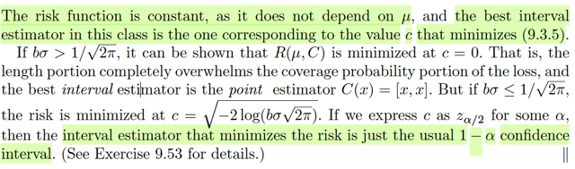</kbd>

> [!NOTE]
> Thế thì cái hàm risk này hóa ra ko còn phụ thuộc μ nữa, R(C, μ) = 2bσ c - [2P(Z ≤
> c) - 1].
>
>
>
> nên việc minimize nó chỉ là minimize over c. Thử giải bài toán:
>
>
>
> Minimize f(c) = 2bσc - 2P(Z ≤ c) + 1 = 2bσ c - 2Φ(c) + 1
>
>
>
> Dùng calculus:
>
>
>
> f'(c) = d/dc f(c) = 2bσ - 2Φ'(c) = 2bσ - 2f(c) với f là pdf của standard normal (như đã
> biết, đạo hàm của cdf là pdf: d/dx F(x) = f(x))
>
>
>
> Điều kiện cần tối ưu bậc nhất: f'(c) = 0
>
>
>
> ⇔ 2b σ - 2f(c) = 0
>
>
>
> ⇔ bσ - (1/√2π) exp(-c^2/2) = 0
>
>
>
> ⇔ bσ = (1/√2π) exp(-c^2/2)
>
>
>
> ⇔ bσ√2π =  exp(-c^2/2)
>
>
>
> ⇔ log[bσ√2π] = -c^2/2
>
>
>
> ⇔ -2log[bσ√2π] = c^2
>
>
>
> Tới đây, nếu -2log[bσ√2π] ≥ 0 thì phương trình có nghiệm
>
>
>
> c = √[-2log[bσ√2π]]
>
>
>
> Còn ngược lại thì phương trình vô nghiệm.
>
>
>
> Xét điều kiện -log[bσ√2π] ≥ 0
>
>
>
> ⇔ log[bσ√2π] ≤ 0
>
>
>
> ⇔ bσ√2π ≤ 1
>
>
>
> ⇔ bσ ≤ 1/√2π
>
>
>
> Xét tiếp, kiểm tra đạo hàm cấp hai của f (second derivative test, đã học trong MIT
> 1802):
>
>
>
> d/dc f'(c) = d/dc [bσ - (1/√2π) exp(-c^2/2)]
>
>
>
> = -(1/√2π) d/dc exp(-c^2/2)
>
>
>
> = -(1/√2π) exp(-c^2/2) d/dc [-c^2/2]
>
>
>
> = -(1/√2π) exp(-c^2/2) (-c)
>
>
>
> = (c/√2π) exp(-c^2/2)
>
>
>
> với c là constant ≥ 0 thì cái này không âm, do đó khi bσ ≤ 1/√2π thì theo stationary
> point c = √[-2log[bσ√2π]] chính là cực tiểu (minimum).
>
>
>
> Lúc này ta có interval estimator cho μ C(X) = [X - √[-2log[bσ√2π]] σ, X +
> √[-2log[bσ√2π]] σ]
>
>
>
> Và gs nói nếu ta thể hiện c này là z_α/2 với α nào đó, thì cái interval [X - c σ, X + c
> σ] chính là một 1-α confidence interval. Là sao?
>
>
>
> Thì, xem confidence coefficient inf_μ P_μ(μ ∈ [X - c σ, X + c σ] bằng bao nhiêu
>
>
>
> = inf_μ P_μ(X - c σ ≤ μ ≤ X + c σ]
>
>
>
> = inf_μ P_μ(-c ≤ (X - μ) / σ ≤ c]
>
>
>
> = inf_μ P_μ(-z_α/2 ≤ Z ≤ z_α/2]
>
>
>
> distribution của Z ko phụ thuộc μ nữa, bỏ μ đi
>
>
>
> = P(-z_α/2 ≤ Z ≤ z_α/2]
>
>
>
> = 1 - P(Z ≤ -z_α/2) - P(Z ≥ z_α/2)
>
>
>
> = 1 - P(Z ≥ z_α/2) - α/2
>
>
>
> = 1 - α/2 - α/2 = 1 - α, như vậy đúng là đây là một 1-α confidence interval (đây
> cũng là bài tập 9.53)
>
>
>
> -----
>
>
>
> Nhưng nếu bσ > 1/√2π thì phương trình tìm stationary point vô nghiệm, đồng
> nghĩa là hàm số f(c) monotone theo c và cũng ko khó để thấy f'(c) luôn ≥ 0 với mọi
> c:, và c thì ≥ 0.
>
>
>
> Do đó hàm f(c) sẽ nhỏ nhất khi c = 0
>
>
>
> Khi đó, interval [X - c σ, X + c σ] sẽ trở thành: [X, X], tức là một POINT SET, hay
> nói cách khác, interval estimator cũng trở thành một point estimator, δ(X) = X.

 

###### Lý thuyết quyết định ước lượng khoảng

<kbd>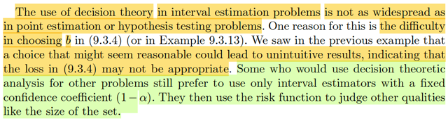</kbd>

> [!NOTE]
> Đại ý là gs cho biết rằng việc dùng decision theory để evaluate interval
> estimation không phổ biến như với bài toán point estimation hoặc
> hypothesis testing. Mà một lí do là việc chọn b có thể dẫn tới những kết quả
> kì cục, cho thấy hàm loss ta thiết lập ko hợp lí
>
>
>
> Gs nói thêm, một số người vẫn dùng cách tiếp cận này, nhưng lại làm theo
> cái kiểu nửa vời, là lại đi fixed coverage probability (1-α) rồi mới đi optimize
> cái size.

 

###### Vấn đề hình dạng tập hợp

<kbd>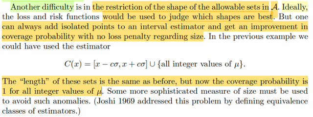</kbd>

> [!NOTE]
> Một vấn đề khó khăn nữa là giới hạn về hình dạng của các set cho phép. Đại ý là, nếu mà lí
> tưởng, thì cách tiếp cận này phải cho phép xác định được đâu là hình dạng lí tưởng (interval
> hay sự chắp nối từ các đoạn) Tuy nhiên cách tiếp cận này lại ko làm được vậy, điển hình là
> nếu như trong cái optimal interval mà ta vừa tìm được [x - c σ, x + c σ], ta xét thêm một "cái"
> khác , là [x - c σ, x + c σ], U {tập mọi point value mang giá trị nguyên của μ} thì về bản chất
> thì cái size của tập sau cũng ko khác gì tập trước (optimal) vì tập các point coi như có length
> = 0. Tuy nhiên, nếu μ mà mang giá trị nguyên thì tập sau sẽ có coverage lớn hơn tập trước.
> Ý muốn nói, đáp án của cách tiếp cận decision theory bị vấn đề

 

